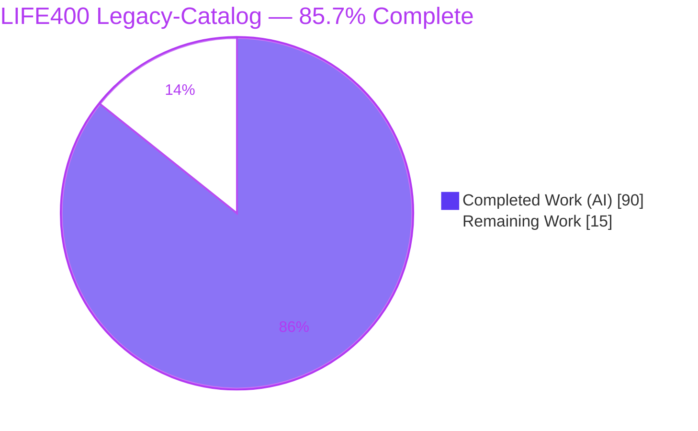
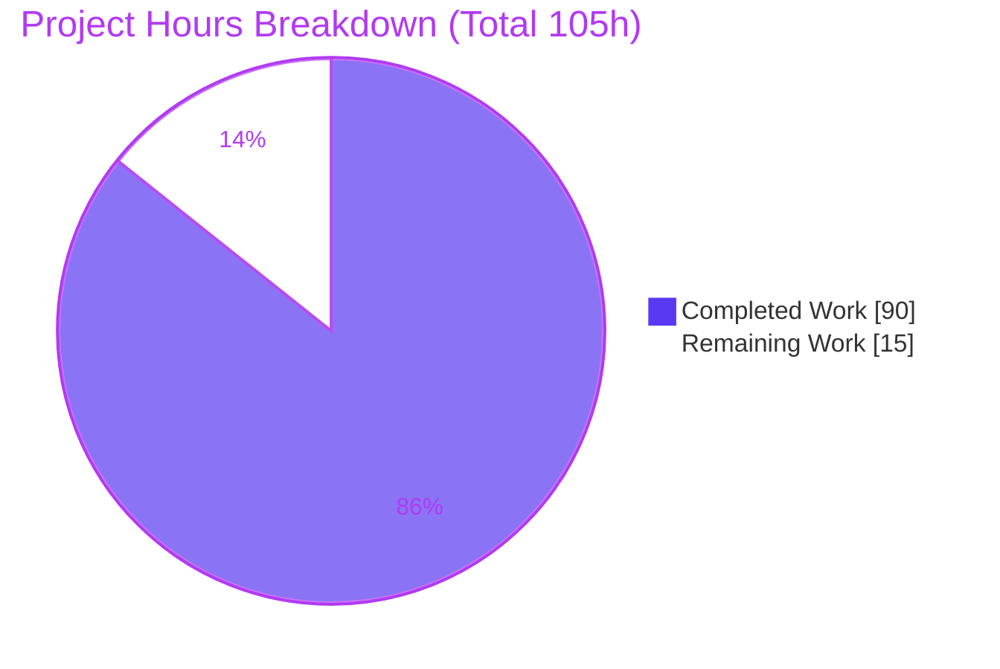
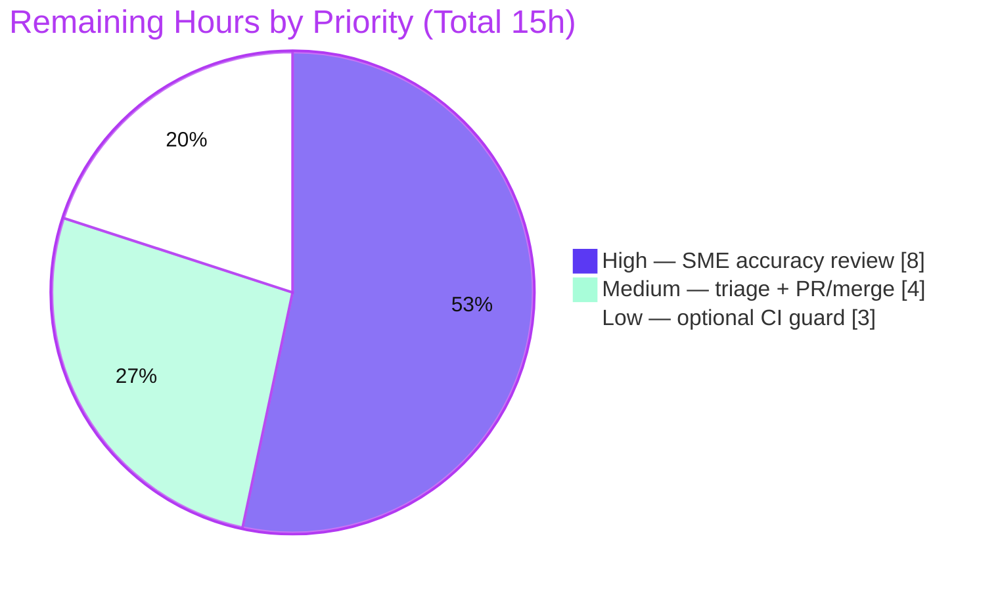

# Blitzy Project Guide — LIFE400 Legacy Domain-Model Catalog

## 1. Executive Summary

### 1.1 Project Overview

LIFE400 is an IBM i (AS/400) ILE COBOL term-life insurance system. This project reverse-engineered its domain model — products, clauses/riders, model properties, and pricing/billing configuration — into a source-cited Markdown catalog under `docs/legacy-catalog/`. The deliverable is exactly seven catalog files, authored from 4,126 lines of COBOL/DDS/CL across 24 source members, carrying 556 line-anchored citations, 8 Mermaid diagrams, and FEEL availability expressions. Target users are engineers and business analysts maintaining or modernizing LIFE400. Business impact: it converts program-centric tribal knowledge into a reusable, entity-centric reference that de-risks future migration. Technical scope is documentation-only — no source is modified and there are no build or runtime dependencies.

### 1.2 Completion Status



| Metric | Value |
|--------|-------|
| **Total Hours** | 105 |
| **Completed Hours (AI + Manual)** | 90 (90 AI + 0 Manual) |
| **Remaining Hours** | 15 |
| **Percent Complete** | **85.7%** (90 / 105 = 6/7) |

> Completion is measured strictly on AAP-scoped work plus path-to-production activities (PA1 methodology). All 90 completed hours were delivered autonomously by Blitzy agents; the 15 remaining hours are human path-to-production tasks (domain sign-off, merge, optional CI). Colors: Completed = Dark Blue `#5B39F3`, Remaining = White `#FFFFFF`.

### 1.3 Key Accomplishments

- Done — **All seven catalogs created and validated** — `products.md`, `product-lines.md`, `risk-objects.md`, `exposures.md`, `clauses.md`, `model-properties.md`, `pricing-and-structure.md` (673 lines total).
- Done — **556 line-anchored citations, 100% resolve** — every `[path:line-range]` / `[copybook:field]` citation points to an existing source path with an in-bounds line range (independently reproduced: 556/556 OK, 0 bad).
- Done — **8 Mermaid diagrams render cleanly** via mmdc 11.16.0 (4 flowchart-family, 2 ER, 2 sequence).
- Done — **100% clause-term classification** — 3 elective riders (`option`) + 4 embedded terms (`package`), 0 unclassified.
- Done — **27 model properties each carry exactly one FEEL availability expression** (8 flagged `INFERRED:` where mapping exceeds literal COBOL).
- Done — **Zero fabrication** — 64 `default`/`min`/`max` cells marked `NOT SPECIFIED IN SOURCE`; absent structures (jurisdiction/blanket/schedule-rating) documented as absent.
- Done — **Source integrity intact** — 0 modifications to any COBOL/DDS/CL/README/.swm member (git-verified).
- Done — **Committed** — 10 commits on branch, HEAD `9ab425c`; single in-scope lint fix (MD012) applied and committed.

### 1.4 Critical Unresolved Issues

No issues block release of the documentation deliverable itself; autonomous validation closed every in-scope finding. The only gate to *authoritative* use is human domain sign-off, which is a planned path-to-production step rather than a defect.

| Issue | Impact | Owner | ETA |
|-------|--------|-------|-----|
| SME/COBOL accuracy sign-off pending (8 `INFERRED:` FEEL expressions + numeric constants) | Catalog cannot be treated as authoritative until inferred semantics are confirmed | Domain SME + COBOL developer | ~8h (see 2.2) |
| Recorded source defects awaiting triage (documented, deliberately **not** remediated) | Pre-existing system risks (e.g., SA-literal truncation, remove-rider `QA-SVC-001`) need remediation tickets — out of documentation scope | Product / Engineering | ~2h (see 2.2) |
| Branch not yet merged to `main` (10 commits ahead) | Deliverable not yet in the mainline | Repository maintainer | ~2h (see 2.2) |

> There are **no compilation errors, no failing tests, and no blocking defects** in any in-scope file.

### 1.5 Access Issues

**No access issues identified.** The deliverable is plain GitHub-Flavored Markdown authored from locally available source; it requires no external systems, service credentials, third-party APIs, or network access. All validation tooling (mmdc, markdown-it-py, Chrome, git-lfs, Python) is pre-present in the environment.

| System/Resource | Type of Access | Issue Description | Resolution Status | Owner |
|-----------------|----------------|-------------------|-------------------|-------|
| (none) | (none) | No access issues identified | N/A | N/A |

### 1.6 Recommended Next Steps

1. **[High]** Schedule a domain SME + COBOL-literate reviewer and complete the accuracy review (verify the 8 `INFERRED:` FEEL expressions, reproduced numeric constants, and a sample of citations) — ~8h.
2. **[Medium]** Triage the ~10 recorded Observations defects into a remediation backlog (decision-only; no code changes) — ~2h.
3. **[Medium]** Approve the pull request and merge the branch to `main` — ~2h.
4. **[Low]** Optionally add a lightweight CI guard (citation path/line-range check + relative-link check + `mmdc` render) to prevent catalog/source drift — ~3h.
5. **[Low]** Pin the catalog to source commit `9ab425c` in a short front-matter/README note to bound citation validity over time.

---

## 2. Project Hours Breakdown

### 2.1 Completed Work Detail

All completed work was performed autonomously by Blitzy agents (Manual = 0h). Each component traces to a specific AAP requirement.

| Component | Hours | Description |
|-----------|-------|-------------|
| Source reverse-engineering & domain discovery | 16 | Analysis of 4,126 lines across 24 members (8 COBOL, 1 copybook, 10 DDS, 5 CL); invocation-graph tracing; extraction of 14 coded (level-88) domains — AAP 0.2.2 |
| `products.md` | 6 | T1001/T2001/T6501 plans, 13-field `PM-PLAN-PARAMETERS` contract, hierarchy diagram, 4 Observations |
| `product-lines.md` | 2 | Single inferred "Term Life" line, 1-to-3 cardinality, hierarchy diagram, `INFERRED:` note |
| `risk-objects.md` | 4 | Insured Life (`PM-INSURED-DETAILS`) attributes, ER diagram |
| `exposures.md` | 5 | Sum Assured / Death Benefit + rider sub-exposures, peril (death), loan-balance offset, ER diagram |
| `clauses.md` | 6 | 3 riders (`option`) + 4 embedded terms (`package`), 100% classification, applicability graph |
| `model-properties.md` | 10 | 27 coded properties, FEEL availability (8 `INFERRED:`), UW-class flowchart, Unclassified subsection |
| `pricing-and-structure.md` | 12 | Rate/modal/fee/referral/settlement/version tables, absent-structure documentation, 2 sequence diagrams |
| Citation authoring & round-trip verification | 6 | 556 citations anchored to exact source line ranges — AAP 0.7.1 universal citation |
| Constraint-compliance enforcement & code-review-fix cycles | 8 | FEEL/classification/no-fabrication enforcement; 3 review rounds + servicing/remove-rider completion (commits `13d8753`/`0dcc40f`/`30f8ef5`/`efeeb75`) |
| Autonomous validation harness & execution | 10 | 10 Python audit scripts + Mermaid render + Markdown render + browser preview + evidence capture |
| Diagram design & render verification, MD012 fix, commits/git hygiene | 5 | 8 Mermaid diagrams; lint fix committed as `9ab425c` |
| **Total Completed** | **90** | |

### 2.2 Remaining Work Detail

All remaining work is human path-to-production effort. No rework is included — autonomous validation found the deliverable clean.

| Category | Hours | Priority |
|----------|-------|----------|
| SME domain + COBOL accuracy review / sign-off (7 catalogs; 8 `INFERRED:` FEEL, numeric constants, citation sample) | 8 | High |
| Observations-defect triage into remediation backlog (~10 documented source defects; decision-only, out of doc scope) | 2 | Medium |
| PR / stakeholder review + merge 10 commits to `main` | 2 | Medium |
| Optional CI guard: Mermaid render + citation path/line-range + relative-link check | 3 | Low |
| **Total Remaining** | **15** | |

### 2.3 Total Hours & Completion Reconciliation

| Bucket | Hours |
|--------|-------|
| Completed (2.1) | 90 |
| Remaining (2.2) | 15 |
| **Total Project Hours** | **105** |

**Completion = Completed / Total = 90 / 105 = 85.7%** (exactly 6/7).

Cross-section integrity: 2.1 (90) + 2.2 (15) = 105 = 1.2 Total Hours; 2.2 Remaining (15) = 1.2 Remaining (15) = Section 7 pie "Remaining Work" (15).

---

## 3. Test Results

All results below originate from Blitzy's autonomous validation logs for this project. There is no traditional unit/integration test framework (this is a documentation deliverable); the "tests" are the autonomous validation audits and rendering checks. Citation and rendering audits were **independently reproduced** during this assessment (556/556 citations OK; 7/7 Markdown to HTML; clean Mermaid SVG).

| Test Category | Framework / Tool | Total Tests | Passed | Failed | Coverage % | Notes |
|---------------|------------------|------------:|-------:|-------:|-----------:|-------|
| Structure & Layout | `structural.py` / `tables.py` | 7 | 7 | 0 | 100% | Exactly 7 files, single H1, balanced fences, no tabs, trailing newline, column-consistent tables |
| Markdown Lint | markdownlint-equivalent (12 rules MD001-MD058) | 12 | 12 | 0 | 100% | 1 MD012 violation found & fixed to clean |
| Citations | `citations.py` | 556 | 556 | 0 | 100% | Every path exists + line-range in-bounds (independently reproduced 556/556) |
| Version Headers | `versions.py` | 24 | 24 | 0 | 100% | Each `VERSION:` header matches its cited line |
| Plan Parameters & Row Association | `values.py` / `assoc.py` | 39 | 39 | 0 | 100% | Anti-transposition: correct age band, max SA, term, maturity, fee per T1001/T2001/T6501 |
| Rating Constants | `values.py` | 17 | 17 | 0 | 100% | Mortality bands (5), modal factors (4) + divisors (4), rider coefficients (3) + cap (1); + gender/smoker/occupation/UW factors verbatim |
| Clause Classification | `constraints.py` | 7 | 7 | 0 | 100% | 3 `option` + 4 `package`, 0 unclassified |
| FEEL Availability | `constraints.py` | 27 | 27 | 0 | 100% | 1 FEEL expression per property; 8 `INFERRED:` |
| No-Fabrication (default/min/max) | `nofab.py` | 64 | 64 | 0 | 100% | Each cell `NOT SPECIFIED IN SOURCE` or cited to `VALUE`/`MOVE`/`PIC`; 0 fabricated |
| Cross-file Links & Anchors | link check | 41 | 41 | 0 | 100% | All relative links + `#anchors` resolve |
| Mermaid Rendering | mmdc 11.16.0 (puppeteer + Chrome) | 8 | 8 | 0 | 100% | Non-empty SVGs; zero parse-error signatures |
| Markdown Rendering | markdown-it-py 4.2.0 | 7 | 7 | 0 | 100% | HTML produced, no exception |
| **Aggregate** | (all autonomous audits) | **809** | **809** | **0** | **100%** | Zero failures across all autonomous audits |

---

## 4. Runtime Validation & UI Verification

This is a documentation deliverable with no application runtime; "runtime" here means document rendering, and "UI" means the rendered catalog as viewed on a Markdown host. All checks below are from Blitzy's autonomous validation and were independently re-confirmed during this assessment.

- ✅ **Operational — Mermaid diagram rendering:** 8/8 diagrams render to clean SVG via `mmdc` 11.16.0; signatures `flowchart-v2` x4, `er` x2, `sequence` x2.
- ✅ **Operational — Markdown rendering:** 7/7 catalogs render to HTML via `markdown-it-py` 4.2.0 with tables enabled; no exceptions.
- ✅ **Operational — Browser preview:** a `file://` gallery was confirmed via full accessibility tree; 3 evidence screenshots saved under `blitzy/screenshots/`.
- ✅ **Operational — Citation round-trip:** 556/556 citations resolve to existing source paths with in-bounds line ranges.
- ✅ **Operational — Cross-file navigation:** 41 relative links + anchors resolve across the seven files.
- ✅ **Operational — Source integrity:** `git diff` over all COBOL/DDS/CL/README/.swm since the base commit returns 0 changes.
- ⚠ **Partial — Domain-accuracy verification:** automated checks confirm structure, citations, and reproduced constants; the 8 `INFERRED:` semantics and `NOT SPECIFIED IN SOURCE` behaviors still require human SME confirmation (see 2.2).
- ❌ **Failing:** none.

---

## 5. Compliance & Quality Review

AAP acceptance constraints mapped to Blitzy's quality benchmarks. Every in-scope benchmark passes; the single fix applied during autonomous validation was a whitespace-only MD012 correction.

| AAP Requirement / Benchmark | Status | Evidence | Progress |
|-----------------------------|:------:|----------|:--------:|
| Exactly seven files; no eighth/index/TOC | Pass | 7 `.md` under `docs/legacy-catalog/`; no index/README in catalog dir | 100% |
| Universal citation on every entry | Pass | 556 citations, 100% resolve | 100% |
| Source-only descriptions; no fabrication | Pass | 64 `NOT SPECIFIED IN SOURCE` cells; 0 fabricated values | 100% |
| `INFERRED:` flagging for beyond-literal logic | Pass | 8 `INFERRED:` prefixes in `model-properties.md`, each citing its source line | 100% |
| 100% clause-term classification (`option`/`package`) | Pass | 3 `option` + 4 `package`, 0 unclassified | 100% |
| FEEL availability per model property | Pass | 27 properties, 1 FEEL expression each | 100% |
| At least 1 Mermaid diagram per catalog | Pass | 8 diagrams (every file >=1; pricing has 2) | 100% |
| Documentation-only; no source modification | Pass | 0 source-member changes (git-verified) | 100% |
| Discovered defects recorded in "Observations" (not fixed) | Pass | Observations subsection in all 7 files; ~10 defects recorded, none remediated | 100% |
| WHY-not-WHAT prose; no boilerplate | Pass | 1-2 sentence business-purpose notes; headers + tables only | 100% |
| Markdown lint hygiene | Pass | 12 rules clean after 1 MD012 fix (`9ab425c`) | 100% |
| Cross-file relative links | Pass | 41 links + anchors resolve | 100% |

**Fixes applied during autonomous validation:** 1 — MD012 (double blank line) collapsed in `pricing-and-structure.md`; whitespace-only, no content/citation/value/diagram changed; re-validated clean.
**Outstanding compliance items:** none in-scope. Human SME sign-off remains as a path-to-production quality gate (not a compliance failure).

---

## 6. Risk Assessment

| Risk | Category | Severity | Probability | Mitigation | Status |
|------|----------|:--------:|:-----------:|------------|--------|
| R1 — Citation line-number drift if any source is later edited (556 line-anchored citations) | Technical | Medium | Medium | Pin catalog to source commit `9ab425c`; optional CI citation-range check | Open (mitigation optional) |
| R2 — Inferred semantics need SME confirmation (8 `INFERRED:` FEEL + `NOT SPECIFIED` behaviors, e.g. WOP/CI benefit triggers) | Technical | Medium | Medium | High-priority SME accuracy review (2.2) | Open (planned) |
| R3 — Unremediated source defects surfaced in Observations (SA-literal truncation into `PIC 9(13)V99`; remove-rider `QA-SVC-001`; unreachable PIC-capacity thresholds; integer `YYYYMMDD` arithmetic; `DLYUPD` stub) | Technical | High | Low | Triage into remediation backlog; out of documentation scope per mandate | Open (documented, deliberately not remediated) |
| R4 — Business-sensitive domain logic exposure (mortality bands, premium formulas, SA limits) if repo is public | Security | Low | Low | Standard repository access controls; no runtime so no injection/authz surface | Mitigated |
| R5 — Diagrams render only on a Mermaid-capable host (raw code shown otherwise) | Operational | Low | Medium | View on GitHub or via `mmdc`; documented in Section 9 | Mitigated (documented) |
| R6 — Relative cross-file link-rot on file rename/move (28+ links) | Operational | Low | Low | Optional link-check CI; keep files co-located | Open (mitigation optional) |
| R7 — SME reviewer availability blocks sign-off (needs domain + COBOL literacy) | Integration | Medium | Medium | Schedule reviewer early | Open (planned) |
| R8 — No automated regression guard by design (AAP mandates no build/CI) leading to silent catalog/source desync over time | Integration | Low | Low | Optional lightweight render/link/citation CI (2.2 item 4) | Open (accepted/optional) |

**Overall posture: LOW-to-MEDIUM.** There are no blocking or critical runtime risks (static documentation, source untouched). Highest attention: R2/R7 (SME verification of inferred semantics), addressed by the High-priority remaining review, and R3 (pre-existing source defects, correctly documented and intentionally not remediated).

---

## 7. Visual Project Status

**Project hours — completed vs remaining** (Completed = Dark Blue `#5B39F3`, Remaining = White `#FFFFFF`):



**Remaining work by priority** (High 8h, Medium 4h, Low 3h = 15h):



**Remaining hours per 2.2 category:**

| Category | Hours | Bar |
|----------|:-----:|-----|
| SME accuracy review | 8 | documentation |
| Observations-defect triage | 2 | documentation |
| PR review + merge | 2 | documentation |
| Optional CI guard | 3 | documentation |
| **Total** | **15** | |

> Integrity: pie "Remaining Work" = 15 = 1.2 Remaining = 2.2 total; pie "Completed Work" = 90 = 1.2 Completed = 2.1 total.

---

## 8. Summary & Recommendations

**Achievements.** The project delivered, autonomously and to specification, a complete entity-centric reference for the LIFE400 term-life domain: seven source-cited Markdown catalogs (673 lines) reverse-engineered from 4,126 lines of ILE COBOL/DDS/CL. Every AAP acceptance constraint is satisfied — exactly seven files, 556 resolving citations, 8 rendering Mermaid diagrams, 100% clause classification, 27 FEEL availability expressions, zero fabricated values, and zero source modifications. Autonomous validation ran 809 discrete checks with zero failures, and this assessment independently reproduced the headline results.

**Remaining gaps.** The project is **85.7% complete** (90 of 105 hours; exactly six-sevenths). The outstanding 15 hours are entirely human path-to-production effort: an 8-hour SME + COBOL accuracy review that confirms the 8 inferred FEEL expressions and reproduced constants, 2 hours to triage the recorded source defects into a remediation backlog, 2 hours to review and merge the branch, and an optional 3-hour CI guard against citation drift.

**Critical path to production.** SME accuracy sign-off, then defect triage, then PR approval and merge to `main`. The optional CI guard can follow at any time.

**Success metrics.** Exactly seven files (met), 100% citation resolution (met), 100% clause classification (met), 8/8 diagram render (met), 0 source changes (met), 0 fabricated values (met).

**Production-readiness assessment.** The documentation artifact is **production-ready as a reference** — it is internally consistent, fully cited, cleanly rendering, and committed. It is **not yet authoritative** for downstream decision-making until the human SME review confirms the reverse-engineered and inferred semantics. There are no blocking defects; the path to full production is short and low-risk.

---

## 9. Development Guide

This deliverable is plain GitHub-Flavored Markdown with embedded Mermaid. **There is no build step and nothing to install to read it.** The commands below were tested in the project environment and are copy-pasteable. Optional tooling is only for local validation/rendering.

### 9.1 System Prerequisites

- **To read the catalogs:** any Git client and a Markdown viewer with Mermaid support (GitHub renders Mermaid natively).
- **For optional local validation/rendering:** Python 3.11+ (tested 3.13.7), Node 18+ (tested v22.23.1), `@mermaid-js/mermaid-cli` (`mmdc`, tested 11.16.0), `markdown-it-py` (tested 4.2.0), and Google Chrome (tested 150). All are pre-present in the Blitzy environment.

### 9.2 Environment Setup

```bash
# Clone and switch to the deliverable branch
git clone <repository-url> life400
cd life400
git checkout blitzy-34f22a1f-a6e2-4643-ba63-128f833d0f99

# The seven catalogs live here — no install, no build:
cd docs/legacy-catalog && ls -1 *.md
```

### 9.3 Previewing the Catalogs

````bash
# Option A — GitHub: open any file on the branch; Mermaid renders automatically.

# Option B — Render one diagram to SVG locally with mmdc:
printf '%s\n' '{ "args": ["--no-sandbox","--disable-dev-shm-usage"] }' > /tmp/puppeteer.json
python3 - <<'PY'
import re
t=open("products.md",encoding="utf-8").read()
open("/tmp/diagram.mmd","w").write(re.search(r"```mermaid\n(.*?)```",t,re.S).group(1))
PY
PUPPETEER_EXECUTABLE_PATH=/usr/bin/google-chrome \
  mmdc -i /tmp/diagram.mmd -o /tmp/diagram.svg -p /tmp/puppeteer.json

# Option C — Render Markdown to HTML with markdown-it-py:
python3 - <<'PY'
from markdown_it import MarkdownIt
md=MarkdownIt("commonmark").enable("table")
open("/tmp/products.html","w").write(md.render(open("products.md",encoding="utf-8").read()))
print("wrote /tmp/products.html")
PY
````

### 9.4 Validating the Deliverable (offline, reproducible)

Run from the repository root. Each command was verified to pass.

```bash
# 1) Exactly seven files, no eighth/index
find docs/legacy-catalog -maxdepth 1 -name '*.md' | wc -l        # -> 7
ls docs/legacy-catalog | grep -iE 'index|toc|readme' || echo OK  # -> OK

# 2) Single H1 per file
for f in docs/legacy-catalog/*.md; do grep -c '^# ' "$f"; done   # -> all 1

# 3) Eight Mermaid diagrams
grep -rc 'mermaid' docs/legacy-catalog/*.md                      # -> sums to 8

# 4) Source integrity (0 = untouched since base commit)
git diff --name-only 9a63a7b HEAD -- QCPYSRC QCBLLESRC QDDSSRC QCLSRC README.md .swm | wc -l  # -> 0

# 5) Citation path + line-range audit (556/556 OK, 0 bad)
python3 - <<'PY'
import re, glob, os
cite=re.compile(r'\[([A-Za-z0-9_./]+\.(?:cbl|cpy|pf|lf|clle|dspf|prtf|md)):L(\d+)(?:-L(\d+))?\]')
tot=ok=0; cache={}
def n(p): return cache.setdefault(p, sum(1 for _ in open(p,encoding="utf-8",errors="replace")) if os.path.exists(p) else -1)
for f in glob.glob("docs/legacy-catalog/*.md"):
    for m in cite.finditer(open(f,encoding="utf-8").read()):
        tot+=1; a=int(m.group(2)); b=int(m.group(3) or m.group(2))
        if n(m.group(1))>0 and 1<=a<=b<=n(m.group(1)): ok+=1
print(f"citations {ok}/{tot} OK")
PY

# 6) Verify a cited range round-trips to source
sed -n '224,272p' QCBLLESRC/NBUWMNT.cbl     # the EVALUATE PM-PLAN-CODE plan block
```

### 9.5 Example Usage — Reading Path

- Start at **`products.md`** (the three plans), then **`product-lines.md`** (their inferred parent line).
- **`risk-objects.md`** and **`exposures.md`** describe the insured life and its sum-assured/rider exposures.
- **`clauses.md`** links riders and embedded terms back to products and exposures.
- **`model-properties.md`** and **`pricing-and-structure.md`** reference all of the above (coded domains, FEEL availability, rating).
- FEEL expressions read as `if ... then ... else` with inclusive intervals, e.g. `x in [18..60]`. An `INFERRED:` prefix means the mapping goes beyond literal COBOL and cites the ambiguous line.

### 9.6 Troubleshooting

- **Diagrams appear as raw code:** the viewer lacks Mermaid support — open on GitHub or render with `mmdc`.
- **`mmdc` sandbox/Chrome error:** set `PUPPETEER_EXECUTABLE_PATH=/usr/bin/google-chrome` and pass `--no-sandbox --disable-dev-shm-usage` via a puppeteer config file (see 9.3).
- **A citation looks off after a source edit:** re-run the 9.4 audit; the catalog is pinned to source commit `9ab425c`, so line numbers assume that revision.
- **Relative link 404:** the seven files must stay co-located in `docs/legacy-catalog/`; links are relative by design (no index file exists).

---

## 10. Appendices

### A. Command Reference

| Purpose | Command |
|---------|---------|
| Count catalog files | `find docs/legacy-catalog -maxdepth 1 -name '*.md' \| wc -l` |
| Source-integrity check | `git diff --name-only 9a63a7b HEAD -- QCPYSRC QCBLLESRC QDDSSRC QCLSRC README.md .swm \| wc -l` |
| Render a diagram | `PUPPETEER_EXECUTABLE_PATH=/usr/bin/google-chrome mmdc -i d.mmd -o d.svg -p puppeteer.json` |
| Render Markdown to HTML | `python3 -c "from markdown_it import MarkdownIt; ..."` (see 9.3) |
| View a cited source range | `sed -n '<start>,<end>p' <source-file>` |
| List Blitzy commits | `git log --oneline 9a63a7b..HEAD` |

### B. Port Reference

**Not applicable.** The deliverable has no runtime, server, or listening port. Optional `mmdc` rendering launches a headless Chrome internally and binds no user-facing port.

### C. Key File Locations

| Path | Role |
|------|------|
| `docs/legacy-catalog/products.md` | Products (T1001/T2001/T6501) |
| `docs/legacy-catalog/product-lines.md` | Inferred "Term Life" product line |
| `docs/legacy-catalog/risk-objects.md` | Insured Life risk object |
| `docs/legacy-catalog/exposures.md` | Sum Assured / rider exposures |
| `docs/legacy-catalog/clauses.md` | Riders (`option`) + embedded terms (`package`) |
| `docs/legacy-catalog/model-properties.md` | Coded domains + FEEL availability |
| `docs/legacy-catalog/pricing-and-structure.md` | Rating, modal, fees, referrals, settlement, versions |
| `QCPYSRC/POLDATA.cpy` | Primary data contract (`WS-POLICY-MASTER-REC`) — source of record |
| `QCBLLESRC/*.cbl` | 8 COBOL programs (NBUWB, NBUWMNT, SVCBILB, SVCMNT, CLMADJB, CLMMNT, POLMSTINQ, MAINMENU) |
| `QDDSSRC/*` | DDS physical/logical/display/print files |
| `QCLSRC/*.clle` | 5 CL drivers (STRTLIFE, RUNNBUW, RUNSVC, RUNCLM, DLYUPD) |
| `blitzy/screenshots/` | 3 render-evidence screenshots (untracked, out of scope) |

### D. Technology Versions

| Tool | Version | Role |
|------|---------|------|
| Python | 3.13.7 | Optional validation scripts + Markdown render |
| Git | 2.51.0 | Version control |
| Git LFS | 3.7.1 | Large-file hooks (present, functional) |
| Node.js | v22.23.1 | Runtime for `mmdc` |
| npm | 11.18.0 | Package manager for `mmdc` |
| Google Chrome | 150.0.7871.124 | Headless renderer for `mmdc` |
| mermaid-cli (`mmdc`) | 11.16.0 | Diagram to SVG rendering |
| markdown-it-py | 4.2.0 | Markdown to HTML rendering |
| Mermaid (syntax level) | 11.16.0 | Diagram syntax (host-rendered; **not** a repo dependency) |

> Source system of record (read-only, documented — not executed here): ILE COBOL V3R7 / OS/400 V4R2 per `README.md`.

### E. Environment Variable Reference

| Variable | Scope | Purpose |
|----------|-------|---------|
| `PUPPETEER_EXECUTABLE_PATH` | Optional (local `mmdc` render only) | Points `mmdc`'s Puppeteer at the system Chrome (`/usr/bin/google-chrome`) |

> The deliverable itself requires **no** environment variables. No secrets, API keys, or service credentials are used.

### F. Developer Tools Guide

- **`mmdc` (mermaid-cli):** renders `.mmd` / fenced `mermaid` blocks to SVG/PNG. Use a puppeteer config with `--no-sandbox --disable-dev-shm-usage` in containers.
- **`markdown-it-py`:** CommonMark renderer; enable the `table` rule to render GFM tables (`MarkdownIt("commonmark").enable("table")`).
- **`git` / `git diff`:** the authoritative source-integrity and diff tool; compare against base commit `9a63a7b`.
- **Chrome DevTools (optional):** open a rendered HTML/SVG to inspect layout; not required for the deliverable.

### G. Glossary

| Term | Definition |
|------|------------|
| **AAP** | Agent Action Plan — the authoritative project specification. |
| **ILE COBOL** | Integrated Language Environment COBOL on IBM i (AS/400). |
| **DDS** | Data Description Specifications — IBM i file/screen/print definitions. |
| **CL / CLLE** | Control Language (ILE) — IBM i job/driver scripting. |
| **Copybook** | A shared COBOL source include (here, `POLDATA.cpy`). |
| **PIC** | COBOL `PICTURE` clause defining a field's type, size, and precision. |
| **Level-88** | A COBOL condition-name defining a coded domain value. |
| **OCCURS** | A COBOL clause defining a fixed-size table/array (e.g., `PM-RIDER-TABLE OCCURS 5`). |
| **FEEL** | Friendly Enough Expression Language — OMG DMN expression syntax used for availability logic. |
| **DMN** | Decision Model and Notation — OMG standard that defines FEEL. |
| **Rider** | An elective coverage add-on (ADB01, WOP01, CI001) — classified `option`. |
| **Embedded term** | An always-present contract condition/exclusion (contestability, suicide, expiry) or base coverage — classified `package`. |
| **Sum Assured** | The face amount / death benefit exposure. |
| **`INFERRED:`** | Prefix marking an availability expression whose mapping exceeds literal COBOL. |
| **`NOT SPECIFIED IN SOURCE`** | Marker used where no `VALUE`/`MOVE`/`PIC` evidence exists for a value (anti-fabrication). |
| **Observation** | A recorded source defect that is documented but deliberately **not** remediated (documentation-only mandate). |
