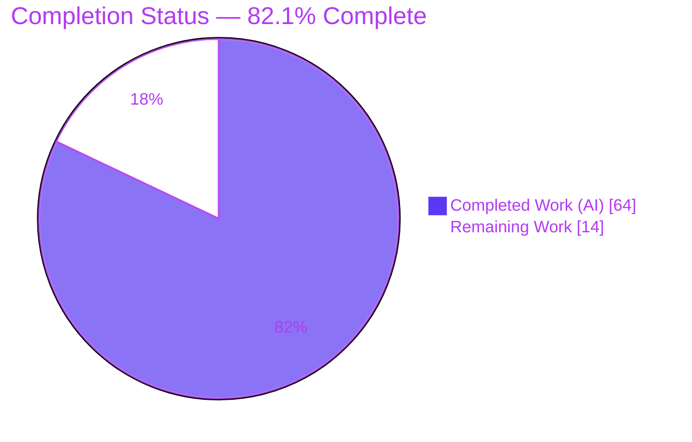
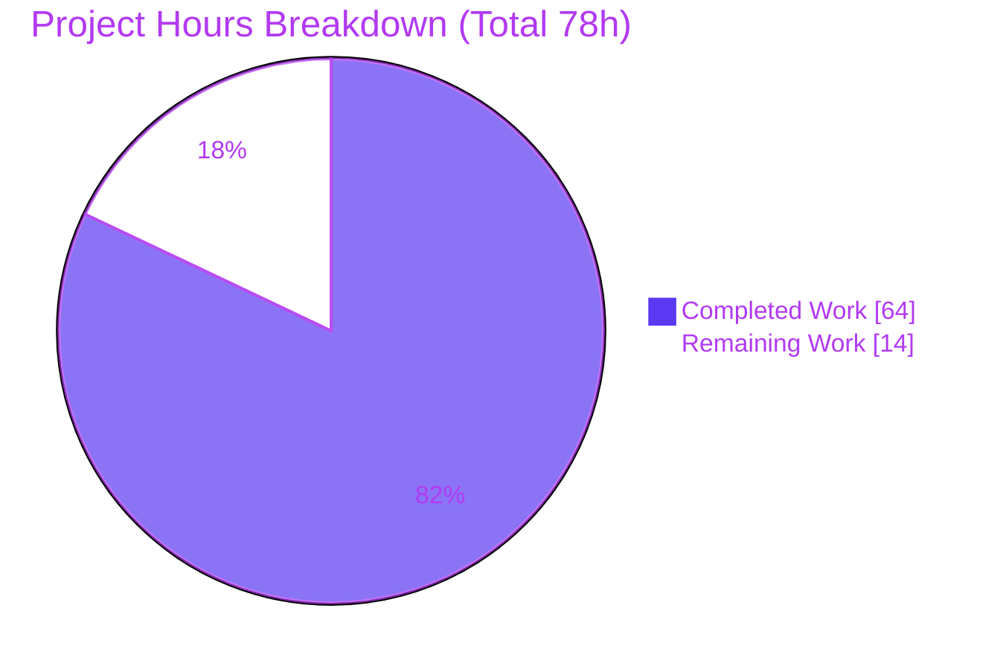
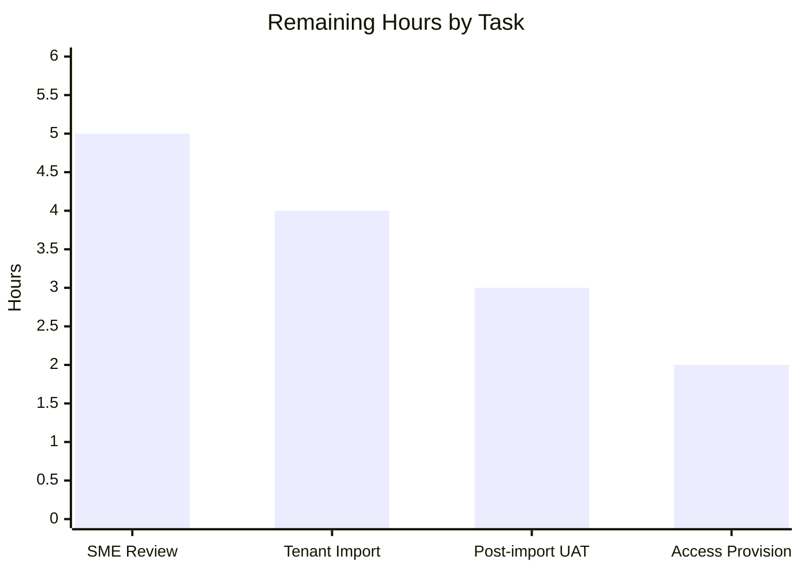

# Blitzy Project Guide — LIFE400 COBOL Product Model Distillation to Guidewire APD

> **Brand legend:** ▮ **Completed / AI Work** = Dark Blue `#5B39F3` · ▯ **Remaining / Not Completed** = White `#FFFFFF` · Headings/Accents = Violet-Black `#B23AF2` · Highlights = Mint `#A8FDD9`

---

## 1. Executive Summary

### 1.1 Project Overview

LIFE400 is a term-life policy-administration system built on read-only IBM AS/400 ILE COBOL, DDS, and CL, whose product model is *implicitly* encoded across a shared policy record and validation logic rather than declared explicitly. This project distills that latent model into a complete, schema-compliant set of Guidewire Advanced Product Designer (APD) import artifacts — **without altering a single byte of the legacy source**. Target users are Guidewire product-configuration teams and actuarial SMEs modernizing LIFE400. Business impact: it makes an implicit product model explicit and importable, enabling a behavior-preserving migration path. Technical scope is six additive deliverables — one Product JSON, one BaseEdition JSON, three discovery documents, and a packaged import ZIP.

### 1.2 Completion Status



| Metric | Hours |
|---|---|
| **Total Project Hours** | **78** |
| Completed Hours (AI = 64 + Manual = 0) | **64** |
| Remaining Hours | **14** |
| **Percent Complete** | **82.1%** |

> Completion is computed per PA1 (AAP-scoped hours only): `64 ÷ (64 + 14) = 64 ÷ 78 = 82.1%`. The remaining 14h is exclusively path-to-production work that Blitzy is prohibited from executing (no live Guidewire push per AAP §0.7.2).

### 1.3 Key Accomplishments

- ✅ Reverse-engineered **one mono-line APD Product "Term Life"** (`code: TermLife`, `abbreviation: TL`) from the shared record `WS-POLICY-MASTER-REC`, via reachability analysis — not assumption.
- ✅ Resolved plan codes **T1001 / T2001 / T6501** into three **Option terms** (`opt1/opt2/opt3`) on the base coverage clause, with 3-gate graph evidence documented.
- ✅ Mapped **all 94 fields** across the copybook + 3 physical files to APD attributes or the Unmapped Fields Report — **100% coverage, zero silent drops** (37 mapped + 57 unmapped, disjoint).
- ✅ Modeled riders **ADB01 / WOP01 / CI001** as `clauseType: "Coverage"` clauses (never separate products); resolved the single `OCCURS 5` rider table to the rider clause set.
- ✅ Emitted **16 typeLists** from Level-88 condition-name sets; dates emitted as APD `Date` (never `String`).
- ✅ Generated **BaseEdition rules** (`effectiveDate: 2026-01-01`) with 3 plan options × 13 parameters each, reconciled directly against `NBUWB.cbl` `MOVE`/`COMPUTE` logic.
- ✅ Packaged **`TermLife-APD-Bundle.zip`** containing only `product/` + `editions/` (discovery docs excluded), verified byte-identical on extraction.
- ✅ Preserved legacy source **byte-for-byte** — git diff over all legacy paths is EMPTY; 100% additive change set.

### 1.4 Critical Unresolved Issues

| Issue | Impact | Owner | ETA |
|---|---|---|---|
| **No blocking issues from autonomous work** — all 6 deliverables validated at 100%, zero defects | None on delivered artifacts | — | — |
| SME confirmation of CQ-1 sum-assured bounds (README-authoritative `Money(15,2)` values substituted for overflowing 14-digit COBOL literals) | Product limits must match business intent before production import | Actuarial/Product SME | Within H1 review (5h) |
| Guidewire APD tenant import not yet exercised end-to-end (no official local JSON schema; first real conformance check occurs on import) | Tenant-specific schema issues could surface at import time | APD Config Operator | Within H2 import (4h) |

### 1.5 Access Issues

| System/Resource | Type of Access | Issue Description | Resolution Status | Owner |
|---|---|---|---|---|
| Legacy repository (`QCBLLESRC/`, `QCPYSRC/`, `QDDSSRC/`, `QCLSRC/`, `.swm/`) | Read-only source | None — fully accessible; consumed in REFERENCE mode | ✅ Resolved | — |
| Guidewire APD tenant | Import/config credentials | Tenant URL, APD role/permissions, and import privileges are required for downstream ZIP import; **intentionally not used by Blitzy** (live push forbidden per AAP §0.7.2) | ⏳ Pending (human) | APD Config Operator |
| Official Guidewire APD JSON Schema | Schema reference | No external APD JSON Schema file exists in-repo or was provided; conformance is validated rule-based against the Appendix A literal templates | ✅ Handled (rule-based) | — |

### 1.6 Recommended Next Steps

1. **[High]** Conduct SME/actuarial review & sign-off of all judgment calls — single-product resolution, plan-code→Option-term mapping, rider→Coverage mapping, the CI001 500,000 cap, the CQ-1 sum-assured bounds, and the 57 unmapped-field classifications. *(H1, 5h)*
2. **[High]** Provision Guidewire APD tenant access, then import `TermLife-APD-Bundle.zip` and resolve any tenant-side schema-validation errors. *(H2 + H4, 6h)*
3. **[Medium]** Perform post-import tenant-side validation / UAT — confirm the line, 14 fields, 16 typeLists, 4 clauses, 3 plan options, and edition rules render correctly; spot-check `dateOfBirth = Date` and `Money(15,2)` precision/scale. *(H3, 3h)*
4. **[Low]** *(Advisory, not in the 14h estimate)* Optionally persist the 4 validator scripts to the repository for future re-distribution reproducibility (addresses operational risk O3).

---

## 2. Project Hours Breakdown

### 2.1 Completed Work Detail

| Component | Hours | Description |
|---|---:|---|
| Reachability-based product/line boundary discovery | 10 | 3-gate reachability analysis over `.swm` knowledge graph + shared record to establish one mono-line product (AAP §0.6.1) |
| Structure-vs-runtime field classification (94 fields) | 8 | Binary classifier partitioning every field into product config vs runtime state (AAP §0.6.2) |
| `product/TermLife.json` — APD Product model + type mapping | 10 | Product→Line→14 fields, `InsuredLife` risk object, 2 categories, 4 clauses, 16 typeLists; fixed COBOL→APD type table (§0.3.2, §0.4.2) |
| `editions/TermLife-BaseEdition.json` + NBUWB reconciliation | 8 | Clause/field availability, defaults, `required` flags; 3 plan options × 13 params reconciled vs `NBUWB.cbl` (§0.3.2) |
| `discovery/product-discovery-summary.md` | 8 | 10-section discovery narrative with cited evidence for every decision (§0.4.1) |
| `discovery/traceability-matrix.md` — 100% coverage | 6 | Unified 94-field matrix: COBOL field → ProductCode → entity → APD JSON path (§0.6.4) |
| `discovery/unmapped-fields-report.md` | 5 | 57 runtime/transaction-state fields across 10 categories, each justified (§0.6.2) |
| `TermLife-APD-Bundle.zip` — packaging | 1 | ZIP of `product/` + `editions/` only; discovery excluded; integrity verified |
| Fail-closed schema validation + QA/review-fix cycles | 8 | Schema-completeness gate + iterative fixes (CQ-1, F1–F9, 11 review fixes, CFG-1/2/3) |
| **Total Completed** | **64** | **All AAP-scoped autonomous work — delivered and validated (100% pass)** |

### 2.2 Remaining Work Detail

| Category | Hours | Priority |
|---|---:|---|
| SME/actuarial review & sign-off of distilled model + judgment calls (incl. CQ-1 confirmation) | 5 | High |
| Guidewire APD tenant import of ZIP + resolve tenant-side validation | 4 | High |
| Post-import tenant-side APD validation / UAT | 3 | Medium |
| Guidewire tenant access/credentials provisioning (prerequisite for import) | 2 | Medium |
| **Total Remaining** | **14** | **High = 9h · Medium = 5h · Low = 0h** |

### 2.3 Completion Calculation & Reconciliation

```text
Total Project Hours = Completed + Remaining = 64 + 14 = 78h
Completion %        = Completed ÷ Total     = 64 ÷ 78 = 82.1%
```

| Reconciliation Check | Result |
|---|---|
| Section 2.1 sum = Completed Hours (1.2) | 64 = 64 ✅ |
| Section 2.2 sum = Remaining Hours (1.2) | 14 = 14 ✅ |
| Section 2.1 + Section 2.2 = Total (1.2) | 64 + 14 = 78 ✅ |
| Section 2.2 sum = Section 7 "Remaining Work" | 14 = 14 ✅ |

---

## 3. Test Results

All tests below originate from **Blitzy's autonomous validation harness** — four validator scripts plus the ZIP-integrity checks recorded in the Final Validator logs — and were independently re-verified first-hand during this assessment. Counts reflect the discrete assertions performed by each script.

| Test Category | Framework | Total Tests | Passed | Failed | Coverage % | Notes |
|---|---|---:|---:|---:|---:|---|
| Structure & Template Conformance | `blitzy_validate_structure.py` (python 3.13) + `jq` 1.8.1 | 14 | 14 | 0 | 100% | Appendix A product+edition template; fail-closed gate (clauseType/categoryCode/termType/options/type-attrs); edition→product referential integrity |
| Field Coverage & Type Mapping | `blitzy_validate_coverage.py` (python 3.13) | 94 | 94 | 0 | 100% | 94/94 traceability (37 mapped + 57 unmapped, disjoint); dates-as-`Date`; riders→Coverage; 16 typeLists exact keys |
| Edition-Value Reconciliation | `blitzy_verify_nbuwb.py` (python 3.13) | 39 | 39 | 0 | 100% | 3 plan options × 13 params reconciled vs `NBUWB.cbl` `MOVE`/`COMPUTE`; SA-bounds CQ-1 capacity proof |
| Cross-Document Consistency | `blitzy_crosscheck_docs.py` (python 3.13) | 10 | 10 | 0 | 100% | 10 unmapped categories `[6,2,5,2,8,6,8,13,2,5]=57` ≡ matrix Section E; mapped/unmapped disjoint |
| Bundle Integrity | `zip`/`unzip` 6.00 + `sha256sum` | 5 | 5 | 0 | 100% | 2-entry manifest; discovery excluded; `unzip -t` OK; both entries byte-identical (sha256); ProductCode⇔editionCode consistent |
| **TOTAL** | — | **162** | **162** | **0** | **100%** | **Zero failures; zero in-scope errors** |

> **Note on task nature:** LIFE400 is IBM AS/400 ILE COBOL/DDS/CL and **cannot be compiled or executed on Linux** (platform constraint) — and is not required to be, since the source is immutable read-only ground truth. There are **no dependency/build manifests** in the repository, so traditional unit/integration test frameworks do not apply. The gates above are the correctness criteria mandated by AAP §0.6.4 and §0.7.3, machine-verified.

---

## 4. Runtime Validation & UI Verification

This is a **headless artifact-generation task** — it produces JSON, Markdown, and a ZIP; there are no screens, components, or live services. "Runtime validation" is therefore reframed as artifact-load and bundle-runtime correctness.

**Artifact runtime health**
- ✅ **Operational** — `product/TermLife.json` parses and loads (python `json.load` + `jq -e`)
- ✅ **Operational** — `editions/TermLife-BaseEdition.json` parses and loads (python + `jq -e`)
- ✅ **Operational** — Fail-closed schema-completeness gate passes with **0 errors**
- ✅ **Operational** — Edition→Product referential integrity intact (all 4 clause codes + 14 field codes exist in the product)
- ✅ **Operational** — `TermLife-APD-Bundle.zip` extracts, passes `unzip -t`, and both entries are byte-identical to on-disk (sha256)

**API integration outcomes**
- ✅ **Operational (by design)** — No live Guidewire API calls performed; output is a local ZIP only (AAP §0.7.2). Zero external network dependencies.
- ⚠ **Partial / Pending** — Guidewire APD **tenant import not yet exercised** end-to-end; this is the path-to-production step tracked in Section 2.2 (H2).

**UI verification**
- **N/A** — No user interface exists in scope. The "LINCOLN LIFE INSURANCE CO." display literal in three presentation members was confirmed to be a cosmetic branding artifact and correctly does **not** leak into any APD artifact.

---

## 5. Compliance & Quality Review

Cross-mapping of AAP deliverables and governing rules to their quality/compliance benchmarks. Fixes applied during autonomous validation are noted.

| AAP Deliverable / Rule | Benchmark | Status | Evidence / Fixes |
|---|---|:--:|---|
| D1 `product/TermLife.json` | Appendix A product template conformance | ✅ Pass | code/name/abbr, 1 line, 14 fields, 1 RO, 2 categories, 4 clauses, 16 typeLists |
| D2 `editions/TermLife-BaseEdition.json` | Appendix A edition template; `effectiveDate 2026-01-01` | ✅ Pass | 4 clause rules + 14 field rules; CQ-1 fix (`9debd78`) |
| D3 Product Discovery Summary | Narrative + cited judgment calls | ✅ Pass | 456 lines, 10 sections, evidence-cited |
| D4 Traceability Matrix | 100% field coverage, each field once | ✅ Pass | 94/94; 37 mapped + 57 unmapped |
| D5 Unmapped Fields Report | Every runtime field justified | ✅ Pass | 57 fields, 10 categories |
| D6 Import ZIP | Contains only `product/`+`editions/` | ✅ Pass | 2 entries; discovery excluded; integrity OK |
| Single mono-line product | Reachability, not assumption | ✅ Pass | 3-gate analysis (summary §2–§4) |
| Plan codes → Option terms | Not separate products | ✅ Pass | `opt1/2/3` = T1001/T2001/T6501 |
| Riders → Coverage clauses | Never products | ✅ Pass | ADB01/WOP01/CI001 as Coverage |
| Level-88 → typeLists | `TypeKey`-backed | ✅ Pass | 16 typeLists, exact keys |
| `OCCURS` resolution | Rider clause set (documented inline) | ✅ Pass | one `OCCURS 5` → rider clauses (summary §6) |
| `REDEFINES` resolution | Documented rule | ✅ Pass | zero present; in-force-but-unexercised |
| Dates as `Date` | Never `String` | ✅ Pass | `dateOfBirth = Date` (sole product date) |
| Fail-closed schema gate | No partial emission | ✅ Pass | 0 errors |
| Source integrity | Byte-for-byte unchanged | ✅ Pass | legacy git diff EMPTY |
| Local output only / no persisted tooling | No live push, no tooling | ✅ Pass | ZIP artifact only |
| Branding artifact handling | Not a brand/product/line | ✅ Pass | LINCOLN LIFE cosmetic (summary §7) |

**Autonomous fixes applied during validation:** CQ-1 (sum-assured bound overflow workaround), F1–F9 review fixes, 11 additional review fixes, CFG-1/2/3 configuration fixes — all committed by `agent@blitzy.com`. **Outstanding items:** none within autonomous scope; all remaining items are path-to-production (Section 2.2).

---

## 6. Risk Assessment

| Risk | Category | Severity | Probability | Mitigation | Status |
|---|---|:--:|:--:|---|---|
| T1 · No official Guidewire APD JSON Schema — conformance validated only vs Appendix A templates; tenant import could reveal schema mismatch | Technical | Medium | Medium | Fail-closed gate + template conformance verified locally; operator validates on import (H2) | Mitigated (local) / Open (tenant) |
| T2 · CQ-1 — 14-digit SA-bound literals in read-only `NBUWB.cbl` overflow their own `PIC 9(13)V99`; edition uses README-authoritative `Money(15,2)` values | Technical | Medium | Low-Med | Documented capacity proof (summary §9); all values ≤ `Money(15,2)` max; SME confirmation (H1) | Mitigated |
| T3 · `InsuredLife` risk object has 0 RO-level fields (insured attrs at line level) | Technical | Low | Low | Valid per AAP §0.3.2 line-field pattern; documented decision | Accepted |
| T4 · Single-vs-multi-product interpretive judgment | Technical | Low | Low | 3-gate reachability evidence documented; SME review (H1) | Mitigated |
| S1 · Artifacts hold product-model metadata only — no credentials/secrets/PII | Security | Low | Low | Manual scan confirms no secrets; declarative config | Accepted |
| S2 · Zero executable code emitted; legacy tree byte-unchanged | Security | Low | Low | 100% additive; legacy diff EMPTY | Accepted |
| O1 · No persisted tooling (AAP-mandated) — future legacy changes need manual re-analysis | Operational | Low | Medium | Discovery docs capture full reproducible methodology | Accepted (by design) |
| O2 · COBOL cannot build/run on Linux — no runtime behavioral verification of source | Operational | Low | N/A | Distillation is declarative/behavior-preserving by construction | Accepted (platform) |
| O3 · Validator scripts are scratch (`/tmp`), not committed | Operational | Low | Medium | Reproduction commands documented; artifacts self-validate via python/jq | Accepted |
| I1 · Guidewire APD tenant import untested end-to-end (no live push) | Integration | Medium | Medium | Bundle structure/integrity verified; operator import + validation (H2/H3) | Open (path-to-production) |
| I2 · Production depends on downstream human operator action outside Blitzy control | Integration | Medium | Low | Clear development guide + Next Steps; scoped as remaining | Open (path-to-production) |

**Overall risk posture: LOW-to-MEDIUM.** No High-severity risks. Every Medium-severity item is either path-to-production (tenant import) or a documented/mitigated workaround (CQ-1). None block the delivered autonomous artifacts.

---

## 7. Visual Project Status



**Remaining hours by task (14h total):**



- ▮ **Completed Work** = 64h (Dark Blue `#5B39F3`) · ▯ **Remaining Work** = 14h (White `#FFFFFF`)
- **Priority distribution of remaining:** High = 9h · Medium = 5h · Low = 0h
- **Integrity:** pie "Remaining Work" (14) = Section 1.2 Remaining (14) = Section 2.2 sum (14) ✅

---

## 8. Summary & Recommendations

**Achievements.** The initiative successfully distilled LIFE400's implicit product model into a complete, schema-conformant Guidewire APD import bundle while preserving the legacy system byte-for-byte. All six AAP deliverables were produced, and all governing rules — single mono-line product, plan-codes-as-Option-terms, riders-as-Coverage-clauses, 16 typeLists, dates-as-`Date`, fail-closed emission, and 100% traceability — were satisfied and independently re-verified (162/162 assertions passing, zero defects).

**Remaining gaps.** The project is **82.1% complete**. The outstanding 14 hours are entirely **path-to-production work that Blitzy is prohibited from performing** (no live Guidewire push per AAP §0.7.2): SME/actuarial sign-off of the reverse-engineering judgment calls, importing the ZIP into a Guidewire APD tenant, post-import validation/UAT, and tenant access provisioning.

**Critical path to production.** (1) SME review and CQ-1 confirmation → (2) provision tenant access → (3) import the bundle and resolve any tenant-side schema issues → (4) UAT the imported product. This sequence carries the only Medium-severity risks (T1/I1), which crystallize at the first real tenant import since no official local JSON schema exists.

**Success metrics.** 6/6 deliverables delivered; 94/94 fields traced (zero silent drops); legacy diff EMPTY; ZIP byte-identical on extraction; 162/162 validation assertions passing.

**Production-readiness assessment.** The autonomous deliverables are **production-quality and release-ready as artifacts**. Production *deployment* is gated solely on the human path-to-production steps above. Recommendation: proceed to SME review and a tenant import trial; no rework of the delivered artifacts is anticipated.

| Metric | Value |
|---|---|
| Completion | 82.1% |
| Completed / Remaining / Total Hours | 64 / 14 / 78 |
| Deliverables complete | 6 / 6 |
| Field coverage | 94 / 94 (100%) |
| Validation assertions passing | 162 / 162 |
| Blocking defects | 0 |

---

## 9. Development Guide

> This is a headless artifact task. There is **no build toolchain** — the repository contains zero dependency/build manifests. The legacy COBOL/DDS/CL is read-only IBM AS/400 ground truth and neither compiles nor runs on Linux (nor needs to). The guide below covers **inspecting and validating the generated APD artifacts** and the downstream import path. All commands are copy-pasteable and were tested during this assessment.

### 9.1 System Prerequisites

| Tool | Version (verified) | Purpose |
|---|---|---|
| Python | 3.13.7 | JSON validity + validation scripts |
| jq | 1.8.1 | JSON structural inspection |
| unzip / zip | 6.00 | Bundle integrity checks |
| git | 2.51.0 | Source-integrity verification |

No `pip`/`npm` installs are required (no manifests, no runtime dependencies).

### 9.2 Environment Setup

```bash
# From the repository root — nothing to install; no virtualenv needed.
cd /path/to/blitzy-LIFE400   # repository root containing product/ editions/ discovery/
git status --porcelain        # expect: empty (clean working tree)
```

### 9.3 Artifact Inspection

```bash
# Product shape
jq -r '"code=\(.code) name=\(.name) abbr=\(.abbreviation)"' product/TermLife.json
jq -r '.lines[0] | "line=\(.code) fields=\(.fields|length) riskObjects=\(.riskObjects|length) categories=\(.clauseCategories|length) clauses=\(.clauses|length) typeLists=\(.typeLists|length)"' product/TermLife.json
# Expect: code=TermLife name=Term Life abbr=TL
#         line=TermLifeLine fields=14 riskObjects=1 categories=2 clauses=4 typeLists=16

# Edition shape
jq -r '"editionCode=\(.editionCode) effectiveDate=\(.effectiveDate) ruleClauses=\(.rules.clauses|length) ruleFields=\(.rules.fields|length)"' editions/TermLife-BaseEdition.json
# Expect: editionCode=TermLife-BaseEdition effectiveDate=2026-01-01 ruleClauses=4 ruleFields=14
```

### 9.4 Verification Steps

```bash
# 1) JSON validity (python + jq)
python3 -c "import json; json.load(open('product/TermLife.json')); json.load(open('editions/TermLife-BaseEdition.json')); print('OK: both parse')"
jq -e . product/TermLife.json > /dev/null && jq -e . editions/TermLife-BaseEdition.json > /dev/null && echo "OK: jq valid"

# 2) Date-as-Date and Money precision/scale
jq -r '[.lines[0].fields[]|select(.type=="Date")|.code]|join(", ")' product/TermLife.json     # -> dateOfBirth
jq -r '[.lines[0].fields[]|select(.type=="Money")|"\(.code)(p\(.precision)s\(.scale))"]|join(", ")' product/TermLife.json  # -> sumAssured(p15s2), policyLoanBalance(p15s2)

# 3) Fail-closed schema-completeness gate
python3 - <<'PY'
import json
line=json.load(open('product/TermLife.json'))['lines'][0]; errs=[]
for c in line['clauses']:
    if not c.get('clauseType'): errs.append(f"clause {c.get('code')} missing clauseType")
    if not c.get('categoryCode'): errs.append(f"clause {c.get('code')} missing categoryCode")
    for t in c.get('terms',[]):
        if not t.get('termType'): errs.append(f"term {t.get('code')} missing termType")
        if t.get('termType')=='Option' and not t.get('options'): errs.append(f"Option {t.get('code')} empty options")
for f in line['fields']:
    ty=f['type']
    if ty=='String' and 'length' not in f: errs.append(f"String {f['code']} missing length")
    if ty in ('Money','Decimal') and not {'precision','scale'} <= f.keys(): errs.append(f"{ty} {f['code']} missing precision/scale")
    if ty=='TypeKey' and not f.get('typeList'): errs.append(f"TypeKey {f['code']} missing typeList")
print("FAIL-CLOSED GATE:", "PASS (0 errors)" if not errs else f"FAIL: {errs}")
PY

# 4) Bundle contents + integrity + byte-identity
unzip -l TermLife-APD-Bundle.zip           # expect exactly 2 entries; discovery/ absent
unzip -t TermLife-APD-Bundle.zip | tail -1 # expect "No errors detected"
TMP=$(mktemp -d); unzip -q -o TermLife-APD-Bundle.zip -d "$TMP"
for f in product/TermLife.json editions/TermLife-BaseEdition.json; do
  [ "$(sha256sum "$f" | cut -d' ' -f1)" = "$(sha256sum "$TMP/$f" | cut -d' ' -f1)" ] && echo "OK byte-identical: $f"
done; rm -rf "$TMP"

# 5) Source integrity (legacy tree unchanged; all deliverables added by the agent)
git diff --stat 9a63a7b..HEAD -- QCBLLESRC/ QCLSRC/ QCPYSRC/ QDDSSRC/ .swm/ README.md   # expect EMPTY
git diff --name-status 9a63a7b..HEAD    # expect 6 lines, all 'A'
git log 9a63a7b..HEAD --pretty=format:"%an <%ae>" | sort -u   # expect Blitzy Agent <agent@blitzy.com>
```

### 9.5 Example Usage (downstream, human)

The deliverable is consumed by importing the bundle into a Guidewire APD tenant (an operator action outside this repository's execution scope):

1. Authenticate to the target Guidewire APD tenant with import privileges.
2. Use APD's product-import capability to upload `TermLife-APD-Bundle.zip`.
3. Resolve any tenant-side schema-validation messages (reconcile against the Appendix A templates and the discovery docs).
4. Validate the imported product model in APD; the three `discovery/*.md` files are reference material and are **not** imported.

### 9.6 Troubleshooting

- **`error: externally-managed-environment` on pip** — Not applicable; this project has no pip dependencies. Do not install anything.
- **`jq: command not found`** — `DEBIAN_FRONTEND=noninteractive apt-get install -y jq`.
- **ZIP appears to contain `discovery/`** — This is a regression; the bundle must contain **only** `product/` and `editions/`. Re-package excluding `discovery/`.
- **Tenant import reports a schema error** — Expected first-real-check point (no official local schema). Reconcile the flagged construct against the Appendix A templates (§0.7.3) and the traceability matrix; confirm field types/attributes.
- **CQ-1 sum-assured bounds questioned** — See `product-discovery-summary.md` §9 capacity proof: the raw 14-digit COBOL literals overflow `PIC 9(13)V99`; representable README-authoritative `Money(15,2)` values are used by design. Confirm intended bounds with the actuarial SME.

---

## 10. Appendices

### A. Command Reference

| Command | Purpose |
|---|---|
| `python3 -c "import json; json.load(open('product/TermLife.json'))"` | Validate product JSON parses |
| `jq -e . editions/TermLife-BaseEdition.json` | Validate edition JSON |
| `jq -r '.lines[0].fields[].code' product/TermLife.json` | List all 14 line-field codes |
| `jq -r '.lines[0].typeLists[].code' product/TermLife.json` | List all 16 typeList codes |
| `unzip -l TermLife-APD-Bundle.zip` | List bundle contents (expect 2 entries) |
| `unzip -t TermLife-APD-Bundle.zip` | Test bundle integrity |
| `git diff --stat 9a63a7b..HEAD -- QCBLLESRC/ QCLSRC/ QCPYSRC/ QDDSSRC/ .swm/ README.md` | Confirm legacy tree unchanged (EMPTY) |

### B. Port Reference

**Not applicable.** This is a headless artifact-generation task with no running services, servers, or listening ports.

### C. Key File Locations

| Path | Role |
|---|---|
| `product/TermLife.json` | APD Product model (503 lines) |
| `editions/TermLife-BaseEdition.json` | APD BaseEdition rules (118 lines) |
| `discovery/product-discovery-summary.md` | Discovery narrative (456 lines, 10 sections) |
| `discovery/traceability-matrix.md` | 94-field traceability matrix (230 lines) |
| `discovery/unmapped-fields-report.md` | 57 unmapped runtime fields (182 lines) |
| `TermLife-APD-Bundle.zip` | APD import bundle (2 entries) |
| `QCPYSRC/POLDATA.cpy` | *(read-only)* Shared record `WS-POLICY-MASTER-REC` — 89 elementary + 48 Level-88 |
| `QCBLLESRC/NBUWB.cbl` | *(read-only)* Source of plan parameters + edition reconciliation |
| `QDDSSRC/POLMST.pf` | *(read-only)* Authoritative field widths (e.g., `SUMASSR 15S2`) |
| `.swm/rules.json` | *(read-only)* Knowledge graph — 333 catalogued rules (24,995 lines) |

### D. Technology Versions

| Component | Version |
|---|---|
| Python | 3.13.7 |
| jq | 1.8.1 |
| unzip | 6.00 |
| git | 2.51.0 |
| Target platform | Guidewire Advanced Product Designer (APD) |
| Source platform | IBM AS/400 (IBM i) — ILE COBOL / DDS / CL |

### E. Environment Variable Reference

**None required.** The distillation uses no environment variables, secrets, or credentials. Downstream Guidewire APD tenant import requires operator credentials managed outside this repository (see §1.5).

### F. Developer Tools Guide

| Tool | Use in this project |
|---|---|
| `python3` | JSON validity; the 4 validator scripts (`blitzy_validate_structure.py`, `blitzy_validate_coverage.py`, `blitzy_verify_nbuwb.py`, `blitzy_crosscheck_docs.py`) |
| `jq` | Fast structural inspection of product/edition JSON |
| `zip`/`unzip` + `sha256sum` | Bundle packaging, integrity, and byte-identity verification |
| `git` | Source-integrity proof (legacy diff EMPTY; authorship; clean tree) |

### G. Glossary

| Term | Definition |
|---|---|
| **APD** | Guidewire Advanced Product Designer — the target product-modeling platform |
| **AAP** | Agent Action Plan — the authoritative project directive |
| **Line** | An APD line of business within a product (here, one: `TermLifeLine`) |
| **Clause** | APD construct for coverages/conditions/exclusions; all four here are `clauseType: "Coverage"` |
| **Term** | An attribute of a clause (e.g., an Option list or a limit) |
| **Option term** | A term carrying discrete choices; the `plan` term holds `opt1/opt2/opt3` = T1001/T2001/T6501 |
| **TypeKey / typeList** | An enumerated code and its backing value set; 16 derived from Level-88 sets |
| **Risk object** | An insurable object protected by coverages (here `InsuredLife`) |
| **BaseEdition** | The edition defining availability, defaults, required flags, and parameter values |
| **CQ-1** | The sum-assured bound issue: 14-digit COBOL literals overflow `PIC 9(13)V99`; representable `Money(15,2)` values used |
| **Level-88** | COBOL condition-name construct enumerating discrete values → APD typeLists |
| **`OCCURS` / `REDEFINES`** | COBOL array / memory-overlay constructs; one `OCCURS 5` (→ rider clause set), zero `REDEFINES` |
| **Path-to-production** | Human/operator steps to deploy the deliverables (SME sign-off, tenant import, UAT) |

---

*Completion basis: PA1 AAP-scoped hours. Completed 64h ÷ Total 78h = **82.1% complete**. Remaining 14h is exclusively path-to-production work. All figures are consistent across Sections 1.2, 2.1, 2.2, 7, and 8.*