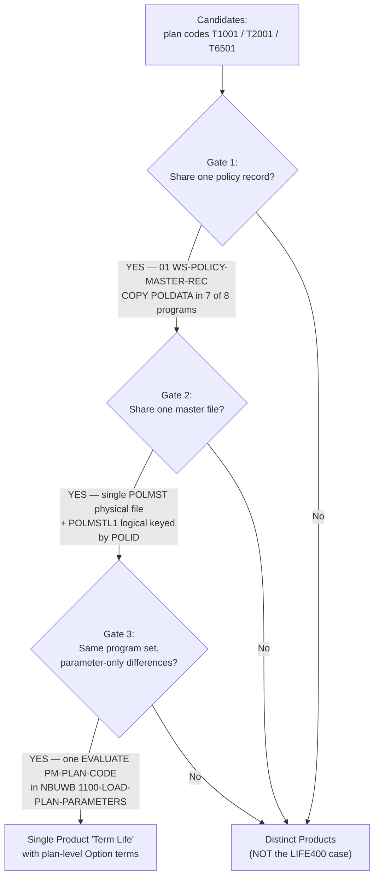
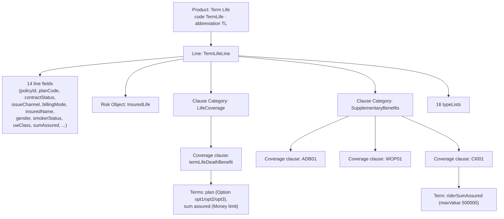

# LIFE400 → Guidewire APD — Product Discovery Summary

> **Deliverable #3** of the *LIFE400 COBOL Product Model Distillation to Guidewire APD* initiative.
> This is the **"why" document**: a human-readable audit trail that lets a reviewer reconstruct — from cited
> legacy evidence alone — how and why the latent LIFE400 product model was distilled into a single mono-line
> Guidewire Advanced Product Designer (APD) product. It is written **alongside** the APD import bundle but is
> **deliberately excluded** from `TermLife-APD-Bundle.zip` (only `product/` and `editions/` are packaged).
>
> **Scope discipline.** Every legacy source file is read **read-only**; nothing under `QCBLLESRC/`, `QCLSRC/`,
> `QCPYSRC/`, `QDDSSRC/`, `.swm/`, or `README.md` is modified, annotated, or reordered. No live push, API call,
> or upload to any Guidewire Cloud tenant is performed — the sole runtime output is a local ZIP artifact. Every
> claim below traces to a cited source file and line range in `[path:Lstart-Lend]` form.

---

## 1. Executive Summary

LIFE400 is a term-life policy administration system built for IBM AS/400 (IBM i) from ILE COBOL, DDS, and
ILE CL source, compiled into the library `LIFE400`. It spans three business domains — New Business &
Underwriting, Policy Servicing & Billing, and Claims Adjudication — yet its **product model is *latent***: it is
never declared explicitly anywhere in the source. Instead, it is encoded implicitly across the shared
copybook data definitions (`QCPYSRC/POLDATA.cpy`), the DDS persistence layout (`QDDSSRC/POLMST.pf`), and the
COBOL validation logic (`QCBLLESRC/NBUWB.cbl`). The distillation task is therefore to make that implicit model
**explicit** in APD's canonical form, without changing a single byte of the legacy system.

The headline outcome of discovery is that LIFE400 contains **exactly ONE mono-line APD Product — "Term Life"
(code `TermLife`, abbreviation `TL`)** — with **one Line (`TermLifeLine`)** and **one risk object
(`InsuredLife`)**. The three legacy plan codes `T1001` / `T2001` / `T6501` are **not** three separate products;
they are realized as three plan-level **Option terms** (`opt1` / `opt2` / `opt3`) on the base coverage clause
`termLifeDeathBenefit`, because they share one record, one file, and one program set and differ only in
parameter values. The three riders `ADB01` (Accidental Death Benefit), `WOP01` (Waiver of Premium), and
`CI001` (Critical Illness) are realized as `clauseType: "Coverage"` clauses under the `SupplementaryBenefits`
category — **never as separate products**. All rating factors, computed premiums, per-transaction state, and
the 333 catalogued business rules remain in the untouched COBOL; only product *structure* is distilled, which
makes the transformation behavior-preserving by construction.

---

## 2. Discovery Method — Reachability Analysis

Product and line boundaries were established by **reachability analysis over the shared policy record and the
`.swm` knowledge graph** — **never** by assuming that each plan code is a distinct product. The governing
decision procedure is:

> **Distinct products require *disjoint* shared-record, persistence, AND program sets.
> LIFE400 fails that test on every axis** — therefore the plan codes collapse into a single product with
> plan-level Option terms.

The three-gate decision flow, and the concrete evidence that resolves each gate, is:

1. **Gate 1 — Share one policy record?** → **YES.** `01 WS-POLICY-MASTER-REC` (the `COPY POLDATA` copybook) is
   the single shared record, copied by **7 of 8** COBOL programs (§3).
2. **Gate 2 — Share one master file?** → **YES.** A single `POLMST` physical file plus the `POLMSTL1` logical
   view, keyed by `POLID`, back every program (§3).
3. **Gate 3 — Same program set with parameter-only differences?** → **YES.** A single
   `EVALUATE PM-PLAN-CODE` in `NBUWB.cbl` loads plan-specific parameters; the plans differ only in values (§4).

Because all three gates resolve to YES, the candidates converge on a **single Product "Term Life" with
plan-level Option terms**. Per the report-don't-guess constraint, this split is recorded and justified from
evidence here rather than assumed.

---

## 3. Shared-Record Evidence (the crux)

The decisive evidence for a single product is the **shared policy-master record**. `01 WS-POLICY-MASTER-REC`
is defined exactly once, in the copybook `[QCPYSRC/POLDATA.cpy:L11-L14]`, whose header comment explicitly
labels it *"POLICY MASTER RECORD - SHARED ACROSS ALL LIFE400 MODULES"* and enumerates the consuming modules
`NBUWB, CLMADJB, SVCBILB, NBUWMNT, CLMMNT, SVCMNT` `[QCPYSRC/POLDATA.cpy:L11-L14]`.

A repository-wide scan for `COPY POLDATA` confirms that **7 of the 8 COBOL programs** pull in this one record.
The header comment lists six core modules; the scan additionally finds the read-only inquiry program
`POLMSTINQ`, for **seven** total. The **only** program that does **not** `COPY POLDATA` is `MAINMENU` — a pure
5250 menu-dispatch shell that holds no product data and merely routes the operator to each subsystem.

| # | Program (`QCBLLESRC/*.cbl`) | `COPY POLDATA`? | Citation | Role |
|---|-----------------------------|:---------------:|----------|------|
| 1 | `NBUWB`     | **Y** | `[QCBLLESRC/NBUWB.cbl:L60]`     | Batch: new business & underwriting (plan params, rider validation) |
| 2 | `NBUWMNT`   | **Y** | `[QCBLLESRC/NBUWMNT.cbl:L50]`   | Online: new business maintenance |
| 3 | `SVCBILB`   | **Y** | `[QCBLLESRC/SVCBILB.cbl:L64]`   | Batch: policy servicing & billing |
| 4 | `SVCMNT`    | **Y** | `[QCBLLESRC/SVCMNT.cbl:L56]`    | Online: servicing maintenance |
| 5 | `CLMADJB`   | **Y** | `[QCBLLESRC/CLMADJB.cbl:L58]`   | Batch: claims adjudication |
| 6 | `CLMMNT`    | **Y** | `[QCBLLESRC/CLMMNT.cbl:L55]`    | Online: claims maintenance |
| 7 | `POLMSTINQ` | **Y** | `[QCBLLESRC/POLMSTINQ.cbl:L50]` | Online: policy master inquiry (read-only) |
| 8 | `MAINMENU`  | **N** | *(none)*                        | Online: pure menu dispatch — no product data |

**One master file, one key.** Persistence reinforces the single-product finding. The policy master physical
file `POLMST` declares one record format `POLMSTREC` and is keyed by `POLID` `[QDDSSRC/POLMST.pf:L14]`,
`[QDDSSRC/POLMST.pf:L81]`. The logical view `POLMSTL1` is defined directly over it — `PFILE(POLMST)` with key
`K POLID` `[QDDSSRC/POLMSTL1.lf:L13-L14]`. The claims and servicing stores are **transaction** files linked
back to the one policy by a foreign key, not independent product masters: `CLMPF` is keyed by `CLMID` with FK
`POLID` `[QDDSSRC/CLMPF.pf:L16-L18]`, `[QDDSSRC/CLMPF.pf:L67]`, and `SVCPF` is keyed by `SVCID` with FK
`POLID` `[QDDSSRC/SVCPF.pf:L16-L18]`, `[QDDSSRC/SVCPF.pf:L54]`.

Across all three axes — **record**, **file**, and **program set** — LIFE400 shares a single spine keyed by
`POLID`. There is no disjoint structure that would justify multiple products.

---

## 4. Plan-Code Resolution → Option Terms

The three candidate plan codes `T1001` (10-Year Term), `T2001` (20-Year Term), and `T6501` (Term-to-65) are
documented in the README plans table `[README.md:L62-L66]`. In the code they are selected by a **single
`EVALUATE PM-PLAN-CODE`** statement inside the `NBUWB.cbl` paragraph `1100-LOAD-PLAN-PARAMETERS`
`[QCBLLESRC/NBUWB.cbl:L145-L192]`. Each `WHEN` branch does nothing but `MOVE` a set of numeric parameters into
the shared `PM-PLAN-PARAMETERS` group — there is no separate record, file, or program per plan. This is the
decisive evidence that the plans are **variations of one product**, not three products.

The per-plan parameters, transcribed exactly as coded, are below. These values are the authoritative source
for the `plan` Option-term option values `opt1` / `opt2` / `opt3` in `editions/TermLife-BaseEdition.json`
(the plan code is carried in each option's name):

| Plan (option) | maxIssueAge | maxSumAssured (COBOL literal) | termYears | maturityAge | annualPolicyFee |
|---------------|:-----------:|:-----------------------------:|:---------:|:-----------:|:---------------:|
| `T1001` (`opt1`) | 60 | `50000000000000` | 10 | 70 | 4500 |
| `T2001` (`opt2`) | 55 | `90000000000000` | 20 | 75 | 5500 |
| `T6501` (`opt3`) | 50 | `75000000000000` | *null* — computed = `PM-MATURITY-AGE − PM-ISSUE-AGE` `[QCBLLESRC/NBUWB.cbl:L187-L188]` | 65 | 6000 |

Crucially, the parameters that are **identical across all three plans** confirm the single-product reading —
the plans share one common rule frame and differ only in a handful of dials `[QCBLLESRC/NBUWB.cbl:L145-L192]`:

| Shared parameter | Value | Shared parameter | Value |
|------------------|:-----:|------------------|:-----:|
| `minIssueAge`       | 18                | `suicideYrs`        | 2      |
| `minSumAssured`     | `10000000000000`  | `reinstateWindow`   | 730    |
| `graceDays`         | 30                | `serviceFee`        | 1500   |
| `contestabilityYrs` | 2                 | `taxRate`           | 0.0200 |

**Conclusion.** Because the record, the master file, and the program set are all shared and only parameter
values differ, the three plan codes are modeled as **Option-term choices on the base coverage clause
`termLifeDeathBenefit`** — resolved to option codes `opt1` / `opt2` / `opt3`, with the plan codes carried in
the option names. They are **never** promoted to distinct products.

---

## 5. Rider Resolution → Coverage Clauses

LIFE400 supports three riders, all validated in the `NBUWB.cbl` paragraph `1500-VALIDATE-RIDERS`
`[QCBLLESRC/NBUWB.cbl:L345-L383]`:

- `ADB01` — Accidental Death Benefit
- `WOP01` — Waiver of Premium
- `CI001` — Critical Illness

Each rider maps to an APD clause with `clauseType: "Coverage"` under the clause category
`SupplementaryBenefits`, alongside the base death benefit `termLifeDeathBenefit` which sits under
`LifeCoverage`. **Riders are NEVER modeled as separate products** — they are optional coverages attached to the
single `InsuredLife` risk object.

The rider eligibility and rating constraints stay in the COBOL as **runtime** logic and are **not** re-expressed
in the product model — with **one** deliberate, documented exception (a hard structural cap):

| Rule | Constraint | Citation | Destination |
|------|-----------|----------|-------------|
| NB-502 | `ADB01` — insured issue age ≤ 60 | `[QCBLLESRC/NBUWB.cbl:L358-L365]` | Runtime (COBOL) |
| NB-503 | `WOP01` — insured issue age 18–55 | `[QCBLLESRC/NBUWB.cbl:L366-L373]` | Runtime (COBOL) |
| NB-504 | `CI001` — rider sum assured ≤ 500,000 | `[QCBLLESRC/NBUWB.cbl:L374-L381]` | **Product model** — carried as `maxValue: 500000` on the `CI001` `riderSumAssured` term |

The rider **rates** are likewise runtime and remain in COBOL, computed in paragraph
`1700-CALCULATE-RIDER-PREMIUM`: `ADB01` at 0.1800 per thousand `[QCBLLESRC/NBUWB.cbl:L411-L416]`, `WOP01` at
6% of the base annual premium `[QCBLLESRC/NBUWB.cbl:L417-L421]`, and `CI001` at 1.2500 per thousand
`[QCBLLESRC/NBUWB.cbl:L422-L427]`. Only the single NB-504 structural cap crosses into the product/edition JSON;
everything else about rider pricing is preserved untouched in the legacy program.

---

## 6. `OCCURS` and `REDEFINES` Resolution

**`OCCURS` — resolved inline.** A repository-wide scan finds **exactly one** `OCCURS` clause in the entire
codebase: `10 PM-RIDER-TABLE OCCURS 5 TIMES` `[QCPYSRC/POLDATA.cpy:L88-L96]` (indexed by `PM-RIDER-IDX`). It is
resolved to the **rider coverage-clause set on the `InsuredLife` risk object**, *not* as a standalone repeating
risk object:

- the rider code `PM-RIDER-CODE` `[QCPYSRC/POLDATA.cpy:L90]` becomes the **clause discriminator** (which rider —
  `ADB01` / `WOP01` / `CI001`);
- the rider sum assured `PM-RIDER-SUM-ASSURED` `[QCPYSRC/POLDATA.cpy:L91]` and the rider rate
  `PM-RIDER-RATE` `[QCPYSRC/POLDATA.cpy:L92]` become **clause terms**.

The five-element table simply bounds how many rider clauses may attach to one policy (max 5, enforced at
runtime by NB-501 `[QCBLLESRC/NBUWB.cbl:L351-L357]`); it does not indicate five distinct coverable objects.
This resolution is stated here inline, at the point where the rider table is mapped.

**`REDEFINES` — in force but unexercised.** A repository-wide scan of `QCBLLESRC/`, `QCPYSRC/`, `QCLSRC/`, and
`QDDSSRC/` finds **ZERO** `REDEFINES` clauses. The resolution rule is therefore documented as *in force but
unexercised*: had a `REDEFINES` been encountered, it would have resolved to **either** distinct fields **or** a
conditional clause choice (never both), with the rationale stated inline for that specific occurrence. Because
none exist, no such resolution was needed and none was invented.

---

## 7. Branding-Artifact Note

The heading literal **"LINCOLN LIFE INSURANCE CO."** appears in three **presentation** members and nowhere in
any data or logic member:

- main menu screen heading — `[QDDSSRC/MNUDSPF.dspf:L22]`
- policy listing report page header — `[QDDSSRC/POLRPT.prtf:L16]`
- claims report page header — `[QDDSSRC/CLMRPT.prtf:L16]`

This is in **direct contrast** with the system-of-record branding, which is **"ACME LIFE INSURANCE CO."**
throughout the source header comments and documentation — for example the copybook header
`[QCPYSRC/POLDATA.cpy:L3]`, the master-file header `[QDDSSRC/POLMST.pf:L4]`, and the README footer
`[README.md:L213]`.

Per the initiative's constraints, the "LINCOLN LIFE" display literal is a **cosmetic branding artifact** —
most likely a stale screen/report caption — and it **MUST NOT be interpreted as a distinct brand, product, or
line**. It was therefore **deliberately ignored** for product-boundary discovery. It generates no APD Product,
no edition segment, and no line; it is called out here purely so the judgment call is transparent and auditable.

---

## 8. Knowledge-Graph Context (`.swm`)

The `.swm/` Swimm knowledge graph catalogs **333 business rules** in total
`[.swm/business-rules-statistics.md:L29]`, distributed across **9** Swimm documents
`[.swm/business-rules-statistics.md:L6-L14]`:

| Swimm document | Rules | Swimm document | Rules |
|----------------|:-----:|----------------|:-----:|
| `mainmenu` (menu interaction & dispatch)        | 67 | `svcmnt` (servicing maintenance)          | 43 |
| `nbuwmnt` (new business maintenance)            | 64 | `clmmnt` (claims maintenance)             | 25 |
| `svcbilb` (batch servicing & amendments)        | 57 | `clmadjb` (claim adjudication)            | 21 |
| `nbuwb` (new business & underwriting batch)     | 48 | `polmstinq` (policy master inquiry)       | 8  |
| `changing-a-policyholders-insurance-plan`       | 0  | **Total**                                 | **333** |

**Key insight: rule *volume* does not equal product *structure*.** The `mainmenu` program carries the **most**
rules of any program (67) `[.swm/business-rules-statistics.md:L9]`, yet — as established in §3 — it holds **no**
product data and is the one program that does **not** `COPY POLDATA`. If discovery had been driven by rule
counts, it would have mis-centered the model on a pure UI dispatcher. Instead, the product model derives from
**shared-record reachability** (§2–§3), which correctly centers it on `WS-POLICY-MASTER-REC`. The full body of
333 rules — rating, lifecycle, claims, and servicing logic — remains in the untouched COBOL and is **out of
scope** for the product model; only declarative structure is distilled.

---

## 9. Structure-vs-Runtime Separation & Cross-References

The mechanism that guarantees **zero silently dropped fields** is a **binary classifier** applied to every
field of the policy record and the persisted files:

- A field is **product configuration** (→ enters the APD model) **iff** it defines a coverage, a term, a
  limit, an eligibility rule, or a classification typeList.
- Otherwise it is **per-policy or per-transaction runtime state** (→ routed to the **Unmapped Fields Report**
  with an explicit justification).

This separation is precisely what makes the distillation **behavior-preserving**: all rating factors, computed
premiums, lifecycle dates, instance identifiers, and audit artifacts stay in the COBOL, where they are still
computed exactly as before. Only the declarative product skeleton is lifted into APD.

**Coverage numbers.** Discovery reconciles the copybook super-set with the persisted DDS files to reach a
complete field inventory: **94 distinct logical fields** total = **89 elementary fields** of
`WS-POLICY-MASTER-REC` `[QCPYSRC/POLDATA.cpy:L14-L175]` + **5 standalone DDS fields** persisted only in the
physical files. Of these, **37 are mapped** to the APD model and **57 are unmapped** (runtime/transaction
state). The full field-by-field mapping and the runtime-field justifications live in the two sibling documents:

- **`discovery/traceability-matrix.md`** — the unified 100%-coverage table (every COBOL field/record → APD
  JSON path, each field exactly once).
- **`discovery/unmapped-fields-report.md`** — the 57 runtime/transaction-state fields, each with an explicit
  justification for exclusion from the product model.

**Sum-Assured magnitude discrepancy (disclosed, not silently reconciled).** The README plans table
`[README.md:L62-L66]` shows **display** magnitudes (minimum sum assured 10,000,000; maximum 50 / 90 / 75
**billion** by plan), whereas the raw COBOL `MOVE` literals in `NBUWB.cbl` `[QCBLLESRC/NBUWB.cbl:L149-L178]`
are larger by roughly three orders of magnitude (minimum `10000000000000`; maximum `50000000000000` /
`90000000000000` / `75000000000000`, i.e. the **trillion** range). Per the minimal-change constraint, the
edition keeps the **COBOL literal authoritative** (it is the executable source of truth); the discrepancy is
disclosed here rather than being silently normalized. Any downstream reconciliation is an explicit operator
decision, not something this distillation invents.

**Dates.** LIFE400 is fully Y2K-remediated: all date fields are stored as 8-digit `YYYYMMDD` values
`[README.md:L206-L209]` (e.g. `PM-ISSUE-DATE`, `PM-EFFECTIVE-DATE` `[QCPYSRC/POLDATA.cpy:L108-L115]`).
Wherever a date is carried into the APD model it is emitted as an APD `Date` type — **never** as a `String`.

---

## 10. Final Product Shape

The assembled end state, with names kept byte-identical to `product/TermLife.json` and
`editions/TermLife-BaseEdition.json`:

| Element | Code(s) | Count |
|---------|---------|:-----:|
| Product | `TermLife` (abbreviation `TL`) | 1 |
| Line | `TermLifeLine` | 1 |
| Risk object | `InsuredLife` | 1 |
| Line fields | `policyId`, `planCode`, `contractStatus`, `issueChannel`, `billingMode`, insured attributes, `sumAssured`, … | 14 |
| Clause categories | `LifeCoverage`, `SupplementaryBenefits` | 2 |
| Coverage clauses | `termLifeDeathBenefit`, `ADB01`, `WOP01`, `CI001` | 4 |
| Plan Option terms | `opt1` (T1001), `opt2` (T2001), `opt3` (T6501) | 3 |
| TypeLists | `PlanCode`, `ContractStatus`, `IssueChannel`, `Gender`, `SmokerStatus`, `UWClass`, `BillingMode`, `RiderCode`, `RiderStatus`, `AmendmentType`, `AmendmentStatus`, `ClaimType`, `CauseOfDeath`, `ClaimPaymentMode`, `InvestigationStatus`, `ClaimDecision` | 16 |

**Bottom line.** From the cited legacy evidence alone — one shared record copied by 7 of 8 programs, one master
file keyed by `POLID`, and one parameter-only `EVALUATE` over the plan code — the correct distillation is a
**single mono-line "Term Life" product**, with plan codes as **Option terms** and riders as **Coverage
clauses**. Every judgment call (single-vs-multi product, `OCCURS`/`REDEFINES` handling, the LINCOLN/ACME
branding artifact, and the sum-assured magnitude discrepancy) is recorded above so the decision is fully
auditable. The distillation preserves legacy behavior by construction: only structure is captured here; all
computation stays in the untouched COBOL.

