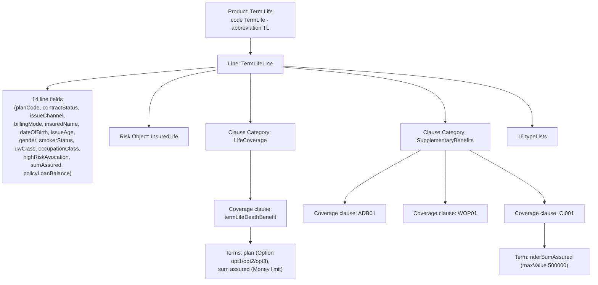

# LIFE400 → Guidewire APD — Product Discovery Summary

> **Deliverable #3** of the *LIFE400 COBOL Product Model Distillation to Guidewire APD* initiative.
> This is the **"why" document**: a human-readable audit trail that lets a reviewer reconstruct — from cited
> legacy evidence alone — how and why the latent LIFE400 product model was distilled into a single mono-line
> Guidewire Advanced Product Designer (APD) product. It is written **alongside** the APD import bundle but is
> **deliberately excluded** from `TermLife-APD-Bundle.zip` (only `product/` and `editions/` are packaged).
>
> **Scope discipline.** Every legacy source file is read **read-only**; nothing under `QCBLLESRC/`, `QCLSRC/`,
> `QCPYSRC/`, `QDDSSRC/`, `.swm/`, or `README.md` is modified, annotated, or reordered. No live push, API call,
> or upload to any Guidewire Cloud tenant is performed — the sole runtime output is a local ZIP artifact. Every
> claim below traces to a cited source file and line range in `[path:Lstart-Lend]` form.

---

## 1. Executive Summary

LIFE400 is a term-life policy administration system built for IBM AS/400 (IBM i) from ILE COBOL, DDS, and
ILE CL source, compiled into the library `LIFE400`. It spans three business domains — New Business &
Underwriting, Policy Servicing & Billing, and Claims Adjudication — yet its **product model is *latent***: it is
never declared explicitly anywhere in the source. Instead, it is encoded implicitly across the shared
copybook data definitions (`QCPYSRC/POLDATA.cpy`), the DDS persistence layout (`QDDSSRC/POLMST.pf`), and the
COBOL validation logic (`QCBLLESRC/NBUWB.cbl`). The distillation task is therefore to make that implicit model
**explicit** in APD's canonical form, without changing a single byte of the legacy system.

The headline outcome of discovery is that LIFE400 contains **exactly ONE mono-line APD Product — "Term Life"
(code `TermLife`, abbreviation `TL`)** — with **one Line (`TermLifeLine`)** and **one risk object
(`InsuredLife`)**. The three legacy plan codes `T1001` / `T2001` / `T6501` are **not** three separate products;
they are realized as the three **options** (`opt1` / `opt2` / `opt3`) of a single plan-level **Option term**
(`plan`) on the base coverage clause `termLifeDeathBenefit`, because they share one record, one file, and one
program set and — within the plan-parameter load paragraph `1100-LOAD-PLAN-PARAMETERS` — differ only in
parameter values. (A few plan-specific *runtime* predicates exist and remain in the untouched COBOL; see §4.)
The three riders `ADB01` (Accidental Death Benefit), `WOP01` (Waiver of Premium), and
`CI001` (Critical Illness) are realized as `clauseType: "Coverage"` clauses under the `SupplementaryBenefits`
category — **never as separate products**. All rating factors, computed premiums, per-transaction state, and
the 333 catalogued business rules remain in the untouched COBOL; only product *structure* is distilled, which
makes the transformation behavior-preserving by construction.

---

## 2. Discovery Method — Reachability Analysis

Product and line boundaries were established by **reachability analysis over the shared policy record and the
`.swm` knowledge graph** — **never** by assuming that each plan code is a distinct product. The governing
decision procedure is:

> **Distinct products require *disjoint* shared-record, persistence, AND program sets.
> LIFE400 fails that test on every axis** — therefore the plan codes collapse into a single product with
> plan-level Option terms.

The three-gate decision flow, and the concrete evidence that resolves each gate, is:

1. **Gate 1 — Share one policy record?** → **YES.** `01 WS-POLICY-MASTER-REC` (the `COPY POLDATA` copybook) is
   the single shared record, copied by **7 of 8** COBOL programs (§3).
2. **Gate 2 — Share one master file?** → **YES.** A single `POLMST` physical file plus the `POLMSTL1` logical
   view, keyed by `POLID`, back every program (§3).
3. **Gate 3 — Same program set, parameter-only in the plan-load paragraph?** → **YES.** A single
   `EVALUATE PM-PLAN-CODE` in `NBUWB.cbl` `1100-LOAD-PLAN-PARAMETERS` loads plan-specific parameters; *within
   that paragraph* the plans differ only in values (§4). A few plan-specific runtime predicates exist elsewhere
   (§4) but stay in COBOL and create no disjoint product structure.

Because all three gates resolve to YES, the candidates converge on a **single Product "Term Life" with
plan-level Option terms**. Per the report-don't-guess constraint, this split is recorded and justified from
evidence here rather than assumed.

---

## 3. Shared-Record Evidence (the crux)

The decisive evidence for a single product is the **shared policy-master record**. `01 WS-POLICY-MASTER-REC`
is defined exactly once, in the copybook `[QCPYSRC/POLDATA.cpy:L11-L14]`, whose header comment explicitly
labels it *"POLICY MASTER RECORD - SHARED ACROSS ALL LIFE400 MODULES"* and enumerates the consuming modules
`NBUWB, CLMADJB, SVCBILB, NBUWMNT, CLMMNT, SVCMNT` `[QCPYSRC/POLDATA.cpy:L11-L14]`.

A repository-wide scan for `COPY POLDATA` confirms that **7 of the 8 COBOL programs** pull in this one record.
The header comment lists six core modules; the scan additionally finds the read-only inquiry program
`POLMSTINQ`, for **seven** total. The **only** program that does **not** `COPY POLDATA` is `MAINMENU` — a pure
5250 menu-dispatch shell that holds no product data and merely routes the operator to each subsystem.

| # | Program (`QCBLLESRC/*.cbl`) | `COPY POLDATA`? | Citation | Role |
|---|-----------------------------|:---------------:|----------|------|
| 1 | `NBUWB`     | **Y** | `[QCBLLESRC/NBUWB.cbl:L60]`     | Batch: new business & underwriting (plan params, rider validation) |
| 2 | `NBUWMNT`   | **Y** | `[QCBLLESRC/NBUWMNT.cbl:L50]`   | Online: new business maintenance |
| 3 | `SVCBILB`   | **Y** | `[QCBLLESRC/SVCBILB.cbl:L64]`   | Batch: policy servicing & billing |
| 4 | `SVCMNT`    | **Y** | `[QCBLLESRC/SVCMNT.cbl:L56]`    | Online: servicing maintenance |
| 5 | `CLMADJB`   | **Y** | `[QCBLLESRC/CLMADJB.cbl:L58]`   | Batch: claims adjudication |
| 6 | `CLMMNT`    | **Y** | `[QCBLLESRC/CLMMNT.cbl:L55]`    | Online: claims maintenance |
| 7 | `POLMSTINQ` | **Y** | `[QCBLLESRC/POLMSTINQ.cbl:L50]` | Online: policy master inquiry (read-only) |
| 8 | `MAINMENU`  | **N** | *(none)*                        | Online: pure menu dispatch — no product data |

**One master file, one key.** Persistence reinforces the single-product finding. The policy master physical
file `POLMST` declares one record format `POLMSTREC` and is keyed by `POLID` `[QDDSSRC/POLMST.pf:L14]`,
`[QDDSSRC/POLMST.pf:L81]`. The logical view `POLMSTL1` is defined directly over it — `PFILE(POLMST)` with key
`K POLID` `[QDDSSRC/POLMSTL1.lf:L13-L14]`. The claims and servicing stores are **transaction** files linked
back to the one policy by a foreign key, not independent product masters: `CLMPF` is keyed by `CLMID` with FK
`POLID` `[QDDSSRC/CLMPF.pf:L16-L18]`, `[QDDSSRC/CLMPF.pf:L67]`, and `SVCPF` is keyed by `SVCID` with FK
`POLID` `[QDDSSRC/SVCPF.pf:L16-L18]`, `[QDDSSRC/SVCPF.pf:L54]`.

Across all three axes — **record**, **file**, and **program set** — LIFE400 shares a single spine keyed by
`POLID`. There is no disjoint structure that would justify multiple products.

---

## 4. Plan-Code Resolution → Option Terms

The three candidate plan codes `T1001` (10-Year Term), `T2001` (20-Year Term), and `T6501` (Term-to-65) are
documented in the README plans table `[README.md:L62-L66]`. In the code they are selected by a **single
`EVALUATE PM-PLAN-CODE`** statement inside the `NBUWB.cbl` paragraph `1100-LOAD-PLAN-PARAMETERS`
`[QCBLLESRC/NBUWB.cbl:L145-L192]`. Within `1100-LOAD-PLAN-PARAMETERS`, each `WHEN` branch merely assigns a set of numeric parameters into
the shared `PM-PLAN-PARAMETERS` group (the `T6501` branch additionally computes its term-years at load,
`[QCBLLESRC/NBUWB.cbl:L187-L188]`) — there is no separate record, file, or program per plan. This shared record/file/program architecture is the
decisive evidence that the plans are **variations of one product**, not three products.

The per-plan parameters, transcribed exactly as coded, are below. With **one exception**, these values are the
source for the `plan` Option-term option values `opt1` / `opt2` / `opt3` in `editions/TermLife-BaseEdition.json`,
where each **edition** option carries its plan code in a dedicated `planCode` **property** (the human-readable
plan label — e.g. `T1001 - 10-Year Term` — is carried in the corresponding **product** option's `name`, not in
the edition). The exception is the **sum-assured bounds**: the raw COBOL `MOVE` literals are 14-integer-digit
values that overflow even the copybook's own `9(13)V99` fields and contradict the program's own `25B`/`45B`
scale labels, so they are **excluded as demonstrably defective** and the edition instead carries the
**README-authoritative** magnitudes as the resolved values. The `maxSumAssured` column below therefore shows
both the raw COBOL literal and the resolved edition value; the full lineage, defect evidence, and capacity
rationale are given in §9:

| Plan (option) | maxIssueAge | maxSumAssured — COBOL literal → edition value (§9) | termYears | maturityAge | annualPolicyFee |
|---------------|:-----------:|:--------------------------------------------------:|:---------:|:-----------:|:---------------:|
| `T1001` (`opt1`) | 60 | `50000000000000` → `50000000000` | 10 | 70 | 4500 |
| `T2001` (`opt2`) | 55 | `90000000000000` → `90000000000` | 20 | 75 | 5500 |
| `T6501` (`opt3`) | 50 | `75000000000000` → `75000000000` | *null* — computed = `PM-MATURITY-AGE − PM-ISSUE-AGE` `[QCBLLESRC/NBUWB.cbl:L187-L188]` | 65 | 6000 |

Crucially, the parameters that are **identical across all three plans** confirm the single-product reading —
the plans share one common rule frame and differ only in a handful of dials `[QCBLLESRC/NBUWB.cbl:L145-L192]`:

| Shared parameter | Value | Shared parameter | Value |
|------------------|:-----:|------------------|:-----:|
| `minIssueAge`       | 18                | `suicideYrs`        | 2      |
| `minSumAssured`     | `10000000000000` → `10000000` | `reinstateWindow`   | 730    |
| `graceDays`         | 30                | `serviceFee`        | 1500   |
| `contestabilityYrs` | 2                 | `taxRate`           | 0.0200 |

**Conclusion.** Because the record, the master file, and the program set are all shared — and, within
`1100-LOAD-PLAN-PARAMETERS`, differ only in parameter values — the three plan codes are modeled as the
**options `opt1` / `opt2` / `opt3` of a single `plan` Option term on the base coverage clause
`termLifeDeathBenefit`** — with each **product** option's `name` carrying the plan label (e.g. `T1001 - 10-Year Term`) and each
**edition** option carrying its plan code in a `planCode` property. They are **never** promoted to distinct
products.

**Plan-specific runtime predicates (disclosed).** Scoping matters: *parameter-only* describes the load
paragraph `1100-LOAD-PLAN-PARAMETERS`, **not** the whole system. A handful of plan-specific **runtime**
predicates keyed on the plan code exist and remain in the untouched COBOL:

- **T6501 hazardous-occupation bar (NB-205):** when the plan is `T6501` and occupation class is 3, the
  application is rejected — enforced in both `NBUWB.cbl` `[QCBLLESRC/NBUWB.cbl:L253-L259]` and `NBUWMNT.cbl`
  `[QCBLLESRC/NBUWMNT.cbl:L326-L331]`.
- **T6501 remaining-term recompute on plan change:** servicing recomputes the term as maturity age minus
  attained age and rejects a zero remaining term `[QCBLLESRC/SVCBILB.cbl:L247-L257]`.
- **T6501 term derivation at load:** the load paragraph itself computes the term-years for `T6501`
  `[QCBLLESRC/NBUWB.cbl:L187-L188]`.

These are behavioral rules, not structural divergences: all three plans still share one record, one master
file, and one program set, so the single-product conclusion stands and every one of these predicates stays in
COBOL as runtime logic — none is re-expressed in the product model.

---

## 5. Rider Resolution → Coverage Clauses

LIFE400 supports three riders, all validated in the `NBUWB.cbl` paragraph `1500-VALIDATE-RIDERS`
`[QCBLLESRC/NBUWB.cbl:L345-L383]`:

- `ADB01` — Accidental Death Benefit
- `WOP01` — Waiver of Premium
- `CI001` — Critical Illness

Each rider maps to an APD clause with `clauseType: "Coverage"` under the clause category
`SupplementaryBenefits`, alongside the base death benefit `termLifeDeathBenefit` which sits under
`LifeCoverage`. **Riders are NEVER modeled as separate products** — they are optional coverages attached to the
single `InsuredLife` risk object.

> **Association is conceptual, not a machine-readable JSON link.** The "attached to `InsuredLife`" relationship
> describes the intended coverage-of-risk semantics; it is **not** encoded as an explicit reference in the
> Appendix A product JSON. In `product/TermLife.json`, `riskObjects` (containing `InsuredLife`) and `clauses`
> (containing the rider coverages) are **sibling arrays** under the line with **no linkage property** connecting
> a clause to a risk object. The association is documented here and realized at runtime in the untouched COBOL;
> it is not a JSON reference an APD importer would resolve.

The rider eligibility and rating constraints stay in the COBOL as **runtime** logic and are **not** re-expressed
in the product model — with **one** deliberate, documented exception (a hard structural cap):

| Rule | Constraint | Citation | Destination |
|------|-----------|----------|-------------|
| NB-502 | `ADB01` — insured issue age ≤ 60 | `[QCBLLESRC/NBUWB.cbl:L358-L365]` | Runtime (COBOL) |
| NB-503 | `WOP01` — insured issue age 18–55 | `[QCBLLESRC/NBUWB.cbl:L366-L373]` | Runtime (COBOL) |
| NB-504 | `CI001` — rider sum assured ≤ 500,000 | `[QCBLLESRC/NBUWB.cbl:L374-L381]` | **Product model** — carried as `maxValue: 500000` on the `CI001` `riderSumAssured` term |

The rider **rates** are likewise runtime and remain in COBOL, computed in paragraph
`1700-CALCULATE-RIDER-PREMIUM`: `ADB01` at 0.1800 per thousand `[QCBLLESRC/NBUWB.cbl:L411-L416]`, `WOP01` at
6% of the base annual premium `[QCBLLESRC/NBUWB.cbl:L417-L421]`, and `CI001` at 1.2500 per thousand
`[QCBLLESRC/NBUWB.cbl:L422-L427]`. Only the single NB-504 structural cap crosses into the product/edition JSON;
everything else about rider pricing is preserved untouched in the legacy program.

---

## 6. `OCCURS` and `REDEFINES` Resolution

**`OCCURS` — resolved inline.** A repository-wide scan finds **exactly one** `OCCURS` clause in the entire
codebase: `10 PM-RIDER-TABLE OCCURS 5 TIMES` `[QCPYSRC/POLDATA.cpy:L88-L96]` (indexed by `PM-RIDER-IDX`). It is
resolved to the **rider coverage-clause set on the `InsuredLife` risk object**, *not* as a standalone repeating
risk object:

- the rider code `PM-RIDER-CODE` `[QCPYSRC/POLDATA.cpy:L90]` becomes the **clause discriminator** (which rider —
  `ADB01` / `WOP01` / `CI001`);
- the rider sum assured `PM-RIDER-SUM-ASSURED` `[QCPYSRC/POLDATA.cpy:L91]` becomes a **clause term**
  (`riderSumAssured`, present on the `ADB01` and `CI001` clauses). The rider **rate** `PM-RIDER-RATE`
  `[QCPYSRC/POLDATA.cpy:L92]` is **not** a product term — it is an **unused / cleared legacy runtime slot**:
  it is never read by premium calculation, and its only reference in the entire codebase clears it to zeros
  (`MOVE ZEROS TO PM-RIDER-RATE` at `[QCBLLESRC/SVCBILB.cbl:L379]`). The rider rates premium calculation
  actually applies are **hard-coded literals** in `1700-CALCULATE-RIDER-PREMIUM`
  `[QCBLLESRC/NBUWB.cbl:L405-L431]` and do not flow through this field, so it is classified *Unmapped* (see
  the traceability matrix and §5), consistent with all rider rating staying in COBOL.

The five-element table simply bounds how many rider clauses may attach to one policy: the `OCCURS 5 TIMES`
structure is the **effective cap**, because the validation loop in `1500-VALIDATE-RIDERS` varies the index only
over slots 1–5 `[QCBLLESRC/NBUWB.cbl:L347-L348]`. The NB-501 `WS-RIDER-IDX > 5` guard
`[QCBLLESRC/NBUWB.cbl:L351-L357]` is therefore **unreachable in that loop** (the running counter cannot exceed 5
across five slots); it is a defensive check, not the operative bound. Either way the table indicates at most
five rider coverages, not five distinct coverable objects.
This resolution is stated here inline, at the point where the rider table is mapped. As noted in §5, the
phrase "on the `InsuredLife` risk object" is **conceptual**: the Appendix A product JSON encodes `riskObjects`
and `clauses` as **sibling arrays** with **no explicit machine-readable linkage property** binding a rider
clause to the risk object; the association is documented, not serialized as a JSON reference.

**`REDEFINES` — in force but unexercised.** A repository-wide scan of `QCBLLESRC/`, `QCPYSRC/`, `QCLSRC/`, and
`QDDSSRC/` finds **ZERO** `REDEFINES` clauses. The resolution rule is therefore documented as *in force but
unexercised*: had a `REDEFINES` been encountered, it would have resolved to **either** distinct fields **or** a
conditional clause choice (never both), with the rationale stated inline for that specific occurrence. Because
none exist, no such resolution was needed and none was invented.

---

## 7. Branding-Artifact Note

The heading literal **"LINCOLN LIFE INSURANCE CO."** appears in three **presentation** members and nowhere in
any data or logic member:

- main menu screen heading — `[QDDSSRC/MNUDSPF.dspf:L22]`
- policy listing report page header — `[QDDSSRC/POLRPT.prtf:L16]`
- claims report page header — `[QDDSSRC/CLMRPT.prtf:L16]`

This is in **direct contrast** with the system-of-record branding, which is **"ACME LIFE INSURANCE CO."**
throughout the source header comments and documentation — for example the copybook header
`[QCPYSRC/POLDATA.cpy:L3]`, the master-file header `[QDDSSRC/POLMST.pf:L4]`, and the README footer
`[README.md:L213]`.

Per the initiative's constraints, the "LINCOLN LIFE" display literal is a **cosmetic branding artifact** —
most likely a stale screen/report caption — and it **MUST NOT be interpreted as a distinct brand, product, or
line**. It was therefore **deliberately ignored** for product-boundary discovery. It generates no APD Product,
no edition segment, and no line; it is called out here purely so the judgment call is transparent and auditable.

---

## 8. Knowledge-Graph Context (`.swm`)

The `.swm/` Swimm knowledge graph catalogs **333 business rules** in total
`[.swm/business-rules-statistics.md:L29]`, distributed across **9** Swimm documents
`[.swm/business-rules-statistics.md:L6-L14]`:

| Swimm document | Rules | Swimm document | Rules |
|----------------|:-----:|----------------|:-----:|
| `mainmenu` (menu interaction & dispatch)        | 67 | `svcmnt` (servicing maintenance)          | 43 |
| `nbuwmnt` (new business maintenance)            | 64 | `clmmnt` (claims maintenance)             | 25 |
| `svcbilb` (batch servicing & amendments)        | 57 | `clmadjb` (claim adjudication)            | 21 |
| `nbuwb` (new business & underwriting batch)     | 48 | `polmstinq` (policy master inquiry)       | 8  |
| `changing-a-policyholders-insurance-plan`       | 0  | **Total**                                 | **333** |

**Key insight: rule *volume* does not equal product *structure*.** The `mainmenu` program carries the **most**
rules of any program (67) `[.swm/business-rules-statistics.md:L9]`, yet — as established in §3 — it holds **no**
product data and is the one program that does **not** `COPY POLDATA`. If discovery had been driven by rule
counts, it would have mis-centered the model on a pure UI dispatcher. Instead, the product model derives from
**shared-record reachability** (§2–§3), which correctly centers it on `WS-POLICY-MASTER-REC`. The full body of
333 rules — rating, lifecycle, claims, and servicing logic — remains in the untouched COBOL and is **out of
scope** for the product model; only declarative structure is distilled.

---

## 9. Structure-vs-Runtime Separation & Cross-References

The mechanism that guarantees **zero silently dropped fields** is a **binary classifier** applied to every
field of the policy record and the persisted files:

- A field is **product configuration** (→ enters the APD model) **iff** it defines a coverage, a term, a
  limit, an eligibility rule, or a classification typeList.
- Otherwise it is **per-policy or per-transaction runtime state** (→ routed to the **Unmapped Fields Report**
  with an explicit justification).

This separation is precisely what makes the distillation **behavior-preserving**: all rating factors, computed
premiums, lifecycle dates, instance identifiers, and audit artifacts stay in the COBOL, where they are still
computed exactly as before. Only the declarative product skeleton is lifted into APD.

**Coverage numbers.** Discovery reconciles the copybook super-set with the persisted DDS files to reach a
complete field inventory: **94 distinct logical fields** total = **89 elementary fields** of
`WS-POLICY-MASTER-REC` `[QCPYSRC/POLDATA.cpy:L14-L175]` + **5 standalone DDS fields** persisted only in the
physical files. Of these, **37 are mapped** to the APD model and **57 are classified as unmapped** (runtime/transaction
state). This 37/57 split is a **completed, cross-document-reconciled** classification:

- **`discovery/traceability-matrix.md`** — the unified 100%-coverage table (every COBOL field/record → APD
  JSON path, each field exactly once); the matrix proves 94 = 37 mapped + 57 unmapped.
- **`discovery/unmapped-fields-report.md`** — the companion report enumerates each of the 57 unmapped
  fields with an explicit exclusion justification. Set-equality is verified: the report's 57 entries are
  exactly the matrix's 57 unmapped rows (identical field-name set, zero duplicates, zero omissions), so the
  two documents reconcile precisely. The 57 count is therefore a finalized cross-document reconciliation.

**Sum-Assured magnitude — disclosed source discrepancy, resolved to the README-authoritative values.** Two
legacy sources state the sum-assured magnitudes differently, so the discrepancy is disclosed here in full and
then **resolved on documented evidence** (below) — it is not left open:

- The raw COBOL `MOVE` literals in `NBUWB.cbl` `[QCBLLESRC/NBUWB.cbl:L149-L178]` are **14-integer-digit**
  values: minimum `10000000000000` (all three plans); maximum `50000000000000` / `90000000000000` /
  `75000000000000` by plan.
- The README plans table `[README.md:L62-L66]` documents **smaller** magnitudes: minimum `10,000,000`; maximum
  `50,000,000,000` / `90,000,000,000` / `75,000,000,000` by plan.

The discrepancy factor is **not uniform**: the minimum differs by a factor of **10^6** (`10000000000000` vs
`10000000`), while the maxima differ by a factor of **10^3** (e.g. `50000000000000` vs `50000000000`). A blanket
"≈3 orders of magnitude" reading does **not** hold for the minimum. This non-uniformity is itself evidence that
the raw literals are **corrupt data-entry values**, not a clean unit rescale of the README figures — so the
resolution below does **not** attempt to derive the edition values by scaling the literals; it takes the README
figures directly.

**Capacity constraint, and proof the raw literals are defective.** The APD `sumAssured` attribute is
`Money(15,2)` — 13 integer digits, maximum `9,999,999,999,999.99` — which matches the copybook `PIC 9(13)V99`
(`PM-MIN-SUM-ASSURED` / `PM-MAX-SUM-ASSURED` `[QCPYSRC/POLDATA.cpy:L42-L43]`, `PM-SUM-ASSURED`
`[QCPYSRC/POLDATA.cpy:L76]`). The raw 14-integer-digit COBOL literals therefore **exceed** that capacity and are
not representable in APD `Money(15,2)`; more tellingly, they **overflow the copybook's own `9(13)V99` fields**
(13 integer digits), so a `MOVE` of a 14-digit literal into those fields high-order-truncates and cannot even
round-trip through the very fields meant to hold it. That is direct proof the literals are a legacy data-entry
defect rather than an intended magnitude. The program's **own threshold labels confirm the intended scale is
billions, not trillions**: the underwriting comment `SA>25B` `[QCBLLESRC/NBUWB.cbl:L32]`, the runtime message
`'SMOKER OVER 60 SA EXCEEDS 25B: DECLINED'` guarding the literal `25000000000000`
`[QCBLLESRC/NBUWB.cbl:L291-L293]`, and the reinsurance comment `REINSURANCE - SA OVER 45B` guarding
`45000000000000` `[QCBLLESRC/NBUWB.cbl:L470-L471]` all read "B"(illions) in the label while the guard literal
carries three extra zeros (trillions). The README magnitudes fit within `Money(15,2)` capacity.

**Resolution (definitive, evidence-based).** The distillation adopts the **README-authoritative** magnitudes as
the resolved sum-assured bounds, carried in `editions/TermLife-BaseEdition.json` — minimum `10000000`; maximum
`50000000000` / `90000000000` / `75000000000` — all representable in `Money(15,2)`. The raw COBOL `MOVE`
literals are **excluded as demonstrably defective** (they overflow their own `9(13)V99` fields and contradict
the program's own `25B` / `45B` scale labels), so they are **not** a competing authoritative value to be
"reconciled" — there is only one business-authoritative source. The README plans table `[README.md:L62-L66]`
fixes **both** the minimum and the maxima directly and independently, which is why the non-uniform
literal-vs-README factor has no bearing on the result. This distillation neither edits the COBOL nor invents a
value: it selects the representable, business-documented magnitudes over provably corrupt executable literals,
consistent with the fixed `Money` precision-15/scale-2 mapping (AAP §0.4.2) and the report-with-evidence
directive (AAP §0.6.1, §0.7.2). Correcting the legacy literals in the COBOL itself is outside this read-only
distillation and unnecessary for the product model, since the authoritative magnitudes are already documented.

**Dates.** LIFE400 is fully Y2K-remediated: all date fields are stored as 8-digit `YYYYMMDD` values
`[README.md:L206-L209]` (e.g. `PM-ISSUE-DATE`, `PM-EFFECTIVE-DATE` `[QCPYSRC/POLDATA.cpy:L108-L115]`).
Wherever a date is carried into the APD model it is emitted as an APD `Date` type — **never** as a `String`.

**Edition schema conformance — Appendix A minimum template and its documented extension (governing extension
grammar).** The Appendix A edition template (AAP §0.7.3) is the structural ground truth, and there is **no
external Guidewire APD JSON Schema** to validate against (AAP §0.5, §0.6.4). Appendix A defines the
**required-minimum** key structure, and `editions/TermLife-BaseEdition.json` contains **every** required key
with none removed or renamed:

- top level exactly `editionCode`, `effectiveDate`, `rules`;
- `rules.clauses[]` where each clause carries `clauseCode` + `availability` and a `terms[]` array;
- each term carries `termCode` + `availability` (and `defaultValue: "opt1"` on the Option-type `plan` term);
- `rules.fields[]` where each field carries `fieldCode` + `required`.

Per AAP §0.3.3 the transformation is "discovery fills the slots and never alters the shape" — i.e. discovery
**populates values inside** the required structure and never drops or renames a required key; it does not forbid
additive, value-carrying properties. Two such additive properties are present, and **each is mandated by an
explicit AAP requirement**, so they are documented here as the governing extension grammar rather than removed:

1. **`options[]` on the `plan` Option-term rule** (`/rules/clauses[0]/terms[0]/options`, three objects for
   `opt1`/`opt2`/`opt3`). AAP §0.3.2 and §0.4.1 **require** the BaseEdition to encode the plan-parameter values
   — issue-age bands, sum-assured limits, term/maturity, grace/contestability/suicide/reinstatement windows,
   fees, and tax rate — "as edition rule values, **Option term values**, and field required flags". Because
   these are **thirteen per-plan values** selected by the single `EVALUATE PM-PLAN-CODE`
   `[QCBLLESRC/NBUWB.cbl:L145-L192]`, they cannot be carried by the template's scalar slots alone; they are
   carried as one object per option — keyed by the APD option `code` (`opt1`/`opt2`/`opt3`) and the plan
   discriminator `planCode` (`= PM-PLAN-CODE`), then the **thirteen** plan-parameter values `minIssueAge`,
   `maxIssueAge`, `minSumAssured`, `maxSumAssured`, `termYears`, `maturityAge`, `graceDays`,
   `contestabilityYrs`, `suicideYrs`, `reinstateWindow`, `annualPolicyFee`, `serviceFee`, and `taxRate`, each
   mapping **1:1** to the correspondingly-named field of the `PM-PLAN-PARAMETERS` group
   `[QCPYSRC/POLDATA.cpy:L39-L52]`. This is the direct realization of the AAP's "Option term values" mandate;
   stripping it would **violate** §0.3.2/§0.4.1.
2. **`maxValue: 500000` on the `CI001` `riderSumAssured` rule** (`/rules/clauses[3]/terms[0]/maxValue`). This
   encodes the NB-504 structural rider-sum-assured cap `[QCBLLESRC/NBUWB.cbl:L374-L381]`, which AAP §0.3.2
   explicitly models as the term "Rider Sum Assured (max 500,000)". The identical cap is also carried on the
   **product** `CI001` term (`product/TermLife.json#/lines[0]/clauses[3]/terms[0]/maxValue`), so the edition
   value is a consistent restatement of an AAP-mandated product-model constraint, not an invented one.

**Reconciliation conclusion.** The edition satisfies every Appendix A required key and adds **only** the two
AAP-mandated, source-cited value carriers above. Because Appendix A is a required-minimum template (not a closed
`additionalProperties: false` schema — none exists, AAP §0.5/§0.6.4) and §0.3.2/§0.4.1 explicitly enumerate
these values for the edition, reading Appendix A as closed would make the AAP self-contradictory. The extension
is therefore conformant and is reconciled here explicitly; the product itself also passes the fail-closed
schema-completeness gate (AAP §0.6.4 — every clause has `clauseType` + `categoryCode`, every term a `termType`,
every `Option` term a non-empty `options[]`, and every field its type-appropriate attributes), so the bundle is
emitted, not excluded.

---

## 10. Final Product Shape

The assembled end state, with names kept byte-identical to `product/TermLife.json` and
`editions/TermLife-BaseEdition.json`:

| Element | Code(s) | Count |
|---------|---------|:-----:|
| Product | `TermLife` (abbreviation `TL`) | 1 |
| Line | `TermLifeLine` | 1 |
| Risk object | `InsuredLife` | 1 |
| Line fields | `planCode`, `contractStatus`, `issueChannel`, `billingMode`, `insuredName`, `dateOfBirth`, `issueAge`, `gender`, `smokerStatus`, `uwClass`, `occupationClass`, `highRiskAvocation`, `sumAssured`, `policyLoanBalance` | 14 |
| Clause categories | `LifeCoverage`, `SupplementaryBenefits` | 2 |
| Coverage clauses | `termLifeDeathBenefit`, `ADB01`, `WOP01`, `CI001` | 4 |
| Plan Option term `plan` (with 3 options) | `opt1` (T1001), `opt2` (T2001), `opt3` (T6501) | 1 term / 3 options |
| TypeLists | `PlanCode`, `ContractStatus`, `IssueChannel`, `Gender`, `SmokerStatus`, `UWClass`, `BillingMode`, `RiderCode`, `RiderStatus`, `AmendmentType`, `AmendmentStatus`, `ClaimType`, `CauseOfDeath`, `ClaimPaymentMode`, `InvestigationStatus`, `ClaimDecision` | 16 |

**Bottom line.** From the cited legacy evidence alone — one shared record copied by 7 of 8 programs, one master
file keyed by `POLID`, and one parameter-only `EVALUATE` over the plan code — the correct distillation is a
**single mono-line "Term Life" product**, with the plan codes as the **options of a single `plan` Option term**
and the riders as **Coverage clauses**. Every judgment call (single-vs-multi product, `OCCURS`/`REDEFINES` handling, the LINCOLN/ACME
branding artifact, and the evidence-based sum-assured magnitude resolution) is recorded above so the decision is fully
auditable. The distillation preserves legacy behavior by construction: only structure is captured here; all
computation stays in the untouched COBOL.
