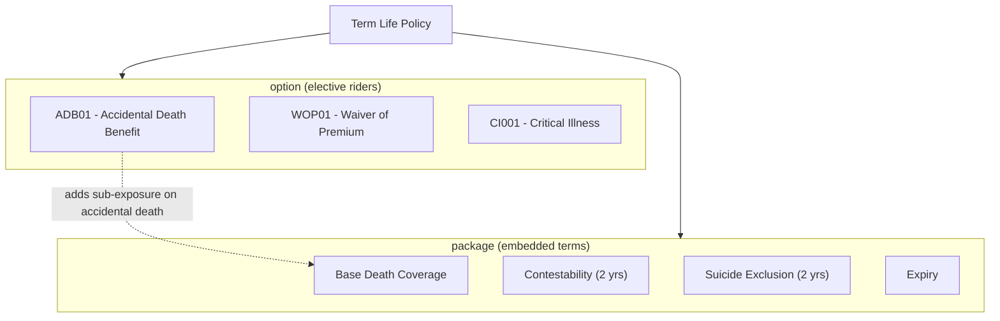

# Clauses

## Overview

This catalogue consolidates every LIFE400 clause term into two classes: elective **riders** (`option`), held in the in-memory `PM-RIDER-TABLE` and validated and priced by new-business underwriting [QCPYSRC/POLDATA.cpy:L88-L96] [QCBLLESRC/NBUWB.cbl:L345-L429], and embedded **contract terms plus base coverage** (`package`), which exist only as claim-adjudication logic [QCBLLESRC/CLMADJB.cbl:L206-L255]. Every term is classified `option` or `package`, and each description is drawn only from the COBOL message-string literals and comments cited on its row — no benefit behaviour is asserted beyond what the source states, and anything the source leaves unstated is marked `NOT SPECIFIED IN SOURCE`.

## Elective Riders (`option`)

The three elective riders are recognised by their five-character `PM-RIDER-CODE` literals inside `1500-VALIDATE-RIDERS` and `1700-CALCULATE-RIDER-PREMIUM` [QCBLLESRC/NBUWB.cbl:L345-L431]. Each is optional per policy, so each is classified `option`. Premium constants and eligibility messages are reproduced verbatim from source.

| Clause Code | Clause Name | Term Type | Description (from source literal) | Key Rule / Premium | Source |
|-------------|-------------|-----------|-----------------------------------|--------------------|--------|
| `ADB01` | Accidental Death Benefit (ADB) rider | `option` | Elective rider that adds its own sum assured to the claim payout on accidental death — settlement comment `ADD ADB RIDER SA IF ACCIDENTAL DEATH` [QCBLLESRC/CLMADJB.cbl:L259-L270]; the header return-code legend names it `ADB RIDER` [QCBLLESRC/NBUWB.cbl:L34]. | Issue age must be 60 or under — `ADB RIDER: INSURED MUST BE AGE 60 OR UNDER` (code 24) [QCBLLESRC/NBUWB.cbl:L358-L365]; annual premium `(PM-RIDER-SUM-ASSURED / 1000) * 0.1800` [QCBLLESRC/NBUWB.cbl:L411-L416]. | [QCBLLESRC/NBUWB.cbl:L358-L365]; [QCBLLESRC/NBUWB.cbl:L411-L416]; [QCBLLESRC/CLMADJB.cbl:L259-L270] |
| `WOP01` | Waiver of Premium (WOP) rider | `option` | Elective rider identified only as `WOP RIDER` in the eligibility check and header legend [QCBLLESRC/NBUWB.cbl:L35] [QCBLLESRC/NBUWB.cbl:L366-L373]; source specifies its age-eligibility band and premium, but its benefit-trigger behaviour is `NOT SPECIFIED IN SOURCE`. | Issue age must be 18 to 55 — `WOP RIDER: INSURED MUST BE AGE 18 TO 55` (code 25) [QCBLLESRC/NBUWB.cbl:L366-L373]; annual premium `PM-BASE-ANNUAL-PREMIUM * 0.06` (6% of base) [QCBLLESRC/NBUWB.cbl:L417-L421]. | [QCBLLESRC/NBUWB.cbl:L366-L373]; [QCBLLESRC/NBUWB.cbl:L417-L421] |
| `CI001` | Critical Illness (CI) rider | `option` | Elective rider identified only as `CI RIDER` in the eligibility check and header legend [QCBLLESRC/NBUWB.cbl:L36] [QCBLLESRC/NBUWB.cbl:L374-L381]; source specifies its sum-assured cap and premium, but its benefit-trigger behaviour is `NOT SPECIFIED IN SOURCE`. | Rider sum assured must not exceed 500,000 — `CI RIDER: SUM ASSURED EXCEEDS 500,000` (code 26) [QCBLLESRC/NBUWB.cbl:L374-L381]; annual premium `(PM-RIDER-SUM-ASSURED / 1000) * 1.2500` [QCBLLESRC/NBUWB.cbl:L422-L427]. | [QCBLLESRC/NBUWB.cbl:L374-L381]; [QCBLLESRC/NBUWB.cbl:L422-L427] |

> **Rider slots.** Riders occupy the fixed five-element `PM-RIDER-TABLE OCCURS 5` [QCPYSRC/POLDATA.cpy:L88-L96], each carrying a status of active (`PM-RIDER-ACTIVE` `'A'`) or removed (`PM-RIDER-REMOVED` `'R'`) [QCPYSRC/POLDATA.cpy:L95-L96]. New-business validation caps a policy at five riders — `MAXIMUM 5 RIDERS ALLOWED` (code 23) [QCBLLESRC/NBUWB.cbl:L351-L357].

## Embedded Contract Terms (`package`)

These terms carry no rider code; they are the always-present base coverage and the conditions/exclusions evaluated automatically during claim adjudication, so each is classified `package`. The source identifier is the paragraph rule tag (`CL-nnn`) shown in the Key Rule column, not a clause code (see [Observations](#observations)).

| Clause Code | Clause Name | Term Type | Description (from source literal) | Key Rule / Premium | Source |
|-------------|-------------|-----------|-----------------------------------|--------------------|--------|
| — | Base Death Coverage | `package` | The always-present core coverage backing the face amount `PM-SUM-ASSURED` [QCPYSRC/POLDATA.cpy:L76]; the sole covered peril is death, encoded as the only claim-type condition-name `PM-CLAIM-DEATH` `'DT'` [QCPYSRC/POLDATA.cpy:L141]. | Rule `CL-501` seeds the settlement from the face amount — comment `BASE PAYOUT = SUM ASSURED` [QCBLLESRC/CLMADJB.cbl:L257-L258]; it is not a separately priced rider. | [QCPYSRC/POLDATA.cpy:L76]; [QCPYSRC/POLDATA.cpy:L141]; [QCBLLESRC/CLMADJB.cbl:L257-L258] |
| — | Contestability | `package` | Condition under which a death inside the contestability period forces the claim into investigation rather than straight-through settlement — comment `DEATH WITHIN CONTESTABILITY PERIOD` [QCBLLESRC/CLMADJB.cbl:L208]; the window defaults to 2 years [README.md:L202]. | Rule `CL-301`: `WS-DAYS-CONTESTABLE = PM-CONTESTABILITY-YRS * 365`; when `WS-DAYS-SINCE-ISSUE <= WS-DAYS-CONTESTABLE` the investigation status is set to pending (`'P'`) [QCBLLESRC/CLMADJB.cbl:L206-L213]. Per-plan value is 2 years (see [products.md](products.md)). | [QCBLLESRC/CLMADJB.cbl:L206-L213]; [README.md:L202] |
| — | Suicide Exclusion | `package` | Exclusion that rejects a suicide occurring inside the suicide window — literal `SUICIDE WITHIN POLICY SUICIDE WINDOW: REJECTED` [QCBLLESRC/CLMADJB.cbl:L240]; the window defaults to 2 years [README.md:L202]. | Rule `CL-401`: `WS-DAYS-SUICIDE-WINDOW = PM-SUICIDE-YRS * 365`; when `PM-CAUSE-SUICIDE` and the death falls inside the window, it sets code 21 and the claim decision to reject (`'R'`) [QCBLLESRC/CLMADJB.cbl:L232-L244]. | [QCBLLESRC/CLMADJB.cbl:L232-L244]; [README.md:L202] |
| — | Expiry | `package` | Condition that denies cover once the insured dies after the contract's expiry date — literal `DATE OF DEATH IS AFTER POLICY EXPIRY DATE` [QCBLLESRC/CLMADJB.cbl:L248]. | Rule `CL-402`: when `PM-DATE-OF-DEATH > PM-EXPIRY-DATE`, it sets code 22 and the claim decision to reject (`'R'`) [QCBLLESRC/CLMADJB.cbl:L245-L251]. | [QCBLLESRC/CLMADJB.cbl:L245-L251] |

## Applicability

All clauses attach to the single insured life on the base Term Life policy and apply uniformly across the three products T1001, T2001, and T6501 (see [products.md](products.md)). The three elective riders each add an independent rider sub-exposure on top of the base death benefit (see [exposures.md](exposures.md)): only an active `'ADB01'` rider increases the death payout, and only on accidental death [QCBLLESRC/CLMADJB.cbl:L259-L270]. The `package` terms are not elective — base death coverage is always present, while contestability, the suicide exclusion, and expiry are evaluated automatically at claim time [QCBLLESRC/CLMADJB.cbl:L206-L251].

## Clause Applicability Diagram

## Observations

Defects and modelling gaps discovered while reverse-engineering the clause library are recorded here and are **not** remediated (this is a documentation-only catalogue).

- **Embedded terms have no clause-level identity in source.** Contestability, the suicide exclusion, and expiry exist only as inline claim-adjudication logic tagged `CL-301`/`CL-401`/`CL-402`; no rider code, table row, or copybook field names them as clauses [QCBLLESRC/CLMADJB.cbl:L232-L255]. Recorded, not remediated.
- **Suicide return-code comment names the wrong window.** The `CLMADJB` header legend describes code 21 as `SUICIDE WITHIN CONTESTABILITY WINDOW - REJECTED` [QCBLLESRC/CLMADJB.cbl:L27], but the runtime message and logic use the *suicide* window `PM-SUICIDE-YRS * 365` — `SUICIDE WITHIN POLICY SUICIDE WINDOW: REJECTED` [QCBLLESRC/CLMADJB.cbl:L233-L244]. Recorded, not remediated.
