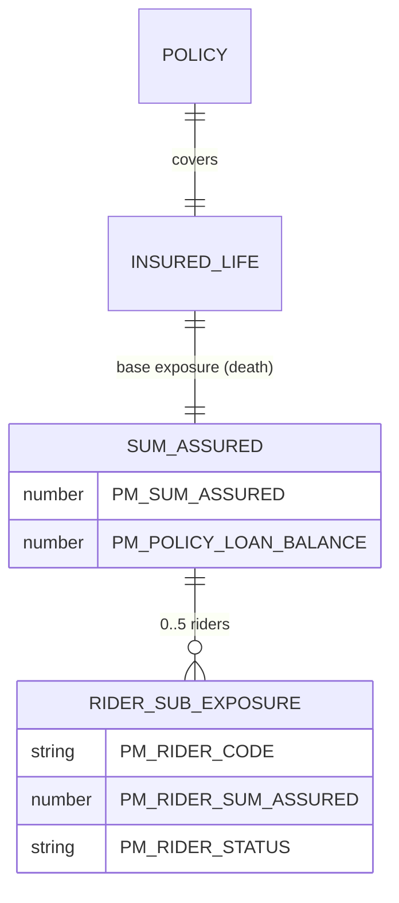

# Exposures

In LIFE400 the amount at risk and the benefit ultimately payable is the **sum assured / death benefit** carried in `PM-SUM-ASSURED` inside `PM-BENEFIT-DETAILS` [QCPYSRC/POLDATA.cpy:L75-L96], and the only covered peril is death [QCPYSRC/POLDATA.cpy:L141]. **INFERRED:** the property-and-casualty terms *exposure* and *rider sub-exposure* are not first-class source entities; they are mapped here onto `PM-SUM-ASSURED` [QCPYSRC/POLDATA.cpy:L76] and the per-rider `PM-RIDER-SUM-ASSURED` within `PM-RIDER-TABLE` [QCPYSRC/POLDATA.cpy:L91]. At settlement the payout is reduced by a modal premium withheld while the contract is in its grace period [QCBLLESRC/CLMADJB.cbl:L271-L274] and by any outstanding policy loan [QCBLLESRC/CLMADJB.cbl:L275-L279], so the paid amount can be less than the face sum assured. The single life that bears this exposure is catalogued in [risk-objects.md](risk-objects.md).

## Sum Assured Exposure

The base exposure is one field: the face amount the contract promises on the death of the insured. Settlement begins from the current stored sum assured and then applies the claim-time adjustments below (see [Settlement Adjustments](#settlement-adjustments)); the stored amount can itself be changed beforehand by a sum-assured servicing amendment [QCBLLESRC/SVCMNT.cbl:L218-L243].

| Exposure | Field (PIC) | Peril | Offsets/Adjustments | Source | Business Purpose (WHY) |
|----------|-------------|-------|---------------------|--------|------------------------|
| Sum Assured / Death Benefit | `PM-SUM-ASSURED` `PIC 9(13)V99` | Death only (`PM-CLAIM-DEATH` `'DT'`) | Outstanding loan balance (`PM-POLICY-LOAN-BALANCE`); grace-period modal premium | field [QCPYSRC/POLDATA.cpy:L76]; peril [QCPYSRC/POLDATA.cpy:L141]; loan [QCPYSRC/POLDATA.cpy:L77]; grace [QCBLLESRC/CLMADJB.cbl:L271-L274] | The face amount promised to the beneficiary on the insured's death; it is also the base against which the base annual premium is computed [QCBLLESRC/NBUWB.cbl:L389-L395]. |
| Settled benefit amount | `PM-CLAIM-PAYMENT-AMT` `PIC 9(13)V99` | Death only (`PM-CLAIM-DEATH` `'DT'`) | Net of all settlement offsets, floored at zero | field [QCPYSRC/POLDATA.cpy:L169]; waterfall [QCBLLESRC/CLMADJB.cbl:L256-L283] | Holds the exposure actually paid after adding the ADB sub-exposure and deducting loan and grace premium, so the payment never exceeds the net entitlement. |

## Rider Sub-Exposures

Each elective rider carries an independent sum assured held in the fixed five-element `PM-RIDER-TABLE` [QCPYSRC/POLDATA.cpy:L88-L89]; this per-rider amount is the sub-exposure of the base death benefit. The rider clauses that back these amounts are catalogued in [clauses.md](clauses.md).

| Sub-Exposure | Field (PIC) | Cardinality | Additive to Death Benefit? | Source | Business Purpose (WHY) |
|--------------|-------------|-------------|----------------------------|--------|------------------------|
| Rider sum assured | `PM-RIDER-SUM-ASSURED` `PIC 9(13)V99` | 0..5 per policy (`OCCURS 5`) | Only the `'ADB01'` rider, and only on accidental death | field [QCPYSRC/POLDATA.cpy:L91]; additive rule [QCBLLESRC/CLMADJB.cbl:L259-L270] | The face amount of an individual rider benefit; for accidental death the accidental-death-benefit rider's amount is added on top of the base sum assured. |

### Rider Attributes (Key Data)

The remaining `PM-RIDER-TABLE` fields are attributes that qualify each rider sub-exposure above; they are key data, not exposures in their own right.

| Attribute | Field (PIC) | Coded Domain | Source | Business Purpose (WHY) |
|-----------|-------------|--------------|--------|------------------------|
| Rider code | `PM-RIDER-CODE` `PIC X(05)` | Rider identifier literal (e.g., `'ADB01'`) | [QCPYSRC/POLDATA.cpy:L90] | Identifies which rider a slot holds; settlement keys on the literal `'ADB01'` to decide the additive accidental-death benefit [QCBLLESRC/CLMADJB.cbl:L263-L264]. |
| Rider status | `PM-RIDER-STATUS` `PIC X(01)` | `PM-RIDER-ACTIVE` `'A'` [QCPYSRC/POLDATA.cpy:L95]; `PM-RIDER-REMOVED` `'R'` [QCPYSRC/POLDATA.cpy:L96] | [QCPYSRC/POLDATA.cpy:L94] | Marks a rider slot in force or removed; only an active rider participates in the death payout [QCBLLESRC/CLMADJB.cbl:L263-L264]. |

## Peril

The single covered peril is **death**, encoded as the only condition-name on the claim-type field: `PM-CLAIM-TYPE` `PIC X(02)` carries exactly one `88` level, `PM-CLAIM-DEATH VALUE 'DT'` [QCPYSRC/POLDATA.cpy:L140-L141]. Both claim entry points reject anything else — adjudication and maintenance each fail a non-death claim with `ONLY DEATH CLAIMS ARE SUPPORTED` [QCBLLESRC/CLMADJB.cbl:L165-L169] [QCBLLESRC/CLMMNT.cbl:L183-L186] — so every exposure in this catalog is a death exposure and any non-death benefit is `NOT SPECIFIED IN SOURCE`.

## Loan-Balance Offset

The exposure actually paid is net of any outstanding policy loan. `PM-POLICY-LOAN-BALANCE` `PIC 9(13)V99 VALUE 0` [QCPYSRC/POLDATA.cpy:L77] records the loan drawn against the policy, and the settlement routine subtracts it from the payout whenever it is positive [QCBLLESRC/CLMADJB.cbl:L275-L279]. This prevents the insurer paying out the full sum assured while an unrecovered loan is still owed against the same contract.

## Settlement Adjustments

At claim time the base exposure is transformed into the settled amount (`PM-CLAIM-PAYMENT-AMT` [QCPYSRC/POLDATA.cpy:L169]) by a short waterfall in `1500-CALCULATE-SETTLEMENT`; this is summarized below, while the full, authoritative waterfall is catalogued in [pricing-and-structure.md](pricing-and-structure.md).

| Step | Adjustment | Condition | Source |
|------|------------|-----------|--------|
| CL-501 | Base payout set to `PM-SUM-ASSURED` | Always | [QCBLLESRC/CLMADJB.cbl:L257-L258] |
| CL-502 | **+** ADB rider sum assured | Accidental death and an active `'ADB01'` rider | [QCBLLESRC/CLMADJB.cbl:L259-L270] |
| CL-503 | **−** modal premium | Policy in grace period | [QCBLLESRC/CLMADJB.cbl:L271-L274] |
| CL-504 | **−** outstanding loan balance | Loan balance greater than zero | [QCBLLESRC/CLMADJB.cbl:L275-L279] |
| Floor | Result floored at zero | Computed amount negative | [QCBLLESRC/CLMADJB.cbl:L280-L283] |

## Exposure Model Diagram

## Observations

- The death-benefit settlement adds only the rider whose code equals the literal `'ADB01'` [QCBLLESRC/CLMADJB.cbl:L263-L264]; the `PM-RIDER-SUM-ASSURED` of any other active rider in `PM-RIDER-TABLE` [QCPYSRC/POLDATA.cpy:L91] is never added to `PM-CLAIM-PAYMENT-AMT`, so a non-ADB rider sub-exposure does not increase the death payout. Recorded, not remediated.
- `PM-CLAIM-TYPE` defines exactly one peril value, `'DT'` [QCPYSRC/POLDATA.cpy:L140-L141]; there is no maturity, surrender, or survival benefit peril, so all such exposures are `NOT SPECIFIED IN SOURCE`. Recorded, not remediated.
