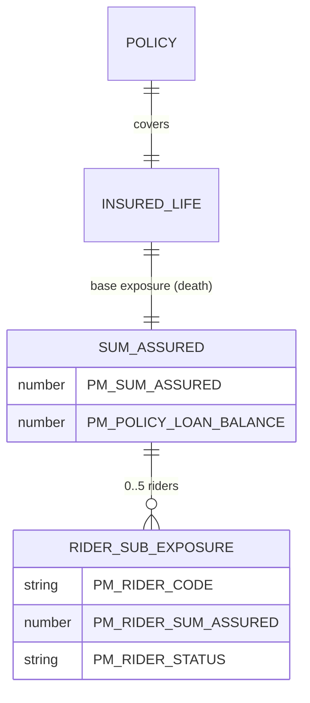

# Exposures

In LIFE400 the *exposure* — the amount at risk and the benefit ultimately payable — is the **sum assured / death benefit** borne by the single insured life, and the only covered peril is death. This property-and-casualty term "exposure" maps directly onto the life-insurance benefit copybook groups: the base exposure is `PM-SUM-ASSURED` inside `PM-BENEFIT-DETAILS` [QCPYSRC/POLDATA.cpy:L75-L96], the sole peril is death [QCPYSRC/POLDATA.cpy:L141], and each elective rider carries its own sub-exposure within the `PM-RIDER-TABLE`. The exposure finally settled is reduced by any outstanding policy loan and by a modal premium withheld when the contract is in its grace period, so the paid amount can be less than the face sum assured. The single life that bears this exposure is catalogued in [risk-objects.md](risk-objects.md).

## Sum Assured Exposure

The base exposure is one field: the face amount the contract promises on the death of the insured. It is stored gross and reduced only at claim time (see [Settlement Adjustments](#settlement-adjustments)).

| Exposure | Field (PIC) | Peril | Offsets/Adjustments | Source | Business Purpose (WHY) |
|----------|-------------|-------|---------------------|--------|------------------------|
| Sum Assured / Death Benefit | `PM-SUM-ASSURED` `PIC 9(13)V99` | Death only (`PM-CLAIM-DEATH` `'DT'`) | Outstanding loan balance (`PM-POLICY-LOAN-BALANCE`); grace-period modal premium | field [QCPYSRC/POLDATA.cpy:L76]; peril [QCPYSRC/POLDATA.cpy:L141]; loan [QCPYSRC/POLDATA.cpy:L77]; grace [QCBLLESRC/CLMADJB.cbl:L271-L274] | The face amount promised to the beneficiary on the insured's death; it is the primary amount at risk that the whole contract is priced and reserved against. |
| Settled benefit amount | `PM-CLAIM-PAYMENT-AMT` `PIC 9(13)V99` | Death only (`PM-CLAIM-DEATH` `'DT'`) | Net of all settlement offsets, floored at zero | field [QCPYSRC/POLDATA.cpy:L169]; waterfall [QCBLLESRC/CLMADJB.cbl:L256-L283] | Holds the exposure actually paid after adding the ADB sub-exposure and deducting loan and grace premium, so the cheque never exceeds the net entitlement. |

## Rider Sub-Exposures

Each elective rider carries an independent sum assured held in the fixed five-element `PM-RIDER-TABLE` [QCPYSRC/POLDATA.cpy:L88-L89]; these are sub-exposures of the base death benefit. The rider clauses that back these amounts are catalogued in [clauses.md](clauses.md).

| Sub-Exposure | Field (PIC) | Cardinality | Additive to Death Benefit? | Source | Business Purpose (WHY) |
|--------------|-------------|-------------|----------------------------|--------|------------------------|
| Rider sum assured | `PM-RIDER-SUM-ASSURED` `PIC 9(13)V99` | 0..5 per policy (`OCCURS 5`) | Only the `'ADB01'` rider, and only on accidental death | field [QCPYSRC/POLDATA.cpy:L91]; additive rule [QCBLLESRC/CLMADJB.cbl:L259-L270] | The face amount of an individual rider benefit; for accidental death the accidental-death-benefit rider's amount is added on top of the base sum assured. |
| Rider code | `PM-RIDER-CODE` `PIC X(05)` | 0..5 per policy | Selects which sub-exposure applies | [QCPYSRC/POLDATA.cpy:L90] | Identifies which rider clause a sub-exposure belongs to; the settlement logic keys on the literal `'ADB01'` to decide the additive accidental-death benefit. |
| Rider status | `PM-RIDER-STATUS` `PIC X(01)` | 0..5 per policy | Only an active (`'A'`) rider participates | field [QCPYSRC/POLDATA.cpy:L94]; active [QCPYSRC/POLDATA.cpy:L95]; removed [QCPYSRC/POLDATA.cpy:L96] | Distinguishes an in-force rider sub-exposure from a removed one, so a cancelled rider contributes nothing to the payout. |

## Peril

The single covered peril is **death**, encoded as the only condition-name on the claim-type field: `PM-CLAIM-TYPE` `PIC X(02)` carries exactly one `88` level, `PM-CLAIM-DEATH VALUE 'DT'` [QCPYSRC/POLDATA.cpy:L140-L141]. No other claim type or peril — maturity, surrender, disability, or survival — is defined in source, so every exposure in this catalog is a death exposure and any non-death benefit is `NOT SPECIFIED IN SOURCE`.

## Loan-Balance Offset

The exposure actually paid is net of any outstanding policy loan. `PM-POLICY-LOAN-BALANCE` `PIC 9(13)V99 VALUE 0` [QCPYSRC/POLDATA.cpy:L77] records the loan drawn against the policy, and the settlement routine subtracts it from the payout whenever it is positive [QCBLLESRC/CLMADJB.cbl:L275-L279]. This prevents the insurer paying out the full sum assured while an unrecovered loan is still owed against the same contract.

## Settlement Adjustments

At claim time the base exposure is transformed into the settled amount (`PM-CLAIM-PAYMENT-AMT` [QCPYSRC/POLDATA.cpy:L169]) by a short waterfall in `1500-CALCULATE-SETTLEMENT`; this is summarized below, while the full, authoritative waterfall is catalogued in [pricing-and-structure.md](pricing-and-structure.md).

| Step | Adjustment | Condition | Source |
|------|------------|-----------|--------|
| CL-501 | Base payout set to `PM-SUM-ASSURED` | Always | [QCBLLESRC/CLMADJB.cbl:L257-L258] |
| CL-502 | **+** ADB rider sum assured | Accidental death and an active `'ADB01'` rider | [QCBLLESRC/CLMADJB.cbl:L259-L270] |
| CL-503 | **−** modal premium | Policy in grace period | [QCBLLESRC/CLMADJB.cbl:L271-L274] |
| CL-504 | **−** outstanding loan balance | Loan balance greater than zero | [QCBLLESRC/CLMADJB.cbl:L275-L279] |
| Floor | Result floored at zero | Computed amount negative | [QCBLLESRC/CLMADJB.cbl:L280-L283] |

## Exposure Model Diagram

## Observations

- The death-benefit settlement adds only the rider whose code equals the literal `'ADB01'` [QCBLLESRC/CLMADJB.cbl:L263-L264]; the `PM-RIDER-SUM-ASSURED` of any other active rider in `PM-RIDER-TABLE` [QCPYSRC/POLDATA.cpy:L91] is never added to `PM-CLAIM-PAYMENT-AMT`, so a non-ADB rider sub-exposure does not increase the death payout. Recorded, not remediated.
- `PM-CLAIM-TYPE` defines exactly one peril value, `'DT'` [QCPYSRC/POLDATA.cpy:L140-L141]; there is no maturity, surrender, or survival benefit peril, so all such exposures are `NOT SPECIFIED IN SOURCE`. Recorded, not remediated.
