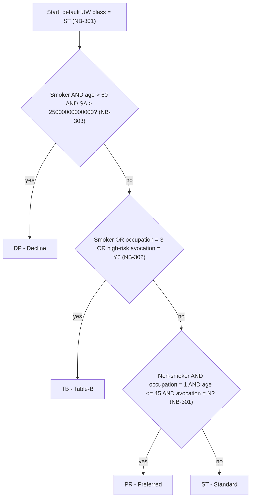

# Model Properties

## Overview

This catalogue documents every **coded model property** of LIFE400 — the enumerated (level-88) value domains defined on the shared policy master record `WS-POLICY-MASTER-REC` [QCPYSRC/POLDATA.cpy:L14] — together with the source-derived **availability logic** that governs underwriting eligibility and pricing selection [QCBLLESRC/NBUWB.cbl:L275-L340]. Each property is expressed with one **FEEL** (Friendly Enough Expression Language; OMG DMN) availability expression: for a plain enumeration the expression states the permitted-value domain (an existence constraint) using FEEL list membership `x in [...]`, because the copybook allocates every field unconditionally; where source logic gates a value conditionally, the expression uses FEEL `if … then … else`, boolean `and`/`or`, comparisons, and inclusive interval syntax `[a..b]`. Any expression whose meaning is inferred beyond literal COBOL is prefixed **`INFERRED:`** and cites the ambiguous line; `default`, `min`, and `max` are populated **only** from explicit `VALUE` clauses, `MOVE`-based defaults, or numeric `PIC` boundaries, and are otherwise marked **`NOT SPECIFIED IN SOURCE`**. The catalogue is presented as copybook-section-grouped tables that share one uniform column schema (`Property | Copybook Field (PIC) | Coded Domain (88 values) | FEEL Availability Expression | Default | Min | Max | Tag (copybook section) | Source`); the coded properties described here are the same domains consumed by the products, risk-object, exposure, and clause catalogues ([products.md](products.md), [risk-objects.md](risk-objects.md), [exposures.md](exposures.md), [clauses.md](clauses.md)).

## Coded Model Properties

The tables below enumerate the fourteen level-88 coded domains plus the additional coded fields (`PM-OCCUPATION-CLASS`, `PM-HIGH-RISK-AVOCATION`, `PM-UW-REQUIRED`, and the four claim documentation flags) that participate in the same eligibility and pricing logic. Coded-value meanings are taken verbatim from the copybook condition-names; the FEEL column states each property's permitted-value domain, and the conditional availability of derived values is catalogued separately in [Derived Availability Properties](#derived-availability-properties).

### Control Area (`PM-CONTROL-AREA`)

These two properties record the contract's lifecycle state and its distribution origin: the contract status gates which servicing and claim transitions are legal for a policy, while the issue channel records whether the application entered through a branch, an agent, or the online channel.

| Property | Copybook Field (PIC) | Coded Domain (88 values) | FEEL Availability Expression | Default | Min | Max | Tag (copybook section) | Source |
|----------|----------------------|--------------------------|------------------------------|---------|-----|-----|------------------------|--------|
| Contract status | `PM-CONTRACT-STATUS` `PIC X(02)` | `PE`=pending, `AC`=active, `GR`=grace, `LA`=lapsed, `RS`=reinstated, `CL`=claimed, `TE`=terminated, `RJ`=declined [QCPYSRC/POLDATA.cpy:L23-L30] | `PM-CONTRACT-STATUS in ["PE","AC","GR","LA","RS","CL","TE","RJ"]` | NOT SPECIFIED IN SOURCE | NOT SPECIFIED IN SOURCE | NOT SPECIFIED IN SOURCE | `PM-CONTROL-AREA` | [QCPYSRC/POLDATA.cpy:L22] |
| Issue channel | `PM-ISSUE-CHANNEL` `PIC X(02)` | `BR`=branch, `AG`=agent, `ON`=online [QCPYSRC/POLDATA.cpy:L32-L34] | `PM-ISSUE-CHANNEL in ["BR","AG","ON"]` | NOT SPECIFIED IN SOURCE | NOT SPECIFIED IN SOURCE | NOT SPECIFIED IN SOURCE | `PM-CONTROL-AREA` | [QCPYSRC/POLDATA.cpy:L31] |

### Insured Details (`PM-INSURED-DETAILS`)

These properties describe the single insured life and drive risk selection: gender, smoker status, and occupation class each select a mortality rating factor [QCBLLESRC/NBUWB.cbl:L315-L333]; the underwriting class is the composite risk verdict that both selects the UW rating factor [QCBLLESRC/NBUWB.cbl:L334-L340] and can decline the life; and the high-risk-avocation flag pushes a borderline life into Table-B and triggers manual-underwriting referral.

| Property | Copybook Field (PIC) | Coded Domain (88 values) | FEEL Availability Expression | Default | Min | Max | Tag (copybook section) | Source |
|----------|----------------------|--------------------------|------------------------------|---------|-----|-----|------------------------|--------|
| Gender | `PM-GENDER` `PIC X(01)` | `F`=female, `M`=male [QCPYSRC/POLDATA.cpy:L61-L62] | `PM-GENDER in ["F","M"]` | NOT SPECIFIED IN SOURCE | NOT SPECIFIED IN SOURCE | NOT SPECIFIED IN SOURCE | `PM-INSURED-DETAILS` | [QCPYSRC/POLDATA.cpy:L60] |
| Smoker status | `PM-SMOKER-STATUS` `PIC X(01)` | `S`=smoker, `N`=non-smoker [QCPYSRC/POLDATA.cpy:L64-L65] | `PM-SMOKER-STATUS in ["S","N"]` | NOT SPECIFIED IN SOURCE | NOT SPECIFIED IN SOURCE | NOT SPECIFIED IN SOURCE | `PM-INSURED-DETAILS` | [QCPYSRC/POLDATA.cpy:L63] |
| Underwriting class | `PM-UW-CLASS` `PIC X(02)` | `PR`=preferred, `ST`=standard, `TB`=table-B, `DP`=decline [QCPYSRC/POLDATA.cpy:L68-L71] | `PM-UW-CLASS in ["PR","ST","TB","DP"]` | `'ST'` (MOVE-based) [QCBLLESRC/NBUWB.cbl:L275] | NOT SPECIFIED IN SOURCE | NOT SPECIFIED IN SOURCE | `PM-INSURED-DETAILS` | [QCPYSRC/POLDATA.cpy:L67] |
| Occupation class | `PM-OCCUPATION-CLASS` `PIC 9(01)` | Numeric class (no 88-levels); source uses 1–4 — class 3 = hazardous, class 4 = severe [QCBLLESRC/NBUWB.cbl:L327-L333] | `PM-OCCUPATION-CLASS in [0..9]` | NOT SPECIFIED IN SOURCE | `0` (PIC) [QCPYSRC/POLDATA.cpy:L66] | `9` (PIC) [QCPYSRC/POLDATA.cpy:L66] | `PM-INSURED-DETAILS` | [QCPYSRC/POLDATA.cpy:L66] |
| High-risk avocation | `PM-HIGH-RISK-AVOCATION` `PIC X(01)` | `Y`/`N` (no 88-levels) | `PM-HIGH-RISK-AVOCATION in ["Y","N"]` | `'N'` [QCPYSRC/POLDATA.cpy:L72] | NOT SPECIFIED IN SOURCE | NOT SPECIFIED IN SOURCE | `PM-INSURED-DETAILS` | [QCPYSRC/POLDATA.cpy:L72] |

### Benefit Details (`PM-BENEFIT-DETAILS`)

These properties describe how the benefit is collected and which elective riders are attached to it: the billing mode selects the modal-loading factor applied when the annual premium is split into instalments, and the rider status marks each `PM-RIDER-TABLE` slot as in force or removed.

| Property | Copybook Field (PIC) | Coded Domain (88 values) | FEEL Availability Expression | Default | Min | Max | Tag (copybook section) | Source |
|----------|----------------------|--------------------------|------------------------------|---------|-----|-----|------------------------|--------|
| Billing mode | `PM-BILLING-MODE` `PIC X(01)` | `A`=annual, `S`=semi-annual, `Q`=quarterly, `M`=monthly [QCPYSRC/POLDATA.cpy:L79-L82] | `PM-BILLING-MODE in ["A","S","Q","M"]` | NOT SPECIFIED IN SOURCE | NOT SPECIFIED IN SOURCE | NOT SPECIFIED IN SOURCE | `PM-BENEFIT-DETAILS` | [QCPYSRC/POLDATA.cpy:L78] |
| Rider status | `PM-RIDER-STATUS` `PIC X(01)` | `A`=active, `R`=removed [QCPYSRC/POLDATA.cpy:L95-L96] | `PM-RIDER-STATUS in ["A","R"]` | NOT SPECIFIED IN SOURCE | NOT SPECIFIED IN SOURCE | NOT SPECIFIED IN SOURCE | `PM-BENEFIT-DETAILS / PM-RIDER-TABLE` | [QCPYSRC/POLDATA.cpy:L94] |

### Servicing Details (`PM-SERVICING-DETAILS`)

These properties classify a mid-life policy amendment and track its approval: the amendment type dispatches which servicing routine runs, the amendment status records whether the change is pending, approved, or rejected, and the underwriting-required flag records whether the amendment re-triggers underwriting.

| Property | Copybook Field (PIC) | Coded Domain (88 values) | FEEL Availability Expression | Default | Min | Max | Tag (copybook section) | Source |
|----------|----------------------|--------------------------|------------------------------|---------|-----|-----|------------------------|--------|
| Amendment type | `PM-AMENDMENT-TYPE` `PIC X(02)` | `PL`=plan change, `SA`=sum assured, `BM`=billing mode, `AR`=add rider, `RR`=remove rider, `RI`=reinstate [QCPYSRC/POLDATA.cpy:L119-L124] | `PM-AMENDMENT-TYPE in ["PL","SA","BM","AR","RR","RI"]` | NOT SPECIFIED IN SOURCE | NOT SPECIFIED IN SOURCE | NOT SPECIFIED IN SOURCE | `PM-SERVICING-DETAILS` | [QCPYSRC/POLDATA.cpy:L118] |
| Amendment status | `PM-AMENDMENT-STATUS` `PIC X(02)` | `PE`=pending, `AP`=approved, `RJ`=rejected [QCPYSRC/POLDATA.cpy:L134-L136] | `PM-AMENDMENT-STATUS in ["PE","AP","RJ"]` | NOT SPECIFIED IN SOURCE | NOT SPECIFIED IN SOURCE | NOT SPECIFIED IN SOURCE | `PM-SERVICING-DETAILS` | [QCPYSRC/POLDATA.cpy:L133] |
| Underwriting required | `PM-UW-REQUIRED` `PIC X(01)` | `Y`/`N` (no 88-levels) | `PM-UW-REQUIRED in ["Y","N"]` | `'N'` [QCPYSRC/POLDATA.cpy:L132] | NOT SPECIFIED IN SOURCE | NOT SPECIFIED IN SOURCE | `PM-SERVICING-DETAILS` | [QCPYSRC/POLDATA.cpy:L132] |

### Claim Details (`PM-CLAIM-DETAILS`)

These properties classify a death claim end-to-end: the claim type restricts cover to death only, the cause of death drives the suicide and accidental-death rules, the documentation flags and investigation status gate adjudication readiness, and the payment mode and claim decision record how and whether the benefit is paid.

| Property | Copybook Field (PIC) | Coded Domain (88 values) | FEEL Availability Expression | Default | Min | Max | Tag (copybook section) | Source |
|----------|----------------------|--------------------------|------------------------------|---------|-----|-----|------------------------|--------|
| Claim type | `PM-CLAIM-TYPE` `PIC X(02)` | `DT`=death (only value) [QCPYSRC/POLDATA.cpy:L141] | `PM-CLAIM-TYPE in ["DT"]` | NOT SPECIFIED IN SOURCE | NOT SPECIFIED IN SOURCE | NOT SPECIFIED IN SOURCE | `PM-CLAIM-DETAILS` | [QCPYSRC/POLDATA.cpy:L140] |
| Cause of death | `PM-CAUSE-OF-DEATH` `PIC X(03)` | `NAT`=natural, `ACC`=accident, `SUI`=suicide, `HOM`=homicide, `UNK`=unknown [QCPYSRC/POLDATA.cpy:L143-L147] | `PM-CAUSE-OF-DEATH in ["NAT","ACC","SUI","HOM","UNK"]` | NOT SPECIFIED IN SOURCE | NOT SPECIFIED IN SOURCE | NOT SPECIFIED IN SOURCE | `PM-CLAIM-DETAILS` | [QCPYSRC/POLDATA.cpy:L142] |
| Claim payment mode | `PM-CLAIM-PAYMENT-MODE` `PIC X(01)` | `C`=check, `A`=ACH [QCPYSRC/POLDATA.cpy:L159-L160] | `PM-CLAIM-PAYMENT-MODE in ["C","A"]` | NOT SPECIFIED IN SOURCE | NOT SPECIFIED IN SOURCE | NOT SPECIFIED IN SOURCE | `PM-CLAIM-DETAILS` | [QCPYSRC/POLDATA.cpy:L158] |
| Investigation status | `PM-INVESTIGATION-STATUS` `PIC X(01)` | `N`=not required, `P`=pending, `C`=complete [QCPYSRC/POLDATA.cpy:L162-L164] | `PM-INVESTIGATION-STATUS in ["N","P","C"]` | NOT SPECIFIED IN SOURCE | NOT SPECIFIED IN SOURCE | NOT SPECIFIED IN SOURCE | `PM-CLAIM-DETAILS` | [QCPYSRC/POLDATA.cpy:L161] |
| Claim decision | `PM-CLAIM-DECISION` `PIC X(01)` | `A`=approved, `R`=rejected, `P`=pending [QCPYSRC/POLDATA.cpy:L166-L168] | `PM-CLAIM-DECISION in ["A","R","P"]` | NOT SPECIFIED IN SOURCE | NOT SPECIFIED IN SOURCE | NOT SPECIFIED IN SOURCE | `PM-CLAIM-DETAILS` | [QCPYSRC/POLDATA.cpy:L165] |
| Claim documentation flags | `PM-DEATH-CERT-RECD`, `PM-CLAIM-FORM-RECD`, `PM-ID-PROOF-RECD`, `PM-MEDICAL-RECORDS-RECD` `PIC X(01)` | `Y`/`N` per flag (no 88-levels) | `PM-DEATH-CERT-RECD in ["Y","N"] and PM-CLAIM-FORM-RECD in ["Y","N"] and PM-ID-PROOF-RECD in ["Y","N"] and PM-MEDICAL-RECORDS-RECD in ["Y","N"]` | `'N'` [QCPYSRC/POLDATA.cpy:L148-L151] | NOT SPECIFIED IN SOURCE | NOT SPECIFIED IN SOURCE | `PM-CLAIM-DETAILS` | [QCPYSRC/POLDATA.cpy:L148-L151] |

## Source-Defined Defaults (reference)

The fields below are the **only** properties that carry an explicit default in source (a `VALUE` clause or a `MOVE`-based initialisation); every other coded property's `Default` is `NOT SPECIFIED IN SOURCE`. This reference exists so that each populated `Default` cell above is traceable to its exact source of evidence and no default is fabricated.

| Field | Explicit Default | Evidence | Source |
|-------|------------------|----------|--------|
| `PM-RETURN-CODE` `PIC 9(02)` | `0` | `VALUE 0` | [QCPYSRC/POLDATA.cpy:L36] |
| `PM-RETURN-MESSAGE` `PIC X(100)` | `SPACES` | `VALUE SPACES` | [QCPYSRC/POLDATA.cpy:L37] |
| `PM-HIGH-RISK-AVOCATION` `PIC X(01)` | `'N'` | `VALUE 'N'` | [QCPYSRC/POLDATA.cpy:L72] |
| `PM-FLAT-EXTRA-RATE` `PIC 9(02)V9999` | `0` | `VALUE 0` | [QCPYSRC/POLDATA.cpy:L73] |
| `PM-POLICY-LOAN-BALANCE` `PIC 9(13)V99` | `0` | `VALUE 0` | [QCPYSRC/POLDATA.cpy:L77] |
| `PM-UW-REQUIRED` `PIC X(01)` | `'N'` | `VALUE 'N'` | [QCPYSRC/POLDATA.cpy:L132] |
| `PM-DEATH-CERT-RECD` `PIC X(01)` | `'N'` | `VALUE 'N'` | [QCPYSRC/POLDATA.cpy:L148] |
| `PM-CLAIM-FORM-RECD` `PIC X(01)` | `'N'` | `VALUE 'N'` | [QCPYSRC/POLDATA.cpy:L149] |
| `PM-ID-PROOF-RECD` `PIC X(01)` | `'N'` | `VALUE 'N'` | [QCPYSRC/POLDATA.cpy:L150] |
| `PM-MEDICAL-RECORDS-RECD` `PIC X(01)` | `'N'` | `VALUE 'N'` | [QCPYSRC/POLDATA.cpy:L151] |
| `PM-UW-CLASS` `PIC X(02)` | `'ST'` | `MOVE 'ST'` (paragraph entry) | [QCBLLESRC/NBUWB.cbl:L275] |

## Derived Availability Properties

These properties are not stored coded domains but availability predicates reverse-engineered from `IF`/`EVALUATE`/`PIC` logic. The underwriting-class value is derived by three sequential `IF` blocks whose later assignments override earlier ones, so the effective precedence is decline → Table-B → preferred → standard; the FEEL below renders that net precedence as an `if … else if …` chain that is behaviourally equivalent to the source (preferred and Table-B criteria are mutually exclusive, and the decline test dominates because a smoker also satisfies the Table-B test). The plan and rider rows translate the per-plan issue-age `MOVE` limits and the rider eligibility comparisons into FEEL intervals.

| Property | Copybook Field (PIC) | Coded Domain (88 values) | FEEL Availability Expression | Default | Min | Max | Tag (copybook section) | Source |
|----------|----------------------|--------------------------|------------------------------|---------|-----|-----|------------------------|--------|
| Underwriting-class determination | `PM-UW-CLASS` `PIC X(02)` (derived) | Result in `PR`/`ST`/`TB`/`DP` [QCPYSRC/POLDATA.cpy:L68-L71] | `if PM-SMOKER-STATUS = "S" and PM-ISSUE-AGE > 60 and PM-SUM-ASSURED > 25000000000000 then "DP" else if (PM-SMOKER-STATUS = "S" or PM-OCCUPATION-CLASS = 3 or PM-HIGH-RISK-AVOCATION = "Y") then "TB" else if (PM-SMOKER-STATUS = "N" and PM-OCCUPATION-CLASS = 1 and PM-ISSUE-AGE <= 45 and PM-HIGH-RISK-AVOCATION = "N") then "PR" else "ST"` | `'ST'` (MOVE-based) [QCBLLESRC/NBUWB.cbl:L275] | NOT SPECIFIED IN SOURCE | NOT SPECIFIED IN SOURCE | `PM-INSURED-DETAILS` | [QCBLLESRC/NBUWB.cbl:L275-L296] |
| Plan issue-age availability | `PM-ISSUE-AGE` `PIC 9(03)` vs `PM-PLAN-CODE` | Result in `available`/`not available` | `if PM-PLAN-CODE = "T1001" then PM-ISSUE-AGE in [18..60] else if PM-PLAN-CODE = "T2001" then PM-ISSUE-AGE in [18..55] else if PM-PLAN-CODE = "T6501" then PM-ISSUE-AGE in [18..50] else false` | NOT SPECIFIED IN SOURCE | `18` [QCBLLESRC/NBUWMNT.cbl:L227] | `60` [QCBLLESRC/NBUWMNT.cbl:L228] | `PM-PLAN-PARAMETERS` | [QCBLLESRC/NBUWMNT.cbl:L226-L266] |
| T6501 occupation availability | `PM-OCCUPATION-CLASS` `PIC 9(01)` vs `PM-PLAN-CODE` | Result in `available`/`not available` | `INFERRED: if PM-PLAN-CODE = "T6501" and PM-OCCUPATION-CLASS = 3 then "not available" else "available"` [QCBLLESRC/NBUWMNT.cbl:L326-L331] | NOT SPECIFIED IN SOURCE | NOT SPECIFIED IN SOURCE | NOT SPECIFIED IN SOURCE | `PM-INSURED-DETAILS` | [QCBLLESRC/NBUWMNT.cbl:L326-L331] |
| ADB01 rider availability | `PM-ISSUE-AGE` `PIC 9(03)` | Result in `available`/`not available` | `if PM-ISSUE-AGE <= 60 then "available" else "not available"` | NOT SPECIFIED IN SOURCE | NOT SPECIFIED IN SOURCE | `60` [QCBLLESRC/NBUWB.cbl:L360] | `PM-BENEFIT-DETAILS / PM-RIDER-TABLE` | [QCBLLESRC/NBUWB.cbl:L358-L365] |
| WOP01 rider availability | `PM-ISSUE-AGE` `PIC 9(03)` | Result in `available`/`not available` | `if PM-ISSUE-AGE in [18..55] then "available" else "not available"` | NOT SPECIFIED IN SOURCE | `18` [QCBLLESRC/NBUWB.cbl:L368] | `55` [QCBLLESRC/NBUWB.cbl:L368] | `PM-BENEFIT-DETAILS / PM-RIDER-TABLE` | [QCBLLESRC/NBUWB.cbl:L366-L373] |
| CI001 rider availability | `PM-RIDER-SUM-ASSURED` `PIC 9(13)V99` | Result in `available`/`not available` | `if PM-RIDER-SUM-ASSURED <= 500000 then "available" else "not available"` | NOT SPECIFIED IN SOURCE | NOT SPECIFIED IN SOURCE | `500000` [QCBLLESRC/NBUWB.cbl:L376] | `PM-BENEFIT-DETAILS / PM-RIDER-TABLE` | [QCBLLESRC/NBUWB.cbl:L374-L381] |

## Underwriting-Class Determination

The flowchart mirrors paragraph `1300-DETERMINE-UW-CLASS` (rules NB-301 through NB-303): the field is seeded to standard, then optionally raised to preferred, overridden to Table-B, and finally overridden to decline, so the last matching branch wins.

## Unclassified Entities

None; all coded model properties discovered in source are catalogued in the tables above.

## Observations

The following defects were surfaced during reverse-engineering and are recorded here without remediation, per the documentation-only scope.

- **Divergent severe-occupation decline between the two "synced" programs.** In `NBUWB.cbl` the class-4 severe-occupation decline sets `'DP'` and immediately `EXIT PARAGRAPH` [QCBLLESRC/NBUWB.cbl:L262-L267], but the block that `NBUWMNT.cbl` claims is the "SAME LOGIC" [QCBLLESRC/NBUWMNT.cbl:L220-L221] omits the `EXIT PARAGRAPH` [QCBLLESRC/NBUWMNT.cbl:L333-L338], so the `'DP'` it assigns can be overwritten to `'ST'` when `1300-DETERMINE-UW-CLASS` re-seeds the class [QCBLLESRC/NBUWMNT.cbl:L340-L341].
- **Validation-stage declines sit outside the UW-class FEEL.** The class-4 severe-occupation decline and the T6501 hazardous-occupation decline are raised in `1200-VALIDATE-APPLICATION` [QCBLLESRC/NBUWB.cbl:L253-L268], and the caller returns on a non-zero result code before `1300-DETERMINE-UW-CLASS` runs [QCBLLESRC/NBUWB.cbl:L94-L101], so those two decline paths are not represented in the `PM-UW-CLASS` derivation expression above.
- **No source default for coded status domains.** Aside from the underwriting class, which is `MOVE`-initialised to `'ST'` [QCBLLESRC/NBUWB.cbl:L275], none of the level-88 status/enumeration domains carries a `VALUE` clause on its group field, so an uninitialised policy record leaves them as blanks rather than a defined coded value [QCPYSRC/POLDATA.cpy:L22] [QCPYSRC/POLDATA.cpy:L78] [QCPYSRC/POLDATA.cpy:L140].
