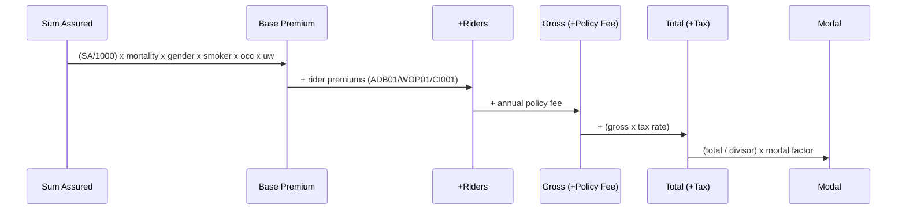
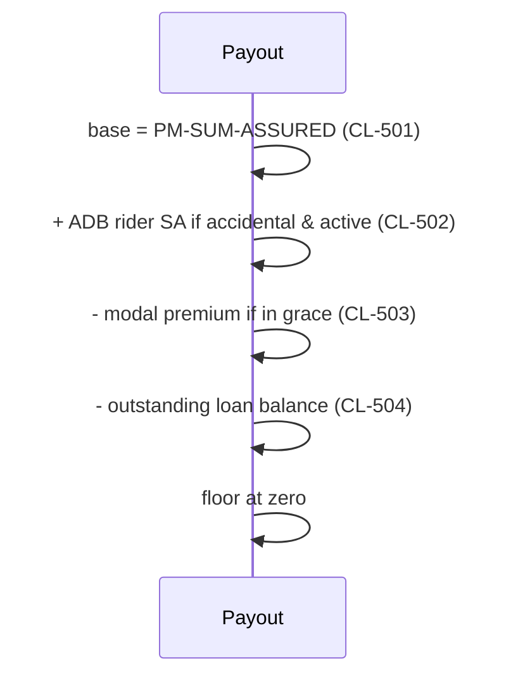

# Pricing and Structure

## Overview

This catalogue documents how LIFE400 turns an insured's risk attributes into a premium and how it settles a death claim, together with the structural configuration that surrounds those calculations — fees, referral thresholds, servicing amendments, and per-member edition tracking. Rating multipliers are loaded in `1400-LOAD-RATE-FACTORS` [QCBLLESRC/NBUWB.cbl:L301-L340], combined into base, rider, and total premium in `1600`–`1800` [QCBLLESRC/NBUWB.cbl:L388-L464], screened for reinsurance/manual-underwriting referral in `1900-EVALUATE-REFERRALS` [QCBLLESRC/NBUWB.cbl:L469-L479], and — at claim time — resolved into a payout by the settlement waterfall in `1500-CALCULATE-SETTLEMENT` [QCBLLESRC/CLMADJB.cbl:L256-L283]. The coded domains that drive these factors (gender, smoker status, occupation class, underwriting class, billing mode) are catalogued in [model-properties.md](model-properties.md#coded-model-properties); the per-plan parameters that supply fees and limits are catalogued in [products.md](products.md#plan-parameters); the riders that add sub-premiums are catalogued in [clauses.md](clauses.md#elective-riders-option); and the sum-assured that anchors both premium and payout is catalogued in [exposures.md](exposures.md#sum-assured-exposure).

## Rate-Factor Tables

Five multiplicative factors are assigned in `1400-LOAD-RATE-FACTORS` and stored on the policy record for reuse by the premium build [QCBLLESRC/NBUWB.cbl:L301-L340]. Each factor below reproduces the exact `MOVE` literals from its rule; every numeric constant is verbatim from source.

### Base Mortality Rate by Age Band (NB-401)

The base mortality rate scales premium with age; the `EVALUATE TRUE` block is evaluated top-down, so each band's effective lower bound is one above the previous test [QCBLLESRC/NBUWB.cbl:L303-L314]. Stored in `PM-BASE-MORTALITY-RATE PIC 9(02)V9999` [QCPYSRC/POLDATA.cpy:L83].

| Age Condition (evaluated top-down) | Mortality Rate | Source |
|------------------------------------|----------------|--------|
| `PM-ISSUE-AGE <= 30` | `0.8500` | [QCBLLESRC/NBUWB.cbl:L304-L305] |
| `PM-ISSUE-AGE <= 40` (effective 31–40) | `1.2000` | [QCBLLESRC/NBUWB.cbl:L306-L307] |
| `PM-ISSUE-AGE <= 50` (effective 41–50) | `2.1500` | [QCBLLESRC/NBUWB.cbl:L308-L309] |
| `PM-ISSUE-AGE <= 60` (effective 51–60) | `4.1000` | [QCBLLESRC/NBUWB.cbl:L310-L311] |
| `OTHER` (effective 61+) | `7.2500` | [QCBLLESRC/NBUWB.cbl:L312-L313] |

### Gender Factor (NB-402)

A discount is applied to females to reflect lower expected mortality; all other genders carry a neutral factor [QCBLLESRC/NBUWB.cbl:L315-L320]. Stored in `PM-GENDER-FACTOR PIC 9(01)V9999` [QCPYSRC/POLDATA.cpy:L84]; the domain is the `PM-FEMALE`/`PM-MALE` condition names [QCPYSRC/POLDATA.cpy:L60-L62].

| Condition | Gender Factor | Source |
|-----------|---------------|--------|
| `PM-FEMALE` (gender `'F'`) | `0.9200` | [QCBLLESRC/NBUWB.cbl:L316-L317] |
| else (non-female) | `1.0000` | [QCBLLESRC/NBUWB.cbl:L318-L319] |

### Smoker Factor (NB-403)

Smokers are loaded to reflect higher mortality risk; non-smokers carry a neutral factor [QCBLLESRC/NBUWB.cbl:L321-L326]. Stored in `PM-SMOKER-FACTOR PIC 9(01)V9999` [QCPYSRC/POLDATA.cpy:L85]; the domain is the `PM-SMOKER`/`PM-NON-SMOKER` condition names [QCPYSRC/POLDATA.cpy:L63-L65].

| Condition | Smoker Factor | Source |
|-----------|---------------|--------|
| `PM-SMOKER` (status `'S'`) | `1.7500` | [QCBLLESRC/NBUWB.cbl:L322-L323] |
| else (non-smoker) | `1.0000` | [QCBLLESRC/NBUWB.cbl:L324-L325] |

### Occupation Factor (NB-404)

Occupation class loads premium for hazardous work; classes above 1 carry a surcharge and any unrecognised class defaults to neutral [QCBLLESRC/NBUWB.cbl:L327-L333]. Stored in `PM-OCCUPATION-FACTOR PIC 9(01)V9999` [QCPYSRC/POLDATA.cpy:L86]; the source domain is `PM-OCCUPATION-CLASS PIC 9(01)` [QCPYSRC/POLDATA.cpy:L66].

| Occupation Class | Occupation Factor | Source |
|------------------|-------------------|--------|
| `1` | `1.0000` | [QCBLLESRC/NBUWB.cbl:L329] |
| `2` | `1.1500` | [QCBLLESRC/NBUWB.cbl:L330] |
| `3` | `1.4000` | [QCBLLESRC/NBUWB.cbl:L331] |
| `OTHER` | `1.0000` | [QCBLLESRC/NBUWB.cbl:L332] |

### Underwriting-Class Factor (NB-405)

The underwriting class discounts preferred lives and loads substandard (Table-B) lives; standard and any unrecognised class are neutral [QCBLLESRC/NBUWB.cbl:L334-L340]. Stored in `PM-UW-FACTOR PIC 9(01)V9999` [QCPYSRC/POLDATA.cpy:L87]; the domain and the class-assignment logic are catalogued in [model-properties.md](model-properties.md#underwriting-class-determination) with the codes defined at [QCPYSRC/POLDATA.cpy:L67-L71].

| UW Class | UW Factor | Source |
|----------|-----------|--------|
| `'PR'` (Preferred) | `0.9000` | [QCBLLESRC/NBUWB.cbl:L336] |
| `'ST'` (Standard) | `1.0000` | [QCBLLESRC/NBUWB.cbl:L337] |
| `'TB'` (Table-B) | `1.2500` | [QCBLLESRC/NBUWB.cbl:L338] |
| `OTHER` | `1.0000` | [QCBLLESRC/NBUWB.cbl:L339] |

## Premium Build

The annual premium is assembled from the five rate factors, then any elective riders, then fees and tax, and finally divided into the billing frequency. Rider rate constants are reproduced verbatim; the riders themselves are catalogued in [clauses.md](clauses.md#elective-riders-option).

| Step | Formula (source constants verbatim) | Source |
|------|-------------------------------------|--------|
| Base annual premium | `(PM-SUM-ASSURED / 1000) × mortality × gender × smoker × occupation × uw` | [QCBLLESRC/NBUWB.cbl:L389-L395] |
| Flat-extra add-on | if `PM-FLAT-EXTRA-RATE > 0` add `(PM-SUM-ASSURED / 1000) × PM-FLAT-EXTRA-RATE` | [QCBLLESRC/NBUWB.cbl:L396-L400] |
| Rider — ADB01 | `(PM-RIDER-SUM-ASSURED / 1000) × 0.1800` | [QCBLLESRC/NBUWB.cbl:L411-L416] |
| Rider — WOP01 | `PM-BASE-ANNUAL-PREMIUM × 0.06` | [QCBLLESRC/NBUWB.cbl:L417-L421] |
| Rider — CI001 | `(PM-RIDER-SUM-ASSURED / 1000) × 1.2500` | [QCBLLESRC/NBUWB.cbl:L422-L427] |
| Rider total | accumulate each active rider premium into `PM-RIDER-ANNUAL-TOTAL` | [QCBLLESRC/NBUWB.cbl:L428-L429] |
| Gross annual premium | `PM-BASE-ANNUAL-PREMIUM + PM-RIDER-ANNUAL-TOTAL + PM-ANNUAL-POLICY-FEE` | [QCBLLESRC/NBUWB.cbl:L438-L441] |
| Tax amount | `PM-GROSS-ANNUAL-PREMIUM × PM-TAX-RATE` | [QCBLLESRC/NBUWB.cbl:L443-L444] |
| Total annual premium | `PM-GROSS-ANNUAL-PREMIUM + PM-TAX-AMOUNT` | [QCBLLESRC/NBUWB.cbl:L445-L446] |
| Modal premium | `(PM-TOTAL-ANNUAL-PREMIUM / divisor) × modal factor` (see [Modal Loading](#modal-loading)) | [QCBLLESRC/NBUWB.cbl:L462-L464] |

## Modal Loading

Policyholders who pay more frequently than annually incur a small loading that compensates for lost investment income and extra billing cost; `1800`'s `EVALUATE PM-BILLING-MODE` selects a divisor and factor, then computes the modal premium [QCBLLESRC/NBUWB.cbl:L447-L464]. The billing-mode domain (`A`/`S`/`Q`/`M`) is defined at [QCPYSRC/POLDATA.cpy:L78-L82].

| Billing Mode | Payments / Year (Divisor) | Modal Factor | Source |
|--------------|---------------------------|--------------|--------|
| `A` (Annual) | `1` | `1.0000` | [QCBLLESRC/NBUWB.cbl:L449-L451] |
| `S` (Semi-annual) | `2` | `1.0150` | [QCBLLESRC/NBUWB.cbl:L452-L454] |
| `Q` (Quarterly) | `4` | `1.0300` | [QCBLLESRC/NBUWB.cbl:L455-L457] |
| `M` (Monthly) | `12` | `1.0800` | [QCBLLESRC/NBUWB.cbl:L458-L460] |

> **Note — modal premium formula.** The stored modal premium is `PM-MODAL-PREMIUM = (PM-TOTAL-ANNUAL-PREMIUM / divisor) × factor`, so the sum of a year's modal payments exceeds the annual total by exactly the modal factor [QCBLLESRC/NBUWB.cbl:L462-L464].

## Fees & Tax

Each plan supplies its own annual policy fee (added into the gross premium) and a service fee (charged only on servicing amendments), plus a premium-tax rate; the values are moved into the shared record by the plan-parameter loader [QCBLLESRC/NBUWMNT.cbl:L224-L272]. The full per-plan parameter set is catalogued in [products.md](products.md#plan-parameters); only the pricing-relevant fees and tax are reproduced here.

| Plan | Annual Policy Fee | Service Fee | Tax Rate | Source (WHEN branch) |
|------|-------------------|-------------|----------|----------------------|
| `T1001` | `4500` | `1500` | `0.0200` | [QCBLLESRC/NBUWMNT.cbl:L237-L239] |
| `T2001` | `5500` | `1500` | `0.0200` | [QCBLLESRC/NBUWMNT.cbl:L251-L253] |
| `T6501` | `6000` | `1500` | `0.0200` | [QCBLLESRC/NBUWMNT.cbl:L264-L266] |

The three fee/tax fields are held in the transient `PM-PLAN-PARAMETERS` group: `PM-ANNUAL-POLICY-FEE PIC 9(07)V99` [QCPYSRC/POLDATA.cpy:L50], `PM-SERVICE-FEE PIC 9(07)V99` [QCPYSRC/POLDATA.cpy:L51], and `PM-TAX-RATE PIC 9(02)V9999` [QCPYSRC/POLDATA.cpy:L52]. Only the annual policy fee enters the gross-premium build [QCBLLESRC/NBUWB.cbl:L438-L441]; the service fee is accrued separately by servicing amendments and is not part of the premium.

## Referral Thresholds

Two conditions in `1900-EVALUATE-REFERRALS` divert an application out of straight-through processing: an oversized face amount that must be shared with a reinsurer, and risk markers that require a human underwriter [QCBLLESRC/NBUWB.cbl:L469-L479].

| Referral (rule) | Trigger Condition | Flag Set | Source |
|-----------------|-------------------|----------|--------|
| Reinsurance (NB-901) | `PM-SUM-ASSURED > 45000000000000` | `WS-REINSURANCE-REFERRAL = 'Y'` | [QCBLLESRC/NBUWB.cbl:L470-L473] |
| Manual underwriting (NB-902) | `PM-UW-TABLE-B` **or** `PM-HIGH-RISK-AVOCATION = 'Y'` **or** `PM-FLAT-EXTRA-RATE > 2.50` | `WS-UW-REFERRAL = 'Y'` | [QCBLLESRC/NBUWB.cbl:L474-L479] |

> **Note — reinsurance threshold magnitude.** The face-amount trigger is the 14-digit literal `45000000000000`, which the README glosses as ">45B SA" [README.md:L198]; the same order-of-magnitude question raised against the plan sum-assured limits (see [products.md](products.md#observations)) applies to this constant as well.

## Servicing Amendments

Post-issue changes are dispatched by `EVALUATE PM-AMENDMENT-TYPE`, which routes each two-character amendment code to a dedicated paragraph [QCBLLESRC/SVCBILB.cbl:L113-L120]. The codes are the `88`-level condition names of `PM-AMENDMENT-TYPE` [QCPYSRC/POLDATA.cpy:L118-L124]; rider add/remove (`AR`/`RR`) tie back to the riders catalogued in [clauses.md](clauses.md#elective-riders-option).

| Type Code | 88-Level Condition | Amendment | Dispatch Target | Source |
|-----------|--------------------|-----------|-----------------|--------|
| `PL` | `PM-AMD-PLAN-CHANGE` | Change plan | `2100-CHANGE-PLAN` | [QCBLLESRC/SVCBILB.cbl:L114] [QCPYSRC/POLDATA.cpy:L119] |
| `SA` | `PM-AMD-SUM-ASSURED` | Change sum assured | `2200-CHANGE-SUM-ASSURED` | [QCBLLESRC/SVCBILB.cbl:L115] [QCPYSRC/POLDATA.cpy:L120] |
| `BM` | `PM-AMD-BILLING-MODE` | Change billing mode | `2300-CHANGE-BILLING-MODE` | [QCBLLESRC/SVCBILB.cbl:L116] [QCPYSRC/POLDATA.cpy:L121] |
| `AR` | `PM-AMD-ADD-RIDER` | Add rider | `2400-ADD-RIDER` | [QCBLLESRC/SVCBILB.cbl:L117] [QCPYSRC/POLDATA.cpy:L122] |
| `RR` | `PM-AMD-REMOVE-RIDER` | Remove rider | `2500-REMOVE-RIDER` | [QCBLLESRC/SVCBILB.cbl:L118] [QCPYSRC/POLDATA.cpy:L123] |
| `RI` | `PM-AMD-REINSTATE` | Process reinstatement | `2600-PROCESS-REINSTATEMENT` | [QCBLLESRC/SVCBILB.cbl:L119] [QCPYSRC/POLDATA.cpy:L124] |

### Grace and Lapse Transitions

The billing engine re-derives contract status from how far past the paid-to date the policy has run, where the day count is `PM-PROCESS-DATE − PM-PAID-TO-DATE` [QCBLLESRC/SVCBILB.cbl:L198-L199]. This is the structural rule that the nightly `DLYUPD` sweep is meant to apply across the whole book (see [Observations](#observations)).

| Transition (rule) | Condition | New Status | Source |
|-------------------|-----------|------------|--------|
| Grace (SV-201) | `PM-STATUS-ACTIVE` and `0 < days-since-paid <= PM-GRACE-DAYS` | `'GR'` | [QCBLLESRC/SVCBILB.cbl:L200-L205] |
| Lapse | (`PM-STATUS-ACTIVE` or `PM-STATUS-GRACE`) and `days-since-paid > PM-GRACE-DAYS` | `'LA'` | [QCBLLESRC/SVCBILB.cbl:L206-L210] |

## Settlement Waterfall

At claim time `1500-CALCULATE-SETTLEMENT` transforms the sum assured into the amount actually paid (`PM-CLAIM-PAYMENT-AMT`) through an ordered set of adjustments, so that accidental-death benefits are added and any amounts owed to the insurer are recovered before payment [QCBLLESRC/CLMADJB.cbl:L256-L283]. A summary of the same waterfall appears from the exposure side in [exposures.md](exposures.md#settlement-adjustments); the ordered rules below are authoritative.

1. **CL-501 — Base payout.** The payout is initialised to the face amount `PM-SUM-ASSURED` [QCBLLESRC/CLMADJB.cbl:L257-L258].
2. **CL-502 — Add ADB rider benefit.** On accidental death, the sum assured of each active `'ADB01'` rider is added, doubling the accidental benefit [QCBLLESRC/CLMADJB.cbl:L259-L270].
3. **CL-503 — Deduct in-grace premium.** If the contract is in its grace period, the outstanding modal premium is subtracted so the insurer nets the unpaid premium [QCBLLESRC/CLMADJB.cbl:L271-L274].
4. **CL-504 — Deduct loan balance.** Any positive outstanding policy-loan balance is subtracted to recover the debt from the death benefit [QCBLLESRC/CLMADJB.cbl:L275-L279].
5. **Floor at zero.** If the running total is negative it is reset to zero, so a claim can never produce a negative payout [QCBLLESRC/CLMADJB.cbl:L280-L283].

## Edition / Version Tracking

Every source member carries a `VERSION:` header comment; these are the edition markers used to reason about which copy of the duplicated business logic is current. The version comment sits on line 6 for COBOL, copybook, and CL members and on line 7 for DDS members (which carry an extra `TYPE:` header line), and each row cites the member's actual header line.

| Member | Type | Version | Source |
|--------|------|---------|--------|
| `QCPYSRC/POLDATA.cpy` | Copybook | `1.4` | [QCPYSRC/POLDATA.cpy:L6] |
| `QCBLLESRC/NBUWB.cbl` | ILE COBOL | `1.3` | [QCBLLESRC/NBUWB.cbl:L6] |
| `QCBLLESRC/NBUWMNT.cbl` | ILE COBOL | `1.4` | [QCBLLESRC/NBUWMNT.cbl:L6] [QCBLLESRC/NBUWMNT.cbl:L222] |
| `QCBLLESRC/CLMADJB.cbl` | ILE COBOL | `1.2` | [QCBLLESRC/CLMADJB.cbl:L6] |
| `QCBLLESRC/CLMMNT.cbl` | ILE COBOL | `1.2` | [QCBLLESRC/CLMMNT.cbl:L6] |
| `QCBLLESRC/MAINMENU.cbl` | ILE COBOL | `1.2` | [QCBLLESRC/MAINMENU.cbl:L6] |
| `QCBLLESRC/POLMSTINQ.cbl` | ILE COBOL | `1.0` | [QCBLLESRC/POLMSTINQ.cbl:L6] |
| `QCBLLESRC/SVCBILB.cbl` | ILE COBOL | `1.1` | [QCBLLESRC/SVCBILB.cbl:L6] |
| `QCBLLESRC/SVCMNT.cbl` | ILE COBOL | `1.1` | [QCBLLESRC/SVCMNT.cbl:L6] |
| `QCLSRC/DLYUPD.clle` | ILE CL | `1.2` | [QCLSRC/DLYUPD.clle:L6] |
| `QCLSRC/RUNCLM.clle` | ILE CL | `1.1` | [QCLSRC/RUNCLM.clle:L6] |
| `QCLSRC/RUNNBUW.clle` | ILE CL | `1.2` | [QCLSRC/RUNNBUW.clle:L6] |
| `QCLSRC/RUNSVC.clle` | ILE CL | `1.0` | [QCLSRC/RUNSVC.clle:L6] |
| `QCLSRC/STRTLIFE.clle` | ILE CL | `1.1` | [QCLSRC/STRTLIFE.clle:L6] |
| `QDDSSRC/CLMDSPF.dspf` | DDS display | `1.2` | [QDDSSRC/CLMDSPF.dspf:L7] |
| `QDDSSRC/CLMPF.pf` | DDS physical | `1.1` | [QDDSSRC/CLMPF.pf:L7] |
| `QDDSSRC/CLMRPT.prtf` | DDS printer | `1.0` | [QDDSSRC/CLMRPT.prtf:L7] |
| `QDDSSRC/MNUDSPF.dspf` | DDS display | `1.2` | [QDDSSRC/MNUDSPF.dspf:L7] |
| `QDDSSRC/NBUWDSPF.dspf` | DDS display | `1.3` | [QDDSSRC/NBUWDSPF.dspf:L7] |
| `QDDSSRC/POLMST.pf` | DDS physical | `1.2` | [QDDSSRC/POLMST.pf:L7] |
| `QDDSSRC/POLMSTL1.lf` | DDS logical | `1.0` | [QDDSSRC/POLMSTL1.lf:L7] |
| `QDDSSRC/POLRPT.prtf` | DDS printer | `1.1` | [QDDSSRC/POLRPT.prtf:L7] |
| `QDDSSRC/SVCDSPF.dspf` | DDS display | `1.1` | [QDDSSRC/SVCDSPF.dspf:L7] |
| `QDDSSRC/SVCPF.pf` | DDS physical | `1.0` | [QDDSSRC/SVCPF.pf:L7] |

> **Note — sync annotation.** `NBUWMNT.cbl` additionally carries an inline edition marker `VERSION: 1.4  LAST SYNC: 1998-11-14` at [QCBLLESRC/NBUWMNT.cbl:L222], recording the last manual synchronisation of its plan-parameter logic with the batch program `NBUWB` (see [Observations](#observations) and [products.md](products.md#observations) on the duplicated loaders).

## Pricing & Settlement Diagrams

The premium-build sequence shows how a face amount becomes a modal premium; the settlement sequence shows how a sum assured becomes a claim payout.

## Observations

Defects and gaps discovered while reverse-engineering the pricing and structural configuration are recorded here and are **not** remediated (this is a documentation-only catalogue).

- **Absent structures.** Jurisdiction/state rating overrides, blanket/master policy structures, and schedule-rating tables are `NOT SPECIFIED IN SOURCE`; a repository-wide search returned zero references to any such construct, so none is modelled anywhere in the codebase. Recorded, not remediated.
- **DLYUPD sweep stub.** The nightly grace/lapse job does not loop the policy file — it delegates a single call `CALL PGM(LIFE400/SVCBILB) PARM('*SWEEP     ' '*DLYUPD     ')` [QCLSRC/DLYUPD.clle:L75] — and its own comment states it is a stub whose full implementation "WOULD USE AN RPG OR COBOL DRIVER TO READ POLMST SEQUENTIALLY AND CALL SVCBILB FOR EACH RECORD" [QCLSRC/DLYUPD.clle:L65-L75]. Recorded, not remediated.
- **Integer YYYYMMDD date arithmetic.** Day counts driving contestability, the suicide window, and grace/lapse are computed by subtracting 8-digit `YYYYMMDD` integers directly — e.g. `PM-DATE-OF-DEATH - PM-ISSUE-DATE` [QCBLLESRC/CLMADJB.cbl:L204-L207] and `PM-PROCESS-DATE - PM-PAID-TO-DATE` [QCBLLESRC/SVCBILB.cbl:L198-L199] — which is not true calendar-day arithmetic and overstates elapsed days across month and year boundaries. Recorded, not remediated.
- **ACME vs LINCOLN branding drift.** Three display/print members are branded `LINCOLN LIFE INSURANCE CO.` [QDDSSRC/MNUDSPF.dspf:L22] [QDDSSRC/POLRPT.prtf:L16] [QDDSSRC/CLMRPT.prtf:L16], whereas the rest of the system — including the shared copybook [QCPYSRC/POLDATA.cpy:L3] and the README — is branded ACME. Recorded, not remediated.

