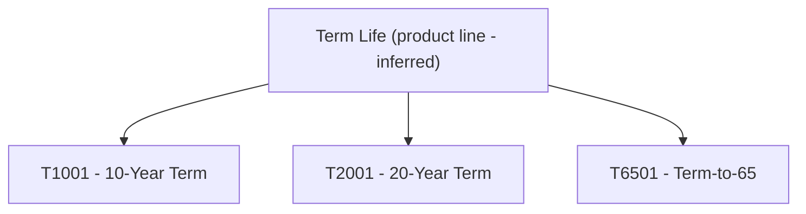

# Product Lines

## Overview

All six LIFE400 policy programs share one policy master record [QCPYSRC/POLDATA.cpy:L11-L12], and the only plan discriminator carried per policy is `PM-PLAN-CODE`; the source defines no product-line code, field, or structure [QCPYSRC/POLDATA.cpy:L21]. The README describes the system as a single Term Life policy system [README.md:L1] whose product set is exactly the three term plans T1001, T2001, and T6501 [README.md:L60-L66]. **INFERRED:** from that shared master record and three-plan term set, every contract is modelled as rolling up to one conceptual "Term Life" product line; this line is a modelling inference, not a first-class source entity [QCPYSRC/POLDATA.cpy:L11-L21] [README.md:L1] [README.md:L60-L66]. Per-plan parameters are catalogued in [products.md](products.md); this file documents only the inferred parent line and its parent→child relationship.

## Product Line

| Line Code (Inferred) | Line Name | Source | Parent | Child Products | Cardinality | Key Data Element |
|----------------------|-----------|--------|--------|----------------|-------------|------------------|
| `TERMLIFE` (inferred — no source code) | Term Life | [QCPYSRC/POLDATA.cpy:L11], [README.md:L60-L66] | (none — top of hierarchy) | T1001, T2001, T6501 [README.md:L60-L66] | 1 line → 3 plans [README.md:L60-L66] | `PM-PLAN-CODE PIC X(05)` [QCPYSRC/POLDATA.cpy:L21] |

> **INFERRED:** No product-line code or field exists in source; the single "Term Life" line is inferred from the shared copybook header and the README plan set. [QCPYSRC/POLDATA.cpy:L11] [README.md:L60-L66]

## Hierarchy

## Observations

The product line is a modeling inference with no representation in source code, so line-level attributes such as a line-wide rate manual or a formal line code cannot be catalogued because they do not exist in the source [QCPYSRC/POLDATA.cpy:L11].
