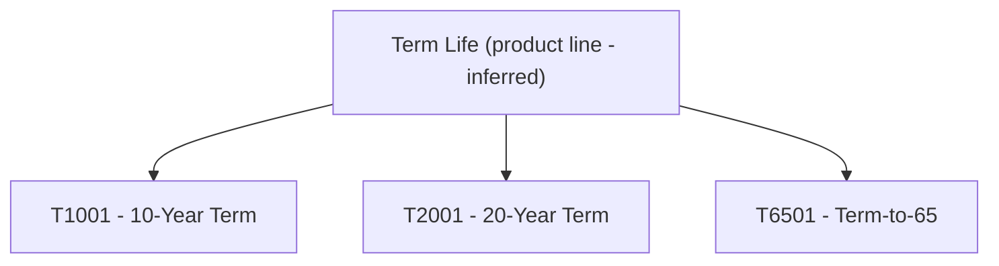

# Product Lines

## Overview

LIFE400 is a single-line-of-business term-life administration system: underwriting, servicing, and claims all share one policy master record, so every issued contract rolls up to one conceptual product line [QCPYSRC/POLDATA.cpy:L11]. That line is **inferred** rather than a first-class entity — the source carries no product-line code, field, or structure, only the per-policy `PM-PLAN-CODE` plan discriminator [QCPYSRC/POLDATA.cpy:L21]. Its three child plans — T1001, T2001, and T6501 — are the term products enumerated in the README plan set, confirming a single term-life line [README.md:L60-L66]. Per-plan parameters are catalogued in [products.md](products.md); this file documents only the parent line and its parent→child relationship.

## Product Line

| Line Code (Inferred) | Line Name | Source | Parent | Child Products | Cardinality | Key Data Element |
|----------------------|-----------|--------|--------|----------------|-------------|------------------|
| `TERMLIFE` (inferred — no source code) | Term Life | [QCPYSRC/POLDATA.cpy:L11], [README.md:L60-L66] | (none — top of hierarchy) | T1001, T2001, T6501 [README.md:L60-L66] | 1 line → 3 plans [README.md:L60-L66] | `PM-PLAN-CODE PIC X(05)` [QCPYSRC/POLDATA.cpy:L21] |

> **INFERRED:** No product-line code or field exists in source; the single "Term Life" line is inferred from the shared copybook header and the README plan set. [QCPYSRC/POLDATA.cpy:L11] [README.md:L60-L66]

## Hierarchy

## Observations

The product line is a modeling inference with no representation in source code, so line-level attributes such as a line-wide rate manual or a formal line code cannot be catalogued because they do not exist in the source [QCPYSRC/POLDATA.cpy:L11].
