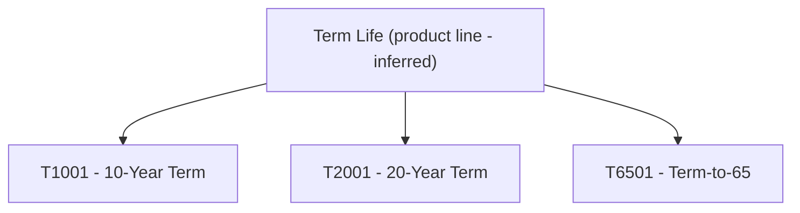

# Products

## Overview

LIFE400 offers three term-life products — T1001, T2001, and T6501 — which are the only plan codes recognised by the underwriting engine's plan-parameter loader `1100-LOAD-PLAN-PARAMETERS` [QCBLLESRC/NBUWMNT.cbl:L224-L272]. All three are children of a single inferred Term Life product line (see [product-lines.md](product-lines.md)) and share one parameter contract — the transient `PM-PLAN-PARAMETERS` group, whose thirteen fields are populated per plan at runtime [QCPYSRC/POLDATA.cpy:L39-L52]. A plan is selected by its `PM-PLAN-CODE`, and the `EVALUATE PM-PLAN-CODE` block moves that plan's issue-age band, sum-assured limits, term, maturity age, and fee/tax constants into the shared record before validation and pricing run [QCBLLESRC/NBUWMNT.cbl:L224-L272].

## Plan Parameters

Each column below maps to a field of the transient `PM-PLAN-PARAMETERS` group [QCPYSRC/POLDATA.cpy:L39-L52]; per-field PIC clauses and business purpose are catalogued in the [Parameter Field Reference](#parameter-field-reference). Every plan row reproduces the exact `MOVE` literals from its `WHEN` branch of the `EVALUATE PM-PLAN-CODE` block; the trailing **Source** column cites that branch. Numeric literals are reproduced verbatim from source (see [Observations](#observations) regarding sum-assured magnitude and precision).

| Plan Code | Name | Min Issue Age | Max Issue Age | Min Sum Assured | Max Sum Assured | Term (Years) | Maturity Age | Grace Days | Contestability (Yrs) | Suicide (Yrs) | Reinstate Window | Annual Policy Fee | Service Fee | Tax Rate | Source (WHEN branch) |
|-----------|------|---------------|---------------|-----------------|-----------------|--------------|--------------|------------|----------------------|---------------|------------------|-------------------|-------------|----------|----------------------|
| `T1001` | 10-Year Term [README.md:L64] | `18` | `60` | `10000000000000` | `50000000000000` | `10` | `70` | `30` | `2` | `2` | `730` | `4500` | `1500` | `0.0200` | [QCBLLESRC/NBUWMNT.cbl:L226-L239] |
| `T2001` | 20-Year Term [README.md:L65] | `18` | `55` | `10000000000000` | `90000000000000` | `20` | `75` | `30` | `2` | `2` | `730` | `5500` | `1500` | `0.0200` | [QCBLLESRC/NBUWMNT.cbl:L240-L253] |
| `T6501` | Term-to-65 [README.md:L66] | `18` | `50` | `10000000000000` | `75000000000000` | `65 − issue age` (computed) [QCBLLESRC/NBUWMNT.cbl:L267-L268] | `65` | `30` | `2` | `2` | `730` | `6000` | `1500` | `0.0200` | [QCBLLESRC/NBUWMNT.cbl:L254-L266] |

> **Note — T6501 term is derived, not moved.** Unlike T1001 and T2001, the T6501 branch contains no `MOVE ... TO PM-TERM-YEARS`; the term is computed at runtime as maturity age minus issue age, so the term length varies with the insured's entry age [QCBLLESRC/NBUWMNT.cbl:L267-L268]. It is recorded here as `65 − issue age` rather than a fixed literal because none exists in source.

## Parameter Field Reference

The thirteen shared parameters below belong to the `PM-PLAN-PARAMETERS` group [QCPYSRC/POLDATA.cpy:L39-L52]. Business purpose is drawn from the field name and its role in downstream validation and pricing.

| Parameter | Copybook Field (PIC) | Source | Business Purpose (WHY) |
|-----------|----------------------|--------|------------------------|
| Min issue age | `PM-MIN-ISSUE-AGE` `PIC 9(03)` | [QCPYSRC/POLDATA.cpy:L40] | Youngest entry age the plan will accept, keeping sales inside the age band the plan is priced for. |
| Max issue age | `PM-MAX-ISSUE-AGE` `PIC 9(03)` | [QCPYSRC/POLDATA.cpy:L41] | Oldest entry age the plan will accept, so coverage can still reach maturity before the maturity age. |
| Min sum assured | `PM-MIN-SUM-ASSURED` `PIC 9(13)V99` | [QCPYSRC/POLDATA.cpy:L42] | Smallest face amount the plan will issue, keeping policies above the economical underwriting threshold. |
| Max sum assured | `PM-MAX-SUM-ASSURED` `PIC 9(13)V99` | [QCPYSRC/POLDATA.cpy:L43] | Largest face amount the plan will issue, bounding the insurer's retained mortality exposure per policy. |
| Term years | `PM-TERM-YEARS` `PIC 9(03)` | [QCPYSRC/POLDATA.cpy:L44] | Length of the coverage period; fixed for T1001/T2001 but derived for T6501 (maturity age minus issue age). |
| Maturity age | `PM-MATURITY-AGE` `PIC 9(03)` | [QCPYSRC/POLDATA.cpy:L45] | Attained age at which coverage ends; also caps issue age plus term during application validation. |
| Grace days | `PM-GRACE-DAYS` `PIC 9(03)` | [QCPYSRC/POLDATA.cpy:L46] | Days allowed after a missed premium before the policy lapses, giving the owner time to pay without losing cover. |
| Contestability years | `PM-CONTESTABILITY-YRS` `PIC 9(02)` | [QCPYSRC/POLDATA.cpy:L47] | Years during which the insurer may contest a claim for material misrepresentation. |
| Suicide years | `PM-SUICIDE-YRS` `PIC 9(02)` | [QCPYSRC/POLDATA.cpy:L48] | Years during which death by suicide is excluded from the death benefit. |
| Reinstate window | `PM-REINSTATE-WINDOW` `PIC 9(04)` | [QCPYSRC/POLDATA.cpy:L49] | Window after lapse within which a lapsed policy may be brought back into force. |
| Annual policy fee | `PM-ANNUAL-POLICY-FEE` `PIC 9(07)V99` | [QCPYSRC/POLDATA.cpy:L50] | Fixed yearly administration charge added when the gross premium is built. |
| Service fee | `PM-SERVICE-FEE` `PIC 9(07)V99` | [QCPYSRC/POLDATA.cpy:L51] | Yearly servicing charge levied alongside the policy fee. |
| Tax rate | `PM-TAX-RATE` `PIC 9(02)V9999` | [QCPYSRC/POLDATA.cpy:L52] | Premium-tax rate applied when the gross annual premium is assembled. |

## Parent Line & Cardinality

Each plan's parent is the single inferred **Term Life** product line, and the relationship is `1 line → 3 plans` [README.md:L60-L66]. The line has no source-level code, field, or structure — it is inferred from the shared policy-master copybook and the README plan set — and is documented separately in [product-lines.md](product-lines.md); this catalogue covers only the three child plans and their parameters.

> **INFERRED:** The parent "Term Life" line is a modelling inference; source carries only the per-policy `PM-PLAN-CODE` discriminator, not a product-line code. [QCPYSRC/POLDATA.cpy:L11] [README.md:L60-L66]

## Product Hierarchy

## Plan-Specific Availability

Beyond the shared parameters, source encodes one plan-specific eligibility rule: plan **T6501** declines any applicant in occupation class 3, returning code 15 with the message `T65 PLAN: HAZARDOUS OCCUPATION NOT PERMITTED` [QCBLLESRC/NBUWMNT.cbl:L326-L331]. The generic limit checks — issue age within the plan band, sum assured within the plan limits, and issue age plus term not exceeding maturity age — are enforced in `1200-VALIDATE-APPLICATION` [QCBLLESRC/NBUWMNT.cbl:L306-L325]. The full availability logic is catalogued as FEEL expressions in [model-properties.md](model-properties.md), and premium construction from these parameters is detailed in [pricing-and-structure.md](pricing-and-structure.md).

## Observations

Defects discovered while reverse-engineering the plan definitions are recorded here and are **not** remediated (this is a documentation-only catalogue).

- **(a) Duplicated plan-parameter logic.** The same plan-parameter table is replicated across programs: the online `NBUWMNT` copy is annotated `SAME LOGIC AS NBUWB.CBLE` and `MAINTAINED IN SYNC WITH BATCH PROGRAM` [QCBLLESRC/NBUWMNT.cbl:L220-L221], so every rate or limit change must be re-applied by hand in each copy — a maintenance hazard.
- **(b) Sum-assured literal precision.** The 14-digit literals `10000000000000` / `50000000000000` / `90000000000000` / `75000000000000` are `MOVE`d into `PM-MIN-SUM-ASSURED` and `PM-MAX-SUM-ASSURED`, which are `PIC 9(13)V99` with only 13 integer digits [QCBLLESRC/NBUWMNT.cbl:L229] [QCPYSRC/POLDATA.cpy:L42-L43], so the high-order digit is at risk of truncation.
- **(c) README vs source magnitude discrepancy.** `README.md` lists Min SA `10,000,000` and Max SA `50,000,000,000` / `90,000,000,000` / `75,000,000,000` [README.md:L64-L66], which are several orders of magnitude smaller than the COBOL literals `10000000000000` / `50000000000000` moved in source [QCBLLESRC/NBUWMNT.cbl:L229-L230].
- **(d) `.cble` / `.cbl` extension drift.** The README build steps reference `NBUWB.cble` and its siblings [README.md:L42-L49] and the in-source comment reads `SAME LOGIC AS NBUWB.CBLE` [QCBLLESRC/NBUWMNT.cbl:L220], yet the actual source members carry the `.cbl` extension.
