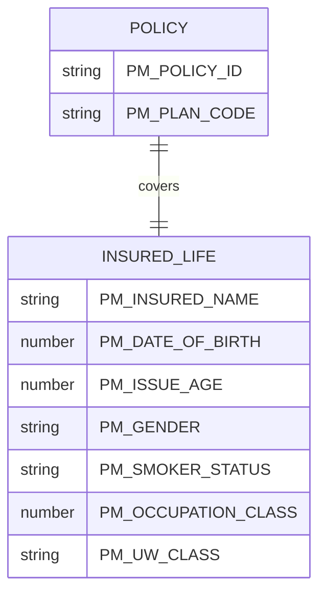

# Risk Objects

LIFE400 is a single-life term insurance system: each policy carries exactly one insured life, whose demographic and underwriting fields are held in the `PM-INSURED-DETAILS` copybook group in memory [QCPYSRC/POLDATA.cpy:L54-L73] and persisted through the insured fields of the `POLMST` policy master file [QDDSSRC/POLMST.pf:L31-L50]. **INFERRED:** the property-and-casualty term *risk object* is not a first-class LIFE400 entity; it is mapped here onto that single insured life, with each field's source-demonstrated role catalogued below [QCPYSRC/POLDATA.cpy:L54-L73] [QDDSSRC/POLMST.pf:L31-L50].

## Insured Life Attributes

The insured life is described by ten data fields in the `PM-INSURED-DETAILS` group [QCPYSRC/POLDATA.cpy:L54-L73]; nine are persisted to `POLMST` [QDDSSRC/POLMST.pf:L31-L50] and the tenth (attained age) is transient and held in memory only (see [Observations](#observations)). Coded domains are reproduced verbatim from the copybook 88-level condition names.

| Attribute | Copybook Field (PIC) | Persisted DDS Field | Coded Domain (88s / notes) | Source | Business Purpose (WHY) |
|-----------|----------------------|---------------------|----------------------------|--------|------------------------|
| Insured name | `PM-INSURED-NAME` `PIC X(40)` | `INSNAME` `40A` | Free text | [QCPYSRC/POLDATA.cpy:L55]; [QDDSSRC/POLMST.pf:L32] | Names the covered life; new-business validation rejects a blank name [QCBLLESRC/NBUWMNT.cbl:L280] and the value is carried onto the servicing display [QCBLLESRC/SVCMNT.cbl:L126]. |
| Date of birth | `PM-DATE-OF-BIRTH` `PIC 9(08)` | `INSDOB` `8S 0` | YYYYMMDD (Y2K-reviewed) | [QCPYSRC/POLDATA.cpy:L57]; [QDDSSRC/POLMST.pf:L35] | Stores the insured's birth date as an 8-digit YYYYMMDD value captured at new-business input [QCBLLESRC/NBUWMNT.cbl:L115]; flagged Y2K-reviewed in source [QCPYSRC/POLDATA.cpy:L56]. |
| Issue age | `PM-ISSUE-AGE` `PIC 9(03)` | `ISSAGE` `3S 0` | Age in years | [QCPYSRC/POLDATA.cpy:L58]; [QDDSSRC/POLMST.pf:L37] | Age at policy issue sets the plan eligibility band and is the age basis for the base mortality premium. |
| Attained age | `PM-ATTAINED-AGE` `PIC 9(03)` | `NOT SPECIFIED IN SOURCE` | Age in years | [QCPYSRC/POLDATA.cpy:L59] | Current age used during servicing; not persisted — recomputed on each servicing run as `PM-ISSUE-AGE + ((PM-PROCESS-DATE - PM-ISSUE-DATE) / 365)` over raw 8-digit `YYYYMMDD` values [QCBLLESRC/SVCBILB.cbl:L189-L191] [QCBLLESRC/SVCMNT.cbl:L164-L166], which is not calendar-year arithmetic (see [Observations](#observations)). |
| Gender | `PM-GENDER` `PIC X(01)` | `GENDER` `1A` | `PM-FEMALE` `'F'` [QCPYSRC/POLDATA.cpy:L61]; `PM-MALE` `'M'` [QCPYSRC/POLDATA.cpy:L62] | [QCPYSRC/POLDATA.cpy:L60]; [QDDSSRC/POLMST.pf:L39] | Selects the gender rating factor applied to the mortality rate [QCBLLESRC/NBUWB.cbl:L315-L320]. |
| Smoker status | `PM-SMOKER-STATUS` `PIC X(01)` | `SMOKER` `1A` | `PM-SMOKER` `'S'` [QCPYSRC/POLDATA.cpy:L64]; `PM-NON-SMOKER` `'N'` [QCPYSRC/POLDATA.cpy:L65] | [QCPYSRC/POLDATA.cpy:L63]; [QDDSSRC/POLMST.pf:L41] | Selects the smoker rating factor applied to the mortality rate [QCBLLESRC/NBUWB.cbl:L321-L326] and contributes to the underwriting-class decision [QCBLLESRC/NBUWB.cbl:L273-L296]. |
| Occupation class | `PM-OCCUPATION-CLASS` `PIC 9(01)` | `OCCLAS` `1S 0` | Class 1–4 (per DDS TEXT) | [QCPYSRC/POLDATA.cpy:L66]; [QDDSSRC/POLMST.pf:L43] | Selects the occupation rating factor [QCBLLESRC/NBUWB.cbl:L327-L333] and drives eligibility declines — class 3 on T6501 [QCBLLESRC/NBUWMNT.cbl:L326-L331] and class 4 outright [QCBLLESRC/NBUWMNT.cbl:L333-L338]. |
| UW class | `PM-UW-CLASS` `PIC X(02)` | `UWCLAS` `2A` | `PM-UW-PREFERRED` `'PR'` [QCPYSRC/POLDATA.cpy:L68]; `PM-UW-STANDARD` `'ST'` [QCPYSRC/POLDATA.cpy:L69]; `PM-UW-TABLE-B` `'TB'` [QCPYSRC/POLDATA.cpy:L70]; `PM-UW-DECLINE` `'DP'` [QCPYSRC/POLDATA.cpy:L71] | [QCPYSRC/POLDATA.cpy:L67]; [QDDSSRC/POLMST.pf:L45] | Holds the underwriting decision that selects the UW rating factor [QCBLLESRC/NBUWB.cbl:L334-L340]; a `'DP'` value marks a declined life [QCPYSRC/POLDATA.cpy:L71]. |
| High-risk avocation | `PM-HIGH-RISK-AVOCATION` `PIC X(01) VALUE 'N'` | `HIRAVOC` `1A` | Y/N (default `'N'`) | [QCPYSRC/POLDATA.cpy:L72]; [QDDSSRC/POLMST.pf:L47] | A `'Y'` flag contributes to the Table-B underwriting class [QCBLLESRC/NBUWB.cbl:L282-L286] and triggers a manual-underwriting referral [QCBLLESRC/NBUWB.cbl:L475-L478]. |
| Flat extra rate | `PM-FLAT-EXTRA-RATE` `PIC 9(02)V9999 VALUE 0` | `FLTXTRA` `6S 4` | Per-1000 rate (default `0`) | [QCPYSRC/POLDATA.cpy:L73]; [QDDSSRC/POLMST.pf:L49] | A separate per-1000 loading added to the base premium when greater than zero [QCBLLESRC/NBUWB.cbl:L396-L400]; a value above 2.50 also triggers a manual-underwriting referral [QCBLLESRC/NBUWB.cbl:L475-L478]. |

## Cardinality

A policy relates to exactly **one** insured life: `policy → 1 insured life`. The `PM-INSURED-DETAILS` group is embedded once in the policy master record with no `OCCURS` clause [QCPYSRC/POLDATA.cpy:L54-L73], and the master file holds one record per policy [QDDSSRC/POLMST.pf:L10] under the single `POLMSTREC` record format [QDDSSRC/POLMST.pf:L14], keyed by `POLID` [QDDSSRC/POLMST.pf:L81]. Keyed random access to that single record is provided by the logical file `POLMSTL1` over `POLMST`, keyed by `POLID` [QDDSSRC/POLMSTL1.lf:L13-L14]. No multi-life or joint-life structure exists — `PM-INSURED-DETAILS` carries no `OCCURS` [QCPYSRC/POLDATA.cpy:L54-L73] — and the beneficiary appears only as name and relation fields within the claim-details section [QCPYSRC/POLDATA.cpy:L156-L157], not as a separate risk object; the benefit this risk object bears is catalogued in [exposures.md](exposures.md).

## Observations

- **Attained age uses raw YYYYMMDD integer arithmetic, not calendar arithmetic.** The copybook defines `PM-ATTAINED-AGE` [QCPYSRC/POLDATA.cpy:L59] but the master file has no matching column — `POLMST` persists only `ISSAGE` [QDDSSRC/POLMST.pf:L37] — so attained age is transient and is recomputed on each servicing run as `COMPUTE PM-ATTAINED-AGE = PM-ISSUE-AGE + ((PM-PROCESS-DATE - PM-ISSUE-DATE) / 365)` [QCBLLESRC/SVCBILB.cbl:L189-L191] [QCBLLESRC/SVCMNT.cbl:L164-L166]. Because `PM-PROCESS-DATE` and `PM-ISSUE-DATE` are 8-digit `YYYYMMDD` integers, their direct subtraction is not an elapsed-day count and the `/ 365` result is not elapsed calendar years — the figure drifts across month and year boundaries (the same integer-`YYYYMMDD` defect recorded in [pricing-and-structure.md](pricing-and-structure.md#observations)); recorded, not remediated.
- No risk-object identifier distinct from the policy key exists: `POLID` [QDDSSRC/POLMST.pf:L16] identifies both the contract and its single insured, so a standalone insured/risk-object key is `NOT SPECIFIED IN SOURCE`.
