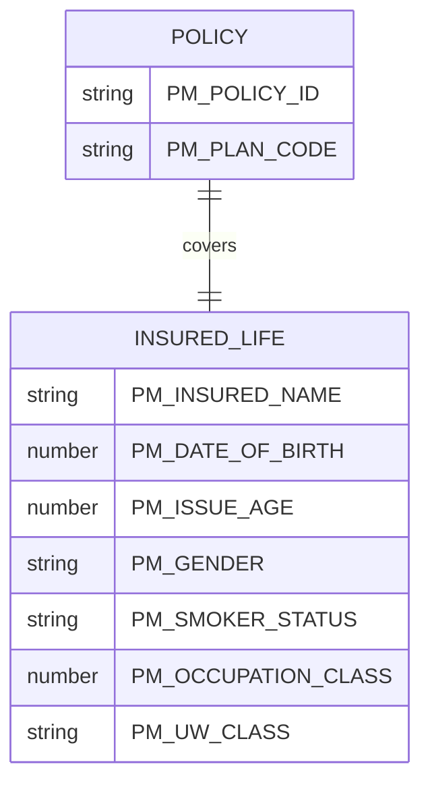

# Risk Objects

LIFE400 is a single-life term insurance system, so each policy carries exactly one insured life, and that individual is the sole *risk object* in the domain model. The property-and-casualty term "risk object" maps directly onto the life-insurance `PM-INSURED-DETAILS` copybook group, which holds the insured's demographic and underwriting characteristics in memory [QCPYSRC/POLDATA.cpy:L54-L73] and is persisted through the insured fields of the `POLMST` policy master file [QDDSSRC/POLMST.pf:L31-L50]. These attributes exist so that underwriting and pricing can assess the mortality risk of the single life the contract insures.

## Insured Life Attributes

The insured life is described by ten data fields in the `PM-INSURED-DETAILS` group. Nine are persisted to `POLMST`; the tenth (attained age) is transient and held in memory only (see [Observations](#observations)). Coded domains are reproduced verbatim from the copybook 88-level condition names.

| Attribute | Copybook Field (PIC) | Persisted DDS Field | Coded Domain (88s / notes) | Source | Business Purpose (WHY) |
|-----------|----------------------|---------------------|----------------------------|--------|------------------------|
| Insured name | `PM-INSURED-NAME` `PIC X(40)` | `INSNAME` `40A` | Free text | [QCPYSRC/POLDATA.cpy:L55]; [QDDSSRC/POLMST.pf:L32] | Identifies the covered life for correspondence and for matching the person against any claim presented on the contract. |
| Date of birth | `PM-DATE-OF-BIRTH` `PIC 9(08)` | `INSDOB` `8S 0` | YYYYMMDD (Y2K-reviewed) | [QCPYSRC/POLDATA.cpy:L57]; [QDDSSRC/POLMST.pf:L35] | Anchors every age and mortality calculation; the 1998 Y2K review fixed the eight-digit format so date arithmetic survives the century boundary. |
| Issue age | `PM-ISSUE-AGE` `PIC 9(03)` | `ISSAGE` `3S 0` | Age in years | [QCPYSRC/POLDATA.cpy:L58]; [QDDSSRC/POLMST.pf:L37] | Age at policy issue sets the plan eligibility band and is the age basis for the base mortality premium. |
| Attained age | `PM-ATTAINED-AGE` `PIC 9(03)` | `NOT SPECIFIED IN SOURCE` | Age in years | [QCPYSRC/POLDATA.cpy:L59] | Current age used during servicing; held only in memory and recomputed from date of birth rather than stored (see Observations). |
| Gender | `PM-GENDER` `PIC X(01)` | `GENDER` `1A` | `PM-FEMALE` `'F'` [QCPYSRC/POLDATA.cpy:L61]; `PM-MALE` `'M'` [QCPYSRC/POLDATA.cpy:L62] | [QCPYSRC/POLDATA.cpy:L60]; [QDDSSRC/POLMST.pf:L39] | Selects the gender mortality factor, reflecting the differing life expectancy of male and female lives. |
| Smoker status | `PM-SMOKER-STATUS` `PIC X(01)` | `SMOKER` `1A` | `PM-SMOKER` `'S'` [QCPYSRC/POLDATA.cpy:L64]; `PM-NON-SMOKER` `'N'` [QCPYSRC/POLDATA.cpy:L65] | [QCPYSRC/POLDATA.cpy:L63]; [QDDSSRC/POLMST.pf:L41] | Drives the smoker loading applied to the mortality rate, since smokers carry materially higher mortality. |
| Occupation class | `PM-OCCUPATION-CLASS` `PIC 9(01)` | `OCCLAS` `1S 0` | Class 1–4 (per DDS TEXT) | [QCPYSRC/POLDATA.cpy:L66]; [QDDSSRC/POLMST.pf:L43] | Grades the insured's occupational hazard, feeding the occupation rating factor and eligibility checks. |
| UW class | `PM-UW-CLASS` `PIC X(02)` | `UWCLAS` `2A` | `PM-UW-PREFERRED` `'PR'` [QCPYSRC/POLDATA.cpy:L68]; `PM-UW-STANDARD` `'ST'` [QCPYSRC/POLDATA.cpy:L69]; `PM-UW-TABLE-B` `'TB'` [QCPYSRC/POLDATA.cpy:L70]; `PM-UW-DECLINE` `'DP'` [QCPYSRC/POLDATA.cpy:L71] | [QCPYSRC/POLDATA.cpy:L67]; [QDDSSRC/POLMST.pf:L45] | Records the underwriting decision that selects the applicable rate factor, or declines the life outright. |
| High-risk avocation | `PM-HIGH-RISK-AVOCATION` `PIC X(01) VALUE 'N'` | `HIRAVOC` `1A` | Y/N (default `'N'`) | [QCPYSRC/POLDATA.cpy:L72]; [QDDSSRC/POLMST.pf:L47] | Flags a hazardous hobby (e.g., diving, aviation) that feeds the underwriting decision and any flat-extra loading. |
| Flat extra rate | `PM-FLAT-EXTRA-RATE` `PIC 9(02)V9999 VALUE 0` | `FLTXTRA` `6S 4` | Per-1000 rate (default `0`) | [QCPYSRC/POLDATA.cpy:L73]; [QDDSSRC/POLMST.pf:L49] | Manual per-1000 loading an underwriter adds for substandard lives on top of the table rate. |

## Cardinality

A policy relates to exactly **one** insured life: `policy → 1 insured life`. The `PM-INSURED-DETAILS` group is embedded once in the policy master record with no `OCCURS` clause [QCPYSRC/POLDATA.cpy:L54-L73], and the master file stores one insured per policy record keyed by `POLID` [QDDSSRC/POLMST.pf:L81]. Keyed random access to that single record is provided by the logical file `POLMSTL1` over `POLMST`, keyed by `POLID` [QDDSSRC/POLMSTL1.lf:L13-L14]. There is no multi-life or joint-life structure, and no beneficiary is modelled as a separate risk object; the benefit this risk object bears is catalogued in [exposures.md](exposures.md).

## Observations

- The copybook defines `PM-ATTAINED-AGE` [QCPYSRC/POLDATA.cpy:L59] but the master file has no matching column — `POLMST` persists only `ISSAGE` [QDDSSRC/POLMST.pf:L37] — so attained age is transient and must be recomputed from date of birth on each use; recorded, not remediated.
- No risk-object identifier distinct from the policy key exists: `POLID` [QDDSSRC/POLMST.pf:L16] identifies both the contract and its single insured, so a standalone insured/risk-object key is `NOT SPECIFIED IN SOURCE`.
