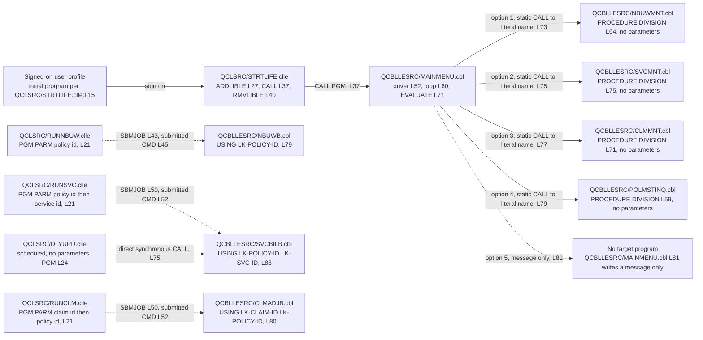
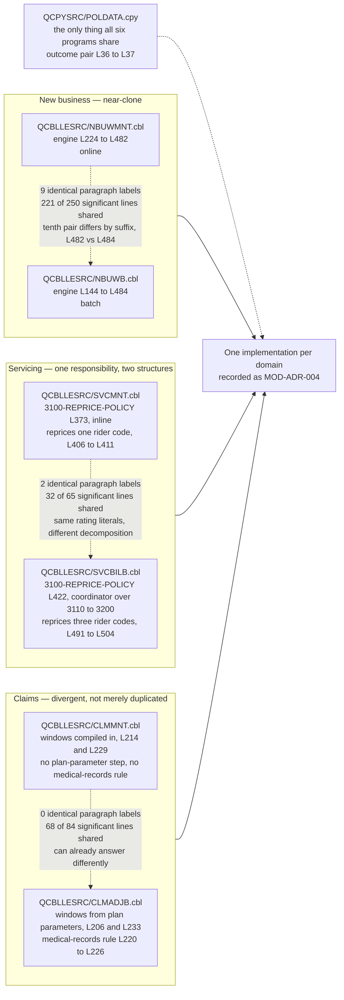

# LIFE400 Current-State Architecture

This document describes how LIFE400 is actually built. It records the four layers the estate divides into, the mechanism by which one program reaches another, which files each program opens and under what access path, the paragraph inventory that constitutes each program's operation set, the degree to which the online and batch programs of each business domain repeat one another, the integration mechanisms that hold the whole together, and — at least as consequential for a migration — the mechanisms that are absent altogether. It is the structural evidence base for the forward half of this assessment: the duplication analysis below is the evidence behind [MOD-ADR-004 on a single domain and rules service](../decisions/MOD-ADR-004-single-domain-rules-service.md), and the file-dependency and paragraph inventories are consumed by [the business rule inventory](05-business-rule-inventory.md) and by [the program-to-service map](../target-state/02-program-to-service-map.md).

**Scope.** This document describes the system as built and stops there. It does not enumerate members, banners, line counts or authorship, which are the register kept by [the system inventory](01-system-inventory.md). It does not assess the platform's support status, which belongs to [the platform and support status document](03-platform-and-support-status.md). It names columns and keys only where they explain a structural fact about a program; field types, domains and the persisted-versus-transient classification belong to [the current data model](04-data-model-current-state.md). It counts paragraphs but does not census business rules, which belongs to [the business rule inventory](05-business-rule-inventory.md). It shows what the orchestration layer connects but not the runtime that carries it — work-management objects, queue behaviour, the message vocabulary and the build sequence belong to [the operational model](06-operational-model.md). It records anomalies as structural observations and dispositions none of them; every migrate, implement or drop decision is the sole business of [the known defects and stubs register](07-known-defects-and-stubs.md). It does not design the target: service boundaries belong to [the program-to-service map](../target-state/02-program-to-service-map.md), security controls to [the security control design](../target-state/04-security-control-design.md), screen and report destinations to [the UI modernization document](../target-state/05-ui-modernization.md), and strategy selection to [the strategy options and selection document](../migration/01-strategy-options-and-selection.md). Where this document observes that a control is missing, it states the architectural fact and leaves severity, impact and remediation to [the security risk register](../risk/01-security-risk-register.md) and [the continuity and recovery risk analysis](../risk/03-continuity-and-recovery-risk.md). A reader entering the assessment for the first time should start at [the section index](../README.md).

**Reading the citations.** Every claim about LIFE400 carries an inline citation of the form `[<path>:<locator>]` immediately after the claim. Citations are plain text and deliberately not hyperlinks: a plain-text citation stays meaningful in a diff and does not depend on a hosting provider's line-anchor syntax. The same discipline applies inside the three diagrams — every node that names a real artifact carries its member path in the node label itself, so a diagram lifted out of this page still says which member it describes. No member is annotated, altered, reformatted or commented by this documentation set; the estate is read as evidence and left exactly as it is. Platform terms link to [the IBM i glossary](../reference/glossary-ibm-i.md) on first use in this document.

**How the structure was extracted.** Nothing below is carried over from prior description. Program interfaces come from each member's `PROGRAM-ID`, `SELECT`, `COPY` and `PROCEDURE DIVISION` clauses. The operation inventory comes from the numbered `NNNN-VERB-NOUN` [paragraph](../reference/glossary-ibm-i.md#paragraph) labels, matched where COBOL requires a paragraph name to stand: alone on its line, in area A. The duplication findings come from comparing those label sets directly, and from a line-level comparison of the corresponding spans in which comment lines — those carrying an asterisk in column 7 — and blank lines are dropped and remaining whitespace is normalized before the two sequences are aligned. That comparison measures textual overlap and nothing stronger; it is evidence of copying, not a proof of behavioural equivalence, and where the two sides behave differently this document says so explicitly rather than letting a high overlap figure imply agreement. Absence claims come from a census over the same code lines of all eight COBOL members, so a verb named only inside a comment is never counted as present.

## Layers

LIFE400 divides into four layers written in three languages. Orchestration and session entry are [ILE CL](../reference/glossary-ibm-i.md#cl-control-language); presentation is [DDS](../reference/glossary-ibm-i.md#dds-data-description-specifications); business logic is [ILE](../reference/glossary-ibm-i.md#ile-integrated-language-environment) COBOL; and persistence is DDS again, since the file definitions and the screen definitions are written in the same declarative language and compiled into different object types.

Two facts about the shape matter more than the layer count.

The first is that **every program cooperates around one indexed file.** Seven of the eight COBOL programs open `POLMST` [QCBLLESRC/NBUWMNT.cbl:L38-L42], [QCBLLESRC/NBUWB.cbl:L50-L54], [QCBLLESRC/SVCMNT.cbl:L38-L42], [QCBLLESRC/SVCBILB.cbl:L48-L52], [QCBLLESRC/CLMMNT.cbl:L37-L41], [QCBLLESRC/CLMADJB.cbl:L42-L46], [QCBLLESRC/POLMSTINQ.cbl:L38-L42]. Two open the servicing file in addition [QCBLLESRC/SVCMNT.cbl:L44-L48], [QCBLLESRC/SVCBILB.cbl:L54-L58] and two the claims file [QCBLLESRC/CLMMNT.cbl:L43-L47], [QCBLLESRC/CLMADJB.cbl:L48-L52]. There is no shared service, no shared module and no shared library of routines between programs: a census of `CALL` across all eight members finds four occurrences, and all four are the menu's dispatch [QCBLLESRC/MAINMENU.cbl:L73-L79], so no business program invokes another. The policy master is the only thing they have in common, and coordination between them is therefore coordination through a file.

The second is that **the shared data contract is a textual include, not a linked module — and it is simultaneously the record description of the file every program shares.** Seven programs pull in the same contract with `COPY POLDATA` [QCBLLESRC/NBUWMNT.cbl:L50], [QCBLLESRC/NBUWB.cbl:L60], [QCBLLESRC/SVCMNT.cbl:L56], [QCBLLESRC/SVCBILB.cbl:L64], [QCBLLESRC/CLMMNT.cbl:L55], [QCBLLESRC/CLMADJB.cbl:L58], [QCBLLESRC/POLMSTINQ.cbl:L50], and in every one of the seven that `COPY` sits on the line immediately after `FD POLMST` [QCBLLESRC/NBUWMNT.cbl:L49-L50], [QCBLLESRC/SVCBILB.cbl:L63-L64], [QCBLLESRC/CLMADJB.cbl:L57-L58]. Two consequences follow. A [copybook](../reference/glossary-ibm-i.md#copybook) is expanded into each consumer at compile time, so the contract has no independent runtime existence and no version of its own: a change to one field definition obliges recompilation of all seven consumers, and a consumer compiled against an older expansion is indistinguishable at run time from one compiled against the newer. And because the expansion lands in the file section rather than in working storage, the persisted record layout and the program's in-memory view of a policy are not two things kept in agreement — they are one declaration, so a program cannot hold a policy in memory in any shape other than the shape the file stores. That coupling is a structural property of the layer diagram below, which is why the contract is drawn cutting across the application layer rather than sitting inside any one program.

Two members in the layers below are reachable from nothing. Neither [printer file](../reference/glossary-ibm-i.md#printer-file) is named by any program: a search for `POLRPT` and `CLMRPT` across all eight COBOL members, all five CL members and the copybook returns no reference, so the ten report [record formats](../reference/glossary-ibm-i.md#record-format) they define [QDDSSRC/POLRPT.prtf:L15-L64], [QDDSSRC/CLMRPT.prtf:L15-L58] have no producer. The [logical file](../reference/glossary-ibm-i.md#logical-file) is in the same position: `POLMSTL1` declares an access path over the policy master keyed on the same field the [physical file](../reference/glossary-ibm-i.md#physical-file) already keys itself on [QDDSSRC/POLMSTL1.lf:L13-L14], [QDDSSRC/POLMST.pf:L81], and no program names it. They are drawn because they are part of the estate; they are drawn as unreferenced because that is what they are.

```mermaid
flowchart TB
    subgraph ORCH["Layer 1 — session entry and orchestration, ILE CL"]
        STRT["QCLSRC/STRTLIFE.clle<br/>interactive session entry, PGM L18"]
        RNB["QCLSRC/RUNNBUW.clle<br/>new-business batch submitter"]
        RSV["QCLSRC/RUNSVC.clle<br/>servicing batch submitter"]
        RCL["QCLSRC/RUNCLM.clle<br/>claims batch submitter"]
        DLY["QCLSRC/DLYUPD.clle<br/>scheduled nightly driver"]
    end
    subgraph PRES["Layer 2 — presentation, DDS"]
        MND["QDDSSRC/MNUDSPF.dspf<br/>2 record formats"]
        NBD["QDDSSRC/NBUWDSPF.dspf<br/>6 record formats"]
        SVD["QDDSSRC/SVCDSPF.dspf<br/>5 record formats, serves two programs"]
        CLD["QDDSSRC/CLMDSPF.dspf<br/>5 record formats"]
        PRP["QDDSSRC/POLRPT.prtf<br/>5 formats, named by no program"]
        CRP["QDDSSRC/CLMRPT.prtf<br/>5 formats, named by no program"]
    end
    subgraph ONL["Layer 3a — application, online ILE COBOL"]
        MM["QCBLLESRC/MAINMENU.cbl<br/>menu and dispatch"]
        NBM["QCBLLESRC/NBUWMNT.cbl<br/>new business, interactive"]
        SVM["QCBLLESRC/SVCMNT.cbl<br/>servicing, interactive"]
        CLM["QCBLLESRC/CLMMNT.cbl<br/>claims, interactive"]
        INQ["QCBLLESRC/POLMSTINQ.cbl<br/>inquiry, read only"]
    end
    subgraph BAT["Layer 3b — application, batch ILE COBOL"]
        NBB["QCBLLESRC/NBUWB.cbl<br/>underwriting and issue"]
        SVB["QCBLLESRC/SVCBILB.cbl<br/>servicing, billing, grace and lapse"]
        CLB["QCBLLESRC/CLMADJB.cbl<br/>claim adjudication"]
    end
    CPY["QCPYSRC/POLDATA.cpy<br/>shared contract, textual include<br/>copied by 7 of the 8 programs"]
    subgraph DATA["Layer 4 — persistence, DDS"]
        POL["QDDSSRC/POLMST.pf<br/>policy master, key POLID L81"]
        PLL["QDDSSRC/POLMSTL1.lf<br/>access path over POLMST, named by no program"]
        SVP["QDDSSRC/SVCPF.pf<br/>servicing requests, key SVCID L54"]
        CLP["QDDSSRC/CLMPF.pf<br/>claims, key CLMID L67"]
    end

    STRT --> MM
    MM --> NBM
    MM --> SVM
    MM --> CLM
    MM --> INQ
    RNB -.-> NBB
    RSV -.-> SVB
    RCL -.-> CLB
    DLY -.-> SVB
    MM --- MND
    NBM --- NBD
    SVM --- SVD
    INQ --- SVD
    CLM --- CLD
    CPY -.-> ONL
    CPY -.-> BAT
    NBM --> POL
    SVM --> POL
    CLM --> POL
    INQ --> POL
    NBB --> POL
    SVB --> POL
    CLB --> POL
    SVM --> SVP
    SVB --> SVP
    CLM --> CLP
    CLB --> CLP
    PLL -.-> POL
```

The diagram is D-01 in this assessment's diagram register. Solid arrows are synchronous transfers of control or file opens; dashed arrows are asynchronous submissions, the compile-time expansion of the shared contract, and the access-path relationship. Undirected links join a program to the [display file](../reference/glossary-ibm-i.md#display-file) it drives, because screen traffic runs in both directions: a program writes a record format and reads the operator's response back through the same file.

## Dispatch mechanism

Control enters LIFE400 in one place and fans out through one program. The session begins in CL: `STRTLIFE` puts the application library at the front of the job's [library list](../reference/glossary-ibm-i.md#library-list) and tolerates the condition raised when it is already there [QCLSRC/STRTLIFE.clle:L27-L28], announces the session, calls the menu [QCLSRC/STRTLIFE.clle:L37], and removes the library again on the way out [QCLSRC/STRTLIFE.clle:L40-L41]. Its own banner documents how it is meant to be attached — as a user profile's [initial program](../reference/glossary-ibm-i.md#initial-program) [QCLSRC/STRTLIFE.clle:L15] — which is what makes the menu the first thing a signed-on user meets rather than a command line.

The menu itself is the thinnest program in the estate and the most structurally significant.

- **It has no numbered paragraphs at all.** Its entire procedure is one driver paragraph [QCBLLESRC/MAINMENU.cbl:L52] holding a single inline loop [QCBLLESRC/MAINMENU.cbl:L60] around one `EVALUATE` [QCBLLESRC/MAINMENU.cbl:L71]. Every other program in the estate decomposes its work into the numbered operation paragraphs inventoried further below; the menu decomposes into nothing.
- **Dispatch is fixed at compile time.** Each option resolves to a static `CALL` naming a literal program name — `'NBUWMNT'`, `'SVCMNT'`, `'CLMMNT'` and `'POLMSTINQ'` [QCBLLESRC/MAINMENU.cbl:L73-L79]. There is no dispatch table, no program-name variable and no dynamic resolution anywhere in the loop. Adding a destination is therefore not a configuration change but a source change followed by a recompile of the menu, and this is the single most important constraint the dispatch mechanism imposes on any target design: the menu is a compiled artifact that encodes the application's whole navigable surface.
- **One option resolves to nothing.** Option 5 moves a message reporting that the reports menu is not implemented and writes it to the screen [QCBLLESRC/MAINMENU.cbl:L81]; no program is called. The option is live in the interface and inert in the code. This document records the observation; the disposition belongs to [the known defects and stubs register](07-known-defects-and-stubs.md).
- **Every user sees the same options.** The signed-on profile is captured and immediately moved to a display field [QCBLLESRC/MAINMENU.cbl:L57-L58], and the loop that follows branches only on the selection the operator typed and on two command keys [QCBLLESRC/MAINMENU.cbl:L60-L92]. There is no branch on identity, role or authority anywhere in it.
- **It is the only business program with no data dependency.** The menu opens no database file and copies no shared contract; its only `SELECT` is the display file [QCBLLESRC/MAINMENU.cbl:L32-L35]. It is a pure navigation shell, which is why it is also the only COBOL member that would survive a data-model change untouched.

Batch work is reached by a different mechanism and never from the menu. Each of the three submitters guards its key parameters, applies job-scoped file [overrides](../reference/glossary-ibm-i.md#override), and then hands the work to a [job queue](../reference/glossary-ibm-i.md#job-queue) with [`SBMJOB`](../reference/glossary-ibm-i.md#sbmjob) rather than calling the program itself [QCLSRC/RUNNBUW.clle:L43], [QCLSRC/RUNSVC.clle:L50], [QCLSRC/RUNCLM.clle:L50]. The submitted command is what names the batch program [QCLSRC/RUNNBUW.clle:L45], [QCLSRC/RUNSVC.clle:L52], [QCLSRC/RUNCLM.clle:L52]. Control returns to the caller as soon as the job is queued, so no submitter ever observes the outcome of the work it requested: the return code and message the batch program sets are written into its own storage and reported through the platform's messaging, never back through the call. All three submitters name the same [job description](../reference/glossary-ibm-i.md#job-description) and the same queue [QCLSRC/RUNNBUW.clle:L43]; what that queue's configuration then does to concurrency belongs to [the operational model](06-operational-model.md).

The nightly driver is the one exception to the asynchronous pattern: it calls the servicing engine directly and synchronously [QCLSRC/DLYUPD.clle:L75].

The diagram is D-02. Solid arrows are synchronous calls in which the caller waits and the callee returns to it; dashed arrows are submissions to the job queue, where the caller does not wait, plus the one dispatch option that reaches no program. Read across it, the whole call graph of LIFE400 is fifteen nodes and eleven edges. Ten of those edges reach a program, and every one of the ten names its target as a literal rather than resolving it from configuration — four in the menu's `EVALUATE` [QCBLLESRC/MAINMENU.cbl:L73-L79], one in the session-entry call [QCLSRC/STRTLIFE.clle:L37], three in the submitted commands [QCLSRC/RUNNBUW.clle:L45], [QCLSRC/RUNSVC.clle:L52], [QCLSRC/RUNCLM.clle:L52], one in the nightly call [QCLSRC/DLYUPD.clle:L75], and one in the user-profile attribute that starts the session [QCLSRC/STRTLIFE.clle:L15]. The eleventh edge reaches no program at all [QCBLLESRC/MAINMENU.cbl:L81]. The application library is likewise a literal everywhere it appears, in the session entry [QCLSRC/STRTLIFE.clle:L27] and in every file override [QCLSRC/DLYUPD.clle:L60-L61] — so there is no mechanism by which a second, parallel instance of this application could be stood up without editing source.

## File dependencies per program

One row per program, taken from its own `PROGRAM-ID`, `SELECT`, `COPY` and `PROCEDURE DIVISION` clauses. Two conventions make the citations exact. First, a `SELECT` span cited here runs from the `SELECT` keyword through the clause that establishes the access path — `ACCESS MODE` for a display file, `RECORD KEY` for a database file — and stops there; each declaration carries one further `FILE STATUS` clause on the line immediately after the cited span, and that field is the program's error channel rather than part of its access path. Second, the `Display or printer file` column never names a printer file, because no program names one.

| Program | `PROGRAM-ID` | Display or printer file | Database files | Shared contract | Entry signature |
|---------|--------------|-------------------------|----------------|-----------------|-----------------|
| `QCBLLESRC/MAINMENU.cbl` | [QCBLLESRC/MAINMENU.cbl:L21] | `MNUDSPF` [QCBLLESRC/MAINMENU.cbl:L32-L35] | none | not copied | `PROCEDURE DIVISION` [QCBLLESRC/MAINMENU.cbl:L50] |
| `QCBLLESRC/NBUWMNT.cbl` | [QCBLLESRC/NBUWMNT.cbl:L22] | `NBUWDSPF` [QCBLLESRC/NBUWMNT.cbl:L33-L36] | `POLMST` [QCBLLESRC/NBUWMNT.cbl:L38-L42] | `COPY POLDATA` [QCBLLESRC/NBUWMNT.cbl:L50] | `PROCEDURE DIVISION` [QCBLLESRC/NBUWMNT.cbl:L64] |
| `QCBLLESRC/NBUWB.cbl` | [QCBLLESRC/NBUWB.cbl:L39] | none | `POLMST` [QCBLLESRC/NBUWB.cbl:L50-L54] | `COPY POLDATA` [QCBLLESRC/NBUWB.cbl:L60] | `USING LK-POLICY-ID` [QCBLLESRC/NBUWB.cbl:L79] |
| `QCBLLESRC/SVCMNT.cbl` | [QCBLLESRC/SVCMNT.cbl:L22] | `SVCDSPF` [QCBLLESRC/SVCMNT.cbl:L33-L36] | `POLMST` [QCBLLESRC/SVCMNT.cbl:L38-L42], `SVCPF` [QCBLLESRC/SVCMNT.cbl:L44-L48] | `COPY POLDATA` [QCBLLESRC/SVCMNT.cbl:L56] | `PROCEDURE DIVISION` [QCBLLESRC/SVCMNT.cbl:L75] |
| `QCBLLESRC/SVCBILB.cbl` | [QCBLLESRC/SVCBILB.cbl:L37] | none | `POLMST` [QCBLLESRC/SVCBILB.cbl:L48-L52], `SVCPF` [QCBLLESRC/SVCBILB.cbl:L54-L58] | `COPY POLDATA` [QCBLLESRC/SVCBILB.cbl:L64] | `USING LK-POLICY-ID LK-SVC-ID` [QCBLLESRC/SVCBILB.cbl:L88] |
| `QCBLLESRC/CLMMNT.cbl` | [QCBLLESRC/CLMMNT.cbl:L21] | `CLMDSPF` [QCBLLESRC/CLMMNT.cbl:L32-L35] | `POLMST` [QCBLLESRC/CLMMNT.cbl:L37-L41], `CLMPF` [QCBLLESRC/CLMMNT.cbl:L43-L47] | `COPY POLDATA` [QCBLLESRC/CLMMNT.cbl:L55] | `PROCEDURE DIVISION` [QCBLLESRC/CLMMNT.cbl:L71] |
| `QCBLLESRC/CLMADJB.cbl` | [QCBLLESRC/CLMADJB.cbl:L31] | none | `POLMST` [QCBLLESRC/CLMADJB.cbl:L42-L46], `CLMPF` [QCBLLESRC/CLMADJB.cbl:L48-L52] | `COPY POLDATA` [QCBLLESRC/CLMADJB.cbl:L58] | `USING LK-CLAIM-ID LK-POLICY-ID` [QCBLLESRC/CLMADJB.cbl:L80] |
| `QCBLLESRC/POLMSTINQ.cbl` | [QCBLLESRC/POLMSTINQ.cbl:L22] | `SVCDSPF` [QCBLLESRC/POLMSTINQ.cbl:L33-L36] | `POLMST`, input only [QCBLLESRC/POLMSTINQ.cbl:L38-L42], [QCBLLESRC/POLMSTINQ.cbl:L63] | `COPY POLDATA` [QCBLLESRC/POLMSTINQ.cbl:L50] | `PROCEDURE DIVISION` [QCBLLESRC/POLMSTINQ.cbl:L59] |

Three properties hold across every row.

- **Every database file is opened as indexed with random access and a declared record key**, and every display file as a transaction-organization file with sequential access. There is no sequential, dynamic or relative access mode anywhere in the estate, which is why all data reaches a program one keyed record at a time. The consequence for a target design is drawn out under [what is absent](#what-is-absent).
- **Only the three batch programs take parameters.** The five online programs are entered with a bare `PROCEDURE DIVISION`, so each obtains its keys from the operator through its display file rather than from its caller. A batch program's key arrives positionally in linkage storage, and its outcome leaves through the shared contract rather than through a returned value.
- **`POLMSTINQ` is the only read-only consumer.** It opens the policy master for input [QCBLLESRC/POLMSTINQ.cbl:L63] where every other consumer opens it for update, which makes it the one program in the estate whose behaviour is a pure query.

### Files the estate opens

The same dependencies viewed by artifact rather than by program, in the column convention this repository's existing per-program documentation already uses [.swm/polmstinq-policy-master-inquiry.4dyvkwri.sw.md:L75].

| Table / File Name | Type | Description | Usage Mode | Key Fields / Layout Highlights |
|-------------------|------|-------------|------------|--------------------------------|
| `QDDSSRC/POLMST.pf` | Physical file | Policy master; the one file every business program shares | Opened for update by six programs, for input only by `POLMSTINQ` [QCBLLESRC/POLMSTINQ.cbl:L63] | Record format `POLMSTREC` [QDDSSRC/POLMST.pf:L14]; key `POLID` [QDDSSRC/POLMST.pf:L81] |
| `QDDSSRC/POLMSTL1.lf` | Logical file | Access path over the policy master | Not opened by any program | Built over `POLMST` [QDDSSRC/POLMSTL1.lf:L13]; key `POLID`, the same field the physical file keys itself on [QDDSSRC/POLMSTL1.lf:L14] |
| `QDDSSRC/SVCPF.pf` | Physical file | Servicing and amendment requests | Opened for update by both `SVCMNT` [QCBLLESRC/SVCMNT.cbl:L80] and `SVCBILB` [QCBLLESRC/SVCBILB.cbl:L92]; written only by `SVCMNT` [QCBLLESRC/SVCMNT.cbl:L191], never read or written by `SVCBILB` | Record format `SVCREC` [QDDSSRC/SVCPF.pf:L14]; key `SVCID` [QDDSSRC/SVCPF.pf:L54] |
| `QDDSSRC/CLMPF.pf` | Physical file | Death claim records | Opened for update by both `CLMMNT` [QCBLLESRC/CLMMNT.cbl:L76] and `CLMADJB` [QCBLLESRC/CLMADJB.cbl:L84]; written only by `CLMMNT` [QCBLLESRC/CLMMNT.cbl:L179], never read or written by `CLMADJB` | Record format `CLMREC` [QDDSSRC/CLMPF.pf:L14]; key `CLMID` [QDDSSRC/CLMPF.pf:L67] |
| `QDDSSRC/MNUDSPF.dspf` | Display file | Menu screen and its message line | Input/Output by `MAINMENU` | 2 record formats [QDDSSRC/MNUDSPF.dspf:L19], [QDDSSRC/MNUDSPF.dspf:L50] |
| `QDDSSRC/NBUWDSPF.dspf` | Display file | New-business capture, rider entry and result screens | Input/Output by `NBUWMNT` | 6 record formats [QDDSSRC/NBUWDSPF.dspf:L24-L137] |
| `QDDSSRC/SVCDSPF.dspf` | Display file | Servicing screens, reused for inquiry under an indicator | Input/Output by `SVCMNT` and by `POLMSTINQ` | 5 record formats [QDDSSRC/SVCDSPF.dspf:L23-L117] |
| `QDDSSRC/CLMDSPF.dspf` | Display file | Claim intake, document and result screens | Input/Output by `CLMMNT` | 5 record formats [QDDSSRC/CLMDSPF.dspf:L21-L109] |
| `QDDSSRC/POLRPT.prtf` | Printer file | Policy report layout | Not opened by any program | 5 record formats [QDDSSRC/POLRPT.prtf:L15-L64] |
| `QDDSSRC/CLMRPT.prtf` | Printer file | Claims report layout | Not opened by any program | 5 record formats [QDDSSRC/CLMRPT.prtf:L15-L58] |
| `QCPYSRC/POLDATA.cpy` | Copybook | Shared contract; it is also the record description of the policy master in every consumer | Expanded at compile time into 7 of the 8 programs, in each one immediately after `FD POLMST` | Nine group items [QCPYSRC/POLDATA.cpy:L16-L175]; the shared outcome pair `PM-RETURN-CODE` and `PM-RETURN-MESSAGE` [QCPYSRC/POLDATA.cpy:L36-L37] |

### Record keys, and one key that does not match its file

Five programs key the policy master on `PM-POLICY-ID` and two key the claims file on `PM-CLAIM-ID`, in each case a single elementary item that corresponds to the DDS key of the file being opened. The servicing file is the exception, and it is worth stating precisely.

Both programs that open `SVCPF` declare its record key as `PM-SERVICING-DETAILS` [QCBLLESRC/SVCMNT.cbl:L48], [QCBLLESRC/SVCBILB.cbl:L58]. In the shared contract that name belongs to a level-05 **group** item — the whole servicing section of the record, not a field within it [QCPYSRC/POLDATA.cpy:L117]. The file itself is keyed on a single field [QDDSSRC/SVCPF.pf:L54]. So the key declared in the program and the key declared in the file are not the same construct: one is a composite area, the other one column. This document records the mismatch as a structural observation, because it changes what "the key of this file" means when the schema is mapped. The disposition belongs to [the known defects and stubs register](07-known-defects-and-stubs.md) and the mapping to [the target data model and schema mapping](../target-state/03-target-data-model-and-schema-mapping.md).

### The secondary files are described by the programs that never touch them

The policy master is declared identically everywhere, because every consumer takes its record description from the shared contract. The two secondary files are not, and the pattern is the reverse of what the file-dependency table alone would suggest.

- **`SVCPF` is written by one program and structured by the other.** `SVCMNT` describes the record as a single undifferentiated 200-byte area [QCBLLESRC/SVCMNT.cbl:L58] and writes it whole [QCBLLESRC/SVCMNT.cbl:L191]. `SVCBILB` describes the same file with two named leading fields over a 200-byte filler [QCBLLESRC/SVCBILB.cbl:L66-L69] — and never reads or writes it: it opens the file [QCBLLESRC/SVCBILB.cbl:L92] and closes it [QCBLLESRC/SVCBILB.cbl:L124] with no intervening operation against it. The two declared areas do not even agree in length, 200 bytes against 224.
- **`CLMPF` shows the same inversion.** `CLMMNT` describes a flat 324-byte area [QCBLLESRC/CLMMNT.cbl:L57] and writes it whole [QCBLLESRC/CLMMNT.cbl:L179]; `CLMADJB` describes two named leading fields over a 300-byte filler [QCBLLESRC/CLMADJB.cbl:L60-L63], totalling the same 324 bytes, and performs no I/O against the file at all, opening it [QCBLLESRC/CLMADJB.cbl:L84] and closing it [QCBLLESRC/CLMADJB.cbl:L121] unused.

Three architectural consequences follow, and all three are inputs the forward documents need. A program that writes an undifferentiated area cannot populate individual columns, so whatever structure the file's own definition declares is not what determines the bytes stored. A file opened for update but never read or written is a dependency in name only — it constrains deployment, because the object must exist and be authorised for the program to start, without carrying any behaviour. And the field-level structure of these two files exists in the estate only inside the two programs that make no use of it, so the batch declarations are the closest thing to a program-side description of those records and are the natural starting point for mapping them. What each column is and how it should be typed belongs to [the current data model](04-data-model-current-state.md) and [the target data model and schema mapping](../target-state/03-target-data-model-and-schema-mapping.md).

### One display file, two programs

`SVCDSPF` is the only presentation artifact serving two programs, and the mechanism that switches between them is a single native [indicator](../reference/glossary-ibm-i.md#indicator). The same header format renders one title when indicator 90 is on [QDDSSRC/SVCDSPF.dspf:L26] and a different one when it is off [QDDSSRC/SVCDSPF.dspf:L28], and the function-key format follows suit: two keys in the inquiry variant [QDDSSRC/SVCDSPF.dspf:L118-L121] against four in the servicing variant, which adds an apply-amendment and a reinstate key [QDDSSRC/SVCDSPF.dspf:L122-L129].

`POLMSTINQ` turns the indicator on before writing its first screen [QCBLLESRC/POLMSTINQ.cbl:L92], a choice its own banner documents as deliberate [QCBLLESRC/POLMSTINQ.cbl:L14-L15] and its inline comment restates [QCBLLESRC/POLMSTINQ.cbl:L91]. `SVCMNT` never sets it, so the servicing variant is what renders by default rather than by election. One consequence is visible in the same header: the program-name constant in the top-right corner is emitted unconditionally as `'SVCMNT'` [QDDSSRC/SVCDSPF.dspf:L30], so the inquiry screen identifies itself as the servicing program even when the indicator has correctly suppressed everything else. This is presented here as an input to interface migration — a screen whose identity is decided at run time by a flag rather than by its owner. Mapping formats to target screens and routes belongs to [the UI modernization document](../target-state/05-ui-modernization.md).

## Paragraph inventory per program

The numbered `NNNN-VERB-NOUN` paragraphs are the closest thing LIFE400 has to a published operation list, which is why they are counted here: they are the units a target service would expose, and the units a characterization test can address. The counts below are of numbered paragraphs only. Every program additionally carries one unnumbered driver paragraph named `MAIN-PROCESS` — [QCBLLESRC/MAINMENU.cbl:L52], [QCBLLESRC/NBUWMNT.cbl:L66], [QCBLLESRC/NBUWB.cbl:L81], [QCBLLESRC/SVCMNT.cbl:L77], [QCBLLESRC/SVCBILB.cbl:L90], [QCBLLESRC/CLMMNT.cbl:L73], [QCBLLESRC/CLMADJB.cbl:L82], [QCBLLESRC/POLMSTINQ.cbl:L61] — which opens files, runs the program's loop or sequence and returns. The driver is a house convention rather than an operation, so it is excluded from the count and stated once here instead.

| Program | Numbered paragraphs | Paragraph labels, in source order |
|---------|--------------------|-----------------------------------|
| `QCBLLESRC/SVCBILB.cbl` | 17 | `1000-INITIALIZE` [QCBLLESRC/SVCBILB.cbl:L130], `1100-LOAD-PLAN-PARAMETERS` [QCBLLESRC/SVCBILB.cbl:L146], `1200-CALCULATE-ATTAINED-AGE` [QCBLLESRC/SVCBILB.cbl:L187], `1300-EVALUATE-PAYMENT-STATUS` [QCBLLESRC/SVCBILB.cbl:L196], `1400-VALIDATE-SERVICING-REQUEST` [QCBLLESRC/SVCBILB.cbl:L219], `2100-CHANGE-PLAN` [QCBLLESRC/SVCBILB.cbl:L237], `2200-CHANGE-SUM-ASSURED` [QCBLLESRC/SVCBILB.cbl:L275], `2300-CHANGE-BILLING-MODE` [QCBLLESRC/SVCBILB.cbl:L308], `2400-ADD-RIDER` [QCBLLESRC/SVCBILB.cbl:L329], `2500-REMOVE-RIDER` [QCBLLESRC/SVCBILB.cbl:L371], `2600-PROCESS-REINSTATEMENT` [QCBLLESRC/SVCBILB.cbl:L393], `3100-REPRICE-POLICY` [QCBLLESRC/SVCBILB.cbl:L422], `3110-LOAD-RATING-FACTORS` [QCBLLESRC/SVCBILB.cbl:L434], `3120-CALCULATE-BASE-ANNUAL` [QCBLLESRC/SVCBILB.cbl:L473], `3130-CALCULATE-RIDER-ANNUAL` [QCBLLESRC/SVCBILB.cbl:L485], `3140-CALCULATE-TOTAL-ANNUAL` [QCBLLESRC/SVCBILB.cbl:L513], `3200-RECALCULATE-MODAL-PREMIUM` [QCBLLESRC/SVCBILB.cbl:L526] |
| `QCBLLESRC/NBUWMNT.cbl` | 16 | Screen drivers `1000-DISPLAY-HEADER` [QCBLLESRC/NBUWMNT.cbl:L96], `2000-DISPLAY-INSURED` [QCBLLESRC/NBUWMNT.cbl:L111], `3000-DISPLAY-BENEFIT` [QCBLLESRC/NBUWMNT.cbl:L127], `4000-DISPLAY-RIDERS` [QCBLLESRC/NBUWMNT.cbl:L138], the coordinator `5000-ISSUE-POLICY` [QCBLLESRC/NBUWMNT.cbl:L166] and `8000-DISPLAY-RESULT` [QCBLLESRC/NBUWMNT.cbl:L209]; then a rating and validation engine occupying `1100-` through `2000-` [QCBLLESRC/NBUWMNT.cbl:L224-L482] |
| `QCBLLESRC/SVCMNT.cbl` | 14 | `1000-DISPLAY-HEADER` [QCBLLESRC/SVCMNT.cbl:L105], `2000-DISPLAY-POLICY` [QCBLLESRC/SVCMNT.cbl:L120], `3000-DISPLAY-AMENDMENT` [QCBLLESRC/SVCMNT.cbl:L134], `4000-APPLY-AMENDMENT` [QCBLLESRC/SVCMNT.cbl:L149], the six amendment handlers `4100-` through `4600-` [QCBLLESRC/SVCMNT.cbl:L194-L338], `1100-LOAD-PLAN-PARAMETERS` [QCBLLESRC/SVCMNT.cbl:L339], `3100-REPRICE-POLICY` [QCBLLESRC/SVCMNT.cbl:L373], `3200-RECALCULATE-MODAL` [QCBLLESRC/SVCMNT.cbl:L425], `9000-DISPLAY-RESULT` [QCBLLESRC/SVCMNT.cbl:L440] |
| `QCBLLESRC/NBUWB.cbl` | 12 | `1000-INITIALIZE` [QCBLLESRC/NBUWB.cbl:L122], `1100-LOAD-PLAN-PARAMETERS` [QCBLLESRC/NBUWB.cbl:L144], `1200-VALIDATE-APPLICATION` [QCBLLESRC/NBUWB.cbl:L197], `1300-DETERMINE-UW-CLASS` [QCBLLESRC/NBUWB.cbl:L273], `1400-LOAD-RATE-FACTORS` [QCBLLESRC/NBUWB.cbl:L301], `1500-VALIDATE-RIDERS` [QCBLLESRC/NBUWB.cbl:L345], `1600-CALCULATE-BASE-PREMIUM` [QCBLLESRC/NBUWB.cbl:L388], `1700-CALCULATE-RIDER-PREMIUM` [QCBLLESRC/NBUWB.cbl:L405], `1800-CALCULATE-TOTAL-PREMIUM` [QCBLLESRC/NBUWB.cbl:L436], `1900-EVALUATE-REFERRALS` [QCBLLESRC/NBUWB.cbl:L469], `2000-ISSUE-POLICY` [QCBLLESRC/NBUWB.cbl:L484], `9000-RETURN-ERROR` [QCBLLESRC/NBUWB.cbl:L504] |
| `QCBLLESRC/CLMMNT.cbl` | 10 | `1000-DISPLAY-HEADER` [QCBLLESRC/CLMMNT.cbl:L103], `2000-DISPLAY-CLAIM-DETAIL` [QCBLLESRC/CLMMNT.cbl:L124], `3000-DISPLAY-DOCS` [QCBLLESRC/CLMMNT.cbl:L137], `4000-ADJUDICATE-CLAIM` [QCBLLESRC/CLMMNT.cbl:L149], `4100-VALIDATE-CLAIM` [QCBLLESRC/CLMMNT.cbl:L182], `4200-CHECK-INVESTIGATION` [QCBLLESRC/CLMMNT.cbl:L210], `4300-ADJUDICATE-COVERAGE` [QCBLLESRC/CLMMNT.cbl:L228], `4400-CALCULATE-SETTLEMENT` [QCBLLESRC/CLMMNT.cbl:L247], `4500-SETTLE-CLAIM` [QCBLLESRC/CLMMNT.cbl:L270], `9000-DISPLAY-RESULT` [QCBLLESRC/CLMMNT.cbl:L284] |
| `QCBLLESRC/CLMADJB.cbl` | 9 | `1000-INITIALIZE` [QCBLLESRC/CLMADJB.cbl:L127], `1100-LOAD-PLAN-PARAMETERS` [QCBLLESRC/CLMADJB.cbl:L142], `1200-VALIDATE-CLAIM-INTAKE` [QCBLLESRC/CLMADJB.cbl:L164], `1300-DETERMINE-INVESTIGATION` [QCBLLESRC/CLMADJB.cbl:L201], `1400-ADJUDICATE-COVERAGE` [QCBLLESRC/CLMADJB.cbl:L231], `1500-CALCULATE-SETTLEMENT` [QCBLLESRC/CLMADJB.cbl:L256], `1600-SETTLE-CLAIM` [QCBLLESRC/CLMADJB.cbl:L288], `9000-RETURN-ERROR` [QCBLLESRC/CLMADJB.cbl:L303], `9000-RETURN-PENDING` [QCBLLESRC/CLMADJB.cbl:L311] |
| `QCBLLESRC/POLMSTINQ.cbl` | 3 | `1000-GET-POLICY-ID` [QCBLLESRC/POLMSTINQ.cbl:L87], `2000-LOOKUP-POLICY` [QCBLLESRC/POLMSTINQ.cbl:L101], `3000-DISPLAY-POLICY` [QCBLLESRC/POLMSTINQ.cbl:L112] |
| `QCBLLESRC/MAINMENU.cbl` | 0 | none; the driver paragraph is the whole procedure [QCBLLESRC/MAINMENU.cbl:L52] |

Two shapes stand out from the inventory. The inquiry program is a three-paragraph read model — obtain a key, look it up, render it — and the lookup paragraph is worth noting precisely, because its own `INVALID KEY` and `NOT INVALID KEY` branches both do nothing [QCBLLESRC/POLMSTINQ.cbl:L102-L107]; the found-versus-not-found decision is taken by the caller on the file status field instead [QCBLLESRC/POLMSTINQ.cbl:L71]. The batch servicing program is at the other extreme, and its seventeen paragraphs are not one operation but three concerns in one object: a payment-status engine that determines grace and lapse transitions [QCBLLESRC/SVCBILB.cbl:L196] and that the driver performs unconditionally on every invocation [QCBLLESRC/SVCBILB.cbl:L104], an amendment dispatcher over six handlers reached only afterwards [QCBLLESRC/SVCBILB.cbl:L113-L120], and a repricing calculator decomposed into five paragraphs [QCBLLESRC/SVCBILB.cbl:L422-L543]. Any caller wanting one of the three gets all three, which is why the nightly driver can invoke the lapse sweep only by calling the amendment engine.

### Two naming anomalies

Both are recorded as structural observations; neither is dispositioned here.

- **A duplicated paragraph-number prefix.** `CLMADJB` carries two paragraphs whose labels both begin `9000-`: `9000-RETURN-ERROR` [QCBLLESRC/CLMADJB.cbl:L303] and `9000-RETURN-PENDING` [QCBLLESRC/CLMADJB.cbl:L311]. The labels are distinct, so this compiles and runs; but the numbering convention that lets every other program's paragraph be addressed by its number alone does not hold in this one, which matters when rules and tests are anchored by paragraph number.
- **An unusual qualifier.** `SVCBILB` qualifies a working-storage item with `OF PROCEDURE DIVISION` [QCBLLESRC/SVCBILB.cbl:L372], a form that appears nowhere else in the estate.

## Online and batch duplication

Each of the three business domains is implemented twice, once for the interactive path and once for the batch path. That much is visible from the member list alone. What is not visible from the member list, and is the central finding of this document, is that **the three duplications are of three different kinds** — and the differences between them matter more than the fact of duplication, because they demand different treatment and carry different risk.

The measurements below come from the comparison method described at the top of this document: paragraph label sets compared directly, and the corresponding source spans compared line by line after comment and blank lines are removed and whitespace is normalized. The `Shared paragraph labels` column counts labels present in both members' complete paragraph sets; the overlap column counts significant lines of the online span that also appear in the batch span, and both spans are cited so every figure can be re-derived. A high overlap figure is evidence that one side was copied from the other. It is not evidence that they behave the same, and in two of the three domains they demonstrably do not.

| Domain | Online span compared | Batch span compared | Shared paragraph labels | Shared significant lines, of the online span's total | Kind of duplication |
|--------|----------------------|---------------------|------------------------|------------------------------------------------------|---------------------|
| New business | Rating and validation engine [QCBLLESRC/NBUWMNT.cbl:L224-L482] | Rating and validation engine [QCBLLESRC/NBUWB.cbl:L144-L484] | 9 | 221 of 250 | Near-clone, hand-synchronised |
| Servicing | Repricing [QCBLLESRC/SVCMNT.cbl:L373-L439] | Repricing [QCBLLESRC/SVCBILB.cbl:L422-L543] | 2 | 32 of 65 | One responsibility, two structures, two behaviours |
| Claims | Adjudication [QCBLLESRC/CLMMNT.cbl:L182-L269] | Adjudication [QCBLLESRC/CLMADJB.cbl:L164-L287] | 0 | 68 of 84 | Divergent: textually close, behaviourally different |

The claims row is the one to read twice. It is the only domain in which the two sides share **no** paragraph label at all, and simultaneously the domain whose code bodies are among the closest textually. Copied logic that was subsequently renamed and edited is exactly the pattern that produces two paths which look interchangeable and are not. Two of the divergences it contains are latent — the two paths agree on today's data and would part company on a single parameter change — and a comparison of current outputs alone would therefore report the claims domain as the safest of the three rather than the riskiest.

### New business: near-clone duplication

`NBUWMNT` repeats **nine** paragraph names from `NBUWB` verbatim. Nine is the exact figure; the tenth pair is not identical and is dealt with immediately below.

| Paragraph label | In `QCBLLESRC/NBUWMNT.cbl` | In `QCBLLESRC/NBUWB.cbl` |
|-----------------|---------------------------|--------------------------|
| `1100-LOAD-PLAN-PARAMETERS` | [QCBLLESRC/NBUWMNT.cbl:L224] | [QCBLLESRC/NBUWB.cbl:L144] |
| `1200-VALIDATE-APPLICATION` | [QCBLLESRC/NBUWMNT.cbl:L274] | [QCBLLESRC/NBUWB.cbl:L197] |
| `1300-DETERMINE-UW-CLASS` | [QCBLLESRC/NBUWMNT.cbl:L340] | [QCBLLESRC/NBUWB.cbl:L273] |
| `1400-LOAD-RATE-FACTORS` | [QCBLLESRC/NBUWMNT.cbl:L358] | [QCBLLESRC/NBUWB.cbl:L301] |
| `1500-VALIDATE-RIDERS` | [QCBLLESRC/NBUWMNT.cbl:L383] | [QCBLLESRC/NBUWB.cbl:L345] |
| `1600-CALCULATE-BASE-PREMIUM` | [QCBLLESRC/NBUWMNT.cbl:L418] | [QCBLLESRC/NBUWB.cbl:L388] |
| `1700-CALCULATE-RIDER-PREMIUM` | [QCBLLESRC/NBUWMNT.cbl:L428] | [QCBLLESRC/NBUWB.cbl:L405] |
| `1800-CALCULATE-TOTAL-PREMIUM` | [QCBLLESRC/NBUWMNT.cbl:L451] | [QCBLLESRC/NBUWB.cbl:L436] |
| `1900-EVALUATE-REFERRALS` | [QCBLLESRC/NBUWMNT.cbl:L473] | [QCBLLESRC/NBUWB.cbl:L469] |

**The `2000-` pair differs and must not be reported as identical.** The online program's tenth engine paragraph is `2000-ISSUE-POLICY-RECORD` [QCBLLESRC/NBUWMNT.cbl:L482]; the batch program's is `2000-ISSUE-POLICY` [QCBLLESRC/NBUWB.cbl:L484]. The labels differ by suffix, so a reader — or a rule inventory, or a test harness — that addresses paragraphs by name will match nine of the ten and miss the tenth. Descriptions of this estate that say the names agree "through `2000-ISSUE`" are imprecise on exactly this point.

The duplicated engine occupies [QCBLLESRC/NBUWMNT.cbl:L224-L482] against [QCBLLESRC/NBUWB.cbl:L144-L484], and the overlap is not confined to the labels: 221 of the online engine's 250 significant lines appear in the batch engine's 279. The rider-pricing paragraph illustrates what that means concretely. Both programs price the same three rider codes, and once line breaks and spacing are disregarded the two code bodies are token-for-token identical — [QCBLLESRC/NBUWMNT.cbl:L434-L445] against [QCBLLESRC/NBUWB.cbl:L411-L427]. Exactly two things distinguish them: the batch copy carries an inline rule identifier above each of the three codes where the online copy carries no comment at all, and the two are wrapped across a different number of physical lines. Neither difference changes a computed value, which is what makes this a copy rather than a variant — and which means the two must be edited together, by hand, with nothing in the build that would notice if they were not. Anchoring those rules to source lines is the business of [the business rule inventory](05-business-rule-inventory.md).

One further observation widens the scope of the duplication beyond this pair. `1100-LOAD-PLAN-PARAMETERS` is not a new-business paragraph that happens to appear twice; it appears in **five** of the eight programs, under the same name in each — [QCBLLESRC/CLMADJB.cbl:L142], [QCBLLESRC/NBUWB.cbl:L144], [QCBLLESRC/SVCBILB.cbl:L146], [QCBLLESRC/NBUWMNT.cbl:L224], [QCBLLESRC/SVCMNT.cbl:L339]. Plan-parameter loading is therefore the single most replicated piece of logic in the estate, and it crosses domain boundaries rather than merely the online-to-batch boundary.

### Servicing: one responsibility, two structures, two behaviours

Both servicing programs reprice a policy, and both name that work `3100-REPRICE-POLICY` — [QCBLLESRC/SVCMNT.cbl:L373] and [QCBLLESRC/SVCBILB.cbl:L422]. There the resemblance stops being structural.

- **The batch program decomposes; the online program does not.** `SVCBILB` makes `3100-REPRICE-POLICY` a five-line coordinator that performs `3110-LOAD-RATING-FACTORS`, `3120-CALCULATE-BASE-ANNUAL`, `3130-CALCULATE-RIDER-ANNUAL`, `3140-CALCULATE-TOTAL-ANNUAL` and `3200-RECALCULATE-MODAL-PREMIUM` in turn [QCBLLESRC/SVCBILB.cbl:L422-L427]. `SVCMNT` performs the same stages inline in one paragraph: the factor ladder, the base premium, the rider loop, the totals and the delta all sit inside `3100-REPRICE-POLICY` before it hands off to its modal paragraph [QCBLLESRC/SVCMNT.cbl:L374-L423]. Same responsibility, opposite structure — which is why only two labels coincide even though both arrive at a premium from the same constants.
- **The rating constants are duplicated literally.** The mortality-rate ladder, the gender factor and the smoker factor appear as the same literals in both programs, inline in the online paragraph [QCBLLESRC/SVCMNT.cbl:L375-L384] and inside the batch program's dedicated factor paragraph [QCBLLESRC/SVCBILB.cbl:L435-L455], as do the four modal factors [QCBLLESRC/SVCMNT.cbl:L426-L435], [QCBLLESRC/SVCBILB.cbl:L527-L540].
- **The two paths do not price the same set of riders.** This is a behavioural divergence, not a structural one. `SVCBILB` recomputes a premium for three rider codes [QCBLLESRC/SVCBILB.cbl:L491-L504]. `SVCMNT` recomputes a premium for one — the accidental-death code — and then adds every other active rider's previously stored premium to the total unchanged [QCBLLESRC/SVCMNT.cbl:L406-L411]. For a policy carrying either of the other two rider codes, an amendment applied through the interactive path and the same amendment applied through the batch path do not perform the same recalculation.

### Claims: divergent rather than duplicated

The claims pair is the strongest single piece of evidence in this document, because one of its divergences already returns a different answer for the same input while two more are armed and waiting on a parameter change. Five divergences are verifiable by reading the two adjudication sequences side by side, [QCBLLESRC/CLMMNT.cbl:L182-L269] against [QCBLLESRC/CLMADJB.cbl:L164-L287]. They are labelled below as active — observable on today's data — or latent — observable only after a change that the estate permits and does not guard.

- **Latent — the contestability window is a literal online and a parameter in batch.** `CLMMNT` computes it from a hardcoded two [QCBLLESRC/CLMMNT.cbl:L214]; `CLMADJB` computes it from a field it loaded from the plan parameters [QCBLLESRC/CLMADJB.cbl:L206-L207], [QCBLLESRC/CLMADJB.cbl:L142]. **This divergence is latent rather than active, and the distinction is worth stating exactly.** Every plan branch that sets the term assigns two [QCBLLESRC/CLMADJB.cbl:L145], [QCBLLESRC/CLMADJB.cbl:L149], [QCBLLESRC/CLMADJB.cbl:L153], so today the two paths compute the same window and a comparison of their outputs would show no difference. What the divergence means is that the batch path honours a change to a plan's contestability term and the online path cannot — the online window is compiled in. A single parameter change activates a behavioural split that no test and no build step in this estate would detect.
- **Latent — the suicide window is the same story.** Hardcoded online [QCBLLESRC/CLMMNT.cbl:L229]; taken from the plan parameters in batch [QCBLLESRC/CLMADJB.cbl:L233-L234], where every plan branch again assigns two [QCBLLESRC/CLMADJB.cbl:L146], [QCBLLESRC/CLMADJB.cbl:L150], [QCBLLESRC/CLMADJB.cbl:L154].
- **Structural cause — the online path has no plan-parameter step at all.** `1100-LOAD-PLAN-PARAMETERS` is present in five of the eight programs but not in `CLMMNT`, which is why its windows have to be literals: there is nowhere for it to have read them from. The three programs without that paragraph are the menu, the inquiry program and the interactive claims program, and only the last of the three makes plan-dependent decisions.
- **Active — the batch path carries a rule the online path does not have at all.** `CLMADJB` refers a claim for investigation when the cause is accidental, homicide or unknown and medical records have not been received [QCBLLESRC/CLMADJB.cbl:L220-L226]. The online investigation paragraph tests contestability and suspicious cause of death and then ends [QCBLLESRC/CLMMNT.cbl:L210-L226]; it contains no medical-records condition. A claim that the batch path holds for investigation can pass straight through the interactive path.
- **Active — the paths report differently even where they decide the same.** On both investigation outcomes the online path sets a return code and an explanatory message [QCBLLESRC/CLMMNT.cbl:L215-L226], while the batch path sets the code and leaves the message as it found it [QCBLLESRC/CLMADJB.cbl:L209-L219]. Any parity comparison that asserts on the message field will see a difference that has nothing to do with the adjudication decision, which is worth knowing before a comparison is designed.

Because the two programs share no paragraph label, none of this is discoverable by comparing names — it is only visible by reading both bodies. That is what makes the claims domain the highest-risk of the three to convert, and it is the reason this document distinguishes divergence from duplication rather than treating both as copies.

### Where the three domains converge

The diagram is D-03. Dashed edges inside each domain carry the measured relationship between the two members; solid edges carry each domain into the single implementation the decision record names. The evidence above is what that record is decided on; its reasoning, its alternatives and its consequences are recorded once, in [MOD-ADR-004 on a single domain and rules service](../decisions/MOD-ADR-004-single-domain-rules-service.md), and are not restated here. How the paragraphs of each pair map onto operations of a single implementation belongs to [the program-to-service map](../target-state/02-program-to-service-map.md).

## Integration mechanisms

The integration surface of LIFE400 is remarkably thin, and the thinness is itself the finding: there is very little to preserve, and correspondingly little to reimplement.

- **Program to program: a static call by literal name.** The only COBOL-to-COBOL calls in the estate are the menu's four [QCBLLESRC/MAINMENU.cbl:L73-L79]. A census of `CALL` across all eight members finds exactly four occurrences, all of them there — so no business program calls another business program.
- **CL to program: a direct call, or a command carried on a submission.** The session entry calls the menu directly [QCLSRC/STRTLIFE.clle:L37] and the nightly driver calls the servicing engine directly [QCLSRC/DLYUPD.clle:L75]; the three submitters name their target inside the command they submit [QCLSRC/RUNNBUW.clle:L45], [QCLSRC/RUNSVC.clle:L52], [QCLSRC/RUNCLM.clle:L52].
- **Parameter passing: positional, untyped at the boundary, and inconsistently ordered.** Each batch program receives fixed-length character keys through linkage storage [QCBLLESRC/NBUWB.cbl:L76-L77], [QCBLLESRC/SVCBILB.cbl:L84-L86], [QCBLLESRC/CLMADJB.cbl:L76-L78], and the submitters pass them positionally. Two submitters put the policy first — [QCLSRC/RUNNBUW.clle:L21] and [QCLSRC/RUNSVC.clle:L21] — and one puts the claim first [QCLSRC/RUNCLM.clle:L21]. The odd one out is internally correct, because it matches the order its own callee declares [QCBLLESRC/CLMADJB.cbl:L80]; it is the convention across the three siblings that is inconsistent, and positional untyped linkage is precisely the kind of interface where that inconsistency cannot be caught by a compiler.
- **A sentinel key that the callee does not recognise.** The nightly driver passes two reserved values in place of real keys [QCLSRC/DLYUPD.clle:L75]. A search of the callee for that sentinel finds nothing: `SVCBILB` has no branch on it anywhere, so the value arrives as an ordinary twelve-character policy key and is used as one [QCBLLESRC/SVCBILB.cbl:L93-L94]. The driver's own comments describe the call as a placeholder for a sequential sweep that a fuller implementation would perform [QCLSRC/DLYUPD.clle:L65-L69], [QCLSRC/DLYUPD.clle:L73]. The observation is recorded here because it is an integration fact — a contract asserted by one side and unknown to the other; the disposition belongs to [the known defects and stubs register](07-known-defects-and-stubs.md).
- **Shared state: the copybook, and therefore the compiler.** The contract two programs agree on is the one they were each compiled against [QCPYSRC/POLDATA.cpy:L16-L175]. There is no negotiated version, no schema identifier and no run-time check, so agreement is a build-time property maintained by rebuilding all seven consumers together.
- **Outcome reporting: one code and one message for the whole system.** Every feature reports through the same pair of fields in the shared contract, `PM-RETURN-CODE` and `PM-RETURN-MESSAGE` [QCPYSRC/POLDATA.cpy:L36-L37]. Because those fields live in the policy master's record area rather than in linkage storage, a batch program's outcome is communicated by being written into the record it just processed — visible in the servicing engine, which moves its result into the pair and rewrites the master before returning [QCBLLESRC/SVCBILB.cbl:L121-L123]. There is no separate channel by which a caller could receive an outcome without reading the data.
- **File binding: job-scoped overrides rather than qualified opens.** No program names a library when it opens a file; the CL layer redirects each unqualified file to the application library for the duration of the job and deletes the redirection afterwards [QCLSRC/RUNSVC.clle:L44-L45], [QCLSRC/RUNSVC.clle:L60-L61]. Binding is therefore a property of the job that happens to be running, not of the program — which is what makes the override pairs load-bearing rather than incidental. What each override is scoped to and how the failures are monitored belongs to [the operational model](06-operational-model.md).

## What is absent

An architecture is defined as much by what it does not contain. Each absence below was established by a census over the code lines of all eight COBOL members — lines carrying an asterisk in column 7 are comments and are excluded, so a verb mentioned only in a comment is never counted as present. Absences are stated here as architectural facts; their severity, their consequences and the controls that would close them belong to the risk and target-state documents named against each.

- **No application programming interface of any kind.** A search across all 24 members for every construct by which this estate could speak to another system — transport and protocol names, socket and queueing constructs, markup and interchange formats, embedded query language, data areas and user spaces, and mail or file-transfer verbs — returns no match anywhere. The system has no inbound and no outbound interface beyond the [5250 datastream](../reference/glossary-ibm-i.md#5250-datastream) that carries its screens and the platform objects the CL layer manipulates. There is consequently no external integration contract to preserve across a migration, which is the reason the target's integration surface can be defined by what the business needs rather than by what the legacy system already exposes.
- **No embedded SQL, and therefore no set-based data access.** Persistence is defined entirely by DDS, and every access is [record-level I/O](../reference/glossary-ibm-i.md#record-level-io) through a declared key. Two artifacts named in this project's history — a data-definition-language member and a document mapping the CL jobs — are not in the working tree, so neither is a component of the system as built and neither is described here as one.
- **No commitment control and no journaling.** The census finds zero `COMMIT` and zero `ROLLBACK` operations across the eight members. Multi-file updates are therefore not atomic, and the shortest illustration is two adjacent statements in the interactive servicing program: it rewrites the policy master and then writes the servicing record as two independent operations [QCBLLESRC/SVCMNT.cbl:L190-L191], with no unit of work around the pair. The interactive claims program has the same shape [QCBLLESRC/CLMMNT.cbl:L178-L179]. What that means for recovery, reconciliation and rollback is analysed in [the continuity and recovery risk document](../risk/03-continuity-and-recovery-risk.md).
- **No sequential or positioned access, and no deletion.** The census finds zero `START`, zero `READ NEXT`, zero `DELETE`, zero `SORT` and zero `MERGE`. Two consequences follow directly from the absence rather than from any design statement. A set-based sweep over the policy master is not expressible in the current design at all — which is precisely the gap the nightly driver's own comments describe when they say a fuller implementation would need a separate driver program to read the file sequentially [QCLSRC/DLYUPD.clle:L65-L69]. And there is no erasure path: no program in the estate can remove a record, so data accumulates for as long as the file exists. The retention and data-protection consequences belong to [the compliance and data protection document](../risk/02-compliance-and-data-protection.md).
- **No identity, role, permission or encryption logic.** The signed-on profile is read once and immediately moved to a display field [QCBLLESRC/MAINMENU.cbl:L57-L58]; it is neither stored nor passed to any called program, and none of the four static calls carries a parameter [QCBLLESRC/MAINMENU.cbl:L73-L79]. Every authenticated user therefore reaches the identical option set [QCBLLESRC/MAINMENU.cbl:L60-L92], and no program branches on identity or authority anywhere. Access control is delegated wholly to the platform's object authority, and the application contains no notion of who is acting. This document states the architectural fact and stops; severity, impact and the controls that would close it belong to [the security risk register](../risk/01-security-risk-register.md) and [the security control design](../target-state/04-security-control-design.md).
- **No test members and no pipeline configuration.** The repository holds no test source, no test-runner configuration and no continuous-integration definition of any kind. Combined with the duplication measured above, that is the load-bearing fact for sequencing any conversion: there is no existing behavioural safety net, and the nine identically-named paragraph pairs are kept in agreement by hand with nothing in the build that would notice a divergence. The strategy that follows from it belongs to [the strategy options and selection document](../migration/01-strategy-options-and-selection.md) and [the characterization test strategy](../migration/05-characterization-test-strategy.md).
- **No externalized configuration.** Plan parameters are not read from a table but assigned by literal inside a conditional over the plan code, in each of the five programs that load them — the pattern is visible in one place at [QCBLLESRC/NBUWB.cbl:L145-L159] and repeated in [QCBLLESRC/NBUWMNT.cbl:L224], [QCBLLESRC/SVCBILB.cbl:L146], [QCBLLESRC/SVCMNT.cbl:L339] and [QCBLLESRC/CLMADJB.cbl:L142], each with a branch per plan. The application library is likewise a literal wherever it appears [QCLSRC/STRTLIFE.clle:L27], [QCLSRC/DLYUPD.clle:L60-L61], and dispatch destinations are literals in compiled source [QCBLLESRC/MAINMENU.cbl:L73-L79]. There is no configuration file, environment variable or parameter object anywhere in the estate, so a product term cannot be changed and a second instance of the application cannot be stood up without editing and recompiling source. The full configuration surface is inventoried by [the operational model](06-operational-model.md).

## Figures owned by other documents

This document owns the layer decomposition, the call and dispatch graph, the per-program file-dependency table, the paragraph inventory, the duplication measurements and the integration and absence census. Every other quantity in the assessment has exactly one owning document, and restating one here would create a second place for it to be wrong.

- The member set, per-member banner facts, line counts, language distribution and object reconciliation — [the system inventory](01-system-inventory.md).
- Platform support status and the consequence of the declared runtime baseline — [the platform and support status document](03-platform-and-support-status.md).
- Column inventories, field types, [level-88 condition name](../reference/glossary-ibm-i.md#level-88-condition-name) domains, the persisted-versus-transient classification and the rider table that no file stores — [the current data model](04-data-model-current-state.md).
- The business-rule census, the inline rule-identifier bands and how many rules carry a source anchor — [the business rule inventory](05-business-rule-inventory.md).
- Work-management object roles, the [CPF message](../reference/glossary-ibm-i.md#cpf-message) vocabulary, queue behaviour, the nightly schedule and the build sequence — [the operational model](06-operational-model.md).
- The disposition of every defect, stub, inert feature and anomaly observed above — [the known defects and stubs register](07-known-defects-and-stubs.md).
- Record-format totals and the destination of every screen and report format — [the UI modernization document](../target-state/05-ui-modernization.md).
- Target service boundaries, and the mapping from each paragraph to a target operation — [the program-to-service map](../target-state/02-program-to-service-map.md).

## Source citations

Every member cited above, read as evidence and left unmodified. No member of the estate is annotated, reformatted or commented by this documentation set, and the machine-generated corpus under `.swm/` is cited as prior art only and never edited.

- ILE COBOL, all eight members — `QCBLLESRC/MAINMENU.cbl`, `QCBLLESRC/NBUWMNT.cbl`, `QCBLLESRC/NBUWB.cbl`, `QCBLLESRC/SVCMNT.cbl`, `QCBLLESRC/SVCBILB.cbl`, `QCBLLESRC/CLMMNT.cbl`, `QCBLLESRC/CLMADJB.cbl`, `QCBLLESRC/POLMSTINQ.cbl`
- ILE CL, all five members — `QCLSRC/STRTLIFE.clle`, `QCLSRC/RUNNBUW.clle`, `QCLSRC/RUNSVC.clle`, `QCLSRC/RUNCLM.clle`, `QCLSRC/DLYUPD.clle`
- Copybook — `QCPYSRC/POLDATA.cpy`
- DDS database members — `QDDSSRC/POLMST.pf`, `QDDSSRC/POLMSTL1.lf`, `QDDSSRC/SVCPF.pf`, `QDDSSRC/CLMPF.pf`
- DDS display files — `QDDSSRC/MNUDSPF.dspf`, `QDDSSRC/NBUWDSPF.dspf`, `QDDSSRC/SVCDSPF.dspf`, `QDDSSRC/CLMDSPF.dspf`
- DDS printer files, cited as unreferenced — `QDDSSRC/POLRPT.prtf`, `QDDSSRC/CLMRPT.prtf`
- Prior documentation corpus, cited for its table convention and never modified — `.swm/polmstinq-policy-master-inquiry.4dyvkwri.sw.md`
