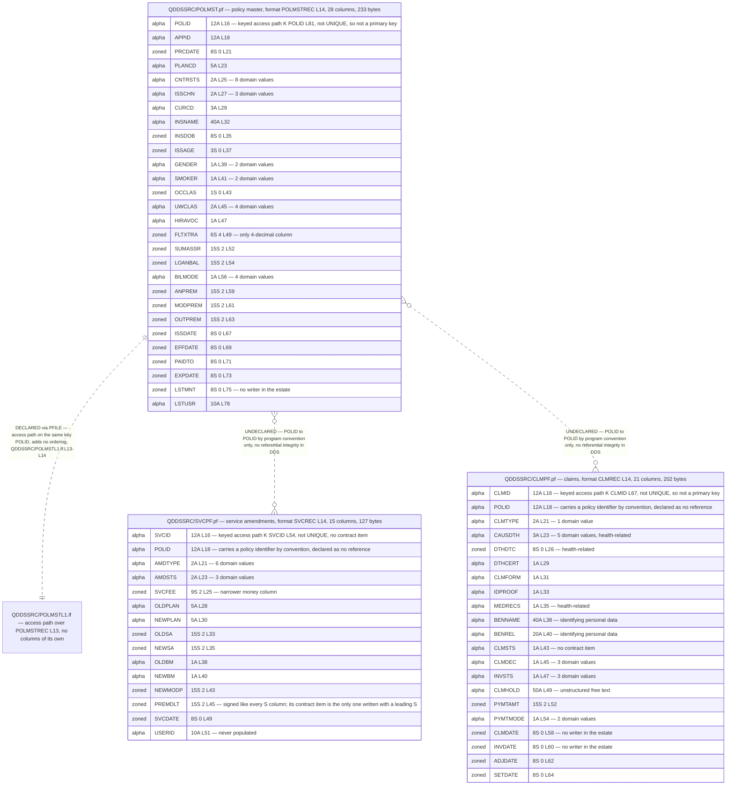
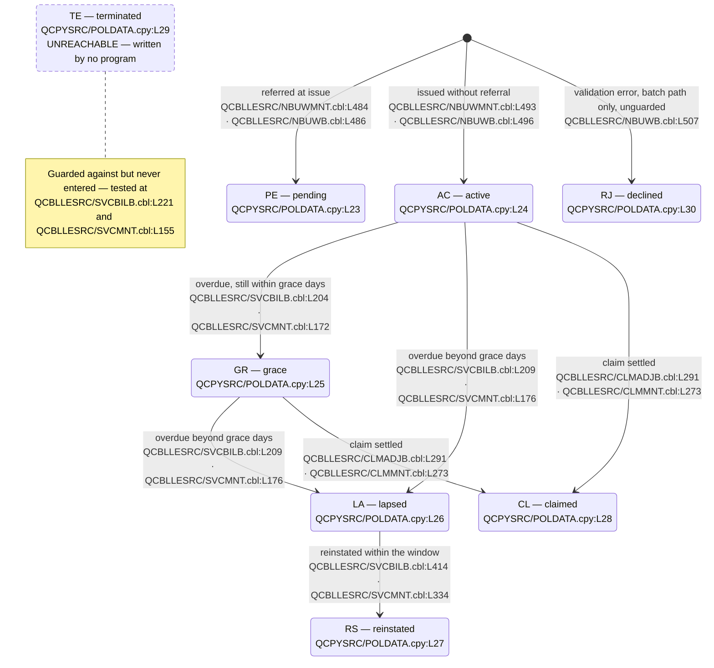

# LIFE400 Current-State Data Model

This document is the field-level record of what LIFE400 stores and what it merely computes. It inventories every column of the three stored files and the one access path over them, publishes the shared data contract that all but one of the programs compile against — group by group, item by item, and domain by domain — classifies every item of that contract as persisted or transient, states which constraints the schema declares and which it does not, and records two places where two parts of the system say different things about the same data. It is the evidence base the forward half of this assessment converts: [the target data model and schema mapping](../target-state/03-target-data-model-and-schema-mapping.md) maps every column and every domain named here, and [the data migration runbook](../migration/04-data-migration-runbook.md) moves them. Three recorded decisions are decided on evidence published here — [MOD-ADR-003 on the target datastore](../decisions/MOD-ADR-003-target-datastore.md), [MOD-ADR-006 on date and decimal representation](../decisions/MOD-ADR-006-date-and-decimal-representation.md), and [MOD-ADR-009 on rider persistence](../decisions/MOD-ADR-009-rider-persistence.md) — and their reasoning is recorded once, in those records, not restated here.

**Scope.** This document describes the schema as built and stops there. It publishes no target column name, no target type, no data-definition language, no transformation rule and no design for the child table that riders would need; all of that belongs to [the target data model and schema mapping](../target-state/03-target-data-model-and-schema-mapping.md). It identifies the *categories* of sensitive data a column falls into, and nothing further: the inventory of personal and health data, the retention exposure, the erasure gap and the question of which regulatory framework applies are the business of [the compliance and data protection document](../risk/02-compliance-and-data-protection.md), and this document asserts no framework as applicable. It records anomalies as structural observations and dispositions none of them — every migrate, implement or drop decision is the sole business of [the known defects and stubs register](07-known-defects-and-stubs.md). It does not enumerate members, banners or line counts, which are the register kept by [the system inventory](01-system-inventory.md), nor analyse call paths, [paragraph](../reference/glossary-ibm-i.md#paragraph) inventories or the online-to-batch duplication, which belong to [the current-state architecture](02-architecture-current-state.md). It counts coded domains but does not census business rules, which belongs to [the business rule inventory](05-business-rule-inventory.md). Screen and report field layouts belong to [the UI modernization document](../target-state/05-ui-modernization.md). A reader entering the assessment for the first time should start at [the section index](../README.md).

**Reading the citations.** Every claim about LIFE400 carries an inline citation of the form `[<path>:<locator>]` immediately after the claim. Citations are plain text and deliberately not hyperlinks: a plain-text citation stays meaningful in a diff and does not depend on a hosting provider's line-anchor syntax. Open the member to read the declaration in place. The same discipline applies inside both diagrams — every node that names a real artifact carries its member path in the node label itself. No member of the estate is annotated, altered, reformatted or commented by this documentation set; the schema is read as evidence and left exactly as it is. Platform terms link to [the IBM i glossary](../reference/glossary-ibm-i.md) on first use in this document.

**How this model was extracted.** Nothing below is carried over from prior description, and every figure is re-derivable from the working tree. Columns come from the field lines of the four [DDS](../reference/glossary-ibm-i.md#dds-data-description-specifications) database members, with the name, the length-and-type attribute and the `TEXT` keyword taken verbatim from each line. Contract structure comes from the level numbers in the copybook: an item is counted as elementary when it carries a `PIC` clause, so a level number that introduces a group is never counted as a field. Domains come from every [level-88](../reference/glossary-ibm-i.md#level-88-condition-name) line, attributed to the field immediately above it. Record lengths are computed by summing the declared lengths, treating a `V` in a `PIC` clause as an implied decimal point that occupies no byte and an embedded sign as occupying none either. The persisted-versus-transient classification is established by correspondence of name, declared length and declared scale between a contract item and a column, because — as recorded below — the contract and the file it describes do not agree in size and therefore cannot be aligned by byte offset. Every census of what is *absent* was run over the members themselves, and over COBOL code lines only: a line carrying an asterisk in column 7 is a comment, so a keyword appearing only in a comment is never counted as present.

## Where persistence is defined

Persistence in LIFE400 is defined **entirely by DDS** — a record format declared over a physical file [QDDSSRC/POLMST.pf:L14], [QDDSSRC/SVCPF.pf:L14], [QDDSSRC/CLMPF.pf:L14] and one declared over another file [QDDSSRC/POLMSTL1.lf:L13]. The repository's structure diagram enumerates every member it holds and none is a data-definition-language member, a schema-migration script or a catalogue definition [README.md:L27-L55], so there is no such artifact anywhere in the working tree outside the four members below; two artifacts named in this project's history — a data-definition-language member and a document mapping the CL jobs — are not in the working tree, so neither is part of the schema as built and neither is described or linked here. The four members are the whole of it: three [physical files](../reference/glossary-ibm-i.md#physical-file) that hold data, and one [logical file](../reference/glossary-ibm-i.md#logical-file) that holds none.

| Table / File Name | Type | Description | Usage Mode | Key Fields / Layout Highlights |
|-------------------|------|-------------|------------|--------------------------------|
| `QDDSSRC/POLMST.pf` | Physical file | Policy master, one record per policy [QDDSSRC/POLMST.pf:L10] | Read and rewritten by six programs, read only by the inquiry program | 28 columns; [record format](../reference/glossary-ibm-i.md#record-format) `POLMSTREC` [QDDSSRC/POLMST.pf:L14]; key `POLID` [QDDSSRC/POLMST.pf:L81]; 233 bytes |
| `QDDSSRC/SVCPF.pf` | Physical file | Service amendments, one record per amendment [QDDSSRC/SVCPF.pf:L10] | Written whole by one program; opened and never touched by the other | 15 columns; record format `SVCREC` [QDDSSRC/SVCPF.pf:L14]; key `SVCID` [QDDSSRC/SVCPF.pf:L54]; 127 bytes |
| `QDDSSRC/CLMPF.pf` | Physical file | Claims, one record per claim [QDDSSRC/CLMPF.pf:L10] | Written whole by one program; opened and never touched by the other | 21 columns; record format `CLMREC` [QDDSSRC/CLMPF.pf:L14]; key `CLMID` [QDDSSRC/CLMPF.pf:L67]; 202 bytes |
| `QDDSSRC/POLMSTL1.lf` | Logical file | Keyed view over the policy master [QDDSSRC/POLMSTL1.lf:L9] | Named by no program | No columns of its own; built over `POLMST` [QDDSSRC/POLMSTL1.lf:L13]; key `POLID` [QDDSSRC/POLMSTL1.lf:L14] |

The column convention of that table is the one this repository's existing per-program documentation already uses [.swm/polmstinq-policy-master-inquiry.4dyvkwri.sw.md:L75]. Two properties hold across all four members and are stated once here rather than repeated per file. Each physical file declares exactly one record format, so a file and a record layout are the same thing in this estate. And every numeric column in all four members is declared with the DDS `S` type — [zoned decimal](../reference/glossary-ibm-i.md#zoned-decimal) — with no packed, binary or floating-point type anywhere; access is therefore always [record-level I/O](../reference/glossary-ibm-i.md#record-level-io) against a legible decimal representation.

## The policy master

`POLMST` is the file every business program opens and the only one whose columns are reached by name from program code. Its 28 columns divide into six bands that the member's own comment lines delimit: control [QDDSSRC/POLMST.pf:L15], insured [QDDSSRC/POLMST.pf:L31], benefit [QDDSSRC/POLMST.pf:L51], premium [QDDSSRC/POLMST.pf:L58], date [QDDSSRC/POLMST.pf:L65] and audit [QDDSSRC/POLMST.pf:L77].

### POLMST columns

The `Declared text` column reproduces each line's `TEXT` keyword verbatim, because for several coded columns that literal is the only place the legal values are written down at all.

| Column | Declared type | Declaration | Declared text |
|--------|---------------|-------------|---------------|
| `POLID` | `12A` | [QDDSSRC/POLMST.pf:L16] | `POLICY ID` |
| `APPID` | `12A` | [QDDSSRC/POLMST.pf:L18] | `APPLICATION ID` |
| `PRCDATE` | `8S 0` | [QDDSSRC/POLMST.pf:L21] | `PROCESS DATE YYYYMMDD` |
| `PLANCD` | `5A` | [QDDSSRC/POLMST.pf:L23] | `PLAN CODE` |
| `CNTRSTS` | `2A` | [QDDSSRC/POLMST.pf:L25] | `CONTRACT STATUS` |
| `ISSCHN` | `2A` | [QDDSSRC/POLMST.pf:L27] | `ISSUE CHANNEL` |
| `CURCD` | `3A` | [QDDSSRC/POLMST.pf:L29] | `CURRENCY CODE` |
| `INSNAME` | `40A` | [QDDSSRC/POLMST.pf:L32] | `INSURED NAME` |
| `INSDOB` | `8S 0` | [QDDSSRC/POLMST.pf:L35] | `DATE OF BIRTH YYYYMMDD` |
| `ISSAGE` | `3S 0` | [QDDSSRC/POLMST.pf:L37] | `ISSUE AGE` |
| `GENDER` | `1A` | [QDDSSRC/POLMST.pf:L39] | `GENDER M/F` |
| `SMOKER` | `1A` | [QDDSSRC/POLMST.pf:L41] | `SMOKER STATUS S/N` |
| `OCCLAS` | `1S 0` | [QDDSSRC/POLMST.pf:L43] | `OCCUPATION CLASS 1-4` |
| `UWCLAS` | `2A` | [QDDSSRC/POLMST.pf:L45] | `UW CLASS PR/ST/TB/DP` |
| `HIRAVOC` | `1A` | [QDDSSRC/POLMST.pf:L47] | `HIGH RISK AVOCATION Y/N` |
| `FLTXTRA` | `6S 4` | [QDDSSRC/POLMST.pf:L49] | `FLAT EXTRA RATE PER 1000` |
| `SUMASSR` | `15S 2` | [QDDSSRC/POLMST.pf:L52] | `SUM ASSURED` |
| `LOANBAL` | `15S 2` | [QDDSSRC/POLMST.pf:L54] | `POLICY LOAN BALANCE` |
| `BILMODE` | `1A` | [QDDSSRC/POLMST.pf:L56] | `BILLING MODE A/S/Q/M` |
| `ANPREM` | `15S 2` | [QDDSSRC/POLMST.pf:L59] | `TOTAL ANNUAL PREMIUM` |
| `MODPREM` | `15S 2` | [QDDSSRC/POLMST.pf:L61] | `MODAL PREMIUM` |
| `OUTPREM` | `15S 2` | [QDDSSRC/POLMST.pf:L63] | `OUTSTANDING PREMIUM` |
| `ISSDATE` | `8S 0` | [QDDSSRC/POLMST.pf:L67] | `ISSUE DATE YYYYMMDD` |
| `EFFDATE` | `8S 0` | [QDDSSRC/POLMST.pf:L69] | `EFFECTIVE DATE YYYYMMDD` |
| `PAIDTO` | `8S 0` | [QDDSSRC/POLMST.pf:L71] | `PAID TO DATE YYYYMMDD` |
| `EXPDATE` | `8S 0` | [QDDSSRC/POLMST.pf:L73] | `EXPIRY DATE YYYYMMDD` |
| `LSTMNT` | `8S 0` | [QDDSSRC/POLMST.pf:L75] | `LAST MAINT DATE YYYYMMDD` |
| `LSTUSR` | `10A` | [QDDSSRC/POLMST.pf:L78] | `LAST ACTION USER` |

### Type groups in the policy master

The 28 columns fall into four type groups that sum to 28, and each group carries a different consequence for conversion.

- **Five monetary columns, all `15S 2`** — `SUMASSR` [QDDSSRC/POLMST.pf:L52], `LOANBAL` [QDDSSRC/POLMST.pf:L54], `ANPREM` [QDDSSRC/POLMST.pf:L59], `MODPREM` [QDDSSRC/POLMST.pf:L61] and `OUTPREM` [QDDSSRC/POLMST.pf:L63]. Fifteen digits with the last two after the decimal point, held as zoned decimal.
- **Seven date columns, all `8S 0`** — `PRCDATE` [QDDSSRC/POLMST.pf:L21], `INSDOB` [QDDSSRC/POLMST.pf:L35], `ISSDATE` [QDDSSRC/POLMST.pf:L67], `EFFDATE` [QDDSSRC/POLMST.pf:L69], `PAIDTO` [QDDSSRC/POLMST.pf:L71], `EXPDATE` [QDDSSRC/POLMST.pf:L73] and `LSTMNT` [QDDSSRC/POLMST.pf:L75]. Every one is an eight-digit integer holding a `YYYYMMDD` value, not a date type; the member's own comment lines say so at [QDDSSRC/POLMST.pf:L20], [QDDSSRC/POLMST.pf:L34] and [QDDSSRC/POLMST.pf:L66]. Nothing in the declaration prevents an eight-digit integer that is not a valid calendar date, and nothing in it makes date arithmetic anything other than integer arithmetic.
- **Three further numeric columns, each with a different scale** — `ISSAGE` `3S 0` [QDDSSRC/POLMST.pf:L37], `OCCLAS` `1S 0` [QDDSSRC/POLMST.pf:L43] and `FLTXTRA` `6S 4` [QDDSSRC/POLMST.pf:L49]. `FLTXTRA` is the only four-decimal column in the file, which is why no single numeric type can be chosen once and applied to the whole schema.
- **Thirteen alphanumeric columns**, of which six are coded: a two-character contract status [QDDSSRC/POLMST.pf:L25], a two-character issue channel [QDDSSRC/POLMST.pf:L27], one-character gender [QDDSSRC/POLMST.pf:L39] and smoker status [QDDSSRC/POLMST.pf:L41], a two-character underwriting class [QDDSSRC/POLMST.pf:L45] and a one-character billing mode [QDDSSRC/POLMST.pf:L56]. Each is a bare alphanumeric column whose legal values exist only in the contract, as recorded under [coded domains](#coded-domains-the-level-88-condition-names).

## The servicing and amendment file

`SVCPF` records one amendment request per record [QDDSSRC/SVCPF.pf:L10] and is organised as pairs: the old and the new value of whatever the amendment changes.

### SVCPF columns

| Column | Declared type | Declaration | Declared text |
|--------|---------------|-------------|---------------|
| `SVCID` | `12A` | [QDDSSRC/SVCPF.pf:L16] | `SERVICE REQUEST ID` |
| `POLID` | `12A` | [QDDSSRC/SVCPF.pf:L18] | `POLICY ID` |
| `AMDTYPE` | `2A` | [QDDSSRC/SVCPF.pf:L21] | `AMEND TYPE PL/SA/BM/AR/RR/RI` |
| `AMDSTS` | `2A` | [QDDSSRC/SVCPF.pf:L23] | `AMEND STATUS PE/AP/RJ` |
| `SVCFEE` | `9S 2` | [QDDSSRC/SVCPF.pf:L25] | `SERVICE FEE CHARGED` |
| `OLDPLAN` | `5A` | [QDDSSRC/SVCPF.pf:L28] | `OLD PLAN CODE` |
| `NEWPLAN` | `5A` | [QDDSSRC/SVCPF.pf:L30] | `NEW PLAN CODE` |
| `OLDSA` | `15S 2` | [QDDSSRC/SVCPF.pf:L33] | `OLD SUM ASSURED` |
| `NEWSA` | `15S 2` | [QDDSSRC/SVCPF.pf:L35] | `NEW SUM ASSURED` |
| `OLDBM` | `1A` | [QDDSSRC/SVCPF.pf:L38] | `OLD BILLING MODE` |
| `NEWBM` | `1A` | [QDDSSRC/SVCPF.pf:L40] | `NEW BILLING MODE` |
| `NEWMODP` | `15S 2` | [QDDSSRC/SVCPF.pf:L43] | `NEW MODAL PREMIUM` |
| `PREMDLT` | `15S 2` | [QDDSSRC/SVCPF.pf:L45] | `PREMIUM DELTA` |
| `SVCDATE` | `8S 0` | [QDDSSRC/SVCPF.pf:L49] | `SERVICE DATE YYYYMMDD` |
| `USERID` | `10A` | [QDDSSRC/SVCPF.pf:L51] | `REQUESTING USER ID` |

Four columns are `15S 2` and one, the service fee, is `9S 2` [QDDSSRC/SVCPF.pf:L25] — nine digits with two decimals, a narrower money column than the rest of the estate. One column is a date, `SVCDATE` `8S 0` [QDDSSRC/SVCPF.pf:L49], again an eight-digit `YYYYMMDD` integer per the member's own note [QDDSSRC/SVCPF.pf:L48]. `AMDTYPE` [QDDSSRC/SVCPF.pf:L21] and `AMDSTS` [QDDSSRC/SVCPF.pf:L23] are the two coded columns, and both are unusual in that their `TEXT` literal enumerates the legal values in the schema itself — the only place in any of the four members where a domain is written down outside the contract, and still only as descriptive text rather than as a constraint.

### A column no program populates

`USERID`, `REQUESTING USER ID` [QDDSSRC/SVCPF.pf:L51], is declared and never populated — and so is every other column of this file. The reason is in the only program that writes it: `SVCMNT` describes the record as a single undifferentiated two-hundred-byte area, `01 SVCPF-RECORD PIC X(200).` [QCBLLESRC/SVCMNT.cbl:L58], and writes that area whole [QCBLLESRC/SVCMNT.cbl:L191]. The name `SVCPF-RECORD` occurs exactly twice in the entire estate — that declaration and that write — so no statement anywhere moves a value into it before it is written. A program that writes an undifferentiated area cannot populate an individual column, so the file has no effective writer at all, and the two-hundred-byte area does not even agree in length with the 127-byte record this file defines. `USERID` is singled out here only because it is the one column whose *purpose* is lost rather than merely its value; the full analysis of both secondary persistence paths, and the length disagreement on each, is under [columns the contract does not describe](#columns-the-contract-does-not-describe). This document records the facts; the disposition belongs to [the known defects and stubs register](07-known-defects-and-stubs.md), and the structural analysis of why both secondary files are declared by the programs that never touch them is already given in [the current-state architecture](02-architecture-current-state.md).

## The claims file

`CLMPF` records one claim per record [QDDSSRC/CLMPF.pf:L10]. It is the second widest of the three files — 21 columns and 202 bytes against the policy master's 28 columns and 233 bytes — and it is the one that carries the most sensitive content.

### CLMPF columns

| Column | Declared type | Declaration | Declared text |
|--------|---------------|-------------|---------------|
| `CLMID` | `12A` | [QDDSSRC/CLMPF.pf:L16] | `CLAIM ID` |
| `POLID` | `12A` | [QDDSSRC/CLMPF.pf:L18] | `POLICY ID` |
| `CLMTYPE` | `2A` | [QDDSSRC/CLMPF.pf:L21] | `CLAIM TYPE DT=DEATH` |
| `CAUSDTH` | `3A` | [QDDSSRC/CLMPF.pf:L23] | `CAUSE OF DEATH` |
| `DTHDTC` | `8S 0` | [QDDSSRC/CLMPF.pf:L26] | `DATE OF DEATH YYYYMMDD` |
| `DTHCERT` | `1A` | [QDDSSRC/CLMPF.pf:L29] | `DEATH CERT RECD Y/N` |
| `CLMFORM` | `1A` | [QDDSSRC/CLMPF.pf:L31] | `CLAIM FORM RECD Y/N` |
| `IDPROOF` | `1A` | [QDDSSRC/CLMPF.pf:L33] | `ID PROOF RECD Y/N` |
| `MEDRECS` | `1A` | [QDDSSRC/CLMPF.pf:L35] | `MEDICAL RECORDS RECD Y/N` |
| `BENNAME` | `40A` | [QDDSSRC/CLMPF.pf:L38] | `BENEFICIARY NAME` |
| `BENREL` | `20A` | [QDDSSRC/CLMPF.pf:L40] | `BENEFICIARY RELATION` |
| `CLMSTS` | `1A` | [QDDSSRC/CLMPF.pf:L43] | `CLAIM STATUS` |
| `CLMDEC` | `1A` | [QDDSSRC/CLMPF.pf:L45] | `CLAIM DECISION A/R/P` |
| `INVSTS` | `1A` | [QDDSSRC/CLMPF.pf:L47] | `INVESTIGATION STATUS N/P/C` |
| `CLMHOLD` | `50A` | [QDDSSRC/CLMPF.pf:L49] | `HOLD REASON` |
| `PYMTAMT` | `15S 2` | [QDDSSRC/CLMPF.pf:L52] | `CLAIM PAYMENT AMOUNT` |
| `PYMTMODE` | `1A` | [QDDSSRC/CLMPF.pf:L54] | `PAYMENT MODE C=CHK A=ACH` |
| `CLMDATE` | `8S 0` | [QDDSSRC/CLMPF.pf:L58] | `CLAIM SUBMIT DATE YYYYMMDD` |
| `INVDATE` | `8S 0` | [QDDSSRC/CLMPF.pf:L60] | `INVEST DATE YYYYMMDD` |
| `ADJDATE` | `8S 0` | [QDDSSRC/CLMPF.pf:L62] | `ADJUDIC DATE YYYYMMDD` |
| `SETDATE` | `8S 0` | [QDDSSRC/CLMPF.pf:L64] | `SETTLE DATE YYYYMMDD` |

One column is monetary, `PYMTAMT` `15S 2` [QDDSSRC/CLMPF.pf:L52]; five are eight-digit `YYYYMMDD` dates [QDDSSRC/CLMPF.pf:L26], [QDDSSRC/CLMPF.pf:L58], [QDDSSRC/CLMPF.pf:L60], [QDDSSRC/CLMPF.pf:L62], [QDDSSRC/CLMPF.pf:L64], as the member's own notes state [QDDSSRC/CLMPF.pf:L25], [QDDSSRC/CLMPF.pf:L57]; the remaining fifteen are alphanumeric. Four of the alphanumeric columns are one-character document flags [QDDSSRC/CLMPF.pf:L29], [QDDSSRC/CLMPF.pf:L31], [QDDSSRC/CLMPF.pf:L33], [QDDSSRC/CLMPF.pf:L35], and `CLMHOLD` `50A` [QDDSSRC/CLMPF.pf:L49] is the widest free-text column anywhere in the schema, with no declared structure of any kind.

### Categories of sensitive data across the policy and claim records

The categories below are identified so that the documents which own the subject can work from an accurate classification. **They are categories only.** The inventory itself, the retention exposure, the erasure gap and the applicability of any regulatory framework are the business of [the compliance and data protection document](../risk/02-compliance-and-data-protection.md), and no framework is asserted as applicable here.

| Category | Columns | Basis |
|----------|---------|-------|
| Identifying personal data | `INSNAME` [QDDSSRC/POLMST.pf:L32], `INSDOB` [QDDSSRC/POLMST.pf:L35], `BENNAME` [QDDSSRC/CLMPF.pf:L38], `BENREL` [QDDSSRC/CLMPF.pf:L40] | Names, a date of birth and a stated relationship to the insured, each declared as a plain alphanumeric or zoned column |
| Health-related data | `SMOKER` [QDDSSRC/POLMST.pf:L41], `CAUSDTH` [QDDSSRC/CLMPF.pf:L23], `DTHDTC` [QDDSSRC/CLMPF.pf:L26], `MEDRECS` [QDDSSRC/CLMPF.pf:L35] | A smoking-status attribute, a cause of death, a date of death, and a flag recording that medical records have been received |
| Derived risk assessment | `UWCLAS` [QDDSSRC/POLMST.pf:L45], `OCCLAS` [QDDSSRC/POLMST.pf:L43], `HIRAVOC` [QDDSSRC/POLMST.pf:L47], `FLTXTRA` [QDDSSRC/POLMST.pf:L49] | An underwriting classification and the occupational, avocational and rate loadings that inform it |
| Unstructured free text | `CLMHOLD` [QDDSSRC/CLMPF.pf:L49] | Fifty characters with no declared structure, so its content cannot be characterised from the schema at all |

One classification is worth stating explicitly because it is easy to get wrong, and getting it wrong changes how a column must be treated. **`BENNAME` at [QDDSSRC/CLMPF.pf:L38] is a beneficiary name — identifying personal data, not health data.** The genuinely health-related columns in the claim record are the cause of death [QDDSSRC/CLMPF.pf:L23], the date of death [QDDSSRC/CLMPF.pf:L26] and the medical-records flag [QDDSSRC/CLMPF.pf:L35], and one further health attribute sits outside the claim record altogether, in the policy master's smoker status [QDDSSRC/POLMST.pf:L41].

## The access path over the policy master

`POLMSTL1` is fourteen lines long and declares **no columns of its own.** It has exactly two non-comment lines: a record format naming its physical file, `R POLMSTREC PFILE(POLMST)` [QDDSSRC/POLMSTL1.lf:L13], and a key, `K POLID` [QDDSSRC/POLMSTL1.lf:L14]. Its banner describes it as a keyed view over the policy master used for random access by all online and batch programs [QDDSSRC/POLMSTL1.lf:L9-L10].

The data-model observation is that the key it declares is the same single field the physical file already keys itself on [QDDSSRC/POLMST.pf:L81]. It selects no subset of columns, reorders nothing, and adds no second ordering, so it offers no access path that `POLMST` does not already offer. Whether that means it needs any counterpart at all is settled in [the target data model and schema mapping](../target-state/03-target-data-model-and-schema-mapping.md), not here. Two further facts bear on how the member should be read and are recorded rather than reconciled: its banner's claim that all online and batch programs use it is not borne out by the programs, none of which names it — established by the census in [the current-state architecture](02-architecture-current-state.md) — and because it declares no fields, there is nothing in it for a schema mapping to map.

## How many columns the estate persists

The arithmetic is stated so that it can be re-derived rather than trusted:

- `POLMST` — **28** columns [QDDSSRC/POLMST.pf:L16-L78]
- `SVCPF` — **15** columns [QDDSSRC/SVCPF.pf:L16-L51]
- `CLMPF` — **21** columns [QDDSSRC/CLMPF.pf:L16-L64]
- `POLMSTL1` — **0** columns of its own [QDDSSRC/POLMSTL1.lf:L13-L14]

28 + 15 + 21 + 0 = **64 persisted columns** in the entire system. Aggregated by type across the three physical files, and summing to 64: ten columns are declared `15S 2` and one `9S 2`, giving **11** monetary columns; **13** are eight-digit `YYYYMMDD` date integers; **3** are other numerics — `ISSAGE` `3S 0` [QDDSSRC/POLMST.pf:L37], `OCCLAS` `1S 0` [QDDSSRC/POLMST.pf:L43] and `FLTXTRA` `6S 4` [QDDSSRC/POLMST.pf:L49]; and **37** are alphanumeric. Every one of the 64 is mapped to a target column and type in [the target data model and schema mapping](../target-state/03-target-data-model-and-schema-mapping.md).

## The shared data contract

`QCPYSRC/POLDATA.cpy` is 175 lines defining a single record, `01 WS-POLICY-MASTER-REC.` [QCPYSRC/POLDATA.cpy:L14]. It is a [copybook](../reference/glossary-ibm-i.md#copybook) — a source fragment expanded into each consumer at compile time — and it is simultaneously the record description of the policy master in every program that uses it, because in all seven consumers the `COPY` statement sits immediately after `FD POLMST` [QCBLLESRC/NBUWMNT.cbl:L49-L50]. It therefore serves two roles from one declaration: it is the in-memory shape of a policy and it is the shape each program declares for the stored record. What it is not is a description that matches the record actually stored — it is longer than the policy master's own record and ordered differently, as [the contract is larger than the file it describes](#the-contract-is-larger-than-the-file-it-describes) sets out below. This document is the first to inventory it.

### Group structure of the contract

Nine level-05 groups partition the record, which is declared as one `01` item [QCPYSRC/POLDATA.cpy:L14-L175] beginning at [QCPYSRC/POLDATA.cpy:L16] and ending at [QCPYSRC/POLDATA.cpy:L175]. The line ranges below run from each group's own declaration to the line before the next group's, so together they cover the whole record with no gap.

| Group | Declaration | Range | Elementary items | Purpose stated by the member's own comment |
|-------|-------------|-------|------------------|--------------------------------------------|
| `PM-CONTROL-AREA` | [QCPYSRC/POLDATA.cpy:L16] | L16-L37 | 9 | Control area [QCPYSRC/POLDATA.cpy:L15] |
| `PM-PLAN-PARAMETERS` | [QCPYSRC/POLDATA.cpy:L39] | L39-L52 | 13 | Plan parameters [QCPYSRC/POLDATA.cpy:L38] |
| `PM-INSURED-DETAILS` | [QCPYSRC/POLDATA.cpy:L54] | L54-L73 | 10 | Insured details [QCPYSRC/POLDATA.cpy:L53] |
| `PM-BENEFIT-DETAILS` | [QCPYSRC/POLDATA.cpy:L75] | L75-L96 | 13 | Benefit details [QCPYSRC/POLDATA.cpy:L74] |
| `PM-PREMIUM-RESULTS` | [QCPYSRC/POLDATA.cpy:L98] | L98-L106 | 8 | Premium results [QCPYSRC/POLDATA.cpy:L97] |
| `PM-DATE-DETAILS` | [QCPYSRC/POLDATA.cpy:L108] | L108-L115 | 6 | Date details [QCPYSRC/POLDATA.cpy:L107] |
| `PM-SERVICING-DETAILS` | [QCPYSRC/POLDATA.cpy:L117] | L117-L136 | 10 | Servicing details [QCPYSRC/POLDATA.cpy:L116] |
| `PM-CLAIM-DETAILS` | [QCPYSRC/POLDATA.cpy:L138] | L138-L170 | 18 | Claim details [QCPYSRC/POLDATA.cpy:L137] |
| `PM-AUDIT-DETAILS` | [QCPYSRC/POLDATA.cpy:L172] | L172-L175 | 2 | Audit details [QCPYSRC/POLDATA.cpy:L171] |

The item counts sum to 9 + 13 + 10 + 13 + 8 + 6 + 10 + 18 + 2 = **89**, over the one declaration the addends are counted from [QCPYSRC/POLDATA.cpy:L14-L175].

### Elementary item count

The 89 is arrived at as follows, and the arithmetic is published so that the figure can be re-verified rather than accepted:

- **84 level-10 items carrying a `PIC` clause.** These are the ordinary fields of the record, counted over the whole declaration [QCPYSRC/POLDATA.cpy:L14-L175] — for example [QCPYSRC/POLDATA.cpy:L17] and [QCPYSRC/POLDATA.cpy:L174].
- **5 level-15 items**, all inside the rider table, at [QCPYSRC/POLDATA.cpy:L90-L94].
- 84 + 5 = **89 elementary items**, every one of them declared within [QCPYSRC/POLDATA.cpy:L14-L175].

There are 85 level-10 lines in total, and exactly one of them carries no `PIC` clause: `PM-RIDER-TABLE` [QCPYSRC/POLDATA.cpy:L88], which is a group introducing the five level-15 items beneath it. It is a group, not a field, so it is not counted among the 89. Counting the containers as well, the record declares one level-01 item, nine level-05 groups, one level-10 group and 89 elementary items.

### The contract is larger than the file it describes

The contract's declared length can be computed from its own `PIC` clauses [QCPYSRC/POLDATA.cpy:L14-L175]. Summing them group by group — a `V` marking an implied decimal point occupies no byte, an embedded sign occupies none, and the rider table contributes its 42-byte occurrence five times — gives 146 + 77 + 66 + 267 + 120 + 48 + 56 + 181 + 18 = **979 bytes**.

The policy master's own record is 28 columns totalling **233 bytes** [QDDSSRC/POLMST.pf:L16-L78]. The two do not agree, and they do not agree in ordering either: the contract runs from the currency code [QCPYSRC/POLDATA.cpy:L35] straight into the outcome pair [QCPYSRC/POLDATA.cpy:L36-L37] before reaching the insured name [QCPYSRC/POLDATA.cpy:L55], where the file goes from its currency code [QDDSSRC/POLMST.pf:L29] directly to its insured name [QDDSSRC/POLMST.pf:L32]. No consumer narrows the discrepancy with a `RECORD CONTAINS` clause; every one simply expands the contract under `FD POLMST` [QCBLLESRC/NBUWMNT.cbl:L49-L50], [QCBLLESRC/NBUWB.cbl:L59-L60], [QCBLLESRC/SVCMNT.cbl:L55-L56], [QCBLLESRC/SVCBILB.cbl:L63-L64], [QCBLLESRC/CLMMNT.cbl:L54-L55], [QCBLLESRC/CLMADJB.cbl:L57-L58], [QCBLLESRC/POLMSTINQ.cbl:L49-L50].

**That disagreement is not only in length and ordering — it decides what a write actually stores, and this is the load-bearing fact of the whole document.** Every consumer's `FD POLMST` names no external description, so the record area is *program-described*. The file's column names — `POLID`, `INSNAME`, `SUMASSR` and the rest — appear nowhere in any COBOL member, and no construct in this design matches a contract item to a column by name. What a column receives on a write is whatever occupies the same byte positions of the record area, and what an item receives on a read is whatever the file held at those positions. Name, declared length and declared scale therefore establish what each pair was *intended* to be. Relative position establishes what the code does. Those are two different mappings and this document publishes both, labelled, rather than presenting the first as if it were the second.

The positional mapping is arithmetic over declarations already published above: the contract's group lengths summed in order against the policy master's column lengths summed in order.

| Contract group | Bytes it occupies | Policy-master columns at those same bytes | What that means |
|----------------|-------------------|-------------------------------------------|-----------------|
| `PM-CONTROL-AREA` first seven items [QCPYSRC/POLDATA.cpy:L17-L35] | 1-44 | `POLID` 1-12, `APPID` 13-24, `PRCDATE` 25-32, `PLANCD` 33-37, `CNTRSTS` 38-39, `ISSCHN` 40-41, `CURCD` 42-44 | Item-for-column agreement: same order, same lengths, intent and behaviour coincide |
| The outcome pair `PM-RETURN-CODE` and `PM-RETURN-MESSAGE` [QCPYSRC/POLDATA.cpy:L36-L37] | 45-146 | `INSNAME` 45-84, `INSDOB` 85-92, `ISSAGE` 93-95, `GENDER` 96, `SMOKER` 97, `OCCLAS` 98, `UWCLAS` 99-100, `HIRAVOC` 101, `FLTXTRA` 102-107, `SUMASSR` 108-122, `LOANBAL` 123-137, `BILMODE` 138, and the first eight bytes of `ANPREM` | The 102 bytes the estate uses to report an outcome sit over thirteen insured, benefit and premium columns |
| `PM-PLAN-PARAMETERS`, all thirteen items [QCPYSRC/POLDATA.cpy:L39-L52] | 147-223 | the rest of `ANPREM`, then `MODPREM`, `OUTPREM`, `ISSDATE`, `EFFDATE`, `PAIDTO`, `EXPDATE`, `LSTMNT` | The one group this document classifies as wholly transient sits over eight persisted columns, four of them dates |
| `PM-INSURED-DETAILS` [QCPYSRC/POLDATA.cpy:L54] | 224-289 | `LSTUSR` 224-233 — and nothing at all from 234 | Only its first ten bytes, the leading characters of `PM-INSURED-NAME`, are inside the record, and they sit over the audit column |
| `PM-BENEFIT-DETAILS`, `PM-PREMIUM-RESULTS`, `PM-DATE-DETAILS`, `PM-SERVICING-DETAILS`, `PM-CLAIM-DETAILS`, `PM-AUDIT-DETAILS` | 290-979 | none — the record ends at 233 | 690 bytes past the end of the file's record, including every premium result, every date detail and the audit pair |

Three readings follow, and each is a fact about the code rather than an interpretation of it.

- **Bytes 1 to 44 are the whole of the agreement.** Seven items and seven columns coincide, in the same order and at the same declared lengths, which is why the policy identifier, the plan code and the contract status behave exactly as the name-based mapping predicts. From byte 45 the two layouts part company and never re-converge, because the contract inserts 102 bytes of outcome channel and 77 bytes of plan parameters that the file does not have, and the file carries no counterpart to either.
- **Everything past byte 233 cannot participate in policy-master I/O at all.** That is 746 of the contract's 979 bytes. `PM-AUDIT-DETAILS` begins at byte 962 [QCPYSRC/POLDATA.cpy:L172], 729 bytes past the end of the record, so `PM-LAST-ACTION-USER` [QCPYSRC/POLDATA.cpy:L173] cannot reach `LSTUSR` [QDDSSRC/POLMST.pf:L78] by the mechanism the estate uses, however exactly their names and types correspond. The audit stamps the five mutating programs write are set in a part of the record area that no `REWRITE` of this file transfers.
- **The intended mapping is still the right thing to publish, and it is still the input a migration needs** — it is the statement of what each field is *for*, and it is what a target schema is built from. What it is not is a description of what the running system stores. Both are recorded, and every classification below is labelled as the intended correspondence.

**One consequence of the length disagreement is out of reach here and is stated as such.** Whether the platform's compiler rejects a 979-byte record description against a 233-byte file outright, or accepts it and transfers only the file's record length, is a property of that compiler, and no compiler for these languages exists off-platform [QCBLLESRC/MAINMENU.cbl:L27-L28]. In neither case does a name-based correspondence come into existence, so the positional analysis above holds under either answer; the disagreement itself is registered as a buildability finding in [the known defects and stubs register](07-known-defects-and-stubs.md).

The second consequence is structural and unaffected by any of this: the contract is not a description of one file. It carries the servicing and claim sections of the business alongside the policy sections, in one record area, which is why a single `REWRITE` of the policy master is the only write most of this data ever sees.

### Money, scale and sign

Money in LIFE400 is declared twice, once on each side of the same field, in two notations that mean the same thing. The contract declares the sum assured as `PIC 9(13)V99` [QCPYSRC/POLDATA.cpy:L76]; the file declares it as `15S 2` [QDDSSRC/POLMST.pf:L52]. Thirteen digits plus two decimal places is fifteen digits with two decimals — the same precision, written two ways:

```text
           10  PM-SUM-ASSURED           PIC 9(13)V99.
     A            SUMASSR       15S 2         TEXT('SUM ASSURED')
```

Three properties of the numeric declarations matter more than the notation.

- **Every value is exact decimal, never binary.** A zoned-decimal field stores one digit per byte and its scale is a property of the declaration, so arithmetic is exact to the declared number of decimal places. Reproducing these values in a binary floating-point type cannot be done exactly, and since output parity against the legacy system is what a migration is measured by, the representation is not a free choice. The decision is recorded in [MOD-ADR-006 on date and decimal representation](../decisions/MOD-ADR-006-date-and-decimal-representation.md); the evidence for it is the pair of declarations above, the eight-digit date integers already inventoried, and the scale variety recorded next.
- **Scale is not uniform, so no single numeric type covers the schema.** The contract uses `9(13)V99` for money [QCPYSRC/POLDATA.cpy:L76], `9(07)V99` for fees [QCPYSRC/POLDATA.cpy:L50], `9(02)V9999` for rates [QCPYSRC/POLDATA.cpy:L52], `9(01)V9999` for rating factors [QCPYSRC/POLDATA.cpy:L84] and unscaled integers for ages and counts [QCPYSRC/POLDATA.cpy:L40]. Four distinct scales appear: zero, two decimals and four decimals in the contract, matched on the file side by `15S 2`, `9S 2`, `6S 4`, `3S 0`, `1S 0` and `8S 0`.
- **Exactly one item in the whole contract carries a leading `S` in its picture clause.** It is `PM-PREMIUM-DELTA PIC S9(13)V99.` [QCPYSRC/POLDATA.cpy:L106]. Every other numeric item among the 89 omits it, so on the contract side a negative intermediate value has nowhere to live in the rest of the record. The stored side does not draw that distinction at all. The column corresponding to it, `PREMDLT` [QDDSSRC/SVCPF.pf:L45], is declared exactly like every other monetary column, `15S 2`, and `S` in DDS *is* signed zoned decimal — an exhaustive search of all ten members of `QDDSSRC` finds no keyword anywhere that alters sign handling, so the platform default applies to every numeric column equally. The asymmetry is therefore between the two declarations of the same data, not between one signed column and twenty-seven unsigned ones: every `S` column can hold a sign, while only one contract item says so.

#### Four places where the code and these declarations do not agree

The declarations above are the schema's capacity. Three groups of statements in the estate do not respect that capacity, and a fourth item is declared and never given a value at all; all four are arithmetic or census facts about the source rather than judgements about it. They are recorded here because a target type chosen from the declarations alone would reproduce the declaration and not the behaviour, and because a characterization fixture built without them would encode the wrong expected value.

- **The plan limits are moved from literals wider than the fields that receive them.** `PM-MIN-SUM-ASSURED` and `PM-MAX-SUM-ASSURED` are each `PIC 9(13)V99` [QCPYSRC/POLDATA.cpy:L42-L43], so the largest value either can hold is thirteen integer digits. The plan-parameter paragraph moves fourteen-integer-digit literals into them for all three plans [QCBLLESRC/NBUWB.cbl:L149-L150], [QCBLLESRC/NBUWB.cbl:L163-L164], [QCBLLESRC/NBUWB.cbl:L177-L178], and the online program repeats the same assignments [QCBLLESRC/NBUWMNT.cbl:L226-L268]. A `MOVE` into a shorter numeric picture truncates the high-order digits, so `10000000000000` and `50000000000000` cannot arrive intact. The sum-assured range test that consumes both fields [QCBLLESRC/NBUWB.cbl:L239-L240], [QCBLLESRC/NBUWMNT.cbl:L313-L314] is therefore comparing against values the schema cannot represent, and what it actually compares against is determined by the truncation rather than by the plan table [README.md:L62-L66].
- **The reinsurance-referral threshold is a literal wider than the field it tests.** `PM-SUM-ASSURED` is `PIC 9(13)V99` [QCPYSRC/POLDATA.cpy:L76], whose maximum value is `9999999999999.99`, and the referral test compares it with `45000000000000` [QCBLLESRC/NBUWB.cbl:L471], [QCBLLESRC/NBUWMNT.cbl:L474]. No value the field can hold is greater than that literal, so the condition cannot be satisfied on either path. This is a schema-capacity consequence, not a coding slip in one member: the same rule is written the same way in both programs.
- **A subtraction chain drives an unsigned field below zero and then tests for it.** `PM-CLAIM-PAYMENT-AMT` is unsigned, `PIC 9(13)V99` [QCPYSRC/POLDATA.cpy:L169]. Both claims programs subtract the modal premium and then the loan balance from it and afterwards test whether it is less than zero — [QCBLLESRC/CLMADJB.cbl:L273], [QCBLLESRC/CLMADJB.cbl:L277-L278], [QCBLLESRC/CLMADJB.cbl:L281] and [QCBLLESRC/CLMMNT.cbl:L260], [QCBLLESRC/CLMMNT.cbl:L263-L264], [QCBLLESRC/CLMMNT.cbl:L266]. An unsigned field has no representation for a negative value, so the floor the two programs are guarding with is written against a state the declaration excludes. The one signed item in the contract is the premium delta [QCPYSRC/POLDATA.cpy:L106], not this one.
- **One field the rules read is never written.** `PM-ISSUE-AGE PIC 9(03)` [QCPYSRC/POLDATA.cpy:L58] corresponds to the persisted column `ISSAGE` [QDDSSRC/POLMST.pf:L37] and is read at twenty-nine lines across five programs — underwriting age bounds [QCBLLESRC/NBUWB.cbl:L231-L232], the mortality-rate lookup [QCBLLESRC/NBUWB.cbl:L304-L310], rider age caps [QCBLLESRC/NBUWB.cbl:L360], the third plan's term computation [QCBLLESRC/NBUWB.cbl:L187-L188], [QCBLLESRC/NBUWMNT.cbl:L267-L268], the attained-age calculation on both servicing paths [QCBLLESRC/SVCBILB.cbl:L190], [QCBLLESRC/SVCMNT.cbl:L165], and screen display [QCBLLESRC/POLMSTINQ.cbl:L119]. A search of all eight members for a statement that assigns it finds none: no `MOVE` and no `COMPUTE` targets it anywhere. Its value in any program is therefore whatever the read of the policy master placed at its position, which by the positional analysis above is not `ISSAGE`. Every rule that depends on it inherits that.

Each of the four carries a disposition in [the known defects and stubs register](07-known-defects-and-stubs.md), and each is a prerequisite on the fixtures [the business rule inventory](05-business-rule-inventory.md) specifies.

### The outcome pair every feature reports through

Two items in the control area are the system's entire outcome channel: `PM-RETURN-CODE PIC 9(02) VALUE 0.` [QCPYSRC/POLDATA.cpy:L36] and `PM-RETURN-MESSAGE PIC X(100) VALUE SPACES.` [QCPYSRC/POLDATA.cpy:L37]. They are data-model items rather than parameters — they sit inside the record area, not in linkage storage — and neither has a column of its own in any file, so an outcome is communicated by being placed in the record being processed and is overwritten by the next operation on that record. Having no column of their own is not the same as occupying no bytes: the pair sits at bytes 45 to 146 of the record area, which on the policy master is `INSNAME` through the first eight bytes of `ANPREM`, so a program that reports an outcome writes 102 bytes over thirteen insured, benefit and premium columns. That is set out under [the contract is larger than the file it describes](#the-contract-is-larger-than-the-file-it-describes) and it is the reason a record-level comparison cannot read an outcome out of a stored policy. They are noted here because they are two of the 89 items and two of the transient ones; how they function as an integration mechanism is analysed in [the current-state architecture](02-architecture-current-state.md).

## Coded domains: the level-88 condition names

A [level-88 condition name](../reference/glossary-ibm-i.md#level-88-condition-name) gives a name to one literal value of the field above it. It occupies no storage and constrains nothing: it is a named comparison. The contract declares **48** of them across 14 coded fields [QCPYSRC/POLDATA.cpy:L14-L175] — the first band at [QCPYSRC/POLDATA.cpy:L23-L30] — and they are the only place in LIFE400 where the legal values of a coded field are written down as code rather than as descriptive text, since no DDS member declares a validity keyword of any kind [QDDSSRC/POLMST.pf:L14-L81], [QDDSSRC/SVCPF.pf:L14-L54], [QDDSSRC/CLMPF.pf:L14-L67]. Each of the 48 is mapped to a target constraint in [the target data model and schema mapping](../target-state/03-target-data-model-and-schema-mapping.md).

### Domain bands

| Coded field | Field declaration | Condition-name lines | Domain size |
|-------------|-------------------|----------------------|-------------|
| `PM-CONTRACT-STATUS` | [QCPYSRC/POLDATA.cpy:L22] | L23-L30 | 8 |
| `PM-ISSUE-CHANNEL` | [QCPYSRC/POLDATA.cpy:L31] | L32-L34 | 3 |
| `PM-GENDER` | [QCPYSRC/POLDATA.cpy:L60] | L61-L62 | 2 |
| `PM-SMOKER-STATUS` | [QCPYSRC/POLDATA.cpy:L63] | L64-L65 | 2 |
| `PM-UW-CLASS` | [QCPYSRC/POLDATA.cpy:L67] | L68-L71 | 4 |
| `PM-BILLING-MODE` | [QCPYSRC/POLDATA.cpy:L78] | L79-L82 | 4 |
| `PM-RIDER-STATUS` | [QCPYSRC/POLDATA.cpy:L94] | L95-L96 | 2 |
| `PM-AMENDMENT-TYPE` | [QCPYSRC/POLDATA.cpy:L118] | L119-L124 | 6 |
| `PM-AMENDMENT-STATUS` | [QCPYSRC/POLDATA.cpy:L133] | L134-L136 | 3 |
| `PM-CLAIM-TYPE` | [QCPYSRC/POLDATA.cpy:L140] | L141 | 1 |
| `PM-CAUSE-OF-DEATH` | [QCPYSRC/POLDATA.cpy:L142] | L143-L147 | 5 |
| `PM-CLAIM-PAYMENT-MODE` | [QCPYSRC/POLDATA.cpy:L158] | L159-L160 | 2 |
| `PM-INVESTIGATION-STATUS` | [QCPYSRC/POLDATA.cpy:L161] | L162-L164 | 3 |
| `PM-CLAIM-DECISION` | [QCPYSRC/POLDATA.cpy:L165] | L166-L168 | 3 |

The band sizes sum to 8 + 3 + 2 + 2 + 4 + 4 + 2 + 6 + 3 + 1 + 5 + 2 + 3 + 3 = **48**, each band cited to its own declaration above and all of them inside [QCPYSRC/POLDATA.cpy:L14-L175].

### Every declared domain

All 48, with the literal each name stands for and the program members that reference the name at all. A name reported as not referenced is declared in the contract and tested nowhere.

| Coded field | Condition name | Declared value | Declaration | Referenced in |
|-------------|----------------|----------------|-------------|---------------|
| `PM-CONTRACT-STATUS` | `PM-STATUS-PENDING` | `'PE'` | [QCPYSRC/POLDATA.cpy:L23] | not referenced |
| `PM-CONTRACT-STATUS` | `PM-STATUS-ACTIVE` | `'AC'` | [QCPYSRC/POLDATA.cpy:L24] | `CLMADJB`, `CLMMNT`, `SVCBILB`, `SVCMNT` |
| `PM-CONTRACT-STATUS` | `PM-STATUS-GRACE` | `'GR'` | [QCPYSRC/POLDATA.cpy:L25] | `CLMADJB`, `CLMMNT`, `SVCBILB`, `SVCMNT` |
| `PM-CONTRACT-STATUS` | `PM-STATUS-LAPSED` | `'LA'` | [QCPYSRC/POLDATA.cpy:L26] | `SVCBILB`, `SVCMNT` |
| `PM-CONTRACT-STATUS` | `PM-STATUS-REINSTATED` | `'RS'` | [QCPYSRC/POLDATA.cpy:L27] | not referenced |
| `PM-CONTRACT-STATUS` | `PM-STATUS-CLAIMED` | `'CL'` | [QCPYSRC/POLDATA.cpy:L28] | `SVCBILB`, `SVCMNT` |
| `PM-CONTRACT-STATUS` | `PM-STATUS-TERMINATED` | `'TE'` | [QCPYSRC/POLDATA.cpy:L29] | `SVCBILB`, `SVCMNT` |
| `PM-CONTRACT-STATUS` | `PM-STATUS-DECLINED` | `'RJ'` | [QCPYSRC/POLDATA.cpy:L30] | not referenced |
| `PM-ISSUE-CHANNEL` | `PM-CHANNEL-BRANCH` | `'BR'` | [QCPYSRC/POLDATA.cpy:L32] | not referenced |
| `PM-ISSUE-CHANNEL` | `PM-CHANNEL-AGENT` | `'AG'` | [QCPYSRC/POLDATA.cpy:L33] | not referenced |
| `PM-ISSUE-CHANNEL` | `PM-CHANNEL-ONLINE` | `'ON'` | [QCPYSRC/POLDATA.cpy:L34] | not referenced |
| `PM-GENDER` | `PM-FEMALE` | `'F'` | [QCPYSRC/POLDATA.cpy:L61] | `NBUWB`, `NBUWMNT`, `SVCBILB`, `SVCMNT` |
| `PM-GENDER` | `PM-MALE` | `'M'` | [QCPYSRC/POLDATA.cpy:L62] | not referenced |
| `PM-SMOKER-STATUS` | `PM-SMOKER` | `'S'` | [QCPYSRC/POLDATA.cpy:L64] | `NBUWB`, `NBUWMNT`, `SVCBILB`, `SVCMNT` |
| `PM-SMOKER-STATUS` | `PM-NON-SMOKER` | `'N'` | [QCPYSRC/POLDATA.cpy:L65] | `NBUWB`, `NBUWMNT` |
| `PM-UW-CLASS` | `PM-UW-PREFERRED` | `'PR'` | [QCPYSRC/POLDATA.cpy:L68] | not referenced |
| `PM-UW-CLASS` | `PM-UW-STANDARD` | `'ST'` | [QCPYSRC/POLDATA.cpy:L69] | not referenced |
| `PM-UW-CLASS` | `PM-UW-TABLE-B` | `'TB'` | [QCPYSRC/POLDATA.cpy:L70] | `NBUWB`, `NBUWMNT` |
| `PM-UW-CLASS` | `PM-UW-DECLINE` | `'DP'` | [QCPYSRC/POLDATA.cpy:L71] | not referenced |
| `PM-BILLING-MODE` | `PM-MODE-ANNUAL` | `'A'` | [QCPYSRC/POLDATA.cpy:L79] | not referenced |
| `PM-BILLING-MODE` | `PM-MODE-SEMI` | `'S'` | [QCPYSRC/POLDATA.cpy:L80] | not referenced |
| `PM-BILLING-MODE` | `PM-MODE-QUARTERLY` | `'Q'` | [QCPYSRC/POLDATA.cpy:L81] | not referenced |
| `PM-BILLING-MODE` | `PM-MODE-MONTHLY` | `'M'` | [QCPYSRC/POLDATA.cpy:L82] | not referenced |
| `PM-RIDER-STATUS` | `PM-RIDER-ACTIVE` | `'A'` | [QCPYSRC/POLDATA.cpy:L95] | `CLMADJB`, `CLMMNT`, `SVCBILB`, `SVCMNT` |
| `PM-RIDER-STATUS` | `PM-RIDER-REMOVED` | `'R'` | [QCPYSRC/POLDATA.cpy:L96] | not referenced |
| `PM-AMENDMENT-TYPE` | `PM-AMD-PLAN-CHANGE` | `'PL'` | [QCPYSRC/POLDATA.cpy:L119] | not referenced |
| `PM-AMENDMENT-TYPE` | `PM-AMD-SUM-ASSURED` | `'SA'` | [QCPYSRC/POLDATA.cpy:L120] | not referenced |
| `PM-AMENDMENT-TYPE` | `PM-AMD-BILLING-MODE` | `'BM'` | [QCPYSRC/POLDATA.cpy:L121] | not referenced |
| `PM-AMENDMENT-TYPE` | `PM-AMD-ADD-RIDER` | `'AR'` | [QCPYSRC/POLDATA.cpy:L122] | not referenced |
| `PM-AMENDMENT-TYPE` | `PM-AMD-REMOVE-RIDER` | `'RR'` | [QCPYSRC/POLDATA.cpy:L123] | not referenced |
| `PM-AMENDMENT-TYPE` | `PM-AMD-REINSTATE` | `'RI'` | [QCPYSRC/POLDATA.cpy:L124] | not referenced |
| `PM-AMENDMENT-STATUS` | `PM-AMD-PENDING` | `'PE'` | [QCPYSRC/POLDATA.cpy:L134] | not referenced |
| `PM-AMENDMENT-STATUS` | `PM-AMD-APPROVED` | `'AP'` | [QCPYSRC/POLDATA.cpy:L135] | not referenced |
| `PM-AMENDMENT-STATUS` | `PM-AMD-REJECTED` | `'RJ'` | [QCPYSRC/POLDATA.cpy:L136] | not referenced |
| `PM-CLAIM-TYPE` | `PM-CLAIM-DEATH` | `'DT'` | [QCPYSRC/POLDATA.cpy:L141] | `CLMADJB`, `CLMMNT` |
| `PM-CAUSE-OF-DEATH` | `PM-CAUSE-NATURAL` | `'NAT'` | [QCPYSRC/POLDATA.cpy:L143] | not referenced |
| `PM-CAUSE-OF-DEATH` | `PM-CAUSE-ACCIDENT` | `'ACC'` | [QCPYSRC/POLDATA.cpy:L144] | `CLMADJB`, `CLMMNT` |
| `PM-CAUSE-OF-DEATH` | `PM-CAUSE-SUICIDE` | `'SUI'` | [QCPYSRC/POLDATA.cpy:L145] | `CLMADJB`, `CLMMNT` |
| `PM-CAUSE-OF-DEATH` | `PM-CAUSE-HOMICIDE` | `'HOM'` | [QCPYSRC/POLDATA.cpy:L146] | `CLMADJB`, `CLMMNT` |
| `PM-CAUSE-OF-DEATH` | `PM-CAUSE-UNKNOWN` | `'UNK'` | [QCPYSRC/POLDATA.cpy:L147] | `CLMADJB`, `CLMMNT` |
| `PM-CLAIM-PAYMENT-MODE` | `PM-PAY-CHECK` | `'C'` | [QCPYSRC/POLDATA.cpy:L159] | not referenced |
| `PM-CLAIM-PAYMENT-MODE` | `PM-PAY-ACH` | `'A'` | [QCPYSRC/POLDATA.cpy:L160] | not referenced |
| `PM-INVESTIGATION-STATUS` | `PM-INVEST-NOT-REQ` | `'N'` | [QCPYSRC/POLDATA.cpy:L162] | not referenced |
| `PM-INVESTIGATION-STATUS` | `PM-INVEST-PENDING` | `'P'` | [QCPYSRC/POLDATA.cpy:L163] | not referenced |
| `PM-INVESTIGATION-STATUS` | `PM-INVEST-COMPLETE` | `'C'` | [QCPYSRC/POLDATA.cpy:L164] | not referenced |
| `PM-CLAIM-DECISION` | `PM-DECISION-APPROVED` | `'A'` | [QCPYSRC/POLDATA.cpy:L166] | not referenced |
| `PM-CLAIM-DECISION` | `PM-DECISION-REJECTED` | `'R'` | [QCPYSRC/POLDATA.cpy:L167] | not referenced |
| `PM-CLAIM-DECISION` | `PM-DECISION-PENDING` | `'P'` | [QCPYSRC/POLDATA.cpy:L168] | not referenced |

### How many domains the code actually tests

Counted from the column above: **15 of the 48** condition names are referenced by at least one program, and **33 are referenced by none.** The unreferenced set includes every amendment type [QCPYSRC/POLDATA.cpy:L119-L124], every amendment status [QCPYSRC/POLDATA.cpy:L134-L136], every billing mode [QCPYSRC/POLDATA.cpy:L79-L82], every issue channel [QCPYSRC/POLDATA.cpy:L32-L34], every investigation status [QCPYSRC/POLDATA.cpy:L162-L164] and every claim decision [QCPYSRC/POLDATA.cpy:L166-L168].

Where a program needs one of those values it compares the field with the literal directly instead — the amendment dispatcher is the clearest instance, testing `WHEN 'PL'` and its five siblings against the field rather than testing the six condition names declared for it [QCBLLESRC/SVCMNT.cbl:L179-L180]. Three facts follow, and all three are inputs a schema mapping needs. The declared domain and the tested domain are not the same set. A value outside a domain can be written by any program that does not test it, since the name enforces nothing. And a domain that no code tests is documented only by this contract, so the contract — not the code and not the file — is the authoritative statement of what these fields are allowed to hold.

## Persisted versus transient

Of the 89 elementary items the contract declares [QCPYSRC/POLDATA.cpy:L14-L175], **57 correspond to a persisted column and 32 do not** — the columns being those of [QDDSSRC/POLMST.pf:L14-L81], [QDDSSRC/SVCPF.pf:L14-L54] and [QDDSSRC/CLMPF.pf:L14-L67]. An item is classified as persisted when a column exists whose name, declared length and declared scale correspond to it.

**This is the intended mapping, and the label matters.** As established under [the contract is larger than the file it describes](#the-contract-is-larger-than-the-file-it-describes), the record area is program-described and the transfer between it and a file record is positional, so a name-and-type correspondence states what a pair was meant to be rather than what the running system stores. Read the classification below as the field-level statement of intent that a target schema is built from — which is exactly what a migration needs from it — and read the positional table above for what the estate actually writes. Two entries in the classification are named again here because the gap between the two mappings is widest at them: the outcome pair, which is classified transient and occupies bytes over thirteen persisted columns, and `PM-LAST-ACTION-USER`, which is classified persisted against `LSTUSR` and lies 729 bytes beyond the end of the record.

| Group | Items | Persisted | Transient |
|-------|-------|-----------|-----------|
| `PM-CONTROL-AREA` [QCPYSRC/POLDATA.cpy:L16] | 9 | 7 | 2 |
| `PM-PLAN-PARAMETERS` [QCPYSRC/POLDATA.cpy:L39] | 13 | 0 | 13 |
| `PM-INSURED-DETAILS` [QCPYSRC/POLDATA.cpy:L54] | 10 | 9 | 1 |
| `PM-BENEFIT-DETAILS` [QCPYSRC/POLDATA.cpy:L75] | 13 | 3 | 10 |
| `PM-PREMIUM-RESULTS` [QCPYSRC/POLDATA.cpy:L98] | 8 | 4 | 4 |
| `PM-DATE-DETAILS` [QCPYSRC/POLDATA.cpy:L108] | 6 | 6 | 0 |
| `PM-SERVICING-DETAILS` [QCPYSRC/POLDATA.cpy:L117] | 10 | 9 | 1 |
| `PM-CLAIM-DETAILS` [QCPYSRC/POLDATA.cpy:L138] | 18 | 18 | 0 |
| `PM-AUDIT-DETAILS` [QCPYSRC/POLDATA.cpy:L172] | 2 | 1 | 1 |
| **Total** | **89** | **57** | **32** |

### Item-by-item classification

All 89 items, in source order, each with the column it corresponds to or an explicit statement that none exists. This table is the correspondence that [the target data model and schema mapping](../target-state/03-target-data-model-and-schema-mapping.md) converts.

| Contract item | Declaration | `PIC` | Persisted as |
|---------------|-------------|-------|--------------|
| `PM-POLICY-ID` | [QCPYSRC/POLDATA.cpy:L17] | `X(12)` | `POLID` [QDDSSRC/POLMST.pf:L16] |
| `PM-APPLICATION-ID` | [QCPYSRC/POLDATA.cpy:L18] | `X(12)` | `APPID` [QDDSSRC/POLMST.pf:L18] |
| `PM-PROCESS-DATE` | [QCPYSRC/POLDATA.cpy:L20] | `9(08)` | `PRCDATE` [QDDSSRC/POLMST.pf:L21] |
| `PM-PLAN-CODE` | [QCPYSRC/POLDATA.cpy:L21] | `X(05)` | `PLANCD` [QDDSSRC/POLMST.pf:L23] |
| `PM-CONTRACT-STATUS` | [QCPYSRC/POLDATA.cpy:L22] | `X(02)` | `CNTRSTS` [QDDSSRC/POLMST.pf:L25] |
| `PM-ISSUE-CHANNEL` | [QCPYSRC/POLDATA.cpy:L31] | `X(02)` | `ISSCHN` [QDDSSRC/POLMST.pf:L27] |
| `PM-CURRENCY-CODE` | [QCPYSRC/POLDATA.cpy:L35] | `X(03)` | `CURCD` [QDDSSRC/POLMST.pf:L29] |
| `PM-RETURN-CODE` | [QCPYSRC/POLDATA.cpy:L36] | `9(02)` | transient — no column |
| `PM-RETURN-MESSAGE` | [QCPYSRC/POLDATA.cpy:L37] | `X(100)` | transient — no column |
| `PM-MIN-ISSUE-AGE` | [QCPYSRC/POLDATA.cpy:L40] | `9(03)` | transient — no column |
| `PM-MAX-ISSUE-AGE` | [QCPYSRC/POLDATA.cpy:L41] | `9(03)` | transient — no column |
| `PM-MIN-SUM-ASSURED` | [QCPYSRC/POLDATA.cpy:L42] | `9(13)V99` | transient — no column |
| `PM-MAX-SUM-ASSURED` | [QCPYSRC/POLDATA.cpy:L43] | `9(13)V99` | transient — no column |
| `PM-TERM-YEARS` | [QCPYSRC/POLDATA.cpy:L44] | `9(03)` | transient — no column |
| `PM-MATURITY-AGE` | [QCPYSRC/POLDATA.cpy:L45] | `9(03)` | transient — no column |
| `PM-GRACE-DAYS` | [QCPYSRC/POLDATA.cpy:L46] | `9(03)` | transient — no column |
| `PM-CONTESTABILITY-YRS` | [QCPYSRC/POLDATA.cpy:L47] | `9(02)` | transient — no column |
| `PM-SUICIDE-YRS` | [QCPYSRC/POLDATA.cpy:L48] | `9(02)` | transient — no column |
| `PM-REINSTATE-WINDOW` | [QCPYSRC/POLDATA.cpy:L49] | `9(04)` | transient — no column |
| `PM-ANNUAL-POLICY-FEE` | [QCPYSRC/POLDATA.cpy:L50] | `9(07)V99` | transient — no column |
| `PM-SERVICE-FEE` | [QCPYSRC/POLDATA.cpy:L51] | `9(07)V99` | transient — no column |
| `PM-TAX-RATE` | [QCPYSRC/POLDATA.cpy:L52] | `9(02)V9999` | transient — no column |
| `PM-INSURED-NAME` | [QCPYSRC/POLDATA.cpy:L55] | `X(40)` | `INSNAME` [QDDSSRC/POLMST.pf:L32] |
| `PM-DATE-OF-BIRTH` | [QCPYSRC/POLDATA.cpy:L57] | `9(08)` | `INSDOB` [QDDSSRC/POLMST.pf:L35] |
| `PM-ISSUE-AGE` | [QCPYSRC/POLDATA.cpy:L58] | `9(03)` | `ISSAGE` [QDDSSRC/POLMST.pf:L37] |
| `PM-ATTAINED-AGE` | [QCPYSRC/POLDATA.cpy:L59] | `9(03)` | transient — no column |
| `PM-GENDER` | [QCPYSRC/POLDATA.cpy:L60] | `X(01)` | `GENDER` [QDDSSRC/POLMST.pf:L39] |
| `PM-SMOKER-STATUS` | [QCPYSRC/POLDATA.cpy:L63] | `X(01)` | `SMOKER` [QDDSSRC/POLMST.pf:L41] |
| `PM-OCCUPATION-CLASS` | [QCPYSRC/POLDATA.cpy:L66] | `9(01)` | `OCCLAS` [QDDSSRC/POLMST.pf:L43] |
| `PM-UW-CLASS` | [QCPYSRC/POLDATA.cpy:L67] | `X(02)` | `UWCLAS` [QDDSSRC/POLMST.pf:L45] |
| `PM-HIGH-RISK-AVOCATION` | [QCPYSRC/POLDATA.cpy:L72] | `X(01)` | `HIRAVOC` [QDDSSRC/POLMST.pf:L47] |
| `PM-FLAT-EXTRA-RATE` | [QCPYSRC/POLDATA.cpy:L73] | `9(02)V9999` | `FLTXTRA` [QDDSSRC/POLMST.pf:L49] |
| `PM-SUM-ASSURED` | [QCPYSRC/POLDATA.cpy:L76] | `9(13)V99` | `SUMASSR` [QDDSSRC/POLMST.pf:L52] |
| `PM-POLICY-LOAN-BALANCE` | [QCPYSRC/POLDATA.cpy:L77] | `9(13)V99` | `LOANBAL` [QDDSSRC/POLMST.pf:L54] |
| `PM-BILLING-MODE` | [QCPYSRC/POLDATA.cpy:L78] | `X(01)` | `BILMODE` [QDDSSRC/POLMST.pf:L56] |
| `PM-BASE-MORTALITY-RATE` | [QCPYSRC/POLDATA.cpy:L83] | `9(02)V9999` | transient — no column |
| `PM-GENDER-FACTOR` | [QCPYSRC/POLDATA.cpy:L84] | `9(01)V9999` | transient — no column |
| `PM-SMOKER-FACTOR` | [QCPYSRC/POLDATA.cpy:L85] | `9(01)V9999` | transient — no column |
| `PM-OCCUPATION-FACTOR` | [QCPYSRC/POLDATA.cpy:L86] | `9(01)V9999` | transient — no column |
| `PM-UW-FACTOR` | [QCPYSRC/POLDATA.cpy:L87] | `9(01)V9999` | transient — no column |
| `PM-RIDER-CODE` | [QCPYSRC/POLDATA.cpy:L90] | `X(05)` | transient — no column |
| `PM-RIDER-SUM-ASSURED` | [QCPYSRC/POLDATA.cpy:L91] | `9(13)V99` | transient — no column |
| `PM-RIDER-RATE` | [QCPYSRC/POLDATA.cpy:L92] | `9(02)V9999` | transient — no column |
| `PM-RIDER-ANNUAL-PREM` | [QCPYSRC/POLDATA.cpy:L93] | `9(13)V99` | transient — no column |
| `PM-RIDER-STATUS` | [QCPYSRC/POLDATA.cpy:L94] | `X(01)` | transient — no column |
| `PM-BASE-ANNUAL-PREMIUM` | [QCPYSRC/POLDATA.cpy:L99] | `9(13)V99` | transient — no column |
| `PM-RIDER-ANNUAL-TOTAL` | [QCPYSRC/POLDATA.cpy:L100] | `9(13)V99` | transient — no column |
| `PM-GROSS-ANNUAL-PREMIUM` | [QCPYSRC/POLDATA.cpy:L101] | `9(13)V99` | transient — no column |
| `PM-TAX-AMOUNT` | [QCPYSRC/POLDATA.cpy:L102] | `9(13)V99` | transient — no column |
| `PM-TOTAL-ANNUAL-PREMIUM` | [QCPYSRC/POLDATA.cpy:L103] | `9(13)V99` | `ANPREM` [QDDSSRC/POLMST.pf:L59] |
| `PM-MODAL-PREMIUM` | [QCPYSRC/POLDATA.cpy:L104] | `9(13)V99` | `MODPREM` [QDDSSRC/POLMST.pf:L61] |
| `PM-OUTSTANDING-PREMIUM` | [QCPYSRC/POLDATA.cpy:L105] | `9(13)V99` | `OUTPREM` [QDDSSRC/POLMST.pf:L63] |
| `PM-PREMIUM-DELTA` | [QCPYSRC/POLDATA.cpy:L106] | `S9(13)V99` | `PREMDLT` [QDDSSRC/SVCPF.pf:L45] |
| `PM-ISSUE-DATE` | [QCPYSRC/POLDATA.cpy:L110] | `9(08)` | `ISSDATE` [QDDSSRC/POLMST.pf:L67] |
| `PM-EFFECTIVE-DATE` | [QCPYSRC/POLDATA.cpy:L111] | `9(08)` | `EFFDATE` [QDDSSRC/POLMST.pf:L69] |
| `PM-PAID-TO-DATE` | [QCPYSRC/POLDATA.cpy:L112] | `9(08)` | `PAIDTO` [QDDSSRC/POLMST.pf:L71] |
| `PM-EXPIRY-DATE` | [QCPYSRC/POLDATA.cpy:L113] | `9(08)` | `EXPDATE` [QDDSSRC/POLMST.pf:L73] |
| `PM-LAST-MAINT-DATE` | [QCPYSRC/POLDATA.cpy:L114] | `9(08)` | `LSTMNT` [QDDSSRC/POLMST.pf:L75] |
| `PM-DATE-OF-DEATH` | [QCPYSRC/POLDATA.cpy:L115] | `9(08)` | `DTHDTC` [QDDSSRC/CLMPF.pf:L26] |
| `PM-AMENDMENT-TYPE` | [QCPYSRC/POLDATA.cpy:L118] | `X(02)` | `AMDTYPE` [QDDSSRC/SVCPF.pf:L21] |
| `PM-OLD-PLAN-CODE` | [QCPYSRC/POLDATA.cpy:L125] | `X(05)` | `OLDPLAN` [QDDSSRC/SVCPF.pf:L28] |
| `PM-NEW-PLAN-CODE` | [QCPYSRC/POLDATA.cpy:L126] | `X(05)` | `NEWPLAN` [QDDSSRC/SVCPF.pf:L30] |
| `PM-OLD-SUM-ASSURED` | [QCPYSRC/POLDATA.cpy:L127] | `9(13)V99` | `OLDSA` [QDDSSRC/SVCPF.pf:L33] |
| `PM-NEW-SUM-ASSURED` | [QCPYSRC/POLDATA.cpy:L128] | `9(13)V99` | `NEWSA` [QDDSSRC/SVCPF.pf:L35] |
| `PM-OLD-BILLING-MODE` | [QCPYSRC/POLDATA.cpy:L129] | `X(01)` | `OLDBM` [QDDSSRC/SVCPF.pf:L38] |
| `PM-NEW-BILLING-MODE` | [QCPYSRC/POLDATA.cpy:L130] | `X(01)` | `NEWBM` [QDDSSRC/SVCPF.pf:L40] |
| `PM-SERVICE-FEE-CHARGED` | [QCPYSRC/POLDATA.cpy:L131] | `9(07)V99` | `SVCFEE` [QDDSSRC/SVCPF.pf:L25] |
| `PM-UW-REQUIRED` | [QCPYSRC/POLDATA.cpy:L132] | `X(01)` | transient — no column |
| `PM-AMENDMENT-STATUS` | [QCPYSRC/POLDATA.cpy:L133] | `X(02)` | `AMDSTS` [QDDSSRC/SVCPF.pf:L23] |
| `PM-CLAIM-ID` | [QCPYSRC/POLDATA.cpy:L139] | `X(12)` | `CLMID` [QDDSSRC/CLMPF.pf:L16] |
| `PM-CLAIM-TYPE` | [QCPYSRC/POLDATA.cpy:L140] | `X(02)` | `CLMTYPE` [QDDSSRC/CLMPF.pf:L21] |
| `PM-CAUSE-OF-DEATH` | [QCPYSRC/POLDATA.cpy:L142] | `X(03)` | `CAUSDTH` [QDDSSRC/CLMPF.pf:L23] |
| `PM-DEATH-CERT-RECD` | [QCPYSRC/POLDATA.cpy:L148] | `X(01)` | `DTHCERT` [QDDSSRC/CLMPF.pf:L29] |
| `PM-CLAIM-FORM-RECD` | [QCPYSRC/POLDATA.cpy:L149] | `X(01)` | `CLMFORM` [QDDSSRC/CLMPF.pf:L31] |
| `PM-ID-PROOF-RECD` | [QCPYSRC/POLDATA.cpy:L150] | `X(01)` | `IDPROOF` [QDDSSRC/CLMPF.pf:L33] |
| `PM-MEDICAL-RECORDS-RECD` | [QCPYSRC/POLDATA.cpy:L151] | `X(01)` | `MEDRECS` [QDDSSRC/CLMPF.pf:L35] |
| `PM-CLAIM-SUBMIT-DATE` | [QCPYSRC/POLDATA.cpy:L152] | `9(08)` | `CLMDATE` [QDDSSRC/CLMPF.pf:L58] |
| `PM-CLAIM-INVEST-DATE` | [QCPYSRC/POLDATA.cpy:L153] | `9(08)` | `INVDATE` [QDDSSRC/CLMPF.pf:L60] |
| `PM-CLAIM-ADJUDIC-DATE` | [QCPYSRC/POLDATA.cpy:L154] | `9(08)` | `ADJDATE` [QDDSSRC/CLMPF.pf:L62] |
| `PM-CLAIM-SETTLE-DATE` | [QCPYSRC/POLDATA.cpy:L155] | `9(08)` | `SETDATE` [QDDSSRC/CLMPF.pf:L64] |
| `PM-BENEFICIARY-NAME` | [QCPYSRC/POLDATA.cpy:L156] | `X(40)` | `BENNAME` [QDDSSRC/CLMPF.pf:L38] |
| `PM-BENEFICIARY-RELATION` | [QCPYSRC/POLDATA.cpy:L157] | `X(20)` | `BENREL` [QDDSSRC/CLMPF.pf:L40] |
| `PM-CLAIM-PAYMENT-MODE` | [QCPYSRC/POLDATA.cpy:L158] | `X(01)` | `PYMTMODE` [QDDSSRC/CLMPF.pf:L54] |
| `PM-INVESTIGATION-STATUS` | [QCPYSRC/POLDATA.cpy:L161] | `X(01)` | `INVSTS` [QDDSSRC/CLMPF.pf:L47] |
| `PM-CLAIM-DECISION` | [QCPYSRC/POLDATA.cpy:L165] | `X(01)` | `CLMDEC` [QDDSSRC/CLMPF.pf:L45] |
| `PM-CLAIM-PAYMENT-AMT` | [QCPYSRC/POLDATA.cpy:L169] | `9(13)V99` | `PYMTAMT` [QDDSSRC/CLMPF.pf:L52] |
| `PM-CLAIM-HOLD-REASON` | [QCPYSRC/POLDATA.cpy:L170] | `X(50)` | `CLMHOLD` [QDDSSRC/CLMPF.pf:L49] |
| `PM-LAST-ACTION-USER` | [QCPYSRC/POLDATA.cpy:L173] | `X(10)` | `LSTUSR` [QDDSSRC/POLMST.pf:L78] |
| `PM-LAST-ACTION-DATE` | [QCPYSRC/POLDATA.cpy:L175] | `9(08)` | transient — no column |

### What the transient items are

The 32 transient items are not a miscellany; they fall into six recognisable kinds, and each kind has a different implication.

- **Thirteen plan parameters, none persisted** [QCPYSRC/POLDATA.cpy:L40-L52]. Minimum and maximum issue age, minimum and maximum sum assured, term, maturity age, grace days, contestability and suicide windows, the reinstatement window, the annual policy fee, the service fee and the tax rate. Every one is loaded into the record area per run by a conditional over the plan code rather than read from a table, and none is stored — so the parameters that decide what a product *is* are neither configuration nor data in this system. The full configuration surface is inventoried by [the operational model](06-operational-model.md).
- **Five rating factors** [QCPYSRC/POLDATA.cpy:L83-L87] — base mortality rate and the gender, smoker, occupation and underwriting multipliers. They are computed inputs to a premium and are discarded with the record area, so the premium a policy carries is stored but the factors that produced it are not, and a stored premium cannot be re-derived from stored data alone.
- **Four intermediate premium results** [QCPYSRC/POLDATA.cpy:L99-L102] — base annual premium, rider annual total, gross annual premium and tax amount. The four that survive are the total, the modal and the outstanding premium [QCPYSRC/POLDATA.cpy:L103-L105] and the premium delta [QCPYSRC/POLDATA.cpy:L106]; the working steps in between are not.
- **Five rider sub-fields** [QCPYSRC/POLDATA.cpy:L90-L94], treated separately below because they are the largest gap in the schema.
- **One derived age.** `PM-ATTAINED-AGE` [QCPYSRC/POLDATA.cpy:L59] is recomputed from the process date and the issue date on each run [QCBLLESRC/SVCMNT.cbl:L164-L166]; the file stores only the age at issue [QDDSSRC/POLMST.pf:L37].
- **Four remaining singletons.** The outcome pair [QCPYSRC/POLDATA.cpy:L36-L37]; the underwriting-required flag `PM-UW-REQUIRED` [QCPYSRC/POLDATA.cpy:L132], which is the one item of the servicing section with no column; and `PM-LAST-ACTION-DATE` [QCPYSRC/POLDATA.cpy:L175], the second half of the audit pair, which has no column of its own even though the first half does [QDDSSRC/POLMST.pf:L78] and even though five programs write it [QCBLLESRC/NBUWB.cbl:L139], [QCBLLESRC/NBUWMNT.cbl:L498], [QCBLLESRC/SVCBILB.cbl:L141], [QCBLLESRC/CLMADJB.cbl:L137], [QCBLLESRC/CLMMNT.cbl:L282]. The file's nearest date column, `LSTMNT` [QDDSSRC/POLMST.pf:L75], corresponds by name to a different contract item [QCPYSRC/POLDATA.cpy:L114] — one that, as recorded below, no program touches at all. What the audit pair *contains* when it is written, and whether that constitutes an audit trail, belongs to [the security risk register](../risk/01-security-risk-register.md).

13 + 5 + 4 + 5 + 1 + 4 = **32**, every addend cited to its declaration in the tables above and all of them inside [QCPYSRC/POLDATA.cpy:L14-L175].

### Riders: declared, computed, never stored

This is the largest structural gap in the schema, and it is worth stating exactly.

The contract declares a table of five riders: `10 PM-RIDER-TABLE OCCURS 5 TIMES` [QCPYSRC/POLDATA.cpy:L88] with `INDEXED BY PM-RIDER-IDX.` [QCPYSRC/POLDATA.cpy:L89] — an [`OCCURS` clause with a named index](../reference/glossary-ibm-i.md#occurs-and-indexed-by), whose size is compiled in. Each occurrence holds five fields: a rider code [QCPYSRC/POLDATA.cpy:L90], a sum assured [QCPYSRC/POLDATA.cpy:L91], a rate [QCPYSRC/POLDATA.cpy:L92], an annual premium [QCPYSRC/POLDATA.cpy:L93] and a status [QCPYSRC/POLDATA.cpy:L94], with two condition names on the status [QCPYSRC/POLDATA.cpy:L95-L96]. Each occurrence is 42 bytes and the table is 210.

**No DDS member declares any rider column.** A case-insensitive search for the term across all ten members of `QDDSSRC` matches only in the new-business [display file](../reference/glossary-ibm-i.md#display-file) — a banner note, a section comment, a record format and its screen literals and fields [QDDSSRC/NBUWDSPF.dspf:L94-L112] — and matches nothing at all in `POLMST.pf`, `SVCPF.pf`, `CLMPF.pf` or `POLMSTL1.lf`. So rider data has no column, no table and no key anywhere in the schema. It is computed, validated and rendered, and then discarded with the record area.

Three declarations disagree about how many riders there even are, and the disagreement is recorded rather than reconciled:

| Where | What it says | Evidence |
|-------|--------------|----------|
| The contract | Five occurrences | `OCCURS 5 TIMES` [QCPYSRC/POLDATA.cpy:L88] |
| The screen's own literal | Five, announced to the operator | `'RIDERS (MAX 5)'` [QDDSSRC/NBUWDSPF.dspf:L97] |
| The screen's actual fields | Three enterable sets | `NBRID1CD`/`SA`/`ST` [QDDSSRC/NBUWDSPF.dspf:L102-L104], `NBRID2` [QDDSSRC/NBUWDSPF.dspf:L106-L108], `NBRID3` [QDDSSRC/NBUWDSPF.dspf:L110-L112] |
| The schema | None at all | No rider column in any of the four database members |

The screen-side consequence belongs to [the UI modernization document](../target-state/05-ui-modernization.md) and the disposition to [the known defects and stubs register](07-known-defects-and-stubs.md). The data-model consequence is the one recorded here: whatever a target does with riders, it cannot migrate them, because there is nothing stored to migrate. That is the evidence [MOD-ADR-009 on rider persistence](../decisions/MOD-ADR-009-rider-persistence.md) is decided on, and the shape of any target structure for them belongs to [the target data model and schema mapping](../target-state/03-target-data-model-and-schema-mapping.md).

### Columns the contract does not describe

The asymmetry runs in both directions, and the reverse direction is smaller but sharper. The 57 persisted items correspond to 57 distinct columns. Of the remaining seven columns:

- **Five have no distinct contract item, but an item already counted against a policy-master column serves their evident purpose** — `POLID` in both secondary files [QDDSSRC/SVCPF.pf:L18], [QDDSSRC/CLMPF.pf:L18] against `PM-POLICY-ID` [QCPYSRC/POLDATA.cpy:L17]; `NEWMODP` [QDDSSRC/SVCPF.pf:L43] against `PM-MODAL-PREMIUM` [QCPYSRC/POLDATA.cpy:L104]; `SVCDATE` [QDDSSRC/SVCPF.pf:L49] against `PM-PROCESS-DATE` [QCPYSRC/POLDATA.cpy:L20]; and `USERID` [QDDSSRC/SVCPF.pf:L51] against `PM-LAST-ACTION-USER` [QCPYSRC/POLDATA.cpy:L173]. These four correspondences are inferences from name and type, not observations of behaviour: no statement in the estate moves any value into the servicing record area [QCBLLESRC/SVCMNT.cbl:L58], [QCBLLESRC/SVCMNT.cbl:L191], so nothing in the code establishes them.
- **Two columns have no counterpart in the contract at all.** `SVCID` [QDDSSRC/SVCPF.pf:L16] — which is the key of its own file [QDDSSRC/SVCPF.pf:L54] — and `CLMSTS` [QDDSSRC/CLMPF.pf:L43], the claim status, which is distinct from the claim *decision* [QDDSSRC/CLMPF.pf:L45] and the investigation *status* [QDDSSRC/CLMPF.pf:L47] that the contract does declare.

57 + 5 + 2 = **64**, which closes the column arithmetic from both sides — 28 columns in [QDDSSRC/POLMST.pf:L14-L81], 15 in [QDDSSRC/SVCPF.pf:L14-L54] and 21 in [QDDSSRC/CLMPF.pf:L14-L67], with the access path declaring none of its own [QDDSSRC/POLMSTL1.lf:L13-L14].

One further fact belongs with this, because it decides what can be said about 36 of the 64 columns. **Neither secondary file's record area is ever populated, and neither writer's record area agrees in length with the file it writes to.** Those are two independent defects on the same two statements, and together they make both persistence paths nonfunctional rather than merely unverifiable.

| Path | Writer's record area | The file's record | The write |
|------|----------------------|-------------------|-----------|
| Servicing | `01 SVCPF-RECORD PIC X(200)` [QCBLLESRC/SVCMNT.cbl:L58] — one undifferentiated area, and the name occurs exactly twice in the whole estate, at that declaration and at the write | `SVCREC`, 15 columns totalling **127 bytes** [QDDSSRC/SVCPF.pf:L14-L51] | `WRITE SVCPF-RECORD` [QCBLLESRC/SVCMNT.cbl:L191], on every path through the amendment paragraph including the ones that failed validation |
| Claims | `01 CLMPF-RECORD PIC X(324)` [QCBLLESRC/CLMMNT.cbl:L57] — likewise, declaration and write only | `CLMREC`, 21 columns totalling **202 bytes** [QDDSSRC/CLMPF.pf:L14-L64] | `WRITE CLMPF-RECORD` [QCBLLESRC/CLMMNT.cbl:L179], reached only after a claim is fully settled |

Three conclusions follow, and none of them is an inference beyond the source.

- **No column of either file can receive a value.** A program writing an undifferentiated area cannot populate an individual column, and no statement anywhere moves a value into either area before it is written. Whatever the two writes place in those files is the uninitialised content of the record area, not servicing or claim data. That applies to all 15 servicing and all 21 claim columns, `USERID` [QDDSSRC/SVCPF.pf:L51] among them, and it is not a gap in one column.
- **The lengths disagree as well, in both directions of consequence.** Both writers describe an area larger than the record the file defines — 200 against 127 and 324 against 202 — and the two batch programs describe the same files differently again, at 224 bytes [QCBLLESRC/SVCBILB.cbl:L65-L69] and 324 bytes [QCBLLESRC/CLMADJB.cbl:L59-L63], while performing no I/O against them at all. As with the policy master, whether the platform's compiler rejects such a disagreement or accepts it and transfers only the file's record length cannot be established here, and the conclusion above does not depend on the answer.
- **The data these files are named for lives somewhere else.** The values the 36 columns name are held in the contract's own servicing and claim groups [QCPYSRC/POLDATA.cpy:L117-L136], [QCPYSRC/POLDATA.cpy:L138-L170] and travel with the policy-master rewrite [QCBLLESRC/SVCMNT.cbl:L190], [QCBLLESRC/CLMMNT.cbl:L178] — and, by the positional analysis under [the contract is larger than the file it describes](#the-contract-is-larger-than-the-file-it-describes), both of those groups begin past byte 233 and so are not transferred by that rewrite either.

So a migration has nothing to extract from either secondary file and no verified source for the values they describe. That is a stronger statement than "population cannot be verified" and it changes what [the data migration runbook](../migration/04-data-migration-runbook.md) has to plan for; the disposition is in [the known defects and stubs register](07-known-defects-and-stubs.md).

### Contract items no program references

Four of the 89 items are declared [QCPYSRC/POLDATA.cpy:L14-L175], correspond to a column, and are referenced by no program anywhere in the estate — established by searching all eight COBOL members, [QCBLLESRC/MAINMENU.cbl:L1-L95], [QCBLLESRC/NBUWMNT.cbl:L1-L498], [QCBLLESRC/NBUWB.cbl:L1-L507], [QCBLLESRC/SVCMNT.cbl:L1-L448], [QCBLLESRC/SVCBILB.cbl:L1-L543], [QCBLLESRC/CLMMNT.cbl:L1-L291], [QCBLLESRC/CLMADJB.cbl:L1-L314], [QCBLLESRC/POLMSTINQ.cbl:L1-L131]:

| Contract item | Declaration | Corresponding column |
|---------------|-------------|----------------------|
| `PM-LAST-MAINT-DATE` | [QCPYSRC/POLDATA.cpy:L114] | `LSTMNT` [QDDSSRC/POLMST.pf:L75] |
| `PM-CLAIM-SUBMIT-DATE` | [QCPYSRC/POLDATA.cpy:L152] | `CLMDATE` [QDDSSRC/CLMPF.pf:L58] |
| `PM-CLAIM-INVEST-DATE` | [QCPYSRC/POLDATA.cpy:L153] | `INVDATE` [QDDSSRC/CLMPF.pf:L60] |
| `PM-CLAIM-HOLD-REASON` | [QCPYSRC/POLDATA.cpy:L170] | `CLMHOLD` [QDDSSRC/CLMPF.pf:L49] |

Each of the four has a column waiting for it and no code that ever reads or writes the item. One of them matters more than the other three: `PM-LAST-MAINT-DATE` [QCPYSRC/POLDATA.cpy:L114] is the only one of the four corresponding to a *policy-master* column [QDDSSRC/POLMST.pf:L75] — the one file whose columns the estate does otherwise maintain — so `LSTMNT` is the one policy-master column no statement in the estate sets. The other three correspond to claim columns which, as recorded immediately above, receive no field-level move from any program in any case. One qualification keeps this consistent with the positional analysis under [the contract is larger than the file it describes](#the-contract-is-larger-than-the-file-it-describes): "no statement sets it" is a fact about the code, not a prediction that the column stays empty. `LSTMNT` occupies bytes 216 to 223 of the record, which the plan-parameter group occupies on the contract side, so a `REWRITE` does place bytes there — just not the ones the item names. The observation is recorded here as a coverage fact about the schema; the disposition belongs to [the known defects and stubs register](07-known-defects-and-stubs.md).

## Constraints the schema does not declare

Each absence below was established by searching all ten members of `QDDSSRC`, not only the four database members [QDDSSRC/POLMST.pf:L1-L81], [QDDSSRC/POLMSTL1.lf:L1-L14], [QDDSSRC/SVCPF.pf:L1-L54], [QDDSSRC/CLMPF.pf:L1-L67], [QDDSSRC/MNUDSPF.dspf:L1-L55], [QDDSSRC/NBUWDSPF.dspf:L1-L147], [QDDSSRC/SVCDSPF.dspf:L1-L129], [QDDSSRC/CLMDSPF.dspf:L1-L115], [QDDSSRC/POLRPT.prtf:L1-L66], [QDDSSRC/CLMRPT.prtf:L1-L60], so a keyword used anywhere in the estate's DDS would have been found. They are stated as structural facts; what each one costs and what would close it belongs to the risk and target-state documents named against them.

### No enforced uniqueness

The keyword `UNIQUE` does not appear in any DDS member. All three keys are plain key declarations: `K POLID` [QDDSSRC/POLMST.pf:L81], `K SVCID` [QDDSSRC/SVCPF.pf:L54] and `K CLMID` [QDDSSRC/CLMPF.pf:L67]. A key declaration in DDS establishes an access path — how records are found and in what order — and nothing more unless uniqueness is declared alongside it. Keyed access therefore exists throughout LIFE400 and enforced uniqueness exists nowhere, so duplicate key values are possible by construction in all three files. Duplicate-key detection is consequently a step the migration has to perform rather than a property it can assume, and it is one for [the data migration runbook](../migration/04-data-migration-runbook.md).

### No referential integrity

Both secondary files carry a policy identifier — `POLID` `12A` [QDDSSRC/SVCPF.pf:L18] and `POLID` `12A` [QDDSSRC/CLMPF.pf:L18] — and neither declares any relationship to the policy master. There is no join specification, no referenced access path and no dependency of any kind in the DDS: a search across all ten members for the keywords by which DDS expresses those relationships returns nothing. The two columns are ordinary twelve-character alphanumeric columns that happen to hold the same kind of value as the policy master's key. Orphan records — an amendment or a claim naming a policy that does not exist — are therefore possible by construction, and orphan detection is likewise a migration step rather than an assumption.

### No null state

No DDS member declares null support. A zoned-decimal column has no state other than a number and an alphanumeric column no state other than characters, so "not set" cannot be distinguished from zero or from blanks anywhere in the schema. The contract confirms the convention on the program side, where ten items carry an initialising `VALUE` clause that encodes absence as a concrete value rather than as an absence: zero and spaces on the outcome pair [QCPYSRC/POLDATA.cpy:L36-L37], `'N'` on the high-risk-avocation flag [QCPYSRC/POLDATA.cpy:L72], zero on the flat extra rate [QCPYSRC/POLDATA.cpy:L73] and the loan balance [QCPYSRC/POLDATA.cpy:L77], `'N'` on the underwriting-required flag [QCPYSRC/POLDATA.cpy:L132], and `'N'` on each of the four claim document flags [QCPYSRC/POLDATA.cpy:L148-L151]. A zero loan balance and an unrecorded loan balance are the same fifteen zoned bytes — `LOANBAL` is declared `15S 2` [QDDSSRC/POLMST.pf:L54] — and no examination of the data can separate them.

### No domain enforcement in the schema

Every coded domain in LIFE400 lives in a level-88 condition name inside the contract — that is, in *application* source, not in the schema. A search across all ten DDS members finds no validity-checking keyword of any kind: no value list, no range, no comparison and no check message identifier, and no field-reference keyword by which a column might inherit a definition. The persisted columns are therefore bare: contract status is a two-character alphanumeric [QDDSSRC/POLMST.pf:L25], claim decision a one-character alphanumeric [QDDSSRC/CLMPF.pf:L45], and each will hold whatever a program moves into it.

Two of the three files do write their legal values down, but only as descriptive text on the field line — the amendment type [QDDSSRC/SVCPF.pf:L21], the amendment status [QDDSSRC/SVCPF.pf:L23], the claim decision [QDDSSRC/CLMPF.pf:L45], the investigation status [QDDSSRC/CLMPF.pf:L47] and the payment mode [QDDSSRC/CLMPF.pf:L54] all enumerate their values inside the `TEXT` keyword. Text is documentation, not a constraint. Combined with the finding that 33 of the 48 declared condition names are tested by no program at all, the position is that a value outside a declared domain can be written by any program that omits the test and will be accepted by the file without complaint.

### No declared file capacity

None of the three file-creation commands in the documented build procedure specifies a size: the three physical files [README.md:L140-L142] and the logical file [README.md:L143] are all created without one, and no size keyword appears in any DDS member either — the only occurrence of the string in `QDDSSRC` is the page geometry of the two printer files [QDDSSRC/POLRPT.prtf:L12], [QDDSSRC/CLMRPT.prtf:L12], which is unrelated. Growth is therefore bounded by nothing declared in the estate.

That combines with a second absence to fix the retention position structurally. A census of the code lines of all eight COBOL members — [QCBLLESRC/MAINMENU.cbl:L1-L95], [QCBLLESRC/NBUWMNT.cbl:L1-L498], [QCBLLESRC/NBUWB.cbl:L1-L507], [QCBLLESRC/SVCMNT.cbl:L1-L448], [QCBLLESRC/SVCBILB.cbl:L1-L543], [QCBLLESRC/CLMMNT.cbl:L1-L291], [QCBLLESRC/CLMADJB.cbl:L1-L314], [QCBLLESRC/POLMSTINQ.cbl:L1-L131] — finds **zero** `DELETE` operations, so no program in LIFE400 can remove a record from any file: the only file-changing verbs any member issues are `WRITE` and `REWRITE` [QCBLLESRC/SVCMNT.cbl:L190-L191]. Records accumulate for as long as the files exist, and there is no erasure path of any kind. This document states the structural fact and stops; retention exposure, minimisation and erasure are analysed in [the compliance and data protection document](../risk/02-compliance-and-data-protection.md).

### Record keys that do not belong to the files they key

The two sides of this disagreement are both recorded, and neither is preferred over the other here.

- **What the programs declare.** Both programs that open the servicing file declare its record key as `PM-SERVICING-DETAILS` — [QCBLLESRC/SVCMNT.cbl:L48] and [QCBLLESRC/SVCBILB.cbl:L58]. In the contract that name belongs to a level-05 **group**: the whole servicing section of the record [QCPYSRC/POLDATA.cpy:L117], 56 bytes across ten items, whose first subordinate is `PM-AMENDMENT-TYPE PIC X(02)` [QCPYSRC/POLDATA.cpy:L118].
- **What the file declares.** The servicing file is keyed on one column, `K SVCID` [QDDSSRC/SVCPF.pf:L54], a single twelve-character field [QDDSSRC/SVCPF.pf:L16].

So one side names a composite area beginning with an amendment-type code and the other names a single service-request identifier. The contract also contains no elementary item corresponding to `SVCID` at all, as recorded under [columns the contract does not describe](#columns-the-contract-does-not-describe) — so there was no single item available to name.

**A second test applies to every one of these declarations, and it is stricter than name correspondence.** COBOL requires the item a `RECORD KEY` names to be part of the record description of *that file's own* `FD`. Checking each declaration against the `FD` it belongs to, rather than against the DDS key it resembles, splits the eleven declarations in the estate into two groups.

| Declaration | Names | Record description of its own `FD` | Verdict |
|-------------|-------|------------------------------------|---------|
| Seven on the policy master — [QCBLLESRC/NBUWMNT.cbl:L42], [QCBLLESRC/NBUWB.cbl:L54], [QCBLLESRC/SVCMNT.cbl:L42], [QCBLLESRC/SVCBILB.cbl:L52], [QCBLLESRC/CLMMNT.cbl:L41], [QCBLLESRC/CLMADJB.cbl:L46], [QCBLLESRC/POLMSTINQ.cbl:L42] | `PM-POLICY-ID` [QCPYSRC/POLDATA.cpy:L17] | `FD POLMST` expands the contract, so the item is inside it [QCBLLESRC/NBUWMNT.cbl:L49-L50] | Valid, and corresponds to `K POLID` [QDDSSRC/POLMST.pf:L81] |
| Two on the claims file — [QCBLLESRC/CLMMNT.cbl:L47], [QCBLLESRC/CLMADJB.cbl:L52] | `PM-CLAIM-ID` [QCPYSRC/POLDATA.cpy:L139] | `FD CLMPF` is a flat area, `01 CLMPF-RECORD PIC X(324)` [QCBLLESRC/CLMMNT.cbl:L56-L57], or two named fields over a filler [QCBLLESRC/CLMADJB.cbl:L59-L63] — neither contains `PM-CLAIM-ID`, which belongs to the policy master's contract | **Names an item outside its own file's record description** |
| Two on the servicing file — [QCBLLESRC/SVCMNT.cbl:L48], [QCBLLESRC/SVCBILB.cbl:L58] | `PM-SERVICING-DETAILS` [QCPYSRC/POLDATA.cpy:L117], a 56-byte group | `FD SVCPF` is a flat area, `01 SVCPF-RECORD PIC X(200)` [QCBLLESRC/SVCMNT.cbl:L58], or two named fields over a filler [QCBLLESRC/SVCBILB.cbl:L65-L69] — neither contains it | **Names an item outside its own file's record description, and a group rather than a field** |

The claims pair is the correction that matters, because it changes the shape of the finding. It reads as a valid declaration precisely because `PM-CLAIM-ID` and `K CLMID` [QDDSSRC/CLMPF.pf:L67] agree in name intent, length and type — but the item is declared inside the policy master's contract at bytes 781 to 792, and the claims `FD` describes an undifferentiated area that has no field of that name. Four of the eleven declarations therefore fail the ownership test, not one, and the servicing pair fails it twice over.

**That reclassifies these from schema disagreements to buildability findings.** A record key naming an item outside its file's record description is not a difference of opinion between two declarations that the schema mapping can arbitrate — it is a construct the compiler is required to reject. This document states the fact and its evidence and stops there: it cannot report a compiler's verdict, because no compiler for these languages exists off-platform [QCBLLESRC/MAINMENU.cbl:L27-L28], and it does not choose a key, because that is a target decision. The disposition belongs to [the known defects and stubs register](07-known-defects-and-stubs.md), which carries these alongside the estate's other statically evident blockers; the key each target table is given belongs to [the target data model and schema mapping](../target-state/03-target-data-model-and-schema-mapping.md).

## Coupling through the copybook

### Textual inclusion and its consequence

`COPY POLDATA.` appears in seven of the eight COBOL programs: [QCBLLESRC/NBUWMNT.cbl:L50], [QCBLLESRC/NBUWB.cbl:L60], [QCBLLESRC/SVCMNT.cbl:L56], [QCBLLESRC/SVCBILB.cbl:L64], [QCBLLESRC/CLMMNT.cbl:L55], [QCBLLESRC/CLMADJB.cbl:L58] and [QCBLLESRC/POLMSTINQ.cbl:L50]. `MAINMENU` does not copy it: its file section declares only the display file and an eighty-byte buffer [QCBLLESRC/MAINMENU.cbl:L40-L41], which is why it is the one program a data-model change would leave untouched.

Because inclusion is textual, the contract has no independent runtime existence and no version of its own. Four consequences follow directly, and each is a property of the data model rather than of the build.

- **Any change to the contract obliges recompilation of all seven consumers** — [QCBLLESRC/NBUWMNT.cbl:L50], [QCBLLESRC/NBUWB.cbl:L60], [QCBLLESRC/SVCMNT.cbl:L56], [QCBLLESRC/SVCBILB.cbl:L64], [QCBLLESRC/CLMMNT.cbl:L55], [QCBLLESRC/CLMADJB.cbl:L58] and [QCBLLESRC/POLMSTINQ.cbl:L50]. Adding a column to a file means adding an item to the contract, and adding an item to the contract means rebuilding every program that copies it — including the read-only inquiry program, which has no interest in the change, and the build offers no dependency-driven rebuild that would notice [README.md:L160-L176].
- **There is no compatibility boundary.** A program compiled against one expansion and a program compiled against a later one are indistinguishable at run time: the copy statement names the member and nothing else — no version, no length and no checksum [QCBLLESRC/SVCMNT.cbl:L56] — so nothing carries a schema identifier, nothing is negotiated and nothing is checked. Agreement between two programs about the shape of a policy is a build-time property, maintained by rebuilding them together.
- **One declaration serves as both the in-memory layout and the declared file layout — which is not the same as the two agreeing.** Because the expansion lands in the file section, immediately under the file description of the policy master [QCBLLESRC/SVCMNT.cbl:L52], [QCBLLESRC/SVCMNT.cbl:L55-L56], rather than in working storage [QCBLLESRC/SVCMNT.cbl:L60], a program cannot hold a policy in memory in any shape other than the shape it declares for the file. But that declared shape is not the shape the file stores: it is 979 bytes against the record's 233, in a different order, with no `RECORD CONTAINS` clause anywhere to reconcile them. The consequence is the one recorded above — the transfer is positional, so a contract item that matches a column by name, declared length and declared scale states an intended mapping rather than the byte the file receives.
- **The contract, not the schema, is the authoritative statement of the domain.** Since 33 of the 48 domains are tested nowhere and the DDS declares no constraint at all [QDDSSRC/POLMST.pf:L14-L81], [QDDSSRC/SVCPF.pf:L14-L54], [QDDSSRC/CLMPF.pf:L14-L67], the only written statement of what most coded fields may hold is this one 175-line member [QCPYSRC/POLDATA.cpy:L14-L175].

### A banner that omits one of its consumers

The copybook's own banner names its consumers: "SHARED ACROSS ALL LIFE400 MODULES" [QCPYSRC/POLDATA.cpy:L11] and then, explicitly, "USED BY: NBUWB, CLMADJB, SVCBILB, NBUWMNT, CLMMNT, SVCMNT" [QCPYSRC/POLDATA.cpy:L12]. That list names six programs. Seven copy the contract: the list omits `POLMSTINQ`, which copies it at [QCBLLESRC/POLMSTINQ.cbl:L50].

The observation is recorded because it bears directly on how a change to this member must be assessed. Anyone using the banner as the impact list for a contract change would miss a consumer, and the missed consumer is the only read-only program in the estate — the one whose omission is least likely to surface as a compile failure during ordinary work. The disposition belongs to [the known defects and stubs register](07-known-defects-and-stubs.md).

### One date that is not eight digits

The repository states a uniform rule: "All date fields use 8-digit `YYYYMMDD` format." [README.md:L258]. That rule holds for every persisted date column — the seven in the policy master, one in the servicing file and five in the claims file, each `8S 0` and each annotated as `YYYYMMDD` in its own member [QDDSSRC/POLMST.pf:L20], [QDDSSRC/POLMST.pf:L66], [QDDSSRC/SVCPF.pf:L48], [QDDSSRC/CLMPF.pf:L25], [QDDSSRC/CLMPF.pf:L57] — and for all six date items of the contract, whose group carries the same note in source: `*Y2K-REVIEWED 1998-11-14 - ALL DATES 8-DIGIT YYYYMMDD` [QCPYSRC/POLDATA.cpy:L109], over the items at [QCPYSRC/POLDATA.cpy:L110-L115].

One declaration in the estate is different. `MAINMENU` declares a six-digit date item, `77 WS-CURR-DATE-6 PIC 9(06).` [QCBLLESRC/MAINMENU.cbl:L47]. Its purpose is stated in the source immediately above the statement that fills it, `*Y2K-REVIEWED 1998-11-14 - 6-DIGIT DATE FOR DISPLAY ONLY (MMDDYY)` [QCBLLESRC/MAINMENU.cbl:L54] — the declaration is at L47 and the comment at L54, two separate places. It is populated from the system date [QCBLLESRC/MAINMENU.cbl:L55] and moved straight to a screen field [QCBLLESRC/MAINMENU.cbl:L56], and that screen field is itself six digits with an edit code, `MNUDATE 6S 0` [QDDSSRC/MNUDSPF.dspf:L25].

Both positions are recorded, and this document resolves neither. The six-digit item is display-only: it belongs to the one program that copies no contract and opens no database file [QCBLLESRC/MAINMENU.cbl:L40-L41], it is never moved into any contract item, and it is never persisted — so the repository's rule holds for every stored date without exception, and the exception is a screen field with a two-digit year in a system whose stored dates all carry four. The disposition belongs to [the known defects and stubs register](07-known-defects-and-stubs.md); how the eight-digit integers become real dates in the target is decided in [MOD-ADR-006 on date and decimal representation](../decisions/MOD-ADR-006-date-and-decimal-representation.md).

## The data model as built

The diagram below is D-04 in this assessment's diagram register. It carries all four database members, every column each one declares, and the two relationships that exist in practice rather than in the schema — the policy identifier carried by the servicing file [QDDSSRC/SVCPF.pf:L18] and by the claims file [QDDSSRC/CLMPF.pf:L18] against the policy master's key [QDDSSRC/POLMST.pf:L81]. Three conventions make it readable. Every entity label carries its member path, so the diagram states which artifact it describes even when lifted out of this page. Attribute types are given as `alpha` for a DDS alphanumeric column and `zoned` for a zoned-decimal one, with the exact declared attribute and its line in the comment beside each column, because those are the two representations the whole schema uses and nothing else appears anywhere. And the two relationships are drawn **dashed and labelled `UNDECLARED`** — the point of drawing them is that they are conventions honoured by the programs rather than constraints declared in the schema. `POLMSTL1` appears as what it is: an access path over the same record format, with no columns of its own to list.

Two notational choices follow from that and are deliberate, because the conventional notation for a schema diagram would misrepresent this one. **No column is marked as a primary or foreign key**, because neither exists here: a DDS `K` line declares a keyed access path, not a uniqueness constraint, and no key in any of these four members is declared unique — so a key column is annotated as the access path it is, and a column that carries another file's identifier is annotated as a convention rather than as a reference. **The two undeclared relationships also take the least restrictive cardinality the notation offers, zero-or-more on both sides**, because nothing in the schema prevents a servicing or claim record whose policy identifier matches no policy, and nothing prevents a policy identifier from appearing more than once in the master. The one relationship drawn with a definite cardinality is the access path, and it earns it: that relationship *is* declared, by the `PFILE` keyword in the logical file itself [QDDSSRC/POLMSTL1.lf:L13].



Two things the diagram deliberately does not show, because neither exists. There is no rider entity: the contract's five-occurrence table [QCPYSRC/POLDATA.cpy:L88-L96] has no column in any of these four members, so a rider table would be an invention rather than a record of the schema. And there is no join, view or index beyond the one access path: `POLMSTL1` is the whole of the estate's secondary access, and it duplicates a key that already exists.

## Contract status as a state machine

Contract status is a two-character column [QDDSSRC/POLMST.pf:L25] whose domain is eight discrete values, all declared in one contiguous band of the contract [QCPYSRC/POLDATA.cpy:L23-L30]. It is the single most consequential coded field in the schema, because every state transition in the business — issue, referral, decline, grace, lapse, reinstatement, claim settlement — is expressed as a value moved into it.

The transitions below are the complete set. They come from a census of every statement in the eight COBOL members that writes the field — [QCBLLESRC/MAINMENU.cbl:L1-L95], [QCBLLESRC/NBUWMNT.cbl:L1-L498], [QCBLLESRC/NBUWB.cbl:L1-L507], [QCBLLESRC/SVCMNT.cbl:L1-L448], [QCBLLESRC/SVCBILB.cbl:L1-L543], [QCBLLESRC/CLMMNT.cbl:L1-L291], [QCBLLESRC/CLMADJB.cbl:L1-L314], [QCBLLESRC/POLMSTINQ.cbl:L1-L131] — and there are **thirteen** of them; no program uses the `SET` form of a condition name to change it, so the census is exhaustive.

| To state | Written at | Guard |
|----------|------------|-------|
| `PE` | [QCBLLESRC/NBUWMNT.cbl:L484], [QCBLLESRC/NBUWB.cbl:L486] | A reinsurance or underwriting referral is outstanding [QCBLLESRC/NBUWMNT.cbl:L483], [QCBLLESRC/NBUWB.cbl:L485] |
| `AC` | [QCBLLESRC/NBUWMNT.cbl:L493], [QCBLLESRC/NBUWB.cbl:L496] | The alternative branch of the same condition, taken when no referral is outstanding |
| `GR` | [QCBLLESRC/SVCBILB.cbl:L204], [QCBLLESRC/SVCMNT.cbl:L172] | Status is active and the *integer difference of two date columns* is greater than zero and no greater than the plan's grace days [QCBLLESRC/SVCBILB.cbl:L201-L203], [QCBLLESRC/SVCMNT.cbl:L170-L171] — see [what "days" means in these guards](#what-days-means-in-these-guards) |
| `LA` | [QCBLLESRC/SVCBILB.cbl:L209], [QCBLLESRC/SVCMNT.cbl:L176] | Status is active or grace, and the same integer difference exceeds the plan's grace days [QCBLLESRC/SVCBILB.cbl:L207-L208], [QCBLLESRC/SVCMNT.cbl:L174-L175] |
| `RS` | [QCBLLESRC/SVCBILB.cbl:L414], [QCBLLESRC/SVCMNT.cbl:L334] | Status is lapsed [QCBLLESRC/SVCBILB.cbl:L395], [QCBLLESRC/SVCMNT.cbl:L317] and the same integer difference is within the plan's reinstatement window on the batch path [QCBLLESRC/SVCBILB.cbl:L404], or within a compiled-in `730` on the online path [QCBLLESRC/SVCMNT.cbl:L325] |
| `CL` | [QCBLLESRC/CLMADJB.cbl:L291], [QCBLLESRC/CLMMNT.cbl:L273] | Reached in the settle-claim paragraph [QCBLLESRC/CLMADJB.cbl:L288], [QCBLLESRC/CLMMNT.cbl:L270], entered only for a policy that was active or in grace [QCBLLESRC/CLMADJB.cbl:L173], [QCBLLESRC/CLMMNT.cbl:L189] |
| `RJ` | [QCBLLESRC/NBUWB.cbl:L507] | None. The error paragraph [QCBLLESRC/NBUWB.cbl:L504] writes it unconditionally, whatever the previous status was, and only the batch program does so — the online program writes this value nowhere |
| `TE` | nowhere | — |



That diagram is D-05. Solid arrows are transitions a statement in the source performs; the state drawn with a dashed outline is declared and never entered. Five properties of the machine are worth reading off it, and each is a fact a target implementation would have to decide about deliberately.

- **`TE` is unreachable, and it is not merely unused.** No statement anywhere in the eight COBOL members moves `'TE'` into the field — a search of all eight for that literal returns nothing at all. Yet the condition name *is* tested, in two programs, which both refuse to service a policy whose status is claimed or terminated: `IF PM-STATUS-CLAIMED OR PM-STATUS-TERMINATED` [QCBLLESRC/SVCBILB.cbl:L221], [QCBLLESRC/SVCMNT.cbl:L155]. The system therefore guards against a state it cannot reach. Whether the state is dropped or implemented is a disposition for [the known defects and stubs register](07-known-defects-and-stubs.md).
- **Two states are written but never tested.** `RS` and `PE` are set by the statements above, and neither `PM-STATUS-REINSTATED` [QCPYSRC/POLDATA.cpy:L27] nor `PM-STATUS-PENDING` [QCPYSRC/POLDATA.cpy:L23] is referenced by any program. A policy in either state is therefore treated by every subsequent guard as though it were in none of the states those guards test — including the grace and lapse evaluation, which acts only on a policy whose status is active or grace [QCBLLESRC/SVCBILB.cbl:L201], [QCBLLESRC/SVCBILB.cbl:L207].
- **`RJ` is reachable on one path only.** The online new-business program writes `PE` and `AC` and nothing else; only the batch program has an error paragraph that writes `RJ` [QCBLLESRC/NBUWB.cbl:L507]. The same business event therefore leaves a different stored status depending on which path processed it.
- **Three states are terminal as written.** Nothing transitions out of `CL`, `RJ` or `RS`: no statement writes any status when the current status is one of those three, and the two guards that mention `CL` refuse service rather than advance it [QCBLLESRC/SVCBILB.cbl:L221], [QCBLLESRC/SVCMNT.cbl:L155]. There is no expiry transition either, even though the schema stores an expiry date [QDDSSRC/POLMST.pf:L73] — a policy past its expiry date keeps whatever status it had.
- **Every transition is a `MOVE` into a record area, not a checked operation.** The field is a bare two-character column [QDDSSRC/POLMST.pf:L25] with no declared domain, so nothing in the schema prevents a value outside these eight, and nothing records that a transition occurred: the previous status is overwritten. The contract's audit pair [QCPYSRC/POLDATA.cpy:L173-L175] is the only thing resembling history, and it is thinner than it looks in two independent ways. By intended mapping only its first half has a column at all — `PM-LAST-ACTION-USER` against `LSTUSR` [QDDSSRC/POLMST.pf:L78], holding a program name rather than a user, while its companion `PM-LAST-ACTION-DATE` [QCPYSRC/POLDATA.cpy:L175] has no column and is classified transient above. And by the positional analysis under [the contract is larger than the file it describes](#the-contract-is-larger-than-the-file-it-describes) even that first half sits 729 bytes beyond the end of the policy master's record, so it is not carried by the `REWRITE` that performs the transition. A maintenance date is persisted, but through a different item entirely, `PM-LAST-MAINT-DATE` into `LSTMNT` [QDDSSRC/POLMST.pf:L75]. There is no transition history at all.

### What "days" means in these guards

Four of the eight transitions are gated on a quantity the source calls a day count, and it is not one. Recording this separately from the table is deliberate: the *intended* behaviour and the *actual* behaviour differ, both are facts about the system, and a target that implements the intent without knowing the actual would silently change every one of these boundaries.

- **What the source computes.** `WS-DAYS-SINCE-PAID` is a plain subtraction of one date column from another: `PM-PROCESS-DATE - PM-PAID-TO-DATE` [QCBLLESRC/SVCBILB.cbl:L198-L199], repeated inline on the online path [QCBLLESRC/SVCMNT.cbl:L168-L169]. `WS-DAYS-SINCE-LAPSE` is the same subtraction [QCBLLESRC/SVCBILB.cbl:L402-L403], [QCBLLESRC/SVCMNT.cbl:L323-L324]. Both operands are eight-digit `YYYYMMDD` integers, as the date-column inventory above records and the member's own comment states [QDDSSRC/POLMST.pf:L66], and both receiving fields are declared as plain integers, `PIC 9(07)` [QCBLLESRC/SVCBILB.cbl:L77-L78].
- **Why that is not an interval.** Nothing in the estate converts these values to a day count: there is no date-arithmetic intrinsic, no conversion to a Lilian or day-number form and no calendar routine anywhere in the eight members. Subtracting one `YYYYMMDD` integer from another therefore yields a number whose magnitude is governed by the decimal positions the calendar fields occupy, not by elapsed time — a month boundary contributes 100 and a year boundary 10,000 — so the result equals the number of elapsed days only when both dates fall in the same month.
- **What that does to the guards.** The grace threshold compares the value with `PM-GRACE-DAYS`, which every plan sets to 30 [QCBLLESRC/NBUWB.cbl:L153]. Whenever the process date and the paid-to date fall in different months the subtraction returns at least 100 and the grace branch cannot be taken at all, so the transition the estate intends as "overdue but still inside the grace period" is reachable only within a single month. The reinstatement window, compared with 730, and the attained-age calculation, which divides the same kind of difference by 365 [QCBLLESRC/SVCBILB.cbl:L190-L191], [QCBLLESRC/SVCMNT.cbl:L164-L166], are wrong in the same way and in the same direction. The claims contestability and suicide windows are built on the identical construction [QCBLLESRC/CLMADJB.cbl:L204-L205], [QCBLLESRC/CLMMNT.cbl:L212-L213].
- **What this document does with it.** It records intent and behaviour as two separate facts and resolves neither. The transition table above states the guard as the code evaluates it; this section states what the estate evidently meant. The disposition is in [the known defects and stubs register](07-known-defects-and-stubs.md), the representation decision in [MOD-ADR-006 on date and decimal representation](../decisions/MOD-ADR-006-date-and-decimal-representation.md), and the requirement that a characterization fixture capture the actual arithmetic rather than normalise it to a calendar interval belongs to [the business rule inventory](05-business-rule-inventory.md).

## Figures owned by other documents

This document owns the column inventories, the record lengths and the byte-offset map between the contract and the policy master, the contract's group and item counts, the level-88 domain inventory and its enforcement census, the persisted-versus-transient classification and the contract-status transition census. Every other quantity in the assessment has exactly one owning document, and restating one here would create a second place for it to be wrong.

- The member register, per-member banner facts, line counts and estate size — [the system inventory](01-system-inventory.md).
- Layers, the call and dispatch graph, per-program file dependencies, paragraph inventories, the online-to-batch duplication analysis and the integration and absence census — [the current-state architecture](02-architecture-current-state.md).
- Platform support status and the consequence of the declared runtime baseline — [the platform and support status document](03-platform-and-support-status.md).
- The business-rule census, the inline rule-identifier bands and how many rules carry a source anchor — [the business rule inventory](05-business-rule-inventory.md).
- Work-management object roles, the message vocabulary, the nightly schedule, the build sequence and the full configuration surface — [the operational model](06-operational-model.md).
- The disposition of every defect, stub, inert feature and anomaly observed above — [the known defects and stubs register](07-known-defects-and-stubs.md).
- The inventory of personal and health data, retention exposure, erasure and framework applicability — [the compliance and data protection document](../risk/02-compliance-and-data-protection.md).
- Target column names, target types, transformation rules, primary and foreign keys, nullability and any structure for riders — [the target data model and schema mapping](../target-state/03-target-data-model-and-schema-mapping.md), with the datastore choice recorded in [MOD-ADR-003](../decisions/MOD-ADR-003-target-datastore.md).
- Record-format totals and the destination of every screen and report field — [the UI modernization document](../target-state/05-ui-modernization.md).
- Extraction, transcoding, duplicate-key and orphan detection, load and reconciliation — [the data migration runbook](../migration/04-data-migration-runbook.md).

## Source citations

Every member cited above, read as evidence and left unmodified. No member of the estate is annotated, reformatted or commented by this documentation set, and the machine-generated corpus under `.swm/` is cited for a table convention only and never edited.

- DDS database members, the whole of the schema — `QDDSSRC/POLMST.pf`, `QDDSSRC/POLMSTL1.lf`, `QDDSSRC/SVCPF.pf`, `QDDSSRC/CLMPF.pf`
- Shared data contract — `QCPYSRC/POLDATA.cpy`
- ILE COBOL, all eight members — `QCBLLESRC/MAINMENU.cbl`, `QCBLLESRC/NBUWMNT.cbl`, `QCBLLESRC/NBUWB.cbl`, `QCBLLESRC/SVCMNT.cbl`, `QCBLLESRC/SVCBILB.cbl`, `QCBLLESRC/CLMMNT.cbl`, `QCBLLESRC/CLMADJB.cbl`, `QCBLLESRC/POLMSTINQ.cbl`
- DDS display members, cited for the rider fields, the menu date field and the absence of any screen source for a stored column — `QDDSSRC/NBUWDSPF.dspf`, `QDDSSRC/MNUDSPF.dspf`, `QDDSSRC/SVCDSPF.dspf`, `QDDSSRC/CLMDSPF.dspf`
- DDS printer members, cited only to distinguish page geometry from file capacity — `QDDSSRC/POLRPT.prtf`, `QDDSSRC/CLMRPT.prtf`
- Repository overview, cited for the file-creation commands and the eight-digit date rule — `README.md`
- Prior documentation corpus, cited for its file-inventory column convention and never modified — `.swm/polmstinq-policy-master-inquiry.4dyvkwri.sw.md`
