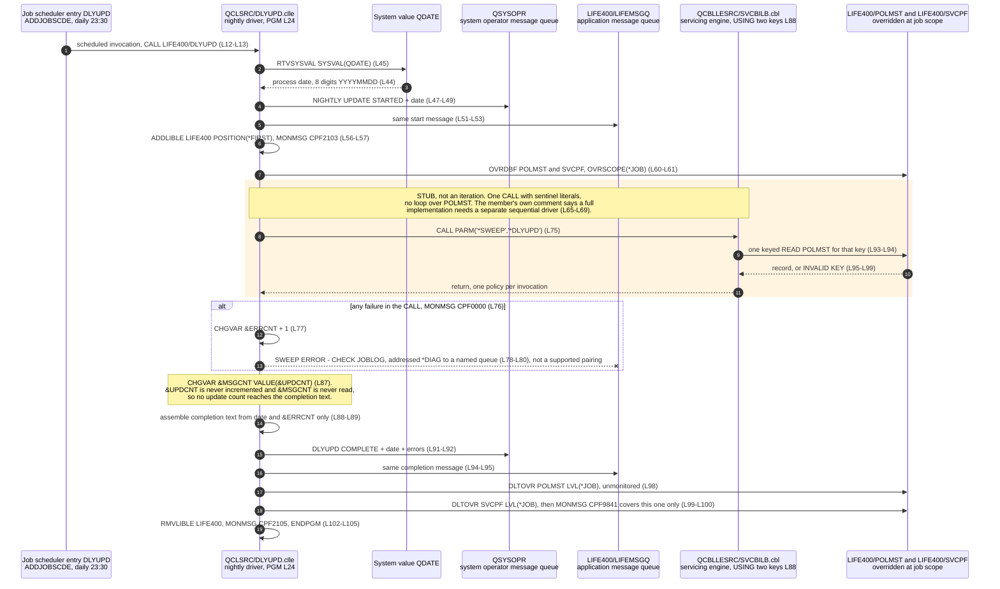
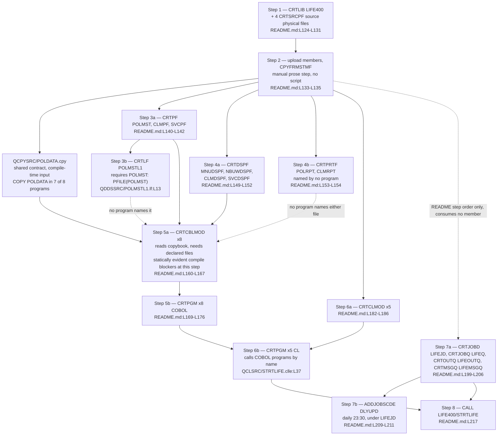

# LIFE400 Operational Model

This document is the runtime and operations reference for LIFE400. It records how a session begins, how batch work is requested and where it runs, what the scheduled nightly job actually does, which platform objects the application depends on at run time, what vocabulary it uses to report failure, how its asynchronous work is routed and what its concurrency is not knowable from, how the whole estate is built, and where its runtime configuration lives. It is the first documentation of any kind for the five [ILE CL](../reference/glossary-ibm-i.md#cl-control-language) members: before this assessment they carried none, and between them they hold the entire operational contract of the system. Everything the system does outside a COBOL program is described here.

**Scope.** This document describes the operational model **as built**. It states what the CL layer and the build procedure do, and stops there. The target scheduler, deployment pipeline and observability design belong to [the target architecture](../target-state/01-target-architecture.md); the disposition of every stub, defect and inert feature observed below belongs to [the known defects and stubs register](07-known-defects-and-stubs.md), which is where each becomes a decision to migrate, implement or drop; recovery objectives and the consequences of non-atomic writes belong to [the continuity and recovery risk document](../risk/03-continuity-and-recovery-risk.md); and the severity of any security-relevant observation, together with the control that would close it, belongs to [the security risk register](../risk/01-security-risk-register.md). Findings are recorded here as observations with evidence, never as severities or remedies.

**Reading the citations.** Every claim about LIFE400 carries an inline citation of the form `[<path>:<locator>]` immediately after the claim. Citations are plain text and deliberately not hyperlinks: a plain-text citation stays meaningful in a diff and does not depend on a hosting provider's line-anchor syntax. Open the member to read the command in place. The same discipline applies inside both diagrams — every participant and every node that names a real artifact carries its member path or its object name in the label itself, so a diagram lifted out of this page still says what it describes. No member of the estate is annotated, altered, reformatted or commented by this documentation set; the CL layer and the build procedure are read as evidence and left exactly as they are. Platform terms link to [the IBM i glossary](../reference/glossary-ibm-i.md) on first use in this document.

**How this model was extracted.** Nothing below is carried over from prior description, and this layer had no prior description to carry over: no walkthrough in the machine-generated corpus under `.swm/` covers any CL member, so every fact here was read from the five members themselves and from the build procedure in the repository's README. Command sequences come from the executable lines of each member in the order they appear. Scheduling, the initial-program configuration and the subsystem the nightly job runs in are recorded in the members' own comment banners and are cited to those banners rather than presented as observed behaviour, because a comment is a declaration of intent and this document does not conflate the two. Variable findings come from reference-counting each declared variable across its whole member: a variable whose declaration line is its only occurrence is reported as unused, and a variable that appears as an assignment target but never as a source is reported as written and never read. The message vocabulary comes from a census of every [`CPF` identifier](../reference/glossary-ibm-i.md#cpf-message) in all five members. Nothing here was validated by compiling or running the system: ILE CL and ILE COBOL require the IBM i platform, no off-platform compiler exists, and the build procedure below is a set of commands a human types on that platform rather than a script this repository can execute. Every claim is therefore evidence read from source, and it is stated as such.

**One caution about temporal content.** This document states one clock time — the nightly job is configured to run daily at 23:30 — because that is a configured property of the system as built, cited to the configuration that sets it. Nothing in this assessment expresses a programme schedule: there are no dates, durations or calendar sequencing anywhere in it, and the migration path is ordered strictly by dependency, entry criteria and exit criteria.

## Session entry

An interactive session begins in CL, not in COBOL. `QCLSRC/STRTLIFE.clle` is 43 lines and runs the six-step sequence below between `PGM` [QCLSRC/STRTLIFE.clle:L18] and `ENDPGM` [QCLSRC/STRTLIFE.clle:L43].

| Order | Command | Purpose | Anchor |
|-------|---------|---------|--------|
| 1 | `DCL VAR(&LIFINLIB)` | Declares a 10-character variable for a library name | [QCLSRC/STRTLIFE.clle:L20] |
| 2 | `RTVJOBA CURLIB(&LIFINLIB)` | Retrieves the job's current library into that variable | [QCLSRC/STRTLIFE.clle:L24] |
| 3 | `ADDLIBLE LIB(LIFE400) POSITION(*FIRST)` | Puts the application library at the front of the job's [library list](../reference/glossary-ibm-i.md#library-list), tolerating the condition raised when it is already there | [QCLSRC/STRTLIFE.clle:L27-L28] |
| 4 | `SNDPGMMSG … TOMSGQ(LIFE400/LIFEMSGQ)` | Announces the session on the application [message queue](../reference/glossary-ibm-i.md#message-queue), tolerating a missing queue | [QCLSRC/STRTLIFE.clle:L31-L34] |
| 5 | `CALL PGM(LIFE400/MAINMENU)` | Transfers control to the menu program and blocks until it returns | [QCLSRC/STRTLIFE.clle:L37] |
| 6 | `RMVLIBLE LIB(LIFE400)` | Removes the library again on the way out, tolerating its absence | [QCLSRC/STRTLIFE.clle:L40-L41] |

### How it is attached to a user

The program is designed to be a user profile's [initial program](../reference/glossary-ibm-i.md#initial-program). Its own banner records the command that installs it that way, `CHGUSRPRF USRPRF(username) INLPGM(LIFE400/STRTLIFE)`, and offers a system menu option as the alternative [QCLSRC/STRTLIFE.clle:L14-L16]. That is what makes the menu the first thing a signed-on user meets rather than a command line. Two things follow, and the distinction between them matters. The banner is a configuration instruction, so the repository establishes how the program is *intended* to be attached; whether any profile is actually configured that way is a property of a platform installation and is not knowable from this repository at all. This document therefore reports the intent and cites the comment that declares it, and claims nothing about the installed state.

One misreading is worth closing off explicitly, because that line is the only place a user profile is named anywhere in the estate. A census of the five CL members, the eight COBOL members, the [copybook](../reference/glossary-ibm-i.md#copybook) and all ten DDS members for authority keywords — profile switching, authority adoption, an authority parameter on any creation command, or any authority grant — returns exactly one match, and it is that comment [QCLSRC/STRTLIFE.clle:L15]. No [adopted authority](../reference/glossary-ibm-i.md#adopted-authority) mechanism is instantiated anywhere: the session-entry program is not created to run under its owner's profile, and nothing in the build procedure sets authority on any object. So the comment describes how the program is launched for a user, not any privilege it carries, and reading it as the latter would misstate how this system controls access.

### Why the library list is the whole binding mechanism

Name resolution in this system is session-scoped, and the library list is the only mechanism that provides it. The application library is inserted at the front of the list on entry [QCLSRC/STRTLIFE.clle:L27] and removed on exit [QCLSRC/STRTLIFE.clle:L40], so an unqualified object name resolves to a LIFE400 object only for the duration of a session in which that entry is present. The nightly job repeats the same discipline for the same reason [QCLSRC/DLYUPD.clle:L56], [QCLSRC/DLYUPD.clle:L102].

Both operations are guarded rather than checked. The insertion monitors the condition raised when the library is already on the list [QCLSRC/STRTLIFE.clle:L28] and the removal monitors the condition raised when it is not [QCLSRC/STRTLIFE.clle:L41]; neither outcome is inspected and neither changes what the program does next.

What follows from that has to be stated precisely, because a command-level monitor covers only the message identifiers it names. The already-on-the-list condition is tolerated and execution continues to the menu call [QCLSRC/STRTLIFE.clle:L37]. A *different* failure of the same insertion — the library missing, or not authorised — raises an escape message that no monitor in the member names, and an unmonitored escape message is not ignored: it becomes a function check and the procedure ends abnormally, so the menu call is never reached. The gap this leaves is narrower than "any failure is ignored" and more useful: the one outcome the program cannot distinguish is *success* from *the condition it tolerates*, because nothing between the two commands examines whether the library list is in the state the program assumes. A session that reached the menu is therefore known to have run the insertion without an escape, and nothing more.

### Two observations about the session announcement

Both are stated factually, with evidence. Neither is dispositioned here; the disposition of each belongs to [the known defects and stubs register](07-known-defects-and-stubs.md).

- **The announcement reports a library name where its wording promises a user.** The retrieved value is the job's *current library* [QCLSRC/STRTLIFE.clle:L24], and it is concatenated into the message text as `'LIFE400 SESSION STARTED BY ' *CAT &LIFINLIB` [QCLSRC/STRTLIFE.clle:L31]. The text therefore reads as an attribution to a person while carrying a library name. The variable is used nowhere else in the member, and the comment above the retrieval describes a different purpose from the one the value is actually put to — checking whether the application library is already on the library list [QCLSRC/STRTLIFE.clle:L23] — yet the retrieved value is never compared with anything. This reinforces a fact established across the whole layer: **no user identity is captured anywhere in the CL layer.** No submitter and no scheduled job records who requested the work.
- **The announcement's stated destination and its actual destination differ.** The comment above it says the session start is announced to the system operator [QCLSRC/STRTLIFE.clle:L30], while the command sends it to the application message queue [QCLSRC/STRTLIFE.clle:L33]. The nightly job does send to the system operator, in two places [QCLSRC/DLYUPD.clle:L49], [QCLSRC/DLYUPD.clle:L92], so the two members treat operator notification differently.

## Batch submitters

Three CL members exist to move work off the interactive job [QCLSRC/RUNNBUW.clle:L21], [QCLSRC/RUNSVC.clle:L21], [QCLSRC/RUNCLM.clle:L21]. None of them is reachable from the menu — its dispatch calls four COBOL programs by literal name and no CL program at all [QCBLLESRC/MAINMENU.cbl:L73-L79], so batch work is requested by calling a submitter — and none of them runs the business program itself. Each hands the work to a [job queue](../reference/glossary-ibm-i.md#job-queue) and returns [QCLSRC/RUNNBUW.clle:L43-L46], [QCLSRC/RUNSVC.clle:L50-L53], [QCLSRC/RUNCLM.clle:L50-L53].

| Submitter | Lines | Entry | Batch job name | File [overrides](../reference/glossary-ibm-i.md#override) | Submitted program |
|-----------|-------|-------|----------------|--------------|-------------------|
| `QCLSRC/RUNNBUW.clle` | 58 | `PGM PARM(&POLID)` [QCLSRC/RUNNBUW.clle:L21] | `NBUWBAT` [QCLSRC/RUNNBUW.clle:L24] | `POLMST` [QCLSRC/RUNNBUW.clle:L37], `CLMPF` [QCLSRC/RUNNBUW.clle:L38] | `NBUWB` [QCLSRC/RUNNBUW.clle:L45] |
| `QCLSRC/RUNSVC.clle` | 65 | `PGM PARM(&POLID &SVCID)` [QCLSRC/RUNSVC.clle:L21] | `SVCBAT` [QCLSRC/RUNSVC.clle:L25] | `POLMST` [QCLSRC/RUNSVC.clle:L44], `SVCPF` [QCLSRC/RUNSVC.clle:L45] | `SVCBILB` [QCLSRC/RUNSVC.clle:L52] |
| `QCLSRC/RUNCLM.clle` | 65 | `PGM PARM(&CLMID &POLID)` [QCLSRC/RUNCLM.clle:L21] | `CLMBAT` [QCLSRC/RUNCLM.clle:L25] | `POLMST` [QCLSRC/RUNCLM.clle:L44], `CLMPF` [QCLSRC/RUNCLM.clle:L45] | `CLMADJB` [QCLSRC/RUNCLM.clle:L52] |

### The shared pattern

All three follow the same six-step shape, and the shape is what a modern equivalent has to reproduce.

- **Guard every key parameter against blanks and abandon the request if one is empty.** The test compares the parameter with a blank literal of its own declared length and, on failure, sends a message and branches to a label at the end of the program: one guard in the new-business submitter [QCLSRC/RUNNBUW.clle:L29] branching to [QCLSRC/RUNNBUW.clle:L33] and its label at [QCLSRC/RUNNBUW.clle:L57], two in the servicing submitter [QCLSRC/RUNSVC.clle:L29], [QCLSRC/RUNSVC.clle:L36] branching to [QCLSRC/RUNSVC.clle:L33], [QCLSRC/RUNSVC.clle:L40] with its label at [QCLSRC/RUNSVC.clle:L64], and two in the claims submitter [QCLSRC/RUNCLM.clle:L29], [QCLSRC/RUNCLM.clle:L36] with its label at [QCLSRC/RUNCLM.clle:L64]. This is the only parameter validation anywhere in the layer: a key of the right length that is not blank is passed through untested.
- **Redirect each file the submitted program will open to a library-qualified name, at job scope, in the submitter's own job.** `OVRDBF … OVRSCOPE(*JOB)` is applied immediately before submission [QCLSRC/RUNSVC.clle:L44-L45]. The scope keyword names the job that runs the command, so what this step binds is file resolution inside the *submitting* job, not inside the job about to be submitted — the step does not do what its placement suggests. What actually binds the submitted program's files is worked through below, because the whole family reads as though it were the other way round.
- **Submit with [`SBMJOB`](../reference/glossary-ibm-i.md#sbmjob), naming the work-management objects.** Submitting rather than calling is what makes the work asynchronous, and it is the only asynchrony mechanism in the estate [QCLSRC/RUNNBUW.clle:L43].
- **Name the program in the submitted command rather than calling it.** The command carried by the submission is what identifies the batch program and passes it the keys [QCLSRC/RUNNBUW.clle:L45], [QCLSRC/RUNSVC.clle:L52], [QCLSRC/RUNCLM.clle:L52].
- **Attempt to notify the requester.** Each submitter issues a message intended for whoever called it [QCLSRC/RUNNBUW.clle:L49-L50], [QCLSRC/RUNSVC.clle:L56-L57], [QCLSRC/RUNCLM.clle:L56-L57], and nothing else in a submitter reports back at all. What the command as written actually specifies is a separate question, taken up under message destinations below; this bullet records the intent the source expresses, not a delivery.
- **Delete both overrides, with one monitored condition covering only the second.** Each submitter issues two `DLTOVR … LVL(*JOB)` commands and then a single `MONMSG MSGID(CPF9841)` — [QCLSRC/RUNNBUW.clle:L53-L55], [QCLSRC/RUNSVC.clle:L60-L62], [QCLSRC/RUNCLM.clle:L60-L62]. A monitored condition written after a command covers that command, so the first deletion in each pair is unguarded. The consequence is developed with the message vocabulary below, because the same shape occurs in the nightly job.

The notification is worth being precise about, because it is easy to read as a completion report and it is not one. Control returns to the caller as soon as the job is queued, so the message confirms that a *submission* happened and nothing more [QCLSRC/RUNNBUW.clle:L49-L50]; no submitter observes the outcome of the work it requested. Nor could it, and the reason is stronger than the asynchrony: **no batch business outcome is reported anywhere at all.** The return code and message a batch program computes are moved into its own record area and go no further — a census over the executable lines of all eight COBOL members finds zero `SNDPGMMSG`, zero calls to any message-handling API and zero executable `DISPLAY` statements, and the three batch members contain no occurrence of the word `DISPLAY` in any form. Every message this estate issues therefore comes from CL, and the complete set is the fourteen sends inventoried in the vocabulary census below: one session announcement [QCLSRC/STRTLIFE.clle:L32], five rejections of a blank key parameter [QCLSRC/RUNNBUW.clle:L30], [QCLSRC/RUNSVC.clle:L30], [QCLSRC/RUNSVC.clle:L37], [QCLSRC/RUNCLM.clle:L30], [QCLSRC/RUNCLM.clle:L37], three submission notifications [QCLSRC/RUNNBUW.clle:L49], [QCLSRC/RUNSVC.clle:L56], [QCLSRC/RUNCLM.clle:L56], and the nightly job's start, failure-diagnostic and completion messages [QCLSRC/DLYUPD.clle:L47], [QCLSRC/DLYUPD.clle:L51], [QCLSRC/DLYUPD.clle:L78], [QCLSRC/DLYUPD.clle:L91], [QCLSRC/DLYUPD.clle:L94]. Not one of them carries a business outcome: five report a rejected request before any work is attempted, three confirm a submission, and the rest are session and job lifecycle notices. What becomes of the outcome pair once it is written into the record area, and why those bytes are not an outcome column, is established by the byte-offset analysis in [the current data model](04-data-model-current-state.md) and summarised in [the current-state architecture](02-architecture-current-state.md).

### What the submitted job actually inherits

The six steps above describe the submitter. What the *submitted* job receives is a different set of properties, and three of them are established here because the pattern as written invites the opposite reading.

- **The overrides do not cross the submission.** `OVRSCOPE(*JOB)` scopes a redirection to the job that issued it [QCLSRC/RUNSVC.clle:L44-L45], and [`SBMJOB`](../reference/glossary-ibm-i.md#sbmjob) starts a different job [QCLSRC/RUNSVC.clle:L50-L53]. The submitter then deletes its own redirections a few lines later [QCLSRC/RUNSVC.clle:L60-L61], before the queued job has necessarily started at all. So the six-step shape ends with the submitter having redirected and unredirected file names in its own job, and the batch program resolving its file names on its own.
- **The program name resolves; the file names do not, by the same mechanism.** The submitted command names the program with its library, `CALL PGM(LIFE400/NBUWB)` [QCLSRC/RUNNBUW.clle:L45], so finding the program does not depend on a library list. Its files are the opposite: every one of the sixteen file assignments in the eight COBOL members is unqualified — `ASSIGN TO DATABASE-POLMST` [QCBLLESRC/NBUWB.cbl:L50-L51] is the pattern — so each open resolves through the [library list](../reference/glossary-ibm-i.md#library-list) of whichever job is running the program, or through a redirection issued in that same job.
- **Neither prerequisite for that resolution is established anywhere in this repository.** The [job description](../reference/glossary-ibm-i.md#job-description) every submission names is created with a queue and a text description and nothing else — `CRTJOBD JOBD(LIFE400/LIFEJD) JOBQ(LIFE400/LIFEQ) TEXT(…)` [README.md:L199] — so it carries no initial library list, and no submission passes one either: the three `SBMJOB` commands name a job, a job description, a job queue, an output queue, a command and a message queue, and no library-list or current-library parameter [QCLSRC/RUNNBUW.clle:L43-L46], [QCLSRC/RUNSVC.clle:L50-L53], [QCLSRC/RUNCLM.clle:L50-L53]. The only two commands in the estate that put the application library on a list are the session-entry program's [QCLSRC/STRTLIFE.clle:L27] and the nightly job's own [QCLSRC/DLYUPD.clle:L56], and neither runs inside a submitted job. Separately, a census of the whole repository for a job-queue entry, a subsystem description, a routing entry or a subsystem start returns no match, so nothing here attaches `LIFEQ` to a subsystem that would select a job off it.

Two prerequisites therefore have to be supplied outside this repository before a submitted batch job can run and open the right files: `LIFEQ` must be attached to an active subsystem, and the submitted job must acquire the application library — by an initial library list on the job description, by a library-list parameter on the submission, by redirections issued inside the submitted job, or by qualifying the file names in source. This document records the gap and the four shapes a fix could take; choosing one is a target-design decision and belongs to [the target architecture](../target-state/01-target-architecture.md), while the disposition of the gap as found belongs to [the known defects and stubs register](07-known-defects-and-stubs.md).

The nightly job is the instructive contrast, and it is the reason the distinction is not academic. It issues the same kind of redirections [QCLSRC/DLYUPD.clle:L60-L61] and then calls the servicing engine **synchronously, in its own job** [QCLSRC/DLYUPD.clle:L75], having put the application library on that job's list itself [QCLSRC/DLYUPD.clle:L56]. Its redirections therefore do govern the opens the engine performs. The same commands in the three submitters do not, because a submission intervenes.

### One anchor names the entire runtime contract

The submission in the new-business submitter is the most compact evidence in the estate for what this system needs from the operating system, because it names all four work-management objects in a single command: the [job description](../reference/glossary-ibm-i.md#job-description) and the job queue [QCLSRC/RUNNBUW.clle:L43], the [output queue](../reference/glossary-ibm-i.md#output-queue) [QCLSRC/RUNNBUW.clle:L44], and the message queue [QCLSRC/RUNNBUW.clle:L46], wrapped around the command that names the program [QCLSRC/RUNNBUW.clle:L45]. The other two submitters name the same four [QCLSRC/RUNSVC.clle:L50-L53], [QCLSRC/RUNCLM.clle:L50-L53].

Batch job names are fixed literals assigned at declaration, not derived from the request: `NBUWBAT` [QCLSRC/RUNNBUW.clle:L24], `SVCBAT` [QCLSRC/RUNSVC.clle:L25] and `CLMBAT` [QCLSRC/RUNCLM.clle:L25]. Every new-business submission therefore arrives on the queue under the same job name as every other, so concurrent requests in one domain are distinguishable only by the platform's own job numbering and not by anything the application supplies.

### What actually binds the files a submitted program opens

The same command is also the most compact evidence for what this system leaves unstated, and the omission decides which data a batch program reads. Three mechanisms are in play and only the third governs the submitted work.

- **The file overrides do not cross the submission boundary.** Each submitter issues `OVRDBF … OVRSCOPE(*JOB)` before submitting [QCLSRC/RUNSVC.clle:L44-L45] and deletes the pair afterwards [QCLSRC/RUNSVC.clle:L60-L61]. Job scope means the job that issued the command, and a submitted job is a different job: it begins with no overrides from its submitter, while the submitter's own remain in force in the submitter until it deletes them. Six overrides across the three submitters are in that position — two per member [QCLSRC/RUNNBUW.clle:L37-L38], [QCLSRC/RUNSVC.clle:L44-L45], [QCLSRC/RUNCLM.clle:L44-L45] — and none of them binds anything the submitted program opens.
- **The job description does not supply the library list either.** It is named on every submission [QCLSRC/RUNNBUW.clle:L43], and it supplies whatever the command leaves unstated — but an initial library list is not among what it supplies here, because a job description's library list reaches a submitted job only when the submission asks for it, and none of these three does.
- **The submitted job inherits the submitting job's name resolution.** No submission names an initial library list or a current library [QCLSRC/RUNNBUW.clle:L43-L46], [QCLSRC/RUNSVC.clle:L50-L53], [QCLSRC/RUNCLM.clle:L50-L53], and the command defaults for both are the submitting job's. The batch program's own file declarations are unqualified — `NBUWB` assigns its file to a database device with no library [QCBLLESRC/NBUWB.cbl:L50-L54] — so the copy of `POLMST` it opens is whichever copy the *caller's* library list resolves first. The program call inside the submission is library-qualified [QCLSRC/RUNNBUW.clle:L45] and therefore unaffected; the files it opens are not.

Two consequences follow, and both are properties of the caller rather than of anything in this repository.

- If the application library is not on the submitting job's library list, an unqualified open in the submitted program has nothing to resolve against and fails. The session entry program is what normally puts it there [QCLSRC/STRTLIFE.clle:L27], but no submitter checks that it did, and the blank-parameter test is the only validation any of them performs [QCLSRC/RUNNBUW.clle:L29].
- If a different library holding a file of the same name precedes it on that list, the open succeeds against the wrong file and the batch program processes the wrong data. Nothing reports this: the submitter has already notified the requester that work was submitted [QCLSRC/RUNNBUW.clle:L49-L50] and observes no outcome, and the audit column the batch programs write carries a program name rather than any indication of which file was opened.

The nightly job is the instructive contrast, and it is a contrast in mechanism rather than in discipline. It issues the same two overrides at job scope [QCLSRC/DLYUPD.clle:L60-L61] and then **calls** the servicing program directly [QCLSRC/DLYUPD.clle:L75] instead of submitting it. Because the call runs in the same job, those overrides do bind the work, and they are the reason that path does not depend on the inherited list in the way the submitters do — though it adds the application library to its own list as well [QCLSRC/DLYUPD.clle:L56]. Read together, the two patterns show the estate expressing the same intent twice and delivering it once.

Nothing here is a severity or a remedy. Both findings are dispositioned in [the known defects and stubs register](07-known-defects-and-stubs.md): the binding property shared by all six overrides, together with the absent library list and the unattached queue, is DEF-03, and the redundant override — the one naming a file its target never opens — is DEF-09; the externalization requirement the property implies is owned by [the target architecture](../target-state/01-target-architecture.md).

### Two observations about the submitter family

- **One of the six overrides names a file its target never opens.** All six are already inert for the reason established above — they never reach the submitted job. This one is inert twice over: the new-business submitter redirects the claims file [QCLSRC/RUNNBUW.clle:L38] and deletes that override afterwards [QCLSRC/RUNNBUW.clle:L54], and the program it submits would not open it even if the override did reach it, because `NBUWB` declares exactly one file, the policy master [QCBLLESRC/NBUWB.cbl:L50-L54]. It is the only one of the six that names a file nothing in its own submission chain has any use for.
- **The parameter order is not consistent across the family.** The new-business and servicing submitters take the policy key first [QCLSRC/RUNNBUW.clle:L21], [QCLSRC/RUNSVC.clle:L21]; the claims submitter takes the claim key first [QCLSRC/RUNCLM.clle:L21]. That ordering does match its target, whose entry signature is `USING LK-CLAIM-ID LK-POLICY-ID` [QCBLLESRC/CLMADJB.cbl:L80], so the submitter and its program agree and neither is wrong on its own terms. The inconsistency is across the family: anything that drives all three submitters uniformly — an operator following one habit, or a script parameterised over the set — has to special-case one of the three, and a transposed pair of same-length keys is not detectable by the blank guard that is the only validation present.

A third observation belongs with these, from the same reference-counting method applied to the nightly job below: the new-business submitter declares a variable it never uses, `&ERRMSG` [QCLSRC/RUNNBUW.clle:L26], whose declaration line is its only occurrence in the member.

## The nightly scheduled job

`QCLSRC/DLYUPD.clle` is 105 lines [QCLSRC/DLYUPD.clle:L1-L105] and is the only scheduled work in the estate: it carries the estate's single scheduling command in its own banner [QCLSRC/DLYUPD.clle:L12-L13], the build procedure issues that command once and for no other program [README.md:L209-L211], and no other member declares or references a scheduler entry. It is also the member whose documented purpose [QCLSRC/DLYUPD.clle:L15-L20] and actual content [QCLSRC/DLYUPD.clle:L75] differ most, which makes it the most consequential entry in this document.

### How it is scheduled

The scheduling command is recorded in the program's own banner, `ADDJOBSCDE JOB(DLYUPD) CMD(CALL LIFE400/DLYUPD)` with `FRQ(*WEEKLY) SCDDAY(*ALL) SCDTIME(233000)` [QCLSRC/DLYUPD.clle:L12-L13], and the build procedure repeats it as the last step of creating the supporting objects [README.md:L209-L211]. The repository's overview also records that the nightly batch is scheduled this way [README.md:L20].

One idiom in that command is worth spelling out, because reading it at a glance gives the wrong answer: a weekly frequency combined with a day list of *all* days schedules the job **every day**, at 23:30. The frequency keyword alone reads as weekly and is not. As stated at the top of this document, that clock time is a configured property of the system as built and is cited as such; it carries no implication for how any migration work is sequenced.

The banner also records the execution context: the job runs in the platform's general batch subsystem under the application's own job description [QCLSRC/DLYUPD.clle:L22]. That is a comment, so it is reported as the declared context rather than as an observed one.

### What it actually executes

| Order | Step | Anchor |
|-------|------|--------|
| 1 | `PGM`, then nine variable declarations | [QCLSRC/DLYUPD.clle:L24], [QCLSRC/DLYUPD.clle:L29-L37] |
| 2 | `RTVSYSVAL SYSVAL(QDATE)` into an 8-character variable — the only date source | [QCLSRC/DLYUPD.clle:L45] |
| 3 | Start message to the system operator | [QCLSRC/DLYUPD.clle:L47-L49] |
| 4 | The same start message to the application message queue | [QCLSRC/DLYUPD.clle:L51-L53] |
| 5 | `ADDLIBLE` with its monitored condition | [QCLSRC/DLYUPD.clle:L56-L57] |
| 6 | `OVRDBF` for the policy master and the servicing file, at job scope | [QCLSRC/DLYUPD.clle:L60-L61] |
| 7 | A single `CALL` with two sentinel literals — the sweep | [QCLSRC/DLYUPD.clle:L75] |
| 8 | A catch-all monitored condition that counts a failure and sends a diagnostic | [QCLSRC/DLYUPD.clle:L76-L81] |
| 9 | Completion message assembled and sent to both destinations | [QCLSRC/DLYUPD.clle:L87-L95] |
| 10 | `DLTOVR` for both files, with its monitored condition | [QCLSRC/DLYUPD.clle:L98-L100] |
| 11 | `RMVLIBLE` with its monitored condition, then `ENDPGM` | [QCLSRC/DLYUPD.clle:L102-L105] |

The date deserves one note. The job takes the process date from a system value [QCLSRC/DLYUPD.clle:L45], and the comment immediately above it records that the system date is eight digits in the form `YYYYMMDD` on the declared release and later [QCLSRC/DLYUPD.clle:L44]. This is the only place in the estate where a date enters the system from the platform through CL, and it is the single date source the nightly run depends on.

### The sweep is a stub

The program's documented purpose is a sweep: its banner says it sweeps the policy master for policies in a grace period, identifies overdue paid-to dates, transitions status through grace to lapsed, and submits the servicing engine for each policy requiring an update [QCLSRC/DLYUPD.clle:L15-L20]. What it contains instead is one call:

```text
CALL PGM(LIFE400/SVCBILB) PARM('*SWEEP     ' '*DLYUPD     ')
```

That is the whole of step 7 [QCLSRC/DLYUPD.clle:L75]. Two sentinel literals are passed where a policy key and a servicing key are expected. There is no loop, no cursor and no iteration of any kind in the member.

The program says so itself. The comment block immediately above the call states that in production this loops over policy-master records, that the stub demonstrates the job structure, and that a full implementation would use a separate driver program to read the policy master sequentially and call the servicing engine for each record [QCLSRC/DLYUPD.clle:L65-L69], with a second note repeating that the call should be replaced by a sequential read [QCLSRC/DLYUPD.clle:L73].

Three further facts, each verified against source, establish how far the gap goes beyond a missing loop.

- **The sentinel is not interpreted by the program that receives it.** `SVCBILB` takes two 12-character keys [QCBLLESRC/SVCBILB.cbl:L88], moves the first straight into the policy record key [QCBLLESRC/SVCBILB.cbl:L93] and issues a single keyed read [QCBLLESRC/SVCBILB.cbl:L94], whose not-found branch sets a result code and message and returns immediately [QCBLLESRC/SVCBILB.cbl:L94-L100]. A census of the whole member finds no reference to the sentinel literal anywhere in it, so the value is handled as an ordinary key rather than as a mode indicator. The member's banner does record the nightly job as one of its two callers [QCBLLESRC/SVCBILB.cbl:L16], so the coupling was intended; what is absent is any code that treats a sweep differently from a single request.
- **The servicing engine processes one policy per invocation by construction.** It opens its files, reads one record by key, evaluates it and returns [QCBLLESRC/SVCBILB.cbl:L91-L94]. Calling it once cannot process a set however its parameters are filled in.
- **A set-based sweep is not expressible anywhere in the current design.** Every database file in all eight COBOL members is declared as an indexed file with random access — the servicing engine's two files are typical [QCBLLESRC/SVCBILB.cbl:L48-L57] — and the only sequential access mode in the estate belongs to [display files](../reference/glossary-ibm-i.md#display-file), which are transaction-organization files rather than database files. A census over the code lines of all eight members finds zero positioning and zero sequential-read operations, a result recorded independently in [the current-state architecture](02-architecture-current-state.md). The estate therefore has no sequential-access capability from which a sweep could be assembled: the missing loop is not a localised omission but the absence of a whole access pattern, which is exactly what the program's own comment concedes when it says a *separate driver program* would be needed [QCLSRC/DLYUPD.clle:L65-L69].

### The job's own telemetry does not work

Three counters are declared, all initialised to zero: an update count [QCLSRC/DLYUPD.clle:L32], a lapse count [QCLSRC/DLYUPD.clle:L33] and an error count [QCLSRC/DLYUPD.clle:L34]. Reference-counting each one across the member gives a precise picture.

| Variable | Declared | Ever assigned after declaration | Ever read | Reaches a message |
|----------|----------|--------------------------------|-----------|-------------------|
| `&ERRCNT` | [QCLSRC/DLYUPD.clle:L34] | Yes — incremented in the failure path [QCLSRC/DLYUPD.clle:L77] | Yes | Yes [QCLSRC/DLYUPD.clle:L89] |
| `&UPDCNT` | [QCLSRC/DLYUPD.clle:L32] | No — it is never an assignment target | Once, as the source at [QCLSRC/DLYUPD.clle:L87] | No |
| `&MSGCNT` | [QCLSRC/DLYUPD.clle:L36] | Yes — assigned once [QCLSRC/DLYUPD.clle:L87] | No | No |
| `&LPSECNT` | [QCLSRC/DLYUPD.clle:L33] | No | No | No |

Read together, those rows say something sharper than a zero count. The update counter is never incremented, because nothing in the member counts anything. It is copied into a character variable prepared to carry it into a message [QCLSRC/DLYUPD.clle:L87] — and that variable is then never referenced again, because the completion text is assembled from the process date and the error count only [QCLSRC/DLYUPD.clle:L88-L89]. So the update count does not merely report zero: **it never reaches any message at all**, and the one variable prepared to carry it is written and discarded. The lapse counter is never touched after its declaration.

Four variables in this member are wholly unused, their declaration line being their only occurrence: a policy key [QCLSRC/DLYUPD.clle:L29], a servicing key [QCLSRC/DLYUPD.clle:L30], the lapse counter [QCLSRC/DLYUPD.clle:L33] and a job-log name [QCLSRC/DLYUPD.clle:L37]. The first two are the keys a real loop would have filled in, which is consistent with the member having been written around an iteration that was never added.

The operational consequence is worth stating plainly, because it governs how much the nightly run can be trusted as evidence of anything. The completion message reports the date and an error count [QCLSRC/DLYUPD.clle:L88-L89], and the error count can only be incremented by the single catch-all monitor on the sweep call [QCLSRC/DLYUPD.clle:L76-L77]. A run in which the sweep did nothing useful and a run in which it did are therefore indistinguishable from the job's own output.

### D-06 — the nightly batch flow



The diagram is D-06 in this assessment's diagram register. Solid arrows are synchronous calls and messages; dashed arrows are returns; the one **crossed arrow** is a message the source addresses but whose keyword combination the command does not support, so it is drawn as not arriving rather than as delivered. The highlighted block is the sweep, drawn as a single call with a note stating that it is a stub, so the diagram cannot be read as showing an iteration that the source does not contain. The alternative block is the catch-all monitored condition; the note before the completion messages records why no update count appears in them; and the two cleanup deletions are drawn as separate steps rather than as one, because only the second of them is followed by a monitored condition.

## Work-management objects

Four platform objects carry the runtime contract. None is compiled from a source member — each is created by command, so none appears in any register that counts members, and their runtime roles are recorded here. All four live in the same library as the programs, and all four are named together in a single submission [QCLSRC/RUNNBUW.clle:L43-L46].

| Object | Type | Created by | Runtime role, with evidence |
|--------|------|-----------|------------------------------|
| `LIFEJD` | Job description | `CRTJOBD` naming `LIFEQ` as its queue, with no other parameter — in particular **no initial library list** [README.md:L199] | Named by all three batch submissions [QCLSRC/RUNNBUW.clle:L43], [QCLSRC/RUNSVC.clle:L50], [QCLSRC/RUNCLM.clle:L50], and by the scheduler entry for the nightly job [README.md:L209-L211]; the nightly job's banner records that it runs under this job description in the general batch subsystem [QCLSRC/DLYUPD.clle:L22]. Because it carries no library list, it supplies a submitted job with a queue and nothing that would resolve the application's unqualified file names |
| `LIFEQ` | Job queue | `CRTJOBQ`, with no concurrency parameter [README.md:L200] | The single destination of every batch submission in the estate [QCLSRC/RUNNBUW.clle:L43], [QCLSRC/RUNSVC.clle:L50], [QCLSRC/RUNCLM.clle:L50]; it is also the queue named inside the job description [README.md:L199]. Nothing in the repository attaches it to a subsystem: a census for a job-queue entry, a subsystem description, a routing entry or a subsystem start finds no match anywhere, so the queue is created and named but never shown to be serviced |
| `LIFEOUTQ` | Output queue | `CRTOUTQ` [README.md:L203] | Named on every submission [QCLSRC/RUNNBUW.clle:L44], [QCLSRC/RUNSVC.clle:L51], [QCLSRC/RUNCLM.clle:L51]; the new-business submitter's banner records that job-log capture to this queue was added as a change to the member [QCLSRC/RUNNBUW.clle:L7] |
| `LIFEMSGQ` | Message queue | `CRTMSGQ` [README.md:L206] | The application's own notification channel: session start [QCLSRC/STRTLIFE.clle:L33], nightly start [QCLSRC/DLYUPD.clle:L53], nightly completion [QCLSRC/DLYUPD.clle:L95], and named on every submission [QCLSRC/RUNNBUW.clle:L46]. The sweep-failure diagnostic is also addressed here [QCLSRC/DLYUPD.clle:L80] but pairs a diagnostic message type with a named queue, which is examined below |

All four are created consecutively in one step of the build procedure, immediately before the scheduler entry [README.md:L199-L206].

Three properties of this set matter for anyone replacing it. First, it is the entire operational dependency surface: outside these four objects, the library list and the file overrides, the application asks nothing of the operating system. Second, the objects are addressed by hard-coded library-qualified name at every point of use, so they are not configuration in any sense that can be varied without editing source — a point the configuration surface below returns to. Third, and least visible, **the set is incomplete for the purpose it is used for.** Creating a job description and a job queue is not the same as arranging for submitted work to run and to find its files: the job description carries no initial library list [README.md:L199] and no submission supplies one [QCLSRC/RUNNBUW.clle:L43-L46], and no command anywhere in the repository attaches the queue to a subsystem. Both gaps are stated with their evidence in the submitter section above, and both are properties of the build procedure and CL layer as written rather than of any platform installation, which this repository cannot observe.

Message destinations divide between them, though not as cleanly as the commands suggest. Operator-facing traffic is addressed to the platform's system operator queue and only from the nightly job [QCLSRC/DLYUPD.clle:L49], [QCLSRC/DLYUPD.clle:L92]. Application-facing traffic is addressed to `LIFEMSGQ`. Submitter feedback is addressed to neither, and this is where the pattern breaks down.

Two of the estate's message commands do not specify a combination the command supports, so what they were written to do and what they can do come apart. Both are recorded here as written, and no delivery is asserted for either.

- **The three submitters address their requester notification with `TOMSGQ(*REQUESTER)`** [QCLSRC/RUNNBUW.clle:L49-L50], [QCLSRC/RUNSVC.clle:L56-L57], [QCLSRC/RUNCLM.clle:L56-L57]. IBM documents the special values that keyword accepts as `*`, `*SYSOPR` and `*HSTLOG`, alongside up to fifty named message queues; `*REQUESTER` belongs to a different keyword, `TOUSR`, which cannot be combined with `TOMSGQ` at all. Read against the published keyword definitions, the destination these commands name is therefore not one the keyword offers. The intent is legible — notify whoever asked for the work — but this document cannot state that the notification arrives, and does not.
- **The nightly driver sends its sweep-failure diagnostic as `MSGTYPE(*DIAG)` to `TOMSGQ(LIFE400/LIFEMSGQ)`** [QCLSRC/DLYUPD.clle:L78-L80]. A diagnostic message type is defined against a call message queue rather than a named message-queue object, so the type and the destination in that one command are not a pair the command supports either. The same driver's informational messages to the same queue carry no such problem [QCLSRC/DLYUPD.clle:L53], [QCLSRC/DLYUPD.clle:L95].

Neither observation can be resolved by reading further source, and neither can be settled by execution, because nothing in this repository can be compiled or run. Both are entered as defects with a disposition in [the known defects and stubs register](07-known-defects-and-stubs.md); what this document records is the contract each command states. The consequence for the operational picture is narrow but real: of the three notification paths the CL layer appears to provide, only the one addressed to a named queue by an informational message is shown by the source to be well formed.

## CPF message vocabulary

A census of every `CPF` identifier in all five CL members finds **exactly five distinct identifiers in 24 occurrences**, all of them inside [QCLSRC/STRTLIFE.clle:L28-L41], [QCLSRC/RUNNBUW.clle:L30-L55], [QCLSRC/RUNSVC.clle:L30-L62], [QCLSRC/RUNCLM.clle:L30-L62] and [QCLSRC/DLYUPD.clle:L47-L103], and none anywhere else in the estate: no COBOL member, no DDS member and not the shared data contract names a [CPF message](../reference/glossary-ibm-i.md#cpf-message) at all — the COBOL programs report through the shared contract's return pair instead [QCPYSRC/POLDATA.cpy:L36-L37]. This is the whole error-and-notification vocabulary of the system.

| Identifier | Occurrences | Used as | Meaning in context | Anchors |
|------------|-------------|---------|--------------------|---------|
| `CPF9898` | 14 | `SNDPGMMSG`, always with the system message file | The general-purpose vehicle for sending free-form text; every message this application emits travels on it | [QCLSRC/STRTLIFE.clle:L32], [QCLSRC/DLYUPD.clle:L47], [QCLSRC/DLYUPD.clle:L51], [QCLSRC/DLYUPD.clle:L78], [QCLSRC/DLYUPD.clle:L91], [QCLSRC/DLYUPD.clle:L94], [QCLSRC/RUNNBUW.clle:L30], [QCLSRC/RUNNBUW.clle:L49], [QCLSRC/RUNSVC.clle:L30], [QCLSRC/RUNSVC.clle:L37], [QCLSRC/RUNSVC.clle:L56], [QCLSRC/RUNCLM.clle:L30], [QCLSRC/RUNCLM.clle:L37], [QCLSRC/RUNCLM.clle:L56] |
| `CPF9841` | 4 | `MONMSG` only | Override not found. Each occurrence follows the **second** of two consecutive override deletions, so it tolerates the absence of that one override and leaves the first deletion in each pair unguarded | [QCLSRC/RUNNBUW.clle:L55], [QCLSRC/RUNSVC.clle:L62], [QCLSRC/RUNCLM.clle:L62], [QCLSRC/DLYUPD.clle:L100] |
| `CPF2103` | 2 | `MONMSG` only | Library already on the list — tolerated after adding a library-list entry | [QCLSRC/STRTLIFE.clle:L28], [QCLSRC/DLYUPD.clle:L57] |
| `CPF2105` | 2 | `MONMSG` only | Object not found — tolerated after removing a library-list entry | [QCLSRC/STRTLIFE.clle:L41], [QCLSRC/DLYUPD.clle:L103] |
| `CPF0000` | 2 | `MONMSG` only | Catch-all. Used two ways: to tolerate a missing message queue so a session still starts [QCLSRC/STRTLIFE.clle:L34], and to trap any failure of the sweep call [QCLSRC/DLYUPD.clle:L76] | [QCLSRC/STRTLIFE.clle:L34], [QCLSRC/DLYUPD.clle:L76] |

### The pattern this vocabulary encodes

The distribution is the finding, not the list. One identifier is a send vehicle and appears 14 times, always on `SNDPGMMSG` [QCLSRC/STRTLIFE.clle:L32], [QCLSRC/DLYUPD.clle:L47]; the other four appear in 10 occurrences and **every one of them is a monitored condition** [QCLSRC/STRTLIFE.clle:L28], [QCLSRC/STRTLIFE.clle:L41], [QCLSRC/RUNNBUW.clle:L55], [QCLSRC/DLYUPD.clle:L76]. Error handling in this layer is therefore *exception tolerance by monitored condition* rather than structured error handling: four fifths of the vocabulary exists to make a specific non-fatal condition non-fatal, and in three of those four cases — a library already present, a library already absent, an override already gone — the tolerated condition is the benign outcome of an idempotent operation.

Three consequences follow, all stated as observations.

- **A monitored condition is not an inspected result.** Nothing in the layer branches on whether a tolerated condition occurred. The single exception is the sweep monitor, which counts [QCLSRC/DLYUPD.clle:L77].
- **The tolerance is narrower than the sequence it appears in, in all four cleanup blocks.** Every `MONMSG` in the estate is written after a specific command rather than at the head of a program: the ten occurrences are the ten listed in the table above, and in each of the four members the declarations are followed directly by an executable command with no monitor between them — the new-business submitter is the shortest illustration [QCLSRC/RUNNBUW.clle:L23-L29]. A monitor written after a command covers that command. So in each of the four cleanup blocks — [QCLSRC/RUNNBUW.clle:L53-L55], [QCLSRC/RUNSVC.clle:L60-L62], [QCLSRC/RUNCLM.clle:L60-L62], [QCLSRC/DLYUPD.clle:L98-L100] — the tolerance applies to the second deletion and the first is unprotected, even where the comment beside it reads as though it covered both [QCLSRC/RUNNBUW.clle:L55]. The path that matters is the one where the first override is already absent: that deletion raises the same condition the next line is written to tolerate, nothing in the member handles it, and the commands after it — the second deletion in all four members, and in the nightly job the library-list removal as well [QCLSRC/DLYUPD.clle:L102] — do not run. Cleanup is therefore all-or-nothing in the wrong direction: the case the author anticipated is the case that is guarded second.
- **The catch-all costs diagnosis.** The monitor on the sweep call is the catch-all identifier rather than a specific condition [QCLSRC/DLYUPD.clle:L76], so *any* failure of that call — a missing program, a file that cannot be opened, an error inside the servicing engine — collapses into one counter increment and one message whose entire diagnostic content is an instruction to consult the job log [QCLSRC/DLYUPD.clle:L79]. The distinction between failure modes is not preserved anywhere the application can see it. The job log itself is captured to the output queue [QCLSRC/RUNNBUW.clle:L7], which is outside the application's own records.

## Queue serialization

**Batch work in LIFE400 is serialised, with no parallelism.** The estate has exactly one job queue and every asynchronous unit of work is directed at it, so batch jobs form a single stream: all three submitters name `LIFEQ` [QCLSRC/RUNNBUW.clle:L43], [QCLSRC/RUNSVC.clle:L50], [QCLSRC/RUNCLM.clle:L50]; the [job description](../reference/glossary-ibm-i.md#job-description) they all name is itself created pointing at the same queue [README.md:L199]; the nightly job is scheduled under that same job description [README.md:L209-L211]; and exactly one queue is created for the application [README.md:L200], with no member naming any other.

Two consequences follow directly, and both are operational facts about the system as built.

- **A long-running job blocks every other submission.** Because the stream is single, a servicing job that runs long delays the new-business and claims jobs queued behind it, and the only feedback any requester gets is the confirmation that the work was queued [QCLSRC/RUNNBUW.clle:L49-L50] — so a request waiting behind another is indistinguishable, from the caller's side, from a request being worked.
- **There is no separation between interactive-initiated and scheduled work.** Ad-hoc requests from all three business domains and the overnight sweep share one queue and one job description [QCLSRC/RUNNBUW.clle:L43], [QCLSRC/RUNSVC.clle:L50], [QCLSRC/RUNCLM.clle:L50], [README.md:L209-L211], so nothing in the application distinguishes an operator's request from overnight processing, and nothing gives one domain priority over another.

The application sets nothing that would relax this. The queue is created with no parameter of any kind beyond a text description [README.md:L200] — no concurrency, priority or class specification — and no submission overrides that: none names a job priority, a routing class or an initial library list [QCLSRC/RUNNBUW.clle:L43-L46], [QCLSRC/RUNSVC.clle:L50-L53], [QCLSRC/RUNCLM.clle:L50-L53]. Whatever the platform then permits comes from its own defaults and from the subsystem that services the queue, and no subsystem description, routing entry or queue-entry definition exists anywhere in this repository [README.md:L27-L55], so this document states no platform-side concurrency figure and none is needed: the application's own design is one queue, named identically at every call site, with no expressed preference of any kind. One further consequence of that same absence belongs here: this repository establishes where every asynchronous request is *sent* and does not establish that any of it is selected to *run*.

Two related properties are worth recording alongside, since both bear on the same behaviour. Batch job names are fixed literals per domain [QCLSRC/RUNNBUW.clle:L24], [QCLSRC/RUNSVC.clle:L25], [QCLSRC/RUNCLM.clle:L25], so simultaneous requests in one domain are indistinguishable by name on the queue. And because every submission also names the queue explicitly [QCLSRC/RUNNBUW.clle:L43], [QCLSRC/RUNSVC.clle:L50], [QCLSRC/RUNCLM.clle:L50], routing is settled at the call site rather than by the job description they all name — so redirecting this application's batch work to a different queue means editing three CL members, not one object. Where each job's *files* come from is a separate question with a separate answer, established under [what actually binds the files a submitted program opens](#what-actually-binds-the-files-a-submitted-program-opens): file overrides are issued at job scope inside the submitting job [QCLSRC/RUNSVC.clle:L44-L45] and deleted there afterwards [QCLSRC/RUNSVC.clle:L60-L61], while the submitted job resolves its own unqualified file names [QCBLLESRC/NBUWB.cbl:L50-L51] through the library list it inherits from its caller — not the overrides and not the job description, which supplies no library list for it [README.md:L199].

## The manual build sequence

The whole estate is built by a documented sequence of eight steps a human types on the platform [README.md:L120-L218]. Every command below is a platform command; **nothing in this sequence can be executed from this repository**, because ILE COBOL and ILE CL compile only on IBM i and no off-platform compiler exists. The sequence is documented here, not run, and no claim in this document was validated by building anything.

That last sentence has a consequence that has to be stated before the table rather than after it: what follows is the build **order**, and order is the only property of it this repository can establish. No compilation result exists for any member, so nothing here demonstrates that the commands succeed — and several members carry constructs that are visibly at odds with what a compile requires. Those blockers are inventoried below the dependency graph, and [the system inventory](01-system-inventory.md) qualifies its object count for the same reason. Read the eight steps as the documented procedure, not as evidence that thirteen programs exist.

| Step | What it creates | Commands | Anchor |
|------|-----------------|----------|--------|
| 1 | The library and four [source physical files](../reference/glossary-ibm-i.md#source-physical-file-and-source-member), all with an identical record length | `CRTLIB`, then `CRTSRCPF` ×4 | [README.md:L124-L131] |
| 2 | Source members inside those files | Prose: upload by file transfer or stream-file copy, then `CPYFRMSTMF` | [README.md:L133-L135] |
| 3 | Three [physical files](../reference/glossary-ibm-i.md#physical-file) and one [logical file](../reference/glossary-ibm-i.md#logical-file) | `CRTPF` ×3, `CRTLF` ×1 | [README.md:L139-L144] |
| 4 | Four display files and two [printer files](../reference/glossary-ibm-i.md#printer-file) | `CRTDSPF` ×4, `CRTPRTF` ×2 | [README.md:L148-L155] |
| 5 | Eight COBOL modules, then eight programs bound from them | `CRTCBLMOD` ×8 [README.md:L160-L167], then `CRTPGM` ×8 [README.md:L169-L176] | [README.md:L157-L177] |
| 6 | Five CL modules, then five programs bound from them | `CRTCLMOD` ×5 [README.md:L182-L186], then `CRTPGM` ×5 [README.md:L188-L192] | [README.md:L179-L193] |
| 7 | The four work-management objects, then the scheduler entry | `CRTJOBD`, `CRTJOBQ`, `CRTOUTQ`, `CRTMSGQ` [README.md:L199-L206], then `ADDJOBSCDE` [README.md:L209-L211] | [README.md:L195-L212] |
| 8 | Nothing — it starts the system | `CALL LIFE400/STRTLIFE` | [README.md:L217] |

### The dependency order behind the steps

The step numbers are a reading order. The order that actually binds is a dependency graph, and every edge in it is established by something citable.

- Source physical files must exist before members can be copied into them: step 2 copies into the files step 1 creates [README.md:L127-L130], [README.md:L135].
- Every compile reads its source from a member, so all of step 2 precedes steps 3 through 6 — each creation command names a source file and a source member explicitly [README.md:L140].
- The copybook must be present before any COBOL module that includes it compiles. Seven of the eight COBOL members expand the shared contract textually with `COPY POLDATA` [QCBLLESRC/NBUWB.cbl:L60], so its source member is a compile-time input to those seven, not a runtime dependency. The contract's structure and the coupling this creates are documented in [the current data model](04-data-model-current-state.md).
- The policy master must exist before the access path over it: the logical file names it as its physical file [QDDSSRC/POLMSTL1.lf:L13], so `CRTPF` for the policy master [README.md:L140] precedes `CRTLF` [README.md:L143] — an ordering the step-3 block already happens to follow, but which is required rather than incidental.
- Database files must exist before the COBOL modules that declare them, because each module names its files in its file-control entries [QCBLLESRC/NBUWB.cbl:L50-L54]; so step 3 precedes step 5.
- Display files must exist before the programs that drive them, for the same reason, so step 4 precedes step 5. The two printer files are created in step 4 [README.md:L153-L154] and are named by no program at all, so nothing in step 5 or 6 depends on them.
- Every module precedes the program bound from it: step 5 binds only after its own compiles [README.md:L160-L176] and step 6 does the same [README.md:L182-L192].
- The CL programs call the COBOL programs by name, so step 6 follows step 5 [QCLSRC/STRTLIFE.clle:L37].
- The work-management objects must exist before any submission executes, since each submission names all four [QCLSRC/RUNNBUW.clle:L43-L46] — which puts step 7 before step 8, and before any use of the submitters built in step 6.



The diagram is D-07 in this assessment's diagram register. Solid arrows are required orderings, each justified by the citation in the node it points from or by the list above. The three dashed arrows are deliberately *not* dependencies, and they record two different kinds of non-dependency. Two of them point out of artifacts the build creates and no program ever names — the printer files and the access path — so nothing downstream needs them; they are drawn because omitting them would make the build look smaller than it is. The third points into the work-management step, and it is dashed because that step is where the README places it rather than something the earlier steps enable: `CRTJOBD`, `CRTJOBQ`, `CRTOUTQ` and `CRTMSGQ` read no source member, so they depend on the library existing and on nothing that was uploaded into it. The COBOL compile node names the compile blockers established below, because the ordering into it is sound while the step itself is not shown to succeed.

### Documented order is not demonstrated buildability

The dependency edges above are established facts about the procedure. Whether step 5 completes is a different question, and this repository cannot answer it either way: ILE COBOL compiles only on IBM i, no compilation listing or object exists anywhere in the tree, and no build log accompanies the procedure. What can be established by reading source is that five classes of construct in the COBOL members are at odds with what a compile requires, and all five sit at step 5a [README.md:L160-L167]. They are listed here so that the build order is not mistaken for a build result; the analysis of each belongs to the document named beside it and the disposition of each to [the known defects and stubs register](07-known-defects-and-stubs.md).

- **Four record keys name an item their own file's record description does not contain** — two on the claims file [QCBLLESRC/CLMMNT.cbl:L47], [QCBLLESRC/CLMADJB.cbl:L52] and two on the servicing file [QCBLLESRC/SVCMNT.cbl:L48], [QCBLLESRC/SVCBILB.cbl:L58]. The ownership test applied declaration by declaration is in [the current data model](04-data-model-current-state.md).
- **Record areas disagree in length with the records they describe** — a 979-byte shared contract against a 233-byte policy-master record in all seven consumers [QCPYSRC/POLDATA.cpy:L16-L175], [QDDSSRC/POLMST.pf:L14-L78], plus 200 and 224 bytes against a 127-byte servicing record and 324 bytes against a 202-byte claims record. The offset-level analysis is in [the current data model](04-data-model-current-state.md).
- **An identifier is assigned in a program that does not declare it**, through a qualifier form used nowhere else in the estate [QCBLLESRC/SVCBILB.cbl:L372]; the name is declared only in a different member [QCBLLESRC/CLMADJB.cbl:L74].
- **Four statements use a form the language does not define** to leave an inline loop — [QCBLLESRC/SVCBILB.cbl:L359], [QCBLLESRC/SVCBILB.cbl:L381], [QCBLLESRC/SVCMNT.cbl:L290], [QCBLLESRC/SVCMNT.cbl:L307].
- **The four interactive programs read and write DDS field names and test native indicators that nothing declares.** Each declares its [display file](../reference/glossary-ibm-i.md#display-file) as a program-described 80-character area — [QCBLLESRC/MAINMENU.cbl:L32-L36] with its record at [QCBLLESRC/MAINMENU.cbl:L40-L41] is the pattern — and a census of all eight members finds no indicator clause, no externally-described file declaration and no copy of a DDS field list anywhere. The per-program field and indicator sets are in [the current-state architecture](02-architecture-current-state.md).

Two consequences for this document specifically. The dependency graph remains correct as an ordering — every edge in it is a real prerequisite regardless of whether the compile at either end succeeds. And the build procedure's step 5b, which binds eight programs from eight modules [README.md:L169-L176], cannot be read as evidence that eight COBOL programs exist on any system, only that the procedure would create them from modules that compiled.

### What the build procedure is, and is not

- **There is no build script, no makefile and no pipeline anywhere in this repository.** The sequence is a set of commands in a document [README.md:L120-L218], with one step that is prose rather than a command at all [README.md:L135]. Adding an object to the system means editing that prose.
- **There is no dependency-driven rebuild.** Nothing derives what must be recompiled from what changed: the compile step is a flat list of eight `CRTCBLMOD` commands followed by eight `CRTPGM` commands, in fixed order and with no dependency expressed between them [README.md:L160-L176]. Because the shared contract is expanded textually into each consumer rather than linked [QCPYSRC/POLDATA.cpy:L14], a change to one field definition obliges recompiling all seven consumers — [QCBLLESRC/NBUWMNT.cbl:L50], [QCBLLESRC/NBUWB.cbl:L60], [QCBLLESRC/SVCMNT.cbl:L56], [QCBLLESRC/SVCBILB.cbl:L64], [QCBLLESRC/CLMMNT.cbl:L55], [QCBLLESRC/CLMADJB.cbl:L58] and [QCBLLESRC/POLMSTINQ.cbl:L50] — and knowing that is a matter of remembering it rather than of a tool determining it. A consumer left uncompiled is indistinguishable at run time from one rebuilt.
- **Binding is one module per program throughout.** Each of the thirteen programs the procedure sets out to create is bound from exactly one module of the same name [README.md:L169-L176], [README.md:L188-L192], so no program would share compiled code with another. This is the mechanical counterpart of the duplication measured in [the current-state architecture](02-architecture-current-state.md): logic repeated across two members is repeated in two bound programs, with nothing in the build that would notice the two drifting apart.
- **The four work-management objects have no source member.** They are created by command in step 7 [README.md:L199-L206], so they are absent from any member register — [the system inventory](01-system-inventory.md) records that reconciliation — and their definitions exist only as the commands in the build procedure. Those commands also stop short of what the submitters need: no initial library list on the job description [README.md:L199] and nothing anywhere that attaches the job queue to a subsystem, both established in the submitter section above.
- **The procedure is an order, not a demonstrated build.** Nothing in this repository has compiled any member, and five classes of construct visible in the COBOL source are at odds with what a compile requires, all of them at step 5a. They are inventoried under the dependency graph above, and they are the reason this document describes step 5b as what the procedure would create rather than as what exists.
- **The library is created with no authority parameter** [README.md:L125], so object authority is left at the platform default rather than being set deliberately by the build. That is recorded here as a property of the build procedure; its severity and the control that would address it belong to [the security risk register](../risk/01-security-risk-register.md).
- **Two artifacts named in this project's history are not in the working tree** — a data-definition-language member and a document mapping the CL jobs. The repository's structure diagram enumerates every directory and member that does exist, and neither appears among them [README.md:L27-L55]. Neither is part of the system as built, so neither is described here as one, and the second is not a substitute for this document. Persistence is defined entirely by DDS, as recorded in [the current data model](04-data-model-current-state.md), and the operational contract is defined entirely by the five CL members inventoried above.

## Configuration surface

Runtime configuration in LIFE400 lives in **platform objects and CL source**: the application library is a literal in the CL that names it [QCLSRC/STRTLIFE.clle:L27], [QCLSRC/DLYUPD.clle:L60-L61], and plan parameters are literals assigned by a conditional inside each program that needs them [QCBLLESRC/NBUWB.cbl:L145-L159]. There is no configuration file, no environment variable and no parameter object anywhere in the estate — the four source directories hold only ILE COBOL, ILE CL, copybook and DDS members [README.md:L27-L55], and no member reads a manifest, a settings file or an externalized value at run time. The table below is the complete surface, and it is the inventory [the target architecture](../target-state/01-target-architecture.md) builds its externalization requirement on.

| Surface | Where it lives | Varying it today requires | Evidence |
|---------|----------------|---------------------------|----------|
| Library name `LIFE400` | A literal at every point of use, in the menu call, every file override and every submission | Editing and recompiling CL source | [QCLSRC/STRTLIFE.clle:L37], [QCLSRC/DLYUPD.clle:L60-L61], [QCLSRC/RUNNBUW.clle:L43-L46] |
| Library-list manipulation | `ADDLIBLE` and `RMVLIBLE` with monitored conditions, session-scoped | Editing CL source | [QCLSRC/STRTLIFE.clle:L27], [QCLSRC/STRTLIFE.clle:L40], [QCLSRC/DLYUPD.clle:L56], [QCLSRC/DLYUPD.clle:L102] |
| File overrides, nightly job | `OVRDBF` and `DLTOVR` at job scope around a direct call, so they bind the work | Editing CL source | [QCLSRC/DLYUPD.clle:L60-L61], [QCLSRC/DLYUPD.clle:L75], [QCLSRC/DLYUPD.clle:L98-L99] |
| File overrides, submitters | `OVRDBF` and `DLTOVR` at job scope around a *submission*, so they bind the submitter and not the submitted program; six of them, two per member | Editing CL source | [QCLSRC/RUNNBUW.clle:L37-L38], [QCLSRC/RUNSVC.clle:L44-L45], [QCLSRC/RUNCLM.clle:L44-L45] |
| Library list a submitted job resolves against | Not in this repository at all. No submission names an initial library list or a current library, so each defaults to the submitting job's — the caller's session state is the configuration — and the job description every submission names carries none either | Setting the caller's library list before every submission, or editing CL source to name one | [QCLSRC/RUNNBUW.clle:L43-L46], [QCLSRC/RUNSVC.clle:L50-L53], [QCLSRC/RUNCLM.clle:L50-L53], [README.md:L199], [QCBLLESRC/NBUWB.cbl:L50-L51] |
| Job-queue attachment | Nowhere. No job-queue entry, subsystem description, routing entry or subsystem start appears anywhere in the repository, so which subsystem selects work off `LIFEQ` is not established here | Configuring a subsystem on the platform | [README.md:L200], [QCLSRC/RUNNBUW.clle:L43] |
| Work-management objects | Four objects created by command in one library, addressed by qualified literal | Recreating objects and editing every naming command | [README.md:L199-L206], [QCLSRC/RUNNBUW.clle:L43-L46] |
| Batch job names | Literals assigned at variable declaration, one per domain | Editing CL source | [QCLSRC/RUNNBUW.clle:L24], [QCLSRC/RUNSVC.clle:L25], [QCLSRC/RUNCLM.clle:L25] |
| Nightly schedule | A scheduler entry outside the repository, recorded in a comment and in the build procedure; daily at 23:30 | Changing a platform object | [QCLSRC/DLYUPD.clle:L12-L13], [README.md:L209-L211] |
| Execution context of the nightly job | Declared in a comment: the general batch subsystem, under the application job description | Changing a platform object | [QCLSRC/DLYUPD.clle:L22] |
| System date source | `RTVSYSVAL SYSVAL(QDATE)`, the only date entering through CL | Editing CL source | [QCLSRC/DLYUPD.clle:L45] |
| Plan parameters | Not a table. Assigned by literal inside per-plan conditional logic in each program that loads them; the shared contract holds 13 parameter fields that are populated at run time and never persisted | Editing and recompiling COBOL source | [QCPYSRC/POLDATA.cpy:L39-L52], product table [README.md:L62-L66] |
| File capacity | Every physical-file creation omits a size specification | Recreating the file | [README.md:L140-L142] |
| Object authority | The library is created with no authority parameter, and the four supporting objects the same way | Changing object authority on the platform | [README.md:L125], [README.md:L199-L206] |
| Environment separation | None. A single production library is created and every command in the build procedure names it | Editing the build procedure and all CL source | [README.md:L125] |
| Message vocabulary | Five `CPF` identifiers embedded in CL source, tabulated above | Editing CL source | [QCLSRC/STRTLIFE.clle:L28], [QCLSRC/DLYUPD.clle:L76] |

### The consequence that matters most

Read down the third column and one fact dominates: **the application library is a hard-coded literal, so a second instance of LIFE400 cannot be stood up without editing source.** The literal appears in the session entry's call to the menu [QCLSRC/STRTLIFE.clle:L37], in every file override [QCLSRC/DLYUPD.clle:L60-L61], in every submission's four object names [QCLSRC/RUNNBUW.clle:L43-L46], and in every command that compiles or binds a program — the sixteen that produce the eight COBOL programs, eight `CRTCBLMOD` followed by eight `CRTPGM` [README.md:L160-L176], and the ten that produce the five CL programs, five `CRTCLMOD` followed by five `CRTPGM` [README.md:L182-L192], each of the twenty-six qualifying both its object and its source file with the same literal. There is no indirection anywhere: no variable is initialised from outside the program, and every unqualified name is resolved through a library list — the session's own, which this same source manipulates [QCLSRC/STRTLIFE.clle:L27], or, inside a submitted job, the caller's, which no source in the estate sets.

Three consequences follow, and all three are recorded here rather than solved here.

- The build procedure creates exactly one library [README.md:L125] and there is no development or staging counterpart anywhere in the repository, so the estate as documented has a single environment.
- The one piece of configuration that is not in the repository is the one that decides which data a batch program reads. A submitted job resolves its unqualified files against the list it inherited [QCLSRC/RUNNBUW.clle:L43-L46], so two instances of this application on one machine would be told apart not by anything the submitters carry but by whichever library the caller's list happened to resolve first — which is the mechanism a parallel run most needs to be certain of.
- Running the existing system and a replacement side by side against comparable data therefore requires an environment that does not exist today and cannot be created by configuration: the build creates one library [README.md:L125], and standing up a second would mean editing the literal in every CL member that names the first [QCLSRC/STRTLIFE.clle:L27], [QCLSRC/RUNNBUW.clle:L37-L38], [QCLSRC/RUNSVC.clle:L44-L45], [QCLSRC/RUNCLM.clle:L44-L45], [QCLSRC/DLYUPD.clle:L60-L61] and recompiling them. That makes it a prerequisite of the approach recorded in [the migration pattern decision](../decisions/MOD-ADR-002-migration-pattern.md), and the design of the comparison itself belongs to [the parallel run and output parity document](../migration/06-parallel-run-and-output-parity.md). This document establishes the constraint and stops; it does not propose a way around it.

## Figures owned by other documents

This document owns the operational facts: the CL command sequences, the submitter contract, the nightly job's content and telemetry, the roles of the four work-management objects, the message vocabulary census, the serialization of batch work on the single job queue, the build sequence with its dependency order, and the configuration surface. Every other quantity in this assessment has exactly one owning document, and restating one here would create a second place for it to be wrong.

- The member set, per-member banner facts, line counts and object-count reconciliation — [the system inventory](01-system-inventory.md).
- Layer decomposition, the call and dispatch graph, paragraph inventories and the online-to-batch duplication analysis — [the current-state architecture](02-architecture-current-state.md).
- Platform support status and the consequence of the declared runtime baseline — [the platform and support status document](03-platform-and-support-status.md).
- Column inventories, the shared contract's item and domain counts, and the persisted-versus-transient classification — [the current data model](04-data-model-current-state.md).
- The business-rule census and the inline rule-identifier bands — [the business rule inventory](05-business-rule-inventory.md).
- The disposition of every stub, defect, inert feature and anomaly observed above — [the known defects and stubs register](07-known-defects-and-stubs.md).
- Severity, impact and controls for anything security-relevant noted above — [the security risk register](../risk/01-security-risk-register.md).
- Recovery objectives, atomicity and reconciliation — [the continuity and recovery risk document](../risk/03-continuity-and-recovery-risk.md).
- The target scheduler, deployment pipeline, configuration externalization and observability design — [the target architecture](../target-state/01-target-architecture.md).

## Source citations

Every member cited above, read as evidence and left unmodified. No member of the estate is annotated, reformatted or commented by this documentation set. The machine-generated corpus under `.swm/` contains no walkthrough of any CL member, so it is neither cited nor edited by this document.

- ILE CL, all five members, documented here for the first time — `QCLSRC/STRTLIFE.clle`, `QCLSRC/RUNNBUW.clle`, `QCLSRC/RUNSVC.clle`, `QCLSRC/RUNCLM.clle`, `QCLSRC/DLYUPD.clle`
- ILE COBOL, all eight members, cited for entry signatures, unqualified file declarations, all seven inclusions of the shared contract, and the constructs that sit at odds with a compile — `QCBLLESRC/NBUWB.cbl`, `QCBLLESRC/SVCBILB.cbl`, `QCBLLESRC/CLMADJB.cbl`, `QCBLLESRC/SVCMNT.cbl`, `QCBLLESRC/CLMMNT.cbl`, `QCBLLESRC/MAINMENU.cbl`, `QCBLLESRC/NBUWMNT.cbl`, `QCBLLESRC/POLMSTINQ.cbl`
- Copybook, cited for the transient plan-parameter fields and the record-area length that the policy master's record does not match — `QCPYSRC/POLDATA.cpy`
- DDS, cited for the access-path dependency in the build order and for the policy master's record length — `QDDSSRC/POLMSTL1.lf`, `QDDSSRC/POLMST.pf`
- Repository overview, build procedure and product table — `README.md`
