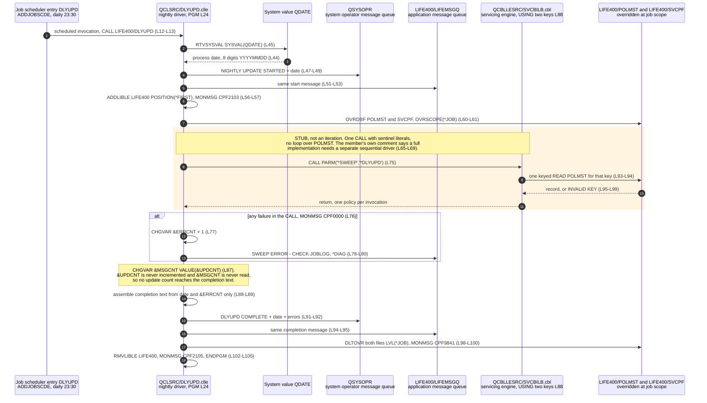

# LIFE400 Operational Model

This document is the runtime and operations reference for LIFE400. It records how a session begins, how batch work is requested and where it runs, what the scheduled nightly job actually does, which platform objects the application depends on at run time, what vocabulary it uses to report failure, how its batch work is serialised, how the whole estate is built, and where its runtime configuration lives. It is the first documentation of any kind for the five [ILE CL](../reference/glossary-ibm-i.md#cl-control-language) members: before this assessment they carried none, and between them they hold the entire operational contract of the system. Everything the system does outside a COBOL program is described here.

**Scope.** This document describes the operational model **as built**. It states what the CL layer and the build procedure do, and stops there. The target scheduler, deployment pipeline and observability design belong to [the target architecture](../target-state/01-target-architecture.md); the disposition of every stub, defect and inert feature observed below belongs to [the known defects and stubs register](07-known-defects-and-stubs.md), which is where each becomes a decision to migrate, implement or drop; recovery objectives and the consequences of non-atomic writes belong to [the continuity and recovery risk document](../risk/03-continuity-and-recovery-risk.md); and the severity of any security-relevant observation, together with the control that would close it, belongs to [the security risk register](../risk/01-security-risk-register.md). Findings are recorded here as observations with evidence, never as severities or remedies.

**Reading the citations.** Every claim about LIFE400 carries an inline citation of the form `[<path>:<locator>]` immediately after the claim. Citations are plain text and deliberately not hyperlinks: a plain-text citation stays meaningful in a diff and does not depend on a hosting provider's line-anchor syntax. Open the member to read the command in place. The same discipline applies inside both diagrams — every participant and every node that names a real artifact carries its member path or its object name in the label itself, so a diagram lifted out of this page still says what it describes. No member of the estate is annotated, altered, reformatted or commented by this documentation set; the CL layer and the build procedure are read as evidence and left exactly as they are. Platform terms link to [the IBM i glossary](../reference/glossary-ibm-i.md) on first use in this document.

**How this model was extracted.** Nothing below is carried over from prior description, and this layer had no prior description to carry over: no walkthrough in the machine-generated corpus under `.swm/` covers any CL member, so every fact here was read from the five members themselves and from the build procedure in the repository's README. Command sequences come from the executable lines of each member in the order they appear. Scheduling, the initial-program configuration and the subsystem the nightly job runs in are recorded in the members' own comment banners and are cited to those banners rather than presented as observed behaviour, because a comment is a declaration of intent and this document does not conflate the two. Variable findings come from reference-counting each declared variable across its whole member: a variable whose declaration line is its only occurrence is reported as unused, and a variable that appears as an assignment target but never as a source is reported as written and never read. The message vocabulary comes from a census of every `CPF` identifier in all five members. Nothing here was validated by compiling or running the system: ILE CL and ILE COBOL require the IBM i platform, no off-platform compiler exists, and the build procedure below is a set of commands a human types on that platform rather than a script this repository can execute. Every claim is therefore evidence read from source, and it is stated as such.

**One caution about temporal content.** This document states one clock time — the nightly job is configured to run daily at 23:30 — because that is a configured property of the system as built, cited to the configuration that sets it. Nothing in this assessment expresses a programme schedule: there are no dates, durations or calendar sequencing anywhere in it, and the migration path is ordered strictly by dependency, entry criteria and exit criteria.

## Session entry

An interactive session begins in CL, not in COBOL. `QCLSRC/STRTLIFE.clle` is 43 lines and runs the six-step sequence below between `PGM` [QCLSRC/STRTLIFE.clle:L18] and `ENDPGM` [QCLSRC/STRTLIFE.clle:L43].

| Order | Command | Purpose | Anchor |
|-------|---------|---------|--------|
| 1 | `DCL VAR(&LIFINLIB)` | Declares a 10-character variable for a library name | [QCLSRC/STRTLIFE.clle:L20] |
| 2 | `RTVJOBA CURLIB(&LIFINLIB)` | Retrieves the job's current library into that variable | [QCLSRC/STRTLIFE.clle:L24] |
| 3 | `ADDLIBLE LIB(LIFE400) POSITION(*FIRST)` | Puts the application library at the front of the job's library list, tolerating the condition raised when it is already there | [QCLSRC/STRTLIFE.clle:L27-L28] |
| 4 | `SNDPGMMSG … TOMSGQ(LIFE400/LIFEMSGQ)` | Announces the session on the application message queue, tolerating a missing queue | [QCLSRC/STRTLIFE.clle:L31-L34] |
| 5 | `CALL PGM(LIFE400/MAINMENU)` | Transfers control to the menu program and blocks until it returns | [QCLSRC/STRTLIFE.clle:L37] |
| 6 | `RMVLIBLE LIB(LIFE400)` | Removes the library again on the way out, tolerating its absence | [QCLSRC/STRTLIFE.clle:L40-L41] |

### How it is attached to a user

The program is designed to be a user profile's [initial program](../reference/glossary-ibm-i.md#initial-program). Its own banner records the command that installs it that way, `CHGUSRPRF USRPRF(username) INLPGM(LIFE400/STRTLIFE)`, and offers a system menu option as the alternative [QCLSRC/STRTLIFE.clle:L14-L16]. That is what makes the menu the first thing a signed-on user meets rather than a command line. Two things follow, and the distinction between them matters. The banner is a configuration instruction, so the repository establishes how the program is *intended* to be attached; whether any profile is actually configured that way is a property of a platform installation and is not knowable from this repository at all. This document therefore reports the intent and cites the comment that declares it, and claims nothing about the installed state.

One misreading is worth closing off explicitly, because that line is the only place a user profile is named anywhere in the estate. A census of the five CL members, the eight COBOL members, the [copybook](../reference/glossary-ibm-i.md#copybook) and all ten DDS members for authority keywords — profile switching, authority adoption, an authority parameter on any creation command, or any authority grant — returns exactly one match, and it is that comment [QCLSRC/STRTLIFE.clle:L15]. No [adopted authority](../reference/glossary-ibm-i.md#adopted-authority) mechanism is instantiated anywhere: the session-entry program is not created to run under its owner's profile, and nothing in the build procedure sets authority on any object. So the comment describes how the program is launched for a user, not any privilege it carries, and reading it as the latter would misstate how this system controls access.

### Why the library list is the whole binding mechanism

Name resolution in this system is session-scoped, and the [library list](../reference/glossary-ibm-i.md#library-list) is the only mechanism that provides it. The application library is inserted at the front of the list on entry [QCLSRC/STRTLIFE.clle:L27] and removed on exit [QCLSRC/STRTLIFE.clle:L40], so an unqualified object name resolves to a LIFE400 object only for the duration of a session in which that entry is present. The nightly job repeats the same discipline for the same reason [QCLSRC/DLYUPD.clle:L56], [QCLSRC/DLYUPD.clle:L102].

Both operations are guarded rather than checked. The insertion monitors the condition raised when the library is already on the list [QCLSRC/STRTLIFE.clle:L28] and the removal monitors the condition raised when it is not [QCLSRC/STRTLIFE.clle:L41]; neither outcome is inspected and neither changes what the program does next. The consequence worth recording is that a session in which the insertion failed for any other reason proceeds to call the menu regardless [QCLSRC/STRTLIFE.clle:L37], because nothing between the two commands examines whether the library list is in the state the program assumes.

### Two observations about the session announcement

Both are stated factually, with evidence. Neither is dispositioned here; the disposition of each belongs to [the known defects and stubs register](07-known-defects-and-stubs.md).

- **The announcement reports a library name where its wording promises a user.** The retrieved value is the job's *current library* [QCLSRC/STRTLIFE.clle:L24], and it is concatenated into the message text as `'LIFE400 SESSION STARTED BY ' *CAT &LIFINLIB` [QCLSRC/STRTLIFE.clle:L31]. The text therefore reads as an attribution to a person while carrying a library name. The variable is used nowhere else in the member, and the comment above the retrieval describes a different purpose from the one the value is actually put to — checking whether the application library is already on the library list [QCLSRC/STRTLIFE.clle:L23] — yet the retrieved value is never compared with anything. This reinforces a fact established across the whole layer: **no user identity is captured anywhere in the CL layer.** No submitter and no scheduled job records who requested the work.
- **The announcement's stated destination and its actual destination differ.** The comment above it says the session start is announced to the system operator [QCLSRC/STRTLIFE.clle:L30], while the command sends it to the application message queue [QCLSRC/STRTLIFE.clle:L33]. The nightly job does send to the system operator, in two places [QCLSRC/DLYUPD.clle:L49], [QCLSRC/DLYUPD.clle:L92], so the two members treat operator notification differently.

## Batch submitters

Three CL members exist to move work off the interactive job. None of them is reachable from the menu — batch work is requested by calling a submitter — and none of them runs the business program itself. Each hands the work to a [job queue](../reference/glossary-ibm-i.md#job-queue) and returns.

| Submitter | Lines | Entry | Batch job name | File [overrides](../reference/glossary-ibm-i.md#override) | Submitted program |
|-----------|-------|-------|----------------|--------------|-------------------|
| `QCLSRC/RUNNBUW.clle` | 58 | `PGM PARM(&POLID)` [QCLSRC/RUNNBUW.clle:L21] | `NBUWBAT` [QCLSRC/RUNNBUW.clle:L24] | `POLMST` [QCLSRC/RUNNBUW.clle:L37], `CLMPF` [QCLSRC/RUNNBUW.clle:L38] | `NBUWB` [QCLSRC/RUNNBUW.clle:L45] |
| `QCLSRC/RUNSVC.clle` | 65 | `PGM PARM(&POLID &SVCID)` [QCLSRC/RUNSVC.clle:L21] | `SVCBAT` [QCLSRC/RUNSVC.clle:L25] | `POLMST` [QCLSRC/RUNSVC.clle:L44], `SVCPF` [QCLSRC/RUNSVC.clle:L45] | `SVCBILB` [QCLSRC/RUNSVC.clle:L52] |
| `QCLSRC/RUNCLM.clle` | 65 | `PGM PARM(&CLMID &POLID)` [QCLSRC/RUNCLM.clle:L21] | `CLMBAT` [QCLSRC/RUNCLM.clle:L25] | `POLMST` [QCLSRC/RUNCLM.clle:L44], `CLMPF` [QCLSRC/RUNCLM.clle:L45] | `CLMADJB` [QCLSRC/RUNCLM.clle:L52] |

### The shared pattern

All three follow the same six-step shape, and the shape is what a modern equivalent has to reproduce.

- **Guard every key parameter against blanks and abandon the request if one is empty.** The test compares the parameter with a blank literal of its own declared length and, on failure, sends a message and branches to a label at the end of the program: one guard in the new-business submitter [QCLSRC/RUNNBUW.clle:L29] branching to [QCLSRC/RUNNBUW.clle:L33] and its label at [QCLSRC/RUNNBUW.clle:L57], two in the servicing submitter [QCLSRC/RUNSVC.clle:L29], [QCLSRC/RUNSVC.clle:L36] branching to [QCLSRC/RUNSVC.clle:L33], [QCLSRC/RUNSVC.clle:L40] with its label at [QCLSRC/RUNSVC.clle:L64], and two in the claims submitter [QCLSRC/RUNCLM.clle:L29], [QCLSRC/RUNCLM.clle:L36] with its label at [QCLSRC/RUNCLM.clle:L64]. This is the only parameter validation anywhere in the layer: a key of the right length that is not blank is passed through untested.
- **Bind each file the submitted program will open to a library-qualified name, at job scope.** `OVRDBF … OVRSCOPE(*JOB)` is applied immediately before submission [QCLSRC/RUNSVC.clle:L44-L45].
- **Submit with [`SBMJOB`](../reference/glossary-ibm-i.md#sbmjob), naming the work-management objects.** Submitting rather than calling is what makes the work asynchronous, and it is the only asynchrony mechanism in the estate [QCLSRC/RUNNBUW.clle:L43].
- **Name the program in the submitted command rather than calling it.** The command carried by the submission is what identifies the batch program and passes it the keys [QCLSRC/RUNNBUW.clle:L45], [QCLSRC/RUNSVC.clle:L52], [QCLSRC/RUNCLM.clle:L52].
- **Notify the requester.** A message goes back to the requesting job [QCLSRC/RUNNBUW.clle:L49-L50], which is the only feedback the caller ever receives.
- **Delete the overrides, tolerating their absence.** `DLTOVR … LVL(*JOB)` with a monitored condition [QCLSRC/RUNNBUW.clle:L53-L55], [QCLSRC/RUNSVC.clle:L60-L62], [QCLSRC/RUNCLM.clle:L60-L62].

The notification is worth being precise about, because it is easy to read as a completion report and it is not one. Control returns to the caller as soon as the job is queued, so the message confirms that a *submission* happened and nothing more; no submitter observes the outcome of the work it requested. The return code and message the batch program computes are written into the policy record and reported through the platform's messaging, never back through the call.

### One anchor names the entire runtime contract

The submission in the new-business submitter is the most compact evidence in the estate for what this system needs from the operating system, because it names all four work-management objects in a single command: the [job description](../reference/glossary-ibm-i.md#job-description) and the job queue [QCLSRC/RUNNBUW.clle:L43], the [output queue](../reference/glossary-ibm-i.md#output-queue) [QCLSRC/RUNNBUW.clle:L44], and the [message queue](../reference/glossary-ibm-i.md#message-queue) [QCLSRC/RUNNBUW.clle:L46], wrapped around the command that names the program [QCLSRC/RUNNBUW.clle:L45]. The other two submitters name the same four [QCLSRC/RUNSVC.clle:L50-L53], [QCLSRC/RUNCLM.clle:L50-L53].

Batch job names are fixed literals assigned at declaration, not derived from the request: `NBUWBAT` [QCLSRC/RUNNBUW.clle:L24], `SVCBAT` [QCLSRC/RUNSVC.clle:L25] and `CLMBAT` [QCLSRC/RUNCLM.clle:L25]. Every new-business submission therefore arrives on the queue under the same job name as every other, so concurrent requests in one domain are distinguishable only by the platform's own job numbering and not by anything the application supplies.

### Two observations about the submitter family

- **One override names a file its target never opens.** The new-business submitter overrides the claims file [QCLSRC/RUNNBUW.clle:L38] and deletes that override afterwards [QCLSRC/RUNNBUW.clle:L54], but the program it submits never opens it: `NBUWB` declares exactly one file, the policy master [QCBLLESRC/NBUWB.cbl:L50-L54]. The override is inert with respect to the work being submitted.
- **The parameter order is not consistent across the family.** The new-business and servicing submitters take the policy key first [QCLSRC/RUNNBUW.clle:L21], [QCLSRC/RUNSVC.clle:L21]; the claims submitter takes the claim key first [QCLSRC/RUNCLM.clle:L21]. That ordering does match its target, whose entry signature is `USING LK-CLAIM-ID LK-POLICY-ID` [QCBLLESRC/CLMADJB.cbl:L80], so the submitter and its program agree and neither is wrong on its own terms. The inconsistency is across the family: anything that drives all three submitters uniformly — an operator following one habit, or a script parameterised over the set — has to special-case one of the three, and a transposed pair of same-length keys is not detectable by the blank guard that is the only validation present.

A third observation belongs with these, from the same reference-counting method applied to the nightly job below: the new-business submitter declares a variable it never uses, `&ERRMSG` [QCLSRC/RUNNBUW.clle:L26], whose declaration line is its only occurrence in the member.

## The nightly scheduled job

`QCLSRC/DLYUPD.clle` is 105 lines and is the only scheduled work in the estate. It is also the member whose documented purpose and actual content differ most, which makes it the most consequential entry in this document.

### How it is scheduled

The scheduling command is recorded in the program's own banner, `ADDJOBSCDE JOB(DLYUPD) CMD(CALL LIFE400/DLYUPD)` with `FRQ(*WEEKLY) SCDDAY(*ALL) SCDTIME(233000)` [QCLSRC/DLYUPD.clle:L12-L13], and the build procedure repeats it as the last step of creating the supporting objects [README.md:L209-L211]. The repository's overview also records that the nightly batch is scheduled this way [README.md:L20].

One idiom in that command is worth spelling out, because reading it at a glance gives the wrong answer: a weekly frequency combined with a day list of *all* days schedules the job **every day**, at 23:30. The frequency keyword alone reads as weekly and is not. As stated at the top of this document, that clock time is a configured property of the system as built and is cited as such; it carries no implication for how any migration work is sequenced.

The banner also records the execution context: the job runs in the platform's general batch subsystem under the application's own job description [QCLSRC/DLYUPD.clle:L22]. That is a comment, so it is reported as the declared context rather than as an observed one.

### What it actually executes

| Order | Step | Anchor |
|-------|------|--------|
| 1 | `PGM`, then nine variable declarations | [QCLSRC/DLYUPD.clle:L24], [QCLSRC/DLYUPD.clle:L29-L37] |
| 2 | `RTVSYSVAL SYSVAL(QDATE)` into an 8-character variable — the only date source | [QCLSRC/DLYUPD.clle:L45] |
| 3 | Start message to the system operator | [QCLSRC/DLYUPD.clle:L47-L49] |
| 4 | The same start message to the application message queue | [QCLSRC/DLYUPD.clle:L51-L53] |
| 5 | `ADDLIBLE` with its monitored condition | [QCLSRC/DLYUPD.clle:L56-L57] |
| 6 | `OVRDBF` for the policy master and the servicing file, at job scope | [QCLSRC/DLYUPD.clle:L60-L61] |
| 7 | A single `CALL` with two sentinel literals — the sweep | [QCLSRC/DLYUPD.clle:L75] |
| 8 | A catch-all monitored condition that counts a failure and sends a diagnostic | [QCLSRC/DLYUPD.clle:L76-L81] |
| 9 | Completion message assembled and sent to both destinations | [QCLSRC/DLYUPD.clle:L87-L95] |
| 10 | `DLTOVR` for both files, with its monitored condition | [QCLSRC/DLYUPD.clle:L98-L100] |
| 11 | `RMVLIBLE` with its monitored condition, then `ENDPGM` | [QCLSRC/DLYUPD.clle:L102-L105] |

The date deserves one note. The job takes the process date from a system value [QCLSRC/DLYUPD.clle:L45], and the comment immediately above it records that the system date is eight digits in the form `YYYYMMDD` on the declared release and later [QCLSRC/DLYUPD.clle:L44]. This is the only place in the estate where a date enters the system from the platform through CL, and it is the single date source the nightly run depends on.

### The sweep is a stub

The program's documented purpose is a sweep: its banner says it sweeps the policy master for policies in a grace period, identifies overdue paid-to dates, transitions status through grace to lapsed, and submits the servicing engine for each policy requiring an update [QCLSRC/DLYUPD.clle:L15-L20]. What it contains instead is one call:

```text
CALL PGM(LIFE400/SVCBILB) PARM('*SWEEP     ' '*DLYUPD     ')
```

That is the whole of step 7 [QCLSRC/DLYUPD.clle:L75]. Two sentinel literals are passed where a policy key and a servicing key are expected. There is no loop, no cursor and no iteration of any kind in the member.

The program says so itself. The comment block immediately above the call states that in production this loops over policy-master records, that the stub demonstrates the job structure, and that a full implementation would use a separate driver program to read the policy master sequentially and call the servicing engine for each record [QCLSRC/DLYUPD.clle:L65-L69], with a second note repeating that the call should be replaced by a sequential read [QCLSRC/DLYUPD.clle:L73].

Three further facts, each verified against source, establish how far the gap goes beyond a missing loop.

- **The sentinel is not interpreted by the program that receives it.** `SVCBILB` takes two 12-character keys [QCBLLESRC/SVCBILB.cbl:L88], moves the first straight into the policy record key [QCBLLESRC/SVCBILB.cbl:L93] and issues a single keyed read [QCBLLESRC/SVCBILB.cbl:L94], whose not-found branch sets a result code and message and returns immediately [QCBLLESRC/SVCBILB.cbl:L94-L100]. A census of the whole member finds no reference to the sentinel literal anywhere in it, so the value is handled as an ordinary key rather than as a mode indicator. The member's banner does record the nightly job as one of its two callers [QCBLLESRC/SVCBILB.cbl:L16], so the coupling was intended; what is absent is any code that treats a sweep differently from a single request.
- **The servicing engine processes one policy per invocation by construction.** It opens its files, reads one record by key, evaluates it and returns [QCBLLESRC/SVCBILB.cbl:L91-L94]. Calling it once cannot process a set however its parameters are filled in.
- **A set-based sweep is not expressible anywhere in the current design.** Every database file in all eight COBOL members is declared as an indexed file with random access — the servicing engine's two files are typical [QCBLLESRC/SVCBILB.cbl:L48-L57] — and the only sequential access mode in the estate belongs to display files, which are transaction-organization files rather than database files. A census over the code lines of all eight members finds zero positioning and zero sequential-read operations, a result recorded independently in [the current-state architecture](02-architecture-current-state.md). The estate therefore has no sequential-access capability from which a sweep could be assembled: the missing loop is not a localised omission but the absence of a whole access pattern, which is exactly what the program's own comment concedes when it says a *separate driver program* would be needed [QCLSRC/DLYUPD.clle:L65-L69].

### The job's own telemetry does not work

Three counters are declared, all initialised to zero: an update count [QCLSRC/DLYUPD.clle:L32], a lapse count [QCLSRC/DLYUPD.clle:L33] and an error count [QCLSRC/DLYUPD.clle:L34]. Reference-counting each one across the member gives a precise picture.

| Variable | Declared | Ever assigned after declaration | Ever read | Reaches a message |
|----------|----------|--------------------------------|-----------|-------------------|
| `&ERRCNT` | [QCLSRC/DLYUPD.clle:L34] | Yes — incremented in the failure path [QCLSRC/DLYUPD.clle:L77] | Yes | Yes [QCLSRC/DLYUPD.clle:L89] |
| `&UPDCNT` | [QCLSRC/DLYUPD.clle:L32] | No — it is never an assignment target | Once, as the source at [QCLSRC/DLYUPD.clle:L87] | No |
| `&MSGCNT` | [QCLSRC/DLYUPD.clle:L36] | Yes — assigned once [QCLSRC/DLYUPD.clle:L87] | No | No |
| `&LPSECNT` | [QCLSRC/DLYUPD.clle:L33] | No | No | No |

Read together, those rows say something sharper than a zero count. The update counter is never incremented, because nothing in the member counts anything. It is copied into a character variable prepared to carry it into a message [QCLSRC/DLYUPD.clle:L87] — and that variable is then never referenced again, because the completion text is assembled from the process date and the error count only [QCLSRC/DLYUPD.clle:L88-L89]. So the update count does not merely report zero: **it never reaches any message at all**, and the one variable prepared to carry it is written and discarded. The lapse counter is never touched after its declaration.

Four variables in this member are wholly unused, their declaration line being their only occurrence: a policy key [QCLSRC/DLYUPD.clle:L29], a servicing key [QCLSRC/DLYUPD.clle:L30], the lapse counter [QCLSRC/DLYUPD.clle:L33] and a job-log name [QCLSRC/DLYUPD.clle:L37]. The first two are the keys a real loop would have filled in, which is consistent with the member having been written around an iteration that was never added.

The operational consequence is worth stating plainly, because it governs how much the nightly run can be trusted as evidence of anything. The completion message reports the date and an error count [QCLSRC/DLYUPD.clle:L88-L89], and the error count can only be incremented by the single catch-all monitor on the sweep call [QCLSRC/DLYUPD.clle:L76-L77]. A run in which the sweep did nothing useful and a run in which it did are therefore indistinguishable from the job's own output.

### D-06 — the nightly batch flow



The diagram is D-06 in this assessment's diagram register. Solid arrows are synchronous calls and messages; dashed arrows are returns. The highlighted block is the sweep, drawn as a single call with a note stating that it is a stub, so the diagram cannot be read as showing an iteration that the source does not contain. The alternative block is the catch-all monitored condition, and the note before the completion messages records why no update count appears in them.

## Work-management objects

Four platform objects carry the runtime contract. None is compiled from a source member — each is created by command, so none appears in any register that counts members, and their runtime roles are recorded here. All four live in the same library as the programs, and all four are named together in a single submission [QCLSRC/RUNNBUW.clle:L43-L46].

| Object | Type | Created by | Runtime role, with evidence |
|--------|------|-----------|------------------------------|
| `LIFEJD` | Job description | `CRTJOBD` naming `LIFEQ` as its queue [README.md:L199] | Named by all three batch submissions [QCLSRC/RUNNBUW.clle:L43], [QCLSRC/RUNSVC.clle:L50], [QCLSRC/RUNCLM.clle:L50], and by the scheduler entry for the nightly job [README.md:L209-L211]; the nightly job's banner records that it runs under this job description in the general batch subsystem [QCLSRC/DLYUPD.clle:L22] |
| `LIFEQ` | Job queue | `CRTJOBQ`, with no concurrency parameter [README.md:L200] | The single destination of every batch submission in the estate [QCLSRC/RUNNBUW.clle:L43], [QCLSRC/RUNSVC.clle:L50], [QCLSRC/RUNCLM.clle:L50]; it is also the queue named inside the job description [README.md:L199] |
| `LIFEOUTQ` | Output queue | `CRTOUTQ` [README.md:L203] | Named on every submission [QCLSRC/RUNNBUW.clle:L44], [QCLSRC/RUNSVC.clle:L51], [QCLSRC/RUNCLM.clle:L51]; the new-business submitter's banner records that job-log capture to this queue was added as a change to the member [QCLSRC/RUNNBUW.clle:L7] |
| `LIFEMSGQ` | Message queue | `CRTMSGQ` [README.md:L206] | The application's own notification channel: session start [QCLSRC/STRTLIFE.clle:L33], nightly start [QCLSRC/DLYUPD.clle:L53], sweep failure diagnostic [QCLSRC/DLYUPD.clle:L80], nightly completion [QCLSRC/DLYUPD.clle:L95], and named on every submission [QCLSRC/RUNNBUW.clle:L46] |

All four are created consecutively in one step of the build procedure, immediately before the scheduler entry [README.md:L199-L206].

Two properties of this set matter for anyone replacing it. First, it is the entire operational dependency surface: outside these four objects, the library list and the file overrides, the application asks nothing of the operating system. Second, the objects are addressed by hard-coded library-qualified name at every point of use, so they are not configuration in any sense that can be varied without editing source — a point the configuration surface below returns to.

Message destinations divide cleanly between them. Operator-facing traffic goes to the platform's system operator queue and only from the nightly job [QCLSRC/DLYUPD.clle:L49], [QCLSRC/DLYUPD.clle:L92]. Application-facing traffic goes to `LIFEMSGQ`. Submitter feedback goes to neither: it is sent to the requesting job [QCLSRC/RUNNBUW.clle:L50], [QCLSRC/RUNSVC.clle:L57], [QCLSRC/RUNCLM.clle:L57], so it reaches whoever called the submitter and is not retained on any queue the application owns.

## CPF message vocabulary

A census of every `CPF` identifier in all five CL members finds **exactly five distinct identifiers in 24 occurrences**, and none anywhere else in the estate: no COBOL member, no DDS member and not the shared data contract names a [CPF message](../reference/glossary-ibm-i.md#cpf-message) at all. This is the whole error-and-notification vocabulary of the system.

| Identifier | Occurrences | Used as | Meaning in context | Anchors |
|------------|-------------|---------|--------------------|---------|
| `CPF9898` | 14 | `SNDPGMMSG`, always with the system message file | The general-purpose vehicle for sending free-form text; every message this application emits travels on it | [QCLSRC/STRTLIFE.clle:L32], [QCLSRC/DLYUPD.clle:L47], [QCLSRC/DLYUPD.clle:L51], [QCLSRC/DLYUPD.clle:L78], [QCLSRC/DLYUPD.clle:L91], [QCLSRC/DLYUPD.clle:L94], [QCLSRC/RUNNBUW.clle:L30], [QCLSRC/RUNNBUW.clle:L49], [QCLSRC/RUNSVC.clle:L30], [QCLSRC/RUNSVC.clle:L37], [QCLSRC/RUNSVC.clle:L56], [QCLSRC/RUNCLM.clle:L30], [QCLSRC/RUNCLM.clle:L37], [QCLSRC/RUNCLM.clle:L56] |
| `CPF9841` | 4 | `MONMSG` only | Override not found — tolerated after deleting a file override | [QCLSRC/RUNNBUW.clle:L55], [QCLSRC/RUNSVC.clle:L62], [QCLSRC/RUNCLM.clle:L62], [QCLSRC/DLYUPD.clle:L100] |
| `CPF2103` | 2 | `MONMSG` only | Library already on the list — tolerated after adding a library-list entry | [QCLSRC/STRTLIFE.clle:L28], [QCLSRC/DLYUPD.clle:L57] |
| `CPF2105` | 2 | `MONMSG` only | Object not found — tolerated after removing a library-list entry | [QCLSRC/STRTLIFE.clle:L41], [QCLSRC/DLYUPD.clle:L103] |
| `CPF0000` | 2 | `MONMSG` only | Catch-all. Used two ways: to tolerate a missing message queue so a session still starts [QCLSRC/STRTLIFE.clle:L34], and to trap any failure of the sweep call [QCLSRC/DLYUPD.clle:L76] | [QCLSRC/STRTLIFE.clle:L34], [QCLSRC/DLYUPD.clle:L76] |

### The pattern this vocabulary encodes

The distribution is the finding, not the list. One identifier is a send vehicle and appears 14 times; the other four appear in 10 occurrences and **every one of them is a monitored condition**. Error handling in this layer is therefore *exception tolerance by monitored condition* rather than structured error handling: four fifths of the vocabulary exists to make a specific non-fatal condition non-fatal, and in three of those four cases — a library already present, a library already absent, an override already gone — the tolerated condition is the benign outcome of an idempotent operation.

Two consequences follow, both stated as observations.

- **A monitored condition is not an inspected result.** Nothing in the layer branches on whether a tolerated condition occurred. The single exception is the sweep monitor, which counts [QCLSRC/DLYUPD.clle:L77].
- **The catch-all costs diagnosis.** The monitor on the sweep call is the catch-all identifier rather than a specific condition [QCLSRC/DLYUPD.clle:L76], so *any* failure of that call — a missing program, a file that cannot be opened, an error inside the servicing engine — collapses into one counter increment and one message whose entire diagnostic content is an instruction to consult the job log [QCLSRC/DLYUPD.clle:L79]. The distinction between failure modes is not preserved anywhere the application can see it. The job log itself is captured to the output queue [QCLSRC/RUNNBUW.clle:L7], which is outside the application's own records.

## Queue serialization

The estate has one job queue, and everything asynchronous goes through it. All three submitters name `LIFEQ` [QCLSRC/RUNNBUW.clle:L43], [QCLSRC/RUNSVC.clle:L50], [QCLSRC/RUNCLM.clle:L50]; the job description they all name is itself created pointing at the same queue [README.md:L199]; and the nightly job is scheduled under that same job description [README.md:L209-L211]. There is exactly one queue created for the application [README.md:L200], and no member names any other.

What that means for concurrency has to be stated carefully, because part of it is visible in this repository and part of it is not.

- **Visible here, and certain.** There is no separation of work by queue. Interactive-initiated batch work from all three business domains and the scheduled nightly work are directed at the same queue, so nothing in the application distinguishes an operator's ad-hoc request from overnight processing, and nothing gives one domain priority over another. The queue is created with no parameter of any kind beyond a text description [README.md:L200], so whatever concurrency it permits comes from platform defaults and from the subsystem that services it, not from anything this repository sets.
- **Not visible here, and therefore not asserted.** How many jobs run at once from that queue is determined by subsystem configuration, which is a platform artifact and is absent from this repository: no subsystem description, no routing entry and no queue-entry definition appears anywhere in the tree. This document therefore does **not** state a concurrency figure. What it states is that the application exercises no control over concurrency and expresses no preference — a single queue named identically everywhere is the whole of its design.

Two related properties are worth recording alongside, since both bear on the same behaviour. Batch job names are fixed literals per domain [QCLSRC/RUNNBUW.clle:L24], [QCLSRC/RUNSVC.clle:L25], [QCLSRC/RUNCLM.clle:L25], so simultaneous requests in one domain are indistinguishable by name on the queue. And file overrides are applied at job scope in the submitting job [QCLSRC/RUNSVC.clle:L44-L45] and deleted there afterwards [QCLSRC/RUNSVC.clle:L60-L61], while the submitted job's own binding comes from the library list the job description establishes — so the override in the submitter and the resolution in the submitted job are two separate mechanisms, and only the second one governs what the batch program actually opens.

## The manual build sequence

The whole estate is built by a documented sequence of eight steps a human types on the platform [README.md:L120-L218]. Every command below is a platform command; **nothing in this sequence can be executed from this repository**, because ILE COBOL and ILE CL compile only on IBM i and no off-platform compiler exists. The sequence is documented here, not run, and no claim in this document was validated by building anything.

| Step | What it creates | Commands | Anchor |
|------|-----------------|----------|--------|
| 1 | The library and four [source physical files](../reference/glossary-ibm-i.md#source-physical-file-and-source-member), all with an identical record length | `CRTLIB`, then `CRTSRCPF` ×4 | [README.md:L124-L131] |
| 2 | Source members inside those files | Prose: upload by file transfer or stream-file copy, then `CPYFRMSTMF` | [README.md:L133-L135] |
| 3 | Three [physical files](../reference/glossary-ibm-i.md#physical-file) and one [logical file](../reference/glossary-ibm-i.md#logical-file) | `CRTPF` ×3, `CRTLF` ×1 | [README.md:L139-L144] |
| 4 | Four [display files](../reference/glossary-ibm-i.md#display-file) and two [printer files](../reference/glossary-ibm-i.md#printer-file) | `CRTDSPF` ×4, `CRTPRTF` ×2 | [README.md:L148-L155] |
| 5 | Eight COBOL modules, then eight programs bound from them | `CRTCBLMOD` ×8 [README.md:L160-L167], then `CRTPGM` ×8 [README.md:L169-L176] | [README.md:L157-L177] |
| 6 | Five CL modules, then five programs bound from them | `CRTCLMOD` ×5 [README.md:L182-L186], then `CRTPGM` ×5 [README.md:L188-L192] | [README.md:L179-L193] |
| 7 | The four work-management objects, then the scheduler entry | `CRTJOBD`, `CRTJOBQ`, `CRTOUTQ`, `CRTMSGQ` [README.md:L199-L206], then `ADDJOBSCDE` [README.md:L209-L211] | [README.md:L195-L212] |
| 8 | Nothing — it starts the system | `CALL LIFE400/STRTLIFE` | [README.md:L217] |

### The dependency order behind the steps

The step numbers are a reading order. The order that actually binds is a dependency graph, and every edge in it is established by something citable.

- Source physical files must exist before members can be copied into them: step 2 copies into the files step 1 creates [README.md:L127-L130], [README.md:L135].
- Every compile reads its source from a member, so all of step 2 precedes steps 3 through 6 — each creation command names a source file and a source member explicitly [README.md:L140].
- The copybook must be present before any COBOL module that includes it compiles. Seven of the eight COBOL members expand the shared contract textually with `COPY POLDATA` [QCBLLESRC/NBUWB.cbl:L60], so its source member is a compile-time input to those seven, not a runtime dependency. The contract's structure and the coupling this creates are documented in [the current data model](04-data-model-current-state.md).
- The policy master must exist before the access path over it: the logical file names it as its physical file [QDDSSRC/POLMSTL1.lf:L13], so `CRTPF` for the policy master [README.md:L140] precedes `CRTLF` [README.md:L143] — an ordering the step-3 block already happens to follow, but which is required rather than incidental.
- Database files must exist before the COBOL modules that declare them, because each module names its files in its file-control entries [QCBLLESRC/NBUWB.cbl:L50-L54]; so step 3 precedes step 5.
- Display files must exist before the programs that drive them, for the same reason, so step 4 precedes step 5. The two printer files are created in step 4 [README.md:L153-L154] and are named by no program at all, so nothing in step 5 or 6 depends on them.
- Every module precedes the program bound from it: step 5 binds only after its own compiles [README.md:L160-L176] and step 6 does the same [README.md:L182-L192].
- The CL programs call the COBOL programs by name, so step 6 follows step 5 [QCLSRC/STRTLIFE.clle:L37].
- The work-management objects must exist before any submission executes, since each submission names all four [QCLSRC/RUNNBUW.clle:L43-L46] — which puts step 7 before step 8, and before any use of the submitters built in step 6.

```mermaid
flowchart TD
    S1["Step 1 — CRTLIB LIFE400<br/>+ 4 CRTSRCPF source physical files<br/>README.md:L124-L131"]
    S2["Step 2 — upload members, CPYFRMSTMF<br/>manual prose step, no script<br/>README.md:L133-L135"]

    CPY["QCPYSRC/POLDATA.cpy<br/>shared contract, compile-time input<br/>COPY POLDATA in 7 of 8 programs"]
    PF["Step 3a — CRTPF POLMST, CLMPF, SVCPF<br/>README.md:L140-L142"]
    LF["Step 3b — CRTLF POLMSTL1<br/>requires POLMST: PFILE(POLMST)<br/>QDDSSRC/POLMSTL1.lf:L13"]
    DSP["Step 4a — CRTDSPF MNUDSPF, NBUWDSPF,<br/>CLMDSPF, SVCDSPF<br/>README.md:L149-L152"]
    PRT["Step 4b — CRTPRTF POLRPT, CLMRPT<br/>named by no program<br/>README.md:L153-L154"]

    CBLMOD["Step 5a — CRTCBLMOD x8<br/>reads copybook, needs declared files<br/>README.md:L160-L167"]
    CBLPGM["Step 5b — CRTPGM x8 COBOL<br/>README.md:L169-L176"]
    CLMOD["Step 6a — CRTCLMOD x5<br/>README.md:L182-L186"]
    CLPGM["Step 6b — CRTPGM x5 CL<br/>calls COBOL programs by name<br/>QCLSRC/STRTLIFE.clle:L37"]

    WM["Step 7a — CRTJOBD LIFEJD, CRTJOBQ LIFEQ,<br/>CRTOUTQ LIFEOUTQ, CRTMSGQ LIFEMSGQ<br/>README.md:L199-L206"]
    SCD["Step 7b — ADDJOBSCDE DLYUPD<br/>daily 23:30, under LIFEJD<br/>README.md:L209-L211"]
    S8["Step 8 — CALL LIFE400/STRTLIFE<br/>README.md:L217"]

    S1 --> S2
    S2 --> CPY
    S2 --> PF
    S2 --> DSP
    S2 --> PRT
    PF --> LF
    CPY --> CBLMOD
    PF --> CBLMOD
    DSP --> CBLMOD
    CBLMOD --> CBLPGM
    S2 --> CLMOD
    CLMOD --> CLPGM
    CBLPGM --> CLPGM
    WM --> SCD
    S2 --> WM
    CLPGM --> S8
    WM --> S8
    PRT -.->|"no program names either file"| CBLMOD
    LF -.->|"no program names it"| CBLMOD
```



The diagram is D-07 in this assessment's diagram register. Solid arrows are required orderings, each justified by the citation in the node it points from or by the list above. The two dashed arrows are deliberately *not* dependencies: they record that the printer files and the access path are created by the build and then referenced by no program, so nothing downstream needs them — drawn because omitting them would make the build look smaller than it is.

### What the build procedure is, and is not

- **There is no build script, no makefile and no pipeline anywhere in this repository.** The sequence is a set of commands in a document [README.md:L120-L218], with one step that is prose rather than a command at all [README.md:L135]. Adding an object to the system means editing that prose.
- **There is no dependency-driven rebuild.** Nothing derives what must be recompiled from what changed. Because the shared contract is expanded textually into each consumer rather than linked, a change to one field definition obliges recompiling all seven consumers, and knowing that is a matter of remembering it rather than of a tool determining it. A consumer left uncompiled is indistinguishable at run time from one rebuilt.
- **Binding is one module per program throughout.** Each of the thirteen programs is bound from exactly one module of the same name [README.md:L169-L176], [README.md:L188-L192], so no program shares compiled code with another. This is the mechanical counterpart of the duplication measured in [the current-state architecture](02-architecture-current-state.md): logic repeated across two members is repeated in two bound programs, with nothing in the build that would notice the two drifting apart.
- **The four work-management objects have no source member.** They are created by command in step 7 [README.md:L199-L206], so they are absent from any member register — [the system inventory](01-system-inventory.md) records that reconciliation — and their definitions exist only as the commands in the build procedure.
- **The library is created with no authority parameter** [README.md:L125], so object authority is left at the platform default rather than being set deliberately by the build. That is recorded here as a property of the build procedure; its severity and the control that would address it belong to [the security risk register](../risk/01-security-risk-register.md).
- **Two artifacts named in this project's history are not in the working tree** — a data-definition-language member and a document mapping the CL jobs. Neither is part of the system as built, so neither is described here as one, and the second is not a substitute for this document. Persistence is defined entirely by DDS, as recorded in [the current data model](04-data-model-current-state.md), and the operational contract is defined entirely by the five CL members inventoried above.

## Configuration surface

Runtime configuration in LIFE400 lives in **platform objects and CL source**. There is no configuration file, no environment variable and no parameter object anywhere in the estate — the repository contains no manifest, settings file or externalized value of any kind that the application reads at run time. The table below is the complete surface, and it is the inventory [the target architecture](../target-state/01-target-architecture.md) builds its externalization requirement on.

| Surface | Where it lives | Varying it today requires | Evidence |
|---------|----------------|---------------------------|----------|
| Library name `LIFE400` | A literal at every point of use, in the menu call, every file override and every submission | Editing and recompiling CL source | [QCLSRC/STRTLIFE.clle:L37], [QCLSRC/DLYUPD.clle:L60-L61], [QCLSRC/RUNNBUW.clle:L43-L46] |
| Library-list manipulation | `ADDLIBLE` and `RMVLIBLE` with monitored conditions, session-scoped | Editing CL source | [QCLSRC/STRTLIFE.clle:L27], [QCLSRC/STRTLIFE.clle:L40], [QCLSRC/DLYUPD.clle:L56], [QCLSRC/DLYUPD.clle:L102] |
| File overrides | `OVRDBF` and `DLTOVR` at job scope, applied and deleted around each submission | Editing CL source | [QCLSRC/RUNSVC.clle:L44-L45], [QCLSRC/RUNSVC.clle:L60-L61] |
| Work-management objects | Four objects created by command in one library, addressed by qualified literal | Recreating objects and editing every naming command | [README.md:L199-L206], [QCLSRC/RUNNBUW.clle:L43-L46] |
| Batch job names | Literals assigned at variable declaration, one per domain | Editing CL source | [QCLSRC/RUNNBUW.clle:L24], [QCLSRC/RUNSVC.clle:L25], [QCLSRC/RUNCLM.clle:L25] |
| Nightly schedule | A scheduler entry outside the repository, recorded in a comment and in the build procedure; daily at 23:30 | Changing a platform object | [QCLSRC/DLYUPD.clle:L12-L13], [README.md:L209-L211] |
| Execution context of the nightly job | Declared in a comment: the general batch subsystem, under the application job description | Changing a platform object | [QCLSRC/DLYUPD.clle:L22] |
| System date source | `RTVSYSVAL SYSVAL(QDATE)`, the only date entering through CL | Editing CL source | [QCLSRC/DLYUPD.clle:L45] |
| Plan parameters | Not a table. Assigned by literal inside per-plan conditional logic in each program that loads them; the shared contract holds 13 parameter fields that are populated at run time and never persisted | Editing and recompiling COBOL source | [QCPYSRC/POLDATA.cpy:L39-L52], product table [README.md:L62-L66] |
| File capacity | Every physical-file creation omits a size specification | Recreating the file | [README.md:L140-L142] |
| Object authority | The library is created with no authority parameter, and the four supporting objects the same way | Changing object authority on the platform | [README.md:L125], [README.md:L199-L206] |
| Environment separation | None. A single production library is created and every command in the build procedure names it | Editing the build procedure and all CL source | [README.md:L125] |
| Message vocabulary | Five `CPF` identifiers embedded in CL source, tabulated above | Editing CL source | [QCLSRC/STRTLIFE.clle:L28], [QCLSRC/DLYUPD.clle:L76] |

### The consequence that matters most

Read down the third column and one fact dominates: **the application library is a hard-coded literal, so a second instance of LIFE400 cannot be stood up without editing source.** The literal appears in the session entry's call to the menu [QCLSRC/STRTLIFE.clle:L37], in every file override [QCLSRC/DLYUPD.clle:L60-L61], in every submission's four object names [QCLSRC/RUNNBUW.clle:L43-L46], and in all thirteen creation commands of the build procedure [README.md:L160-L176]. There is no indirection anywhere: no variable is initialised from outside the program, and no name is resolved through anything but the library list the same source manipulates.

Two consequences follow, and both are recorded here rather than solved here.

- The build procedure creates exactly one library [README.md:L125] and there is no development or staging counterpart anywhere in the repository, so the estate as documented has a single environment.
- Running the existing system and a replacement side by side against comparable data therefore requires an environment that does not exist today and cannot be created by configuration. That makes it a prerequisite of the approach recorded in [the migration pattern decision](../decisions/MOD-ADR-002-migration-pattern.md), and the design of the comparison itself belongs to [the parallel run and output parity document](../migration/06-parallel-run-and-output-parity.md). This document establishes the constraint and stops; it does not propose a way around it.

## Figures owned by other documents

This document owns the operational facts: the CL command sequences, the submitter contract, the nightly job's content and telemetry, the roles of the four work-management objects, the message vocabulary census, queue serialization, the build sequence with its dependency order, and the configuration surface. Every other quantity in this assessment has exactly one owning document, and restating one here would create a second place for it to be wrong.

- The member set, per-member banner facts, line counts and object-count reconciliation — [the system inventory](01-system-inventory.md).
- Layer decomposition, the call and dispatch graph, paragraph inventories and the online-to-batch duplication analysis — [the current-state architecture](02-architecture-current-state.md).
- Platform support status and the consequence of the declared runtime baseline — [the platform and support status document](03-platform-and-support-status.md).
- Column inventories, the shared contract's item and domain counts, and the persisted-versus-transient classification — [the current data model](04-data-model-current-state.md).
- The business-rule census and the inline rule-identifier bands — [the business rule inventory](05-business-rule-inventory.md).
- The disposition of every stub, defect, inert feature and anomaly observed above — [the known defects and stubs register](07-known-defects-and-stubs.md).
- Severity, impact and controls for anything security-relevant noted above — [the security risk register](../risk/01-security-risk-register.md).
- Recovery objectives, atomicity and reconciliation — [the continuity and recovery risk document](../risk/03-continuity-and-recovery-risk.md).
- The target scheduler, deployment pipeline, configuration externalization and observability design — [the target architecture](../target-state/01-target-architecture.md).

## Source citations

Every member cited above, read as evidence and left unmodified. No member of the estate is annotated, reformatted or commented by this documentation set. The machine-generated corpus under `.swm/` contains no walkthrough of any CL member, so it is neither cited nor edited by this document.

- ILE CL, all five members, documented here for the first time — `QCLSRC/STRTLIFE.clle`, `QCLSRC/RUNNBUW.clle`, `QCLSRC/RUNSVC.clle`, `QCLSRC/RUNCLM.clle`, `QCLSRC/DLYUPD.clle`
- ILE COBOL, cited for entry signatures, file declarations and the shared contract's inclusion — `QCBLLESRC/NBUWB.cbl`, `QCBLLESRC/SVCBILB.cbl`, `QCBLLESRC/CLMADJB.cbl`
- Copybook, cited for the transient plan-parameter fields — `QCPYSRC/POLDATA.cpy`
- DDS logical file, cited for the access-path dependency in the build order — `QDDSSRC/POLMSTL1.lf`
- Repository overview, build procedure and product table — `README.md`
