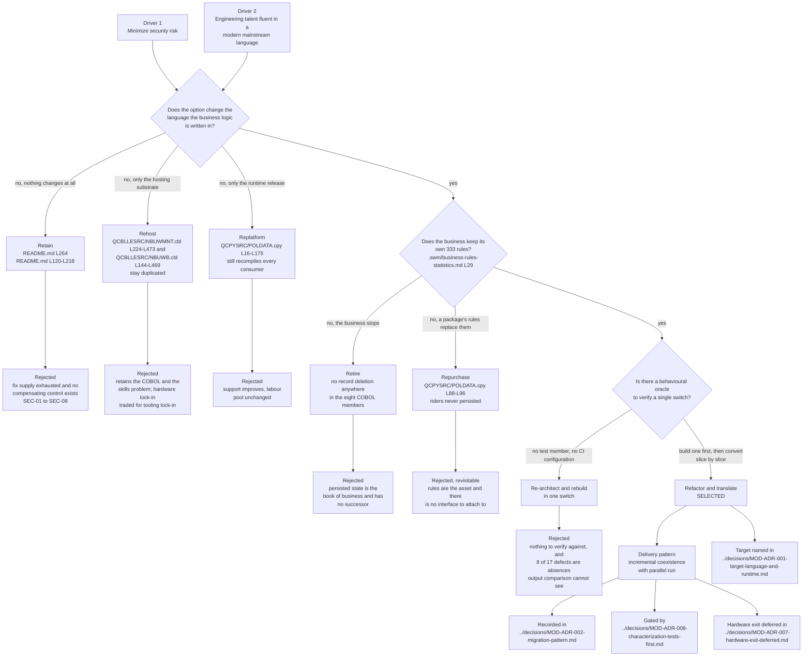

# Migration Strategy: Options and Selection

This document answers one question and commits to one answer: given the two business drivers this programme was given, which modernization strategy should LIFE400 follow. It disposes of all seven strategy archetypes against this specific estate — retain, retire, rehost, replatform, repurchase, refactor and re-architect — selects exactly one, and states the LIFE400-specific reason each of the other six is rejected, so that the recommendation is auditable rather than asserted. It is the foundational document of the migration layer: every document after it assumes the archetype and the delivery pattern selected here.

**Scope.** It owns three things and nothing else: the disposition of each of the seven archetypes against this estate, the selection, and the argument that this estate's size cuts in two directions at once. It deliberately does **not** contain the plan — the dependency-ordered stages, with their entry criteria, exit criteria and verification, are [the recommended path](02-recommended-path.md). Nor does it re-derive the facts it reasons over. The member register and the estate's size belong to [the system inventory](../current-state/01-system-inventory.md); the duplication and divergence measurements to [the current-state architecture](../current-state/02-architecture-current-state.md); the platform support position to [the platform and support status document](../current-state/03-platform-and-support-status.md); the rule census to [the business rule inventory](../current-state/05-business-rule-inventory.md); the defect dispositions to [the known defects and stubs register](../current-state/07-known-defects-and-stubs.md); the security findings to [the security risk register](../risk/01-security-risk-register.md); and the choice of target language, runtime and datastore to [the target-language decision matrix](../talent/02-target-language-decision-matrix.md). Each is cited here; none is restated as a competing figure.

**Reading the citations.** A citation of the form `[<path>:<locator>]` is plain text rather than a hyperlink, and points at a path in this repository. A plain-text citation stays meaningful in a diff and does not depend on a hosting provider's line-anchor syntax. Every line range cited below was opened against the working tree and the construct at that range confirmed to be the one the claim describes; no range is carried forward from a prior description. No source member was altered to produce this document — the request was to plan modernization, not to perform it. Platform terms link to [the IBM i glossary](../reference/glossary-ibm-i.md) on first use in this document.

**Attribution of external figures, and the absence of a build.** Strategy selection is the one subject in this assessment that cannot be settled from the repository alone, because a strategy is judged partly on how comparable programmes have gone. This document therefore carries more third-party material than any other in the migration layer, and every figure taken from outside is attributed to the publisher that states it, named in the external sources footer, and **never presented as a measurement of LIFE400 or as a projection for this programme**. No cost, effort, duration, headcount or calendar figure is asserted for this programme anywhere below; ordering is expressed as dependency, never as schedule. Two kinds of interval nevertheless appear, and neither is planning content: an interval the estate itself implements as a business rule, such as the grace basis [QCPYSRC/POLDATA.cpy:L46] or the reinstatement window [QCPYSRC/POLDATA.cpy:L49], and a period a third party reports about a programme of its own. Finally, nothing here was verified by execution and nothing could be — no command available to this assessment can compile, bind or run LIFE400, and the estate holds no test member to run — so every claim about this system rests on a citation a reader can resolve rather than on a build.

## The two business drivers as selection criteria

The business named two drivers and no others: minimize security risk, and acquire engineering talent fluent in a modern mainstream language. Those two are the whole of the evaluation basis used below. Cost, performance and feature growth are not stated drivers and are not smuggled in as if they were. The drivers are stated in full, and converted into the measurable criteria `SC-1.1` through `SC-1.9` and `SC-2.1` through `SC-2.9`, in [the business drivers and success criteria baseline](../01-business-drivers-and-success-criteria.md); they are not restated here beyond what selecting a strategy requires.

What the drivers do here is narrow the field before any option is examined in detail, because published modernization practice maps drivers onto archetypes rather than recommending an archetype in the abstract. Practitioner accounts of legacy modernization are consistent on the mapping and it is directly applicable to this case: **a cost-reduction or hardware-exit driver points toward rehosting or replatforming**, because those change where a system runs while leaving what it is written in alone, whereas **a skills-shortage and maintainability driver points toward refactoring toward a mainstream language**, because only a change of language changes the labour pool. The pair of drivers this programme was given is exactly the second pair. That is not a coincidence to be noted and passed over — it is the single strongest structural reason the selection below comes out as it does, and it means any option that leaves the estate written in [ILE](../reference/glossary-ibm-i.md#ile-integrated-language-environment) COBOL, [ILE CL](../reference/glossary-ibm-i.md#cl-control-language) and fixed-format [DDS](../reference/glossary-ibm-i.md#dds-data-description-specifications) starts the evaluation having already failed one of the two drivers outright.

| Driver | What it rules in | What it rules out | Why, in one line |
|--------|------------------|-------------------|------------------|
| Driver 1 — minimize security risk | Any option that moves the business logic off a release line for which no fix is issued, and that admits controls where the estate has none | Retain, and any option whose only security contribution is a change of hosting substrate | Five of the eight registered findings are classed absent rather than weak, so the security half of this case is the introduction of controls, not the strengthening of existing ones — see [the security risk register](../risk/01-security-risk-register.md) |
| Driver 2 — acquire talent fluent in a modern mainstream language | Only options that change the language the business logic is written in | Retain, rehost and replatform, each of which preserves the language and therefore the labour pool | The estate demands four platform-specific competencies at once, not in the alternative — see [the skills inventory and gap analysis](../talent/01-skills-inventory-and-gap.md) |

A third consideration is applied throughout, and it is deliberately not called a driver, because the business did not state it: **feasibility.** An option that serves both drivers on paper and cannot be executed safely against this estate is not a recommendation. The feasibility constraint here is specific and it is severe, and it is the subject of the next section.

## What makes this estate distinctive

Generic modernization advice is worthless here, because the strategy that suits an estate is a function of the estate. Twelve facts about LIFE400 change the calculus, each established in the source or in the document that owns it. They are listed together because several of them only become decisive in combination — the estate's small size and its complete absence of tests, for instance, pull in opposite directions and have to be weighed against each other rather than in turn.

| # | Fact about this estate | Evidence | Why it changes the strategy calculus |
|---|------------------------|----------|--------------------------------------|
| 1 | The whole estate is 4,126 lines across 24 members — 2,827 lines of ILE COBOL in eight programs, 336 lines of ILE CL in five, 175 lines in one [copybook](../reference/glossary-ibm-i.md#copybook) and 788 lines of DDS in ten members — turning into 23 independently compiled objects plus that copybook, which compiles to no object of its own | The register that establishes every figure member by member is [the system inventory](../current-state/01-system-inventory.md) | Exhaustive discovery is achievable. Every member can be read in full and every rule anchored, so strategies that depend on complete knowledge of the estate are available here and would not be on a large one |
| 2 | There is no test member anywhere and no continuous-integration configuration of any kind | The documented build is a sequence of platform commands with no test step and no scanning step among them [README.md:L120-L218], registered as `SEC-08` in [the security risk register](../risk/01-security-risk-register.md) | There is no behavioural oracle. Any option that rewrites logic is unguarded until one is built, which is why a behavioural safety net is a prerequisite rather than a phase of the work |
| 3 | The declared runtime baseline is `ILE COBOL V3R7 · OS/400 V4R2 · IBM AS/400 Model 9406` [README.md:L264] | Support status is established, with attribution, in [the platform and support status document](../current-state/03-platform-and-support-status.md) | Retain is not a neutral option. Doing nothing is an active choice to keep the business logic on a layer whose fix supply is exhausted |
| 4 | Each of the three business domains is implemented twice, and the two implementations of new business share nine identically named [paragraphs](../reference/glossary-ibm-i.md#paragraph) that must be kept in step by hand | `1100-LOAD-PLAN-PARAMETERS` through `1900-EVALUATE-REFERRALS` at [QCBLLESRC/NBUWMNT.cbl:L224-L473] and again at [QCBLLESRC/NBUWB.cbl:L144-L469]; the measurements belong to [the current-state architecture](../current-state/02-architecture-current-state.md) | Any option that preserves the source preserves the obligation to edit two places for one rule change, which is the maintainability half of Driver 2 restated as a code property |
| 5 | The duplication reaches the formulae, not just the labels, and the arithmetic contract is truncation | The same gross, tax, total and modal computation, with the same modal divisors and loading factors, at [QCBLLESRC/NBUWB.cbl:L436-L464] and split across [QCBLLESRC/SVCBILB.cbl:L513-L521] and [QCBLLESRC/SVCBILB.cbl:L526-L543]; no copy carries a rounding phrase, and no arithmetic statement anywhere in the eight COBOL members carries one | A rehost or a replatform carries a truncation-dependent monetary calculation forward in two places permanently. A conversion has to reproduce truncation deliberately, which it can only do if it knows the contract — and the contract is implicit in the absence of a keyword |
| 6 | The claims pair has diverged rather than merely duplicated: the interactive path hardcodes its exclusion windows while the batch path computes them from per-plan parameters | `2 * 365` at [QCBLLESRC/CLMMNT.cbl:L214] and [QCBLLESRC/CLMMNT.cbl:L229], against the parameter-driven forms at [QCBLLESRC/CLMADJB.cbl:L206-L207] and [QCBLLESRC/CLMADJB.cbl:L233-L234] over [QCPYSRC/POLDATA.cpy:L47] and [QCPYSRC/POLDATA.cpy:L48] | A divergence has to be resolved before conversion, and resolving it is a business decision rather than a technical one. No option that preserves both paths forces the question to be asked |
| 7 | Two classes of statement in the servicing programs would not compile as written | Dispositioned as `DEF-17` in [the known defects and stubs register](../current-state/07-known-defects-and-stubs.md), over [QCBLLESRC/SVCBILB.cbl:L372], [QCBLLESRC/SVCBILB.cbl:L359], [QCBLLESRC/SVCBILB.cbl:L381], [QCBLLESRC/SVCMNT.cbl:L290] and [QCBLLESRC/SVCMNT.cbl:L307] | Lift-and-shift is not available as a no-touch operation. Every option, including the ones that claim to preserve the source unchanged, has to modify source before anything builds |
| 8 | LIFE400 has no application programming interface of any kind — no transport, protocol, socket, broker, remote call or interchange format anywhere in the 24 members | The measured absence is owned by [the target architecture](../target-state/01-target-architecture.md) | It removes the usual justification for two options at once. Repurchase and rehost are commonly defended on integration continuity, and there is no integration to continue |
| 9 | The behaviour a target must reproduce is 333 documented business rules [.swm/business-rules-statistics.md:L29], and only the three batch programs carry inline rule identifiers at all | The census, and its reconciliation against earlier published figures, is owned by [the business rule inventory](../current-state/05-business-rule-inventory.md) | The acceptance oracle has to be constructed rather than inherited. The rules are documented in prose but most are not tied to a line of source, so a conversion cannot be checked rule by rule until they are |
| 10 | No program in the estate issues a record deletion, so data accumulates for as long as the files exist | The census belongs to [the current-state architecture](../current-state/02-architecture-current-state.md); the exposure is analysed in [the compliance and data-protection document](../risk/02-compliance-and-data-protection.md) | The persisted state is the book of business and nothing has ever been removed from it. That argues for migrating the data, and against any option that abandons it |
| 11 | One production library holds everything and one [job queue](../reference/glossary-ibm-i.md#job-queue) serves all batch work, with no development or staging separation | The library is created as a single production library [README.md:L125]; one queue is created [README.md:L199-L200] and the nightly job is scheduled under the same job description [README.md:L209-L211], with the serialization consequence owned by [the operational model](../current-state/06-operational-model.md) | Any option that involves running old and new side by side needs an environment that does not exist today, and standing one up is itself work the strategy must account for |
| 12 | The nightly grace and lapse sweep is a stub: one call carrying sentinel literals where an iteration over the policy master belongs [QCLSRC/DLYUPD.clle:L75] | Dispositioned `implement` as `DEF-01` in [the known defects and stubs register](../current-state/07-known-defects-and-stubs.md) | Part of what the business believes it has is not there. An option that preserves current behaviour faithfully preserves a sweep that does nothing, so faithfulness alone is not the goal |

Three of those twelve are strong enough to carry the argument on their own, and each deserves stating at length rather than in a table cell.

### Duplication is provable at formula level, not only by paragraph name

That two members share nine paragraph names is suggestive. That they compute the same money the same way is decisive, and it is checkable line by line.

The batch new-business program's total-premium paragraph builds a gross annual premium from base premium, rider total and policy fee, applies the tax rate to it, adds the tax to reach a total annual premium, then selects a modal divisor and a loading factor from the billing mode and divides and multiplies to reach the modal premium [QCBLLESRC/NBUWB.cbl:L436-L464]. The batch servicing program does the identical thing across two paragraphs — the same three-term gross, the same tax product and the same total at [QCBLLESRC/SVCBILB.cbl:L513-L521], and the same billing-mode selection with the same four divisors and the same four loading factors, followed by the same divide-and-multiply, at [QCBLLESRC/SVCBILB.cbl:L526-L543]. These are not two implementations of a shared idea. They are the same arithmetic written twice, in two members, for two occasions on which a policy's premium has to be worked out.

One property of both copies matters more than the duplication itself. **Neither applies a rounding phrase, and no arithmetic statement anywhere in the eight COBOL members does.** Across every arithmetic statement in the estate there is not one rounding request, so every intermediate and every result is truncated to the declared scale of its receiving field. That is the monetary contract of this system, and it is expressed by an absence rather than by a declaration — which is exactly the kind of contract a conversion breaks silently. A target that rounds where the legacy system truncates will differ in the last place on a large fraction of policies, and will differ in a way that looks like a rounding preference rather than like the defect it is.

The consequence for strategy is direct. Rehosting and replatforming both preserve this state of affairs indefinitely: two copies of one calculation, in two members, each depending on an unstated truncation contract, each needing to be found and edited whenever a rate, a fee or a mode changes. Neither option makes the duplication visible, and neither creates the single place where the contract could be written down.

### The claims pair has diverged rather than merely duplicated

The new-business pair was copied and kept close. The claims pair was copied and then edited, and the two paths now answer differently. The interactive program fixes its contestability window and its suicide window in the code, computing each as `2 * 365` at [QCBLLESRC/CLMMNT.cbl:L214] and [QCBLLESRC/CLMMNT.cbl:L229]. The batch program computes the same two windows from per-plan parameters carried in the shared contract, at [QCBLLESRC/CLMADJB.cbl:L206-L207] and [QCBLLESRC/CLMADJB.cbl:L233-L234], reading the two-digit parameter fields at [QCPYSRC/POLDATA.cpy:L47] and [QCPYSRC/POLDATA.cpy:L48]. On today's products the two agree, because every path that sets those parameters sets both to two. They would part company the moment a product is issued with any other value, and nothing in the estate guards against that.

A second divergence in the same pair is not latent at all. The batch program carries an investigation rule with no interactive counterpart: an accidental, homicide or unknown cause of death with medical records not received is forced to a pending investigation [QCBLLESRC/CLMADJB.cbl:L220-L226]. The interactive program collects the medical-records flag from the screen and moves it into the shared contract [QCBLLESRC/CLMMNT.cbl:L144] — and then never tests it. The field is captured and discarded, so the same claim can be adjudicated on the interactive path without the investigation the batch path would have required.

This is the fact that most changes what a strategy has to do, because **a divergence cannot be resolved by reading the source: the source is what disagrees.** Which of the two answers is correct is a business question about how claims are meant to be adjudicated, and it has to be settled before either behaviour is converted rather than during. [The known defects and stubs register](../current-state/07-known-defects-and-stubs.md) reaches the same conclusion from the defect side, dispositioning the divergence families as behaviour that is carried forward only once each family has been settled as a business decision. No option that preserves both paths forces the question to be asked, which means retain, rehost and replatform all carry two contradictory adjudication rules forward untouched and unnoticed.

### Two classes of statement would not compile as written

The options that sound least invasive all rest on an unexamined premise: that the source, whatever else is wrong with it, builds. For this estate that premise does not hold. Two classes of statement in the servicing programs would not compile as written — one assigns to an item its own program never declares, through a qualifier used nowhere else in the estate [QCBLLESRC/SVCBILB.cbl:L372], and four leave an inline loop by a form the language does not define [QCBLLESRC/SVCBILB.cbl:L359], [QCBLLESRC/SVCBILB.cbl:L381], [QCBLLESRC/SVCMNT.cbl:L290], [QCBLLESRC/SVCMNT.cbl:L307]. The disposition of both, and the reasoning behind it, belongs to [the known defects and stubs register](../current-state/07-known-defects-and-stubs.md).

Two things follow, and the second is the one usually missed. The first is that no option is a no-touch option: whatever is chosen, source has to change before anything builds, so the supposed safety of leaving the code alone is not on offer. The second is that this cannot be verified here in either direction — no command available to this assessment can compile ILE COBOL, so the claim is a reading of the language against the source rather than a compiler diagnostic, and it is recorded as such. That is precisely why it belongs in a strategy document: an option whose plan begins "recompile the existing members" has an unquantified discovery of this kind waiting inside it, and an option that reads and rewrites every member finds it as a matter of course.

## The seven archetypes evaluated

The seven archetypes below are the consensus decision frame in published modernization practice — retain, retire, rehost, replatform, repurchase, refactor and re-architect — and that practice is equally consistent that the archetype is chosen per system rather than imposed across an estate. Each row therefore states what the archetype would concretely mean for LIFE400, the reason specific to this estate that it is rejected or selected, and the verdict against each stated driver. A generic reason would be no reason at all.

**Exactly one row is selected.** Six are rejected, and each rejection names the property of this estate that disqualifies the option rather than a general objection to the category.

| Archetype | What it would mean for LIFE400 | The LIFE400-specific reason | Driver 1 | Driver 2 | Verdict |
|-----------|--------------------------------|-----------------------------|----------|----------|---------|
| **Retain** — do nothing | Keep the 24 members, the declared baseline `ILE COBOL V3R7 · OS/400 V4R2 · IBM AS/400 Model 9406` [README.md:L264] and the manual build [README.md:L120-L218] exactly as they are | The baseline's fix supply is exhausted, a position established with attribution in [the platform and support status document](../current-state/03-platform-and-support-status.md), and the estate has no compensating control to put in its place: five of the eight findings in [the security risk register](../risk/01-security-risk-register.md) are classed absent rather than weak, and the census establishing that no identity, role, permission or encryption logic exists anywhere belongs to [the current-state architecture](../current-state/02-architecture-current-state.md) | Fails outright | No effect | **Rejected** |
| **Retire** — decommission without replacement | Stop administering term-life policies on this system and absorb nothing | The system administers live contracts across the full policy lifecycle in three domains [README.md:L11-L17], and its persisted state is the book of business. No successor exists to absorb it, and no program in the estate has ever deleted a record — a census owned by [the current-state architecture](../current-state/02-architecture-current-state.md) — so nothing has been shed, which argues for migrating the data rather than abandoning it | Removes the exposure by removing the business | No effect | **Rejected** |
| **Rehost** — lift the same objects onto different hardware or an emulator | Move the compiled objects and their [physical files](../reference/glossary-ibm-i.md#physical-file) to another substrate and change nothing about what they are written in | It retains both the COBOL and the skills problem, trading hardware lock-in for tooling lock-in. The duplicated rating engines stay duplicated, the diverged claims windows stay diverged, the truncation-dependent arithmetic stays in two places, and the hiring pool stays exactly as narrow — this estate demands ILE COBOL, ILE CL, fixed-format DDS, [5250](../reference/glossary-ibm-i.md#5250-datastream) workstation input and output, and operating-system work management, all held at once | Addresses only the hosting substrate | Fails completely | **Rejected** |
| **Replatform** — same language, modernized runtime | Recompile the ILE COBOL on a supported platform release, keeping the DDS-defined persistence and the shared copybook | It improves the support position and changes nothing the talent driver asks about. The language stays, DDS stays as the only definition of persistence, [record-level I/O](../reference/glossary-ibm-i.md#record-level-io) stays as the only access model, and the shared contract stays a textual include — so every consumer still recompiles when the contract changes [QCPYSRC/POLDATA.cpy:L16-L175] | Improves fix supply, closes no application finding | Fails | **Rejected** |
| **Repurchase** — replace with a commercial policy administration package | Retire the estate's logic in favour of a bought product and configure the book of business into it | Rejected on the evidence of this estate rather than on principle. The 333 documented business rules [.swm/business-rules-statistics.md:L29] are the differentiating asset a package would ask the business to give up; there is no integration surface anywhere in the 24 members to attach a package to; and the rider structure a package would have to accept is not even persisted today — the shared contract defines a rider table repeating five times [QCPYSRC/POLDATA.cpy:L88-L96] with no counterpart in any DDS file | Depends entirely on the product's own posture | Would serve it, by removing the code | **Rejected, revisitable** |
| **Refactor / translate** — move the business logic to a mainstream language | Convert the eight COBOL programs and the five ILE CL programs counted in [the system inventory](../current-state/01-system-inventory.md) into a mainstream-language service estate, with DDS-defined files becoming a relational schema and the character screens becoming a modern interface | The only archetype that serves both drivers at once. Changing the language changes the labour pool, which is Driver 2 restated as a code property; and every control the register calls absent is introduced as the code is written rather than bolted onto a layer with no fix supply, which is Driver 1. It is also the only archetype that forces the duplication to collapse and the divergences to be settled, because both survive any option that keeps the source | Served — controls introduced, not retrofitted | Served — the language, and therefore the pool, changes | **SELECTED** |
| **Re-architect / rebuild** — start again from a specification | Discard the estate and rebuild the three domains from a statement of what they should do | Nearly selected, and rejected on one fact: there is no test member anywhere and no continuous-integration configuration, so a rebuild has no behavioural oracle to verify itself against — across 333 documented rules of which only the three batch programs carry any inline identifier tying a rule to a line. Worse, eight of the seventeen entries in [the known defects and stubs register](../current-state/07-known-defects-and-stubs.md) are absences rather than errors and would survive any amount of output comparison, so a rebuild cannot even discover what it is missing by comparing results | Would serve it, in full | Would serve it | **Rejected** |

### What refactoring and translating means concretely here

Two things have to be said about the selected archetype so that it is a decision rather than a slogan, and neither is re-argued here because neither is owned here.

**The target is named, not left abstract.** Driver 2 is unsatisfiable if "a modern language" stays a category, because the identity of the language is the variable the business asked to resolve. The named target for the core is **Java on a current long-term-support release, with Spring Boot and PostgreSQL**, with **C#/.NET** as the runner-up; monetary values are held and computed in an exact decimal type at the precision the estate uses and never in binary floating point. The weighted evaluation that produces that answer, including the criteria under which TypeScript, Python and Go were considered and not selected for the core, is [the target-language decision matrix](../talent/02-target-language-decision-matrix.md), and the decision itself is recorded in [MOD-ADR-001, target language and runtime](../decisions/MOD-ADR-001-target-language-and-runtime.md). This document names the target so the selected archetype is concrete; it does not weigh the alternatives again.

**Translation is assisted, not automatic, and the strategy has to plan for the residue rather than assume it away.** Published vendor and practitioner accounts of automated COBOL-to-Java and COBOL-to-C# conversion report coverage in the range of roughly 70 to 85 per cent of code, with the remainder requiring manual work. That figure is reproduced here as those publishers state it; **it is not a measurement of LIFE400 and not a projection for this programme**, and no comparable figure for this estate exists or could be produced without attempting the conversion. Its only use in this document is directional, and the direction it establishes matters: an option presented as a mechanical translation is not one, so the residue — the part a converter leaves behind — is exactly where this estate's specific hazards live. The truncation contract expressed by an absent keyword, the two paths that disagree, and the statements that would not compile as written are all in that residue. A capability class rather than any named product or licence is what the plan calls for, and no tool selection is made anywhere in this assessment.

### The delivery shape that follows from the selection

An archetype is not a plan, and the archetype alone does not say whether the conversion arrives all at once or in pieces. Those are two decisions, and both are recorded in [MOD-ADR-002, migration pattern](../decisions/MOD-ADR-002-migration-pattern.md).

- **The archetype is refactor and translate**, for the reasons in the table above.
- **The delivery pattern is incremental coexistence with parallel run**, in the strangler-fig shape published practice describes: new services run alongside the live system behind a facade, each new capability takes over a slice of behaviour, and legacy modules are retired one at a time only after the new path has been shown to answer identically. The alternative — converting everything and switching once — is the big-bang shape rejected in the last row of the table, and it is rejected for the same reason there: with no behavioural oracle in the estate, a single switch has nothing to check itself against.
- **The AS/400 hardware exit is a separate decision and is explicitly deferred**, recorded in [MOD-ADR-007, hardware exit deferred](../decisions/MOD-ADR-007-hardware-exit-deferred.md). The language-and-skills driver is separable from the hardware-exit driver, and conflating them is a documented anti-pattern: the finding is about an operating-system release, so the programme gets scoped as a hardware migration, and the language question that actually motivated it is absorbed into a far larger and far riskier decision. [The platform and support status document](../current-state/03-platform-and-support-status.md) supplies the platform evidence for that separation.

One further consequence of the selection belongs here rather than in the plan, because it constrains the plan rather than following from it. The estate has one production library and one job queue with no development or staging separation [README.md:L125], [README.md:L199-L200], so **an incremental pattern requires an environment that does not exist today**. That is not an objection to the pattern; it is the first thing the pattern needs, and it is why the recommended path opens where it does.

## Why the estate's size cuts both ways

Estate size is the fact most often used to settle a strategy question, and here it settles nothing on its own, because it pushes in two opposite directions at once. Both halves of the argument have to be made, because taking only one produces the wrong answer — the first half alone recommends a rewrite, and the second alone recommends leaving well enough alone.

### The tractable direction: small enough to know completely

At 4,126 lines across 23 independently compiled objects plus one copybook, figures owned by [the system inventory](../current-state/01-system-inventory.md), LIFE400 is small enough that every member can be read in full, every paragraph enumerated, every persisted column inventoried and every documented rule anchored to a line of source. That is not a comfort; it is a capability, and it is the capability the whole recommended path depends on. A behavioural inventory of the entire estate is achievable here, so a strategy whose safety rests on exhaustive discovery is genuinely available.

On an estate two orders of magnitude larger it would not be. Complete discovery would be out of reach, so the strategy would have to be one that tolerates partial knowledge — a facade over a black box, a rehost that defers the question, or a package purchase that discards it. This estate does not force that compromise, and declining a compromise that is not forced is one of the few unambiguous advantages the size confers. It is also why this document sits after the current-state layer rather than before it: the discovery was within reach, so it was done first, and the strategy is chosen against measured facts rather than against an impression of them.

### The dangerous direction: small enough to look easy

The same number invites the opposite conclusion — that 4,126 lines is a couple of services' worth of code and could simply be rewritten from a description of what it does. That is the trap, and this estate is unusually well equipped to spring it.

The first reason is the one already established: there is no test member anywhere and no continuous-integration configuration, so a rewrite has nothing to verify itself against. The second is that behavioural density and line count are unrelated here. 333 documented business rules [.swm/business-rules-statistics.md:L29] are packed into those lines, and most are not tied to a source line at all, since only the three batch programs carry inline rule identifiers.

The third reason is the sharpest, and it is worth stating as a concrete illustration rather than as a caution, because it is the exact mechanism by which a competent rewrite silently changes results. **Dates in this estate are numbers, and every interval a rule tests is the integer difference of two eight-digit `YYYYMMDD` values treated as a count of days.** Attained age is the issue age plus that difference divided by 365 [QCBLLESRC/SVCBILB.cbl:L189-L191]. Days since last payment, the quantity the grace and lapse transitions are decided on, is the process date minus the paid-to date [QCBLLESRC/SVCBILB.cbl:L198-L199], compared against the plan's grace basis [QCPYSRC/POLDATA.cpy:L46]. Days since issue, the quantity both claims exclusions are decided on, is the date of death minus the issue date [QCBLLESRC/CLMADJB.cbl:L204-L205] and again inside the suicide-window evaluation [QCBLLESRC/CLMADJB.cbl:L233-L236].

Subtracting two `YYYYMMDD` integers does not yield elapsed days. It yields a number that happens to approximate elapsed days within a single month and diverges from it across every month and year boundary, because the subtraction carries the decimal structure of the encoding rather than a calendar. A reasonable engineer rewriting these rules from a specification would write elapsed-day arithmetic, because elapsed days are obviously what the rules mean — and in doing so would change which policies enter grace, which policies lapse, which reinstatements are inside the window [QCPYSRC/POLDATA.cpy:L49], which deaths fall inside contestability and which suicides fall inside the exclusion. Every one of those outcomes would move, none of the changes would announce itself, and each would look like the code being correct. That is why the estate's own arithmetic is treated as behaviour to be captured before it is improved, and why [the known defects and stubs register](../current-state/07-known-defects-and-stubs.md) records it as behaviour to migrate with each boundary restated deliberately rather than as a bug to be fixed in passing.

### What the size therefore argues for

Read together, the two halves converge. Size argues **for** incremental refactoring with a behavioural safety net, because complete discovery is achievable and incremental replacement can therefore be verified slice by slice. Size argues **against** doing nothing, because a small estate is not a hard estate to move. And size argues **against** rewriting wholesale, because the property that makes a rewrite look modest — the line count — is unrelated to the property that makes it dangerous, which is behavioural density with no oracle.

Published modernization practice reaches the same two conditions from the other direction, and both are attributed rather than asserted as findings of this repository: discovery is named as the success factor that separates programmes that work from programmes that do not, and characterization tests are named as the prerequisite without which refactoring is unsafe. This assessment is built in that order — the current-state layer precedes this document, and [MOD-ADR-008, characterization tests first](../decisions/MOD-ADR-008-characterization-tests-first.md) records the gate that no module is converted before its behavioural suite passes against the legacy system.

## Selection

**LIFE400 is modernized by refactoring and translating its business logic into a mainstream language — Java on a current long-term-support release, with Spring Boot and PostgreSQL — delivered incrementally as coexisting services behind a facade, with a characterization-test safety net established before any module is converted and a parallel run proving output parity before any module is cut over.**

That is the recommendation, and it is one sentence because it is one decision. Its consequences, each of which lands on a document of its own, are these.

- **The language changes, so the labour pool changes.** This is the only mechanism by which Driver 2 can be satisfied, and the reason every option preserving ILE COBOL was rejected regardless of its other merits.
- **Security controls are introduced as the code is written, not retrofitted onto an unsupported layer.** Five of the eight registered findings are absences, so there is nothing to strengthen and everything to build — and the one moment at which a control can be built without disturbing working behaviour is the moment the behaviour is being written. The control design is [the target security control design](../target-state/04-security-control-design.md).
- **Each domain ends with one implementation of its rules instead of two.** The nine duplicated paragraphs and the twice-written monetary calculation collapse into a single rules service per domain, recorded in [MOD-ADR-004, single domain rules service](../decisions/MOD-ADR-004-single-domain-rules-service.md).
- **Every divergence becomes a decision.** The claims windows and the investigation rule cannot be converted until the business says which behaviour is correct, so the divergence families become explicit inputs to the plan rather than surprises inside it.
- **Behavioural capture precedes conversion, without exception.** No module is converted before its characterization suite passes against the legacy system, which is the gate in [MOD-ADR-008](../decisions/MOD-ADR-008-characterization-tests-first.md) and the strategy in [the characterization test strategy](05-characterization-test-strategy.md).
- **A non-production environment is a prerequisite, not a convenience.** One production library and one job queue serve everything today [README.md:L125], [README.md:L199-L200], so the environment the incremental pattern needs has to be created before the pattern can start.
- **The hardware question stays open on purpose.** Nothing above commits to where the resulting system runs, which is [MOD-ADR-007](../decisions/MOD-ADR-007-hardware-exit-deferred.md).
- **Nothing about this selection is a schedule.** It is an ordering by dependency. No stage in the path that follows carries a date, a duration or a staffing figure, and none should be inferred from the order in which the stages appear.

## Rejected options, with reasons

The table above is the audit record in compressed form. This section is the same record in prose, so the reasoning survives being read without the table — and so that anyone proposing one of these options later meets the specific reason it was set aside rather than a cell in a grid.

**Retain is rejected because doing nothing is a decision with a direction.** The estate's declared runtime baseline [README.md:L264] sits outside the set of releases for which fixes are issued, a position established with attribution in [the platform and support status document](../current-state/03-platform-and-support-status.md). An unsupported layer is survivable when the application above it compensates, and this application does not: `SEC-01` through `SEC-08` in [the security risk register](../risk/01-security-risk-register.md) record five findings as absent, two as undeclared and one as misapplied, which is a system that delegated every control to the platform rather than one whose controls have weakened. Retain therefore fails Driver 1 in the strongest available sense — it leaves the single exposure that no application change can reach — and contributes nothing at all to Driver 2, because nothing about the languages or the hiring pool changes.

**Retire is rejected because there is nothing to retire into.** LIFE400 administers live term-life contracts across three business domains — new business and underwriting, servicing and billing, and claims adjudication, each with a batch program, an interactive program and a submitter of its own [README.md:L11-L17] — and the state it holds is the book of business itself. Nothing in the repository indicates a redundant or superseded function, and one property of the estate makes the point sharply: no program anywhere issues a record deletion, a census owned by [the current-state architecture](../current-state/02-architecture-current-state.md), so nothing has ever been removed from that state and there is no archive or purge path behind which a decommissioning could hide. The right reading of that fact is the opposite of retirement — the data has to be carried forward, which is why [the data migration runbook](04-data-migration-runbook.md) exists as a stage of the recommended path rather than as an afterthought.

**Rehost is rejected, and it is rejected hardest, because it is the option most likely to be proposed.** Rehosting is attractive precisely because it answers the question the platform finding appears to ask: the release is unsupported, so move it. But the drivers this programme was given are not a hosting problem. Rehosting trades hardware lock-in for tooling lock-in and leaves every property that produced the talent driver exactly in place — the estate still demands ILE COBOL, ILE CL, fixed-format DDS, character-screen input and output and platform work management held simultaneously, a demand analysed in [the skills inventory and gap analysis](../talent/01-skills-inventory-and-gap.md). It also leaves every maintainability liability untouched: nine identically named paragraphs still have to be edited in two members for one rule change [QCBLLESRC/NBUWMNT.cbl:L224-L473], [QCBLLESRC/NBUWB.cbl:L144-L469]; one monetary calculation still exists twice [QCBLLESRC/NBUWB.cbl:L436-L464], [QCBLLESRC/SVCBILB.cbl:L513-L521], [QCBLLESRC/SVCBILB.cbl:L526-L543]; and two claims paths still answer differently [QCBLLESRC/CLMMNT.cbl:L214], [QCBLLESRC/CLMADJB.cbl:L206-L207]. Published practice makes the same point in general terms — rehosting retains the language and therefore the skills problem — and this estate supplies the specifics that make it concrete.

**Replatform is rejected because it fixes the layer nobody asked about and leaves the layer they did.** Recompiling the ILE COBOL against a supported release genuinely improves the fix-supply position, which is a real contribution to Driver 1 and is worth saying plainly. It contributes nothing to Driver 2. The language is unchanged, so the labour pool is unchanged. DDS remains the only definition of persistence, so no schema, constraint or query capability appears. Record-level I/O remains the only access model. And the shared contract remains a textual include expanded into each consumer [QCPYSRC/POLDATA.cpy:L16-L175], so a change to one field still obliges a recompilation of every program that copies it — a coupling that is invisible in any single member and is one of the reasons this estate is hard to change safely. Replatforming also inherits, rather than resolves, the finding that two classes of statement would not compile as written, because a recompilation is precisely the operation that meets them.

**Repurchase is rejected on this estate's evidence, and the rejection is explicitly revisitable.** Buying a policy administration capability is a legitimate strategic answer for many books of business and it is a business decision rather than a technical one, so it is dispositioned here without prejudice and with the reasons stated so they can be re-examined. Three facts count against it here. The first is that the 333 documented business rules [.swm/business-rules-statistics.md:L29] are the asset — underwriting classification, rating factors, rider validation, grace and lapse transitions, contestability and suicide exclusions, settlement deductions — and a package asks the business to trade its own rules for the package's. The second is that there is nothing to attach a package to: the estate has no interface of any kind, a measured absence owned by [the target architecture](../target-state/01-target-architecture.md), so a package integration is a greenfield build rather than a connection. The third is the most telling: a package would have to accept a rider structure this system does not store, because up to five riders per policy are computed and displayed and never persisted [QCPYSRC/POLDATA.cpy:L88-L96] — so even describing the current book of business to a prospective package requires the work the recommended path does first. No product, vendor or licence is named or evaluated anywhere in this assessment.

**Re-architect and rebuild from scratch is rejected, and it came closest to being selected.** At 4,126 lines, a figure owned by [the system inventory](../current-state/01-system-inventory.md), the estate is small enough that a rebuild does not look absurd, and a rebuild would serve both drivers — it changes the language and it introduces every absent control. It is rejected on the absence of a behavioural oracle. There is no test member anywhere in the repository and no continuous-integration configuration, and the documented build carries no test or scanning step [README.md:L120-L218], so nothing in the estate states what correct behaviour is; the only statement of behaviour is the source, and most of the documented rules are not tied to a line of it, since only the three batch programs carry inline rule identifiers at all, a census owned by [the business rule inventory](../current-state/05-business-rule-inventory.md). A rebuild in that position is asked to reproduce 333 rules [.swm/business-rules-statistics.md:L29] with no way to check that it has. And [the known defects and stubs register](../current-state/07-known-defects-and-stubs.md) makes it worse rather than better: eight of its seventeen entries are capabilities the system declares and does not deliver, which means they would survive any amount of output comparison — a rebuild comparing its results against the legacy system's would see agreement precisely where the legacy system does nothing.

The published record on that choice is worth reproducing, with its attribution intact and its limits stated. Practitioner accounts of incremental modernization report programmes running without production outages while retiring legacy capability progressively, one such account reporting a reduction of roughly 30 per cent in mainframe capacity over three years with no outage in production; and the widely reported counter-example is a single big-bang migration in a regulated financial institution that produced remediation costs reported in the hundreds of millions of pounds. **Neither figure is a measurement of LIFE400 and neither is a projection for this programme.** They are reproduced only as published outcomes of other programmes, which is the only weight they can carry: they establish that the choice between incremental and single-switch delivery has been consequential elsewhere, and nothing more. The same body of practice names two conditions on which incremental refactoring depends — discovery before strategy, and characterization tests as the prerequisite without which refactoring is unsafe — and both are honoured in the shape of this assessment: the current-state layer precedes this document, and no conversion begins before a passing behavioural suite exists, which is recorded in [MOD-ADR-008, characterization tests first](../decisions/MOD-ADR-008-characterization-tests-first.md).

## D-14 — The strategy option decision tree

The tree reads top to bottom. Both stated drivers enter one gate, and each subsequent gate is a question the estate itself answers, so every branch is decided by evidence rather than by preference. Each rejected branch terminates in the reason it is rejected, and every node naming a real artifact carries its member path inside the label, so the diagram carries its own traceability and does not depend on the prose around it. Three properties of the shape are worth reading off it deliberately: the first gate eliminates three archetypes at once and eliminates them on Driver 2 alone; the second gate is a business question rather than a technical one; and the third gate is the only one whose answer the estate could change, because a behavioural oracle can be built and everything else on the tree is a property of what the estate already is.

D-14 is owned by this document. It appears nowhere else in the assessment, and no other document reproduces it.

## Governing decision records

Four records govern this document. Each is linked rather than summarised, so that superseding one changes a single file and leaves this evaluation intact — and so that the reasoning behind a reversible choice lives in exactly one place.

- [MOD-ADR-002, migration pattern](../decisions/MOD-ADR-002-migration-pattern.md) — **the governing record for this document.** It carries both halves of the selection: the archetype, and the incremental coexistence pattern with parallel run through which it is delivered. The drivers it rests on are the ones evaluated above, chiefly the absence of any test member and any continuous-integration configuration, and the estate size handed forward by [the system inventory](../current-state/01-system-inventory.md).
- [MOD-ADR-001, target language and runtime](../decisions/MOD-ADR-001-target-language-and-runtime.md) — governs which language the selected archetype translates into. This document names the target so the selection is concrete; the record owns the choice, and [the target-language decision matrix](../talent/02-target-language-decision-matrix.md) owns the evaluation behind it.
- [MOD-ADR-007, hardware exit deferred](../decisions/MOD-ADR-007-hardware-exit-deferred.md) — governs the separation of the language-and-skills question from the hardware question, which is why nothing above commits to where the resulting system runs.
- [MOD-ADR-008, characterization tests first](../decisions/MOD-ADR-008-characterization-tests-first.md) — governs the gate that makes the selected archetype safe. It is the record the rebuild rejection turns on: the same absence that disqualifies a single switch is the absence this record obliges the programme to close before any conversion.

## Where this leads

This document ends at the selection. What the selection becomes — the stages in dependency order, each with its entry criteria, the work it contains, its exit criteria and the method by which its exit is verified — is [the recommended path](02-recommended-path.md), and every stage there presupposes the archetype and the pattern chosen here.

The remaining documents in this layer each expand one consequence of the selection: how new and legacy run together is [coexistence and integration](03-coexistence-and-integration.md); how the data moves is [the data migration runbook](04-data-migration-runbook.md); how the behavioural safety net is built is [the characterization test strategy](05-characterization-test-strategy.md); how parity is proved is [parallel run and output parity](06-parallel-run-and-output-parity.md); how each slice is cut over and reversed is [cutover and rollback](07-cutover-and-rollback.md); and how the legacy objects are finally retired is [decommissioning](08-decommissioning.md). If the selection above were changed, every one of those documents would have to be rewritten — which is the reason the selection is recorded as a decision with a status rather than asserted as a conclusion.

## Figures owned by other documents

This document owns the disposition of the seven archetypes, the selection, and the size argument. Every other quantity it cites has exactly one owning document, and restating one here would create a second place for it to be wrong.

- The member set, per-member line counts, the language distribution and the object reconciliation — [the system inventory](../current-state/01-system-inventory.md).
- The duplication and divergence measurements, the paragraph inventories, and the censuses of what the estate does not contain — [the current-state architecture](../current-state/02-architecture-current-state.md).
- Platform support status and every external figure supporting it — [the platform and support status document](../current-state/03-platform-and-support-status.md).
- Column inventories, field types and the persisted-versus-transient classification — [the current data model](../current-state/04-data-model-current-state.md).
- The business-rule census, the inline identifier bands and the anchored-versus-unanchored split — [the business rule inventory](../current-state/05-business-rule-inventory.md).
- Work-management object roles, queue behaviour, the nightly schedule and the build sequence — [the operational model](../current-state/06-operational-model.md).
- The disposition of every defect, stub and inert feature named above — [the known defects and stubs register](../current-state/07-known-defects-and-stubs.md).
- Severity, impact and the closing control for each security finding — [the security risk register](../risk/01-security-risk-register.md) — with the designs in [the target security control design](../target-state/04-security-control-design.md).
- Atomicity, recovery objectives and reconciliation, which constrain how a cutover can be reversed — [the continuity and recovery risk document](../risk/03-continuity-and-recovery-risk.md).
- The competencies the estate demands and the target skill set — [the skills inventory and gap analysis](../talent/01-skills-inventory-and-gap.md).
- The weighted evaluation of candidate languages, the exact-decimal filter and every labour-market figure — [the target-language decision matrix](../talent/02-target-language-decision-matrix.md).
- Target layers, service boundaries and the absence of any interface in the estate today — [the target architecture](../target-state/01-target-architecture.md).
- Definitions of every platform term used above — [the IBM i glossary](../reference/glossary-ibm-i.md).

## Source citations

Every member and document this file cites, grouped by class. No member was modified, and no file in the machine-generated corpus was hand-edited or reproduced with its generator tags.

- ILE COBOL — `QCBLLESRC/NBUWB.cbl`, `QCBLLESRC/NBUWMNT.cbl`, `QCBLLESRC/SVCBILB.cbl`, `QCBLLESRC/SVCMNT.cbl`, `QCBLLESRC/CLMADJB.cbl`, `QCBLLESRC/CLMMNT.cbl`
- ILE CL — `QCLSRC/DLYUPD.clle`
- Shared copybook — `QCPYSRC/POLDATA.cpy`
- Repository overview — `README.md` at the repository root, cited in plain text rather than linked, because a link out of the documentation tree cannot resolve in a built site
- Machine-generated corpus, read as reference and never edited — `.swm/business-rules-statistics.md`, the authoritative count of documented business rules
- Modernization set, top level — `01-business-drivers-and-success-criteria.md`
- Current-state layer — `current-state/01-system-inventory.md`, `current-state/02-architecture-current-state.md`, `current-state/03-platform-and-support-status.md`, `current-state/04-data-model-current-state.md`, `current-state/05-business-rule-inventory.md`, `current-state/06-operational-model.md`, `current-state/07-known-defects-and-stubs.md`
- Risk layer — `risk/01-security-risk-register.md`, `risk/02-compliance-and-data-protection.md`, `risk/03-continuity-and-recovery-risk.md`
- Talent layer — `talent/01-skills-inventory-and-gap.md`, `talent/02-target-language-decision-matrix.md`
- Target-state layer — `target-state/01-target-architecture.md`, `target-state/04-security-control-design.md`
- Migration layer — `migration/02-recommended-path.md`, `migration/03-coexistence-and-integration.md`, `migration/04-data-migration-runbook.md`, `migration/05-characterization-test-strategy.md`, `migration/06-parallel-run-and-output-parity.md`, `migration/07-cutover-and-rollback.md`, `migration/08-decommissioning.md`
- Decision log — `decisions/MOD-ADR-001-target-language-and-runtime.md`, `decisions/MOD-ADR-002-migration-pattern.md`, `decisions/MOD-ADR-004-single-domain-rules-service.md`, `decisions/MOD-ADR-007-hardware-exit-deferred.md`, `decisions/MOD-ADR-008-characterization-tests-first.md`
- Reference layer — `reference/glossary-ibm-i.md`

### External sources

Strategy selection cannot be settled from this repository, so the material below is taken from publishers and attributed to them. Locations are given as plain text for the same reason source citations are. **No figure below is a measurement of LIFE400, and none is a projection for this programme.**

- Strategy archetypes and the mapping from driver to archetype — practitioner and vendor modernization material at `softwaremining.com`, `tech-stack.com`, `hicronsoftware.com`, `softwaremodernizationservices.com`, `codedistrict.com` and `ztabs.co`: the seven-archetype decision frame, the position that the archetype is chosen per system rather than imposed across an estate, the mapping of a cost or hardware-exit driver onto rehosting and replatforming and of a skills and maintainability driver onto refactoring, and the characterisation of rehosting as retaining both the language and the skills problem while trading hardware lock-in for tooling lock-in.
- Incremental replacement behind a facade — `martinfowler.com/bliki/StranglerFigApplication.html`: the strangler-fig pattern, in which a new system runs alongside the live one and takes over behaviour progressively while the legacy modules are retired one at a time.
- Discovery as the success factor, and characterization tests as the prerequisite for safe refactoring — legacy-code modernization material at `sourcegraph.com` and `mecanik.dev`, alongside the strategy sources named above.
- Automated conversion coverage — the same vendor and practitioner material: automated COBOL-to-Java and COBOL-to-C# conversion reported at roughly 70 to 85 per cent of code, with the remainder requiring manual work. Reproduced as a directional figure only; no tool, vendor or licence is named or recommended anywhere in this assessment.
- Contrasting programme outcomes — the same body of practitioner reporting: an incremental modernization programme reported as reducing mainframe capacity by roughly 30 per cent over three years with no production outage, against a widely reported single-switch migration in a regulated financial institution whose remediation costs were reported in the hundreds of millions of pounds. Both are outcomes those publishers report about other programmes.
