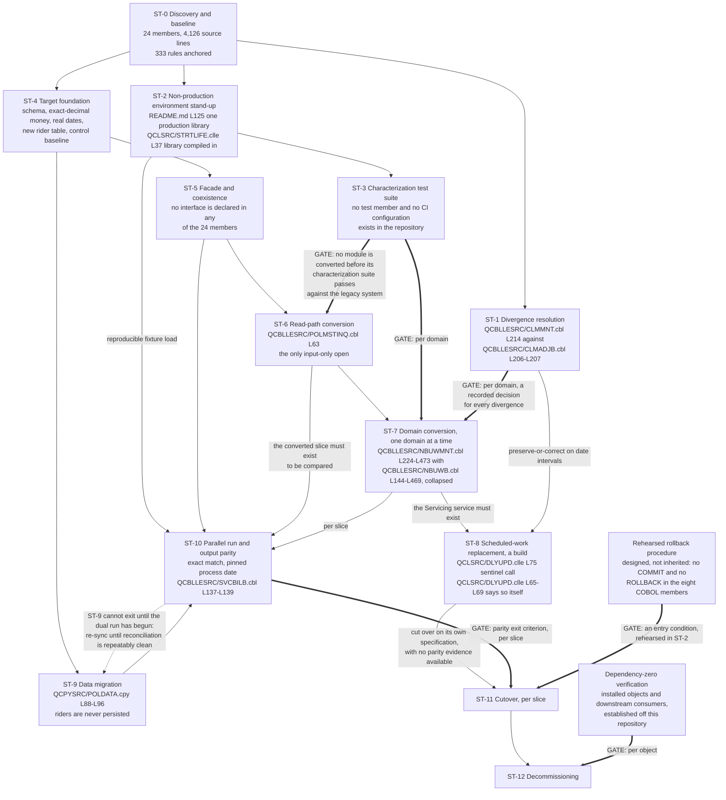

# Recommended Migration Path

This document answers the request that opened this assessment — the ask to plan modernization — with the plan itself: a set of stages in dependency order, each carrying its entry criteria, the work it contains, its exit criteria, and the method by which its exit is verified. It is deliberately narrow about what it decides. It does **not** select the strategy; the archetype and the delivery pattern are settled in [the strategy options and selection document](01-strategy-options-and-selection.md) and are sequenced here rather than re-argued. It does **not** describe the destination; that is the [target-state layer](../target-state/01-target-architecture.md), which owns every service name, column type and control this plan refers to. And it does **not** contain the procedures; coexistence, data migration, characterization testing, output parity, cutover and decommissioning each have a document of their own, and each stage below names the one that details it. What this document owns, and what nothing else in the set owns, is the **stage set, the dependency edges between the stages, and the criteria at each boundary.** Because the six documents after it expand stages defined here, the stage identifiers below are shared vocabulary: `ST-7` means the same thing in every document in this layer.

**Reading the citations.** A citation of the form `[<path>:<locator>]` is plain text rather than a hyperlink and points at a path in this repository. Plain text is deliberate: a citation stays meaningful in a diff and does not depend on a hosting provider's line-anchor syntax. Every line range below was opened against the working tree and the construct at that range confirmed to be the one the claim describes; no range is carried forward from a prior description of it. Forward-looking material — an entry criterion, a unit of work, an exit criterion, a verification method — is a proposal rather than a claim about the existing system and carries no citation, because there is nothing yet to cite. Every statement about what the system does **today** carries one. Platform terms link to [the IBM i glossary](../reference/glossary-ibm-i.md) on first use in this document. No source member was altered to produce this plan: the request was to plan modernization, not to perform it, and this document performs none of the work it sequences.

## The recommendation

**LIFE400 is modernized by refactoring and translating its business logic into a mainstream language — Java on a current long-term-support release, with Spring Boot, on PostgreSQL — delivered incrementally as coexisting services behind a facade, with a characterization-test safety net established before any module is converted, a parallel run proving output parity before any module is cut over, and the AS/400 hardware exit deferred and decoupled from the language decision.**

Four things about that sentence are settled elsewhere and are consumed here rather than re-derived. The archetype and the delivery pattern are two independent decisions, both taken in [the strategy options and selection document](01-strategy-options-and-selection.md), and this plan preserves the separation: nothing below sequences a rebuild, and nothing below assumes a single switch. The target language, support line and framework are settled by [the target-language decision matrix](../talent/02-target-language-decision-matrix.md) and recorded in [MOD-ADR-001](../decisions/MOD-ADR-001-target-language-and-runtime.md); **no release number, framework minor or datastore major is pinned by this assessment**, so no stage below is contingent on one. Monetary values are held and computed in an exact decimal type at the precision the estate already uses and never in binary floating point, which is `SC-2.4` in [the business drivers and success criteria baseline](../01-business-drivers-and-success-criteria.md). And the deferral of the hardware question is a decision in its own right, to be recorded in the planned [MOD-ADR-007](../decisions/MOD-ADR-007-hardware-exit-deferred.md), which is why no stage below moves a machine.

## How to read this plan

### No stage in this plan is a schedule

**This plan contains no dates, no durations, no calendar sequencing and no effort or staffing figures, and none should be inferred from it.** Every ordering statement below expresses a **dependency** and nothing else: a stage that "cannot begin until" another is complete is describing a prerequisite, not a position in a timeline. Three consequences follow, and all three are intended.

- **Stage numbers are dependency positions, not periods of time.** `ST-0` is the stage nothing depends on and `ST-12` is the stage everything depends on. A higher number means more prerequisites, not later in a calendar, and no number denotes an interval of any kind.
- **Stages may overlap wherever their dependency edges permit, and several deliberately do.** `ST-1`, `ST-2` and `ST-4` share a single prerequisite and constrain each other not at all, so nothing in this plan requires them to be worked one at a time. The dependency graph, not this document's ordering, is what forbids an overlap — where no edge exists between two stages, none is implied.
- **A stage is complete when its exit criteria are met, not when a period ends.** Every exit criterion below is a condition a reader can evaluate as satisfied or unsatisfied.

Two kinds of interval nevertheless appear below and neither is planning content. The first is an interval the estate itself implements as a business rule — the grace basis [QCPYSRC/POLDATA.cpy:L46], the reinstatement window [QCPYSRC/POLDATA.cpy:L49], and the contestability and suicide windows [QCPYSRC/POLDATA.cpy:L47], [QCPYSRC/POLDATA.cpy:L48] — each of which is a property of the system being migrated and is cited as such. The second is the estate's own recurring work, whose scheduler entry is part of the as-built system [README.md:L209-L211]. Neither is a statement about how this programme is sequenced.

### The four headings every stage carries

Each stage below is expressed in the same four parts, in the same order, so that two stages can be compared without reading either in full.

- **Entry criteria** — what must be true before the stage can begin. This is where every dependency edge is stated.
- **Work** — what the stage contains, and which document details it. Where a sibling document owns a procedure, this plan names the stage and hands the procedure over rather than duplicating it.
- **Exit criteria** — the conditions under which the stage is complete. Where a criterion already exists as an `SC-1.x` or `SC-2.x` success criterion in [the business drivers and success criteria baseline](../01-business-drivers-and-success-criteria.md), that criterion is referenced rather than restated, so the programme has one definition of success rather than two.
- **Verification** — the concrete, checkable artifact or condition that demonstrates the exit criteria are met. Read the next subsection before reading any of them.

### What verification can and cannot mean here

One constraint governs every verification method in this document, and stating it plainly is more useful than working around it.

**No command available to this assessment can compile, bind or execute LIFE400.** ILE COBOL and [ILE](../reference/glossary-ibm-i.md#ile-integrated-language-environment) [CL](../reference/glossary-ibm-i.md#cl-control-language) require the IBM i platform, and no off-platform compiler for either exists; the estate's build is a sequence of platform commands [README.md:L120-L218] that can only be issued on the machine. **Nor is there a test suite to run:** the repository holds no test member and no test-runner configuration of any kind, and the documented build carries no test step and no scanning step among its eight steps [README.md:L120-L218].

Three rules follow, and they are applied uniformly below.

- **No stage's verification is described as "the build proves it" for any behavioural claim about the legacy system.** No build can, because no build of the legacy system is available here.
- **Verification of a claim about the legacy system is by citation and human review.** That is why every such claim in this document carries a resolvable citation: the citation *is* the verification mechanism, and a reader who doubts a claim can open the member and settle it.
- **The characterization suite runs against the legacy system on the platform itself.** That is a programme activity performed on an IBM i, not something this repository can execute, and `ST-3` is written accordingly — its exit is a suite that has been *run* on the platform and whose results have been recorded, which this document can specify and cannot perform.

The distinction matters most at `ST-3` and `ST-10`, the two stages whose entire purpose is behavioural evidence. Both are specified here as programme activities with recorded outputs. Neither is, or could be, a check this documentation set runs.

## Stage summary

Thirteen stages. The identifiers are stable and are used verbatim by the six documents that expand them.

| Stage | Name | Cannot begin until | Detailed by |
|---|---|---|---|
| `ST-0` | Discovery and baseline | nothing — it is first in dependency order | [The current-state layer](../current-state/01-system-inventory.md), which is written |
| `ST-1` | Divergence resolution | `ST-0` is complete | This document, referring each case to [the known defects and stubs register](../current-state/07-known-defects-and-stubs.md) |
| `ST-2` | Non-production environment stand-up | `ST-0` is complete | This document, exiting against `SC-1.9` |
| `ST-3` | Characterization test suite | `ST-2` has produced an environment that can be loaded and observed | [The characterization test strategy](05-characterization-test-strategy.md) |
| `ST-4` | Target foundation | `ST-0` is complete and the target data model is settled | [The target data model and schema mapping](../target-state/03-target-data-model-and-schema-mapping.md) and [the target security control design](../target-state/04-security-control-design.md) |
| `ST-5` | Facade and coexistence | `ST-4` has produced a running target foundation | [Coexistence and integration](03-coexistence-and-integration.md) |
| `ST-6` | Read-path conversion | `ST-3` covers the read path and `ST-5` is in place | [The program-to-service map](../target-state/02-program-to-service-map.md), with parity governed by `ST-10` |
| `ST-7` | Domain conversion, one domain at a time | per domain: `ST-1` has settled that domain's divergences, `ST-3` passes for it, and `ST-6` is complete | [The program-to-service map](../target-state/02-program-to-service-map.md) |
| `ST-8` | Scheduled-work replacement | `ST-7` has produced the Servicing service | This document, with the destination owned by [the program-to-service map](../target-state/02-program-to-service-map.md) |
| `ST-9` | Data migration | `ST-4` has produced the target schema | [The data migration runbook](04-data-migration-runbook.md) |
| `ST-10` | Parallel run and output parity | `ST-3` passes, `ST-5` is in place, and `ST-9` has performed an initial load | [Parallel run and output parity](06-parallel-run-and-output-parity.md) |
| `ST-11` | Cutover, per slice | `ST-10` has met its parity exit criterion for the slice, and a rehearsed rollback procedure exists for it | [Cutover and rollback](07-cutover-and-rollback.md) |
| `ST-12` | Decommissioning | `ST-11` has cut over every slice and dependency-zero is verified | [Decommissioning](08-decommissioning.md) |

Two stages are worth flagging in the table itself because their edges are less obvious than the rest. `ST-9` appears between `ST-8` and `ST-10` by number, but **it cannot exit before `ST-10` has begun** — the reason is in its own subsection and in the dependency rationale. And `ST-11` is per slice rather than a single event, so it recurs: the plan cuts over each converted slice under the same procedure rather than accumulating slices for one crossing.

**One status note covering the whole right-hand column.** Of the documents named there, the current-state and target-state layers are written and can be read now; **the six documents in this layer that detail individual stages — [coexistence and integration](03-coexistence-and-integration.md), [the data migration runbook](04-data-migration-runbook.md), [the characterization test strategy](05-characterization-test-strategy.md), [parallel run and output parity](06-parallel-run-and-output-parity.md), [cutover and rollback](07-cutover-and-rollback.md) and [decommissioning](08-decommissioning.md) — are planned and not one of them has been written yet**, and neither has the planned [source citation index](../reference/source-citation-index.md) that `ST-0` verifies against. Each is linked at its exact path so the forward dependency is unambiguous the moment it exists, and each is named as the owner of a procedure this document deliberately does not duplicate. Where a stage below hands work to one of them, the hand-off is a statement about ownership rather than a claim that the procedure is already specified. The decision records are in the same position and their status is given individually under [governing decision records](#governing-decision-records).

## The stages

### ST-0 — Discovery and baseline

The stage nothing depends on, and the one every other stage rests on. It is placed first for a reason external to this repository: practitioner modernization commentary consistently names discovery before strategy as the factor separating programmes that work from programmes that do not. That is an attributed qualitative position rather than a measurement of anything, and it is grouped as such in the external sources footer of [the strategy options and selection document](01-strategy-options-and-selection.md), which consulted it. This assessment was built in that order, which is why `ST-0` is substantially already done: the [current-state layer](../current-state/01-system-inventory.md) is written, and this stage's remaining content is the completion and verification of it.

#### ST-0 entry criteria

None. `ST-0` has no prerequisite, and no other stage may begin before it is complete.

#### ST-0 work

Establish the as-built baseline across the whole estate — every member, every persisted column, every documented rule, the operational contract, and every defect, stub and inert feature — and cite it, so that no later stage asserts a fact about LIFE400 that a reader cannot resolve. The seven documents of the [current-state layer](../current-state/01-system-inventory.md) are that baseline: the member register, the architecture with its duplication and divergence measurements, the platform support position, the data model, the business-rule inventory, the [operational model](../current-state/06-operational-model.md), and [the known defects and stubs register](../current-state/07-known-defects-and-stubs.md).

Exhaustive discovery is achievable here and that is the property this stage exploits. The estate is 24 members and 4,126 source lines — 2,827 lines of ILE COBOL in eight programs, 336 lines of ILE CL in five, 175 lines in one [copybook](../reference/glossary-ibm-i.md#copybook) and 788 lines of [DDS](../reference/glossary-ibm-i.md#dds-data-description-specifications) across ten members — compiling to 23 independently compiled objects plus that copybook, which compiles to no object of its own. Every figure member by member is owned by [the system inventory](../current-state/01-system-inventory.md) and is not restated as a second count anywhere in this plan. At that size every member can be read in full, so a strategy whose safety rests on complete knowledge is genuinely available rather than aspirational.

#### ST-0 exit criteria

- Every one of the 24 members is referenced by at least one document in the assessment, with no member left uncovered. The five ILE CL members, the copybook and the ten DDS members had no dedicated documentation of any kind before this work, so this criterion is the one that closes the largest gap in the as-built record.
- Every row of [the known defects and stubs register](../current-state/07-known-defects-and-stubs.md) carries a disposition. That register owns the disposition verbs; this plan references them and assigns none.
- The behavioural population a target must reproduce is enumerated: 333 documented business rules [.swm/business-rules-statistics.md:L29], each with a stable identifier and a source anchor, which is `SC-2.5`. Only the three batch programs carry inline rule identifiers at all, so most of that population has no anchor until this stage supplies one — the census and its bands are owned by [the business rule inventory](../current-state/05-business-rule-inventory.md), and no count from it is restated here.

#### ST-0 verification

The citation-resolution check, which extracts every `[<path>:<locator>]` reference from the documentation set and asserts that each path exists and each line range lies inside the file it names; and the planned [source citation index](../reference/source-citation-index.md), the inverse index from each of the 24 members to the documents that analyse it, in which a member with no entry is a visible gap rather than an assumed one. Both are mechanical. Neither validates a behavioural claim, and neither is presented as doing so — a resolvable citation proves that a reader can check the claim, not that the claim is true, which is why the accuracy gate for behaviour is human review of a resolvable citation rather than a command.

### ST-1 — Divergence resolution

Each of the three business domains is implemented twice, and the two implementations do not merely duplicate each other — in places they disagree. **A conversion cannot be faithful to two different answers**, so every disagreement has to be resolved before the domain that contains it is converted. The resolution is a business decision and not a technical one, for a reason that is worth stating precisely: the source is what disagrees, so reading the source harder cannot settle which behaviour is correct.

#### ST-1 entry criteria

`ST-1` cannot begin until `ST-0` is complete, because a divergence cannot be referred for decision until it has been found, cited on both sides, and classified. The complete inventory of differences, with both sides cited, is owned by [the current-state architecture](../current-state/02-architecture-current-state.md) and collected as `DEF-07` in [the known defects and stubs register](../current-state/07-known-defects-and-stubs.md).

#### ST-1 work

Obtain and record a business decision for each divergence. Four cases are named here because each one changes a result that a customer or a claimant experiences, and each is cited on both sides so the question can be put to the business without further investigation.

- **The claims exclusion windows are compiled in on one path and parameterised on the other.** The interactive program fixes both windows in code, computing each as `2 * 365` [QCBLLESRC/CLMMNT.cbl:L214], [QCBLLESRC/CLMMNT.cbl:L229]. The batch program computes the same two windows from per-plan parameters [QCBLLESRC/CLMADJB.cbl:L206-L207], [QCBLLESRC/CLMADJB.cbl:L233-L234], reading the two-digit parameter fields in the shared contract [QCPYSRC/POLDATA.cpy:L47], [QCPYSRC/POLDATA.cpy:L48]. On today's products the two agree, because the batch path's own plan-parameter load sets both parameters to the value the literal already holds [QCBLLESRC/CLMADJB.cbl:L142-L163]; the classification of that agreement as latent rather than active belongs to [the current-state architecture](../current-state/02-architecture-current-state.md). They part company the moment a product is issued with any other value, and nothing in the estate guards against that. **The decision is whether the windows are a product term or a company-wide constant** — and it must be taken before the claims domain is converted, because the two answers produce different target schemas, not merely different code.
- **The batch path carries an investigation rule with no interactive counterpart.** An accidental, homicide or unknown cause of death with medical records not received is forced to a pending investigation on the batch path [QCBLLESRC/CLMADJB.cbl:L220-L226]. The interactive path has no such test, so the same claim can be adjudicated there without the investigation the batch path would have required. **The decision is whether that investigation is required**, and it cannot be inferred from the code, because the code answers both ways.
- **A declined application leaves different evidence depending on which path processed it.** The batch error paragraph sets the declined contract status [QCBLLESRC/NBUWB.cbl:L507]; the interactive path displays the outcome and persists no equivalent. **The decision is whether a declined application is a persisted fact.** If it is, the target needs the status and the record that carries it; if it is not, the batch behaviour is the anomaly.
- **The date-interval arithmetic**, which has a subsection of its own immediately below because it is the case most likely to be settled quietly by whoever writes the code.

Two properties of this stage are worth making explicit. It is **per divergence, not per domain**, so a domain with three unresolved divergences has three decisions to obtain and is not blocked as a whole by any one of them. And it is **the only stage in this plan whose work is performed by the business rather than by engineering** — engineering's contribution is the citation that makes the question answerable.

#### ST-1 exit criteria

A recorded decision exists for every divergence in the domain about to be converted. "Recorded" means written where a later reader will find it: either a decision record in [the decision log](../decisions/MOD-ADR-001-target-language-and-runtime.md) series, or the corresponding row of [the known defects and stubs register](../current-state/07-known-defects-and-stubs.md). An undocumented verbal agreement does not satisfy this criterion, because the whole purpose of the stage is that the target's behaviour can be traced to a decision rather than to a preference.

#### ST-1 verification

Each divergence is traceable to a recorded decision — a decision record, or a row of [the known defects and stubs register](../current-state/07-known-defects-and-stubs.md), which owns the disposition verb for every row it holds. The check is a completeness check over the divergence inventory: no divergence in a domain entering conversion is without a decision. Note what this verification is not: it does not assert that the recorded decision is the commercially correct one. That judgement is the business's, and this plan's contribution is to make sure the question was asked before the code was written rather than after.

### The date-interval decision — the `ST-1` case that must not be settled by an engineer

**Dates in this estate are numbers, and every interval a rule tests is the integer difference of two eight-digit `YYYYMMDD` values treated as a count of days.** Four instances carry business consequences.

| Interval | How it is computed today | Evidence |
|---|---|---|
| Attained age | Issue age plus the difference of process date and issue date, divided by 365 | [QCBLLESRC/SVCBILB.cbl:L189-L191] |
| Days since last payment — the quantity the grace and lapse transitions are decided on | Process date minus paid-to date, compared against the plan's grace basis [QCPYSRC/POLDATA.cpy:L46] | [QCBLLESRC/SVCBILB.cbl:L198-L199] |
| Days since issue — the quantity both claims exclusions are decided on | Date of death minus issue date | [QCBLLESRC/CLMADJB.cbl:L204-L205] |
| The suicide-window comparison | The same difference, tested against the window computed from the plan parameter | [QCBLLESRC/CLMADJB.cbl:L233-L236] |

Subtracting two `YYYYMMDD` integers does not yield elapsed days. It yields a number that approximates elapsed days inside a single month and diverges from it across every month and year boundary, because the subtraction carries the decimal structure of the encoding rather than a calendar. The target converts those columns to a real date type, a decision to be recorded in the planned [MOD-ADR-006](../decisions/MOD-ADR-006-date-and-decimal-representation.md), **so the operands change meaning and the arithmetic cannot simply be transcribed.** Whoever writes the target code therefore faces a choice at the moment of writing it, and this is the hazard: the natural choice is elapsed-day arithmetic, because elapsed days are obviously what the rules mean.

**Making that natural choice is a deliberate behaviour change and requires business sign-off. It is not a bug fix to be slipped in.** Correcting the arithmetic moves which policies enter grace, which policies lapse, which reinstatements fall inside the window [QCPYSRC/POLDATA.cpy:L49], which deaths fall inside contestability and which suicides fall inside the exclusion. Every one of those outcomes moves, none of the movements announces itself, and each looks like the code finally being right. `ST-1` must therefore obtain an explicit **preserve-or-correct** decision covering all four instances before the servicing and claims domains are converted, and whichever way it goes the target restates the behaviour deliberately rather than inheriting it. If the decision is to preserve, `ST-3` captures the existing boundaries as the expected results and `ST-10` compares against them; if the decision is to correct, the affected characterization expectations are changed **by that decision and with it cited**, so that a parity failure at `ST-10` is recognisable as the intended change rather than investigated as a defect. The classification of this behaviour is `DEF-14` in [the known defects and stubs register](../current-state/07-known-defects-and-stubs.md), which owns its disposition.

### ST-2 — Non-production environment stand-up

The stage the delivery pattern needs before it can start at all. An incremental pattern verifies each slice against the running legacy system, and both the behavioural capture at `ST-3` and the dual run at `ST-10` require somewhere other than production to do it — **and that place does not exist today.**

#### ST-2 entry criteria

`ST-2` cannot begin until `ST-0` is complete, because the environment has to reproduce a known configuration and the configuration surface is part of the baseline; it is inventoried by [the operational model](../current-state/06-operational-model.md). `ST-2` has no other prerequisite, and in particular it does not depend on `ST-1` or `ST-4` — the three share one prerequisite and no edge joins them.

#### ST-2 work

Create an environment that can be loaded with fixture data, driven, and observed, without touching production. Two properties of the estate make this a unit of work rather than a formality, and both are cited because both are claims about the system as it is.

- **There is one production library and no development or staging counterpart.** The library is created as a single production library [README.md:L125], and the whole estate — source, compiled objects, data files and work-management objects — lives in it. The consequence for recovery is registered as `CR-06` in [the continuity and recovery risk document](../risk/03-continuity-and-recovery-risk.md); the consequence for this plan is that there is no second environment to borrow.
- **The library name is compiled into the source that reaches it.** The session entry program calls the menu by qualified name [QCLSRC/STRTLIFE.clle:L37], and the nightly driver redirects both its files to the same qualified library [QCLSRC/DLYUPD.clle:L60-L61] using an [override](../reference/glossary-ibm-i.md#override). Standing up a second environment therefore cannot be done by pointing the application somewhere else; it requires that the coupling be addressed, which is exactly `SC-1.9`.

One further item belongs to this stage rather than to conversion, and it is easy to miss because it contradicts an assumption every other stage would otherwise inherit — that the source in this repository is the source the running system was built from. Two classes of statement in the servicing programs would not compile as written: one assigns to an item its own program never declares, through a qualifier used nowhere else in the estate [QCBLLESRC/SVCBILB.cbl:L372], and four leave an inline loop by a form the language does not define [QCBLLESRC/SVCBILB.cbl:L359], [QCBLLESRC/SVCBILB.cbl:L381], [QCBLLESRC/SVCMNT.cbl:L290], [QCBLLESRC/SVCMNT.cbl:L307]. That reading is `DEF-17` in [the known defects and stubs register](../current-state/07-known-defects-and-stubs.md), which owns its disposition, and it is a reading of the language against the source rather than a compiler diagnostic, because no compiler is available here. **`ST-2` is where it is settled**, since building the estate into a second environment is the first activity that puts the question to an actual compiler. Two outcomes are possible and the stage must accommodate both: the members build and the reading was wrong, or they do not and the repository source differs from what produced the installed objects — in which case reconciling the two is a prerequisite for `ST-3`, because a characterization suite captured from a different build than the one in production characterizes the wrong system.

#### ST-2 exit criteria

- An environment exists that is not production, can be loaded with a known fixture set, can be driven through both the interactive and the queued paths, and can be observed without disturbing the live book of business.
- `SC-1.9` is satisfied for everything the environment needs: every environment-specific value is supplied from outside the built artifact, so standing up a further environment requires no source change. This criterion is referenced rather than restated because it is owned by [the business drivers and success criteria baseline](../01-business-drivers-and-success-criteria.md), where it is included deliberately as the criterion that blocks the others in practice.
- The relationship between the repository's source and the objects the environment runs is established and recorded, so that `ST-3` knows which artifact it is characterizing.

#### ST-2 verification

A named, repeatable load-and-observe procedure: a documented fixture set, a documented sequence that drives the estate through it, and a documented means of reading the resulting state — executed twice from a clean load with the same recorded outcome, which is what distinguishes a repeatable environment from one that happened to work once. Repeatability is not a nicety here; `ST-3` and `ST-10` both re-load this environment many times, and a fixture load that is not reproducible makes every result they produce unattributable.

### ST-3 — Characterization test suite

**The first technical stage, and the gate on every conversion stage in this plan.**

> **No module is converted before its characterization suite passes against the legacy system.**

That gate is to be recorded in the planned [MOD-ADR-008](../decisions/MOD-ADR-008-characterization-tests-first.md), and it is the single condition that makes the selected archetype safe. The estate's own state is the argument for it: **there is no test member anywhere and no continuous-integration configuration of any kind — no pipeline directory exists in the repository at all — and the documented build carries no test step and no scanning step among its eight steps** [README.md:L120-L218], a gap registered as `SEC-08` in [the security risk register](../risk/01-security-risk-register.md). A conversion begun in that state is unguarded, and the estate offers exactly one oracle: the running legacy system.

#### ST-3 entry criteria

`ST-3` cannot begin until `ST-2` has produced an environment that can be loaded with fixture data and observed, because a golden master captured from production would both risk the live book of business and be unreproducible. It does not depend on `ST-1`: a divergence can be captured as two distinct observed behaviours before anyone has decided which is correct, and capturing both is in fact the most useful thing to do with an unresolved divergence.

#### ST-3 work

Build the behavioural safety net. [The characterization test strategy](05-characterization-test-strategy.md) owns the fixture design, the per-paragraph capture approach, the coverage targets by rule band, and the assertion form for the return-code and message pair each program answers with; this plan states only the stage boundary and one prerequisite that stage cannot discover for itself.

**The process date must be pinned.** The servicing engine defaults its process date from the system clock when the field is unset [QCBLLESRC/SVCBILB.cbl:L137-L139], and the nightly driver retrieves the system date independently [QCLSRC/DLYUPD.clle:L45]. Every grace, lapse, attained-age, contestability and suicide-window outcome is therefore a function of when the capture ran. Unless the process date is supplied explicitly and identically on every run, **neither the golden master nor the `ST-10` comparison is reproducible**, and a difference between two runs cannot be attributed to the conversion rather than to the clock. The same pinning obligation applies at `ST-10`, where two systems must be given the same process date rather than each taking its own.

#### ST-3 exit criteria

- A characterization suite exists for the module about to be converted, has been run against the legacy system on the platform, and passes — with its results recorded, so that a later reader can see what the legacy system actually answered rather than what it was expected to answer.
- Coverage is expressed against the acceptance oracle rather than against lines: the population is the 333 documented business rules [.swm/business-rules-statistics.md:L29], each anchored by `ST-0`. Coverage targets by rule band belong to [the characterization test strategy](05-characterization-test-strategy.md).
- The expected results encode the legacy arithmetic contract rather than a conventional one. **No arithmetic statement anywhere in the eight COBOL members requests rounding**, so every intermediate and every result is truncated to the declared scale of its receiving field — the contract is expressed by an absence rather than by a keyword, which is exactly the kind of contract a conversion breaks silently. The parity consequence is that comparison is exact match rather than tolerance-banded, and [parallel run and output parity](06-parallel-run-and-output-parity.md) owns that policy.

#### ST-3 verification

Recorded results from a run against the legacy system on the platform, per module, at a pinned process date, reproducible from the `ST-2` fixture set. This is the clearest instance of the constraint stated above: **this repository cannot run that suite**, because the suite executes ILE COBOL on an IBM i. What can be checked here is that the suite exists, that its expectations are traceable to anchored rules, and that a recorded run exists for every module entering conversion. Whether the legacy system behaves as recorded is established on the platform, by the run, and not by any command in this repository.

### ST-4 — Target foundation

The destination's load-bearing structures, built before anything is converted into them. This stage is where the two contracts that every later stage depends on are established: how money is represented, and how dates are represented.

#### ST-4 entry criteria

`ST-4` cannot begin until `ST-0` is complete and the target data model is settled — settled meaning that [the target data model and schema mapping](../target-state/03-target-data-model-and-schema-mapping.md) states a target column, a target type and a transformation rule for every persisted column, because a foundation built against an unsettled schema is rebuilt rather than extended. It does **not** depend on `ST-3`: the target schema and the legacy behavioural capture constrain each other not at all, and nothing in this plan requires either to wait for the other.

#### ST-4 work

Stand up the target's persistence and control baseline. Every element is owned by a target-state document and is named here only so the stage boundary is unambiguous.

- **The relational schema**, with declared primary keys, foreign keys, constraints derived from the estate's coded domains, effective-dated product terms, and the character-encoding conversion — all owned by [the target data model and schema mapping](../target-state/03-target-data-model-and-schema-mapping.md). Every one of those is an addition rather than a translation: the estate declares no uniqueness and no referential integrity, and its coded domains live as [level-88 condition names](../reference/glossary-ibm-i.md#level-88-condition-name) in the shared contract [QCPYSRC/POLDATA.cpy:L16-L175] rather than as constraints.
- **The exact-decimal money contract.** Monetary values are held and computed in an exact decimal type at the precision the estate already uses and never in binary floating point, which is `SC-2.4`. The estate's own precision is declared twice, as a fifteen-digit two-decimal DDS column [QDDSSRC/POLMST.pf:L52] and as the corresponding [zoned decimal](../reference/glossary-ibm-i.md#zoned-decimal) item in the shared contract, and exactly one monetary item in the whole contract is signed [QCPYSRC/POLDATA.cpy:L106] — so the target's typing decision has to cover both the precision and the sign rather than only the precision.
- **The real-date contract**, converting the eight-digit integer date columns to a date type, to be recorded in the planned [MOD-ADR-006](../decisions/MOD-ADR-006-date-and-decimal-representation.md). This is the change that makes the `ST-1` date-interval decision unavoidable rather than optional.
- **The new rider table.** Up to five riders per policy are computed, priced and displayed and **none is persisted anywhere** — the shared contract declares five occurrences [QCPYSRC/POLDATA.cpy:L88-L96] with no counterpart in any DDS [physical file](../reference/glossary-ibm-i.md#physical-file). Riders therefore become first-class persisted entities in the target, to be recorded in the planned [MOD-ADR-009](../decisions/MOD-ADR-009-rider-persistence.md), and the table's design belongs to [the target data model and schema mapping](../target-state/03-target-data-model-and-schema-mapping.md).
- **The security control baseline** — authentication, the derived role model, authorization, encryption at rest and in transit, user-attributed audit records, secret handling and the scanning gate — every control owned by [the target security control design](../target-state/04-security-control-design.md), which names each one and traces it to the finding it closes.

The controls belong to the foundation rather than to a later stage for a reason that is specific to this estate and not a general preference. Five of the eight findings in [the security risk register](../risk/01-security-risk-register.md) are classed absent rather than weak, so there is nothing to strengthen and everything to build — and **the one point at which a control can be built without disturbing working behaviour is the point at which the behaviour is being written.** A control added after conversion is a change to code that is already in parity, which means re-establishing parity to add it.

#### ST-4 exit criteria

Stated by reference, because the programme should have one definition of success rather than two. `SC-1.1` — every register finding has a named closing control, and every named control exists in the design. `SC-1.3` — every action that creates or changes a policy, servicing or claim record is attributable to a named principal whose actor type is recorded. `SC-1.4` — access is differentiated by role, demonstrated by a function one role can reach and another cannot. `SC-1.5` and `SC-1.6` — personal and health data at rest is protected by a stated mechanism and every protected column is named individually, and a retention and erasure path exists for every table holding such data. `SC-1.7` — every channel carrying a request in is protected in transit by a named mechanism. `SC-1.8` — a dependency and security scan gates the path to production and a failing scan blocks it. `SC-2.4` — exact-decimal monetary arithmetic, with no monetary value passing through binary floating point. Each criterion's own verification method and evidence are given in [the business drivers and success criteria baseline](../01-business-drivers-and-success-criteria.md).

#### ST-4 verification

The schema exists with its keys and constraints declared, and each declaration is checkable by inspection of the target's own definition; each control named in [the target security control design](../target-state/04-security-control-design.md) is present and demonstrated by the case its own criterion specifies — `SC-1.4`, for instance, is demonstrated by an authorised and an unauthorised principal receiving different outcomes for the same request, which is an executable demonstration in the target and not a review comment. Note the asymmetry with `ST-3`: **the target can be built and run and tested here, and the legacy system cannot.** Verification of target artifacts is therefore genuinely mechanical, and no verification in this stage rests on a claim about the legacy system.

### ST-5 — Facade and coexistence

The stage that makes incremental delivery possible. Every subsequent conversion routes traffic through this stage's work, which is why it precedes any write migration.

#### ST-5 entry criteria

`ST-5` cannot begin until `ST-4` has produced a running target foundation, since a facade with nothing behind it can route nothing. It must be in place before any write path is converted, because a converted write path with no facade in front of it is a second uncoordinated writer to the same data.

#### ST-5 work

Place the facade, decide write ownership per slice, bridge the queued-work path, and keep the existing [5250](../reference/glossary-ibm-i.md#5250-datastream) path serving users until it is retired. [Coexistence and integration](03-coexistence-and-integration.md) owns all of it; two facts frame the stage and both are cited.

**The facade is net-new, because there is nothing to extend.** No application programming interface is declared anywhere in the 24 members — no transport, protocol, socket, broker, remote call or interchange format — a measured absence owned by [the target architecture](../target-state/01-target-architecture.md), which also states what that absence does *not* establish. A repository cannot show that no caller, no direct file reader and no operational integration exists outside it, so **external consumers are unknown rather than absent.** This plan carries that distinction forward deliberately rather than rounding it to "there are no integrations", because the same distinction decides `ST-12`.

**Coexistence is a period during which two systems write the same book of business, and the estate provides no mechanism to coordinate them.** There is no commitment control anywhere: zero `COMMIT` and zero `ROLLBACK` across all eight COBOL members, registered as `CR-02` in [the continuity and recovery risk document](../risk/03-continuity-and-recovery-risk.md). Write ownership therefore has to be **assigned explicitly per slice** — exactly one system writes any given record class at any point in the migration — because the alternative is two writers with no boundary between them and no transaction to arbitrate.

#### ST-5 exit criteria

- A facade exists through which the interactive and queued paths for a slice can be routed to either the legacy or the target implementation, and switching a slice's route is a controlled operation rather than a rebuild.
- Write ownership is documented for every record class, with exactly one owner at any point, and the legacy 5250 path continues to serve the slices it still owns.
- The queued-work bridge exists: a request that today becomes a submitted job [QCLSRC/RUNSVC.clle:L50] can be raised through the facade and observed to completion.

#### ST-5 verification

A routed request demonstrably reaching the intended implementation, and the write-ownership document naming exactly one owner per record class with no class owned twice and none owned by neither. Both are checkable in the target and in configuration, not by inspection of legacy source.

### ST-6 — Read-path conversion

The first conversion, chosen because it is the only one that carries no write risk at all.

#### ST-6 entry criteria

`ST-6` cannot begin until `ST-3` covers the read path and `ST-5` is in place. It precedes every write-path conversion in `ST-7`.

#### ST-6 work

Convert the inquiry capability into the **Policy Read Model** named by [the target architecture](../target-state/01-target-architecture.md), with the per-paragraph destinations owned by [the program-to-service map](../target-state/02-program-to-service-map.md). The reason this slice is first among the conversions is a property of the source and not a sequencing preference: **the inquiry program is the only member in the estate that opens the policy master input-only** [QCBLLESRC/POLMSTINQ.cbl:L63]. It writes nothing, so a converted read path cannot corrupt the book of business even if it is wrong — the worst outcome is a wrong answer to a question, which `ST-10` detects and which no reconciliation is needed to undo. Every other member that touches the policy master opens it for update.

Two further properties make this slice a genuine rehearsal rather than a token one. It exercises the whole facade-and-routing mechanism `ST-5` built, end to end, against real data, with the failure mode bounded. And it establishes the read surface that `ST-10` needs anyway: comparing two systems' answers requires a way to ask both, and this is that way.

#### ST-6 exit criteria

Read parity on the read path: for a defined fixture set and a pinned process date, the target read model and the legacy inquiry program return the same answer for the same key, compared field by field under the exact-match policy owned by [parallel run and output parity](06-parallel-run-and-output-parity.md). The read model holds no authority to change anything, so there is no write behaviour to establish parity for.

#### ST-6 verification

A recorded field-by-field comparison over the fixture set, at a pinned process date, with every difference either resolved or attributed to a recorded decision. This is a comparison of two running systems and is performed on the programme's environments, not in this repository.

### ST-7 — Domain conversion, one domain at a time

The core of the work, and the stage that retires the duplication. Each domain is converted as a unit, and **each conversion collapses that domain's interactive and batch pair into one implementation** — the decision to be recorded in the planned [MOD-ADR-004](../decisions/MOD-ADR-004-single-domain-rules-service.md), and the criterion is `SC-2.7`: each business domain has exactly one implementation of its rules, so a change cannot be applied to one path and missed on the other.

#### ST-7 entry criteria

Stated per domain, not once for the stage. A domain cannot begin conversion until **all** of the following hold for that domain.

- `ST-1` has produced a recorded decision for every divergence in it. Converting a domain with an unresolved divergence means choosing one of two behaviours by writing code, which is precisely what `ST-1` exists to prevent.
- `ST-3` passes for it, against the legacy system, with results recorded. This is the gate, and it admits no exception.
- `ST-6` is complete, so the facade and routing mechanism have been exercised on a slice that cannot damage data before being used on slices that can.

#### ST-7 work

Convert three domains into the three domain services named by [the target architecture](../target-state/01-target-architecture.md), collapsing each pair, with per-paragraph destinations owned by [the program-to-service map](../target-state/02-program-to-service-map.md).

| Domain | Target service | The pair being collapsed |
|---|---|---|
| New business and underwriting | **New Business service** | [QCBLLESRC/NBUWMNT.cbl:L224-L473] and [QCBLLESRC/NBUWB.cbl:L144-L469] — nine identically named [paragraphs](../reference/glossary-ibm-i.md#paragraph), `1100-LOAD-PLAN-PARAMETERS` through `1900-EVALUATE-REFERRALS`, kept in step by hand |
| Servicing, billing, grace and lapse | **Servicing service** | `QCBLLESRC/SVCMNT.cbl` and `QCBLLESRC/SVCBILB.cbl`, including the grace and lapse engine [QCBLLESRC/SVCBILB.cbl:L196] |
| Death claims | **Claims service** | `QCBLLESRC/CLMMNT.cbl` and `QCBLLESRC/CLMADJB.cbl` |

The per-plan conditional compiled into the domain programs becomes the **Reference Data service**, and the interactive session and menu become the **Client and Identity layer**; both names and both destinations are owned by [the target architecture](../target-state/01-target-architecture.md).

**A domain's screens are converted with the domain that drives them, and this plan is where that placement is stated** — [the UI modernization document](../target-state/05-ui-modernization.md) maps every [record format](../reference/glossary-ibm-i.md#record-format) to its target screen, fields and affordances but deliberately places no screen before or after another, leaving the staging here. Converting a domain's screens with its service rather than as a separate presentation stage follows from the estate itself: the interactive programs contain both the screen driving and the rules [QCBLLESRC/NBUWMNT.cbl:L96], so separating them would mean converting one member across two stages and holding a half-converted program in coexistence. One screen is the exception and it belongs to `ST-6` instead: the inquiry program drives the servicing [display file](../reference/glossary-ibm-i.md#display-file) rather than one of its own [QCBLLESRC/POLMSTINQ.cbl:L33-L36], so its read surface is converted with the read path and the shared file is not retired until the servicing domain releases it too. **Component selection remains deferred** and no stage below depends on it, which is why every screen destination is expressed as fields, routes and affordances rather than as components.

**The suggested domain order is New Business, then Servicing, then Claims, and each edge is a dependency rather than a preference.**

- **New business is converted first because it owns the monetary calculation the servicing domain duplicates.** The batch new-business program builds a gross annual premium, applies the tax rate, reaches a total, then selects a modal divisor and loading factor and divides and multiplies to reach the modal premium [QCBLLESRC/NBUWB.cbl:L436-L464]; the batch servicing program performs the identical arithmetic with the same divisors and factors [QCBLLESRC/SVCBILB.cbl:L513-L521], [QCBLLESRC/SVCBILB.cbl:L526-L543]. Converting new business first produces the single truncation-faithful money implementation that servicing then consumes instead of re-deriving. Converted the other way round, the arithmetic is written twice in the target — reproducing in the destination the exact defect the migration exists to remove.
- **Servicing is converted before the scheduled-work stage because the sweep becomes an operation of the Servicing service.** `ST-8` cannot begin until that service exists, a destination owned by [the program-to-service map](../target-state/02-program-to-service-map.md).
- **Claims is converted last because it carries the largest dependency on decisions taken outside engineering.** Two of the four `ST-1` cases are claims cases, and its settlement path reads every rider slot [QCBLLESRC/CLMADJB.cbl:L261-L262] — so it also depends on rider persistence existing and on each policy's rider position having been reconstructed, which is the hardest data dependency in the whole plan and belongs to `ST-9`.

**The order is driven by dependency and by risk, and by nothing else.** It is not a ranking of business importance and it implies no interval of any kind. If a decision at `ST-1` or a data outcome at `ST-9` changes those dependencies, the order changes with them — what is binding is the edges, not the sequence they happen to produce here.

#### ST-7 exit criteria

- Each domain has **exactly one** implementation of its rules, which is `SC-2.7`, and the interactive and batch behaviours are served by that one implementation rather than by two that must be kept in step.
- Behaviour that existed only inside a source member, with no counterpart in the schema, is explicit in the target rather than carried as folklore, which is `SC-2.6`.
- The domain's characterization suite passes against the **target**, with the same expectations it passed against the legacy system at `ST-3`, except where an expectation was changed by a recorded `ST-1` decision and cites it.
- Parity for the domain is established under `ST-10`, not asserted here.

#### ST-7 verification

The domain's characterization suite run against the target with recorded results, plus the parity evidence `ST-10` produces for the same slice. Two negative checks belong here as well, because both are the kind of regression that passes a test suite: exactly one implementation of the domain's rules exists in the target, and the monetary calculation appears once rather than twice.

### ST-8 — Scheduled-work replacement

**This stage builds a capability rather than porting one, and that is the most important thing to know about it.**

#### ST-8 entry criteria

`ST-8` cannot begin until `ST-7` has produced the Servicing service, because the sweep becomes an operation of that service. It also cannot begin until the `ST-1` date-interval decision is recorded, since every grace and lapse transition the sweep evaluates is decided on a date interval.

#### ST-8 work

Build the recurring grace and lapse sweep, and separate the recurrence from the work: the recurrence becomes a trigger owned by the **Scheduled Work service** and the sweep itself becomes an operation of the **Servicing service**, a split owned by [the program-to-service map](../target-state/02-program-to-service-map.md). Three cited facts establish why this is a build.

- **The nightly driver is a stub.** Where an iteration over the policy master belongs, the member issues a single call passing two sentinel literals [QCLSRC/DLYUPD.clle:L75]. There is no loop and no cursor in it.
- **The member says so itself.** The comment immediately above that call records that a full implementation would need a separate driver to read the policy master sequentially and call the servicing engine for each record [QCLSRC/DLYUPD.clle:L65-L69].
- **A set-based sweep is not expressible in the current design at all.** Across all eight COBOL members there is **no sequential and no positioned read** — every database file is declared for keyed [record-level I/O](../reference/glossary-ibm-i.md#record-level-io) with random access, and no member starts a cursor or reads the next record. So there is no iteration anywhere in the estate to translate.

Its reporting is in the same condition: two of the nightly job's counters are declared and never incremented [QCLSRC/DLYUPD.clle:L32-L33], so the completion message reports zero regardless of what happened. Both the stub and its telemetry are dispositioned in [the known defects and stubs register](../current-state/07-known-defects-and-stubs.md), which owns the disposition verb for each.

**The consequence for this stage is precise and it is a genuine exception to this plan's central discipline: the target sweep must be *specified*, because there is no legacy behaviour to characterize.** `ST-3` cannot produce a golden master for a capability the legacy system does not perform, and `ST-10` cannot prove parity against a run that does nothing — a comparison would show agreement precisely because both sides did nothing. Everywhere else in this plan the specification is the existing behaviour; here it has to be written, and it has to be written from the grace and lapse rules the Servicing service already implements rather than from an assumption about what the sweep used to do.

#### ST-8 exit criteria

- A recurring sweep exists that iterates the policy population, applies the grace and lapse transitions the Servicing service owns, and reports what it did — counts that are derived from the work rather than declared and left at zero.
- The specified behaviour is recorded and approved as a specification, since it cannot be traced to legacy behaviour. A business decision on the intended sweep is an entry condition for approving it, not a consequence of building it.
- Its outcome per policy is reproducible at a pinned process date, so a run can be repeated and compared with itself.

#### ST-8 verification

The sweep's own test suite against the specification, plus a whole-population reconciliation: the set of policies the sweep transitions is derived independently from the same rules and the two sets agree. **Parity against the legacy sweep is explicitly not a verification method for this stage**, and no exit criterion above uses it — the legacy sweep performs no iteration, so agreement with it would be evidence of nothing.

### ST-9 — Data migration

Moving the book of business into the target schema, repeatably. **This is not a single terminal event, and the plan's most easily missed edge is its exit condition.**

#### ST-9 entry criteria

`ST-9` cannot begin until `ST-4` has produced the target schema, because there is nothing to load into before then. It does not depend on `ST-3` or on any conversion stage.

#### ST-9 work

Extract, transcode, convert, validate, load and reconcile. [The data migration runbook](04-data-migration-runbook.md) owns the procedure, the abort and re-run criteria and the worked example; four properties of the source data make this stage substantial rather than mechanical, and each is a claim about the estate and cited as one.

- **Not every byte of a stored record can be trusted to contain what the shared contract says.** The copybook is expanded textually into each consumer beneath the file description and no consumer narrows it, so the contract's declared length and the file's record length disagree. [The target data model and schema mapping](../target-state/03-target-data-model-and-schema-mapping.md) therefore publishes **two** mappings — what a column is *for*, and what a byte range can be *trusted* to contain — and tags every row with which one applies. `ST-9` extracts against the second, and treating the first as an extraction specification is the single most likely way to load plausible-looking wrong data.
- **There are no declared keys and no referential integrity to inherit.** The estate declares no uniqueness on any physical file and no relationship between files, so duplicate keys and orphaned rows are both possible in the source and neither is detectable by the source system. Every key and constraint the target declares is therefore also a load risk, a point [the target data model and schema mapping](../target-state/03-target-data-model-and-schema-mapping.md) makes explicitly — a constraint that the existing data violates turns a silent inconsistency into a rejected row, which is the desired outcome and must still be planned for.
- **Each policy's rider position has to be reconstructed from outside the system.** Riders are computed, priced and displayed and never persisted [QCPYSRC/POLDATA.cpy:L88-L96], so the source holds no rider rows to migrate into the new table `ST-4` created. This is the one part of the book of business that cannot be extracted at all, and it is why the claims domain — whose settlement path reads every rider slot [QCBLLESRC/CLMADJB.cbl:L261-L262] — is converted last.
- **Dates and money need conversion rather than copying.** Eight-digit integer dates become a real date type and must be validated as dates, since nothing in the estate constrains them to be valid; and zoned decimal numerics become exact decimal columns at the precision the estate declares [QDDSSRC/POLMST.pf:L52]. Both target types are owned by [the target data model and schema mapping](../target-state/03-target-data-model-and-schema-mapping.md).

#### ST-9 exit criteria

- The migration runs from a clean target to a reconciled load **repeatably**, producing the same result from the same source state, with counts and checksums agreeing on both sides and every rejected row accounted for rather than tolerated.
- **`ST-9` cannot exit before `ST-10` has begun.** The legacy system keeps writing for as long as coexistence lasts, so a load declared final before the dual run starts is stale the moment it finishes. What exits this stage is therefore a repeatable, re-runnable migration whose last run is reconciled — not a one-time load. The dashed edge in `D-15` records this, and the dependency rationale explains it.
- The rider reconstruction is complete or its incompleteness is explicit per policy, so no downstream stage silently treats an absent rider position as an empty one.

#### ST-9 verification

Reconciliation counts and checksums per table, a rejected-row register with a disposition for every entry, and a second run from the same source state producing an identical result. All three are checks over target artifacts and extracted data, so all three are genuinely mechanical — but note what they do not establish: a reconciled load proves the data arrived intact, not that the target computes on it the same way, which is `ST-10`'s job.

### ST-10 — Parallel run and output parity

Two systems, the same inputs, compared. **This is the only stage that produces evidence a slice can be trusted, and no cutover may proceed without its output.**

#### ST-10 entry criteria

`ST-10` cannot begin until the slice has actually been converted — by `ST-6` for the read path or by `ST-7` for a domain — because there is no second implementation to compare against until then; and until `ST-3` passes for the slice, `ST-5` is in place so both implementations can be reached, and `ST-9` has performed an initial load so the target has data to compute on. One further entry condition comes from the legacy side's own operational shape: **one [job description](../reference/glossary-ibm-i.md#job-description) and one [job queue](../reference/glossary-ibm-i.md#job-queue) serve all batch work** [README.md:L199-L200], so every asynchronous unit of work forms a single stream with no parallelism — a consequence owned by [the operational model](../current-state/06-operational-model.md). A dual run adds work on the legacy side, and it cannot be assumed to absorb it: the queue is single-stream, so the parallel-run design has to state how legacy batch work and comparison work share it.

#### ST-10 work

Run both implementations against the same inputs and compare their outputs field by field. [Parallel run and output parity](06-parallel-run-and-output-parity.md) owns the topology, the comparison rules, the exception triage and the parity exit criterion, and also owns the statement of what parity cannot prove. Two constraints that come from the legacy system rather than from the comparison design are stated here because they are entry conditions for a meaningful comparison.

- **The process date must be pinned on both sides, to the same value.** The servicing engine otherwise defaults it from the system clock [QCBLLESRC/SVCBILB.cbl:L137-L139] and the nightly driver retrieves it independently [QCLSRC/DLYUPD.clle:L45], so two systems left to their own clocks can disagree for no reason connected to the conversion. A difference that cannot be attributed is worse than no comparison, because it draws triage away from the differences that matter.
- **Comparison is exact match, not tolerance-banded.** No arithmetic statement anywhere in the eight COBOL members requests rounding, so the legacy contract is truncation to the receiving field's declared scale. A tolerance band would hide precisely the class of defect most likely to occur — a target that rounds where the legacy system truncates, differing in the last place on a large fraction of policies in a way that looks like a preference rather than the defect it is. The policy itself belongs to [parallel run and output parity](06-parallel-run-and-output-parity.md).

#### ST-10 exit criteria

The parity exit criterion for the slice, as defined by [parallel run and output parity](06-parallel-run-and-output-parity.md), is met: over the agreed input population and at a pinned process date, every compared field agrees, and every difference is either resolved or attributed to a recorded `ST-1` decision that is cited at the point of attribution. An unexplained difference is a blocking condition and not a tolerance.

#### ST-10 verification

The recorded comparison output for the slice, with a disposition for every difference. This is a comparison of two running systems performed on the programme's environments; **it is not a check this repository can run**, and the parity evidence is the recorded output of that run rather than any assertion made here.

### ST-11 — Cutover, per slice

Retiring the legacy path for one slice and letting the target own it. This recurs once per slice rather than happening once for the estate, which is what the selected delivery pattern means in practice.

#### ST-11 entry criteria

- `ST-10` has met its parity exit criterion for **this slice**. Parity on another slice is not transferable. The one exception is the sweep built at `ST-8`, which has no legacy behaviour to be compared against and is therefore cut over against its own approved specification and its own reconciliation instead — the exception is stated in `ST-8` and is the only place in this plan where a slice reaches cutover without parity evidence.
- **A rollback procedure exists for this slice and has been rehearsed.** This is an entry condition and not a contingency, and the reason is the legacy system's own state rather than caution in general: there is **no commitment control** — zero `COMMIT` and zero `ROLLBACK` across all eight COBOL members — **no journaling** and **no scripted backup or restore procedure**, registered as `CR-02`, `CR-03` and `CR-04` in [the continuity and recovery risk document](../risk/03-continuity-and-recovery-risk.md). There is no transaction to reverse and no journal to replay, so **a rollback has to be designed and rehearsed rather than assumed available.** Rehearsed means executed in the `ST-2` environment, since `CR-06` records that the estate has nowhere else to rehearse it.
- The reconciliation procedure for a rollback exists, because reversing a slice after both systems have written leaves data to reconcile and the estate provides no tool for it — `CR-07`.

#### ST-11 work

Cut the slice over under the procedure owned by [cutover and rollback](07-cutover-and-rollback.md): move write ownership for the slice's record classes from the legacy implementation to the target, route the slice's traffic at the facade, and hold the rollback route available until the slice's exit criteria are met. Write ownership moves as a unit — the two-file interactive writes in the estate are issued as independent statements with no enclosing boundary and no test of either write's outcome, registered as `CR-01`, so a slice cut over halfway is a slice with two owners and no arbiter.

#### ST-11 exit criteria

- The target owns the slice's writes, the legacy path no longer writes those record classes, and the facade routes the slice to the target.
- Post-cutover reconciliation is clean for the slice, and the rollback route remains available and rehearsed until it is.
- No unattributed difference has appeared since cutover.

#### ST-11 verification

The post-cutover reconciliation output for the slice, plus a demonstrated rollback in the `ST-2` environment — demonstrated, because a rollback procedure that has never been executed is a document rather than a capability. Both are performed on the programme's environments.

### ST-12 — Decommissioning

The last stage in dependency order, and the only one that removes something.

#### ST-12 entry criteria

`ST-12` cannot begin until `ST-11` has cut over every slice **and dependency-zero has been verified** for the objects about to be retired. Dependency-zero deserves one caution that this plan carries deliberately: no application programming interface is declared anywhere in the 24 members, but **that establishes only that this repository declares no consumer — it cannot establish that none exists.** A direct reader of the physical files, an installed object outside the source estate, or an operational integration would all be invisible here. Dependency-zero verification is therefore an activity on the platform and with the business — an installed-object and cross-reference discovery plus a confirmation of downstream consumers — and not a search of this repository.

#### ST-12 work

Retire the legacy objects in dependency order under the procedure owned by [decommissioning](08-decommissioning.md): programs, then the files they open, then the work-management objects that carried them, with the source estate and the existing machine-generated walkthrough corpus archived rather than deleted. The [library list](../reference/glossary-ibm-i.md#library-list) manipulation that made the application reachable in a session [QCLSRC/STRTLIFE.clle:L37] is part of what is retired, and the build sequence [README.md:L120-L218] is the inventory of what was created and therefore of what has to be removed.

#### ST-12 exit criteria

- Every legacy object is retired or archived, with dependency-zero verified for each before it was removed.
- The source estate and the machine-generated walkthrough corpus are archived, so the record of what the system did survives the system.
- No target capability depends on a retired object, and the assessment's own citations are understood to refer to an archived estate rather than a live one.

#### ST-12 verification

The dependency-zero record per object, produced on the platform and with the business rather than from this repository, and an archive that can be read after the library is gone. This stage is the one place where verification is explicitly **not** available from the working tree, and saying so is the honest answer rather than a limitation to work around.

## Dependency rationale

The stage order above is only auditable if every edge has a reason. Each row states one edge, the evidence that produces it, and what would go wrong if the edge were ignored. Read together they are the argument that this plan is a dependency graph rather than a preference expressed as a list.

| Edge | Why it exists | What ignoring it costs |
|---|---|---|
| `ST-0` first | A path cannot be planned against an estate that has not been read, and at 4,126 lines complete discovery is achievable rather than aspirational. Practitioner practice names discovery before strategy as the separating success factor — an attributed qualitative position, not a measurement | Every later stage asserts facts nobody can check, and the acceptance oracle has no population |
| `ST-0` → `ST-1` | A divergence cannot be referred for decision until it has been found and cited on both sides; the inventory is owned by [the current-state architecture](../current-state/02-architecture-current-state.md) | Divergences surface during conversion, where the cheapest resolution is whichever behaviour the engineer noticed first |
| `ST-0` → `ST-2` | The environment must reproduce a known configuration, and the configuration surface is part of the baseline | The second environment differs from production in ways nobody recorded, so nothing captured in it is attributable |
| `ST-2` → `ST-3` | A golden master cannot be captured from production without risking the live book of business, and there is one production library with no development or staging counterpart [README.md:L125] | Either the capture is run against production, or it is not run |
| `ST-2` → `ST-10` | A dual run needs somewhere for the second system to run and a reproducible fixture load to drive both | The comparison has no controlled input, so a difference cannot be attributed |
| `ST-3` → every conversion stage | **The gate.** There is no test member and no continuous-integration configuration anywhere, and the documented build has no test step [README.md:L120-L218], so the running legacy system is the only oracle the estate offers | A conversion proceeds with nothing to check itself against — the objection that rejected a single-switch delivery, reappearing one module at a time |
| `ST-1` → `ST-7`, per domain | The source is what disagrees, so which behaviour is correct is a business question. The claims windows [QCBLLESRC/CLMMNT.cbl:L214] against [QCBLLESRC/CLMADJB.cbl:L206-L207] are the clearest case | A divergence is resolved implicitly by whoever writes the code, and the business never learns the question was asked |
| `ST-4` → `ST-5` | A facade with nothing behind it can route nothing | The facade is built twice, once against a schema that changed |
| `ST-4` → `ST-9` | There is nothing to load into before the target schema exists | The load is designed against a schema that has not settled and is redone |
| `ST-5` → `ST-6`, `ST-7` | Coexistence means two systems writing one book of business with **no commitment control anywhere** to arbitrate them — zero `COMMIT` and zero `ROLLBACK` across all eight COBOL members, `CR-02` | A converted write path becomes a second uncoordinated writer, and nothing detects the conflict |
| `ST-6` → `ST-7` | The read path is the only slice that cannot damage data, because the inquiry program is the only member that opens the policy master input-only [QCBLLESRC/POLMSTINQ.cbl:L63] | The facade and routing mechanism are first exercised on a slice that can corrupt the book of business |
| New Business → Servicing, inside `ST-7` | The two share one monetary calculation, written twice today [QCBLLESRC/NBUWB.cbl:L436-L464] and [QCBLLESRC/SVCBILB.cbl:L513-L521], [QCBLLESRC/SVCBILB.cbl:L526-L543] | The arithmetic is written twice in the target, reproducing in the destination the defect the migration exists to remove |
| Servicing → `ST-8` | The sweep becomes an operation of the Servicing service, a destination owned by [the program-to-service map](../target-state/02-program-to-service-map.md) | The sweep is built against a service that does not exist, or built as a second implementation of the grace and lapse rules |
| `ST-1` → `ST-8` | Every transition the sweep evaluates is decided on a date interval, and the target's date type changes the operands | The sweep silently implements whichever interval arithmetic its author preferred |
| `ST-9` → `ST-10` | The target must hold data before it can compute on it | The dual run compares a populated system against an empty one |
| `ST-10` → `ST-9` exit | The legacy system keeps writing throughout coexistence, so a load declared final before the dual run begins is stale on completion | The migration is treated as done, and divergence between the two stores accumulates unnoticed |
| `ST-10` → `ST-11`, per slice | Parity is the only evidence a slice can be trusted, and it is not transferable between slices | A slice is cut over on the strength of another slice's evidence |
| Rehearsed rollback → `ST-11` | No commitment control, no journaling, no scripted backup or restore — `CR-02`, `CR-03`, `CR-04` — so there is no transaction to reverse and no journal to replay | The first rollback is attempted for the first time during an incident |
| `ST-11` → `ST-12` | An object still serving traffic cannot be retired | Something in use is removed |
| Dependency-zero → `ST-12` | The repository can show that it declares no consumer; it cannot show that none exists, so external consumers are unknown rather than absent | An unknown consumer loses its data source with no notice and no route back |

## D-15 — The stage dependency graph

The graph reads top to bottom, and **top to bottom means dependency, not time.** An arrow is a prerequisite. A thick arrow is a gate — a prerequisite that admits no exception and that a stage cannot be started around. Where two stages have no path between them, they constrain each other not at all and may be worked in either order or together. Every node that refers to a real artifact carries its member path inside the label, so the diagram carries its own traceability and can be read without the prose around it.

Five features of the shape are worth reading off it deliberately. `ST-0` fans out to three independent stages, which is why the plan is not a chain. Three gates converge on the conversion stages, and all three are conditions the estate does not satisfy today. The single dashed edge runs backwards, from `ST-10` to `ST-9`'s exit, and it is the only edge in the graph that does — it is what makes data migration a repeatable activity rather than an event. Two gates enter from nodes that are not stages at all, the rehearsed rollback and the dependency-zero verification, because each is a precondition supplied from outside the stage sequence. And exactly one edge bypasses the parity gate — `ST-8` reaching `ST-11` directly — which is the diagram's way of showing the one capability in this plan that has no legacy behaviour to be compared against.

`D-15` is owned by this document. It appears nowhere else in the assessment and no other document reproduces it.

## What this plan deliberately does not decide

Five things are left open on purpose. Each is named so that the omission is visible as a decision rather than mistaken for an oversight, and none of them blocks any stage above.

- **Where the resulting system runs.** The AS/400 hardware exit is a separate decision and is deferred, to be recorded in the planned [MOD-ADR-007](../decisions/MOD-ADR-007-hardware-exit-deferred.md). The language-and-skills driver is separable from the hardware-exit driver, and no stage above moves a machine or depends on one having moved. This is why the plan can be executed without first settling the largest and riskiest infrastructure question in the estate.
- **Which user-interface component library, styling approach or design token set the target uses.** **No design system, component library, user-interface framework or token set is specified anywhere in the requirements or present anywhere in this repository**, so [the UI modernization document](../target-state/05-ui-modernization.md) records the deferral as a gap under [component selection is deferred](../target-state/05-ui-modernization.md#component-selection-is-deferred) rather than filling it. This plan stages screens with their domains and expresses every screen destination as fields, routes and affordances, so no stage above is contingent on the deferred choice.
- **Which regulatory framework applies.** **No framework, standard or control catalogue is asserted as applicable anywhere in this assessment**, which is the resolution recorded as `A-03` and consumed rather than re-derived. Control gaps are documented and closing controls are named; **framework applicability must be confirmed by the business**, and this plan is an input to that exercise rather than a substitute for it. The analysis belongs to [the compliance and data protection document](../risk/02-compliance-and-data-protection.md).
- **Any commercial or procurement decision.** No product, vendor, licence or conversion tool is named, evaluated, recommended or excluded, and no capability above is expressed as a purchase. The `ST-7` conversion work calls for a capability class rather than a named tool, and any published automation figure that bears on it is attributed to its publisher and bounded in [the strategy options and selection document](01-strategy-options-and-selection.md) rather than restated here as something this programme can expect. Relatedly, **repurchase remains not selected rather than rejected**: that document refers it to a fit discovery this assessment cannot perform, and executing this plan does not foreclose it — the extraction, profiling and rule-anchoring work at `ST-0` and `ST-9` is precisely the input such a discovery needs.
- **Which answer each divergence gets.** `ST-1` obtains decisions; it does not make them, and neither does this document. The same applies to the `ST-8` sweep specification, which is a business decision about intended behaviour rather than a reconstruction of existing behaviour. In both cases this plan's contribution is to force the question to be asked before code is written, with both sides cited so it can be answered.

Two further absences are properties of this plan rather than deferred decisions, and both are stated above where they arise: **no calendar, duration, effort or staffing figure appears anywhere**, and **no version, release number, framework minor or datastore major is pinned** — the target is named as a language, a support line and a framework, with the rule a concrete selection must satisfy held by [MOD-ADR-001](../decisions/MOD-ADR-001-target-language-and-runtime.md).

## Governing decision records

Five records govern this document. Each is linked rather than summarised, so that superseding one changes a single file and leaves this plan's structure intact. **All five are planned and not one of them has been written yet** — the only record in the log that exists today is `MOD-ADR-001` — so until each is written, the position it carries is this assessment's recommendation rather than an accepted decision, and this plan is a proposal for a decision rather than the record of one. That status is repeated per record below rather than left to be inferred from this paragraph.

- [MOD-ADR-002, migration pattern](../decisions/MOD-ADR-002-migration-pattern.md) — **the primary governing record, planned and not yet written.** It carries the incremental coexistence pattern with parallel run that this entire stage set expresses. If it were decided otherwise, the stage set would not survive: a single switch collapses `ST-6` through `ST-11` into one crossing with no per-slice parity evidence.
- [MOD-ADR-008, characterization tests first](../decisions/MOD-ADR-008-characterization-tests-first.md) — **planned and not yet written.** It carries the `ST-3` gate that no module is converted before its characterization suite passes against the legacy system. It is the record the plan's safety rests on, and the three gates entering the conversion stages in `D-15` are its consequence.
- [MOD-ADR-007, hardware exit deferred](../decisions/MOD-ADR-007-hardware-exit-deferred.md) — **planned and not yet written.** It carries the separation of the language question from the hardware question, which is why no stage above moves a machine.
- [MOD-ADR-004, single domain rules service](../decisions/MOD-ADR-004-single-domain-rules-service.md) — **planned and not yet written.** It carries the collapse of each domain's hand-synchronised pair into one implementation, which is the `ST-7` exit criterion `SC-2.7`.
- [MOD-ADR-006, date and decimal representation](../decisions/MOD-ADR-006-date-and-decimal-representation.md) — **planned and not yet written.** It carries the conversion of the integer date columns to a real date type and of the zoned decimal numerics to exact decimal. It is the record that makes the `ST-1` date-interval decision unavoidable, because it is the change that alters the operands.

Two further records are consumed rather than governing: [MOD-ADR-001](../decisions/MOD-ADR-001-target-language-and-runtime.md), which names the target language and runtime, and the planned [MOD-ADR-009](../decisions/MOD-ADR-009-rider-persistence.md), which makes riders first-class persisted entities and is what gives `ST-9` a table to reconstruct into.

## Figures owned by other documents

This document owns the stage set, the dependency edges and the criteria at each boundary. Every quantity and every name it uses has exactly one owning document, and restating one here would create a second place for it to be wrong.

- The archetype selection, the delivery-shape decision, the seven-archetype dispositions and every external figure supporting them — [the strategy options and selection document](01-strategy-options-and-selection.md).
- The `SC-1.x` and `SC-2.x` success criteria, their verification methods, and the `A-01` to `A-09` ambiguity resolutions — [the business drivers and success criteria baseline](../01-business-drivers-and-success-criteria.md).
- The member register, per-member line counts, the language distribution and the object reconciliation — [the system inventory](../current-state/01-system-inventory.md).
- The duplication and divergence measurements, the paragraph inventories, and the censuses of what the estate does not contain — [the current-state architecture](../current-state/02-architecture-current-state.md).
- The business-rule census, the inline identifier bands and the anchored-versus-unanchored split — [the business rule inventory](../current-state/05-business-rule-inventory.md). **No count from it is restated here**; this plan uses only the total population and the qualitative fact that only the three batch programs carry inline rule identifiers at all.
- Work-management object roles, queue serialization, the recurring job and the build sequence — [the operational model](../current-state/06-operational-model.md).
- **Every disposition verb** for every defect, stub and inert feature named above — [the known defects and stubs register](../current-state/07-known-defects-and-stubs.md). This plan references dispositions and assigns none.
- Severity, impact and the closing control for each of `SEC-01` to `SEC-08` — [the security risk register](../risk/01-security-risk-register.md).
- `CR-01` to `CR-07`, atomicity, recovery objectives and reconciliation — [the continuity and recovery risk document](../risk/03-continuity-and-recovery-risk.md).
- The weighted language evaluation, the exact-decimal filter and every labour-market figure — [the target-language decision matrix](../talent/02-target-language-decision-matrix.md).
- Canonical service names, target layers, and the measured absence of any declared interface together with what that absence does not establish — [the target architecture](../target-state/01-target-architecture.md).
- Per-program and per-paragraph destinations, and the split of recurrence from the work it triggers — [the program-to-service map](../target-state/02-program-to-service-map.md).
- Every target column, target type, transformation rule, the two mappings and their provenance boundary, and the new rider table's design — [the target data model and schema mapping](../target-state/03-target-data-model-and-schema-mapping.md).
- Every `CTL-*` control and its traceability to the finding it closes — [the target security control design](../target-state/04-security-control-design.md).
- The destination of every record format, command-key semantics, and the deferred component selection — [the UI modernization document](../target-state/05-ui-modernization.md).
- Fixture design, per-paragraph capture, coverage targets by rule band and the assertion form — [the characterization test strategy](05-characterization-test-strategy.md).
- The comparison rules, the rounding-tolerance policy, exception triage, the parity exit criterion and what parity cannot prove — [parallel run and output parity](06-parallel-run-and-output-parity.md).
- Definitions of every platform term used above — [the IBM i glossary](../reference/glossary-ibm-i.md).

Two artifacts named in the project's history are **not** in the working tree — a SQL data-definition member and a control-language job-map document — so no stage above depends on either, none is restored or recreated, and **persistence in this estate is defined entirely by DDS.**

## Source citations

Every member and document this file cites, grouped by class. No member was modified to produce this plan, and no file in the machine-generated corpus was hand-edited or reproduced with its generator tags.

- ILE COBOL — `QCBLLESRC/NBUWB.cbl`, `QCBLLESRC/NBUWMNT.cbl`, `QCBLLESRC/SVCBILB.cbl`, `QCBLLESRC/SVCMNT.cbl`, `QCBLLESRC/CLMADJB.cbl`, `QCBLLESRC/CLMMNT.cbl`, `QCBLLESRC/POLMSTINQ.cbl`
- ILE CL — `QCLSRC/DLYUPD.clle`, `QCLSRC/STRTLIFE.clle`
- Shared copybook — `QCPYSRC/POLDATA.cpy`
- DDS — `QDDSSRC/POLMST.pf`
- Repository overview — `README.md` at the repository root, cited in plain text rather than linked, because a link out of the documentation tree cannot resolve in a built site
- Machine-generated corpus, read as reference and never edited — `.swm/business-rules-statistics.md`, the authoritative count of documented business rules
- Modernization set, top level — `01-business-drivers-and-success-criteria.md`
- Current-state layer — `current-state/01-system-inventory.md`, `current-state/02-architecture-current-state.md`, `current-state/05-business-rule-inventory.md`, `current-state/06-operational-model.md`, `current-state/07-known-defects-and-stubs.md`
- Risk layer — `risk/01-security-risk-register.md`, `risk/02-compliance-and-data-protection.md`, `risk/03-continuity-and-recovery-risk.md`
- Talent layer — `talent/02-target-language-decision-matrix.md`
- Target-state layer — `target-state/01-target-architecture.md`, `target-state/02-program-to-service-map.md`, `target-state/03-target-data-model-and-schema-mapping.md`, `target-state/04-security-control-design.md`, `target-state/05-ui-modernization.md`
- Migration layer — `migration/01-strategy-options-and-selection.md`, `migration/03-coexistence-and-integration.md`, `migration/04-data-migration-runbook.md`, `migration/05-characterization-test-strategy.md`, `migration/06-parallel-run-and-output-parity.md`, `migration/07-cutover-and-rollback.md`, `migration/08-decommissioning.md`
- Decision log — `decisions/MOD-ADR-001-target-language-and-runtime.md`, `decisions/MOD-ADR-002-migration-pattern.md`, `decisions/MOD-ADR-004-single-domain-rules-service.md`, `decisions/MOD-ADR-006-date-and-decimal-representation.md`, `decisions/MOD-ADR-007-hardware-exit-deferred.md`, `decisions/MOD-ADR-008-characterization-tests-first.md`, `decisions/MOD-ADR-009-rider-persistence.md`
- Reference layer — `reference/glossary-ibm-i.md`, `reference/source-citation-index.md`

**No user-specified rules were provided for this project**, so nothing above is held to a rule-mandated convention. This document is instead held to the enterprise-standard practices this assessment commits to: every claim about the existing system carries a resolvable plain-text citation, ordering is expressed as dependency and never as schedule, third-party material is attributed to its publisher and never presented as a projection for this programme, decision records are linked rather than paraphrased, the one diagram is fenced Mermaid that versions and diffs with the prose, and not one line of ILE COBOL, ILE CL, copybook or DDS source was altered to produce it.
