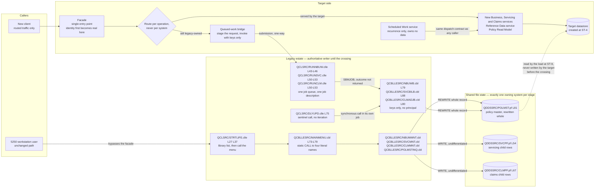

# Coexistence and Integration

This document designs how the new system and LIFE400 run **together** while the conversion is in progress. The delivery pattern it serves — incremental coexistence with parallel run, in the strangler-fig shape — is selected in [the strategy options and selection document](01-strategy-options-and-selection.md) and sequenced as `ST-0` through `ST-12` in [the recommended migration path](02-recommended-path.md); this document expands `ST-5` and the coexistence obligations the stages after it inherit. It owns six things and no more: **where the facade sits, which system owns each mutation at each stage, how queued work is bridged, how the existing [5250](../reference/glossary-ibm-i.md#5250-datastream) path stays in service until it is retired, what keeps shared data consistent while two systems address it, and how narrow the rollback surface is during coexistence.** It does **not** own the stage set, the dependency edges or the criteria at each boundary, which are [the recommended migration path](02-recommended-path.md)'s; it does **not** own the rollback procedure itself, the trigger conditions or the reconciliation sequence, which belong to [cutover and rollback](07-cutover-and-rollback.md); it does **not** own the comparison rules that decide whether a converted slice may cut over, which belong to [parallel run and output parity](06-parallel-run-and-output-parity.md); and it does **not** own the duplicate-and-orphan detection procedure, which belongs to [the data migration runbook](04-data-migration-runbook.md). Where this document names a defect it references the row that dispositions it and assigns no verb of its own.

**Reading the citations.** A citation of the form `[<path>:<locator>]` is plain text rather than a hyperlink and points at a path in this repository. Plain text is deliberate: a citation stays meaningful in a diff and does not depend on a hosting provider's line-anchor syntax. Every line range below was opened against the working tree and the construct at that range confirmed to be the one the claim describes. Statements about what the estate does **today** carry a citation; forward-looking design statements — a facade, a bridge, an ownership rule — are proposals and carry none, because there is nothing yet to cite. Platform terms link to [the IBM i glossary](../reference/glossary-ibm-i.md) on first use. **Nothing here was validated by building or running anything**, and nothing could be: ILE COBOL and [ILE](../reference/glossary-ibm-i.md#ile-integrated-language-environment) [CL](../reference/glossary-ibm-i.md#cl-control-language) require the platform and no off-platform compiler for either exists, so every behavioural statement below is a reading of source verified by citation and human review. No source member was altered to produce this document, no platform object was created and no library was manipulated: this describes a bridge rather than building one.

**Ordering language, once.** Every ordering statement below expresses a **dependency** and nothing else. A thing that "cannot begin until" another is complete is describing a prerequisite, not a position in a calendar, and no date, duration or staffing figure appears anywhere in this document. Two kinds of interval do appear and neither is planning content: the estate's own recurring work, whose scheduler entry is part of the as-built system [README.md:L209-L211], and the intervals its business rules test, which are properties of the system being migrated.

## There is no integration surface to inherit

**The facade is net-new construction, because the estate declares nothing for it to extend.** No application programming interface of any kind is declared anywhere in the 24 members — no transport, protocol, socket, broker, remote call or interchange format — a measured absence owned by [the target architecture](../target-state/01-target-architecture.md), which also states precisely what that absence does *not* establish. That qualification is load-bearing here rather than cautious, so it is carried forward rather than rounded off: a repository cannot show that no caller, no direct file reader and no operational automation exists outside it, so **external consumers are unknown rather than absent**, and the safe assumption is that a consumer exists and has not been found yet.

**Two discovery activities are therefore prerequisites of coexistence rather than of decommissioning alone**, and [the target architecture](../target-state/01-target-architecture.md) hands both to this layer explicitly. The first is an installed-object and cross-reference discovery on the running system, naming every object that references these programs and these files. The second is a business-and-operations confirmation of every downstream consumer of their data and their output. Both are business-and-operations exercises rather than code exercises, and both bear on coexistence directly: a facade that assumes it is the only new reader of the policy master, or an ownership crossing that assumes no unnamed job writes it, is safe only to the extent those two inventories are complete. Neither can be performed from this repository, so each is recorded as a confirm-with-operations item and as an entry condition on the crossing described below.

What the estate has instead of an interface is five seams, and enumerating them precisely is what establishes where a facade can and cannot attach.

- **Static program-to-program `CALL` to literal program names.** The menu dispatches to four programs by name, one `CALL` per menu option [QCBLLESRC/MAINMENU.cbl:L73-L79]. The destination set is fixed when the member is compiled, and none of the four dispatched programs takes a parameter.
- **Positional parameter linkage on the three batch entry points.** Each accepts keys and nothing else: `PROCEDURE DIVISION USING LK-POLICY-ID` [QCBLLESRC/NBUWB.cbl:L79], `USING LK-POLICY-ID LK-SVC-ID` [QCBLLESRC/SVCBILB.cbl:L88], and `USING LK-CLAIM-ID LK-POLICY-ID` [QCBLLESRC/CLMADJB.cbl:L80].
- **Asynchronous submission through [`SBMJOB`](../reference/glossary-ibm-i.md#sbmjob) to a [job queue](../reference/glossary-ibm-i.md#job-queue).** Three CL members exist to move one domain's work each off the interactive job [QCLSRC/RUNNBUW.clle:L43-L46], [QCLSRC/RUNSVC.clle:L50-L53], [QCLSRC/RUNCLM.clle:L50-L53]. It is the estate's only asynchrony mechanism and it is one-way.
- **The shared contract expanded textually into every consumer, whose single outcome pair is the only status channel every program shares** — a two-digit code and a hundred-character message [QCPYSRC/POLDATA.cpy:L36-L37]. It is an agreement between compilations rather than between running components.
- **The [5250](../reference/glossary-ibm-i.md#5250-datastream) workstation datastream, with the [display files](../reference/glossary-ibm-i.md#display-file) as the externally described formats** [QDDSSRC/MNUDSPF.dspf:L19], [QDDSSRC/SVCDSPF.dspf:L23]. It terminates at the platform rather than at anything the target can stand in front of.

**Two design consequences follow, and they set the shape of everything below.** The first is that the only seams available are **process invocation and shared file state** — one of them compiled shut, the other a file — so a facade attaches at those two boundaries and nowhere else. The second is sharper and easy to miss: **any contract richer than a key going in and a return code coming back is something the facade must synthesise rather than adapt.** The estate has no channel on which a request payload, a principal, a work identity or an outcome could travel, so each of those is new construction at the facade, not an adaptation of something already there. The request payload case is the one that constrains coexistence most, and it is developed under [facade placement](#facade-placement).

## Facade placement

**The facade is the single entry point through which all new traffic flows, and behind which the choice of implementation — a legacy program or a new service — is made per operation, so a caller cannot tell which side served its request.** Three properties of that placement matter more than the definition.

**Routing granularity is per operation, never per system.** The plan retires modules one at a time, so at any dependency position some operations are served by the target and the rest by the estate. A router that could only choose a *system* would force every conversion to be a single crossing, which is precisely the delivery shape [the strategy options and selection document](01-strategy-options-and-selection.md) rejects. Switching one operation's route is a controlled operation rather than a rebuild, which is `ST-5`'s exit criterion.

**The facade is not reachable from the estate's own dispatch, and this is a constraint rather than a preference.** The menu's destinations are `CALL` statements naming literal programs [QCBLLESRC/MAINMENU.cbl:L73-L79], resolved when the member is compiled, so a legacy screen cannot be redirected to a new service without editing and recompiling that member. Editing a source member is outside this assessment's scope, which is to plan modernization rather than perform it, so **redirection happens at the facade and never in the menu** — and the [5250](../reference/glossary-ibm-i.md#5250-datastream) path therefore continues to reach legacy programs directly, in parallel, for as long as it is in service.

**The facade is the first place in the whole system where a real identity exists.** Today the signed-on profile is captured and immediately moved to a display field [QCBLLESRC/MAINMENU.cbl:L57-L58], and it is neither persisted nor passed onward — none of the four dispatched programs takes a parameter [QCBLLESRC/MAINMENU.cbl:L73-L79]. What the mutating programs stamp instead is a program-name literal: five of them do so [QCBLLESRC/NBUWMNT.cbl:L497], [QCBLLESRC/NBUWB.cbl:L138], [QCBLLESRC/SVCBILB.cbl:L140], [QCBLLESRC/CLMADJB.cbl:L136], [QCBLLESRC/CLMMNT.cbl:L281], while the interactive servicing program stamps nothing at all and rewrites the policy master anyway [QCBLLESRC/SVCMNT.cbl:L190]. Whether any of those stamps reaches the audit column is a separate finding with its own evidence and its own disposition in [the known defects and stubs register](../current-state/07-known-defects-and-stubs.md), and is not re-derived here. The findings themselves are `SEC-01`, `SEC-06` and `SEC-07` in [the security risk register](../risk/01-security-risk-register.md) and the controls that close them are designed in [the target security control design](../target-state/04-security-control-design.md); this document redefines neither. What belongs here is only the coexistence consequence: **for any operation the facade serves, the principal exists and can be carried to the point of the write; for any operation the estate still serves, it cannot** — so attribution coverage advances exactly in step with write ownership, and no stage can claim user-attributed auditing for a surface the estate still owns.

**One configuration coupling has to be broken before the facade can address anything but production.** The application library name is a literal in the call itself [QCLSRC/STRTLIFE.clle:L37] and in every file [override](../reference/glossary-ibm-i.md#override) [QCLSRC/DLYUPD.clle:L60-L61], with no indirection anywhere. [The target architecture](../target-state/01-target-architecture.md) states the consequence at exactly the width the evidence supports, and it is consumed here rather than widened: a **differently named** parallel instance cannot be reached without editing source, while an isolated topology holding an identically named library would resolve its own objects with no source change at all — so which topology is available is a **confirm-with-operations item**, and it must be settled with the people who run the platform before a comparison-based cutover is planned around it. The externalized-configuration contract that removes the coupling on the target side is that document's; the dependency runs the other way here, and it is the reason `ST-2` precedes every stage that needs two instances.

The five seams above map onto the facade as follows. Each row states how the legacy side is reached **while it is still the authoritative writer**, because that is the case the facade has to serve for most of the migration.

| Legacy seam | Evidence | What the facade presents | How the legacy side is reached while it is still authoritative |
|---|---|---|---|
| Interactive dispatch by static `CALL` to a literal program name | [QCBLLESRC/MAINMENU.cbl:L73-L79] | A named synchronous operation per capability, with the reachable set held as data rather than compiled in | Not through the facade at all. The dispatch table is fixed at compile time, so the [5250](../reference/glossary-ibm-i.md#5250-datastream) path reaches these programs directly and in parallel |
| Positional parameter linkage on a batch entry point | [QCBLLESRC/NBUWB.cbl:L79], [QCBLLESRC/SVCBILB.cbl:L88], [QCBLLESRC/CLMADJB.cbl:L80] | One operation per domain taking named arguments | Stage the request into the policy record, then invoke with keys only — the entry points accept keys and nothing else |
| Asynchronous submission to a [job queue](../reference/glossary-ibm-i.md#job-queue) | [QCLSRC/RUNNBUW.clle:L43-L46] | An asynchronous request carrying a durable work identity, a principal and a retrievable outcome | By calling the existing submitter, from a job whose [library list](../reference/glossary-ibm-i.md#library-list) resolves the intended instance — see [batch-submission bridging](#batch-submission-bridging) |
| The shared outcome pair, as the only status channel | [QCPYSRC/POLDATA.cpy:L36-L37] | A typed result with a machine-readable status distinct from its message text | By re-reading persisted state after the work. Nothing in the estate reports a business outcome to a caller, so there is no result to receive |
| The [5250](../reference/glossary-ibm-i.md#5250-datastream) datastream and its [record formats](../reference/glossary-ibm-i.md#record-format) | [QDDSSRC/MNUDSPF.dspf:L19], [QDDSSRC/SVCDSPF.dspf:L23] | A client over the facade's own operations | Unchanged. The datastream terminates at the platform, so the facade neither intercepts nor proxies it |

**The second row is the one that decides how much a facade can do for a surface the estate still owns, and it deserves stating plainly.** The estate's invocation contract carries the request **in the record itself**: the interactive program moves the requested values into the shared record before the work is dispatched [QCBLLESRC/SVCMNT.cbl:L142-L147], the submitter's own usage note records that the interactive program stages the record before batch runs [QCLSRC/RUNNBUW.clle:L19], and the batch engine then reads those staged fields back out of the record it re-read by key [QCBLLESRC/SVCBILB.cbl:L113-L120]. Because every entry point takes keys and nothing else [QCBLLESRC/NBUWB.cbl:L79], [QCBLLESRC/SVCBILB.cbl:L88], [QCBLLESRC/CLMADJB.cbl:L80], **there is no way to hand a legacy program a decision to persist** — the facade can only stage a request and invoke, and the legacy program then computes the answer itself. That is why a converted domain cannot be "authoritative for the decision while the estate remains authoritative for the write": the two are the same act in this estate, and the write ownership matrix below is built on that fact rather than around it.

## Write ownership per stage

This is the centre of the document. **At any stage exactly one system owns each mutation, because the estate provides no mechanism by which two writers could be reconciled after the fact:** there is no commitment control anywhere — zero `COMMIT` and zero `ROLLBACK` across all eight COBOL members — no journaling and no scripted backup, registered as `CR-02`, `CR-03` and `CR-04` in [the continuity and recovery risk document](../risk/03-continuity-and-recovery-risk.md), which owns those findings and is referenced rather than re-derived. There is no unit of work to arbitrate between two writers, no change history from which a conflict could be detected afterwards, and no restore point from which a bad merge could be undone. Concurrent ownership is therefore not a risk to be managed here; it is a state with no recovery path, and the invariant exists to keep the migration out of it.

### The mutable surfaces, and the granularity each one permits

Three surfaces are mutated by the estate today, and their ownership granularity is not a matter of choice — it is a property of how the estate writes them.

| Mutable surface | Written by | Ownership granularity, and why | Evidence |
|---|---|---|---|
| The policy master, one indexed [physical file](../reference/glossary-ibm-i.md#physical-file) | Six of the eight COBOL programs | **The whole record, indivisibly.** Every mutation is a rewrite of the entire record area declared by the shared contract [QCPYSRC/POLDATA.cpy:L14], not of a column subset, so a second writer of the same record replaces every field the first one wrote and not only the ones it meant to change. The record also carries the servicing section [QCPYSRC/POLDATA.cpy:L117] and the claim section [QCPYSRC/POLDATA.cpy:L138] in the same image, so the surface cannot be split by domain either | Rewrites at [QCBLLESRC/NBUWMNT.cbl:L196-L203], [QCBLLESRC/NBUWB.cbl:L115], [QCBLLESRC/SVCMNT.cbl:L190], [QCBLLESRC/SVCBILB.cbl:L123], [QCBLLESRC/CLMMNT.cbl:L178], [QCBLLESRC/CLMADJB.cbl:L120] |
| The servicing child records | **One** program, the interactive servicing program | The whole file. The batch servicing engine declares the file and opens it for update [QCBLLESRC/SVCBILB.cbl:L92] and writes it nowhere, so this surface has a single writer and no ownership split inside it is available | Declared as one flat area [QCBLLESRC/SVCMNT.cbl:L58] and written undifferentiated [QCBLLESRC/SVCMNT.cbl:L191] |
| The claims child records | **One** program, the interactive claims program | The whole file, for the same reason: the batch claims engine opens the file for update [QCBLLESRC/CLMADJB.cbl:L84] and writes it nowhere | Declared as one flat area [QCBLLESRC/CLMMNT.cbl:L57] and written undifferentiated [QCBLLESRC/CLMMNT.cbl:L179] |

A fourth surface exists only on the target side and is listed in the matrix because it has an ownership question of its own during data migration: the **target datastore**, which does not exist until `ST-4` produces it. Its internal write ownership — one owning module per table, and for the policy row one owner per state transition, with an explicit version check and no silent merge — is owned by [the target architecture](../target-state/01-target-architecture.md) and is a different question from the one this matrix answers. This matrix answers only: **which system may write a surface at all.**

### The matrix

Columns are the stage identifiers defined by [the recommended migration path](02-recommended-path.md); no identifier is invented here. Each cell names exactly one owning system. "Legacy" means the estate's own programs, reached through the seams above; "Target" means the new implementation behind the facade.

| Mutable surface | `ST-0`–`ST-4` | `ST-5` | `ST-6` | `ST-7` | `ST-8` | `ST-9`–`ST-10` | `ST-11` | `ST-12` |
|---|---|---|---|---|---|---|---|---|
| Policy master | Legacy | Legacy | Legacy | Legacy | Legacy | Legacy | Target, from the crossing | Target |
| Servicing child records | Legacy | Legacy | Legacy | Legacy | Legacy | Legacy | Target, at the same crossing | Target |
| Claims child records | Legacy | Legacy | Legacy | Legacy | Legacy | Legacy | Target, at the same crossing | Target |
| Target datastore | Does not exist until `ST-4`, then Target | Target | Target | Target | Target | Target, with one writer at a time inside it: the load, or the shadow services, never both | Target | Target |

Five readings of that matrix carry the whole design, and each is a consequence of the granularity table above rather than a preference.

- **The estate owns every legacy write until the crossing, and a converted domain runs shadow-only before it.** Across `ST-7` through `ST-10` a converted domain's service writes the target datastore and never the legacy files. This is not caution; it is forced. The facade cannot hand a legacy program a computed outcome to persist, because every entry point takes keys and nothing else [QCBLLESRC/NBUWB.cbl:L79], [QCBLLESRC/SVCBILB.cbl:L88], [QCBLLESRC/CLMADJB.cbl:L80] — so a "converted" domain that wanted the estate to persist its answer would have to stage a request and let the legacy program recompute it, which is the legacy answer and not the converted one.
- **The three legacy surfaces cross together, in one crossing, at the cutover of the last slice that mutates the policy master.** `ST-11` remains per slice as the plan defines it — routing and the read path do cross slice by slice — but **write authority over the legacy files does not divide.** Two independent facts force this. The policy record is indivisible, so no per-domain split of it exists to hand over. And every child-record mutation is accompanied in the same paragraph by a policy-master rewrite [QCBLLESRC/SVCMNT.cbl:L190-L191], [QCBLLESRC/CLMMNT.cbl:L178-L179], so a child surface cannot cross without its domain's policy writes crossing with it. A crossing before the last domain is converted would therefore leave a legacy program and a target module both writing one indivisible record, which is exactly the state the invariant forbids.
- **The alternative was considered and is unavailable, which is why it is named rather than left as an obvious gap.** Bidirectional propagation — the target owning the record and a component writing the legacy file so legacy readers stay current — does not escape the problem: the legacy programs still write the same record, so there are still two writers of one indivisible image, with no journal to detect the loss and no unit of work to undo it. Narrowing a legacy rewrite to the columns it intends, or adding a persistence-only entry point, would each require editing a member, which this assessment does not do. **So the plan lives with a single write crossing, and its consequence is stated rather than hidden: parity has to be established for every slice before any slice's writes cross.**
- **The read path is the one thing that genuinely moves early, and the estate is what makes it safe.** The inquiry program opens the policy master for input alone [QCBLLESRC/POLMSTINQ.cbl:L63] — the only member in the estate that does — so moving the read path at `ST-6` changes no writer, needs no crossing and has no rollback surface at all. That is why [the recommended migration path](02-recommended-path.md) sequences it first, and it is the reason the `ST-6` row of this matrix is indistinguishable from the `ST-5` row.
- **The target datastore has one writer at a time during `ST-9` and `ST-10`, and switching between them is an explicit operational act.** A load and a shadow service both write the same tables, so the invariant applies on the target side too: while a load is in progress the load owns those tables, and the shadow services own them otherwise. Never both — a shadow write landing inside a load, or a load overwriting a shadow write, produces a comparison that proves nothing. The detection and reconciliation procedure for the load itself belongs to [the data migration runbook](04-data-migration-runbook.md).

### The case that breaks the obvious rule: a rejected request still writes

**A stage that assumes "rejected requests do not write" will lose or double-apply status transitions, and the batch servicing engine is the proof.** Its main flow evaluates payment status *before* it validates the request: the payment-status paragraph runs at [QCBLLESRC/SVCBILB.cbl:L104] and the validation paragraph only at [QCBLLESRC/SVCBILB.cbl:L105]. The payment-status paragraph is not a read — it moves `'GR'` into the contract status when the grace basis is not exceeded [QCBLLESRC/SVCBILB.cbl:L204], moves `'LA'` into it when it is [QCBLLESRC/SVCBILB.cbl:L209], and sets the outstanding premium [QCBLLESRC/SVCBILB.cbl:L213]. Then, on the validation-failure path, the engine moves the result code and message into the shared outcome pair and **rewrites the policy master before returning** [QCBLLESRC/SVCBILB.cbl:L106-L111].

So a grace or lapse transition is **persisted even when the amendment itself is rejected**. Three consequences bear directly on write ownership and each is stated as a rule the plan has to follow.

- **A refusal is not evidence that no state changed.** During coexistence, any bookkeeping that records "the estate rejected this request, so nothing happened" is wrong for this path. A reconciliation built on that assumption would miss a real transition.
- **The transition is a lifecycle event with its own owner, not a side effect of the amendment.** In the target, the billing, grace and lapse lifecycle is an operation of the Servicing service and the contract-status transition is held once in the shared domain model, both owned by [the target architecture](../target-state/01-target-architecture.md). The coexistence consequence is that the target's equivalent path must reach the same transition on a refused amendment, or the two systems will diverge on exactly the requests a comparison is least likely to sample.
- **It is also why the sweep's absence does not mean grace and lapse never happen.** The transitions above run on the ordinary servicing path, and the interactive servicing program performs the same two moves inline [QCBLLESRC/SVCMNT.cbl:L170-L177]. So whoever owns the policy-master surface owns the status transitions, whether or not any scheduled work runs — a point [scheduled work is a build, not a bridge](#scheduled-work-is-a-build-not-a-bridge) returns to.

### The two non-atomic pairs leave different residues

Two interactive paths each mutate two files with two adjacent statements and nothing enclosing them: the servicing program rewrites the policy master [QCBLLESRC/SVCMNT.cbl:L190] and then writes the servicing record [QCBLLESRC/SVCMNT.cbl:L191], and the claims program does the same [QCBLLESRC/CLMMNT.cbl:L178], [QCBLLESRC/CLMMNT.cbl:L179]. Neither pair can detect its own partial failure, and the atomicity reading of both — including the file-status evidence behind that statement — is `CR-01`, owned by [the continuity and recovery risk document](../risk/03-continuity-and-recovery-risk.md) and referenced rather than reproduced.

**What matters for coexistence is the behavioural difference that document establishes between the two pairs**, because it means one provenance rule cannot cover both, and a rule that is right for one surface is wrong for the other.

| Pair | Guarding | What the existence of a child row implies | Coexistence consequence |
|---|---|---|---|
| Servicing | **Unguarded at the tail of its paragraph.** Past a single claimed-or-terminated exit, every path reaches the writes — including the branch that sets a result code for an unrecognised amendment type and does not exit [QCBLLESRC/SVCMNT.cbl:L186-L188] | Nothing about acceptance. A servicing row may belong to a request the program itself declined | Any comparison, reconciliation or backfill keyed on "a servicing row exists, so an amendment was applied" is wrong. The row's own outcome fields cannot settle it either, for the reason under [legacy-written child rows carry no provenance](#legacy-written-child-rows-carry-no-provenance) |
| Claims | **Guarded on every path.** Four separate exits precede the writes [QCBLLESRC/CLMMNT.cbl:L154-L173], and only a calculated and settled claim reaches them | A settled claim | The same reconciliation rule that is wrong for servicing is sound here — which is why the rule has to be written per surface |

**The ownership consequence is one sentence: during coexistence the owning system must be the one that can make each pair atomic.** A failure between the two statements leaves the pair inconsistent with nothing in the estate able to notice, so a surface whose writes are split across two systems has two ways to be half-written instead of one. On the target side a request that changes its own domain state and policy state commits or fails as a unit, which is [the target architecture](../target-state/01-target-architecture.md)'s concurrency contract; that property is available only after the crossing, and it is one of the reasons the crossing is worth making in one step rather than several.

### Legacy-written child rows carry no provenance

The servicing file declares a requesting-user column [QDDSSRC/SVCPF.pf:L51], and it is never populated: the program declares the record as one flat 200-byte area [QCBLLESRC/SVCMNT.cbl:L58] and writes it undifferentiated [QCBLLESRC/SVCMNT.cbl:L191]. The claims file is written the same way, from a flat 324-byte area [QCBLLESRC/CLMMNT.cbl:L57], [QCBLLESRC/CLMMNT.cbl:L179]. The wider finding — that **neither** secondary file is populated on any path, and that both writing programs write areas larger than the file's own record — is `DEF-15` in [the known defects and stubs register](../current-state/07-known-defects-and-stubs.md), which owns its disposition; this document assigns none and does not restate the byte analysis behind it.

Two coexistence consequences follow, and both are about provenance rather than about content.

- **Legacy-written child rows cannot be distinguished by writer**, so the facade must carry its own provenance marker on anything it writes rather than relying on the existing column. This is not a preference about tidiness: without a marker, a reconciliation cannot tell a row the target wrote from a row the estate wrote, and during coexistence that distinction is the only way to attribute a discrepancy to a side.
- **There is nothing to carry from these two files, which removes a coexistence obligation rather than adding one.** Because no column of either file has a writer, a load has no content to migrate from them and no legacy child content for the target to stay consistent with. What remains is only the question of whether a row exists, which is what the matrix assigns.

### The read-only exception, stated once

One access path in the estate has no write-ownership consequence at all. The inquiry program opens the policy master with `OPEN INPUT` [QCBLLESRC/POLMSTINQ.cbl:L63] and the menu program opens no database file whatever, its only file declaration being the [display file](../reference/glossary-ibm-i.md#display-file) [QCBLLESRC/MAINMENU.cbl:L32-L36]. Converting the read path therefore neither takes a surface from the estate nor gives one to the target, which is what makes `ST-6` the rehearsal of the whole routing mechanism at zero data risk. **Its one coexistence obligation is a read-consistency obligation rather than an ownership one:** while the estate still owns the policy master, a target read model is answering from a store the estate is still changing, so the freshness of the read model against the legacy file is a comparison concern — owned by [parallel run and output parity](06-parallel-run-and-output-parity.md) — and not an ownership concern.

## Batch-submission bridging

All three submitters share one shape. Each row below cites its own anchors; the **operational properties** of the shape — what it binds, what it does not, and what a submitted job actually inherits — are owned by [the operational model](../current-state/06-operational-model.md) and are referenced rather than re-derived.

| Submitter | Blank-key guard | File [overrides](../reference/glossary-ibm-i.md#override), job scope | Submission, naming the four work-management objects | Requester notification | Cleanup, one monitored condition |
|---|---|---|---|---|---|
| New business | one [QCLSRC/RUNNBUW.clle:L29] | [QCLSRC/RUNNBUW.clle:L37-L38] | [QCLSRC/RUNNBUW.clle:L43-L46] | [QCLSRC/RUNNBUW.clle:L49-L50] | [QCLSRC/RUNNBUW.clle:L53-L55] |
| Servicing | two [QCLSRC/RUNSVC.clle:L29], [QCLSRC/RUNSVC.clle:L36] | [QCLSRC/RUNSVC.clle:L44-L45] | [QCLSRC/RUNSVC.clle:L50-L53] | [QCLSRC/RUNSVC.clle:L56-L57] | [QCLSRC/RUNSVC.clle:L60-L62] |
| Claims | two [QCLSRC/RUNCLM.clle:L29], [QCLSRC/RUNCLM.clle:L36] | [QCLSRC/RUNCLM.clle:L44-L45] | [QCLSRC/RUNCLM.clle:L50-L53] | [QCLSRC/RUNCLM.clle:L56-L57] | [QCLSRC/RUNCLM.clle:L60-L62] |

Each submission names a [job description](../reference/glossary-ibm-i.md#job-description) and a [job queue](../reference/glossary-ibm-i.md#job-queue), an [output queue](../reference/glossary-ibm-i.md#output-queue) and a [message queue](../reference/glossary-ibm-i.md#message-queue), wrapped around the command that names the batch program and passes it the keys [QCLSRC/RUNNBUW.clle:L43-L46]. Six properties of that shape become obligations on the bridge, and each is a coexistence decision rather than an implementation detail.

- **The bridge must supply the data binding itself, because the submitters do not.** The [overrides](../reference/glossary-ibm-i.md#override) each submitter issues are scoped to the submitting job and do not reach the submitted program, the job description carries no initial [library list](../reference/glossary-ibm-i.md#library-list) [README.md:L199], and no submission passes one [QCLSRC/RUNNBUW.clle:L43-L46] — all established by [the operational model](../current-state/06-operational-model.md) and gathered as `DEF-03` in [the known defects and stubs register](../current-state/07-known-defects-and-stubs.md), which owns its disposition.
- **Which instance a submitted program acts on is therefore a property of the caller, and the bridge is the caller.** A submitted job resolves its unqualified file names through the [library list](../reference/glossary-ibm-i.md#library-list) it inherits from whoever submitted it [QCBLLESRC/NBUWB.cbl:L50-L54], so a bridge submitting legacy work decides which copy of the policy master that work opens — and if a same-named file precedes the intended one, the work proceeds against the wrong data with nothing in the estate reporting it. **This is the sharpest operational hazard in the whole coexistence design**, because it turns the parallel-instance question from a convenience into a correctness question, and it is why the topology confirm-with-operations item under [facade placement](#facade-placement) is an entry condition on the bridge rather than a footnote to it.
- **Submission routing is a coexistence decision.** One job queue receives every asynchronous unit of work in the estate and the queue is named explicitly at every call site rather than taken from the job description [README.md:L199-L200], so batch work forms a single serialised stream and redirecting it would mean editing three CL members — the serialization reading is owned by [the operational model](../current-state/06-operational-model.md). A bridge that submits new work onto that same queue competes with legacy batch for a stream that has no concurrency setting of any kind, and one that submits elsewhere has to be reconciled with a job description that points at the original queue [README.md:L199]. Neither is an implementation detail: the choice changes whether converted work can starve the estate's own work while the estate is still authoritative.
- **The bridge maps named arguments onto positional ones, and must never assume a common order.** Two submitters take the policy key first [QCLSRC/RUNNBUW.clle:L21], [QCLSRC/RUNSVC.clle:L21] and the claims submitter takes the claim key first [QCLSRC/RUNCLM.clle:L21], which does match its own target's entry signature [QCBLLESRC/CLMADJB.cbl:L80] — so neither member is wrong on its own terms and the inconsistency is across the family. All the keys are the same length and the blank-key guard is the only validation any submitter performs [QCLSRC/RUNNBUW.clle:L29], so a transposed pair is **undetectable** by anything in the estate: it would submit successfully and process the wrong record. That positional order is not part of any target contract is owned by [the program-to-service map](../target-state/02-program-to-service-map.md); the bridging obligation is this document's, and it is to hold the mapping in exactly one place per submitter.
- **The bridge cannot learn an outcome from the estate, so it must derive one from state.** Control returns as soon as the work is queued and the notification confirms a submission rather than a result [QCLSRC/RUNNBUW.clle:L49-L50]; the batch program's own outcome goes into the shared pair in its record area [QCPYSRC/POLDATA.cpy:L36-L37] and no further. So a bridged request's completion has to be established by re-reading persisted state, and the bridge must not present a submission acknowledgement as a completion — the estate's own notification is the pattern to avoid rather than the one to reproduce.
- **The notification vocabulary is interpreted while the estate is authoritative, never replaced.** The whole error-and-notification vocabulary of the system is five [CPF message](../reference/glossary-ibm-i.md#cpf-message) identifiers, whose enumeration and roles are owned by [the operational model](../current-state/06-operational-model.md): one send vehicle and four monitored conditions, one of which is the catch-all wrapped around the sweep call [QCLSRC/DLYUPD.clle:L76]. A bridge that watches the estate must read that vocabulary as the estate writes it, and must not assume a monitored condition was an inspected result — nothing in the CL layer branches on whether a tolerated condition occurred.

**One defect the bridge must not carry forward.** The new-business submitter redirects the claims file [QCLSRC/RUNNBUW.clle:L38] although the program it submits declares exactly one file, the policy master [QCBLLESRC/NBUWB.cbl:L50-L54]. It is recorded as `DEF-09` in [the known defects and stubs register](../current-state/07-known-defects-and-stubs.md), which owns its disposition; the bridging consequence is a prohibition rather than a verb — **the bridge must not infer a claims dependency for new-business work**, because inferring one from the redirection would fabricate a coupling between two domains that the code does not have.

## Scheduled work is a build, not a bridge

**There is no nightly behaviour to preserve, so the target's recurring sweep is specified rather than bridged, and no coexistence period needs to keep the estate's scheduled job authoritative for grace and lapse.** That conclusion rests on four facts and one inference, and the inference is labelled as one.

- **The driver calls the servicing engine with sentinel literals rather than iterating the policy master.** Where an iteration belongs, the member issues a single call passing two sentinel values [QCLSRC/DLYUPD.clle:L75]. There is no loop and no cursor in it.
- **The member concedes the point itself.** The comment immediately above that call records that a full implementation would need a driver to read the policy master sequentially and call the servicing engine for each record [QCLSRC/DLYUPD.clle:L65-L69].
- **The engine has no sentinel handling.** It moves the incoming key into the policy identifier, reads the master by key, and on the `INVALID KEY` branch sets a not-found result, closes both files and returns **without rewriting anything** [QCBLLESRC/SVCBILB.cbl:L93-L100].
- **A set-based sweep is not expressible in the current design at all.** Across all eight COBOL members there is **no sequential and no positioned read** — zero `START` and zero `READ NEXT` — so there is no iteration anywhere in the estate to translate, only one to build. Every database file is declared for keyed [record-level I/O](../reference/glossary-ibm-i.md#record-level-io) with random access [QCBLLESRC/NBUWB.cbl:L50-L54].

**The inference, stated as an inference from the source rather than as an observed run: a sentinel key cannot match a policy record, so the nightly sweep processes no policy.** Nothing in this repository can be compiled or executed, so this is a reading of the two anchors above — the call that passes the sentinel [QCLSRC/DLYUPD.clle:L75] and the branch the engine takes when a key does not resolve [QCBLLESRC/SVCBILB.cbl:L93-L100] — and not a report of behaviour anyone watched.

**The telemetry cannot contradict that reading, which is why the absence has stayed invisible.** Two of the job's counters are declared at zero and never incremented [QCLSRC/DLYUPD.clle:L32-L33]; the update counter is converted for reporting [QCLSRC/DLYUPD.clle:L87] and the completion text is then assembled from the process date and the error count alone [QCLSRC/DLYUPD.clle:L88-L89], so the volume of work is not reported at all. Nor does the error path fire: the monitored condition around the call [QCLSRC/DLYUPD.clle:L76-L77] traps a failure of the call, and a not-found result returned normally through the shared pair is not one. A run that did nothing and a run that did everything are therefore indistinguishable from the job's own output. Both the stub and its telemetry are dispositioned as `DEF-01` and `DEF-02` in [the known defects and stubs register](../current-state/07-known-defects-and-stubs.md), which owns both verbs.

Three consequences for coexistence follow, and the third is the one most easily got wrong.

- **No bridge is needed for the recurrence.** There is no legacy scheduled behaviour for a bridge to stand in front of, and `ST-8` is written as a build for that reason. The destination — the recurrence held by the **Scheduled Work service** and the sweep itself an operation of the **Servicing service** — is owned by [the program-to-service map](../target-state/02-program-to-service-map.md).
- **No parity evidence is available for it either**, which is why `ST-8` reaches cutover on its own specification rather than through a comparison. Agreement with a run that processes nothing would be evidence of nothing.
- **Grace and lapse still happen, and the target sweep must not double-apply them.** The transitions are performed on the ordinary servicing paths, inline in the interactive program [QCBLLESRC/SVCMNT.cbl:L170-L177] and in the batch engine's payment-status paragraph [QCBLLESRC/SVCBILB.cbl:L196]. So the lifecycle is live even though the scheduled job is inert, and it belongs to whoever owns the policy-master surface. A target sweep that becomes authoritative while the estate still owns that surface would be a second writer of the same transition — which the matrix forbids — so the sweep goes live with the crossing rather than before it, regardless of the fact that nothing on the legacy side would appear to contend with it.

## 5250 continuity until retirement

The interactive path is unchanged for as long as it is in service. Session entry adds the application library to the job's [library list](../reference/glossary-ibm-i.md#library-list) [QCLSRC/STRTLIFE.clle:L27] and calls the menu [QCLSRC/STRTLIFE.clle:L37]; the menu dispatches by static `CALL` to four literal program names [QCBLLESRC/MAINMENU.cbl:L73-L79] and offers the identical option set to every signed-on user [QCBLLESRC/MAINMENU.cbl:L60-L92].

**The continuity requirement is that the [5250](../reference/glossary-ibm-i.md#5250-datastream) path stays available and authoritative for every operation the facade has not taken over, and that it is retired per operation rather than wholesale.** Four properties of that requirement are worth making explicit.

- **Retirement is per operation because the menu cannot be partially redirected.** The dispatch table is fixed at compile time [QCBLLESRC/MAINMENU.cbl:L73-L79], so no legacy screen can be pointed at a new service without editing and recompiling the member — which this assessment does not do. Redirection happens at the facade, and a user's route to a converted capability is the new client rather than a changed menu option.
- **A converted capability and its legacy screen coexist, and the estate's own role model does not distinguish them.** Every signed-on user reaches the same option set [QCBLLESRC/MAINMENU.cbl:L60-L92], so nothing in the estate can restrict a user to the converted path or to the legacy one. Restriction exists only on the facade side, and only for traffic that arrives there. The derived role model and its enforcement point are owned by [the target security control design](../target-state/04-security-control-design.md); the coexistence consequence is that **as long as the [5250](../reference/glossary-ibm-i.md#5250-datastream) path is in service it is an unrestricted path to every capability it still serves**, and no facade-side control narrows it.
- **Retiring a program does not retire its screen, and one screen makes that concrete.** The servicing [display file](../reference/glossary-ibm-i.md#display-file) is the only presentation artifact in the estate serving two programs: the interactive servicing program declares it [QCBLLESRC/SVCMNT.cbl:L33-L36] and so does the inquiry program [QCBLLESRC/POLMSTINQ.cbl:L33-L36], which distinguishes its own mode by setting an [indicator](../reference/glossary-ibm-i.md#indicator) that suppresses the amendment fields [QCBLLESRC/POLMSTINQ.cbl:L92]. So converting the read path at `ST-6` retires neither the file nor the header it shares — the servicing domain still drives it until that domain is converted too. The destination of every [record format](../reference/glossary-ibm-i.md#record-format), and the split of this one file into two target views, are owned by [the UI modernization document](../target-state/05-ui-modernization.md).
- **Component selection for any replacement interface is deferred, and nothing in this document depends on it.** No design system, component library, user-interface framework or token set is specified anywhere in the requirements or present anywhere in this repository, so the deferral is recorded as a gap by [the UI modernization document](../target-state/05-ui-modernization.md#component-selection-is-deferred) rather than filled here. Every statement above is about routing and authority rather than about rendering, so the coexistence design is complete without that choice.

## Shared-data consistency

Both systems address the same book of business through one indexed policy master, and the estate contributes nothing to keeping them consistent: there is no commitment control, no journaling and no scripted backup, which are `CR-02`, `CR-03` and `CR-04` in [the continuity and recovery risk document](../risk/03-continuity-and-recovery-risk.md). Four further properties of the schema and of the code bear on consistency **while both systems are live**, as distinct from the one-off concerns of a load.

- **No key in the estate is declared unique, and no referential integrity is declared at all.** Each file names a key and nothing more — [QDDSSRC/POLMST.pf:L81], [QDDSSRC/SVCPF.pf:L54], [QDDSSRC/CLMPF.pf:L67] — with no `UNIQUE` keyword anywhere in the [DDS](../reference/glossary-ibm-i.md#dds-data-description-specifications) and no relationship declared between the three files. The coexistence consequence is that **duplicate and orphan detection is a live operational concern rather than a one-off migration concern**: nothing prevents a duplicate arriving during coexistence and nothing relates a child row to the policy it belongs to, so the target's own constraints cannot be relied on to have been true of the data before the crossing. The detection procedure itself belongs to [the data migration runbook](04-data-migration-runbook.md), which owns it; what belongs here is that it has to be **repeatable** rather than performed once.
- **There is no erasure path, which simplifies coexistence and worsens everything else.** Across all eight COBOL members there is not one `DELETE` operation, so no row is ever removed and coexistence never has to reconcile a deletion — a genuine simplification, and the only one on this list. Its other face is that nothing is ever cleaned up, and the retention and growth consequences are owned by [the compliance and data protection document](../risk/02-compliance-and-data-protection.md) and by `CR-05`.
- **Any tooling that reads the servicing file alongside the legacy programs must take its key from the DDS rather than from the programs.** Both servicing programs declare the record key as a **group** item from the shared contract — [QCBLLESRC/SVCMNT.cbl:L48] and [QCBLLESRC/SVCBILB.cbl:L58], naming the group at [QCPYSRC/POLDATA.cpy:L117] — while the file's own key is a single field [QDDSSRC/SVCPF.pf:L54]. The two sides of that declaration do not agree about what identifies a record. It is recorded as `DEF-10` in [the known defects and stubs register](../current-state/07-known-defects-and-stubs.md), which owns its disposition and the record-length analysis behind it; the coexistence consequence is narrow and practical — **a reader that adopted the programs' view of the key would agree with neither the file nor the target.**
- **The effective date is ambient, and two live systems can disagree about it.** The batch engine defaults its process date from the system clock whenever the field arrives unset [QCBLLESRC/SVCBILB.cbl:L137-L139], and the scheduled driver retrieves the system date separately for its own purposes [QCLSRC/DLYUPD.clle:L45]. Every interval the business rules test is an integer difference taken from that date — the payment-status computation is the shortest illustration [QCBLLESRC/SVCBILB.cbl:L198-L199], and the general property is `DEF-14` in [the known defects and stubs register](../current-state/07-known-defects-and-stubs.md) — so two sides that take the date from two clocks can reach different grace, lapse and attained-age answers on the same record. **So the effective date must be supplied explicitly on every bridged and every compared request rather than defaulted on either side** — the business-clock contract that makes that possible on the target side is owned by [the target architecture](../target-state/01-target-architecture.md), and the pinned-date requirement for comparison is owned by [parallel run and output parity](06-parallel-run-and-output-parity.md).

## Rollback surface during coexistence

**The rollback surface during coexistence is narrow, and it is narrow for reasons that are properties of the estate rather than of the plan.** This section says what can and cannot be undone at each ownership boundary. The procedure — the trigger conditions, the steps and the reconciliation sequence — belongs to [cutover and rollback](07-cutover-and-rollback.md) and is not duplicated here.

Four absences bound the surface, all owned by [the continuity and recovery risk document](../risk/03-continuity-and-recovery-risk.md): no commitment control, so there is no unit of work to reverse; no journaling, so there is no change history from which the affected keys could be assembled; no scripted backup, so there is no restore point the estate itself arranges; and two non-atomic write pairs that cannot detect their own partial failure. Read together they give a single rule.

| Ownership boundary | What can be undone | What cannot | Why |
|---|---|---|---|
| Before the crossing, target reads only — `ST-5`, `ST-6` | Everything. Routing is reverted and no legacy state was ever written by the target | Nothing needs undoing | The read path holds no authority to change anything, and the read model's own source is the file the estate still owns |
| Before the crossing, target services in shadow — `ST-7`, `ST-9`, `ST-10` | Everything on the legacy side, because the target wrote none of it. On the target side, the datastore is reloaded rather than repaired | Nothing on the legacy side needs undoing; a shadow discrepancy is a finding rather than damage | The matrix keeps every legacy surface with the estate through these stages, so the whole of the target's output is discardable |
| The crossing itself — `ST-11` | The route, cleanly, **only while the target has written nothing** to a surface it now owns | Once the target has written a legacy-owned surface there is no reversal available from the estate's own facilities | There is no journal to replay backwards and no unit of work to abort, so a reversal after the first write is a data-repair exercise performed from outside the application |
| After the crossing — `ST-12` | Nothing by reverting a route: the estate no longer holds current state | A return to the estate as the authoritative writer | The estate has no mechanism to receive the changes the target made, and the decommissioning gates exist so that this boundary is reached deliberately |

Two consequences of that table are load-bearing, and both explain choices made earlier in this document rather than adding new ones.

- **Write ownership moves in whole surfaces, never per record.** The only reliable rollback boundary during coexistence is one where the new side has not yet written, and a per-record hand-over would put that boundary inside a surface — leaving a file in which some records are the target's and some the estate's, with nothing recording which is which and no attribution available on the child rows to reconstruct it. Whole-surface movement keeps the boundary checkable: either the target has written this surface or it has not.
- **"No successful operation occurred" is not evidence that no state changed**, and the rollback design depends on the distinction. A rejected request on the batch servicing path still rewrites the policy master [QCBLLESRC/SVCBILB.cbl:L106-L111], and an existing servicing row does not imply an accepted amendment [QCBLLESRC/SVCMNT.cbl:L186-L188]. So a rollback that reasons from outcomes will under-count what it has to reverse, and any reconciliation has to reason from state instead.

## D-16 — the coexistence topology

The diagram reads left to right, and left to right means **request flow rather than time**. Solid edges are live paths. The single dashed edge is the load's read of the policy master at `ST-9`: it is the only edge between the target side and the shared files before the crossing, and it points **into** the target rather than out of it. Every node that names a real artifact carries its member path inside the label, so the diagram carries its own traceability and can be read without the prose around it.

Four things are worth reading off the shape deliberately. The [5250](../reference/glossary-ibm-i.md#5250-datastream) path bypasses the facade entirely and reaches the legacy programs directly, because the estate's dispatch is compiled shut. The bridge attaches to the existing submitters rather than to the batch programs, because submission is the only asynchrony the estate has. The three shared files sit behind a single ownership annotation rather than one per file, because the matrix moves them together. And nothing crosses from the target side to the shared files before the crossing — the only target edge that touches them is the load's read.

`D-16` is owned by this document. It appears nowhere else in the assessment and no other document reproduces it.

## Governing decision records

Three records govern this document. Each is linked rather than summarised, so that superseding one changes a single file and leaves this design intact.

- [MOD-ADR-002, migration pattern](../decisions/MOD-ADR-002-migration-pattern.md) — **the primary governing record, planned and not yet written.** It carries the incremental coexistence pattern with parallel run that this entire document expands. If it were decided otherwise there would be no coexistence period to design: a single switch has no facade, no write-ownership sequence and no bridge. The configuration constraint under [facade placement](#facade-placement) — that a differently named parallel instance is a source change rather than a deployment — is offered to it as a premise, by [the target architecture](../target-state/01-target-architecture.md).
- [MOD-ADR-005, authentication and authorization](../decisions/MOD-ADR-005-authentication-and-authorization.md) — **written, with the status Proposed.** It carries the explicit identity and role model that makes the facade the first place a verified principal exists, which is why attribution coverage advances in step with write ownership rather than ahead of it.
- [MOD-ADR-004, single domain rules service](../decisions/MOD-ADR-004-single-domain-rules-service.md) — **planned and not yet written.** It carries the collapse of each domain's hand-synchronised pair into one implementation. Its consequence for this document is that a domain has one converted implementation to route to rather than two, so a route is a route to a domain rather than to a path within it.

Until a planned record is written, the position it carries is this assessment's recommendation rather than an accepted decision, and this document is a proposal for a decision rather than the record of one.

## Figures owned by other documents

This document owns the facade placement, the write-ownership matrix and its crossing rule, the bridging obligations, the coexistence rollback surface and `D-16`. Every other quantity and name it uses has exactly one owning document, and restating one here would create a second place for it to be wrong.

- The stage set `ST-0` to `ST-12`, the dependency edges and the criteria at each boundary — [the recommended migration path](02-recommended-path.md).
- The archetype selection and the delivery-shape decision, with the published record behind both — [the strategy options and selection document](01-strategy-options-and-selection.md).
- The duplication and divergence measurements and every statement census of what the estate does not contain — [the current-state architecture](../current-state/02-architecture-current-state.md).
- Record lengths, byte offsets, column inventories and the never-persisted rider table — [the current data model](../current-state/04-data-model-current-state.md).
- The six-step submitter shape and its operational properties, work-management object roles, queue serialization, the [CPF message](../reference/glossary-ibm-i.md#cpf-message) vocabulary and the configuration surface — [the operational model](../current-state/06-operational-model.md).
- **Every disposition verb** for every defect and stub named above, including `DEF-01`, `DEF-02`, `DEF-03`, `DEF-09`, `DEF-10` and `DEF-15` — [the known defects and stubs register](../current-state/07-known-defects-and-stubs.md). This document references dispositions and assigns none.
- `SEC-01` to `SEC-08`, their severity and the control that closes each — [the security risk register](../risk/01-security-risk-register.md), with the controls themselves in [the target security control design](../target-state/04-security-control-design.md).
- `CR-01` to `CR-07`, the atomicity reading of both write pairs, recovery objectives and manual reconciliation — [the continuity and recovery risk document](../risk/03-continuity-and-recovery-risk.md).
- Canonical service names, the target write map and concurrency contract, the dispatch contract, externalized configuration, the business clock, and the measured absence of any declared interface together with what that absence does not establish — [the target architecture](../target-state/01-target-architecture.md).
- Per-program and per-paragraph destinations, and the split of recurrence from the work it triggers — [the program-to-service map](../target-state/02-program-to-service-map.md).
- The destination of every [record format](../reference/glossary-ibm-i.md#record-format), the two target views of the shared [display file](../reference/glossary-ibm-i.md#display-file), and the deferred component selection — [the UI modernization document](../target-state/05-ui-modernization.md).
- Extraction, transcoding, duplicate and orphan detection, load and reconciliation — [the data migration runbook](04-data-migration-runbook.md).
- Comparison rules, the rounding-tolerance policy, exception triage, the parity exit criterion and what parity cannot prove — [parallel run and output parity](06-parallel-run-and-output-parity.md).
- Rollback triggers, the rollback procedure and post-rollback reconciliation — [cutover and rollback](07-cutover-and-rollback.md).
- Dependency-zero verification and the retirement order — [decommissioning](08-decommissioning.md).
- Definitions of every platform term used above — [the IBM i glossary](../reference/glossary-ibm-i.md).

**No vendor, product, licence or tool is named anywhere above**, and none is recommended or excluded: the facade, the bridge, the queue and the datastore are capability classes rather than purchases. No cost, effort or staffing figure appears, and no regulatory framework is asserted to apply — framework applicability is a confirm-with-the-business item recorded as `A-03` and analysed by [the compliance and data protection document](../risk/02-compliance-and-data-protection.md).

## Source citations

Every member and document this file cites, grouped by class. No member was modified to produce it, no platform object was created, no library was manipulated, and no file in the machine-generated corpus was hand-edited or reproduced with its generator tags.

- ILE COBOL — `QCBLLESRC/MAINMENU.cbl`, `QCBLLESRC/NBUWMNT.cbl`, `QCBLLESRC/NBUWB.cbl`, `QCBLLESRC/SVCMNT.cbl`, `QCBLLESRC/SVCBILB.cbl`, `QCBLLESRC/CLMMNT.cbl`, `QCBLLESRC/CLMADJB.cbl`, `QCBLLESRC/POLMSTINQ.cbl`
- ILE CL — `QCLSRC/STRTLIFE.clle`, `QCLSRC/RUNNBUW.clle`, `QCLSRC/RUNSVC.clle`, `QCLSRC/RUNCLM.clle`, `QCLSRC/DLYUPD.clle`
- Shared copybook — `QCPYSRC/POLDATA.cpy`
- DDS — `QDDSSRC/POLMST.pf`, `QDDSSRC/SVCPF.pf`, `QDDSSRC/CLMPF.pf`, `QDDSSRC/MNUDSPF.dspf`, `QDDSSRC/SVCDSPF.dspf`
- Repository overview — `README.md` at the repository root, cited in plain text rather than linked, because a link out of the documentation tree cannot resolve in a built site
- Current-state layer — `current-state/02-architecture-current-state.md`, `current-state/04-data-model-current-state.md`, `current-state/06-operational-model.md`, `current-state/07-known-defects-and-stubs.md`
- Risk layer — `risk/01-security-risk-register.md`, `risk/02-compliance-and-data-protection.md`, `risk/03-continuity-and-recovery-risk.md`
- Target-state layer — `target-state/01-target-architecture.md`, `target-state/02-program-to-service-map.md`, `target-state/04-security-control-design.md`, `target-state/05-ui-modernization.md`
- Migration layer — `migration/01-strategy-options-and-selection.md`, `migration/02-recommended-path.md`, `migration/04-data-migration-runbook.md`, `migration/06-parallel-run-and-output-parity.md`, `migration/07-cutover-and-rollback.md`, `migration/08-decommissioning.md`
- Decision log — `decisions/MOD-ADR-002-migration-pattern.md`, `decisions/MOD-ADR-004-single-domain-rules-service.md`, `decisions/MOD-ADR-005-authentication-and-authorization.md`
- Reference layer — `reference/glossary-ibm-i.md`

**No user-specified rules were provided for this project**, so nothing above is held to a rule-mandated convention. This document is instead held to the enterprise-standard practices this assessment commits to: every claim about the existing system carries a resolvable plain-text citation, ordering is expressed as dependency and never as schedule, no third-party figure is presented as a projection for this programme, decision records are linked rather than paraphrased, the one diagram is fenced Mermaid that versions and diffs alongside the prose, defects are referenced to the register that dispositions them rather than re-dispositioned here, and not one line of ILE COBOL, ILE CL, copybook or DDS source was altered to produce it.
