# Characterization Test Strategy

This document specifies the behavioural safety net that every conversion stage in the plan is gated on. It exists because a refactoring migration has to be measured against something, and this estate offers exactly one oracle: the running legacy system. A characterization suite is how that oracle is written down before it is disturbed — the recorded answers of the existing programs, captured against fixtures whose inputs are known, so that a converted module can be held to what the legacy system *does* rather than to what anybody believes it should do. The stage this document details is `ST-3` in [the recommended migration path](02-recommended-path.md), which owns the stage set and the criteria at each boundary and hands the fixture design, the capture approach, the coverage targets and the assertion form here.

**Scope.** This document owns five things and nothing else: the fixture design, the granularity at which behaviour is captured, the coverage target expressed by rule band, the assertion contract, and the conversion gate. It also owns the honest counterpart of all five — the inventory of behaviour that cannot be characterized at all, which is the section a reader should not skip.

**What this document does not contain.** No test code. Not a snippet, not a skeleton, not an illustrative test method in any language. Fixture *shapes* appear as short pseudo-schema or as field-and-value tables, and assertions appear as conditions stated in prose or in a table; nothing here is runnable, and nothing here is a data-definition script. That boundary is not stylistic — the request that opened this assessment was to plan modernization, not to perform it, so this document specifies the suite and does not build it. It also publishes no rule census: the population, the identifier bands, the anchored-versus-unanchored split and the acceptance-oracle record format are owned by [the business rule inventory](../current-state/05-business-rule-inventory.md), and no count from it is restated here. It assigns no disposition to any defect or stub it names; every migrate, implement or drop decision is the sole business of [the known defects and stubs register](../current-state/07-known-defects-and-stubs.md). It does not design the comparison between two running systems, which is [parallel run and output parity](06-parallel-run-and-output-parity.md), planned and not yet written. And it names no product, vendor, licence or tool: where a capability is needed, the capability class is named and the selection is left open.

**Reading the citations.** A citation of the form `[<path>:<locator>]` is plain text rather than a hyperlink and points at a path in this repository. Plain text is deliberate: a citation stays meaningful in a diff and does not depend on a hosting provider's line-anchor syntax. Every line range below was opened against the working tree and the construct at that range confirmed to be the one the claim describes — the mechanical citation check proves only that a path exists and a range lies inside it, never that the range holds the construct claimed, so the ranges here were verified by reading. Forward-looking material — a fixture requirement, an assertion form, a gate condition — is a proposal and carries no citation, because there is nothing yet to cite. Every statement about what the system does **today** carries one. Platform terms link to [the IBM i glossary](../reference/glossary-ibm-i.md) on first use in this document. No [source member](../reference/glossary-ibm-i.md#source-physical-file-and-source-member) was altered to produce this document, and the machine-generated corpus under `.swm/` is read as prior art and never edited.

A reader entering the assessment for the first time should start at [the section index](../README.md), which is planned and not yet written; until it exists, [the business drivers and success criteria](../01-business-drivers-and-success-criteria.md) is the delivered entry point.

## Why tests come first

### The estate has no behavioural baseline of its own

**There is no test member anywhere in this repository and no continuous-integration configuration of any kind.** The repository's own structure diagram enumerates every directory and every member it holds — the four source directories, the eight ILE COBOL programs, the five [ILE](../reference/glossary-ibm-i.md#ile-integrated-language-environment) [CL](../reference/glossary-ibm-i.md#cl-control-language) programs, the [copybook](../reference/glossary-ibm-i.md#copybook) and the ten [DDS](../reference/glossary-ibm-i.md#dds-data-description-specifications) members [README.md:L27-L55] — and not one of them is a test member or a test-runner configuration. No pipeline directory exists in the tree at all, and the documented build is eight steps of platform commands with no test step and no scanning step among them [README.md:L120-L218]. That last gap is registered for severity as `SEC-08` in [the security risk register](../risk/01-security-risk-register.md).

The consequence is precise rather than rhetorical. Nothing fails when a behaviour quietly disappears, and no step of the build compares the estate against any description of itself. A conversion begun in that state is unguarded: there is no artifact that says what the system answers, so there is nothing for a converted module to disagree with. Building the safety net is therefore not the first *useful* technical activity — it is the first *permissible* one.

### The behavioural surface is dense relative to the line count

The estate is small and its behaviour is not. Twenty-four members and **4,126** source lines — 2,827 lines of ILE COBOL in eight programs, 336 lines of ILE CL in five, 175 lines in one copybook and 788 lines of DDS across ten members — carry **333** documented business rules [.swm/business-rules-statistics.md:L29]. The per-member figures are owned by [the system inventory](../current-state/01-system-inventory.md) and the rule population by [the business rule inventory](../current-state/05-business-rule-inventory.md); neither is re-derived here.

That ratio is the argument for capture at a fine granularity. A suite that exercised each program once at its entry point would touch every member and characterize almost none of the behaviour, because the rules are concentrated in branch conditions rather than spread across statements. The same ratio is also the reason the exercise is tractable: at this size every member can be read in full, so a suite can be built from a complete reading rather than from sampling.

### Most rules are not anchored to a line of source

**Only the three batch programs carry inline rule identifiers at all.** The `NB-` band appears in the batch new-business program [QCBLLESRC/NBUWB.cbl:L230], the `SV-` band in the batch servicing program [QCBLLESRC/SVCBILB.cbl:L200] and the `CL-` band in the batch claims program [QCBLLESRC/CLMADJB.cbl:L208]. The three online maintenance programs, the menu program and the inquiry program carry none — a fact established by searching all eight members rather than by inspecting the places an identifier was expected.

The census, its three readings, the reconciliation between them and the anchored-versus-unanchored split are owned by [the business rule inventory](../current-state/05-business-rule-inventory.md), and no figure from it is restated here so that the two documents cannot drift apart. What matters for this document is the shape rather than the size: a suite cannot assert on a rule it cannot locate, so for the majority of the population the location step is part of building the suite rather than a precondition already satisfied.

### Nothing in this repository can run the suite

**No command available to this assessment can compile, bind or execute LIFE400.** ILE COBOL and ILE CL require the IBM i platform and no off-platform compiler for either exists; every program declares the platform as its source computer [QCBLLESRC/MAINMENU.cbl:L27-L28], [QCBLLESRC/NBUWB.cbl:L45-L46], and the build is a sequence of commands that can only be issued on the machine [README.md:L120-L218]. The support position of that declared baseline [README.md:L264] is owned by [the platform and support status document](../current-state/03-platform-and-support-status.md).

Three consequences follow, and they govern every sentence in this document.

- **The golden-master capture is an on-platform programme activity.** It runs the legacy programs on an IBM i, against a loaded fixture set, in the non-production environment that `ST-2` in [the recommended path](02-recommended-path.md) exists to create. Nothing in this repository can perform it.
- **No statement here may be read as having been validated by a build.** The accuracy of every claim about the existing system rests on a citation a reader can resolve and on human review of what that citation holds — not on a command. The mechanical checks this documentation set runs establish that citations resolve and that links and diagrams are well formed; none of them evaluates a behavioural assertion, and none is presented as doing so.
- **The suite's own correctness is established by the run, not by review.** A capture is right when the legacy system produced it. That is why the exit condition below is a *recorded* run rather than an authored expectation, and why an expectation written from documentation rather than from a run is treated as a defect.

### The published position this stage rests on

That characterization tests are the prerequisite without which refactoring is unsafe is a practitioner consensus position rather than a measurement, and it is attributed as such: it is one of the two named conditions for safe incremental refactoring drawn from the practitioner and vendor modernization commentary consulted for this assessment, grouped and attributed in the external sources footer of [the strategy options and selection document](01-strategy-options-and-selection.md), which consulted it. The other condition, discovery before strategy, is what `ST-0` addresses. No numeric claim in this document rests on that body of material, and none of it is a measurement of LIFE400. The technique's name and definition originate in Michael Feathers, *Working Effectively with Legacy Code* (Prentice Hall, 2004), where a characterization test is introduced as a test that documents the actual behaviour of existing code; that attribution carries no figure and is given so the term is traceable rather than assumed.

## What a characterization test is here

A characterization test records what the legacy system **does**, not what it **should** do. It is not a specification test and it is not a correctness test. It has no opinion about whether the behaviour it captures is desirable, sensible or even intentional; its only claim is that this input produced this output on this system on a recorded run.

Three rules make that definition operational, and each is a rule about what the capture may *not* do.

- **A captured behaviour that looks wrong is captured anyway.** The expected value is the value the legacy system produced. Where the system's own documentation says something different, the source is authoritative over the description, and where the arithmetic the code performs differs from the arithmetic its rule name implies, the arithmetic performed is the expectation.
- **A behaviour that looks wrong is raised as a divergence, not corrected in the capture.** It is recorded, referred to the divergence-resolution stage `ST-1` in [the recommended path](02-recommended-path.md), and left unchanged in the suite until a decision comes back. Correcting it inside the capture destroys the only evidence of what the system used to do, and does so silently.
- **A behaviour nobody can produce is not captured at all.** Where a documented outcome is unreachable in the estate, no fixture can exercise it, and inventing an expectation for it would put a value into the oracle that no code produces. Those cases are enumerated under [behaviour that cannot be characterized](#behaviour-that-cannot-be-characterized) rather than absorbed.

The distinction between the second and third rules is what keeps the suite honest. The second says the suite does not improve the system. The third says the suite does not invent it.

## Fixture design

### The documented return-code catalogues are the primary fixture source

Each of the three batch programs publishes an explicit `RETURN CODES:` catalogue in its header banner: [QCBLLESRC/NBUWB.cbl:L22], [QCBLLESRC/SVCBILB.cbl:L20-L34] and [QCBLLESRC/CLMADJB.cbl:L20]. Each catalogued code names an outcome, and an outcome the program is documented to be able to reach is a fixture requirement: something must be able to drive the program to it. The catalogues are therefore read as a fixture checklist rather than as reference material.

Two entries show how directly a catalogue line converts into a fixture. `19 - REMOVE RIDER: NO ACTIVE ADB01 RIDER FOUND` [QCBLLESRC/SVCBILB.cbl:L30] requires a fixture whose rider table holds no active accidental-death rider and whose amendment type asks for one to be removed. `22 - REINSTATEMENT: LAPSED MORE THAN 730 DAYS` [QCBLLESRC/SVCBILB.cbl:L32] requires a lapsed contract whose interval since the paid-to date exceeds the plan's reinstatement window [QCPYSRC/POLDATA.cpy:L49], and — because that interval is an integer subtraction rather than an elapsed count, as established below — a fixture whose two date values produce the required *subtraction result* rather than the required elapsed period.

A catalogue is a checklist and not a specification, and the difference matters twice. A code can be documented and unreachable: the batch claims catalogue names `14 - MISSING REQUIRED DOCUMENTS - MANUAL REVIEW` [QCBLLESRC/CLMADJB.cbl:L26], and the paragraph that sets `14` overwrites it with `2` two statements later [QCBLLESRC/CLMADJB.cbl:L192], [QCBLLESRC/CLMADJB.cbl:L195], so no fixture can produce it. And a code can be reachable by more conditions than the catalogue lists, which is the subject of the [assertion contract](#assertion-contract) below. Every catalogue entry is therefore checked against the paragraph that sets it before a fixture is written for it.

### The asymmetry: five members publish no catalogue

The catalogue exists only in the batch members. The three online maintenance programs, the menu program and the inquiry program publish none, so their fixture sets cannot be lifted from documentation and must be derived by reading paragraphs and the result-code assignments inside them. This is not a minor inconvenience: the online members carry the majority of the documented rule population, and the derivation is the work.

| Member | Return-code catalogue | How its fixture set is derived |
|---|---|---|
| `QCBLLESRC/NBUWB.cbl` | Published, in the banner [QCBLLESRC/NBUWB.cbl:L22] | From the catalogue, each entry confirmed against the paragraph that sets it |
| `QCBLLESRC/SVCBILB.cbl` | Published [QCBLLESRC/SVCBILB.cbl:L20-L34] | From the catalogue, likewise confirmed against source |
| `QCBLLESRC/CLMADJB.cbl` | Published [QCBLLESRC/CLMADJB.cbl:L20] | From the catalogue, likewise — and with the unreachable entry excluded [QCBLLESRC/CLMADJB.cbl:L195] |
| `QCBLLESRC/NBUWMNT.cbl` | **None** — the banner documents a screen flow and the files it opens, and no codes [QCBLLESRC/NBUWMNT.cbl:L10-L20] | By reading every result-code assignment in the validation and rating engine and pairing each with the condition that reaches it, then confirming against the batch twin's catalogue where a code is shared |
| `QCBLLESRC/SVCMNT.cbl` | **None** | By reading the amendment coordinator and its six handlers, including the catch-all that the batch dispatcher does not have [QCBLLESRC/SVCMNT.cbl:L186-L188] |
| `QCBLLESRC/CLMMNT.cbl` | **None** | By reading the adjudication paragraphs, whose exclusion windows are compiled-in literals rather than plan parameters [QCBLLESRC/CLMMNT.cbl:L214], [QCBLLESRC/CLMMNT.cbl:L229] |
| `QCBLLESRC/POLMSTINQ.cbl` | **None** | From its three paragraphs: obtain a key, look it up, render it. The lookup's own `INVALID KEY` and `NOT INVALID KEY` branches both do nothing [QCBLLESRC/POLMSTINQ.cbl:L102-L107] and the found-or-not decision is taken by the caller on the file status field [QCBLLESRC/POLMSTINQ.cbl:L71], so the fixture pair is a key that exists and a key that does not |
| `QCBLLESRC/MAINMENU.cbl` | **None** | By spans of its single driver paragraph, since it has no numbered [paragraphs](../reference/glossary-ibm-i.md#paragraph) at all [QCBLLESRC/MAINMENU.cbl:L52] and no database dependency [QCBLLESRC/MAINMENU.cbl:L32-L36]. Its outcomes are screen state and a dispatch, not a record |

Two properties of the derivation are worth stating because they change what the online fixture sets have to cover. The online members occupy the same numeric code space as their batch twins without publishing it, so a code carries no guarantee of meaning across the two paths — which is why the assertion contract below insists on the message as well. And one code exists in a batch member and in neither of its twins: the servicing catalogue's `33 - T65 PLAN CHANGE: REMAINING TERM = 0` [QCBLLESRC/SVCBILB.cbl:L34] corresponds to a remaining-term refusal the interactive path does not implement [QCBLLESRC/SVCBILB.cbl:L247-L257] against [QCBLLESRC/SVCMNT.cbl:L194-L216]. A fixture that exercises it on the batch path proves nothing about the interactive one, and the pair has to be captured separately.

### Every fixture must pin the process date

**This is mandatory, and it is the requirement most easily left implicit.** The batch servicing program defaults its process date from the system clock whenever the field arrives unset — `IF PM-PROCESS-DATE = 0` followed by `ACCEPT PM-PROCESS-DATE FROM DATE YYYYMMDD` [QCBLLESRC/SVCBILB.cbl:L137-L139] — and the batch claims program does the same [QCBLLESRC/CLMADJB.cbl:L133-L135]. The nightly driver retrieves the system date independently through a separate mechanism [QCLSRC/DLYUPD.clle:L45].

Every grace transition, every lapse transition, every attained-age calculation and both claims exclusion windows are decided on an interval whose left operand is that process date. An unpinned process date therefore makes the golden master a function of when the capture ran: two runs of the same fixture produce different expectations, and a difference between a run and a replay cannot be attributed to the conversion rather than to the clock. The obligation is stated as a boundary condition at `ST-3` in [the recommended path](02-recommended-path.md) and is discharged here as a fixture rule.

- **Every fixture supplies `PM-PROCESS-DATE` explicitly**, as an eight-digit value recorded with the fixture, and never relies on the default path. A fixture that leaves the field zero is not a fixture; it is a fixture plus a clock.
- **The pinned value is part of the fixture's identity**, recorded alongside its inputs, so that a replay is a replay rather than a fresh observation.
- **The default path is itself captured, once, deliberately.** That the program substitutes the system date for a zero field is behaviour, and a target that dropped the substitution would change what an unset date means. It is captured as a distinct case whose expectation is the substitution occurring, not a particular date.

### Fixtures must span the coded domains

The shared contract enumerates the legal values of its coded fields as [level-88 condition names](../reference/glossary-ibm-i.md#level-88-condition-name), so the domains are declared rather than inferred and a fixture matrix can be built directly from them. The declarations count coded domains only; the full inventory and the census of which are enforced anywhere belong to [the current data model](../current-state/04-data-model-current-state.md).

| Domain | Values | Declared at | Why the suite must span it |
|---|---|---|---|
| Contract status | Eight — pending, active, grace, lapsed, reinstated, claimed, terminated, declined | [QCPYSRC/POLDATA.cpy:L23-L30] | It is the field the grace and lapse engine writes and the field three validation paragraphs guard on, so it is both an input dimension and an observed effect |
| Amendment type | Six — plan change, sum assured, billing mode, add rider, remove rider, reinstate | [QCPYSRC/POLDATA.cpy:L119-L124] | It is the dispatch key for the servicing domain, and the two paths of that domain do not implement the same set of handlers, so a gap is only found by a fixture that names the specific type |
| Cause of death | Five — natural, accident, suicide, homicide, unknown | [QCPYSRC/POLDATA.cpy:L143-L147] | Three of the five drive an investigation referral and one drives an exclusion, so the adjudication outcome is a function of this field |
| Investigation status | Three — not required, pending, complete | [QCPYSRC/POLDATA.cpy:L162-L164] | It is an observed effect of the investigation paragraphs on both claims paths |
| Claim decision | Three — approved, rejected, pending | [QCPYSRC/POLDATA.cpy:L166-L168] | It is the claims domain's terminal outcome, and it is set on different paths in the two members |
| Gender, smoker status, underwriting class, billing mode, rider status, channel, currency and amendment status | The remaining coded fields | [QCPYSRC/POLDATA.cpy:L14-L175] | Each is an input to a rating factor or a validation branch; the enforcement census belongs to [the current data model](../current-state/04-data-model-current-state.md) |

One value in the first row is a special case and must be handled as one. The terminated contract status [QCPYSRC/POLDATA.cpy:L29] is guarded against in two programs [QCBLLESRC/SVCBILB.cbl:L221], [QCBLLESRC/SVCMNT.cbl:L155] and is assigned by no statement anywhere in the estate. **No transaction can therefore place a policy in it**, and a fixture that reaches those guards must plant the value in the record directly rather than arrive at it through an operation. The corresponding row of [the known defects and stubs register](../current-state/07-known-defects-and-stubs.md) — `DEF-06` — owns the decision about what becomes of the state; this document notes only that the guard is reachable by a planted fixture and unreachable by a sequence, and records which of the two the capture used.

### Fixtures must span the boundary values the arithmetic is sensitive to

Every rule whose precondition is a comparison has a boundary, and a suite that exercises only the interior of each range certifies nothing about the edge. The boundaries below are the ones the estate's own parameters and literals define, so each is a fixture requirement rather than a judgement about what is interesting.

| Boundary | Declared or set at | Fixtures required |
|---|---|---|
| Grace term | `PM-GRACE-DAYS` [QCPYSRC/POLDATA.cpy:L46], set to the same value by all three plan branches [QCBLLESRC/SVCBILB.cbl:L155], [QCBLLESRC/SVCBILB.cbl:L166], [QCBLLESRC/SVCBILB.cbl:L176] | One inside the term, one exactly at it, one exactly one unit past it — the last landing on the lapse transition instead [QCBLLESRC/SVCBILB.cbl:L207-L209] |
| Reinstatement window | `PM-REINSTATE-WINDOW` [QCPYSRC/POLDATA.cpy:L49] | One inside, one at, one past — the last reaching the catalogued refusal [QCBLLESRC/SVCBILB.cbl:L32] |
| Contestability term | `PM-CONTESTABILITY-YRS` [QCPYSRC/POLDATA.cpy:L47], multiplied by 365 on the batch path [QCBLLESRC/CLMADJB.cbl:L206-L207] and compiled in as a literal on the interactive path [QCBLLESRC/CLMMNT.cbl:L214] | One inside and one past on **each** path, plus the parameterized cases described under [latent divergence](#latent-divergence-is-invisible-to-capture-over-current-data) |
| Suicide term | `PM-SUICIDE-YRS` [QCPYSRC/POLDATA.cpy:L48], multiplied by 365 in batch [QCBLLESRC/CLMADJB.cbl:L233-L234] and a literal online [QCBLLESRC/CLMMNT.cbl:L229] | As above, on each path |
| Issue-age range | Per-plan minimum and maximum [QCPYSRC/POLDATA.cpy:L40-L41], loaded per plan [QCBLLESRC/NBUWB.cbl:L147-L148], [QCBLLESRC/NBUWB.cbl:L161-L162], [QCBLLESRC/NBUWB.cbl:L175-L176] | Below, at, inside, at and above each plan's bounds, against the rule that tests them [QCBLLESRC/NBUWB.cbl:L230-L237] |
| Sum-assured range | Per-plan minimum and maximum [QCPYSRC/POLDATA.cpy:L42-L43] | Below, at, inside, at and above — with the numeric-representation prerequisite below applied before any expectation is written |
| Billing mode | Four modes, each with its own modal divisor and loading factor [QCBLLESRC/NBUWB.cbl:L448-L461] | One per mode, since the divisor and factor differ per mode and the modal premium is computed from both [QCBLLESRC/NBUWB.cbl:L462-L464] |
| Rider table occupancy | Five occurrences, compiled in [QCPYSRC/POLDATA.cpy:L88-L96] | Empty, partially filled, exactly full, and a request to add one to a full table — the last reaching the catalogued rider-limit refusal [QCBLLESRC/SVCBILB.cbl:L28] |
| Settlement floor | The clamp on a negative payment amount [QCBLLESRC/CLMADJB.cbl:L280-L283] | One settlement whose deductions leave a positive amount and one whose deductions would drive it below zero |

Three prerequisites decide whether a boundary fixture can carry an expectation at all, and all three are owned by [the business rule inventory](../current-state/05-business-rule-inventory.md) and consumed here rather than re-derived. **Provenance:** an input that no statement in the estate ever assigns has to be planted in the record by the fixture, and no expectation may claim the application derived it — the issue age every rating decision reads is the case that matters, since it is read across five programs and written by none [QCPYSRC/POLDATA.cpy:L58]. **Numeric representation:** where a plan branch moves a fourteen-digit literal into a thirteen-digit field [QCBLLESRC/NBUWB.cbl:L149-L150] declared `PIC 9(13)V99` [QCPYSRC/POLDATA.cpy:L42-L43], the bound the rule actually tests against is not the bound the product table publishes, so the expected value is the one the declared field arithmetic produces; and where a comparison literal exceeds the field it is compared with [QCBLLESRC/NBUWB.cbl:L471], no fixture can make the rule fire and none is written for it. **Interval arithmetic:** treated below, because it applies to a whole family at once.

### Fixture keys are not unique by construction

Every [physical file](../reference/glossary-ibm-i.md#physical-file) in the estate declares a key with **no `UNIQUE` keyword** — `K POLID` [QDDSSRC/POLMST.pf:L81], `K SVCID` [QDDSSRC/SVCPF.pf:L54] and `K CLMID` [QDDSSRC/CLMPF.pf:L67]. A search of all four DDS database members returns no occurrence of the keyword, so nothing in the schema prevents two records sharing a key, and no DDS member declares null support either, so an unset value and a zero or blank value are indistinguishable in the stored data. Both facts are owned by [the current data model](../current-state/04-data-model-current-state.md).

Three fixture rules follow, and they exist because the file will not supply what a suite normally borrows from it.

- **The fixture set defines and enforces its own key discipline.** Uniqueness of a fixture key is a property of how the fixture set was built, verified when it is loaded, and never assumed from the file. A duplicate key in a fixture set makes every keyed read against it ambiguous, and the estate reads exclusively by key — every database file in all eight COBOL members is declared for keyed [record-level I/O](../reference/glossary-ibm-i.md#record-level-io) with random access.
- **Absence is expressed as the concrete value the estate uses for it**, not as a null, because there is no null to express. Where a program initialises a field to a specific value to mean "not set", the fixture uses that value and the expectation is written against it.
- **A key that does not exist is a fixture in its own right.** Four members take an `INVALID KEY` branch on a missing policy — [QCBLLESRC/SVCBILB.cbl:L93-L100] and [QCBLLESRC/CLMADJB.cbl:L86-L92] among them — and each branch is a distinct captured behaviour with a distinct outcome and, as recorded below, a distinct persistence result.

### The fixture record shape

A fixture is a policy-master record plus the invocation parameters the entry point takes. The shape below is a description of what a fixture carries, not a schema definition and not a script.

```text
fixture   = identity + pinned process date + coded domain values + boundary values
            + planted inputs no member assigns + invocation parameters
expected  = outcome pair + persisted state, each recorded with its observable channel
```

| Fixture element | Anchored at | Why it matters |
|---|---|---|
| Policy key | `PM-POLICY-ID` [QCPYSRC/POLDATA.cpy:L17] against `K POLID` [QDDSSRC/POLMST.pf:L81] | The only access path into the estate's central file, and not unique by declaration |
| Pinned process date | `PM-PROCESS-DATE` [QCPYSRC/POLDATA.cpy:L20], defaulted from the clock when zero [QCBLLESRC/SVCBILB.cbl:L137-L139] | Without it the golden master is not reproducible |
| Plan code | `PM-PLAN-CODE` [QCPYSRC/POLDATA.cpy:L21], the selector of every plan-parameter branch [QCBLLESRC/SVCBILB.cbl:L147] | It sets the boundary values the rules are tested against, so it is not an incidental field |
| Contract status | `PM-CONTRACT-STATUS` [QCPYSRC/POLDATA.cpy:L22] with its eight coded values [QCPYSRC/POLDATA.cpy:L23-L30] | Both an input dimension and an observed effect, and one of its values can only be planted |
| Date fields driving intervals | Issue date, paid-to date and date of death [QCPYSRC/POLDATA.cpy:L110], [QCPYSRC/POLDATA.cpy:L112], [QCPYSRC/POLDATA.cpy:L115] | The operands of every interval comparison, and integers rather than dates |
| Planted inputs | Issue age [QCPYSRC/POLDATA.cpy:L58] and any other item no member assigns | The rule cannot be exercised at all unless the fixture supplies the value |
| Rider table occupancy | Five occurrences [QCPYSRC/POLDATA.cpy:L88-L96] | Compiled-in width, no persisted counterpart, and the subject of the rider boundary fixtures |
| Amendment or claim request | `PM-AMENDMENT-TYPE` [QCPYSRC/POLDATA.cpy:L118], claim fields [QCPYSRC/POLDATA.cpy:L138-L170] | The dispatch keys, including the blank and unrecognised cases the two paths of a domain treat differently |
| Invocation parameters | `USING LK-POLICY-ID LK-SVC-ID` [QCBLLESRC/SVCBILB.cbl:L88], `USING LK-CLAIM-ID LK-POLICY-ID` [QCBLLESRC/CLMADJB.cbl:L80], `USING LK-POLICY-ID` [QCBLLESRC/NBUWB.cbl:L79] | The only inputs that do not arrive through the record, and the parameter order differs between the two claims-adjacent submitters |

One property of that table is a finding rather than a design note. The invocation parameters are the *only* inputs a caller supplies directly; everything else a program reads it reads out of the record it just fetched. A fixture is therefore mostly a stored record, which is why the environment `ST-2` produces has to be loadable from a known fixture set repeatably rather than merely writable.

### The invocation path is itself a fixture-design choice

Each batch entry point can be reached two ways, and the capture must choose deliberately rather than inherit whichever is convenient.

- **Directly, by calling the program with its parameters.** The three batch entry points take their keys as parameters [QCBLLESRC/NBUWB.cbl:L79], [QCBLLESRC/SVCBILB.cbl:L88], [QCBLLESRC/CLMADJB.cbl:L80], so a caller can invoke one synchronously and read the record back immediately afterwards.
- **Through a submitter, asynchronously.** Each domain has a submitter that overrides the files it expects the program to use and then hands the work to the platform — for servicing, two overrides [QCLSRC/RUNSVC.clle:L44-L45] followed by a submission naming the estate's [job queue](../reference/glossary-ibm-i.md#job-queue) [QCLSRC/RUNSVC.clle:L50-L53], with the overrides deleted immediately afterwards [QCLSRC/RUNSVC.clle:L60-L61].

**The capture uses the direct path, and the reason is evidential rather than a preference for the simpler of two options.** Two properties of the submitted path make it unsuitable as the harness's invocation mechanism, and both are established elsewhere in the current-state layer rather than asserted here. All three submitters name the same single queue, so submitted work forms one serial stream with no parallelism whatever — a census owned by [the operational model](../current-state/06-operational-model.md), which also establishes that the submitters' overrides are scoped to the submitting job and are deleted before the submitted job runs, so the binding each submitter declares is not the binding the program receives. That second property is a defect in its own right, carried as `DEF-03` in [the known defects and stubs register](../current-state/07-known-defects-and-stubs.md).

Three consequences follow for the suite, and the third is the one worth stating plainly.

- **A fixture's expected observables are read back from the file after the program has finished**, not from the submitter, which returns as soon as the work is queued and reports nothing about it.
- **The queue is a capacity constraint on the capture, not a correctness one.** A large fixture set driven through one serial queue takes as many passes as there are fixtures; driven directly it does not. That is a reason to prefer the direct path, and it is not a licence to run fixtures concurrently against one shared file — two fixtures on the same key would interfere, which is exactly what the key discipline above exists to prevent.
- **The submitted path is itself in scope for capture, but as an operational contract rather than as a business rule.** What a submitter does with a blank key, what it names and what it leaves bound is behaviour the target's scheduling layer must reproduce or deliberately replace; it is captured as part of the operational model's contract and not folded into the business-rule oracle, because none of it is a rule any policy outcome depends on.

## Per-paragraph behavioural capture

### Two levels of capture, because one is not enough

Capture is performed at the granularity of the numbered `NNNN-VERB-NOUN` paragraphs, because those are the units that become operations in the target. The per-program paragraph inventory — every label, in source order, with its line — is owned by [the current-state architecture](../current-state/02-architecture-current-state.md), and the destination operation each paragraph maps to is owned by [the program-to-service map](../target-state/02-program-to-service-map.md). Neither is re-derived here; a suite is built by walking those two tables together, one paragraph at a time.

The estate's shape forces two levels rather than one, and a suite built at either level alone has a specific blind spot.

- **Outcome-level capture, at the program's linkage boundary.** One invocation of an entry point against one fixture, recording the shared outcome pair and the persisted state afterwards. This is the level a converted module is ultimately held to, because it is the level a caller sees. Its blind spot is that a single outcome code is reached by several distinct paths, so an outcome-level capture can pass while the program took a different route to the same answer.
- **Paragraph-level capture, for the rating and adjudication engines.** The state of the record area before and after an individual paragraph, so that the paragraph's own effect is recorded rather than the invocation's net effect. This is the level at which a collapsed pair of implementations can be compared to each other, and the level at which a rule anchored to a paragraph can be asserted at all. Its blind spot is the reverse: a paragraph can be correct in isolation while the sequence that performs it has changed.

Both levels are required and neither substitutes for the other. The rule that decides which paragraphs get the second level is mechanical: **any paragraph that can produce more than one observable effect, or that can be reached on more than one path, is captured at paragraph level.** On the evidence of the paragraph inventory that is the plan-parameter, validation, rating, payment-status, adjudication and settlement paragraphs of the three batch members and the rating and validation engine of the online new-business member — and not the screen-driver paragraphs, whose effect is a screen write.

### One paragraph, four observable effects

The grace and lapse engine is the clearest case and the reason the paragraph level exists. `1300-EVALUATE-PAYMENT-STATUS` [QCBLLESRC/SVCBILB.cbl:L196] computes one interval [QCBLLESRC/SVCBILB.cbl:L198-L199] and then evaluates three independent guards against it. Four distinct observable effects can result from one execution.

| Effect | Condition that produces it | Anchor |
|---|---|---|
| The contract status is left unchanged | The interval is not positive, or the contract is in a status neither guard admits | Neither guard fires — [QCBLLESRC/SVCBILB.cbl:L201-L203], [QCBLLESRC/SVCBILB.cbl:L207-L208] |
| The contract status moves to grace | The contract is active, the interval is positive, and it does not exceed the plan's grace term | [QCBLLESRC/SVCBILB.cbl:L201-L204] |
| The contract status moves to lapsed | The contract is active or in grace, and the interval exceeds the plan's grace term | [QCBLLESRC/SVCBILB.cbl:L207-L209] |
| An outstanding premium is set to the modal premium | The interval is positive — **independently of the status guards**, so this effect accompanies the grace transition, the lapse transition and neither | [QCBLLESRC/SVCBILB.cbl:L212-L213] |

The fourth row is why an outcome-level capture is not enough on its own. The outstanding-premium guard tests only that the interval is positive, so it fires on inputs where the status guards do not, and a fixture matrix built from the status transitions alone would never separate the two. The paragraph has to be captured as a set of independent effects rather than as one branch decision.

Two further properties of this paragraph are captured deliberately, because a conversion would naturally lose both. The driver performs it **unconditionally on every invocation** [QCBLLESRC/SVCBILB.cbl:L104] — so any servicing request whatever advances the payment lifecycle, whether or not the request has anything to do with billing. And it runs **before** the validation paragraph [QCBLLESRC/SVCBILB.cbl:L105], which is the ordering that produces the effect described next.

### Error paths are captured, because they persist

A suite that captured only successful paths would miss a whole class of behaviour in this estate, and the reason is specific rather than general: **a rejected request still writes.**

The batch servicing driver, having performed the payment-status engine [QCBLLESRC/SVCBILB.cbl:L104] and then the validation paragraph [QCBLLESRC/SVCBILB.cbl:L105], tests the result code and — when validation has failed — moves the code and message into the shared outcome pair, **rewrites the policy master**, closes and returns [QCBLLESRC/SVCBILB.cbl:L106-L111]. The status transition the engine has already made is inside that rewrite. So a servicing request rejected for a reason that has nothing to do with billing still persists a grace or lapse transition, and a suite that only exercised accepted amendments would never observe it.

The same pattern recurs across the estate in different forms, and each is a capture requirement rather than a curiosity.

- **The interactive servicing program writes on every path**, including the path its own catch-all rejected: the dispatcher's `WHEN OTHER` sets a rejection [QCBLLESRC/SVCMNT.cbl:L186-L188] and the rewrite and the servicing-file write that follow are unconditional [QCBLLESRC/SVCMNT.cbl:L190-L191].
- **The batch claims program rewrites on four separate paths** — validation failure, investigation, rejection and settlement [QCBLLESRC/CLMADJB.cbl:L100], [QCBLLESRC/CLMADJB.cbl:L107], [QCBLLESRC/CLMADJB.cbl:L114], [QCBLLESRC/CLMADJB.cbl:L120] — so each of the four is a distinct persisted state and none may be captured only at the outcome code.
- **One error path writes nothing at all**, and the difference is itself the behaviour: on a policy key that does not exist, the batch servicing program sets its outcome in working storage and returns without rewriting [QCBLLESRC/SVCBILB.cbl:L93-L100], whereas its own validation-failure path does rewrite [QCBLLESRC/SVCBILB.cbl:L106-L111]. Two failures, two different persistence results, one program.
- **The batch new-business program persists a rejection and its interactive twin does not.** The batch error paragraph sets the declined contract status [QCBLLESRC/NBUWB.cbl:L507] and its driver rewrites [QCBLLESRC/NBUWB.cbl:L96-L97]; the interactive path exits to its result screen [QCBLLESRC/NBUWMNT.cbl:L175-L178] and writes only after every check has passed [QCBLLESRC/NBUWMNT.cbl:L198-L203]. The two are captured separately and the difference is referred to `ST-1` rather than reconciled here.

The rule that follows is short. **Every fixture records the persisted state after the invocation, including on every path that returned a non-zero outcome**, and a capture that records an outcome code without recording what was written is incomplete.

### Each duplicated engine is captured separately before it is collapsed

Each of the three business domains is implemented twice, and the target replaces each pair with one implementation — the decision to be recorded in the planned [MOD-ADR-004 on a single domain rules service](../decisions/MOD-ADR-004-single-domain-rules-service.md), which is not yet written. **A collapse is only safe where both captures are known to agree**, so the suite captures each side of each pair independently, against the same fixture, and compares the two captures to each other before either is compared to a converted module.

The new-business pair is where this is most visible, because the two engines are near-clones: nine paragraph labels are repeated verbatim between them, running from the first shared label to the last across [QCBLLESRC/NBUWMNT.cbl:L224-L473] on the interactive side and [QCBLLESRC/NBUWB.cbl:L144-L469] on the batch side. The interactive member says so itself, recording in a comment above those paragraphs that they are the business-rule paragraphs, that they carry the same logic as the batch program, and that the two are maintained in step by hand [QCBLLESRC/NBUWMNT.cbl:L220-L221]. The label pairing itself, and the tenth pair that is *not* identical, are owned by [the current-state architecture](../current-state/02-architecture-current-state.md). A hand-synchronised pair is exactly the kind of pair that has drifted somewhere, and the capture is how the drift is located rather than assumed absent.

The complete inventory of differences between the two paths of each domain — every one cited on both sides and classified as already answering differently, as agreeing today and able to part company, or as differing in source while producing the same answer — is owned by [the current-state architecture](../current-state/02-architecture-current-state.md). This document consumes that inventory rather than re-deriving it, and turns it into three fixture requirements, one per domain, because the three domains fail in three different ways.

| Domain | How the two paths differ | What the fixture matrix must therefore do |
|---|---|---|
| New business | Chiefly in state that carries between transactions, which the batch program cannot exhibit because it runs once per invocation: the batch program resets its accumulators, its outcome pair and both referral flags before validating [QCBLLESRC/NBUWB.cbl:L122-L139], and the interactive program has no such paragraph and re-enters its issue coordinator with the previous application's state in place [QCBLLESRC/NBUWMNT.cbl:L166] | Drive **sequences** on the interactive path, not single transactions. A fixture that issues one application per invocation cannot exhibit a latched referral flag or a short-circuiting stale outcome code on either path, so the interactive captures include multi-transaction sessions and record which transaction of the session each expectation holds for |
| Servicing | Chiefly in coverage — rules present on one path and absent on the other, including a remaining-term refusal that exists only in batch [QCBLLESRC/SVCBILB.cbl:L247-L257] against [QCBLLESRC/SVCMNT.cbl:L194-L216], and an overdue-premium accrual that batch applies unconditionally to any servicing request [QCBLLESRC/SVCBILB.cbl:L212-L214] where the interactive path's equivalent block accrues nothing [QCBLLESRC/SVCMNT.cbl:L168-L177] | Exercise **every amendment type against every plan** on both paths. A coverage gap is invisible unless the fixture names the specific type and plan whose handler is missing, so the servicing matrix is the product of the six amendment types and the three plan codes rather than a sample of it |
| Claims | Chiefly in what is reported and what is persisted rather than in what is decided — the two paths share no paragraph label at all while their bodies are among the closest textually | Assert on the **message and the writes**, not on the decision. A comparison of decisions alone passes for most of this domain's differences, which is precisely why the assertion contract below makes the message and the persisted state mandatory rather than optional |

## Coverage targets by rule band

### The three bands

Coverage is expressed against the acceptance oracle rather than against lines, and the oracle is organised by the three inline identifier bands the source itself names, one per batch program. The band definitions, the numbering convention behind them and the complete enumeration of which identifiers exist are owned by [the business rule inventory](../current-state/05-business-rule-inventory.md). What this document adds is the selection rule and the meaning of "covered" for each band.

| Band | Owning member | What the band governs | How a band member enters the suite | What "covered" means for it |
|---|---|---|---|---|
| `NB-` | `QCBLLESRC/NBUWB.cbl` | Plan-parameter loading, application validation, underwriting-class determination, rating-factor loading, rider validation, the three premium calculations and referral evaluation | Every identifier the member names, taken from the inventory, each located either at its definition site or — where the identifier is named only on a paragraph banner — at the paragraph the banner heads | At least one fixture on each side of every condition in the rule, plus a fixture on the interactive twin for every rule the twin also implements, since the pair is captured separately |
| `SV-` | `QCBLLESRC/SVCBILB.cbl` | Plan-parameter loading, attained age, the grace and lapse transitions, servicing-request validation, the six amendment handlers, repricing and modal recalculation | As above, with the amendment handlers additionally crossed with the six amendment types [QCPYSRC/POLDATA.cpy:L119-L124] and the three plan codes | As above, and additionally: for every rule reached through an amendment handler, a fixture for the type that reaches it **and** a fixture for a type that does not, so a handler cannot be certified by a request that never arrived at it |
| `CL-` | `QCBLLESRC/CLMADJB.cbl` | Plan-parameter loading, claim-intake validation, investigation determination, coverage adjudication, settlement calculation and settlement | As above, crossed with the five causes of death [QCPYSRC/POLDATA.cpy:L143-L147] and the four document-received flags [QCPYSRC/POLDATA.cpy:L148-L151] | As above, and additionally: an assertion on the message and on which records were written, not only on the decision, because this domain's two paths differ chiefly in those two things |

Verified anchors, one to three per band, so the bands are locatable from this document without reading the inventory: `NB-202: ISSUE AGE LIMITS` [QCBLLESRC/NBUWB.cbl:L230], `NB-206: SEVERE OCCUPATION = AUTOMATIC DECLINE` [QCBLLESRC/NBUWB.cbl:L261] and `NB-901: REINSURANCE - SA OVER 45B` [QCBLLESRC/NBUWB.cbl:L470]; `SV-201: GRACE PERIOD TRANSITION` [QCBLLESRC/SVCBILB.cbl:L200], `SV-502: SA INCREASE > 25% OR SA > 25B REQUIRES UW` [QCBLLESRC/SVCBILB.cbl:L284], `SV-702: ADB NOT ABOVE AGE 60` [QCBLLESRC/SVCBILB.cbl:L344] and `SV-901: ONLY LAPSED POLICIES` [QCBLLESRC/SVCBILB.cbl:L394]; `CL-201: ONLY DEATH CLAIMS SUPPORTED` [QCBLLESRC/CLMADJB.cbl:L165] and `CL-301: DEATH WITHIN CONTESTABILITY PERIOD` [QCBLLESRC/CLMADJB.cbl:L208].

One of those anchors is a case the suite must handle by exclusion rather than by fixture, and it is worth naming here because it looks like an ordinary boundary rule. The reinsurance referral compares the sum assured against a literal fourteen digits wide [QCBLLESRC/NBUWB.cbl:L471], while the field it compares is declared thirteen digits and two decimals [QCPYSRC/POLDATA.cpy:L76]. **No value the field can hold satisfies the comparison, so `NB-901` cannot fire and no fixture can make it.** It is recorded as unexercisable with the prerequisite stated, not quietly omitted and not given an invented expectation. The analysis is owned by [the business rule inventory](../current-state/05-business-rule-inventory.md) and the disposition by [the known defects and stubs register](../current-state/07-known-defects-and-stubs.md).

A second property of the bands changes what they can be relied on for. Every identifier in the estate lives in a comment — a line carrying an asterisk in column 7 [QCBLLESRC/NBUWB.cbl:L198], [QCBLLESRC/SVCBILB.cbl:L200], [QCBLLESRC/CLMADJB.cbl:L208] — so no identifier is visible to the compiler and nothing in the build would notice if one were deleted, duplicated or misnumbered. The band is a reading aid for building the suite, not a mechanism the estate maintains.

### Locating the rules that carry no identifier

The majority of the documented rule population carries no inline identifier, and every one of those rules has to be **located in source before it can be asserted on**. That location step is part of building the suite rather than something the suite inherits. The extraction procedure itself is owned by [the business rule inventory](../current-state/05-business-rule-inventory.md); the method as it bears on fixture design is three steps, and each has a failure mode worth naming.

- **From walkthrough prose to a paragraph.** Rule tables in the prior corpus follow each walkthrough's workflow sections, and a section corresponds to a paragraph or to a contiguous span of one. The paragraph inventory in [the current-state architecture](../current-state/02-architecture-current-state.md) is the frame. The failure mode is forcing a binding: a rule that cannot be bound to a paragraph is carried as unlocated rather than attached to the nearest plausible one.
- **From the paragraph to the condition.** Inside the paragraph, find the predicate the rule describes and the statement that produces its effect. The failure mode here is the estate's most instructive: one program has no numbered paragraph to bind to at all [QCBLLESRC/MAINMENU.cbl:L52], so its rules bind to cited spans of its single driver paragraph and the span boundaries are part of the entry.
- **From the condition to a fixture pair.** Read the operands and construct one fixture that satisfies the predicate and one that does not. The failure mode is writing the fixture from the prose rather than from the predicate, and one rule in this estate demonstrates it exactly. "Invalid plan code" reads like a single estate-wide validation, and in the new-business domain it is one: the plan-parameter selector has a catch-all that sets a refusal on both paths [QCBLLESRC/NBUWB.cbl:L189-L191], [QCBLLESRC/NBUWMNT.cbl:L269-L271]. **In the servicing domain the same selector has no catch-all on either path** — both plan-parameter blocks end immediately after their third plan branch [QCBLLESRC/SVCBILB.cbl:L179-L182], [QCBLLESRC/SVCMNT.cbl:L368-L371] — so an unrecognised plan code is not refused there at all and the parameters simply keep whatever they held, which is what the prior corpus records for the interactive servicing program. A fixture written from the general description would expect a refusal the servicing programs never issue, and would fail as though the capture were wrong. **The source is authoritative over every description of it, including this documentation set.**

### What a coverage target means without a schedule

A coverage target here is a **completeness condition**, evaluated as satisfied or unsatisfied. It is not a percentage, it is not a figure attached to a point in time, and nothing below implies an interval of any kind.

- **Every rule in the acceptance oracle has at least one fixture that exercises it and at least one that does not.** A rule with only the first is certified by an input that fires it and says nothing about the input that should not; a rule with only the second is not covered at all.
- **Every rule with a boundary has a fixture at the boundary and a fixture one unit past it**, in the units the code compares — which for every interval rule means the units of the subtraction it performs rather than the units its name implies.
- **Every rule implemented on both paths of its domain has a fixture on each path**, and the two captures are compared to each other before either is used as an expectation for a converted module.
- **Every rule the source names is either exercised or explicitly recorded as unexercisable with its reason.** Unexercisable is a reported result, not an omission, and the count of unexercisable rules is a coverage gap the programme carries knowingly.
- **Coverage is reported per band and per member, never as a single number.** A single figure would average the three batch members, which are anchored, together with the five that are not, and would conceal exactly the asymmetry that determines how much work is left.

The condition is deliberately silent about how much of the suite exists at any moment. What gates a conversion is not a coverage percentage but the per-module condition stated under [the conversion gate](#the-conversion-gate) below.

## Assertion contract

### The shared outcome pair, and why the message is not optional

Every program in the estate reports its outcome through one shared pair of items: `PM-RETURN-CODE PIC 9(02) VALUE 0.` and `PM-RETURN-MESSAGE PIC X(100) VALUE SPACES.` [QCPYSRC/POLDATA.cpy:L36-L37]. **Assertions cover both**, and the message is not a convenience — for several conditions it is the only thing that distinguishes them, because a two-digit code is reused.

Four collisions establish that, each verified in the member and each a distinct kind of reuse.

- **The same code, two conditions, in one program, with the catalogue naming only one of them.** The batch servicing program sets code `11` on a policy key that cannot be read, with the message `POLICY RECORD NOT FOUND` [QCBLLESRC/SVCBILB.cbl:L96-L97], and again on a contract in a claimed or terminated status, with a different message [QCBLLESRC/SVCBILB.cbl:L222-L224]. Its catalogue documents only the second [QCBLLESRC/SVCBILB.cbl:L22]. **The two also differ in what they persist** — the first returns without rewriting [QCBLLESRC/SVCBILB.cbl:L98-L99] and the second rewrites [QCBLLESRC/SVCBILB.cbl:L106-L111] — so an assertion on the code alone would treat two different behaviours as one.
- **The same again, in the other two batch programs.** The batch claims program sets code `12` on an unreadable policy key [QCBLLESRC/CLMADJB.cbl:L88-L89] and on a contract that is neither active nor in grace [QCBLLESRC/CLMADJB.cbl:L174-L176], and its catalogue names only the second [QCBLLESRC/CLMADJB.cbl:L24]. The batch new-business program sets code `21` on an unreadable key [QCBLLESRC/NBUWB.cbl:L86-L87] and on an unrecognised plan code [QCBLLESRC/NBUWB.cbl:L190-L191], and its catalogue names only the second [QCBLLESRC/NBUWB.cbl:L31].
- **One code, four conditions, and a message that resolves only two groups.** In the batch claims program code `2` is reached from a missing-documents check [QCBLLESRC/CLMADJB.cbl:L192-L195], a contestability check [QCBLLESRC/CLMADJB.cbl:L209-L211], a suspicious-cause check [QCBLLESRC/CLMADJB.cbl:L215-L217] and a medical-records check [QCBLLESRC/CLMADJB.cbl:L221-L225]. The first leaves the program through the error paragraph carrying its own message and a rejected claim decision [QCBLLESRC/CLMADJB.cbl:L303-L306]; the other three leave through the pending paragraph, which overwrites the message with a **fixed** text and sets a pending decision [QCBLLESRC/CLMADJB.cbl:L311-L314]. So the message separates documents from investigation and **cannot separate the three investigation triggers from one another**. Their expectations are distinguished by fixture identity, and the suite records that the pair is not sufficient on its own for these three.
- **The same code with different messages across the two paths of one domain.** An amendment type the estate does not recognise yields code `12` with one message on the interactive path [QCBLLESRC/SVCMNT.cbl:L186-L188] and code `12` with a different message on a blank type in batch [QCBLLESRC/SVCBILB.cbl:L228-L232], and the batch catalogue describes the code as a third thing again [QCBLLESRC/SVCBILB.cbl:L23]. The code is not portable between the two paths, and an assertion written once against the code would pass on both while proving nothing about either.

Two rules follow. **An expectation records the code and the full message text**, compared exactly, including trailing content, because the message is a fixed-width alphanumeric item and what occupies its unused positions is part of what was written. And **where a code-and-message pair is reached by more than one condition, the expectation names the condition**, so a parity report can say which of the several routes produced the pair.

### Persisted state, and the channel each effect is observable through

The outcome pair is not the whole of what a program leaves behind, and an assertion limited to it would miss every persisted effect. But **persisted state cannot be asserted uniformly**, because in this estate whether an effect reaches an observable place at all is a property of byte position rather than of the item's name. The byte-offset map between the shared contract and the policy master's record is owned by [the current data model](../current-state/04-data-model-current-state.md) and is consumed here without being re-derived; three of its findings decide the assertion form for every persisted effect.

- **Bytes 1 to 44 are the whole of the agreement.** Seven contract items and seven columns coincide, in the same order and at the same declared lengths. The contract status is one of them, so a status transition is observable in the column that names it and is assertable by column comparison. So are the policy identifier, the application identifier, the process date, the plan code, the issue channel and the currency code.
- **The outcome pair occupies bytes 45 to 146 of the record area**, which on the policy master is the insured name through the leading bytes of the annual-premium column. **There is no return-code column**, so an assertion of the form "the stored record's return code equals twelve" cannot be written against this file. An assertion that those bytes changed, and to what, can be — and that is a byte-range comparison rather than a column comparison. It is a different kind of assertion and the contract labels it as one.
- **Nothing past byte 233 participates in policy-master I/O at all**, because that is where the file's record ends while the contract continues. Every computed premium result, every date detail, the servicing group, the claim group and the audit pair lie beyond it. An effect whose only destination is one of those groups therefore has **no observable channel through the policy master**, and the suite records that rather than asserting on it.

The premium results are where this matters most, and the schema and the positional reading agree on the direction while differing in degree. Of the eight computed premium items [QCPYSRC/POLDATA.cpy:L98-L106], **three have a counterpart column on the policy master** — the total annual premium [QDDSSRC/POLMST.pf:L59], the modal premium [QDDSSRC/POLMST.pf:L61] and the outstanding premium [QDDSSRC/POLMST.pf:L63]. A fourth, the premium delta [QCPYSRC/POLDATA.cpy:L106], has a counterpart on the servicing file [QDDSSRC/SVCPF.pf:L45]. The remaining four are intermediates [QCPYSRC/POLDATA.cpy:L99-L102] with no column anywhere, so the premium a policy carries is stored while the working steps that produced it are not — and the five rating factors that produced them are not stored either [QCPYSRC/POLDATA.cpy:L83-L87]. That is the intended mapping; the positional reading owned by [the current data model](../current-state/04-data-model-current-state.md) is what a rewrite actually transfers, and the suite is written against the second while recording the first.

The two secondary files are named here as nominal channels and immediately qualified, because a suite that assumed them would assert against nothing. **Neither has an effective field-level writer.** The interactive servicing program describes its record as one undifferentiated two-hundred-byte area [QCBLLESRC/SVCMNT.cbl:L58] and writes that area whole [QCBLLESRC/SVCMNT.cbl:L191]; the interactive claims program does the same [QCBLLESRC/CLMMNT.cbl:L57], [QCBLLESRC/CLMMNT.cbl:L179]; and the two batch programs that declare the same files never write them at all. So no column of either file has a writer, including the requesting-user column the servicing file declares [QDDSSRC/SVCPF.pf:L51]. The full analysis is owned by [the current data model](../current-state/04-data-model-current-state.md) and the disposition by [the known defects and stubs register](../current-state/07-known-defects-and-stubs.md). For this suite the consequence is that an assertion against these files records **that a write occurred and what the area contained**, and never that a named column holds a value.

### Exact equality, never a tolerance

**No arithmetic statement anywhere in the eight COBOL members requests rounding.** A search of all eight for the rounding phrase returns nothing, so every intermediate and every result is truncated to the declared scale of the field receiving it, by language default and silently. The count of arithmetic statements across the estate is owned by [the target-language decision matrix](../talent/02-target-language-decision-matrix.md); this document relies only on the absence, which it verified directly.

The consequence for assertions is not a preference. Monetary items are declared thirteen digits and two decimals in the contract [QCPYSRC/POLDATA.cpy:L98-L106] and fifteen digits and two decimals as [zoned decimal](../reference/glossary-ibm-i.md#zoned-decimal) columns [QDDSSRC/POLMST.pf:L59] — the same precision expressed twice — and the modal premium is produced by dividing by a modal divisor and multiplying by a loading factor [QCBLLESRC/NBUWB.cbl:L462-L464], with a divisor of twelve for one of the four modes [QCBLLESRC/NBUWB.cbl:L459]. Division by twelve does not terminate in decimal, so the stored value is a truncation and not a rounding.

- **Every monetary expectation is an exact equality on the stored value**, at the declared scale, with no tolerance band of any kind. A tolerance would absorb precisely the difference a conversion introduces — a value a fraction below a cent boundary truncates down in this estate and would round up under most defaults — so a tolerance does not make the suite robust, it makes it blind.
- **A truncation is captured as the expected value**, even where it is visibly not the arithmetically correct answer. The truncation is the behaviour.
- **The tolerance policy for the two-system comparison is owned elsewhere.** [Parallel run and output parity](06-parallel-run-and-output-parity.md), planned and not yet written, owns the comparison rules and the tolerance policy for `ST-10`; the representation decision it rests on is to be recorded in the planned [MOD-ADR-006 on date and decimal representation](../decisions/MOD-ADR-006-date-and-decimal-representation.md). This document sets the assertion form for the capture and defers the comparison policy to those two.

### The date-interval quirk is asserted deliberately

**Dates in this estate are numbers**, and every interval a rule tests is the integer difference of two eight-digit `YYYYMMDD` values treated as a count of days. Four instances carry business consequences, and each is captured with an expectation derived from the subtraction rather than from a calendar.

| Interval | How it is computed today | Anchor |
|---|---|---|
| Attained age | Issue age plus the difference of process date and issue date, divided by 365 | [QCBLLESRC/SVCBILB.cbl:L189-L191] |
| Interval since the last payment — the quantity the grace and lapse transitions turn on | Process date minus paid-to date, compared against the plan's grace term [QCPYSRC/POLDATA.cpy:L46] | [QCBLLESRC/SVCBILB.cbl:L198-L199] |
| Interval since issue — the quantity both claims exclusions turn on | Date of death minus issue date | [QCBLLESRC/CLMADJB.cbl:L204-L205] |
| The suicide-window comparison | The same difference, tested against the window computed from the plan parameter | [QCBLLESRC/CLMADJB.cbl:L233-L236] |

The receiving fields are plain numerics [QCBLLESRC/SVCBILB.cbl:L77-L78], and nothing in the estate converts such a difference into an elapsed count: there is no date type in any file, no intrinsic date function and no date-arithmetic construct anywhere, a census owned by [the current-state architecture](../current-state/02-architecture-current-state.md). **Subtracting two `YYYYMMDD` integers equals the elapsed count only within a single calendar month.** It diverges at every month boundary, because the subtraction carries the encoding's decimal structure rather than a calendar, and it diverges grossly across a year boundary.

Four rules govern how the suite handles this, and the fourth is the one that keeps the capture honest.

- **Fixtures straddle both boundaries deliberately.** For every interval rule the matrix contains a case wholly inside one calendar month, a case crossing a month boundary, and a case crossing a year boundary — because a suite built only from same-month fixtures would find the arithmetic indistinguishable from a calendar and would certify a target that had replaced one with the other.
- **The expected value is derived by performing the same subtraction the member performs**, on the same eight-digit operands. It is never derived by computing an elapsed period properly and expecting the code to agree; that produces expectations the legacy system does not meet, and a suite built that way fails intermittently in a way that looks like a fixture problem.
- **Both readings are recorded on the entry** — the calendar behaviour the rule was evidently written to express, as description, and the arithmetic the code performs, as the expectation — and where the two diverge at a boundary the entry says so. That two-field convention is owned by [the business rule inventory](../current-state/05-business-rule-inventory.md).
- **Whether the target preserves or corrects this is a business decision requiring sign-off, not a defect for the capture to fix.** It is settled as the preserve-or-correct case at `ST-1` in [the recommended path](02-recommended-path.md), which owns it, and its disposition is `DEF-14` in [the known defects and stubs register](../current-state/07-known-defects-and-stubs.md). If the decision is to preserve, these expectations stand unchanged. If it is to correct, the affected expectations are changed **by that decision and with it cited on the entry**, so that a later failure is recognisable as the intended change rather than investigated as a regression.

### The assertion contract

| Observable | Where it is read from | Assertion form | Note |
|---|---|---|---|
| Return code | `PM-RETURN-CODE` [QCPYSRC/POLDATA.cpy:L36] | Exact equality on the two-digit value | Never asserted alone: the code is reused within a program, across programs, and across the two paths of a domain |
| Return message | `PM-RETURN-MESSAGE` [QCPYSRC/POLDATA.cpy:L37] | Exact equality on the full fixed-width text | Mandatory. For several conditions it is the only distinguishing observable, and for three claims triggers not even it suffices |
| Condition reached | The fixture's own identity | Named on the expectation | Required wherever a code-and-message pair is reached by more than one condition |
| Contract status | `PM-CONTRACT-STATUS` [QCPYSRC/POLDATA.cpy:L22] against its column [QDDSSRC/POLMST.pf:L25] | Column comparison, exact equality on the two-character value | Inside bytes 1 to 44, where contract and file agree, so this is the cleanest observable in the estate |
| The other six aligned control items | Policy and application identifier, process date, plan code, issue channel, currency code [QCPYSRC/POLDATA.cpy:L17-L21], [QCPYSRC/POLDATA.cpy:L31], [QCPYSRC/POLDATA.cpy:L35] | Column comparison | Also inside bytes 1 to 44 |
| The outcome pair as stored | Bytes 45 to 146 of the record area, per [the current data model](../current-state/04-data-model-current-state.md) | **Byte-range comparison**, not column comparison | There is no outcome column on this file; the pair lies over insured, benefit and premium columns |
| Stored premiums | The three policy-master premium columns [QDDSSRC/POLMST.pf:L59], [QDDSSRC/POLMST.pf:L61], [QDDSSRC/POLMST.pf:L63] | Exact equality at the declared scale | No tolerance. Truncation is the expected behaviour, not an artefact |
| Intermediate premiums and rating factors | `PM-PREMIUM-RESULTS` intermediates [QCPYSRC/POLDATA.cpy:L99-L102] and the five factors [QCPYSRC/POLDATA.cpy:L83-L87] | Recorded at paragraph level; **not assertable** as stored state | No column anywhere, and beyond the record's end in any case |
| Interval results | The working items the interval computations write [QCBLLESRC/SVCBILB.cbl:L77-L78] | Recorded at paragraph level, with the subtraction-derived value as the expectation | Both readings recorded; the arithmetic performed is the expectation |
| Rider slots | The five occurrences of the rider table [QCPYSRC/POLDATA.cpy:L88-L96] | Recorded at paragraph level; **not assertable** as stored state | The table has no persisted counterpart in any DDS member, which is what the planned [MOD-ADR-009 on rider persistence](../decisions/MOD-ADR-009-rider-persistence.md) addresses |
| Servicing and claim records | `SVCPF` and `CLMPF` writes [QCBLLESRC/SVCMNT.cbl:L191], [QCBLLESRC/CLMMNT.cbl:L179] | That a write occurred, and the content of the area written | Never by column: neither file has an effective field-level writer |
| Screen outcomes | The result fields the four interactive programs move values into, for example [QCBLLESRC/NBUWMNT.cbl:L210-L212] | Screen capture | A [5250](../reference/glossary-ibm-i.md#5250-datastream) field is not a record, so no record comparison can see it; this is the only channel the five interactive members have for most of their outcomes |
| Audit stamp | `PM-LAST-ACTION-USER` [QCPYSRC/POLDATA.cpy:L173] | Recorded at paragraph level; **not assertable** as stored state | It holds a program-name literal rather than a user, and it lies far beyond the record's end. Both facts are owned by [the current data model](../current-state/04-data-model-current-state.md) |

## Behaviour that cannot be characterized

This section is the reason the rest of the document can be trusted. A characterization suite is only a safety net for behaviour that exists and can be observed, and four classes of behaviour in this estate satisfy neither condition. Each is named so that the gap is a known one carried deliberately, rather than an unknown one discovered after the legacy system has been retired.

### The nightly sweep has no behaviour to record

**The scheduled grace and lapse sweep performs no policy processing, so there is nothing to capture.** The nightly driver issues a single call passing two sentinel literals where a policy key and a servicing key are expected — `CALL PGM(LIFE400/SVCBILB) PARM('*SWEEP     ' '*DLYUPD     ')` [QCLSRC/DLYUPD.clle:L75] — and there is no loop and no cursor anywhere in the member.

The program it calls has no sentinel handling of any kind. It moves the incoming key into the policy identifier and reads the master by key, and the `INVALID KEY` branch sets a not-found outcome in working storage, closes both files and returns **without rewriting** [QCBLLESRC/SVCBILB.cbl:L93-L100]. So the sentinel call produces no persisted effect at all: no policy is visited, no status is transitioned, and because the outcome pair is set in working storage on that path rather than moved into the record, not even the outcome reaches a stored byte. There is no observable output to record and therefore no expectation to write.

The member concedes this itself. The comment immediately above the call records that in production the job loops over the policy master, that this is a stub demonstrating the job structure, and that a full implementation would need a separate driver to read the policy master sequentially and call the servicing engine for each record [QCLSRC/DLYUPD.clle:L65-L69], with a second note repeating that the call should be replaced by a sequential read [QCLSRC/DLYUPD.clle:L73]. And the estate offers nothing to assemble one from: across all eight COBOL members every database file is declared for keyed record-level I/O with random access and there is no sequential and no positioned read anywhere, a census owned by [the current-state architecture](../current-state/02-architecture-current-state.md).

**The consequence is that the target sweep is specified, not characterized.** `ST-8` in [the recommended path](02-recommended-path.md) is a build rather than a port, and it is the one conversion stage that cannot be gated on a capture, because there is no legacy behaviour for a capture to record. Its expected behaviour is a business decision about intent. The corresponding rows of [the known defects and stubs register](../current-state/07-known-defects-and-stubs.md) — `DEF-01` for the stub and `DEF-02` for its telemetry — own the dispositions, and this document assigns none.

The telemetry compounds it rather than mitigating it, which is why a capture of the *job* is equally empty. Three counters are declared and initialised to zero and two of them are never incremented [QCLSRC/DLYUPD.clle:L32-L33]; the update count is copied into a variable prepared to carry it [QCLSRC/DLYUPD.clle:L87] and the completion text is then assembled from the process date and the error count only [QCLSRC/DLYUPD.clle:L88-L89], so the count does not merely report zero — **it never reaches any message at all.** A run in which the sweep did nothing and a run in which it did everything asked of it produce identical output, so the job's own output cannot serve as an observable for a capture either. The analysis is owned by [the operational model](../current-state/06-operational-model.md).

### Unreachable code has no behaviour to record

Three artifacts exist, are built, and cannot be exercised by any fixture.

- **Two [printer files](../reference/glossary-ibm-i.md#printer-file) that no program drives.** The two report layouts [QDDSSRC/POLRPT.prtf:L15-L64] and [QDDSSRC/CLMRPT.prtf:L15-L58] are created by the documented build [README.md:L153-L154] and referenced by no program in the estate, an absence established by searching all twenty-four members. Ten of the estate's twenty-eight [record formats](../reference/glossary-ibm-i.md#record-format) are therefore unreachable, and no fixture can produce output from any of them. The register row is `DEF-04`.
- **The terminated contract status.** Two programs guard against it [QCBLLESRC/SVCBILB.cbl:L221], [QCBLLESRC/SVCMNT.cbl:L155] and no statement anywhere assigns it, so the guard is reachable only by a planted fixture and never by a sequence of operations. The suite exercises the guard and records that it did so by planting rather than by arriving. The register row is `DEF-06`.
- **An outcome code the estate overwrites before returning.** The batch claims document check moves code `14` and its message and then moves `2` over the top of the code [QCBLLESRC/CLMADJB.cbl:L192-L195], so the catalogued entry describing `14` [QCBLLESRC/CLMADJB.cbl:L26] names a value no fixture can observe. It is recorded as unexercisable rather than given an expectation.

In each case the capture's contribution is to establish the unreachability against evidence and record it, so that the target implements a capability deliberately rather than inheriting a gap. What becomes of each is owned by [the known defects and stubs register](../current-state/07-known-defects-and-stubs.md).

### Latent divergence is invisible to capture over current data

This is the most dangerous entry in the section, because a suite can pass over it while proving nothing.

The claims exclusion windows are **compiled-in literals on the interactive path** — the contestability window as `COMPUTE WS-DAYS-CONTESTABLE = 2 * 365` [QCBLLESRC/CLMMNT.cbl:L214] and the suicide window from the same literal [QCBLLESRC/CLMMNT.cbl:L229] — and **plan parameters on the batch path**, computed from the fields the shared contract declares [QCBLLESRC/CLMADJB.cbl:L206-L207], [QCBLLESRC/CLMADJB.cbl:L233-L234], [QCPYSRC/POLDATA.cpy:L47-L48]. As [the program-to-service map](../target-state/02-program-to-service-map.md) establishes, every plan branch currently loads the same term the literal already holds, so **the two paths agree numerically on the data the estate holds now.** A capture over current data records identical behaviour from two implementations that disagree in principle, and passes.

The requirement that follows is specific rather than a counsel of despair, and it is imposed on this document by [the program-to-service map](../target-state/02-program-to-service-map.md): **the suite includes fixtures using hypothetical plan-parameter values**, chosen so the parameter and the literal differ, on each side of each window's boundary. Those fixtures expose the divergence directly, because the interactive path cannot see a parameter change at all. Three properties of that requirement matter.

- **The parameter values are hypothetical and labelled as such.** They are not values any product currently carries, and no expectation derived from them is presented as current behaviour; they exist to demonstrate that one path responds to the parameter and the other does not.
- **Inspection and parameterized capture are both required and neither substitutes for the other.** A fixture can only vary a parameter somebody already knows is read from two different places, so the inspection list — the complete divergence inventory owned by [the current-state architecture](../current-state/02-architecture-current-state.md) — is what tells the suite which parameters to vary. Capture then proves that each resolution actually holds.
- **The reinstatement window is the same shape and gets the same treatment**, a literal on the interactive path and a plan parameter in batch [QCPYSRC/POLDATA.cpy:L49]. It is the third of the three windows in this family.

One further claims difference in this family is not latent at all and must not be captured as though it were. The batch path refers a claim for investigation on a medical-records condition the interactive path does not contain [QCBLLESRC/CLMADJB.cbl:L220-L226]: an accidental, homicide or unknown cause with medical records not received is forced to a pending investigation in batch, and the interactive path has no such test. **The two paths already answer differently on today's data**, so this is captured as two distinct behaviours, each with its own expectation, and referred to `ST-1` as a decision rather than reconciled by the suite. The family classification is `DEF-07` in [the known defects and stubs register](../current-state/07-known-defects-and-stubs.md).

### Effects with no observable channel, and one class of effect no single-transaction fixture can see

Two further limits fall out of the assertion contract above and are restated here because they bound what any coverage figure can mean.

- **An effect whose only destination lies beyond the file's record has no observable channel.** Every computed premium intermediate, every rating factor, the whole rider table and the audit pair are in this class, per the byte-offset map owned by [the current data model](../current-state/04-data-model-current-state.md). They are recorded at paragraph level, where the record area can be read before and after, and they are **not** assertable as stored state — so a target that computed them differently while producing the same three stored premiums would pass an outcome-level capture. Paragraph-level capture is the only guard against that, and it is available only where a paragraph boundary can be observed.
- **State that carries between transactions is invisible to a single-transaction fixture.** The interactive new-business program has no initialise paragraph and re-enters its issue coordinator with the previous application's state in place [QCBLLESRC/NBUWMNT.cbl:L166], where its batch twin resets its accumulators, its outcome pair and both referral flags before validating [QCBLLESRC/NBUWB.cbl:L122-L139]. Every effect of that difference is a **sequence** property, so an expectation for the interactive path holds only for a stated transaction of a stated session, and a fixture that runs one transaction per invocation cannot exhibit any of them on either path.

### And nothing here can be run from this repository

Restated because it bounds every claim above: no command available to this assessment can compile, bind or execute LIFE400, and there is no existing test suite to run [README.md:L120-L218]. The capture described in this document runs on an IBM i, against the environment `ST-2` produces, as a programme activity. What this repository can check is that the strategy is internally consistent, that every citation resolves, and that every expectation is traceable to an anchored rule. **Whether the legacy system behaves as an expectation records is established by the run on the platform, and by nothing in this repository.**

## The conversion gate

> **No module is converted before its characterization suite passes against the legacy system.**

That is the gate. It is the single condition that makes the selected archetype safe, and it is to be recorded once, in the planned [MOD-ADR-008 on characterization tests first](../decisions/MOD-ADR-008-characterization-tests-first.md), which is not yet written; until it is, the gate is this assessment's recommendation rather than an accepted decision. Its reasoning is not restated here — the evidence the record is decided on is the whole of this document, and above all [why tests come first](#why-tests-come-first).

### Entry and exit conditions

Expressed as dependency only. Nothing below denotes an interval, a date or a position in a calendar, and no ordering statement should be read as one.

| Boundary | Condition |
|---|---|
| Capture cannot begin at all until | `ST-2` has produced an environment that is not production, can be loaded from a known fixture set, can be driven through both the interactive and the queued paths, and can be observed — and until the relationship between this repository's source and the objects that environment runs has been established, because a suite captured from a different build characterizes a different system |
| Capture does **not** wait on | `ST-1`. A divergence is captured as two distinct observed behaviours before anyone has decided which is correct, and capturing both is the most useful thing that can be done with an unresolved divergence |
| Capture of a module is complete when | Its fixture set satisfies the completeness condition above; the suite has been **run** against the legacy system on the platform, at a pinned process date, from a reproducible load; and the results have been recorded, so a later reader can see what the legacy system answered rather than what it was expected to answer |
| Conversion of a domain cannot begin until | The gate holds for that domain — its suite exists, has been run against the legacy system, and passes — **and** `ST-1` has produced a recorded decision for every divergence in it, **and** the read path has already exercised the facade on a slice that cannot damage data |
| A converted module is not accepted until | Its suite passes against the target with the same expectations it passed against the legacy system, except where an expectation was changed by a recorded `ST-1` decision and cites it |
| The scheduled sweep is exempt, explicitly | It has no legacy behaviour to capture, so it cannot be gated on one. It is gated instead on its own written specification, and the exemption is recorded rather than left as an apparent omission |

The stage boundaries these conditions align to are owned by [the recommended migration path](02-recommended-path.md), which uses the same stage identifiers; nothing above adds a stage or moves one.

### When a capture reveals behaviour nobody intended

It will, repeatedly — this estate contains a rule that cannot fire, an outcome code that cannot be reached, a status that cannot be entered and a scheduled job that processes nothing. The procedure is the same in every case and has three steps, and the third is what makes the first two worth doing.

- **Record it as captured.** The expectation is what the legacy system produced. A capture is never edited to make the system look correct.
- **Raise it as a divergence and route it to `ST-1`.** The finding is referred with both sides cited so the question can be answered without further investigation, and the answer is recorded where a later reader will find it — a decision record, or a row of [the known defects and stubs register](../current-state/07-known-defects-and-stubs.md), which owns the disposition verb for every row it holds.
- **Never quietly correct it inside the capture.** Correcting behaviour in the capture destroys the only record of what the system used to do and guarantees that a later parity failure is investigated as a defect in the conversion. Every changed expectation cites the decision that changed it, so a failure is attributable.

## Worked example: the grace transition carried from prose to assertion

One rule is carried end to end below — from the prose that describes it, through the identifier the source names it by, to the condition, the effect and the assertion. The grace transition is chosen because it is fully anchored, because it sits in the paragraph with the most observable effects in the estate, and because tracing it exposes two things a shorter example would hide: the prose and the code do not agree, and one of its effects has no stored channel at all.

### Step one: the prose, and the first surprise

**The machine-generated corpus does not describe this rule.** The walkthrough for the batch servicing program names the paragraph exactly once, inside a reproduced extract of the driver's `PERFORM` sequence [.swm/svcbilb-batch-policy-servicing-and-amendments.hnvq1sdj.sw.md:L219], and its workflow sections go from starting the batch, to setting plan parameters, to checking for errors, to the amendment handlers — with no section for the payment-status engine. The identifier `SV-201` appears nowhere in the corpus at all, and neither does the working item the interval is computed into. The population the corpus does document is counted at [.swm/business-rules-statistics.md:L29] and the census belongs to [the business rule inventory](../current-state/05-business-rule-inventory.md).

The prose that *does* describe the rule is the repository's own hand-written overview, which names the grace period transition as a move from active to grace **after 30 days overdue**, and the lapse transition as a move from active or grace to lapsed after the grace period expires [README.md:L250]. That sentence is the provenance for this entry, and because it was authored independently of the generated corpus it is the corroboration check [the business rule inventory](../current-state/05-business-rule-inventory.md) uses for exactly this purpose.

**Two consequences for the suite, from step one alone.** The entry's provenance is a hand-written overview rather than a corpus row, and it is recorded as such rather than left to look like a corpus rule. And the overview's phrase "after 30 days overdue" is a **calendar** statement, while the code compares an integer subtraction — which is the divergence this example goes on to demonstrate rather than gloss over.

### Step two: the identifier, the paragraph and the condition

The source names the rule. The paragraph banner declares the range `SV-201 THRU SV-202` [QCBLLESRC/SVCBILB.cbl:L194], the paragraph label follows [QCBLLESRC/SVCBILB.cbl:L196], the interval is computed [QCBLLESRC/SVCBILB.cbl:L198-L199], and the definition site names the rule immediately above its predicate:

```cobol
      * SV-201: GRACE PERIOD TRANSITION
           IF PM-STATUS-ACTIVE AND
              WS-DAYS-SINCE-PAID > 0 AND
```

That is [QCBLLESRC/SVCBILB.cbl:L200-L202]; the predicate's third clause compares the interval with the plan's grace term [QCBLLESRC/SVCBILB.cbl:L203] and the effect moves the grace status into the contract-status field [QCBLLESRC/SVCBILB.cbl:L204]. The condition, stated exactly: the contract is active, **and** the subtraction of the paid-to date from the process date is greater than zero, **and** that same subtraction does not exceed the plan's grace term [QCPYSRC/POLDATA.cpy:L46], which every plan branch sets to thirty [QCBLLESRC/SVCBILB.cbl:L155], [QCBLLESRC/SVCBILB.cbl:L166], [QCBLLESRC/SVCBILB.cbl:L176].

### Step three: the fixtures

Four fixtures, on one plan, differing only in the two date fields and chosen to sit on both sides of the boundary and on both sides of a calendar boundary. **Every value below is a fixture construct and none is taken from real policy data.** The amendment type is left blank deliberately, so that the request is rejected and the example also demonstrates the error-path persistence established above.

| Fixture field | `F-0` not overdue | `F-A` at the term | `F-B` one unit past | `F-C` across a year boundary |
|---|---|---|---|---|
| `PM-POLICY-ID` [QCPYSRC/POLDATA.cpy:L17] | a distinct fixture key per row, unique by the fixture set's own discipline rather than by the file's [QDDSSRC/POLMST.pf:L81] | as left | as left | as left |
| `PM-PLAN-CODE` [QCPYSRC/POLDATA.cpy:L21] | `T1001` | `T1001` | `T1001` | `T1001` |
| `PM-CONTRACT-STATUS` [QCPYSRC/POLDATA.cpy:L22] | `AC` | `AC` | `AC` | `AC` |
| `PM-PROCESS-DATE`, pinned [QCPYSRC/POLDATA.cpy:L20] | `19980501` | `19980531` | `19980601` | `19980105` |
| `PM-PAID-TO-DATE` [QCPYSRC/POLDATA.cpy:L112] | `19980501` | `19980501` | `19980501` | `19971215` |
| `PM-AMENDMENT-TYPE` [QCPYSRC/POLDATA.cpy:L118] | blank | blank | blank | blank |
| `PM-MODAL-PREMIUM` [QCPYSRC/POLDATA.cpy:L104] | any value the field can hold, recorded with the fixture; no amount is invented here because none is needed — the expectation below is a relation to it, not a number | as left | as left | as left |
| Derived: the subtraction the code performs [QCBLLESRC/SVCBILB.cbl:L198-L199] | `0` | `30` | `100` | `8890` |
| Derived: the elapsed period a calendar would give | none | thirty days | thirty-one days | twenty-one days |

The two derived rows are the point of the fixture set. `F-A` and `F-B` sit inside one calendar month, where the subtraction and the elapsed count agree, and they bracket the boundary from both sides. `F-C` crosses a year boundary, where they do not agree at all: the subtraction returns 8,890 against an elapsed period of twenty-one days. The expected value is always taken from the subtraction, never from the calendar, per the rule established above.

### Step four: the expected observables

| Observable | `F-0` | `F-A` | `F-B` | `F-C` | Assertion channel |
|---|---|---|---|---|---|
| `PM-CONTRACT-STATUS` after the invocation [QCPYSRC/POLDATA.cpy:L22] | unchanged, `AC` — the first clause of the grace predicate holds but the second does not [QCBLLESRC/SVCBILB.cbl:L202] | `GR`, by [QCBLLESRC/SVCBILB.cbl:L204] | `LA`, by [QCBLLESRC/SVCBILB.cbl:L207-L209] | `LA`, by the same guard | **Column comparison** against `CNTRSTS` [QDDSSRC/POLMST.pf:L25], which is inside bytes 1 to 44 where contract and file agree |
| `PM-OUTSTANDING-PREMIUM` [QCPYSRC/POLDATA.cpy:L105] | not set — the guard requires a positive interval [QCBLLESRC/SVCBILB.cbl:L212] | set equal to the fixture's modal premium [QCBLLESRC/SVCBILB.cbl:L213] | set, on the same terms | set, on the same terms | **Paragraph level only.** The item lies beyond the end of the file's record, so it has no stored channel; see the note below |
| `PM-RETURN-CODE` [QCPYSRC/POLDATA.cpy:L36] | `12`, from the blank amendment type [QCBLLESRC/SVCBILB.cbl:L229] | `12`, identically | `12`, identically | `12`, identically | **Byte-range comparison** at bytes 45 to 46 of the record area; there is no return-code column on this file |
| `PM-RETURN-MESSAGE` [QCPYSRC/POLDATA.cpy:L37] | the required-amendment-type text [QCBLLESRC/SVCBILB.cbl:L230-L231], compared in full | identically | identically | identically | **Byte-range comparison** at bytes 47 to 146, over insured, benefit and leading premium columns |
| Whether the record was written | rewritten — the driver's validation-failure path rewrites before returning [QCBLLESRC/SVCBILB.cbl:L106-L111] | rewritten, so the grace transition **persists despite the rejection** | rewritten, so the lapse transition persists | rewritten, so the lapse transition persists | Recorded as an observation in its own right, because two of this program's failure paths differ in exactly this |
| `PM-AMENDMENT-STATUS` [QCPYSRC/POLDATA.cpy:L133] | pending, set unconditionally on entry [QCBLLESRC/SVCBILB.cbl:L133] | identically | identically | identically | Paragraph level only; the item lies beyond the record's end |

Three readings of that table are the reason the example is worth its length.

- **The outcome pair is identical across all four fixtures and the persisted status is not.** A suite that asserted only on the outcome pair would record one behaviour where there are three, and would certify a converted module that had lost the grace and lapse engine entirely — because the engine's effect is invisible in the code and the message the caller receives.
- **A rejected request persisted a status transition, in all four cases.** The payment-status engine runs before validation [QCBLLESRC/SVCBILB.cbl:L104-L105] and the validation-failure path rewrites [QCBLLESRC/SVCBILB.cbl:L106-L111]. That is behaviour, it is captured as behaviour, and it is the kind of behaviour a happy-path suite never sees.
- **One effect of the rule has no stored channel at all.** `SV-202`'s outstanding-premium write is recorded at paragraph level because the item it targets lies beyond the end of the file's record, per the byte-offset map owned by [the current data model](../current-state/04-data-model-current-state.md). What the record area holds beyond that boundary after a keyed read is a property of the platform's own I/O rather than of the source, and it is one of the things the first capture on the platform establishes — which is why it is recorded as an open observation on the entry rather than asserted here.

### Step five: the divergence the example surfaces

`F-C` is the finding. The rule as the repository documents it moves a contract to grace after thirty days overdue [README.md:L250]; the rule as implemented lapses a contract whose subtraction exceeds thirty [QCBLLESRC/SVCBILB.cbl:L207-L209]. On `F-C` those two readings give **opposite answers**: twenty-one days elapsed is inside a thirty-day grace period, and a subtraction of 8,890 is far outside a threshold of thirty.

The suite's obligation here is narrow and absolute. **It records the lapse**, because that is what the legacy system does, and it records alongside it that the documented intent is the other answer. It does not correct the arithmetic, and it does not soften the expectation. The finding is raised as a divergence and routed to `ST-1` in [the recommended path](02-recommended-path.md), which owns the preserve-or-correct decision covering all four interval instances; the disposition is `DEF-14` in [the known defects and stubs register](../current-state/07-known-defects-and-stubs.md); and the representation change that forces the question is to be recorded in the planned [MOD-ADR-006 on date and decimal representation](../decisions/MOD-ADR-006-date-and-decimal-representation.md). If the decision is to preserve, `F-C`'s expectation stands. If it is to correct, `F-C`'s expectation changes **and cites that decision**, so a later failure is legible as the intended change.

### Step six: the example as one oracle record

The entry below is written in the record format owned by [the business rule inventory](../current-state/05-business-rule-inventory.md), field for field, so that the two documents interlock rather than describe the same rule twice in two shapes.

| Field | Value |
|---|---|
| `rule_id` | `SV-201` |
| `origin` | `in-source` |
| `domain` | Servicing |
| `paragraph` | `1300-EVALUATE-PAYMENT-STATUS` |
| `anchor` | [QCBLLESRC/SVCBILB.cbl:L200-L204] — batch only. The interactive program performs the same two transitions inline, in a block with no paragraph of its own and no identifier [QCBLLESRC/SVCMNT.cbl:L168-L177], and that is a second anchor on a second entry rather than a second anchor on this one, because the two blocks do not carry the same set of effects |
| `provenance` | [README.md:L250], the hand-written overview. **No corpus row and no table-local identifier**, because the corpus does not describe this paragraph — its only mention is inside a reproduced code extract [.swm/svcbilb-batch-policy-servicing-and-amendments.hnvq1sdj.sw.md:L219] |
| `precondition` | Contract active, the subtraction of the paid-to date from the process date greater than zero, and that subtraction not exceeding the plan's grace term [QCBLLESRC/SVCBILB.cbl:L201-L203] |
| `effect` | Contract status moved to grace [QCBLLESRC/SVCBILB.cbl:L204] — observable in the column that names it. The companion rule `SV-202` sets an outstanding premium [QCBLLESRC/SVCBILB.cbl:L213] — no observable channel through this file. And the record is rewritten even when the request is subsequently rejected [QCBLLESRC/SVCBILB.cbl:L106-L111] |
| `divergence` | Between the two paths of the domain: the interactive block omits the overdue accrual the batch paragraph performs [QCBLLESRC/SVCMNT.cbl:L168-L177] against [QCBLLESRC/SVCBILB.cbl:L212-L214], so the two already answer differently on today's data. The classification vocabulary and the complete inventory are owned by [the current-state architecture](../current-state/02-architecture-current-state.md) |
| `prerequisites` | Interval arithmetic: the quantity compared is an integer subtraction of two eight-digit values and not an elapsed count [QCBLLESRC/SVCBILB.cbl:L198-L199], so the expected value is derived from the subtraction. The documented intent differs from the implementation at every boundary outside a single calendar month [README.md:L250] |
| `assertable_by` | Column comparison for the status; byte-range comparison for the outcome pair; paragraph-level capture only for the outstanding premium; plus an observation of whether the record was written |
| `family` | The interval family, jointly with the reinstatement window, the attained-age calculation and both claims windows — the four instances the `ST-1` preserve-or-correct decision covers together |

**Nothing in this example is a test.** There is no test code above, in any language, and none is implied: the fixture is a table of field values, the expectation is a table of conditions, and the entry is a data record. Building the suite from entries of this shape is the work of `ST-3`, performed on the platform.

## D-18 — the characterization harness flow

The flow below is the whole of the harness: where a fixture comes from, how it is loaded, what invokes the legacy program, what is captured, and how the recorded golden master is later replayed against a converted module.

Three conventions carry meaning in it. Every node naming a real artifact carries that artifact's member path, so the diagram is traceable without the surrounding prose. The **thick** edges are the two that must not be reordered — the invocation path the capture actually uses, and the gate that stands between the golden master and any conversion. The **dashed** edges are the two that are not steps at all: the first is the boundary out of this repository, beyond which nothing here can execute, and the second is the comparison rule the replay is judged by. Everything to the right of the fixture set happens on the platform.

```mermaid
flowchart LR
    subgraph SOURCES["Fixture sources, all in this repository"]
        CAT["Return-code catalogues, batch members only<br/>QCBLLESRC/NBUWB.cbl L22<br/>QCBLLESRC/SVCBILB.cbl L20-L34<br/>QCBLLESRC/CLMADJB.cbl L20"]
        DERIVED["Paragraph reading, for the five members<br/>that publish no catalogue<br/>QCBLLESRC/NBUWMNT.cbl, QCBLLESRC/SVCMNT.cbl<br/>QCBLLESRC/CLMMNT.cbl, QCBLLESRC/POLMSTINQ.cbl<br/>QCBLLESRC/MAINMENU.cbl"]
        DOMAINS["Coded domains, level-88 condition names<br/>QCPYSRC/POLDATA.cpy L23-L30, L119-L124<br/>L143-L147, L162-L168"]
        BOUNDS["Boundary values<br/>QCPYSRC/POLDATA.cpy L46-L49<br/>QCBLLESRC/NBUWB.cbl L448-L461<br/>QCPYSRC/POLDATA.cpy L88-L96"]
        ORACLE["Anchored rule inventory, bands NB- SV- CL-<br/>owned by current-state/05-business-rule-inventory.md"]
    end

    FIXTURE["Fixture set<br/>policy-master records shaped by QCPYSRC/POLDATA.cpy<br/>PM-PROCESS-DATE pinned on every fixture, never defaulted<br/>keys unique by the set's own discipline: QDDSSRC/POLMST.pf L81<br/>declares no UNIQUE keyword"]

    ENV["ST-2 non-production environment on IBM i<br/>loaded from the fixture set, repeatably"]

    subgraph INVOKE["Invocation, on the platform"]
        BATCH["Batch entry points, called directly<br/>QCBLLESRC/NBUWB.cbl L79<br/>QCBLLESRC/SVCBILB.cbl L88<br/>QCBLLESRC/CLMADJB.cbl L80"]
        SUBMIT["Queued path, the three submitters<br/>QCLSRC/RUNNBUW.clle, QCLSRC/RUNSVC.clle<br/>QCLSRC/RUNCLM.clle<br/>captured as an operational contract, not as a rule"]
        ONLINE["Interactive path, 5250 sessions<br/>driven as multi-transaction sequences<br/>QCLSRC/STRTLIFE.clle to QCBLLESRC/MAINMENU.cbl"]
    end

    subgraph CAPTURE["Capture, two levels"]
        OUT["Outcome level, at the linkage boundary<br/>outcome pair QCPYSRC/POLDATA.cpy L36-L37<br/>plus whether the record was written"]
        PARA["Paragraph level, for the rating and<br/>adjudication engines<br/>record area before and after each paragraph"]
        CHAN["Channel recorded per effect<br/>aligned column, byte range under a column of<br/>another name, screen field, or nothing observable"]
    end

    GM["Golden master<br/>recorded results per module, per fixture,<br/>at the pinned process date"]
    DIV["Divergence raised, routed to ST-1<br/>never corrected inside the capture"]
    GATE["GATE: no module is converted before its<br/>characterization suite passes against the legacy system"]
    REPLAY["Replay against the converted module<br/>same fixtures, same pinned process date"]
    VERDICT["Verdict: pass, or a difference that either cites<br/>a recorded ST-1 decision or is a conversion defect"]

    CAT --> FIXTURE
    DERIVED --> FIXTURE
    DOMAINS --> FIXTURE
    BOUNDS --> FIXTURE
    ORACLE --> FIXTURE
    ORACLE --> OUT

    FIXTURE -.->|"leaves this repository:<br/>no off-platform compiler exists<br/>for ILE COBOL or ILE CL"| ENV
    ENV ==>|"the path the capture uses:<br/>synchronous, read the record back after"| BATCH
    ENV -->|"one serial queue,<br/>overrides do not cross the submission"| SUBMIT
    ENV --> ONLINE
    SUBMIT --> BATCH
    BATCH --> OUT
    BATCH --> PARA
    ONLINE --> OUT
    OUT --> CHAN
    PARA --> CHAN
    CHAN --> GM
    GM --> GATE
    GM -->|"behaviour nobody intended"| DIV
    DIV --> GATE
    GATE ==> REPLAY
    REPLAY --> VERDICT
    VERDICT -.->|"exact equality, no tolerance:<br/>no arithmetic statement in the eight<br/>COBOL members requests rounding"| GM
```



`D-18` is owned by this document. It appears nowhere else in the assessment and no other document reproduces it. Read left to right it is a pipeline, but the two edges that are not steps are the ones to read twice: the boundary out of this repository is where every claim in this document stops being checkable here, and the exact-equality rule feeding back from the verdict is what decides whether a replay difference means anything at all.

## Governing decision records

Four records govern this document. Each is linked rather than summarised, so that superseding one changes a single file and leaves this strategy intact. **All four are planned and not one of them has been written yet** — the only records in the log that exist today are `MOD-ADR-001` and `MOD-ADR-005` — so until each is written, the position it carries is this assessment's recommendation rather than an accepted decision.

- [MOD-ADR-008, characterization tests first](../decisions/MOD-ADR-008-characterization-tests-first.md) — **the primary governing record, planned and not yet written.** It carries the gate that no module is converted before its characterization suite passes against the legacy system. This document is the evidence that record is decided on, and if it were decided otherwise nothing in this document would have a purpose.
- [MOD-ADR-004, single domain rules service](../decisions/MOD-ADR-004-single-domain-rules-service.md) — **planned and not yet written.** It carries the collapse of each domain's hand-synchronised pair into one implementation, which is why each side of each pair is captured separately here and the two captures compared to each other before either is used as an expectation.
- [MOD-ADR-006, date and decimal representation](../decisions/MOD-ADR-006-date-and-decimal-representation.md) — **planned and not yet written.** It carries the conversion of the integer date columns to a real date type and of the [zoned decimal](../reference/glossary-ibm-i.md#zoned-decimal) numerics to exact decimal. It is the change that makes the interval expectations in this document unavoidable to think about, because it alters the operands.
- [MOD-ADR-009, rider persistence](../decisions/MOD-ADR-009-rider-persistence.md) — **planned and not yet written.** It carries riders becoming first-class persisted entities, which is why the rider slots are captured at paragraph level here and recorded as having no stored channel.

One further record is consumed rather than governing: [MOD-ADR-002 on the migration pattern](../decisions/MOD-ADR-002-migration-pattern.md), planned, which carries the incremental coexistence pattern this suite exists to make safe.

## Figures owned by other documents

This document owns the fixture design, the capture granularity, the coverage condition, the assertion contract, the inventory of behaviour that cannot be characterized, and the conversion gate. Every quantity and every name it uses has exactly one owning document, and restating one here would create a second place for it to be wrong.

- The rule population, the identifier bands and their numbering, the anchored-versus-unanchored split, the extraction procedure and the acceptance-oracle record format — [the business rule inventory](../current-state/05-business-rule-inventory.md). **No count from it is restated here.**
- The member register, per-member line counts and the object reconciliation — [the system inventory](../current-state/01-system-inventory.md).
- The paragraph inventory, the online-to-batch duplication measurements, the complete divergence inventory with its active, latent and inert classification, and the censuses of what the estate does not contain — [the current-state architecture](../current-state/02-architecture-current-state.md).
- Platform support status and the consequence of the declared runtime baseline — [the platform and support status document](../current-state/03-platform-and-support-status.md).
- Column inventories, record lengths, the byte-offset map between the shared contract and the policy master, the level-88 domain inventory, the persisted-versus-transient classification and the analysis of both secondary persistence paths — [the current data model](../current-state/04-data-model-current-state.md).
- Work-management object roles, the message vocabulary, queue behaviour, the recurring job and the build sequence — [the operational model](../current-state/06-operational-model.md).
- **Every disposition verb** for every defect, stub and inert feature named above, `DEF-01` to `DEF-17` — [the known defects and stubs register](../current-state/07-known-defects-and-stubs.md). This document references dispositions and assigns none.
- Severity, impact and the closing control for `SEC-01` to `SEC-08`, including the absence of any scanning step in the build — [the security risk register](../risk/01-security-risk-register.md).
- The count of arithmetic statements across the eight COBOL programs, the exact-decimal filter and every labour-market figure — [the target-language decision matrix](../talent/02-target-language-decision-matrix.md).
- Per-program and per-paragraph destinations, the collapse of each domain's two paths, and the read-model separation — [the program-to-service map](../target-state/02-program-to-service-map.md).
- Every target column, target type and transformation rule, and the new rider table's design — [the target data model and schema mapping](../target-state/03-target-data-model-and-schema-mapping.md).
- The stage set `ST-0` to `ST-12`, the dependency edges between the stages and the criteria at each boundary — [the recommended migration path](02-recommended-path.md).
- The archetype selection, the delivery-shape decision and every external figure supporting them — [the strategy options and selection document](01-strategy-options-and-selection.md).
- The comparison rules, the rounding-tolerance policy, exception triage, the parity exit criterion and what parity cannot prove — [parallel run and output parity](06-parallel-run-and-output-parity.md), planned and not yet written.
- The `SC-1.x` and `SC-2.x` success criteria and the `A-01` to `A-09` ambiguity resolutions — [the business drivers and success criteria baseline](../01-business-drivers-and-success-criteria.md).
- Definitions of every platform term used above — [the IBM i glossary](../reference/glossary-ibm-i.md).

## Source citations

Every member and document this file cites, grouped by class. No member of the estate was modified, annotated, reformatted or commented to produce this document, and no file in the machine-generated corpus was hand-edited or reproduced with its generator tags.

- ILE COBOL, the three batch members whose catalogues and identifier bands the fixture design is built from — `QCBLLESRC/NBUWB.cbl`, `QCBLLESRC/SVCBILB.cbl`, `QCBLLESRC/CLMADJB.cbl`
- ILE COBOL, the five members that publish no catalogue, cited to establish that absence and the derivation it forces — `QCBLLESRC/NBUWMNT.cbl`, `QCBLLESRC/SVCMNT.cbl`, `QCBLLESRC/CLMMNT.cbl`, `QCBLLESRC/POLMSTINQ.cbl`, `QCBLLESRC/MAINMENU.cbl`
- ILE CL, cited for the sentinel sweep, its telemetry and the process-date retrieval — `QCLSRC/DLYUPD.clle`
- ILE CL, cited for the submitted invocation path the capture deliberately does not use — `QCLSRC/RUNSVC.clle`, taken as representative of the three submitters, whose contract is owned by [the operational model](../current-state/06-operational-model.md)
- Shared copybook, cited for the outcome pair, the coded domains, the boundary parameters, the premium items, the rider table and the audit pair — `QCPYSRC/POLDATA.cpy`
- DDS database members, cited for the premium columns, the key declarations that carry no uniqueness, and the requesting-user column that has no writer — `QDDSSRC/POLMST.pf`, `QDDSSRC/SVCPF.pf`, `QDDSSRC/CLMPF.pf`
- DDS [printer files](../reference/glossary-ibm-i.md#printer-file), cited to establish that no fixture can reach them — `QDDSSRC/POLRPT.prtf`, `QDDSSRC/CLMRPT.prtf`
- Repository overview, cited in plain text rather than linked because a link out of the documentation tree cannot resolve in a built site — `README.md` at the repository root, for the structure diagram, the build sequence, the platform footer and the hand-written servicing rule summary that is the worked example's provenance
- Machine-generated corpus, read as prior art and never edited — `.swm/business-rules-statistics.md` for the documented rule population, and `.swm/svcbilb-batch-policy-servicing-and-amendments.hnvq1sdj.sw.md`, cited for the single reproduced extract that is its only mention of the paragraph the worked example traces
- Modernization set, top level — `01-business-drivers-and-success-criteria.md`
- Current-state layer — `current-state/01-system-inventory.md`, `current-state/02-architecture-current-state.md`, `current-state/03-platform-and-support-status.md`, `current-state/04-data-model-current-state.md`, `current-state/05-business-rule-inventory.md`, `current-state/06-operational-model.md`, `current-state/07-known-defects-and-stubs.md`
- Risk layer — `risk/01-security-risk-register.md`
- Talent layer — `talent/02-target-language-decision-matrix.md`
- Target-state layer — `target-state/02-program-to-service-map.md`, `target-state/03-target-data-model-and-schema-mapping.md`
- Migration layer — `migration/01-strategy-options-and-selection.md`, `migration/02-recommended-path.md`, `migration/06-parallel-run-and-output-parity.md`
- Decision log — `decisions/MOD-ADR-002-migration-pattern.md`, `decisions/MOD-ADR-004-single-domain-rules-service.md`, `decisions/MOD-ADR-006-date-and-decimal-representation.md`, `decisions/MOD-ADR-008-characterization-tests-first.md`, `decisions/MOD-ADR-009-rider-persistence.md`
- Reference layer — `reference/glossary-ibm-i.md`

### External sources

Only one claim in this document comes from outside the repository, and it is a qualitative position rather than a figure. **No figure below is a measurement of LIFE400, and none is a projection for this programme.** Locations are given as plain text for the same reason source citations are.

- **Practitioner and vendor modernization commentary**, consulted for this assessment and inventoried with its publishers, its commercial disclosures and its platform limits in the external sources footer of [the strategy options and selection document](01-strategy-options-and-selection.md), which owns that footer. What is taken from it here is a single qualitative position: that characterization tests are one of the two named conditions for safe incremental refactoring, the other being discovery before strategy. **No numeric claim in this document rests on that material.**
- **Michael Feathers, *Working Effectively with Legacy Code*** (Prentice Hall, 2004), the book in which the term *characterization test* and its technique are introduced. Cited for the origin of the term and of the definition used under [what a characterization test is here](#what-a-characterization-test-is-here) — a test that documents the actual behaviour of existing code rather than its intended behaviour. No figure is taken from it, no location on the open web is asserted for it, and its subject is legacy code in general rather than this platform or this estate.

**No user-specified rules were provided for this project**, so nothing above is held to a rule-mandated convention. This document is instead held to the enterprise-standard practices this assessment commits to in their place: every claim about the existing system carries a resolvable plain-text citation and every cited range was opened and confirmed to hold the construct claimed; ordering is expressed as dependency and never as schedule, so no date, duration, effort or staffing figure appears anywhere and the only intervals present are the ones the estate itself implements as business rules; third-party material is attributed to its publisher and never presented as a measurement of this system; no product, vendor or licence is named for any capability this document calls for; no regulatory framework is asserted as applicable; decision records are linked rather than paraphrased; every count owned by another document is deferred to it rather than restated; the one diagram is fenced Mermaid that versions and diffs with the prose; and not one line of ILE COBOL, ILE CL, copybook or DDS source — nor one byte of the machine-generated corpus — was altered to produce it.
