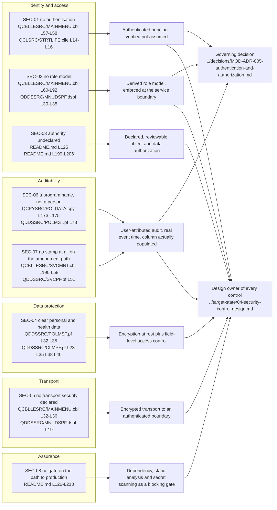

# Security Risk Register

This register enumerates the security findings of the LIFE400 estate. It exists because the first of the two business drivers this assessment answers is to minimize security risk, and a driver stated that way stays unfalsifiable until the risk it refers to is written down as named findings with named closing controls. Eight findings are recorded below as `SEC-01` through `SEC-08`. Each carries the evidence that establishes it, an assessed severity band derived by a stated method, the impact that follows from it, and the control that closes it — and each is anchored in a source member a reader can open, not in a prior description of one.

**Scope.** This document owns three things: the finding set, the impact of each finding, and the control that closes each. It owns nothing else, and the boundaries are deliberate because every one of them is another document's subject. It does **not** implement, script, scaffold or apply any remediation — no source member, schema definition or build artifact is modified anywhere in this assessment, and naming a control here is not the same as building one. It does not design those controls, which is the subject of [the target security control design](../target-state/04-security-control-design.md). It rates each finding but designs no control, and it takes no disposition. It does not restate the platform support-lifecycle argument, which is established with attribution in [the platform and support status document](../current-state/03-platform-and-support-status.md). It does not inventory personal and health data column by column, nor assert which regulatory frameworks apply, both of which belong to [the compliance and data protection document](02-compliance-and-data-protection.md). It does not analyse recovery, atomicity or reconciliation, which belong to [the continuity and recovery risk document](03-continuity-and-recovery-risk.md). And it assigns no migrate, implement or drop verb to anything: every disposition in this assessment is the sole business of [the known defects and stubs register](../current-state/07-known-defects-and-stubs.md), and where a finding below coincides with an entry there, this document supplies the security reading and that register supplies the decision.

**Reading the citations.** A citation of the form `[<path>:<locator>]` is plain text rather than a hyperlink, and points at a path in this repository. Plain text is chosen so a citation stays meaningful in a diff and does not depend on a hosting provider's line-anchor syntax. Every line range cited below was opened and read against the working tree while writing this document; none is carried forward from a prior description. Where a claim rests on an *absence* rather than on a line, the search that establishes the absence is stated so it can be repeated. Platform terminology links to [the IBM i glossary](../reference/glossary-ibm-i.md) on first use in this document.

**What could not be verified, stated once and up front.** No claim below was validated by building or running anything, and none could be. No command available anywhere off the platform can compile, bind or execute this estate: every COBOL program names the platform as its object computer as well as its source computer [QCBLLESRC/MAINMENU.cbl:L27-L28], and there is no test suite in the repository to run in its place. Every finding here therefore rests on a citation a reader can resolve and on a search a reader can repeat. Nothing in this document should be read as having been confirmed by execution.

## How to read a row

Each finding is one row of the register, expressed as a section below and summarised in the table that follows. A row has seven parts, and two of them are completeness bars — the severity and the closing control:

- **ID** — a stable identifier, `SEC-nn`, referenced from the control design and from the executive recommendation. Identifiers are never reused or renumbered.
- **Finding** — what is wrong, stated as a property of the estate rather than as a judgement about it.
- **Evidence** — one or more inline citations, or a stated and repeatable search where the finding is an absence.
- **Severity** — an assessed band, `Critical`, `High`, `Medium` or `Low`, derived by the stated method below. Every row carries one. **A row without a severity is incomplete.**
- **Gap class** — what kind of gap it is: `absent`, `undeclared` or `misapplied`. Derived from the source rather than judged.
- **Impact** — what follows for the business if nothing changes. Impact is reasoned from the evidence, never asserted beyond it.
- **Target control** — the control that closes the finding, with a link to where it is designed. **A row without a closing control is incomplete.** A register that records exposures and leaves any of them without a named closure is a list of complaints rather than an input to a decision, so all eight rows below map to a closing control, and the [control-to-finding forward map](#control-to-finding-forward-map) exists so that the mapping can be checked at a glance rather than taken on trust.

### How severity is assigned, and what the assignment is not

Every finding carries a severity band, because a register that rates nothing cannot be prioritised and this one is meant to be acted on. The band is an **assessed severity under stated assumptions**, not a measurement, and the difference is recorded here rather than left to a reader to infer.

**What the band is a function of.** Four inputs, each of which this repository does establish:

- **The sensitivity of the data reachable through the gap** — using the classification and the 27-column inventory owned by [the compliance and data protection document](02-compliance-and-data-protection.md), so that a gap over cause-of-death data is not rated the same as a gap over a currency code.
- **The breadth of the gap** — whether it applies to one path or to every path in the estate, which is countable from the source.
- **Whether the gap blocks the closure of other findings** — a control that four other controls depend on carries the severity of what it blocks as well as its own.
- **The gap class** — `misapplied` is rated at least as severely as `absent` at the same breadth, because a mechanism that runs and records the wrong subject invites the confidence that a control is in place.

**What the band is not, and what still has to be confirmed.** A severity rating in the formal, installation-specific sense is a function of asset value, threat model, exposure and the configuration of a specific installation, and this repository establishes none of those four. It contains no subsystem description, no device configuration, no network definition, no data-volume figure and no statement of which parties reach the system. So two things are true at once, and the register states both rather than choosing one:

- **The band below is this document's assessment, and it is sufficient to prioritise the work.** It is derived from the four inputs named above, applied consistently across all eight rows, and it is reproducible from the evidence each row already carries.
- **The band is not a substitute for an installation risk assessment, and it is not offered as one.** Asset value, threat model, exposure and the deployed configuration are **confirm-with-the-business items**, and any of the four could move a band in either direction. Where a band would change materially under a different assumption, the row says so.

Two assumptions are load-bearing across every band and are stated once here rather than repeated eight times. First, that the data classified as personal, health-related, risk-derived and financial by the inventory is genuinely sensitive to this business — a classification the schema supports and the business should confirm. Second, that the system is reachable by more than one human being, which the estate's own design implies, since it presents a menu to a signed-on profile and its entry program is documented as a per-user initial program [QCLSRC/STRTLIFE.clle:L14-L16]. If either assumption is false for a given installation, the bands fall.

**The gap class is separate from the band and is derived rather than judged:**

- **absent** — no construct of this kind exists anywhere in the estate. There is nothing to strengthen, and the control is new work.
- **undeclared** — the estate declares nothing and leaves the outcome to the installation it is deployed on. The posture is real but is a property of the environment rather than of the system as delivered, so it cannot be read out of this repository in either direction.
- **misapplied** — a construct exists, runs, and produces the wrong result. This class is the most easily missed, because the presence of the mechanism reads as coverage.

That distinction carries weight for the migration and not only for the reader. An **absent** control is visible against a statement of what should have been there and will never surface in an output comparison; a **misapplied** one is worse than nothing at all, because it invites the confidence that a control is in place.

## The register at a glance

| ID | Finding | Severity | Gap class | Control family | Closing control |
| --- | --- | --- | --- | --- | --- |
| `SEC-01` | No in-application authentication; identity is assumed, captured once for display, and discarded | Critical | absent | Identity and access | Application-level authentication with an authenticated principal carried through the call path |
| `SEC-02` | No role-based access control; every signed-on user reaches the identical option set, and the menu is fixed at compile time in two independent places | Critical | absent | Identity and access | An explicit role model derived from the single undifferentiated menu, enforced at the service boundary |
| `SEC-03` | Object authority is left at the platform default: not one object-creation command in the documented build specifies an authority parameter | High | undeclared | Identity and access | Declared, reviewable authorization on data and objects, expressed in the artifact rather than in the environment |
| `SEC-04` | Personal and health data is stored in clear character and numeric columns, and no encryption construct exists anywhere to protect it | Critical | absent | Data protection | Encryption at rest with field-level access control over the personal and health columns; protection of the same data in transit is `SEC-05` |
| `SEC-05` | No transport security is declared for the only interface the estate has | High | undeclared | Transport | Encrypted transport terminating at an authenticated service boundary |
| `SEC-06` | Attribution names a program rather than a person, is timestamped with a batch process date, and — as the data model establishes — reaches bytes the file never stores, leaving insured-name text in the audit column | High | misapplied | Auditability | User-attributed audit records carrying an authenticated principal and a real event timestamp, written to a column the writing path populates |
| `SEC-07` | The interactive servicing path attributes nothing at all: the one program whose purpose is amending in-force policies rewrites the policy master with no audit statement, and the servicing file's own requesting-user column is unreachable from the code that writes the file | High | absent | Auditability | A mandatory, non-optional user-attributed audit write on every mutation, with the principal carried through the call path |
| `SEC-08` | No security gate exists on the path to production: there is no continuous-integration configuration of any kind, and the documented build is a manual operator sequence with no test or scan step | Medium | absent | Assurance | Automated dependency, static-analysis and secret scanning wired as a gate that fails the path to production |

Five of the eight are **absent**, two are **undeclared** and one is **misapplied**. Read together that distribution is the security half of the business case in one line: this is not a system whose controls have decayed and need strengthening — it is a system that was built to delegate every control to the platform beneath it, and the platform beneath it is the one release-line fact no application change can remediate [README.md:L264].

**Reading the severity distribution.** Three rows are `Critical`, four are `High` and one is `Medium`, and the shape follows directly from the method stated above rather than from emphasis.

- The three `Critical` rows are the ones where the gap is total and reaches the most sensitive data. `SEC-01` and `SEC-02` together mean any party who can sign on reaches every function including the three mutating paths, and `SEC-01` additionally blocks the closure of `SEC-02`, `SEC-06` and `SEC-07` — four findings resting on one missing capability. `SEC-04` is `Critical` because the data reachable through it is the health-related and identifying content the inventory classifies as most sensitive, and because no application mechanism exists that could protect any of it.
- The four `High` rows are gaps that are serious and either narrower in reach or dependent on a factor outside the delivered system. `SEC-03` and `SEC-05` are both `undeclared`: the exposure is real but its magnitude is a property of an installation this repository cannot read, so a band above `High` would be asserting the installation's configuration rather than the system's. `SEC-06` and `SEC-07` remove accountability rather than confidentiality — severe, and one step below the rows that expose the data itself.
- `SEC-08` is `Medium` because it is the only row that creates no exposure of its own. It is the durability control: without it any closure above is point-in-time rather than permanent. Its band is the one most sensitive to a business input — under a stated intention to close the other seven, the value of a gate that keeps them closed rises, and the row would be re-rated upward on that basis.

## SEC-01 — No in-application authentication

**Finding.** The application performs no authentication of its own. It assumes it is already running as an authenticated profile, does not verify that assumption, and holds no credential, session or identity construct of any kind.

**Severity — Critical.** Identity is the input every other access decision needs, and the estate has none: the gap is total rather than partial, it applies to every path in the system, and it blocks the closure of `SEC-02`, `SEC-06` and `SEC-07`. The band rests on the two assumptions stated under [how severity is assigned](#how-severity-is-assigned-and-what-the-assignment-is-not); the reachable data is classified by [the compliance and data protection document](02-compliance-and-data-protection.md), and whether the delegated platform sign-on is adequate for a given installation is a confirm-with-the-business item that does not change this row, because the finding is the application's inability to observe, refuse or record an authentication outcome at all.

**Evidence.** This finding rests principally on an absence, so the search that establishes it is stated rather than summarised. Searching all twenty-four members of the estate — the eight ILE COBOL programs, the five ILE CL programs, the shared [copybook](../reference/glossary-ibm-i.md#copybook) and the ten DDS members — for `AUTHENT`, `PASSWORD`, `CREDENTIAL`, `TOKEN`, `ENCRYPT`, `DECRYPT`, `CIPHER`, `TLS`, `SSL`, `HASH` and `SALT` returns **zero occurrences of each**. The same search for `PERMISSION` and `ROLE` also returns zero. The word `SESSION` does occur, which is why it is worth naming explicitly: every occurrence is comment prose or message text in the entry program — its purpose comment [QCLSRC/STRTLIFE.clle:L9] and the note that it is the entry point for all interactive sessions [QCLSRC/STRTLIFE.clle:L12] — and none is a session construct. The census of the same absence taken across the COBOL layer is owned by [the current-state architecture](../current-state/02-architecture-current-state.md); this register records what follows from it.

Three positive facts complete the row, and each is a line rather than an absence:

- **Identity is available exactly once, and it is spent on the screen.** The menu program reads the signed-on profile with `ACCEPT WS-USER-ID FROM USER` [QCBLLESRC/MAINMENU.cbl:L57] and moves it straight to a screen field on the next statement [QCBLLESRC/MAINMENU.cbl:L58]. It is never stored, and it is never passed onward: none of the four programs the menu dispatches to receives a parameter [QCBLLESRC/MAINMENU.cbl:L73-L79]. The field it lands in is output-only — `MNUUSER` carries no usage letter in the [display file](../reference/glossary-ibm-i.md#display-file) [QDDSSRC/MNUDSPF.dspf:L45], unlike the selection field one screen row above it, which is declared `B` for input and output [QDDSSRC/MNUDSPF.dspf:L39]. The identity is displayed back to the person who already knows it and is then discarded.
- **Authentication is delegated wholly to the platform sign-on.** The entry program's own header documents how it is installed, as a user's [initial program](../reference/glossary-ibm-i.md#initial-program): `CHGUSRPRF USRPRF(username) INLPGM(LIFE400/STRTLIFE)` [QCLSRC/STRTLIFE.clle:L14-L16]. By the time any LIFE400 code runs, a profile has already been established by something outside LIFE400, and nothing inside LIFE400 examines it.
- **One caution belongs with this row, because the same command carries an unrelated attribute.** That configuration comment is the only occurrence of a user-profile keyword anywhere in the tree, and it concerns *what runs* at sign-on. It says nothing whatever about *whose authority* the program runs under. Reading it as evidence of [adopted authority](../reference/glossary-ibm-i.md#adopted-authority) would overstate this system's posture in the one direction that matters, and the glossary entry for that term exists precisely so the mistake is available to be avoided.

One structural observation sharpens the finding rather than merely restating it. `MAINMENU` is the only business program in the estate with no database file and no shared-contract expansion — its entire `FILE-CONTROL` section declares one workstation file and nothing else [QCBLLESRC/MAINMENU.cbl:L32-L36]. So the single place in LIFE400 that knows who the user is, is the single place with no access to the data contract that would let it record who the user is. The gap is not an oversight in one statement; it is where the identity and the persistence layer meet, and in this estate they never do.

**Impact.** Identity in LIFE400 is an assumption rather than an application-enforced fact. There is no in-application control to strengthen, tighten or configure, so any weakness in the delegated mechanism passes through unmitigated, and the application cannot detect, refuse or record an authentication failure because it never observes one. Every finding below that depends on knowing who is acting — the role model in `SEC-02`, the attribution in `SEC-06` and `SEC-07` — is blocked by this one, which is why it is first.

**Closing control.** Explicit application-level authentication in the target, establishing a principal that is verified rather than assumed and then carried through the call path so downstream operations can act on it. Designed in [the target security control design](../target-state/04-security-control-design.md); the choice itself is to be recorded in [MOD-ADR-005](../decisions/MOD-ADR-005-authentication-and-authorization.md), a planned record that has not yet been written.

## SEC-02 — No role-based access control

**Finding.** Every authenticated user receives the identical option set and can reach every function the system has. There is no role, no permission, no authority test and no differentiation of any kind — and the menu is fixed at compile time in two independent places, which makes the gap structural rather than incidental.

**Severity — Critical.** Any party who can sign on can issue a policy, amend an in-force one and adjudicate a death claim, so the absence removes separation of duties across the whole estate rather than on one path. The band is `Critical` rather than `High` for a structural reason as well as a breadth one: the gap is fixed at compile time in two independent places, so no configuration change at any installation can narrow it. Which roles the business actually requires is a confirm-with-the-business item; that there is no role model to migrate is not.

**Evidence.** The whole of the interactive dispatch is one inline loop with no role branch in it. It runs from `PERFORM UNTIL WS-CONTINUE = 'N'` [QCBLLESRC/MAINMENU.cbl:L60] to `END-PERFORM` [QCBLLESRC/MAINMENU.cbl:L92], and inside it the only decisions are two command keys and the raw selection the operator typed, dispatched through `EVALUATE WS-SELECTION` [QCBLLESRC/MAINMENU.cbl:L71]. Nothing in that loop consults the identity captured thirteen lines above it.

The dispatch targets are compile-time literals, so there is no seam at which a check could be introduced without changing and recompiling the program:

| Menu selection | Statement | Anchor |
| --- | --- | --- |
| `1` — new business and policy issuance | `CALL 'NBUWMNT'` | [QCBLLESRC/MAINMENU.cbl:L73] |
| `2` — policy servicing and amendments | `CALL 'SVCMNT'` | [QCBLLESRC/MAINMENU.cbl:L75] |
| `3` — claims adjudication | `CALL 'CLMMNT'` | [QCBLLESRC/MAINMENU.cbl:L77] |
| `4` — policy master inquiry | `CALL 'POLMSTINQ'` | [QCBLLESRC/MAINMENU.cbl:L79] |

There is no dispatch table, no indirection and no parameter on any of the four calls [QCBLLESRC/MAINMENU.cbl:L73-L79], so a called program cannot be told on whose behalf it was invoked even if it wanted to ask.

**The second fixture is the one that makes this structural.** The option list is not assembled at run time from anything — it is literal text compiled into the menu screen. The five options and the sign-off entry are DDS constants [QDDSSRC/MNUDSPF.dspf:L30-L35] inside the [record format](../reference/glossary-ibm-i.md#record-format) `MAINSCR` [QDDSSRC/MNUDSPF.dspf:L19]. So even setting the COBOL aside, the menu cannot be varied per user in principle: doing so means editing DDS and recompiling the display file. The COBOL has no role branch *and* the screen has no way to render a different set of choices. Both halves have to be rebuilt, which is the honest scope of this row.

**Impact.** A user who can sign on can issue a new policy, amend an in-force one and adjudicate a death claim. There is no separation of duties anywhere in the application, no least-privilege boundary, and no way to grant read-only access even though a read-only program exists — the inquiry program opens the policy master for input alone [QCBLLESRC/POLMSTINQ.cbl:L63], but the menu offers it beside the three mutating paths with nothing distinguishing who may take which. The absence has a second consequence for the migration, and it is the more expensive one: because no role has ever been expressed anywhere, **there is no role model to migrate — one has to be derived**, and derivation is a business exercise rather than a translation exercise.

**Closing control.** An explicit role model derived from this single undifferentiated menu, with authorization enforced at the service boundary rather than at the screen, so that a new entry point cannot be added without passing the same check. Designed in [the target security control design](../target-state/04-security-control-design.md), under the decision to be recorded in the planned [MOD-ADR-005](../decisions/MOD-ADR-005-authentication-and-authorization.md).

## SEC-03 — Object authority is left at the platform default

**Finding.** The estate declares no authority for anything it creates. Not one object-creation command in the documented build specifies an authority parameter, so every object — the library, the source files, the data files, the screens and the work-management objects alike — is created with whatever default the installation applies.

**Severity — High.** The data reachable through this gap is the most sensitive in the estate, which argues for a higher band; what holds the row at `High` is that the gap is `undeclared` rather than `absent` — the effective access is a property of an installation this repository cannot read, so a `Critical` band would be asserting a configuration rather than a finding. **This is the row whose band is most likely to move.** An installation review that finds a permissive default over the policy master and the claims file would make it `Critical`; one that finds a restrictive default and a documented authority scheme would make it `Medium`. The band is stated with that dependency attached rather than without it.

**Evidence.** The primary anchor is the library itself: `CRTLIB LIB(LIFE400) TYPE(*PROD) TEXT('ACME LIFE INS SYSTEM')` [README.md:L125], with no `AUT()` parameter. The finding is broader than the library, and the measurement is a single repeatable search: `grep -c "AUT(" README.md` returns **0**. There is no authority parameter anywhere in the eight-step build sequence [README.md:L120-L218] — not on the source physical files [README.md:L127-L130], not on the database files [README.md:L140-L143], not on the display-file and printer-file creations [README.md:L149-L154], and not on the work-management objects [README.md:L199-L206]. Nor is there any authority-granting or authority-revoking command in the tree, and no program is created with an owner user-profile attribute — the absence of adopted authority, which is the control a reader already familiar with the platform would expect to find in an application shaped like this one, is recorded as its own glossary entry for that reason.

**What this row deliberately does not claim.** It does not state an effective authority value, and it does not rate an exposure level. The source cannot establish either, because what the default *is* on any given installation is a property of that installation — a system value and a set of library and object attributes — and this repository contains no configuration of that kind from which to read it. Naming a specific value here would be exactly the fabricated figure this register refuses to produce. **The verifiable claim is narrower and sufficient: authority is not specified, so every object takes the default, and what that default grants is a confirm-with-the-business item.** Saying so is stronger than guessing, because it identifies the question an installation review has to answer instead of pre-empting it with an invention.

**Impact.** Object-level protection is undeclared and therefore unreviewable from the source. Nobody can determine from this repository who can read the insured names in the policy master or the causes of death in the claims file, which means the protection of that data is a property of the environment rather than of the system as delivered — and a property of the environment travels neither with a backup nor with a restore into a second environment. The same absence blocks the parallel run this assessment depends on: a non-production copy of these objects would inherit the same unstated posture, and there is no declared baseline to compare it against.

**Closing control.** Explicit, declared and reviewable authorization on data and objects, expressed in the deployed artifact rather than left to the environment, so that the answer to "who can read this" is a reviewable statement in version control rather than a question for the installation. Designed in [the target security control design](../target-state/04-security-control-design.md).

## SEC-04 — Personal and health data is stored in clear

**Finding.** Personal and health-related attributes are stored as ordinary character and numeric columns with no protection mechanism declared for any of them, and no encryption construct exists anywhere in the estate that could protect them.

**Severity — Critical.** This is the row where the sensitivity input dominates: the data reachable through it includes a coded cause of death, a medical-records indicator, smoking status, an underwriting class and the names of third-party beneficiaries who never interacted with the system. The gap is `absent` rather than `undeclared` — there is no encryption construct anywhere in the twenty-four members to configure in either direction — so unlike `SEC-03` the band does not depend on an installation's settings. Two aggravating factors are already recorded in this row and neither is needed to reach the band: protection cannot be varied between an insured's name and their cause of death, and `SEC-06` deposits insured-name text in a column no protection design would classify as personal.

**Evidence.** The policy master is a [physical file](../reference/glossary-ibm-i.md#physical-file) holding the insured's identity in plain columns: `INSNAME 40A` [QDDSSRC/POLMST.pf:L32] and, as a [zoned decimal](../reference/glossary-ibm-i.md#zoned-decimal) integer, the date of birth `INSDOB 8S 0` [QDDSSRC/POLMST.pf:L35]. The claims file carries the more sensitive content:

| Column | Declaration | Anchor | Why it is in this row |
| --- | --- | --- | --- |
| `CAUSDTH` | `3A` | [QDDSSRC/CLMPF.pf:L23] | Cause of death — health-related information about the insured |
| `MEDRECS` | `1A` | [QDDSSRC/CLMPF.pf:L35] | Records that medical records were received, so it discloses that a medical file on this insured exists |
| `BENNAME` | `40A` | [QDDSSRC/CLMPF.pf:L38] | Names a third party who is not the insured and never consented through the application |
| `BENREL` | `20A` | [QDDSSRC/CLMPF.pf:L40] | Relationship of that third party to the insured — a family-relationship attribute |

No column above carries a protection keyword, and none could be protected by the application either: the exhaustive search recorded under `SEC-01` finds no `ENCRYPT`, `DECRYPT`, `CIPHER` or `HASH` construct anywhere in the twenty-four members. There is no key management because there are no keys.

Two properties of this row are worth separating from the column list, because both extend the exposure beyond the four rows above. The first is that the beneficiary columns describe a person who never interacted with the system at all, so a control designed only around the insured would miss them. The second is that `SEC-06` establishes a second, unintended location for personal data: the ten bytes that reach the policy master's audit column are the leading characters of the insured's name, so insured-name text sits in a column whose own text says it holds a user identifier [QDDSSRC/POLMST.pf:L78] — a place no protection design would think to look unless it were told.

**Scope boundary.** This row is the security framing only. The column-by-column inventory of personal and health data, the retention and erasure analysis, and the question of which regulatory frameworks apply are all owned by [the compliance and data protection document](02-compliance-and-data-protection.md), and this register neither reproduces that inventory nor asserts any framework as applicable. Field types, lengths and the persisted-versus-transient classification are owned by [the current data model](../current-state/04-data-model-current-state.md).

**Impact.** Sensitive personal and health-related attributes are readable in clear by any process or profile that can reach the file, and — given `SEC-03` — which profiles those are cannot be determined from this repository. There is no field-level protection, so protection cannot be varied between an insured's name and their cause of death even though the two carry different sensitivity. Combined with `SEC-06` and `SEC-07`, there is also no record of who read or changed any of it, so an exposure of this data could not afterwards be scoped from anything the system stores.

**Closing control.** Encryption at rest, with field-level access control over the personal and health columns so that reaching a table is not the same as reading its most sensitive attributes. Designed as `CTL-REST` in [the target security control design](../target-state/04-security-control-design.md).

**Why this row's closure stops at rest, and what it depends on.** Data at rest and data in transit are two exposures of the same content, and the register keeps them as two rows with two controls rather than folding transit into this one. `SEC-04` maps one-to-one onto `CTL-REST` and `SEC-05` maps one-to-one onto `CTL-TRANSIT`, which is how [the target security control design](../target-state/04-security-control-design.md) traces them, and this row is written to match that mapping exactly rather than to overlap it. **The dependency is nonetheless real and is recorded rather than left implicit: closing `SEC-04` alone protects this data at rest and leaves it in clear on the wire, so the protection of the personal and health columns is complete only when `SEC-05` is closed as well.** Reading the two rows together is required; reading either alone understates the exposure.

## SEC-05 — No transport security is declared for the only interface

**Finding.** The estate has exactly one interface, a character-terminal interface, and it declares no transport protection for it. What a given installation arranges around that interface cannot be read from this repository in either direction.

**Severity — High.** Credentials and the whole of the returned policy, insured and claim data traverse the channel, which is breadth enough for a higher band; the row is held at `High` for the same reason as `SEC-03` — the gap is `undeclared`, and what an installation has arranged around the datastream is unknowable from this repository. The aggravating factor that keeps it from falling further is stated in the impact: nothing in the delivered system depends on that arrangement or notices its removal, so even a protected installation has no application-level guarantee. Whether the channel is in fact protected is a confirm-with-the-business item and would move this row to `Medium`.

**Evidence.** The mechanism is citable precisely. A program reaches the terminal by declaring its screen as a workstation device with transaction organization — `SELECT MNUDSPF ASSIGN TO WORKSTATION-MNUDSPF ORGANIZATION IS TRANSACTION` [QCBLLESRC/MAINMENU.cbl:L32-L36] — and the screen itself is defined declaratively in DDS, with its record format at [QDDSSRC/MNUDSPF.dspf:L19] on a fixed twenty-four row by eighty column grid [QDDSSRC/MNUDSPF.dspf:L12]. That grid is the geometry of the [5250 datastream](../reference/glossary-ibm-i.md#5250-datastream). There is no other presentation path in the estate: no HTTP, no socket, no message broker and no API surface of any kind. The exhaustive search under `SEC-01` finds no `TLS`, `SSL`, `ENCRYPT` or `CIPHER` construct anywhere, so the application contributes nothing to protecting the channel.

**Attribution discipline, and the reason this row is classed undeclared rather than absent.** That a native 5250 datastream carries no transport protection of its own is a **property of the platform, not a measurement taken in this repository**, and it is characterised as such by the publishers this assessment consulted rather than asserted here as a finding about LIFE400. The external platform evidence is owned and attributed in [the platform and support status document](../current-state/03-platform-and-support-status.md). What *this* repository establishes is narrower and fully citable, and it is deliberately all this row claims:

- The estate contains no transport-security construct of any kind, by the search recorded under `SEC-01`.
- The presentation layer is a DDS-described workstation file reached as a device [QCBLLESRC/MAINMENU.cbl:L32-L36], with no notion of a content type, a cookie or a session token available to it at all.
- The repository contains no subsystem description, no device configuration and no network definition, so whether an installation front-ends the datastream with a secured emulator or tunnels it is unknowable from here. The glossary states the same boundary in the same terms, and it is stated the same way in both places on purpose.

**Impact.** Credentials presented at sign-on and the policy, insured and claim data returned to the screen traverse the network with no confidentiality or integrity guarantee that the application provides or can be configured to provide. Because the guarantee, if any, lives entirely outside the delivered system, it is invisible to review, cannot be asserted in an audit from anything in version control, and can be lost by an environment change that touches no application code. The reason this matters even where an installation *has* arranged protection is that nothing in the system depends on that arrangement or notices its removal.

**Closing control.** Encrypted transport terminating at an authenticated service boundary, so that channel protection becomes a declared property of the deployed system rather than an unstated property of the network it sits on. Designed in [the target security control design](../target-state/04-security-control-design.md).

## SEC-06 — Attribution names a program rather than a person

**Finding.** Five of the six mutating programs stamp an audit field, and every one of them writes its own program name rather than an identity, paired with a batch process date rather than an event time. The finding has a second half that changes its character entirely: as the data model establishes, those stamps do not reach the audit column at all, and the bytes that do reach it are insured-name text.

**Severity — High.** This row removes accountability rather than confidentiality, which places it one band below the rows that expose the data itself. Two factors hold it at `High` rather than `Medium`. It applies to every mutating path that stamps anything — five of the six — so the breadth is the estate. And it is the register's only `misapplied` row: a stamp that runs, is the right length and the right type, and records the wrong subject invites the confidence that attribution exists, so a reviewer reading `LSTUSR` finds ten plausible characters with no signal that they are insured-name text. A `misapplied` control is rated at least as severely as an `absent` one at the same breadth for exactly that reason.

**Evidence — the five stamping sites.** Each was opened and confirmed individually, and each is followed on the very next statement by the companion date move, so **neither element of the audit pair is derived from a user or from an event**:

| Program | Audit-user statement | Anchor | Companion date statement |
| --- | --- | --- | --- |
| `NBUWMNT` — online new business | `MOVE 'NBUWMNT' TO PM-LAST-ACTION-USER` | [QCBLLESRC/NBUWMNT.cbl:L497] | [QCBLLESRC/NBUWMNT.cbl:L498] |
| `NBUWB` — batch new business | `MOVE 'NBUWB' TO PM-LAST-ACTION-USER` | [QCBLLESRC/NBUWB.cbl:L138] | [QCBLLESRC/NBUWB.cbl:L139] |
| `SVCBILB` — batch servicing and billing | `MOVE 'SVCBILB' TO PM-LAST-ACTION-USER` | [QCBLLESRC/SVCBILB.cbl:L140] | [QCBLLESRC/SVCBILB.cbl:L141] |
| `CLMADJB` — batch claim adjudication | `MOVE 'CLMADJB' TO PM-LAST-ACTION-USER` | [QCBLLESRC/CLMADJB.cbl:L136] | [QCBLLESRC/CLMADJB.cbl:L137] |
| `CLMMNT` — online claims | `MOVE 'CLMMNT' TO PM-LAST-ACTION-USER` | [QCBLLESRC/CLMMNT.cbl:L281] | [QCBLLESRC/CLMMNT.cbl:L282] |

Every companion statement is `MOVE PM-PROCESS-DATE TO PM-LAST-ACTION-DATE`, so the recorded time is the process date the run is working under rather than the moment the change happened. An audit entry therefore answers neither *who* nor *when*.

**Evidence — the contract and the column.** The stamped items live in the shared contract's audit group [QCPYSRC/POLDATA.cpy:L172]: `PM-LAST-ACTION-USER PIC X(10)` [QCPYSRC/POLDATA.cpy:L173] and `PM-LAST-ACTION-DATE PIC 9(08)` [QCPYSRC/POLDATA.cpy:L175]. The intended destination is the policy master's audit column, `LSTUSR 10A TEXT('LAST ACTION USER')` [QDDSSRC/POLMST.pf:L78]. The column's own text promises a user; the code delivers a program name. The two are the same declared length and the same declared type, which is exactly why the mismatch reads as harmless and is not.

**Evidence — the half that changes the row.** [The current data model](../current-state/04-data-model-current-state.md) owns the record lengths and the byte-offset map between the contract and the file, and it establishes that the audit group begins well past the end of the policy master's record: the group starts at [QCPYSRC/POLDATA.cpy:L172], and the item at [QCPYSRC/POLDATA.cpy:L173] lies beyond the last byte the file stores, so **no rewrite of this file transfers it**, however exactly item and column correspond by name and type. It further establishes what the ten bytes at the audit column's position actually are: the leading characters of the contract's insured-name item. Reading the two halves together, the correct statement of this finding is not that the audit column holds a program name — it is that **the column holds insured-name text on every path, and the program name none of the five stamps writes has ever reached storage at all.** That reading supersedes the narrower one, and it is recorded here rather than quietly dropped because the difference is operationally decisive: the narrower reading would send a migration hunting for program names in a column that has never held one.

**Corroboration in the CL layer, cited but not dispositioned.** The one message in the estate that looks like a session audit trail records the wrong subject in the same way. The entry program retrieves the job's current library into a variable [QCLSRC/STRTLIFE.clle:L24] and concatenates it into a message reading `LIFE400 SESSION STARTED BY` [QCLSRC/STRTLIFE.clle:L31], sent as a [CPF message](../reference/glossary-ibm-i.md#cpf-message) to the application message queue [QCLSRC/STRTLIFE.clle:L32-L34]. The text promises a user and carries a library name. It is cited here only as corroboration that no layer of this system captures a user identity; the disposition of that observation belongs to [the known defects and stubs register](../current-state/07-known-defects-and-stubs.md), and this document assigns none.

**Impact.** No action in LIFE400 is attributable to a person. There is no accountability for a change, no investigation path for insider misuse, and no basis for an access review — and the migration consequence is that there is no attribution history to carry forward, because none was ever stored. The positional half makes it worse than a null column in two specific ways. A reviewer or a migration reading `LSTUSR` finds ten plausible-looking characters and has no signal that they are name text, so the field is **affirmatively misleading rather than merely empty**; and because those characters are part of the insured's name, personal data has been deposited in a column that no data-protection design would classify as personal, which is why this finding is cross-referenced from `SEC-04`.

**Closing control.** User-attributed audit records carrying an authenticated principal from `SEC-01` and a real event timestamp, written to a column the writing path demonstrably populates — the last clause matters, because a target that merely defines an attribution column would reproduce this finding exactly. Designed in [the target security control design](../target-state/04-security-control-design.md), with the identity it depends on to be recorded in the planned [MOD-ADR-005](../decisions/MOD-ADR-005-authentication-and-authorization.md).

## SEC-07 — The interactive servicing path attributes nothing at all

**Finding.** The interactive servicing program rewrites the policy master and sets no audit value anywhere, so the one path whose entire purpose is changing in-force policies does not even attempt attribution. The servicing file that same program writes declares a requesting-user column that the program cannot address at all.

**Severity — High.** Narrower than `SEC-06` in the number of programs it covers — one rather than five — and equal to it in band, because the path it covers is the estate's only dedicated amendment path and neither of the two destinations the schema provides for an identity has a writer. The severity input that carries the row is not breadth but consequence: a plan change, a sum-assured increase or a reinstatement leaves no trace of who requested or applied it. The band is unchanged by any installation setting, because the finding is the absence of a statement in the source.

**Why this row concerns the path it concerns, stated without a volume claim.** This register asserts no transaction volume anywhere, because no volume, throughput or usage figure exists in this repository to cite and inventing a ranking would be exactly the fabricated figure refused under [how to read a row](#how-to-read-a-row). What the source *does* establish is the operational significance of this path directly: it is the only program in the estate dedicated to amending policies that are already in force, dispatching six distinct amendment types — plan change, sum-assured change, billing-mode change, rider addition, rider removal and reinstatement [QCBLLESRC/SVCMNT.cbl:L179-L185], against the same six-value domain the shared contract declares [QCPYSRC/POLDATA.cpy:L119-L124]. Those are the changes an insurer most needs to be able to attribute after the fact, and this is the path that attributes none of them.

**Why this is a separate row from `SEC-06`.** The two findings are different in kind and must not be merged. `SEC-06` is a **misapplied** control: a stamp exists, runs on five paths and writes the wrong subject. `SEC-07` is an **absent** one: on the sixth path no stamp exists to be wrong. The distinction survives the positional analysis above and is in fact sharpened by it — the five programs at least declare an intent to attribute, which is a seam a migration can find and correct, whereas this path declares none, so there is nothing to find. Merging the rows would lose the conclusion that the estate's dedicated amendment path is the one with no attribution statement in it at all.

**Evidence — the unstamped rewrite.** `SVCMNT` applies an amendment by rewriting the policy master record, `REWRITE WS-POLICY-MASTER-REC` [QCBLLESRC/SVCMNT.cbl:L190], and immediately writing a servicing record [QCBLLESRC/SVCMNT.cbl:L191]. It sets no audit field at any point: `grep -c "PM-LAST" QCBLLESRC/SVCMNT.cbl` returns **0**. Of the six mutating COBOL programs it is the only one that stamps nothing — the census of one stamp each in the other five is the table under `SEC-06`, and the two non-mutating programs are outside the comparison, the menu because it opens no database file [QCBLLESRC/MAINMENU.cbl:L32-L36] and the inquiry program because it opens the policy master for input only [QCBLLESRC/POLMSTINQ.cbl:L63].

**Evidence — the second limb, with its mechanism.** The servicing file declares a column for exactly the identity this row is about: `USERID 10A TEXT('REQUESTING USER ID')` [QDDSSRC/SVCPF.pf:L51], in the record format keyed on the service-request identifier [QDDSSRC/SVCPF.pf:L54]. No writer populates it, and the reason is worth more to a migration team than the observation. The program that writes the file describes its record as a single undifferentiated area — `01 SVCPF-RECORD PIC X(200)` [QCBLLESRC/SVCMNT.cbl:L58] — and writes that area whole [QCBLLESRC/SVCMNT.cbl:L191]. Because [record-level I/O](../reference/glossary-ibm-i.md#record-level-io) transfers the described area positionally, a program that describes the record as one flat field **has no name by which to address any column of it**. The requesting-user column is not merely unset; it is unreachable from the code that writes the file. The lengths and the record-description arithmetic behind that are owned by [the current data model](../current-state/04-data-model-current-state.md).

**Ownership boundary.** Both limbs coincide with an entry in [the known defects and stubs register](../current-state/07-known-defects-and-stubs.md), which owns the migrate, implement or drop decision for each; this row supplies evidence, impact and closing control and assigns no verb. The same two statements [QCBLLESRC/SVCMNT.cbl:L190-L191] also carry a write-atomicity exposure — two dependent writes with no enclosing transaction — and that dimension is owned by [the continuity and recovery risk document](03-continuity-and-recovery-risk.md). It is named here only to explain why one pair of lines is cited by three documents at once.

**Impact.** On the estate's dedicated amendment path, neither destination for an identity has a writer: not the policy master's audit column and not the servicing file's own requesting-user column. A servicing amendment — a plan change, a sum-assured increase, a reinstatement — therefore leaves no trace of who requested or applied it in either of the two places the schema provides for one. The consequence for the migration is that a servicing-request record with real, individually addressable columns, the requesting user among them, is **new work rather than a data conversion**, because no column of that file has ever had a value moved into it.

**Closing control.** A mandatory, non-optional user-attributed audit write on every mutation, with the principal carried through the call path so that no operation can commit without recording who performed it, and with the servicing request modelled as addressable columns rather than as one opaque area. Designed in [the target security control design](../target-state/04-security-control-design.md).

## SEC-08 — No security gate on the path to production

**Finding.** Nothing checks any of the seven findings above on the way in. The repository contains no continuous-integration configuration of any kind, and the documented build is a manual sequence of platform commands with no test step and no scanning step among them.

**Severity — Medium.** The lowest band in the register, and deliberately so: this is the only row that creates no exposure of its own. It is the durability control — without it, every closure above is a point-in-time property rather than a permanent one, which is why it is a finding rather than an observation about tooling. **This row's band is the most sensitive to a business input.** Under a stated intention to close the other seven findings, the value of a gate that keeps them closed rises and this row should be re-rated upward; the band assumes only that the estate continues to be changed by hand, which its documented eight-step manual build supports [README.md:L120-L218].

**Evidence.** The absence was established by direct probe of the working tree rather than inferred: there is no `.github` directory, no pipeline directory of any other flavour, and a search of the whole tree outside version-control metadata finds no workflow, pipeline or shell-script file at all. What stands in place of a pipeline is the eight-step operator sequence documented for a real platform [README.md:L120-L218] — create the library and source files [README.md:L124-L131], upload members, create the data files [README.md:L139-L144], create the screens and reports [README.md:L148-L155], compile and bind the COBOL [README.md:L157-L177], compile and bind the CL [README.md:L179-L193], create the work-management objects and the nightly schedule entry [README.md:L195-L212], and start the system [README.md:L216-L218]. Every step is a command an operator issues. None is a test, a scan, a review gate or an automated check of any kind, and nothing in the sequence can fail a change on quality grounds.

**Impact.** There is no dependency scanning, no static analysis, no secret detection and no gate that could block a change. Every finding in this register could be reintroduced after being closed, with nothing in the delivery path to detect it — which is the specific reason this row exists as a finding rather than as an observation about tooling. It is the control that keeps the other seven closed, and without it their closure is a point-in-time property rather than a durable one. Two further consequences follow directly: no build carries evidence that it was checked, so no assertion about the security posture of a deployed object can be traced to anything; and because every step is manual, the posture of any given deployment depends on an operator having issued the right commands rather than on a repeatable process.

**Scope boundary.** This row registers the finding and stops there. Creating pipeline configuration is out of scope for this entire assessment, so no workflow file is added by it, and nothing in this document should be read as implying that a gate exists today or was created by this work.

**Closing control.** Automated dependency, static-analysis and secret scanning wired into the target delivery path as a gate that fails the path to production rather than reporting after the fact. Designed in [the target security control design](../target-state/04-security-control-design.md).

## D-08 — The security control gap map

The map reads left to right: the eight findings on the left, grouped by the control family each belongs to, flowing into the control that closes each, and terminating in the document that owns the design of all of them. Every node naming a real artifact carries its member path in the node label, so the diagram carries its own traceability and does not depend on the prose around it. Two findings converge on one control, which is the map's most useful single feature: `SEC-06` and `SEC-07` are different findings with one closure, so the control is built once rather than twice.

One reading of the map is worth stating in words, because it is the argument for the recommended path rather than a property of the picture. Nothing on the left flows into a *stronger version of itself*. Every arrow crosses from a gap to a control that does not exist in the estate today, which is what it means for five findings to be classed absent and two undeclared: the security half of this business case is not a hardening exercise applied to existing controls, it is the introduction of controls into a system that delegated all of them.

## Control-to-finding forward map

Every row of the register resolves here, and the table exists so the completeness bar stated under [how to read a row](#how-to-read-a-row) can be checked mechanically: **eight findings, eight finding-to-control mappings, seven unique controls, no blanks.**

The two counts differ and the difference is the point rather than an accounting quirk. Every finding has exactly one closing control, so there are eight mappings; `SEC-06` and `SEC-07` map onto the *same* control, so the eight mappings resolve to seven distinct controls. That is a design outcome recorded deliberately — the two findings are two failures of one missing capability, so the capability is built once — and the gap map `D-08` below shows the convergence directly, with two arrows entering one node. That heading carries an em dash, which two markdown renderers slugify differently, so it is referenced by name here rather than by anchor — every document in this set is written to render identically on a repository host and in a built site. Any count of "controls" in this document means unique controls, and any count of "closures" means mappings.

| Finding | Closing control | Where the control is designed | Governing decision record (planned) |
| --- | --- | --- | --- |
| `SEC-01` | Application-level authentication establishing a verified principal | [Target security control design](../target-state/04-security-control-design.md) | [MOD-ADR-005](../decisions/MOD-ADR-005-authentication-and-authorization.md) — planned |
| `SEC-02` | Derived role model with authorization enforced at the service boundary | [Target security control design](../target-state/04-security-control-design.md) | [MOD-ADR-005](../decisions/MOD-ADR-005-authentication-and-authorization.md) — planned |
| `SEC-03` | Declared, reviewable authorization on objects and data | [Target security control design](../target-state/04-security-control-design.md) | — |
| `SEC-04` | Encryption at rest with field-level access control (`CTL-REST`); protection of the same data in transit is `SEC-05` | [Target security control design](../target-state/04-security-control-design.md) | — |
| `SEC-05` | Encrypted transport terminating at an authenticated service boundary | [Target security control design](../target-state/04-security-control-design.md) | — |
| `SEC-06` | User-attributed audit records with a real event timestamp, in a populated column | [Target security control design](../target-state/04-security-control-design.md) | [MOD-ADR-005](../decisions/MOD-ADR-005-authentication-and-authorization.md) — planned |
| `SEC-07` | Mandatory user-attributed audit write on every mutation, principal carried through the call path | [Target security control design](../target-state/04-security-control-design.md) | [MOD-ADR-005](../decisions/MOD-ADR-005-authentication-and-authorization.md) — planned |
| `SEC-08` | Dependency, static-analysis and secret scanning as a blocking gate | [Target security control design](../target-state/04-security-control-design.md) | — |

Four of the eight are governed by a single decision record, and the grouping is not arbitrary: `SEC-01`, `SEC-02`, `SEC-06` and `SEC-07` all depend on the same unresolved question — what a principal is in the target and how it reaches the point of a write. That question is to be settled once, in [MOD-ADR-005](../decisions/MOD-ADR-005-authentication-and-authorization.md) — a planned record, not yet written and therefore not yet governing — and the rationale is not restated in this register, so a superseding decision changes one file rather than four passages of prose. The remaining four rows — `SEC-03`, `SEC-04`, `SEC-05` and `SEC-08` — carry no governing record because each is settled by design rather than by a reversible choice.

## Coverage of the Driver 1 success criteria

[The business drivers and success criteria document](../01-business-drivers-and-success-criteria.md) states nine measurable criteria for the security driver. This register is the evidence base for six of them; the other three concern layers this register does not own, and saying so is more useful than implying coverage that is somewhere else.

| Criterion | Findings that establish the condition it replaces | Owner if not this register |
| --- | --- | --- |
| `SC-1.1` — every finding carries a named closing control | All eight rows, checkable in the [forward map](#control-to-finding-forward-map) | — |
| `SC-1.2` — no dependence on a platform release without a fix supply | No finding of its own; this is the layer beneath the application | [Platform and support status](../current-state/03-platform-and-support-status.md) |
| `SC-1.3` — every mutating action attributed to a named principal whose actor type is recorded, and to the initiating identity as well where work was queued or scheduled | `SEC-06`, `SEC-07` | Principal kinds are defined in [target security control design](../target-state/04-security-control-design.md) |
| `SC-1.4` — access differentiated by role | `SEC-02`, with `SEC-01` as its prerequisite | — |
| `SC-1.5` — personal and health data protected at rest by a named mechanism | `SEC-04` | Column inventory in [compliance and data protection](02-compliance-and-data-protection.md) |
| `SC-1.6` — a documented retention and erasure path | No finding of its own; the absence of any erasure operation is an architectural census | [Compliance and data protection](02-compliance-and-data-protection.md) |
| `SC-1.7` — every channel protected in transit by a named mechanism | `SEC-05` | — |
| `SC-1.8` — a scan gates the path to production | `SEC-08` | — |
| `SC-1.9` — compiled-in configuration becomes external configuration | No finding of its own; it is a prerequisite for the environment that `SEC-03` and `SEC-08` need, not a control gap in itself | [Operational model](../current-state/06-operational-model.md) |

`SC-1.9` deserves the note it gets there. It is not a security control, but it blocks two of them in practice: verifying object authorization and running a scanning gate both need an environment that is not production, and the application library is written into the source that reaches it. A register that ignored it would be complete and still unactionable.

## What this register does not establish

Four limits are recorded rather than left for a reader to discover, because a security document that overstates its reach is worse than one that is narrower and honest about it.

- **No installation-specific risk rating.** Every row carries an assessed severity band, derived by the method set out under [how severity is assigned](#how-severity-is-assigned-and-what-the-assignment-is-not) and sufficient to prioritise the work. What it is not is a formal installation risk assessment: asset value, threat model, exposure and the deployed configuration are not in this repository, they remain confirm-with-the-business items, and `SEC-03`, `SEC-05` and `SEC-08` each say in their own row which way their band would move once those inputs are supplied.
- **No effective authority value.** `SEC-03` establishes that authority is unspecified, not what the resulting access is. That is a property of the installation and cannot be read from source.
- **No statement about what any installation has configured around the terminal channel.** `SEC-05` claims only what the estate declares. The repository holds no subsystem description, device configuration or network definition, so both the reassuring and the alarming reading are unsupported and neither is offered.
- **No verification by execution, of anything.** Restating the note from the opening because it bears on every row: nothing here was confirmed by a build or a test, none could be [QCBLLESRC/MAINMENU.cbl:L27-L28], and behavioural accuracy rests on citation resolution and human review alone.

## Figures owned by other documents

This document owns the finding set `SEC-01` through `SEC-08`, the assessed severity of each, the gap classification, the impact of each finding and the control that closes each. Every other quantity in the assessment has exactly one owning document, and restating one here would create a second place for it to be wrong.

- Member register, line counts and estate size — [the system inventory](../current-state/01-system-inventory.md).
- Layers, the call and dispatch graph, paragraph inventories and the census of absent language constructs, including the absence of any deletion or sequential access — [the current-state architecture](../current-state/02-architecture-current-state.md).
- Platform support status, the consequence of the declared runtime baseline, and every externally attributed platform figure — [the platform and support status document](../current-state/03-platform-and-support-status.md).
- Column inventories, record lengths, the byte-offset map between the shared contract and the policy master, and the persisted-versus-transient classification — [the current data model](../current-state/04-data-model-current-state.md).
- The business-rule census and the inline rule-identifier bands — [the business rule inventory](../current-state/05-business-rule-inventory.md).
- Work-management object roles, the message vocabulary, the nightly schedule, the build sequence and the configuration surface — [the operational model](../current-state/06-operational-model.md).
- The migrate, implement or drop disposition of every defect, stub and anomaly, including the audit entries this register reads for security consequence — [the known defects and stubs register](../current-state/07-known-defects-and-stubs.md).
- The personal and health data inventory, retention and erasure exposure, and regulatory-framework applicability, which this document asserts nowhere — [the compliance and data protection document](02-compliance-and-data-protection.md).
- Write atomicity, journaling, backup, recovery objectives and reconciliation — [the continuity and recovery risk document](03-continuity-and-recovery-risk.md).
- The design of every control named above, control by control, with traceability back to the finding it closes — [the target security control design](../target-state/04-security-control-design.md).
- The identity and role model itself, to be captured as a supersedable decision — [MOD-ADR-005](../decisions/MOD-ADR-005-authentication-and-authorization.md), planned and not yet written.

## Source citations

Every member cited above was read as evidence and left unmodified. No source member, shared contract or DDS member is annotated, corrected, reformatted or commented by this document or by any part of this assessment, and no remediation for any finding recorded here is applied to the running system — a register names controls, it does not build them. The machine-generated corpus under `.swm/` is neither cited nor modified by this document: every claim above is anchored in a source member or in a repeatable search, not in a prior description. **No user-specified rules were provided for this project**, so this document is held instead to the enterprise-standard practices this assessment commits to — evidence-cited claims, diagrams as code, build-enforced structural integrity, non-invasive documentation, one owning document per figure, and no fabricated or temporal content.

- ILE COBOL — `QCBLLESRC/MAINMENU.cbl`, `QCBLLESRC/NBUWMNT.cbl`, `QCBLLESRC/NBUWB.cbl`, `QCBLLESRC/SVCMNT.cbl`, `QCBLLESRC/SVCBILB.cbl`, `QCBLLESRC/CLMMNT.cbl`, `QCBLLESRC/CLMADJB.cbl`, `QCBLLESRC/POLMSTINQ.cbl`
- ILE CL — `QCLSRC/STRTLIFE.clle`
- Shared data contract — `QCPYSRC/POLDATA.cpy`
- DDS database members — `QDDSSRC/POLMST.pf`, `QDDSSRC/SVCPF.pf`, `QDDSSRC/CLMPF.pf`
- DDS display member — `QDDSSRC/MNUDSPF.dspf`
- Repository overview, cited for the declared platform baseline and for the eight-step build sequence in which no authority parameter and no scanning step appears — `README.md`

All twenty-four members of the estate were searched to establish the absences recorded under `SEC-01`, `SEC-03`, `SEC-04`, `SEC-05` and `SEC-08`; the members listed above are those a specific line of this document cites.
