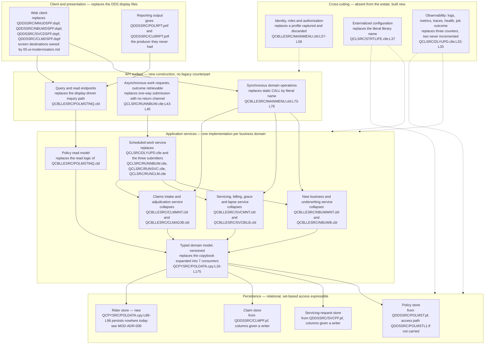

# LIFE400 Target Architecture

This document describes the destination. It records the layering the replacement system is built in, the service boundaries drawn across it, the application programming interface it has to construct because the estate has none, the configuration it externalizes because today's configuration is compiled into source, the observability it establishes because today's telemetry does not work, and — stated as explicitly as everything it adds — the mechanisms of the current design that it deliberately does not carry across. It is the first document of the target-state layer and the one the other four rest on: the per-program decomposition in [the program-to-service map](02-program-to-service-map.md), the column-by-column typing in [the target data model and schema mapping](03-target-data-model-and-schema-mapping.md), the control-by-control closure in [the target security control design](04-security-control-design.md) and the screen-by-screen destination in [the UI modernization document](05-ui-modernization.md) all sit inside the boundaries set here.

**Scope, and the separation this layer exists to preserve.** This document describes **where** LIFE400 is going and says nothing about **how it gets there**. That separation is deliberate and load-bearing: the route can be revised — a different strategy, a different order of work, a different coexistence topology — without a line of the destination changing, and it is much harder to revise a destination that has been written down mixed together with its route. The practical test applied to every sentence below is whether it would still be true if the migration strategy were replaced tomorrow. If it would, it belongs here. If it would not, it belongs in the migration layer. So this document does **not** sequence the work, which is owned by [the recommended path](../migration/02-recommended-path.md); it does **not** map programs and [paragraphs](../reference/glossary-ibm-i.md#paragraph) onto target operations one by one, which is owned by [the program-to-service map](02-program-to-service-map.md); it does **not** type a single column, which is owned by [the target data model and schema mapping](03-target-data-model-and-schema-mapping.md); it does **not** design the security controls it names, which is owned by [the target security control design](04-security-control-design.md); and it does **not** choose a user-interface component library, because none is specified anywhere in this assessment and that gap is recorded rather than resolved by [the UI modernization document](05-ui-modernization.md). It also does not re-derive the current state. Every fact about the existing system below is cited to the member that establishes it or to the current-state document that owns it, and where a sibling owns a table this document cites the table instead of copying it.

**Reading the citations.** Every claim about the existing system carries an inline citation of the form `[<path>:<locator>]` immediately after the claim. Citations are plain text and deliberately not hyperlinks: a plain-text citation stays meaningful in a diff and does not depend on a hosting provider's line-anchor syntax. Statements about the **target** carry no citation, because there is nothing yet to cite — they are proposals, and the distinction between an evidenced fact about LIFE400 and a proposal for its replacement is exactly what the citation marks. The same discipline applies inside the diagram: every node standing for something that exists today names its member path in the node label itself, so the diagram still says which member it describes when it is read on its own. No member of the estate is annotated, altered, reformatted or commented by this documentation set, and the machine-generated corpus under `.swm/` is read as prior art and never edited. Platform terms link to [the IBM i glossary](../reference/glossary-ibm-i.md) on first use in this document.

**What this document is measured against.** The success criteria are owned by [the business drivers and success criteria](../01-business-drivers-and-success-criteria.md) and are not restated here. Four of them are discharged by this document in particular: `SC-1.9`, that configuration presently compiled into source becomes external configuration so a non-production environment can be stood up without editing a source member; `SC-2.3`, that an engineer can be productive on the target without [ILE](../reference/glossary-ibm-i.md#ile-integrated-language-environment) COBOL, fixed-format [DDS](../reference/glossary-ibm-i.md#dds-data-description-specifications), workstation screen or platform work-management skills; `SC-2.7`, that each business domain has exactly one implementation of its rules; and `SC-2.9`, that onboarding does not depend on access to the legacy platform. Two ambiguity resolutions bind it: `A-02`, the hosting-agnostic target with a containerized reference deployment and a deferred hardware exit, and `A-08`, that this work plans modernization rather than performing it.

**No temporal content, and no cost.** No date, duration, calendar sequence, effort figure or headcount appears below. Where ordering matters it is expressed as a dependency — this layer cannot be built before that one is decided — and never as a schedule. Staging the work into stages with entry criteria, exit criteria and verification gates is owned by [the recommended path](../migration/02-recommended-path.md). Third-party figures are attributed to their publisher wherever they appear, and none is presented as a measurement of this system; this document depends on very few, because the destination is argued from the estate rather than from the market.

**Nothing below rests on a build.** No claim in this document was verified by compiling, binding or running LIFE400, because ILE COBOL and [ILE CL](../reference/glossary-ibm-i.md#cl-control-language) require the IBM i platform and no off-platform compiler for them exists, as [the platform and support status document](../current-state/03-platform-and-support-status.md) establishes. Accuracy here rests on citations a reader can resolve against the working tree, on the current-state documents that own each measurement, and on the fact that a target-state proposal is falsifiable by review rather than by execution.

## The target stack, consumed rather than re-derived

The language, runtime and datastore are settled elsewhere. They are produced by [the target-language decision matrix](../talent/02-target-language-decision-matrix.md) and recorded as decisions in [MOD-ADR-001, target language and runtime](../decisions/MOD-ADR-001-target-language-and-runtime.md) and [MOD-ADR-003, target datastore](../decisions/MOD-ADR-003-target-datastore.md). This document states the position and links to the reasoning rather than reproducing it, so that superseding the choice means superseding one record instead of editing every document that depends on it.

- **The primary recommendation is Java on a current long-term-support release, with Spring Boot and PostgreSQL.** Spring Boot is named as the server-side application framework; it is a runtime choice and implies nothing about user-interface components.
- **The runner-up is C#/.NET.** TypeScript and Node, and Python, are evaluated and **rejected for the core**. Go is evaluated and not selected. None is rejected as a bad language; each is rejected against a property this estate makes decisive.
- **The decisive criterion is exact decimal arithmetic.** Money in this system is fifteen digits with two decimals, declared independently on both sides of the same field — as [zoned decimal](../reference/glossary-ibm-i.md#zoned-decimal) in DDS [QDDSSRC/POLMST.pf:L52] and again as a thirteen-digit-plus-two-decimal picture clause in the shared contract [QCPYSRC/POLDATA.cpy:L98-L105] — and it is read back to policyholders through the estate's only signed field [QCPYSRC/POLDATA.cpy:L106]. **No monetary value in the target passes through binary floating point at any point**, including at a driver boundary or a serialization boundary. The typing that implements this is owned by [the target data model and schema mapping](03-target-data-model-and-schema-mapping.md) and recorded in [MOD-ADR-006, date and decimal representation](../decisions/MOD-ADR-006-date-and-decimal-representation.md).
- **The target is hosting-agnostic, with a containerized reference deployment.** The container is an illustrative form rather than a requirement: it is named so that "hosting-agnostic" is not a way of avoiding the question, and it is not named as a commitment to any particular orchestrator, provider or region. Nothing in the layering below depends on where the system runs.
- **Exit from the AS/400 hardware is deliberately deferred and decoupled from this work**, and is recorded as such in [MOD-ADR-007, hardware exit deferred](../decisions/MOD-ADR-007-hardware-exit-deferred.md). The reason is set out by [the platform and support status document](../current-state/03-platform-and-support-status.md): the language-and-skills driver and the hardware-exit driver rest on different evidence and carry different blast radii, and folding the smaller decision into the larger one is a documented failure mode that inflates scope and stalls work that could have proceeded on its own. This document is one of the places that has to keep them apart, so it states the target's layering, its service boundaries and its configuration model without a hosting commitment anywhere in them. Deferred is not rejected: nothing here argues for remaining on the hardware.

One consequence of that separation is worth making explicit, because it is easy to lose. **A target described without a hosting commitment is not a target described vaguely.** Every boundary below — which service owns which data, what the API surface carries, where configuration comes from, what the observability contract is — is fully determined without knowing where the process runs. That is the property that makes the hardware decision genuinely deferrable rather than merely postponed.

## Target layers

LIFE400 as built divides into four layers written in three languages: orchestration and session entry in ILE CL, presentation in DDS, business logic in ILE COBOL, and persistence in DDS again — the file definitions and the screen definitions being written in the same declarative language and compiled into different object types. That decomposition, with its evidence, is owned by [the current-state architecture](../current-state/02-architecture-current-state.md) and is not re-derived here; the member register it sits on, with per-member line counts and the language distribution across the estate's twenty-four members, is owned by [the system inventory](../current-state/01-system-inventory.md). Neither is restated. What this document takes from them is the shape, because two properties of that shape determine the target more than the layer count does — and because at this scale the shape, rather than the volume, is what a target has to answer.

- **Every program cooperates around one indexed file, and coordination between programs is therefore coordination through a file.** Seven of the eight COBOL programs open the policy master, no business program calls another, and there is no shared service, module or routine library anywhere between them — a census of `CALL` across all eight members finds four occurrences and all four are the menu's dispatch [QCBLLESRC/MAINMENU.cbl:L73-L79]. The policy master is the only thing the programs have in common.
- **The shared data contract is a textual include that is also the record description each program opens the file under, without being a description of that file.** Seven programs expand the same [copybook](../reference/glossary-ibm-i.md#copybook) into their file section [QCPYSRC/POLDATA.cpy:L16-L175], so the contract has no independent runtime existence and no version of its own, and the correspondence between a contract item and a stored column is an intent the estate documents rather than a binding its code enforces. The offset analysis behind that statement is owned by [the current data model](../current-state/04-data-model-current-state.md).

The target replaces both properties rather than reproducing them, and the two replacements are the whole substance of the layering.

| As-built layer | What carries it today | Target layer | What changes, and why |
|---|---|---|---|
| Session entry and orchestration | ILE CL: session entry [QCLSRC/STRTLIFE.clle:L18], three batch submitters [QCLSRC/RUNNBUW.clle:L21], one scheduled driver [QCLSRC/DLYUPD.clle:L24] | Client and presentation, plus a scheduled-work service | Orchestration splits by kind. Interactive navigation becomes a client concern; asynchronous work becomes a first-class scheduled-work service rather than a script that manipulates platform objects |
| Presentation | Four DDS [display files](../reference/glossary-ibm-i.md#display-file) driving a fixed character grid [QDDSSRC/MNUDSPF.dspf:L12], one [record format](../reference/glossary-ibm-i.md#record-format) at a time [QDDSSRC/MNUDSPF.dspf:L19], [QDDSSRC/NBUWDSPF.dspf:L24], [QDDSSRC/SVCDSPF.dspf:L23], [QDDSSRC/CLMDSPF.dspf:L21] | Client, over the API surface | The screen stops being a file the program reads and writes. Destination screens, their formats and their field mappings are owned by [the UI modernization document](05-ui-modernization.md) |
| Application | ILE COBOL, each domain implemented twice — once interactive, once batch [QCBLLESRC/NBUWMNT.cbl:L22] against [QCBLLESRC/NBUWB.cbl:L39] | Application services: one domain-and-rules service per business area, plus a read model | Each duplicated pair collapses to one implementation. This is the single largest structural change and is recorded in [MOD-ADR-004](../decisions/MOD-ADR-004-single-domain-rules-service.md) |
| Shared contract, cutting across the application layer | A copybook expanded at compile time into seven consumers [QCPYSRC/POLDATA.cpy:L16-L175] | A typed domain model owned by the service that owns the data | The contract gains an independent existence and a version. Agreement stops being a build-time property maintained by recompiling every consumer together |
| Persistence | DDS [physical files](../reference/glossary-ibm-i.md#physical-file) reached by [record-level I/O](../reference/glossary-ibm-i.md#record-level-io) through a declared key, with one [logical file](../reference/glossary-ibm-i.md#logical-file) no program names [QDDSSRC/POLMSTL1.lf:L13-L14] | A relational datastore behind each service | Set-based access becomes expressible for the first time. Column-level typing, keys and constraints are owned by [the target data model and schema mapping](03-target-data-model-and-schema-mapping.md) |
| — (nothing in the estate carries these) | Identity is captured and discarded [QCBLLESRC/MAINMENU.cbl:L57-L58]; configuration is a literal in compiled source [QCLSRC/STRTLIFE.clle:L37]; telemetry is three counters, two of them never incremented [QCLSRC/DLYUPD.clle:L32-L33] | Cross-cutting: identity and authorization, externalized configuration, observability | Wholly new. Each is absent from the estate rather than differently implemented in it, which is why each is described below as construction |

Read down the last column and the layering makes one claim: **the target is not a re-layering of LIFE400 but a re-basing of it.** One of the six rows is wholly new; one dissolves a compile-time coupling into a versioned contract; one collapses six COBOL programs into three domain services; one splits orchestration by kind, sending interactive navigation to a client and asynchronous work to a service; and one turns a screen from a file the program reads and writes into a client over an interface. Only the persistence row is a recognisable descendant of its predecessor, and even there the access pattern changes.

The diagram is D-09 in this assessment's diagram register, and it is the only diagram this document owns. Solid arrows are request paths; dashed arrows are cross-cutting concerns applied to a layer rather than called by it. Four conventions in it are deliberate.

- **Every node standing for something that exists today names its member path in the label**, so a node states which member it replaces without depending on the surrounding prose. Nodes with no legacy counterpart say so — the rider store and the three cross-cutting boxes are new, not renamed.
- **The scheduled-work service is drawn inside the application layer and reached through the API surface**, not beside it. That placement is the design claim: asynchronous work in the target is a service with an interface, an outcome and telemetry, whereas today it is a CL member that manipulates platform objects and a direct call that returns nothing a caller can read [QCLSRC/DLYUPD.clle:L75].
- **The inquiry program appears twice, deliberately.** Its two responsibilities separate in the target: the interface it exposed through a shared display file becomes a query endpoint, and the keyed read behind it becomes the read model. Splitting it is the point, not a duplication of the node.
- **The domain model sits between the services and the stores rather than inside any one service.** It is drawn that way for the same reason the current-state diagram draws the copybook cutting across the application layer: the model is genuinely shared. The difference is that in the target it is shared as a versioned artifact with an owner, not as a textual expansion whose agreement is a property of when each consumer was last compiled.

## Service boundaries

Boundaries are drawn from what the estate already separates, not from an abstract decomposition imposed on it. LIFE400 divides into seven capability areas along its own source-object boundaries, and those areas resolve into three business domains — new business, servicing and claims — plus four areas that are not domains in their own right: session and navigation, the billing lifecycle that belongs to the servicing domain, inquiry, and the shared contract with its persistence. Naming the areas before naming the services matters, because the mapping between them is not one-to-one: two areas share a single target service, and one area's *trigger* becomes a service the estate has no counterpart for at all.

| Capability area | Members that carry it today | Target home | Boundary rationale |
|---|---|---|---|
| Interactive session and menu dispatch | [QCLSRC/STRTLIFE.clle:L18], [QCBLLESRC/MAINMENU.cbl:L21], [QDDSSRC/MNUDSPF.dspf:L19] | Client, plus identity and authorization | Not a domain. It is navigation and session, and it has no business rule of its own — the menu opens no database file and expands no copybook, its only `SELECT` being the display file [QCBLLESRC/MAINMENU.cbl:L32-L36] |
| New business underwriting and policy issuance | [QCBLLESRC/NBUWMNT.cbl:L22], [QCBLLESRC/NBUWB.cbl:L39], [QCLSRC/RUNNBUW.clle:L21], [QDDSSRC/NBUWDSPF.dspf:L24] | New business and underwriting service | A domain. One rule set, reached today by two paths that must be kept in agreement by hand |
| Policy servicing and amendments | [QCBLLESRC/SVCMNT.cbl:L22], [QCBLLESRC/SVCBILB.cbl:L37], [QCLSRC/RUNSVC.clle:L21], [QDDSSRC/SVCPF.pf:L14] | Servicing service | A domain, and the one whose two paths differ in coverage rather than in structure alone |
| Billing, grace and lapse lifecycle | The grace and lapse engine inside the batch servicing program [QCBLLESRC/SVCBILB.cbl:L196], driven by the nightly job [QCLSRC/DLYUPD.clle:L75] | Servicing service, invoked by the scheduled-work service | **Not a separate service.** It is a lifecycle over the same policy state the servicing service owns, and splitting it out would put two owners on one state transition. What is separate is its *trigger*, which becomes scheduled work |
| Death claim intake and adjudication | [QCBLLESRC/CLMMNT.cbl:L21], [QCBLLESRC/CLMADJB.cbl:L31], [QCLSRC/RUNCLM.clle:L21], [QDDSSRC/CLMPF.pf:L14] | Claims service | A domain, and the one whose two paths can already answer differently rather than merely repeat one another |
| Policy master inquiry | [QCBLLESRC/POLMSTINQ.cbl:L22], three paragraphs [QCBLLESRC/POLMSTINQ.cbl:L87], [QCBLLESRC/POLMSTINQ.cbl:L101], [QCBLLESRC/POLMSTINQ.cbl:L112], driving the servicing display file its own program does not own [QCBLLESRC/POLMSTINQ.cbl:L33], [QCBLLESRC/SVCMNT.cbl:L33] | Policy read model | Not a domain. It declares the policy master [QCBLLESRC/POLMSTINQ.cbl:L38-L42] and opens it for input only [QCBLLESRC/POLMSTINQ.cbl:L63], so it is a query surface rather than a rules owner and is bounded separately for that reason |
| Shared data contract and persistence | [QCPYSRC/POLDATA.cpy:L16-L175], [QDDSSRC/POLMST.pf:L14], [QDDSSRC/POLMSTL1.lf:L13-L14], [QDDSSRC/SVCPF.pf:L14], [QDDSSRC/CLMPF.pf:L14] | Typed domain model and the stores behind each service | Not a domain. It is the substrate every domain stands on, which is exactly why the target gives it an owner and a version instead of a compile-time expansion |

Four boundary rules follow, and each is a consequence of something measured about the estate rather than a preference.

- **Each online and batch pair collapses to exactly one implementation.** Every one of the three business domains is implemented twice today, once interactive and once batch, and the duplication is of three different kinds — a near-clone in new business, one responsibility with two structures in servicing, and genuine divergence in claims, where the two paths can already answer differently. Those measurements, and the divergence inventory behind them, are owned by [the current-state architecture](../current-state/02-architecture-current-state.md); the decision to collapse each pair is recorded in [MOD-ADR-004](../decisions/MOD-ADR-004-single-domain-rules-service.md); and which paragraph becomes which operation is owned by [the program-to-service map](02-program-to-service-map.md). This document states only the boundary rule: **a domain's rules exist once, and the interactive path and the scheduled path are two callers of that one implementation rather than two implementations of it.** Where the two paths currently disagree, which answer is correct cannot be read from the source — because the source is what disagrees — so each divergence is settled as a business decision before conversion, a dependency owned by [the known defects and stubs register](../current-state/07-known-defects-and-stubs.md).
- **A service owns its data, and no other service reaches past it.** Today the opposite holds: seven of eight programs open the same policy master and coordinate through it, with no shared service between them [QCBLLESRC/MAINMENU.cbl:L73-L79]. The target inverts that, and the inversion is what makes the collapse above enforceable — if two services could both write policy state, one rules implementation per domain would be a convention rather than a structure.
- **Reading is bounded separately from writing.** The inquiry program is the estate's own precedent for this: it opens the policy master for input only [QCBLLESRC/POLMSTINQ.cbl:L63] and decomposes into three paragraphs that get a key, look up a record and display it [QCBLLESRC/POLMSTINQ.cbl:L87], [QCBLLESRC/POLMSTINQ.cbl:L101], [QCBLLESRC/POLMSTINQ.cbl:L112]. A read model is not a performance device here; it is the boundary that lets a query surface serve reporting and inquiry without acquiring the right to change anything.
- **Scheduled work is a service, not a script.** Today the nightly job is a CL member that sets a [library list](../reference/glossary-ibm-i.md#library-list), issues [overrides](../reference/glossary-ibm-i.md#override), calls one program with two sentinel literals and sends a message [QCLSRC/DLYUPD.clle:L56], [QCLSRC/DLYUPD.clle:L60-L61], [QCLSRC/DLYUPD.clle:L75], [QCLSRC/DLYUPD.clle:L91-L95]. In the target it is a service with an interface, an outcome and telemetry, invoking the domain services rather than reaching into their data. This is the boundary that DEF-01 and DEF-02 in the defect register both land on, and both carry the disposition `implement`.

**What a service boundary is not, in this target.** It is not a deployment boundary. Nothing above requires three separately deployed processes, and nothing forbids it: the boundaries are ownership boundaries — of rules, of data and of an interface — and how they are packaged is a hosting question, deliberately left open by the hosting-agnostic position above. Stating this explicitly matters because a reader who reads "service" as "separately deployed process" would find a decision here that this document has not made and does not need to make.

## An API surface where none exists today

**LIFE400 has no application programming interface of any kind.** This is a measured absence rather than an impression. A search across all 24 members for every construct by which this estate could speak to another system — transport and protocol names, socket and queueing constructs, markup and interchange formats, embedded query language, data areas and user spaces, and mail or file-transfer verbs — returns no match anywhere; the census is owned by [the current-state architecture](../current-state/02-architecture-current-state.md) and was re-run against the working tree for this document with the same result. There is no HTTP, no REST, no SOAP, no socket, no message broker, no remote procedure call and no interchange format in the estate. There is also no data-definition-language member: the four source directories contain only ILE COBOL, ILE CL, copybook and DDS members [README.md:L27-L55].

What the estate does have is four inter-program mechanisms, and enumerating them precisely is what establishes that none of them is an interface in the sense the target needs.

| Mechanism the estate has | Evidence | Why it is not an API |
|---|---|---|
| Static `CALL` to a literal program name | [QCBLLESRC/MAINMENU.cbl:L73-L79] | Resolved at compile time, so the set of reachable destinations is a property of a compiled artifact. Adding one is a source change and a recompile, not a configuration change |
| Asynchronous submission through [`SBMJOB`](../reference/glossary-ibm-i.md#sbmjob) to a [job queue](../reference/glossary-ibm-i.md#job-queue) | [QCLSRC/RUNNBUW.clle:L43-L45] | One-way. Control returns as soon as the work is queued and the message that follows confirms a submission rather than a result [QCLSRC/RUNNBUW.clle:L49-L50]; there is no channel by which an outcome could come back |
| Positional parameter linkage | [QCBLLESRC/NBUWB.cbl:L79] | Fixed-length values matched by position and by convention, with no compile-time binding between a caller's argument list and its callee's declaration. The three submitters are not even consistent about order — two put the policy first [QCLSRC/RUNNBUW.clle:L21], [QCLSRC/RUNSVC.clle:L21] and one the claim [QCLSRC/RUNCLM.clle:L21] |
| A shared contract expanded textually into each consumer | [QCPYSRC/POLDATA.cpy:L16-L175] | An agreement between compilations, not between running components. There is no negotiated version, no schema identifier and no run-time check |

**So the target's API surface is genuinely new construction, and that is an advantage rather than a gap.** The point deserves stating positively, because a reader can easily take "there is no API" as a deficiency to be apologised for. It is not. An estate with an existing published interface constrains its replacement twice over: the interface's shape has to be preserved for the sake of whatever consumes it, and the migration acquires an external contract it does not control. LIFE400 has neither constraint. **There is no external integration contract to preserve, so the target's integration surface can be defined by what the business needs rather than by what the legacy system happens to expose.** No consumer outside the estate can break, because no consumer outside the estate exists.

Three capabilities the surface has to carry follow from the boundaries above rather than from any convention, and each answers a specific thing the estate cannot do.

- **Synchronous domain operations**, replacing dispatch by literal name. The reachable destination set becomes data rather than compiled code, which is what removes the constraint that the estate's navigable surface is encoded in one compiled member [QCBLLESRC/MAINMENU.cbl:L73-L79].
- **Asynchronous work requests whose outcome is retrievable.** This is the capability the estate most conspicuously lacks: a submitted job's return code and message are written into the record area the program then closes, and the census finds no message-sending call and no executable `DISPLAY` in any of the eight COBOL members, so nothing in the application layer reports an outcome to anybody. Worse, the pair does not even reach an outcome column — by the byte-offset map owned by [the current data model](../current-state/04-data-model-current-state.md) it lands on insured, benefit and premium columns instead. The target requirement is therefore not "return the outcome the estate already computes" but "give the outcome somewhere to go", which is construction.
- **Query and read endpoints** over the read model, replacing a display-file-driven inquiry program [QCBLLESRC/POLMSTINQ.cbl:L22] and giving the two [printer file](../reference/glossary-ibm-i.md#printer-file) layouts a producer they have never had [QDDSSRC/POLRPT.prtf:L15-L64], [QDDSSRC/CLMRPT.prtf:L15-L58].

**What this document deliberately does not specify.** No protocol, no route, no payload shape, no serialization format and no interface definition appears above or anywhere below. Those are implementation artifacts, and this assessment plans modernization rather than performing it. Stating a route table here would also fix a decision that the boundaries above do not require and that a later reader would reasonably expect to find justified.

## Externalized configuration

**Runtime configuration in LIFE400 lives in platform objects and CL source rather than in files or environment variables.** The complete surface — sixteen rows, each stating where the value lives, what varying it requires today, and the evidence for both — is owned by [the operational model](../current-state/06-operational-model.md) and is not duplicated here. This document takes from it the requirement, anchored on the six facts that generate it.

- **The application library name is a literal in the call itself** [QCLSRC/STRTLIFE.clle:L37], and in every file override [QCLSRC/DLYUPD.clle:L60-L61], and in each submission's four object names [QCLSRC/RUNNBUW.clle:L43-L46]. There is no indirection anywhere: no variable is initialised from outside the program.
- **The library list is manipulated per session** — the application library is pushed to the front on entry [QCLSRC/STRTLIFE.clle:L27] and removed again on the way out [QCLSRC/STRTLIFE.clle:L40] — so which objects a name resolves to is a property of session state rather than of a declared binding.
- **File resolution is bound by job-scoped overrides** issued before the work and deleted after it [QCLSRC/DLYUPD.clle:L60-L61], [QCLSRC/DLYUPD.clle:L98-L99], [QCLSRC/RUNSVC.clle:L44-L45]. Because the scope is the job that issues them, the nightly driver's overrides do bind its work — it calls its program synchronously in the same job [QCLSRC/DLYUPD.clle:L75] — while the three submitters' overrides bind the submitter and not the submitted program. That asymmetry is owned by [the operational model](../current-state/06-operational-model.md) and dispositioned as `implement` by [the known defects and stubs register](../current-state/07-known-defects-and-stubs.md).
- **The date source is a system value**, retrieved by the nightly driver as the only date entering the estate through CL [QCLSRC/DLYUPD.clle:L45].
- **Plan parameters are not a table.** They are literals assigned inside a conditional over the plan code, in each program that needs them [QCBLLESRC/NBUWB.cbl:L145-L159], and the shared contract carries thirteen parameter fields that are populated at run time and never persisted [QCPYSRC/POLDATA.cpy:L39-L52]. A product term therefore cannot be changed without editing and recompiling COBOL.
- **There is no configuration file, environment variable or parameter object anywhere in the estate**, and no member reads a manifest or an externalized value at run time [README.md:L27-L55].

**The consequence that matters most for the plan is one sentence long: the hard-coded library name makes it impossible to stand up a parallel environment without editing source.** The build procedure creates exactly one library [README.md:L125], there is no development or staging counterpart anywhere in the repository, and standing up a second instance would mean editing the literal in every CL member that names the first [QCLSRC/STRTLIFE.clle:L27], [QCLSRC/RUNNBUW.clle:L37-L38], [QCLSRC/RUNSVC.clle:L44-L45], [QCLSRC/RUNCLM.clle:L44-L45], [QCLSRC/DLYUPD.clle:L60-L61] and recompiling them. That is a direct dependency between this document and the migration layer, and it is worth naming as one: **running the existing system beside a replacement, which is what any comparison-based cutover requires, needs an environment that does not exist today and cannot be created by configuration.** The coexistence topology is owned by [the coexistence and integration document](../migration/03-coexistence-and-integration.md), the comparison itself by [the parallel run and output parity document](../migration/06-parallel-run-and-output-parity.md), and the constraint is a stated premise of [MOD-ADR-002](../decisions/MOD-ADR-002-migration-pattern.md).

Four target requirements follow, and they are requirements rather than a mechanism because naming a configuration provider would be an implementation choice this document is not making.

- **Every environment-specific value is supplied from outside the built artifact.** Nothing that differs between environments — a datastore location, a credential reference, a schedule, a message destination — is compiled into it. The test is `SC-1.9`: standing up a non-production environment requires no source change.
- **Environment identity is itself externalized**, so a second instance is a deployment rather than a source change. This is the requirement that makes environment separation possible at all, and [the continuity and recovery risk document](../risk/03-continuity-and-recovery-risk.md) names it as a prerequisite rather than a later convenience.
- **A unit of work states its own data binding rather than inheriting its caller's resolution.** This replaces the estate's mechanism directly: today a submitted program resolves its unqualified file names through the library list its job inherited from whoever submitted it, and the [job description](../reference/glossary-ibm-i.md#job-description) every submission names supplies none [QCLSRC/RUNNBUW.clle:L43-L46]. In the target, which data a unit of work operates on is part of the request or of the service's own configuration, never a property of the session that happened to start it. That is the single most consequential externalization requirement here, because it is the one that decides whether two instances of the system can be told apart.
- **Reference data is data, not code.** Plan parameters, product terms, grace windows and rate factors become configured reference data with a lifecycle of their own, so changing a product term is a data change rather than a recompilation of five programs.

**What externalization does not mean here.** It does not mean secrets in configuration files. Credential handling is a control, and it is designed by [the target security control design](04-security-control-design.md) rather than here. And it does not extend to the *format* of configuration: no file layout, key naming scheme or provider is specified, for the same reason no route table is.

## Observability

**Today the estate's telemetry is declarative rather than functional.** The nightly job declares three counters, each initialised to zero — an update count [QCLSRC/DLYUPD.clle:L32], a lapse count [QCLSRC/DLYUPD.clle:L33] and an error count [QCLSRC/DLYUPD.clle:L34] — and only the error count is ever incremented, in the catch-all monitor on the sweep call [QCLSRC/DLYUPD.clle:L77]. The update count is copied into a variable prepared to carry it into a message [QCLSRC/DLYUPD.clle:L87] and that variable is then never referenced again, because the completion text is assembled from the process date and the error count alone [QCLSRC/DLYUPD.clle:L88-L89]. So the update count does not merely report zero — it reaches no message at all. The lapse count is never touched after its declaration. The reference-counting table behind those statements is owned by [the operational model](../current-state/06-operational-model.md), and the whole finding is dispositioned `implement` as DEF-02 by [the known defects and stubs register](../current-state/07-known-defects-and-stubs.md).

Outcome signalling is a [message queue](../reference/glossary-ibm-i.md#message-queue) send: the completion text goes to the system operator and to the application's own queue [QCLSRC/DLYUPD.clle:L91-L95]. Alongside it the CL layer monitors five [CPF message](../reference/glossary-ibm-i.md#cpf-message) identifiers, whose vocabulary is owned by [the operational model](../current-state/06-operational-model.md).

Two properties of this make observability a construction task rather than an upgrade, and the second is the sharper one.

- **The application layer emits nothing.** A census of all eight COBOL members finds no message-sending call and no executable `DISPLAY` — a result owned by [the current-state architecture](../current-state/02-architecture-current-state.md) and re-run here — so every signal the estate produces comes from the CL layer [QCLSRC/STRTLIFE.clle:L32-L33], [QCLSRC/DLYUPD.clle:L91-L95], [QCLSRC/RUNNBUW.clle:L49-L50]. The programs that do the work are silent by construction.
- **A run that did nothing useful and a run that did everything produce byte-identical output.** The completion message carries the date and an error count [QCLSRC/DLYUPD.clle:L88-L89], the error count can only be raised by one catch-all monitor [QCLSRC/DLYUPD.clle:L76-L77], and the sweep it guards is a single call carrying two sentinel literals rather than an iteration [QCLSRC/DLYUPD.clle:L75]. Success and silent failure are therefore indistinguishable from the job's own output. That is not a reporting gap; it is the absence of any basis on which the nightly run could be trusted as evidence of anything.

The target's observability contract answers those two properties directly. It is stated as a contract rather than a tool selection, because naming a vendor or a library would be an implementation choice.

| Signal | What the target must provide | The estate's counterpart |
|---|---|---|
| Structured logs | Machine-parseable records emitted by the services themselves, correlated across a request, carrying the acting identity and never carrying personal or health data in clear text | None. No application-layer emission of any kind |
| Metrics | Counted work, per operation and per outcome, actually incremented where the work happens rather than declared beside it | Three declared counters, two never incremented [QCLSRC/DLYUPD.clle:L32-L33] |
| Traces | A request followed across service boundaries, so a slow or failed operation is attributable to a component | None. Coordination is through a shared file, which leaves no trace to follow [QCPYSRC/POLDATA.cpy:L16-L175] |
| Health and readiness | A stated liveness and readiness position per service, checkable without inspecting data | None. Nothing in the repository reports whether the system is able to work |
| Job outcome | Every unit of scheduled or asynchronous work reports what it processed, what it changed, what it skipped and what failed — to a destination a caller can read | A message carrying the date and an error count [QCLSRC/DLYUPD.clle:L88-L89], with the work count discarded [QCLSRC/DLYUPD.clle:L87] |
| Audit record | Every mutating operation attributed to a named human user, in a column the writing path actually populates | Program-name literals, and one mutating path that stamps nothing at all [QCBLLESRC/SVCMNT.cbl:L190]. Severity and the closing control are owned by [the security risk register](../risk/01-security-risk-register.md) and [the target security control design](04-security-control-design.md) |

Three properties are required of scheduled work in particular, because it is the place where the estate's telemetry fails hardest and where [the continuity and recovery risk document](../risk/03-continuity-and-recovery-risk.md) names the requirement explicitly.

- **Idempotent.** Re-running a unit of work after a partial failure must not double-apply it. This is a hard requirement rather than a nicety, because the estate offers no transactional boundary to fall back on: its two-file writes are independent operations with no unit of work around them [QCBLLESRC/SVCMNT.cbl:L190-L191].
- **Checkpointed.** A set-based sweep must record how far it reached, so a failure is resumable rather than restartable-from-nothing.
- **Loud on failure.** A failed unit of work must be distinguishable from a successful one in the signal it emits. The estate's nightly job is the counter-example — its completion text carries only a date and an error count [QCLSRC/DLYUPD.clle:L88-L89] — and it is the reason this property is stated as a requirement instead of assumed.

**A deployment pipeline is part of this layer, stated as a requirement and no further.** The documented build is eight steps of platform commands a human types [README.md:L120-L218] with no test step and no scan step among them, and the repository contains no pipeline configuration of any kind. The target requires a build that is executed rather than typed, gated by the characterization suite owned by [the characterization test strategy](../migration/05-characterization-test-strategy.md) and by the dependency and security scanning owned by [the target security control design](04-security-control-design.md). No pipeline file, container definition or infrastructure-as-code artifact is produced by this assessment, and none is specified here: this document establishes that the gate exists in the target and leaves its form to the work that builds it.

## The thin integration surface

Two measured facts make the target's external surface genuinely small, and both are worth stating precisely because the conclusion drawn from them is stronger than either fact alone.

**Every feature reports its outcome through one shared pair of fields.** A return code and a return message, declared once in the shared contract [QCPYSRC/POLDATA.cpy:L36-L37] and used by every domain. There is no per-feature result structure, no error taxonomy and no second channel. The pair does not, however, reach a caller or an outcome column: it lives in the record area rather than in linkage storage, and by the byte-offset map owned by [the current data model](../current-state/04-data-model-current-state.md) the bytes it occupies fall on insured, benefit and premium columns of the policy master. So the estate's outcome contract is simultaneously the simplest possible one and one that delivers nothing — which is why the target's obligation is to give the outcome a destination rather than to preserve a mechanism.

**No feature has any external dependency.** The two candidates that sound like external calls are not calls at all, and both were checked in the source rather than inferred from a name.

- **The reinsurance referral is a program-local flag.** It is a working-storage item with a single condition name [QCBLLESRC/NBUWB.cbl:L69-L70], set in place when the sum assured exceeds a threshold [QCBLLESRC/NBUWB.cbl:L472], and read in the very next paragraph of the same program to decide whether the policy is issued or referred [QCBLLESRC/NBUWB.cbl:L485]. It is never persisted and never transmitted. Nothing leaves the program.
- **The claim payment mode is a stored attribute.** It is a one-character item in the shared contract with two condition names for cheque and for automated clearing [QCPYSRC/POLDATA.cpy:L158-L160], persisted as a column of the claims file [QDDSSRC/CLMPF.pf:L54]. It records how a payment is to be made; it does not make one, and there is no payment provider, no bank interface and no outbound call anywhere in the estate.

**The honest conclusion is that there is no outbound integration to preserve, so the target's external surface is a design choice rather than an inherited constraint.** That is a genuinely unusual position for a system of this age and it should be treated as an asset: whatever the target integrates with — a payment provider, a reinsurance partner, a document store, a general ledger — it integrates with because the business decided it should, on terms the target sets, and not because a legacy contract has to be honoured. The corollary is equally important and is the reason this section is not simply good news: **a thin surface is not a trivial one.** Every capability the estate implies but does not implement — a real payment instruction, a real reinsurance referral, a report a user can obtain — becomes new work in the target rather than a port, and each of those is a row in [the known defects and stubs register](../current-state/07-known-defects-and-stubs.md) carrying the disposition `implement` rather than `migrate`.

## What is deliberately not replicated

A target architecture is defined as much by what it declines to carry across. Each row below is a **mechanism** of the current design that the target replaces with a different one, recorded here so that its omission is found later as a decision rather than as an oversight.

**How this register relates to the defect register, because the two must not compete.** [The known defects and stubs register](../current-state/07-known-defects-and-stubs.md) owns the `migrate` / `implement` / `drop` disposition of every defect, stub and inert feature, and it is the only place a disposition verb is assigned. This table assigns none. Where a row below corresponds to a register entry, the register's verb is quoted and the row states only what happens to the *mechanism* — which is a separate question from what happens to the *capability*. The nightly sweep is the clearest case: the capability is dispositioned `implement`, so a real sweep exists in the target, and the mechanism — one call carrying two sentinel literals — is what is not replicated. Reading either as a contradiction of the other would be a misreading of both.

| Mechanism not carried across | Evidence in the estate | Why the target does not reproduce it | Register alignment |
|---|---|---|---|
| Dispatch fixed at compile time by static `CALL` to a literal program name | [QCBLLESRC/MAINMENU.cbl:L73-L79] | The application's whole navigable surface is encoded in one compiled member, so adding a destination is a source change and a recompile. In the target the reachable operation set is data and authorization decides who reaches it | The inert reports option on the same screen is DEF-04, `implement`; this row is about the dispatch mechanism, not that option |
| Each business domain implemented twice, the two bodies kept in agreement by hand | [QCBLLESRC/NBUWMNT.cbl:L22] against [QCBLLESRC/NBUWB.cbl:L39] | Nothing in the build notices a divergence, and in two of the three domains the pairs already answer differently. One implementation per domain is the boundary rule above; the per-paragraph mapping is owned by [the program-to-service map](02-program-to-service-map.md) | The behavioural divergences are DEF-07, `migrate`, settled as a business decision before conversion |
| A logical file declaring an access path over the policy master, keyed on the same field the physical file already keys itself on, declaring no columns of its own, and named by no program | [QDDSSRC/POLMSTL1.lf:L13-L14] | It duplicates a key that already exists and has no reader. The register records that it needs no target counterpart, which is a mapping decision; index design in the target follows from query need rather than from this member | Not a register row; owned as a mapping decision by [the current data model](../current-state/04-data-model-current-state.md) |
| Job-scoped file overrides as the mechanism that binds a program to its data, issued and then deleted around the work | [QCLSRC/DLYUPD.clle:L60-L61], [QCLSRC/DLYUPD.clle:L98-L99], [QCLSRC/RUNSVC.clle:L44-L45] | Binding becomes a property of which job happens to be running the program, and for submitted work the overrides are in the wrong job entirely. The target replaces it with the requirement that a unit of work states its own data binding | The misplaced submitter overrides and the absent library list are DEF-03, `implement`; the redundant claims-file override is DEF-09, `drop` |
| Every asynchronous unit of work directed at a single job queue, with no expressed concurrency, priority or class | [QCLSRC/RUNNBUW.clle:L43], [QCLSRC/RUNSVC.clle:L50], [QCLSRC/RUNCLM.clle:L50] | Batch work is one serial stream in which a long-running job delays every other submission and nothing separates an operator's ad-hoc request from overnight processing. The target's scheduled-work service treats concurrency and isolation as configuration rather than as an accident of there being one queue | Serialization is owned as an operational fact by [the operational model](../current-state/06-operational-model.md); the queue's unattached state is part of DEF-03, `implement` |
| The nightly sweep expressed as one call carrying two sentinel literals in place of real keys | [QCLSRC/DLYUPD.clle:L75] | There is no loop, no cursor and no iteration in the member, and the callee has no branch on the sentinel — it treats it as an ordinary key. The member's own comment concedes that a full implementation would need a separate driver program to read the policy master sequentially [QCLSRC/DLYUPD.clle:L65-L69], which is the capability the estate never grew | DEF-01, `implement`. The capability exists in the target; this mechanism does not |
| A flat, undifferentiated record area written to the servicing file | [QCBLLESRC/SVCMNT.cbl:L58] with the write at [QCBLLESRC/SVCMNT.cbl:L191] | The area is declared as a single 200-byte item, so no column of the file has a writer and the file's own requesting-user column [QDDSSRC/SVCPF.pf:L51] is never populated. The target's servicing store is written through the typed domain model, column by column | DEF-15, `implement`. Both secondary files gain real columns rather than having an undifferentiated area carried forward |
| A shared record description expanded textually into seven consumers, serving simultaneously as each program's in-memory model and as its record area for the file they all share | [QCPYSRC/POLDATA.cpy:L16-L175] | The contract has no runtime existence and no version, so agreement between two programs is a property of when each was last compiled, and a field change obliges recompiling all seven. The target's domain model is a versioned artifact with an owner | Not a register row; the coupling and the offset consequences are owned by [the current data model](../current-state/04-data-model-current-state.md) |

One row deserves a note because it is the most likely to be misread as a downgrade. **Removing the logical file is not removing an index.** The target's indexing follows from the queries the read model and the services actually issue, and is settled by [the target data model and schema mapping](03-target-data-model-and-schema-mapping.md); what is not carried across is a declared access path that duplicated an existing key [QDDSSRC/POLMSTL1.lf:L13-L14] against [QDDSSRC/POLMST.pf:L81] and that no program in the estate names.

## What the target must add that the current design cannot express

Three capabilities are absent from LIFE400 in a stronger sense than "not implemented": the current design has no construct in which they could be written. Each rests on a census over the code lines of all eight COBOL members — lines carrying an asterisk in column 7 are comments and are excluded, so a verb appearing only in a comment is never counted as present. The census is owned by [the current-state architecture](../current-state/02-architecture-current-state.md) and was re-run against the working tree for this document with identical results.

| Absent construct | Census result | What the target must add | Why it is construction rather than translation |
|---|---|---|---|
| Deletion | Zero `DELETE` statements across all eight COBOL members | An erasure path | No program in the estate can remove a record, so data accumulates for as long as the file exists. There is no code to translate — the operation does not appear |
| Positioned and sequential access | Zero `START` and zero `READ NEXT` statements | A set-based sweep | Every database file in all eight members is declared indexed with random access [QCBLLESRC/NBUWB.cbl:L50-L54], and the only sequential access mode in the estate belongs to the workstation files [QCBLLESRC/MAINMENU.cbl:L32-L36], which are transaction-organization files rather than database files. A sweep is not a missing loop but a missing access pattern, which is precisely what the nightly driver's own comment concedes [QCLSRC/DLYUPD.clle:L65-L69] |
| A unit of work | Zero `COMMIT` and zero `ROLLBACK` statements | Transactional integrity | Multi-file updates are not atomic: the interactive servicing program rewrites the policy master and then writes the servicing record as two independent operations [QCBLLESRC/SVCMNT.cbl:L190-L191] with no unit of work around the pair. There is no boundary to widen, so one is introduced |

The architectural consequence, stated once and no further: **these three are why the scheduled-work service, the erasure path and the transactional boundary are new construction rather than a conversion of existing code**, and why a strategy that assumes the target is a translation of the source would under-scope all three. What the absence of a unit of work means for recovery, reconciliation and rollback — including that a rollback procedure has to be designed rather than assumed — belongs to [the continuity and recovery risk document](../risk/03-continuity-and-recovery-risk.md) and to [the cutover and rollback document](../migration/07-cutover-and-rollback.md). What the absence of deletion means for retention and erasure belongs to [the compliance and data protection document](../risk/02-compliance-and-data-protection.md), which also records that **which regulatory frameworks apply to this system must be confirmed by the business**; none is asserted to apply anywhere in this document.

## Governing decision records

Every reversible choice this document depends on is recorded once, as a record with a status, so that superseding it changes one file rather than a paragraph in each of several documents. This document links forward and restates no rationale.

- [MOD-ADR-001, target language and runtime](../decisions/MOD-ADR-001-target-language-and-runtime.md) — the stack consumed above. This document names it and does not re-argue it.
- [MOD-ADR-002, migration pattern](../decisions/MOD-ADR-002-migration-pattern.md) — the pattern the destination is reached by. It is named here because the parallel-environment constraint established under externalized configuration is one of its stated premises, and because the boundaries above are what make an incremental route possible at all.
- [MOD-ADR-003, target datastore](../decisions/MOD-ADR-003-target-datastore.md) — the relational store behind each service in the persistence layer.
- [MOD-ADR-004, single domain and rules service](../decisions/MOD-ADR-004-single-domain-rules-service.md) — the record the one-implementation-per-domain boundary rule rests on.
- [MOD-ADR-005, authentication and authorization](../decisions/MOD-ADR-005-authentication-and-authorization.md) — the identity and role model the cross-cutting layer names and [the target security control design](04-security-control-design.md) designs.
- [MOD-ADR-006, date and decimal representation](../decisions/MOD-ADR-006-date-and-decimal-representation.md) — the typing consequence of the exact-decimal criterion.
- [MOD-ADR-007, hardware exit deferred](../decisions/MOD-ADR-007-hardware-exit-deferred.md) — the record that keeps the hosting question separate from this one. The hosting-agnostic position above is this document's side of that separation.
- [MOD-ADR-009, rider persistence](../decisions/MOD-ADR-009-rider-persistence.md) — the record behind the rider store, which appears in the persistence layer with no legacy counterpart because the estate persists no rider anywhere [QCPYSRC/POLDATA.cpy:L88-L96].

## Figures owned by other documents

This document owns the target layering, the service boundaries, the API-surface requirement, the externalization requirement, the observability contract, the not-replicated register and diagram D-09. Every other quantity has exactly one owning document, and restating one here would create a second place for it to be wrong.

- The member register, per-member line counts and the language distribution — [the system inventory](../current-state/01-system-inventory.md).
- The as-built layers, the dispatch and call graph, the per-program file-dependency table, the paragraph inventory, the duplication measurements and the absence census — [the current-state architecture](../current-state/02-architecture-current-state.md).
- The declared platform baseline and its support status — [the platform and support status document](../current-state/03-platform-and-support-status.md).
- Column inventories, field types, condition-name domains, the byte-offset map and the persisted-versus-transient classification — [the current data model](../current-state/04-data-model-current-state.md).
- The business-rule census and the anchored-versus-unanchored split — [the business rule inventory](../current-state/05-business-rule-inventory.md).
- The complete configuration surface, the work-management objects, the CPF message vocabulary, queue behaviour, the nightly schedule and the build sequence — [the operational model](../current-state/06-operational-model.md).
- The `migrate` / `implement` / `drop` disposition of every defect, stub and inert feature — [the known defects and stubs register](../current-state/07-known-defects-and-stubs.md).
- Finding severity, impact and the control that closes each — [the security risk register](../risk/01-security-risk-register.md) and [the target security control design](04-security-control-design.md).
- Personal and health data handling, retention exposure and regulatory-framework applicability, which the business must confirm — [the compliance and data protection document](../risk/02-compliance-and-data-protection.md).
- Recovery objectives and the consequences of non-atomic writes — [the continuity and recovery risk document](../risk/03-continuity-and-recovery-risk.md).
- The weighted language evaluation and every labour-market figure — [the target-language decision matrix](../talent/02-target-language-decision-matrix.md).
- The per-program and per-paragraph decomposition — [the program-to-service map](02-program-to-service-map.md).
- Column-by-column typing, keys, constraints and the rider table's target structure — [the target data model and schema mapping](03-target-data-model-and-schema-mapping.md).
- The design of every security control named above — [the target security control design](04-security-control-design.md).
- Record-format destinations, function-key semantics and the deferred component-library selection — [the UI modernization document](05-ui-modernization.md).
- Strategy selection, staging, coexistence, data migration, testing, parity, cutover and decommissioning — the [migration layer](../migration/01-strategy-options-and-selection.md), beginning with strategy options.
- Definitions of every platform term used above — [the IBM i glossary](../reference/glossary-ibm-i.md).

A reader entering this assessment for the first time should start at [the section index](../README.md), or at [the executive recommendation](../00-executive-recommendation.md) for the recommendation in one page.

## Source citations

Every member cited above, grouped by artifact class. Each was read as evidence and left unmodified: no member of the estate is annotated, reformatted or commented by this documentation set, and nothing under `.swm/` is edited.

- ILE COBOL — `QCBLLESRC/MAINMENU.cbl`, `QCBLLESRC/NBUWMNT.cbl`, `QCBLLESRC/NBUWB.cbl`, `QCBLLESRC/SVCMNT.cbl`, `QCBLLESRC/SVCBILB.cbl`, `QCBLLESRC/CLMMNT.cbl`, `QCBLLESRC/CLMADJB.cbl`, `QCBLLESRC/POLMSTINQ.cbl`
- ILE CL — `QCLSRC/STRTLIFE.clle`, `QCLSRC/RUNNBUW.clle`, `QCLSRC/RUNSVC.clle`, `QCLSRC/RUNCLM.clle`, `QCLSRC/DLYUPD.clle`
- COBOL copybook — `QCPYSRC/POLDATA.cpy`
- DDS database members — `QDDSSRC/POLMST.pf`, `QDDSSRC/POLMSTL1.lf`, `QDDSSRC/SVCPF.pf`, `QDDSSRC/CLMPF.pf`
- DDS display files, cited for the character grid and for the record format each program drives — `QDDSSRC/MNUDSPF.dspf`, `QDDSSRC/NBUWDSPF.dspf`, `QDDSSRC/SVCDSPF.dspf`, `QDDSSRC/CLMDSPF.dspf`
- DDS printer files, cited as output specifications with no producer — `QDDSSRC/POLRPT.prtf`, `QDDSSRC/CLMRPT.prtf`
- Repository overview, cited for the structure diagram, the library creation and the build procedure — `README.md`

The two exhaustive searches this document relies on were run across every member of `QCBLLESRC/`, `QCLSRC/`, `QCPYSRC/` and `QDDSSRC/` — all twenty-four, read-only. The first is the integration-construct census, which finds no transport, protocol, socket, broker, interchange-format, embedded-query, data-area or file-transfer construct anywhere. The second is the statement census over code lines only, which finds zero `DELETE`, zero `START`, zero `READ NEXT`, zero `COMMIT` and zero `ROLLBACK` across the eight COBOL members. Both are owned as findings by [the current-state architecture](../current-state/02-architecture-current-state.md) and were re-run here rather than carried over.

No external source is cited by this document. The labour-market, tooling and platform-lifecycle evidence the target stack rests on is attributed to its publishers by [the target-language decision matrix](../talent/02-target-language-decision-matrix.md) and [the platform and support status document](../current-state/03-platform-and-support-status.md); this document consumes their conclusions and adds no figure of its own. Nothing here was verified by compiling, binding or running LIFE400, because no off-platform compiler for these languages exists.
