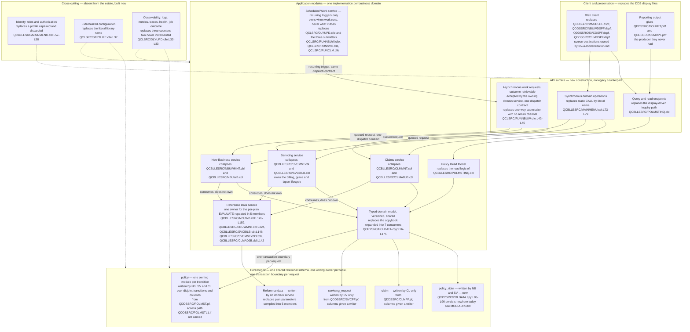

# LIFE400 Target Architecture

This document describes the destination. It records the layering the replacement system is built in, the service boundaries drawn across it, which module owns each table and how concurrent writes to the policy the whole estate shares are settled, how asynchronous work is dispatched and why that is a different concern from recurring scheduling, the application programming interface it has to construct because the estate declares none, the configuration it externalizes because today's configuration is compiled into source, the observability it establishes because today's telemetry does not work, and — stated as explicitly as everything it adds — the mechanisms of the current design that it deliberately does not carry across. It is the first document of the target-state layer and the one the other four rest on: the per-program decomposition in [the program-to-service map](02-program-to-service-map.md), the column-by-column typing in [the target data model and schema mapping](03-target-data-model-and-schema-mapping.md), the control-by-control closure in [the target security control design](04-security-control-design.md) and the screen-by-screen destination in [the UI modernization document](05-ui-modernization.md) all sit inside the boundaries set here.

**Scope, and the separation this layer exists to preserve.** This document describes **where** LIFE400 is going and says nothing about **how it gets there**. That separation is deliberate and load-bearing: the route can be revised — a different strategy, a different order of work, a different coexistence topology — without a line of the destination changing, and it is much harder to revise a destination that has been written down mixed together with its route. The practical test applied to every sentence below is whether it would still be true if the migration strategy were replaced tomorrow. If it would, it belongs here. If it would not, it belongs in the migration layer. So this document does **not** sequence the work, which will belong to [the recommended path](../migration/02-recommended-path.md), which is planned and not yet written; it does **not** map programs and [paragraphs](../reference/glossary-ibm-i.md#paragraph) onto target operations one by one, which is owned by [the program-to-service map](02-program-to-service-map.md); it does **not** type a single column, which is owned by [the target data model and schema mapping](03-target-data-model-and-schema-mapping.md); it does **not** design the security controls it names, which is owned by [the target security control design](04-security-control-design.md); and it does **not** choose a user-interface component library, because none is specified anywhere in this assessment and that gap is recorded rather than resolved by [the UI modernization document](05-ui-modernization.md). It also does not re-derive the current state. Every fact about the existing system below is cited to the member that establishes it or to the current-state document that owns it, and where a sibling owns a table this document cites the table instead of copying it.

**Reading the citations.** Every claim about the existing system carries an inline citation of the form `[<path>:<locator>]` immediately after the claim. Citations are plain text and deliberately not hyperlinks: a plain-text citation stays meaningful in a diff and does not depend on a hosting provider's line-anchor syntax. Statements about the **target** carry no citation, because there is nothing yet to cite — they are proposals, and the distinction between an evidenced fact about LIFE400 and a proposal for its replacement is exactly what the citation marks. The same discipline applies inside the diagram: every node standing for something that exists today names its member path in the node label itself, so the diagram still says which member it describes when it is read on its own. No member of the estate is annotated, altered, reformatted or commented by this documentation set, and the machine-generated corpus under `.swm/` is read as prior art and never edited. Platform terms link to [the IBM i glossary](../reference/glossary-ibm-i.md) on first use in this document.

**What this document is measured against.** The success criteria are owned by [the business drivers and success criteria](../01-business-drivers-and-success-criteria.md) and are not restated here. Four of them are discharged by this document in particular: `SC-1.9`, that configuration presently compiled into source becomes external configuration so a non-production environment can be stood up without editing a source member; `SC-2.3`, that an engineer can be productive on the target without [ILE](../reference/glossary-ibm-i.md#ile-integrated-language-environment) COBOL, fixed-format [DDS](../reference/glossary-ibm-i.md#dds-data-description-specifications), workstation screen or platform work-management skills; `SC-2.7`, that each business domain has exactly one implementation of its rules; and `SC-2.9`, that onboarding does not depend on access to the legacy platform. Two ambiguity resolutions bind it: `A-02`, the hosting-agnostic target with a containerized reference deployment and a deferred hardware exit, and `A-08`, that this work plans modernization rather than performing it.

**No temporal content, and no cost.** No date, duration, calendar sequence, effort figure or headcount appears below. Where ordering matters it is expressed as a dependency — this layer cannot be built before that one is decided — and never as a schedule. Staging the work into stages with entry criteria, exit criteria and verification gates will belong to [the recommended path](../migration/02-recommended-path.md), which is planned and not yet written. Third-party figures are attributed to their publisher wherever they appear, and none is presented as a measurement of this system; this document depends on very few, because the destination is argued from the estate rather than from the market.

**Nothing below rests on a build.** No claim in this document was verified by compiling, binding or running LIFE400, because ILE COBOL and [ILE CL](../reference/glossary-ibm-i.md#cl-control-language) require the IBM i platform and no off-platform compiler for them exists, as [the platform and support status document](../current-state/03-platform-and-support-status.md) establishes. Accuracy here rests on citations a reader can resolve against the working tree, on the current-state documents that own each measurement, and on the fact that a target-state proposal is falsifiable by review rather than by execution.

## The target stack, consumed rather than re-derived

The language, runtime and datastore are settled elsewhere. They are produced by [the target-language decision matrix](../talent/02-target-language-decision-matrix.md) and captured as decisions in [MOD-ADR-001, target language and runtime](../decisions/MOD-ADR-001-target-language-and-runtime.md), which is written with the status Proposed, and in [MOD-ADR-003, target datastore](../decisions/MOD-ADR-003-target-datastore.md), which is planned and not yet written. This document states the position and links to the reasoning rather than reproducing it, so that superseding the choice means superseding one record instead of editing every document that depends on it.

- **The primary recommendation is Java on a current long-term-support release, with Spring Boot**, on PostgreSQL as the relational datastore. Spring Boot is named as the server-side application framework; it is a runtime choice and implies nothing about user-interface components. **No release number, framework minor or datastore major is pinned by this assessment.** What [MOD-ADR-001](../decisions/MOD-ADR-001-target-language-and-runtime.md#what-this-record-fixes-and-what-it-leaves-open) fixes is the language, the support line and the framework, together with the rule a concrete selection must satisfy — a release its publisher designates long-term-support, inside the support window that publisher states for it — and the datastore is decided by the planned [MOD-ADR-003](../decisions/MOD-ADR-003-target-datastore.md) rather than supplied here by default. Nothing in the layering below depends on which release an implementation selects.
- **The runner-up is C#/.NET**, recorded as a candidate rather than as a second named stack. TypeScript and Node, and Python, are evaluated and **rejected for the core**. Go is evaluated and not selected. None is rejected as a bad language; each is rejected against a property this estate makes decisive.
- **The decisive criterion is exact decimal arithmetic.** Money in this system is fifteen digits with two decimals, declared independently on both sides of the same field — as [zoned decimal](../reference/glossary-ibm-i.md#zoned-decimal) in DDS [QDDSSRC/POLMST.pf:L52] and again as a thirteen-digit-plus-two-decimal picture clause in the shared contract [QCPYSRC/POLDATA.cpy:L98-L105] — and it is read back to policyholders through the estate's only signed field [QCPYSRC/POLDATA.cpy:L106]. **No monetary value in the target passes through binary floating point at any point**, including at a driver boundary or a serialization boundary. The typing that implements this is owned by [the target data model and schema mapping](03-target-data-model-and-schema-mapping.md) and to be recorded in the planned [MOD-ADR-006, date and decimal representation](../decisions/MOD-ADR-006-date-and-decimal-representation.md).
- **The target is hosting-agnostic, with a containerized reference deployment.** The container is an illustrative form rather than a requirement: it is named so that "hosting-agnostic" is not a way of avoiding the question, and it is not named as a commitment to any particular orchestrator, provider or region. Nothing in the layering below depends on where the system runs.
- **Exit from the AS/400 hardware is deliberately deferred and decoupled from this work**, and is to be recorded as such in the planned [MOD-ADR-007, hardware exit deferred](../decisions/MOD-ADR-007-hardware-exit-deferred.md). The reason is set out by [the platform and support status document](../current-state/03-platform-and-support-status.md): the language-and-skills driver and the hardware-exit driver rest on different evidence and carry different blast radii, and folding the smaller decision into the larger one is a documented failure mode that inflates scope and stalls work that could have proceeded on its own. This document is one of the places that has to keep them apart, so it states the target's layering, its service boundaries and its configuration model without a hosting commitment anywhere in them. Deferred is not rejected: nothing here argues for remaining on the hardware.

One consequence of that separation is worth making explicit, because it is easy to lose. **A target described without a hosting commitment is not a target described vaguely.** Every boundary below — which service owns which data, what the API surface carries, where configuration comes from, what the observability contract is — is fully determined without knowing where the process runs. That is the property that makes the hardware decision genuinely deferrable rather than merely postponed.

## Target layers

LIFE400 as built divides into four layers written in three languages: orchestration and session entry in ILE CL, presentation in DDS, business logic in ILE COBOL, and persistence in DDS again — the file definitions and the screen definitions being written in the same declarative language and compiled into different object types. That decomposition, with its evidence, is owned by [the current-state architecture](../current-state/02-architecture-current-state.md) and is not re-derived here; the member register it sits on, with per-member line counts and the language distribution across the estate's twenty-four members, is owned by [the system inventory](../current-state/01-system-inventory.md). Neither is restated. What this document takes from them is the shape, because two properties of that shape determine the target more than the layer count does — and because at this scale the shape, rather than the volume, is what a target has to answer.

- **Every program cooperates around one indexed file, and coordination between programs is therefore coordination through a file.** Seven of the eight COBOL programs open the policy master, no business program calls another, and there is no shared service, module or routine library anywhere between them — a census of `CALL` across all eight members finds four occurrences and all four are the menu's dispatch [QCBLLESRC/MAINMENU.cbl:L73-L79]. The policy master is the only thing the programs have in common.
- **The shared data contract is a textual include that is also the record description each program opens the file under, without being a description of that file.** Seven programs expand the same [copybook](../reference/glossary-ibm-i.md#copybook) into their file section [QCPYSRC/POLDATA.cpy:L16-L175], so the contract has no independent runtime existence and no version of its own, and the correspondence between a contract item and a stored column is an intent the estate documents rather than a binding its code enforces. The offset analysis behind that statement is owned by [the current data model](../current-state/04-data-model-current-state.md).

The target replaces both properties rather than reproducing them, and the two replacements are the whole substance of the layering.

| As-built layer | What carries it today | Target layer | What changes, and why |
|---|---|---|---|
| Session entry and orchestration | ILE CL: session entry [QCLSRC/STRTLIFE.clle:L18], three batch submitters [QCLSRC/RUNNBUW.clle:L21], one scheduled driver [QCLSRC/DLYUPD.clle:L24] | **Client and Identity layer**, plus an asynchronous entry point on each domain service and the **Scheduled Work service** that owns recurring triggers | Orchestration splits **three** ways rather than two. Interactive navigation becomes a client concern; a queued request becomes an asynchronous entry point on the domain service that owns the work, replacing each submitter; and the recurring trigger the nightly driver represents becomes the Scheduled Work service, which owns *when* work runs and never *what* it does. The three are separated in [asynchronous work and recurring schedules](#asynchronous-work-and-recurring-schedules-are-two-concerns) |
| Presentation | Four DDS [display files](../reference/glossary-ibm-i.md#display-file) driving a fixed character grid [QDDSSRC/MNUDSPF.dspf:L12], one [record format](../reference/glossary-ibm-i.md#record-format) at a time [QDDSSRC/MNUDSPF.dspf:L19], [QDDSSRC/NBUWDSPF.dspf:L24], [QDDSSRC/SVCDSPF.dspf:L23], [QDDSSRC/CLMDSPF.dspf:L21] | Client, over the API surface | The screen stops being a file the program reads and writes. Destination screens, their formats and their field mappings are owned by [the UI modernization document](05-ui-modernization.md) |
| Application | ILE COBOL, each domain implemented twice — once interactive, once batch [QCBLLESRC/NBUWMNT.cbl:L22] against [QCBLLESRC/NBUWB.cbl:L39] | Application services: one domain-and-rules service per business area, plus a read model | Each duplicated pair collapses to one implementation. This is the single largest structural change and is to be recorded in the planned [MOD-ADR-004](../decisions/MOD-ADR-004-single-domain-rules-service.md) |
| Shared contract, cutting across the application layer | A copybook expanded at compile time into seven consumers [QCPYSRC/POLDATA.cpy:L16-L175] | One typed domain model, versioned, shared by the domain services | The contract gains an independent existence and a version. Agreement stops being a build-time property maintained by recompiling every consumer together |
| Persistence | DDS [physical files](../reference/glossary-ibm-i.md#physical-file) reached by [record-level I/O](../reference/glossary-ibm-i.md#record-level-io) through a declared key, with one [logical file](../reference/glossary-ibm-i.md#logical-file) no program names [QDDSSRC/POLMSTL1.lf:L13-L14] | One shared relational schema, with a single writing owner per table and per state transition | Set-based access becomes expressible for the first time. Column-level typing, keys and constraints are owned by [the target data model and schema mapping](03-target-data-model-and-schema-mapping.md) |
| — (nothing in the estate carries these) | Identity is captured and discarded [QCBLLESRC/MAINMENU.cbl:L57-L58]; configuration is a literal in compiled source [QCLSRC/STRTLIFE.clle:L37]; telemetry is three counters, two of them never incremented [QCLSRC/DLYUPD.clle:L32-L33] | Cross-cutting: identity and authorization, externalized configuration, observability | Wholly new. Each is absent from the estate rather than differently implemented in it, which is why each is described below as construction |

Read down the last column and the layering makes one claim: **the target is not a re-layering of LIFE400 but a re-basing of it.** One of the six rows is wholly new; one dissolves a compile-time coupling into a versioned contract; one collapses six COBOL programs into three domain services; one splits orchestration three ways, sending interactive navigation to a client, queued work to an asynchronous entry point on the owning domain service, and recurring triggers to the Scheduled Work service; and one turns a screen from a file the program reads and writes into a client over an interface. Only the persistence row is a recognisable descendant of its predecessor, and even there the access pattern changes.

The diagram is D-09 in this assessment's diagram register, and it is the only diagram this document owns. Solid arrows are request paths; dashed arrows are cross-cutting concerns applied to a layer rather than called by it. Seven conventions in it are deliberate.

- **Every node standing for something that exists today names its member path in the label**, so a node states which member it replaces without depending on the surrounding prose. Nodes with no legacy counterpart say so — the rider table and the three cross-cutting boxes are new, not renamed.
- **Every store names its owner in its own label, and the policy store names one owning module per transition rather than a single writer for the whole table.** The three domains all write policy state today [QCBLLESRC/NBUWMNT.cbl:L196-L203], [QCBLLESRC/SVCMNT.cbl:L190], [QCBLLESRC/CLMMNT.cbl:L178], so an unowned policy store in the target would be the same arrangement with new names on it. The topology this rests on is [the topology decision](#the-topology-decision-stated-once), and the write-ownership table and the concurrency contract are set out in [policy write ownership and concurrency](#policy-write-ownership-and-concurrency).
- **The Scheduled Work service is drawn inside the application layer and reached through the API surface**, not beside it. That placement is the design claim: asynchronous work in the target is a service with an interface, an outcome and telemetry, whereas today it is a CL member that manipulates platform objects and a direct call that returns nothing a caller can read [QCLSRC/DLYUPD.clle:L75].
- **Asynchronous dispatch and recurring scheduling are two different nodes, and the scheduling node reaches the domain services only through the dispatch contract.** A queued request is accepted by the domain service that owns the work — which is what each submitter already is, one entry point per domain [QCLSRC/RUNNBUW.clle:L43-L45], [QCLSRC/RUNSVC.clle:L50-L52], [QCLSRC/RUNCLM.clle:L50-L52] — while the scheduling node owns only *when* recurring work runs. Today both roles sit in CL members that manipulate platform objects, and the nightly one calls a program directly, returning nothing a caller can read [QCLSRC/DLYUPD.clle:L75]. The contract that separates them is in [asynchronous work and recurring schedules](#asynchronous-work-and-recurring-schedules-are-two-concerns).
- **The inquiry program appears twice, deliberately.** Its two responsibilities separate in the target: the interface it exposed through a shared display file becomes a query endpoint, and the keyed read behind it becomes the read model. Splitting it is the point, not a duplication of the node.
- **The domain model sits between the modules and the schema rather than inside any one module, and each store node names its writer.** It is drawn that way for the same reason the current-state diagram draws the copybook cutting across the application layer: the model is genuinely shared, and pretending otherwise would misdescribe the target. The difference from today is that it is shared as a versioned artifact with an owner rather than as a textual expansion whose agreement is a property of when each consumer was last compiled — and that write authority over each table is named on the node instead of being left to convention.
- **The Reference Data service is reached by all three domain modules and writes no policy state.** It exists because plan-parameter and rating-factor resolution is not one domain's operation: the same per-plan conditional is compiled into five separate members today [QCBLLESRC/NBUWB.cbl:L145-L159], [QCBLLESRC/NBUWMNT.cbl:L224], [QCBLLESRC/SVCBILB.cbl:L146], [QCBLLESRC/SVCMNT.cbl:L339], [QCBLLESRC/CLMADJB.cbl:L142]. Leaving it unowned would recreate exactly the duplication the collapse above exists to remove.

## The topology decision, stated once

**A "service" in this document is an ownership boundary inside one application over one shared relational schema. It is not a separately deployed process with a private datastore.** The distinction has to be made explicitly rather than left to a reader's assumption, because the two readings produce incompatible architectures and the rest of this document — and the schema mapping that follows it — is written against exactly one of them.

The decision, in four parts:

- **One shared relational schema, not a store per service.** The estate's defining property is that every program cooperates around one indexed file, and the policy record it holds carries the policy, servicing and claim sections of the business in a single record area [QCPYSRC/POLDATA.cpy:L16-L175]. A target that split that record across three private stores would have to invent a distributed consistency problem the estate does not have, in a system of 4,126 source lines. The tables, their columns and their keys are owned by [the target data model and schema mapping](03-target-data-model-and-schema-mapping.md), and `policy` there is one table read by every domain module — which is this decision, not a contradiction of it.
- **One writing owner per table, and for `policy` one writing owner per state transition.** `servicing_request` is written by the Servicing service alone and `claim` by the Claims service alone. `policy` is the exception and is handled explicitly rather than fudged: it is one row per policy that three modules write, over **disjoint** sets of transitions and columns — issuance by New Business, amendment and the billing, grace and lapse lifecycle by Servicing, and the claim-decision fields by Claims. No module writes a transition or a column another module owns. That mirrors what the estate already does, where six programs rewrite the same record, and adds the ownership rule the estate lacks.
- **No module reaches into another module's state.** Reading another module's columns is done through that module's published operations or through the Policy Read Model, never by direct table access. This is the rule that makes one-implementation-per-domain a structure rather than a convention: a module that could read and write another's columns directly could also re-implement its rules.
- **Packaging is deliberately open.** Nothing here requires or forbids separate deployment units. The boundaries are ownership boundaries — of rules, of transitions and of an interface — and how they are packaged is a hosting question left open by the hosting-agnostic position above.

**This is a proposal, not a settled decision.** It is offered to the planned [MOD-ADR-003, target datastore](../decisions/MOD-ADR-003-target-datastore.md), which has not yet been written; until it is, the topology above is this document's recommendation and a reader should treat it as such. What is *not* open is internal consistency: D-09 above, D-10 in [the program-to-service map](02-program-to-service-map.md) and D-11 in [the target data model and schema mapping](03-target-data-model-and-schema-mapping.md) all describe this same topology, and a change to it changes all three.

## Canonical service names

One name per module, defined here and used verbatim in every other target-state document, so that a reader never has to decide whether two names denote the same thing. Descriptive scope lives in this table rather than in the name.

| Canonical name | Kind | Scope | What it replaces |
|---|---|---|---|
| **New Business service** | domain | Underwriting, rating and policy issuance | [QCBLLESRC/NBUWMNT.cbl:L22] and [QCBLLESRC/NBUWB.cbl:L39], collapsed to one implementation |
| **Servicing service** | domain | Amendments, repricing, and the billing, grace and lapse lifecycle | [QCBLLESRC/SVCMNT.cbl:L22] and [QCBLLESRC/SVCBILB.cbl:L37], collapsed to one implementation, including the grace and lapse engine [QCBLLESRC/SVCBILB.cbl:L196] |
| **Claims service** | domain | Death claim intake, document tracking, adjudication and settlement | [QCBLLESRC/CLMMNT.cbl:L21] and [QCBLLESRC/CLMADJB.cbl:L31], collapsed to one implementation |
| **Reference Data service** | supporting | Plan parameters and rating factors; owns no policy state and writes none | The per-plan conditional compiled into five members [QCBLLESRC/NBUWB.cbl:L145-L159], [QCBLLESRC/NBUWMNT.cbl:L224], [QCBLLESRC/SVCBILB.cbl:L146], [QCBLLESRC/SVCMNT.cbl:L339], [QCBLLESRC/CLMADJB.cbl:L142] |
| **Policy Read Model** | supporting | Query surface with no authority to change anything | The read logic of [QCBLLESRC/POLMSTINQ.cbl:L87], [QCBLLESRC/POLMSTINQ.cbl:L101], [QCBLLESRC/POLMSTINQ.cbl:L112] |
| **Scheduled Work service** | supporting | Triggering, tracking and reporting asynchronous work | [QCLSRC/DLYUPD.clle:L24] and the three submitters [QCLSRC/RUNNBUW.clle:L21], [QCLSRC/RUNSVC.clle:L21], [QCLSRC/RUNCLM.clle:L21] |
| **Client and Identity layer** | cross-cutting | Navigation, session, authentication and authorization; holds no domain logic and no policy state | [QCLSRC/STRTLIFE.clle:L18] and [QCBLLESRC/MAINMENU.cbl:L21] |

Two conventions go with the table. A name is used exactly as written, including its capitalisation, so a search for one finds every mention of it. And where a longer description is useful in a diagram node, the canonical name is the first line of the label and the description follows on a second line rather than replacing it.

## Service boundaries

Boundaries are drawn from what the estate already separates, not from an abstract decomposition imposed on it. LIFE400 divides into seven capability areas along its own source-object boundaries, and those areas resolve into three business domains — new business, servicing and claims — plus four areas that are not domains in their own right: session and navigation, the billing lifecycle that belongs to the servicing domain, inquiry, and the shared contract with its persistence. An eighth row is added below that the estate does *not* separate and the target must: plan-parameter and rating-factor resolution, which every domain performs and no member owns. Naming the areas before naming the services matters, because the mapping between them is not one-to-one: two areas share a single target service, one area's *trigger* becomes a service the estate has no counterpart for at all, and one operation the estate scatters across five members acquires a single owner.

| Capability area | Members that carry it today | Target home | Boundary rationale |
|---|---|---|---|
| Interactive session and menu dispatch | [QCLSRC/STRTLIFE.clle:L18], [QCBLLESRC/MAINMENU.cbl:L21], [QDDSSRC/MNUDSPF.dspf:L19] | **Client and Identity layer** | Not a domain. It carries no domain calculation and no persistence rule — the menu opens no database file and expands no copybook, its only `SELECT` being the display file [QCBLLESRC/MAINMENU.cbl:L32-L36]. It is not rule-free: [the business rule inventory](../current-state/05-business-rule-inventory.md) attributes 67 documented rules to it, the largest count of any member, and they are navigation, validation and dispatch rules that relocate to this layer rather than disappearing |
| New business underwriting and policy issuance | [QCBLLESRC/NBUWMNT.cbl:L22], [QCBLLESRC/NBUWB.cbl:L39], [QCLSRC/RUNNBUW.clle:L21], [QDDSSRC/NBUWDSPF.dspf:L24] | **New Business service** | A domain. One rule set, reached today by two paths that must be kept in agreement by hand |
| Policy servicing and amendments | [QCBLLESRC/SVCMNT.cbl:L22], [QCBLLESRC/SVCBILB.cbl:L37], [QCLSRC/RUNSVC.clle:L21], [QDDSSRC/SVCPF.pf:L14] | **Servicing service** | A domain, and the one whose two paths differ in coverage rather than in structure alone |
| Billing, grace and lapse lifecycle | The grace and lapse engine inside the batch servicing program [QCBLLESRC/SVCBILB.cbl:L196], driven by the nightly job [QCLSRC/DLYUPD.clle:L75] | **Servicing service**, triggered by the **Scheduled Work service** | **Not a separate service.** It is a lifecycle over the same policy state the Servicing service owns, and splitting it out would put two owners on one state transition. What is separate is its *trigger*, which becomes scheduled work |
| Death claim intake and adjudication | [QCBLLESRC/CLMMNT.cbl:L21], [QCBLLESRC/CLMADJB.cbl:L31], [QCLSRC/RUNCLM.clle:L21], [QDDSSRC/CLMPF.pf:L14] | **Claims service** | A domain, and the one whose two paths can already answer differently rather than merely repeat one another |
| Policy master inquiry | [QCBLLESRC/POLMSTINQ.cbl:L22], three paragraphs [QCBLLESRC/POLMSTINQ.cbl:L87], [QCBLLESRC/POLMSTINQ.cbl:L101], [QCBLLESRC/POLMSTINQ.cbl:L112], driving the servicing display file its own program does not own [QCBLLESRC/POLMSTINQ.cbl:L33], [QCBLLESRC/SVCMNT.cbl:L33] | **Policy Read Model** | Not a domain. It declares the policy master [QCBLLESRC/POLMSTINQ.cbl:L38-L42] and opens it for input only [QCBLLESRC/POLMSTINQ.cbl:L63], so it is a query surface rather than a rules owner and is bounded separately for that reason |
| Shared data contract and persistence | [QCPYSRC/POLDATA.cpy:L16-L175], [QDDSSRC/POLMST.pf:L14], [QDDSSRC/POLMSTL1.lf:L13-L14], [QDDSSRC/SVCPF.pf:L14], [QDDSSRC/CLMPF.pf:L14] | The shared typed domain model over one shared relational schema | Not a domain. It is the substrate every domain stands on, which is exactly why the target gives it an owner and a version instead of a compile-time expansion |
| Plan-parameter and rating-factor resolution | The same per-plan conditional compiled into five members [QCBLLESRC/NBUWB.cbl:L145-L159], [QCBLLESRC/NBUWMNT.cbl:L224], [QCBLLESRC/SVCBILB.cbl:L146], [QCBLLESRC/SVCMNT.cbl:L339], [QCBLLESRC/CLMADJB.cbl:L142] | **Reference Data service** | Not a domain, and not any one domain's operation either — all three business domains resolve plan parameters, and two of them also resolve rating factors. It is broken out as its own owner precisely because leaving it inside a domain would leave the other two domains either duplicating it or reaching into that domain, both of which the collapse above exists to prevent |

Five boundary rules follow, and each is a consequence of something measured about the estate rather than a preference.

- **Each online and batch pair collapses to exactly one implementation.** Every one of the three business domains is implemented twice today, once interactive and once batch, and the duplication is of three different kinds — a near-clone in new business, one responsibility with two structures in servicing, and genuine divergence in claims, where the two paths can already answer differently. Those measurements, and the divergence inventory behind them, are owned by [the current-state architecture](../current-state/02-architecture-current-state.md); the decision to collapse each pair is to be recorded in the planned [MOD-ADR-004](../decisions/MOD-ADR-004-single-domain-rules-service.md); and which paragraph becomes which operation is owned by [the program-to-service map](02-program-to-service-map.md). This document states only the boundary rule: **a domain's rules exist once, and the interactive path and the scheduled path are two callers of that one implementation rather than two implementations of it.** Where the two paths currently disagree, which answer is correct cannot be read from the source — because the source is what disagrees — so each divergence is settled as a business decision before conversion, a dependency owned by [the known defects and stubs register](../current-state/07-known-defects-and-stubs.md).
- **Each table and each policy state transition has exactly one writing owner, and no module reaches into another module's state.** This is the ownership half of [the topology decision](#the-topology-decision-stated-once) restated as a boundary rule, and it is deliberately *not* the stronger claim that each service has a private store — the target has one shared schema, and `policy` is read by all three domain modules. Today neither rule holds: seven of the eight COBOL programs declare the policy master in their own file section [QCBLLESRC/NBUWMNT.cbl:L38-L42], [QCBLLESRC/NBUWB.cbl:L50-L54], [QCBLLESRC/SVCMNT.cbl:L38-L42], [QCBLLESRC/SVCBILB.cbl:L48-L52], [QCBLLESRC/CLMMNT.cbl:L37-L41], [QCBLLESRC/CLMADJB.cbl:L42-L46], [QCBLLESRC/POLMSTINQ.cbl:L38-L42], six of them rewrite it, and there is no shared service between them — the census of every `CALL` and file declaration behind that statement is owned by [the current-state architecture](../current-state/02-architecture-current-state.md). What the target adds is the ownership rule rather than physical separation, and that is what makes the collapse above enforceable: a module that could write a transition another module owns could also re-implement its rules.
- **Reading is bounded separately from writing.** The inquiry program is the estate's own precedent for this: it opens the policy master for input only [QCBLLESRC/POLMSTINQ.cbl:L63] and decomposes into three paragraphs that get a key, look up a record and display it [QCBLLESRC/POLMSTINQ.cbl:L87], [QCBLLESRC/POLMSTINQ.cbl:L101], [QCBLLESRC/POLMSTINQ.cbl:L112]. A read model is not a performance device here; it is the boundary that lets a query surface serve reporting and inquiry without acquiring the right to change anything.
- **An operation every domain performs belongs to neither of them.** Plan-parameter resolution appears in all three domains and rating-factor resolution in two, as the same conditional compiled five times over [QCBLLESRC/NBUWB.cbl:L145-L159], [QCBLLESRC/NBUWMNT.cbl:L224], [QCBLLESRC/SVCBILB.cbl:L146], [QCBLLESRC/SVCMNT.cbl:L339], [QCBLLESRC/CLMADJB.cbl:L142]. Two placements would both violate a rule already stated: putting it inside one domain forces the other two to reach into that domain, and leaving a copy in each reproduces the duplication the first rule removes. So it gets its own owner, the **Reference Data service**, which holds no policy state and writes none — a supporting service rather than a fourth domain.
- **Scheduled work is a service, not a script.** Today the nightly job is a CL member that sets a [library list](../reference/glossary-ibm-i.md#library-list), issues [overrides](../reference/glossary-ibm-i.md#override), calls one program with two sentinel literals and sends a message [QCLSRC/DLYUPD.clle:L56], [QCLSRC/DLYUPD.clle:L60-L61], [QCLSRC/DLYUPD.clle:L75], [QCLSRC/DLYUPD.clle:L91-L95]. Each submitter is a separate CL member that queues one domain's work [QCLSRC/RUNNBUW.clle:L43-L45]. In the target the two halves separate: the *execution* of queued work is an asynchronous entry point on the domain service that owns it, and the *recurrence* is the Scheduled Work service, which triggers those entry points through the dispatch contract, owns nothing else, and has an interface, an outcome and telemetry rather than reaching into any domain's data. Both halves are specified once, in [asynchronous work and recurring schedules](#asynchronous-work-and-recurring-schedules-are-two-concerns). This is the boundary that DEF-01 and DEF-02 in the defect register both land on, and both carry the disposition `implement`.

**What a service boundary is not, in this target.** It is not a deployment boundary. Nothing above requires three separately deployed processes, and nothing forbids it: the boundaries are ownership boundaries — of rules, of data and of an interface — and how they are packaged is a hosting question, deliberately left open by the hosting-agnostic position above. Stating this explicitly matters because a reader who reads "service" as "separately deployed process" would find a decision here that this document has not made and does not need to make.

## Policy write ownership and concurrency

The boundaries above are not sufficient on their own, and the reason is measurable in the estate: **all three business domains write the same policy record today.** New business writes the master record or rewrites it [QCBLLESRC/NBUWMNT.cbl:L196-L203], batch new business does the same [QCBLLESRC/NBUWB.cbl:L115], servicing rewrites it [QCBLLESRC/SVCMNT.cbl:L190] as does batch servicing [QCBLLESRC/SVCBILB.cbl:L123], and both claims paths rewrite it [QCBLLESRC/CLMMNT.cbl:L178], [QCBLLESRC/CLMADJB.cbl:L120]. Six of the eight COBOL members mutate policy state and none of them coordinates with any other, because there is nothing to coordinate through except the file itself. **A target with three domain services and one shared policy store, and nothing said about who may write it, is that same design with new names on it** — so this section states the ownership rule, the write map and the concurrency contract explicitly rather than leaving them to be inferred from the phrase "a service owns its data".

### The two decisions this section makes

- **Every policy state transition has exactly one owning module, and the invariants over policy state are enforced in one place.** This is [the topology decision](#the-topology-decision-stated-once) applied to writes: issuance belongs to the New Business service, amendment and the billing, grace and lapse lifecycle to the Servicing service, and the claim-decision fields to the Claims service, over **disjoint** sets of transitions and columns, with the rider rows written by New Business at issue and by Servicing on add-rider and remove-rider. No module writes a transition or a column another module owns, and no module reaches into another module's state. What no single domain can own is an invariant all three of them change — the contract-status transition above all — so those invariants live once in the **shared typed domain model** every module writes through, rather than being re-implemented per module or left to the schema to catch.
- **The default delivery form is a modular monolith with one transactional boundary.** Ownership is a code and schema property, not a process count, and this document has already recorded that a service boundary is not a deployment boundary. The default position is therefore one deployable holding these modules — the three domain services, the Reference Data service, the Policy Read Model and the Scheduled Work service — over **one relational schema**, so that a request that touches policy state and its own domain state commits or fails as a unit — the property [the continuity and recovery risk document](../risk/03-continuity-and-recovery-risk.md) shows the estate cannot express at all, because its two-file writes are independent statements with no unit of work around them [QCBLLESRC/SVCMNT.cbl:L190-L191]. Splitting a module into a separate deployable later is permitted, and the condition is stated rather than left implicit: **it may not split a transaction that this contract requires to be atomic** — a split therefore requires an accepted decision record that names the replacement mechanism and its failure behaviour.

### The write map

Write authority is stated per table and, where two modules legitimately write one table under different transitions, per field group and transition. Read access is not restricted here; every module may read what it is authorized to read, which is `CTL-AUTHZ`'s subject in [the target security control design](04-security-control-design.md).

| Target table or field group | Owning module for the write | Transition that carries it | What the estate does instead |
|---|---|---|---|
| `policy` — identification and insured columns | New Business service | Issuance only; no other module writes them | Written or rewritten directly by the issuing program [QCBLLESRC/NBUWMNT.cbl:L196-L203], [QCBLLESRC/NBUWB.cbl:L115] |
| `policy` — plan, premium and benefit columns | New Business service at issue; Servicing service on a repricing amendment | Two disjoint transitions over one column group: issuance, and amendment or the billing lifecycle | Rewritten directly by both servicing paths [QCBLLESRC/SVCMNT.cbl:L190], [QCBLLESRC/SVCBILB.cbl:L123] |
| `policy.contract_status` and the date columns that move with it | The module that owns the transition — New Business (issue, decline), Servicing (amend, lapse, reinstate), Claims (settle) — with the transition rule itself held once in the shared domain model | One transition per module, and no module may perform another's | Three domains move the same column with no shared rule between them [QCBLLESRC/SVCMNT.cbl:L190], [QCBLLESRC/CLMMNT.cbl:L178], [QCBLLESRC/CLMADJB.cbl:L120] |
| `policy_rider` | New Business service at issue; Servicing service on add-rider and remove-rider | Two disjoint transitions, both appending a coverage period | Nothing. No rider is persisted anywhere [QCPYSRC/POLDATA.cpy:L88-L96] |
| `servicing_request` | Servicing service, alone | Interactive and queued servicing requests | Written as one undifferentiated area by one program [QCBLLESRC/SVCMNT.cbl:L58], [QCBLLESRC/SVCMNT.cbl:L191] |
| `claim` | Claims service, alone | Interactive and queued claims requests | Written as one undifferentiated area [QCBLLESRC/CLMMNT.cbl:L57], [QCBLLESRC/CLMMNT.cbl:L179] |
| Reference data — plan versions, rate factors, coded domains | Reference Data service, administered outside the three domains | Read by any module; written by no domain service | Compiled into each program as literals in a conditional over the plan code [QCBLLESRC/NBUWB.cbl:L145-L159] |
| Audit and outbox records | The operation that produces them, append-only, never updated or deleted | Every transition, without exception | Five program-name stamps and one path that stamps nothing [QCBLLESRC/SVCMNT.cbl:L190] |

### The concurrency contract

Four rules, and each answers something the estate has no construct for. The statement census establishing that there is no unit of work anywhere — zero `COMMIT` and zero `ROLLBACK` across all eight COBOL members — is owned by [the current-state architecture](../current-state/02-architecture-current-state.md).

- **One transaction per request, opened and committed by the module the request entered.** A request that changes its own domain state and policy state commits both or neither. Nothing partial is observable, which is exactly what the estate cannot promise: its master rewrite and its secondary write are two independent statements and either can succeed while the other fails [QCBLLESRC/SVCMNT.cbl:L190-L191].
- **Optimistic concurrency on the policy row, by row version.** A caller reads a policy with its version, and a write that presents a stale version is refused rather than applied. The refusal is a first-class outcome the caller must handle, not an error to be retried blindly. The version column is a target-only structure with no legacy counterpart and is declared by [the target data model and schema mapping](03-target-data-model-and-schema-mapping.md). The estate's exposure here is not theoretical: two jobs submitted for the same policy arrive on one queue under the same fixed job name [QCLSRC/RUNNBUW.clle:L24], and nothing in the application prevents an interactive amendment and a queued one from reading, computing and rewriting the same record in either order.
- **Pessimistic locking only where a read must not be overtaken, and always inside one transaction.** The grace-and-lapse sweep is the case that needs it: it reads a policy, evaluates the payment status and advances the lifecycle [QCBLLESRC/SVCBILB.cbl:L196], and an interactive reinstatement landing between the read and the write would leave the sweep acting on state that no longer exists. A lock is scoped to the single aggregate for the duration of that one transaction, never across a request boundary and never across a user's thinking time.
- **Conflict resolution is a business outcome, never a silent merge.** Last-writer-wins is prohibited on policy state, because the estate's own arithmetic makes it unsafe: a repricing computes a premium delta against the premium it read [QCPYSRC/POLDATA.cpy:L106], so a lost update does not lose a keystroke, it produces a stored premium that no rule ever computed. The refusal is returned to the caller as a typed outcome and recorded, and the requester decides — which for a queued or scheduled request means the retry policy in the next section.

**What this section does not decide.** It names no isolation level, no locking primitive, no framework mechanism and no deployment topology. It also does not decide whether a policy-state change should be requested synchronously or asynchronously by each domain — that is an operation-level question owned by [the program-to-service map](02-program-to-service-map.md). What it fixes is narrower and load-bearing: **there is exactly one owning module per table and per policy state transition, one transaction per request, an explicit version check on the shared policy row, and no silent merge anywhere.**

## Asynchronous work and recurring schedules are two concerns

The estate's asynchrony is one mechanism used for two purposes, and separating them is what makes the target's dispatch contract statable. **Three submitters queue one domain's work each on demand** [QCLSRC/RUNNBUW.clle:L43-L45], [QCLSRC/RUNSVC.clle:L50-L52], [QCLSRC/RUNCLM.clle:L50-L52], and **one scheduled member runs on a recurrence and calls a program directly rather than queueing anything** [QCLSRC/DLYUPD.clle:L75]. Those are different concerns wearing the same platform mechanism, and conflating them in the target would produce a single component owning both the schedule and the work — which is how the nightly member came to contain a library list, two [overrides](../reference/glossary-ibm-i.md#override), a call and a message [QCLSRC/DLYUPD.clle:L56], [QCLSRC/DLYUPD.clle:L60-L61], [QCLSRC/DLYUPD.clle:L75], [QCLSRC/DLYUPD.clle:L91-L95].

- **Queued work is executed by the domain service that owns it.** Each submitter becomes an asynchronous entry point on its own domain service, which is the destination [the program-to-service map](02-program-to-service-map.md) assigns member by member; there is **no separate submission layer and no worker that reaches into another module's data**. The reason is the ownership rule above: a policy state transition is performed by the module that owns it, through the shared domain model, whether a human or a schedule asked for it.
- **Recurring work is triggered by the Scheduled Work service, which owns when, never what.** It holds the recurrence, the enablement and the run history, and it requests work through the same dispatch contract any other caller uses. It contains no business rule, opens no store and has no privileged path — so a scheduled sweep and an operator's ad-hoc request are the same request with different origins, which is the property the estate cannot express because its scheduled path calls a program directly and its on-demand path queues one.

**One dispatch contract, stated once and used by both.** Every asynchronous request — queued by a user, or triggered by the schedule — carries the same five properties, and each answers something the estate lacks.

| Property of the contract | What the target requires | What the estate does |
|---|---|---|
| Identity of the work | A durable work identifier, distinct from the request that created it | A fixed job-name literal per domain, identical for every request [QCLSRC/RUNNBUW.clle:L24] |
| Requesting principal | The principal that requested it, and the workload principal that executes it, both carried to the point of the write | Nothing. No submitted program takes a principal, and none of the four dispatched programs takes any parameter [QCBLLESRC/MAINMENU.cbl:L73-L79] |
| Outcome | A retrievable, typed outcome per work item — accepted, completed, failed, refused — readable by whoever asked | One-way. Control returns when the work is queued and the message that follows confirms a submission rather than a result [QCLSRC/RUNNBUW.clle:L49-L50] |
| Retry and idempotency | An explicit retry policy per operation, with idempotent execution so a retry cannot double-apply, and a terminal state after exhaustion | Nothing. A failure raises a catch-all monitor that increments a counter [QCLSRC/DLYUPD.clle:L76-L77] and the work is not resubmitted |
| Ownership of execution | Exactly one owning module per work type, named in the contract | Implicit. The submitter names a program and a queue [QCLSRC/RUNNBUW.clle:L43-L46] and nothing states who owns the work |

**Where this stops.** No queue technology, scheduler product, delivery guarantee or serialization format is named, and no schedule is stated anywhere in this documentation set — a recurrence is a business and operational setting, not an architectural one. What is fixed is the separation and the five properties: **one dispatch contract, one owning module per work type, and a schedule that triggers work it does not own.**

## An API surface where none is declared today

**No application programming interface of any kind is declared anywhere in this repository.** That is a measured absence in the source, and it is deliberately stated as a property of the repository rather than of the installation, because the two are not the same claim and only the first is evidenced here. A search across all 24 members for every construct by which this estate could speak to another system — transport and protocol names, socket and queueing constructs, markup and interchange formats, embedded query language, data areas and user spaces, and mail or file-transfer verbs — returns no match anywhere; the census is owned by [the current-state architecture](../current-state/02-architecture-current-state.md) and was re-run against the working tree for this document with the same result. There is no HTTP, no REST, no SOAP, no socket, no message broker, no remote procedure call and no interchange format in the estate. There is also no data-definition-language member: the four source directories contain only ILE COBOL, ILE CL, copybook and DDS members [README.md:L27-L55].

What the estate does have is four inter-program mechanisms, and enumerating them precisely is what establishes that none of them is an interface in the sense the target needs.

| Mechanism the estate has | Evidence | Why it is not an API |
|---|---|---|
| Static `CALL` to a literal program name | [QCBLLESRC/MAINMENU.cbl:L73-L79] | Resolved at compile time, so the set of reachable destinations is a property of a compiled artifact. Adding one is a source change and a recompile, not a configuration change |
| Asynchronous submission through [`SBMJOB`](../reference/glossary-ibm-i.md#sbmjob) to a [job queue](../reference/glossary-ibm-i.md#job-queue) | [QCLSRC/RUNNBUW.clle:L43-L45] | One-way. Control returns as soon as the work is queued and the message that follows confirms a submission rather than a result [QCLSRC/RUNNBUW.clle:L49-L50]; there is no channel by which an outcome could come back |
| Positional parameter linkage | [QCBLLESRC/NBUWB.cbl:L79] | Fixed-length values matched by position and by convention, with no compile-time binding between a caller's argument list and its callee's declaration. The three submitters are not even consistent about order — two put the policy first [QCLSRC/RUNNBUW.clle:L21], [QCLSRC/RUNSVC.clle:L21] and one the claim [QCLSRC/RUNCLM.clle:L21] |
| A shared contract expanded textually into each consumer | [QCPYSRC/POLDATA.cpy:L16-L175] | An agreement between compilations, not between running components. There is no negotiated version, no schema identifier and no run-time check |

**So the target's API surface is genuinely new construction, and that is an advantage rather than a gap.** The point deserves stating positively, because a reader can easily take "there is no API" as a deficiency to be apologised for. It is not. An estate with an existing published interface constrains its replacement twice over: the interface's shape has to be preserved for the sake of whatever consumes it, and the migration acquires an external contract it does not control. LIFE400 has neither constraint **in anything this repository declares**, and the qualifier is load-bearing rather than cautious: **the repository declares no integration contract, so no code-level contract has to be preserved and the target's integration surface can largely be defined by what the business needs rather than by what the legacy system happens to expose.**

**What that does not establish, stated plainly because the distinction decides whether a contract can safely be changed.** The absence above is an absence of a *declared* interface in 24 source members. It is not evidence that nothing outside this repository reads or drives the system, and a repository cannot supply that evidence in either direction. Four classes of consumer would leave no trace in any member here, and each is realistic for a system of this age.

- **Something that calls the programs from outside this library.** Dispatch is by unqualified name and nothing in a callee records who called it [QCBLLESRC/MAINMENU.cbl:L73-L79], so a program in another library that calls one of these programs, or `SBMJOB`s one of these CL members, would appear nowhere in this repository.
- **Something that reads the files rather than calling the programs.** The three [physical files](../reference/glossary-ibm-i.md#physical-file) are ordinary platform objects [QDDSSRC/POLMST.pf:L14], [QDDSSRC/SVCPF.pf:L14], [QDDSSRC/CLMPF.pf:L14], reachable with object authority alone — and the estate declares none [README.md:L125] — so a query tool, an extract job or a reporting package outside this library could read them invisibly.
- **Something installed outside the documented build.** The build sequence lists only what its own eight steps create [README.md:L120-L218], so an object created by any other means is not discoverable from here.
- **Something that drives the estate operationally, or consumes its output.** The scheduler entry that runs the nightly job is a platform object created by an operator command [README.md:L195-L212] rather than a member of this repository, so any other automation calling these programs on a schedule is equally invisible; and two complete report layouts exist with no program driving them [QDDSSRC/POLRPT.prtf:L15-L64], [QDDSSRC/CLMRPT.prtf:L15-L58], so whatever an installation does with spooled output, a save-file exchange or an operator procedure is not readable from source either.

**So external consumers are recorded as unknown rather than as absent**, and two discovery steps are prerequisites of changing any contract this document describes: an installed-object and cross-reference discovery on the running system, naming every object that references these programs and files; and a business-and-operations confirmation of every downstream consumer of their data and their output — an inventory of what reads these files, what schedules this work and what consumes its results, obtained from the people who run the system. Both are business-and-operations exercises rather than code exercises, both belong to the migration layer's coexistence work and to the decommissioning judgement rather than to this document, and until they are complete the correct statement is that **no consumer is visible in the repository**, not that none exists — so **the safe assumption is that a consumer exists and has not been found yet.**

Three capabilities the surface has to carry follow from the boundaries above rather than from any convention, and each answers a specific thing the estate cannot do.

- **Synchronous domain operations**, replacing dispatch by literal name. The reachable destination set becomes data rather than compiled code, which is what removes the constraint that the estate's navigable surface is encoded in one compiled member [QCBLLESRC/MAINMENU.cbl:L73-L79].
- **Asynchronous work requests whose outcome is retrievable.** This is the capability the estate most conspicuously lacks: a submitted job's return code and message are written into the record area the program then closes, and the census finds no message-sending call and no executable `DISPLAY` in any of the eight COBOL members, so nothing in the application layer reports an outcome to anybody. Worse, the pair does not even reach an outcome column — by the byte-offset map owned by [the current data model](../current-state/04-data-model-current-state.md) it lands on insured, benefit and premium columns instead. The target requirement is therefore not "return the outcome the estate already computes" but "give the outcome somewhere to go", which is construction.
- **Query and read endpoints** over the read model, replacing a display-file-driven inquiry program [QCBLLESRC/POLMSTINQ.cbl:L22] and giving the two [printer file](../reference/glossary-ibm-i.md#printer-file) layouts a producer they have never had [QDDSSRC/POLRPT.prtf:L15-L64], [QDDSSRC/CLMRPT.prtf:L15-L58].

**Every capability above is also a new attack surface, and the architecture names the control that answers it rather than leaving it to a security appendix.** This paragraph exists because the security risk register has no finding for malicious input and a reader could reasonably conclude none is needed. The estate is accidentally strong here: input arrives as fixed-length positioned fields declared in DDS, persistence is [record-level I/O](../reference/glossary-ibm-i.md#record-level-io) through a declared key with no query language anywhere in the estate, output is positioned characters on a fixed twenty-four by eighty grid [QDDSSRC/MNUDSPF.dspf:L12], and nothing is serialized or deserialized. **The three capabilities above remove all four of those protections, and so do the web client, the report producer and the structured observability output this document also adds.** The requirement that answers it is `CTL-INPUT` — boundary input validation against a declared schema, allowlists over the domains the shared contract already declares, safe parsing and deserialization, parameterized persistence, and contextual output encoding for the client, for reports and for logs — specified in [the target security control design](04-security-control-design.md#ctl-input-boundary-input-validation-and-contextual-output-safety). It applies at every boundary this section creates, and to the persistence and rendering paths behind them.

**What this document deliberately does not specify.** No protocol, no route, no payload shape, no serialization format and no interface definition appears above or anywhere below. Those are implementation artifacts, and this assessment plans modernization rather than performing it. Stating a route table here would also fix a decision that the boundaries above do not require and that a later reader would reasonably expect to find justified.

## Externalized configuration

**Runtime configuration in LIFE400 lives in platform objects and CL source rather than in files or environment variables.** The complete surface — sixteen rows, each stating where the value lives, what varying it requires today, and the evidence for both — is owned by [the operational model](../current-state/06-operational-model.md) and is not duplicated here. This document takes from it the requirement, anchored on the six facts that generate it.

- **The application library name is a literal in the call itself** [QCLSRC/STRTLIFE.clle:L37], and in every file override [QCLSRC/DLYUPD.clle:L60-L61], and in each submission's four object names [QCLSRC/RUNNBUW.clle:L43-L46]. There is no indirection anywhere: no variable is initialised from outside the program.
- **The library list is manipulated per session** — the application library is pushed to the front on entry [QCLSRC/STRTLIFE.clle:L27] and removed again on the way out [QCLSRC/STRTLIFE.clle:L40] — so which objects a name resolves to is a property of session state rather than of a declared binding.
- **File resolution is bound by job-scoped overrides** issued before the work and deleted after it [QCLSRC/DLYUPD.clle:L60-L61], [QCLSRC/DLYUPD.clle:L98-L99], [QCLSRC/RUNSVC.clle:L44-L45]. Because the scope is the job that issues them, the nightly driver's overrides do bind its work — it calls its program synchronously in the same job [QCLSRC/DLYUPD.clle:L75] — while the three submitters' overrides bind the submitter and not the submitted program. That asymmetry is owned by [the operational model](../current-state/06-operational-model.md) and dispositioned as `implement` by [the known defects and stubs register](../current-state/07-known-defects-and-stubs.md).
- **The date source is a system value**, retrieved by the nightly driver as the only date entering the estate through CL [QCLSRC/DLYUPD.clle:L45].
- **Plan parameters are not a table.** They are literals assigned inside a conditional over the plan code, in each program that needs them [QCBLLESRC/NBUWB.cbl:L145-L159], and the shared contract carries thirteen parameter fields that are populated at run time and never persisted [QCPYSRC/POLDATA.cpy:L39-L52]. A product term therefore cannot be changed without editing and recompiling COBOL.
- **There is no configuration file, environment variable or parameter object anywhere in the estate**, and no member reads a manifest or an externalized value at run time [README.md:L27-L55].

**The consequence that matters most for the plan, stated at exactly the width the evidence supports: a *differently named* parallel instance cannot be reached without editing source.** The build procedure creates exactly one library [README.md:L125], its name is a literal in the call [QCLSRC/STRTLIFE.clle:L37] and in every override and submission [QCLSRC/DLYUPD.clle:L60-L61], [QCLSRC/RUNNBUW.clle:L43-L46], and standing up a second instance would mean editing the literal in every CL member that names the first [QCLSRC/STRTLIFE.clle:L27], [QCLSRC/RUNNBUW.clle:L37-L38], [QCLSRC/RUNSVC.clle:L44-L45], [QCLSRC/RUNCLM.clle:L44-L45], [QCLSRC/DLYUPD.clle:L60-L61] and recompiling them.

**What that claim does and does not cover.** The blocked case is the one the repository establishes: two instances resolving unqualified names in the same resolution domain, where the second library must therefore have a different name. It is **not** established here that every isolated topology is blocked — a separate partition, system or restore environment holding an identically named library would resolve its own objects without any source change, and whether such a topology is available is an environment question this repository cannot answer. **So the requirement is stated as a confirm-with-operations item: the parallel-run environment topology must be established with the people who run the platform before a comparison-based cutover is planned around it.** The narrower fact stands either way, and it is the one the plan depends on: a second instance under a *different* name is a source change rather than a deployment.

That is a direct dependency between this document and the migration layer, and it is worth naming as one: **running the existing system beside a replacement, which is what any comparison-based cutover requires, needs either an environment topology confirmed to exist or a source change, and neither is available as configuration today.** The coexistence topology will belong to [the coexistence and integration document](../migration/03-coexistence-and-integration.md) and the comparison itself to [the parallel run and output parity document](../migration/06-parallel-run-and-output-parity.md); both are planned and neither is written, and the constraint is offered as a premise for the planned [MOD-ADR-002](../decisions/MOD-ADR-002-migration-pattern.md).

**"Make configuration external" is a goal, and a goal is not verifiable.** Two systems can both satisfy it and behave completely differently when a value is missing, when two sources disagree, or when a request asks to be served against data it has no business reaching. So what follows is a **logical configuration contract**: for every class of setting the target has to resolve, who owns it, where it may come from, whether it is required, what default it has, what is checked before the system will serve anything, whether a request may influence it, and what happens when it is absent, unresolvable or inconsistent. It is *logical* deliberately — it names no file layout, no key naming scheme, no environment-variable convention and no configuration provider, for the same reason no route table appears above — but every column is a design decision rather than an implementation detail, because each one changes what the system does when something is wrong. The test of the whole contract is `SC-1.9`: standing up a non-production environment requires no source change.

| Setting class | Owner | Source class | Required | Default | Checked before work is served | May a request influence it? | Behaviour when absent, unresolvable or inconsistent |
|---|---|---|---|---|---|---|---|
| **Environment identity** — which instance this is | Deployment | Supplied to the deployment from outside the built artifact | Yes | **None.** No value is compiled in and none is inferred | Present, and one of a declared set of environment names | **No** | Startup fails. This is the setting that makes two instances distinguishable, so a system that cannot name itself does not start |
| **Physical data binding** — datastore location, schema and the credential reference used to reach it | Deployment | Supplied to the deployment; the credential itself is resolved by reference, never carried in configuration | Yes | **None** | Resolvable, reachable, and declaring the same environment as the environment identity above | **No — never, in whole or in part** | Startup fails, and a mismatch against the declared environment identity fails startup too. A running service that can no longer resolve its binding refuses work rather than serving from an unverified one |
| **Business scope of a unit of work** — which policy, plan or book of business it addresses | Stated by the caller, **authorized by the service** | Request | Yes, for the operations that take one | None. An absent scope is a refused request, never a widened one | Authorized for the presented principal and mapped server-side onto the binding above. A caller-supplied scope value is a *request*: it is authorized against an allowlist of the scopes that principal holds and refused otherwise, never trusted as a binding. Whether the book of business is partitioned at all is a business decision — nothing in the estate scopes access to a subset of records, since the policy master is keyed and read by key [QDDSSRC/POLMST.pf:L81] and any program that opens it reaches every record — and it is raised as such by [the target security control design](04-security-control-design.md) under record-scope authorization | It states a scope **within** the binding; it can never select a binding, a datastore or an environment. What stays request-scoped is the work rather than the data source: a request names the policy, amendment or claim it concerns — business keys the estate already passes positionally [QCBLLESRC/NBUWB.cbl:L79] — and a business key selects a row inside a bound scope, while a binding selects the scope itself | Request denied. An unauthorized or unmappable scope is a denial, not a narrower result |
| **Reference data** — plan parameters, product terms, grace windows, rate factors | The business function that owns the product | Configured reference data with a lifecycle of its own, versioned and effective-dated | Yes | **None.** There is no compiled fallback and no "sensible default" for a product term | The version in force for the work's effective business date resolves to exactly one set per plan | No. A request may not supply a parameter, only the plan whose parameters are looked up | The operation is refused. Nothing is computed on a partial, ambiguous or guessed parameter set. Governance of the data itself is owned by [the target data model and schema mapping](03-target-data-model-and-schema-mapping.md) |
| **Business clock and time zone** | Deployment | Supplied to the deployment | Yes | **None — and specifically not the host or container clock** | Present, and a valid declared zone | Only as an authorized, audited process-date override on the operations that permit one, and never as a change to the clock itself | Startup fails. The contract is set out under [the business clock and time zone](#the-business-clock-and-time-zone) below |
| **Scheduled work** — what runs, with what concurrency, and where its outcome goes | Deployment | Supplied to the deployment | Yes, for the Scheduled Work service | **None** | Present, and its outcome destination resolvable | No | Startup of that service fails. A scheduled job whose outcome has nowhere to go is the estate's failure mode [QCLSRC/DLYUPD.clle:L87], not a target behaviour to inherit |
| **Secret references** — key material and the credentials the services themselves present | Deployment owns the reference; the managed store owns the value | A reference in configuration, resolved at run time | Yes, wherever a control needs key material | **None.** No embedded value and no fallback | The reference resolves and its value is retrievable | No | Startup fails, health reports not-ready, and requests are denied rather than served unprotected. Owned by [the target security control design](04-security-control-design.md) |
| **Observability destinations** | Deployment | Supplied to the deployment | Yes | **None** | Present and resolvable | No | Startup fails, so telemetry cannot silently go nowhere the way the nightly job's work count does [QCLSRC/DLYUPD.clle:L87] |

Three rules complete the contract, and each is stated once here rather than repeated per row.

- **Precedence is settled by construction rather than by a tie-break.** For everything the deployment owns there is exactly one source and no default anywhere in the artifact, so there is no second candidate to rank against the first. A request never overrides a deployment-owned setting; it states a business scope inside one. Reference data is the one class where precedence is a real question, and it is answered by version: the set in force for the work's effective business date wins, and if two candidate sets would be in force at once the operation is refused rather than resolved by a rule nobody agreed to.
- **Missing configuration fails closed, at startup where possible and at the request boundary otherwise.** Nothing degrades to a default, and nothing proceeds on a partially resolved binding. This is a requirement rather than a preference because the estate demonstrates the alternative: its library-list insertion is monitored and ignored, so a session continues after the insertion fails and object names then resolve however the job's inherited list resolves them [QCLSRC/STRTLIFE.clle:L27-L28]; and its nightly sweep is wrapped in a catch-all monitor that increments a counter and carries on [QCLSRC/DLYUPD.clle:L76-L77]. The one place the estate does guard an input — a blank policy key, which sends an escape message and jumps to the end label [QCLSRC/RUNNBUW.clle:L29-L33] — is the pattern the target generalises to every required setting.
- **"Deployment-owned, never request-influenced" is a data-boundary rule, not a style preference.** If a request could name the environment or the datastore, an operator could act on a parallel-run copy while believing they had acted on production, or the reverse — and that is not hypothetical here, because the estate already binds data by ambient state: file resolution comes from job-scoped [overrides](../reference/glossary-ibm-i.md#override) issued around the work [QCLSRC/RUNSVC.clle:L44-L45] and from a session-scoped [library list](../reference/glossary-ibm-i.md#library-list) [QCLSRC/STRTLIFE.clle:L27], and for submitted work the overrides sit in the submitting job rather than the submitted one, with the [job description](../reference/glossary-ibm-i.md#job-description) supplying no list of its own [QCLSRC/RUNNBUW.clle:L43-L46]. So today the same program reads different data depending on who started it. The target inverts that: the binding is declared where the system is deployed, cross-checked against the declared environment identity before anything is served, and unreachable from the request path — while the *business* scope a request legitimately needs stays on the request, authorized and mapped server-side. Environment separation follows from this row rather than from good intentions, which is why [the continuity and recovery risk document](../risk/03-continuity-and-recovery-risk.md) names it as a prerequisite rather than a later convenience.

**What externalization does not mean here.** It does not mean secrets in configuration files. Credential handling is a control, and it is designed by [the target security control design](04-security-control-design.md) rather than here. It does not mean reference data becomes an engineering artifact: plan parameters, product terms, grace windows and rate factors become **data with an owner, a version and an approval path**, so changing a product term is a governed data change rather than a recompilation of five programs — and the governance of those rows is owned by [the target data model and schema mapping](03-target-data-model-and-schema-mapping.md). And it does not extend to the *format* of configuration: no file layout, key naming scheme or provider is specified, for the same reason no route table is.

## The business clock and time zone

One row of the contract above needs its own section, because the setting it names is the only piece of configuration in this document that changes **business outcomes** rather than where the system reads and writes. It is treated as configuration for exactly that reason: a value this consequential cannot be left to whatever machine the process happens to run on.

**The estate has no business clock. It has whichever clock the job runs on, and it has one per program.** Every program that needs a process date takes it from the job it is running in: the interactive new-business, servicing, claims and inquiry programs each execute `ACCEPT ... FROM DATE YYYYMMDD` before they display anything [QCBLLESRC/NBUWMNT.cbl:L98], [QCBLLESRC/SVCMNT.cbl:L108], [QCBLLESRC/CLMMNT.cbl:L107], [QCBLLESRC/POLMSTINQ.cbl:L90], and the three batch engines do the same as an **implicit fallback** whenever the process date they were handed is zero [QCBLLESRC/NBUWB.cbl:L134-L136], [QCBLLESRC/SVCBILB.cbl:L137-L138], [QCBLLESRC/CLMADJB.cbl:L133-L134]. On the orchestration side the only date entering the estate through CL is the system value the nightly driver retrieves [QCLSRC/DLYUPD.clle:L45]. **No member of the estate declares a time zone anywhere**, and none needs to, because a single machine in a single place has only one answer.

That answer decides business outcomes rather than a screen heading, which is what makes the absence of a declared source consequential rather than tidy-minded:

- The process date **becomes** the issue date, the effective date and the paid-to date of a new policy, and the expiry date is computed from it [QCBLLESRC/NBUWB.cbl:L490-L495].
- Attained age is recomputed from it on the servicing path, as the issue age plus the elapsed years since the issue date [QCBLLESRC/SVCBILB.cbl:L189-L191].
- Days since paid is the difference between it and the paid-to date, and that difference is what decides the grace and lapse transitions [QCBLLESRC/SVCBILB.cbl:L198-L199]; the same subtraction decides whether a lapsed policy is still inside its reinstatement window [QCBLLESRC/SVCBILB.cbl:L402-L404].
- It becomes the adjudication date and the settlement date a claim carries, on both the batch and the interactive path [QCBLLESRC/CLMADJB.cbl:L292-L293], [QCBLLESRC/CLMMNT.cbl:L274-L275].

The claims windows are worth one clarifying sentence, because the chain is longer than it looks and easy to state wrongly. **Contestability and the suicide window are not measured against the process date**: both are measured from the date of death against the issue date [QCBLLESRC/CLMADJB.cbl:L204-L207], [QCBLLESRC/CLMADJB.cbl:L233-L238]. But the issue date is itself a process date, written years earlier by the new-business path [QCBLLESRC/NBUWB.cbl:L490], so a business date resolved from the wrong clock at issue does not surface at issue — it surfaces as a contestability decision on a death claim long afterwards, which is precisely the class of error no parity comparison run at conversion time would catch.

**A hosting-agnostic target cannot inherit the accident that makes this work today.** The target is deliberately not tied to a machine or a location, and a containerized reference deployment has no stable local date at all: a container's clock and zone are properties of an image and a host rather than of the application, so "the server's date" is not a defined value in the target the way it effectively is for an estate whose entire runtime is one library [README.md:L125] on one declared machine model [README.md:L264]. Two instances of the same artifact could compute a different grace outcome for the same policy on the same day, and nothing in the code would look wrong. So the clock is declared.

- **One authoritative business clock per environment, supplied as deployment configuration.** Required, with no default, and specifically **not** the host or container local clock, and never a clock read from a client. Every service and every scheduled unit of work in an environment resolves its effective business date from that one source, which removes the estate's per-program arrangement in a single stroke.
- **One declared business time zone, and one unambiguous instant.** An instant is recorded and transmitted with its offset so that it means the same thing everywhere; a **business date** is derived from an instant only by applying the declared zone. Both halves are required: an instant without a zone cannot yield a business date, and a business date without a declared zone is the ambiguity this section exists to remove. Which zone it is, is a business answer rather than an architectural one, and this document does not choose it.
- **Overrides are a permission, bounded and audited — not a field somebody fills in.** The business genuinely needs to back-date some work: an amendment effective earlier than today, or a re-run of a missed nightly sweep for the date it should have processed. So an explicit process-date override exists, and it is authorized rather than available: it is carried on the request, it applies to that unit of work and to nothing else, it never alters the clock, it is recorded in the audit record together with the identity that used it, and it is bounded by rules the business states. Its precedence is exactly that narrow — an authorized override wins for its own unit of work; nothing else may override the clock at all.
- **An unauthorized or out-of-bounds override is a denied request**, not a silently ignored value. This is the direct replacement for the estate's fallback: today a zero process date is quietly filled in from the job's date [QCBLLESRC/NBUWB.cbl:L134-L136], so an absent input produces a plausible answer rather than a refusal.
- **Absent clock configuration fails startup.** There is no fallback to host time, because a fallback would reintroduce exactly the property being removed.

**What this section does not decide.** It names no clock source, no time-synchronisation mechanism, no product and no specific zone; it does not decide whether a given operation is one the business permits to be back-dated, which is a business rule rather than an architectural one; and it does not describe how a client displays a date, which is owned by [the UI modernization document](05-ui-modernization.md). What it fixes is that there is exactly one authoritative answer per environment, that it is configured rather than inherited, and that its absence stops the system instead of being papered over.

## Observability

**Today the estate's telemetry is declarative rather than functional.** The nightly job declares three counters, each initialised to zero — an update count [QCLSRC/DLYUPD.clle:L32], a lapse count [QCLSRC/DLYUPD.clle:L33] and an error count [QCLSRC/DLYUPD.clle:L34] — and only the error count is ever incremented, in the catch-all monitor on the sweep call [QCLSRC/DLYUPD.clle:L77]. The update count is copied into a variable prepared to carry it into a message [QCLSRC/DLYUPD.clle:L87] and that variable is then never referenced again, because the completion text is assembled from the process date and the error count alone [QCLSRC/DLYUPD.clle:L88-L89]. So the update count does not merely report zero — it reaches no message at all. The lapse count is never touched after its declaration. The reference-counting table behind those statements is owned by [the operational model](../current-state/06-operational-model.md), and the whole finding is dispositioned `implement` as DEF-02 by [the known defects and stubs register](../current-state/07-known-defects-and-stubs.md).

Outcome signalling is a [message queue](../reference/glossary-ibm-i.md#message-queue) send: the completion text goes to the system operator and to the application's own queue [QCLSRC/DLYUPD.clle:L91-L95]. Alongside it the CL layer monitors five [CPF message](../reference/glossary-ibm-i.md#cpf-message) identifiers, whose vocabulary is owned by [the operational model](../current-state/06-operational-model.md).

Two properties of this make observability a construction task rather than an upgrade, and the second is the sharper one.

- **The application layer emits nothing.** A census of all eight COBOL members finds no message-sending call and no executable `DISPLAY` — a result owned by [the current-state architecture](../current-state/02-architecture-current-state.md) and re-run here — so every signal the estate produces comes from the CL layer [QCLSRC/STRTLIFE.clle:L32-L33], [QCLSRC/DLYUPD.clle:L91-L95], [QCLSRC/RUNNBUW.clle:L49-L50]. The programs that do the work are silent by construction.
- **A run that did nothing useful and a run that did everything produce byte-identical output.** The completion message carries the date and an error count [QCLSRC/DLYUPD.clle:L88-L89], the error count can only be raised by one catch-all monitor [QCLSRC/DLYUPD.clle:L76-L77], and the sweep it guards is a single call carrying two sentinel literals rather than an iteration [QCLSRC/DLYUPD.clle:L75]. Success and silent failure are therefore indistinguishable from the job's own output. That is not a reporting gap; it is the absence of any basis on which the nightly run could be trusted as evidence of anything.

The target's observability contract answers those two properties directly. It is stated as a contract rather than a tool selection, because naming a vendor or a library would be an implementation choice.

| Signal | What the target must provide | The estate's counterpart |
|---|---|---|
| Structured logs | Machine-parseable records emitted by the services themselves, correlated across a request, carrying the acting identity and never carrying personal or health data in clear text | None. No application-layer emission of any kind |
| Metrics | Counted work, per operation and per outcome, actually incremented where the work happens rather than declared beside it | Three declared counters, two never incremented [QCLSRC/DLYUPD.clle:L32-L33] |
| Traces | A request followed across service boundaries, so a slow or failed operation is attributable to a component | None. Coordination is through a shared file, which leaves no trace to follow [QCPYSRC/POLDATA.cpy:L16-L175] |
| Health and readiness | A stated liveness and readiness position per service, checkable without inspecting data | None. Nothing in the repository reports whether the system is able to work |
| Job outcome | Every unit of scheduled or asynchronous work reports what it processed, what it changed, what it skipped and what failed — to a destination a caller can read | A message carrying the date and an error count [QCLSRC/DLYUPD.clle:L88-L89], with the work count discarded [QCLSRC/DLYUPD.clle:L87] |
| Audit record | Every mutating operation attributed to the principal that performed it, with that principal's actor type recorded, and — where the work was queued or scheduled rather than performed interactively — the requesting principal alongside the workload principal that executed it, in a store the writing path actually populates. A scheduled sweep has no interactive human and says so explicitly rather than borrowing one | Program-name literals, and one mutating path that stamps nothing at all [QCBLLESRC/SVCMNT.cbl:L190]. The estate's scheduled path has no identity available to it in any form: the nightly member takes no parameter [QCLSRC/DLYUPD.clle:L24] and no dispatched program takes one either [QCBLLESRC/MAINMENU.cbl:L73-L79]. Severity and the closing control are owned by [the security risk register](../risk/01-security-risk-register.md) and [the target security control design](04-security-control-design.md), which defines the principal model |

Three properties are required of asynchronous and scheduled work in particular, because it is the place where the estate's telemetry fails hardest and where [the continuity and recovery risk document](../risk/03-continuity-and-recovery-risk.md) names the requirement explicitly. They are the observability side of the retry and idempotency property of the dispatch contract in [asynchronous work and recurring schedules](#asynchronous-work-and-recurring-schedules-are-two-concerns), and they apply to a queued request and a scheduled one identically, because in the target those differ only in origin.

- **Idempotent.** Re-running a unit of work after a partial failure must not double-apply it. This is a hard requirement rather than a nicety, because the estate offers no transactional boundary to fall back on: its two-file writes are independent operations with no unit of work around them [QCBLLESRC/SVCMNT.cbl:L190-L191].
- **Checkpointed.** A set-based sweep must record how far it reached, so a failure is resumable rather than restartable-from-nothing.
- **Loud on failure.** A failed unit of work must be distinguishable from a successful one in the signal it emits. The estate's nightly job is the counter-example — its completion text carries only a date and an error count [QCLSRC/DLYUPD.clle:L88-L89] — and it is the reason this property is stated as a requirement instead of assumed.

**A deployment pipeline is part of this layer, stated as a requirement and no further.** The documented build is eight steps of platform commands a human types [README.md:L120-L218] with no test step and no scan step among them, and the repository contains no pipeline configuration of any kind. The target requires a build that is executed rather than typed, gated by the characterization suite whose strategy will be written in the planned [characterization test strategy](../migration/05-characterization-test-strategy.md) and by the dependency and security scanning owned by [the target security control design](04-security-control-design.md). No pipeline file, container definition or infrastructure-as-code artifact is produced by this assessment, and none is specified here: this document establishes that the gate exists in the target and leaves its form to the work that builds it.

## The thin integration surface

Two measured facts make the target's external surface genuinely small, and both are worth stating precisely because the conclusion drawn from them is stronger than either fact alone.

**Every feature reports its outcome through one shared pair of fields.** A return code and a return message, declared once in the shared contract [QCPYSRC/POLDATA.cpy:L36-L37] and used by every domain. There is no per-feature result structure, no error taxonomy and no second channel. The pair does not, however, reach a caller or an outcome column: it lives in the record area rather than in linkage storage, and by the byte-offset map owned by [the current data model](../current-state/04-data-model-current-state.md) the bytes it occupies fall on insured, benefit and premium columns of the policy master. So the estate's outcome contract is simultaneously the simplest possible one and one that delivers nothing — which is why the target's obligation is to give the outcome a destination rather than to preserve a mechanism.

**No feature has any external dependency.** The two candidates that sound like external calls are not calls at all, and both were checked in the source rather than inferred from a name.

- **The reinsurance referral is a program-local flag.** It is a working-storage item with a single condition name [QCBLLESRC/NBUWB.cbl:L69-L70], set in place when the sum assured exceeds a threshold [QCBLLESRC/NBUWB.cbl:L472], and read in the very next paragraph of the same program to decide whether the policy is issued or referred [QCBLLESRC/NBUWB.cbl:L485]. It is never persisted and never transmitted. Nothing leaves the program.
- **The claim payment mode is a stored attribute.** It is a one-character item in the shared contract with two condition names for cheque and for automated clearing [QCPYSRC/POLDATA.cpy:L158-L160], persisted as a column of the claims file [QDDSSRC/CLMPF.pf:L54]. It records how a payment is to be made; it does not make one, and there is no payment provider, no bank interface and no outbound call anywhere in the estate.

**The honest conclusion is that no outbound integration is declared in any member, so the target's external surface is a design choice rather than an inherited constraint** — bounded, as above, by the fact that a repository establishes what its code does and not what an operational procedure around it may do, which is why the consumer discovery named above is a prerequisite rather than a formality. That is a genuinely unusual position for a system of this age and it should be treated as an asset: whatever the target integrates with — a payment provider, a reinsurance partner, a document store, a general ledger — it integrates with because the business decided it should, on terms the target sets, and not because a legacy contract has to be honoured. The corollary is equally important and is the reason this section is not simply good news: **a thin surface is not a trivial one.** Every capability the estate implies but does not implement — a real payment instruction, a real reinsurance referral, a report a user can obtain — becomes new work in the target rather than a port,. Their status in the register differs, and conflating them would misstate what has already been dispositioned:

- **The reporting capability has a register row.** `DEF-04` in [the known defects and stubs register](../current-state/07-known-defects-and-stubs.md) covers the menu option that reports its own absence and the two report layouts driven by no program, and it carries the disposition `implement`.
- **Payment instruction and reinsurance referral have no register row, and none is claimed here.** In the estate both are internal attributes rather than absent implementations of a declared capability: the claim payment mode is a stored value and the reinsurance referral is a flag, and neither drives an outbound call. They are not defects, so they are not in a defect register; they are **open target-design questions**, and whether the target should originate a payment or notify a reinsurer is a business decision this document records as open rather than as dispositioned.

## What is deliberately not replicated

A target architecture is defined as much by what it declines to carry across. Each row below is a **mechanism** of the current design that the target replaces with a different one, recorded here so that its omission is found later as a decision rather than as an oversight.

**How this register relates to the defect register, because the two must not compete.** [The known defects and stubs register](../current-state/07-known-defects-and-stubs.md) owns the `migrate` / `implement` / `drop` disposition of every defect, stub and inert feature, and it is the only place a disposition verb is assigned. This table assigns none. Where a row below corresponds to a register entry, the register's verb is quoted and the row states only what happens to the *mechanism* — which is a separate question from what happens to the *capability*. The nightly sweep is the clearest case: the capability is dispositioned `implement`, so a real sweep exists in the target, and the mechanism — one call carrying two sentinel literals — is what is not replicated. Reading either as a contradiction of the other would be a misreading of both.

| Mechanism not carried across | Evidence in the estate | Why the target does not reproduce it | Register alignment |
|---|---|---|---|
| Dispatch fixed at compile time by static `CALL` to a literal program name | [QCBLLESRC/MAINMENU.cbl:L73-L79] | The application's whole navigable surface is encoded in one compiled member, so adding a destination is a source change and a recompile. In the target the reachable operation set is data and authorization decides who reaches it | The inert reports option on the same screen is DEF-04, `implement`; this row is about the dispatch mechanism, not that option |
| Each business domain implemented twice, the two bodies kept in agreement by hand | [QCBLLESRC/NBUWMNT.cbl:L22] against [QCBLLESRC/NBUWB.cbl:L39] | Nothing in the build notices a divergence, and in two of the three domains the pairs already answer differently. One implementation per domain is the boundary rule above; the per-paragraph mapping is owned by [the program-to-service map](02-program-to-service-map.md) | The behavioural divergences are DEF-07, `migrate`, settled as a business decision before conversion |
| A logical file declaring an access path over the policy master, keyed on the same field the physical file already keys itself on, declaring no columns of its own, and named by no program | [QDDSSRC/POLMSTL1.lf:L13-L14] | It duplicates a key that already exists and has no reader. The register records that it needs no target counterpart, which is a mapping decision; index design in the target follows from query need rather than from this member | Not a register row; owned as a mapping decision by [the current data model](../current-state/04-data-model-current-state.md) |
| Job-scoped file overrides as the mechanism that binds a program to its data, issued and then deleted around the work | [QCLSRC/DLYUPD.clle:L60-L61], [QCLSRC/DLYUPD.clle:L98-L99], [QCLSRC/RUNSVC.clle:L44-L45] | Binding becomes a property of which job happens to be running the program, and for submitted work the overrides are in the wrong job entirely. The target replaces it with the requirement that a unit of work states its own data binding | The misplaced submitter overrides and the absent library list are DEF-03, `implement`; the redundant claims-file override is DEF-09, `drop` |
| Every asynchronous unit of work directed at a single job queue, with no expressed concurrency, priority or class | [QCLSRC/RUNNBUW.clle:L43], [QCLSRC/RUNSVC.clle:L50], [QCLSRC/RUNCLM.clle:L50], and the queue created with no parameter beyond its text [README.md:L200] | All batch work shares one queue and the application expresses no isolation of any kind: nothing separates an operator's ad-hoc request from overnight processing, and no submission names a priority, a class or a routing preference. **How many of those jobs then run at once, and in what order, is not established by this repository** — no subsystem description, job-queue entry or routing entry appears anywhere in it, so the run-time behaviour is a property of the installation and requires installed-object discovery to state. The target does not inherit that uncertainty: concurrency, priority and isolation are declared configuration of the dispatch contract | Where every request is *sent* is owned as an operational fact by [the operational model](../current-state/06-operational-model.md), which also records that nothing here shows the queue being serviced; the queue's unattached state is part of DEF-03, `implement` |
| The nightly sweep expressed as one call carrying two sentinel literals in place of real keys | [QCLSRC/DLYUPD.clle:L75] | There is no loop, no cursor and no iteration in the member, and the callee has no branch on the sentinel — it treats it as an ordinary key. The member's own comment concedes that a full implementation would need a separate driver program to read the policy master sequentially [QCLSRC/DLYUPD.clle:L65-L69], which is the capability the estate never grew | DEF-01, `implement`. The capability exists in the target; this mechanism does not |
| A flat, undifferentiated record area written to the servicing file | [QCBLLESRC/SVCMNT.cbl:L58] with the write at [QCBLLESRC/SVCMNT.cbl:L191] | The area is declared as a single 200-byte item, so no column of the file has a writer and the file's own requesting-user column [QDDSSRC/SVCPF.pf:L51] is never populated. The target's servicing store is written through the typed domain model, column by column | DEF-15, `implement`. Both secondary files gain real columns rather than having an undifferentiated area carried forward |
| A shared record description expanded textually into seven consumers, serving simultaneously as each program's in-memory model and as its record area for the file they all share | [QCPYSRC/POLDATA.cpy:L16-L175] | The contract has no runtime existence and no version, so agreement between two programs is a property of when each was last compiled, and a field change obliges recompiling all seven. The target's domain model is a versioned artifact with an owner | Not a register row; the coupling and the offset consequences are owned by [the current data model](../current-state/04-data-model-current-state.md) |

One row deserves a note because it is the most likely to be misread as a downgrade. **Removing the logical file is not removing an index.** The target's indexing follows from the queries the read model and the services actually issue, and is settled by [the target data model and schema mapping](03-target-data-model-and-schema-mapping.md); what is not carried across is a declared access path that duplicated an existing key [QDDSSRC/POLMSTL1.lf:L13-L14] against [QDDSSRC/POLMST.pf:L81] and that no program in the estate names.

## What the target must add that the current design cannot express

Three capabilities are absent from LIFE400 in a stronger sense than "not implemented": **there is no existing implementation or statement anywhere in the estate to translate.** The distinction is about this codebase rather than about the platform — deletion, sequential access and transaction boundaries are all expressible on IBM i, and this implementation simply contains none of them, so a conversion has nothing to carry across and each is construction rather than translation. Each rests on a census over the code lines of all eight COBOL members — lines carrying an asterisk in column 7 are comments and are excluded, so a verb appearing only in a comment is never counted as present. The census is owned by [the current-state architecture](../current-state/02-architecture-current-state.md) and was re-run against the working tree for this document with identical results.

| Absent construct | Census result | What the target must add | Why it is construction rather than translation |
|---|---|---|---|
| Deletion | Zero `DELETE` statements across all eight COBOL members | An erasure path | No program in the estate can remove a record, so data accumulates for as long as the file exists. There is no code to translate — the operation does not appear |
| Positioned and sequential access | Zero `START` and zero `READ NEXT` statements | A set-based sweep | Every database file in all eight members is declared indexed with random access [QCBLLESRC/NBUWB.cbl:L50-L54], and the only sequential access mode in the estate belongs to the workstation files [QCBLLESRC/MAINMENU.cbl:L32-L36], which are transaction-organization files rather than database files. A sweep is not a missing loop but a missing access pattern, which is precisely what the nightly driver's own comment concedes [QCLSRC/DLYUPD.clle:L65-L69] |
| A unit of work | Zero `COMMIT` and zero `ROLLBACK` statements | Transactional integrity | Multi-file updates are not atomic: the interactive servicing program rewrites the policy master and then writes the servicing record as two independent operations [QCBLLESRC/SVCMNT.cbl:L190-L191] with no unit of work around the pair. There is no boundary to widen, so one is introduced |

The architectural consequence, stated once and no further: **these three are why the set-based sweep, the erasure path and the transactional boundary are new construction rather than a conversion of existing code**, and why a strategy that assumes the target is a translation of the source would under-scope all three. What the absence of a unit of work means for recovery, reconciliation and rollback — including that a rollback procedure has to be designed rather than assumed — belongs to [the continuity and recovery risk document](../risk/03-continuity-and-recovery-risk.md) and to the planned [cutover and rollback document](../migration/07-cutover-and-rollback.md). What the absence of deletion means for retention and erasure belongs to [the compliance and data protection document](../risk/02-compliance-and-data-protection.md), which also records that **which regulatory frameworks apply to this system must be confirmed by the business**; none is asserted to apply anywhere in this document.

## Governing decision records

Every reversible choice this document depends on is recorded once, as a record with a status, so that superseding it changes one file rather than a paragraph in each of several documents. This document links forward and restates no rationale.

- [MOD-ADR-001, target language and runtime](../decisions/MOD-ADR-001-target-language-and-runtime.md) — the stack consumed above. This document names it and does not re-argue it.
- [MOD-ADR-002, migration pattern](../decisions/MOD-ADR-002-migration-pattern.md) — **planned, not yet written.** The pattern the destination will be reached by. It is named here because the parallel-environment constraint established under externalized configuration is one of its stated premises, and because the boundaries above are what make an incremental route possible at all.
- [MOD-ADR-003, target datastore](../decisions/MOD-ADR-003-target-datastore.md) — **planned, not yet written.** The relational store behind the persistence layer.
- [MOD-ADR-004, single domain and rules service](../decisions/MOD-ADR-004-single-domain-rules-service.md) — **planned, not yet written.** The record the one-implementation-per-domain boundary rule will rest on.
- [MOD-ADR-005, authentication and authorization](../decisions/MOD-ADR-005-authentication-and-authorization.md) — **planned, not yet written.** The identity and role model the cross-cutting layer names and [the target security control design](04-security-control-design.md) designs.
- [MOD-ADR-006, date and decimal representation](../decisions/MOD-ADR-006-date-and-decimal-representation.md) — **planned, not yet written.** The typing consequence of the exact-decimal criterion.
- [MOD-ADR-007, hardware exit deferred](../decisions/MOD-ADR-007-hardware-exit-deferred.md) — **planned, not yet written.** The record that will keep the hosting question separate from this one. The hosting-agnostic position above is this document's side of that separation.
- [MOD-ADR-009, rider persistence](../decisions/MOD-ADR-009-rider-persistence.md) — **planned, not yet written.** The record behind the rider store, which appears in the persistence layer with no legacy counterpart because the estate persists no rider anywhere [QCPYSRC/POLDATA.cpy:L88-L96].

## Figures owned by other documents

This document owns the target layering, the service boundaries, the policy write-ownership map and concurrency contract, the asynchronous dispatch contract and its separation from recurring scheduling, the API-surface requirement, the logical configuration contract — including the business clock and time zone — the observability contract, the not-replicated register and diagram D-09. Every other quantity has exactly one owning document, and restating one here would create a second place for it to be wrong.

- The member register, per-member line counts and the language distribution — [the system inventory](../current-state/01-system-inventory.md).
- The as-built layers, the dispatch and call graph, the per-program file-dependency table, the paragraph inventory, the duplication measurements and the absence census — [the current-state architecture](../current-state/02-architecture-current-state.md).
- The declared platform baseline and its support status — [the platform and support status document](../current-state/03-platform-and-support-status.md).
- Column inventories, field types, condition-name domains, the byte-offset map and the persisted-versus-transient classification — [the current data model](../current-state/04-data-model-current-state.md).
- The business-rule census and the anchored-versus-unanchored split — [the business rule inventory](../current-state/05-business-rule-inventory.md).
- The complete configuration surface, the work-management objects, the CPF message vocabulary, queue behaviour, the nightly schedule and the build sequence — [the operational model](../current-state/06-operational-model.md).
- The `migrate` / `implement` / `drop` disposition of every defect, stub and inert feature — [the known defects and stubs register](../current-state/07-known-defects-and-stubs.md).
- Finding severity, impact and the control that closes each — [the security risk register](../risk/01-security-risk-register.md) and [the target security control design](04-security-control-design.md).
- Personal and health data handling, retention exposure and regulatory-framework applicability, which the business must confirm — [the compliance and data protection document](../risk/02-compliance-and-data-protection.md).
- Recovery objectives and the consequences of non-atomic writes — [the continuity and recovery risk document](../risk/03-continuity-and-recovery-risk.md).
- The weighted language evaluation and every labour-market figure — [the target-language decision matrix](../talent/02-target-language-decision-matrix.md).
- The per-program and per-paragraph decomposition — [the program-to-service map](02-program-to-service-map.md).
- Column-by-column typing, keys, constraints and the rider table's target structure — [the target data model and schema mapping](03-target-data-model-and-schema-mapping.md).
- The design of every security control named above — [the target security control design](04-security-control-design.md).
- Record-format destinations, function-key semantics and the deferred component-library selection — [the UI modernization document](05-ui-modernization.md).
- Strategy selection, staging, coexistence, data migration, testing, parity, cutover and decommissioning — the [migration layer](../migration/01-strategy-options-and-selection.md), beginning with strategy options.
- Definitions of every platform term used above — [the IBM i glossary](../reference/glossary-ibm-i.md).

A reader entering this assessment for the first time should start at [the section index](../README.md), or at [the executive recommendation](../00-executive-recommendation.md) for the recommendation in one page. Both are planned and neither is written yet; until they are, [the business drivers and success criteria document](../01-business-drivers-and-success-criteria.md) is the delivered entry point.

## Source citations

Every member cited above, grouped by artifact class. Each was read as evidence and left unmodified: no member of the estate is annotated, reformatted or commented by this documentation set, and nothing under `.swm/` is edited.

- ILE COBOL — `QCBLLESRC/MAINMENU.cbl`, `QCBLLESRC/NBUWMNT.cbl`, `QCBLLESRC/NBUWB.cbl`, `QCBLLESRC/SVCMNT.cbl`, `QCBLLESRC/SVCBILB.cbl`, `QCBLLESRC/CLMMNT.cbl`, `QCBLLESRC/CLMADJB.cbl`, `QCBLLESRC/POLMSTINQ.cbl`
- ILE CL — `QCLSRC/STRTLIFE.clle`, `QCLSRC/RUNNBUW.clle`, `QCLSRC/RUNSVC.clle`, `QCLSRC/RUNCLM.clle`, `QCLSRC/DLYUPD.clle`
- COBOL copybook — `QCPYSRC/POLDATA.cpy`
- DDS database members — `QDDSSRC/POLMST.pf`, `QDDSSRC/POLMSTL1.lf`, `QDDSSRC/SVCPF.pf`, `QDDSSRC/CLMPF.pf`
- DDS display files, cited for the character grid and for the record format each program drives — `QDDSSRC/MNUDSPF.dspf`, `QDDSSRC/NBUWDSPF.dspf`, `QDDSSRC/SVCDSPF.dspf`, `QDDSSRC/CLMDSPF.dspf`
- DDS printer files, cited as output specifications with no producer — `QDDSSRC/POLRPT.prtf`, `QDDSSRC/CLMRPT.prtf`
- Repository overview, cited for the structure diagram, the library creation and the build procedure — `README.md`

The two exhaustive searches this document relies on were run across every member of `QCBLLESRC/`, `QCLSRC/`, `QCPYSRC/` and `QDDSSRC/` — all twenty-four, read-only. The first is the integration-construct census, which finds no transport, protocol, socket, broker, interchange-format, embedded-query, data-area or file-transfer construct anywhere. The second is the statement census over code lines only, which finds zero `DELETE`, zero `START`, zero `READ NEXT`, zero `COMMIT` and zero `ROLLBACK` across the eight COBOL members. Both are owned as findings by [the current-state architecture](../current-state/02-architecture-current-state.md) and were re-run here rather than carried over.

No external source is cited by this document. The labour-market, tooling and platform-lifecycle evidence the target stack rests on is attributed to its publishers by [the target-language decision matrix](../talent/02-target-language-decision-matrix.md) and [the platform and support status document](../current-state/03-platform-and-support-status.md); this document consumes their conclusions and adds no figure of its own. Nothing here was verified by compiling, binding or running LIFE400, because no off-platform compiler for these languages exists.
