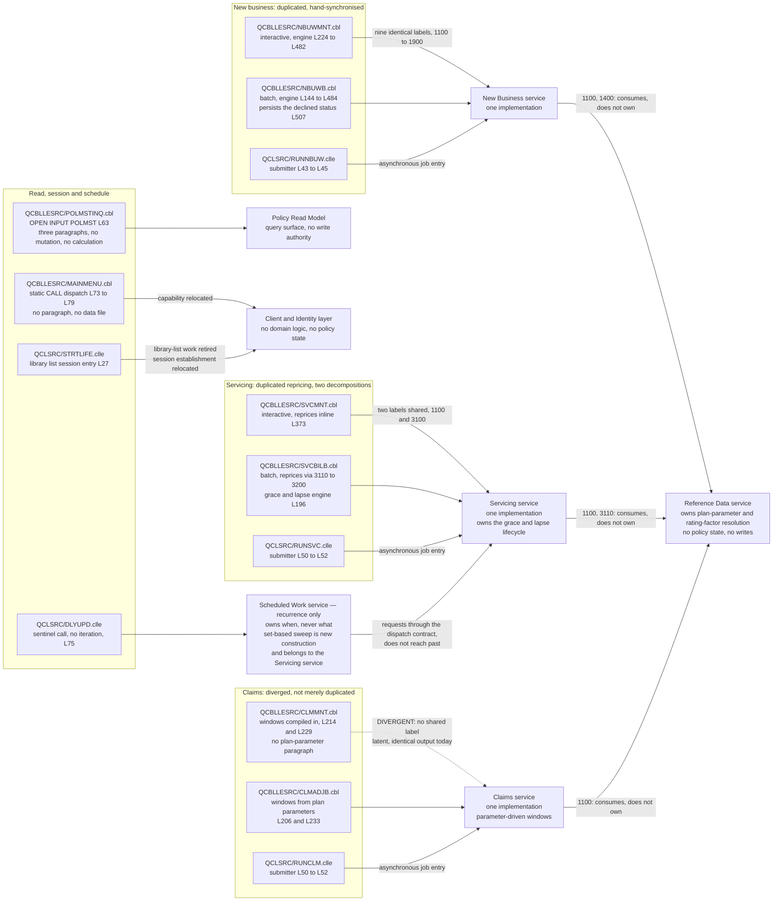

# LIFE400 Program-to-Service Map

This document answers two questions and nothing else: **which service does each program become, and which operation does each [paragraph](../reference/glossary-ibm-i.md#paragraph) become.** It takes the twenty-four-member estate apart at the granularity the estate itself uses — one row per executable member, then one row per paragraph — and names a destination for every row, so that no unit of the current system reaches the end of this assessment without somewhere to go. It is the evidence document behind the planned [MOD-ADR-004, one domain and rules service per business area](../decisions/MOD-ADR-004-single-domain-rules-service.md), which has not yet been written: that decision rests on the claim that each domain's two paths can be collapsed into one implementation, and the per-paragraph tables below are what make the claim checkable rather than asserted.

**Scope, and the four things this document deliberately does not do.** It does **not** define the target layering or draw the service boundaries — those are set by [the target architecture](01-target-architecture.md), and every destination named below sits inside a boundary that document already drew. It does **not** map a single column or choose a single type, which is owned by [the target data model and schema mapping](03-target-data-model-and-schema-mapping.md). It does **not** map a screen, a field position or a function key, which is owned by [the UI modernization document](05-ui-modernization.md). And it does **not** sequence the conversion: no stage, order of work, entry criterion or exit criterion appears here, because staging belongs to the migration layer and begins at [the recommended path](../migration/02-recommended-path.md). A decomposition and a route are different artifacts, and the decomposition below stays true if the route is replaced.

**Reading the citations.** Every claim about the existing system carries an inline citation of the form `[<path>:<locator>]` immediately after the claim. Citations are plain text and deliberately not hyperlinks: a plain-text citation survives a diff and does not depend on a hosting provider's line-anchor syntax. Statements about the target carry no citation, because a proposal has nothing to cite — the presence or absence of a citation is what marks the difference between an evidenced fact about LIFE400 and a proposal for its replacement. The same rule applies inside the diagram: every node standing for something that exists today names its member path in its own label. Every paragraph label and line number below was confirmed by opening the member it names, and platform terms link to [the IBM i glossary](../reference/glossary-ibm-i.md) on first use in this document.

**The target stack is consumed here, not re-argued.** The primary recommendation is Java on a current long-term-support release, with Spring Boot, on PostgreSQL as the relational datastore; the runner-up is C#/.NET, as a candidate rather than a second named stack; TypeScript and Node, and Python, are evaluated and rejected for the core; the decisive criterion is exact decimal arithmetic; the target is hosting-agnostic with a containerized reference deployment; and exit from the AS/400 hardware is deliberately deferred and decoupled from this work. **No release number, framework minor or datastore major is pinned by this assessment**: [MOD-ADR-001](../decisions/MOD-ADR-001-target-language-and-runtime.md#what-this-record-fixes-and-what-it-leaves-open) fixes the language, the support line and the framework together with the rule a concrete selection must satisfy, and the datastore is decided by `MOD-ADR-003` rather than supplied here. The reasoning belongs to [the target-language decision matrix](../talent/02-target-language-decision-matrix.md). Nothing below depends on which of the two languages is chosen, or on which release an implementation selects: a paragraph maps to the same operation either way.

**No temporal content, and no measurement restated from a sibling.** No date, duration, calendar sequence, effort figure or headcount appears anywhere below; where ordering matters it is stated as a dependency and never as a schedule. Where a sibling document owns a measurement, this document cites it instead of reproducing it — the duplication and divergence measurements belong to [the current-state architecture](../current-state/02-architecture-current-state.md), every business-rule count and identifier figure belongs to [the business rule inventory](../current-state/05-business-rule-inventory.md), the operational reading of the CL layer belongs to [the operational model](../current-state/06-operational-model.md), and the `migrate` / `implement` / `drop` verb attached to each defect belongs to [the known defects and stubs register](../current-state/07-known-defects-and-stubs.md). A second copy of a number is a second place for it to be wrong.

## Per-program destinations

Thirteen executable members: eight ILE COBOL programs and five [ILE](../reference/glossary-ibm-i.md#ile-integrated-language-environment) CL programs. The remaining eleven members of the estate are the shared [copybook](../reference/glossary-ibm-i.md#copybook) and the ten DDS members; they carry no executable logic and are therefore not rows here — the copybook's destination is the typed domain model owned by [the target data model and schema mapping](03-target-data-model-and-schema-mapping.md), and the DDS destinations are owned by that document and by [the UI modernization document](05-ui-modernization.md).

The destination kind column takes exactly one of four values, defined once here so the table can be read without inference:

- **service** — the behaviour becomes part of a domain service that owns the state it changes and exposes an interface.
- **read model** — the behaviour becomes a query surface with no authority to change anything.
- **scheduled worker** — the *recurrence* becomes a trigger owned by the **Scheduled Work service**, and the *work* becomes an operation of the domain service that owns the state it changes. The two are separated by the dispatch contract owned by [the target architecture](01-target-architecture.md), so no destination in this table both schedules work and performs it.
- **relocated** — the member ceases to exist as a unit, and its capability moves to a layer that is not a domain service: the client, or the identity and authorization layer. The capability survives; the member does not.
- **retired** — the capability itself ceases, because what it does is a property of the platform rather than of the business. Nothing in the target performs it and nothing needs to.

**Those last two values are distinguished because collapsing them into one loses the fact a reader most needs.** Three things can happen to a member and they have different consequences for the plan:

| What happens | Meaning | Consequence for the plan |
| --- | --- | --- |
| **Member retirement** | The source member has no successor member | Always true for every member: this is a rewrite, not a port, so it says nothing on its own |
| **Capability relocation** | The behaviour still has to exist somewhere in the target, outside a domain service | The behaviour must be specified, built and tested in its new layer. It is work, not saving |
| **Capability retirement** | The behaviour ceases to exist and nothing replaces it | The only case where a capability genuinely disappears from the plan. It must be justified, because a wrongly retired capability is a silent regression |

Applied honestly, **no member in this estate is purely capability-retired, and the two rows that come closest are both mixtures.** `MAINMENU` and `STRTLIFE` each combine relocation with retirement, and the table below marks them `relocated` with the retired part named in the notes, because marking either simply `retired` would suggest its whole function evaporates.

| Member | Role today | Destination | Kind | Notes |
|---|---|---|---|---|
| `QCBLLESRC/MAINMENU.cbl` | Interactive menu: writes one screen, reads a selection and dispatches by static `CALL` to four literal program names [QCBLLESRC/MAINMENU.cbl:L73-L79] | **Client and Identity layer** | relocated | **The only business program with zero data dependency.** It neither expands the shared contract nor opens a database file — its one `SELECT` is the [display file](../reference/glossary-ibm-i.md#display-file) [QCBLLESRC/MAINMENU.cbl:L32-L36] — and it holds no paragraph at all. Its destination is therefore routing and authorization rather than a domain service, which makes it the cleanest boundary in the estate |
| `QCBLLESRC/NBUWMNT.cbl` | Interactive new business: four screen steps, then a rating and validation engine [QCBLLESRC/NBUWMNT.cbl:L224-L482] | **New Business service**, reached by the interactive caller | service | Collapses with `NBUWB` into one implementation; the screen steps leave the service entirely and become client concerns |
| `QCBLLESRC/NBUWB.cbl` | Batch new business, entered with one key [QCBLLESRC/NBUWB.cbl:L79] | **New Business service**, reached by the asynchronous caller | service | Collapses with `NBUWMNT`. It is the only member in the estate that persists a declined status [QCBLLESRC/NBUWB.cbl:L507] |
| `QCBLLESRC/SVCMNT.cbl` | Interactive servicing: six amendment types, then repricing [QCBLLESRC/SVCMNT.cbl:L149-L439] | **Servicing service**, reached by the interactive caller | service | Collapses with `SVCBILB`. It is also the estate's clearest non-atomic write: a master rewrite and a secondary write back to back [QCBLLESRC/SVCMNT.cbl:L190-L191] |
| `QCBLLESRC/SVCBILB.cbl` | Batch servicing, entered with two keys [QCBLLESRC/SVCBILB.cbl:L88], plus the grace and lapse engine [QCBLLESRC/SVCBILB.cbl:L196] | **Servicing service**, reached by the asynchronous caller and by the Scheduled Work service | service | Collapses with `SVCMNT`. The grace and lapse engine is **not** a separate service: it is a lifecycle over policy state the Servicing service already owns, and only its trigger becomes scheduled work |
| `QCBLLESRC/CLMMNT.cbl` | Interactive claims: intake screens, then adjudication [QCBLLESRC/CLMMNT.cbl:L149-L283] | **Claims service**, reached by the interactive caller | service | Collapses with `CLMADJB` — the only pair that shares no paragraph label at all, and the pair whose two contestability and suicide windows agree today only because every plan happens to carry the same term |
| `QCBLLESRC/CLMADJB.cbl` | Batch claims adjudication, entered with two keys [QCBLLESRC/CLMADJB.cbl:L80] | **Claims service**, reached by the asynchronous caller | service | Collapses with `CLMMNT`. Carries a plan-parameter step and an investigation rule its interactive counterpart does not have at all |
| `QCBLLESRC/POLMSTINQ.cbl` | Policy inquiry: three paragraphs that get a key, look up a record and display it [QCBLLESRC/POLMSTINQ.cbl:L87], [QCBLLESRC/POLMSTINQ.cbl:L101], [QCBLLESRC/POLMSTINQ.cbl:L112] | **Policy Read Model** | read model | The estate's own precedent for separating reading from writing: it is the only member that opens the policy master for input only [QCBLLESRC/POLMSTINQ.cbl:L63] |
| `QCLSRC/STRTLIFE.clle` | Session entry: retrieves the current library, puts the application library first on the list, announces the session and calls the menu [QCLSRC/STRTLIFE.clle:L24], [QCLSRC/STRTLIFE.clle:L27], [QCLSRC/STRTLIFE.clle:L37], [QCLSRC/STRTLIFE.clle:L40] | **Client and Identity layer** — authenticated session establishment | relocated | Nothing it does survives as application code. Name resolution by library list is a platform mechanism, not a business rule, and the target resolves nothing by list — the externalization requirement that replaces it belongs to [the target architecture](01-target-architecture.md) |
| `QCLSRC/RUNNBUW.clle` | Guards one key against blanks, redirects two files and submits the batch new-business program [QCLSRC/RUNNBUW.clle:L29], [QCLSRC/RUNNBUW.clle:L37-L38], [QCLSRC/RUNNBUW.clle:L43-L45] | Asynchronous job entry point on the **New Business service** | service | The entry point belongs to the service that owns the work, not to a separate submission layer. One of its two redirections names a file its target never opens [QCLSRC/RUNNBUW.clle:L38] |
| `QCLSRC/RUNSVC.clle` | Guards two keys, redirects two files and submits the batch servicing program [QCLSRC/RUNSVC.clle:L29], [QCLSRC/RUNSVC.clle:L36], [QCLSRC/RUNSVC.clle:L44-L45], [QCLSRC/RUNSVC.clle:L50-L52] | Asynchronous job entry point on the **Servicing service** | service | Same shape as the other two submitters, and the same two keys the batch program declares [QCBLLESRC/SVCBILB.cbl:L88] |
| `QCLSRC/RUNCLM.clle` | Guards two keys, redirects two files and submits the batch claims program [QCLSRC/RUNCLM.clle:L29], [QCLSRC/RUNCLM.clle:L36], [QCLSRC/RUNCLM.clle:L44-L45], [QCLSRC/RUNCLM.clle:L50-L52] | Asynchronous job entry point on the **Claims service** | service | The one submitter that takes its domain key before the policy key [QCLSRC/RUNCLM.clle:L21] |
| `QCLSRC/DLYUPD.clle` | The estate's only scheduled work: sets a library list, redirects two files, calls the batch servicing program once with two sentinel literals and sends messages [QCLSRC/DLYUPD.clle:L24-L100] | **Scheduled Work service** for the recurrence, requesting the Servicing service's own operation for the work | scheduled worker | What is carried across is the *intent* stated in its banner, not the mechanism: the member contains no iteration of any kind [QCLSRC/DLYUPD.clle:L75] |

### Two members whose destination is not a domain service

Those two rows are easy to skim past and are the most consequential boundary decisions in the table, because a mapping that turned either into a service would put business logic where none exists today.

- **`MAINMENU` is relocated, not retired: its capability moves to the Client and Identity layer.** It is not a thin domain service; it is not a domain service at all. Two measured properties put it outside every domain: it declares exactly one file, the display file [QCBLLESRC/MAINMENU.cbl:L32-L36], so no policy state passes through it; and it contains no paragraph, its whole body being one inline loop [QCBLLESRC/MAINMENU.cbl:L60-L92], so there is no unit inside it that could become an operation. What it does encode is a navigable surface — five options and an exit, identical for every user who reaches it [QCBLLESRC/MAINMENU.cbl:L60-L92] — and in the target that surface is client routing constrained by authorization. **The member goes; the capability moves.** Navigation, selection validation and the dispatch decision all still have to exist — [the business rule inventory](../current-state/05-business-rule-inventory.md) attributes 67 documented rules to this member, the largest count in the estate — and they are relocated to the Client and Identity layer rather than deleted. What *is* capability-retired is narrow and specific: the exit-and-return-to-caller convention of a compiled program returning to its CL caller has no successor. The role model that constrains it is designed by [the target security control design](04-security-control-design.md), and the fifth option, which reports its own absence and calls nothing [QCBLLESRC/MAINMENU.cbl:L81], is dispositioned by [the known defects and stubs register](../current-state/07-known-defects-and-stubs.md).
- **`STRTLIFE` is the estate's clearest case of capability retirement — but not of all its capabilities.** Its four actions split cleanly along the distinction above, and separating them is what makes the row honest:

  - **Capability-retired.** Putting the application library first on the job's list so unqualified names resolve [QCLSRC/STRTLIFE.clle:L27], reading the job's current library to restore it afterwards [QCLSRC/STRTLIFE.clle:L24], and removing the library again when the menu returns [QCLSRC/STRTLIFE.clle:L40]. A target that resolves nothing by [library list](../reference/glossary-ibm-i.md#library-list) has no counterpart for any of the three, and needs none.
  - **Capability-relocated.** Establishing and announcing a session [QCLSRC/STRTLIFE.clle:L32], and being the point at which a user enters the application at all — configured as a per-user [initial program](../reference/glossary-ibm-i.md#initial-program) [QCLSRC/STRTLIFE.clle:L14-L16]. Session establishment does not disappear in the target; it moves to the Client and Identity layer and becomes authenticated rather than assumed, which is `CTL-AUTH` in [the target security control design](04-security-control-design.md).

  Recording the split matters precisely because this is the estate's entry point: a reader who saw only "retired" would conclude that session entry needs no design, which is the opposite of what the security layer requires.

## Per-paragraph destinations

Five subsections follow: **four tables** — one for each of the three business domains and one for the inquiry program — and a fifth subsection that carries no table, because neither the menu nor any CL member holds a paragraph to map. Each row maps a paragraph label to a destination operation, or to a destination that is not an operation at all — because three classes of paragraph do not become service operations, and saying so explicitly is more useful than inventing an operation for them:

- **Screen drivers become client concerns.** A paragraph whose body writes a [record format](../reference/glossary-ibm-i.md#record-format) and reads it back is presentation, and it leaves the service entirely.
- **Result reporters become the typed result.** A paragraph that moves an outcome into a screen field or a record field is not an operation; it is the return value, and its destination is described under the shared outcome contract below.
- **Initialisation disappears.** A paragraph that resets accumulators and flags before work begins exists because the estate's state outlives an invocation. Request-scoped state removes the need for it rather than relocating it.

Destination operations are named as plain noun phrases. No signature, type or class name appears in any table, because this assessment plans modernization rather than performing it — an operation name is a boundary, and a signature would be an implementation.

**Coverage is exhaustive and the arithmetic is checkable.** The four tables between them map **all eighty-one numbered paragraphs in the estate** — sixteen in [QCBLLESRC/NBUWMNT.cbl:L96-L482], twelve in [QCBLLESRC/NBUWB.cbl:L122-L504], fourteen in [QCBLLESRC/SVCMNT.cbl:L105-L440], seventeen in [QCBLLESRC/SVCBILB.cbl:L130-L526], ten in [QCBLLESRC/CLMMNT.cbl:L103-L284], nine in [QCBLLESRC/CLMADJB.cbl:L127-L311] and three in [QCBLLESRC/POLMSTINQ.cbl:L87-L112] — with none omitted and none mapped twice. `MAINMENU` contributes none, because it holds none [QCBLLESRC/MAINMENU.cbl:L60-L92]. A reader can confirm the total by adding the seven figures above; a reader who wants to confirm that each one is a real paragraph header can resolve any citation in the tables directly against the member.

Two conventions make the tables checkable. Every row cites the member and line of the paragraph it maps, and where the same work carries a different label on each path both labels and both citations appear in one row, so the row count is smaller than the paragraph count by exactly the number of such pairs. And the counts stated after each table are of **numbered** paragraphs: the per-program inventory they reconcile against is owned by [the current-state architecture](../current-state/02-architecture-current-state.md), which counts the same way and records separately that every program also carries one unnumbered driver paragraph. No driver paragraph is mapped here, because a driver opens files and runs a sequence rather than implementing a rule.

### New business and underwriting

Both members map into one service. The nine paragraphs whose labels are identical across the pair are marked **shared**; each is one destination operation reached from either caller, not two.

**Two senses of "shared" appear in these tables and they are not the same thing, so both are defined before the first table uses either.** Conflating them would leave an operation without an owner, which is the one outcome a decomposition must not produce.

- **Shared between the two callers of one domain** — the `**shared**` marker in the second column. The interactive path and the asynchronous path reach the *same* operation of the *same* service. The owner is that domain's service, and the marker records only that the operation is reached twice.
- **Shared across domains** — named in the destination column as **owned by the Reference Data service**. Three operations fall into this class: plan-parameter resolution, which all three business domains perform, and rating-factor resolution, which two of them do. **Their owner is not any domain service.** The canonical owner is defined in [the target architecture](01-target-architecture.md#canonical-service-names), and the reason it has to be a separate owner rather than a domain's is stated there: putting it inside one domain forces the other two to reach into that domain, and leaving a copy in each recreates the duplication this whole mapping exists to remove. The estate's own evidence is that the same per-plan conditional is compiled into five separate members [QCBLLESRC/NBUWB.cbl:L145-L159], [QCBLLESRC/NBUWMNT.cbl:L224], [QCBLLESRC/SVCBILB.cbl:L146], [QCBLLESRC/SVCMNT.cbl:L339], [QCBLLESRC/CLMADJB.cbl:L142].

| Paragraph | Where it is today | Destination operation |
|---|---|---|
| `1000-DISPLAY-HEADER` | [QCBLLESRC/NBUWMNT.cbl:L96] | Client — application header step; not a service operation |
| `2000-DISPLAY-INSURED` | [QCBLLESRC/NBUWMNT.cbl:L111] | Client — insured details step |
| `3000-DISPLAY-BENEFIT` | [QCBLLESRC/NBUWMNT.cbl:L127] | Client — benefit details step |
| `4000-DISPLAY-RIDERS` | [QCBLLESRC/NBUWMNT.cbl:L138] | Client — rider entry step, over a rider collection the target persists for the first time |
| `5000-ISSUE-POLICY` | [QCBLLESRC/NBUWMNT.cbl:L166] | Issue a policy from an application — the service's single coordinating operation, performing the nine shared operations in order [QCBLLESRC/NBUWMNT.cbl:L168-L196] |
| `8000-DISPLAY-RESULT` | [QCBLLESRC/NBUWMNT.cbl:L209] | Not an operation — the typed result, rendered by the client |
| `1000-INITIALIZE` | [QCBLLESRC/NBUWB.cbl:L122] | Not an operation — request-scoped state removes it |
| `1100-LOAD-PLAN-PARAMETERS` | **shared**: [QCBLLESRC/NBUWMNT.cbl:L224], [QCBLLESRC/NBUWB.cbl:L144] | Resolve plan parameters — a lookup against externalized product reference data, not a compiled-in branch per plan. **Owned by the Reference Data service, not by this one**, because all three domains perform it |
| `1200-VALIDATE-APPLICATION` | **shared**: [QCBLLESRC/NBUWMNT.cbl:L274], [QCBLLESRC/NBUWB.cbl:L197] | Validate an application against plan eligibility. **It tests issue age against the plan bounds** [QCBLLESRC/NBUWB.cbl:L231-L232], and no statement in the estate assigns issue age at all — `DEF-05` — so the operation takes a date of birth and derives the age rather than accepting one; the derivation contract is owned by [the target data model and schema mapping](03-target-data-model-and-schema-mapping.md) |
| `1300-DETERMINE-UW-CLASS` | **shared**: [QCBLLESRC/NBUWMNT.cbl:L340], [QCBLLESRC/NBUWB.cbl:L273] | Determine the underwriting class |
| `1400-LOAD-RATE-FACTORS` | **shared**: [QCBLLESRC/NBUWMNT.cbl:L358], [QCBLLESRC/NBUWB.cbl:L301] | Resolve rating factors — externalized reference data, as for plan parameters. **Owned by the Reference Data service**, and consumed here. Its mortality-band selection is keyed on the derived issue age [QCBLLESRC/NBUWB.cbl:L304-L310], and it records which factor version it resolved |
| `1500-VALIDATE-RIDERS` | **shared**: [QCBLLESRC/NBUWMNT.cbl:L383], [QCBLLESRC/NBUWB.cbl:L345] | Validate the requested riders. Both sides iterate a fixed five slots [QCBLLESRC/NBUWB.cbl:L347-L348]; the target iterates a collection, which is why rider persistence is to be decided separately in the planned [MOD-ADR-009](../decisions/MOD-ADR-009-rider-persistence.md) |
| `1600-CALCULATE-BASE-PREMIUM` | **shared**: [QCBLLESRC/NBUWMNT.cbl:L418], [QCBLLESRC/NBUWB.cbl:L388] | Calculate the base premium |
| `1700-CALCULATE-RIDER-PREMIUM` | **shared**: [QCBLLESRC/NBUWMNT.cbl:L428], [QCBLLESRC/NBUWB.cbl:L405] | Calculate rider premiums — again a five-slot loop today [QCBLLESRC/NBUWB.cbl:L407-L408] |
| `1800-CALCULATE-TOTAL-PREMIUM` | **shared**: [QCBLLESRC/NBUWMNT.cbl:L451], [QCBLLESRC/NBUWB.cbl:L436] | Calculate the total and modal premium |
| `1900-EVALUATE-REFERRALS` | **shared**: [QCBLLESRC/NBUWMNT.cbl:L473], [QCBLLESRC/NBUWB.cbl:L469] | Evaluate underwriting and reinsurance referral |
| `2000-ISSUE-POLICY-RECORD` | [QCBLLESRC/NBUWMNT.cbl:L482] | Commit the issue decision — **not shared with the batch paragraph below**, and the two differ in what they leave behind |
| `2000-ISSUE-POLICY` | [QCBLLESRC/NBUWB.cbl:L484] | Commit the issue decision — the same destination operation as the row above, reached from a different label |
| `9000-RETURN-ERROR` | [QCBLLESRC/NBUWB.cbl:L504] | Not an operation — the typed failure result, and the only place in the estate a declined status is persisted [QCBLLESRC/NBUWB.cbl:L507] |

Nineteen rows covering the two members' twenty-eight numbered paragraphs, because nine rows carry a shared label and map two paragraphs each. They reduce to **eleven operations** of the New Business service — the nine shared, the coordinator and the commit — plus four client steps and three rows that are not operations at all.

### Policy servicing and amendments

Both members map into one service, and this pair shares only two labels. Where the same work carries different labels, the destination column says so — the pairing is by behaviour, not by name.

| Paragraph | Where it is today | Destination operation |
|---|---|---|
| `1000-DISPLAY-HEADER` | [QCBLLESRC/SVCMNT.cbl:L105] | Client — policy identification step |
| `2000-DISPLAY-POLICY` | [QCBLLESRC/SVCMNT.cbl:L120] | Client — current policy display, served by the Policy Read Model rather than by the Servicing service |
| `3000-DISPLAY-AMENDMENT` | [QCBLLESRC/SVCMNT.cbl:L134] | Client — amendment entry step |
| `4000-APPLY-AMENDMENT` | [QCBLLESRC/SVCMNT.cbl:L149] | Apply an amendment — the coordinating operation, dispatching on the amendment type [QCBLLESRC/SVCMNT.cbl:L179-L189] |
| `1400-VALIDATE-SERVICING-REQUEST` | [QCBLLESRC/SVCBILB.cbl:L219] | Validate a servicing request — reached from both callers, though only the batch member has it today |
| `4100-CHANGE-PLAN` / `2100-CHANGE-PLAN` | [QCBLLESRC/SVCMNT.cbl:L194], [QCBLLESRC/SVCBILB.cbl:L237] | Change plan — one operation for amendment type `PL` [QCPYSRC/POLDATA.cpy:L119] |
| `4200-CHANGE-SA` / `2200-CHANGE-SUM-ASSURED` | [QCBLLESRC/SVCMNT.cbl:L218], [QCBLLESRC/SVCBILB.cbl:L275] | Change sum assured — amendment type `SA` [QCPYSRC/POLDATA.cpy:L120] |
| `4300-CHANGE-BM` / `2300-CHANGE-BILLING-MODE` | [QCBLLESRC/SVCMNT.cbl:L245], [QCBLLESRC/SVCBILB.cbl:L308] | Change billing mode — amendment type `BM` [QCPYSRC/POLDATA.cpy:L121] |
| `4400-ADD-RIDER` / `2400-ADD-RIDER` | [QCBLLESRC/SVCMNT.cbl:L262], [QCBLLESRC/SVCBILB.cbl:L329] | Add a rider — amendment type `AR` [QCPYSRC/POLDATA.cpy:L122]. **The request has to identify the rider, and today nothing does**: the servicing file has no rider column and the amendment screen offers no rider input [QDDSSRC/SVCDSPF.dspf:L82-L90], so the operation takes a rider code, a sum assured and an effective date, and returns the coverage period it opened. The request and persistence contract is owned by [the target data model and schema mapping](03-target-data-model-and-schema-mapping.md) |
| `4500-REMOVE-RIDER` / `2500-REMOVE-RIDER` | [QCBLLESRC/SVCMNT.cbl:L299], [QCBLLESRC/SVCBILB.cbl:L371] | Remove a rider — amendment type `RR` [QCPYSRC/POLDATA.cpy:L123]. Same gap and same closure: the operation takes the rider code and the effective date, and closes an open coverage period rather than overwriting a status byte, so a later re-add is a new period rather than an indistinguishable rewrite |
| `4600-REINSTATE` / `2600-PROCESS-REINSTATEMENT` | [QCBLLESRC/SVCMNT.cbl:L316], [QCBLLESRC/SVCBILB.cbl:L393] | Reinstate a lapsed policy — amendment type `RI` [QCPYSRC/POLDATA.cpy:L124] |
| `1100-LOAD-PLAN-PARAMETERS` | **shared**: [QCBLLESRC/SVCMNT.cbl:L339], [QCBLLESRC/SVCBILB.cbl:L146] | Resolve plan parameters — **the same operation the new-business table names**, not a servicing copy of it. **Owned by the Reference Data service** and consumed by this one |
| `1200-CALCULATE-ATTAINED-AGE` | [QCBLLESRC/SVCBILB.cbl:L187] | Calculate attained age |
| `1300-EVALUATE-PAYMENT-STATUS` | [QCBLLESRC/SVCBILB.cbl:L196] | Evaluate payment status and advance the grace and lapse lifecycle — **no interactive counterpart exists**, and this is the operation the Scheduled Work service requests through the dispatch contract |
| `3100-REPRICE-POLICY` | **shared**: [QCBLLESRC/SVCMNT.cbl:L373], [QCBLLESRC/SVCBILB.cbl:L422] | Reprice a policy — one operation. The batch side decomposes it into four sub-paragraphs [QCBLLESRC/SVCBILB.cbl:L434], [QCBLLESRC/SVCBILB.cbl:L473], [QCBLLESRC/SVCBILB.cbl:L485], [QCBLLESRC/SVCBILB.cbl:L513] and the interactive side performs the same stages inline; the decomposition survives, the duplication does not |
| `3110-LOAD-RATING-FACTORS` | [QCBLLESRC/SVCBILB.cbl:L434] | Resolve rating factors — the same operation the new-business table names. **Owned by the Reference Data service** |
| `3120-CALCULATE-BASE-ANNUAL` | [QCBLLESRC/SVCBILB.cbl:L473] | Calculate the base annual premium |
| `3130-CALCULATE-RIDER-ANNUAL` | [QCBLLESRC/SVCBILB.cbl:L485] | Calculate rider premiums |
| `3140-CALCULATE-TOTAL-ANNUAL` | [QCBLLESRC/SVCBILB.cbl:L513] | Calculate the total annual premium and the premium delta |
| `3200-RECALCULATE-MODAL` / `3200-RECALCULATE-MODAL-PREMIUM` | [QCBLLESRC/SVCMNT.cbl:L425], [QCBLLESRC/SVCBILB.cbl:L526] | Recalculate the modal premium — one operation, reached from two labels that differ by suffix |
| `1000-INITIALIZE` | [QCBLLESRC/SVCBILB.cbl:L130] | Not an operation — request-scoped state removes it |
| `9000-DISPLAY-RESULT` | [QCBLLESRC/SVCMNT.cbl:L440] | Not an operation — the typed result |

Twenty-two rows covering the two members' thirty-one numbered paragraphs. They reduce to **fifteen operations** of the Servicing service, plus **two it consumes from the Reference Data service** — plan-parameter resolution and rating-factor resolution, which are one implementation owned outside every domain rather than one per domain — plus three client steps and two rows that are not operations. The compression is larger here than in new business because the six amendment operations, the repricing operation and the modal recalculation each exist twice under different labels.

#### Worked examples: one per amendment type

A row of the table above names a destination; it does not show what the operation is handed or what a caller observes afterwards, and those are what make an operation reviewable by an engineer who cannot read the source. One example per amendment type follows, and each is walked from a precondition through an input to an outcome. **Three conventions apply to all six.** Preconditions and inputs are *representative* — chosen to exercise the path, never taken from real policy data, and no monetary amount, age or date value is invented, so each is expressed as the relation the code itself tests rather than as a number. Every clause describing today's behaviour carries its citation; the destination operation and the target outcome carry none, because they are proposals. And **none of these is a test case**: the fixture design, the assertions and the coverage targets belong to the planned [characterization test strategy](../migration/05-characterization-test-strategy.md), which this document feeds rather than pre-empts.

All six reach their operation through the same coordinating operation, which refuses the request outright when the contract is claimed or terminated [QCBLLESRC/SVCMNT.cbl:L155-L158], then resolves plan parameters and advances the grace and lapse status before dispatching on the amendment type [QCBLLESRC/SVCMNT.cbl:L179-L189]. The examples below start after that dispatch.

| Type | Representative precondition | Representative input | Destination operation | What a caller observes |
|---|---|---|---|---|
| `PL` plan change [QCPYSRC/POLDATA.cpy:L119] | Contract status active or in grace — anything else is refused with result code 13 [QCBLLESRC/SVCMNT.cbl:L195-L199] — and attained age inside the issue-age limits the plan-parameter step loads for the **new** plan [QCBLLESRC/SVCMNT.cbl:L341-L370] | The new plan code, carried in the contract's new-plan-code field [QCPYSRC/POLDATA.cpy:L127] | Change plan | Success: the previous plan code is retained and the new one takes effect [QCBLLESRC/SVCMNT.cbl:L201-L202], the policy is repriced [QCBLLESRC/SVCMNT.cbl:L212], the service fee charged rises by the plan's own service-fee parameter — the same value in each of the three plan branches [QCBLLESRC/SVCMNT.cbl:L213], [QCBLLESRC/SVCMNT.cbl:L349], [QCBLLESRC/SVCMNT.cbl:L359], [QCBLLESRC/SVCMNT.cbl:L369] — and the amendment is approved [QCBLLESRC/SVCMNT.cbl:L214]. Refusal: an attained age outside the new plan's limits returns code 14 **and restores the original plan code**, so the request leaves no half-applied state [QCBLLESRC/SVCMNT.cbl:L204-L210] |
| `SA` sum assured change [QCPYSRC/POLDATA.cpy:L120] | A requested amount inside the plan's minimum and maximum; zero, below the minimum or above the maximum returns code 15 [QCBLLESRC/SVCMNT.cbl:L219-L225] | The requested new sum assured [QCPYSRC/POLDATA.cpy:L129] | Change sum assured | Success: the previous amount is retained, the new one takes effect, the policy is repriced and the amendment is approved [QCBLLESRC/SVCMNT.cbl:L236-L241]. **Referral:** an increase of more than a quarter over the current amount, or above the absolute ceiling the paragraph tests, sets the underwriting-required flag, returns code 31 and leaves the amendment **pending** rather than approved [QCBLLESRC/SVCMNT.cbl:L226-L235] — the only amendment type whose non-error path can end pending, which is why the target operation returns the amendment's own status rather than a boolean |
| `BM` billing mode change [QCPYSRC/POLDATA.cpy:L121] | Nothing beyond the coordinating operation's status check; the mode itself must be one of the four the paragraph accepts, and anything else returns code 16 [QCBLLESRC/SVCMNT.cbl:L246-L252] | The requested billing mode [QCPYSRC/POLDATA.cpy:L131] | Change billing mode | The previous mode is retained and the new one takes effect [QCBLLESRC/SVCMNT.cbl:L254-L255], then **only the modal premium is recalculated — the annual premium is untouched** [QCBLLESRC/SVCMNT.cbl:L256], which makes this the one amendment that changes what is billed without repricing the contract. A fixed amount is added to the service fee charged [QCBLLESRC/SVCMNT.cbl:L257] and the amendment is approved [QCBLLESRC/SVCMNT.cbl:L258] |
| `AR` add rider [QCPYSRC/POLDATA.cpy:L122] | Fewer than five slots hold an active rider, since five returns code 17 [QCBLLESRC/SVCMNT.cbl:L263-L275], and attained age not above sixty, which returns code 18 [QCBLLESRC/SVCMNT.cbl:L277-L281] | The amendment type alone. **No rider code is an input:** the paragraph writes one hardcoded code into the first empty slot [QCBLLESRC/SVCMNT.cbl:L283-L290] | Add a rider | The first empty slot receives that code, its sum assured is set from the base sum assured and its status becomes active [QCBLLESRC/SVCMNT.cbl:L286-L289]; the policy is repriced, a fixed amount is added to the fee charged and the amendment is approved [QCBLLESRC/SVCMNT.cbl:L293-L295]. In the target the slot becomes a row of the rider entity to be decided by the planned [MOD-ADR-009](../decisions/MOD-ADR-009-rider-persistence.md), and the rider code becomes a genuine parameter |
| `RR` remove rider [QCPYSRC/POLDATA.cpy:L123] | An active rider carrying the same hardcoded code. **The paragraph has no not-found branch:** when no such slot exists it still reprices, still charges the fee and still reports the rider removed [QCBLLESRC/SVCMNT.cbl:L299-L313], and the batch counterpart sets a found-flag it never tests [QCBLLESRC/SVCBILB.cbl:L372] | The amendment type alone | Remove a rider | The matched slot's status becomes removed and its sum assured and premium are zeroed [QCBLLESRC/SVCMNT.cbl:L302-L306]; the policy is repriced, a fixed amount is added to the fee charged and the amendment is approved [QCBLLESRC/SVCMNT.cbl:L310-L312]. The target operation has to decide the not-found case explicitly, because the legacy behaviour charges for work it did not do |
| `RI` reinstatement [QCPYSRC/POLDATA.cpy:L124] | Contract status lapsed — anything else returns code 21 [QCBLLESRC/SVCMNT.cbl:L317-L321] — and the interval since the paid-to date inside the reinstatement window, which returns code 22 when exceeded [QCBLLESRC/SVCMNT.cbl:L322-L329]. The window is a compiled-in literal on this path and a plan parameter on the batch path, a divergence owned as a measurement by [the current-state architecture](../current-state/02-architecture-current-state.md) | The amendment type alone | Reinstate a lapsed policy | The outstanding premium is set from the modal premium [QCBLLESRC/SVCMNT.cbl:L331], the fee charged receives **two separate additions rather than one** [QCBLLESRC/SVCMNT.cbl:L332-L333], the contract status becomes reinstated [QCBLLESRC/SVCMNT.cbl:L334] and the amendment is approved [QCBLLESRC/SVCMNT.cbl:L335]. This is the only amendment that moves the contract status itself, so in the target it is the one whose result the policy read model must reflect immediately |

Two properties of the six are visible only when they are read together, and both are destination requirements rather than observations. **The amendment status is the operation's real result**, taking one of the three values the contract declares [QCPYSRC/POLDATA.cpy:L133-L135]: five types end approved on their success path while `SA` can end pending, so a target operation returning success or failure alone would lose information the estate already carries. And **the fee charged is assembled by accumulation rather than computed**, each type adding its own amount to a field the coordinating operation zeroes at entry [QCBLLESRC/SVCMNT.cbl:L153], which is why the target's fee handling belongs inside the single servicing operation and not in a caller.

### Death claim intake and adjudication

Both members map into one service. **This pair shares no paragraph label at all** — a fact owned as a measurement by [the current-state architecture](../current-state/02-architecture-current-state.md) — yet three of its paragraphs carry the same verb-noun suffix under a different number prefix. That combination is exactly why this table pairs by behaviour and treats the labels as unreliable: a mapping done by name would have missed all three.

| Paragraph | Where it is today | Destination operation |
|---|---|---|
| `1000-DISPLAY-HEADER` | [QCBLLESRC/CLMMNT.cbl:L103] | Client — claim identification step |
| `2000-DISPLAY-CLAIM-DETAIL` | [QCBLLESRC/CLMMNT.cbl:L124] | Client — claim detail entry step |
| `3000-DISPLAY-DOCS` | [QCBLLESRC/CLMMNT.cbl:L137] | Client — supporting document checklist step |
| `4000-ADJUDICATE-CLAIM` | [QCBLLESRC/CLMMNT.cbl:L149] | Adjudicate a claim — the coordinating operation |
| `1000-INITIALIZE` | [QCBLLESRC/CLMADJB.cbl:L127] | Not an operation — request-scoped state removes it |
| `1100-LOAD-PLAN-PARAMETERS` | [QCBLLESRC/CLMADJB.cbl:L142] | Resolve plan parameters — the same operation the new-business table names, **owned by the Reference Data service**. **The interactive member has no such paragraph**, which is the structural cause of the divergence described below |
| `4100-VALIDATE-CLAIM` / `1200-VALIDATE-CLAIM-INTAKE` | [QCBLLESRC/CLMMNT.cbl:L182], [QCBLLESRC/CLMADJB.cbl:L164] | Validate claim intake |
| `4200-CHECK-INVESTIGATION` / `1300-DETERMINE-INVESTIGATION` | [QCBLLESRC/CLMMNT.cbl:L210], [QCBLLESRC/CLMADJB.cbl:L201] | Determine whether the claim requires investigation — one operation, and the one whose two current implementations disagree on both content and inputs |
| `4300-ADJUDICATE-COVERAGE` / `1400-ADJUDICATE-COVERAGE` | [QCBLLESRC/CLMMNT.cbl:L228], [QCBLLESRC/CLMADJB.cbl:L231] | Adjudicate coverage — identical suffix, different prefix |
| `4400-CALCULATE-SETTLEMENT` / `1500-CALCULATE-SETTLEMENT` | [QCBLLESRC/CLMMNT.cbl:L247], [QCBLLESRC/CLMADJB.cbl:L256] | Calculate the settlement amount, including active accidental-death rider benefit, iterated over five slots today [QCBLLESRC/CLMADJB.cbl:L261-L262] |
| `4500-SETTLE-CLAIM` / `1600-SETTLE-CLAIM` | [QCBLLESRC/CLMMNT.cbl:L270], [QCBLLESRC/CLMADJB.cbl:L288] | Settle the claim and record the decision |
| `9000-DISPLAY-RESULT` | [QCBLLESRC/CLMMNT.cbl:L284] | Not an operation — the typed result |
| `9000-RETURN-ERROR` | [QCBLLESRC/CLMADJB.cbl:L303] | Not an operation — the typed failure result |
| `9000-RETURN-PENDING` | [QCBLLESRC/CLMADJB.cbl:L311] | Not an operation — the typed pending result. It shares its number prefix with the row above, the only such collision in the estate |

Fourteen rows covering the two members' nineteen numbered paragraphs. They reduce to **six operations** of the Claims service, plus the plan-parameter resolution it consumes from the Reference Data service, three client steps and four rows that are not operations — the largest proportion of non-operation rows in the estate, because this is the only domain whose two paths carry three separate outcome paragraphs between them.

#### Worked examples: one per claim outcome

The contract declares exactly three claim decisions — approved, rejected and pending [QCPYSRC/POLDATA.cpy:L166-L168] — and which one a claim ends on is decided by *where* the batch coordinator stops rather than by any single rule. One example per decision follows, under the same three conventions as the servicing examples above: preconditions and inputs are representative rather than real, no age, amount or date value is invented, every statement about today's behaviour is cited, and none of these is a test case.

The coordinator's shape is what the three examples share, so it is stated once. It reads the policy, refuses a missing one, then runs validation, investigation determination and coverage adjudication in that order, and **after each step it either stops or continues** [QCBLLESRC/CLMADJB.cbl:L86-L119]; only a claim that survives all three reaches settlement calculation and settlement. Both members are entered with a claim identifier and a policy identifier and neither carries any other input [QCBLLESRC/CLMADJB.cbl:L80].

| Decision | Representative precondition | Where the coordinator stops | Destination operation path | What a caller observes |
|---|---|---|---|---|
| Approved [QCPYSRC/POLDATA.cpy:L166] | A death claim on a policy that is active or in grace, with a claim identifier, a date of death and a beneficiary present, and with the death certificate, claim form and identity proof all received [QCBLLESRC/CLMADJB.cbl:L165-L195]; a death outside the contestability interval derived from the plan's own parameter [QCBLLESRC/CLMADJB.cbl:L204-L212]; a cause that is not one of the three the investigation rule treats as suspicious [QCBLLESRC/CLMADJB.cbl:L214-L219]; and a date of death not after the policy's expiry date [QCBLLESRC/CLMADJB.cbl:L245-L250] | Nowhere — it runs to the end [QCBLLESRC/CLMADJB.cbl:L118-L119] | Adjudicate a claim, then calculate the settlement amount, then settle the claim and record the decision | A settlement amount built in four steps — the sum assured, plus the sum assured of an active accidental-death rider when the cause is accidental, minus the modal premium when the policy is in grace, minus any outstanding loan balance, and floored at zero rather than allowed to go negative [QCBLLESRC/CLMADJB.cbl:L258-L283] — and a terminal state written in one place: decision approved, investigation complete, contract status claimed, both the adjudication and settlement dates stamped, and the payment mode defaulted when the record carries none [QCBLLESRC/CLMADJB.cbl:L289-L296] |
| Rejected [QCPYSRC/POLDATA.cpy:L167] | Either a coverage exclusion — a suicide inside the interval derived from the plan's suicide parameter [QCBLLESRC/CLMADJB.cbl:L232-L242], or a date of death after the expiry date [QCBLLESRC/CLMADJB.cbl:L245-L250] — or **any** intake failure, including a non-death claim type, a policy that is neither active nor in grace, missing core data, or a missing required document [QCBLLESRC/CLMADJB.cbl:L165-L195] | At validation or at coverage adjudication, in both cases through the failure result [QCBLLESRC/CLMADJB.cbl:L97-L103], [QCBLLESRC/CLMADJB.cbl:L111-L117] | Adjudicate a claim, returning the typed failure result without reaching settlement | The failing rule's own code and message, and decision rejected — set by the failure result itself rather than by the rule [QCBLLESRC/CLMADJB.cbl:L303-L306]. No settlement is computed and no decision date is stamped. **One case deserves separate attention in the target:** a claim held only for missing documents reports "manual review" in its message yet leaves the decision **rejected**, because the missing-document rule returns a non-zero code and every non-zero code from validation routes to the failure result [QCBLLESRC/CLMADJB.cbl:L188-L195]. A target that carries "rejected" and "held for documents" as one state would reproduce that conflation |
| Pending [QCPYSRC/POLDATA.cpy:L168] | Any one of the three investigation triggers: a death inside the contestability interval [QCBLLESRC/CLMADJB.cbl:L204-L212], a cause recorded as unknown, homicide or suicide [QCBLLESRC/CLMADJB.cbl:L214-L219], or an accidental, homicide or unknown cause with no medical records received [QCBLLESRC/CLMADJB.cbl:L221-L226] — the third of which the interactive path does not have at all, a divergence owned as a measurement by [the current-state architecture](../current-state/02-architecture-current-state.md) | Immediately after the investigation determination [QCBLLESRC/CLMADJB.cbl:L104-L110] | Adjudicate a claim, returning the typed pending result | Investigation status pending, decision pending, and a distinct return code that is neither success nor failure [QCBLLESRC/CLMADJB.cbl:L311-L314]. No settlement is computed and no adjudication date is stamped, so the claim is genuinely suspended rather than closed — which is why the target operation's result type needs three cases and not two |

Two consequences for the target follow from reading the three together, and both are design requirements rather than restatements. **The decision is written by the outcome path, not by the rule that fired**, so each of the three outcome paragraphs sets the decision itself [QCBLLESRC/CLMADJB.cbl:L289], [QCBLLESRC/CLMADJB.cbl:L306], [QCBLLESRC/CLMADJB.cbl:L314] — three places today, one typed result in the target. And **every outcome, including both terminal failures, rewrites the policy master before returning** [QCBLLESRC/CLMADJB.cbl:L99-L100], [QCBLLESRC/CLMADJB.cbl:L106-L107], [QCBLLESRC/CLMADJB.cbl:L113-L114], so a rejected or pending claim still mutates state — which is exactly why the target's failure and pending results have to be transactional rather than treated as read-only errors.

### Policy inquiry

| Paragraph | Where it is today | Destination operation |
|---|---|---|
| `1000-GET-POLICY-ID` | [QCBLLESRC/POLMSTINQ.cbl:L87] | Client — key entry step |
| `2000-LOOKUP-POLICY` | [QCBLLESRC/POLMSTINQ.cbl:L101] | Fetch a policy by identifier — the read model's only operation |
| `3000-DISPLAY-POLICY` | [QCBLLESRC/POLMSTINQ.cbl:L112] | Client — policy projection, rendered from the fields the paragraph selects [QCBLLESRC/POLMSTINQ.cbl:L113-L123] |

### Session, dispatch and the CL layer

Neither the menu nor any CL member holds a paragraph, so there is no paragraph mapping for the five members below. Their destinations are stated once each in the per-program table above and developed in the three sections that follow: scheduled work, batch submission, and — for the two retired members — the subsection immediately after the per-program table.

## Collapsing each domain's two paths into one implementation

This is the section the planned [MOD-ADR-004](../decisions/MOD-ADR-004-single-domain-rules-service.md) will be decided on. The target rule is one sentence: **a domain's rules exist once, and the interactive path and the asynchronous path are two callers of that one implementation rather than two implementations of it.** What follows is the evidence that the collapse is feasible for each pair, and — where it is not simply feasible — what has to be settled first.

Each of the three domains needs a different argument, because the three pairs are related in three different ways. The measurements that establish *how* related each pair is, including the divergence inventory behind them, are owned by [the current-state architecture](../current-state/02-architecture-current-state.md) and are cited rather than repeated. What this document adds is the mapping consequence: which paragraph becomes which operation, and which of two behaviours the single implementation keeps.

### New business: nine labels repeated verbatim, and a tenth that is not

`NBUWMNT` repeats **nine** paragraph labels from `NBUWB` verbatim. The pairs are listed individually in the new-business table above; the engine that contains them spans [QCBLLESRC/NBUWMNT.cbl:L224-L482] on the interactive side against [QCBLLESRC/NBUWB.cbl:L144-L484] on the batch side, and both ranges were confirmed by reading the members rather than by counting labels.

**The 2000-level pair is not identical, and this document does not report it as one.** The interactive program's tenth engine paragraph is `2000-ISSUE-POLICY-RECORD` [QCBLLESRC/NBUWMNT.cbl:L482]; the batch program's is `2000-ISSUE-POLICY` [QCBLLESRC/NBUWB.cbl:L484]. The labels differ by suffix, so the verbatim set is the nine paragraphs `1100` through `1900` and no further — a description saying the two agree "through `2000-ISSUE`" is wrong twice over, once about the extent of the agreement and once about the batch label itself. The distinction is not pedantry: anything that addresses paragraphs by name, including a conversion tool or a characterization harness, matches nine of ten and silently misses the tenth, which is the one that decides the contract status.

The duplication is **hand-synchronised**, and that phrase is precise rather than rhetorical. Nothing in this estate checks that the nine pairs agree: the build is a manual sequence of compile commands with no comparison step, no test target and no static check, as [the operational model](../current-state/06-operational-model.md) establishes, and the rule identifiers that might have anchored the pairs to each other exist only as comments in three members, per [the business rule inventory](../current-state/05-business-rule-inventory.md). Agreement is therefore maintained by a person remembering to edit both bodies, and the estate offers no mechanism that would notice if they forgot. **One implementation retires exactly that risk** — not the risk that the two bodies are currently wrong, but the standing risk that the next edit reaches only one of them.

### Servicing: one responsibility, two decompositions

The servicing pair shares two labels, `1100-LOAD-PLAN-PARAMETERS` [QCBLLESRC/SVCMNT.cbl:L339] against [QCBLLESRC/SVCBILB.cbl:L146], and `3100-REPRICE-POLICY` [QCBLLESRC/SVCMNT.cbl:L373] against [QCBLLESRC/SVCBILB.cbl:L422]. Underneath those two labels the two members are structured differently, and three mapping consequences follow.

- **Repricing collapses to one operation, and the batch decomposition is the one that survives.** The batch member makes repricing a coordinator over `3110-LOAD-RATING-FACTORS` [QCBLLESRC/SVCBILB.cbl:L434], `3120-CALCULATE-BASE-ANNUAL` [QCBLLESRC/SVCBILB.cbl:L473], `3130-CALCULATE-RIDER-ANNUAL` [QCBLLESRC/SVCBILB.cbl:L485], `3140-CALCULATE-TOTAL-ANNUAL` [QCBLLESRC/SVCBILB.cbl:L513] and `3200-RECALCULATE-MODAL-PREMIUM` [QCBLLESRC/SVCBILB.cbl:L526]; the interactive member performs the same stages inside one paragraph before handing off to `3200-RECALCULATE-MODAL` [QCBLLESRC/SVCMNT.cbl:L425]. The decomposed form is preserved because it names the stages the rules are expressed in; the inline form is not, because it names nothing.
- **The six amendment operations exist twice under different numbers.** Interactive `4100` through `4600` [QCBLLESRC/SVCMNT.cbl:L194-L316] against batch `2100` through `2600` [QCBLLESRC/SVCBILB.cbl:L237-L393]. Both sides dispatch on the same six type codes defined once in the shared contract [QCPYSRC/POLDATA.cpy:L118-L124] — [QCBLLESRC/SVCMNT.cbl:L179-L189] against [QCBLLESRC/SVCBILB.cbl:L113-L120] — so the amendment type is the stable identity and the paragraph number is not. Six operations, not twelve.
- **The grace and lapse engine has no interactive counterpart and does not become a service of its own.** `1300-EVALUATE-PAYMENT-STATUS` exists only in the batch member [QCBLLESRC/SVCBILB.cbl:L196]. It advances the same policy state the Servicing service already owns, so splitting it out would put two owners on one state transition — the boundary reasoning is [the target architecture](01-target-architecture.md)'s. What is separate is its trigger, and that becomes scheduled work.

### Claims: divergence rather than duplication, and a split no output comparison can find

The claims pair is the most important finding in this document, and it is worth being exact about *why*, because the obvious reason is the wrong one. It is not that only this pair differs — all three pairs differ, and the complete inventory of differences, with the active, latent and inert label on each, is owned by [the current-state architecture](../current-state/02-architecture-current-state.md). It is that this pair's two implementations differ **structurally** while agreeing **numerically**, and that combination defeats the one verification a migration naturally reaches for.

The asymmetry is the point. A difference in what a path computes, or in what it leaves behind, shows up the moment two paths are run against the same input — which is what makes the other two pairs' differences findable. A difference in *where a value comes from*, between two paths that currently obtain the same value, shows up nowhere at all.

The interactive member **compiles its windows in**. It computes the contestability window from a literal, `COMPUTE WS-DAYS-CONTESTABLE = 2 * 365` [QCBLLESRC/CLMMNT.cbl:L214], and the suicide window from the same literal, `COMPUTE WS-DAYS-SUICIDE-WINDOW = 2 * 365` [QCBLLESRC/CLMMNT.cbl:L229]. It bypasses the shared contract's plan-parameter fields entirely, and it has no choice: `1100-LOAD-PLAN-PARAMETERS` is absent from that member, so there is nowhere for it to have read a plan value from.

The batch member is **parameter-driven**. It loads per-plan values [QCBLLESRC/CLMADJB.cbl:L145-L154], then computes the contestability window from the field it loaded [QCBLLESRC/CLMADJB.cbl:L206-L207] and the suicide window from another [QCBLLESRC/CLMADJB.cbl:L233-L234], both declared in the shared contract [QCPYSRC/POLDATA.cpy:L47-L48].

**Stated precisely, and not overstated: the two paths agree numerically today.** Every plan branch loads the same term — the interactive literal and the batch parameter both resolve to two years for all three plans [QCBLLESRC/CLMADJB.cbl:L145-L154] — so a comparison of the two paths' outputs on today's data shows no difference at either window. **Both window divergences are therefore latent rather than active**, and nothing above claims more than that: the two paths answer identically on the data the estate holds now. What the divergence means is that a plan-parameter change reaches the batch path and cannot reach the interactive path, because the interactive window is compiled in. The split arms itself the moment one plan's term is changed, and nothing in the estate would report it — not the build, which has no comparison step, and not a comparison of outputs, which would have nothing to compare until the change had already shipped.

Three consequences follow for the mapping, and the third is the one that changes what verification can be trusted to prove.

- **The single implementation is parameter-driven.** Resolving windows from plan parameters is the behaviour that survives, because it is the behaviour that can express a product change. Compiling a term into the rules is what created the divergence in the first place.
- **The interactive path gains a plan-parameter step it does not have today.** In the collapsed service there is one adjudication implementation and one plan-parameter resolution, so the caller no longer determines whether plan data is consulted.
- **This divergence must be resolved by inspection, and a parity gate over current data will not surface it.** [The parallel run and output parity document](../migration/06-parallel-run-and-output-parity.md), planned and not yet written, will own the parity gate, and that gate compares outputs. **A comparison run against production data as it stands compares two implementations that agree on that data, so it passes and reveals nothing** — which is the precise limit, and it is a limit of *that* comparison rather than of testing as such.

    **Testing can in fact expose this, and the requirement is therefore specific rather than a counsel of despair.** The divergence is latent because the two paths read their exclusion window from different places — one from a compiled literal, one from resolved parameters — so it is invisible while the two values happen to coincide and appears the moment they do not. **A characterization suite that varies the window parameter across its boundary values will expose it directly**, and that is a fixture-design requirement on the planned [characterization test strategy](../migration/05-characterization-test-strategy.md) rather than something only inspection can reach. Two things are therefore required and neither substitutes for the other: inspection, to find the divergent families in the first place, since a test can only vary a parameter somebody already knows is read from two places; and **parameterized** characterization over the window values, to prove each resolution actually holds. What cannot do the job alone is an unparameterized comparison against current data, and passing one is not evidence that the two paths would continue to agree after a change the business is entitled to make. The register in [the current-state architecture](../current-state/02-architecture-current-state.md) is the inspection list, and [the known defects and stubs register](../current-state/07-known-defects-and-stubs.md) is where each family's resolution is dispositioned.

### Which behaviour survives each collapse

A collapse forces a choice wherever the two paths differ, and the choice cannot be read out of the source, because the source is what disagrees. Three differences are named here because they fall out of the paragraph mapping directly rather than out of a rules comparison — each is a difference in what a path *leaves behind* rather than in what it computes.

- **A declined application persists a status in batch and nothing at all interactively.** The batch failure paragraph sets the rejected status [QCBLLESRC/NBUWB.cbl:L507] and its driver rewrites the record [QCBLLESRC/NBUWB.cbl:L96-L97]; the interactive path exits to its result screen [QCBLLESRC/NBUWMNT.cbl:L175-L178] and writes only after every check has passed [QCBLLESRC/NBUWMNT.cbl:L198-L203]. The two entry points do not leave the same state behind, so the collapse has to decide whether a declined application is a stored fact.
- **Only the interactive path can create a policy record.** It reads the master and writes a new record when the key is absent [QCBLLESRC/NBUWMNT.cbl:L198-L203]; the batch program requires an existing record and returns a not-found outcome when the key is absent [QCBLLESRC/NBUWB.cbl:L84-L91]. One operation cannot be both, so the collapsed service either creates on first issue or requires a staged record, and that is a business decision rather than a translation.
- **The outcome goes to different places.** The batch engine writes the shared contract's outcome pair [QCBLLESRC/NBUWB.cbl:L487-L488], [QCBLLESRC/NBUWB.cbl:L505-L506]; the interactive engine moves its result into a screen field instead [QCBLLESRC/NBUWMNT.cbl:L210], [QCBLLESRC/NBUWMNT.cbl:L214]. The typed result described below is one destination for both.

Every such choice is a business decision taken before conversion, not during it. The complete inventory of differences is owned by [the current-state architecture](../current-state/02-architecture-current-state.md) and each family's disposition by [the known defects and stubs register](../current-state/07-known-defects-and-stubs.md); how the collapse interacts with staging — which path is converted first, and what runs alongside what — is to be settled by the planned [MOD-ADR-002 on the migration pattern](../decisions/MOD-ADR-002-migration-pattern.md) rather than here.

## The inquiry program becomes a read model

`POLMSTINQ` is mapped to a read model rather than to a service, and the estate itself supplies the reason. **It is the only member that opens the policy master read-only.** It declares the file [QCBLLESRC/POLMSTINQ.cbl:L38-L42] and opens it with `OPEN INPUT` [QCBLLESRC/POLMSTINQ.cbl:L63]; every other program that touches a database file opens it `I-O` — [QCBLLESRC/NBUWMNT.cbl:L68], [QCBLLESRC/NBUWB.cbl:L83], [QCBLLESRC/SVCMNT.cbl:L79-L80], [QCBLLESRC/SVCBILB.cbl:L91-L92], [QCBLLESRC/CLMMNT.cbl:L75-L76], [QCBLLESRC/CLMADJB.cbl:L83-L84]. One member in the estate already draws the boundary this decomposition generalises, and its three paragraphs are exactly the shape of a query surface: get a key [QCBLLESRC/POLMSTINQ.cbl:L87], look up a record [QCBLLESRC/POLMSTINQ.cbl:L101], project selected fields for display [QCBLLESRC/POLMSTINQ.cbl:L112].

Three properties of the mapping are worth stating so the read model is not mistaken for something else.

- **It is a boundary, not a performance device.** Nothing in this decomposition claims a read model makes anything faster. What it does is remove the authority to change data from the surface that answers questions, which is what allows inquiry and reporting to be served without either acquiring write access to policy state.
- **It has one operation and no mutation, and no independent decision or calculation logic.** Its lookup performs no validation, computes nothing and branches on nothing — both outcomes of its read are explicitly empty [QCBLLESRC/POLMSTINQ.cbl:L102-L107], and the caller inspects the file status instead [QCBLLESRC/POLMSTINQ.cbl:L71]. It is **not** rule-free: [the business rule inventory](../current-state/05-business-rule-inventory.md) attributes 8 documented rules to this member, and they are retrieval, presentation and not-found rules that relocate to the read model and the client rather than disappearing. What makes this the one member whose mapping needs no business decision is narrower and is the point: it computes no answer and changes no state, so there is no divergence between two paths to settle and no outcome whose correctness a business has to arbitrate.
- **Its screen sharing is a presentation concern and is mapped elsewhere.** The inquiry program drives the servicing display file rather than one of its own [QCBLLESRC/POLMSTINQ.cbl:L33-L36], the same file the interactive servicing program drives [QCBLLESRC/SVCMNT.cbl:L33-L36], and it distinguishes its own mode by setting an [indicator](../reference/glossary-ibm-i.md#indicator) that suppresses the amendment fields [QCBLLESRC/POLMSTINQ.cbl:L92]. That sharing has no consequence for the service decomposition — two callers of one read model is unremarkable — and every consequence for the interface, so the record formats and their destinations belong to [the UI modernization document](05-ui-modernization.md).

## Scheduled work becomes a recurrence plus an owned operation

The work carried today by `QCLSRC/DLYUPD.clle` [QCLSRC/DLYUPD.clle:L24-L100] splits in two. The **recurrence** becomes a trigger held by the **Scheduled Work service**, which owns when the sweep runs, carries no business rule and opens no store. The **sweep itself** becomes an operation of the **Servicing service**, which already owns the grace and lapse lifecycle and the policy state it advances; the Scheduled Work service requests it through the same asynchronous dispatch contract any other caller uses, with an interface, a retrievable outcome and telemetry, rather than reaching into policy state itself. Being honest about what is and is not being replaced matters here more than anywhere else in the mapping, because the member's declared purpose and its contents are not the same thing.

- **The nightly driver is a stub.** Where an iteration over the policy master belongs, the member has a single call passing two sentinel literals [QCLSRC/DLYUPD.clle:L75]. There is no loop and no cursor anywhere in it.
- **The member says so itself.** The comment immediately above that call records that a full implementation would need a separate driver to read the policy master sequentially and call the servicing engine for each record [QCLSRC/DLYUPD.clle:L65-L69].
- **No set-based sweep exists anywhere in the estate to translate.** Every database file in every COBOL member is declared for keyed [record-level I/O](../reference/glossary-ibm-i.md#record-level-io) with random access [QCBLLESRC/NBUWB.cbl:L50-L54], and the statement census establishing that no member contains a positioning operation or a sequential read is owned by [the current-state architecture](../current-state/02-architecture-current-state.md). **The target's sweep is therefore new construction, not a conversion.** That is the single most important qualification on this row: a reader who assumes the sweep is being ported would under-scope it by the whole of its logic.
- **The disposition verb is not this document's to assign.** [The known defects and stubs register](../current-state/07-known-defects-and-stubs.md) owns it, and dispositions both the sweep stub and the job's telemetry `implement`. This document aligns with that and adds only the destination: the sweep and its counting become operations of the **Servicing service**, requested on a recurrence the **Scheduled Work service** holds, and the payment-status evaluation the sweep drives is the Servicing service's operation already named in the servicing table [QCBLLESRC/SVCBILB.cbl:L196].

One further mapping consequence follows from the boundary rather than from the defect. Because the Scheduled Work service requests the Servicing service's own operation rather than opening its data, the sweep in the target has no [override](../reference/glossary-ibm-i.md#override) to issue and no library list to set — the two commands that occupy a third of the current member's body [QCLSRC/DLYUPD.clle:L56], [QCLSRC/DLYUPD.clle:L60-L61] have no counterpart, for the same reason `STRTLIFE` is retired.

## Batch submission becomes asynchronous job entry

The three submitters become the asynchronous job entry points of the services that own the work: [QCLSRC/RUNNBUW.clle:L43-L45] on the New Business service, [QCLSRC/RUNSVC.clle:L50-L52] on the Servicing service, and [QCLSRC/RUNCLM.clle:L50-L52] on the Claims service. Each is an entry point on a domain service and not a separate submission layer, because what a submitter contributes is a request with keys, not a rule — the six-step shape they share, and every operational property of it, is owned by [the operational model](../current-state/06-operational-model.md).

**That destination and the scheduled destination in the previous section are two halves of one contract, and the contract has a single owner.** [The target architecture](01-target-architecture.md) states it once, under asynchronous work and recurring schedules: a queued request is *executed* by the domain service that owns the work — which is exactly the mapping above — while *recurrence* belongs to the **Scheduled Work service**, which owns when work runs, holds no rule, opens no store and requests work through the same dispatch contract as any other caller. So there is no component in this decomposition that both schedules work and performs it, which is what the nightly member does today [QCLSRC/DLYUPD.clle:L75], and there is no destination in the table above that receives asynchronous work on another module's behalf. The five properties every asynchronous request carries — work identity, requesting and executing principal, retrievable outcome, retry with idempotency, and one owning module — are that document's to specify and this document's to conform to.

Submission through [`SBMJOB`](../reference/glossary-ibm-i.md#sbmjob) to a [job queue](../reference/glossary-ibm-i.md#job-queue) is the estate's only asynchrony mechanism [QCLSRC/RUNNBUW.clle:L43], and it is one-way: control returns as soon as the work is queued, so nothing in a submitter observes the outcome of the work it requested [QCLSRC/RUNNBUW.clle:L49-L50]. The target's entry point therefore has to do something the current one cannot — make the outcome retrievable — and that requirement is [the target architecture](01-target-architecture.md)'s to state.

**Two defects in this layer are carried into the mapping and are not fixed by it.** No member is corrected by this documentation set, and each defect's `migrate` / `implement` / `drop` verb is owned by [the known defects and stubs register](../current-state/07-known-defects-and-stubs.md), which dispositions the first of these two `drop`.

- **The new-business submitter redirects a file its target never opens.** It issues a redirection for the claims file [QCLSRC/RUNNBUW.clle:L38] and deletes it afterwards, while the program it submits declares exactly one file, the policy master [QCBLLESRC/NBUWB.cbl:L50-L54]. The mapping consequence is a prohibition: **the target must not give the new business service a claims dependency**, because the code does not have one and inferring the dependency from the redirection would fabricate a coupling between two domains that this decomposition keeps apart. Nothing about it is carried forward.
- **The parameter order is not consistent across the family.** Two submitters take the policy key first [QCLSRC/RUNNBUW.clle:L21], [QCLSRC/RUNSVC.clle:L21] and the claims submitter takes the claim key first [QCLSRC/RUNCLM.clle:L21] — which does match its own target's entry signature [QCBLLESRC/CLMADJB.cbl:L80], so neither member is wrong on its own terms and the inconsistency is across the set. The mapping consequence is that positional parameter order is not part of any target contract: an entry point takes named arguments, so a transposed pair of same-length keys becomes impossible to express rather than merely unlikely.

A third property of this layer is owned entirely by the operational and defect documents and is noted here only because it bears on the destination: the redirections each submitter issues are scoped to the submitting job and so do not reach the submitted program at all, which is why the target binds a service's data at the service rather than at its caller.

## The shared outcome contract becomes a typed result

Every destination operation named above returns the equivalent of the one pair the whole estate uses today: a two-digit numeric code and a hundred-character free-text message, declared once in the shared contract [QCPYSRC/POLDATA.cpy:L36-L37] and expanded textually into all seven programs that consume the contract. In the target that pair becomes a **typed result** — a discriminated outcome with a machine-readable status, a stable identity for the condition that produced it, and message text that is a presentation of the outcome rather than the outcome itself. Three properties of the current pair are what make the change necessary rather than cosmetic: a numeric code carries no type, so nothing prevents a code being compared against a value from another domain's numbering; free text is not assertable, so a parity comparison that asserts on the message field sees differences that have nothing to do with a decision; and one pair per record area means an outcome is a property of the data rather than of the call.

Two anomalies in how the estate reaches that pair are recorded here rather than reproduced, because both are naming and language defects rather than behaviour, and both have a disposition owned by [the known defects and stubs register](../current-state/07-known-defects-and-stubs.md).

- **Two paragraphs in one member share a number prefix.** `9000-RETURN-ERROR` [QCBLLESRC/CLMADJB.cbl:L303] and `9000-RETURN-PENDING` [QCBLLESRC/CLMADJB.cbl:L311] both carry `9000-`, the only such collision in the estate. Both implement wanted outcomes, so both appear in the claims table above with distinct destinations — a failure result and a pending result — and the target's outcome type distinguishes them by status rather than by a number a reader has to disambiguate.
- **One assignment uses a qualifier found nowhere else in the estate.** The batch servicing program writes a flag through an `OF PROCEDURE DIVISION` qualifier [QCBLLESRC/SVCBILB.cbl:L372]. The rider paragraph it sits in is wanted behaviour and is mapped as an operation above; the qualifier itself is a language artifact with no destination, and it is recorded so that a conversion does not attempt to reproduce it.

## D-10 — program-to-service decomposition

Diagram D-10 is the whole mapping in one view: thirteen executable members on the left, grouped by domain, and six destinations on the right. Every node standing for something that exists today carries its member path in its own label, so the diagram states which member it describes when read on its own. The three edges into each domain service are drawn differently on purpose — a solid edge for a path that converges cleanly, a dashed edge for the claims interactive path, whose relationship to its counterpart is divergence rather than duplication.

The diagram carries four claims that are easy to lose in the tables. Every one of the three domains converges on **one** destination node rather than two, which is the whole of the planned [MOD-ADR-004](../decisions/MOD-ADR-004-single-domain-rules-service.md) in a picture. The **Scheduled Work service** reaches the **Servicing service** through the dispatch contract rather than reaching its data — the property that keeps the grace and lapse lifecycle single-owner, and the reason it is not drawn as a service of its own. All three domain services point at the **Reference Data service** with edges labelled "consumes, does not own", so the three cross-domain operations have exactly one owner and it is not a domain. And the two edges into the **Client and Identity layer** are labelled by *kind* — relocated capability, not retired member — because the difference between those two words is the difference between work that still has to be built and work that has genuinely gone.

## Governing decision records

- [MOD-ADR-004, one domain and rules service per business area](../decisions/MOD-ADR-004-single-domain-rules-service.md) — **planned, not yet written.** The collapse of each interactive and batch pair into a single implementation. This document is its evidence base: the per-paragraph tables are what make the collapse checkable, and the three collapse subsections are what make it feasible domain by domain.
- [MOD-ADR-002, migration pattern](../decisions/MOD-ADR-002-migration-pattern.md) — **planned, not yet written.** It will govern how the collapse interacts with staging. A collapse is a destination; which side of a pair is converted first, and what runs alongside what while both exist, is that record's to decide and not this document's.
- [MOD-ADR-009, rider persistence](../decisions/MOD-ADR-009-rider-persistence.md) — **planned, not yet written.** Reached by the two rider operations in the new-business table and the settlement operation in the claims table, each of which iterates a fixed five slots today [QCBLLESRC/NBUWB.cbl:L347-L348], [QCBLLESRC/NBUWB.cbl:L407-L408], [QCBLLESRC/CLMADJB.cbl:L261-L262].
- [MOD-ADR-001, target language and runtime](../decisions/MOD-ADR-001-target-language-and-runtime.md) — consumed above and not re-argued. No destination in this document depends on which candidate is chosen.

## Figures owned by other documents

This document owns the per-program destination table, the per-paragraph destination-operation mapping, the collapse mapping for each domain and diagram D-10. Every other quantity below has exactly one owning document, and a second copy of it here would be a second place for it to be wrong.

- Duplication measurements — shared-label counts, shared-line overlaps and the complete inventory of divergences between each domain's two paths, with its active, latent and inert labels — [the current-state architecture](../current-state/02-architecture-current-state.md), which also owns diagram D-03 and the statement census.
- Every business-rule count, the three identifier bands and the anchored-versus-unanchored split — [the business rule inventory](../current-state/05-business-rule-inventory.md).
- The submitter table, the six-step submission shape, the message vocabulary, queue behaviour, the nightly schedule, the build sequence and the configuration surface — [the operational model](../current-state/06-operational-model.md).
- The `migrate` / `implement` / `drop` verb attached to every defect, stub and inert feature named above — [the known defects and stubs register](../current-state/07-known-defects-and-stubs.md).
- Target layering, service boundaries, the API-surface requirement, configuration externalization and the observability contract — [the target architecture](01-target-architecture.md).
- Column-by-column typing, keys, constraints, the copybook's persisted-versus-transient classification and the rider table's target structure — [the target data model and schema mapping](03-target-data-model-and-schema-mapping.md).
- The role model that constrains the routing destination, and every other security control — [the target security control design](04-security-control-design.md).
- Record-format destinations, field positions, function-key semantics and the deferred component-library selection — [the UI modernization document](05-ui-modernization.md).
- The weighted language evaluation and every labour-market figure — [the target-language decision matrix](../talent/02-target-language-decision-matrix.md).
- The parity gate, its comparison rules and what parity cannot prove — [the parallel run and output parity document](../migration/06-parallel-run-and-output-parity.md), planned and not yet written.
- Stage sequencing of any kind — [the recommended path](../migration/02-recommended-path.md).
- Definitions of every platform term used above — [the IBM i glossary](../reference/glossary-ibm-i.md).

## Source citations

Every member cited above. Each was read as evidence and left unmodified: no member of the estate is annotated, reformatted or commented by this documentation set, and nothing under `.swm/` is edited.

- ILE COBOL, cited for program identity, file declarations, open modes, paragraph labels and line numbers, dispatch, write behaviour and outcome handling — `QCBLLESRC/MAINMENU.cbl`, `QCBLLESRC/NBUWMNT.cbl`, `QCBLLESRC/NBUWB.cbl`, `QCBLLESRC/SVCMNT.cbl`, `QCBLLESRC/SVCBILB.cbl`, `QCBLLESRC/CLMMNT.cbl`, `QCBLLESRC/CLMADJB.cbl`, `QCBLLESRC/POLMSTINQ.cbl`
- ILE CL, cited for session entry, submission, file redirection and the nightly stub — `QCLSRC/STRTLIFE.clle`, `QCLSRC/RUNNBUW.clle`, `QCLSRC/RUNSVC.clle`, `QCLSRC/RUNCLM.clle`, `QCLSRC/DLYUPD.clle`
- COBOL copybook, cited for the outcome pair, the plan-parameter fields the claims divergence turns on and the six amendment condition names — `QCPYSRC/POLDATA.cpy`

Every paragraph label and every line number above was confirmed by opening the member it cites, and the two long engine ranges that carry this document's central argument — [QCBLLESRC/NBUWMNT.cbl:L224-L482] and [QCBLLESRC/NBUWB.cbl:L144-L484] — were re-read end to end before publication rather than accepted from a prior description. One published description of this estate is corrected as a result: the batch program's tenth engine paragraph is `2000-ISSUE-POLICY` [QCBLLESRC/NBUWB.cbl:L484], not `2000-ISSUE`, and it is not identical to its interactive counterpart [QCBLLESRC/NBUWMNT.cbl:L482].

No external source is cited by this document, and no figure in it is a third-party measurement. Nothing here was verified by compiling, binding or running LIFE400, because ILE COBOL and ILE CL require the IBM i platform and no off-platform compiler for them exists; accuracy rests on citations a reader can resolve against the working tree, on the sibling documents that own each measurement, and on the fact that a destination is falsifiable by review rather than by execution.
