# LIFE400 Target Data Model and Schema Mapping

This document turns the schema LIFE400 has into the schema its replacement gets. It maps all 64 persisted columns of the three stored files one at a time to a target column, a target type and a transformation rule; it converts thirteen eight-digit integers into real dates and every monetary field into an exact decimal; it turns the 48 coded domains that exist today only as condition names in application source into constraints the store itself enforces; it declares the primary keys and the foreign keys the current schema declares nowhere; it states the nullability rule per column class and the one question the data cannot answer; it defines the child table riders need and have never had; and it records, for each constraint it adds, that the source data has never been obliged to satisfy it. It is the most detailed document of the target-state layer and the one the planned [data migration runbook](../migration/04-data-migration-runbook.md) will execute against once written: every extract, transcode, validation and reconciliation step there will act on a rule stated here.

**Scope.** This document defines the destination schema and the per-column transformation, and it stops at both edges of that. It does **not** execute the migration — extraction, character transcoding, duplicate and orphan detection, load, reconciliation and the re-run and abort criteria belong to [the data migration runbook](../migration/04-data-migration-runbook.md), which is planned and not yet written, and this document supplies that runbook with rules rather than performing any of them. It does **not** re-document the as-built schema: the column inventories, the record lengths, the contract's group and item counts, the domain census and the persisted-versus-transient classification are owned by [the current-state data model](../current-state/04-data-model-current-state.md), and where a legacy column name, declared type or line anchor appears below it is reused from there and cited rather than re-measured. It publishes **no data-definition language, no migration script, no object-relational mapping and no code of any kind**: a mapping is expressible as a table, and this assessment plans modernization rather than performing it. It dispositions nothing — every `migrate`, `implement` and `drop` verb belongs to [the known defects and stubs register](../current-state/07-known-defects-and-stubs.md), and where a defect bears on a column this document names the register entry instead of deciding it again. It counts no business rule, which belongs to [the business rule inventory](../current-state/05-business-rule-inventory.md). It names the sensitivity category of a column where that category changes the transformation, and it does not restate the inventory of personal and health data or ask which regulatory framework applies — both belong to [the compliance and data protection document](../risk/02-compliance-and-data-protection.md), and **no framework is asserted as applicable here**. Screen and report field layouts belong to [the UI modernization document](05-ui-modernization.md). A reader entering the assessment for the first time should start at [the section index](../README.md) once it is written; it is planned, so until then [the business drivers and success criteria document](../01-business-drivers-and-success-criteria.md) is the delivered entry point.

**Reading the citations.** Every claim about the existing schema carries an inline citation of the form `[<path>:<locator>]` immediately after the claim. Citations are plain text and deliberately not hyperlinks: a plain-text citation stays meaningful in a diff and does not depend on a hosting provider's line-anchor syntax. Open the member to read the declaration in place. **Statements about the target carry no citation, and the absence of one is information** — a target column name, a target type and a transformation rule are proposals, and the citation mark is exactly what separates an evidenced fact about LIFE400 from a proposal for its replacement. The same discipline applies inside the diagram: every entity that corresponds to a real artifact names its member path in its own label. No member of the estate is annotated, altered, reformatted or commented by this documentation set, and the machine-generated corpus under `.swm/` is read as prior art and never edited. Platform terms link to [the IBM i glossary](../reference/glossary-ibm-i.md) on first use in this document.

**What this document is measured against.** The success criteria are owned by [the business drivers and success criteria](../01-business-drivers-and-success-criteria.md) and are not restated here. One is discharged by this document outright: `SC-2.4`, that monetary arithmetic in the target is exact decimal at the precision the legacy system uses and that no monetary value passes through binary floating point — the typing below is what implements it. A second is discharged by the child table this document defines: `SC-2.6`, that behaviour existing only inside a source member with no counterpart in the schema is made explicit in the target rather than carried as folklore. Three more are *enabled* rather than met here, and the distinction is worth keeping: `SC-1.3` requires attribution in a column the writing path actually populates, `SC-1.5` requires personal and health data at rest to be protected by a stated mechanism with every protected column named, and `SC-1.6` requires a retention and erasure path for every table holding such data. This document supplies the columns and the tables those three criteria are asserted over; the mechanisms that satisfy them are designed by [the target security control design](04-security-control-design.md). Two ambiguity resolutions bind the document: `A-03`, that framework applicability is confirmed by the business rather than asserted, and `A-08`, that this work plans modernization rather than performing it.

**No temporal content, and no cost.** No date, duration, calendar sequence, effort figure or headcount appears below. Where ordering matters it is expressed as a dependency — a constraint cannot be declared before the data that violates it has been dealt with — and never as a schedule. The staging of the work will belong to [the recommended path](../migration/02-recommended-path.md), which is planned and not yet written. One class of date does appear throughout and is a different thing entirely: the `YYYYMMDD` values the estate stores in its own columns are data, not planning.

**Nothing below rests on a build.** No claim in this document was verified by compiling, binding or running LIFE400, because ILE COBOL and [ILE](../reference/glossary-ibm-i.md#ile-integrated-language-environment) [CL](../reference/glossary-ibm-i.md#cl-control-language) require the IBM i platform and no off-platform compiler for them exists, as [the platform and support status document](../current-state/03-platform-and-support-status.md) establishes. Every legacy fact below was instead established by reading the declaration and is citable to the line that carries it, and every target proposal is falsifiable by review rather than by execution. One consequence is stated here so it is not mistaken for an omission later: the transformation rules below are **specifications for a conversion that has not been run**, so each one names the validation that would demonstrate it rather than reporting a result.

## The target datastore, consumed rather than re-derived

The language, runtime and datastore are settled elsewhere. They are produced by [the target-language decision matrix](../talent/02-target-language-decision-matrix.md) and captured as decisions in [MOD-ADR-001, target language and runtime](../decisions/MOD-ADR-001-target-language-and-runtime.md), which is written with the status Proposed, and in [MOD-ADR-003, target datastore](../decisions/MOD-ADR-003-target-datastore.md), which is planned and not yet written. This document states the position and links to the reasoning rather than reproducing it, so that superseding the choice means superseding one record instead of editing every document that depends on it.

- **The primary recommendation is Java on a current long-term-support release, with Spring Boot**, on PostgreSQL as the relational datastore. Spring Boot is named as the server-side application framework; it is a runtime choice and implies nothing about user-interface components. **No release number, framework minor or datastore major is pinned by this assessment**: what [MOD-ADR-001](../decisions/MOD-ADR-001-target-language-and-runtime.md#what-this-record-fixes-and-what-it-leaves-open) fixes is the language, the support line and the framework, together with the rule a concrete selection must satisfy, and the datastore is decided by the planned [MOD-ADR-003](../decisions/MOD-ADR-003-target-datastore.md) rather than supplied here by default. Nothing in the column mapping below depends on which datastore major or which language release is selected: every type decision below is stated as an exact decimal, a date or a constrained domain rather than as a product-specific type name.
- **The runner-up is C#/.NET**, recorded as a candidate rather than as a second named stack. TypeScript and Node, and Python, are evaluated and **rejected for the core**. Go is evaluated and not selected.
- **The decisive criterion is exact decimal arithmetic**, and it is the criterion this document implements column by column. **No monetary value in the target passes through binary floating point at any point**, including at a driver boundary or a serialization boundary.
- **The target is hosting-agnostic, with a containerized reference deployment**, and **exit from the AS/400 hardware is deliberately deferred and decoupled from this work**, to be recorded in the planned [MOD-ADR-007, hardware exit deferred](../decisions/MOD-ADR-007-hardware-exit-deferred.md). Nothing in the schema below depends on where the store runs.

**A relational store is the destination, and the estate's own shape is the argument for it.** Persistence in LIFE400 is defined **entirely by [DDS](../reference/glossary-ibm-i.md#dds-data-description-specifications)** — three [physical files](../reference/glossary-ibm-i.md#physical-file) and one [logical file](../reference/glossary-ibm-i.md#logical-file), each declaring exactly one [record format](../reference/glossary-ibm-i.md#record-format) [QDDSSRC/POLMST.pf:L14], [QDDSSRC/SVCPF.pf:L14], [QDDSSRC/CLMPF.pf:L14], [QDDSSRC/POLMSTL1.lf:L13]. What that gives the estate is fixed-width keyed records reached by [record-level I/O](../reference/glossary-ibm-i.md#record-level-io), which is a relational table in all but the declaration: one record per policy [QDDSSRC/POLMST.pf:L10], one per amendment [QDDSSRC/SVCPF.pf:L10], one per claim [QDDSSRC/CLMPF.pf:L10], each with a declared key. The target therefore converts a shape rather than restructuring one, and the value it adds is in the four things the current declaration cannot express at all: a real date, an exact decimal with a declared scale, an enforced domain, and a declared relationship between two files.

**No data-definition-language artifact is recreated.** Two artifacts named in this project's history are absent from the working tree — a data-definition-language member and a document mapping the control-language jobs — and the repository's own structure diagram enumerates every member that does exist, none of which is either of them [README.md:L27-L55]. Neither is restored, recreated or linked by this document, and persistence as built is described exactly as it is: defined entirely by DDS.

## Naming and typing conventions used below

Four conventions are fixed here so that 64 rows can be read without re-explaining each one, and so that a reader can tell a proposal from a measurement at a glance.

- **Legacy names are reproduced exactly as declared**, in the fixed six-to-ten-character form the platform's field naming produced — `SUMASSR` [QDDSSRC/POLMST.pf:L52] rather than a normalised form of it. Reproducing them verbatim is what lets every row be resolved against the member.
- **Target names are lower-case with underscores, and are written out in full.** A target column carries the name the declared text says the column means [QDDSSRC/POLMST.pf:L52] rather than an abbreviation of it, because abbreviation is a constraint of the platform being left behind and carrying it forward would preserve the vocabulary barrier that [the skills inventory](../talent/01-skills-inventory-and-gap.md) identifies. Table names are singular.
- **Target types are written in the notation of the chosen store** — `numeric(p,s)` for an exact decimal with declared precision and scale, `date` for a calendar date, `varchar(n)` and `char(n)` for character data, `smallint` for a small integer, `boolean` for a two-valued flag, and `uuid` for a generated identifier. These are type names in prose, not declarations: no statement below creates, alters or defines anything.
- **A transformation rule states what changes, not how it is coded.** "Parse eight zoned digits as `YYYYMMDD`; reject a value that is not a calendar date" is a rule. A parser is an implementation, and none appears here.

**The four target tables, and the one legacy member that becomes none.**

| Target table | Legacy origin | Columns from the mapping | What it is |
|---|---|---|---|
| `policy` | `QDDSSRC/POLMST.pf`, format `POLMSTREC` [QDDSSRC/POLMST.pf:L14] | 28 | One row per policy. Read by every domain module and written by three of them over disjoint transitions — see the topology below |
| `servicing_request` | `QDDSSRC/SVCPF.pf`, format `SVCREC` [QDDSSRC/SVCPF.pf:L14] | 15 | One row per amendment request |
| `claim` | `QDDSSRC/CLMPF.pf`, format `CLMREC` [QDDSSRC/CLMPF.pf:L14] | 21 | One row per claim |
| `policy_rider` | **none** — no DDS member declares a rider column [QDDSSRC/POLMST.pf:L14-L81], [QDDSSRC/SVCPF.pf:L14-L54], [QDDSSRC/CLMPF.pf:L14-L67] | 0 from the mapping, 7 new | The child table riders have never had, defined under [the new policy_rider table](#the-new-policy_rider-table) |
| — | `QDDSSRC/POLMSTL1.lf` | 0 | Becomes no table and no view; see [the access path needs no target counterpart](#the-access-path-needs-no-target-counterpart) |

Reference tables are introduced separately, under [coded domains become declared constraints](#coded-domains-become-declared-constraints), because they hold no migrated column: each one is populated from a domain the contract declares [QCPYSRC/POLDATA.cpy:L14-L175] rather than from a file the estate stores.

### The topology this mapping is written against

A schema mapping is only unambiguous once the topology it targets is fixed, because the same 64 columns arranged as one shared schema and as three private per-service stores are two different deliverables. **This document is written against exactly one topology, and it does not decide it: the decision is owned by [the target architecture](01-target-architecture.md), under [the topology decision, stated once](01-target-architecture.md#the-topology-decision-stated-once), and is a proposal to the planned [MOD-ADR-003, target datastore](../decisions/MOD-ADR-003-target-datastore.md).** The two properties of it that this mapping depends on:

- **One shared relational schema.** All four tables and all the reference tables below live in one schema, which is why a foreign key from `servicing_request` to `policy` is a declared constraint here rather than a cross-store convention. If the topology decision were reversed, the three inter-table keys below would become something else entirely and this mapping would have to be reissued.
- **One writing owner per table, and for `policy` one writing owner per transition.** `servicing_request` is written by the Servicing service alone and `claim` by the Claims service alone. `policy` is written by three modules over **disjoint** transitions and columns — issuance by New Business, amendment and the billing, grace and lapse lifecycle by Servicing, the claim-decision fields by Claims — and by no module outside its own set. `policy_rider` is written by New Business at issuance and by Servicing on a rider amendment, over the same disjoint split.

Write ownership is a property of the modules rather than of the schema, so it is not expressible in a column mapping or in an entity-relationship diagram, and it is therefore stated here in prose and mapped operation by operation by [the program-to-service map](02-program-to-service-map.md). Nothing below re-decides it, and the tables carry no per-column owner marking, because the owner of a `policy` column follows from the transition that sets it rather than from the column itself.

## Two mappings, not one: target intent and extractable source

One property of the current design decides what a column mapping can honestly claim, and it has to be stated before the table rather than footnoted after it. **The honest answer is that a single mapping cannot carry both jobs, so this document publishes two and labels every row with which one applies to it.**

The shared [copybook](../reference/glossary-ibm-i.md#copybook) is expanded textually into the file section of each consumer, immediately beneath the file description of the policy master [QCBLLESRC/SVCMNT.cbl:L55-L56], and no consumer narrows it with a record-length clause. The contract's declared length and the file's record length do not agree, and neither does their ordering; [the current-state data model](../current-state/04-data-model-current-state.md) owns that measurement and its consequence, under [the contract is larger than the file it describes](../current-state/04-data-model-current-state.md#the-contract-is-larger-than-the-file-it-describes). The consequence relevant here is single and sharp: because the record area is program-described, the transfer between a contract item and a file column is **positional**, so a contract item that matches a column by name, declared length and declared scale states what the pair was *intended* to be rather than what the running system moves into it.

### The two mappings, and what each is for

- **The target-intent mapping — what each column is *for*.** Its inputs are the DDS declarations themselves, which are properties of the member and independent of how any program describes its record area: `SUMASSR 15S 2` means fifteen digits with two decimals whatever a consumer does with it [QDDSSRC/POLMST.pf:L52]. This is what a target schema is built from, and it is the only available basis for one — the positional reading describes a fault in the current implementation rather than a data model anybody intended, and reproducing it would carry the fault forward as a specification. **Every target column and target type below belongs to this mapping.**
- **The extractable-source mapping — what a byte range in a stored record can be *trusted* to contain.** Its input is the positional analysis, and its answer is different for different parts of the record. **Every transformation rule below belongs to this mapping**, and where the two mappings disagree the row says so in its provenance cell instead of letting the rule imply an agreement that does not hold.

**The `policy` mapping therefore carries a Source provenance column, and it takes one of exactly two values.** The boundary is not a judgement — it is the arithmetic [the current-state data model](../current-state/04-data-model-current-state.md#the-contract-is-larger-than-the-file-it-describes) publishes.

| Provenance | Columns | Byte range | What the positional analysis establishes |
|---|---|---|---|
| **verified** | `POLID`, `APPID`, `PRCDATE`, `PLANCD`, `CNTRSTS`, `ISSCHN`, `CURCD` — **7 of 28** | 1-44 | Item-for-column agreement: same order, same declared lengths. Intent and behaviour coincide, so a stored value can be read as the column its name says |
| **unverified** | `INSNAME` through `LSTUSR` — **21 of 28**, every column from byte 45 onward | 45-233 | The two layouts part company at byte 45 and never re-converge. Bytes 45-146 are occupied by the contract's 102-byte outcome pair; bytes 147-223 by its 77-byte plan-parameter group; bytes 224-233 by the leading characters of the insured-name item. **What each of these columns actually holds cannot be predicted from its name** |

**What "unverified" does and does not mean.** It does not mean the column is empty, and it does not mean the data is worthless — either conclusion would be as unfounded as the assumption it replaces. It means exactly this: **nothing in this repository establishes what a stored value in these 21 columns contains, so no transformation rule may assume it is the named attribute, and the actual content is a measurement to be taken rather than a fact to be relied on.** Three specific reasons the content is genuinely open:

- **A write and a read are symmetrical.** Every consumer expands the same contract, so a program reads back whatever the positional layout put there. The estate is internally consistent with itself even where it disagrees with its own column names, which is exactly why the discrepancy has never surfaced as a visible defect.
- **The compiler's behaviour is unknown and unknowable from here.** Whether the platform's compiler rejects a 979-byte record description against a 233-byte file or accepts it and transfers only the record length is a property of that compiler, and no compiler for these languages exists off-platform [QCBLLESRC/MAINMENU.cbl:L27-L28]. [The current-state data model](../current-state/04-data-model-current-state.md) records that both answers leave the positional conclusion intact, and this document adds only that neither answer tells a migration what is in the bytes.
- **Nothing rules out content that arrived another way.** These are ordinary platform objects. A value could have been placed in any column by direct administration outside the application at any point, and no such change would leave a trace in this repository.

### What follows for the migration, stated as requirements

**No load of an unverified column proceeds on the strength of this document's transformation rule alone.** The rule states what to do with a value *once its content is understood*; four steps have to happen first, and they belong to the planned [data migration runbook](../migration/04-data-migration-runbook.md) as work this document specifies rather than performs.

- **Profile before mapping.** For each of the 21 unverified columns, read the actual stored bytes across the whole file and report what is there: the distinct values or value shapes, how many are consistent with the declared type and scale, how many parse as the declared `YYYYMMDD` form where a date is declared, how many are all spaces or all zeros, and how many are plainly something else. **The output of profiling, not the column's name, decides whether the row's transformation rule applies as written.** For the seven verified columns profiling is still worth running as a confirmation, but the mapping does not depend on it.
- **Quarantine, never coerce.** A value that does not match the declared type, scale or domain is written to a quarantine set with its source key, its raw bytes and the rule it failed — never silently defaulted, truncated or zeroed. The load reports quarantine counts per column, and a column whose quarantine rate is high is a signal that the positional analysis, not the data, is what needs acting on.
- **Reconstruct where the intended value exists somewhere else, and say so where it does not.** Three outcomes are possible per column and the migration must reach one of them explicitly:
  - **The stored bytes are usable as the named attribute** — profiling shows content consistent with the declaration. Load per the row's rule.
  - **The intended value is recoverable from another source** — a value derivable from the verified columns, from a business record outside this system, or from an operational extract. Reconstruct it, and record the derivation as provenance on the row so a later reader knows the column was not migrated but rebuilt.
  - **The intended value is not available at all** — load nothing rather than something wrong. The target column is left unknown, the gap is reported per column with a count, and **a business decision is required on whether the target can operate without it**. This is the outcome that must not be reached silently, because a plausible-looking wrong value is worse than an absent one.
- **Reconciliation is per provenance class, not per file.** A single record count proves nothing about the 21 unverified columns. The load reports, per column, how many rows were loaded from stored bytes, how many were reconstructed, how many were left unknown and how many were quarantined — and those four numbers summing to the row count is the check that no column was quietly skipped.

**Two consequences reach beyond this document and are named so they are not lost.** Rating and validation behaviour depends on values in the unverified range, so a characterization suite must capture the *inputs* it observed alongside the outputs, which is a fixture requirement on the planned [characterization test strategy](../migration/05-characterization-test-strategy.md) rather than an assumption available here. And a parity comparison that reads the legacy system through the same positional layout will agree with itself; the estate's stored content is only ever established by reading the file directly, which is what profiling does.

**Where the two mappings coincide, and where they are already labelled.** The secondary files need no provenance column because a single statement covers each of them: no column of either has a writer, so the whole of both mappings is a specification for a table the target populates. That is stated at the head of each table below and dispositioned as `DEF-15`. The audit column is the third labelled case, and it is labelled in its own row.

## The column mapping

Sixty-four rows follow, in three tables grouped by source member and in declaration order within each. Every row carries at least six values: the legacy column, its declared DDS type, the citation that resolves it, the target column, the target type, and the transformation rule that connects them. The legacy three are reused from the inventory owned by [the current-state data model](../current-state/04-data-model-current-state.md) and were re-checked against each member for this document; the target three are proposals and carry no citation, exactly as the citation convention above requires.

The `policy` table carries a seventh, **Source provenance**, defined in the section above: `verified` for the seven columns whose byte positions agree with the contract item of the same name, `unverified` for the twenty-one that do not, each with the byte range and the contract group that occupies it. The two secondary tables carry no such column because a single sentence covers every row of each, stated at the head of the table.

Two abbreviations are used in the rule column and defined once here. **"Trim"** means remove the trailing spaces that fixed-width character storage necessarily contains, so that a twelve-character column holding an eight-character identifier yields the identifier rather than the identifier plus four spaces. **"Parse zoned"** means read the [zoned decimal](../reference/glossary-ibm-i.md#zoned-decimal) representation — one digit per byte, the decimal point implied by the declared scale rather than stored — into an exact decimal of that same declared scale, with no intermediate binary representation at any step. **The sign is decoded before anything is validated, and the order is not interchangeable.** Every numeric column in the estate is declared with the DDS `S` type, which is *signed* zoned decimal, so the byte holding the units digit carries a sign in its zone portion as well as a digit in its numeric portion. Its byte value is therefore frequently not the character of the digit it represents, and a validator that tested for digit characters first would quarantine every negative value in the file as unparseable. The sequence is: decode the trailing byte's zone into a sign and its numeric portion into a digit; read the remaining bytes as digits; place the decimal point from the declared scale; produce the signed exact decimal. **Only then** are the column's own constraints — non-negative where this document declares one — applied to the decoded value, so a negative value is rejected for being negative rather than for looking malformed. The distinction matters because the two outcomes call for different action: a genuine negative in an unsigned column is a data finding for the business, while an unparseable byte is a transcoding or record-area fault in the extract.

### policy — from QDDSSRC/POLMST.pf, 28 columns

| Legacy column | DDS type | Declaration | Source provenance | Target column | Target type | Transformation rule |
|---|---|---|---|---|---|---|
| `POLID` | `12A` | [QDDSSRC/POLMST.pf:L16] | **verified** · bytes 1-12 | `policy_id` | `varchar(12)` | Trim. Becomes the primary key; the source declares an access path only [QDDSSRC/POLMST.pf:L81], so duplicates must be detected before the key is declared |
| `APPID` | `12A` | [QDDSSRC/POLMST.pf:L18] | **verified** · bytes 13-24 | `application_id` | `varchar(12)` | Trim. All-spaces becomes unknown rather than an empty identifier |
| `PRCDATE` | `8S 0` | [QDDSSRC/POLMST.pf:L21] | **verified** · bytes 25-32 | `processed_on` | `date` | Parse eight zoned digits as `YYYYMMDD`; zero becomes unknown; a non-calendar value is quarantined, never coerced |
| `PLANCD` | `5A` | [QDDSSRC/POLMST.pf:L23] | **verified** · bytes 33-37 | `plan_code` | `varchar(5)` | Trim. Becomes a foreign key to the `plan` reference table, which carries the product's identity. The **terms** the estate compiles into each program live on `plan_version`, and the policy additionally carries the version it was priced under — see [product terms are versioned](#product-terms-are-versioned-and-every-decision-names-its-version) |
| `CNTRSTS` | `2A` | [QDDSSRC/POLMST.pf:L25] | **verified** · bytes 38-39 | `contract_status` | `char(2)` | Trim. Becomes a foreign key to the `contract_status` reference table, whose eight members are the contract's own domain [QCPYSRC/POLDATA.cpy:L23-L30] |
| `ISSCHN` | `2A` | [QDDSSRC/POLMST.pf:L27] | **verified** · bytes 40-41 | `issue_channel` | `char(2)` | Trim. Constrained to the three declared values [QCPYSRC/POLDATA.cpy:L32-L34]; no program tests any of them today, so out-of-domain content must be expected |
| `CURCD` | `3A` | [QDDSSRC/POLMST.pf:L29] | **verified** · bytes 42-44 | `currency_code` | `char(3)` | Trim. **No domain is declared for this column anywhere** — neither in DDS nor as a condition name — so the target's value list is confirmed by the business rather than derived, and the load profiles the distinct values found |
| `INSNAME` | `40A` | [QDDSSRC/POLMST.pf:L32] | **unverified** · bytes 45-84 · occupied by the outcome pair | `insured_name` | `varchar(40)` | Trim. Identifying personal data; transcoded from the platform's character encoding and verified for non-ASCII fidelity |
| `INSDOB` | `8S 0` | [QDDSSRC/POLMST.pf:L35] | **unverified** · bytes 85-92 · occupied by the outcome pair | `insured_date_of_birth` | `date` | Parse as `YYYYMMDD`. Identifying personal data. A date of birth in the future, or one implying an age outside the plan's issue-age band, is quarantined rather than loaded |
| `ISSAGE` | `3S 0` | [QDDSSRC/POLMST.pf:L37] | **unverified** · bytes 93-95 · occupied by the outcome pair | `issue_age` | `smallint` | Parse zoned. **No statement in the estate assigns the contract item corresponding to this column** [QCPYSRC/POLDATA.cpy:L58] — the finding is `DEF-05` — so the stored value is loaded as-is and separately reconciled against the date of birth and the issue date |
| `GENDER` | `1A` | [QDDSSRC/POLMST.pf:L39] | **unverified** · bytes 96 · occupied by the outcome pair | `gender` | `char(1)` | Constrained to the two declared values [QCPYSRC/POLDATA.cpy:L61-L62]; any other value is quarantined |
| `SMOKER` | `1A` | [QDDSSRC/POLMST.pf:L41] | **unverified** · bytes 97 · occupied by the outcome pair | `smoker_status` | `char(1)` | Constrained to the two declared values [QCPYSRC/POLDATA.cpy:L64-L65]. Health-related data, and one of the columns a protection mechanism is scoped to |
| `OCCLAS` | `1S 0` | [QDDSSRC/POLMST.pf:L43] | **unverified** · bytes 98 · occupied by the outcome pair | `occupation_class` | `smallint` | Parse zoned. Constrained to the range the declared text states, `1-4` [QDDSSRC/POLMST.pf:L43]; the range exists only as that text today |
| `UWCLAS` | `2A` | [QDDSSRC/POLMST.pf:L45] | **unverified** · bytes 99-100 · occupied by the outcome pair | `underwriting_class` | `char(2)` | Trim. Constrained to the four declared values [QCPYSRC/POLDATA.cpy:L68-L71] |
| `HIRAVOC` | `1A` | [QDDSSRC/POLMST.pf:L47] | **unverified** · bytes 101 · occupied by the outcome pair | `high_risk_avocation` | `boolean`, nullable | **Only** `Y` becomes true and **only** `N` becomes false, per the declared text [QDDSSRC/POLMST.pf:L47]. A blank or any other character becomes **null, meaning unknown**, and is reported on the exception listing with its policy key. The contract's initial value of `N` [QCPYSRC/POLDATA.cpy:L72] is a working-storage initialisation in a program, not a statement about a stored byte, so it cannot license reading a blank as false — the reasoning is set out under [blank is not false](#blank-is-not-false) |
| `FLTXTRA` | `6S 4` | [QDDSSRC/POLMST.pf:L49] | **unverified** · bytes 102-107 · occupied by the outcome pair | `flat_extra_rate` | `numeric(6,4)` | Parse zoned at scale 4. The only four-decimal column in the file, which is why no single numeric type covers the schema |
| `SUMASSR` | `15S 2` | [QDDSSRC/POLMST.pf:L52] | **unverified** · bytes 108-122 · occupied by the outcome pair | `sum_assured` | `numeric(15,2)` | Parse zoned at scale 2. Never binary floating point. Walked end to end under [worked example](#worked-example-sumassr-end-to-end) |
| `LOANBAL` | `15S 2` | [QDDSSRC/POLMST.pf:L54] | **unverified** · bytes 123-137 · occupied by the outcome pair | `policy_loan_balance` | `numeric(15,2)` | Parse zoned at scale 2. Zero is indistinguishable from unrecorded in the source, and the contract initialises the item to zero [QCPYSRC/POLDATA.cpy:L77], so zero is loaded as zero and the ambiguity is recorded, not resolved |
| `BILMODE` | `1A` | [QDDSSRC/POLMST.pf:L56] | **unverified** · bytes 138 · occupied by the outcome pair | `billing_mode` | `char(1)` | Constrained to the four declared values [QCPYSRC/POLDATA.cpy:L79-L82]. It is the divisor of every modal premium, so an out-of-domain value is a load failure rather than a warning |
| `ANPREM` | `15S 2` | [QDDSSRC/POLMST.pf:L59] | **unverified** · bytes 139-153 · occupied by the outcome pair, then plan parameters | `annual_premium` | `numeric(15,2)` | Parse zoned at scale 2 |
| `MODPREM` | `15S 2` | [QDDSSRC/POLMST.pf:L61] | **unverified** · bytes 154-168 · occupied by plan parameters | `modal_premium` | `numeric(15,2)` | Parse zoned at scale 2. Reconciled against the annual premium and the billing mode, and a mismatch is reported rather than corrected — the stored value is the legacy system's answer and parity is measured against it |
| `OUTPREM` | `15S 2` | [QDDSSRC/POLMST.pf:L63] | **unverified** · bytes 169-183 · occupied by plan parameters | `outstanding_premium` | `numeric(15,2)` | Parse zoned at scale 2 |
| `ISSDATE` | `8S 0` | [QDDSSRC/POLMST.pf:L67] | **unverified** · bytes 184-191 · occupied by plan parameters | `issued_on` | `date` | Parse as `YYYYMMDD`; zero becomes unknown |
| `EFFDATE` | `8S 0` | [QDDSSRC/POLMST.pf:L69] | **unverified** · bytes 192-199 · occupied by plan parameters | `effective_on` | `date` | Parse as `YYYYMMDD`; zero becomes unknown. Validated as not earlier than the issue date, and a violation is quarantined |
| `PAIDTO` | `8S 0` | [QDDSSRC/POLMST.pf:L71] | **unverified** · bytes 200-207 · occupied by plan parameters | `paid_to_date` | `date` | Parse as `YYYYMMDD`; zero becomes unknown. The operand of every grace, lapse and reinstatement boundary, which `DEF-14` records as integer arithmetic today |
| `EXPDATE` | `8S 0` | [QDDSSRC/POLMST.pf:L73] | **unverified** · bytes 208-215 · occupied by plan parameters | `expires_on` | `date` | Parse as `YYYYMMDD`; zero becomes unknown |
| `LSTMNT` | `8S 0` | [QDDSSRC/POLMST.pf:L75] | **unverified** · bytes 216-223 · occupied by plan parameters | `last_maintained_on` | `date` | Parse as `YYYYMMDD`. **No statement in the estate sets the contract item corresponding to this column** [QCPYSRC/POLDATA.cpy:L114], so whatever is stored is loaded as provenance and is not treated as a maintenance date |
| `LSTUSR` | `10A` | [QDDSSRC/POLMST.pf:L78] | **unverified** · bytes 224-233 · occupied by insured-name text | `legacy_last_action_text` | `varchar(10)` | Trim, and **carried as provenance rather than as attribution.** `DEF-16` records that no audit stamp in the estate reaches this column and that what does land on it is text from another field, so migrating it as a user identity would import a false attribution. User-attributed auditing is new construction, designed by [the target security control design](04-security-control-design.md) |

### servicing_request — from QDDSSRC/SVCPF.pf, 15 columns

Every row of this table carries one qualification that applies to the whole file and is stated once here rather than fifteen times. **No column of the servicing file has a writer.** The only program that writes it describes its record area as a single undifferentiated two-hundred-byte field [QCBLLESRC/SVCMNT.cbl:L58] and writes that area whole [QCBLLESRC/SVCMNT.cbl:L191]; the finding is owned by [the current-state data model](../current-state/04-data-model-current-state.md) and dispositioned as `DEF-15`. The mapping below is therefore a **specification for a table the target populates**, not a description of data waiting to be moved: the columns are real, their meanings are declared, and the source content for all fifteen is unverifiable. The transformation rules are written for whatever the file does contain, because a migration must still handle it.

| Legacy column | DDS type | Declaration | Target column | Target type | Transformation rule |
|---|---|---|---|---|---|
| `SVCID` | `12A` | [QDDSSRC/SVCPF.pf:L16] | `servicing_request_id` | `varchar(12)` | Trim. Becomes the primary key. The contract declares no item corresponding to it at all, which is why the programs key the file on something else |
| `POLID` | `12A` | [QDDSSRC/SVCPF.pf:L18] | `policy_id` | `varchar(12)` | Trim. Becomes a foreign key to `policy`; the source declares no relationship [QDDSSRC/SVCPF.pf:L18], so orphans must be detected before the key is declared |
| `AMDTYPE` | `2A` | [QDDSSRC/SVCPF.pf:L21] | `amendment_type` | `char(2)` | Trim. Becomes a foreign key to the `amendment_type` reference table, whose six members are the contract's own domain [QCPYSRC/POLDATA.cpy:L119-L124] and are also written into the column's declared text [QDDSSRC/SVCPF.pf:L21] |
| `AMDSTS` | `2A` | [QDDSSRC/SVCPF.pf:L23] | `amendment_status` | `char(2)` | Trim. Constrained to the three declared values [QCPYSRC/POLDATA.cpy:L134-L136], likewise enumerated in the declared text [QDDSSRC/SVCPF.pf:L23] |
| `SVCFEE` | `9S 2` | [QDDSSRC/SVCPF.pf:L25] | `service_fee` | `numeric(9,2)` | Parse zoned at scale 2. **Narrower than every other money column in the estate** — nine digits against fifteen — and the narrower precision is preserved rather than widened, so a value that would not fit the source cannot enter through the target either |
| `OLDPLAN` | `5A` | [QDDSSRC/SVCPF.pf:L28] | `previous_plan_code` | `varchar(5)` | Trim. Nullable, and a foreign key to `plan` when present: only a plan-change amendment populates it |
| `NEWPLAN` | `5A` | [QDDSSRC/SVCPF.pf:L30] | `new_plan_code` | `varchar(5)` | Trim. Nullable, foreign key to `plan` when present |
| `OLDSA` | `15S 2` | [QDDSSRC/SVCPF.pf:L33] | `previous_sum_assured` | `numeric(15,2)` | Parse zoned at scale 2. Nullable: only a sum-assured amendment populates it, and zero is not the same as absent |
| `NEWSA` | `15S 2` | [QDDSSRC/SVCPF.pf:L35] | `new_sum_assured` | `numeric(15,2)` | Parse zoned at scale 2. Nullable on the same basis |
| `OLDBM` | `1A` | [QDDSSRC/SVCPF.pf:L38] | `previous_billing_mode` | `char(1)` | Nullable; constrained to the billing-mode domain when present [QCPYSRC/POLDATA.cpy:L79-L82] |
| `NEWBM` | `1A` | [QDDSSRC/SVCPF.pf:L40] | `new_billing_mode` | `char(1)` | Nullable; same domain when present |
| `NEWMODP` | `15S 2` | [QDDSSRC/SVCPF.pf:L43] | `new_modal_premium` | `numeric(15,2)` | Parse zoned at scale 2. Nullable: an amendment that changes no premium leaves it unset |
| `PREMDLT` | `15S 2` | [QDDSSRC/SVCPF.pf:L45] | `premium_delta` | `numeric(15,2)` | Parse zoned at scale 2, **signed, and the sign is load-bearing.** This is the one field the contract declares with a leading sign [QCPYSRC/POLDATA.cpy:L106]; a repricing that reduces a premium is negative and the target must be able to hold it |
| `SVCDATE` | `8S 0` | [QDDSSRC/SVCPF.pf:L49] | `requested_on` | `date` | Parse as `YYYYMMDD`; zero becomes unknown. It is a **date**, and a date is not an event time, so the target also carries `requested_at` as described below; this column keeps exactly what the source declares |
| `USERID` | `10A` | [QDDSSRC/SVCPF.pf:L51] | `requested_by_actor_id` — plus the four columns described under [attribution is an actor reference, not a text field](#attribution-is-an-actor-reference-not-a-text-field) | `bigint` referencing `actor` | **Declared for the right purpose and never populated** [QDDSSRC/SVCPF.pf:L51], so there is no content to convert: this is a specification, not a transformation. In the target the column becomes a **foreign key to an `actor` row** rather than a text field, and it is required rather than optional, which is `SC-1.3`. The ten legacy characters are not carried as an identity — they are a platform profile-name limit, too narrow for many immutable subject identifiers, and incapable of expressing whether the actor was a person or a scheduled job. Whatever the extract does contain is preserved separately as `requested_by_legacy_text varchar(10)`, as provenance |

### The amendment record cannot say which rider changed

Six amendment types are declared [QCPYSRC/POLDATA.cpy:L119-L124] and the servicing file carries a before-and-after pair for three of them — the plan codes [QDDSSRC/SVCPF.pf:L28], [QDDSSRC/SVCPF.pf:L30], the sums assured [QDDSSRC/SVCPF.pf:L33], [QDDSSRC/SVCPF.pf:L35] and the billing modes [QDDSSRC/SVCPF.pf:L38], [QDDSSRC/SVCPF.pf:L40]. **Two of the remaining three are add-rider and remove-rider, and the file has no column that could say which rider.** Both are real operations with their own paragraphs on both paths [QCBLLESRC/SVCMNT.cbl:L262], [QCBLLESRC/SVCMNT.cbl:L299], [QCBLLESRC/SVCBILB.cbl:L329], [QCBLLESRC/SVCBILB.cbl:L371], and the interactive screen offers no rider-specific input for either: the amendment format's enterable fields are the amendment type itself and the new plan, sum-assured and billing-mode values [QDDSSRC/SVCDSPF.dspf:L82-L90] and nothing else.

So a servicing record for an `AR` amendment records that a rider was added, to which policy, on what date, and for what fee — and not **which** rider, at what sum assured, from when. The target cannot leave that gap open, because the coverage periods above are created and closed by these amendments and each period records the request that caused it. Four columns close it.

| Target column on `servicing_request` | Target type | Rule |
|---|---|---|
| `rider_code` | `varchar(5)` nullable, foreign key to `rider_code` | Which rider the amendment concerns. **Required when the amendment type is `AR` or `RR`**, and null for the other four types — a conditional constraint, because the same table serves six operations |
| `rider_sum_assured` | `numeric(15,2)` nullable, non-negative | The coverage amount requested. Required for `AR`; null for `RR`, where the amount is a property of the period being closed rather than of the request |
| `rider_effective_from` | `date` nullable | The date the coverage starts or ends. Required for `AR` and `RR`; it becomes the `effective_from` of the period created, or the `effective_to` of the period closed, so the two records cannot disagree about the date |
| `resulting_policy_rider_id` | `uuid` nullable, foreign key to `policy_rider` | The period this amendment created or closed, so the link is navigable in both directions. Null until the amendment is applied |

**Two properties of this design matter more than the columns.** The link between an amendment and a coverage period is **declared on both sides** — the request names the period and the period names the requests that opened and closed it — so "which amendment gave this policy this rider" and "what did this amendment do to coverage" are both answerable, and neither is answerable today. And the constraints are **conditional on amendment type** rather than absolute, for the same reason the existing before-and-after pairs are nullable: one table serves six operations, and a column required by one of them cannot be required of all.

### Issue age has no source and needs a defined derivation

`ISSAGE` is a persisted column [QDDSSRC/POLMST.pf:L37] and the single most heavily consumed number in the rating engine. It bounds eligibility [QCBLLESRC/NBUWB.cbl:L231-L232], it is tested against the term and the maturity age [QCBLLESRC/NBUWB.cbl:L247], it selects the base mortality rate from four age bands [QCBLLESRC/NBUWB.cbl:L304-L310], it gates two rider eligibility rules [QCBLLESRC/NBUWB.cbl:L360], [QCBLLESRC/NBUWB.cbl:L368], and attained age — which the servicing lifecycle depends on — is computed *from* it [QCBLLESRC/SVCBILB.cbl:L189-L191].

**And no statement anywhere in the estate assigns it.** The finding is `DEF-05` in [the known defects and stubs register](../current-state/07-known-defects-and-stubs.md). The interactive screen captures a date of birth [QDDSSRC/NBUWDSPF.dspf:L57] and no age field of any kind, so for a new application the value the engine relies on arrives from nowhere the source describes. That is a gap in the *target's* input contract as much as a defect in the estate's, so this document defines the derivation rather than mapping a column and leaving the number unexplained.

- **As-of date: the policy's issue date** [QDDSSRC/POLMST.pf:L67]. It is the estate's own choice by construction — attained age is issue age plus elapsed time since the issue date [QCBLLESRC/SVCBILB.cbl:L189-L191], so any other as-of date would make the two ages disagree.
- **Derivation: completed years between the insured's date of birth and the as-of date.** Both operands are persisted and typed by this document — the date of birth [QDDSSRC/POLMST.pf:L35] and the issue date — so the value is derivable rather than supplied. Completed years, not rounded years, because an age band boundary decides a mortality rate.
- **Validation: against the plan version's issue-age bounds** [QCPYSRC/POLDATA.cpy:L40], [QCPYSRC/POLDATA.cpy:L41], which is the test the engine already performs [QCBLLESRC/NBUWB.cbl:L231-L232] — moved to the point of capture so an out-of-band application is refused before it is priced rather than after.
- **Persistence: derived once at issue and stored as a snapshot** in `policy.issue_age`. It is stored rather than always recomputed because it is an input to a priced decision, and a decision's inputs have to remain readable after the fact — the same reason the plan version is bound to the policy.
- **Legacy parity: the migrated value is loaded as-is and reconciled, never recomputed in place.** The stored number is what the legacy system priced against, whatever produced it, so overwriting it with a derived value would change the basis of every existing premium and break parity comparison. The load recomputes the age from the date of birth and the issue date, compares, and **reports every disagreement as a reconciliation exception** — which is also the only way the `DEF-05` gap becomes visible per policy rather than as a general statement.
- **Attained age stays derived and is not a column.** It is computed from the issue age and the elapsed time, exactly as the estate computes it, and the integer-division behaviour of that computation is a parity concern owned by the planned [parallel run and output parity document](../migration/06-parallel-run-and-output-parity.md); `DEF-14` records the date arithmetic.

### Attribution is an actor reference, not a text field

The servicing file's requesting-user column is the estate's only column whose declared purpose is to attribute a change to somebody [QDDSSRC/SVCPF.pf:L51], and mapping it to a wider text field would carry its defect into the target in a more spacious form. Three properties of that column make a text mapping wrong rather than merely weak.

- **It has no content to preserve.** No column of the servicing file has a field-level writer at all: the program that writes it declares the record as one 200-byte area [QCBLLESRC/SVCMNT.cbl:L58] and writes it whole [QCBLLESRC/SVCMNT.cbl:L191], so the column is unreachable from the code that writes the file. There is therefore no legacy identity to convert, only a specification to write.
- **Ten characters is a platform limit, not an identity.** It is the width of a profile name on the platform, and an identity in the target may be an immutable subject identifier from an identity provider, which is routinely longer and is not a display name.
- **A single text field cannot say what kind of actor acted.** Two of the estate's four mutating paths have no human at all — the nightly driver takes no parameter [QCLSRC/DLYUPD.clle:L24] and a submitted job runs after its requester's session returned [QCLSRC/RUNNBUW.clle:L43-L45] — so a text column would record a scheduled job and a person identically, which is the ambiguity `SC-1.3` in [the business drivers and success criteria](../01-business-drivers-and-success-criteria.md) exists to prevent.

**So attribution is modelled as a reference to an `actor` row, with display text kept separately.** The `actor` table is a **target-only structure with no legacy counterpart**, like `policy_rider`, and is not one of the 64 mapped columns; the principal kinds it represents — human, workload and delegated — are defined by [the target security control design](04-security-control-design.md) and this document types them.

| Target column on `servicing_request` | Target type | Rule |
|---|---|---|
| `requested_by_actor_id` | `bigint` not null, foreign key to `actor` | The principal the request was made under. Required: an operation that produces no attribution does not complete |
| `on_behalf_of_actor_id` | `bigint` nullable, foreign key to `actor` | The initiating human where a workload principal executed the work. **Null means no initiator existed**, which is a recorded fact for a recurring trigger and not a missing value |
| `requested_at` | `timestamp with time zone` not null | The instant of the event, distinct from `requested_on`. The source has no event time anywhere: the estate stamps the batch process date it is running under [QCPYSRC/POLDATA.cpy:L175] rather than a clock reading |
| `requested_by_legacy_text` | `varchar(10)` nullable | Whatever the extract held in [QDDSSRC/SVCPF.pf:L51], carried as provenance and never as attribution — the same treatment [QDDSSRC/POLMST.pf:L78] receives |

| Target column on `actor` | Target type | Rule |
|---|---|---|
| `actor_id` | `bigint` primary key, generated | Surrogate. No legacy identifier exists to reuse |
| `actor_type` | `varchar(16)` not null, constrained | `HUMAN`, `WORKLOAD` or `DELEGATED`, the three kinds the control design defines. Recorded explicitly so a scheduled job can never be read afterwards as a person |
| `subject_id` | `varchar(255)` not null | The immutable identifier the identity provider issues, wide enough for the identifier forms in current use rather than for a ten-character profile name. Unique with `actor_type` |
| `display_name` | `varchar(120)` nullable | Presentation only. Never used as the identity, because a display name is changeable and an attribution must not be |

**Two consequences worth stating, because both bear on documents this one feeds.** Every other attribution in the target — the audit record's `who`, and any future attribution column on `policy` or `claim` — references this same table rather than repeating a text field, so there is one answer to "who acted" in the schema. And the legacy audit text column [QDDSSRC/POLMST.pf:L78] is **not** loaded into it: the register establishes that no stamp ever reached that column and that what occupies it is insured-name text, so admitting it as an actor would import a false attribution and personal data at once.

### claim — from QDDSSRC/CLMPF.pf, 21 columns

The same whole-file qualification applies. The only program that writes the claims file describes its record area as one undifferentiated field [QCBLLESRC/CLMMNT.cbl:L57] and writes it whole [QCBLLESRC/CLMMNT.cbl:L179], so none of the twenty-one columns has a field-level writer; the finding is owned by [the current-state data model](../current-state/04-data-model-current-state.md) and dispositioned as `DEF-15`. This is also the table carrying the estate's most sensitive content, and each such column is marked in its row with the category [the compliance and data protection document](../risk/02-compliance-and-data-protection.md) assigns it.

| Legacy column | DDS type | Declaration | Target column | Target type | Transformation rule |
|---|---|---|---|---|---|
| `CLMID` | `12A` | [QDDSSRC/CLMPF.pf:L16] | `claim_id` | `varchar(12)` | Trim. Becomes the primary key; the source declares an access path only [QDDSSRC/CLMPF.pf:L67] |
| `POLID` | `12A` | [QDDSSRC/CLMPF.pf:L18] | `policy_id` | `varchar(12)` | Trim. Becomes a foreign key to `policy`; no relationship is declared in the source [QDDSSRC/CLMPF.pf:L18], so orphan detection precedes the key |
| `CLMTYPE` | `2A` | [QDDSSRC/CLMPF.pf:L21] | `claim_type` | `char(2)` | Trim. Constrained to the single declared value [QCPYSRC/POLDATA.cpy:L141]. A one-member domain is preserved as a constraint rather than dropped, because it is what makes a second claim type a visible change instead of a silent one |
| `CAUSDTH` | `3A` | [QDDSSRC/CLMPF.pf:L23] | `cause_of_death` | `char(3)` | Trim. Health-related data. Becomes a foreign key to the `cause_of_death` reference table, whose five members are the contract's own domain [QCPYSRC/POLDATA.cpy:L143-L147] |
| `DTHDTC` | `8S 0` | [QDDSSRC/CLMPF.pf:L26] | `date_of_death` | `date` | Parse as `YYYYMMDD`. Health-related data. Validated as not earlier than the policy's effective date and not in the future; a violation is quarantined, because it changes an adjudication outcome |
| `DTHCERT` | `1A` | [QDDSSRC/CLMPF.pf:L29] | `death_certificate_received` | `boolean`, nullable | Only `Y` becomes true and only `N` becomes false, per the declared text [QDDSSRC/CLMPF.pf:L29]. Anything else becomes null-unknown and is reported: this file has no verified field-level writer at all [QCBLLESRC/CLMMNT.cbl:L57], so a blank evidences an unwritten byte rather than a negative answer. See [blank is not false](#blank-is-not-false) |
| `CLMFORM` | `1A` | [QDDSSRC/CLMPF.pf:L31] | `claim_form_received` | `boolean`, nullable | Same rule. The contract's initial value [QCPYSRC/POLDATA.cpy:L149] is program state, not stored content |
| `IDPROOF` | `1A` | [QDDSSRC/CLMPF.pf:L33] | `identity_proof_received` | `boolean`, nullable | Same rule; contract initial value [QCPYSRC/POLDATA.cpy:L150] is program state |
| `MEDRECS` | `1A` | [QDDSSRC/CLMPF.pf:L35] | `medical_records_received` | `boolean`, nullable | Same rule; contract initial value [QCPYSRC/POLDATA.cpy:L151] is program state. Health-related data: it evidences that a medical file on this individual exists, and it is protected as such even though it holds no medical content — including when its value is unknown |
| `BENNAME` | `40A` | [QDDSSRC/CLMPF.pf:L38] | `beneficiary_name` | `varchar(40)` | Trim; transcoded and verified for non-ASCII fidelity. **Identifying personal data, not health data** — and personal data about someone who never transacted with the system |
| `BENREL` | `20A` | [QDDSSRC/CLMPF.pf:L40] | `beneficiary_relationship` | `varchar(20)` | Trim; transcoded. Identifying personal data. **Stays free text — no constraint is declared**; the load profiles and reports the distinct values as an input to a later business decision, per [domains the schema carries with no condition name at all](#domains-the-schema-carries-with-no-condition-name-at-all) |
| `CLMSTS` | `1A` | [QDDSSRC/CLMPF.pf:L43] | `claim_status` | `char(1)` | Trim. **The contract declares no item corresponding to this column at all**, so its legal values are written down nowhere in the estate — not as a condition name and not even as declared text. The target's value list is derived from the load profile and confirmed by the business, and it is kept distinct from the claim decision and the investigation status, which are separate columns [QDDSSRC/CLMPF.pf:L45], [QDDSSRC/CLMPF.pf:L47] |
| `CLMDEC` | `1A` | [QDDSSRC/CLMPF.pf:L45] | `claim_decision` | `char(1)` | Trim. Constrained to the three declared values [QCPYSRC/POLDATA.cpy:L166-L168], also enumerated in the declared text [QDDSSRC/CLMPF.pf:L45] |
| `INVSTS` | `1A` | [QDDSSRC/CLMPF.pf:L47] | `investigation_status` | `char(1)` | Trim. Constrained to the three declared values [QCPYSRC/POLDATA.cpy:L162-L164] |
| `CLMHOLD` | `50A` | [QDDSSRC/CLMPF.pf:L49] | `hold_reason` | `varchar(50)` | Trim; transcoded, and **the column where mis-transcoding is least likely to be noticed**, because it is unstructured. Its data category cannot be determined from the schema, so no protection rule is scoped to it from the mapping and business confirmation of its actual content is a prerequisite |
| `PYMTAMT` | `15S 2` | [QDDSSRC/CLMPF.pf:L52] | `payment_amount` | `numeric(15,2)`, non-negative | Parse zoned at scale 2. Both claims programs subtract from the corresponding contract item and then test it for being negative, which its unsigned declaration cannot represent [QCPYSRC/POLDATA.cpy:L169] — `DEF-05`. The **computation** is carried in a signed exact decimal so the settlement floor becomes a rule that can fire, while the **stored** column stays non-negative because a finalized payout below zero is not a state the business can hold; the split is set out under [sign](#sign-one-declaration-says-so-and-the-target-decides-deliberately) |
| `PYMTMODE` | `1A` | [QDDSSRC/CLMPF.pf:L54] | `payment_mode` | `char(1)` | Trim. Constrained to the two declared values [QCPYSRC/POLDATA.cpy:L159-L160], enumerated in the declared text as well [QDDSSRC/CLMPF.pf:L54] |
| `CLMDATE` | `8S 0` | [QDDSSRC/CLMPF.pf:L58] | `submitted_on` | `date` | Parse as `YYYYMMDD`; zero becomes unknown. **No statement in the estate sets the corresponding contract item** [QCPYSRC/POLDATA.cpy:L152], so the loaded value carries no assurance |
| `INVDATE` | `8S 0` | [QDDSSRC/CLMPF.pf:L60] | `investigation_started_on` | `date` | Parse as `YYYYMMDD`; zero becomes unknown. Likewise never set by any statement [QCPYSRC/POLDATA.cpy:L153]; nullable, because an investigation is not always required |
| `ADJDATE` | `8S 0` | [QDDSSRC/CLMPF.pf:L62] | `adjudicated_on` | `date` | Parse as `YYYYMMDD`; zero becomes unknown; nullable until adjudication |
| `SETDATE` | `8S 0` | [QDDSSRC/CLMPF.pf:L64] | `settled_on` | `date` | Parse as `YYYYMMDD`; zero becomes unknown; nullable until settlement, and required once the decision is an approval |

### The arithmetic of the mapping

The three tables above hold **28 + 15 + 21 = 64 rows**, one for every persisted column in the estate — 28 in [QDDSSRC/POLMST.pf:L14-L81], 15 in [QDDSSRC/SVCPF.pf:L14-L54] and 21 in [QDDSSRC/CLMPF.pf:L14-L67]. The logical file contributes none, because it declares none of its own [QDDSSRC/POLMSTL1.lf:L13-L14]. No column is mapped twice and none is omitted, and the same 64 is what the column arithmetic owned by [the current-state data model](../current-state/04-data-model-current-state.md) closes from the contract side.

Four conversion classes account for every row, and the counts sum to 64. The class of each column is determined by its declared DDS attribute alone, so the distribution is re-derivable from the three members.

| Conversion class | Columns | Per file | What changes |
|---|---|---|---|
| Eight-digit integer to `date` | 13 | 7 + 1 + 5 | A number becomes a calendar value, so an interval becomes date arithmetic instead of integer subtraction |
| Zoned decimal with a declared scale to exact `numeric(p,s)` | 12 | 6 + 5 + 1 | Representation changes and precision does not: the declared scale is preserved exactly, and no value passes through binary floating point |
| Zoned decimal with scale zero to `smallint` | 2 | 2 + 0 + 0 | `ISSAGE` `3S 0` [QDDSSRC/POLMST.pf:L37] and `OCCLAS` `1S 0` [QDDSSRC/POLMST.pf:L43] hold small unscaled integers and need no decimal type |
| Alphanumeric to `varchar`, `char` or `boolean` | 37 | 13 + 9 + 15 | 32 stay character with trailing spaces removed; 5 one-character `Y`/`N` flags become `boolean` |

13 + 12 + 2 + 37 = **64**, and the per-file column reconciles in the other direction as well: read downwards it gives 7 + 6 + 2 + 13 = 28 for the policy master, 1 + 5 + 0 + 9 = 15 for the servicing file and 5 + 1 + 0 + 15 = 21 for the claims file. The twelve exact-decimal columns are the ten declared `15S 2` — five in the policy master [QDDSSRC/POLMST.pf:L52], [QDDSSRC/POLMST.pf:L54], [QDDSSRC/POLMST.pf:L59], [QDDSSRC/POLMST.pf:L61], [QDDSSRC/POLMST.pf:L63], four in the servicing file [QDDSSRC/SVCPF.pf:L33], [QDDSSRC/SVCPF.pf:L35], [QDDSSRC/SVCPF.pf:L43], [QDDSSRC/SVCPF.pf:L45] and one in the claims file [QDDSSRC/CLMPF.pf:L52] — plus the four-decimal flat extra rate [QDDSSRC/POLMST.pf:L49] and the nine-digit service fee [QDDSSRC/SVCPF.pf:L25]. The five flags that become `boolean` are the high-risk avocation indicator [QDDSSRC/POLMST.pf:L47] and the four claim document flags [QDDSSRC/CLMPF.pf:L29], [QDDSSRC/CLMPF.pf:L31], [QDDSSRC/CLMPF.pf:L33], [QDDSSRC/CLMPF.pf:L35].

**Two of those classes are the whole of the numeric argument, and together they are the reason a type-for-type transliteration would be the wrong conversion.** All 27 numeric columns in the estate are declared with the same DDS `S` type [QDDSSRC/POLMST.pf:L14-L81], [QDDSSRC/SVCPF.pf:L14-L54], [QDDSSRC/CLMPF.pf:L14-L67], and that single declaration conceals two distinctions. Thirteen of the 27 are not numbers at all in intent: they are dates written as integers. The remaining fourteen split again, into twelve that carry a scale and two that do not. A conversion that mapped every `S` column onto one numeric type would preserve every stored digit and destroy both distinctions at once.

## Date conversion: thirteen columns that are not dates today

Every date in LIFE400 is stored as an eight-digit unscaled zoned number holding a `YYYYMMDD` value. There is no date type anywhere in the schema, and the repository states the rule itself: all date fields use the eight-digit form [README.md:L258]. The target converts all thirteen to a real `date`, and the reason is not tidiness — it is that a real date is the only representation in which the intervals this business runs on can be computed at all.

### Thirteen columns, and the seven the comment block does not cover

The count matters because the members themselves under-report it. `POLMST` carries a comment band introducing its date fields [QDDSSRC/POLMST.pf:L65-L66] and five columns follow it, but **two more eight-digit `YYYYMMDD` columns are declared earlier in the member, outside that band**, each with its own Y2K note above it [QDDSSRC/POLMST.pf:L20], [QDDSSRC/POLMST.pf:L34]. Reading the comment band as the date inventory would leave both unconverted, and one of them is a date of birth.

| Legacy column | Declaration | Target column | Where it sits in the source |
|---|---|---|---|
| `PRCDATE` | [QDDSSRC/POLMST.pf:L21] | `policy.processed_on` | **Outside** the policy master's date band, in its control fields |
| `INSDOB` | [QDDSSRC/POLMST.pf:L35] | `policy.insured_date_of_birth` | **Outside** the date band, in its insured fields |
| `ISSDATE` | [QDDSSRC/POLMST.pf:L67] | `policy.issued_on` | Inside the date band |
| `EFFDATE` | [QDDSSRC/POLMST.pf:L69] | `policy.effective_on` | Inside the date band |
| `PAIDTO` | [QDDSSRC/POLMST.pf:L71] | `policy.paid_to_date` | Inside the date band |
| `EXPDATE` | [QDDSSRC/POLMST.pf:L73] | `policy.expires_on` | Inside the date band |
| `LSTMNT` | [QDDSSRC/POLMST.pf:L75] | `policy.last_maintained_on` | Inside the date band |
| `SVCDATE` | [QDDSSRC/SVCPF.pf:L49] | `servicing_request.requested_on` | The servicing file's only date |
| `DTHDTC` | [QDDSSRC/CLMPF.pf:L26] | `claim.date_of_death` | Declared with the claim data, not with the claim dates |
| `CLMDATE` | [QDDSSRC/CLMPF.pf:L58] | `claim.submitted_on` | Inside the claims date band |
| `INVDATE` | [QDDSSRC/CLMPF.pf:L60] | `claim.investigation_started_on` | Inside the claims date band |
| `ADJDATE` | [QDDSSRC/CLMPF.pf:L62] | `claim.adjudicated_on` | Inside the claims date band |
| `SETDATE` | [QDDSSRC/CLMPF.pf:L64] | `claim.settled_on` | Inside the claims date band |

**Seven in the policy master, one in the servicing file and five in the claims file — thirteen.** Note that the claims file distributes its dates the same way the policy master does: the date of death is declared among the claim data with its own note [QDDSSRC/CLMPF.pf:L25] rather than in the band that carries the other four [QDDSSRC/CLMPF.pf:L57].

### The validation consequence: an eight-digit integer is not a date

An eight-digit numeric column can hold `99999999`, `00000230` or `19981332`, and nothing in its declaration prevents any of them [QDDSSRC/POLMST.pf:L71]. The conversion therefore needs a rule for values that are not dates, and it needs one before any date column is declared, because a `date` column will simply refuse them.

- **A value that parses as a valid calendar date converts to that date.** Nothing else is inferred from it, and no time-of-day component is invented: an eight-digit `YYYYMMDD` column has none [QDDSSRC/POLMST.pf:L67], so the target column is a date and not a timestamp.
- **A value that does not parse is quarantined, never coerced.** Not clamped to a boundary, not defaulted to the load date, not truncated to a valid month. Coercing an unparseable date would replace an obviously wrong value with a plausibly wrong one, and a plausibly wrong date in a paid-to column silently moves a policy's grace boundary. Quarantine keeps the record visible and out of the target until it is decided.
- **Ordering relationships are validated, and violations are reported rather than repaired.** An effective date earlier than an issue date, a date of death earlier than an effective date, a settlement date earlier than an adjudication date: each is checkable from the row alone, and each is a business question rather than a parsing question.
- **No date is derived from another during the load.** The estate recomputes an attained age from a process date and an issue date on each run, and [the current-state data model](../current-state/04-data-model-current-state.md) classifies that item as transient for exactly that reason. Deriving a value during a load would put a computation in the migration that belongs in the domain.

### Zero as the unset sentinel

DDS declares no null state here — [the current-state data model](../current-state/04-data-model-current-state.md) establishes that under [no null state](../current-state/04-data-model-current-state.md#no-null-state) — so a date that has not happened yet has to be stored as something, and zero is the only candidate the representation offers. **The target reads zero in a date column as unknown and stores it as null.** That treatment is safe in a way that the equivalent treatment of a monetary zero is not, and the asymmetry is worth stating plainly: `00000000` is not a calendar date under any interpretation, so mapping it to unknown loses nothing, whereas a monetary zero is a perfectly good amount and mapping it to unknown would destroy information. This is the one place in the schema where the zero-versus-unknown question has an answer the data itself supplies.

The representation decision this section implements is to be recorded in the planned [MOD-ADR-006, date and decimal representation](../decisions/MOD-ADR-006-date-and-decimal-representation.md), and the behavioural consequence — that every interval the rules test is currently an integer difference of two `YYYYMMDD` values rather than an elapsed-day count — is dispositioned as `DEF-14` by [the known defects and stubs register](../current-state/07-known-defects-and-stubs.md). Both are cited rather than re-argued: this document types the columns, and the boundary each rule then expresses is not a schema question.

## Exact-decimal conversion

### The same precision, declared twice, with nothing keeping the two in agreement

Money in this estate is declared on both sides of the same field, in two notations that mean the same thing. The file declares the sum assured as `15S 2` [QDDSSRC/POLMST.pf:L52] and the shared contract declares the item of that same meaning as thirteen digits plus two decimal places [QCPYSRC/POLDATA.cpy:L76] — fifteen digits with two decimals, written two ways:

```text
     A            SUMASSR       15S 2         TEXT('SUM ASSURED')
               10  PM-SUM-ASSURED           PIC 9(13)V99.
```

Nothing in the estate keeps those two declarations in agreement. They are in different members, in different languages, with no field-reference keyword in the DDS and no length or checksum on the copy statement that expands the contract [QCBLLESRC/SVCMNT.cbl:L56] — so the agreement is maintained by whoever edits both. **A single typed column removes that redundancy rather than reproducing it**: the target declares the precision once, in the store, and the application's decimal type is bound to it by the driver rather than by a parallel declaration.

**The target type is an exact decimal, and binary floating point is excluded outright.** A zoned decimal stores one digit per byte and takes its scale from the declaration, so its arithmetic is exact to the declared number of decimal places. A binary floating-point type cannot represent these values exactly, and since output parity against the legacy system is the acceptance test for the whole migration, the representation is not a free choice. The exclusion is unconditional and covers the whole path — the column, the application type, the driver boundary and any serialization boundary — because a value that is exact in the store and passes through a binary type in transit has still been rounded.

### Scale is not uniform, so no single money type covers the schema

Three distinct scales appear across the twelve decimal columns, and each needs its own precision rather than a shared one.

| Declared attribute | Columns | Target type | Why it is not widened or narrowed |
|---|---|---|---|
| `15S 2` | 10 | `numeric(15,2)` | The estate's money precision, declared identically in ten places across all three files, each cited under [the arithmetic of the mapping](#the-arithmetic-of-the-mapping) |
| `9S 2` | 1 | `numeric(9,2)` | The service fee [QDDSSRC/SVCPF.pf:L25] is genuinely narrower. Widening it to match the others would silently admit fees the source could never have held, which is a change in what the system accepts rather than a change in how it stores |
| `6S 4` | 1 | `numeric(6,4)` | The flat extra rate is a rate per thousand rather than an amount, as its own declared text states [QDDSSRC/POLMST.pf:L49]. It is the only four-decimal column in the estate, and rounding it to two decimals would change every premium it participates in |

The rating factors the contract carries are also four-decimal [QCPYSRC/POLDATA.cpy:L84-L87] and are not columns of any converted table, being classified transient by [the current-state data model](../current-state/04-data-model-current-state.md); the target gives their *definitions* a home in versioned reference data at that same scale, described under [rating and rider factors](#rating-and-rider-factors-and-the-line-between-a-definition-and-a-resolved-value), while the value resolved for one policy stays request-scoped. **The consequence is a rule rather than a table row: the target's decimal facility must allow scale and rounding to be stated per operation**, because reproducing this system's outputs means reproducing truncation at a declared scale rather than applying a single default. That requirement is what [the target-language decision matrix](../talent/02-target-language-decision-matrix.md) applies as its hard filter, and it is why the language choice and the schema typing are one decision rather than two.

### Sign: one declaration says so, and the target decides deliberately

Exactly one item in the whole shared contract carries a leading sign in its picture clause — the premium delta, `PIC S9(13)V99` [QCPYSRC/POLDATA.cpy:L106]. Every other numeric item omits it, so on the contract side a negative intermediate value has nowhere to live. The stored side does not draw the distinction at all: the DDS `S` type is signed zoned decimal and every numeric column in every member is declared with it, a point [the current-state data model](../current-state/04-data-model-current-state.md) establishes under [money, scale and sign](../current-state/04-data-model-current-state.md#money-scale-and-sign).

So the target cannot simply inherit signedness, and this document decides it per column rather than globally. **One rule precedes every per-column decision, and it belongs to the reading rather than to the storing: the sign has to be decoded out of the source bytes before any constraint is applied to the value.**

### Decoding the sign before anything else

Zoned decimal carries its sign **inside the low-order byte** rather than in a separate character. In the source's own character encoding the sign is expressed in that byte's zone half — the high-order four bits — while its digit half carries the digit, which is why the same numeric value has two different byte patterns for its last position depending on its sign, and why a negative value read as though it were positive produces a different character there rather than an obviously invalid one. This is a property of the representation, not of this estate, and it applies to **every** numeric column in the schema, because every one of them is declared with the DDS `S` type.

Three consequences follow, and the first is the one a parser gets wrong.

- **A non-digit character in the low-order byte is expected, not an error.** It is how a negative value is written. A rule that requires every byte of a zoned field to be a digit therefore quarantines exactly the valid negative values the estate can produce, and the field it would reject first is the one the contract declares signed on purpose — the premium delta [QCPYSRC/POLDATA.cpy:L106], where a repricing that reduces a premium *must* be negative for the target to hold what the source computed.
- **The correct order is decode, then scale, then constrain.** Decode the low-order byte's zone into a sign and its digit half into the final digit; read the remaining bytes as digits; apply the declared scale; produce an exact decimal; and only then apply any business constraint such as non-negativity. A constraint applied before decoding is a constraint applied to a byte pattern rather than to a number.
- **The zone-to-sign correspondence is a property of the coded character set, which the estate does not declare.** No character-set keyword appears on any field or record line of the four database members [QDDSSRC/POLMST.pf:L14-L81], [QDDSSRC/SVCPF.pf:L14-L54], [QDDSSRC/CLMPF.pf:L14-L67], [QDDSSRC/POLMSTL1.lf:L13-L14], so the source encoding is an input the migration obtains and records — the same input the transcoding step needs — rather than one it may assume. Where an extract has already been rendered into a text encoding by a transfer step, the sign may instead arrive as an overpunched character or a trailing marker introduced by that step; **which of those the extract actually contains is established by inspection of a sample before the parser is written**, and the parser states its assumption explicitly rather than inferring it per record.

A byte that is neither a digit nor a valid sign representation in the established encoding remains a quarantine, because at that point it evidences a transcoding fault or an uninitialised record area. The distinction this section draws is between **a value the estate can legitimately hold and a value it cannot**, and only the second is a load failure.

- **`servicing_request.premium_delta` is signed, and its sign carries meaning.** A repricing that reduces a premium produces a negative delta, the source declares it as the one signed field [QCPYSRC/POLDATA.cpy:L106], and dropping the sign would make a reduction indistinguishable from an increase.
- **`claim.payment_amount` is computed signed and stored non-negative, and the split between the two is the whole of the decision.** Both claims programs subtract from the corresponding contract item and then test whether it fell below zero, which its unsigned declaration [QCPYSRC/POLDATA.cpy:L169] cannot represent — the finding is `DEF-05`. The guard is real and it can never fire, so the target has to be able to reach the state the guard was written for **without persisting it**:
  - **The computation uses a signed exact decimal of sufficient width**, so a settlement whose deductions exceed the benefit produces a negative intermediate rather than wrapping, truncating or silently clamping. This is the value the floor rule is evaluated against, and it is the value a characterization fixture asserts on. It is request-scoped state in the domain service, not a column.
  - **The persisted column is `numeric(15,2)` with a non-negative constraint.** A finalized payout below zero is not a settlement the business can make — it would assert that a beneficiary owes the insurer on a death claim — so it is not a value the schema admits. Storing it would create a representable state no downstream rule handles, which is the same argument that makes every other monetary column non-negative.
  - **What the floor is remains a business decision**, and it is not taken here: whether a settlement that computes below zero is stored as zero, refused as an exception, or held for manual resolution changes what the row means, and only the business can choose. What this document fixes is that **the negative is reachable in the computation, visible to the rule, and absent from the stored data** — so the guard becomes testable without the schema acquiring an impossible state. The decision itself belongs to the divergence-and-defect route `DEF-07` establishes in [the known defects and stubs register](../current-state/07-known-defects-and-stubs.md), and the comparison rules that assert on the computed value belong to the planned [parallel run and output parity document](../migration/06-parallel-run-and-output-parity.md).
- **Every other monetary column is constrained to be non-negative**, because nothing in the business permits a negative sum assured, annual premium, modal premium, outstanding premium, loan balance or service fee, and a non-negative constraint turns an impossible value into a load failure instead of a stored one.
- **No column is widened merely because the platform's `S` type could hold a sign.** Carrying a sign the business does not use would create a representable state no rule handles.

## Coded domains become declared constraints

The shared contract declares **48** [level-88 condition names](../reference/glossary-ibm-i.md#level-88-condition-name) across 14 coded fields, and they are the only place in LIFE400 where the legal values of a coded field are written as code rather than as descriptive text; [the current-state data model](../current-state/04-data-model-current-state.md) owns that census and its enforcement analysis under [coded domains](../current-state/04-data-model-current-state.md#coded-domains-the-level-88-condition-names). Two properties of the current arrangement determine what the target has to do with them.

**A condition name occupies no storage and constrains nothing.** It gives a name to one literal value of the field above it, so it is a named comparison and not a rule the data must satisfy. **And no DDS member declares a validity keyword of any kind** — no value list, no range, no comparison and no field reference appears in any of the ten members. The persisted columns that carry these domains are therefore bare: contract status is a plain two-character column [QDDSSRC/POLMST.pf:L25] and claim decision a plain one-character column [QDDSSRC/CLMPF.pf:L45]. **An out-of-domain value is storable today**, and any program that omits the comparison can write one.

### Which mechanism, and why

Three mechanisms are available for a coded domain in a relational store, and the choice between them is made per domain on two tests rather than by preference: does the domain need to acquire members, and does it carry anything beyond its code?

- **A reference table, with the column as a foreign key into it** — chosen when the domain is expected to acquire members, or carries attributes beyond the code, or participates in externalized configuration. It gives referential integrity, a place for a description, and extension without a schema change.
- **A check constraint on a code column** — chosen when the domain is fixed by business meaning, small, and carries nothing but the code. It gives the same guarantee as a reference table for a closed set, without a join on every read and without a table whose only content is a list of two or four values.
- **A database enumerated type** — **deliberately not used, and the reason is recorded rather than left as a silent omission.** Adding a member to an enumerated type is a change to a type rather than to a constraint, its ordering is positional and therefore accidental, and it offers nothing over a check constraint that this schema needs. Where exhaustive handling of a domain's values should be enforced at compile time, the place for that is the enumeration in the application's own domain model, which pairs with either mechanism above and is owned by [the target architecture](01-target-architecture.md).

### The 48 condition names as target constraints

Every one of the 48 appears below, listed by value inside its domain, so the inventory can be checked value by value rather than by count alone.

| Coded field | Declaration | Declared values | Count | Target column | Mechanism |
|---|---|---|---|---|---|
| `PM-CONTRACT-STATUS` | [QCPYSRC/POLDATA.cpy:L22] | `PE`, `AC`, `GR`, `LA`, `RS`, `CL`, `TE`, `RJ` [QCPYSRC/POLDATA.cpy:L23-L30] | 8 | `policy.contract_status` | Reference table `contract_status` |
| `PM-ISSUE-CHANNEL` | [QCPYSRC/POLDATA.cpy:L31] | `BR`, `AG`, `ON` [QCPYSRC/POLDATA.cpy:L32-L34] | 3 | `policy.issue_channel` | Check constraint |
| `PM-GENDER` | [QCPYSRC/POLDATA.cpy:L60] | `F`, `M` [QCPYSRC/POLDATA.cpy:L61-L62] | 2 | `policy.gender` | Check constraint |
| `PM-SMOKER-STATUS` | [QCPYSRC/POLDATA.cpy:L63] | `S`, `N` [QCPYSRC/POLDATA.cpy:L64-L65] | 2 | `policy.smoker_status` | Check constraint |
| `PM-UW-CLASS` | [QCPYSRC/POLDATA.cpy:L67] | `PR`, `ST`, `TB`, `DP` [QCPYSRC/POLDATA.cpy:L68-L71] | 4 | `policy.underwriting_class` | Check constraint |
| `PM-BILLING-MODE` | [QCPYSRC/POLDATA.cpy:L78] | `A`, `S`, `Q`, `M` [QCPYSRC/POLDATA.cpy:L79-L82] | 4 | `policy.billing_mode`, and both billing-mode columns of `servicing_request` | Check constraint, stated once and applied to all three |
| `PM-RIDER-STATUS` | [QCPYSRC/POLDATA.cpy:L94] | `A`, `R` [QCPYSRC/POLDATA.cpy:L95-L96] | 2 | `policy_rider.rider_status` | Check constraint |
| `PM-AMENDMENT-TYPE` | [QCPYSRC/POLDATA.cpy:L118] | `PL`, `SA`, `BM`, `AR`, `RR`, `RI` [QCPYSRC/POLDATA.cpy:L119-L124] | 6 | `servicing_request.amendment_type` | Reference table `amendment_type` |
| `PM-AMENDMENT-STATUS` | [QCPYSRC/POLDATA.cpy:L133] | `PE`, `AP`, `RJ` [QCPYSRC/POLDATA.cpy:L134-L136] | 3 | `servicing_request.amendment_status` | Check constraint |
| `PM-CLAIM-TYPE` | [QCPYSRC/POLDATA.cpy:L140] | `DT` [QCPYSRC/POLDATA.cpy:L141] | 1 | `claim.claim_type` | Check constraint |
| `PM-CAUSE-OF-DEATH` | [QCPYSRC/POLDATA.cpy:L142] | `NAT`, `ACC`, `SUI`, `HOM`, `UNK` [QCPYSRC/POLDATA.cpy:L143-L147] | 5 | `claim.cause_of_death` | Reference table `cause_of_death` |
| `PM-CLAIM-PAYMENT-MODE` | [QCPYSRC/POLDATA.cpy:L158] | `C`, `A` [QCPYSRC/POLDATA.cpy:L159-L160] | 2 | `claim.payment_mode` | Check constraint |
| `PM-INVESTIGATION-STATUS` | [QCPYSRC/POLDATA.cpy:L161] | `N`, `P`, `C` [QCPYSRC/POLDATA.cpy:L162-L164] | 3 | `claim.investigation_status` | Check constraint |
| `PM-CLAIM-DECISION` | [QCPYSRC/POLDATA.cpy:L165] | `A`, `R`, `P` [QCPYSRC/POLDATA.cpy:L166-L168] | 3 | `claim.claim_decision` | Check constraint |

8 + 3 + 2 + 2 + 4 + 4 + 2 + 6 + 3 + 1 + 5 + 2 + 3 + 3 = **48**, which is every condition name the contract declares [QCPYSRC/POLDATA.cpy:L14-L175]. Three domains totalling 19 values become reference tables; eleven domains totalling 29 values become check constraints; 19 + 29 = 48.

**The membership of every domain is preserved exactly as declared, and that is not a decision.** Each of the 14 target constraints admits precisely the values the contract declares and no others — eight contract statuses, three issue channels, two genders, and so on down the table. No value is added, none is dropped, and none is renamed, including the terminated status that no program can reach [QCPYSRC/POLDATA.cpy:L29] and the single-member claim type [QCPYSRC/POLDATA.cpy:L141]. **The declared domain is the baseline, and preserving it is what makes the constraint a statement about this system rather than about insurance in general.**

**Why those three are the reference tables.** Contract status carries a state machine — every business transition in the estate is a value moved into that column — so the target needs somewhere to record what each state means and which transitions leave it, and the register requires a transition this system does not have. Amendment type determines which operation runs and what fee applies, and the estate hard-codes the branch on it [QCBLLESRC/SVCMNT.cbl:L179-L180], so a table is where that association stops being a compiled `EVALUATE`. Cause of death is a clinical coding vocabulary of five values [QCPYSRC/POLDATA.cpy:L143-L147] that any real mortality coding would extend, and it is health-related data, so its members will acquire attributes.

### What those two reference tables carry beyond a code

A code-and-description row would not deliver either of the two reasons above, so the structure each one needs is stated rather than implied.

- **`contract_status` carries the states; a separate `contract_status_transition` table carries the moves between them.** One row per permitted transition — from code, to code, the operation that performs it, and whether it is reachable today — because the thing the target needs to record is not what `GR` means but that servicing may move a policy from `AC` to `GR` and claims may not. Two properties of the estate make the second table necessary rather than decorative: the transitions exist only as literals moved into the column in six different members, so there is no single place today that states the machine; and one declared state is unreachable, `TE` [QCPYSRC/POLDATA.cpy:L29], which is a statement about transitions and not about the state itself. **The permitted set is populated from the estate's own moves and confirmed with the business**, because a transition the source performs is evidence and a transition it omits is not necessarily forbidden.
- **`amendment_type` carries the operation and fee association the estate compiles in.** One row per type with its description, the operation it dispatches to, and whether a service fee applies — the association the interactive program encodes as a branch [QCBLLESRC/SVCMNT.cbl:L179-L180] and the batch program repeats [QCBLLESRC/SVCBILB.cbl:L113-L120]. The **fee amount itself is not a column here**: it is a product term, so it lives on `plan_version` as `service_fee` [QCPYSRC/POLDATA.cpy:L51] and this table records only whether the type attracts one.
- **`cause_of_death` and `rider_code` stay code-and-description for now**, and that is a deliberate difference: both are expected to acquire attributes, but this document has no source evidence for what those attributes are, so inventing columns would be fabrication. Each is a reference table rather than a check constraint precisely so those attributes can be added without a domain change.

The three structures above are why `contract_status` and `amendment_type` are reference tables rather than check constraints, and D-11 draws each entity with the columns it actually gains. The other eleven are closed **as the estate declares them**: each is a small, fixed set carrying nothing but its code, and none of them participates in externalized configuration. That is a statement about the current domain and not a prediction about the business — whether a domain acquires a member is a business decision this document cannot read from source, and if one does, the change is a confirmed schema and domain change rather than a data change. A check constraint makes that visible, which is the reason it is preferred here over a silently extensible list.

**Which mechanism carries a domain — a reference table or a check constraint — is a proposal, and it rests on what the estate does with the value today rather than on a prediction about the future.** Three considerations put a domain in the reference-table column, and each is a present-tense fact about the code:

- **The value needs attributes of its own.** Contract status carries a state machine: every business transition in the estate is a value moved into that column, so somewhere has to record what each state means and which transitions leave it. A check constraint has nowhere to put that.
- **The value already selects behaviour that is compiled in.** Amendment type determines which operation runs and what fee applies, and the estate hard-codes the branch on it [QCBLLESRC/SVCMNT.cbl:L179-L180]. A table is where that association stops being a compiled `EVALUATE`, which is the same argument that externalizes the plan parameters.
- **The value is health-related, so access to it is governed.** Cause of death is a clinical coding vocabulary of five values [QCPYSRC/POLDATA.cpy:L143-L147] classified as health-related by [the compliance and data protection document](../risk/02-compliance-and-data-protection.md), and a governed vocabulary is easier to administer as rows than as a constraint expression.

**Whether any domain ever extends is a business decision this document does not take and could not take.** Nothing in the repository indicates that a value list will or will not grow — an absence, not evidence either way — so no domain is described here as open or as closed. What the mechanism choice does is make the *cost* of a future change explicit and different: adding a member to a reference table is a data change, while adding one to a check constraint is a schema change. That difference is the whole of the argument, and a business that decides differently about a particular domain moves it between mechanisms without disturbing anything else in this mapping.

**One property of the source is a load consequence rather than a design question.** [The current-state data model](../current-state/04-data-model-current-state.md) records that 33 of the 48 condition names are referenced by no program at all, and that where a program needs one of those values it compares the field with the literal directly instead [QCBLLESRC/SVCMNT.cbl:L179-L180]. So the declared domain and the tested domain are different sets, and **every one of the 14 constraints above is a constraint the stored data has never been obliged to satisfy.** Profiling the distinct values actually present, per column, is therefore a prerequisite of declaring any of them — a step for the planned [data migration runbook](../migration/04-data-migration-runbook.md), not an assumption this document may make on its behalf.

### The unreachable terminated status

One member of the largest domain needs an explicit decision. `TE`, the terminated contract status [QCPYSRC/POLDATA.cpy:L29], is **unreachable in the current code**: both servicing programs refuse to service a policy carrying it [QCBLLESRC/SVCBILB.cbl:L221], [QCBLLESRC/SVCMNT.cbl:L155], and no statement anywhere can assign it. [The known defects and stubs register](../current-state/07-known-defects-and-stubs.md) owns the disposition and records it as `DEF-06` with the verb `implement` — the state is intended, because two programs refuse service on it, and what is missing is the transition that enters it.

**The target therefore keeps `TE` as a member of the `contract_status` reference table, and this document keeps it for exactly one reason: the disposition says so.** Dropping it would be a schema decision overriding a dispositioned register entry, which is the one thing a mapping document must not do. Two consequences follow and both belong here rather than in the register.

- **The reference table needs no special treatment for it.** `TE` is a row like the other seven; what is missing is not a value but a transition into it, and a transition is behaviour rather than schema.
- **The load profiles and reports the terminated count; it does not assume it.** `DEF-06` establishes that no statement in the estate assigns the value [QCBLLESRC/SVCBILB.cbl:L221], [QCBLLESRC/SVCMNT.cbl:L155], which is a fact about the code and **not a prediction about the data** — the contract status column sits in the byte range whose content is unverified, values can have reached these files by means outside the application, and this document has no basis for pre-declaring a count. **The instruction is therefore to profile the column and report the distinct values found with their counts, `TE` among them, as an input to the business rather than as a pass-or-fail check.** Both outcomes are informative and neither is an extract defect: zero terminated rows corroborates `DEF-06`, and a non-zero count is a material discovery about how the value got there that has to be raised before the constraint is declared. Pre-declaring the answer is what would make the second outcome look like a failure of the extract instead of a finding about the estate.

### Domains the schema carries with no condition name at all

Five columns are coded in practice and have no declared domain anywhere — not a condition name, and in three cases not even declared text. They are listed because a mapping that only addressed the 48 would leave them silently unconstrained in the target as well.

| Column | Declaration | What is known about its domain | Target treatment |
|---|---|---|---|
| `CURCD` | [QDDSSRC/POLMST.pf:L29] | Nothing beyond the name: a three-character currency code, with no value list in either the schema or the contract | Constrained to a value list confirmed by the business; the load profiles the distinct values present |
| `OCCLAS` | [QDDSSRC/POLMST.pf:L43] | A range appears in the declared text, `1-4`, and nowhere else [QDDSSRC/POLMST.pf:L43] | Range constraint over `smallint`, promoting the comment to a constraint |
| `CLMSTS` | [QDDSSRC/CLMPF.pf:L43] | Nothing at all — the contract declares no corresponding item, so its values are written down in no member | Value list from the load profile, confirmed by the business, and kept distinct from claim decision and investigation status |
| `BENREL` | [QDDSSRC/CLMPF.pf:L40] | Free text of twenty characters with no domain | **Stays free text, unconstrained — this is the decision, and it is the same one the mapping row states.** The load profiles and reports the distinct values, because the business is entitled to see them; it does **not** turn that report into a constraint, since a list derived from whatever values happen to be present would be shaped by the data rather than by the business. Introducing a relationship vocabulary is a separate decision with its own migration of existing values, not part of this mapping |
| `PLANCD` | [QDDSSRC/POLMST.pf:L23] | Three plan codes exist, and each program carries their parameters in a compiled branch rather than reading them from anywhere | Foreign key to a `plan` reference table for the product's identity, with the terms on `plan_version` and the policy bound to the exact version it was priced under — see [product terms are versioned](#product-terms-are-versioned-and-every-decision-names-its-version) |

## Primary keys

Each physical file declares a key and nothing else. **The keyword `UNIQUE` appears in no DDS member anywhere in the estate**, so all three keys are plain key declarations: `K POLID` [QDDSSRC/POLMST.pf:L81], `K SVCID` [QDDSSRC/SVCPF.pf:L54] and `K CLMID` [QDDSSRC/CLMPF.pf:L67]. A DDS key declaration establishes an access path — how records are found and in what order — and it establishes nothing about uniqueness unless uniqueness is declared alongside it. **Keyed access therefore exists throughout LIFE400 and enforced uniqueness exists nowhere**, which [the current-state data model](../current-state/04-data-model-current-state.md) records under [no enforced uniqueness](../current-state/04-data-model-current-state.md#no-enforced-uniqueness).

The target promotes each of the three to a real primary key, using the same column, and adds one key that has no legacy counterpart.

| Target table | Primary key | Legacy access path it replaces | Type |
|---|---|---|---|
| `policy` | `policy_id` | `K POLID` [QDDSSRC/POLMST.pf:L81] | Natural key, carried from the source |
| `servicing_request` | `servicing_request_id` | `K SVCID` [QDDSSRC/SVCPF.pf:L54] | Natural key, carried from the source |
| `claim` | `claim_id` | `K CLMID` [QDDSSRC/CLMPF.pf:L67] | Natural key, carried from the source |
| `policy_rider` | `policy_rider_id` | **none** — riders have no file, no key and no stored row | Generated `uuid`; there is no legacy identifier to carry |

**The natural keys are kept rather than replaced by generated ones, and the reason is parity rather than conservatism.** Every one of these identifiers appears in a parameter list the estate passes between programs [QCBLLESRC/NBUWB.cbl:L79], [QCBLLESRC/SVCBILB.cbl:L88], [QCBLLESRC/CLMADJB.cbl:L80] and on the screens an operator types into. A migration whose primary keys are freshly generated has to maintain a correspondence table for the whole of the coexistence period in order to compare its own output with the legacy system's, and it makes every reconciliation a join. Keeping the natural key makes a row's identity the same on both sides, which is what a parallel run compares on.

**The migration consequence is a step, and it comes before the key can be declared.** Because the source enforces no uniqueness, **duplicate key values are possible by construction in all three files**, and a primary key will refuse the second of any pair. So duplicate detection is a required stage of the load rather than a validation that is expected to pass, and its result is a business question — which of two rows sharing an identifier is the policy — that no schema decision can answer. The procedure belongs to the planned [data migration runbook](../migration/04-data-migration-runbook.md).

## Foreign keys

**DDS declares no referential integrity anywhere in the estate.** Both secondary files carry a policy identifier — `POLID` `12A` [QDDSSRC/SVCPF.pf:L18] and `POLID` `12A` [QDDSSRC/CLMPF.pf:L18] — and neither declares any relationship to the policy master's own key column [QDDSSRC/POLMST.pf:L16]. A search across all ten DDS members for the keywords by which DDS expresses a relationship returns nothing, which [the current-state data model](../current-state/04-data-model-current-state.md) records under [no referential integrity](../current-state/04-data-model-current-state.md#no-referential-integrity). The two columns are ordinary twelve-character alphanumeric columns that happen to hold the same kind of value as a key elsewhere. **The relationships are real and they are conventions, honoured by programs rather than declared by the schema.**

The target declares them.

| Child column | Parent | Legacy basis | Delete behaviour |
|---|---|---|---|
| `servicing_request.policy_id` | `policy.policy_id` | Convention only [QDDSSRC/SVCPF.pf:L18] | Restrict: an amendment history is not discarded with its policy |
| `claim.policy_id` | `policy.policy_id` | Convention only [QDDSSRC/CLMPF.pf:L18] | Restrict, for the same reason and more strongly, because a claim is a settled financial event |
| `policy_rider.policy_id` | `policy.policy_id` | **none** — no rider is stored anywhere | Cascade: a rider has no existence apart from the policy it is attached to |
| `policy.plan_code` | `plan.plan_code` | Convention only [QDDSSRC/POLMST.pf:L23] | Restrict: a plan with policies on it cannot be removed |
| `policy.plan_version_id` | `plan_version.plan_version_id` | **none** — no version of any kind is recorded in the estate | Restrict: a version that priced a policy is never removed, and never edited |
| `plan_version.plan_code` | `plan.plan_code` | **none** — terms are literals in program source [QCBLLESRC/NBUWB.cbl:L145-L159] | Restrict |
| `rate_factor.plan_version_id`, `rider_rule.plan_version_id` | `plan_version.plan_version_id` | **none** — factors are literals selected in a compiled branch [QCBLLESRC/NBUWMNT.cbl:L360-L363] | Cascade within a version: a version's factors have no meaning apart from it |
| `servicing_request.requested_by_actor_id`, `servicing_request.on_behalf_of_actor_id` | `actor.actor_id` | **none** — the declared attribution column is never populated [QDDSSRC/SVCPF.pf:L51] | Restrict: an actor referenced by any record is never removed, because attribution must outlive a leaver |
| `audit_event.actor_id`, `audit_event.on_behalf_of_actor_id` | `actor.actor_id` | **none** — no attribution of any kind exists [QCBLLESRC/SVCMNT.cbl:L190] | Restrict, for the same reason |
| `outbox.audit_event_id` | `audit_event.audit_event_id` | **none** | Restrict: an export row never outlives its event |
| `contract_status_transition.from_code`, `contract_status_transition.to_code` | `contract_status.code` | **none** — the machine exists only as literals moved into the column | Restrict |
| `policy.contract_status` | `contract_status.code` | The contract's domain [QCPYSRC/POLDATA.cpy:L23-L30] | Restrict |
| `servicing_request.amendment_type` | `amendment_type.code` | The contract's domain [QCPYSRC/POLDATA.cpy:L119-L124] | Restrict |
| `servicing_request.previous_plan_code`, `servicing_request.new_plan_code` | `plan.plan_code` | Convention only [QDDSSRC/SVCPF.pf:L28], [QDDSSRC/SVCPF.pf:L30] | Restrict; both are optional and constrained only when present |
| `claim.cause_of_death` | `cause_of_death.code` | The contract's domain [QCPYSRC/POLDATA.cpy:L143-L147] | Restrict |
| `policy_rider.rider_code` | `rider_code.code` | The estate matches a rider code against a literal in program source rather than against any table [QCBLLESRC/NBUWB.cbl:L412] | Restrict |

**Two migration consequences follow, and one of them is not symmetrical with the other.** Orphan detection is required before either policy-referencing key can be declared, because nothing in the source prevents an amendment or a claim naming a policy that does not exist. But the orphan question is differently shaped for the two files than the duplicate question was for the master: **no column of either secondary file has a verified writer at all** [QCBLLESRC/SVCMNT.cbl:L58], [QCBLLESRC/CLMMNT.cbl:L57], so whatever policy identifier they contain has no established provenance, and an orphan found there evidences the write defect rather than a data-entry error. `DEF-15` in [the known defects and stubs register](../current-state/07-known-defects-and-stubs.md) is the entry that dispositions it; the detection procedure is still required, and belongs to the planned [data migration runbook](../migration/04-data-migration-runbook.md).

### Restrict on delete must not become erasure by refusal

The two keys above that reference a policy both restrict deletion of it, and stated on their own they would produce a schema in which **a policy carrying any amendment or any claim can never be deleted** — which, paired with the retention and erasure control this set designs, would mean an erasure request that cannot complete. That combination is the failure mode named under [`CTL-RETAIN`](04-security-control-design.md#ctl-retain-retention-schedule-auditable-erasure-and-purpose-scoped-field-retention): an erasure that silently fails because a restrictive reference blocks it. The keys are still right, and the resolution is not to relax them. It is to be explicit that **erasure in this schema is a field operation, not a row operation.**

- **Erasure anonymizes in place; it does not delete rows.** An erasure clears or replaces the identifying and health-related values in the affected rows — the columns [the compliance and data protection document](../risk/02-compliance-and-data-protection.md) inventories and [`CTL-REST`](04-security-control-design.md#ctl-rest-encryption-at-rest-with-field-level-access-control) classifies — and leaves the row, its key and its non-identifying financial and status columns in place. The policy row survives, so every restrictive reference to it stays satisfied, and the amendment and claim history it anchors stays internally consistent. **Nothing about a restrict rule obstructs this**, because no row is being removed.
- **The columns cleared are exactly the classified ones, and the rest are kept deliberately.** A settled claim's payment amount, its decision and its dates are financial record; the beneficiary's name and the coded cause of death are not. Erasing the first set to reach the second would destroy accounting history to satisfy a privacy request, which is why the operation is column-scoped by protection class rather than row-scoped.
- **Row deletion, where it is ever required, is bottom-up and explicit.** If a jurisdiction or a business decision requires actual removal rather than anonymization, the order follows the keys and is stated rather than discovered: `policy_rider` cascades with its policy by construction, and `servicing_request` and `claim` rows must be removed deliberately, in that order, before the `policy` row — each removal being itself an audited event. **No restrict rule is dropped and no cascade is added to make this easier**, because a cascade from `policy` would let an accidental deletion take a settled financial event with it, which is the exposure the restrict rules exist to prevent.
- **A legal hold blocks erasure openly rather than by side effect.** Where a hold applies, the erasure does not complete and says so, with a named holder and an audit record, as [`CTL-RETAIN`](04-security-control-design.md#ctl-retain-retention-schedule-auditable-erasure-and-purpose-scoped-field-retention) requires. **The distinction that matters is between refusing for a stated reason and failing on a constraint** — the first is a control, the second is a defect, and the purpose of this section is to make sure the schema produces only the first.
- **The reference tables are a different case and need no exception.** `restrict` on `plan`, `contract_status`, `amendment_type`, `cause_of_death` and `rider_code` protects vocabulary, not personal data, and no erasure request ever reaches them. Retiring a reference value that policies still carry is an administrative change with its own migration, which is exactly what a restrict rule should force.

**One thing this does not decide.** Whether a given category must be anonymized, purged outright, or retained under a hold is a business and jurisdictional determination, and no framework is asserted as applicable anywhere in this assessment. What the schema owes that decision is the ability to carry it out either way without a constraint silently deciding for it, and that is what the four points above deliver.

## The access path needs no target counterpart

`POLMSTL1` becomes **nothing at all** — no table, no view and no index of its own — and saying so explicitly matters, because a reader mapping four database members would otherwise look for its destination.

The member declares no columns. Its whole content is a record format built over another file and one key: `R POLMSTREC PFILE(POLMST)` [QDDSSRC/POLMSTL1.lf:L13] and `K POLID` [QDDSSRC/POLMSTL1.lf:L14]. **That key is the same column the physical file is already keyed on** [QDDSSRC/POLMST.pf:L81], so the logical file adds no ordering, no selection, no derived column and no second access route to anything. It is an access path that duplicates one that already exists — and [the current-state architecture](../current-state/02-architecture-current-state.md) records the further fact that no program names it.

In the target, the index that implements `policy`'s primary key subsumes it entirely. **No information is lost, because the member carries none**: everything it declares is already declared by the file beneath it. This is the one member of the four whose disposition is a mapping decision rather than a defect, which is why [the known defects and stubs register](../current-state/07-known-defects-and-stubs.md) records it as an observation dispositioned elsewhere rather than as a register row.

## Nullability

**DDS supports no null representation here and no column is declared with one.** A zoned-decimal column has no state other than a number and an alphanumeric column no state other than characters, so "not set" cannot be distinguished from zero or from blanks anywhere in the schema; [the current-state data model](../current-state/04-data-model-current-state.md) establishes this under [no null state](../current-state/04-data-model-current-state.md#no-null-state), and confirms that the contract encodes absence as a concrete value — spaces on the outcome message [QCPYSRC/POLDATA.cpy:L37], `N` on the document flags [QCPYSRC/POLDATA.cpy:L148-L151], zero on the loan balance [QCPYSRC/POLDATA.cpy:L77].

The target has a null state, so it must decide what to do with each convention. **The rule is given per class rather than per row, and the classes are listed with their exhaustive membership so that the coverage claim is checkable rather than asserted: every one of the 64 columns appears in exactly one class, and the counts sum to 64.**

**Two schemas, not one, and the distinction runs through the whole table below.** A migration needs somewhere permissive to put what the extract actually contains and somewhere strict for what the business may operate on, and collapsing the two forces a false choice between rejecting rows and admitting values no rule handles. So the target declares:

- **A staging and quarantine schema**, where every column is nullable and untyped constraints are absent by design. Its purpose is to hold the extract exactly as it arrived, including the rows that fail a rule, together with their provenance: source member, extract run, record position and the reason each row was held. Nothing in the application reads it.
- **The production schema**, where constraints are declared per column and are enforced without exception. A row reaches it only after it satisfies them. **Nothing partially valid is loaded into production and repaired in place**, because a repaired row in production is indistinguishable from a row that was always correct.

The nullability rules below are the **production** rules. In staging, all of them are relaxed to nullable.

| # | Column class | Members | Target nullability | Rule applied at load |
|---|---|---|---|---|
| 1 | Primary keys and the foreign key to `policy` | 5 — `POLMST.POLID`, `SVCPF.SVCID`, `SVCPF.POLID`, `CLMPF.CLMID`, `CLMPF.POLID` | Not null | An all-spaces identifier is not an empty identifier: the row is quarantined, because a row that cannot be identified cannot be reconciled |
| 2 | Coded columns definitional for the row | 12 — `PLANCD`, `CNTRSTS`, `ISSCHN`, `CURCD`, `GENDER`, `SMOKER`, `UWCLAS`, `BILMODE`; `AMDTYPE`, `AMDSTS`; `CLMTYPE`, `CLMSTS` | Not null | All-spaces is a quarantine, not a null: a policy with no contract status or a claim with no status is not a row the target can reason about |
| 3 | Coded columns set only on the path that applies | 8 — `OLDPLAN`, `NEWPLAN`, `OLDBM`, `NEWBM`; `CAUSDTH`, `CLMDEC`, `INVSTS`, `PYMTMODE` | Nullable | All-spaces becomes null. Only a plan-change amendment sets the plan pair, and a claim has no decision until it is adjudicated |
| 4 | Money and rates on `policy` | 6 — `FLTXTRA`, `SUMASSR`, `LOANBAL`, `ANPREM`, `MODPREM`, `OUTPREM` | Not null, non-negative | Zero is loaded as zero — a zero loan balance and a zero outstanding premium are meaningful amounts, and mapping either to null would destroy information. `SUMASSR` carries the one column-specific exception, below |
| 5 | Unscaled numerics on `policy` | 2 — `ISSAGE`, `OCCLAS` | Not null, range-constrained | Zero is out of range for both and is a quarantine, not a null: no policy has an insured aged zero and no occupation class is zero [QDDSSRC/POLMST.pf:L43] |
| 6 | Money on `servicing_request` and `claim` | 6 — `SVCFEE`, `OLDSA`, `NEWSA`, `NEWMODP`, `PREMDLT`; `PYMTAMT` | Nullable | These columns describe *a change or an outcome*: only a sum-assured amendment sets the sum-assured pair and only a settled claim has a payment amount, so an unset value is genuinely absent rather than zero |
| 7 | Dates | 13 — `PRCDATE`, `INSDOB`, `ISSDATE`, `EFFDATE`, `PAIDTO`, `EXPDATE`, `LSTMNT`; `SVCDATE`; `DTHDTC`, `CLMDATE`, `INVDATE`, `ADJDATE`, `SETDATE` | Nullable, except the two a row's own existence implies — `PRCDATE` on `policy` and `CLMDATE` on `claim` | Zero becomes null, per [zero as the unset sentinel](#zero-as-the-unset-sentinel); zero on either of the two not-null dates is a quarantine |
| 8 | `boolean` flags | 5 — `HIRAVOC`; `DTHCERT`, `CLMFORM`, `IDPROOF`, `MEDRECS` | **Nullable, with no default** | Only `Y` becomes true and only `N` becomes false; anything else — a space included — becomes null-unknown and is reported, per [blank is not false](#blank-is-not-false). The contract initialises every one of them to `N` [QCPYSRC/POLDATA.cpy:L148-L151], [QCPYSRC/POLDATA.cpy:L72], which is a working-storage initialisation inside a program rather than a statement about what a stored byte means, so it is not read as a default |
| 9 | Names and free text | 4 — `INSNAME`; `BENNAME`, `BENREL`, `CLMHOLD` | Nullable, with two exceptions: `INSNAME` is **not null**, and `BENNAME` and `BENREL` are **not null from the point a claim is submitted** | An all-spaces name is unknown rather than an empty name, and treating a blank beneficiary name as a value would create a beneficiary with no name. The two exceptions are the estate's own refusals: it will not underwrite without an insured name on either path [QCBLLESRC/NBUWB.cbl:L204-L207], [QCBLLESRC/NBUWMNT.cbl:L280-L283], so a blank one is quarantined rather than loaded as unknown; and neither claims program will adjudicate without a beneficiary name [QCBLLESRC/CLMMNT.cbl:L195-L200], [QCBLLESRC/CLMADJB.cbl:L180-L186] — the rule the batch member labels `CL-203` — so the constraint is conditional on submission rather than absolute |
| 10 | Non-key identifier and provenance text | 3 — `APPID`, `LSTUSR`; `USERID` | Nullable | They carry whatever the source held, including nothing. `LSTUSR` and `USERID` are provenance rather than attribution, for the reasons their rows give |

5 + 12 + 8 + 6 + 2 + 6 + 13 + 5 + 4 + 3 = **64**, and the classification reconciles against the conversion classes owned by [the arithmetic of the mapping](#the-arithmetic-of-the-mapping) in both directions: classes 4, 5, 6 and 7 hold 6 + 2 + 6 + 13 = 27 columns, which is every numeric column in the estate, and the remaining classes hold 5 + 12 + 8 + 5 + 4 + 3 = 37, which is every alphanumeric one.

**Three properties of this table are decisions rather than readings, and are marked so they are not mistaken for source facts.**

- **Class 2 is a target decision about which attributes are definitional, not a demonstration that the source always populates them.** DDS cannot express not-null, so no column in the estate is declared mandatory anywhere [QDDSSRC/POLMST.pf:L14-L81]. Several class-2 columns are moreover set on one path only — the currency code and the issue channel are moved from screen fields by the interactive program [QCBLLESRC/NBUWMNT.cbl:L105-L106] and by nothing else. **Profiling decides whether the decision survives contact with the data**: a class-2 column with a material blank rate is a signal to move it to class 3, not a licence to coerce blanks.
- **Nullability for the two secondary files is design, not inference, because neither file has a field-level writer.** Whatever `servicing_request` and `claim` contain has no established provenance [QCBLLESRC/SVCMNT.cbl:L58], [QCBLLESRC/CLMMNT.cbl:L57] — the condition `DEF-15` dispositions — so their 36 rows are specified for a table the target populates, and their load-time behaviour is a specification rather than an expectation about existing content.
- **Membership in class 2 says nothing about whether a column's *domain* is declared.** `CURCD`, `PLANCD` and `CLMSTS` are all class 2 and all have no declared domain at all, which is a separate finding recorded under [domains the schema carries with no condition name at all](#domains-the-schema-carries-with-no-condition-name-at-all). Not-null and constrained-to-a-value-list are independent decisions and each is taken on its own evidence.

### The one column-specific rule: a zero sum assured

Class 4 loads a monetary zero as zero, and **`SUMASSR` is the single exception in the schema.** The rule is stated once here and every other mention of it in this document refers back to this paragraph, because a rule that reads three slightly different ways in three places is not a rule.

**The rule.** A `SUMASSR` value of fifteen zoned zeroes is **quarantined** — not loaded as zero, and not loaded as null. It is written to the quarantine set with its policy identifier and its raw bytes, and it is reported per column for business resolution before the load is accepted.

**Why this column and no other.** The other five class-4 columns have a meaningful zero: a policy with no loan has a zero loan balance and a policy with nothing outstanding has a zero outstanding premium, and both are facts. A policy with a zero sum assured is not a fact about the policy — it is a policy that cannot be priced, since the base premium is computed by dividing the sum assured by a thousand and multiplying by a rate [QCBLLESRC/NBUWB.cbl:L388-L392], which yields zero for every plan and every rate. The value is therefore either missing or wrong, and the source cannot say which because it has no null state. **Quarantine is the only treatment that neither invents a fact nor discards one.**

**What the rule is not.** It is not a rejection of the row: the policy is real and the business decides what its sum assured should be, which is a data-quality resolution rather than a schema question. It is not a claim that such rows exist — this column sits in the unverified byte range, so how many there are is a profiling output. And it is not a reason to relax the not-null constraint, which stays exactly as declared.

**How reconciliation accounts for it.** Because quarantined rows are not loaded, a straight source-to-target aggregate comparison on this column would not balance, so the comparison is stated with the quarantine included: **the source column total equals the target column total plus the total of the quarantined values**, and the source row count equals the loaded count plus the quarantined count. Reporting both terms is what makes an imbalance point at a conversion fault rather than at the quarantine.

**Why two of those rows are conditional rather than simply strict.** A constraint that the legacy data cannot satisfy is not a stronger target, it is a load that fails — and the beneficiary columns are exactly that case: no column of the claims file has a verified field-level writer [QCBLLESRC/CLMMNT.cbl:L57], so what those columns contain has no established provenance. Declaring them unconditionally not null would reject rows the legacy system holds today, and declaring them nullable in production would silently permit a claim the estate's own rules would have refused. The conditional constraint keeps both properties: **the target enforces at least what the estate enforced, at the point the estate enforced it, and holds anything weaker in quarantine where it is visible.**

### Blank is not false

Three of the four claim document flags and the policy's high-risk avocation flag are declared as one alphanumeric character with `Y` and `N` in their declared text [QDDSSRC/CLMPF.pf:L29], [QDDSSRC/POLMST.pf:L47]. A blank in one of them has three possible meanings and **the schema cannot distinguish them**: the answer was no, the answer was never given, or the byte was never written at all.

The third is not hypothetical here, and it is why this document maps blanks to unknown rather than to false.

- **Neither secondary file has a verified field-level writer.** The claims file is written as one 324-byte area [QCBLLESRC/CLMMNT.cbl:L57] and the servicing file as one 200-byte area [QCBLLESRC/SVCMNT.cbl:L58], each written whole [QCBLLESRC/CLMMNT.cbl:L179], [QCBLLESRC/SVCMNT.cbl:L191]. A program writing an undifferentiated area cannot address an individual column, so no column of either file is known to have received a value.
- **A copybook initial value is program state, not stored content.** The contract initialises these items to `N` [QCPYSRC/POLDATA.cpy:L148-L151], [QCPYSRC/POLDATA.cpy:L72], and that initialisation governs a working-storage item at the start of a run. It says nothing about a byte already sitting in a file, and using it as evidence about stored content would import an assumption as a fact.
- **The direction of the error is not symmetric.** Reading an unwritten byte as `false` on a claim document flag asserts that a death certificate was *not* received — and both claims programs test all three receipt flags and divert the claim to manual review unless every one of them is `Y` [QCBLLESRC/CLMMNT.cbl:L202-L205], [QCBLLESRC/CLMADJB.cbl:L189-L192], the rule the batch member labels `CL-204`. So a wrong `false` sends a claim to a human queue for a reason that is invisible in the data, while a wrong `true` would let one past a check the estate performs. A null does neither: it cannot be mistaken for an answer, and it is reported.

**So the rule is: only `Y` and only `N`, and everything else is null with an exception report naming the row.** Resolving those rows is a business exercise against whatever record exists outside the system, which is the same shape as the rider reconciliation below, and it is a step the load reports rather than performs.

### Zero against unknown, which the data cannot settle

One question runs through the table above and **the data cannot answer it, so this document does not pretend to.** For every numeric column except the dates, a stored zero and an unrecorded value are the same bytes. `LOANBAL` is declared `15S 2` [QDDSSRC/POLMST.pf:L54] and a policy with no loan and a policy whose loan was never recorded both hold fifteen zoned zeroes. No examination of the data separates them, because the representation the estate was given has no way to express absence — that is a property of DDS, not an oversight by whoever wrote these members.

Three things follow, and stating them is more useful than inventing a rule that would look authoritative.

- **The rule adopted above is a decision, not an inference.** Loading a monetary zero as zero is chosen because zero is a valid amount and null is not a valid amount, so the direction that can be wrong is the less damaging one: a zero that should have been unknown is a false precision, whereas an unknown that should have been zero breaks arithmetic.
- **Where it matters most, the business decides rather than the load.** A zero sum assured and a zero paid-to date on a policy in grace are both resolvable only by someone who knows the book of business. The sum-assured case is governed by [the one column-specific rule](#the-one-column-specific-rule-a-zero-sum-assured) and reaches the business through the quarantine set; the paid-to case becomes null under the date rule and is reported as a count, because a null date is a truthful statement about the record while a quarantine would hold back a row nothing else is wrong with.
- **The target stops the ambiguity recurring, which is the durable half of the answer.** Once a column is nullable, a value that was never supplied stays distinguishable from a value that was supplied as zero, so this is a reconciliation performed once rather than a permanent property of the data.

## Character encoding: EBCDIC to Unicode

Every character column in the estate originates on a platform whose native character encoding is EBCDIC — Extended Binary Coded Decimal Interchange Code — the encoding of the declared runtime baseline `ILE COBOL V3R7 · OS/400 V4R2 · IBM AS/400 Model 9406` [README.md:L264]. The target stores text as Unicode. **Transcoding is therefore a required step for all 37 alphanumeric columns, and for the zoned-decimal columns as well**, because zoned decimal is itself a character representation: one digit per byte, legible in a dump, which is exactly why the digit bytes have to be interpreted in the source encoding before they are parsed as digits.

Three properties of transcoding make it a correctness step rather than a formality.

- **The mapping is not a single fixed table.** The byte-to-character correspondence depends on which coded character set the data was created under, and the estate declares none: no character-set keyword appears on any field line or record line of the four database members [QDDSSRC/POLMST.pf:L14-L81], [QDDSSRC/SVCPF.pf:L14-L54], [QDDSSRC/CLMPF.pf:L14-L67], [QDDSSRC/POLMSTL1.lf:L13-L14], so the platform supplies it from the job and the file instead. The source encoding is therefore an input the migration must obtain and record rather than assume, and getting it wrong shifts a specific class of character rather than corrupting everything visibly.
- **Failures are concentrated in exactly the characters a name is most likely to contain.** Unaccented letters and digits survive a wrong assumption; accented letters, punctuation variants and currency symbols do not. So a wrong choice can pass a row count, pass a checksum on numeric columns, and still damage names.
- **A wrong result is silent, not fatal.** Nothing raises an error when a byte maps to a plausible wrong character. Verification therefore has to be positive rather than exception-driven: round-trip a sample back to the source encoding and compare bytes.

**Four columns are where mis-transcoding is least visible, and they are the ones a verification sample must be drawn from.**

| Column | Declaration | Why it hides a transcoding fault |
|---|---|---|
| `CLMHOLD` | [QDDSSRC/CLMPF.pf:L49] | Fifty characters of unstructured hold reason with no declared domain. Nothing constrains its content, so no comparison inside the row can detect a corrupted character |
| `INSNAME` | [QDDSSRC/POLMST.pf:L32] | Forty characters of insured name. A damaged character produces a name that is still a plausible name, and it is the primary identifier of a natural person |
| `BENNAME` | [QDDSSRC/CLMPF.pf:L38] | Forty characters of beneficiary name, with the same property and a worse consequence: it identifies the party a settlement is paid to |
| `BENREL` | [QDDSSRC/CLMPF.pf:L40] | Twenty characters of free-form relationship text, with no domain to check a value against |

By contrast, a coded column is partly self-checking: a transcoding fault in the contract status column [QDDSSRC/POLMST.pf:L25] produces a value the target's constraint rejects, so the load fails loudly. **The columns with the weakest constraints are the ones needing the strongest verification**, which is the inverse of where attention naturally goes.

## The record key each target table is given

Two parts of the estate disagree about what identifies a servicing record, and this document neither hides the disagreement nor resolves it silently.

- **What the programs declare.** Both programs that open the servicing file declare its record key as `PM-SERVICING-DETAILS` — [QCBLLESRC/SVCMNT.cbl:L48] and [QCBLLESRC/SVCBILB.cbl:L58]. In the contract that name belongs to a level-05 **group**: the whole servicing section of the record [QCPYSRC/POLDATA.cpy:L117], whose first subordinate item is the amendment type [QCPYSRC/POLDATA.cpy:L118].
- **What the file declares.** The servicing file is keyed on one column, `K SVCID` [QDDSSRC/SVCPF.pf:L54], a single twelve-character field [QDDSSRC/SVCPF.pf:L16].

So one side names a composite area beginning with a two-character amendment-type code and the other names a single service-request identifier. **Compounding it, the record area that key is declared over is a single undifferentiated field** — `01 SVCPF-RECORD PIC X(200).` [QCBLLESRC/SVCMNT.cbl:L58] — written whole [QCBLLESRC/SVCMNT.cbl:L191], which is why the column declared to hold the requesting user [QDDSSRC/SVCPF.pf:L51] is never populated: a program writing an undifferentiated area cannot populate an individual column.

**Both positions are recorded and neither is preferred, because the disposition is not this document's to make.** [The known defects and stubs register](../current-state/07-known-defects-and-stubs.md) owns it as `DEF-10` with the verb `migrate`, and the further finding that four such declarations name an item their own file's record description does not contain is owned by [the current-state data model](../current-state/04-data-model-current-state.md) under [record keys that do not belong to the files they key](../current-state/04-data-model-current-state.md#record-keys-that-do-not-belong-to-the-files-they-key). What that disposition asks of this document is one thing, and it is discharged above: **one key, stated explicitly, per target table**. Each is a single named column, declared as the primary key, on the table the identifier belongs to — and no target table is keyed on a group, on a composite area or on an item belonging to a different table.

## Contract items that do not become columns

The shared contract declares more than the files store. [The current-state data model](../current-state/04-data-model-current-state.md) owns the classification of every item as persisted or transient, under [persisted versus transient](../current-state/04-data-model-current-state.md#persisted-versus-transient), and this document does not repeat it. What belongs here is the destination of the transient side, because "not a column" is not the same as "not in the target", and three kinds of transient item go to three different places.

- **Plan parameters become effective-dated reference data, versioned rather than overwritten.** The contract holds thirteen of them in one group [QCPYSRC/POLDATA.cpy:L39-L52], none is persisted, and each is loaded into the record area per run by a conditional over the plan code [QCBLLESRC/NBUWB.cbl:L145-L159] rather than read from a table. **In the target they are columns of a `plan_version` row rather than of the plan itself**, and the reason that distinction is load-bearing — not a refinement — is set out with the full column mapping under [product terms are versioned, and every decision names its version](#product-terms-are-versioned-and-every-decision-names-its-version). One defect bears directly on the values — `DEF-05` records that the plan bounds are moved from literals wider than the fields receiving them [QCPYSRC/POLDATA.cpy:L42-L43], so a version is populated from the published product definitions rather than from what those fields can hold. The configuration surface this belongs to is owned by [the operational model](../current-state/06-operational-model.md). **Moving a value out of code and into a table does not by itself make it governed, so the governance is stated rather than assumed** — see [governing the plan reference table](#governing-the-plan-reference-table) below.
- **Rating factors and intermediate premium results become derived values, and stay out of the schema.** The five rating factors [QCPYSRC/POLDATA.cpy:L83-L87] and the four intermediate premium results [QCPYSRC/POLDATA.cpy:L99-L102] are working steps between an input and a stored premium. **They are deliberately not given columns**, because storing a computation's intermediate steps creates a second source of truth for a number that is already stored. Their target home is the domain service's own request-scoped state, owned by [the target architecture](01-target-architecture.md). One property of the current design is nonetheless a real loss and is recorded rather than papered over: because the factors are discarded, a stored premium cannot be re-derived from stored data alone, so a characterization fixture has to capture the inputs as well as the answer — a requirement for the planned [characterization test strategy](../migration/05-characterization-test-strategy.md).
- **The outcome pair becomes a typed result and not a column.** The estate's entire outcome channel is two items inside the record area [QCPYSRC/POLDATA.cpy:L36-L37], and neither has a column in any file. In the target an outcome is the return value of an operation, which is owned by [the program-to-service map](02-program-to-service-map.md) under its typed result. It is named here only so that a reader looking for those two items in the 64 rows knows why they are absent.

## Product terms are versioned, and every decision names its version

The previous section sends thirteen plan parameters and five rating factors into reference data. **Reference data that is edited in place would lose something the estate at least implies**, and this section is the mapping that prevents it.

**Why a `plan` table keyed only on the plan code is not sufficient.** The policy stores a five-character plan code [QDDSSRC/POLMST.pf:L23] and nothing else about the product it was priced under. In the estate the terms themselves are literals inside a conditional over that code, in each program that needs them [QCBLLESRC/NBUWB.cbl:L145-L159], so a term change is a source change and a recompile — which is slow and inflexible, and has one accidental property worth noticing: it leaves a *record*, in version control, of what the terms were when a given build priced a policy. A target that put those thirteen values in a row keyed on `plan_code` and let an administrator edit them would be faster, more flexible, and **would destroy that property**: the basis on which every existing policy was priced, and on which every claim's contestability and suicide windows are computed [QCPYSRC/POLDATA.cpy:L47], [QCPYSRC/POLDATA.cpy:L48], would be overwritten by the current values. Repricing an in-force policy, reconstructing why a premium is what it is, and adjudicating a claim against the terms in force at issue all become impossible to do correctly.

So the target versions product terms and binds each policy and each decision to the version it used.

- **`plan` holds identity only** — the code, a name, and whether it is available for new business. Nothing that participates in a calculation lives on it.
- **`plan_version` holds the terms, effective-dated.** Its key is the plan code plus a version identifier; it carries `effective_from` and `effective_to` (null while current); and rows are **append-only** — a term change creates a version, never an update. A version that has priced a policy is immutable for the same reason an accepted decision record is.
- **`policy.plan_version_id` binds the policy to the exact version it was issued under**, in addition to the `plan_code` the legacy column maps to. For a migrated policy the version cannot be read from the data — the estate stores no version of any kind — so the load binds it to a **reconstruction version** representing the terms believed in force at that policy's issue date, marked as reconstructed rather than as recorded, exactly as the rider reconciliation below is marked.
- **Every decision records the version it used.** A rating outcome, a repricing and an adjudication each name the `plan_version_id` and `rate_factor` version they resolved, so a stored premium can be re-derived and a claim decision can be re-argued. This is what the estate cannot do at all, because its factors are discarded with the record area.

### The thirteen plan terms, mapped exactly

Precision, scale and unit come from the contract's own picture clauses [QCPYSRC/POLDATA.cpy:L39-L52], so nothing here is invented; the unit column exists because three of these values are integers whose unit is not obvious from the type.

| Contract item | Picture | Target column on `plan_version` | Target type | Unit |
|---|---|---|---|---|
| `PM-MIN-ISSUE-AGE` | `9(03)` [QCPYSRC/POLDATA.cpy:L40] | `min_issue_age` | `smallint` | Completed years |
| `PM-MAX-ISSUE-AGE` | `9(03)` [QCPYSRC/POLDATA.cpy:L41] | `max_issue_age` | `smallint` | Completed years |
| `PM-MIN-SUM-ASSURED` | `9(13)V99` [QCPYSRC/POLDATA.cpy:L42] | `min_sum_assured` | `numeric(15,2)` | Currency, per `policy.currency_code` |
| `PM-MAX-SUM-ASSURED` | `9(13)V99` [QCPYSRC/POLDATA.cpy:L43] | `max_sum_assured` | `numeric(15,2)` | Currency |
| `PM-TERM-YEARS` | `9(03)` [QCPYSRC/POLDATA.cpy:L44] | `term_years` | `smallint` | Years |
| `PM-MATURITY-AGE` | `9(03)` [QCPYSRC/POLDATA.cpy:L45] | `maturity_age` | `smallint` | Completed years |
| `PM-GRACE-DAYS` | `9(03)` [QCPYSRC/POLDATA.cpy:L46] | `grace_days` | `smallint` | **Days**, added to the paid-to date |
| `PM-CONTESTABILITY-YRS` | `9(02)` [QCPYSRC/POLDATA.cpy:L47] | `contestability_years` | `smallint` | Years from the effective date |
| `PM-SUICIDE-YRS` | `9(02)` [QCPYSRC/POLDATA.cpy:L48] | `suicide_exclusion_years` | `smallint` | Years from the effective date |
| `PM-REINSTATE-WINDOW` | `9(04)` [QCPYSRC/POLDATA.cpy:L49] | `reinstatement_window_days` | `smallint` | **Days**, not years — the estate's own value is a day count [QCBLLESRC/NBUWB.cbl:L156] |
| `PM-ANNUAL-POLICY-FEE` | `9(07)V99` [QCPYSRC/POLDATA.cpy:L50] | `annual_policy_fee` | `numeric(9,2)` | Currency, per policy per year |
| `PM-SERVICE-FEE` | `9(07)V99` [QCPYSRC/POLDATA.cpy:L51] | `service_fee` | `numeric(9,2)` | Currency, per servicing request. Same precision as the servicing file's own fee column [QDDSSRC/SVCPF.pf:L25] |
| `PM-TAX-RATE` | `9(02)V9999` [QCPYSRC/POLDATA.cpy:L52] | `tax_rate` | `numeric(6,4)` | **Rate, not percentage** — the estate's stored value is a decimal fraction [QCBLLESRC/NBUWB.cbl:L159] |

### Rating and rider factors, and the line between a definition and a resolved value

The five rating factors are also transient contract items [QCPYSRC/POLDATA.cpy:L83-L87], and they are a different kind of thing from the thirteen above: **each is the *result* of resolving a rule against one policy's attributes**, not a property of the product. The estate collapses that distinction by moving a literal into the item inside a conditional [QCBLLESRC/NBUWMNT.cbl:L360-L363], which is why the rule and its answer look the same in the source and must not in the target.

| What the estate has | Picture | Target home | Why there |
|---|---|---|---|
| `PM-BASE-MORTALITY-RATE` [QCPYSRC/POLDATA.cpy:L83] | `9(02)V9999` | `rate_factor` rows, versioned: one row per plan version and issue-age band, holding `factor numeric(6,4)` and the band bounds | The estate selects it from four age bands in a conditional [QCBLLESRC/NBUWMNT.cbl:L360-L363]; the bands and their values are the rule, and they belong in data |
| `PM-GENDER-FACTOR` [QCPYSRC/POLDATA.cpy:L84] | `9(01)V9999` | `rate_factor` rows keyed by the gender domain value | Same shape: a lookup keyed on a policy attribute, versioned with the plan |
| `PM-SMOKER-FACTOR` [QCPYSRC/POLDATA.cpy:L85] | `9(01)V9999` | `rate_factor` rows keyed by the smoker-status domain value | Same |
| `PM-OCCUPATION-FACTOR` [QCPYSRC/POLDATA.cpy:L86] | `9(01)V9999` | `rate_factor` rows keyed by the occupation class | Same |
| `PM-UW-FACTOR` [QCPYSRC/POLDATA.cpy:L87] | `9(01)V9999` | `rate_factor` rows keyed by the underwriting class | Same |
| The rider rules — which codes exist, their rate, their eligibility bounds | `PM-RIDER-RATE` `9(02)V9999` [QCPYSRC/POLDATA.cpy:L92], with eligibility compiled into the validation paragraph [QCBLLESRC/NBUWB.cbl:L356-L370] | `rider_rule` rows, versioned per plan version: `rider_code`, `rate numeric(6,4)`, and the eligibility bounds the estate compiles in as literals | The estate matches a rider code against a literal in program source [QCBLLESRC/NBUWB.cbl:L412] and tests age bounds inline, so both the catalogue and its rules are code today |
| The resolved factor for one policy — what the item held during one run | as above | **Not a column.** Request-scoped state in the domain service, and recorded on the rating decision as part of the version binding | Storing a resolved intermediate creates a second source of truth for a number already derived from the version and the policy |

**Three properties of this design, stated so the next document does not have to infer them.**

- **Ownership is explicit.** `plan`, `plan_version`, `rate_factor` and `rider_rule` are reference data owned by a reference-data administration capability outside the three business domains, which is the row [the target architecture](01-target-architecture.md) records in its write map. A domain service reads them and never writes them.
- **Every value has a stated precision, scale and unit above**, because a rate stored at the wrong scale and a day count read as years are the two ways this table could silently change every premium and every exclusion window it feeds.
- **The values themselves are business input, not migration output.** This document maps the *structure* and cites the source's own precision; which terms and factors are correct for each plan and each effective period is confirmed against the published product definitions, for the `DEF-05` reason above. Populating them is a step for the planned [data migration runbook](../migration/04-data-migration-runbook.md).

### Governing the plan reference table

A compiled literal has one property worth keeping: it cannot be changed by accident, and every change to it is a reviewed source change with an author. Turning thirteen parameters into rows removes that property, and it removes it from values that decide what a policyholder is charged and when a policy lapses. So the target replaces it deliberately, with governance that is part of the design rather than an operational afterthought. Six properties are required of these reference tables, and each answers a question the current design answers only by being uneditable.

| Property | Requirement | What it replaces |
|---|---|---|
| Authoritative owner | The business function that owns the product owns these rows. Engineering owns the schema and the enforcement, never the values, and the reference-data administration capability named in the write map is the only writer. No service, job or migration script writes them as a side effect of anything else | Ownership today is implicit and misplaced: the values live in COBOL, so a product change is a developer change [QCBLLESRC/NBUWB.cbl:L145-L159] |
| Approval path and auditability | A change is an approved change: proposed, reviewed by the owner, and applied as data. The identity that approved it and the identity that applied it are both recorded, under the same user-attributed audit requirement every other mutation carries — designed by [the target security control design](04-security-control-design.md), not invented here | A recompilation, reviewed — if at all — as source, and attributable to nobody: the estate's audit column holds a program-name literal rather than a user [QCBLLESRC/NBUWB.cbl:L138], [QDDSSRC/POLMST.pf:L78] |
| Effective dating and versioning | A row is versioned and effective-dated. Changing a parameter creates a new version rather than overwriting the old one, so the parameter set in force for any past business date remains reconstructible | Nothing. A recompile leaves no record of what the previous value was, and no stored premium records the parameters it was computed under |
| Resolution rule | An operation resolves exactly one parameter set: the version in force for the work's **effective business date**, taken from the business clock the [target architecture](01-target-architecture.md#the-business-clock-and-time-zone) declares. The resolved version identifier is recorded with the result, so a premium can be re-derived from stored data | An unconditional assignment from whichever literals the running program was compiled with |
| Precedence | The versioned reference tables are the only source. No request may carry a parameter, no service may hold a compiled fallback, and no environment-level setting may shadow a row. A request names the plan; the service looks the parameters up | Precedence is not expressible today, because there is only ever one hard-coded answer per program — and where two programs disagree, both answers are simultaneously in force, as the claims pair does when one computes its suicide window from a literal [QCBLLESRC/CLMMNT.cbl:L229] and the other from the plan parameter [QCBLLESRC/CLMADJB.cbl:L233-L234] |
| Behaviour when a parameter is missing, ambiguous or invalid | **Fail closed.** No plan row in force for the effective date, more than one candidate version, or a value failing its declared constraint refuses the operation. Nothing is computed on a partial set, and no absent parameter is treated as zero — which matters most for the fee, tax-rate and window parameters, where zero is a legal value and therefore indistinguishable from absence | The estate cannot express the condition: an unmatched plan code leaves the parameter fields holding whatever the record area last held, and the surrounding validation is what happens to catch it |

Two of those rows carry the weight, and it is worth saying which and why. **Effective dating is what makes parity provable**, because a parallel run comparing a legacy premium against a target premium is comparing arithmetic performed under two parameter sets, and without a version in force for a stated date there is no way to establish that both used the same one — a requirement the planned [parallel run and output parity document](../migration/06-parallel-run-and-output-parity.md) will depend on. **Failing closed is what keeps a data change from becoming a silent pricing change**, which is the specific new risk that externalizing these values creates: a compiled literal that is wrong is wrong visibly and everywhere, whereas a missing row is wrong quietly and only for the plans that reference it. The general form of this requirement — deployment-owned settings with no defaults, and a refusal rather than a fallback — is the [logical configuration contract](01-target-architecture.md#externalized-configuration) in the target architecture; this section is that contract discharged for the one class of configuration that lives in the schema.

## The new policy_rider table

This is the one place where the target adds a table rather than converting one, and the evidence for it is the strongest single finding in the schema. It is worth stating in full, because the usual summary — riders are not persisted — is weaker than what the source actually shows.

### Five computed, three enterable, none persisted

Three parts of the estate disagree about how many riders a policy has, and the disagreement is measurable at every point.

| Where | How many | Evidence |
|---|---|---|
| The shared contract | Five occurrences | `PM-RIDER-TABLE OCCURS 5 TIMES` with a named index [QCPYSRC/POLDATA.cpy:L88-L96] — an [`OCCURS` clause with `INDEXED BY`](../reference/glossary-ibm-i.md#occurs-and-indexed-by) whose size is compiled in |
| The batch rating engine | **Five, computed and priced** | Rider validation iterates the full five [QCBLLESRC/NBUWB.cbl:L347-L348] and rider pricing iterates the full five again [QCBLLESRC/NBUWB.cbl:L407-L408] |
| The claims engine | **Five, read for settlement** | Accidental-death settlement sums every active rider across the same five slots [QCBLLESRC/CLMADJB.cbl:L261-L262] |
| The screen's own literal | Five, announced to the operator | The [display file](../reference/glossary-ibm-i.md#display-file) heading reads `'RIDERS (MAX 5)'` [QDDSSRC/NBUWDSPF.dspf:L97] |
| The screen's actual fields | **Three, enterable** | The `NBRIDERS` format declares three rows and no more [QDDSSRC/NBUWDSPF.dspf:L102-L112] |
| The interactive program | **Three, moved in and read back** | It touches subscripts 1, 2 and 3 only, on the way out [QCBLLESRC/NBUWMNT.cbl:L139-L141] and on the way back [QCBLLESRC/NBUWMNT.cbl:L144-L161] |
| The schema | **None** | No DDS member declares any rider column: not the policy master [QDDSSRC/POLMST.pf:L14-L81], not the servicing file [QDDSSRC/SVCPF.pf:L14-L54], not the claims file [QDDSSRC/CLMPF.pf:L14-L67] |

**So the legacy reality is five computed, three enterable, zero persisted** — and one further measurement sharpens it: **subscripts 4 and 5 are referenced in no COBOL member in the estate.** A search for a rider subscript above three across all eight — [QCBLLESRC/MAINMENU.cbl:L1-L95], [QCBLLESRC/NBUWMNT.cbl:L1-L498], [QCBLLESRC/NBUWB.cbl:L1-L507], [QCBLLESRC/SVCMNT.cbl:L1-L448], [QCBLLESRC/SVCBILB.cbl:L1-L543], [QCBLLESRC/CLMMNT.cbl:L1-L291], [QCBLLESRC/CLMADJB.cbl:L1-L314], [QCBLLESRC/POLMSTINQ.cbl:L1-L131] — returns nothing. The two slots the engines iterate over are therefore reachable by no path an operator can take, which means the gap between five and three is not merely a screen limitation: two of the five occurrences can only ever hold what the record area happened to contain.

Three readings follow, and each is a fact about the source rather than an interpretation of it.

- **The behaviour is real and it is in the rating.** Rider premium is added to the total annual premium, and rider sum assured is added to an accidental-death settlement [QCBLLESRC/CLMADJB.cbl:L261-L262]. This is not a decorative structure; it changes what a policyholder pays and what a beneficiary receives.
- **The data supporting it survives only for the length of one invocation.** Riders are validated, priced, rendered and then discarded with the record area, because there is nowhere to put them.
- **This is behaviour that exists in code and nowhere in data**, which is precisely the class `SC-2.6` names, and the reason it is a modelling decision rather than a defect. [The known defects and stubs register](../current-state/07-known-defects-and-stubs.md) records it as an observation dispositioned elsewhere for that reason, and the decision itself is to be recorded in the planned [MOD-ADR-009, rider persistence](../decisions/MOD-ADR-009-rider-persistence.md).

### The target structure

The child table's columns come from the occurrence's own sub-fields, so the conversions are derived from the contract rather than invented; the structural columns exist because a repeating group inside one record can express neither a lifecycle nor a cause, and the target needs both. Five columns convert a declared sub-field and seven are structural.

| Target column | Target type | Legacy origin | Transformation or rationale |
|---|---|---|---|
| `policy_rider_id` | `uuid` | none | Generated. There is no legacy rider identifier, because there is no legacy rider row |
| `policy_id` | `varchar(12)` | none | Foreign key to `policy`, cascading on delete. The contract expresses this relationship by containment — the table is inside the policy record — and a child table expresses it by reference |
| `rider_code` | `varchar(5)` | `PM-RIDER-CODE PIC X(05)` [QCPYSRC/POLDATA.cpy:L90] | Trim. Foreign key to the `rider_code` reference table; the estate matches this value against a literal in program source instead [QCBLLESRC/NBUWB.cbl:L412] |
| `sum_assured` | `numeric(15,2)` | `PM-RIDER-SUM-ASSURED PIC 9(13)V99` [QCPYSRC/POLDATA.cpy:L91] | Parse zoned at scale 2, non-negative. The same precision as the policy's own sum assured, because it is summed with it during settlement |
| `rate` | `numeric(6,4)` | `PM-RIDER-RATE PIC 9(02)V9999` [QCPYSRC/POLDATA.cpy:L92] | Parse zoned at scale 4. Four decimals, like the flat extra rate and unlike money |
| `annual_premium` | `numeric(15,2)` | `PM-RIDER-ANNUAL-PREM PIC 9(13)V99` [QCPYSRC/POLDATA.cpy:L93] | Parse zoned at scale 2, non-negative |
| `rider_status` | `char(1)` | `PM-RIDER-STATUS PIC X(01)` [QCPYSRC/POLDATA.cpy:L94] | Check constraint over the two declared values, `A` and `R` [QCPYSRC/POLDATA.cpy:L95-L96]. It records the state of **this coverage period**, not of the rider across the policy's life, which is what the dates below carry |
| `effective_from` | `date` not null | none | The date this coverage period began. The estate has no rider date of any kind, so there is nothing to convert — and nothing in it can answer what a policy's riders were on a given day |
| `effective_to` | `date` nullable | none | The date it ended, null while the coverage is current. A removal closes a period; it does not erase one |
| `created_by_servicing_request_id` | `varchar(12)` nullable | none | Foreign key to `servicing_request`. Which amendment added this coverage. Null for a rider present at issue, which no servicing request created |
| `ended_by_servicing_request_id` | `varchar(12)` nullable | none | Foreign key to `servicing_request`. Which amendment removed it. Null while the period is open |
| `provenance` | `varchar(16)` not null | none | `ISSUED`, `AMENDED` or `RECONSTRUCTED` — how this row came to exist. The third value exists because migrated rider coverage cannot come from the estate, per [rider coverage for a migrated policy is unknown](#rider-coverage-for-a-migrated-policy-is-unknown-not-absent) |

### Coverage is a period, not a flag

**A rider is added, removed and — the case that decides the design — added again.** Both servicing paths implement add-rider and remove-rider as separate amendment types [QCPYSRC/POLDATA.cpy:L122], [QCPYSRC/POLDATA.cpy:L123], dispatched by a branch on the amendment type [QCBLLESRC/SVCMNT.cbl:L179-L180], and nothing prevents a policy from acquiring a rider it once carried. In the estate that sequence is invisible after the fact: the slot's status byte is simply overwritten, so a rider removed in one year and re-added in the next is indistinguishable from one that was never removed.

That matters for a specific, expensive question. **Claims adjudication needs to know what coverage was in force on the date of death, not what coverage exists now** — rider sum assured is added to an accidental-death settlement [QCBLLESRC/CLMADJB.cbl:L261-L262], and a death date always precedes the adjudication that reads the record. A point-in-time table with a status flag cannot answer it. So:

- **`policy_rider` is append-only over coverage periods.** Adding a rider inserts a period; removing it sets `effective_to` on the open period and records which request closed it; re-adding inserts a new period. No row is deleted and no historical row is rewritten.
- **Coverage as of a date is a query, not an inference.** The riders in force on a date are the rows whose period contains it, which is exactly the shape the claims question needs and the shape the estate cannot produce from any artifact.
- **Uniqueness is scoped to simultaneous duplicates only.** The earlier statement that a policy-and-rider pairing is unique across the table would forbid the legitimate re-add, so the constraint is narrower: **at most one *open* period per policy and rider code**, enforced so the same coverage cannot be attached twice at once. Whether even that is right is a business question, and the source establishes the opposite permission rather than the constraint: five independent slots [QCPYSRC/POLDATA.cpy:L88-L96] can hold five copies of one code today, the rider validation walks them one at a time and tests each code against literals without ever comparing one slot to another [QCBLLESRC/NBUWB.cbl:L345-L383], and the screen's three enterable code fields [QDDSSRC/NBUWDSPF.dspf:L102-L112] carry no cross-field check either — so the constraint is declared **only if the business confirms that a policy cannot carry the same rider twice concurrently**, and until it does, duplicates are reported rather than rejected.

Because the table starts empty, this decision is not a load blocker and does not gate the migration — no legacy load can violate the constraint whichever way it goes, since there is no rider row to load. It does gate the schema, and the exposure is entirely to whatever record the business supplies riders from.

### The five-rider cap is preserved

The `OCCURS 5 TIMES` limit [QCPYSRC/POLDATA.cpy:L88] is **carried into the target as a validated business rule, enforced once in the domain** — not as a fixed arity in the schema, which a child table cannot express anyway, and **not dropped**.

The distinction between where the rule lives and whether it applies is the whole of this decision, and the second half is settled by the evidence rather than by preference: **four independent parts of the estate state or enforce five.**

| Where five appears | What it does | Citation |
|---|---|---|
| The shared contract | Declares five occurrences of the rider group | [QCPYSRC/POLDATA.cpy:L88] |
| The new-business screen | Prints `'RIDERS (MAX 5)'` to the operator as a heading | [QDDSSRC/NBUWDSPF.dspf:L97] |
| The batch rating engine | Iterates the table to five, counts non-blank codes and **refuses the application** with `MAXIMUM 5 RIDERS ALLOWED` under rule identifier `NB-501` | [QCBLLESRC/NBUWB.cbl:L347-L355] |
| Both servicing paths | Count existing riders and **refuse an add-rider amendment** with `MAXIMUM 5 RIDERS ALREADY ON POLICY` | [QCBLLESRC/SVCMNT.cbl:L271-L275], [QCBLLESRC/SVCBILB.cbl:L338-L342] |

Two of those are enforcement rather than decoration: an application with a sixth rider is declined and an amendment adding a sixth is refused. **A target that dropped the cap would accept applications and amendments the legacy system rejects**, which is a behavioural change in the direction parity testing is least able to catch — the parallel run would see the legacy system refuse and the target succeed, and would have no basis for deciding which is right.

- **So five is preserved for parity**, as a rule of the new-business and servicing domains, evaluated against the coverage periods open at the time of the request.
- **The screen's three enterable rows are not the rule** and are not preserved: the layout offers rows for three riders [QDDSSRC/NBUWDSPF.dspf:L102-L112] while the engine allows five, so the interface has been the narrower constraint all along. That divergence is a presentation defect and is dispositioned by [the UI modernization document](05-ui-modernization.md), which maps the section to a repeating collection.
- **Changing the limit is a business decision recorded as one.** It is not a schema change, which is the point of putting the rule in the domain: raising or removing the cap becomes a stated, dated business decision superseding parity, not a side effect of a migration. Until such a decision exists, **the target enforces five**, and where the union of behaviour across two paths must be settled by the business rather than read from source, the pattern is the one `DEF-07` establishes in [the known defects and stubs register](../current-state/07-known-defects-and-stubs.md).

### Rider coverage for a migrated policy is unknown, not absent

**There is no source data to migrate for riders.** No DDS member holds a rider column [QDDSSRC/POLMST.pf:L14-L81], [QDDSSRC/SVCPF.pf:L14-L54], [QDDSSRC/CLMPF.pf:L14-L67], [QDDSSRC/POLMSTL1.lf:L13-L14], so no extract can produce a rider row.

**The dangerous inference is the obvious one: that a policy with no rider rows therefore has no riders.** It does not follow, and the estate proves it does not, because the same policies whose riders were discarded may already be *paying* for them. Rider premium is added to the total annual premium the policy stores [QDDSSRC/POLMST.pf:L59], and rider sum assured is added to an accidental-death settlement [QCBLLESRC/CLMADJB.cbl:L261-L262]. So an empty rider table beside a stored annual premium that was computed **with** rider charges is not a clean slate — it is a policy whose premium and whose potential benefit disagree with its recorded coverage, and nothing in the data says so.

Three consequences follow, and the first is a schema requirement rather than an observation.

- **The unreconciled state is represented explicitly.** Each migrated policy carries a rider reconciliation state — `UNRECONCILED` on load, moving to `RECONCILED` or `CONFIRMED_NONE` only when external evidence has been obtained and validated — and it is **not** nullable, because a null would be read as absence by exactly the code this section is warning about. Any rider period created from that evidence is marked `RECONSTRUCTED` in its own `provenance` column, so a reconstructed coverage period is never mistaken for one the system recorded when it happened.
- **Rider-dependent operations are restricted while the state is unreconciled.** A repricing that recomputes a total annual premium from rider rows would silently *remove* rider charges the stored premium already contains, and an accidental-death settlement computed from rider rows would silently *omit* a benefit the policyholder may be owed. Both are refusals rather than best efforts: while a policy is `UNRECONCILED`, a repricing and a rider-dependent settlement are held for resolution instead of being computed, and the refusal is a typed outcome the caller receives rather than a value it consumes. Which of them the business chooses to allow, and on what evidence, is a business decision this document does not take.
- **Populating the table is a business and data-acquisition exercise, not a load step.** Because there is nothing to extract, coverage enters the target from whatever record the business actually keeps — and the estate keeps none anywhere: every rider ever computed was discarded with the record area, and not even a printed copy exists, since both [printer file](../reference/glossary-ibm-i.md#printer-file) layouts [QDDSSRC/POLRPT.prtf:L15-L64], [QDDSSRC/CLMRPT.prtf:L15-L58] are driven by no program at all, which `DEF-04` in [the known defects and stubs register](../current-state/07-known-defects-and-stubs.md) records. The planned [data migration runbook](../migration/04-data-migration-runbook.md) accordingly will have no rider extract to specify, and does have a reconciliation exception to report per policy.

The positive way to state the same fact is the one worth ending on, because it is what makes the table worth defining: **the target is not migrating rider data, it is beginning to keep it — and it says so about every policy rather than pretending the gap does not exist.**

## Target-only structures, and why each is here

The structures below have **no legacy counterpart at all**, so none of them appears among the 64 mapped columns and none is populated by a conversion. They are listed together because a reader comparing the mapping against the diagram will otherwise be looking for a source column that does not exist.

| Target structure | What it is for | Why the estate has nothing to map from |
|---|---|---|
| `policy_rider` | Rider coverage as first-class rows | No DDS member declares a rider column; the contract's five slots are discarded with the record area [QCPYSRC/POLDATA.cpy:L88-L96] |
| `plan_version`, `rate_factor`, `rider_rule` | Effective-dated product terms, rating factors and rider rules | Terms and factors are literals inside a conditional in each program [QCBLLESRC/NBUWB.cbl:L145-L159], so there is no table to extract and no version recorded anywhere |
| `actor` | Identity, with an explicit actor type | No credential, principal or role construct exists anywhere in the estate; the one attribution column is unreachable from the code that writes its file [QCBLLESRC/SVCMNT.cbl:L58] |
| `policy.row_version` | Optimistic concurrency on the aggregate three domains write | The estate has no unit of work and no version: zero `COMMIT` and zero `ROLLBACK` across all eight members, a census owned by [the current-state architecture](../current-state/02-architecture-current-state.md) |
| `audit_event` and `outbox` | An append-only record of every mutation and read, and its export | Attribution today is five program-name literals and one path that stamps nothing [QCBLLESRC/SVCMNT.cbl:L190]; nothing records a read at all |
| `contract_status_transition` | The permitted moves between contract states, and which operation makes each | The machine exists only as literals moved into the status column in six different members, so no artifact states it |

**Two properties of the audit pair are schema decisions rather than control decisions, which is why they are declared here.** First, both tables live in the **same schema as the business tables**, so an audit row and the change it describes are written in one transaction — the requirement [the target security control design](04-security-control-design.md) states, and one that cannot be met by writing to a separate store across a network boundary in the same breath. Second, both are **append-only**: no update and no delete, ever, which is also why erasure under `CTL-RETAIN` is expressed as a tombstone event rather than as a deletion of history. What each audit row carries, how its before-and-after values are classified and minimized, and who may read them are that document's to specify; this document fixes only that the rows exist, where they live, and that they are never mutated.

**And `policy.row_version` exists for a measured reason rather than as a convention.** Six of the eight COBOL members rewrite the policy master and none coordinates with any other — the write census is owned by [the target architecture](01-target-architecture.md) — so the target's policy row is written by one owner on behalf of three domains and needs a way to refuse a stale write. The column is a monotonically increasing counter checked on every update, and the refusal it produces is a typed outcome rather than an error, per that document's concurrency contract.

## D-11 — the target data model

Diagram D-11 is the shape of the target schema. **The table above is the exhaustive artifact and this is not**: the diagram carries each entity's key and a representative sample of its columns so the relationships are legible, and a reader wanting a column's type reads the mapping rather than the picture.

Five conventions make it readable and keep it honest.

- **Every entity that corresponds to a real artifact names its member path in its own label**, so the diagram states which member each table is derived from when it is read on its own. `policy_rider` names none, because none exists.
- **Types are given as bare type names, with precision and scale in the comment beside the column.** `numeric` with `(15,2)` in the comment is the same statement as `numeric(15,2)` and keeps the diagram parseable.
- **Every relationship drawn is one the target declares.** The current schema declares none of them except the access path, and that access path is not drawn at all because it becomes nothing. Compare the current-state diagram owned by [the current-state data model](../current-state/04-data-model-current-state.md), where the same two relationships are drawn dashed and labelled as undeclared conventions — the difference between the two diagrams is the point of this one.
- **Cardinalities are the ones the target enforces, not the ones the source permits.** A servicing request belongs to exactly one policy in the target; in the source it belongs to whatever its twelve characters happen to say [QDDSSRC/SVCPF.pf:L18].
- **One schema is drawn, because one schema is the topology.** Every entity in the diagram is a table in the same shared schema, so every edge is an enforceable constraint rather than a cross-store convention. Write ownership is deliberately not drawn: it is a property of the modules, stated under [the topology this mapping is written against](#the-topology-this-mapping-is-written-against), and an entity-relationship diagram has no notation for it that would not be mistaken for a relationship.

```mermaid
erDiagram
    POLICY["policy — from QDDSSRC/POLMST.pf, 28 mapped columns<br/>one owning module per state transition"] {
        varchar policy_id PK "12 — natural key, was the access path K POLID L81, never UNIQUE"
        bigint row_version "NEW — optimistic concurrency; three domains write this row today"
        varchar plan_code FK "5 — was PLANCD L23, identity of the product"
        bigint plan_version_id FK "NEW — the exact terms this policy was priced under"
        smallint issue_age "was ISSAGE 3S 0 L37, no statement assigns it — DEF-05; derived at issue in the target"
        varchar rider_reconciliation_state "NEW — UNRECONCILED on load; empty rider rows do not mean none"
        char contract_status FK "2 — was CNTRSTS L25, 8-member domain from POLDATA L23-L30"
        varchar insured_name "40 — was INSNAME L32, identifying personal data"
        date insured_date_of_birth "was INSDOB 8S 0 L35, identifying personal data"
        char smoker_status "1 — was SMOKER L41, health-related"
        numeric flat_extra_rate "6,4 — was FLTXTRA 6S 4 L49, the only 4-decimal column"
        numeric sum_assured "15,2 — was SUMASSR 15S 2 L52, exact decimal, never binary"
        numeric annual_premium "15,2 — was ANPREM L59"
        date paid_to_date "was PAIDTO 8S 0 L71, operand of every grace and lapse boundary"
        varchar legacy_last_action_text "10 — was LSTUSR L78, provenance only, not attribution"
    }
    POLICY_RIDER["policy_rider — NEW, append-only coverage periods, no legacy counterpart"] {
        uuid policy_rider_id PK "generated, no legacy identifier exists"
        varchar policy_id FK "12 — cascade, replaces containment in the contract record"
        varchar rider_code FK "5 — from PM-RIDER-CODE POLDATA L90"
        numeric sum_assured "15,2 — from PM-RIDER-SUM-ASSURED POLDATA L91"
        numeric rate "6,4 — from PM-RIDER-RATE POLDATA L92"
        numeric annual_premium "15,2 — from PM-RIDER-ANNUAL-PREM POLDATA L93"
        char rider_status "1 — from PM-RIDER-STATUS POLDATA L94, domain A and R L95-L96"
        date effective_from "NEW — coverage start; claims need coverage as of the date of death"
        date effective_to "NEW — null while current; a removal closes a period, never erases it"
        varchar created_by_servicing_request_id FK "NEW — which AR amendment opened it, null at issue"
        varchar ended_by_servicing_request_id FK "NEW — which RR amendment closed it"
        varchar provenance "16 — ISSUED AMENDED or RECONSTRUCTED, never silently equal"
    }
    SERVICING_REQUEST["servicing_request — from QDDSSRC/SVCPF.pf, 15 mapped columns"] {
        varchar servicing_request_id PK "12 — was the access path K SVCID L54, no contract item"
        varchar policy_id FK "12 — was POLID L18, a convention the source never declared"
        char amendment_type FK "2 — was AMDTYPE L21, 6-member domain from POLDATA L119-L124"
        varchar rider_code FK "5 — NEW; required for AR and RR, which the source cannot express"
        numeric rider_sum_assured "15,2 — NEW; required for AR"
        date rider_effective_from "NEW; becomes the period start or end so the two cannot disagree"
        uuid resulting_policy_rider_id FK "NEW — the coverage period this amendment opened or closed"
        char amendment_status "2 — was AMDSTS L23, 3-member domain"
        numeric service_fee "9,2 — was SVCFEE 9S 2 L25, narrower than every other money column"
        numeric premium_delta "15,2 SIGNED — was PREMDLT L45, the estate's one signed declaration"
        date requested_on "was SVCDATE 8S 0 L49, a date and not an event time"
        timestamp requested_at "NEW — the event instant the estate never records"
        bigint requested_by_actor_id FK "NEW — replaces USERID L51 text with an actor reference"
        bigint on_behalf_of_actor_id FK "NEW — initiating human where a workload executed; null means none existed"
        varchar requested_by_legacy_text "10 — whatever USERID L51 held, provenance only"
    }
    ACTOR["actor — NEW, no legacy counterpart in any DDS member"] {
        bigint actor_id PK "generated, no legacy identifier exists"
        varchar actor_type "16 — HUMAN, WORKLOAD or DELEGATED, never inferred"
        varchar subject_id "255 — immutable identity-provider subject, not a 10-char profile name"
        varchar display_name "120 — presentation only, never the identity"
    }
    CLAIM["claim — from QDDSSRC/CLMPF.pf, 21 mapped columns"] {
        varchar claim_id PK "12 — was the access path K CLMID L67"
        varchar policy_id FK "12 — was POLID L18, a convention the source never declared"
        char cause_of_death FK "3 — was CAUSDTH L23, health-related, 5-member domain"
        date date_of_death "was DTHDTC 8S 0 L26, health-related"
        boolean medical_records_received "was MEDRECS 1A L35, health-related"
        varchar beneficiary_name "40 — was BENNAME L38, identifying personal data"
        char claim_decision "1 — was CLMDEC L45, 3-member domain"
        numeric payment_amount "15,2 non-negative — was PYMTAMT L52; the floor is evaluated on a signed intermediate"
        varchar hold_reason "50 — was CLMHOLD L49, unstructured, category undetermined"
        date settled_on "was SETDATE 8S 0 L64"
    }
    PLAN["plan — NEW reference table, identity only"] {
        varchar plan_code PK "5 — the code the policy carries"
        varchar plan_name "presentation"
        boolean open_for_new_business "identity, not a calculation input"
    }
    PLAN_VERSION["plan_version — NEW, append-only, holds all 13 terms POLDATA L39-L52"] {
        bigint plan_version_id PK "generated"
        varchar plan_code FK "5 — the product this version belongs to"
        date effective_from "terms are effective-dated, never overwritten"
        date effective_to "null while current"
        smallint grace_days "days — was PM-GRACE-DAYS, compiled into every program today"
        smallint contestability_years "years from the effective date"
        numeric min_sum_assured "15,2 — see DEF-05 on the literals that do not fit"
        numeric max_sum_assured "15,2 — see DEF-05"
        numeric tax_rate "6,4 — a rate, not a percentage"
    }
    RATE_FACTOR["rate_factor — NEW, versioned, from the 5 transient factors POLDATA L83-L87"] {
        bigint rate_factor_id PK "generated"
        bigint plan_version_id FK "the version these factors belong to"
        varchar factor_kind "MORTALITY GENDER SMOKER OCCUPATION UW"
        varchar factor_key "the attribute value or age band the factor is selected by"
        numeric factor "6,4 — selected from a compiled EVALUATE today, NBUWMNT L360-L363"
    }
    RIDER_RULE["rider_rule — NEW, versioned; the estate matches a literal instead, NBUWB L412"] {
        bigint rider_rule_id PK "generated"
        bigint plan_version_id FK "the version this rule belongs to"
        varchar rider_code FK "5 — the catalogue entry the rule applies to"
        numeric rate "6,4 — from PM-RIDER-RATE POLDATA L92"
        smallint min_issue_age "eligibility compiled in as a literal today, NBUWB L356-L370"
        smallint max_issue_age "eligibility compiled in as a literal today"
    }
    CONTRACT_STATUS["contract_status — NEW reference table, 8 members from POLDATA L23-L30"] {
        char code PK "2 — PE AC GR LA RS CL TE RJ"
        varchar description "TE is retained and unreachable today, DEF-06"
    }
    CONTRACT_STATUS_TRANSITION["contract_status_transition — NEW; the machine exists only as literals in 6 members"] {
        bigint transition_id PK "generated"
        char from_code FK "2 — the state being left"
        char to_code FK "2 — the state being entered"
        varchar performed_by_operation "which domain operation may make this move"
        boolean reachable_today "false for the move into TE, which no statement performs"
    }
    AMENDMENT_TYPE["amendment_type — NEW reference table, 6 members from POLDATA L119-L124"] {
        char code PK "2 — PL SA BM AR RR RI"
        varchar description "presentation"
        varchar dispatch_operation "replaces the compiled EVALUATE at SVCMNT L179-L180"
        boolean service_fee_applies "the amount itself is a product term on plan_version"
    }
    CAUSE_OF_DEATH["cause_of_death — NEW reference table, 5 members from POLDATA L143-L147"] {
        char code PK "3 — NAT ACC SUI HOM UNK"
        varchar description "health-related vocabulary, 5 declared members preserved exactly"
    }
    RIDER_CODE["rider_code — NEW reference table, no legacy table of any kind"] {
        varchar code PK "5 — matched against a program literal today, NBUWB L412"
        varchar description "no rider code is declared in any DDS member"
    }
    AUDIT_EVENT["audit_event — NEW, append-only, same schema as the business tables"] {
        bigint audit_event_id PK "generated, never reused"
        bigint actor_id FK "who acted, with actor type on the actor row"
        bigint on_behalf_of_actor_id FK "initiating human where a workload executed; null means none"
        varchar operation "what was done, and to which entity and key"
        timestamp occurred_at "the event instant; the estate stamps a batch date, POLDATA L175"
        jsonb change_delta "classified before and after values, minimized per CTL-AUDIT"
    }
    OUTBOX["outbox — NEW, append-only, written in the business transaction"] {
        bigint outbox_id PK "generated"
        bigint audit_event_id FK "the event this row exports"
        varchar destination "the external audit or event store this is relayed to"
        timestamp published_at "null until the relay has delivered it at least once"
    }
    POLICY ||--o{ SERVICING_REQUEST : "DECLARED foreign key on policy_id, restrict on delete"
    POLICY ||--o{ CLAIM : "DECLARED foreign key on policy_id, restrict on delete"
    POLICY ||--o{ POLICY_RIDER : "DECLARED foreign key on policy_id, cascade, table starts empty"
    PLAN ||--o{ POLICY : "DECLARED — the product code the legacy column carries"
    PLAN ||--o{ SERVICING_REQUEST : "DECLARED on both the previous and the new plan code"
    CONTRACT_STATUS ||--o{ POLICY : "DECLARED — the domain becomes a constraint"
    AMENDMENT_TYPE ||--o{ SERVICING_REQUEST : "DECLARED — the domain becomes a constraint"
    CAUSE_OF_DEATH ||--o{ CLAIM : "DECLARED — the domain becomes a constraint"
    RIDER_CODE ||--o{ POLICY_RIDER : "DECLARED — the domain becomes a constraint"
    ACTOR ||--o{ SERVICING_REQUEST : "DECLARED — attribution is a reference, not text"
    ACTOR ||--o{ AUDIT_EVENT : "DECLARED — every event names its actor"
    SERVICING_REQUEST ||--o{ POLICY_RIDER : "DECLARED — an AR or RR amendment opens or closes a period"
    PLAN ||--o{ PLAN_VERSION : "DECLARED — terms are versioned, never edited in place"
    PLAN_VERSION ||--o{ POLICY : "DECLARED — each policy names the exact terms it used"
    PLAN_VERSION ||--o{ RATE_FACTOR : "DECLARED — factors are versioned with the terms"
    PLAN_VERSION ||--o{ RIDER_RULE : "DECLARED — rider rules are versioned with the terms"
    RIDER_CODE ||--o{ RIDER_RULE : "DECLARED — the catalogue constrains the rule"
    AUDIT_EVENT ||--o| OUTBOX : "DECLARED — one export row per event, same transaction"
    CONTRACT_STATUS ||--o{ CONTRACT_STATUS_TRANSITION : "DECLARED — states and the moves between them"
```



Two claims the diagram carries that the tables state less visibly. **Every edge in it is new** — nineteen declared relationships where the source declares one, and the one it declares is the access path that becomes nothing. And **the entity with the most edges into it is `policy`**, which is the shape the estate already has: seven of its eight programs open the policy master and coordinate through it, a property owned by [the current-state architecture](../current-state/02-architecture-current-state.md). The target declares that centrality instead of leaving it as a convention. What the diagram does not show, and what the reader should carry away with it, is that centrality in the target is read-centrality: `policy` is read by every module and written by three, each over a disjoint set of transitions, which is the second half of the same topology decision.

## Worked example: SUMASSR end to end

One column, carried the whole way, so that every rule above can be checked against a concrete case. `SUMASSR` is chosen because it exercises four separate concerns at once — money, exact decimal, unsignedness and a domain limit — and because it is the column the whole product is priced from.

**Step 1 — the declaration in the source.** One line of the policy master, with its own column heading on the line beneath it:

```text
     A            SUMASSR       15S 2         TEXT('SUM ASSURED')
```

That is [QDDSSRC/POLMST.pf:L52]. The column is declared in the benefit band of the member, introduced at [QDDSSRC/POLMST.pf:L51].

**Step 2 — what `15S 2` physically means.** Fifteen digits, of which the last two are after an implied decimal point, held as zoned decimal. Concretely: fifteen bytes, one decimal digit per byte, in the platform's own character encoding; the decimal point is **not stored** but is a property of the declaration; and because `S` is *signed* zoned decimal, the sign lives in the zone portion of the byte holding the units digit rather than in a byte of its own. So the stored bytes for one million exactly are the digits of `000000100000000` with a positive zone on the last of them, and reading them requires knowing the scale from the declaration rather than from the data. **`SUMASSR` is declared `S` like every other numeric column even though this document constrains it to be non-negative, so its trailing byte still has to be sign-decoded — the constraint is a target decision and not a property of the stored representation.** The same field is declared a second time on the program side as thirteen digits plus two decimal places [QCPYSRC/POLDATA.cpy:L76] — the identical precision in the other notation, with nothing in the estate keeping the two declarations in step.

**Step 3 — the transformation rule, in the order the steps must occur.** Five steps, and the ordering is load-bearing rather than stylistic.

- **Decode the trailing byte.** Split it into a sign from its zone portion and a digit from its numeric portion. This happens first, before any validity test, for the reason [decoding the sign before anything else](#decoding-the-sign-before-anything-else) gives: the trailing byte of a signed zoned field is routinely not the character of its digit.
- **Read the leading fourteen bytes as decimal digits** in the source character encoding.
- **Place the decimal point from the declared scale of 2**, which is carried by the declaration and not by the data, and produce an exact decimal of precision 15 and scale 2. **No step passes the value through a binary type**, including the step that reads it out of the extract file.
- **Apply the column's constraints to the decoded value.** Non-negative, per the sign decision above. A value that decodes cleanly to a negative number is a **data finding** — quarantined and reported to the business as a negative sum assured, which is a real discovery rather than a parse failure.
- **Quarantine anything that does not decode.** A byte that is neither a digit nor, in the trailing position, a valid signed-zone representation means a transcoding fault or an uninitialised record area, and neither should be silently rounded into a premium. **This is a different quarantine reason from the one above and is reported separately**, because one points at the extract and the other at the book of business.

**Step 4 — the target column.** `policy.sum_assured`, typed `numeric(15,2)`. Precision and scale are identical to the source's — not widened for headroom and not narrowed. Widening would let the target accept sums the legacy system could never have stored, which changes what the system accepts rather than how it stores; narrowing would lose a stored value.

**Step 5 — the constraints applied.** Three, and each has a different basis.

- **Not null.** Every policy has a sum assured; a policy without one cannot be priced. The source cannot express the difference between zero and absent, as [the current-state data model](../current-state/04-data-model-current-state.md) records under [no null state](../current-state/04-data-model-current-state.md#no-null-state), so fifteen zoned zeroes are **quarantined for business resolution** under [the one column-specific rule](#the-one-column-specific-rule-a-zero-sum-assured) — neither loaded as zero nor loaded as null, and the constraint itself is not relaxed.
- **Non-negative.** The contract's declaration is unsigned [QCPYSRC/POLDATA.cpy:L76] and no business rule produces a negative sum assured, so the constraint states in the schema what the source states only by omitting a sign.
- **Within the range the policy's own plan version declares, as a business rule and not as a column constraint.** The plan parameters carry a minimum and a maximum [QCPYSRC/POLDATA.cpy:L42-L43], and the rating engine tests the sum assured against both. That test does **not** become a check constraint on this column, for a reason recorded in the register: `DEF-05` establishes that the plan bounds are moved into those fields from literals wider than the fields can hold, so the bounds the running system actually compares against are determined by truncation rather than by the product definition. A column constraint built on the published bounds would reject rows the legacy system accepted, and a parallel run would report the migration as the source of the difference. **So the range lives on `plan_version` and is enforced by the domain service, where the rule is versioned by construction and a legacy-compatible boundary can be stated against the version a policy was actually priced under.**

**Step 6 — the validation that demonstrates the conversion.** Four checks, ordered so that a failure identifies its own cause.

- **Byte-level round trip on a sample.** Re-render the loaded decimal back into fifteen zoned bytes in the source encoding and compare with the extracted bytes. An exact match proves the digits, the scale and the character mapping together.
- **Aggregate reconciliation over the whole column, with the quarantine as an explicit term.** Sum the source column, the target column and the quarantined values independently, and assert that the source total equals the target total plus the quarantined total — exactly, with no tolerance. Exact decimal arithmetic makes an exact comparison the right test, and a tolerance here would conceal precisely the rounding fault the conversion exists to prevent. Carrying the quarantine as its own term is what keeps the identity balanced under [the one column-specific rule](#the-one-column-specific-rule-a-zero-sum-assured) instead of leaving a shortfall to be explained.
- **Row-count agreement across all four dispositions.** The count of source records equals the loaded count plus the quarantined count plus the reconstructed count plus the left-unknown count, per [what follows for the migration](#what-follows-for-the-migration-stated-as-requirements). For this column the left-unknown count is necessarily zero, because the column is not null; a non-zero value there is itself a defect in the load rather than a finding about the data.
- **Downstream parity on a value derived from it.** The modal premium stored against each policy [QDDSSRC/POLMST.pf:L61] was computed from this column by the legacy system, so recomputing it in the target from the migrated value and comparing against the stored one tests the conversion through the arithmetic that consumes it. That is the strongest available check and it belongs to the planned [parallel run and output parity document](../migration/06-parallel-run-and-output-parity.md), which will own the comparison rules; this document names it as the validation of record for this column.

## Every constraint added is also a load risk

One property runs through this whole document and deserves to be stated in one place, because it is the single most useful thing the mapping tells a migration team. **Every constraint the target adds is a constraint the source data has never been obliged to satisfy.** Each is therefore simultaneously an improvement in the target and a risk at load time, and the table below says which findings the load should expect rather than hope to avoid.

| Constraint the target adds | Why the source data may violate it | What the load must expect to find |
|---|---|---|
| Primary key on each of the three tables | No `UNIQUE` keyword appears in any DDS member; a key declares an access path only [QDDSSRC/POLMST.pf:L81], [QDDSSRC/SVCPF.pf:L54], [QDDSSRC/CLMPF.pf:L67] | Duplicate identifiers, resolvable only as a business decision |
| Foreign key from both secondary tables to `policy` | No referential integrity is declared anywhere, and the relationship is a program convention [QDDSSRC/SVCPF.pf:L18], [QDDSSRC/CLMPF.pf:L18] | Orphan amendments and orphan claims — and in these two files, with no verified writer at all [QCBLLESRC/SVCMNT.cbl:L58], [QCBLLESRC/CLMMNT.cbl:L57], content of no established provenance |
| Domain constraints on 14 coded columns | The domains live in application source as condition names and constrain nothing [QCPYSRC/POLDATA.cpy:L14-L175]; the schema declares no validity keyword [QDDSSRC/POLMST.pf:L14-L81] | Out-of-domain codes, most likely in the columns whose domains no program tests |
| A real `date` on 13 columns | An eight-digit integer can hold a value that is not a calendar date [QDDSSRC/POLMST.pf:L71] | Impossible dates, and zeroes standing for "not yet" |
| Not-null on identifiers and money, conditional not-null on names, and nullable flags | The schema has no null state, so absence is encoded as spaces or zero — and two of the three files have no verified field-level writer at all [QCBLLESRC/SVCMNT.cbl:L58], [QCBLLESRC/CLMMNT.cbl:L57] | All-spaces identifiers; zeroes that may mean unknown; blank insured names, which the estate's own underwriting guards forbid [QCBLLESRC/NBUWB.cbl:L204-L207]; and blank document flags, which become null rather than false |
| Exact decimal at the declared scale | The source is already exact — zoned decimal with the scale in the declaration [QDDSSRC/POLMST.pf:L52] — so the risk is in the reading, not the storing, and the sign lives inside the low-order byte rather than beside the value | A transcoding or parsing fault, which shows up as digits rather than as an error; and, if the sign is not decoded first, a wholesale rejection of every legitimately negative value |
| Non-negative money, a signed premium delta, and a computed-signed but stored-non-negative settlement | One contract item declares a sign [QCPYSRC/POLDATA.cpy:L106] and one unsigned item is tested for being negative [QCPYSRC/POLDATA.cpy:L169] | Negative premium deltas, which are valid and must survive the parse; and settlements at the boundary the unsigned declaration made unreachable, which surface as exceptions rather than as stored rows |
| Unique policy-and-rider pairing | No rider is stored at all, so nothing can violate it | Nothing: the table starts empty |

**Two conclusions, and the second is the more important.** The obvious one is that the load needs a quarantine path and an exception report, not just a mapping — every row of the table above is a class of record that must be visible and excluded rather than coerced. The less obvious one is that **the ordering is forced**: a constraint cannot be declared until the data violating it has been dealt with, so profiling and remediation precede declaration for every row above. That is a dependency rather than a schedule, and the stages it belongs to are reserved for [the recommended path](../migration/02-recommended-path.md), which is planned and not yet written, and executed by the equally planned [data migration runbook](../migration/04-data-migration-runbook.md).

## Governing decision records

Every reversible choice this document depends on is recorded once, as a record with a status, so that superseding it changes one file rather than a paragraph in each of several documents. This document links forward and restates no rationale.

- [MOD-ADR-003, target datastore](../decisions/MOD-ADR-003-target-datastore.md) — **planned, not yet written.** The relational store every table above is declared against, and the record this document is the field-level expression of.
- [MOD-ADR-006, date and decimal representation](../decisions/MOD-ADR-006-date-and-decimal-representation.md) — **planned, not yet written.** The two conversions that account for 25 of the 64 columns: thirteen eight-digit integers becoming real dates, and twelve zoned-decimal columns becoming exact decimals with no binary floating point anywhere on the path.
- [MOD-ADR-009, rider persistence](../decisions/MOD-ADR-009-rider-persistence.md) — **planned, not yet written.** The record behind `policy_rider`, the one table here with no legacy counterpart [QCPYSRC/POLDATA.cpy:L88-L96].
- [MOD-ADR-001, target language and runtime](../decisions/MOD-ADR-001-target-language-and-runtime.md) — named because the exact-decimal requirement is the same requirement on both sides of the driver boundary: a column typed exactly is only exact if the language holding it is too.
- [MOD-ADR-005, authentication and authorization](../decisions/MOD-ADR-005-authentication-and-authorization.md) — **planned, not yet written.** Named because two columns here depend on it: the requesting user this document makes required [QDDSSRC/SVCPF.pf:L51], and the legacy audit text it declines to migrate as an attribution [QDDSSRC/POLMST.pf:L78].
- [MOD-ADR-007, hardware exit deferred](../decisions/MOD-ADR-007-hardware-exit-deferred.md) — **planned, not yet written.** Named because nothing in this schema depends on where the store runs, which is this document's side of that separation.

## Figures owned by other documents

This document owns the 64-row column mapping, the target column names and types, the four conversion classes and their arithmetic, the per-column `verified` and `unverified` source-provenance classification and the load requirements that follow from it, the sign-decoding rule, the target constraints for all 48 coded domains, the primary and foreign keys, the staging-versus-production nullability rules and the ten nullability classes with their membership, the erasure-versus-restrict behaviour of the schema, the transcoding requirement, the structure of every target-only table — `policy_rider` with its uniqueness proposal and its rider-limit disposition, `plan_version`, `rate_factor`, `rider_rule`, `actor`, `contract_status_transition`, `audit_event` and `outbox` — and diagram D-11. Every other quantity in the assessment has exactly one owning document, and restating one here would create a second place for it to be wrong.

- The column inventories, record lengths, the byte-offset map between the contract and the policy master, the contract's group and item counts, the domain census and its enforcement analysis, and the persisted-versus-transient classification — [the current-state data model](../current-state/04-data-model-current-state.md).
- The member register, per-member line counts and the estate's size — [the system inventory](../current-state/01-system-inventory.md).
- Layers, the call graph, per-program file dependencies and the online-to-batch duplication — [the current-state architecture](../current-state/02-architecture-current-state.md).
- The declared platform baseline and its support status — [the platform and support status document](../current-state/03-platform-and-support-status.md).
- The business-rule census and the anchored-versus-unanchored split — [the business rule inventory](../current-state/05-business-rule-inventory.md).
- The configuration surface, the work-management objects and the build sequence — [the operational model](../current-state/06-operational-model.md).
- The `migrate`, `implement` and `drop` disposition of every defect and stub named above, `DEF-05`, `DEF-06`, `DEF-07`, `DEF-10`, `DEF-14`, `DEF-15` and `DEF-16` among them — [the known defects and stubs register](../current-state/07-known-defects-and-stubs.md).
- Finding severity and the control that closes each — [the security risk register](../risk/01-security-risk-register.md) and [the target security control design](04-security-control-design.md).
- The inventory of personal and health data, retention exposure, the erasure gap and which regulatory framework applies, which the business must confirm — [the compliance and data protection document](../risk/02-compliance-and-data-protection.md).
- Recovery objectives and the consequences of non-atomic writes — [the continuity and recovery risk document](../risk/03-continuity-and-recovery-risk.md).
- The weighted language evaluation and every labour-market figure — [the target-language decision matrix](../talent/02-target-language-decision-matrix.md).
- Target layers, service boundaries, the API surface and the observability contract — [the target architecture](01-target-architecture.md).
- The per-program and per-paragraph decomposition, and the typed result that replaces the shared outcome pair — [the program-to-service map](02-program-to-service-map.md).
- Record-format destinations and screen field layouts, including the three enterable rider rows — [the UI modernization document](05-ui-modernization.md).
- Extraction, transcoding execution, duplicate and orphan detection, load, reconciliation and the abort criteria — [the data migration runbook](../migration/04-data-migration-runbook.md), planned and not yet written.
- Fixture design and the coverage the conversion is gated on — [the characterization test strategy](../migration/05-characterization-test-strategy.md), planned and not yet written.
- Field-level comparison rules and the rounding tolerance policy — [the parallel run and output parity document](../migration/06-parallel-run-and-output-parity.md), planned and not yet written.
- Definitions of every platform term used above — [the IBM i glossary](../reference/glossary-ibm-i.md).

A reader entering this assessment for the first time should start at [the section index](../README.md), or at [the executive recommendation](../00-executive-recommendation.md) for the recommendation in one page. Both are planned and neither is written yet; until they are, [the business drivers and success criteria document](../01-business-drivers-and-success-criteria.md) is the delivered entry point.

## Source citations

Every member cited above, grouped by artifact class. Each was read as evidence and left unmodified: no member of the estate is annotated, reformatted or commented by this documentation set, and nothing under `.swm/` is edited.

- DDS database members, the whole of the persisted schema and the source of all 64 mapped columns — `QDDSSRC/POLMST.pf`, `QDDSSRC/SVCPF.pf`, `QDDSSRC/CLMPF.pf`, `QDDSSRC/POLMSTL1.lf`
- Shared data contract, the source of every coded domain, every second declaration of a monetary precision, and the rider table that has no column — `QCPYSRC/POLDATA.cpy`
- DDS display member, cited for the rider heading literal and the three enterable rider rows — `QDDSSRC/NBUWDSPF.dspf`
- DDS printer members, cited only as the output specifications that no program drives, and therefore as the reason no printed record of a rider exists — `QDDSSRC/POLRPT.prtf`, `QDDSSRC/CLMRPT.prtf`
- ILE COBOL, all eight members — six cited for the rider iteration bounds, the record-key and record-area declarations, the amendment dispatcher, the rider-code literal, the parameter lists and the two undifferentiated writes; four cited again by the reference-data governance section, for the compiled plan-parameter assignment, the program-name audit stamp and the two divergent suicide-window computations; and all eight cited as the span of the subscript census — `QCBLLESRC/MAINMENU.cbl`, `QCBLLESRC/NBUWMNT.cbl`, `QCBLLESRC/NBUWB.cbl`, `QCBLLESRC/SVCMNT.cbl`, `QCBLLESRC/SVCBILB.cbl`, `QCBLLESRC/CLMMNT.cbl`, `QCBLLESRC/CLMADJB.cbl`, `QCBLLESRC/POLMSTINQ.cbl`
- Repository overview, cited for the structure diagram that establishes no data-definition member exists, the eight-digit date rule, and the declared platform baseline whose character encoding the transcoding step converts from — `README.md`

Three properties of this document's evidence are worth stating explicitly. **Every legacy column name, declared type and line anchor above was re-checked against its member for this document** rather than carried over from description, and the three exhaustive searches it relies on were re-run over the working tree: the `UNIQUE` keyword and every referential keyword across all ten DDS members, returning nothing; the count of condition names in the contract, returning 48; and rider subscripts above three across all eight COBOL members, returning nothing. **No external source is cited.** The platform-lifecycle and labour-market evidence the target stack rests on is attributed to its publishers by [the platform and support status document](../current-state/03-platform-and-support-status.md) and [the target-language decision matrix](../talent/02-target-language-decision-matrix.md); this document consumes their conclusions and adds no figure of its own. **And no user rules govern this document** — the project's rules document contains a single line stating that none was provided — so the enterprise-standard practices this assessment commits to stand in their place: evidence-cited claims, one owning document per figure, diagrams as code, immutable decision records, and no change of any kind to a source member.
