# LIFE400 Target Data Model and Schema Mapping

This document turns the schema LIFE400 has into the schema its replacement gets. It maps all 64 persisted columns of the three stored files one at a time to a target column, a target type and a transformation rule; it converts thirteen eight-digit integers into real dates and every monetary field into an exact decimal; it turns the 48 coded domains that exist today only as condition names in application source into constraints the store itself enforces; it declares the primary keys and the foreign keys the current schema declares nowhere; it states the nullability rule per column class and the one question the data cannot answer; it defines the child table riders need and have never had; and it records, for each constraint it adds, that the source data has never been obliged to satisfy it. It is the most detailed document of the target-state layer and the one [the data migration runbook](../migration/04-data-migration-runbook.md) executes against: every extract, transcode, validation and reconciliation step there acts on a rule stated here.

**Scope.** This document defines the destination schema and the per-column transformation, and it stops at both edges of that. It does **not** execute the migration — extraction, character transcoding, duplicate and orphan detection, load, reconciliation and the re-run and abort criteria belong to [the data migration runbook](../migration/04-data-migration-runbook.md), and this document supplies that runbook with rules rather than performing any of them. It does **not** re-document the as-built schema: the column inventories, the record lengths, the contract's group and item counts, the domain census and the persisted-versus-transient classification are owned by [the current-state data model](../current-state/04-data-model-current-state.md), and where a legacy column name, declared type or line anchor appears below it is reused from there and cited rather than re-measured. It publishes **no data-definition language, no migration script, no object-relational mapping and no code of any kind**: a mapping is expressible as a table, and this assessment plans modernization rather than performing it. It dispositions nothing — every `migrate`, `implement` and `drop` verb belongs to [the known defects and stubs register](../current-state/07-known-defects-and-stubs.md), and where a defect bears on a column this document names the register entry instead of deciding it again. It counts no business rule, which belongs to [the business rule inventory](../current-state/05-business-rule-inventory.md). It names the sensitivity category of a column where that category changes the transformation, and it does not restate the inventory of personal and health data or ask which regulatory framework applies — both belong to [the compliance and data protection document](../risk/02-compliance-and-data-protection.md), and **no framework is asserted as applicable here**. Screen and report field layouts belong to [the UI modernization document](05-ui-modernization.md). A reader entering the assessment for the first time should start at [the section index](../README.md).

**Reading the citations.** Every claim about the existing schema carries an inline citation of the form `[<path>:<locator>]` immediately after the claim. Citations are plain text and deliberately not hyperlinks: a plain-text citation stays meaningful in a diff and does not depend on a hosting provider's line-anchor syntax. Open the member to read the declaration in place. **Statements about the target carry no citation, and the absence of one is information** — a target column name, a target type and a transformation rule are proposals, and the citation mark is exactly what separates an evidenced fact about LIFE400 from a proposal for its replacement. The same discipline applies inside the diagram: every entity that corresponds to a real artifact names its member path in its own label. No member of the estate is annotated, altered, reformatted or commented by this documentation set, and the machine-generated corpus under `.swm/` is read as prior art and never edited. Platform terms link to [the IBM i glossary](../reference/glossary-ibm-i.md) on first use in this document.

**What this document is measured against.** The success criteria are owned by [the business drivers and success criteria](../01-business-drivers-and-success-criteria.md) and are not restated here. One is discharged by this document outright: `SC-2.4`, that monetary arithmetic in the target is exact decimal at the precision the legacy system uses and that no monetary value passes through binary floating point — the typing below is what implements it. A second is discharged by the child table this document defines: `SC-2.6`, that behaviour existing only inside a source member with no counterpart in the schema is made explicit in the target rather than carried as folklore. Three more are *enabled* rather than met here, and the distinction is worth keeping: `SC-1.3` requires attribution in a column the writing path actually populates, `SC-1.5` requires personal and health data at rest to be protected by a stated mechanism with every protected column named, and `SC-1.6` requires a retention and erasure path for every table holding such data. This document supplies the columns and the tables those three criteria are asserted over; the mechanisms that satisfy them are designed by [the target security control design](04-security-control-design.md). Two ambiguity resolutions bind the document: `A-03`, that framework applicability is confirmed by the business rather than asserted, and `A-08`, that this work plans modernization rather than performing it.

**No temporal content, and no cost.** No date, duration, calendar sequence, effort figure or headcount appears below. Where ordering matters it is expressed as a dependency — a constraint cannot be declared before the data that violates it has been dealt with — and never as a schedule. The staging of the work is owned by [the recommended path](../migration/02-recommended-path.md). One class of date does appear throughout and is a different thing entirely: the `YYYYMMDD` values the estate stores in its own columns are data, not planning.

**Nothing below rests on a build.** No claim in this document was verified by compiling, binding or running LIFE400, because ILE COBOL and [ILE](../reference/glossary-ibm-i.md#ile-integrated-language-environment) [CL](../reference/glossary-ibm-i.md#cl-control-language) require the IBM i platform and no off-platform compiler for them exists, as [the platform and support status document](../current-state/03-platform-and-support-status.md) establishes. Every legacy fact below was instead established by reading the declaration and is citable to the line that carries it, and every target proposal is falsifiable by review rather than by execution. One consequence is stated here so it is not mistaken for an omission later: the transformation rules below are **specifications for a conversion that has not been run**, so each one names the validation that would demonstrate it rather than reporting a result.

## The target datastore, consumed rather than re-derived

The language, runtime and datastore are settled elsewhere. They are produced by [the target-language decision matrix](../talent/02-target-language-decision-matrix.md) and recorded as decisions in [MOD-ADR-001, target language and runtime](../decisions/MOD-ADR-001-target-language-and-runtime.md) and [MOD-ADR-003, target datastore](../decisions/MOD-ADR-003-target-datastore.md). This document states the position and links to the reasoning rather than reproducing it, so that superseding the choice means superseding one record instead of editing every document that depends on it.

- **The primary recommendation is Java on a current long-term-support release, with Spring Boot and PostgreSQL.** Spring Boot is named as the server-side application framework; it is a runtime choice and implies nothing about user-interface components.
- **The runner-up is C#/.NET.** TypeScript and Node, and Python, are evaluated and **rejected for the core**. Go is evaluated and not selected.
- **The decisive criterion is exact decimal arithmetic**, and it is the criterion this document implements column by column. **No monetary value in the target passes through binary floating point at any point**, including at a driver boundary or a serialization boundary.
- **The target is hosting-agnostic, with a containerized reference deployment**, and **exit from the AS/400 hardware is deliberately deferred and decoupled from this work**, recorded in [MOD-ADR-007, hardware exit deferred](../decisions/MOD-ADR-007-hardware-exit-deferred.md). Nothing in the schema below depends on where the store runs.

**A relational store is the destination, and the estate's own shape is the argument for it.** Persistence in LIFE400 is defined **entirely by [DDS](../reference/glossary-ibm-i.md#dds-data-description-specifications)** — three [physical files](../reference/glossary-ibm-i.md#physical-file) and one [logical file](../reference/glossary-ibm-i.md#logical-file), each declaring exactly one [record format](../reference/glossary-ibm-i.md#record-format) [QDDSSRC/POLMST.pf:L14], [QDDSSRC/SVCPF.pf:L14], [QDDSSRC/CLMPF.pf:L14], [QDDSSRC/POLMSTL1.lf:L13]. What that gives the estate is fixed-width keyed records reached by [record-level I/O](../reference/glossary-ibm-i.md#record-level-io), which is a relational table in all but the declaration: one record per policy [QDDSSRC/POLMST.pf:L10], one per amendment [QDDSSRC/SVCPF.pf:L10], one per claim [QDDSSRC/CLMPF.pf:L10], each with a declared key. The target therefore converts a shape rather than restructuring one, and the value it adds is in the four things the current declaration cannot express at all: a real date, an exact decimal with a declared scale, an enforced domain, and a declared relationship between two files.

**No data-definition-language artifact is recreated.** Two artifacts named in this project's history are absent from the working tree — a data-definition-language member and a document mapping the control-language jobs — and the repository's own structure diagram enumerates every member that does exist, none of which is either of them [README.md:L27-L55]. Neither is restored, recreated or linked by this document, and persistence as built is described exactly as it is: defined entirely by DDS.

## Naming and typing conventions used below

Four conventions are fixed here so that 64 rows can be read without re-explaining each one, and so that a reader can tell a proposal from a measurement at a glance.

- **Legacy names are reproduced exactly as declared**, in the fixed six-to-ten-character form the platform's field naming produced — `SUMASSR` [QDDSSRC/POLMST.pf:L52] rather than a normalised form of it. Reproducing them verbatim is what lets every row be resolved against the member.
- **Target names are lower-case with underscores, and are written out in full.** A target column carries the name the declared text says the column means [QDDSSRC/POLMST.pf:L52] rather than an abbreviation of it, because abbreviation is a constraint of the platform being left behind and carrying it forward would preserve the vocabulary barrier that [the skills inventory](../talent/01-skills-inventory-and-gap.md) identifies. Table names are singular.
- **Target types are written in the notation of the chosen store** — `numeric(p,s)` for an exact decimal with declared precision and scale, `date` for a calendar date, `varchar(n)` and `char(n)` for character data, `smallint` for a small integer, `boolean` for a two-valued flag, and `uuid` for a generated identifier. These are type names in prose, not declarations: no statement below creates, alters or defines anything.
- **A transformation rule states what changes, not how it is coded.** "Parse eight zoned digits as `YYYYMMDD`; reject a value that is not a calendar date" is a rule. A parser is an implementation, and none appears here.

**The four target tables, and the one legacy member that becomes none.**

| Target table | Legacy origin | Columns from the mapping | What it is |
|---|---|---|---|
| `policy` | `QDDSSRC/POLMST.pf`, format `POLMSTREC` [QDDSSRC/POLMST.pf:L14] | 28 | One row per policy, the table every domain service reads |
| `servicing_request` | `QDDSSRC/SVCPF.pf`, format `SVCREC` [QDDSSRC/SVCPF.pf:L14] | 15 | One row per amendment request |
| `claim` | `QDDSSRC/CLMPF.pf`, format `CLMREC` [QDDSSRC/CLMPF.pf:L14] | 21 | One row per claim |
| `policy_rider` | **none** — no DDS member declares a rider column [QDDSSRC/POLMST.pf:L14-L81], [QDDSSRC/SVCPF.pf:L14-L54], [QDDSSRC/CLMPF.pf:L14-L67] | 0 from the mapping, 7 new | The child table riders have never had, defined under [the new policy_rider table](#the-new-policy_rider-table) |
| — | `QDDSSRC/POLMSTL1.lf` | 0 | Becomes no table and no view; see [the access path needs no target counterpart](#the-access-path-needs-no-target-counterpart) |

Reference tables are introduced separately, under [coded domains become declared constraints](#coded-domains-become-declared-constraints), because they hold no migrated column: each one is populated from a domain the contract declares [QCPYSRC/POLDATA.cpy:L14-L175] rather than from a file the estate stores.

## What the mapping maps: intent, not byte position

One property of the current design decides what a column mapping can honestly claim, and it has to be stated before the table rather than footnoted after it.

The shared [copybook](../reference/glossary-ibm-i.md#copybook) is expanded textually into the file section of each consumer, immediately beneath the file description of the policy master [QCBLLESRC/SVCMNT.cbl:L55-L56], and no consumer narrows it with a record-length clause. The contract's declared length and the file's record length do not agree, and neither does their ordering; [the current-state data model](../current-state/04-data-model-current-state.md) owns that measurement and its consequence, under [the contract is larger than the file it describes](../current-state/04-data-model-current-state.md#the-contract-is-larger-than-the-file-it-describes). The consequence relevant here is single and sharp: because the record area is program-described, the transfer between a contract item and a file column is **positional**, so a contract item that matches a column by name, declared length and declared scale states what the pair was *intended* to be rather than what the running system moves into it.

**This document maps the intended correspondence, deliberately and with the label attached.** That is the right input for a target schema and the only one available, for three reasons that are facts rather than preferences.

- **The file's own declaration is unambiguous on its own terms.** A column's name, its declared type and its declared text are properties of the DDS member and do not depend on how any program describes its record area — `SUMASSR 15S 2` means fifteen digits with two decimals whatever a consumer does with it [QDDSSRC/POLMST.pf:L52].
- **A target schema is built from what a field is for.** The positional reading describes a fault in the current implementation; it does not describe a data model anybody intended, and reproducing it would carry the fault forward as a specification.
- **The gap between intent and behaviour is itself a migration input, and it is not silently absorbed.** Where a column's stored content cannot be trusted to be what its name says, the transformation rule below says so in the row rather than mapping it as though it could — the audit column and both secondary files are the cases, and each names the register entry that dispositions it.

## The column mapping

Sixty-four rows follow, in three tables grouped by source member and in declaration order within each. Every row carries six values: the legacy column, its declared DDS type, the citation that resolves it, the target column, the target type, and the transformation rule that connects them. The legacy three columns are reused from the inventory owned by [the current-state data model](../current-state/04-data-model-current-state.md) and were re-checked against each member for this document; the target three are proposals and carry no citation, exactly as the citation convention above requires.

Two abbreviations are used in the rule column and defined once here. **"Trim"** means remove the trailing spaces that fixed-width character storage necessarily contains, so that a twelve-character column holding an eight-character identifier yields the identifier rather than the identifier plus four spaces. **"Parse zoned"** means read the [zoned decimal](../reference/glossary-ibm-i.md#zoned-decimal) representation — one digit per byte, the decimal point implied by the declared scale rather than stored — into an exact decimal of that same declared scale, with no intermediate binary representation at any step.

### policy — from QDDSSRC/POLMST.pf, 28 columns

| Legacy column | DDS type | Declaration | Target column | Target type | Transformation rule |
|---|---|---|---|---|---|
| `POLID` | `12A` | [QDDSSRC/POLMST.pf:L16] | `policy_id` | `varchar(12)` | Trim. Becomes the primary key; the source declares an access path only [QDDSSRC/POLMST.pf:L81], so duplicates must be detected before the key is declared |
| `APPID` | `12A` | [QDDSSRC/POLMST.pf:L18] | `application_id` | `varchar(12)` | Trim. All-spaces becomes unknown rather than an empty identifier |
| `PRCDATE` | `8S 0` | [QDDSSRC/POLMST.pf:L21] | `processed_on` | `date` | Parse eight zoned digits as `YYYYMMDD`; zero becomes unknown; a non-calendar value is quarantined, never coerced |
| `PLANCD` | `5A` | [QDDSSRC/POLMST.pf:L23] | `plan_code` | `varchar(5)` | Trim. Becomes a foreign key to the `plan` reference table, which carries the parameters the estate compiles into each program |
| `CNTRSTS` | `2A` | [QDDSSRC/POLMST.pf:L25] | `contract_status` | `char(2)` | Trim. Becomes a foreign key to the `contract_status` reference table, whose eight members are the contract's own domain [QCPYSRC/POLDATA.cpy:L23-L30] |
| `ISSCHN` | `2A` | [QDDSSRC/POLMST.pf:L27] | `issue_channel` | `char(2)` | Trim. Constrained to the three declared values [QCPYSRC/POLDATA.cpy:L32-L34]; no program tests any of them today, so out-of-domain content must be expected |
| `CURCD` | `3A` | [QDDSSRC/POLMST.pf:L29] | `currency_code` | `char(3)` | Trim. **No domain is declared for this column anywhere** — neither in DDS nor as a condition name — so the target's value list is confirmed by the business rather than derived, and the load profiles the distinct values found |
| `INSNAME` | `40A` | [QDDSSRC/POLMST.pf:L32] | `insured_name` | `varchar(40)` | Trim. Identifying personal data; transcoded from the platform's character encoding and verified for non-ASCII fidelity |
| `INSDOB` | `8S 0` | [QDDSSRC/POLMST.pf:L35] | `insured_date_of_birth` | `date` | Parse as `YYYYMMDD`. Identifying personal data. A date of birth in the future, or one implying an age outside the plan's issue-age band, is quarantined rather than loaded |
| `ISSAGE` | `3S 0` | [QDDSSRC/POLMST.pf:L37] | `issue_age` | `smallint` | Parse zoned. **No statement in the estate assigns the contract item corresponding to this column** [QCPYSRC/POLDATA.cpy:L58] — the finding is `DEF-05` — so the stored value is loaded as-is and separately reconciled against the date of birth and the issue date |
| `GENDER` | `1A` | [QDDSSRC/POLMST.pf:L39] | `gender` | `char(1)` | Constrained to the two declared values [QCPYSRC/POLDATA.cpy:L61-L62]; any other value is quarantined |
| `SMOKER` | `1A` | [QDDSSRC/POLMST.pf:L41] | `smoker_status` | `char(1)` | Constrained to the two declared values [QCPYSRC/POLDATA.cpy:L64-L65]. Health-related data, and one of the columns a protection mechanism is scoped to |
| `OCCLAS` | `1S 0` | [QDDSSRC/POLMST.pf:L43] | `occupation_class` | `smallint` | Parse zoned. Constrained to the range the declared text states, `1-4` [QDDSSRC/POLMST.pf:L43]; the range exists only as that text today |
| `UWCLAS` | `2A` | [QDDSSRC/POLMST.pf:L45] | `underwriting_class` | `char(2)` | Trim. Constrained to the four declared values [QCPYSRC/POLDATA.cpy:L68-L71] |
| `HIRAVOC` | `1A` | [QDDSSRC/POLMST.pf:L47] | `high_risk_avocation` | `boolean` | `Y` becomes true and `N` false, per the declared text [QDDSSRC/POLMST.pf:L47]; the contract initialises the item to `N` [QCPYSRC/POLDATA.cpy:L72], so a space is read as false and recorded as an assumption rather than a fact |
| `FLTXTRA` | `6S 4` | [QDDSSRC/POLMST.pf:L49] | `flat_extra_rate` | `numeric(6,4)` | Parse zoned at scale 4. The only four-decimal column in the file, which is why no single numeric type covers the schema |
| `SUMASSR` | `15S 2` | [QDDSSRC/POLMST.pf:L52] | `sum_assured` | `numeric(15,2)` | Parse zoned at scale 2. Never binary floating point. Walked end to end under [worked example](#worked-example-sumassr-end-to-end) |
| `LOANBAL` | `15S 2` | [QDDSSRC/POLMST.pf:L54] | `policy_loan_balance` | `numeric(15,2)` | Parse zoned at scale 2. Zero is indistinguishable from unrecorded in the source, and the contract initialises the item to zero [QCPYSRC/POLDATA.cpy:L77], so zero is loaded as zero and the ambiguity is recorded, not resolved |
| `BILMODE` | `1A` | [QDDSSRC/POLMST.pf:L56] | `billing_mode` | `char(1)` | Constrained to the four declared values [QCPYSRC/POLDATA.cpy:L79-L82]. It is the divisor of every modal premium, so an out-of-domain value is a load failure rather than a warning |
| `ANPREM` | `15S 2` | [QDDSSRC/POLMST.pf:L59] | `annual_premium` | `numeric(15,2)` | Parse zoned at scale 2 |
| `MODPREM` | `15S 2` | [QDDSSRC/POLMST.pf:L61] | `modal_premium` | `numeric(15,2)` | Parse zoned at scale 2. Reconciled against the annual premium and the billing mode, and a mismatch is reported rather than corrected — the stored value is the legacy system's answer and parity is measured against it |
| `OUTPREM` | `15S 2` | [QDDSSRC/POLMST.pf:L63] | `outstanding_premium` | `numeric(15,2)` | Parse zoned at scale 2 |
| `ISSDATE` | `8S 0` | [QDDSSRC/POLMST.pf:L67] | `issued_on` | `date` | Parse as `YYYYMMDD`; zero becomes unknown |
| `EFFDATE` | `8S 0` | [QDDSSRC/POLMST.pf:L69] | `effective_on` | `date` | Parse as `YYYYMMDD`; zero becomes unknown. Validated as not earlier than the issue date, and a violation is quarantined |
| `PAIDTO` | `8S 0` | [QDDSSRC/POLMST.pf:L71] | `paid_to_date` | `date` | Parse as `YYYYMMDD`; zero becomes unknown. The operand of every grace, lapse and reinstatement boundary, which `DEF-14` records as integer arithmetic today |
| `EXPDATE` | `8S 0` | [QDDSSRC/POLMST.pf:L73] | `expires_on` | `date` | Parse as `YYYYMMDD`; zero becomes unknown |
| `LSTMNT` | `8S 0` | [QDDSSRC/POLMST.pf:L75] | `last_maintained_on` | `date` | Parse as `YYYYMMDD`. **No statement in the estate sets the contract item corresponding to this column** [QCPYSRC/POLDATA.cpy:L114], so whatever is stored is loaded as provenance and is not treated as a maintenance date |
| `LSTUSR` | `10A` | [QDDSSRC/POLMST.pf:L78] | `legacy_last_action_text` | `varchar(10)` | Trim, and **carried as provenance rather than as attribution.** `DEF-16` records that no audit stamp in the estate reaches this column and that what does land on it is text from another field, so migrating it as a user identity would import a false attribution. User-attributed auditing is new construction, designed by [the target security control design](04-security-control-design.md) |

### servicing_request — from QDDSSRC/SVCPF.pf, 15 columns

Every row of this table carries one qualification that applies to the whole file and is stated once here rather than fifteen times. **No column of the servicing file has a writer.** The only program that writes it describes its record area as a single undifferentiated two-hundred-byte field [QCBLLESRC/SVCMNT.cbl:L58] and writes that area whole [QCBLLESRC/SVCMNT.cbl:L191]; the finding is owned by [the current-state data model](../current-state/04-data-model-current-state.md) and dispositioned as `DEF-15`. The mapping below is therefore a **specification for a table the target populates**, not a description of data waiting to be moved: the columns are real, their meanings are declared, and the source content for all fifteen is unverifiable. The transformation rules are written for whatever the file does contain, because a migration must still handle it.

| Legacy column | DDS type | Declaration | Target column | Target type | Transformation rule |
|---|---|---|---|---|---|
| `SVCID` | `12A` | [QDDSSRC/SVCPF.pf:L16] | `servicing_request_id` | `varchar(12)` | Trim. Becomes the primary key. The contract declares no item corresponding to it at all, which is why the programs key the file on something else |
| `POLID` | `12A` | [QDDSSRC/SVCPF.pf:L18] | `policy_id` | `varchar(12)` | Trim. Becomes a foreign key to `policy`; the source declares no relationship [QDDSSRC/SVCPF.pf:L18], so orphans must be detected before the key is declared |
| `AMDTYPE` | `2A` | [QDDSSRC/SVCPF.pf:L21] | `amendment_type` | `char(2)` | Trim. Becomes a foreign key to the `amendment_type` reference table, whose six members are the contract's own domain [QCPYSRC/POLDATA.cpy:L119-L124] and are also written into the column's declared text [QDDSSRC/SVCPF.pf:L21] |
| `AMDSTS` | `2A` | [QDDSSRC/SVCPF.pf:L23] | `amendment_status` | `char(2)` | Trim. Constrained to the three declared values [QCPYSRC/POLDATA.cpy:L134-L136], likewise enumerated in the declared text [QDDSSRC/SVCPF.pf:L23] |
| `SVCFEE` | `9S 2` | [QDDSSRC/SVCPF.pf:L25] | `service_fee` | `numeric(9,2)` | Parse zoned at scale 2. **Narrower than every other money column in the estate** — nine digits against fifteen — and the narrower precision is preserved rather than widened, so a value that would not fit the source cannot enter through the target either |
| `OLDPLAN` | `5A` | [QDDSSRC/SVCPF.pf:L28] | `previous_plan_code` | `varchar(5)` | Trim. Nullable, and a foreign key to `plan` when present: only a plan-change amendment populates it |
| `NEWPLAN` | `5A` | [QDDSSRC/SVCPF.pf:L30] | `new_plan_code` | `varchar(5)` | Trim. Nullable, foreign key to `plan` when present |
| `OLDSA` | `15S 2` | [QDDSSRC/SVCPF.pf:L33] | `previous_sum_assured` | `numeric(15,2)` | Parse zoned at scale 2. Nullable: only a sum-assured amendment populates it, and zero is not the same as absent |
| `NEWSA` | `15S 2` | [QDDSSRC/SVCPF.pf:L35] | `new_sum_assured` | `numeric(15,2)` | Parse zoned at scale 2. Nullable on the same basis |
| `OLDBM` | `1A` | [QDDSSRC/SVCPF.pf:L38] | `previous_billing_mode` | `char(1)` | Nullable; constrained to the billing-mode domain when present [QCPYSRC/POLDATA.cpy:L79-L82] |
| `NEWBM` | `1A` | [QDDSSRC/SVCPF.pf:L40] | `new_billing_mode` | `char(1)` | Nullable; same domain when present |
| `NEWMODP` | `15S 2` | [QDDSSRC/SVCPF.pf:L43] | `new_modal_premium` | `numeric(15,2)` | Parse zoned at scale 2. Nullable: an amendment that changes no premium leaves it unset |
| `PREMDLT` | `15S 2` | [QDDSSRC/SVCPF.pf:L45] | `premium_delta` | `numeric(15,2)` | Parse zoned at scale 2, **signed, and the sign is load-bearing.** This is the one field the contract declares with a leading sign [QCPYSRC/POLDATA.cpy:L106]; a repricing that reduces a premium is negative and the target must be able to hold it |
| `SVCDATE` | `8S 0` | [QDDSSRC/SVCPF.pf:L49] | `requested_on` | `date` | Parse as `YYYYMMDD`; zero becomes unknown |
| `USERID` | `10A` | [QDDSSRC/SVCPF.pf:L51] | `requested_by` | `varchar(12)` | Trim. **Declared for the right purpose and never populated** [QDDSSRC/SVCPF.pf:L51]. In the target it references the identity the request was made under and is required rather than optional, which is `SC-1.3`; the ten-character legacy width is not carried, because it is a platform profile-name limit and not a property of a user identity |

### claim — from QDDSSRC/CLMPF.pf, 21 columns

The same whole-file qualification applies. The only program that writes the claims file describes its record area as one undifferentiated field [QCBLLESRC/CLMMNT.cbl:L57] and writes it whole [QCBLLESRC/CLMMNT.cbl:L179], so none of the twenty-one columns has a field-level writer; the finding is owned by [the current-state data model](../current-state/04-data-model-current-state.md) and dispositioned as `DEF-15`. This is also the table carrying the estate's most sensitive content, and each such column is marked in its row with the category [the compliance and data protection document](../risk/02-compliance-and-data-protection.md) assigns it.

| Legacy column | DDS type | Declaration | Target column | Target type | Transformation rule |
|---|---|---|---|---|---|
| `CLMID` | `12A` | [QDDSSRC/CLMPF.pf:L16] | `claim_id` | `varchar(12)` | Trim. Becomes the primary key; the source declares an access path only [QDDSSRC/CLMPF.pf:L67] |
| `POLID` | `12A` | [QDDSSRC/CLMPF.pf:L18] | `policy_id` | `varchar(12)` | Trim. Becomes a foreign key to `policy`; no relationship is declared in the source [QDDSSRC/CLMPF.pf:L18], so orphan detection precedes the key |
| `CLMTYPE` | `2A` | [QDDSSRC/CLMPF.pf:L21] | `claim_type` | `char(2)` | Trim. Constrained to the single declared value [QCPYSRC/POLDATA.cpy:L141]. A one-member domain is preserved as a constraint rather than dropped, because it is what makes a second claim type a visible change instead of a silent one |
| `CAUSDTH` | `3A` | [QDDSSRC/CLMPF.pf:L23] | `cause_of_death` | `char(3)` | Trim. Health-related data. Becomes a foreign key to the `cause_of_death` reference table, whose five members are the contract's own domain [QCPYSRC/POLDATA.cpy:L143-L147] |
| `DTHDTC` | `8S 0` | [QDDSSRC/CLMPF.pf:L26] | `date_of_death` | `date` | Parse as `YYYYMMDD`. Health-related data. Validated as not earlier than the policy's effective date and not in the future; a violation is quarantined, because it changes an adjudication outcome |
| `DTHCERT` | `1A` | [QDDSSRC/CLMPF.pf:L29] | `death_certificate_received` | `boolean` | `Y` becomes true and `N` false, per the declared text [QDDSSRC/CLMPF.pf:L29]; the contract initialises the item to `N` [QCPYSRC/POLDATA.cpy:L148], so a space reads as false |
| `CLMFORM` | `1A` | [QDDSSRC/CLMPF.pf:L31] | `claim_form_received` | `boolean` | Same rule; contract initial value `N` [QCPYSRC/POLDATA.cpy:L149] |
| `IDPROOF` | `1A` | [QDDSSRC/CLMPF.pf:L33] | `identity_proof_received` | `boolean` | Same rule; contract initial value `N` [QCPYSRC/POLDATA.cpy:L150] |
| `MEDRECS` | `1A` | [QDDSSRC/CLMPF.pf:L35] | `medical_records_received` | `boolean` | Same rule; contract initial value `N` [QCPYSRC/POLDATA.cpy:L151]. Health-related data: it evidences that a medical file on this individual exists, and it is protected as such even though it holds no medical content |
| `BENNAME` | `40A` | [QDDSSRC/CLMPF.pf:L38] | `beneficiary_name` | `varchar(40)` | Trim; transcoded and verified for non-ASCII fidelity. **Identifying personal data, not health data** — and personal data about someone who never transacted with the system |
| `BENREL` | `20A` | [QDDSSRC/CLMPF.pf:L40] | `beneficiary_relationship` | `varchar(20)` | Trim; transcoded. Identifying personal data. **No domain is declared for it**, so the load profiles the distinct values and a value list is confirmed by the business rather than invented |
| `CLMSTS` | `1A` | [QDDSSRC/CLMPF.pf:L43] | `claim_status` | `char(1)` | Trim. **The contract declares no item corresponding to this column at all**, so its legal values are written down nowhere in the estate — not as a condition name and not even as declared text. The target's value list is derived from the load profile and confirmed by the business, and it is kept distinct from the claim decision and the investigation status, which are separate columns [QDDSSRC/CLMPF.pf:L45], [QDDSSRC/CLMPF.pf:L47] |
| `CLMDEC` | `1A` | [QDDSSRC/CLMPF.pf:L45] | `claim_decision` | `char(1)` | Trim. Constrained to the three declared values [QCPYSRC/POLDATA.cpy:L166-L168], also enumerated in the declared text [QDDSSRC/CLMPF.pf:L45] |
| `INVSTS` | `1A` | [QDDSSRC/CLMPF.pf:L47] | `investigation_status` | `char(1)` | Trim. Constrained to the three declared values [QCPYSRC/POLDATA.cpy:L162-L164] |
| `CLMHOLD` | `50A` | [QDDSSRC/CLMPF.pf:L49] | `hold_reason` | `varchar(50)` | Trim; transcoded, and **the column where mis-transcoding is least likely to be noticed**, because it is unstructured. Its data category cannot be determined from the schema, so no protection rule is scoped to it from the mapping and business confirmation of its actual content is a prerequisite |
| `PYMTAMT` | `15S 2` | [QDDSSRC/CLMPF.pf:L52] | `payment_amount` | `numeric(15,2)` | Parse zoned at scale 2. Both claims programs subtract from the corresponding contract item and then test it for being negative, which its unsigned declaration cannot represent [QCPYSRC/POLDATA.cpy:L169] — `DEF-05`. The target column is signed so the settlement floor is a rule that can be evaluated rather than one that can never fire |
| `PYMTMODE` | `1A` | [QDDSSRC/CLMPF.pf:L54] | `payment_mode` | `char(1)` | Trim. Constrained to the two declared values [QCPYSRC/POLDATA.cpy:L159-L160], enumerated in the declared text as well [QDDSSRC/CLMPF.pf:L54] |
| `CLMDATE` | `8S 0` | [QDDSSRC/CLMPF.pf:L58] | `submitted_on` | `date` | Parse as `YYYYMMDD`; zero becomes unknown. **No statement in the estate sets the corresponding contract item** [QCPYSRC/POLDATA.cpy:L152], so the loaded value carries no assurance |
| `INVDATE` | `8S 0` | [QDDSSRC/CLMPF.pf:L60] | `investigation_started_on` | `date` | Parse as `YYYYMMDD`; zero becomes unknown. Likewise never set by any statement [QCPYSRC/POLDATA.cpy:L153]; nullable, because an investigation is not always required |
| `ADJDATE` | `8S 0` | [QDDSSRC/CLMPF.pf:L62] | `adjudicated_on` | `date` | Parse as `YYYYMMDD`; zero becomes unknown; nullable until adjudication |
| `SETDATE` | `8S 0` | [QDDSSRC/CLMPF.pf:L64] | `settled_on` | `date` | Parse as `YYYYMMDD`; zero becomes unknown; nullable until settlement, and required once the decision is an approval |

### The arithmetic of the mapping

The three tables above hold **28 + 15 + 21 = 64 rows**, one for every persisted column in the estate — 28 in [QDDSSRC/POLMST.pf:L14-L81], 15 in [QDDSSRC/SVCPF.pf:L14-L54] and 21 in [QDDSSRC/CLMPF.pf:L14-L67]. The logical file contributes none, because it declares none of its own [QDDSSRC/POLMSTL1.lf:L13-L14]. No column is mapped twice and none is omitted, and the same 64 is what the column arithmetic owned by [the current-state data model](../current-state/04-data-model-current-state.md) closes from the contract side.

Four conversion classes account for every row, and the counts sum to 64. The class of each column is determined by its declared DDS attribute alone, so the distribution is re-derivable from the three members.

| Conversion class | Columns | Per file | What changes |
|---|---|---|---|
| Eight-digit integer to `date` | 13 | 7 + 1 + 5 | A number becomes a calendar value, so an interval becomes date arithmetic instead of integer subtraction |
| Zoned decimal with a declared scale to exact `numeric(p,s)` | 12 | 6 + 5 + 1 | Representation changes and precision does not: the declared scale is preserved exactly, and no value passes through binary floating point |
| Zoned decimal with scale zero to `smallint` | 2 | 2 + 0 + 0 | `ISSAGE` `3S 0` [QDDSSRC/POLMST.pf:L37] and `OCCLAS` `1S 0` [QDDSSRC/POLMST.pf:L43] hold small unscaled integers and need no decimal type |
| Alphanumeric to `varchar`, `char` or `boolean` | 37 | 13 + 9 + 15 | 32 stay character with trailing spaces removed; 5 one-character `Y`/`N` flags become `boolean` |

13 + 12 + 2 + 37 = **64**, and the per-file column reconciles in the other direction as well: read downwards it gives 7 + 6 + 2 + 13 = 28 for the policy master, 1 + 5 + 0 + 9 = 15 for the servicing file and 5 + 1 + 0 + 15 = 21 for the claims file. The twelve exact-decimal columns are the ten declared `15S 2` — five in the policy master [QDDSSRC/POLMST.pf:L52], [QDDSSRC/POLMST.pf:L54], [QDDSSRC/POLMST.pf:L59], [QDDSSRC/POLMST.pf:L61], [QDDSSRC/POLMST.pf:L63], four in the servicing file [QDDSSRC/SVCPF.pf:L33], [QDDSSRC/SVCPF.pf:L35], [QDDSSRC/SVCPF.pf:L43], [QDDSSRC/SVCPF.pf:L45] and one in the claims file [QDDSSRC/CLMPF.pf:L52] — plus the four-decimal flat extra rate [QDDSSRC/POLMST.pf:L49] and the nine-digit service fee [QDDSSRC/SVCPF.pf:L25]. The five flags that become `boolean` are the high-risk avocation indicator [QDDSSRC/POLMST.pf:L47] and the four claim document flags [QDDSSRC/CLMPF.pf:L29], [QDDSSRC/CLMPF.pf:L31], [QDDSSRC/CLMPF.pf:L33], [QDDSSRC/CLMPF.pf:L35].

**Two of those classes are the whole of the numeric argument, and together they are the reason a type-for-type transliteration would be the wrong conversion.** All 27 numeric columns in the estate are declared with the same DDS `S` type [QDDSSRC/POLMST.pf:L14-L81], [QDDSSRC/SVCPF.pf:L14-L54], [QDDSSRC/CLMPF.pf:L14-L67], and that single declaration conceals two distinctions. Thirteen of the 27 are not numbers at all in intent: they are dates written as integers. The remaining fourteen split again, into twelve that carry a scale and two that do not. A conversion that mapped every `S` column onto one numeric type would preserve every stored digit and destroy both distinctions at once.

## Date conversion: thirteen columns that are not dates today

Every date in LIFE400 is stored as an eight-digit unscaled zoned number holding a `YYYYMMDD` value. There is no date type anywhere in the schema, and the repository states the rule itself: all date fields use the eight-digit form [README.md:L258]. The target converts all thirteen to a real `date`, and the reason is not tidiness — it is that a real date is the only representation in which the intervals this business runs on can be computed at all.

### Thirteen columns, and the seven the comment block does not cover

The count matters because the members themselves under-report it. `POLMST` carries a comment band introducing its date fields [QDDSSRC/POLMST.pf:L65-L66] and five columns follow it, but **two more eight-digit `YYYYMMDD` columns are declared earlier in the member, outside that band**, each with its own Y2K note above it [QDDSSRC/POLMST.pf:L20], [QDDSSRC/POLMST.pf:L34]. Reading the comment band as the date inventory would leave both unconverted, and one of them is a date of birth.

| Legacy column | Declaration | Target column | Where it sits in the source |
|---|---|---|---|
| `PRCDATE` | [QDDSSRC/POLMST.pf:L21] | `policy.processed_on` | **Outside** the policy master's date band, in its control fields |
| `INSDOB` | [QDDSSRC/POLMST.pf:L35] | `policy.insured_date_of_birth` | **Outside** the date band, in its insured fields |
| `ISSDATE` | [QDDSSRC/POLMST.pf:L67] | `policy.issued_on` | Inside the date band |
| `EFFDATE` | [QDDSSRC/POLMST.pf:L69] | `policy.effective_on` | Inside the date band |
| `PAIDTO` | [QDDSSRC/POLMST.pf:L71] | `policy.paid_to_date` | Inside the date band |
| `EXPDATE` | [QDDSSRC/POLMST.pf:L73] | `policy.expires_on` | Inside the date band |
| `LSTMNT` | [QDDSSRC/POLMST.pf:L75] | `policy.last_maintained_on` | Inside the date band |
| `SVCDATE` | [QDDSSRC/SVCPF.pf:L49] | `servicing_request.requested_on` | The servicing file's only date |
| `DTHDTC` | [QDDSSRC/CLMPF.pf:L26] | `claim.date_of_death` | Declared with the claim data, not with the claim dates |
| `CLMDATE` | [QDDSSRC/CLMPF.pf:L58] | `claim.submitted_on` | Inside the claims date band |
| `INVDATE` | [QDDSSRC/CLMPF.pf:L60] | `claim.investigation_started_on` | Inside the claims date band |
| `ADJDATE` | [QDDSSRC/CLMPF.pf:L62] | `claim.adjudicated_on` | Inside the claims date band |
| `SETDATE` | [QDDSSRC/CLMPF.pf:L64] | `claim.settled_on` | Inside the claims date band |

**Seven in the policy master, one in the servicing file and five in the claims file — thirteen.** Note that the claims file distributes its dates the same way the policy master does: the date of death is declared among the claim data with its own note [QDDSSRC/CLMPF.pf:L25] rather than in the band that carries the other four [QDDSSRC/CLMPF.pf:L57].

### The validation consequence: an eight-digit integer is not a date

An eight-digit numeric column can hold `99999999`, `00000230` or `19981332`, and nothing in its declaration prevents any of them [QDDSSRC/POLMST.pf:L71]. The conversion therefore needs a rule for values that are not dates, and it needs one before any date column is declared, because a `date` column will simply refuse them.

- **A value that parses as a valid calendar date converts to that date.** Nothing else is inferred from it, and no time-of-day component is invented: an eight-digit `YYYYMMDD` column has none [QDDSSRC/POLMST.pf:L67], so the target column is a date and not a timestamp.
- **A value that does not parse is quarantined, never coerced.** Not clamped to a boundary, not defaulted to the load date, not truncated to a valid month. Coercing an unparseable date would replace an obviously wrong value with a plausibly wrong one, and a plausibly wrong date in a paid-to column silently moves a policy's grace boundary. Quarantine keeps the record visible and out of the target until it is decided.
- **Ordering relationships are validated, and violations are reported rather than repaired.** An effective date earlier than an issue date, a date of death earlier than an effective date, a settlement date earlier than an adjudication date: each is checkable from the row alone, and each is a business question rather than a parsing question.
- **No date is derived from another during the load.** The estate recomputes an attained age from a process date and an issue date on each run, and [the current-state data model](../current-state/04-data-model-current-state.md) classifies that item as transient for exactly that reason. Deriving a value during a load would put a computation in the migration that belongs in the domain.

### Zero as the unset sentinel

DDS declares no null state here — [the current-state data model](../current-state/04-data-model-current-state.md) establishes that under [no null state](../current-state/04-data-model-current-state.md#no-null-state) — so a date that has not happened yet has to be stored as something, and zero is the only candidate the representation offers. **The target reads zero in a date column as unknown and stores it as null.** That treatment is safe in a way that the equivalent treatment of a monetary zero is not, and the asymmetry is worth stating plainly: `00000000` is not a calendar date under any interpretation, so mapping it to unknown loses nothing, whereas a monetary zero is a perfectly good amount and mapping it to unknown would destroy information. This is the one place in the schema where the zero-versus-unknown question has an answer the data itself supplies.

The representation decision this section implements is recorded in [MOD-ADR-006, date and decimal representation](../decisions/MOD-ADR-006-date-and-decimal-representation.md), and the behavioural consequence — that every interval the rules test is currently an integer difference of two `YYYYMMDD` values rather than an elapsed-day count — is dispositioned as `DEF-14` by [the known defects and stubs register](../current-state/07-known-defects-and-stubs.md). Both are cited rather than re-argued: this document types the columns, and the boundary each rule then expresses is not a schema question.

## Exact-decimal conversion

### The same precision, declared twice, with nothing keeping the two in agreement

Money in this estate is declared on both sides of the same field, in two notations that mean the same thing. The file declares the sum assured as `15S 2` [QDDSSRC/POLMST.pf:L52] and the shared contract declares the item of that same meaning as thirteen digits plus two decimal places [QCPYSRC/POLDATA.cpy:L76] — fifteen digits with two decimals, written two ways:

```text
     A            SUMASSR       15S 2         TEXT('SUM ASSURED')
               10  PM-SUM-ASSURED           PIC 9(13)V99.
```

Nothing in the estate keeps those two declarations in agreement. They are in different members, in different languages, with no field-reference keyword in the DDS and no length or checksum on the copy statement that expands the contract [QCBLLESRC/SVCMNT.cbl:L56] — so the agreement is maintained by whoever edits both. **A single typed column removes that redundancy rather than reproducing it**: the target declares the precision once, in the store, and the application's decimal type is bound to it by the driver rather than by a parallel declaration.

**The target type is an exact decimal, and binary floating point is excluded outright.** A zoned decimal stores one digit per byte and takes its scale from the declaration, so its arithmetic is exact to the declared number of decimal places. A binary floating-point type cannot represent these values exactly, and since output parity against the legacy system is the acceptance test for the whole migration, the representation is not a free choice. The exclusion is unconditional and covers the whole path — the column, the application type, the driver boundary and any serialization boundary — because a value that is exact in the store and passes through a binary type in transit has still been rounded.

### Scale is not uniform, so no single money type covers the schema

Three distinct scales appear across the twelve decimal columns, and each needs its own precision rather than a shared one.

| Declared attribute | Columns | Target type | Why it is not widened or narrowed |
|---|---|---|---|
| `15S 2` | 10 | `numeric(15,2)` | The estate's money precision, declared identically in ten places across all three files, each cited under [the arithmetic of the mapping](#the-arithmetic-of-the-mapping) |
| `9S 2` | 1 | `numeric(9,2)` | The service fee [QDDSSRC/SVCPF.pf:L25] is genuinely narrower. Widening it to match the others would silently admit fees the source could never have held, which is a change in what the system accepts rather than a change in how it stores |
| `6S 4` | 1 | `numeric(6,4)` | The flat extra rate is a rate per thousand rather than an amount, as its own declared text states [QDDSSRC/POLMST.pf:L49]. It is the only four-decimal column in the estate, and rounding it to two decimals would change every premium it participates in |

The rating factors the contract carries are also four-decimal [QCPYSRC/POLDATA.cpy:L84-L87] and are not columns at all, being classified transient by [the current-state data model](../current-state/04-data-model-current-state.md); they are named here because the target's computation types have to carry that same scale even though no column does. **The consequence is a rule rather than a table row: the target's decimal facility must allow scale and rounding to be stated per operation**, because reproducing this system's outputs means reproducing truncation at a declared scale rather than applying a single default. That requirement is what [the target-language decision matrix](../talent/02-target-language-decision-matrix.md) applies as its hard filter, and it is why the language choice and the schema typing are one decision rather than two.

### Sign: one declaration says so, and the target decides deliberately

Exactly one item in the whole shared contract carries a leading sign in its picture clause — the premium delta, `PIC S9(13)V99` [QCPYSRC/POLDATA.cpy:L106]. Every other numeric item omits it, so on the contract side a negative intermediate value has nowhere to live. The stored side does not draw the distinction at all: the DDS `S` type is signed zoned decimal and every numeric column in every member is declared with it, a point [the current-state data model](../current-state/04-data-model-current-state.md) establishes under [money, scale and sign](../current-state/04-data-model-current-state.md#money-scale-and-sign).

So the target cannot simply inherit signedness, and this document decides it per column rather than globally.

- **`servicing_request.premium_delta` is signed, and its sign carries meaning.** A repricing that reduces a premium produces a negative delta, the source declares it as the one signed field [QCPYSRC/POLDATA.cpy:L106], and dropping the sign would make a reduction indistinguishable from an increase.
- **`claim.payment_amount` is signed, and the widening is deliberate rather than incidental.** Both claims programs subtract from the corresponding contract item and then test whether it fell below zero, which its unsigned declaration [QCPYSRC/POLDATA.cpy:L169] cannot represent — the finding is `DEF-05`. Making the target column signed is what turns the settlement floor from a guard that can never fire into a rule that can be evaluated and tested. **What the floor should then be is a business decision and not a typing decision**, and it is not taken here.
- **Every other monetary column is constrained to be non-negative**, because nothing in the business permits a negative sum assured, annual premium, modal premium, outstanding premium, loan balance or service fee, and a non-negative constraint turns an impossible value into a load failure instead of a stored one.
- **No column is widened merely because the platform's `S` type could hold a sign.** Carrying a sign the business does not use would create a representable state no rule handles.

## Coded domains become declared constraints

The shared contract declares **48** [level-88 condition names](../reference/glossary-ibm-i.md#level-88-condition-name) across 14 coded fields, and they are the only place in LIFE400 where the legal values of a coded field are written as code rather than as descriptive text; [the current-state data model](../current-state/04-data-model-current-state.md) owns that census and its enforcement analysis under [coded domains](../current-state/04-data-model-current-state.md#coded-domains-the-level-88-condition-names). Two properties of the current arrangement determine what the target has to do with them.

**A condition name occupies no storage and constrains nothing.** It gives a name to one literal value of the field above it, so it is a named comparison and not a rule the data must satisfy. **And no DDS member declares a validity keyword of any kind** — no value list, no range, no comparison and no field reference appears in any of the ten members. The persisted columns that carry these domains are therefore bare: contract status is a plain two-character column [QDDSSRC/POLMST.pf:L25] and claim decision a plain one-character column [QDDSSRC/CLMPF.pf:L45]. **An out-of-domain value is storable today**, and any program that omits the comparison can write one.

### Which mechanism, and why

Three mechanisms are available for a coded domain in a relational store, and the choice between them is made per domain on two tests rather than by preference: does the domain need to acquire members, and does it carry anything beyond its code?

- **A reference table, with the column as a foreign key into it** — chosen when the domain is expected to acquire members, or carries attributes beyond the code, or participates in externalized configuration. It gives referential integrity, a place for a description, and extension without a schema change.
- **A check constraint on a code column** — chosen when the domain is fixed by business meaning, small, and carries nothing but the code. It gives the same guarantee as a reference table for a closed set, without a join on every read and without a table whose only content is a list of two or four values.
- **A database enumerated type** — **deliberately not used, and the reason is recorded rather than left as a silent omission.** Adding a member to an enumerated type is a change to a type rather than to a constraint, its ordering is positional and therefore accidental, and it offers nothing over a check constraint that this schema needs. Where exhaustive handling of a domain's values should be enforced at compile time, the place for that is the enumeration in the application's own domain model, which pairs with either mechanism above and is owned by [the target architecture](01-target-architecture.md).

### The 48 condition names as target constraints

Every one of the 48 appears below, listed by value inside its domain, so the inventory can be checked value by value rather than by count alone.

| Coded field | Declaration | Declared values | Count | Target column | Mechanism |
|---|---|---|---|---|---|
| `PM-CONTRACT-STATUS` | [QCPYSRC/POLDATA.cpy:L22] | `PE`, `AC`, `GR`, `LA`, `RS`, `CL`, `TE`, `RJ` [QCPYSRC/POLDATA.cpy:L23-L30] | 8 | `policy.contract_status` | Reference table `contract_status` |
| `PM-ISSUE-CHANNEL` | [QCPYSRC/POLDATA.cpy:L31] | `BR`, `AG`, `ON` [QCPYSRC/POLDATA.cpy:L32-L34] | 3 | `policy.issue_channel` | Check constraint |
| `PM-GENDER` | [QCPYSRC/POLDATA.cpy:L60] | `F`, `M` [QCPYSRC/POLDATA.cpy:L61-L62] | 2 | `policy.gender` | Check constraint |
| `PM-SMOKER-STATUS` | [QCPYSRC/POLDATA.cpy:L63] | `S`, `N` [QCPYSRC/POLDATA.cpy:L64-L65] | 2 | `policy.smoker_status` | Check constraint |
| `PM-UW-CLASS` | [QCPYSRC/POLDATA.cpy:L67] | `PR`, `ST`, `TB`, `DP` [QCPYSRC/POLDATA.cpy:L68-L71] | 4 | `policy.underwriting_class` | Check constraint |
| `PM-BILLING-MODE` | [QCPYSRC/POLDATA.cpy:L78] | `A`, `S`, `Q`, `M` [QCPYSRC/POLDATA.cpy:L79-L82] | 4 | `policy.billing_mode`, and both billing-mode columns of `servicing_request` | Check constraint, stated once and applied to all three |
| `PM-RIDER-STATUS` | [QCPYSRC/POLDATA.cpy:L94] | `A`, `R` [QCPYSRC/POLDATA.cpy:L95-L96] | 2 | `policy_rider.rider_status` | Check constraint |
| `PM-AMENDMENT-TYPE` | [QCPYSRC/POLDATA.cpy:L118] | `PL`, `SA`, `BM`, `AR`, `RR`, `RI` [QCPYSRC/POLDATA.cpy:L119-L124] | 6 | `servicing_request.amendment_type` | Reference table `amendment_type` |
| `PM-AMENDMENT-STATUS` | [QCPYSRC/POLDATA.cpy:L133] | `PE`, `AP`, `RJ` [QCPYSRC/POLDATA.cpy:L134-L136] | 3 | `servicing_request.amendment_status` | Check constraint |
| `PM-CLAIM-TYPE` | [QCPYSRC/POLDATA.cpy:L140] | `DT` [QCPYSRC/POLDATA.cpy:L141] | 1 | `claim.claim_type` | Check constraint |
| `PM-CAUSE-OF-DEATH` | [QCPYSRC/POLDATA.cpy:L142] | `NAT`, `ACC`, `SUI`, `HOM`, `UNK` [QCPYSRC/POLDATA.cpy:L143-L147] | 5 | `claim.cause_of_death` | Reference table `cause_of_death` |
| `PM-CLAIM-PAYMENT-MODE` | [QCPYSRC/POLDATA.cpy:L158] | `C`, `A` [QCPYSRC/POLDATA.cpy:L159-L160] | 2 | `claim.payment_mode` | Check constraint |
| `PM-INVESTIGATION-STATUS` | [QCPYSRC/POLDATA.cpy:L161] | `N`, `P`, `C` [QCPYSRC/POLDATA.cpy:L162-L164] | 3 | `claim.investigation_status` | Check constraint |
| `PM-CLAIM-DECISION` | [QCPYSRC/POLDATA.cpy:L165] | `A`, `R`, `P` [QCPYSRC/POLDATA.cpy:L166-L168] | 3 | `claim.claim_decision` | Check constraint |

8 + 3 + 2 + 2 + 4 + 4 + 2 + 6 + 3 + 1 + 5 + 2 + 3 + 3 = **48**, which is every condition name the contract declares [QCPYSRC/POLDATA.cpy:L14-L175]. Three domains totalling 19 values become reference tables; eleven domains totalling 29 values become check constraints; 19 + 29 = 48.

**Why those three are the reference tables.** Contract status carries a state machine — every business transition in the estate is a value moved into that column — so the target needs somewhere to record what each state means and which transitions leave it, and the register requires a transition this system does not have. Amendment type determines which operation runs and what fee applies, and the estate hard-codes the branch on it [QCBLLESRC/SVCMNT.cbl:L179-L180], so a table is where that association stops being a compiled `EVALUATE`. Cause of death is a clinical coding vocabulary of five values [QCPYSRC/POLDATA.cpy:L143-L147] that any real mortality coding would extend, and it is health-related data, so its members will acquire attributes. The other eleven are genuinely closed: there is no third gender code coming, and no fifth billing mode.

**One property of the source is a load consequence rather than a design question.** [The current-state data model](../current-state/04-data-model-current-state.md) records that 33 of the 48 condition names are referenced by no program at all, and that where a program needs one of those values it compares the field with the literal directly instead [QCBLLESRC/SVCMNT.cbl:L179-L180]. So the declared domain and the tested domain are different sets, and **every one of the 14 constraints above is a constraint the stored data has never been obliged to satisfy.** Profiling the distinct values actually present, per column, is therefore a prerequisite of declaring any of them — a step for [the data migration runbook](../migration/04-data-migration-runbook.md), not an assumption this document may make on its behalf.

### The unreachable terminated status

One member of the largest domain needs an explicit decision. `TE`, the terminated contract status [QCPYSRC/POLDATA.cpy:L29], is **unreachable in the current code**: both servicing programs refuse to service a policy carrying it [QCBLLESRC/SVCBILB.cbl:L221], [QCBLLESRC/SVCMNT.cbl:L155], and no statement anywhere can assign it. [The known defects and stubs register](../current-state/07-known-defects-and-stubs.md) owns the disposition and records it as `DEF-06` with the verb `implement` — the state is intended, because two programs refuse service on it, and what is missing is the transition that enters it.

**The target therefore keeps `TE` as a member of the `contract_status` reference table, and this document keeps it for exactly one reason: the disposition says so.** Dropping it would be a schema decision overriding a dispositioned register entry, which is the one thing a mapping document must not do. Two consequences follow and both belong here rather than in the register.

- **The reference table needs no special treatment for it.** `TE` is a row like the other seven; what is missing is not a value but a transition into it, and a transition is behaviour rather than schema.
- **Migration will find no row carrying it, and that is the expected result rather than a failure.** No statement in the estate assigns the value, which is the `DEF-06` finding owned by [the known defects and stubs register](../current-state/07-known-defects-and-stubs.md), so a load that reports zero policies in the terminated state has confirmed that finding rather than encountered a problem. Recording the expectation in advance is what stops it being read as a defect in the extract.

### Domains the schema carries with no condition name at all

Five columns are coded in practice and have no declared domain anywhere — not a condition name, and in three cases not even declared text. They are listed because a mapping that only addressed the 48 would leave them silently unconstrained in the target as well.

| Column | Declaration | What is known about its domain | Target treatment |
|---|---|---|---|
| `CURCD` | [QDDSSRC/POLMST.pf:L29] | Nothing beyond the name: a three-character currency code, with no value list in either the schema or the contract | Constrained to a value list confirmed by the business; the load profiles the distinct values present |
| `OCCLAS` | [QDDSSRC/POLMST.pf:L43] | A range appears in the declared text, `1-4`, and nowhere else [QDDSSRC/POLMST.pf:L43] | Range constraint over `smallint`, promoting the comment to a constraint |
| `CLMSTS` | [QDDSSRC/CLMPF.pf:L43] | Nothing at all — the contract declares no corresponding item, so its values are written down in no member | Value list from the load profile, confirmed by the business, and kept distinct from claim decision and investigation status |
| `BENREL` | [QDDSSRC/CLMPF.pf:L40] | Free text of twenty characters with no domain | Left as text. A relationship vocabulary is worth having and inventing one from fifty rows of data would not produce it |
| `PLANCD` | [QDDSSRC/POLMST.pf:L23] | Three plan codes exist, and each program carries their parameters in a compiled branch rather than reading them from anywhere | Foreign key to a `plan` reference table holding the parameters, described under [contract items that do not become columns](#contract-items-that-do-not-become-columns) |

## Primary keys

Each physical file declares a key and nothing else. **The keyword `UNIQUE` appears in no DDS member anywhere in the estate**, so all three keys are plain key declarations: `K POLID` [QDDSSRC/POLMST.pf:L81], `K SVCID` [QDDSSRC/SVCPF.pf:L54] and `K CLMID` [QDDSSRC/CLMPF.pf:L67]. A DDS key declaration establishes an access path — how records are found and in what order — and it establishes nothing about uniqueness unless uniqueness is declared alongside it. **Keyed access therefore exists throughout LIFE400 and enforced uniqueness exists nowhere**, which [the current-state data model](../current-state/04-data-model-current-state.md) records under [no enforced uniqueness](../current-state/04-data-model-current-state.md#no-enforced-uniqueness).

The target promotes each of the three to a real primary key, using the same column, and adds one key that has no legacy counterpart.

| Target table | Primary key | Legacy access path it replaces | Type |
|---|---|---|---|
| `policy` | `policy_id` | `K POLID` [QDDSSRC/POLMST.pf:L81] | Natural key, carried from the source |
| `servicing_request` | `servicing_request_id` | `K SVCID` [QDDSSRC/SVCPF.pf:L54] | Natural key, carried from the source |
| `claim` | `claim_id` | `K CLMID` [QDDSSRC/CLMPF.pf:L67] | Natural key, carried from the source |
| `policy_rider` | `policy_rider_id` | **none** — riders have no file, no key and no stored row | Generated `uuid`; there is no legacy identifier to carry |

**The natural keys are kept rather than replaced by generated ones, and the reason is parity rather than conservatism.** Every one of these identifiers appears in a parameter list the estate passes between programs [QCBLLESRC/NBUWB.cbl:L79], [QCBLLESRC/SVCBILB.cbl:L88], [QCBLLESRC/CLMADJB.cbl:L80] and on the screens an operator types into. A migration whose primary keys are freshly generated has to maintain a correspondence table for the whole of the coexistence period in order to compare its own output with the legacy system's, and it makes every reconciliation a join. Keeping the natural key makes a row's identity the same on both sides, which is what a parallel run compares on.

**The migration consequence is a step, and it comes before the key can be declared.** Because the source enforces no uniqueness, **duplicate key values are possible by construction in all three files**, and a primary key will refuse the second of any pair. So duplicate detection is a required stage of the load rather than a validation that is expected to pass, and its result is a business question — which of two rows sharing an identifier is the policy — that no schema decision can answer. The procedure belongs to [the data migration runbook](../migration/04-data-migration-runbook.md).

## Foreign keys

**DDS declares no referential integrity anywhere in the estate.** Both secondary files carry a policy identifier — `POLID` `12A` [QDDSSRC/SVCPF.pf:L18] and `POLID` `12A` [QDDSSRC/CLMPF.pf:L18] — and neither declares any relationship to the policy master's own key column [QDDSSRC/POLMST.pf:L16]. A search across all ten DDS members for the keywords by which DDS expresses a relationship returns nothing, which [the current-state data model](../current-state/04-data-model-current-state.md) records under [no referential integrity](../current-state/04-data-model-current-state.md#no-referential-integrity). The two columns are ordinary twelve-character alphanumeric columns that happen to hold the same kind of value as a key elsewhere. **The relationships are real and they are conventions, honoured by programs rather than declared by the schema.**

The target declares them.

| Child column | Parent | Legacy basis | Delete behaviour |
|---|---|---|---|
| `servicing_request.policy_id` | `policy.policy_id` | Convention only [QDDSSRC/SVCPF.pf:L18] | Restrict: an amendment history is not discarded with its policy |
| `claim.policy_id` | `policy.policy_id` | Convention only [QDDSSRC/CLMPF.pf:L18] | Restrict, for the same reason and more strongly, because a claim is a settled financial event |
| `policy_rider.policy_id` | `policy.policy_id` | **none** — no rider is stored anywhere | Cascade: a rider has no existence apart from the policy it is attached to |
| `policy.plan_code` | `plan.plan_code` | Convention only [QDDSSRC/POLMST.pf:L23] | Restrict: a plan with policies on it cannot be removed |
| `policy.contract_status` | `contract_status.code` | The contract's domain [QCPYSRC/POLDATA.cpy:L23-L30] | Restrict |
| `servicing_request.amendment_type` | `amendment_type.code` | The contract's domain [QCPYSRC/POLDATA.cpy:L119-L124] | Restrict |
| `servicing_request.previous_plan_code`, `servicing_request.new_plan_code` | `plan.plan_code` | Convention only [QDDSSRC/SVCPF.pf:L28], [QDDSSRC/SVCPF.pf:L30] | Restrict; both are optional and constrained only when present |
| `claim.cause_of_death` | `cause_of_death.code` | The contract's domain [QCPYSRC/POLDATA.cpy:L143-L147] | Restrict |
| `policy_rider.rider_code` | `rider_code.code` | The estate matches a rider code against a literal in program source rather than against any table [QCBLLESRC/NBUWB.cbl:L412] | Restrict |

**Two migration consequences follow, and one of them is not symmetrical with the other.** Orphan detection is required before either policy-referencing key can be declared, because nothing in the source prevents an amendment or a claim naming a policy that does not exist. But the orphan question is differently shaped for the two files than the duplicate question was for the master: **no column of either secondary file has a verified writer at all** [QCBLLESRC/SVCMNT.cbl:L58], [QCBLLESRC/CLMMNT.cbl:L57], so whatever policy identifier they contain has no established provenance, and an orphan found there evidences the write defect rather than a data-entry error. `DEF-15` in [the known defects and stubs register](../current-state/07-known-defects-and-stubs.md) is the entry that dispositions it; the detection procedure is still required, and belongs to [the data migration runbook](../migration/04-data-migration-runbook.md).

## The access path needs no target counterpart

`POLMSTL1` becomes **nothing at all** — no table, no view and no index of its own — and saying so explicitly matters, because a reader mapping four database members would otherwise look for its destination.

The member declares no columns. Its whole content is a record format built over another file and one key: `R POLMSTREC PFILE(POLMST)` [QDDSSRC/POLMSTL1.lf:L13] and `K POLID` [QDDSSRC/POLMSTL1.lf:L14]. **That key is the same column the physical file is already keyed on** [QDDSSRC/POLMST.pf:L81], so the logical file adds no ordering, no selection, no derived column and no second access route to anything. It is an access path that duplicates one that already exists — and [the current-state architecture](../current-state/02-architecture-current-state.md) records the further fact that no program names it.

In the target, the index that implements `policy`'s primary key subsumes it entirely. **No information is lost, because the member carries none**: everything it declares is already declared by the file beneath it. This is the one member of the four whose disposition is a mapping decision rather than a defect, which is why [the known defects and stubs register](../current-state/07-known-defects-and-stubs.md) records it as an observation dispositioned elsewhere rather than as a register row.

## Nullability

**DDS supports no null representation here and no column is declared with one.** A zoned-decimal column has no state other than a number and an alphanumeric column no state other than characters, so "not set" cannot be distinguished from zero or from blanks anywhere in the schema; [the current-state data model](../current-state/04-data-model-current-state.md) establishes this under [no null state](../current-state/04-data-model-current-state.md#no-null-state), and confirms that the contract encodes absence as a concrete value — spaces on the outcome message [QCPYSRC/POLDATA.cpy:L37], `N` on the document flags [QCPYSRC/POLDATA.cpy:L148-L151], zero on the loan balance [QCPYSRC/POLDATA.cpy:L77].

The target has a null state, so it must decide what to do with each convention. The rule is given per column class rather than per column, and the classes cover all 64.

| Column class | Target nullability | Rule applied at load |
|---|---|---|
| Primary keys, and the foreign key to `policy` | Not null | An all-spaces identifier is not an empty identifier: the row is quarantined, because a row that cannot be identified cannot be reconciled |
| Coded domains with a constraint | Not null where a value is always present in the source; nullable where the value is genuinely conditional | All-spaces becomes null where the column is nullable, and a quarantine where it is not |
| Money and rates on `policy` | Not null, with a non-negative constraint | Zero is loaded as zero — a zero loan balance and a zero outstanding premium are meaningful amounts, and mapping either to null would destroy information |
| Money on `servicing_request` | Nullable | These columns describe *a change*: only a sum-assured amendment sets the sum-assured pair, so an unset value is genuinely absent rather than zero |
| Dates | Nullable, except a date the row's own existence implies | Zero becomes null, per [zero as the unset sentinel](#zero-as-the-unset-sentinel) |
| `boolean` flags | Not null, defaulting to false | The contract initialises every one of them to `N` [QCPYSRC/POLDATA.cpy:L148-L151], [QCPYSRC/POLDATA.cpy:L72], so false is the source's own encoding of "not yet" and a space reads as false |
| Free text and names | Nullable | An all-spaces name is unknown rather than an empty name, and treating a blank beneficiary name as a value would create a beneficiary with no name |
| Provenance columns | Nullable | They carry whatever the source held, including nothing |

### Zero against unknown, which the data cannot settle

One question runs through the table above and **the data cannot answer it, so this document does not pretend to.** For every numeric column except the dates, a stored zero and an unrecorded value are the same bytes. `LOANBAL` is declared `15S 2` [QDDSSRC/POLMST.pf:L54] and a policy with no loan and a policy whose loan was never recorded both hold fifteen zoned zeroes. No examination of the data separates them, because the representation the estate was given has no way to express absence — that is a property of DDS, not an oversight by whoever wrote these members.

Three things follow, and stating them is more useful than inventing a rule that would look authoritative.

- **The rule adopted above is a decision, not an inference.** Loading a monetary zero as zero is chosen because zero is a valid amount and null is not a valid amount, so the direction that can be wrong is the less damaging one: a zero that should have been unknown is a false precision, whereas an unknown that should have been zero breaks arithmetic.
- **Where it matters most, the business decides rather than the load.** A zero sum assured on an active policy and a zero paid-to date on a policy in grace are both individually resolvable by someone who knows the book of business, and both are load-time exceptions rather than schema questions.
- **The target stops the ambiguity recurring, which is the durable half of the answer.** Once a column is nullable, a value that was never supplied stays distinguishable from a value that was supplied as zero, so this is a reconciliation performed once rather than a permanent property of the data.

## Character encoding: EBCDIC to Unicode

Every character column in the estate originates on a platform whose native character encoding is EBCDIC — Extended Binary Coded Decimal Interchange Code — the encoding of the declared runtime baseline `ILE COBOL V3R7 · OS/400 V4R2 · IBM AS/400 Model 9406` [README.md:L264]. The target stores text as Unicode. **Transcoding is therefore a required step for all 37 alphanumeric columns, and for the zoned-decimal columns as well**, because zoned decimal is itself a character representation: one digit per byte, legible in a dump, which is exactly why the digit bytes have to be interpreted in the source encoding before they are parsed as digits.

Three properties of transcoding make it a correctness step rather than a formality.

- **The mapping is not a single fixed table.** The byte-to-character correspondence depends on which coded character set the data was created under, and the estate declares none: no character-set keyword appears on any field line or record line of the four database members [QDDSSRC/POLMST.pf:L14-L81], [QDDSSRC/SVCPF.pf:L14-L54], [QDDSSRC/CLMPF.pf:L14-L67], [QDDSSRC/POLMSTL1.lf:L13-L14], so the platform supplies it from the job and the file instead. The source encoding is therefore an input the migration must obtain and record rather than assume, and getting it wrong shifts a specific class of character rather than corrupting everything visibly.
- **Failures are concentrated in exactly the characters a name is most likely to contain.** Unaccented letters and digits survive a wrong assumption; accented letters, punctuation variants and currency symbols do not. So a wrong choice can pass a row count, pass a checksum on numeric columns, and still damage names.
- **A wrong result is silent, not fatal.** Nothing raises an error when a byte maps to a plausible wrong character. Verification therefore has to be positive rather than exception-driven: round-trip a sample back to the source encoding and compare bytes.

**Four columns are where mis-transcoding is least visible, and they are the ones a verification sample must be drawn from.**

| Column | Declaration | Why it hides a transcoding fault |
|---|---|---|
| `CLMHOLD` | [QDDSSRC/CLMPF.pf:L49] | Fifty characters of unstructured hold reason with no declared domain. Nothing constrains its content, so no comparison inside the row can detect a corrupted character |
| `INSNAME` | [QDDSSRC/POLMST.pf:L32] | Forty characters of insured name. A damaged character produces a name that is still a plausible name, and it is the primary identifier of a natural person |
| `BENNAME` | [QDDSSRC/CLMPF.pf:L38] | Forty characters of beneficiary name, with the same property and a worse consequence: it identifies the party a settlement is paid to |
| `BENREL` | [QDDSSRC/CLMPF.pf:L40] | Twenty characters of free-form relationship text, with no domain to check a value against |

By contrast, a coded column is partly self-checking: a transcoding fault in the contract status column [QDDSSRC/POLMST.pf:L25] produces a value the target's constraint rejects, so the load fails loudly. **The columns with the weakest constraints are the ones needing the strongest verification**, which is the inverse of where attention naturally goes.

## The record key each target table is given

Two parts of the estate disagree about what identifies a servicing record, and this document neither hides the disagreement nor resolves it silently.

- **What the programs declare.** Both programs that open the servicing file declare its record key as `PM-SERVICING-DETAILS` — [QCBLLESRC/SVCMNT.cbl:L48] and [QCBLLESRC/SVCBILB.cbl:L58]. In the contract that name belongs to a level-05 **group**: the whole servicing section of the record [QCPYSRC/POLDATA.cpy:L117], whose first subordinate item is the amendment type [QCPYSRC/POLDATA.cpy:L118].
- **What the file declares.** The servicing file is keyed on one column, `K SVCID` [QDDSSRC/SVCPF.pf:L54], a single twelve-character field [QDDSSRC/SVCPF.pf:L16].

So one side names a composite area beginning with a two-character amendment-type code and the other names a single service-request identifier. **Compounding it, the record area that key is declared over is a single undifferentiated field** — `01 SVCPF-RECORD PIC X(200).` [QCBLLESRC/SVCMNT.cbl:L58] — written whole [QCBLLESRC/SVCMNT.cbl:L191], which is why the column declared to hold the requesting user [QDDSSRC/SVCPF.pf:L51] is never populated: a program writing an undifferentiated area cannot populate an individual column.

**Both positions are recorded and neither is preferred, because the disposition is not this document's to make.** [The known defects and stubs register](../current-state/07-known-defects-and-stubs.md) owns it as `DEF-10` with the verb `migrate`, and the further finding that four such declarations name an item their own file's record description does not contain is owned by [the current-state data model](../current-state/04-data-model-current-state.md) under [record keys that do not belong to the files they key](../current-state/04-data-model-current-state.md#record-keys-that-do-not-belong-to-the-files-they-key). What that disposition asks of this document is one thing, and it is discharged above: **one key, stated explicitly, per target table**. Each is a single named column, declared as the primary key, on the table the identifier belongs to — and no target table is keyed on a group, on a composite area or on an item belonging to a different table.

## Contract items that do not become columns

The shared contract declares more than the files store. [The current-state data model](../current-state/04-data-model-current-state.md) owns the classification of every item as persisted or transient, under [persisted versus transient](../current-state/04-data-model-current-state.md#persisted-versus-transient), and this document does not repeat it. What belongs here is the destination of the transient side, because "not a column" is not the same as "not in the target", and three kinds of transient item go to three different places.

- **Plan parameters become externalized reference data.** The contract holds thirteen of them in one group [QCPYSRC/POLDATA.cpy:L39-L52] — the issue-age bounds, the sum-assured bounds, the term, the maturity age, the grace days, the contestability and suicide windows, the reinstatement window, the annual policy fee, the service fee and the tax rate. None is persisted, and each is loaded into the record area per run by a conditional over the plan code rather than read from a table. **In the target they are rows of the `plan` reference table**, which is what makes `policy.plan_code` a foreign key rather than a bare code. Two consequences are worth naming: changing a product's grace period stops being a source change and a recompile, and the parameters a premium was computed under become recoverable, which they are not today. The configuration surface this belongs to is owned by [the operational model](../current-state/06-operational-model.md), and one defect bears directly on the values themselves — `DEF-05` records that the plan bounds are moved from literals wider than the fields receiving them [QCPYSRC/POLDATA.cpy:L42-L43], so the `plan` table is populated from the published product definitions rather than from what those fields can hold.
- **Rating factors and intermediate premium results become derived values, and stay out of the schema.** The five rating factors [QCPYSRC/POLDATA.cpy:L83-L87] and the four intermediate premium results [QCPYSRC/POLDATA.cpy:L99-L102] are working steps between an input and a stored premium. **They are deliberately not given columns**, because storing a computation's intermediate steps creates a second source of truth for a number that is already stored. Their target home is the domain service's own request-scoped state, owned by [the target architecture](01-target-architecture.md). One property of the current design is nonetheless a real loss and is recorded rather than papered over: because the factors are discarded, a stored premium cannot be re-derived from stored data alone, so a characterization fixture has to capture the inputs as well as the answer — a requirement for [the characterization test strategy](../migration/05-characterization-test-strategy.md).
- **The outcome pair becomes a typed result and not a column.** The estate's entire outcome channel is two items inside the record area [QCPYSRC/POLDATA.cpy:L36-L37], and neither has a column in any file. In the target an outcome is the return value of an operation, which is owned by [the program-to-service map](02-program-to-service-map.md) under its typed result. It is named here only so that a reader looking for those two items in the 64 rows knows why they are absent.

## The new policy_rider table

This is the one place where the target adds a table rather than converting one, and the evidence for it is the strongest single finding in the schema. It is worth stating in full, because the usual summary — riders are not persisted — is weaker than what the source actually shows.

### Five computed, three enterable, none persisted

Three parts of the estate disagree about how many riders a policy has, and the disagreement is measurable at every point.

| Where | How many | Evidence |
|---|---|---|
| The shared contract | Five occurrences | `PM-RIDER-TABLE OCCURS 5 TIMES` with a named index [QCPYSRC/POLDATA.cpy:L88-L96] — an [`OCCURS` clause with `INDEXED BY`](../reference/glossary-ibm-i.md#occurs-and-indexed-by) whose size is compiled in |
| The batch rating engine | **Five, computed and priced** | Rider validation iterates the full five [QCBLLESRC/NBUWB.cbl:L347-L348] and rider pricing iterates the full five again [QCBLLESRC/NBUWB.cbl:L407-L408] |
| The claims engine | **Five, read for settlement** | Accidental-death settlement sums every active rider across the same five slots [QCBLLESRC/CLMADJB.cbl:L261-L262] |
| The screen's own literal | Five, announced to the operator | The [display file](../reference/glossary-ibm-i.md#display-file) heading reads `'RIDERS (MAX 5)'` [QDDSSRC/NBUWDSPF.dspf:L97] |
| The screen's actual fields | **Three, enterable** | The `NBRIDERS` format declares three rows and no more [QDDSSRC/NBUWDSPF.dspf:L102-L112] |
| The interactive program | **Three, moved in and read back** | It touches subscripts 1, 2 and 3 only, on the way out [QCBLLESRC/NBUWMNT.cbl:L139-L141] and on the way back [QCBLLESRC/NBUWMNT.cbl:L144-L161] |
| The schema | **None** | No DDS member declares any rider column: not the policy master [QDDSSRC/POLMST.pf:L14-L81], not the servicing file [QDDSSRC/SVCPF.pf:L14-L54], not the claims file [QDDSSRC/CLMPF.pf:L14-L67] |

**So the legacy reality is five computed, three enterable, zero persisted** — and one further measurement sharpens it: **subscripts 4 and 5 are referenced in no COBOL member in the estate.** A search for a rider subscript above three across all eight — [QCBLLESRC/MAINMENU.cbl:L1-L95], [QCBLLESRC/NBUWMNT.cbl:L1-L498], [QCBLLESRC/NBUWB.cbl:L1-L507], [QCBLLESRC/SVCMNT.cbl:L1-L448], [QCBLLESRC/SVCBILB.cbl:L1-L543], [QCBLLESRC/CLMMNT.cbl:L1-L291], [QCBLLESRC/CLMADJB.cbl:L1-L314], [QCBLLESRC/POLMSTINQ.cbl:L1-L131] — returns nothing. The two slots the engines iterate over are therefore reachable by no path an operator can take, which means the gap between five and three is not merely a screen limitation: two of the five occurrences can only ever hold what the record area happened to contain.

Three readings follow, and each is a fact about the source rather than an interpretation of it.

- **The behaviour is real and it is in the rating.** Rider premium is added to the total annual premium, and rider sum assured is added to an accidental-death settlement [QCBLLESRC/CLMADJB.cbl:L261-L262]. This is not a decorative structure; it changes what a policyholder pays and what a beneficiary receives.
- **The data supporting it survives only for the length of one invocation.** Riders are validated, priced, rendered and then discarded with the record area, because there is nowhere to put them.
- **This is behaviour that exists in code and nowhere in data**, which is precisely the class `SC-2.6` names, and the reason it is a modelling decision rather than a defect. [The known defects and stubs register](../current-state/07-known-defects-and-stubs.md) records it as an observation dispositioned elsewhere for that reason, and the decision itself is [MOD-ADR-009, rider persistence](../decisions/MOD-ADR-009-rider-persistence.md).

### The target structure

The child table's columns come from the occurrence's own sub-fields, so the structure is derived from the contract rather than invented. Seven columns, of which five are conversions of a declared sub-field and two are structural.

| Target column | Target type | Legacy origin | Transformation or rationale |
|---|---|---|---|
| `policy_rider_id` | `uuid` | none | Generated. There is no legacy rider identifier, because there is no legacy rider row |
| `policy_id` | `varchar(12)` | none | Foreign key to `policy`, cascading on delete. The contract expresses this relationship by containment — the table is inside the policy record — and a child table expresses it by reference |
| `rider_code` | `varchar(5)` | `PM-RIDER-CODE PIC X(05)` [QCPYSRC/POLDATA.cpy:L90] | Trim. Foreign key to the `rider_code` reference table; the estate matches this value against a literal in program source instead [QCBLLESRC/NBUWB.cbl:L412] |
| `sum_assured` | `numeric(15,2)` | `PM-RIDER-SUM-ASSURED PIC 9(13)V99` [QCPYSRC/POLDATA.cpy:L91] | Parse zoned at scale 2, non-negative. The same precision as the policy's own sum assured, because it is summed with it during settlement |
| `rate` | `numeric(6,4)` | `PM-RIDER-RATE PIC 9(02)V9999` [QCPYSRC/POLDATA.cpy:L92] | Parse zoned at scale 4. Four decimals, like the flat extra rate and unlike money |
| `annual_premium` | `numeric(15,2)` | `PM-RIDER-ANNUAL-PREM PIC 9(13)V99` [QCPYSRC/POLDATA.cpy:L93] | Parse zoned at scale 2, non-negative |
| `rider_status` | `char(1)` | `PM-RIDER-STATUS PIC X(01)` [QCPYSRC/POLDATA.cpy:L94] | Check constraint over the two declared values, `A` and `R` [QCPYSRC/POLDATA.cpy:L95-L96] |

One further constraint is structural rather than a column: **the pairing of a policy and a rider code is unique**, so the same rider cannot be attached twice to one policy. The estate has no way to express that — five independent slots [QCPYSRC/POLDATA.cpy:L88-L96] can hold five copies of the same code, and nothing in the contract or the screen [QDDSSRC/NBUWDSPF.dspf:L102-L112] prevents it.

### The five-slot cap

The `OCCURS 5 TIMES` limit [QCPYSRC/POLDATA.cpy:L88] is **not carried into the schema**, and the decision is deliberate rather than incidental.

- **A child table has no fixed arity**, so carrying the cap would mean adding a constraint the target would not otherwise have — the opposite of the usual direction, where the target adds constraints the source lacked.
- **The cap is not honoured consistently in the source either**, which weakens it as a business rule: the contract says five, the screen literal says five [QDDSSRC/NBUWDSPF.dspf:L97], the screen's fields allow three [QDDSSRC/NBUWDSPF.dspf:L102-L112] and no COBOL member references the fourth or fifth slot. A limit that three parts of one system state differently is not a settled rule.
- **Five is a property of a compiled table, not of the business.** It is the size a fixed repeating group was given, and that is exactly the kind of platform artifact this modernization exists to stop propagating.
- **So the target has no structural cap, and any limit becomes a validated business rule** — one that can be stated, tested and changed without touching the schema. Whether a limit exists at all, and what it is, is a business decision this document does not take. Where the union of behaviour across two paths has to be settled by the business rather than read from source, the pattern is the one `DEF-07` establishes in [the known defects and stubs register](../current-state/07-known-defects-and-stubs.md).

### The consequence: the table starts empty

**There is no source data to migrate for riders.** No DDS member holds a rider column [QDDSSRC/POLMST.pf:L14-L81], [QDDSSRC/SVCPF.pf:L14-L54], [QDDSSRC/CLMPF.pf:L14-L67], [QDDSSRC/POLMSTL1.lf:L13-L14], so no extract can produce a rider row, and the table is created empty. Two honest consequences follow, and both are stated rather than softened.

- **Rider history is unrecoverable.** Every rider ever computed for every policy was discarded with the record area that held it. No archive, no journal and no report preserves them — the estate's two [printer file](../reference/glossary-ibm-i.md#printer-file) layouts [QDDSSRC/POLRPT.prtf:L15-L64], [QDDSSRC/CLMRPT.prtf:L15-L58] are driven by no program at all, which `DEF-04` in [the known defects and stubs register](../current-state/07-known-defects-and-stubs.md) records, so not even a printed copy exists. What a policy's riders are today can be reconstructed only from outside the system.
- **Populating the table is a business exercise, not a migration step.** Because there is nothing to extract, riders enter the target through whatever record the business actually keeps of them, and that is a data-acquisition project with its own provenance question rather than a stage of the load. [The data migration runbook](../migration/04-data-migration-runbook.md) accordingly has no rider extract to specify.

The positive way to state the same fact is the one worth ending on, because it is what makes the table worth defining: **the target is not migrating rider data, it is beginning to keep it.**

## D-11 — the target data model

Diagram D-11 is the shape of the target schema. **The table above is the exhaustive artifact and this is not**: the diagram carries each entity's key and a representative sample of its columns so the relationships are legible, and a reader wanting a column's type reads the mapping rather than the picture.

Four conventions make it readable and keep it honest.

- **Every entity that corresponds to a real artifact names its member path in its own label**, so the diagram states which member each table is derived from when it is read on its own. `policy_rider` names none, because none exists.
- **Types are given as bare type names, with precision and scale in the comment beside the column.** `numeric` with `(15,2)` in the comment is the same statement as `numeric(15,2)` and keeps the diagram parseable.
- **Every relationship drawn is one the target declares.** The current schema declares none of them except the access path, and that access path is not drawn at all because it becomes nothing. Compare the current-state diagram owned by [the current-state data model](../current-state/04-data-model-current-state.md), where the same two relationships are drawn dashed and labelled as undeclared conventions — the difference between the two diagrams is the point of this one.
- **Cardinalities are the ones the target enforces, not the ones the source permits.** A servicing request belongs to exactly one policy in the target; in the source it belongs to whatever its twelve characters happen to say [QDDSSRC/SVCPF.pf:L18].

```mermaid
erDiagram
    POLICY["policy — from QDDSSRC/POLMST.pf, 28 mapped columns"] {
        varchar policy_id PK "12 — natural key, was the access path K POLID L81, never UNIQUE"
        varchar plan_code FK "5 — was PLANCD L23, now references the plan parameters"
        char contract_status FK "2 — was CNTRSTS L25, 8-member domain from POLDATA L23-L30"
        varchar insured_name "40 — was INSNAME L32, identifying personal data"
        date insured_date_of_birth "was INSDOB 8S 0 L35, identifying personal data"
        char smoker_status "1 — was SMOKER L41, health-related"
        numeric flat_extra_rate "6,4 — was FLTXTRA 6S 4 L49, the only 4-decimal column"
        numeric sum_assured "15,2 — was SUMASSR 15S 2 L52, exact decimal, never binary"
        numeric annual_premium "15,2 — was ANPREM L59"
        date paid_to_date "was PAIDTO 8S 0 L71, operand of every grace and lapse boundary"
        varchar legacy_last_action_text "10 — was LSTUSR L78, provenance only, not attribution"
    }
    POLICY_RIDER["policy_rider — NEW, no legacy counterpart in any DDS member"] {
        uuid policy_rider_id PK "generated, no legacy identifier exists"
        varchar policy_id FK "12 — cascade, replaces containment in the contract record"
        varchar rider_code FK "5 — from PM-RIDER-CODE POLDATA L90"
        numeric sum_assured "15,2 — from PM-RIDER-SUM-ASSURED POLDATA L91"
        numeric rate "6,4 — from PM-RIDER-RATE POLDATA L92"
        numeric annual_premium "15,2 — from PM-RIDER-ANNUAL-PREM POLDATA L93"
        char rider_status "1 — from PM-RIDER-STATUS POLDATA L94, domain A and R L95-L96"
    }
    SERVICING_REQUEST["servicing_request — from QDDSSRC/SVCPF.pf, 15 mapped columns"] {
        varchar servicing_request_id PK "12 — was the access path K SVCID L54, no contract item"
        varchar policy_id FK "12 — was POLID L18, a convention the source never declared"
        char amendment_type FK "2 — was AMDTYPE L21, 6-member domain from POLDATA L119-L124"
        char amendment_status "2 — was AMDSTS L23, 3-member domain"
        numeric service_fee "9,2 — was SVCFEE 9S 2 L25, narrower than every other money column"
        numeric premium_delta "15,2 SIGNED — was PREMDLT L45, the estate's one signed declaration"
        date requested_on "was SVCDATE 8S 0 L49"
        varchar requested_by "12 — was USERID L51, declared and never populated"
    }
    CLAIM["claim — from QDDSSRC/CLMPF.pf, 21 mapped columns"] {
        varchar claim_id PK "12 — was the access path K CLMID L67"
        varchar policy_id FK "12 — was POLID L18, a convention the source never declared"
        char cause_of_death FK "3 — was CAUSDTH L23, health-related, 5-member domain"
        date date_of_death "was DTHDTC 8S 0 L26, health-related"
        boolean medical_records_received "was MEDRECS 1A L35, health-related"
        varchar beneficiary_name "40 — was BENNAME L38, identifying personal data"
        char claim_decision "1 — was CLMDEC L45, 3-member domain"
        numeric payment_amount "15,2 SIGNED — was PYMTAMT L52, so the floor rule can fire"
        varchar hold_reason "50 — was CLMHOLD L49, unstructured, category undetermined"
        date settled_on "was SETDATE 8S 0 L64"
    }
    PLAN["plan — NEW reference table, from the 13 transient plan parameters POLDATA L39-L52"] {
        varchar plan_code PK "5 — the code the policy carries"
        smallint grace_days "was PM-GRACE-DAYS, compiled into every program today"
        numeric min_sum_assured "15,2 — see DEF-05 on the literals that do not fit"
        numeric max_sum_assured "15,2 — see DEF-05"
    }
    CONTRACT_STATUS["contract_status — NEW reference table, 8 members from POLDATA L23-L30"] {
        char code PK "2 — PE AC GR LA RS CL TE RJ"
        varchar description "TE is retained and unreachable today, DEF-06"
    }
    AMENDMENT_TYPE["amendment_type — NEW reference table, 6 members from POLDATA L119-L124"] {
        char code PK "2 — PL SA BM AR RR RI"
        varchar description "replaces the compiled EVALUATE at SVCMNT L179-L180"
    }
    CAUSE_OF_DEATH["cause_of_death — NEW reference table, 5 members from POLDATA L143-L147"] {
        char code PK "3 — NAT ACC SUI HOM UNK"
        varchar description "health-related vocabulary, expected to extend"
    }
    RIDER_CODE["rider_code — NEW reference table, no legacy table of any kind"] {
        varchar code PK "5 — matched against a program literal today, NBUWB L412"
        varchar description "no rider code is declared in any DDS member"
    }
    POLICY ||--o{ SERVICING_REQUEST : "DECLARED foreign key on policy_id, restrict on delete"
    POLICY ||--o{ CLAIM : "DECLARED foreign key on policy_id, restrict on delete"
    POLICY ||--o{ POLICY_RIDER : "DECLARED foreign key on policy_id, cascade, table starts empty"
    PLAN ||--o{ POLICY : "DECLARED — plan parameters leave program source"
    PLAN ||--o{ SERVICING_REQUEST : "DECLARED on both the previous and the new plan code"
    CONTRACT_STATUS ||--o{ POLICY : "DECLARED — the domain becomes a constraint"
    AMENDMENT_TYPE ||--o{ SERVICING_REQUEST : "DECLARED — the domain becomes a constraint"
    CAUSE_OF_DEATH ||--o{ CLAIM : "DECLARED — the domain becomes a constraint"
    RIDER_CODE ||--o{ POLICY_RIDER : "DECLARED — the domain becomes a constraint"
```



Two claims the diagram carries that the tables state less visibly. **Every edge in it is new** — nine declared relationships where the source declares one, and the one it declares is the access path that becomes nothing. And **the entity with the most edges into it is `policy`**, which is the shape the estate already has: seven of its eight programs open the policy master and coordinate through it, a property owned by [the current-state architecture](../current-state/02-architecture-current-state.md). The target declares that centrality instead of leaving it as a convention.

## Worked example: SUMASSR end to end

One column, carried the whole way, so that every rule above can be checked against a concrete case. `SUMASSR` is chosen because it exercises four separate concerns at once — money, exact decimal, unsignedness and a domain limit — and because it is the column the whole product is priced from.

**Step 1 — the declaration in the source.** One line of the policy master, with its own column heading on the line beneath it:

```text
     A            SUMASSR       15S 2         TEXT('SUM ASSURED')
```

That is [QDDSSRC/POLMST.pf:L52]. The column is declared in the benefit band of the member, introduced at [QDDSSRC/POLMST.pf:L51].

**Step 2 — what `15S 2` physically means.** Fifteen digits, of which the last two are after an implied decimal point, held as zoned decimal. Concretely: fifteen bytes, one decimal digit per byte, in the platform's own character encoding; the decimal point is **not stored** but is a property of the declaration; the sign, where a value has one, is carried in the byte holding the last digit. So the stored bytes for one million exactly are the characters `000000100000000`, and reading them requires knowing the scale from the declaration rather than from the data. The same field is declared a second time on the program side as thirteen digits plus two decimal places [QCPYSRC/POLDATA.cpy:L76] — the identical precision in the other notation, with nothing in the estate keeping the two declarations in step.

**Step 3 — the transformation rule.** Interpret the fifteen bytes in the source character encoding; read them as fifteen decimal digits; apply the declared scale of 2 to place the decimal point; produce an exact decimal of precision 15 and scale 2. **No step passes the value through a binary type**, including the step that reads it out of the extract file. A value whose bytes are not all digits is quarantined rather than parsed, because a non-digit byte in a zoned field means either a transcoding fault or an uninitialised record area and neither should be silently rounded into a premium.

**Step 4 — the target column.** `policy.sum_assured`, typed `numeric(15,2)`. Precision and scale are identical to the source's — not widened for headroom and not narrowed. Widening would let the target accept sums the legacy system could never have stored, which changes what the system accepts rather than how it stores; narrowing would lose a stored value.

**Step 5 — the constraints applied.** Three, and each has a different basis.

- **Not null.** Every policy has a sum assured; a policy without one cannot be priced. The source cannot express the difference between zero and absent, as [the current-state data model](../current-state/04-data-model-current-state.md) records under [no null state](../current-state/04-data-model-current-state.md#no-null-state), so a row arriving with fifteen zeroes is a load-time exception rather than a valid row.
- **Non-negative.** The contract's declaration is unsigned [QCPYSRC/POLDATA.cpy:L76] and no business rule produces a negative sum assured, so the constraint states in the schema what the source states only by omitting a sign.
- **Within the plan's declared range, as a business rule and not as a column constraint.** The plan parameters carry a minimum and a maximum [QCPYSRC/POLDATA.cpy:L42-L43], and the rating engine tests the sum assured against both. That test does **not** become a check constraint on this column, for a reason recorded in the register: `DEF-05` establishes that the plan bounds are moved into those fields from literals wider than the fields can hold, so the bounds the running system actually compares against are determined by truncation rather than by the product definition. A column constraint built on the published bounds would reject rows the legacy system accepted, and a parallel run would report the migration as the source of the difference. **So the range lives in the `plan` reference table and is enforced by the domain service, where a rule can be versioned and a legacy-compatible boundary can be stated explicitly.**

**Step 6 — the validation that demonstrates the conversion.** Four checks, ordered so that a failure identifies its own cause.

- **Byte-level round trip on a sample.** Re-render the loaded decimal back into fifteen zoned bytes in the source encoding and compare with the extracted bytes. An exact match proves the digits, the scale and the character mapping together.
- **Aggregate reconciliation over the whole column.** Sum the source column and the target column independently and compare exactly, with no tolerance. Exact decimal arithmetic makes an exact comparison the right test — a tolerance here would conceal precisely the rounding fault the conversion exists to prevent.
- **Row-count and null-count agreement.** The count of source records, the count of target rows, and a count of zero-valued source fields against target rows carrying zero, so the not-null constraint's effect is visible rather than inferred.
- **Downstream parity on a value derived from it.** The modal premium stored against each policy [QDDSSRC/POLMST.pf:L61] was computed from this column by the legacy system, so recomputing it in the target from the migrated value and comparing against the stored one tests the conversion through the arithmetic that consumes it. That is the strongest available check and it belongs to [the parallel run and output parity document](../migration/06-parallel-run-and-output-parity.md), which owns the comparison rules; this document names it as the validation of record for this column.

## Every constraint added is also a load risk

One property runs through this whole document and deserves to be stated in one place, because it is the single most useful thing the mapping tells a migration team. **Every constraint the target adds is a constraint the source data has never been obliged to satisfy.** Each is therefore simultaneously an improvement in the target and a risk at load time, and the table below says which findings the load should expect rather than hope to avoid.

| Constraint the target adds | Why the source data may violate it | What the load must expect to find |
|---|---|---|
| Primary key on each of the three tables | No `UNIQUE` keyword appears in any DDS member; a key declares an access path only [QDDSSRC/POLMST.pf:L81], [QDDSSRC/SVCPF.pf:L54], [QDDSSRC/CLMPF.pf:L67] | Duplicate identifiers, resolvable only as a business decision |
| Foreign key from both secondary tables to `policy` | No referential integrity is declared anywhere, and the relationship is a program convention [QDDSSRC/SVCPF.pf:L18], [QDDSSRC/CLMPF.pf:L18] | Orphan amendments and orphan claims — and in these two files, with no verified writer at all [QCBLLESRC/SVCMNT.cbl:L58], [QCBLLESRC/CLMMNT.cbl:L57], content of no established provenance |
| Domain constraints on 14 coded columns | The domains live in application source as condition names and constrain nothing [QCPYSRC/POLDATA.cpy:L14-L175]; the schema declares no validity keyword [QDDSSRC/POLMST.pf:L14-L81] | Out-of-domain codes, most likely in the columns whose domains no program tests |
| A real `date` on 13 columns | An eight-digit integer can hold a value that is not a calendar date [QDDSSRC/POLMST.pf:L71] | Impossible dates, and zeroes standing for "not yet" |
| Not-null on identifiers, money and flags | The schema has no null state, so absence is encoded as spaces or zero | All-spaces identifiers, and zeroes that may mean unknown |
| Exact decimal at the declared scale | The source is already exact — zoned decimal with the scale in the declaration [QDDSSRC/POLMST.pf:L52] — so the risk is in the reading, not the storing | A transcoding or parsing fault, which shows up as digits rather than as an error |
| Non-negative money, and a signed claim payment | One contract item declares a sign [QCPYSRC/POLDATA.cpy:L106] and one unsigned item is tested for being negative [QCPYSRC/POLDATA.cpy:L169] | Values at the boundary the unsigned declaration made unreachable |
| Unique policy-and-rider pairing | No rider is stored at all, so nothing can violate it | Nothing: the table starts empty |

**Two conclusions, and the second is the more important.** The obvious one is that the load needs a quarantine path and an exception report, not just a mapping — every row of the table above is a class of record that must be visible and excluded rather than coerced. The less obvious one is that **the ordering is forced**: a constraint cannot be declared until the data violating it has been dealt with, so profiling and remediation precede declaration for every row above. That is a dependency rather than a schedule, and the stages it belongs to are owned by [the recommended path](../migration/02-recommended-path.md) and executed by [the data migration runbook](../migration/04-data-migration-runbook.md).

## Governing decision records

Every reversible choice this document depends on is recorded once, as a record with a status, so that superseding it changes one file rather than a paragraph in each of several documents. This document links forward and restates no rationale.

- [MOD-ADR-003, target datastore](../decisions/MOD-ADR-003-target-datastore.md) — the relational store every table above is declared in, and the record this document is the field-level expression of.
- [MOD-ADR-006, date and decimal representation](../decisions/MOD-ADR-006-date-and-decimal-representation.md) — the two conversions that account for 25 of the 64 columns: thirteen eight-digit integers becoming real dates, and twelve zoned-decimal columns becoming exact decimals with no binary floating point anywhere on the path.
- [MOD-ADR-009, rider persistence](../decisions/MOD-ADR-009-rider-persistence.md) — the record behind `policy_rider`, the one table here with no legacy counterpart [QCPYSRC/POLDATA.cpy:L88-L96].
- [MOD-ADR-001, target language and runtime](../decisions/MOD-ADR-001-target-language-and-runtime.md) — named because the exact-decimal requirement is the same requirement on both sides of the driver boundary: a column typed exactly is only exact if the language holding it is too.
- [MOD-ADR-005, authentication and authorization](../decisions/MOD-ADR-005-authentication-and-authorization.md) — named because two columns here depend on it: the requesting user this document makes required [QDDSSRC/SVCPF.pf:L51], and the legacy audit text it declines to migrate as an attribution [QDDSSRC/POLMST.pf:L78].
- [MOD-ADR-007, hardware exit deferred](../decisions/MOD-ADR-007-hardware-exit-deferred.md) — named because nothing in this schema depends on where the store runs, which is this document's side of that separation.

## Figures owned by other documents

This document owns the 64-row column mapping, the target column names and types, the four conversion classes and their arithmetic, the target constraints for all 48 coded domains, the primary and foreign keys, the nullability rules, the transcoding requirement, the `policy_rider` structure and diagram D-11. Every other quantity in the assessment has exactly one owning document, and restating one here would create a second place for it to be wrong.

- The column inventories, record lengths, the byte-offset map between the contract and the policy master, the contract's group and item counts, the domain census and its enforcement analysis, and the persisted-versus-transient classification — [the current-state data model](../current-state/04-data-model-current-state.md).
- The member register, per-member line counts and the estate's size — [the system inventory](../current-state/01-system-inventory.md).
- Layers, the call graph, per-program file dependencies and the online-to-batch duplication — [the current-state architecture](../current-state/02-architecture-current-state.md).
- The declared platform baseline and its support status — [the platform and support status document](../current-state/03-platform-and-support-status.md).
- The business-rule census and the anchored-versus-unanchored split — [the business rule inventory](../current-state/05-business-rule-inventory.md).
- The configuration surface, the work-management objects and the build sequence — [the operational model](../current-state/06-operational-model.md).
- The `migrate`, `implement` and `drop` disposition of every defect and stub named above, `DEF-05`, `DEF-06`, `DEF-07`, `DEF-10`, `DEF-14`, `DEF-15` and `DEF-16` among them — [the known defects and stubs register](../current-state/07-known-defects-and-stubs.md).
- Finding severity and the control that closes each — [the security risk register](../risk/01-security-risk-register.md) and [the target security control design](04-security-control-design.md).
- The inventory of personal and health data, retention exposure, the erasure gap and which regulatory framework applies, which the business must confirm — [the compliance and data protection document](../risk/02-compliance-and-data-protection.md).
- Recovery objectives and the consequences of non-atomic writes — [the continuity and recovery risk document](../risk/03-continuity-and-recovery-risk.md).
- The weighted language evaluation and every labour-market figure — [the target-language decision matrix](../talent/02-target-language-decision-matrix.md).
- Target layers, service boundaries, the API surface and the observability contract — [the target architecture](01-target-architecture.md).
- The per-program and per-paragraph decomposition, and the typed result that replaces the shared outcome pair — [the program-to-service map](02-program-to-service-map.md).
- Record-format destinations and screen field layouts, including the three enterable rider rows — [the UI modernization document](05-ui-modernization.md).
- Extraction, transcoding execution, duplicate and orphan detection, load, reconciliation and the abort criteria — [the data migration runbook](../migration/04-data-migration-runbook.md).
- Fixture design and the coverage the conversion is gated on — [the characterization test strategy](../migration/05-characterization-test-strategy.md).
- Field-level comparison rules and the rounding tolerance policy — [the parallel run and output parity document](../migration/06-parallel-run-and-output-parity.md).
- Definitions of every platform term used above — [the IBM i glossary](../reference/glossary-ibm-i.md).

A reader entering this assessment for the first time should start at [the section index](../README.md), or at [the executive recommendation](../00-executive-recommendation.md) for the recommendation in one page.

## Source citations

Every member cited above, grouped by artifact class. Each was read as evidence and left unmodified: no member of the estate is annotated, reformatted or commented by this documentation set, and nothing under `.swm/` is edited.

- DDS database members, the whole of the persisted schema and the source of all 64 mapped columns — `QDDSSRC/POLMST.pf`, `QDDSSRC/SVCPF.pf`, `QDDSSRC/CLMPF.pf`, `QDDSSRC/POLMSTL1.lf`
- Shared data contract, the source of every coded domain, every second declaration of a monetary precision, and the rider table that has no column — `QCPYSRC/POLDATA.cpy`
- DDS display member, cited for the rider heading literal and the three enterable rider rows — `QDDSSRC/NBUWDSPF.dspf`
- DDS printer members, cited only as the output specifications that no program drives, and therefore as the reason no printed record of a rider exists — `QDDSSRC/POLRPT.prtf`, `QDDSSRC/CLMRPT.prtf`
- ILE COBOL, all eight members — six cited for the rider iteration bounds, the record-key and record-area declarations, the amendment dispatcher, the rider-code literal, the parameter lists and the two undifferentiated writes, and all eight cited as the span of the subscript census — `QCBLLESRC/MAINMENU.cbl`, `QCBLLESRC/NBUWMNT.cbl`, `QCBLLESRC/NBUWB.cbl`, `QCBLLESRC/SVCMNT.cbl`, `QCBLLESRC/SVCBILB.cbl`, `QCBLLESRC/CLMMNT.cbl`, `QCBLLESRC/CLMADJB.cbl`, `QCBLLESRC/POLMSTINQ.cbl`
- Repository overview, cited for the structure diagram that establishes no data-definition member exists, the eight-digit date rule, and the declared platform baseline whose character encoding the transcoding step converts from — `README.md`

Three properties of this document's evidence are worth stating explicitly. **Every legacy column name, declared type and line anchor above was re-checked against its member for this document** rather than carried over from description, and the three exhaustive searches it relies on were re-run over the working tree: the `UNIQUE` keyword and every referential keyword across all ten DDS members, returning nothing; the count of condition names in the contract, returning 48; and rider subscripts above three across all eight COBOL members, returning nothing. **No external source is cited.** The platform-lifecycle and labour-market evidence the target stack rests on is attributed to its publishers by [the platform and support status document](../current-state/03-platform-and-support-status.md) and [the target-language decision matrix](../talent/02-target-language-decision-matrix.md); this document consumes their conclusions and adds no figure of its own. **And no user rules govern this document** — the project's rules document contains a single line stating that none was provided — so the enterprise-standard practices this assessment commits to stand in their place: evidence-cited claims, one owning document per figure, diagrams as code, immutable decision records, and no change of any kind to a source member.
