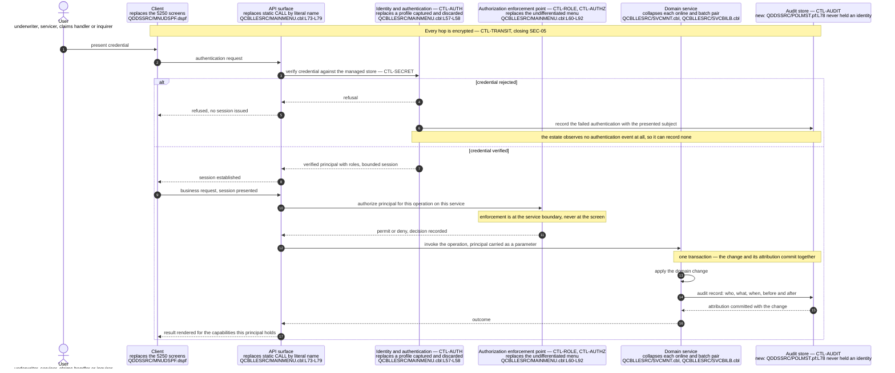

# Target Security Control Design

This document is the forward half of the first business driver this assessment answers: minimize security risk. [The security risk register](../risk/01-security-risk-register.md) establishes eight findings, `SEC-01` through `SEC-08`, and names the control that closes each. This document designs those controls — what each one is, where it sits in the target, which finding it closes, and what it leaves standing. The register's completeness bar is that no finding is left without a closing control; the matching bar here is the inverse, and it is checkable in the [control-to-finding traceability](#control-to-finding-traceability) table at the end: **every one of the eight findings is closed by exactly one named control, and no control appears that closes nothing.**

**Scope.** This document owns the control set, the derivation of the role model, and the traceability between the two. Every boundary around that is another document's subject, and each is drawn deliberately. It does **not** establish the findings, rate them or re-argue their evidence — that is [the security risk register](../risk/01-security-risk-register.md), and where this document needs a finding it references the identifier and cites the register rather than restating the impact analysis. It does not inventory personal and health data column by column, nor assert which regulatory frameworks apply, both of which belong to [the compliance and data protection document](../risk/02-compliance-and-data-protection.md). It does not analyse write atomicity, journaling, backup or recovery, which belong to [the continuity and recovery risk document](../risk/03-continuity-and-recovery-risk.md). It does not restate the platform support-lifecycle argument, which is established with attribution in [the platform and support status document](../current-state/03-platform-and-support-status.md). It does not set the target's layers or service boundaries, which are owned by [the target architecture](01-target-architecture.md), nor name the services and operations the controls are enforced across, which are owned by [the program-to-service map](02-program-to-service-map.md), nor type a single column, which is owned by [the target data model and schema mapping](03-target-data-model-and-schema-mapping.md). It does not choose user-interface components, which is deferred by [the UI modernization document](05-ui-modernization.md). And it does not sequence the work: no control below is placed before or after another in time, because staging is owned by [the recommended path](../migration/02-recommended-path.md).

**Two things this document explicitly does not do, stated up front because both are easy to assume.** First, **none of the eight findings is remediated here.** No source member, schema definition or build artifact is modified anywhere in this assessment; designing a control is not building one, and nothing below changes the running system in any respect. Second, **no pipeline, policy, configuration or infrastructure artifact is created by this documentation set.** The scanning control specified under `SEC-08` describes a gate; it does not add a workflow file, and there is none to find.

**Reading the citations.** A citation of the form `[<path>:<locator>]` is plain text rather than a hyperlink, and points at a path in this repository. Plain text is chosen so a citation stays meaningful in a diff and does not depend on a hosting provider's line-anchor syntax. The rule applied throughout is asymmetric and worth naming: **every claim about the existing system carries a citation, and no target control does.** A control is a proposal, and a proposal has nothing to cite; the "there is nothing like this today" clause beside it is a claim about the estate and always does. Every line range below was opened and read against the working tree while writing this document. Platform terminology links to [the IBM i glossary](../reference/glossary-ibm-i.md) on first use in this document.

**What could not be verified, stated once.** No control below was validated by building or running anything, and none could be: every COBOL program names the platform as its object computer as well as its source computer [QCBLLESRC/MAINMENU.cbl:L27-L28], no off-platform compiler for ILE COBOL or ILE CL exists, and the repository contains no test suite to run in place of one. The legacy claims each control is designed against therefore rest on citation resolution and human review, and a control design is in any case falsifiable by review rather than by execution.

## The target stack, consumed rather than re-derived

The language, runtime and datastore are settled by [the target-language decision matrix](../talent/02-target-language-decision-matrix.md) and recorded in the decision log. This document states the position and designs against it rather than reproducing the reasoning, so that superseding the choice means superseding one record instead of editing every document that depends on it.

- **The primary recommendation is Java on a current long-term-support release, with Spring Boot and PostgreSQL.** The runner-up is C#/.NET. TypeScript and Node, and Python, are evaluated and rejected for the core; Go is evaluated and not selected. The decisive criterion is exact decimal arithmetic, which is a data-typing property rather than a security one.
- **The target is hosting-agnostic, with a containerized reference deployment**, and **exit from the AS/400 hardware is deliberately deferred and decoupled from this work**.
- **No control below depends on any of that.** This is worth stating because a security design that only works on one stack is a weaker design. Every control specified here is expressed as a property the target must have — an authenticated principal, an enforcement point, an encrypted channel, an audit record written in the same unit of work as the change it describes — and each is satisfiable on the runner-up stack without amendment. What the stack choice affects is which libraries implement a control, and this document names none, for the same reason it names no route table: that is implementation, and this assessment plans modernization rather than performing it.

One consequence of the hosting-agnostic position bears directly on this document and is easy to lose. **Deferring the hardware exit does not defer any control here.** All nine controls below are application-level, they are all satisfiable while the AS/400 remains in place behind a coexistence boundary, and none of them requires the hardware decision to be taken first. The reverse is also true and is the honest limit of the set, recorded in full under [residual risk and what these controls cannot close](#residual-risk-and-what-these-controls-cannot-close): because they are all application-level, not one of them reaches the platform release beneath them.

## No regulatory framework is asserted as applicable

**This document names no regulatory framework, standard, article or control catalogue as applicable to LIFE400, and maps no control below to one.** The position is the resolution recorded as `A-03` in this assessment, consumed here rather than re-derived, and it binds this document more tightly than any other in the target-state layer — a control design is exactly where a framework name would slip in most naturally and be least noticed.

The reason is that the inputs which decide applicability are business facts that appear nowhere in this repository, and [the compliance and data protection document](../risk/02-compliance-and-data-protection.md) owns that determination in full. What follows for the design is a positive discipline rather than a silence:

- **Controls are specified against the gap they close, never against a clause they satisfy.** Each of the nine below is named for what it does — authenticate, authorize, encrypt, attribute, retain, scan — and its justification is a finding in the register, not an external requirement.
- **The control gaps are stated generically**, in the vocabulary this assessment uses throughout: access control, transport security, encryption at rest, auditability, and retention and erasure. Those five categories cover every finding and every gap handed to this document, and none of them is a framework's terminology.
- **Framework applicability must be confirmed by the business**, and when it is, this document is an input to that exercise rather than a substitute for it. A control set specified against gaps maps onto whatever framework turns out to apply; one specified against a guessed framework has to be redone if the guess is wrong.
- **The only verifiable compliance control present in the repository is the Y2K remediation**, recorded as a dated review marker inside the members themselves — in the menu program beside the display date it applies to [QCBLLESRC/MAINMENU.cbl:L54] and in the shared contract beside the audit date [QCPYSRC/POLDATA.cpy:L174]. It is named here only to set the baseline honestly: the estate carries evidence of exactly one compliance exercise, that exercise was a data-correctness exercise rather than a security one, and no control below builds on it.

## The control set at a glance

Nine controls close eight findings and four gaps. The count is deliberately not nine-for-eight: two findings share one control because they are two failures of the same missing capability, and two controls close gaps that [the compliance and data protection document](../risk/02-compliance-and-data-protection.md) raises rather than findings the register numbers.

| Control | Name | Closes | Gap class it answers |
| --- | --- | --- | --- |
| `CTL-AUTH` | Application-level authentication establishing a verified principal | `SEC-01` | absent — no credential construct exists |
| `CTL-ROLE` | A derived role model, with authorization enforced at the service boundary | `SEC-02` | absent — no role branch exists |
| `CTL-AUTHZ` | Declared, reviewable authorization on objects and data | `SEC-03` | undeclared — authority left to the installation |
| `CTL-REST` | Encryption at rest with field-level access control | `SEC-04` | absent — no encryption construct exists |
| `CTL-TRANSIT` | Encrypted transport terminating at an authenticated service boundary | `SEC-05` | undeclared — channel protection left to the network |
| `CTL-AUDIT` | Mandatory user-attributed audit records on every read and every mutation | `SEC-06` and `SEC-07`, and the read-side auditability gap | misapplied, then absent |
| `CTL-SECRET` | Managed storage for credentials and keys, referenced never embedded | supports `CTL-AUTH`, `CTL-REST`, `CTL-TRANSIT` and `CTL-SCAN` | absent — no secret store, because no secrets |
| `CTL-RETAIN` | Retention schedule, auditable erasure, and purpose-scoped field retention | the retention, erasure and minimization gaps | absent — no deletion path of any kind |
| `CTL-SCAN` | Dependency, static-analysis and secret scanning as a blocking gate | `SEC-08` | absent — no delivery gate exists |

Two rows of that table carry most of its information.

- **`CTL-AUDIT` closes two findings deliberately, and the traceability table says so explicitly rather than leaving a row blank.** `SEC-06` and `SEC-07` are different failures — a stamp that runs and records the wrong subject, and no stamp at all on the estate's dedicated amendment path — but they are failures of one absent capability: an identity that reaches the point of a write. Designing two controls for that would produce two implementations of one thing, which is the pattern this whole target-state layer exists to remove.
- **`CTL-SECRET` closes no finding on its own, and is in the set because four other controls cannot be built without it.** Authentication needs somewhere for a credential to live; encryption at rest and encrypted transport each need key material; scanning needs to know what a leaked secret looks like. A supporting control that four closures depend on is not a control that closes nothing — but the distinction is real, so it is recorded in its own row of the [control-to-finding traceability](#control-to-finding-traceability) rather than presented as a ninth closure.

## Design principles every control shares

Five properties are stated once here rather than repeated in nine sections. Each is a direct response to something measured in the estate rather than a general preference, and each is the reason a control below is specified the way it is.

- **A control is enforced at a boundary, not at a screen.** In LIFE400 the only place a check could be added is the interactive dispatch loop, and it is a compiled `EVALUATE` over a two-character selection [QCBLLESRC/MAINMENU.cbl:L60-L92] with four literal call targets [QCBLLESRC/MAINMENU.cbl:L73-L79]. A check placed there would protect the interactive path and nothing else: the three batch submitters are separately callable CL programs taking only record keys as parameters [QCLSRC/RUNNBUW.clle:L21], [QCLSRC/RUNSVC.clle:L21], [QCLSRC/RUNCLM.clle:L21], and the nightly driver takes no parameter at all [QCLSRC/DLYUPD.clle:L24], so none of the four passes through the menu. So every control below is enforced where the work is done, which is the property that makes a new entry point subject to the same check as an existing one.
- **A control that can be omitted will be.** The estate's own evidence for this is exact: five programs stamp an audit field and a sixth does not [QCBLLESRC/SVCMNT.cbl:L190], and nothing detected the omission. Controls below are therefore specified as non-optional properties of an operation rather than as steps a developer remembers, and the audit control in particular is bound to the write path rather than to a field somebody sets.
- **A control is declared in the artifact, not in the environment.** Object authority in the estate is specified nowhere: the library is created with no authority parameter [README.md:L125] and no object-creation command in the build sequence carries one [README.md:L120-L218]. A posture that lives only in an installation cannot be reviewed from version control, does not travel with a restore, and cannot be compared between two environments.
- **A control produces evidence.** Every control below either writes a record of its decisions or is checked by something that fails the build. This is the property the estate lacks most completely: no authentication event, no authorization decision, no read and no erasure is recorded anywhere, so nothing about the current posture can be demonstrated after the fact in either direction.
- **A control's scope is stated, including where it stops.** Each section below ends by naming what it does not cover. This is not modesty: the register classes five findings as absent because the estate delegated those controls to the platform, and a design that implied it had closed more than it had would repeat that mistake in the target.

## CTL-AUTH: application-level authentication

**Closes `SEC-01`.** The control is an authentication step the application performs and can refuse, establishing a principal that is verified rather than assumed, and carrying that principal through the call path so that every control after this one has an identity to act on.

**Why this is new capability and not a port.** The estate's identity handling is a single pair of statements: the menu reads the signed-on profile with `ACCEPT WS-USER-ID FROM USER` [QCBLLESRC/MAINMENU.cbl:L57] and moves it to a screen field on the very next statement [QCBLLESRC/MAINMENU.cbl:L58]. The field it lands in is output-only — it carries no usage letter in the [display file](../reference/glossary-ibm-i.md#display-file) [QDDSSRC/MNUDSPF.dspf:L45], unlike the selection field one screen row above it, which is declared `B` for input and output [QDDSSRC/MNUDSPF.dspf:L39]. The value is never stored and never passed onward, because none of the four dispatched programs takes a parameter [QCBLLESRC/MAINMENU.cbl:L73-L79]. **The profile the legacy menu captures is cosmetic: it is displayed back to the person who already knows it and then discarded.** Authentication itself happens entirely outside LIFE400, as the entry program's own installation banner documents — it is configured as a user's [initial program](../reference/glossary-ibm-i.md#initial-program) [QCLSRC/STRTLIFE.clle:L14-L16] — and there is no credential, password, session or token construct anywhere in the twenty-four members, by the search the register records. So there is no existing mechanism to strengthen, re-point or wrap. Identity in the target is construction.

The control has four parts, and each answers something the estate cannot do rather than something it does differently.

- **A verified principal, refusable at the boundary.** The target authenticates a presented credential and can fail, refuse and record the refusal. The estate cannot: it observes no authentication event, so it cannot detect a failure, cannot rate-limit one and cannot report one. Establishing a principal the application itself produced is what makes every control that depends on knowing who is acting possible at all, which is why the register records this finding first.
- **The principal is a first-class parameter of every operation, not a screen field.** It travels with the request from the boundary to the point of the write, and it is available to the authorization decision, to the audit record and to the read path. This is the single most consequential difference from the estate, where the one place that knows the user is the one place with no access to the data contract, because the menu opens no database file at all — its whole `FILE-CONTROL` section declares one workstation file and nothing else [QCBLLESRC/MAINMENU.cbl:L32-L36].
- **Session handling with an explicit lifetime.** A session in the target is a bounded, revocable, individually terminable thing. In the estate a session is the job the platform started, its boundaries are the entry program's own library-list push and pop [QCLSRC/STRTLIFE.clle:L27], [QCLSRC/STRTLIFE.clle:L40], and there is no session state the application owns — every occurrence of the word `SESSION` in the estate is comment or message prose in that one CL member [QCLSRC/STRTLIFE.clle:L9], [QCLSRC/STRTLIFE.clle:L12].
- **Credential storage that the application never holds in plain form.** Where the credential material lives, and how it is referenced rather than embedded, is `CTL-SECRET` below.

**A corroborating detail worth one sentence, because it shows how completely identity is absent.** The one message in the estate that reads like a session audit trail records the wrong subject: the entry program retrieves the *current library* into a variable [QCLSRC/STRTLIFE.clle:L24] and concatenates it into a message reading `LIFE400 SESSION STARTED BY` [QCLSRC/STRTLIFE.clle:L31]. The text promises a user and carries a library name. Even the estate's own attempt to record who started a session had no user identity available to it.

**Where this control stops.** It establishes and carries a principal; it decides nothing about what that principal may do, which is `CTL-ROLE` and `CTL-AUTHZ`. It specifies no authentication factor, protocol, provider or token format: those are implementation choices, and naming one here would fix a decision the finding does not require and that a later reader would rightly expect to see justified. Whether the platform sign-on continues to exist behind a coexistence boundary while both systems run is a migration question, owned by [the recommended path](../migration/02-recommended-path.md).

## CTL-ROLE: a derived role model

**Closes `SEC-02`.** The control is an explicit role model, with authorization enforced at the service boundary rather than at the screen. The model itself is the interesting half, because the estate supplies no role evidence at all: **there is no role model to migrate, so one has to be derived — and derivation is a business exercise, not a translation exercise.**

**What there is to derive from.** Searching the estate for `ROLE` and `PERMISSION` returns zero occurrences of each. The interactive dispatch is one inline loop from `PERFORM UNTIL WS-CONTINUE = 'N'` [QCBLLESRC/MAINMENU.cbl:L60] to `END-PERFORM` [QCBLLESRC/MAINMENU.cbl:L92], and nothing inside it consults the identity the program captured before entering it [QCBLLESRC/MAINMENU.cbl:L57]. The menu is fixed at compile time in two independent places — four literal `CALL` statements in the COBOL [QCBLLESRC/MAINMENU.cbl:L73-L79] and the option text itself as DDS constants [QDDSSRC/MNUDSPF.dspf:L30-L35] inside the [record format](../reference/glossary-ibm-i.md#record-format) `MAINSCR` [QDDSSRC/MNUDSPF.dspf:L19]. So the only signal of intended capability anywhere in the estate is **the option set the menu offers and the programs it offers them through.** That is the whole evidence base, and the derivation below uses nothing else.

### The derivation, capability boundary by capability boundary

Each candidate role is one capability the menu already draws a line around. The lines are the estate's own; the roles are this document's proposal.

| Candidate role | Menu option it is derived from | Programs it would reach | Target service that enforces it |
| --- | --- | --- | --- |
| New business | `1. New Business / Policy Issuance` [QDDSSRC/MNUDSPF.dspf:L30] | `NBUWMNT` [QCBLLESRC/MAINMENU.cbl:L73], and the batch path submitted separately | New business and underwriting service |
| Servicing | `2. Policy Servicing and Amendments` [QDDSSRC/MNUDSPF.dspf:L31] | `SVCMNT` [QCBLLESRC/MAINMENU.cbl:L75], and the batch billing path | Servicing, billing, grace and lapse service |
| Claims | `3. Claims Adjudication` [QDDSSRC/MNUDSPF.dspf:L32] | `CLMMNT` [QCBLLESRC/MAINMENU.cbl:L77], and the batch adjudication path | Claims intake and adjudication service |
| Read-only inquiry | `4. Policy Master Inquiry` [QDDSSRC/MNUDSPF.dspf:L33] | `POLMSTINQ` [QCBLLESRC/MAINMENU.cbl:L79] | Policy read model |
| Administration | `5. Reports Menu` [QDDSSRC/MNUDSPF.dspf:L34], which the program answers with a not-implemented message [QCBLLESRC/MAINMENU.cbl:L81] | none today | Query and read endpoints, plus scheduled work |

Two of those rows deserve their own note, because they are the only two where the estate says anything beyond the option text.

- **Read-only inquiry is the one boundary the code already respects.** `POLMSTINQ` is the only program in the estate that opens the policy master for input alone [QCBLLESRC/POLMSTINQ.cbl:L63]; every other program that declares that file opens it for update, the servicing program included [QCBLLESRC/SVCMNT.cbl:L79]. So a read-only capability is not merely a plausible role — it is a distinction the estate implements at the file-open level and then discards at the menu, which offers the inquiry option beside the three mutating options with nothing to distinguish who may take which. The read-only role is the least speculative row in the table. It is also the row where the target has to *add* a boundary the estate blurred in a second way: the inquiry program drives a display file it does not own, declaring the servicing program's screen as its own workstation file [QCBLLESRC/POLMSTINQ.cbl:L33], [QCBLLESRC/SVCMNT.cbl:L33] and switching it into inquiry mode by setting an [indicator](../reference/glossary-ibm-i.md#indicator) [QCBLLESRC/POLMSTINQ.cbl:L92]. The read path and a mutating path share one presentation surface today, distinguished by a single indicator byte.
- **The administrative role is derived from an option that does nothing.** Selecting the reports option produces a not-implemented message and nothing else [QCBLLESRC/MAINMENU.cbl:L81]. It is included because the target must decide what happens to that option, and because reporting and scheduled work are the two capabilities that plainly need a separate authority from transacting. Deriving a role from an unimplemented feature is the weakest inference in this table, and it is labelled as such rather than presented alongside the other four as equivalent.

Two more properties of the model follow from the estate rather than from convention, and both are recorded because they are decisions a business confirmation has to actually make:

- **Nothing in the estate separates a mutating capability from an approving one.** The single undifferentiated menu means one signed-on user can issue a policy, amend an in-force one and adjudicate a death claim. Whether the target should split any of those into maker and checker roles is precisely the kind of question the derivation cannot answer, because the estate never encoded an answer.
- **The batch paths have no menu entry to derive from at all.** The three submitters and the nightly driver are reached outside the interactive dispatch entirely, so no option text describes who may run them. The target's scheduled-work service therefore needs an authority that is derived from nothing in the estate — it is specified, not derived.

### Why this derivation is a proposal requiring business confirmation

**The five roles above are a proposal, not a discovered fact, and nothing downstream should treat them as an inventory read out of the source.** Three reasons, and the third is the one that matters most:

- **The evidence base is menu text.** A line of DDS constant text describing a menu option [QDDSSRC/MNUDSPF.dspf:L30-L35] is a statement about navigation, not about authority. It says a capability exists; it says nothing about who should have it.
- **No user population is described anywhere.** The repository contains no user profile, no group, no authorization list and no organizational statement of any kind, so there is nothing against which to test whether these five boundaries match how the business actually divides the work.
- **The absence of role branching is not evidence that roles are unnecessary.** It is evidence that the question was never asked. Those two readings look identical in the source and are opposite in consequence, and keeping them apart is what stops the derived model from hardening into a false finding. If the business confirms fewer roles, the model shrinks; if it confirms maker-and-checker separation, the model grows. Both outcomes are consistent with everything the estate establishes, which is exactly why this is a confirm-with-the-business item.

**Where this control stops.** It supplies a role model and requires enforcement at the service boundary; it does not decide role membership, does not specify a role-assignment mechanism, and does not enumerate operations, which are owned by [the program-to-service map](02-program-to-service-map.md). The screen-level consequence — that a target interface renders only the capabilities a principal holds, which a menu compiled into DDS constants cannot do [QDDSSRC/MNUDSPF.dspf:L30-L35] — belongs to [the UI modernization document](05-ui-modernization.md). This document's requirement is narrower and stronger: **the screen is not the enforcement point, so a client that renders the wrong option must still be refused by the service.**

## CTL-AUTHZ: declared, reviewable authorization on objects and data

**Closes `SEC-03`.** The control is authorization that is declared in the deployed artifact and reviewable from version control, replacing an object-level posture that the estate leaves entirely to the installation.

**What it replaces.** The estate declares no authority for anything it creates: the library is created with no authority parameter [README.md:L125], and no object-creation command in the eight-step build sequence specifies one [README.md:L120-L218] — not on the data files [README.md:L140-L143] and not on the work-management objects [README.md:L199-L206]. There is no authority-granting command anywhere in the tree, and no program is created with an owner-profile attribute, so the control a reader familiar with the platform would expect to find here — [adopted authority](../reference/glossary-ibm-i.md#adopted-authority) — is absent as well. The register classes this **undeclared** rather than absent for a precise reason this control has to respect: the posture is real, but it is a property of the environment rather than of the system as delivered, so it cannot be read out of this repository in either direction.

That distinction determines the shape of the control rather than merely qualifying it.

- **Authorization becomes a declared artifact rather than an installation property.** The answer to "who can read the insured names in the policy master" becomes a reviewable statement in version control. Today it is a question for whoever administers the machine, and it can be answered differently on two machines running identical code.
- **Enforcement is at the service and operation boundary.** A principal is authorized for an operation on a service — issue a policy, apply an amendment, adjudicate a claim, read a policy — rather than for a file. This is what makes `CTL-ROLE` enforceable, because the estate's own protection unit is the object, and an object grant cannot distinguish "may read a policy" from "may amend it" once a program has the file open for update.
- **Record-scope authorization is a stated design question, not a silent omission.** Nothing in the estate scopes access to a subset of records: the policy master is keyed and read by key [QDDSSRC/POLMST.pf:L81], and any program that opens it can reach every record in it. Whether the target restricts a principal to a branch, a book of business or a claim assignment cannot be derived from the source, so it is raised here as a decision the business takes rather than answered.
- **The posture travels with the deployment.** A declared authorization model is present in a restored environment and in a non-production copy. An undeclared one is not, which is why this finding blocks the parallel run: a non-production copy of these objects would inherit the same unstated posture, with no declared baseline to compare against.

**A dependency worth naming, because it is not a security control and still blocks this one.** Standing up any environment other than production requires editing source today, since the library name is a literal in the call itself [QCLSRC/STRTLIFE.clle:L37] and in every file override, and the [library list](../reference/glossary-ibm-i.md#library-list) is manipulated per session rather than declared [QCLSRC/STRTLIFE.clle:L27]. Configuration externalization is owned by [the target architecture](01-target-architecture.md); it is named here because verifying an authorization model needs somewhere to verify it that is not production.

**Where this control stops.** It specifies that authorization is declared, enforced at the operation boundary and reviewable; it names no authorization technology, no policy language and no directory. It also asserts nothing about the estate's *effective* authority today: the register establishes that authority is unspecified, not what the resulting access is, and this document does not improve on that — inventing a value would be a fabricated measurement, and what the installation default grants remains a confirm-with-the-business item.

## CTL-REST: encryption at rest with field-level access control

**Closes `SEC-04`.** The control is protection of stored personal and health data by a named mechanism, combined with field-level access control so that reaching a table is not the same as reading its most sensitive columns.

**What it replaces.** Nothing: no encryption construct exists anywhere in the estate, by the search the register records, and there is no key management because there are no keys. The data sits in ordinary character and [zoned decimal](../reference/glossary-ibm-i.md#zoned-decimal) columns of a [physical file](../reference/glossary-ibm-i.md#physical-file), reachable by any process that can open the file. [The compliance and data protection document](../risk/02-compliance-and-data-protection.md) owns the full column-level inventory and this document does not reproduce it; the columns named below are the ones the design needs in order to be specific about what is protected and how.

The classification matters as much as the mechanism, and getting it right is part of the control rather than a preliminary to it.

| Column | Declaration | Anchor | Classification |
| --- | --- | --- | --- |
| Insured name | `INSNAME 40A` | [QDDSSRC/POLMST.pf:L32] | Personal data |
| Insured date of birth | `INSDOB 8S 0` | [QDDSSRC/POLMST.pf:L35] | Personal data |
| Beneficiary name | `BENNAME 40A` | [QDDSSRC/CLMPF.pf:L38] | Personal data — a third party, not the insured |
| Beneficiary relationship | `BENREL 20A` | [QDDSSRC/CLMPF.pf:L40] | Personal data — a family-relationship attribute |
| Cause of death | `CAUSDTH 3A` | [QDDSSRC/CLMPF.pf:L23] | Health-related data |
| Date of death | `DTHDTC 8S 0` | [QDDSSRC/CLMPF.pf:L26] | Health-related data |
| Medical-records-received flag | `MEDRECS 1A` | [QDDSSRC/CLMPF.pf:L35] | Health-related data — it discloses that a medical file on this insured exists |

**Beneficiary name and relationship are personal data, not health data**, and the distinction is not pedantry: a control designed around health data alone would leave both columns unprotected, and they describe a person who never interacted with the system at all and never consented through it. Conversely the medical-records flag is health-related even though it holds one character, because what it discloses is the existence of a medical file rather than its contents.

The control has four parts.

- **Storage-level encryption as the floor, applied to everything.** It protects the whole store against loss of the underlying media or a copy taken outside the application, it requires no per-column decision, and it is the part of this control least likely to be got wrong. It is a floor rather than a ceiling because it is transparent to anything that reaches the store through the application: a principal who can query can read.
- **Column-level protection for the seven columns above, as the part storage-level encryption cannot supply.** This is the mechanism that makes "reaching a table is not the same as reading its most sensitive attributes" true. It is specified for those seven columns rather than for the whole table because uniform protection is indistinguishable from no protection in the case that matters — an over-broad principal inside the application.
- **Field-level access control bound to `CTL-ROLE`.** Protection has to be *variable* between an insured's name and their cause of death, which the estate cannot do at all because it has one protection unit and it is the object. A read-only inquiry principal reading a policy needs the insured's name; it does not follow that the same principal needs the coded cause of death on a settled claim.
- **Key management as an explicit, separate concern**, with keys held outside the data they protect and outside the built artifact — `CTL-SECRET` below. Encryption whose key travels with the data protects against almost nothing, and the estate offers no precedent to reason from, having neither keys nor anything that manages them.

**One migration-specific requirement belongs to this control, because no other document owns it and it would otherwise be lost.** The policy master's audit column must be treated as personal data on the way in, not as an identifier. [The security risk register](../risk/01-security-risk-register.md) establishes, on the byte-offset analysis owned by the current data model, that no audit stamp ever reaches that column and that what occupies it is insured-name text, so the column whose own text promises a user identifier [QDDSSRC/POLMST.pf:L78] in fact holds personal data. [The target data model and schema mapping](03-target-data-model-and-schema-mapping.md) carries it forward as `legacy_last_action_text`, deliberately as provenance rather than as attribution. **This control requires that it be protected as personal data in the target, which is exactly the classification no data-protection design would reach by reading the column's name.**

**Where this control stops.** It names no cipher, no key length, no key-management product and no database feature. It does not cover retention or erasure, which are `CTL-RETAIN`. It does not protect data in transit, which is `CTL-TRANSIT`. And it asserts nothing about what an installation may have arranged around these files today, because the repository holds nothing from which either the reassuring or the alarming reading could be supported.

## CTL-TRANSIT: encrypted transport terminating at an authenticated boundary

**Closes `SEC-05`.** The control is encrypted transport on every hop, terminating at the boundary that `CTL-AUTH` authenticates, so that channel protection becomes a declared property of the deployed system rather than an unstated property of the network it happens to sit on.

**What it replaces.** The estate has exactly one interface and declares no protection for it. A program reaches the terminal by declaring its screen as a workstation device with transaction organization — `SELECT MNUDSPF ASSIGN TO WORKSTATION-MNUDSPF ORGANIZATION IS TRANSACTION` [QCBLLESRC/MAINMENU.cbl:L32-L36] — and the screen is defined declaratively in DDS on a fixed twenty-four row by eighty column grid [QDDSSRC/MNUDSPF.dspf:L12], which is the geometry of the [5250 datastream](../reference/glossary-ibm-i.md#5250-datastream). There is no HTTP, no socket and no message broker anywhere in the estate, and no `TLS`, `SSL` or cipher construct in any of the twenty-four members. The application contributes nothing to protecting the channel and has no notion of a content type or a session token available to it.

The register classes this finding **undeclared** rather than absent, and the control has to respect that classification honestly: what an installation arranges around the datastream cannot be read from this repository in either direction, so the control is specified as what the target *declares* rather than as an improvement on a measured baseline.

- **Every hop is encrypted, and the set of hops is enumerated rather than assumed.** Client to the API surface; API surface to each service; service to its datastore; and service to the audit store. The datastore hop is named explicitly because it is the one most often left in clear on the argument that it is internal, and it is the hop that carries every column in the `CTL-REST` table.
- **Transport terminates where a principal is established.** An encrypted channel that ends short of the authentication boundary protects the wire and leaves the boundary unauthenticated, which would satisfy the letter of this finding and leave `SEC-01` open. The two controls are specified as one termination point for that reason.
- **The protection is a property of the artifact, not of the deployment.** The estate's channel protection, if any, lives entirely outside the delivered system: it is invisible to review, cannot be asserted from anything in version control, and can be removed by an environment change that touches no application code. The target's requirement is that the system refuses an unprotected channel rather than merely tolerating a protected one.
- **The legacy channel stays outside this control's reach for as long as it exists.** While the 5250 path is still serving users alongside a replacement, it remains the estate's only interface and still declares no protection of its own, because nothing in this design can be applied to it without changing the estate. That is a coexistence constraint rather than a closure, and the coexistence itself is owned by [the recommended path](../migration/02-recommended-path.md).

**Where this control stops.** It names no protocol version, no cipher suite and no certificate authority. It says nothing about what any installation has configured around the terminal channel today. And it does not extend to the presentation technology that replaces the character interface, which is owned by [the UI modernization document](05-ui-modernization.md).

## CTL-AUDIT: mandatory user-attributed audit records

**Closes `SEC-06` and `SEC-07`, and the read-side auditability gap.** This is the one control that closes two numbered findings, and the [control-to-finding traceability](#control-to-finding-traceability) table records the sharing explicitly rather than leaving a row to be inferred. The two findings are different failures of a single absent capability — an authenticated identity that reaches the point of an access — so they are closed once. Building two audit mechanisms for them would reproduce, in the target, exactly the duplication this layer exists to remove.

**The distinction between the two findings is worth a sentence, because it inverts the intuition about which is worse.** `SEC-06` is a **misapplied** control: five programs stamp an audit field and each writes its own program name rather than an identity [QCBLLESRC/NBUWMNT.cbl:L497], [QCBLLESRC/NBUWB.cbl:L138], [QCBLLESRC/SVCBILB.cbl:L140], [QCBLLESRC/CLMADJB.cbl:L136], [QCBLLESRC/CLMMNT.cbl:L281], each followed on the next statement by a move of the batch process date rather than an event time [QCBLLESRC/NBUWMNT.cbl:L498]. `SEC-07` is an **absent** one: on the sixth mutating path no stamp exists at all — the interactive servicing program rewrites the policy master [QCBLLESRC/SVCMNT.cbl:L190] and writes its servicing record [QCBLLESRC/SVCMNT.cbl:L191] while setting no audit value anywhere. **A weak stamp is a weak audit trail; a missing stamp on a mutating path is an actively misleading one**, because the column still holds a plausible previous value and a reader has no signal that this particular change went unrecorded. Detection is harder, not easier, and that is the argument for binding attribution to the write path rather than to a field somebody remembers to set.

### What an audit record carries

Four elements, replacing a program-name literal and a date. Each element is specified because the estate's version of it is absent or wrong.

| Element | What the target records | What the estate records |
| --- | --- | --- |
| Who | The authenticated principal established by `CTL-AUTH`, carried through the call path | A program-name literal, in five places [QCBLLESRC/NBUWB.cbl:L138] |
| What | The operation, the entity and its key | Nothing — the contract has no action item; the audit group holds a name and a date only [QCPYSRC/POLDATA.cpy:L172] |
| When | The instant of the event | The batch process date the run is working under [QCPYSRC/POLDATA.cpy:L175] |
| Before and after | The prior and resulting values of every changed field | Nothing — the current row is the only record of state, so a rewrite destroys its predecessor [QCBLLESRC/SVCMNT.cbl:L190] |

The before-and-after element is the one with a second consumer, and naming it matters because it prevents the audit record being designed too thin. [The continuity and recovery risk document](../risk/03-continuity-and-recovery-risk.md) requires a durable change history independent of the current row, and it is the same artifact: **one record serves as the audit trail, the recovery source and the reconciliation source.** Designing it as attribution alone would satisfy this control and leave that requirement open.

### The two columns the legacy design defined and never used properly

The estate provides two destinations for an identity, and neither has a working writer. The target has to fill both, and each needs a different treatment.

- **The policy master's last-user column goes stale, and worse.** `LSTUSR 10A TEXT('LAST ACTION USER')` [QDDSSRC/POLMST.pf:L78] is the intended destination of the five stamps, and the shared contract's matching item is the same declared length and type [QCPYSRC/POLDATA.cpy:L173] — which is precisely why the mismatch reads as harmless. On the servicing path nothing is written to it at all, so it retains the previous writer's value across an amendment. On the byte-offset analysis the register carries, no stamp ever reached it on any path, and what occupies it is insured-name text. In the target it is carried as `legacy_last_action_text`, as provenance and explicitly **not** as attribution, because migrating it as a user identity would import a false attribution into a system designed to have a true one.
- **The servicing file's requesting-user column is never populated, and the reason is structural.** `USERID 10A TEXT('REQUESTING USER ID')` [QDDSSRC/SVCPF.pf:L51] is declared for exactly this purpose, in a record format keyed on the service-request identifier [QDDSSRC/SVCPF.pf:L54]. The program that writes the file describes its record as one flat area, `01 SVCPF-RECORD PIC X(200)` [QCBLLESRC/SVCMNT.cbl:L58], and writes that area whole [QCBLLESRC/SVCMNT.cbl:L191]. Because [record-level I/O](../reference/glossary-ibm-i.md#record-level-io) transfers the described area positionally, a program that describes the record as a single field has no name by which to address any column of it: **the column is not merely unset, it is unreachable from the code that writes the file.** In the target it becomes `requested_by`, required rather than optional, and the legacy ten-character width is not carried forward. The target column names and types are owned by [the target data model and schema mapping](03-target-data-model-and-schema-mapping.md).

**That second case is the strongest argument in this document for the design principle it illustrates.** The estate defined a control — an identity on every service request — and then lost it to an implementation shortcut taken in a different member. Nothing detected the loss, because nothing was checking; the column simply stayed empty for the life of the system. A target that defines an attribution column and relies on each write path to populate it would fail the same way. **So attribution is bound to the write path itself: an operation that does not produce an audit record does not complete.**

### The same-transaction requirement

**An audit record is written in the same unit of work as the change it describes.** This is a hard requirement rather than a preference, because the alternative — a change that commits and an audit record that does not — produces exactly the misleading state that makes `SEC-07` worse than `SEC-06`.

The legacy design cannot express this at all. There are **zero `COMMIT` and zero `ROLLBACK` statements across all eight COBOL members**, so there is no unit of work to enclose anything in, and the two mutating pairs write non-atomically: the servicing program rewrites the master and then writes the servicing record as two independent statements [QCBLLESRC/SVCMNT.cbl:L190-L191], and the claims program does the same [QCBLLESRC/CLMMNT.cbl:L178-L179]. Either write can succeed while the other fails, with no boundary to roll back to. [The continuity and recovery risk document](../risk/03-continuity-and-recovery-risk.md) owns that atomicity finding and its evidence; this control consumes it and adds one requirement on top: **the audit record joins the same transaction as the business change, so that a committed change without its attribution is not a state the system can reach.**

### Reads as well as writes

An audit design scoped to mutations would close `SEC-06` and `SEC-07` and leave a third gap entirely open, so the read half is stated explicitly. [The compliance and data protection document](../risk/02-compliance-and-data-protection.md) establishes that **the estate contains no read-audit mechanism at all**, and the inquiry program demonstrates it end to end: it opens the policy master for input only [QCBLLESRC/POLMSTINQ.cbl:L63], reads a record by key [QCBLLESRC/POLMSTINQ.cbl:L102] with both outcome branches of that read written as `CONTINUE` [QCBLLESRC/POLMSTINQ.cbl:L103-L106], and renders the insured's name to the screen in clear [QCBLLESRC/POLMSTINQ.cbl:L118]. Nothing is recorded about either a successful or an unsuccessful lookup, and the program could not record anything even if asked, because it opened the file for reading.

So a user can retrieve one insured's name, age, sum assured, premium and dates after another and leave nothing behind — and because every signed-on user reaches every function [QCBLLESRC/MAINMENU.cbl:L60-L92], there is no population for whom that path is out of bounds and no record of which of them used it. This control therefore covers **reads of the columns classified under `CTL-REST` as well as every mutation.** The asymmetry that makes the read half worth designing rather than deferring is that the absence of a read log removes the ability to exonerate as well as the ability to detect: an assertion that a column was *not* accessed is as unsupportable today as an assertion that it was.

**Where this control stops.** It specifies what an audit record carries, that it is mandatory, that it is bound to the write path and that it joins the change's transaction. It does not specify a store, a schema, a retention period for audit records — that is `CTL-RETAIN` — or a monitoring and alerting design over them, which is the observability contract owned by [the target architecture](01-target-architecture.md). It also recovers no history: **no attribution exists in the estate to migrate**, so the target's audit trail necessarily begins empty, and that is stated here so no downstream document treats attribution as convertible data.

## CTL-SECRET: managed storage for credentials and keys

**Supports `CTL-AUTH`, `CTL-REST`, `CTL-TRANSIT` and `CTL-SCAN`.** This control closes no finding by itself, which is why it is recorded as a supporting control in the [control-to-finding traceability](#control-to-finding-traceability) rather than presented as a ninth closure. It is in the set because four closures are unbuildable without it: authentication needs somewhere for credential material to live, encryption at rest and encrypted transport each need key material, and scanning needs a definition of what a leaked secret looks like.

**The corresponding legacy observation is unusual and worth stating precisely: the estate has no secret store because it has no secrets.** No credential, password, key or token construct exists anywhere in the twenty-four members. What the estate has instead is configuration compiled into source — the application library is a literal in the call itself [QCLSRC/STRTLIFE.clle:L37], and in every file override the nightly driver issues. So there is no leaked-secret problem to remediate in the legacy code and no vault to migrate. **The exposure this control addresses is created by the target rather than inherited from the estate**, because a system with authenticated principals, encrypted columns and encrypted channels has key material that LIFE400 never had, and that is an honest reason to specify the control as part of the design rather than to leave it as an afterthought.

- **Secrets are referenced, never embedded.** No credential, key or connection secret appears in source, in a built artifact, in a container image or in a configuration file. [The target architecture](01-target-architecture.md) externalizes environment-specific values and states explicitly that externalization does **not** mean secrets in configuration files; this control is where that exclusion is discharged.
- **A secret is resolved at run time from a managed store, by reference.** What the artifact carries is the reference; what the store holds is the value. This is the property that lets the same artifact run in two environments — the requirement the estate cannot meet at all, since standing up a second environment means editing the library literal in every CL member that names the first and recompiling them.
- **Rotation is possible without a rebuild.** Rotating a value must not require recompiling anything, which is precisely what the estate's model would require for any value it holds, all of which are compile-time literals.
- **Nothing is logged that a secret could be reconstructed from**, which includes the audit records `CTL-AUDIT` requires. An audit trail that records who did what is a new place for a credential to leak into if the record is designed carelessly.

**Where this control stops.** It names no secret-management product, no key hierarchy and no configuration format. It creates no configuration file of any kind — the assessment adds none — and it specifies nothing about the legacy system, which has no secret to protect.

## CTL-RETAIN: retention schedule, auditable erasure and purpose-scoped field retention

**Closes the retention, erasure and minimization gaps** raised by [the compliance and data protection document](../risk/02-compliance-and-data-protection.md). Those three gaps are not among the register's eight numbered findings, and the control appears here because that document designates this one as the place their closure is designed.

**What it replaces is two absences that compound.** A census of all eight ILE COBOL members finds **zero deletion operations**, and the wider search across all twenty-four members for purge, archive, anonymization, pseudonymization and retention constructs returns zero occurrences of each — the only file-changing verbs any member issues are write and rewrite, of which the servicing pair is the clearest instance [QCBLLESRC/SVCMNT.cbl:L190-L191]. Separately, no file-creation command in the documented build specifies a size [README.md:L140-L143]. **Retention in LIFE400 is therefore indefinite by omission rather than by policy**, and the data doing the accumulating is the personal and health-related content inventoried by that document, including a coded cause of death for every insured who has died [QDDSSRC/CLMPF.pf:L23] and a name for every beneficiary ever paid [QDDSSRC/CLMPF.pf:L38].

The control has three parts, matching the three gaps, and they are specified separately because closing any one of them alone leaves the others intact.

- **A retention schedule with an implemented purge and archive path, applied per table and per data category.** The schedule is a stated position with a mechanism behind it, which is the difference between a retention policy and a retention document. The mechanism operates over the target structures owned by [the target data model and schema mapping](03-target-data-model-and-schema-mapping.md), and the estate offers no precedent for it: there is no deletion path to extend and no capacity ceiling to force the question.
- **An auditable erasure operation that leaves both a consistent data set and a record that the erasure occurred.** Consistency is a real requirement rather than a formality, because policy, servicing and claim records reference each other by identifier and the estate declares no referential integrity between them: each of the three files declares a key and nothing else [QDDSSRC/POLMST.pf:L81], [QDDSSRC/SVCPF.pf:L54], [QDDSSRC/CLMPF.pf:L67], and no DDS data member carries a referential or uniqueness construct of any kind. The keys and foreign keys the target adds are owned by [the target data model and schema mapping](03-target-data-model-and-schema-mapping.md). The record-of-erasure half is where this control meets `CTL-AUDIT`: **an erasure is itself an auditable event, and it is the one event whose audit record must outlive the data it refers to.**
- **Purpose-scoped field retention, with a justification recorded per sensitive column and a boundary between decision-time and administration-time data.** The estate draws no such boundary and its schema offers nowhere to draw one: the underwriting-derived attributes — smoker status [QDDSSRC/POLMST.pf:L41], occupation class [QDDSSRC/POLMST.pf:L43], underwriting class [QDDSSRC/POLMST.pf:L45], high-risk avocation [QDDSSRC/POLMST.pf:L47] and the flat extra rate [QDDSSRC/POLMST.pf:L49] — all sit in the same record format as the plan code and the premium [QDDSSRC/POLMST.pf:L14], captured to reach an issue decision and then carried for as long as the record exists. A minimization control has to *introduce* that boundary, not enforce an existing one.

**One consequence has to be designed in from the start rather than retrofitted.** Rider detail is the one category of data this estate does not persist — the shared contract declares a five-occurrence rider table [QCPYSRC/POLDATA.cpy:L88-L96] and no DDS member declares any rider column — but that non-persistence is an accident of a gap between contract and schema, not a minimization control, and the target gives riders first-class persistence. **The volume of retained personal data therefore increases in the target**, so this control has to cover the rider structures from the outset. The rider analysis and the decision that gives riders persistence are both owned elsewhere in this set; what belongs here is only the retention consequence of that decision.

**Where this control stops.** It specifies no retention period, because a period is a business and jurisdictional determination and no framework is asserted as applicable by this assessment. It specifies no data-definition language, no purge script and no archive format — those are implementation artifacts this assessment does not produce. And it makes no claim about what any installation has arranged around these files today: the delivered system contributes nothing to retention control, and whether a platform-level housekeeping regime exists around it cannot be read from this repository in either direction.

## CTL-SCAN: dependency, static-analysis and secret scanning as a blocking gate

**Closes `SEC-08`.** The control is automated scanning wired into the target's delivery path as a gate that **fails** the path to production rather than reporting after the fact. It is the control that keeps the other eight closed: without it, every closure above is a point-in-time property rather than a durable one.

**What it replaces.** Nothing whatever. There is no continuous-integration configuration of any kind in this repository and no pipeline directory of any flavour, so no dependency, secret or static-analysis scan runs anywhere. What stands in place of a pipeline is an eight-step operator sequence documented for a real platform [README.md:L120-L218], every step of which is a command a person issues, and none of which is a test, a scan or a review gate. Nothing in that sequence can fail a change on quality grounds.

- **Dependency scanning**, on every build, failing on a finding above an agreed threshold. **The honest corollary belongs here rather than in a footnote: the estate declares no third-party package at all** — there is no dependency manifest anywhere in it — so this half of the control is about the **target's** supply chain rather than the legacy one. A target on a mainstream runtime with a framework and a database driver acquires a transitive dependency graph that LIFE400 never had, and that is a new exposure introduced by the modernization, not an inherited one. Saying so is the difference between a control that is justified and one that is merely conventional.
- **Static analysis**, gating on the classes of defect the register's findings belong to: missing authorization on an operation, an unattributed write, a plain-text credential, an unencrypted channel.
- **Secret scanning**, on the artifact and its history, which is where `CTL-SECRET` becomes enforceable rather than aspirational.
- **A characterization-suite gate alongside the security gate.** The estate has no test suite, so the same delivery path that gains a security gate is the one that gains a behavioural one. The suite itself is owned by the migration layer and is named here only because both gates sit at the same point.

**What this section does not create, stated plainly.** **No pipeline configuration is created by this documentation set.** No workflow file, no job definition, no container definition and no infrastructure-as-code artifact is added by this assessment, and the absence of a `.github` directory in this repository after this work is the expected state rather than an oversight. This section specifies a control; building it is work this document plans and does not perform.

**Where this control stops.** It names no scanner, no threshold and no pipeline technology, and it asserts nothing about the estate beyond the absence recorded by the register. It also cannot gate what it cannot see: the legacy build remains a manual platform-side sequence for as long as the legacy system runs, and no gate designed here applies to it.

## D-12: target authentication and authorization flow

The diagram is D-12 in this assessment's diagram register, and it is the only diagram this document owns. The gap map that pairs each finding with its control is D-08 and belongs to [the security risk register](../risk/01-security-risk-register.md); it is not redrawn here.

It shows **authentication and authorization together rather than sign-in alone**, because the two are separate controls that fail separately: an authenticated principal with no enforcement point closes `SEC-01` and leaves `SEC-02` open, and an enforcement point with no principal to test cannot be built at all. Every participant standing for something that exists today names the member path it replaces, so the diagram carries its own traceability. The last message in the flow is the audit write carrying the principal's identity: **that message is the visual closure of `SEC-06` and `SEC-07`**, and it is inside the same transaction boundary as the domain write, which is the requirement the legacy design cannot express because it has no unit of work at all.

Four conventions in the diagram are deliberate, and each is a design claim rather than a drawing choice.

- **The refusal branch is drawn, and it writes an audit record of its own.** A rejected credential is an event the target records; the estate cannot record one because it never observes an authentication attempt. Drawing only the success path would hide the half of `CTL-AUTH` that produces evidence.
- **Authorization is a separate participant from authentication**, consulted per request rather than once per session. That separation is what makes a role model enforceable against a request the client should never have been able to send.
- **The audit write is inside the transaction note with the domain change**, not after it. This is the same-transaction requirement drawn rather than asserted, and it is the one element of the flow the legacy design provably cannot reach, having zero `COMMIT` and zero `ROLLBACK` statements anywhere.
- **The principal is drawn as a parameter of the service call.** In the estate none of the four dispatched programs takes a parameter [QCBLLESRC/MAINMENU.cbl:L73-L79], which is the structural reason a called program cannot be told on whose behalf it was invoked.

## Control-to-finding traceability

Every finding in [the security risk register](../risk/01-security-risk-register.md) resolves here, and this table is the completeness proof stated at the top of this document: **eight findings, eight closures, no blank cell.** `SEC-06` and `SEC-07` share one control, and the sharing is written into both rows rather than left as an inference or an empty cell.

| Finding | Finding summary | Closing control | Where the control is specified | Residual risk after the control |
| --- | --- | --- | --- | --- |
| `SEC-01` | No in-application authentication; identity is assumed, captured once for display and discarded | `CTL-AUTH` — application-level authentication establishing a verified principal | [CTL-AUTH](#ctl-auth-application-level-authentication) | Strength of the chosen factor and provider is an implementation decision this document does not make; the legacy sign-on remains in force on the 5250 path for as long as that path runs |
| `SEC-02` | No role-based access control; every signed-on user reaches the identical option set, fixed at compile time in two places | `CTL-ROLE` — a derived role model with authorization enforced at the service boundary | [CTL-ROLE](#ctl-role-a-derived-role-model) | **The role model is a derivation, not a discovered fact.** If the business confirms different boundaries, the model changes; until it is confirmed, this is the least settled control in the set |
| `SEC-03` | Object authority left at the platform default; no object-creation command in the build specifies an authority parameter | `CTL-AUTHZ` — declared, reviewable authorization on objects and data | [CTL-AUTHZ](#ctl-authz-declared-reviewable-authorization-on-objects-and-data) | Record-scope authorization cannot be derived from the estate and is raised as a business decision rather than answered; the legacy objects keep their undeclared posture until retired |
| `SEC-04` | Personal and health data stored in clear columns, with no encryption construct anywhere to protect it | `CTL-REST` — encryption at rest with field-level access control | [CTL-REST](#ctl-rest-encryption-at-rest-with-field-level-access-control) | Protects the target store only. Data already at rest in the legacy files is unprotected until migrated, and the audit column must be carried as personal data rather than as an identifier |
| `SEC-05` | No transport security declared for the estate's only interface | `CTL-TRANSIT` — encrypted transport terminating at an authenticated service boundary | [CTL-TRANSIT](#ctl-transit-encrypted-transport-terminating-at-an-authenticated-boundary) | The 5250 channel is unchanged while it exists, and whatever an installation has arranged around it stays outside review; the control declares protection for the target's hops only |
| `SEC-06` | Attribution names a program rather than a person, timestamped with a batch process date, and reaching a column that holds insured-name text instead | `CTL-AUDIT` — mandatory user-attributed audit records; **one control closes this finding and `SEC-07` together** | [CTL-AUDIT](#ctl-audit-mandatory-user-attributed-audit-records) | No history is recovered: no attribution was ever stored, so the target's trail begins empty and the legacy column is carried as provenance only |
| `SEC-07` | The interactive servicing path attributes nothing at all, and the servicing file's requesting-user column is unreachable from the code that writes it | `CTL-AUDIT` — the same control, extended by the requirement that an operation which produces no audit record does not complete | [CTL-AUDIT](#ctl-audit-mandatory-user-attributed-audit-records), specifically [the two columns the legacy design defined and never used properly](#the-two-columns-the-legacy-design-defined-and-never-used-properly) | The servicing request is new construction rather than a data conversion, because no column of that file has ever had a value moved into it |
| `SEC-08` | No security gate on the path to production; no continuous-integration configuration of any kind exists | `CTL-SCAN` — dependency, static-analysis and secret scanning as a blocking gate | [CTL-SCAN](#ctl-scan-dependency-static-analysis-and-secret-scanning-as-a-blocking-gate) | Gates the target's delivery path only. The legacy build stays a manual operator sequence while it runs, and **no pipeline configuration is created by this documentation set** |

Two supporting controls complete the set. Neither closes a numbered finding, and both are recorded here so that the table above stays a strict one-closure-per-finding proof while the set stays complete.

| Supporting control | What it closes or serves | Where it is specified |
| --- | --- | --- |
| `CTL-SECRET` | Closes no finding. Serves `CTL-AUTH` (credential storage), `CTL-REST` and `CTL-TRANSIT` (key material) and `CTL-SCAN` (secret detection). The exposure it addresses is created by the target, since the estate declares no secret at all | [CTL-SECRET](#ctl-secret-managed-storage-for-credentials-and-keys) |
| `CTL-RETAIN` | Closes the retention, erasure and minimization gaps raised by [the compliance and data protection document](../risk/02-compliance-and-data-protection.md), which designates this document as the place their closure is designed. Those gaps are outside the register's numbering | [CTL-RETAIN](#ctl-retain-retention-schedule-auditable-erasure-and-purpose-scoped-field-retention) |

One property of the table is the argument for the recommended path rather than a feature of the layout: **not one closing control is a stronger version of something the estate already has.** Five findings are classed absent and two undeclared, so seven of the eight are closed by capability the estate does not have at all; the eighth, `SEC-06`, is the only one where a mechanism exists to be replaced, and what it records is the wrong subject. The security half of this business case is the introduction of controls into a system that delegated all of them, not the hardening of controls that decayed.

## Residual risk and what these controls cannot close

Four limits are recorded rather than left for a reader to find, because a control design that overstates its reach is more dangerous than one that is narrower and honest about it.

- **No control designed here mitigates the platform support-status risk, and none can.** Every one of the nine is application-level. An operating-system release that receives no security fixes has no patch supply for an application change to reach, and a defect in the platform, in the ILE COBOL runtime every one of these programs compiles against [QCBLLESRC/MAINMENU.cbl:L27-L28], or in the platform's handling of the character datastream that carries the only user interface [QDDSSRC/MNUDSPF.dspf:L12] is not remediable by anything above it. **That risk is retired only by leaving the platform.** The argument, with its attributed external evidence, is owned by [the platform and support status document](../current-state/03-platform-and-support-status.md) and is not restated here. The shape of the conclusion is worth carrying, though: hardening the application is necessary and it is not sufficient, and this document is the "necessary" half saying so about itself.
- **None of the eight findings is remediated in the running system by this document.** Not one line of any COBOL, CL, copybook or DDS member is changed by this assessment; no authority is granted, no column encrypted, no audit statement added and no gate installed. Every control above is a design that something else has to build, and until it is built the register's eight findings all stand exactly as recorded.
- **No severity, no rating and no priority is asserted.** The register declines to rate its findings because the four inputs a rating needs — asset value, threat model, exposure and installation configuration — appear nowhere in this repository, and this document does not manufacture what the register refused. So the controls above are **not** ordered by importance, and the order they appear in is the order of the findings they close. Which control is built first is a sequencing question owned by [the recommended path](../migration/02-recommended-path.md), and it is a sequencing question with a real security input that only the business can supply.
- **The derived role model is the least settled element in the set**, and it is load-bearing for two controls. `CTL-ROLE` depends on it directly and `CTL-AUTHZ` enforces it, so a change to the derivation propagates into both. That makes the business confirmation a dependency of both controls rather than a defect in either, and it is recorded as residual risk so that the confirmation is not mistaken for a formality.

## Governing decision records

- [MOD-ADR-005, authentication and authorization](../decisions/MOD-ADR-005-authentication-and-authorization.md) — the identity and role model this document designs against. Three controls depend on it: `CTL-AUTH` for what a principal is, `CTL-ROLE` for the role model, and `CTL-AUDIT` for the identity that reaches the point of a write. The rationale lives in that record and is not restated here, so a superseding decision changes one file rather than three sections of prose.
- **What that record supersedes, and what it does not.** It supersedes the as-built decision to delegate access control wholly to the platform — **in the target only.** The as-built decision remains the accurate record of the legacy system: it correctly describes what LIFE400 does, and superseding it does not rewrite that history or make it retrospectively wrong. This is stated explicitly because immutability of accepted records is one of this assessment's stated practices: an accepted record is superseded by a new record that links back to it, never edited, and the as-built record continues to be the right description of the system it was written about.
- The three other reversible choices this document consumes without re-arguing are the target language and runtime, the target datastore, and the deferral of the hardware exit. None of the nine controls depends on which way any of them was decided, which is why none is listed as governing here.

## Figures owned by other documents

This document owns the nine controls, the derivation of the role model, the traceability between control and finding, and diagram D-12. Every other quantity in this assessment has exactly one owning document, and a second copy of it here would be a second place for it to be wrong.

- The finding set `SEC-01` through `SEC-08`, the gap classification, the impact of each finding and diagram D-08 — [the security risk register](../risk/01-security-risk-register.md).
- The column-level inventory of personal and health data, the retention and erasure exposure, and regulatory-framework applicability, which this document asserts nowhere — [the compliance and data protection document](../risk/02-compliance-and-data-protection.md).
- Write atomicity, commitment control, journaling, backup, recovery objectives and reconciliation — [the continuity and recovery risk document](../risk/03-continuity-and-recovery-risk.md).
- Platform support status, the consequence of the declared runtime baseline, and every externally attributed platform figure — [the platform and support status document](../current-state/03-platform-and-support-status.md).
- Target layers, service boundaries, the API surface, configuration externalization and the observability contract — [the target architecture](01-target-architecture.md).
- Which program and which paragraph becomes which service and operation — [the program-to-service map](02-program-to-service-map.md).
- Target column names, types, keys, constraints and the byte-offset reasoning behind the audit column's content — [the target data model and schema mapping](03-target-data-model-and-schema-mapping.md).
- Record-format destinations, function-key semantics and the deferred component-library selection — [the UI modernization document](05-ui-modernization.md).
- Stage sequencing of any kind, including which control is built when — [the recommended path](../migration/02-recommended-path.md).
- Definitions of every platform term used above — [the IBM i glossary](../reference/glossary-ibm-i.md).

## Source citations

Every member cited above was read as evidence and left unmodified. No source member, shared contract or DDS member is annotated, corrected, reformatted or commented by this document or by any part of this assessment, and no control specified here is applied to the running system — a design names a control, it does not build one. Nothing under `.swm/` is cited or modified, and no tool-generated tag from that corpus is reproduced. **No user-specified rules were provided for this project**, so this document is held instead to the enterprise-standard practices this assessment commits to: evidence-cited claims, diagrams as code, build-enforced structural integrity, non-invasive documentation, one owning document per figure, forward links to an immutable decision record rather than restated rationale, and no fabricated, temporal or framework-asserting content.

- ILE COBOL, cited for identity capture, dispatch, file declarations and open modes, audit-stamp sites, the unstamped rewrite, the flat record description and the unrecorded read — `QCBLLESRC/MAINMENU.cbl`, `QCBLLESRC/NBUWMNT.cbl`, `QCBLLESRC/NBUWB.cbl`, `QCBLLESRC/SVCMNT.cbl`, `QCBLLESRC/SVCBILB.cbl`, `QCBLLESRC/CLMMNT.cbl`, `QCBLLESRC/CLMADJB.cbl`, `QCBLLESRC/POLMSTINQ.cbl`
- ILE CL, cited for platform-delegated sign-on, session boundaries, the misattributed session message and the compiled-in library qualification — `QCLSRC/STRTLIFE.clle`; and for the parameter lists that show the batch paths bypass the interactive dispatch entirely — `QCLSRC/RUNNBUW.clle`, `QCLSRC/RUNSVC.clle`, `QCLSRC/RUNCLM.clle`, `QCLSRC/DLYUPD.clle`
- Shared data contract, cited for the audit group, the never-persisted rider table and the Y2K review marker — `QCPYSRC/POLDATA.cpy`
- DDS database members, cited for the personal and health columns, the underwriting-derived columns, the record format, the declared key, the audit column and the requesting-user column — `QDDSSRC/POLMST.pf`, `QDDSSRC/SVCPF.pf`, `QDDSSRC/CLMPF.pf`
- DDS display member, cited for the output-only user field, the input-capable selection field, the compiled option literals, the record format and the fixed character grid — `QDDSSRC/MNUDSPF.dspf`
- Repository overview, cited for the library creation with no authority parameter, the eight-step manual build, the file creations with no capacity and the work-management objects — `README.md`

Every line number above was confirmed by opening the member it cites, against the working tree rather than against a prior description of it. One correction results and is recorded rather than absorbed silently: the library-creation command carrying no authority parameter is at [README.md:L125], not at the line an earlier description of this estate gave for it, because the repository overview has since gained the sections that link this documentation set. The absences this document relies on — no credential, session, token, encryption, transport-security, role or permission construct anywhere; zero `COMMIT` and zero `ROLLBACK`; zero deletion, purge and archive operations; and no continuous-integration configuration — were each re-established by searching the complete twenty-four-member estate rather than the members a specific line cites.

No external source is cited by this document, and no figure in it is a third-party measurement. Nothing here was verified by compiling, binding or running LIFE400, because ILE COBOL and ILE CL require the IBM i platform and no off-platform compiler for them exists; accuracy rests on citations a reader can resolve against the working tree, on the sibling documents that own each measurement, and on the fact that a control design is falsifiable by review rather than by execution.
