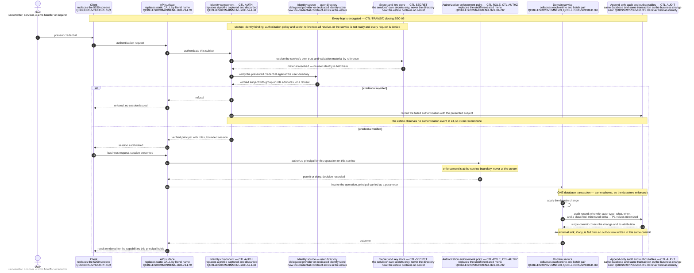

# Target Security Control Design

This document is the forward half of the first business driver this assessment answers: minimize security risk. [The security risk register](../risk/01-security-risk-register.md) establishes eight findings, `SEC-01` through `SEC-08`, and names the control that closes each. This document designs those controls — what each one is, where it sits in the target, which finding it closes, and what it leaves standing. The register's completeness bar is that no finding is left without a closing control; the matching bar here is the inverse, and it is checkable in the [control-to-finding traceability](#control-to-finding-traceability) at the end: **every one of the eight findings is closed by exactly one named control, and every control in the closing set closes at least one numbered finding.** Seven controls carry those eight closures, because one control closes two findings that are two failures of a single missing capability.

**Five further controls are specified here and are deliberately outside that set, each traced in a matrix of its own.** One is a supporting dependency four of the seven closures cannot be built without, and it closes no finding by itself. One closes gaps that [the compliance and data protection document](../risk/02-compliance-and-data-protection.md) raises and the register does not number. The remaining three guard surfaces the **target** introduces — a validated input boundary, a rendered interface and a bulk-export capability — and the estate therefore offers no finding for any of them. Keeping the namespaces apart is the point: a single table mixing them would have to describe "closes" four different ways, and a completeness claim asserted over that mixture could not be checked. So each namespace gets its own matrix and each claims only what it can prove.

**Scope.** This document owns the control set, the derivation of the role model, and the traceability between the two. Every boundary around that is another document's subject, and each is drawn deliberately. It does **not** establish the findings, rate them or re-argue their evidence — that is [the security risk register](../risk/01-security-risk-register.md), and where this document needs a finding it references the identifier and cites the register rather than restating the impact analysis. It does not inventory personal and health data column by column, nor assert which regulatory frameworks apply, both of which belong to [the compliance and data protection document](../risk/02-compliance-and-data-protection.md). It does not analyse write atomicity, journaling, backup or recovery, which belong to [the continuity and recovery risk document](../risk/03-continuity-and-recovery-risk.md). It does not restate the platform support-lifecycle argument, which is established with attribution in [the platform and support status document](../current-state/03-platform-and-support-status.md). It does not set the target's layers or service boundaries, which are owned by [the target architecture](01-target-architecture.md), nor name the services and operations the controls are enforced across, which are owned by [the program-to-service map](02-program-to-service-map.md), nor type a single column, which is owned by [the target data model and schema mapping](03-target-data-model-and-schema-mapping.md). It does not choose user-interface components, which is deferred by [the UI modernization document](05-ui-modernization.md). And it does not sequence the work: no control below is placed before or after another in time, because staging belongs to [the recommended path](../migration/02-recommended-path.md).

**Two things this document explicitly does not do, stated up front because both are easy to assume.** First, **none of the eight findings is remediated here.** No source member, schema definition or build artifact is modified anywhere in this assessment; designing a control is not building one, and nothing below changes the running system in any respect. Second, **no pipeline, policy, configuration or infrastructure artifact is created by this documentation set.** The scanning control specified under `SEC-08` describes a gate; it does not add a workflow file, and there is none to find.

**Reading the citations.** A citation of the form `[<path>:<locator>]` is plain text rather than a hyperlink, and points at a path in this repository. Plain text is chosen so a citation stays meaningful in a diff and does not depend on a hosting provider's line-anchor syntax. The rule applied throughout is asymmetric and worth naming: **every claim about the existing system carries a citation, and no target control does.** A control is a proposal, and a proposal has nothing to cite; the "there is nothing like this today" clause beside it is a claim about the estate and always does. Every line range below was opened and read against the working tree while writing this document. Platform terminology links to [the IBM i glossary](../reference/glossary-ibm-i.md) on first use in this document.

**What could not be verified, stated once.** No control below was validated by building or running anything, and none could be: every COBOL program names the platform as its object computer as well as its source computer [QCBLLESRC/MAINMENU.cbl:L27-L28], no off-platform compiler for ILE COBOL or ILE CL exists, and the repository contains no test suite to run in place of one. The legacy claims each control is designed against therefore rest on citation resolution and human review, and a control design is in any case falsifiable by review rather than by execution.

## The target stack, consumed rather than re-derived

The language, runtime and datastore are settled by [the target-language decision matrix](../talent/02-target-language-decision-matrix.md) and recorded in the decision log. This document states the position and designs against it rather than reproducing the reasoning, so that superseding the choice means superseding one record instead of editing every document that depends on it.

- **The primary recommendation is Java on a current long-term-support release, with Spring Boot**, on PostgreSQL as the relational datastore. The runner-up is C#/.NET, recorded as a candidate rather than as a second named stack. TypeScript and Node, and Python, are evaluated and rejected for the core; Go is evaluated and not selected. The decisive criterion is exact decimal arithmetic, which is a data-typing property rather than a security one. **No release number, framework minor or datastore major is pinned by this assessment**: [MOD-ADR-001](../decisions/MOD-ADR-001-target-language-and-runtime.md#what-this-record-fixes-and-what-it-leaves-open) fixes the language, the support line and the framework together with the rule a concrete selection must satisfy, and the datastore is decided by `MOD-ADR-003`. **One part of that rule matters here for a security-specific reason:** it requires a release that its publisher designates long-term-support *and* that is inside the support window the publisher states for it, which is exactly the property a runtime's fix supply can be checked against — and a runtime without patch supply is how the estate this document is replacing arrived at its present position [README.md:L264].
- **The target is hosting-agnostic, with a containerized reference deployment**, and **exit from the AS/400 hardware is deliberately deferred and decoupled from this work**.
- **No control below depends on any of that.** This is worth stating because a security design that only works on one stack is a weaker design. Every control specified here is expressed as a property the target must have — an authenticated principal, an enforcement point, an encrypted channel, an audit record written in the same unit of work as the change it describes — and each is satisfiable on the runner-up stack without amendment. What the stack choice affects is which libraries implement a control, and this document names none, for the same reason it names no route table: that is implementation, and this assessment plans modernization rather than performing it.

One consequence of the hosting-agnostic position bears directly on this document and is easy to lose. **Deferring the hardware exit does not defer any control here.** All twelve controls below are controls of the **target system**, they are all satisfiable while the AS/400 remains in place behind a coexistence boundary, and none of them requires the hardware decision to be taken first.

"Controls of the target system" is deliberately not the same claim as "application-level controls", and the layers are named because they determine who builds and who operates each one:

| Enforcement layer | Controls enforced there |
| --- | --- |
| Application code and its service boundaries | `CTL-AUTH`, `CTL-ROLE`, `CTL-AUDIT`, `CTL-INPUT`, `CTL-OUTPUT`, `CTL-EXPORT` |
| Datastore and schema | `CTL-AUTHZ`, `CTL-REST`, `CTL-RETAIN` |
| Transport and its termination point | `CTL-TRANSIT` |
| Secret management infrastructure | `CTL-SECRET` |
| Delivery pipeline | `CTL-SCAN` |

The reverse of the hardware point is also true and is the honest limit of the set, recorded in full under [residual risk and what these controls cannot close](#residual-risk-and-what-these-controls-cannot-close): every one of the five layers above sits **above** the operating-system release, so not one control in the set reaches the platform beneath them.

## No regulatory framework is asserted as applicable

**This document names no regulatory framework, standard, article or control catalogue as applicable to LIFE400, and maps no control below to one.** The position is the resolution recorded as `A-03` in this assessment, consumed here rather than re-derived, and it binds this document more tightly than any other in the target-state layer — a control design is exactly where a framework name would slip in most naturally and be least noticed.

The reason is that the inputs which decide applicability are business facts that appear nowhere in this repository, and [the compliance and data protection document](../risk/02-compliance-and-data-protection.md) owns that determination in full. What follows for the design is a positive discipline rather than a silence:

- **Controls are specified against the gap they close, never against a clause they satisfy.** Each control below is named for what it does — authenticate, authorize, encrypt, attribute, retain, scan — and its justification is a numbered finding in the register, or, for the five controls outside the closing set, a stated dependency, a named data-protection gap, or a surface the target introduces and the estate never had. Never an external requirement.
- **The control gaps are stated generically**, in the vocabulary this assessment uses throughout: access control, transport security, encryption at rest, auditability, and retention and erasure. Those five categories cover every finding and every gap handed to this document, and none of them is a framework's terminology.
- **Framework applicability must be confirmed by the business**, and when it is, this document is an input to that exercise rather than a substitute for it. A control set specified against gaps maps onto whatever framework turns out to apply; one specified against a guessed framework has to be redone if the guess is wrong.
- **The only verifiable compliance control present in the repository is the Y2K remediation**, recorded as a dated review marker inside the members themselves — in the menu program beside the display date it applies to [QCBLLESRC/MAINMENU.cbl:L54] and in the shared contract beside the audit date [QCPYSRC/POLDATA.cpy:L174]. It is named here only to set the baseline honestly: the estate carries evidence of exactly one compliance exercise, that exercise was a data-correctness exercise rather than a security one, and no control below builds on it.

## The control set at a glance

Twelve controls are specified in this document, and they divide into four namespaces that answer to four different bars. **Seven are closing controls**, and between them they close the register's eight numbered findings — two findings share one control because they are two failures of the same missing capability. **One is a supporting dependency** that closes no finding on its own and exists because four of those closures are unbuildable without it. **One is a gap-closing control** answering gaps the compliance and data protection document raises outside the register's numbering. **Three guard surfaces the target introduces** — a validated input boundary, a rendered interface and a bulk-export capability the estate has no equivalent of — so none of the three closes a numbered finding and none could. The tables below are separated on exactly those lines, because the word "closes" does not mean the same thing in all four.

### The seven closing controls

Each row closes at least one numbered finding, and no row is here on any other basis.

| Control | Name | Closes | Gap class it answers |
| --- | --- | --- | --- |
| `CTL-AUTH` | Application-level authentication establishing a verified principal | `SEC-01` | absent — no credential construct exists |
| `CTL-ROLE` | A derived role model, with authorization enforced at the service boundary | `SEC-02` | absent — no role branch exists |
| `CTL-AUTHZ` | Declared, reviewable authorization on objects and data | `SEC-03` | undeclared — authority left to the installation |
| `CTL-REST` | Encryption at rest with field-level access control | `SEC-04` | absent — no encryption construct exists |
| `CTL-TRANSIT` | Encrypted transport terminating at an authenticated service boundary | `SEC-05` | undeclared — channel protection left to the network |
| `CTL-AUDIT` | Mandatory user-attributed audit records on every read and every mutation — "user" meaning the acting principal of any kind, human or workload, per [principals](#principals-who-and-what-the-target-authenticates) | `SEC-06` **and** `SEC-07` | misapplied, then absent |
| `CTL-SCAN` | Dependency, static-analysis and secret scanning as a blocking gate | `SEC-08` | absent — no delivery gate exists |

Seven rows and eight closures, which is the one row worth explaining. **`CTL-AUDIT` closes two findings deliberately, and both rows of the closure matrix say so explicitly rather than leaving a cell blank.** `SEC-06` and `SEC-07` are different failures — a stamp that runs and records the wrong subject, and no stamp at all on the estate's dedicated amendment path — but they are failures of one absent capability: an identity that reaches the point of a write. Designing two controls for that would produce two implementations of one thing, which is the pattern this whole target-state layer exists to remove. The read-side auditability gap, which the register does not number, is covered by the same control and is traced with the other gaps rather than counted as a third closure.

### One supporting dependency, which closes no numbered finding

| Control | Name | What it is here for | Gap class it answers |
| --- | --- | --- | --- |
| `CTL-SECRET` | Managed storage for the services' **own** secrets and key material — referenced never embedded, and never the end-user directory | A dependency of `CTL-AUTH`, `CTL-REST`, `CTL-TRANSIT` and `CTL-SCAN`. It closes nothing by itself and is not a closing control | absent — no secret store, because no secrets |

- **This is modelled as a dependency rather than as a closure, and the distinction is load-bearing.** Authentication needs somewhere for the *service's own* credential and token-validation material to live; encryption at rest and encrypted transport each need key material; scanning needs to know what a leaked secret looks like. Four closures rest on it, which is why it is specified in full — and it still closes no numbered finding, which is why it is not in the closing set and does not appear in the closure matrix. Counting it as a closure would inflate the closing set to eight and make the completeness claim above unprovable.
- **One boundary inside it is easy to collapse and must not be: a secret manager is not a user directory.** `CTL-SECRET` holds what the services themselves present and protect with — client credentials, trust material, transport keys, encryption keys and the reference material an identity binding needs. **Where end-user identities live, and what verifies a user's credential, is `CTL-AUTH`'s identity component and never this store.** The two are different components with different owners, different lifecycles and different blast radii: rotating a transport key must not touch a person's account, and administering a person's account must not touch key material. Conflating them is the single most common way an otherwise sound control set acquires a component with far more authority than any one of its jobs requires.

### One gap-closing control, outside the register's numbering

| Control | Name | Closes | Gap class it answers |
| --- | --- | --- | --- |
| `CTL-RETAIN` | Retention schedule, auditable erasure, and purpose-scoped field retention | The retention, erasure and minimization gaps owned by [the compliance and data protection document](../risk/02-compliance-and-data-protection.md) — **not** a numbered `SEC` finding | absent — no deletion path of any kind |

- **The gaps it closes are named and traceable, but they are not register findings**, so they are traced in the [gap-to-control traceability](#gap-to-control-traceability-outside-the-registers-numbering) rather than in the closure matrix. That document designates this one as the place their closure is designed, which is the whole of this control's warrant for being here.

### Controls guarding surfaces the target introduces

| Control | Name | What it is here for | Gap class it answers |
| --- | --- | --- | --- |
| `CTL-INPUT` | Boundary input validation and contextual output safety | Guards every value crossing into the target and every value rendered out of it. It closes no numbered finding and is not a closing control | not applicable — fixed-length positioned fields, no query language and no deserializer leave the estate nothing to inject into |
| `CTL-OUTPUT` | Context-aware output encoding and safe rendering of operator-supplied values | Guards every target surface that renders an operator-supplied value. It closes no numbered finding and is not a closing control | not applicable — a character grid has no injection surface |
| `CTL-EXPORT` | Authorized, scoped, minimized and audited reporting and bulk export | Guards the reporting capability the target revives from ten unreachable printer formats. It closes no numbered finding and is not a closing control | absent — no program can produce either report |

- **`CTL-OUTPUT` and `CTL-EXPORT` close no numbered finding because the exposures they address are not in the estate to find.** A character grid rendered from declarative screen definitions [QDDSSRC/MNUDSPF.dspf:L12] has no injection surface, and no program in the estate can produce either report its [printer files](../reference/glossary-ibm-i.md#printer-file) describe. Both controls therefore guard capability the **target** introduces, which is a reason to specify them here rather than to omit them: a control set that only answered numbered findings would deliver a system safer than LIFE400 in eight respects and newly exposed in two.
- **`CTL-INPUT` is the one control in the set that answers no property of the estate at all, and it is here because the target changes the threat model.** The register has no finding for malicious input because there is nothing in LIFE400 to send malicious input to: input arrives as fixed-length fields from a character terminal into a program-described record area, persistence is [record-level I/O](../reference/glossary-ibm-i.md#record-level-io) through a declared key with no query language anywhere in the estate, and output is a fixed 24-by-80 grid of positioned fields [QDDSSRC/MNUDSPF.dspf:L12]. **The target adds an API surface, a web client, a report producer and structured logs — four things the estate does not have — and every one of them is a place where untrusted input is parsed and where data is rendered into a context that can interpret it.** A control set derived only from the estate's findings would therefore be complete against the legacy system and incomplete against the thing being built. That would be the worst kind of gap: invisible, because nothing in the source points at it.

**The completeness claim, stated precisely so it cannot be over-read.** Every one of the eight numbered findings has exactly one closing control, and no numbered finding is left without one. That is the claim. It is **not** the claim that every control closes a numbered finding: `CTL-INPUT`, `CTL-OUTPUT`, `CTL-EXPORT`, `CTL-SECRET` and `CTL-RETAIN` deliberately do not, and each says so in its own row above and in its own section below. Conflating the two would either understate the control set or overstate what the register numbers.

## Design principles every control shares

Six properties are stated once here rather than repeated in every control section below. Each is a direct response to something measured in the estate rather than a general preference, and each is the reason a control below is specified the way it is.

- **A control is enforced at a boundary, not at a screen.** In LIFE400 the only place a check could be added is the interactive dispatch loop, and it is a compiled `EVALUATE` over a two-character selection [QCBLLESRC/MAINMENU.cbl:L60-L92] with four literal call targets [QCBLLESRC/MAINMENU.cbl:L73-L79]. A check placed there would protect the interactive path and nothing else: the three batch submitters are separately callable CL programs taking only record keys as parameters [QCLSRC/RUNNBUW.clle:L21], [QCLSRC/RUNSVC.clle:L21], [QCLSRC/RUNCLM.clle:L21], and the nightly driver takes no parameter at all [QCLSRC/DLYUPD.clle:L24], so none of the four passes through the menu. So every control below is enforced where the work is done, which is the property that makes a new entry point subject to the same check as an existing one.
- **A control that can be omitted will be.** The estate's own evidence for this is exact: five programs stamp an audit field and a sixth does not [QCBLLESRC/SVCMNT.cbl:L190], and nothing detected the omission. Controls below are therefore specified as non-optional properties of an operation rather than as steps a developer remembers, and the audit control in particular is bound to the write path rather than to a field somebody sets.
- **A control is declared in the artifact, not in the environment.** Object authority in the estate is specified nowhere: the library is created with no authority parameter [README.md:L125] and no object-creation command in the build sequence carries one [README.md:L120-L218]. A posture that lives only in an installation cannot be reviewed from version control, does not travel with a restore, and cannot be compared between two environments.
- **A control produces evidence.** Every control below either writes a record of its decisions or is checked by something that fails the build. This is the property the estate lacks most completely: no authentication event, no authorization decision, no read and no erasure is recorded anywhere, so nothing about the current posture can be demonstrated after the fact in either direction.
- **A control fails closed when the configuration it depends on is absent.** Every control below rests on configuration the deployment supplies — where identities are verified, what authorization policy is in force, which secret references resolve to key material — and none of it has a default. So the rule is stated once and applies to every control below: **missing or unresolvable security configuration fails startup, reports the service not-ready, and denies requests; it never degrades to serving them unauthenticated, unauthorized or unprotected.** The estate is the argument for making this explicit rather than assuming it, because its habit is the opposite: the library-list insertion that decides which objects a name resolves to is monitored and ignored, so the session continues after it fails [QCLSRC/STRTLIFE.clle:L27-L28], and the nightly sweep runs under a catch-all monitor that increments a counter and carries on [QCLSRC/DLYUPD.clle:L76-L77]. The general form of the rule — deployment-owned settings, no defaults, refusal rather than fallback — is the [logical configuration contract](01-target-architecture.md#externalized-configuration) in the target architecture; this principle is the security half of it, and the rows it governs are the identity binding, the authorization policy and the secret references.
- **A control's scope is stated, including where it stops.** Each section below ends by naming what it does not cover. This is not modesty: the register classes five findings as absent because the estate delegated those controls to the platform, and a design that implied it had closed more than it had would repeat that mistake in the target.

## CTL-AUTH: application-level authentication

**Closes `SEC-01`.** The control is an authentication step the application performs and can refuse, establishing a principal that is verified rather than assumed, and carrying that principal through the call path so that every control after this one has an identity to act on.

**Why this is new capability and not a port.** The estate's identity handling is a single pair of statements: the menu reads the signed-on profile with `ACCEPT WS-USER-ID FROM USER` [QCBLLESRC/MAINMENU.cbl:L57] and moves it to a screen field on the very next statement [QCBLLESRC/MAINMENU.cbl:L58]. The field it lands in is output-only — it carries no usage letter in the [display file](../reference/glossary-ibm-i.md#display-file) [QDDSSRC/MNUDSPF.dspf:L45], unlike the selection field one screen row above it, which is declared `B` for input and output [QDDSSRC/MNUDSPF.dspf:L39]. The value is never stored and never passed onward, because none of the four dispatched programs takes a parameter [QCBLLESRC/MAINMENU.cbl:L73-L79]. **The profile the legacy menu captures is cosmetic: it is displayed back to the person who already knows it and then discarded.** Authentication itself happens entirely outside LIFE400, as the entry program's own installation banner documents — it is configured as a user's [initial program](../reference/glossary-ibm-i.md#initial-program) [QCLSRC/STRTLIFE.clle:L14-L16] — and there is no credential, password, session or token construct anywhere in the twenty-four members, by the search the register records. So there is no existing mechanism to strengthen, re-point or wrap. Identity in the target is construction.

The control has six parts, and each answers something the estate cannot do rather than something it does differently.

- **A verified principal, refusable at the boundary.** The target authenticates a presented credential and can fail, refuse and record the refusal. The estate cannot: it observes no authentication event, so it cannot detect a failure, cannot rate-limit one and cannot report one. Establishing a principal the application itself produced is what makes every control that depends on knowing who is acting possible at all, which is why the register records this finding first.
- **The principal is a first-class parameter of every operation, not a screen field.** It travels with the request from the boundary to the point of the write, and it is available to the authorization decision, to the audit record and to the read path. This is the single most consequential difference from the estate, where the one place that knows the user is the one place with no access to the data contract, because the menu opens no database file at all — its whole `FILE-CONTROL` section declares one workstation file and nothing else [QCBLLESRC/MAINMENU.cbl:L32-L36].
- **Session handling with an explicit lifetime.** A session in the target is a bounded, revocable, individually terminable thing. In the estate a session is the job the platform started, its boundaries are the entry program's own library-list push and pop [QCLSRC/STRTLIFE.clle:L27], [QCLSRC/STRTLIFE.clle:L40], and there is no session state the application owns — every occurrence of the word `SESSION` in the estate is comment or message prose in that one CL member [QCLSRC/STRTLIFE.clle:L9], [QCLSRC/STRTLIFE.clle:L12].
- **A named identity source, reached across a boundary — and it is not the secret store.** Two shapes satisfy this control and the design deliberately admits either: authentication is **delegated**, so an external identity provider holds the user directory and verifies the credential while the application validates the assertion or token it issues; or it is **backed by a dedicated identity store** the identity component owns, which holds accounts and password verifiers and nothing else. Which of the two, and which provider or protocol, is an implementation decision this document does not make — the deferral is deliberate and is recorded in the residual risk against `SEC-01`. What the control does fix, in either shape, is the boundary and its configuration: **end-user identities and credential verifiers live in the identity source; the services' own secrets and key material live in `CTL-SECRET`; neither holds the other's contents.** The configuration that binds the application to its identity source — which issuer or directory is trusted, and the reference to the material used to validate what it issues — is deployment-owned, required, has no default, and under the fail-closed principle above its absence fails startup and denies requests rather than admitting an unverified principal.
- **Credential material the application never holds in plain form.** A user's credential is verified by the identity source above and never stored by the application; the *service's own* credentials and validation keys are held by reference in `CTL-SECRET` below, resolved at run time and never embedded.
- **Resistance to automated credential attack, required as a property rather than left to the provider.** The estate cannot detect a repeated failure, let alone slow one: it observes no authentication event of any kind, so there is nothing to count and nothing to refuse. The target's authentication step must therefore carry failure throttling with progressive backoff, a lockout or step-up path on a threshold of failures against one subject, protection against a spread attack that tries one credential against many subjects, and an audit record for every failed attempt — the branch D-12 draws explicitly. **What is required is the resistance and the evidence, not a mechanism**: no factor count, provider, lockout duration or threshold value is named here, because those are implementation and operational settings and this document names none of either.

### Principals: who and what the target authenticates

**A principal in the target is not necessarily a person, and that has to be settled here rather than assumed by the controls that consume it.** The reason is a property of the estate: of its four mutating entry paths, two have no contemporaneous human at all. The nightly driver runs on a schedule, takes no parameter [QCLSRC/DLYUPD.clle:L24] and mutates policy state through the program it calls [QCLSRC/DLYUPD.clle:L75]; a submitted job runs after its requester's session has already returned, because submission is one-way and control comes back as soon as the work is queued [QCLSRC/RUNNBUW.clle:L43-L45], [QCLSRC/RUNNBUW.clle:L49-L50]. An identity model built only for the interactive path would leave those two paths unauthenticated, unauthorized and unattributed — which is exactly their state today.

Three principal kinds, therefore, and each is authenticated by `CTL-AUTH`, authorized by `CTL-ROLE` and `CTL-AUTHZ`, and recorded by `CTL-AUDIT`.

| Principal kind | What it is | How it is authenticated | What it may hold |
| --- | --- | --- | --- |
| Human | A person acting in a session, the only kind the estate's menu has any notion of [QCBLLESRC/MAINMENU.cbl:L57-L58] | An interactive authentication with a bounded, revocable session | Roles derived from the capability boundaries in `CTL-ROLE`, confirmed with the business |
| Workload | A scheduled trigger, a queued-work executor or a background component acting under its own identity and not on any person's behalf | A non-interactive credential resolved through `CTL-SECRET`, never a shared or embedded one, and never a human's credentials | Only the operations that workload's own function requires. A workload principal is not a superuser and holds no role a human role does not also constrain |
| Delegated | A workload principal executing work a human requested — the queued-submission case | The workload principal authenticates; the initiating human identity travels with the request as data it cannot forge | The intersection of the workload's own authority and the initiator's, so delegation can narrow authority and never widen it |

Three rules follow, and each closes a way the model could be quietly defeated.

- **Actor type is recorded, never inferred.** Every authenticated principal carries an explicit type, so a workload principal can never be read later as a person who was present. The estate offers the counter-example: the only message that reads like a session audit record concatenates a *library* name into text promising a user [QCLSRC/STRTLIFE.clle:L24], [QCLSRC/STRTLIFE.clle:L31].
- **Delegation is explicit and carries both identities.** A queued or scheduled operation records the executing workload principal and, where one exists, the initiating human. Where none exists — a recurring sweep nobody asked for individually — **the absence is recorded as an absence** rather than filled with an operator, a service account standing in for a person, or the program name the estate uses [QCBLLESRC/NBUWB.cbl:L138]. This is the semantics `SC-1.3` in [the business drivers and success criteria](../01-business-drivers-and-success-criteria.md) is written against, and the columns that hold both identities are typed by [the target data model and schema mapping](03-target-data-model-and-schema-mapping.md).
- **A workload principal is subject to the same authorization decision as a human.** Scheduled work reaches the domain services through the same dispatch contract as any other caller, a separation owned by [the target architecture](01-target-architecture.md), so it presents an identity and is refused when it lacks authority. In particular, **authority to run scheduled work implies no authority to read or export the data that work touches**: a report, a listing or a bulk extract is a separate capability needing its own grant, which is [CTL-EXPORT](#ctl-export-authorized-scoped-and-audited-reporting-and-bulk-export).

**A corroborating detail worth one sentence, because it shows how completely identity is absent.** The one message in the estate that reads like a session audit trail records the wrong subject: the entry program retrieves the *current library* into a variable [QCLSRC/STRTLIFE.clle:L24] and concatenates it into a message reading `LIFE400 SESSION STARTED BY` [QCLSRC/STRTLIFE.clle:L31]. The text promises a user and carries a library name. Even the estate's own attempt to record who started a session had no user identity available to it.

**Where this control stops.** It establishes and carries a principal; it decides nothing about what that principal may do, which is `CTL-ROLE` and `CTL-AUTHZ`. It specifies no authentication factor, protocol, provider or token format, and it does not choose between a delegated identity provider and a dedicated identity store: those are implementation choices, and naming one here would fix a decision the finding does not require and that a later reader would rightly expect to see justified. **What is not deferred is the boundary** — that a user directory is a component distinct from the secret store, and that the configuration binding the application to it is required and fails closed — because that is a design property rather than a product choice, and deferring it is how the two end up as one component. Whether the platform sign-on continues to exist behind a coexistence boundary while both systems run is a migration question, owned by [the recommended path](../migration/02-recommended-path.md).

## CTL-ROLE: a derived role model

**Closes `SEC-02`.** The control is an explicit role model, with authorization enforced at the service boundary rather than at the screen. The model itself is the interesting half, because the estate supplies no role evidence at all: **there is no role model to migrate, so one has to be derived — and derivation is a business exercise, not a translation exercise.**

**What there is to derive from.** Searching the estate for `ROLE` and `PERMISSION` returns zero occurrences of each. The interactive dispatch is one inline loop from `PERFORM UNTIL WS-CONTINUE = 'N'` [QCBLLESRC/MAINMENU.cbl:L60] to `END-PERFORM` [QCBLLESRC/MAINMENU.cbl:L92], and nothing inside it consults the identity the program captured before entering it [QCBLLESRC/MAINMENU.cbl:L57]. The menu is fixed at compile time in two independent places — four literal `CALL` statements in the COBOL [QCBLLESRC/MAINMENU.cbl:L73-L79] and the option text itself as DDS constants [QDDSSRC/MNUDSPF.dspf:L30-L35] inside the [record format](../reference/glossary-ibm-i.md#record-format) `MAINSCR` [QDDSSRC/MNUDSPF.dspf:L19]. So the only signal of intended capability anywhere in the estate is **the option set the menu offers and the programs it offers them through.** That is the whole evidence base, and the derivation below uses nothing else.

### The derivation, capability boundary by capability boundary

Each candidate role is one capability the menu already draws a line around. The lines are the estate's own; the roles are this document's proposal.

| Candidate role | Menu option it is derived from | Programs it would reach | Target service that enforces it |
| --- | --- | --- | --- |
| New business | `1. New Business / Policy Issuance` [QDDSSRC/MNUDSPF.dspf:L30] | `NBUWMNT` [QCBLLESRC/MAINMENU.cbl:L73], and the batch path submitted separately | New Business service |
| Servicing | `2. Policy Servicing and Amendments` [QDDSSRC/MNUDSPF.dspf:L31] | `SVCMNT` [QCBLLESRC/MAINMENU.cbl:L75], and the batch billing path | Servicing service |
| Claims | `3. Claims Adjudication` [QDDSSRC/MNUDSPF.dspf:L32] | `CLMMNT` [QCBLLESRC/MAINMENU.cbl:L77], and the batch adjudication path | Claims service |
| Read-only inquiry | `4. Policy Master Inquiry` [QDDSSRC/MNUDSPF.dspf:L33] | `POLMSTINQ` [QCBLLESRC/MAINMENU.cbl:L79] | Policy Read Model |
| Administration | `5. Reports Menu` [QDDSSRC/MNUDSPF.dspf:L34], which the program answers with a not-implemented message [QCBLLESRC/MAINMENU.cbl:L81] | none today | Query and read endpoints over the Policy Read Model, plus the Scheduled Work service |

Two of those rows deserve their own note, because they are the only two where the estate says anything beyond the option text.

- **Read-only inquiry is the one boundary the code already respects.** `POLMSTINQ` is the only program in the estate that opens the policy master for input alone [QCBLLESRC/POLMSTINQ.cbl:L63]; every other program that declares that file opens it for update, the servicing program included [QCBLLESRC/SVCMNT.cbl:L79]. So a read-only capability is not merely a plausible role — it is a distinction the estate implements at the file-open level and then discards at the menu, which offers the inquiry option beside the three mutating options with nothing to distinguish who may take which. The read-only role is the least speculative row in the table. It is also the row where the target has to *add* a boundary the estate blurred in a second way: the inquiry program drives a display file it does not own, declaring the servicing program's screen as its own workstation file [QCBLLESRC/POLMSTINQ.cbl:L33], [QCBLLESRC/SVCMNT.cbl:L33] and switching it into inquiry mode by setting an [indicator](../reference/glossary-ibm-i.md#indicator) [QCBLLESRC/POLMSTINQ.cbl:L92]. The read path and a mutating path share one presentation surface today, distinguished by a single indicator byte.
- **The administrative role is derived from an option that does nothing.** Selecting the reports option produces a not-implemented message and nothing else [QCBLLESRC/MAINMENU.cbl:L81]. It is included because the target must decide what happens to that option, and because reporting and scheduled work are the two capabilities that plainly need a separate authority from transacting. Deriving a role from an unimplemented feature is the weakest inference in this table, and it is labelled as such rather than presented alongside the other four as equivalent.

Two more properties of the model follow from the estate rather than from convention, and both are recorded because they are decisions a business confirmation has to actually make:

- **Nothing in the estate separates a mutating capability from an approving one.** The single undifferentiated menu means one signed-on user can issue a policy, amend an in-force one and adjudicate a death claim. Whether the target should split any of those into maker and checker roles is precisely the kind of question the derivation cannot answer, because the estate never encoded an answer.
- **The batch paths have no menu entry to derive from at all.** The three submitters and the nightly driver are reached outside the interactive dispatch entirely, so no option text describes who may run them. The **Scheduled Work service** therefore needs an authority that is derived from nothing in the estate — it is specified, not derived.

### Why this derivation is a proposal requiring business confirmation

**The five roles above are a proposal, not a discovered fact, and nothing downstream should treat them as an inventory read out of the source.** Three reasons, and the third is the one that matters most:

- **The evidence base is menu text.** A line of DDS constant text describing a menu option [QDDSSRC/MNUDSPF.dspf:L30-L35] is a statement about navigation, not about authority. It says a capability exists; it says nothing about who should have it.
- **No user population is described anywhere.** The repository contains no user profile, no group, no authorization list and no organizational statement of any kind, so there is nothing against which to test whether these five boundaries match how the business actually divides the work.
- **The absence of role branching is not evidence that roles are unnecessary.** It is evidence that the question was never asked. Those two readings look identical in the source and are opposite in consequence, and keeping them apart is what stops the derived model from hardening into a false finding. If the business confirms fewer roles, the model shrinks; if it confirms maker-and-checker separation, the model grows. Both outcomes are consistent with everything the estate establishes, which is exactly why this is a confirm-with-the-business item.

**Where this control stops.** It supplies a role model and requires enforcement at the service boundary; it does not decide role membership, does not specify a role-assignment mechanism, and does not enumerate operations, which are owned by [the program-to-service map](02-program-to-service-map.md). The screen-level consequence — that a target interface renders only the capabilities a principal holds, which a menu compiled into DDS constants cannot do [QDDSSRC/MNUDSPF.dspf:L30-L35] — belongs to [the UI modernization document](05-ui-modernization.md). This document's requirement is narrower and stronger: **the screen is not the enforcement point, so a client that renders the wrong option must still be refused by the service.**

## CTL-AUTHZ: declared, reviewable authorization on objects and data

**Closes `SEC-03`.** The control is authorization that is declared in the deployed artifact and reviewable from version control, replacing an object-level posture that the estate leaves entirely to the installation.

**What it replaces.** The estate declares no authority for anything it creates: the library is created with no authority parameter [README.md:L125], and no object-creation command in the eight-step build sequence specifies one [README.md:L120-L218] — not on the data files [README.md:L140-L143] and not on the work-management objects [README.md:L199-L206]. There is no authority-granting command anywhere in the tree, and no program is created with an owner-profile attribute, so the control a reader familiar with the platform would expect to find here — [adopted authority](../reference/glossary-ibm-i.md#adopted-authority) — is absent as well. The register classes this **undeclared** rather than absent for a precise reason this control has to respect: the posture is real, but it is a property of the environment rather than of the system as delivered, so it cannot be read out of this repository in either direction.

That distinction determines the shape of the control rather than merely qualifying it.

- **Authorization becomes a declared artifact rather than an installation property.** The answer to "who can read the insured names in the policy master" becomes a reviewable statement in version control. Today it is a question for whoever administers the machine, and it can be answered differently on two machines running identical code.
- **Enforcement is at the service and operation boundary.** A principal is authorized for an operation on a service — issue a policy, apply an amendment, adjudicate a claim, read a policy — rather than for a file. This is what makes `CTL-ROLE` enforceable, because the estate's own protection unit is the object, and an object grant cannot distinguish "may read a policy" from "may amend it" once a program has the file open for update.
- **Record-scope authorization is a stated design question, not a silent omission.** Nothing in the estate scopes access to a subset of records: the policy master is keyed and read by key [QDDSSRC/POLMST.pf:L81], and any program that opens it can reach every record in it. Whether the target restricts a principal to a branch, a book of business or a claim assignment cannot be derived from the source, so it is raised here as a decision the business takes rather than answered.
- **An authorization policy that cannot be loaded denies rather than permits.** The policy is required deployment configuration with no default: if it is absent, unparseable or fails its own validation, the service does not become ready and every request is denied, per the fail-closed principle above. An enforcement point that starts without a policy is worse than none, because it reports that authorization is in force while permitting everything — which is exactly the position the estate occupies by delegation today, with no declared authority anywhere in the build [README.md:L125].
- **The posture travels with the deployment.** A declared authorization model is present in a restored environment and in a non-production copy. An undeclared one is not, which is why this finding blocks the parallel run: a non-production copy of these objects would inherit the same unstated posture, with no declared baseline to compare against.

**A dependency worth naming, because it is not a security control and still blocks this one.** Standing up any environment other than production requires editing source today, since the library name is a literal in the call itself [QCLSRC/STRTLIFE.clle:L37] and in every file override, and the [library list](../reference/glossary-ibm-i.md#library-list) is manipulated per session rather than declared [QCLSRC/STRTLIFE.clle:L27]. Configuration externalization is owned by [the target architecture](01-target-architecture.md); it is named here because verifying an authorization model needs somewhere to verify it that is not production.

### Datastore authorization, which operation authorization does not supply

**Authorizing operations is necessary and it does not close this finding on its own.** `SEC-03` is about the authority carried by the *objects that hold the data* — the library and the files created with no authority parameter anywhere in the build [README.md:L125], [README.md:L140-L143] — and an operation check inside an application says nothing about who else can open the store behind it. In the estate the two questions collapse into one because the protection unit *is* the object; in the target they separate, and both have to be answered or the finding moves rather than closes. So this control has a second half, stated at the same level of detail as the first.

| Requirement | What it means in the target | The gap it closes |
|---|---|---|
| A distinct database identity per service, and never a shared one | Each module authenticates to the datastore as itself, so a grant can differ between them and an action is attributable to a component | The estate has no application-level datastore identity at all: a program opens a file under whatever authority its job carries |
| Least privilege on that identity | An identity holds only the verbs it uses on only the tables it owns or is permitted to read — and holds no schema-changing authority whatever | Object authority is unspecified in the build [README.md:L120-L218], so nothing narrows what a program may do to a file it opens |
| Default-deny, with no direct interactive access to production data | No human and no tool reaches the production store outside the application's own authorized paths; a break-glass route exists, is separately credentialed, is time-bounded and writes an audit record | Any process able to open the file today reads every record in it, since the file is keyed and read by key with no record-level scope [QDDSSRC/POLMST.pf:L81] |
| A separate, non-application identity for schema migration | Schema change runs under an identity the running services do not have and cannot assume, so a compromised service cannot alter the schema | Not applicable in the estate — schema change is a platform command a person types [README.md:L140-L143] — which is exactly why the target has to state it rather than inherit it |
| A separate identity for reporting and bulk read | Report and export paths authenticate separately and hold read-only grants on a narrowed column set, so a reporting compromise cannot write | The estate has no reporting program at all, so the authority a report would run under is undefined; the reporting control below governs its scope |
| The grant policy is a reviewable artifact in version control | Every grant, every role and every identity is declared where it can be diffed and reviewed, and a change to it is a change to the system | The current posture lives only in the installation, cannot be read from this repository in either direction, and can differ between two machines running identical code |
| Credential separation from the application artifact | No datastore credential appears in source, in configuration or in an image; each is resolved by reference at run time — `CTL-SECRET` | The estate has no credential to separate, so this exposure is introduced by the target and is stated rather than inherited |

**One property of this half is worth stating explicitly, because it is the reason the two halves are not interchangeable.** Operation authorization protects the data from a *caller*; datastore authorization protects it from everything else — an operator, a script, a compromised neighbouring component, a restored copy of the database. The estate has neither, and a target that implemented only the first would be materially better and would still leave `SEC-03` open.

**Where this control stops.** It specifies that authorization is declared, enforced at the operation boundary **and at the datastore**, and reviewable; it names no authorization technology, no policy language, no database product feature and no directory. It also asserts nothing about the estate's *effective* authority today: the register establishes that authority is unspecified, not what the resulting access is, and this document does not improve on that — inventing a value would be a fabricated measurement, and what the installation default grants remains a confirm-with-the-business item.

## CTL-REST: encryption at rest with field-level access control

**Closes `SEC-04`.** The control is protection of stored personal and health data by a named mechanism, combined with field-level access control so that reaching a table is not the same as reading its most sensitive columns.

**What it replaces.** Nothing: no encryption construct exists anywhere in the estate, by the search the register records, and there is no key management because there are no keys. The data sits in ordinary character and [zoned decimal](../reference/glossary-ibm-i.md#zoned-decimal) columns of a [physical file](../reference/glossary-ibm-i.md#physical-file), reachable by any process that can open the file. [The compliance and data protection document](../risk/02-compliance-and-data-protection.md) owns the full column-level inventory and this document does not reproduce it; the columns named below are the ones the design needs in order to be specific about what is protected and how.

**Coverage is exhaustive over the sensitive inventory, and the count is stated so it can be checked.** [The compliance and data protection document](../risk/02-compliance-and-data-protection.md) classifies **27 columns** across the three physical files as holding personal, health-related, risk-derived, financial or attribution data — fifteen in the policy master, eleven in the claims file, one in the servicing file. **Every one of the 27 is assigned a protection class below.** A design that named only the obviously personal columns would leave the estate's own inference chain unprotected, which is precisely the mistake the compliance document warns against: the underwriting judgement is narrowed by columns whose names are financial rather than medical.

Four protection classes are defined, and each column belongs to exactly one.

| Class | Mechanism | Read authority |
| --- | --- | --- |
| **P1 — restricted** | Storage-level encryption, plus column-level protection, plus field-level access control | Only a principal whose role requires this specific attribute |
| **P2 — protected** | Storage-level encryption, plus field-level access control | A principal whose role requires the record; the column is not returned to roles that do not need it |
| **P3 — standard** | Storage-level encryption; access governed by the record-level authorization of `CTL-AUTHZ` and `CTL-ROLE` | Any principal authorized for the record |
| **X — excluded, with a reason** | Not carried into the target as live data | Not applicable |

### The 27 columns, each with its class

| # | File | Column | Anchor | Category | Class | Why this class |
| --- | --- | --- | --- | --- | --- | --- |
| 1 | `POLMST` | `INSNAME 40A` | [QDDSSRC/POLMST.pf:L32] | Identifying personal data | P2 | The primary identifier of a natural person, and needed by every role that legitimately handles a policy |
| 2 | `POLMST` | `INSDOB 8S 0` | [QDDSSRC/POLMST.pf:L35] | Identifying personal data | P1 | A non-reissuable identifier, and a rating input. Needed by underwriting, not by inquiry |
| 3 | `POLMST` | `ISSAGE 3S 0` | [QDDSSRC/POLMST.pf:L37] | Demographic | P2 | Read with the issue date it narrows the date of birth independently, so it stays identifying even where item 2 is withheld |
| 4 | `POLMST` | `GENDER 1A` | [QDDSSRC/POLMST.pf:L39] | Demographic | P2 | A demographic characteristic of a named person and a rating input |
| 5 | `POLMST` | `SMOKER 1A` | [QDDSSRC/POLMST.pf:L41] | Health-related data | P1 | A health behaviour recorded about an identified individual |
| 6 | `POLMST` | `OCCLAS 1S 0` | [QDDSSRC/POLMST.pf:L43] | Derived risk assessment | P1 | An occupational risk grading of a named person |
| 7 | `POLMST` | `UWCLAS 2A` | [QDDSSRC/POLMST.pf:L45] | Derived risk assessment | P1 | The estate's own summary judgement of an individual's insurability |
| 8 | `POLMST` | `HIRAVOC 1A` | [QDDSSRC/POLMST.pf:L47] | Derived risk assessment | P1 | A lifestyle attribute of a named individual |
| 9 | `POLMST` | `FLTXTRA 6S 4` | [QDDSSRC/POLMST.pf:L49] | Derived risk assessment | P1 | A non-zero loading is a proxy for an adverse health or risk finding |
| 10 | `POLMST` | `SUMASSR 15S 2` | [QDDSSRC/POLMST.pf:L52] | Financial | P2 | The contracted death benefit for a named individual |
| 11 | `POLMST` | `LOANBAL 15S 2` | [QDDSSRC/POLMST.pf:L54] | Financial | P2 | A non-zero balance discloses borrowing against the contract |
| 12 | `POLMST` | `ANPREM 15S 2` | [QDDSSRC/POLMST.pf:L59] | Financial | P2 | A pricing signal that, read with items 3 and 10, narrows the underwriting outcome — which is why it is not P3 |
| 13 | `POLMST` | `MODPREM 15S 2` | [QDDSSRC/POLMST.pf:L61] | Financial | P2 | The amount actually billed to the individual |
| 14 | `POLMST` | `OUTPREM 15S 2` | [QDDSSRC/POLMST.pf:L63] | Financial | P2 | A non-zero value is an adverse financial inference about a named person |
| 15 | `POLMST` | `LSTUSR 10A` | [QDDSSRC/POLMST.pf:L78] | Attribution that in practice holds personal data | P1 | Named as attribution, occupied by insured-name text. Carried as provenance only, and protected as personal data — see the migration requirement below |
| 16 | `CLMPF` | `CAUSDTH 3A` | [QDDSSRC/CLMPF.pf:L23] | Health-related data | P1 | A coded cause of death |
| 17 | `CLMPF` | `DTHDTC 8S 0` | [QDDSSRC/CLMPF.pf:L26] | Health-related data | P1 | The date of an individual's death |
| 18 | `CLMPF` | `MEDRECS 1A` | [QDDSSRC/CLMPF.pf:L35] | Health-related data | P1 | One character, and what it discloses is that a medical file on this insured exists |
| 19 | `CLMPF` | `DTHCERT 1A` | [QDDSSRC/CLMPF.pf:L29] | Identity-document receipt | P2 | Evidences that an identity document about this individual was received |
| 20 | `CLMPF` | `CLMFORM 1A` | [QDDSSRC/CLMPF.pf:L31] | Identity-document receipt | P2 | Same reasoning as item 19 |
| 21 | `CLMPF` | `IDPROOF 1A` | [QDDSSRC/CLMPF.pf:L33] | Identity-document receipt | P2 | Same reasoning as item 19 |
| 22 | `CLMPF` | `BENNAME 40A` | [QDDSSRC/CLMPF.pf:L38] | Identifying personal data | P1 | A third party who never interacted with the system and never consented through it |
| 23 | `CLMPF` | `BENREL 20A` | [QDDSSRC/CLMPF.pf:L40] | Identifying personal data | P1 | A family-relationship attribute of that third party |
| 24 | `CLMPF` | `CLMHOLD 50A` | [QDDSSRC/CLMPF.pf:L49] | Unstructured free text, category undeterminable from DDS | P1 | **Classified at the highest class precisely because its contents cannot be classified.** A fifty-character free-text column on a death claim may contain anything, so it is protected as though it contains the most sensitive thing it could |
| 25 | `CLMPF` | `PYMTAMT 15S 2` | [QDDSSRC/CLMPF.pf:L52] | Financial | P2 | A settlement amount paid to a named beneficiary |
| 26 | `CLMPF` | `PYMTMODE 1A` | [QDDSSRC/CLMPF.pf:L54] | Payment instrument | P3 | A one-character payment method with a two-value domain. It identifies no person and discloses no attribute of one; it is listed so the coverage is complete rather than because it needs a class above the floor |
| 27 | `SVCPF` | `USERID 10A` | [QDDSSRC/SVCPF.pf:L51] | Attribution | P3 | Declared for a requesting user and never populated by any writer, because the writing program describes the record as one flat area [QCBLLESRC/SVCMNT.cbl:L58]. In the target it becomes a real attribution column written by `CTL-AUDIT`, and an attribution identity is operational data rather than sensitive data |

**Distribution: 13 columns at P1, 12 at P2, 2 at P3, 0 excluded.** Two exclusions a reader might expect are deliberately absent — nothing in the sensitive inventory is dropped from the target, and nothing is left unclassified.

Three classification judgements in that table are the ones most easily got wrong, so each is stated rather than left in a cell.

- **Beneficiary name and relationship are personal data, not health data**, and the distinction is not pedantry: a control designed around health data alone would leave both columns unprotected, and they describe a person who never interacted with the system at all. Conversely the medical-records flag is health-related even though it holds one character, because what it discloses is the existence of a medical file rather than its contents.
- **The financial columns are P2 rather than P3 because of what they disclose in combination.** [The compliance and data protection document](../risk/02-compliance-and-data-protection.md) establishes that the premium columns are pricing signals which, read alongside the sum assured and the issue age, narrow the underwriting outcome without any underwriting column being read. Protecting `UWCLAS` and `FLTXTRA` at P1 while leaving the premium columns at the floor would leave the judgement they encode partially inferable.
- **The one column that cannot be classified gets the highest class, not the lowest.** `CLMHOLD` is free text of fifty characters with no declared domain, and no honest classification of its contents can be made from DDS. Treating "unknown" as "not sensitive" would be the wrong default on a death claim; treating it as P1 is the conservative reading, and the load-time profiling of its actual contents is a step for the planned [data migration runbook](../migration/04-data-migration-runbook.md) rather than an assumption made here.

**Two treatments cut across the classes and are stated here because a class name does not carry them.** A `P1` or `P2` column is **masked by default in any listing, report or bulk extract** and is returned in full only to a principal whose role requires that attribute — the report and export path being `CTL-EXPORT`'s subject, which is where a report-specific grant is named — and the health-related columns are **excluded from every report unless such a grant names them**. Reads of `P1` and `P2` columns are audited by `CTL-AUDIT`'s read half rather than only their writes. And the one unclassifiable column is recorded as category **`unknown`, not `none`**: `CLMHOLD` is treated as the most sensitive category it could contain until its actual content has been profiled, and that profiling is a prerequisite of any narrower treatment rather than a formality.

The control has six parts, and the middle three are what make the classification above operative rather than descriptive.

- **Storage-level encryption as the floor, applied to everything.** It protects the whole store against loss of the underlying media or a copy taken outside the application, it requires no per-column decision, and it is the part of this control least likely to be got wrong. It is a floor rather than a ceiling because it is transparent to anything that reaches the store through the application: a principal who can query can read.
- **Column-level protection for the thirteen P1 columns, as the part storage-level encryption cannot supply.** This is the mechanism that makes "reaching a table is not the same as reading its most sensitive attributes" true. It is specified per class rather than for the whole table because uniform protection is indistinguishable from no protection in the case that matters — an over-broad principal inside the application.
- **Field-level access control bound to `CTL-ROLE`.** Protection has to be *variable* between an insured's name and their cause of death, which the estate cannot do at all because it has one protection unit and it is the object. A read-only inquiry principal reading a policy needs the insured's name; it does not follow that the same principal needs the coded cause of death on a settled claim.
- **Masking and minimization as the default for every read that does not need the value.** A listing, a report, a search result and a support view each state which of the 27 columns they carry, and a column absent from that statement is not returned at all. This is the same requirement the reporting control below enforces on bulk output, applied to ordinary reads, and it is what stops field-level access control from becoming an all-or-nothing grant.
- **Retention scoped by category, not by table.** The categories above are the units `CTL-RETAIN` applies a retention position to, which is why the classification is part of this control rather than a preface to it: decision-time underwriting attributes and administration-time financial attributes are retained for different reasons, and the estate draws no boundary between them anywhere.
- **Key management as an explicit, separate concern**, with keys held outside the data they protect and outside the built artifact — `CTL-SECRET` below. Encryption whose key travels with the data protects against almost nothing, and the estate offers no precedent to reason from, having neither keys nor anything that manages them.

**One migration-specific requirement belongs to this control, because no other document owns it and it would otherwise be lost.** The policy master's audit column must be treated as personal data on the way in, not as an identifier. [The security risk register](../risk/01-security-risk-register.md) establishes, on the byte-offset analysis owned by the current data model, that no audit stamp ever reaches that column and that what occupies it is insured-name text, so the column whose own text promises a user identifier [QDDSSRC/POLMST.pf:L78] in fact holds personal data. [The target data model and schema mapping](03-target-data-model-and-schema-mapping.md) carries it forward as `legacy_last_action_text`, deliberately as provenance rather than as attribution. **This control requires that it be protected as personal data in the target, which is exactly the classification no data-protection design would reach by reading the column's name.**

**Where this control stops.** It names no cipher, no key length, no key-management product and no database feature. It does not cover retention or erasure, which are `CTL-RETAIN`. It does not protect data in transit, which is `CTL-TRANSIT`. And it asserts nothing about what an installation may have arranged around these files today, because the repository holds nothing from which either the reassuring or the alarming reading could be supported.

## CTL-TRANSIT: encrypted transport terminating at an authenticated boundary

**Closes `SEC-05`.** The control is encrypted transport on every hop, terminating at the boundary that `CTL-AUTH` authenticates, so that channel protection becomes a declared property of the deployed system rather than an unstated property of the network it happens to sit on.

**What it replaces.** The estate has exactly one interface and declares no protection for it. A program reaches the terminal by declaring its screen as a workstation device with transaction organization — `SELECT MNUDSPF ASSIGN TO WORKSTATION-MNUDSPF ORGANIZATION IS TRANSACTION` [QCBLLESRC/MAINMENU.cbl:L32-L36] — and the screen is defined declaratively in DDS on a fixed twenty-four row by eighty column grid [QDDSSRC/MNUDSPF.dspf:L12], which is the geometry of the [5250 datastream](../reference/glossary-ibm-i.md#5250-datastream). There is no HTTP, no socket and no message broker anywhere in the estate, and no `TLS`, `SSL` or cipher construct in any of the twenty-four members. The application contributes nothing to protecting the channel and has no notion of a content type or a session token available to it.

The register classes this finding **undeclared** rather than absent, and the control has to respect that classification honestly: what an installation arranges around the datastream cannot be read from this repository in either direction, so the control is specified as what the target *declares* rather than as an improvement on a measured baseline.

- **Every hop is encrypted, and the set of hops is enumerated rather than assumed.** Client to the API surface; API surface to each service; service to its datastore; and service to the audit store. The datastore hop is named explicitly because it is the one most often left in clear on the argument that it is internal, and it is the hop that carries every column in the `CTL-REST` table.
- **Transport terminates where a principal is established.** An encrypted channel that ends short of the authentication boundary protects the wire and leaves the boundary unauthenticated, which would satisfy the letter of this finding and leave `SEC-01` open. The two controls are specified as one termination point for that reason.
- **The protection is a property of the artifact, not of the deployment.** The estate's channel protection, if any, lives entirely outside the delivered system: it is invisible to review, cannot be asserted from anything in version control, and can be removed by an environment change that touches no application code. The target's requirement is that the system refuses an unprotected channel rather than merely tolerating a protected one.
- **The legacy channel stays outside this control's reach for as long as it exists.** While the 5250 path is still serving users alongside a replacement, it remains the estate's only interface and still declares no protection of its own, because nothing in this design can be applied to it without changing the estate. That is a coexistence constraint rather than a closure, and the coexistence itself belongs to [the recommended path](../migration/02-recommended-path.md).

**Where this control stops.** It names no protocol version, no cipher suite and no certificate authority. It says nothing about what any installation has configured around the terminal channel today. And it does not extend to the presentation technology that replaces the character interface, which is owned by [the UI modernization document](05-ui-modernization.md).

## CTL-AUDIT: mandatory user-attributed audit records

**Closes `SEC-06` and `SEC-07`, and additionally the read-side auditability gap.** This is the one control that closes two numbered findings, and the [control-to-finding traceability](#control-to-finding-traceability) matrix records the sharing explicitly rather than leaving a row to be inferred. It is also the only control that appears in two of this document's four traceability matrices: the read-side gap it covers is not a numbered finding, so it is traced in the [gap-to-control traceability](#gap-to-control-traceability-outside-the-registers-numbering) rather than counted as a third closure. The two findings are different failures of a single absent capability — an authenticated identity that reaches the point of an access — so they are closed once. Building two audit mechanisms for them would reproduce, in the target, exactly the duplication this layer exists to remove.

**The distinction between the two findings is worth a sentence, because it inverts the intuition about which is worse.** `SEC-06` is a **misapplied** control: five programs stamp an audit field and each writes its own program name rather than an identity [QCBLLESRC/NBUWMNT.cbl:L497], [QCBLLESRC/NBUWB.cbl:L138], [QCBLLESRC/SVCBILB.cbl:L140], [QCBLLESRC/CLMADJB.cbl:L136], [QCBLLESRC/CLMMNT.cbl:L281], each followed on the next statement by a move of the batch process date rather than an event time [QCBLLESRC/NBUWMNT.cbl:L498]. `SEC-07` is an **absent** one: on the sixth mutating path no stamp exists at all — the interactive servicing program rewrites the policy master [QCBLLESRC/SVCMNT.cbl:L190] and writes its servicing record [QCBLLESRC/SVCMNT.cbl:L191] while setting no audit value anywhere. **A weak stamp is a weak audit trail; a missing stamp on a mutating path is an actively misleading one**, because the column still holds a plausible previous value and a reader has no signal that this particular change went unrecorded. Detection is harder, not easier, and that is the argument for binding attribution to the write path rather than to a field somebody remembers to set.

### What an audit record carries

Four elements, replacing a program-name literal and a date. Each element is specified because the estate's version of it is absent or wrong.

| Element | What the target records | What the estate records |
| --- | --- | --- |
| Who | The authenticated principal established by `CTL-AUTH`, carried through the call path, **with its actor type** — and for delegated work the initiating identity as well as the executing workload principal, per [principals](#principals-who-and-what-the-target-authenticates). Where a recurring trigger has no initiator, the absence is recorded as an absence | A program-name literal, in five places [QCBLLESRC/NBUWB.cbl:L138] |
| What | The operation, the entity and its key | Nothing — the contract has no action item; the audit group holds a name and a date only [QCPYSRC/POLDATA.cpy:L172] |
| When | The instant of the event | The batch process date the run is working under [QCPYSRC/POLDATA.cpy:L175] |
| Before and after | The prior and resulting values of every changed field, subject to the minimization rule below | Nothing — the current row is the only record of state, so a rewrite destroys its predecessor [QCBLLESRC/SVCMNT.cbl:L190] |

The before-and-after element is the one with a second consumer, and naming it matters because it prevents the audit record being designed too thin. [The continuity and recovery risk document](../risk/03-continuity-and-recovery-risk.md) requires a durable change history independent of the current row, and it is the same artifact: **one record serves as the audit trail, the recovery source and the reconciliation source.** Designing it as attribution alone would satisfy this control and leave that requirement open.

### The audit trail is itself a copy of sensitive data, and is governed as one

**A before-and-after history of every changed field is, by construction, a growing second copy of the columns `CTL-REST` classifies — and left unqualified it would defeat `CTL-RETAIN`.** The conflict is exact and worth stating plainly: an erasure that removes an insured's name from `policy` and leaves the same name in an audit row has not erased it, and an audit trail deliberately built to outlive the record it describes would keep it indefinitely. This control therefore carries five requirements of its own, and they are requirements rather than options.

- **Minimization by class, not wholesale.** An audit record stores what is needed to answer *who changed what, when, and from what to what* — which does not require the plaintext of every sensitive value. For the thirteen **P1** columns the record stores the fact of the change and a non-reversible representation of the prior and new values sufficient to detect that they differed, rather than the values themselves. For **P2** and **P3** columns the values are stored, because the operational and reconciliation value of a before-and-after premium or sum assured is real and its sensitivity is lower. **The single exception is deliberate and is named: `CLMHOLD` [QDDSSRC/CLMPF.pf:L49] is free text whose contents cannot be classified, so no before-and-after value of it is stored at all — only that it changed.**
- **The audit store is encrypted at rest and its sensitive columns carry the same protection class as their source.** A column does not become less sensitive by being copied into an audit row. Read access to the audit trail is a separate authorization from read access to the record it describes, and is a distinct role rather than an implicit privilege of any operational role — otherwise the trail becomes a way to read at P1 what a principal may not read at P1 in the live table.
- **Audit records have their own retention schedule, and it is defined rather than infinite.** "Retained for as long as it exists" is precisely the estate's failure mode, reached by omission [the compliance and data protection document](../risk/02-compliance-and-data-protection.md) records; reproducing it deliberately in the target would be worse. The schedule length is a business and legal decision this document does not take; that there **is** a defined schedule, and that it is enforced by the same mechanism as `CTL-RETAIN`, is not optional.
- **Erasure reaches the audit trail, and what survives it is the event rather than the data.** An erasure under `CTL-RETAIN` redacts the personal and health values held in audit rows for that subject and **preserves the attribution skeleton** — who acted, on what entity, when, and that an erasure occurred. That satisfies both requirements at once: the subject's data is gone, and the record that the system was changed, and later erased, remains auditable. A legal hold suspends the redaction for the entities it covers and is itself an audited act, so "we could not erase" is a recorded decision with a named holder rather than a silent failure.
- **No credential, key or secret is ever captured in an audit record**, which is the audit-side half of `CTL-SECRET`'s requirement that nothing is logged from which a secret could be reconstructed. An authentication event records the subject presented and the outcome, never the credential material.

**The reconciliation consumer is not compromised by any of this.** A recovery or reconciliation use needs to know that a value changed and to identify the row and the operation; where it additionally needs a prior *value*, the columns it needs are the monetary and date columns, which are P2 and are stored in full. The minimization rule is scoped to P1 for exactly that reason.

**The honest statement of the trade-off**, because it is a trade-off and not a free improvement: a minimized audit trail answers "who changed this and when" completely and answers "what exactly did it say before" only where the design decided that question was worth the retained value. That is the correct direction for a system holding health data about identified individuals and third-party beneficiaries, and it is a choice a reader should be able to see was made deliberately.

### The two columns the legacy design defined and never used properly

The estate provides two destinations for an identity, and neither has a working writer. The target has to fill both, and each needs a different treatment.

- **The policy master's last-user column goes stale, and worse.** `LSTUSR 10A TEXT('LAST ACTION USER')` [QDDSSRC/POLMST.pf:L78] is the intended destination of the five stamps, and the shared contract's matching item is the same declared length and type [QCPYSRC/POLDATA.cpy:L173] — which is precisely why the mismatch reads as harmless. On the servicing path nothing is written to it at all, so it retains the previous writer's value across an amendment. On the byte-offset analysis the register carries, no stamp ever reached it on any path, and what occupies it is insured-name text. In the target it is carried as `legacy_last_action_text`, as provenance and explicitly **not** as attribution, because migrating it as a user identity would import a false attribution into a system designed to have a true one.
- **The servicing file's requesting-user column is never populated, and the reason is structural.** `USERID 10A TEXT('REQUESTING USER ID')` [QDDSSRC/SVCPF.pf:L51] is declared for exactly this purpose, in a record format keyed on the service-request identifier [QDDSSRC/SVCPF.pf:L54]. The program that writes the file describes its record as one flat area, `01 SVCPF-RECORD PIC X(200)` [QCBLLESRC/SVCMNT.cbl:L58], and writes that area whole [QCBLLESRC/SVCMNT.cbl:L191]. Because [record-level I/O](../reference/glossary-ibm-i.md#record-level-io) transfers the described area positionally, a program that describes the record as a single field has no name by which to address any column of it: **the column is not merely unset, it is unreachable from the code that writes the file.** In the target it becomes `requested_by`, required rather than optional, and the legacy ten-character width is not carried forward. The target column names and types are owned by [the target data model and schema mapping](03-target-data-model-and-schema-mapping.md).

**That second case is the strongest argument in this document for the design principle it illustrates.** The estate defined a control — an identity on every service request — and then lost it to an implementation shortcut taken in a different member. Nothing detected the loss, because nothing was checking; the column simply stayed empty for the life of the system. A target that defines an attribution column and relies on each write path to populate it would fail the same way. **So attribution is bound to the write path itself: an operation that does not produce an audit record does not complete.**

### The same-transaction requirement, and the mechanism that makes it possible

**An audit record is committed atomically with the change it describes.** This is a hard requirement rather than a preference, because the alternative — a change that commits and an audit record that does not — produces exactly the misleading state that makes `SEC-07` worse than `SEC-06`.

The legacy design cannot express this at all. There are **zero `COMMIT` and zero `ROLLBACK` statements across all eight COBOL members**, so there is no unit of work to enclose anything in, and the two mutating pairs write non-atomically: the servicing program rewrites the master and then writes the servicing record as two independent statements [QCBLLESRC/SVCMNT.cbl:L190-L191], and the claims program does the same [QCBLLESRC/CLMMNT.cbl:L178-L179]. Either write can succeed while the other fails, with no boundary to roll back to. [The continuity and recovery risk document](../risk/03-continuity-and-recovery-risk.md) owns that atomicity finding and its evidence; this control consumes it and adds the attribution requirement on top.

**Atomicity is not achieved by asserting it, so the mechanism is specified.** "One transaction" is only available where the change and the audit record are written through the same transactional resource; if the audit trail lives anywhere else, a second requirement is needed. Exactly one of two designs is permitted, and which one applies follows from where the audit trail is stored:

- **Preferred — co-located.** The audit trail is a table in the same relational schema as the business data, so the business write and the audit write are two statements in one database transaction and the guarantee is the datastore's. This is the default because [the target architecture](01-target-architecture.md) already commits to one shared relational schema, so there is no reason to place the trail outside it.
- **Permitted — transactional outbox, where an external audit sink is required.** If a downstream sink is required for retention, aggregation or tamper-evidence, the write path still commits the audit record to the **same** schema as the business change, in the same transaction, into an outbox table. A separate relay then delivers those rows to the external sink and marks them delivered, at-least-once, idempotently. The atomic boundary stays where the datastore can enforce it, and the boundary that is merely eventually consistent is the delivery to the sink — never the recording of the attribution.
- **Forbidden — two independent writes.** An audit record written by a separate call to a separate store outside any shared transaction is not this control, whatever ordering or retry surrounds it. It reproduces the estate's own defect one layer up: two dependent writes with no boundary around them [QCBLLESRC/SVCMNT.cbl:L190-L191].
- **The relay's own health is part of the control.** An outbox that stops draining is a silent loss of external auditability, so the age of the oldest undelivered row is a monitored signal in the observability contract owned by [the target architecture](01-target-architecture.md).

**So the requirement in full: the audit record is committed in the same transaction as the business change, and a committed change without its attribution is not a state the system can reach.** Where an external audit sink exists, the transaction covers the durable local record of the attribution, and delivery to that sink is a separate, retried, idempotent step whose failure can delay the sink but cannot lose the attribution.

**One consequence for reads.** A read audit cannot join the read's transaction in any useful sense — a read may not open one — so read events are written to the same append-only table on their own, and a read whose audit write fails is refused. That is a deliberate asymmetry: the write side is protected by atomicity and the read side by refusal, and both leave the same guarantee, that an unaudited access does not complete.

### Reads as well as writes

An audit design scoped to mutations would close `SEC-06` and `SEC-07` and leave a third gap entirely open, so the read half is stated explicitly. [The compliance and data protection document](../risk/02-compliance-and-data-protection.md) establishes that **the estate contains no read-audit mechanism at all**, and the inquiry program demonstrates it end to end: it opens the policy master for input only [QCBLLESRC/POLMSTINQ.cbl:L63], reads a record by key [QCBLLESRC/POLMSTINQ.cbl:L102] with both outcome branches of that read written as `CONTINUE` [QCBLLESRC/POLMSTINQ.cbl:L103-L106], and renders the insured's name to the screen in clear [QCBLLESRC/POLMSTINQ.cbl:L118]. Nothing is recorded about either a successful or an unsuccessful lookup, and the program could not record anything even if asked, because it opened the file for reading.

So a user can retrieve one insured's name, age, sum assured, premium and dates after another and leave nothing behind — and because every signed-on user reaches every function [QCBLLESRC/MAINMENU.cbl:L60-L92], there is no population for whom that path is out of bounds and no record of which of them used it. This control therefore covers **reads of the columns classified under `CTL-REST` as well as every mutation.** The asymmetry that makes the read half worth designing rather than deferring is that the absence of a read log removes the ability to exonerate as well as the ability to detect: an assertion that a column was *not* accessed is as unsupportable today as an assertion that it was.

**Where this control stops.** It specifies what an audit record carries, that it is mandatory, that it is bound to the write path and that it joins the change's transaction. It does not specify a store, a schema, a retention period for audit records — that is `CTL-RETAIN` — or a monitoring and alerting design over them, which is the observability contract owned by [the target architecture](01-target-architecture.md). It also recovers no history: **no attribution exists in the estate to migrate**, so the target's audit trail necessarily begins empty, and that is stated here so no downstream document treats attribution as convertible data.

## CTL-INPUT: boundary input validation and contextual output safety

**The requirement.** Every value crossing into the target from outside it is validated against a declared shape before any code acts on it, and every value rendered out of the target is encoded for the context receiving it. Both halves are properties of a boundary rather than habits of a caller, so a new endpoint, a new screen or a new report is covered by construction rather than by remembering.

**Why this control has no numbered finding behind it, and why it is nonetheless mandatory.** The register found no malicious-input exposure because the estate offers nowhere to send one. Four properties of LIFE400 remove the whole class:

- **Input arrives as fixed-length positioned fields, not as a parsed document.** A screen field has a declared length and a declared type in DDS — a two-character selection [QDDSSRC/MNUDSPF.dspf:L39], a forty-character name [QDDSSRC/NBUWDSPF.dspf:L54] — and a program reads the [record format](../reference/glossary-ibm-i.md#record-format) into an area of exactly that shape. There is no length-prefixed structure to overflow and no document to mis-parse.
- **Persistence has no query language to inject into.** Every access in the estate is record-level I/O through a declared key, and a search of all eight COBOL members finds no `EXEC SQL` delimiter or other query construct — an absence owned by [the current-state architecture](../current-state/02-architecture-current-state.md#what-is-absent). A value cannot alter the shape of an operation that has no textual form.
- **Output is positioned characters, not markup.** The presentation contract is a fixed 24-row by 80-column grid [QDDSSRC/MNUDSPF.dspf:L12] of fields placed at coordinates. There is no interpreter downstream of a rendered field, so a value containing markup or a script is just characters.
- **There is no deserializer, because there is nothing serialized.** The estate exchanges fixed-length positional parameters between compiled programs [QCBLLESRC/NBUWB.cbl:L79]; it constructs and consumes no serialized object anywhere.

**The target has none of those four protections, because it deliberately adds the capabilities that remove them.** [The target architecture](01-target-architecture.md) adds an API surface, a web client, a report producer and structured observability output — and each one reintroduces exactly what the estate's shape excluded: a parsed request body, a rendered document, a query the datastore interprets, and a log line something downstream reads. **So this is the one control in the set that answers the design rather than the legacy system, and omitting it would leave the target less safe than the estate it replaces in a dimension the estate was accidentally strong in.**

### The input half

| Requirement | What it applies to | Why, in this system specifically |
| --- | --- | --- |
| Every boundary input is validated against a declared schema — type, length, scale, format, and required-or-optional — before any domain code sees it | Every API request, every client submission, every Scheduled Work service parameter, every migration input record | The estate got type and length safety free from DDS declarations. The target must state them, because an untyped payload can carry a forty-thousand-character name where the schema mapping declares `varchar(40)` [QDDSSRC/POLMST.pf:L32] |
| Every coded value is checked against an **allowlist** of permitted values, never a denylist | The domains the shared contract already declares — the 48 level-88 condition names, including contract status, billing mode, gender, smoker status, underwriting class and the six amendment types [QCPYSRC/POLDATA.cpy:L119-L124] | The permitted set is already written down in the source. A denylist would have to anticipate everything else; an allowlist is exactly the domain the constraint declares, and the schema mapping turns the same domains into datastore constraints |
| Every numeric input is bounded, and every monetary input is parsed as exact decimal at its declared scale | The 25 monetary and rate columns and the 13 date columns of the schema mapping | This is where a validation gap and a correctness gap are the same gap: a monetary value parsed loosely can be both an attack and a parity failure |
| Every persistence operation is parameterized — values are bound, never concatenated into a statement | Every datastore access in the target | The estate had no statement to concatenate into. The target does, and this requirement is what keeps a policy identifier from being able to change an operation's meaning |
| Every deserializer refuses unexpected types and unexpected object graphs | Any request body, message payload or configuration document the target consumes | A permissive deserializer converts a data boundary into a code boundary. The estate has no equivalent risk and therefore no equivalent lesson to inherit |
| Validation failure is an explicit, logged, non-silent outcome | Every boundary | The estate's own precedent is the counter-example: a catch-all monitor increments an error count and continues [QCLSRC/DLYUPD.clle:L76-L77], so a failure and a success are indistinguishable downstream |

### The output half

Encoding is **contextual**: the same stored value is escaped differently depending on what receives it, and one escape applied everywhere is a defect rather than a control.

| Rendering context | Requirement | The values that reach it |
| --- | --- | --- |
| The web client's markup | Encode for the markup context at the point of rendering, never at the point of storage | Free-text and name columns above all: the insured name [QDDSSRC/POLMST.pf:L32], the beneficiary name [QDDSSRC/CLMPF.pf:L38], the beneficiary relationship [QDDSSRC/CLMPF.pf:L40] and the claim's fifty-character free-text column [QDDSSRC/CLMPF.pf:L49], whose contents [the compliance and data protection document](../risk/02-compliance-and-data-protection.md) records as unclassifiable from the schema |
| Report output | Encode for the report format, and treat a leading formula or command character in a text column as data | The two report layouts the target finally gives a producer to [QDDSSRC/POLRPT.prtf:L15-L64], [QDDSSRC/CLMRPT.prtf:L15-L58]. A name column rendered into a spreadsheet-like export is the classic case |
| Structured logs and observability output | Encode and, where the value is sensitive, redact rather than encode — see `CTL-RETAIN` and the audit minimization rule under `CTL-AUDIT` | Anything a request carries. This is the context most often forgotten, and in this system it is also a privacy boundary rather than only a safety one, because the values in question are the 27 sensitive columns |
| Datastore | Bind, do not build. Covered by the parameterization requirement above | Every persisted value |

**Where this control stops.** It specifies no library, no framework, no validation vocabulary and no encoding function, for the same reason nothing else here does: those are implementation. It does not cover authentication or authorization of the caller, which are `CTL-AUTH` and `CTL-ROLE` — a well-formed request from an unauthorized principal is their concern, not this one. It does not cover confidentiality of the value in flight, which is `CTL-TRANSIT`. And it makes no claim about the *legacy* system's input handling beyond the four properties evidenced above: those establish that the estate offers no such surface, not that a 5250 session is safe in every other respect, which is `SEC-05`.

## CTL-SECRET: managed storage for the services' own secrets and keys

**Supporting dependency, not a closing control. It is required by `CTL-AUTH`, `CTL-REST`, `CTL-TRANSIT` and `CTL-SCAN`.** This control closes no finding by itself, so it is deliberately absent from the closure matrix and is traced instead in the [supporting-dependency traceability](#supporting-dependency-traceability-closes-no-numbered-finding). It is specified in full because four closures are unbuildable without it: authentication needs somewhere for the *service's own* credential and validation material to live, encryption at rest and encrypted transport each need key material, and scanning needs a definition of what a leaked secret looks like.

**What this store holds, and what it must never hold.** The scope is stated as two lists rather than as an adjective, because "credentials and keys" is exactly the phrase under which a user directory gets filed in the wrong place.

| In scope for `CTL-SECRET` | Deliberately not in scope |
|---|---|
| Credentials the services themselves present — to a datastore, to a message destination, to an identity provider or to any other component they call as a client | **End-user identities, passwords and password verifiers.** They belong to the identity source named by [`CTL-AUTH`](#ctl-auth-application-level-authentication), whether that is a delegated provider or a dedicated identity store |
| Trust material and transport keys — the private keys and certificates terminating the encrypted channels `CTL-TRANSIT` requires | **Authorization policy.** Which principal may do what is `CTL-ROLE` and `CTL-AUTHZ`, declared and reviewable in the artifact rather than held as a secret |
| Encryption keys for the protected columns `CTL-REST` names, and the material used to validate what an identity source issues | **Audit records.** They are evidence to be read, not secrets to be resolved, and `CTL-AUDIT` requires that no secret be reconstructible from them |
| Non-secret references to all of the above, which are what the artifact and its configuration actually carry | **Business or reference data.** Plan parameters and product terms are governed data with an owner, not secrets — a distinction the [target architecture](01-target-architecture.md#externalized-configuration) draws in its configuration contract |

**The corresponding legacy observation is unusual and worth stating precisely: the estate has no secret store because it has no secrets.** No credential, password, key or token construct exists anywhere in the twenty-four members. What the estate has instead is configuration compiled into source — the application library is a literal in the call itself [QCLSRC/STRTLIFE.clle:L37], and in every file override the nightly driver issues. So there is no leaked-secret problem to remediate in the legacy code and no vault to migrate. **The exposure this control addresses is created by the target rather than inherited from the estate**, because a system with authenticated principals, encrypted columns and encrypted channels has key material that LIFE400 never had, and that is an honest reason to specify the control as part of the design rather than to leave it as an afterthought.

- **Secrets are referenced, never embedded.** No credential, key or connection secret appears in source, in a built artifact, in a container image or in a configuration file. [The target architecture](01-target-architecture.md) externalizes environment-specific values and states explicitly that externalization does **not** mean secrets in configuration files; this control is where that exclusion is discharged.
- **A secret is resolved at run time from a managed store, by reference.** What the artifact carries is the reference; what the store holds is the value. This is the property that lets the same artifact run in two environments — the requirement the estate cannot meet at all, since standing up a second environment means editing the library literal in every CL member that names the first and recompiling them.
- **Rotation is possible without a rebuild.** Rotating a value must not require recompiling anything, which is precisely what the estate's model would require for any value it holds, all of which are compile-time literals.
- **Nothing is logged that a secret could be reconstructed from**, which includes the audit records `CTL-AUDIT` requires. An audit trail that records who did what is a new place for a credential to leak into if the record is designed carelessly.
- **An unresolvable reference fails closed.** A reference that does not resolve, or a store that cannot be reached, fails startup and reports the service not-ready; a running service that loses access to key material denies the requests that need it rather than serving them unprotected. There is no embedded fallback and no default value, because a fallback for key material is indistinguishable from having no control at all. This is the fail-closed principle above applied to the one class of configuration whose absence would otherwise be easiest to work around.

**Where this control stops.** It names no secret-management product, no key hierarchy and no configuration format. It holds no end-user identity, no authorization policy and no business data, for the reasons tabulated above. It creates no configuration file of any kind — the assessment adds none — and it specifies nothing about the legacy system, which has no secret to protect.

## CTL-RETAIN: retention schedule, auditable erasure and purpose-scoped field retention

**Gap-closing control, outside the register's numbering. It closes the retention, erasure and minimization gaps** raised by [the compliance and data protection document](../risk/02-compliance-and-data-protection.md). Those three gaps are not among the register's eight numbered findings, so this control is deliberately absent from the closure matrix and is traced instead in the [gap-to-control traceability](#gap-to-control-traceability-outside-the-registers-numbering). It appears here at all because that document designates this one as the place their closure is designed.

**What it replaces is two absences that compound.** A census of all eight ILE COBOL members finds **zero deletion operations**, and the wider search across all twenty-four members for purge, archive, anonymization, pseudonymization and retention constructs returns zero occurrences of each — the only file-changing verbs any member issues are write and rewrite, of which the servicing pair is the clearest instance [QCBLLESRC/SVCMNT.cbl:L190-L191]. Separately, no file-creation command in the documented build specifies a size [README.md:L140-L143]. **Retention in LIFE400 is therefore indefinite by omission rather than by policy**, and the data doing the accumulating is the personal and health-related content inventoried by that document, including a coded cause of death for every insured who has died [QDDSSRC/CLMPF.pf:L23] and a name for every beneficiary ever paid [QDDSSRC/CLMPF.pf:L38].

The control has three parts, matching the three gaps, and they are specified separately because closing any one of them alone leaves the others intact.

- **A retention schedule with an implemented purge and archive path, applied per table and per data category.** The schedule is a stated position with a mechanism behind it, which is the difference between a retention policy and a retention document. The mechanism operates over the target structures owned by [the target data model and schema mapping](03-target-data-model-and-schema-mapping.md), and the estate offers no precedent for it: there is no deletion path to extend and no capacity ceiling to force the question.
- **An auditable erasure operation that leaves both a consistent data set and a record that the erasure occurred.** Consistency is a real requirement rather than a formality, because policy, servicing and claim records reference each other by identifier and the estate declares no referential integrity between them: each of the three files declares a key and nothing else [QDDSSRC/POLMST.pf:L81], [QDDSSRC/SVCPF.pf:L54], [QDDSSRC/CLMPF.pf:L67], and no DDS data member carries a referential or uniqueness construct of any kind. The keys and foreign keys the target adds are owned by [the target data model and schema mapping](03-target-data-model-and-schema-mapping.md). The record-of-erasure half is where this control meets `CTL-AUDIT`: **an erasure is itself an auditable event, and it is the one event whose audit record must outlive the data it refers to.**
- **Purpose-scoped field retention, with a justification recorded per sensitive column and a boundary between decision-time and administration-time data.** The estate draws no such boundary and its schema offers nowhere to draw one: the underwriting-derived attributes — smoker status [QDDSSRC/POLMST.pf:L41], occupation class [QDDSSRC/POLMST.pf:L43], underwriting class [QDDSSRC/POLMST.pf:L45], high-risk avocation [QDDSSRC/POLMST.pf:L47] and the flat extra rate [QDDSSRC/POLMST.pf:L49] — all sit in the same record format as the plan code and the premium [QDDSSRC/POLMST.pf:L14], captured to reach an issue decision and then carried for as long as the record exists. A minimization control has to *introduce* that boundary, not enforce an existing one.

**One consequence has to be designed in from the start rather than retrofitted.** Rider detail is the one category of data this estate does not persist — the shared contract declares a five-occurrence rider table [QCPYSRC/POLDATA.cpy:L88-L96] and no DDS member declares any rider column — but that non-persistence is an accident of a gap between contract and schema, not a minimization control, and the target gives riders first-class persistence. **The volume of retained personal data therefore increases in the target**, so this control has to cover the rider structures from the outset. The rider analysis and the decision that gives riders persistence are both owned elsewhere in this set; what belongs here is only the retention consequence of that decision.

**Erasure reaches every copy of the data, and the audit trail is a copy.** This is the requirement most easily lost between two controls, so it is stated in both: an erasure that clears a column in `policy` and leaves the same value in an audit row has not erased anything. The audit-side behaviour — minimization by protection class, a defined retention schedule for audit rows, redaction of personal and health values on erasure, and preservation of the attribution skeleton so the event and the erasure both remain auditable — is specified under [the audit trail is itself a copy of sensitive data](#the-audit-trail-is-itself-a-copy-of-sensitive-data-and-is-governed-as-one). **A legal hold suspends erasure for the entities it covers, is itself an audited act with a named holder, and is the only permitted reason an erasure request completes without removing the data.** The alternative — an erasure that silently fails because a restrictive reference or a retained audit row blocks it — is the failure mode this pairing exists to prevent.

**Where this control stops.** It specifies no retention period, because a period is a business and jurisdictional determination and no framework is asserted as applicable by this assessment. It specifies no data-definition language, no purge script and no archive format — those are implementation artifacts this assessment does not produce. And it makes no claim about what any installation has arranged around these files today: the delivered system contributes nothing to retention control, and whether a platform-level housekeeping regime exists around it cannot be read from this repository in either direction.

## CTL-SCAN: dependency, static-analysis and secret scanning as a blocking gate

**Closes `SEC-08`.** The control is automated scanning wired into the target's delivery path as a gate that **fails** the path to production rather than reporting after the fact. It is the control that keeps every other closure closed: without it, each one above is a point-in-time property rather than a durable one.

**What it replaces.** Nothing whatever. There is no continuous-integration configuration of any kind in this repository and no pipeline directory of any flavour, so no dependency, secret or static-analysis scan runs anywhere. What stands in place of a pipeline is an eight-step operator sequence documented for a real platform [README.md:L120-L218], every step of which is a command a person issues, and none of which is a test, a scan or a review gate. Nothing in that sequence can fail a change on quality grounds.

- **Dependency scanning**, on every build, failing on a finding above an agreed threshold. **The honest corollary belongs here rather than in a footnote: the estate declares no third-party package at all** — there is no dependency manifest anywhere in it — so this half of the control is about the **target's** supply chain rather than the legacy one. A target on a mainstream runtime with a framework and a database driver acquires a transitive dependency graph that LIFE400 never had, and that is a new exposure introduced by the modernization, not an inherited one. Saying so is the difference between a control that is justified and one that is merely conventional.
- **Static analysis**, gating on the classes of defect the register's findings belong to: missing authorization on an operation, an unattributed write, a plain-text credential, an unencrypted channel.
- **Secret scanning**, on the artifact and its history, which is where `CTL-SECRET` becomes enforceable rather than aspirational.
- **A characterization-suite gate alongside the security gate.** The estate has no test suite, so the same delivery path that gains a security gate is the one that gains a behavioural one. The suite itself is owned by the migration layer and is named here only because both gates sit at the same point.

**What this section does not create, stated plainly.** **No pipeline configuration is created by this documentation set.** No workflow file, no job definition, no container definition and no infrastructure-as-code artifact is added by this assessment, and the absence of a `.github` directory in this repository after this work is the expected state rather than an oversight. This section specifies a control; building it is work this document plans and does not perform.

**Where this control stops.** It names no scanner, no threshold and no pipeline technology, and it asserts nothing about the estate beyond the absence recorded by the register. It also cannot gate what it cannot see: the legacy build remains a manual platform-side sequence for as long as the legacy system runs, and no gate designed here applies to it.

## CTL-OUTPUT: safe rendering of every operator-supplied value

**Supports the presentation and reporting surfaces designed by [the UI modernization document](05-ui-modernization.md), and closes no numbered finding**, because the exposure it addresses does not exist in the estate and is created by the target. It is here rather than there for a reason worth stating: an output-safety requirement written only in a UI document tends to be read as a styling concern, and it is not one.

**Why the estate has nothing comparable.** Its only interface is a fixed character grid rendered by the platform's own datastream from declarative screen definitions [QDDSSRC/MNUDSPF.dspf:L12], and a field is placed at a row and column with a declared length [QDDSSRC/NBUWDSPF.dspf:L54]. There is no markup, no script, no interpreter and no document format anywhere in the presentation layer, so operator-supplied text cannot change the meaning of the screen it appears on. **The target replaces that with rendered documents, and in doing so introduces an injection surface the estate genuinely does not have.**

The values that surface carries are exactly the free-text ones the estate accepts without constraint: insured name [QDDSSRC/NBUWDSPF.dspf:L54], beneficiary name and relationship [QDDSSRC/CLMDSPF.dspf:L58], [QDDSSRC/CLMDSPF.dspf:L60], the fifty-character claim hold reason — a column declared with no domain that no program in the estate ever writes [QDDSSRC/CLMPF.pf:L49] and that a target claims workflow plainly would — and the outcome message the estate itself moves into a screen field [QCBLLESRC/NBUWMNT.cbl:L214]. Six requirements follow.

- **Server-side validation of length and domain on every input, at the boundary.** Not because it prevents injection on its own — it does not — but because the estate's own pattern is to print a valid-value list beside a field and validate it, at best, inside the program that reads it afterwards, and the target's constrained inputs are declared once and enforced where they are received.
- **Context-aware output encoding, applied at the point of rendering rather than at the point of storage.** A value is encoded for the context it is being placed into, and the same stored value is encoded differently for a document, an attribute, a URL, a spreadsheet cell and a log line. **Encoding on input is prohibited**, because it corrupts the stored value and still fails the moment the value is rendered into a different context.
- **Safe templating by default, with raw or unescaped rendering prohibited.** Any escape hatch a chosen technology offers for emitting unencoded content is disallowed in these paths, and its absence is checked rather than assumed.
- **Spreadsheet and delimited exports are treated as executable content.** A field whose value begins with a formula-triggering character is neutralized on export, and delimiters and line breaks are quoted rather than stripped. This matters here specifically because the reporting capability the target revives produces exactly the kind of listing a user opens in a spreadsheet.
- **Log and audit output is encoded and structured too.** A value that reaches a log carries no control characters and no line breaks that could forge an additional record, which is the log-injection counterpart of the same problem and interacts directly with `CTL-AUDIT`'s evidentiary value.
- **Automated verification, not review alone.** Stored and reflected injection tests over these fields, and static analysis for unencoded output, run as part of the `CTL-SCAN` gate — so this control is verified by something that fails a build rather than by a reviewer's attention.

**Where this control stops.** It names no framework, template engine, encoder or scanner, and it chooses no interface technology — that selection is explicitly deferred by [the UI modernization document](05-ui-modernization.md). It also makes no claim about the estate: the legacy character interface is outside this control's reach and does not need it.

## CTL-EXPORT: authorized, scoped and audited reporting and bulk export

**Supports the reporting destination designed by [the UI modernization document](05-ui-modernization.md), and closes no numbered finding**, for the same reason: the estate has no reporting capability to expose, and the exposure appears only when the target builds one.

**What the target is reviving, precisely.** Ten of the estate's twenty-eight [record formats](../reference/glossary-ibm-i.md#record-format) describe two reports that no program in the estate can produce — both [printer files](../reference/glossary-ibm-i.md#printer-file) are built by the documented procedure [README.md:L153-L154] and named by no member of either program directory. Their layouts state what the reports would contain, and it is the most sensitive projection in the system: the policy listing carries the insured's name beside the sum assured, the annual premium and the modal premium for **every policy** [QDDSSRC/POLRPT.prtf:L47], [QDDSSRC/POLRPT.prtf:L50-L52], and the claims report carries the insured's name beside the adjudication decision, the coded cause of death and the settlement amount for **every claim** [QDDSSRC/CLMRPT.prtf:L45], [QDDSSRC/CLMRPT.prtf:L48]. Both also compute totals across many records [QDDSSRC/POLRPT.prtf:L57-L62], [QDDSSRC/CLMRPT.prtf:L53-L56].

**So a single report request would disclose more personal and health data than any transaction in the system**, and none of the controls above is scoped to it: `CTL-ROLE` authorizes an operation, `CTL-REST` protects a column read through the application, and neither says whether a principal may obtain ten thousand rows of it in one file. Six requirements close that.

- **Per-report authorization, not a general reporting permission.** Each report is its own capability with its own grant, and **authority to run scheduled work confers none of them** — a scheduled sweep needs to change policy state, which is not a reason to be able to read every insured's name.
- **Row scope is explicit and enforced server-side.** Which policies or claims a report may cover is derived from the requesting principal's entitlements, never from a parameter the caller chooses, which is the same rule the request-binding requirement in [the target architecture](01-target-architecture.md) applies to data binding. Whether the business partitions its book at all is the open record-scope question `CTL-AUTHZ` raises; until it is answered, an unscoped report is a decision rather than a default.
- **Field minimization and masking per report.** A report names the columns it carries, in the categories `CTL-REST` classifies, and a column absent from that statement is absent from the output. The claims report's cause of death is the case that decides the rule: it is health data on every row, and a settlement report can be useful without it.
- **Aggregates are preferred to detail where the purpose allows.** Both legacy layouts already compute totals, so a control-total report satisfying a reconciliation need without a per-person row is not a reduction in capability — it is the capability the totals band was for.
- **Secure handling of the produced artifact.** A report is a file that leaves the application: it is delivered over an authenticated channel, has a stated lifetime and is not left in a shared or unauthenticated location. The estate's counterpart is instructive rather than usable — the only spooling destination anywhere is the [output queue](../reference/glossary-ibm-i.md#output-queue) each submitter names for its own job log [QCLSRC/RUNNBUW.clle:L44] — so nothing here is inherited.
- **Every report request and every export is audited as a read**, under `CTL-AUDIT`'s read half, recording the principal, the report, the scope, the columns and the row count. This is the control that makes a bulk disclosure detectable after the fact; the estate can detect none, because it records no read at all.

**Where this control stops.** It specifies no report inventory, no delivery mechanism, no file format and no retention period for a produced artifact, and it does not decide whether the two legacy layouts are the right reports — that disposition belongs to [the UI modernization document](05-ui-modernization.md) and to the business.

## D-12: target authentication and authorization flow

The diagram is D-12 in this assessment's diagram register, and it is the only diagram this document owns. The gap map that pairs each finding with its control is D-08 and belongs to [the security risk register](../risk/01-security-risk-register.md); it is not redrawn here.

It shows **authentication and authorization together rather than sign-in alone**, because the two are separate controls that fail separately: an authenticated principal with no enforcement point closes `SEC-01` and leaves `SEC-02` open, and an enforcement point with no principal to test cannot be built at all. Every participant standing for something that exists today names the member path it replaces, so the diagram carries its own traceability. The last message in the flow is the audit write carrying the principal's identity: **that message is the visual closure of `SEC-06` and `SEC-07`**, and it is inside the same transaction boundary as the domain write, which is the requirement the legacy design cannot express because it has no unit of work at all.

Six conventions in the diagram are deliberate, and each is a design claim rather than a drawing choice.

- **The user directory and the secret store are drawn as two participants, not one.** The identity component resolves the *service's own* trust and validation material from `CTL-SECRET`, and verifies the *user's* credential against the identity source — two different messages to two different components. Drawing a single "managed store" that did both would state, in the one place a reader is most likely to take a design at face value, that a person's password and the system's transport keys live under one authority. Which shape the identity source takes, a delegated provider or a dedicated store, is deferred; that it is a separate component is not.
- **Startup resolution is drawn as a note over those two participants**, because the fail-closed principle is otherwise invisible in a flow that begins with a credential already being presented. If the identity binding, the authorization policy or a secret reference does not resolve, there is no ready service for the first message to arrive at.
- **The refusal branch is drawn, and it writes an audit record of its own.** A rejected credential is an event the target records; the estate cannot record one because it never observes an authentication attempt. Drawing only the success path would hide the half of `CTL-AUTH` that produces evidence.
- **Authorization is a separate participant from authentication**, consulted per request rather than once per session. That separation is what makes a role model enforceable against a request the client should never have been able to send.
- **The audit write is inside the transaction note with the domain change**, not after it. This is the same-transaction requirement drawn rather than asserted, and it is the one element of the flow the legacy design provably cannot reach, having zero `COMMIT` and zero `ROLLBACK` statements anywhere.
- **The principal is drawn as a parameter of the service call.** In the estate none of the four dispatched programs takes a parameter [QCBLLESRC/MAINMENU.cbl:L73-L79], which is the structural reason a called program cannot be told on whose behalf it was invoked.

## Control-to-finding traceability

Every finding in [the security risk register](../risk/01-security-risk-register.md) resolves here, and the matrix below is the completeness proof stated at the top of this document, in exactly the form that can be checked: **eight findings, eight closures, seven closing controls, no blank cell, and no row for anything that is not a numbered finding.** `SEC-06` and `SEC-07` share one control, and the sharing is written into both rows rather than left as an inference or an empty cell. The five controls that close no numbered finding are traced in the three matrices that follow, and none of them appears here — which is what lets this one claim that every control in it closes something.

| Finding | Finding summary | Closing control | Where the control is specified | Residual risk after the control |
| --- | --- | --- | --- | --- |
| `SEC-01` | No in-application authentication; identity is assumed, captured once for display and discarded | `CTL-AUTH` — application-level authentication establishing a verified principal | [CTL-AUTH](#ctl-auth-application-level-authentication) | Strength of the chosen factor and provider is an implementation decision this document does not make; the legacy sign-on remains in force on the 5250 path for as long as that path runs |
| `SEC-02` | No role-based access control; every signed-on user reaches the identical option set, fixed at compile time in two places | `CTL-ROLE` — a derived role model with authorization enforced at the service boundary | [CTL-ROLE](#ctl-role-a-derived-role-model) | **The role model is a derivation, not a discovered fact.** If the business confirms different boundaries, the model changes; until it is confirmed, this is the least settled control in the set |
| `SEC-03` | Object authority left at the platform default; no object-creation command in the build specifies an authority parameter | `CTL-AUTHZ` — declared, reviewable authorization on objects and data | [CTL-AUTHZ](#ctl-authz-declared-reviewable-authorization-on-objects-and-data) | Record-scope authorization cannot be derived from the estate and is raised as a business decision rather than answered; the legacy objects keep their undeclared posture until retired |
| `SEC-04` | Personal and health data stored in clear columns, with no encryption construct anywhere to protect it | `CTL-REST` — encryption at rest with field-level access control | [CTL-REST](#ctl-rest-encryption-at-rest-with-field-level-access-control) | Protects the target store only. Data already at rest in the legacy files is unprotected until migrated, and the audit column must be carried as personal data rather than as an identifier |
| `SEC-05` | No transport security declared for the estate's only interface | `CTL-TRANSIT` — encrypted transport terminating at an authenticated service boundary | [CTL-TRANSIT](#ctl-transit-encrypted-transport-terminating-at-an-authenticated-boundary) | The 5250 channel is unchanged while it exists, and whatever an installation has arranged around it stays outside review; the control declares protection for the target's hops only |
| `SEC-06` | Attribution names a program rather than a person, timestamped with a batch process date, and reaching a column that holds insured-name text instead | `CTL-AUDIT` — mandatory user-attributed audit records; **one control closes this finding and `SEC-07` together** | [CTL-AUDIT](#ctl-audit-mandatory-user-attributed-audit-records) | No history is recovered: no attribution was ever stored, so the target's trail begins empty and the legacy column is carried as provenance only |
| `SEC-07` | The interactive servicing path attributes nothing at all, and the servicing file's requesting-user column is unreachable from the code that writes it | `CTL-AUDIT` — the same control, extended by the requirement that an operation which produces no audit record does not complete | [CTL-AUDIT](#ctl-audit-mandatory-user-attributed-audit-records), specifically [the two columns the legacy design defined and never used properly](#the-two-columns-the-legacy-design-defined-and-never-used-properly) | The servicing request is new construction rather than a data conversion, because no column of that file has ever had a value moved into it |
| `SEC-08` | No security gate on the path to production; no continuous-integration configuration of any kind exists | `CTL-SCAN` — dependency, static-analysis and secret scanning as a blocking gate | [CTL-SCAN](#ctl-scan-dependency-static-analysis-and-secret-scanning-as-a-blocking-gate) | Gates the target's delivery path only. The legacy build stays a manual operator sequence while it runs, and **no pipeline configuration is created by this documentation set** |

One property of the matrix is the argument for the recommended path rather than a feature of the layout: **not one closing control is a stronger version of something the estate already has.** Five findings are classed absent and two undeclared, so seven of the eight are closed by capability the estate does not have at all; the eighth, `SEC-06`, is the only one where a mechanism exists to be replaced, and what it records is the wrong subject. The security half of this business case is the introduction of controls into a system that delegated all of them, not the hardening of controls that decayed.

### Supporting-dependency traceability: closes no numbered finding

One control is specified in this document as a dependency rather than as a closure. It is traced here, separately, precisely because putting it in the matrix above would break that matrix's claim.

| Supporting control | Closes | Required by | Why it is specified at all | Where it is specified |
| --- | --- | --- | --- | --- |
| `CTL-SECRET` | **Nothing. No numbered finding, and no named gap.** | `CTL-AUTH`, for the services' own credential and validation material — **never the user directory, which belongs to that control's identity source**; `CTL-REST` and `CTL-TRANSIT`, for key material; `CTL-SCAN`, for secret detection | Four closures are unbuildable without it. The exposure it addresses is created by the target rather than inherited: the estate declares no credential, key or token construct anywhere, so there is no legacy secret to protect and no vault to migrate | [CTL-SECRET](#ctl-secret-managed-storage-for-the-services-own-secrets-and-keys) |

### Gap-to-control traceability: outside the register's numbering

One control closes gaps that [the compliance and data protection document](../risk/02-compliance-and-data-protection.md) establishes and the register does not number. Each gap is named, each is owned by a section of that document, and none of them is a `SEC` finding — so this matrix stands on its own and makes no claim about the closure matrix above.

| Gap | Owned by | Closed by | What closure requires |
| --- | --- | --- | --- |
| Retention exposure — retention is indefinite by omission rather than by policy | [Retention exposure](../risk/02-compliance-and-data-protection.md#retention-exposure) | `CTL-RETAIN`, first part | A retention schedule with an implemented purge and archive path, applied per table and per data category |
| Erasure gap — there is no erasure path of any kind, and no application operation to invoke | [Erasure gap](../risk/02-compliance-and-data-protection.md#erasure-gap) | `CTL-RETAIN`, second part | An auditable erasure operation leaving both a consistent data set and a record that the erasure occurred |
| Minimization gap — no field-level boundary between decision-time and administration-time data | [Minimization gap](../risk/02-compliance-and-data-protection.md#minimization-gap) | `CTL-RETAIN`, third part | Purpose-scoped field retention, with a justification recorded per sensitive column and a boundary the estate's schema offers nowhere to draw |
| Read-side auditability — a read of personal or health data leaves no trace at all | [The read side, which the register does not cover](../risk/02-compliance-and-data-protection.md#the-read-side-which-the-register-does-not-cover) | `CTL-AUDIT`, extended to reads | Audit records on reads of the columns `CTL-REST` classifies, not only on mutations. This is the one gap closed by a control that also closes numbered findings, and it is counted here rather than as a third closure of that control |

### Target-introduced-surface traceability: no finding exists to close

Three controls guard surfaces the target introduces and the estate does not have, so none of them closes a numbered finding and none could. They are traced here for the same reason as the two matrices above: a control that guards new ground has to say so, or a reader counting closures will count it as one.

| Control | Closes | What surface it guards | Why it is specified at all | Where it is specified |
| --- | --- | --- | --- | --- |
| `CTL-INPUT` | **Nothing. No numbered finding, and no named gap.** | Every value crossing into the target from outside it, and every value rendered out of it, across the API surface, the client, the report producer and the observability output | The estate offers nowhere to send malicious input — fixed-length positioned fields, no query language and no deserializer — so the register has no finding to close, and the target removes all three protections at once by adding the capabilities that replace them | [CTL-INPUT](#ctl-input-boundary-input-validation-and-contextual-output-safety) |
| `CTL-OUTPUT` | **Nothing. No numbered finding, and no named gap.** | Every target surface that renders an operator-supplied value — the interface, the revived reports, notifications and log output — and it is verified through `CTL-SCAN` | The injection surface does not exist in the estate to be found: its only interface is a declaratively defined character grid [QDDSSRC/MNUDSPF.dspf:L12], where operator text cannot change the meaning of a screen | [CTL-OUTPUT](#ctl-output-safe-rendering-of-every-operator-supplied-value) |
| `CTL-EXPORT` | **Nothing. No numbered finding, and no named gap.** | The reporting capability the target revives from ten unreachable [printer-file](../reference/glossary-ibm-i.md#printer-file) formats, depending on `CTL-ROLE`, `CTL-AUTHZ`, `CTL-REST` and `CTL-AUDIT`'s read half | The bulk-disclosure exposure is created by building the capability the estate specified and never delivered, so no legacy baseline exists to argue its adequacy from | [CTL-EXPORT](#ctl-export-authorized-scoped-and-audited-reporting-and-bulk-export) |

Where the four matrices meet is worth stating once, because it is the only place a reader could mistake one for another: the closure matrix proves the register is fully answered, the supporting-dependency matrix records a control that closes nothing and says so, the gap-to-control matrix answers a different document's findings under a different numbering, and the target-introduced-surface matrix records three controls that answer no finding because the exposure arrives with the target. **No control appears in more than one of the four, except `CTL-AUDIT`, which appears in the closure matrix for the findings it closes and in the gap matrix for the read-side gap it additionally covers** — stated explicitly rather than left for a reader to reconcile.

## Residual risk and what these controls cannot close

Five limits are recorded rather than left for a reader to find, because a control design that overstates its reach is more dangerous than one that is narrower and honest about it.

- **No control designed here mitigates the platform support-status risk, and none can.** Every one of the twelve sits above the operating-system release, in one of the five enforcement layers named earlier. An operating-system release that receives no security fixes has no patch supply for an application change to reach, and a defect in the platform, in the ILE COBOL runtime every one of these programs compiles against [QCBLLESRC/MAINMENU.cbl:L27-L28], or in the platform's handling of the character datastream that carries the only user interface [QDDSSRC/MNUDSPF.dspf:L12] is not remediable by anything above it. **That risk is retired by ceasing to depend on an unsupported release — which is a support-state change, not necessarily a hardware exit.** The distinction matters because the planned [MOD-ADR-007](../decisions/MOD-ADR-007-hardware-exit-deferred.md) will defer the hardware question deliberately, and a residual-risk note that quietly required a hardware exit would contradict the resolution that record is being written to carry. Two routes retire the risk and this document commits to neither: the target no longer running on the unsupported release, or the platform beneath it moving to a release that still receives fixes. Which route an installation takes is outside this document; that continuing to depend on a release with no fix supply leaves the risk open is not. The argument, with its attributed external evidence, is owned by [the platform and support status document](../current-state/03-platform-and-support-status.md) and is not restated here. The shape of the conclusion is worth carrying, though: hardening the application is necessary and it is not sufficient, and this document is the "necessary" half saying so about itself.
- **None of the eight findings is remediated in the running system by this document.** Not one line of any COBOL, CL, copybook or DDS member is changed by this assessment; no authority is granted, no column encrypted, no audit statement added and no gate installed. Every control above is a design that something else has to build, and until it is built the register's eight findings all stand exactly as recorded.
- **No control priority is asserted here, and the register's severity bands are not a build order.** [The security risk register](../risk/01-security-risk-register.md) assigns each finding an assessed severity by a stated method, and this document does not restate or re-derive those bands — a second copy would be a second place for them to be wrong. What this document additionally declines to do is convert them into a sequence: a band measures exposure, not readiness, and three of the controls above cannot be built before `CTL-AUTH` exists whatever their findings' bands are. So the controls are **not** ordered by importance, and the order they appear in is the order of the findings they close. Which control is built first is a sequencing question reserved for [the recommended path](../migration/02-recommended-path.md), and it is a sequencing question with a real security input that only the business can supply.
- **Five of the exposures this set answers are introduced by the modernization rather than inherited, and for those the estate offers no baseline to measure a closure against.** The target renders documents where the estate rendered a fixed character grid from declarative definitions [QDDSSRC/MNUDSPF.dspf:L12], so it acquires an injection surface on the way out — `CTL-OUTPUT` — and an unvalidated data boundary on the way in, where fixed-length positioned fields once supplied the validation for free — `CTL-INPUT`. It builds the reporting capability the estate specified in ten [printer-file](../reference/glossary-ibm-i.md#printer-file) formats and never delivered, so it acquires a bulk-disclosure surface — `CTL-EXPORT`. It authenticates principals and encrypts columns and channels, so it acquires key and credential material the estate never held — `CTL-SECRET`. And it runs on a mainstream runtime with a framework and a driver, so it acquires a transitive dependency graph where the estate declares no third-party package at all — the dependency half of `CTL-SCAN`. **The correct reading is not that modernization makes the system less safe**; it is that five of these twelve controls protect new ground, their adequacy cannot be argued from anything in the estate, and each must be demonstrated in the target on its own evidence.
- **The derived role model is the least settled element in the set**, and it is load-bearing for two controls. `CTL-ROLE` depends on it directly and `CTL-AUTHZ` enforces it, so a change to the derivation propagates into both. That makes the business confirmation a dependency of both controls rather than a defect in either, and it is recorded as residual risk so that the confirmation is not mistaken for a formality.

## Governing decision records

- [MOD-ADR-005, authentication and authorization](../decisions/MOD-ADR-005-authentication-and-authorization.md) — **written, with the status Proposed.** The identity and role model this document designs against; until that record is accepted, the model below is this document's proposal rather than an accepted decision. Three controls depend on it: `CTL-AUTH` for what a principal is, `CTL-ROLE` for the role model, and `CTL-AUDIT` for the identity that reaches the point of a write. The rationale lives in that record and is not restated here, so a superseding decision changes one file rather than three sections of prose.
- **What that record supersedes, and what it does not.** It supersedes the as-built decision to delegate access control wholly to the platform — **in the target only.** The as-built decision remains the accurate record of the legacy system: it correctly describes what LIFE400 does, and superseding it does not rewrite that history or make it retrospectively wrong. This is stated explicitly because immutability of accepted records is one of this assessment's stated practices: an accepted record is superseded by a new record that links back to it, never edited, and the as-built record continues to be the right description of the system it was written about.
- The three other reversible choices this document consumes without re-arguing are the target language and runtime, the target datastore, and the deferral of the hardware exit. No control specified here depends on which way any of them was decided, which is why none is listed as governing here.

## Figures owned by other documents

This document owns the twelve controls in their four namespaces — seven closing controls, one supporting dependency, one gap-closing control and three controls guarding surfaces the target introduces — the derivation of the role model, the traceability between control and finding, and diagram D-12. Every other quantity in this assessment has exactly one owning document, and a second copy of it here would be a second place for it to be wrong.

- The finding set `SEC-01` through `SEC-08`, the gap classification, the impact of each finding and diagram D-08 — [the security risk register](../risk/01-security-risk-register.md).
- The column-level inventory of personal and health data, the retention and erasure exposure, and regulatory-framework applicability, which this document asserts nowhere — [the compliance and data protection document](../risk/02-compliance-and-data-protection.md).
- Write atomicity, commitment control, journaling, backup, recovery objectives and reconciliation — [the continuity and recovery risk document](../risk/03-continuity-and-recovery-risk.md).
- Platform support status, the consequence of the declared runtime baseline, and every externally attributed platform figure — [the platform and support status document](../current-state/03-platform-and-support-status.md).
- Target layers, service boundaries, the API surface, the logical configuration contract this document's fail-closed principle is the security half of, the business clock, and the observability contract — [the target architecture](01-target-architecture.md).
- Which program and which paragraph becomes which service and operation — [the program-to-service map](02-program-to-service-map.md).
- Target column names, types, keys, constraints and the byte-offset reasoning behind the audit column's content — [the target data model and schema mapping](03-target-data-model-and-schema-mapping.md).
- Record-format destinations, function-key semantics and the deferred component-library selection — [the UI modernization document](05-ui-modernization.md).
- Stage sequencing of any kind, including which control is built when — [the recommended path](../migration/02-recommended-path.md).
- Definitions of every platform term used above — [the IBM i glossary](../reference/glossary-ibm-i.md).

## Source citations

Every member cited above was read as evidence and left unmodified. No source member, shared contract or DDS member is annotated, corrected, reformatted or commented by this document or by any part of this assessment, and no control specified here is applied to the running system — a design names a control, it does not build one. Nothing under `.swm/` is cited or modified, and no tool-generated tag from that corpus is reproduced. **No user-specified rules were provided for this project**, so this document is held instead to the enterprise-standard practices this assessment commits to: evidence-cited claims, diagrams as code, build-enforced structural integrity, non-invasive documentation, one owning document per figure, forward links to an immutable decision record rather than restated rationale, and no fabricated, temporal or framework-asserting content.

- ILE COBOL, cited for identity capture, dispatch, file declarations and open modes, audit-stamp sites, the unstamped rewrite, the flat record description and the unrecorded read — `QCBLLESRC/MAINMENU.cbl`, `QCBLLESRC/NBUWMNT.cbl`, `QCBLLESRC/NBUWB.cbl`, `QCBLLESRC/SVCMNT.cbl`, `QCBLLESRC/SVCBILB.cbl`, `QCBLLESRC/CLMMNT.cbl`, `QCBLLESRC/CLMADJB.cbl`, `QCBLLESRC/POLMSTINQ.cbl`
- ILE CL, cited for platform-delegated sign-on, session boundaries, the misattributed session message, the compiled-in library qualification and the monitored-and-ignored library-list insertion that lets a session continue after it fails — `QCLSRC/STRTLIFE.clle`; and for the parameter lists that show the batch paths bypass the interactive dispatch entirely, plus the catch-all monitor on the nightly sweep that increments a counter and carries on — `QCLSRC/RUNNBUW.clle`, `QCLSRC/RUNSVC.clle`, `QCLSRC/RUNCLM.clle`, `QCLSRC/DLYUPD.clle`
- Shared data contract, cited for the audit group, the never-persisted rider table and the Y2K review marker — `QCPYSRC/POLDATA.cpy`
- DDS database members, cited for the personal and health columns, the underwriting-derived columns, the record format, the declared key, the audit column and the requesting-user column — `QDDSSRC/POLMST.pf`, `QDDSSRC/SVCPF.pf`, `QDDSSRC/CLMPF.pf`
- DDS display member, cited for the output-only user field, the input-capable selection field, the compiled option literals, the record format and the fixed character grid — `QDDSSRC/MNUDSPF.dspf`
- Repository overview, cited for the library creation with no authority parameter, the eight-step manual build, the file creations with no capacity and the work-management objects — `README.md`

Every line number above was confirmed by opening the member it cites, against the working tree rather than against a prior description of it. One correction results and is recorded rather than absorbed silently: the library-creation command carrying no authority parameter is at [README.md:L125], not at the line an earlier description of this estate gave for it, because the repository overview has since gained the sections that link this documentation set. The absences this document relies on — no credential, session, token, encryption, transport-security, role or permission construct anywhere; zero `COMMIT` and zero `ROLLBACK`; zero deletion, purge and archive operations; and no continuous-integration configuration — were each re-established by searching the complete twenty-four-member estate rather than the members a specific line cites.

No external source is cited by this document, and no figure in it is a third-party measurement. Nothing here was verified by compiling, binding or running LIFE400, because ILE COBOL and ILE CL require the IBM i platform and no off-platform compiler for them exists; accuracy rests on citations a reader can resolve against the working tree, on the sibling documents that own each measurement, and on the fact that a control design is falsifiable by review rather than by execution.
