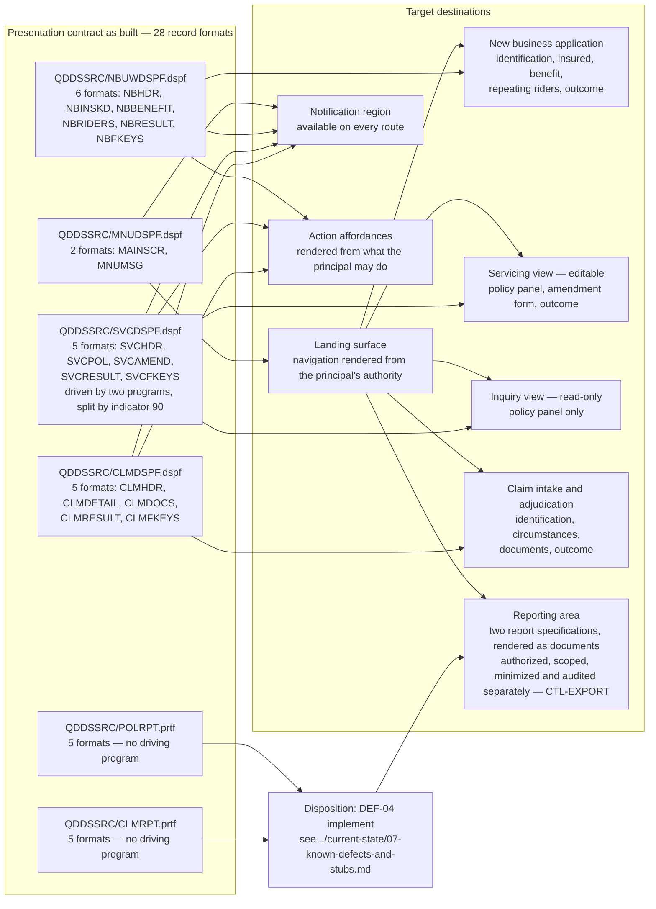

# LIFE400 UI Modernization

This document maps the presentation contract of LIFE400 onto the target's screens, routes and affordances. That contract is [DDS](../reference/glossary-ibm-i.md#dds-data-description-specifications): twenty-eight [record formats](../reference/glossary-ibm-i.md#record-format) across four [display files](../reference/glossary-ibm-i.md#display-file) and two [printer files](../reference/glossary-ibm-i.md#printer-file), every field of every one of them placed at an absolute row and column on a fixed character grid. Fourteen of those twenty-eight were documented before this assessment, by the screen reference in the repository overview [README.md:L226-L239]. **All twenty-eight are mapped here, and the fourteen that were never described are exactly the ones that carry the findings**: a message format, three command-key legends, and ten report bands that no program in the estate can reach.

**Scope.** This document owns four things and no more: the destination of every record format, the semantics of every command key, which fields and which routes the target's boundary input-safety, output-encoding and reporting controls reach, and the record — not the resolution — of the fact that no user-interface component library is specified anywhere in this assessment. Each boundary around that is drawn deliberately. It does **not** choose a component library, a styling approach, an accessibility conformance target or a responsive strategy; that gap is stated as a gap under [component selection is deferred](#component-selection-is-deferred) and is the single most load-bearing constraint on this document. It does **not** design the identity or role model that gates the navigable surface, decide what a principal may reach, or specify a security control: the two it applies to specific fields and routes below — `CTL-OUTPUT` for safe rendering of operator-supplied values and `CTL-EXPORT` for authorized, scoped and audited reporting — are specified by [the target security control design](04-security-control-design.md), which owns them. It does **not** set the target's layers, its client boundary or its application programming interface, which are owned by [the target architecture](01-target-architecture.md). It does **not** map programs or [paragraphs](../reference/glossary-ibm-i.md#paragraph) onto services and operations, which is owned by [the program-to-service map](02-program-to-service-map.md). It does **not** type a column, convert a date or settle a decimal representation, which are owned by [the target data model and schema mapping](03-target-data-model-and-schema-mapping.md) — where a screen field's target type follows from a column's, this document cites that document instead of restating it. It does **not** assign a migrate, implement or drop verb to any defect: [the known defects and stubs register](../current-state/07-known-defects-and-stubs.md) owns every disposition that overlaps this document, and each is cited by identifier below rather than re-decided. And it does **not** sequence the work: no screen below is placed before or after another, because staging is owned by the planned [recommended path](../migration/02-recommended-path.md).

**Reading the citations.** A citation of the form `[<path>:<locator>]` is plain text rather than a hyperlink, and points at a path in this repository. Plain text is chosen so that a citation stays meaningful in a diff and does not depend on a hosting provider's line-anchor syntax. The rule applied throughout is asymmetric: **every claim about the existing interface carries a citation, and no proposed target screen or route does.** A route path below is a proposal, and a proposal has nothing to cite; the format name, field name, declared type, screen position or key assignment beside it is a claim about the estate and always does. Every line number was confirmed by opening the member it cites, against the working tree rather than against a prior description of it. Platform terminology links to [the IBM i glossary](../reference/glossary-ibm-i.md) on first use in this document.

**What could not be verified, stated once.** No screen below was rendered, and none could be rendered here. The four display files and two printer files are DDS source members compiled into platform objects by the build procedure [README.md:L149-L154]; they require an IBM i to compile and a [5250 datastream](../reference/glossary-ibm-i.md#5250-datastream) endpoint to display, and no off-platform equivalent of either exists. **No screenshot of LIFE400 was supplied to this assessment and none could be produced from this repository** — which is a statement about what this repository contains, not a claim that no screenshot exists anywhere: an installation running the compiled objects can capture one, and doing so would be a useful supplement to what follows. Every statement about what a screen shows is therefore read out of the record format that defines it — which is the better source in any case, because the DDS is authoritative, versioned and citable, and an image would be none of those. The one screen depiction below is a reconstruction from declared row and column positions, marked as such.

## The target stack, consumed rather than re-derived

The language, runtime and datastore are settled by [the target-language decision matrix](../talent/02-target-language-decision-matrix.md) and recorded in the decision log. This document states the position and maps against it rather than reproducing the reasoning, so that superseding the choice means superseding one record instead of editing every document that depends on it.

- **The primary recommendation is Java on a current long-term-support release, with Spring Boot**, on PostgreSQL as the relational datastore. The runner-up is C#/.NET, recorded as a candidate rather than as a second named stack. TypeScript and Node, and Python, are evaluated and rejected for the core; Go is evaluated and not selected. The decisive criterion is exact decimal arithmetic. **No release number, framework minor or datastore major is pinned by this assessment**: [MOD-ADR-001](../decisions/MOD-ADR-001-target-language-and-runtime.md#what-this-record-fixes-and-what-it-leaves-open) fixes the language, the support line and the framework together with the rule a concrete selection must satisfy, and the datastore is decided by `MOD-ADR-003`.
- **The target is hosting-agnostic, with a containerized reference deployment**, and **exit from the AS/400 hardware is deliberately deferred and decoupled from this work**.
- **None of that names a user-interface technology, and this document does not supply one.** Spring Boot is a server-side application framework, and [the target architecture](01-target-architecture.md) is explicit that naming it implies nothing about user-interface components. The mapping below is expressed as screens, routes, fields, read-or-write nature and affordances, every one of which is satisfiable on the runner-up stack and under any component choice. That is not vagueness: a destination stated as "a route that collects these named fields, of which these are enterable and these are computed" is fully determined, and stays determined after a component library is eventually chosen.

## What the repository documented, and the fourteen formats it did not

The screen reference in the repository overview is a fourteen-row table [README.md:L226-L239]: one row for the menu, five for new business, four for claims and four for servicing. It is accurate as far as it goes, and it goes as far as the screens a user is aware of. The fourteen it omits divide into two groups, and both matter more than their absence from a user-facing table suggests.

- **Four display formats are undocumented.** The message format `MNUMSG` [QDDSSRC/MNUDSPF.dspf:L50], and the three command-key legend formats `NBFKEYS` [QDDSSRC/NBUWDSPF.dspf:L137], `SVCFKEYS` [QDDSSRC/SVCDSPF.dspf:L117] and `CLMFKEYS` [QDDSSRC/CLMDSPF.dspf:L109]. All four are reachable and all four are written by a program on a live path, so their absence from the table is a documentation gap rather than a statement about the system.
- **Ten printer formats are undocumented**, five in each printer file [QDDSSRC/POLRPT.prtf:L15-L64], [QDDSSRC/CLMRPT.prtf:L15-L58]. These are undocumented *and* unreachable, which is a different finding and is set out under [the ten printer formats no program can reach](#the-ten-printer-formats-no-program-can-reach).

Fourteen documented plus fourteen undocumented is twenty-eight, and the split is not arbitrary: **the repository documented every format a user selects into and none of the formats the system emits on its own account.** A key legend is emitted, a message is emitted, and a report band would be emitted; none of the three is something an operator navigates to.

**One correction to the inherited description, recorded rather than absorbed.** `MNUMSG` has been described elsewhere as a message subfile. It is not a subfile: searching all ten DDS members for `SFL` and `SUBFILE` returns no occurrence of either, and the format itself declares one constant `'==>'` and one 74-character field on the bottom row of the grid [QDDSSRC/MNUDSPF.dspf:L50-L55]. It is a single-line message format. The distinction is recorded because it changes the destination — a subfile would map to a scrollable list, and a one-line message format maps to a notification region — and because a mapping that inherits an inaccurate description of its own source cannot be checked against the source.

## The four kinds of record format, defined once

The kind column in the table below takes exactly one of four values. They are defined here so the table can be read without inference, and they are properties of the estate rather than categories imposed on it.

- **screen** — a format an operator sees and, in most cases, types into. It is written to the device and usually read back, so it carries both a rendering and an input contract.
- **message** — a format that carries a diagnostic or notification and nothing else. It is written, never read back.
- **key legend** — a format whose entire content is constant text describing which command keys are active. It renders no data field at all and reads nothing.
- **report** — a band of a printer file: a page heading, a column heading, a detail line, a total line or a page footer. Reports are emitted to spooled output rather than to a display, and in this estate none of them is emitted at all.

## Every record format and its destination

Twenty-eight rows: 2 + 6 + 5 + 5 + 5 + 5 = 28. Every format in the estate appears exactly once.

| Member | Record format | Citation | Kind | Target screen or route | Notes |
|---|---|---|---|---|---|
| `QDDSSRC/MNUDSPF.dspf` | `MAINSCR` | [QDDSSRC/MNUDSPF.dspf:L19] | screen | The authenticated landing surface | Six option literals compiled into the format [QDDSSRC/MNUDSPF.dspf:L30-L35] become a navigable surface filtered by the principal's authority, not a fixed list. See [the menu becomes a role-gated navigable surface](#the-menu-becomes-a-role-gated-navigable-surface) |
| `QDDSSRC/MNUDSPF.dspf` | `MNUMSG` | [QDDSSRC/MNUDSPF.dspf:L50] | message | A notification region available on every route, not a destination | Written on two paths, both from the menu program: the unimplemented reports option [QCBLLESRC/MAINMENU.cbl:L81-L83] and an invalid selection [QCBLLESRC/MAINMENU.cbl:L87-L89] |
| `QDDSSRC/NBUWDSPF.dspf` | `NBHDR` | [QDDSSRC/NBUWDSPF.dspf:L24] | screen | New business application, identification step | Six fields, all enterable; written and read by [QCBLLESRC/NBUWMNT.cbl:L99-L100] |
| `QDDSSRC/NBUWDSPF.dspf` | `NBINSKD` | [QDDSSRC/NBUWDSPF.dspf:L50] | screen | New business application, insured step | Eight fields, all enterable, including one the system is meant to set [QDDSSRC/NBUWDSPF.dspf:L71-L73]; written and read by [QCBLLESRC/NBUWMNT.cbl:L112-L113] |
| `QDDSSRC/NBUWDSPF.dspf` | `NBBENEFIT` | [QDDSSRC/NBUWDSPF.dspf:L84] | screen | New business application, benefit step | Two fields; written and read by [QCBLLESRC/NBUWMNT.cbl:L128-L129] |
| `QDDSSRC/NBUWDSPF.dspf` | `NBRIDERS` | [QDDSSRC/NBUWDSPF.dspf:L96] | screen | New business application, rider step, as a repeating collection | Three fixed rows under a label promising five [QDDSSRC/NBUWDSPF.dspf:L97]. See [the rider section](#the-rider-section-a-label-a-layout-and-an-engine-that-conflict) |
| `QDDSSRC/NBUWDSPF.dspf` | `NBRESULT` | [QDDSSRC/NBUWDSPF.dspf:L116] | screen | New business application outcome view | Five output-only fields; occupies the same grid rows as `NBRIDERS`, so the two are mutually exclusive on the device |
| `QDDSSRC/NBUWDSPF.dspf` | `NBFKEYS` | [QDDSSRC/NBUWDSPF.dspf:L137] | key legend | No destination of its own; the actions each route offers | Five constant legends [QDDSSRC/NBUWDSPF.dspf:L138-L147], two of which describe keys nothing handles |
| `QDDSSRC/SVCDSPF.dspf` | `SVCHDR` | [QDDSSRC/SVCDSPF.dspf:L23] | screen | Splits: the servicing view's lookup, and the inquiry view's lookup | The format renders one of two titles depending on one [indicator](../reference/glossary-ibm-i.md#indicator) [QDDSSRC/SVCDSPF.dspf:L26], [QDDSSRC/SVCDSPF.dspf:L28]. See [one display file, two programs, two target views](#one-display-file-two-programs-two-target-views) |
| `QDDSSRC/SVCDSPF.dspf` | `SVCPOL` | [QDDSSRC/SVCDSPF.dspf:L39] | screen | The policy summary panel of both target views | Eleven fields, every one output-only, written by the servicing program [QCBLLESRC/SVCMNT.cbl:L132] and by the inquiry program [QCBLLESRC/POLMSTINQ.cbl:L125] |
| `QDDSSRC/SVCDSPF.dspf` | `SVCAMEND` | [QDDSSRC/SVCDSPF.dspf:L78] | screen | The amendment form, on the servicing view only | The one format the inquiry program never writes, which is what makes the split clean |
| `QDDSSRC/SVCDSPF.dspf` | `SVCRESULT` | [QDDSSRC/SVCDSPF.dspf:L96] | screen | Amendment outcome on the servicing view; the not-found notification on the inquiry view | Two roles in one format today: an outcome [QCBLLESRC/SVCMNT.cbl:L446] and a message the inquiry program borrows it for [QCBLLESRC/POLMSTINQ.cbl:L74-L75] |
| `QDDSSRC/SVCDSPF.dspf` | `SVCFKEYS` | [QDDSSRC/SVCDSPF.dspf:L117] | key legend | No destination of its own; two action sets, one per target view | Already conditioned in DDS: two legends under the indicator [QDDSSRC/SVCDSPF.dspf:L118-L121], four without it [QDDSSRC/SVCDSPF.dspf:L122-L129] |
| `QDDSSRC/CLMDSPF.dspf` | `CLMHDR` | [QDDSSRC/CLMDSPF.dspf:L21] | screen | Claim intake, identification step | Five fields, three enterable and two output-only; written and read by [QCBLLESRC/CLMMNT.cbl:L108-L109] |
| `QDDSSRC/CLMDSPF.dspf` | `CLMDETAIL` | [QDDSSRC/CLMDSPF.dspf:L43] | screen | Claim intake, circumstances step | Six enterable fields; written and read by [QCBLLESRC/CLMMNT.cbl:L125-L126] |
| `QDDSSRC/CLMDSPF.dspf` | `CLMDOCS` | [QDDSSRC/CLMDSPF.dspf:L68] | screen | Claim intake, document checklist step | Four single-character yes-or-no fields [QDDSSRC/CLMDSPF.dspf:L72-L84] |
| `QDDSSRC/CLMDSPF.dspf` | `CLMRESULT` | [QDDSSRC/CLMDSPF.dspf:L90] | screen | Adjudication outcome view | Four output-only fields; also written before intake completes, to report a rejected lookup [QCBLLESRC/CLMMNT.cbl:L84] |
| `QDDSSRC/CLMDSPF.dspf` | `CLMFKEYS` | [QDDSSRC/CLMDSPF.dspf:L109] | key legend | No destination of its own; the actions the claim routes offer | Three constant legends [QDDSSRC/CLMDSPF.dspf:L110-L115] |
| `QDDSSRC/POLRPT.prtf` | `POLRPTHDR` | [QDDSSRC/POLRPT.prtf:L15] | report | Page heading of the target's policy-master listing | Carries the superseded company name [QDDSSRC/POLRPT.prtf:L16] and the report's own identifier [QDDSSRC/POLRPT.prtf:L23]. Unreachable; DEF-04 |
| `QDDSSRC/POLRPT.prtf` | `POLRPTCOL` | [QDDSSRC/POLRPT.prtf:L26] | report | Column headings of that listing | Eight column headings [QDDSSRC/POLRPT.prtf:L27-L34] naming the exact projection the report was to carry. Unreachable; DEF-04 |
| `QDDSSRC/POLRPT.prtf` | `POLRPTDET` | [QDDSSRC/POLRPT.prtf:L45] | report | Detail row of that listing | Eight fields, and the only place in the presentation contract where money is declared numerically [QDDSSRC/POLRPT.prtf:L50-L52]. Unreachable; DEF-04 |
| `QDDSSRC/POLRPT.prtf` | `POLRPTTOT` | [QDDSSRC/POLRPT.prtf:L55] | report | Totals band of that listing | A policy count and two summed money fields [QDDSSRC/POLRPT.prtf:L57-L62] — an aggregate no program in the estate computes. Unreachable; DEF-04 |
| `QDDSSRC/POLRPT.prtf` | `POLRPTFTR` | [QDDSSRC/POLRPT.prtf:L64] | report | End-of-report band | Two constants, one of them the qualified object name [QDDSSRC/POLRPT.prtf:L66]. Unreachable; DEF-04 |
| `QDDSSRC/CLMRPT.prtf` | `CLMRPTHDR` | [QDDSSRC/CLMRPT.prtf:L15] | report | Page heading of the target's claims adjudication report | Carries the superseded company name [QDDSSRC/CLMRPT.prtf:L16] and its own identifier [QDDSSRC/CLMRPT.prtf:L23]. Unreachable; DEF-04 |
| `QDDSSRC/CLMRPT.prtf` | `CLMRPTCOL` | [QDDSSRC/CLMRPT.prtf:L26] | report | Column headings of that report | Seven column headings [QDDSSRC/CLMRPT.prtf:L27-L33] |
| `QDDSSRC/CLMRPT.prtf` | `CLMRPTDET` | [QDDSSRC/CLMRPT.prtf:L42] | report | Detail row of that report | Seven fields including a numeric settlement amount and a numeric settlement date [QDDSSRC/CLMRPT.prtf:L48-L49]. Unreachable; DEF-04 |
| `QDDSSRC/CLMRPT.prtf` | `CLMRPTTOT` | [QDDSSRC/CLMRPT.prtf:L51] | report | Totals band of that report | A claim count and a total paid [QDDSSRC/CLMRPT.prtf:L53-L56]. Unreachable; DEF-04 |
| `QDDSSRC/CLMRPT.prtf` | `CLMRPTFTR` | [QDDSSRC/CLMRPT.prtf:L58] | report | End-of-report band | Two constants [QDDSSRC/CLMRPT.prtf:L59-L60]. Unreachable; DEF-04 |

Three properties of that table are worth reading off it rather than leaving in it.

- **Eighteen display formats, and all eighteen are reachable.** Every one is written by a program on a live path, which the format-by-format citations above establish individually. The presentation layer has no dead screen.
- **Ten report formats, and not one of them is reachable.** Over a third of the presentation contract describes output the running system cannot produce.
- **Three formats map to two destinations rather than one, and four map to none.** `SVCHDR`, `SVCPOL` and `SVCRESULT` are each written by two different programs and split across two target views. The three key legends and the one message format have no destination of their own, because a legend and a notification are properties of a route rather than routes themselves.

**The notification channel is a format in one file and a field in the other three.** Only the menu display file has a message format of its own [QDDSSRC/MNUDSPF.dspf:L50]; the other three carry a 74-character message field inside their result format instead — `NBMSG` [QDDSSRC/NBUWDSPF.dspf:L132], `SVCMSG` [QDDSSRC/SVCDSPF.dspf:L112] and `CLMSG` [QDDSSRC/CLMDSPF.dspf:L104] — and each of the three programs writes the whole result format merely to deliver a lookup failure [QCBLLESRC/SVCMNT.cbl:L85-L88], [QCBLLESRC/CLMMNT.cbl:L81-L84], [QCBLLESRC/POLMSTINQ.cbl:L74-L75]. So a validation message and an adjudication outcome travel in the same envelope today, and a failed lookup renders an otherwise empty outcome panel. In the target these separate: a notification is a notification on any route, and an outcome view renders only when there is an outcome. This is the one place where the mapping deliberately does not preserve the estate's structure, and the reason is that the structure is an artifact of having one write per format rather than a design.

## The fixed character grid, and why this mapping is not a layout

Every display file in the estate declares the same device geometry: twenty-four rows by eighty columns [QDDSSRC/MNUDSPF.dspf:L12], [QDDSSRC/NBUWDSPF.dspf:L14], [QDDSSRC/SVCDSPF.dspf:L14], [QDDSSRC/CLMDSPF.dspf:L13]. Every constant and every field inside every format is placed at an absolute row and column. There is no layout engine, no flow, no wrapping and no notion of a viewport: a field is at row 15 column 33 because the source says so [QDDSSRC/MNUDSPF.dspf:L39].

The reconstruction below is the menu format read out of its own declarations — the constants and their positions from [QDDSSRC/MNUDSPF.dspf:L20-L46], plus the message format's single row from [QDDSSRC/MNUDSPF.dspf:L51-L53]. Underscores mark the extent of a field rather than characters the screen prints, and the date is shown in the six-digit form the program moves into it [QCBLLESRC/MAINMENU.cbl:L55-L56]. It is a reconstruction, not a capture; no screenshot of this system exists in this assessment.

```text
              1         2         3         4         5         6         7         8
     12345678901234567890123456789012345678901234567890123456789012345678901234567890
  1   LIFE400                     LINCOLN LIFE INSURANCE CO.         DATE: MMDDYY
  2                            TERM LIFE POLICY SYSTEM
  3    ____________________________________________
  4
  5                     1.  New Business / Policy Issuance
  6                     2.  Policy Servicing and Amendments
  7                     3.  Claims Adjudication
  8                     4.  Policy Master Inquiry
  9                     5.  Reports Menu
 10
 11                     90.  Sign Off
 12
 13    ____________________________________________
 14
 15                     Selection . .__
 16
 17
 18
 19
 20
 21
 22
 23   F3=Exit   F12=Cancel                                 USER: __________
 24   ==> __________________________________________________________________________
```

Four things are visible in that grid that are not visible in a field list, and each is a mapping input.

- **The whole navigable surface is text.** Five options and a sign-off are constants inside a compiled screen [QDDSSRC/MNUDSPF.dspf:L30-L35]. Nothing about them is data, so nothing about them can vary at run time.
- **Row 24 belongs to a different format.** `MAINSCR` occupies rows 1 to 23 and `MNUMSG` occupies row 24 alone [QDDSSRC/MNUDSPF.dspf:L51-L53], which is how two formats coexist on one device without overlapping.
- **Elsewhere two formats deliberately do overlap.** `NBRIDERS` starts at grid row 17 [QDDSSRC/NBUWDSPF.dspf:L97] and so does `NBRESULT` [QDDSSRC/NBUWDSPF.dspf:L117]; they occupy the same rows and are therefore mutually exclusive on the display. The same pattern holds in the servicing file, where the amendment section starts at row 12 [QDDSSRC/SVCDSPF.dspf:L79] and the result section at row 17 [QDDSSRC/SVCDSPF.dspf:L97]. A target that renders an outcome does not have to displace the input that produced it, so this constraint simply disappears rather than being carried across.
- **Rows 16 to 22 are empty because the grid has them, not because a design wanted whitespace there.** Field placement in this estate is an allocation of a fixed resource.

**The target is not bound by any of it**, and that is precisely why the field-level mapping below is expressed as fields, their declared width and their read-or-write nature rather than as coordinates. Carrying row and column numbers into a target that has neither would import a constraint as though it were a requirement. What does carry across is everything the grid encodes incidentally: which fields belong together, which are entered and which are computed, and the order an operator meets them in.

## The presentation layer is entirely untyped

**Every field in all four display files is declared alphanumeric, with exactly one exception.** Money is alphanumeric, dates are alphanumeric, ages are alphanumeric, and codes are alphanumeric. The exception is the menu's display date, declared as six-digit [zoned decimal](../reference/glossary-ibm-i.md#zoned-decimal) with an edit code [QDDSSRC/MNUDSPF.dspf:L25] — one numeric field out of every field the four display files declare between them.

The seven fields where this matters most are the ones carrying money and dates through the interface:

| Field | Declared | Citation | What it actually carries |
|---|---|---|---|
| `NBSUMASR` | 15A, enterable | [QDDSSRC/NBUWDSPF.dspf:L88] | The sum assured an applicant is underwritten for |
| `NBMODPRM` | 15A, output-only | [QDDSSRC/NBUWDSPF.dspf:L126] | The modal premium the rating engine computed |
| `NBANPREM` | 15A, output-only | [QDDSSRC/NBUWDSPF.dspf:L129] | The total annual premium |
| `NBPRCDT` | 8A, enterable | [QDDSSRC/NBUWDSPF.dspf:L38] | A process date in eight-digit form |
| `SVCSUMASR` | 15A, output-only | [QDDSSRC/SVCDSPF.dspf:L52] | The in-force sum assured |
| `SVCMODPRM` | 15A, output-only | [QDDSSRC/SVCDSPF.dspf:L55] | The in-force modal premium |
| `CLPYMTAM` | 15A, output-only | [QDDSSRC/CLMDSPF.dspf:L98] | The settlement amount paid on a death claim |

The consequence is that **money and dates cross the screen boundary as characters in both directions, and the programs format and parse them**. Both directions are visible in the source:

- **Inbound.** The new-business program moves the alphanumeric sum-assured field straight into the numeric contract item [QCBLLESRC/NBUWMNT.cbl:L130-L131], and does the same for a rider's sum assured [QCBLLESRC/NBUWMNT.cbl:L147]. Whatever an operator typed is what arrives.
- **Outbound.** The same program moves computed numeric premiums into alphanumeric result fields [QCBLLESRC/NBUWMNT.cbl:L212-L213], and the inquiry program moves the stored sum assured and modal premium out the same way [QCBLLESRC/POLMSTINQ.cbl:L116-L117] along with three eight-digit dates [QCBLLESRC/POLMSTINQ.cbl:L121-L123].

**The unreachable printer files are the only place in the presentation contract where a computed money or date value is declared with a numeric type** — and the claim is worth stating exactly that narrowly, because neither surface is uniform. What the two report layouts establish is this and no more: the policy listing declares its three detail money fields as fifteen-digit zoned decimal with two decimals and an edit code [QDDSSRC/POLRPT.prtf:L50-L52], its two money totals and its policy count the same way [QDDSSRC/POLRPT.prtf:L57], [QDDSSRC/POLRPT.prtf:L60], [QDDSSRC/POLRPT.prtf:L62], and its page number numerically [QDDSSRC/POLRPT.prtf:L21]; the claims report declares a numeric settlement amount and an eight-digit numeric settlement date [QDDSSRC/CLMRPT.prtf:L48-L49] and numeric count and total fields [QDDSSRC/CLMRPT.prtf:L53], [QDDSSRC/CLMRPT.prtf:L56].

Two qualifications keep that from becoming the broader claim that the reports are typed and the screens are not.

- **The reports are typed in their detail and totals bands only.** Each one declares its own page-heading date as eight alphanumeric characters — [QDDSSRC/POLRPT.prtf:L19] and [QDDSSRC/CLMRPT.prtf:L19] — so the same member that types a settlement date numerically leaves the date printed at the top of every page untyped. Their identifier, name, code and decision fields are alphanumeric throughout, as the equivalent screen fields are.
- **The screens are not uniformly untyped either**, for the one exception already named: the menu's display date is zoned decimal with an edit code [QDDSSRC/MNUDSPF.dspf:L25]. One numeric field on a screen and one alphanumeric date in each report is a smaller and more accurate statement than a typed surface against an untyped one.

What survives both qualifications is the part that matters for the mapping: **every monetary value and every computed date that crosses an interactive screen does so as characters**, and the only counter-examples anywhere in the presentation contract are in output no program can produce.

**What the target gains, and what it inherits.** Typed inputs, server-side validation against a declared type, and locale-aware formatting are all properties the DDS layer never had, and the target acquires them at the boundary rather than inside the programs. Two qualifications keep that from being overstated:

- **The types themselves are not this document's to choose.** Which target type each field takes follows from the column behind it, and that mapping — exact decimal for money, a real date type for the eight-digit integers, and the explicit rule that no monetary value passes through binary floating point — is owned by [the target data model and schema mapping](03-target-data-model-and-schema-mapping.md) and to be recorded in the planned [MOD-ADR-006, date and decimal representation](../decisions/MOD-ADR-006-date-and-decimal-representation.md). This document names the field and its read-or-write nature; that document names the type.
- **Typing the boundary removes a class of defect rather than a class of complaint.** Every format-and-parse step between a character field and a numeric item is a place a value can be truncated, right-shifted or silently accepted, and the estate has no test of any kind that would notice. Typed inputs are therefore a correctness measure first and a usability measure second.

## Input-capable and output-only are a usage code, not a structure

DDS expresses whether a field can be typed into with a one-character usage code, not with any structural difference. A field marked `B` is both output and input; a field with no usage code is output only. Nothing else in the format distinguishes them — same syntax, same position, same declaration, one character apart.

The distinction is applied consistently across the estate, and it is the read-and-write contract the target's field-level mapping inherits:

- **Enterable fields carry `B`.** The menu's selection field [QDDSSRC/MNUDSPF.dspf:L39], every field of the new-business header and insured sections [QDDSSRC/NBUWDSPF.dspf:L31-L46], [QDDSSRC/NBUWDSPF.dspf:L54-L79], the amendment fields [QDDSSRC/SVCDSPF.dspf:L82-L90] and the whole claim intake [QDDSSRC/CLMDSPF.dspf:L47-L84].
- **Result fields carry none.** The new-business return code [QDDSSRC/NBUWDSPF.dspf:L120] and the four fields beside it, the rider status fields [QDDSSRC/NBUWDSPF.dspf:L104], [QDDSSRC/NBUWDSPF.dspf:L108], [QDDSSRC/NBUWDSPF.dspf:L112], the entire eleven-field policy panel [QDDSSRC/SVCDSPF.dspf:L43-L73], the claim's policy status and insured name [QDDSSRC/CLMDSPF.dspf:L35], [QDDSSRC/CLMDSPF.dspf:L38], and every field of both result formats [QDDSSRC/SVCDSPF.dspf:L100-L112], [QDDSSRC/CLMDSPF.dspf:L94-L104].
- **The signed-on user is output-only on the one screen that shows it.** The menu's user field carries no usage code [QDDSSRC/MNUDSPF.dspf:L45], so the identity the program captured [QCBLLESRC/MAINMENU.cbl:L57-L58] is displayed and cannot be altered from the screen. That property is worth keeping; what the estate does with the identity afterwards is a security finding rather than a presentation one, and is owned by [the target security control design](04-security-control-design.md).

**One field contradicts its own usage code, and the contradiction is a mapping input.** The underwriting class field is declared enterable [QDDSSRC/NBUWDSPF.dspf:L71] while the constant printed immediately beside it tells the operator the system sets it [QDDSSRC/NBUWDSPF.dspf:L73] — and the program does set it, unconditionally to a default first [QCBLLESRC/NBUWMNT.cbl:L341] and then from smoker status, occupation class, issue age and avocation [QCBLLESRC/NBUWMNT.cbl:L342-L356]. So the screen accepts a value for a field the program overwrites. In the target this is a derived, non-enterable field with its derivation shown, which is what the screen already says in words and does not enforce.

## Field-level mapping

Four tables follow, one per display file. Each row is a declared field, its DDS declaration, its read-or-write nature today and its destination in the target. The target column names a field and its behaviour, never a component. Where a target type is implied it is the type the underlying column takes, which is owned by [the target data model and schema mapping](03-target-data-model-and-schema-mapping.md); reading a type into this table from the fifteen characters a field is declared with would be reading it from the wrong place.

**Where a process date comes from, stated once for all four tables.** Three of the tables carry an eight-digit process-date field — new business [QDDSSRC/NBUWDSPF.dspf:L38], servicing and inquiry [QDDSSRC/SVCDSPF.dspf:L35], claims [QDDSSRC/CLMDSPF.dspf:L33] — and every one of them is enterable today, so the date a piece of work is dated by is whatever an operator types. Behind the screen, each program that needs that date reads the date of the job it happens to be running in [QCBLLESRC/NBUWMNT.cbl:L98], [QCBLLESRC/SVCMNT.cbl:L108], [QCBLLESRC/CLMMNT.cbl:L107], [QCBLLESRC/POLMSTINQ.cbl:L90]. **The target does neither.** Each of the three fields is prefilled from the one authoritative service-side [business clock](01-target-architecture.md#the-business-clock-and-time-zone) that the target architecture requires as declared deployment configuration — never from the browser, the workstation or a container's local clock, none of which is a defined business date in a hosting-agnostic target — and a date the operator changes is treated as an **authorized, audited override** rather than as an ordinary input: it is offered only to a principal permitted to back-date, the service revalidates it and may refuse it, and the value is recorded with the identity that used it. "Prefilled from the business clock" in the three target cells below means exactly that, and nothing weaker. The precision is not presentational. These three fields decide stored business dates and stored outcomes: the process date **becomes** the issue, effective and paid-to dates a policy carries [QCBLLESRC/NBUWB.cbl:L490-L492], it is the basis of the attained-age and days-since-paid arithmetic behind grace and lapse [QCBLLESRC/SVCBILB.cbl:L189-L191], [QCBLLESRC/SVCBILB.cbl:L198-L199], and it becomes the adjudication and settlement dates of a claim [QCBLLESRC/CLMMNT.cbl:L274-L275]. A screen that quietly supplied its own idea of today would therefore change outcomes rather than labels — what those calculations are is owned by [the business rule inventory](../current-state/05-business-rule-inventory.md), and where the date they consume comes from is owned by [the target architecture](01-target-architecture.md#the-business-clock-and-time-zone).

### Menu and message fields

| Field | DDS declaration | Citation | Today | Target |
|---|---|---|---|---|
| `MNUDATE` | 6S 0, edit code, output-only | [QDDSSRC/MNUDSPF.dspf:L25] | The only numeric field in any display file; receives a six-digit date from the program [QCBLLESRC/MAINMENU.cbl:L55-L56] | Not a field at all. A session context date rendered by the client from a real date value, in one representation rather than the estate's two |
| `MNUSEL` | 2A, enterable | [QDDSSRC/MNUDSPF.dspf:L39] | The whole navigation mechanism: two characters compared against six literals [QCBLLESRC/MAINMENU.cbl:L71-L90] | Removed. Navigation becomes selection of a route the principal is authorized for, not entry of a code |
| `MNUUSER` | 10A, output-only | [QDDSSRC/MNUDSPF.dspf:L45] | Displays the signed-on profile [QCBLLESRC/MAINMENU.cbl:L57-L58] and nothing else uses it | The authenticated principal, displayed and — unlike today — carried into every request and every audit record |
| `MNUMSGD` | 74A, output-only | [QDDSSRC/MNUDSPF.dspf:L53] | Carries an invalid-selection or not-implemented message [QCBLLESRC/MAINMENU.cbl:L81-L89] | A notification, typed by severity, available on any route rather than on one row of one screen |

### New business fields

| Field | DDS declaration | Citation | Today | Target |
|---|---|---|---|---|
| `NBPOLID` | 12A, enterable | [QDDSSRC/NBUWDSPF.dspf:L31] | Operator-supplied policy identifier, the key every write depends on | Enterable on the identification step, validated against the key format before submission |
| `NBAPPID` | 12A, enterable | [QDDSSRC/NBUWDSPF.dspf:L33] | Application identifier | Enterable, unchanged in nature |
| `NBPLANC` | 5A, enterable | [QDDSSRC/NBUWDSPF.dspf:L35] | Plan code, typed free-hand; a prompt is advertised beside it [QDDSSRC/NBUWDSPF.dspf:L39] and no key implements one | A selection from the target's plan reference data, which is the lookup the advertised prompt promised |
| `NBPRCDT` | 8A, enterable | [QDDSSRC/NBUWDSPF.dspf:L38] | Eight-digit process date as characters, marked as a Y2K-reviewed field by the comment above it [QDDSSRC/NBUWDSPF.dspf:L37] | A typed date input, prefilled from the service-side [business clock](01-target-architecture.md#the-business-clock-and-time-zone) rather than typed by an operator or read from a host clock; changing it is an authorized, audited override |
| `NBISSCHN` | 2A, enterable | [QDDSSRC/NBUWDSPF.dspf:L42] | Issue channel, with its three valid values printed beside it as a constant [QDDSSRC/NBUWDSPF.dspf:L44] | A constrained choice over the same three values, enforced rather than printed |
| `NBCURCD` | 3A, enterable | [QDDSSRC/NBUWDSPF.dspf:L46] | Currency code | A constrained choice; the domain is owned by the schema mapping |
| `NBINSNAM` | 40A, enterable | [QDDSSRC/NBUWDSPF.dspf:L54] | Insured name, personal data entering the system in clear text | Enterable, validated and rendered under [boundary input safety and output encoding](#boundary-input-safety-and-output-encoding-on-every-rendering-path), with the field-level protection designed by [the target security control design](04-security-control-design.md) |
| `NBINSDOB` | 8A, enterable | [QDDSSRC/NBUWDSPF.dspf:L57] | Eight-digit date of birth as characters. **It is the only age-related input the screen has** — no field on any format captures an issue age, yet the rating engine tests one against the plan bounds [QCBLLESRC/NBUWB.cbl:L231-L232], bands the mortality rate on it [QCBLLESRC/NBUWB.cbl:L304-L310] and gates rider eligibility with it [QCBLLESRC/NBUWB.cbl:L360], while no statement in the estate assigns it — `DEF-05` | A typed date input with a real date validation, not an eight-digit integer that happens to parse. **The issue age is derived from it and the issue date, displayed back as a derived value, and validated against the plan version's bounds before the application is priced.** The derivation, its as-of date and its legacy-parity treatment are owned by [the target data model and schema mapping](03-target-data-model-and-schema-mapping.md); this document records only that the interface captures the date of birth and shows the derived age rather than accepting one |
| `NBGENDER` | 1A, enterable | [QDDSSRC/NBUWDSPF.dspf:L59] | One character, valid values printed beside it [QDDSSRC/NBUWDSPF.dspf:L61] | A constrained choice over the declared domain |
| `NBSMOKER` | 1A, enterable | [QDDSSRC/NBUWDSPF.dspf:L63] | One character, valid values printed beside it [QDDSSRC/NBUWDSPF.dspf:L65] | A constrained choice; a rating input, so its validity is enforced before rating rather than during |
| `NBOCCLAS` | 1A, enterable | [QDDSSRC/NBUWDSPF.dspf:L67] | Occupation class, its four values printed beside it [QDDSSRC/NBUWDSPF.dspf:L69] | A constrained choice over the four declared classes |
| `NBUWCLAS` | 2A, enterable | [QDDSSRC/NBUWDSPF.dspf:L71] | Enterable, yet stated to be system-set [QDDSSRC/NBUWDSPF.dspf:L73] and overwritten by the program [QCBLLESRC/NBUWMNT.cbl:L341] | Derived and non-enterable, displayed with the reason it was derived |
| `NBHIRAVOC` | 1A, enterable | [QDDSSRC/NBUWDSPF.dspf:L75] | High-risk avocation flag | A boolean input; a rating and referral input |
| `NBFLTXTR` | 6A, enterable | [QDDSSRC/NBUWDSPF.dspf:L79] | Flat extra, a rate per thousand [QDDSSRC/NBUWDSPF.dspf:L80] carried as six characters | A typed decimal input, per the schema mapping's rate typing |
| `NBSUMASR` | 15A, enterable | [QDDSSRC/NBUWDSPF.dspf:L88] | Money as characters, moved into a numeric item unchecked [QCBLLESRC/NBUWMNT.cbl:L130-L131] | A typed exact-decimal input with a declared scale |
| `NBBILMOD` | 1A, enterable | [QDDSSRC/NBUWDSPF.dspf:L90] | Billing mode, four values printed beside it [QDDSSRC/NBUWDSPF.dspf:L92] | A constrained choice; it determines the modal premium, so it is validated before rating |
| `NBRID1CD` `NBRID2CD` `NBRID3CD` | 5A, enterable | [QDDSSRC/NBUWDSPF.dspf:L102], [QDDSSRC/NBUWDSPF.dspf:L106], [QDDSSRC/NBUWDSPF.dspf:L110] | Three fixed rider code slots | One repeating rider row, code selected from rider reference data |
| `NBRID1SA` `NBRID2SA` `NBRID3SA` | 15A, enterable | [QDDSSRC/NBUWDSPF.dspf:L103], [QDDSSRC/NBUWDSPF.dspf:L107], [QDDSSRC/NBUWDSPF.dspf:L111] | Rider sums assured as characters, moved into numeric items [QCBLLESRC/NBUWMNT.cbl:L147] | Typed exact-decimal input per rider row |
| `NBRID1ST` `NBRID2ST` `NBRID3ST` | 1A, output-only | [QDDSSRC/NBUWDSPF.dspf:L104], [QDDSSRC/NBUWDSPF.dspf:L108], [QDDSSRC/NBUWDSPF.dspf:L112] | Declared for a rider status and **never written by any program** — the three names appear in the DDS and nowhere in `QCBLLESRC/`, so the fields are output-only and always blank. The value they were declared for does exist at run time: the contract defines active and removed [QCPYSRC/POLDATA.cpy:L95-L96] and six statements set it [QCBLLESRC/NBUWMNT.cbl:L433], [QCBLLESRC/NBUWB.cbl:L410], [QCBLLESRC/SVCMNT.cbl:L289], [QCBLLESRC/SVCMNT.cbl:L304], [QCBLLESRC/SVCBILB.cbl:L358], [QCBLLESRC/SVCBILB.cbl:L377] | A derived per-row status, rendered from the rider entity the target persists. **This is a correction rather than a port**: the target displays a value the estate computes, shows nowhere and stores nowhere |
| `NBRETCD` | 2A, output-only | [QDDSSRC/NBUWDSPF.dspf:L120] | The numeric result code, rendered as characters [QCBLLESRC/NBUWMNT.cbl:L210] | Not a screen field. An outcome the client interprets, from the typed result the service returns |
| `NBCNTRST` | 2A, output-only | [QDDSSRC/NBUWDSPF.dspf:L123] | Contract status after issue | A rendered status value over the target's declared status domain |
| `NBMODPRM` | 15A, output-only | [QDDSSRC/NBUWDSPF.dspf:L126] | Computed modal premium as characters [QCBLLESRC/NBUWMNT.cbl:L212] | A formatted exact-decimal money value, formatted at the boundary |
| `NBANPREM` | 15A, output-only | [QDDSSRC/NBUWDSPF.dspf:L129] | Computed annual premium as characters [QCBLLESRC/NBUWMNT.cbl:L213] | A formatted exact-decimal money value |
| `NBMSG` | 74A, output-only | [QDDSSRC/NBUWDSPF.dspf:L132] | The result message [QCBLLESRC/NBUWMNT.cbl:L214], rendered in red | A typed notification carrying the same text and a severity the colour currently implies |

### Servicing and inquiry fields

Both target views draw on this table. The right-hand column names which of the two renders each field, and the rule behind the split is set out under [one display file, two programs, two target views](#one-display-file-two-programs-two-target-views).

| Field | DDS declaration | Citation | Today | Target |
|---|---|---|---|---|
| `SVCPOLID` | 12A, enterable | [QDDSSRC/SVCDSPF.dspf:L32] | Policy key, entered on both paths | Enterable on both views; on the inquiry view it is a search, on the servicing view a selection to act on |
| `SVCPRCDT` | 8A, enterable | [QDDSSRC/SVCDSPF.dspf:L35] | Eight-digit process date; the inquiry program fills it from the system date before displaying [QCBLLESRC/POLMSTINQ.cbl:L90] | A typed date on both views, prefilled from the service-side [business clock](01-target-architecture.md#the-business-clock-and-time-zone): a rendered context date with no override on the inquiry view, because nothing there is dated by it, and an authorized, audited override on the servicing view |
| `SVCPLANC` | 5A, output-only | [QDDSSRC/SVCDSPF.dspf:L43] | In-force plan code [QCBLLESRC/POLMSTINQ.cbl:L113] | Rendered on both views |
| `SVCCNTRST` | 2A, output-only | [QDDSSRC/SVCDSPF.dspf:L46] | Contract status [QCBLLESRC/POLMSTINQ.cbl:L114] | Rendered on both views, over the declared status domain |
| `SVCBILMD` | 1A, output-only | [QDDSSRC/SVCDSPF.dspf:L49] | Billing mode | Rendered on both views |
| `SVCSUMASR` | 15A, output-only | [QDDSSRC/SVCDSPF.dspf:L52] | Money as characters [QCBLLESRC/POLMSTINQ.cbl:L116] | Formatted exact-decimal money on both views |
| `SVCMODPRM` | 15A, output-only | [QDDSSRC/SVCDSPF.dspf:L55] | Money as characters [QCBLLESRC/POLMSTINQ.cbl:L117] | Formatted exact-decimal money on both views |
| `SVCINSNAM` | 40A, output-only | [QDDSSRC/SVCDSPF.dspf:L58] | Insured name in clear text [QCBLLESRC/POLMSTINQ.cbl:L118] | Rendered subject to the field-level access control designed by [the target security control design](04-security-control-design.md) |
| `SVCISSAGE` | 3A, output-only | [QDDSSRC/SVCDSPF.dspf:L61] | Issue age [QCBLLESRC/POLMSTINQ.cbl:L119] | Rendered on both views |
| `SVCATTNAG` | 3A, output-only | [QDDSSRC/SVCDSPF.dspf:L64] | Attained age [QCBLLESRC/POLMSTINQ.cbl:L120] | Rendered on both views; the estate recomputes it each run rather than storing it, so the target renders a derived value, per the schema mapping |
| `SVCISSDT` `SVCEXPDT` `SVCPAIDTO` | 8A, output-only | [QDDSSRC/SVCDSPF.dspf:L67], [QDDSSRC/SVCDSPF.dspf:L70], [QDDSSRC/SVCDSPF.dspf:L73] | Three eight-digit dates as characters [QCBLLESRC/POLMSTINQ.cbl:L121-L123] | Three rendered dates on both views, formatted from real date values |
| `SVCAMDTYP` | 2A, enterable | [QDDSSRC/SVCDSPF.dspf:L82] | Amendment type, its six codes printed beside it [QDDSSRC/SVCDSPF.dspf:L84] and defined in the contract [QCPYSRC/POLDATA.cpy:L119-L124] | Servicing view only: a constrained choice over the same six operations, each of which the target exposes as a distinct action rather than a code |
| `SVCNWPLAN` | 5A, enterable | [QDDSSRC/SVCDSPF.dspf:L86] | New plan code for a plan change | Servicing view only; relevant to one amendment type, so the target reveals it with that action |
| `SVCNWSA` | 15A, enterable | [QDDSSRC/SVCDSPF.dspf:L88] | New sum assured as characters | Servicing view only: typed exact-decimal input |
| `SVCNWBM` | 1A, enterable | [QDDSSRC/SVCDSPF.dspf:L90] | New billing mode, four values printed beside it [QDDSSRC/SVCDSPF.dspf:L92] | Servicing view only: a constrained choice |
| **no field exists** | — | — | **Nothing on this format identifies a rider**, although two of the six amendment types the format itself advertises [QDDSSRC/SVCDSPF.dspf:L84] are add-rider and remove-rider [QCPYSRC/POLDATA.cpy:L122], [QCPYSRC/POLDATA.cpy:L123], each with its own paragraph on both paths [QCBLLESRC/SVCMNT.cbl:L262], [QCBLLESRC/SVCMNT.cbl:L299] | **New fields, revealed by the add-rider and remove-rider actions**: a rider code selected from rider reference data, a sum assured for an addition, and an effective date. They are new rather than mapped, because the estate has no field to map from — the request and persistence contract behind them is owned by [the target data model and schema mapping](03-target-data-model-and-schema-mapping.md) |
| `SVCNWMDP` | 15A, output-only | [QDDSSRC/SVCDSPF.dspf:L100] | Recalculated modal premium | Servicing view only: formatted money |
| `SVCPREMD` | 15A, output-only | [QDDSSRC/SVCDSPF.dspf:L103] | Premium delta — the only value in the estate that can be negative, per its contract item [QCPYSRC/POLDATA.cpy:L106] | Servicing view only: formatted signed money, and the one field where sign must survive the boundary |
| `SVCSVCFE` | 9A, output-only | [QDDSSRC/SVCDSPF.dspf:L106] | Service fee, nine characters rather than fifteen | Servicing view only: formatted money; the width difference is a screen artifact and carries no meaning |
| `SVCAMDST` | 2A, output-only | [QDDSSRC/SVCDSPF.dspf:L109] | Amendment status | Servicing view only: a rendered outcome status |
| `SVCMSG` | 74A, output-only | [QDDSSRC/SVCDSPF.dspf:L112] | Doubles as the amendment message and the inquiry's not-found message [QCBLLESRC/POLMSTINQ.cbl:L74] | A typed notification on both views, separated from the outcome panel |

### Claims fields

| Field | DDS declaration | Citation | Today | Target |
|---|---|---|---|---|
| `CLMID` | 12A, enterable | [QDDSSRC/CLMDSPF.dspf:L28] | Claim key | Enterable on intake; system-assigned in the target is a schema decision, not a screen one |
| `CLPOLID` | 12A, enterable | [QDDSSRC/CLMDSPF.dspf:L30] | Policy key the claim is against | A policy selection, validated before intake proceeds |
| `CLPRCDT` | 8A, enterable | [QDDSSRC/CLMDSPF.dspf:L33] | Eight-digit process date | A typed date, prefilled from the service-side [business clock](01-target-architecture.md#the-business-clock-and-time-zone); an authorized, audited override only where the business permits a back-dated intake |
| `CLPOLSTS` | 2A, output-only | [QDDSSRC/CLMDSPF.dspf:L35] | Declared to show the policy status the operator would judge eligibility by, and **populated after the only write of the format it belongs to** — see [the header the estate fills in and never redraws](#the-header-the-estate-fills-in-and-never-redraws) | Rendered after the lookup, as a **correction**; and the eligibility rule behind it enforced by the service rather than read by the operator |
| `CLINSNAM` | 40A, output-only | [QDDSSRC/CLMDSPF.dspf:L38] | Insured name in clear text, populated by the same statement pair and subject to the same sequencing defect [QCBLLESRC/CLMMNT.cbl:L117-L118] | Rendered after the lookup, subject to field-level access control |
| `CLTYPE` | 2A, enterable | [QDDSSRC/CLMDSPF.dspf:L47] | Claim type, with exactly one valid value printed beside it [QDDSSRC/CLMDSPF.dspf:L49] | A constrained choice whose domain has one member today, enforced rather than printed. **A second claim type would not be a screen change** — the interface renders whatever the domain holds — but it would not be a data-only change either: the target closes this domain with a check constraint on the code column rather than a reference table, per [the target data model and schema mapping](03-target-data-model-and-schema-mapping.md), so admitting a second type is a business-confirmed schema change, or a decision to model claim type as reference data instead |
| `CLCAUSD` | 3A, enterable | [QDDSSRC/CLMDSPF.dspf:L51] | Cause of death, five values printed beside it [QDDSSRC/CLMDSPF.dspf:L53] | A constrained choice over the same five values; it drives adjudication, so it is enforced |
| `CLDTHDTC` | 8A, enterable | [QDDSSRC/CLMDSPF.dspf:L56] | Eight-digit date of death as characters | A typed date input; the contestability and suicide windows are computed from it, so a real date matters more here than anywhere else on the screen |
| `CLBENNAM` | 40A, enterable | [QDDSSRC/CLMDSPF.dspf:L58] | Beneficiary name, personal data | Enterable, subject to field-level access control, and validated and rendered under [boundary input safety and output encoding](#boundary-input-safety-and-output-encoding-on-every-rendering-path) |
| `CLBENREL` | 20A, enterable | [QDDSSRC/CLMDSPF.dspf:L60] | Beneficiary relationship, free text | Enterable free text, not a picker: the schema keeps it unconstrained, decided under [domains the schema carries with no condition name at all](03-target-data-model-and-schema-mapping.md#domains-the-schema-carries-with-no-condition-name-at-all). Unconstrained is not unvalidated — length, character class and contextual encoding apply under [boundary input safety and output encoding](#boundary-input-safety-and-output-encoding-on-every-rendering-path) |
| `CLPYMTMD` | 1A, enterable | [QDDSSRC/CLMDSPF.dspf:L62] | Payment mode, two values printed beside it [QDDSSRC/CLMDSPF.dspf:L64] | A constrained choice over the same two values |
| `CLDTHCRT` `CLCLMFRM` `CLIDPROF` `CLMEDRCS` | 1A, enterable | [QDDSSRC/CLMDSPF.dspf:L72], [QDDSSRC/CLMDSPF.dspf:L76], [QDDSSRC/CLMDSPF.dspf:L80], [QDDSSRC/CLMDSPF.dspf:L84] | Four document flags, each a yes-or-no character | Four booleans in a document checklist; the target records who set each and when, which the estate cannot |
| `CLMDEC` | 1A, output-only | [QDDSSRC/CLMDSPF.dspf:L94] | Adjudication decision, its three values printed beside it [QDDSSRC/CLMDSPF.dspf:L96] and defined in the contract [QCPYSRC/POLDATA.cpy:L166-L168] | A rendered decision over the declared domain |
| `CLPYMTAM` | 15A, output-only | [QDDSSRC/CLMDSPF.dspf:L98] | Settlement amount as characters | Formatted exact-decimal money |
| `CLINVSTS` | 1A, output-only | [QDDSSRC/CLMDSPF.dspf:L101] | Investigation status | A rendered status |
| `CLMSG` | 74A, output-only | [QDDSSRC/CLMDSPF.dspf:L104] | Doubles as the adjudication message and the not-found message [QCBLLESRC/CLMMNT.cbl:L81-L84] | A typed notification, separated from the outcome |

**One pattern runs through all four tables and is the most transferable thing in them.** Wherever the estate has a valid-value list, it is printed on the screen as a constant beside the field it constrains — the issue channel [QDDSSRC/NBUWDSPF.dspf:L44], gender [QDDSSRC/NBUWDSPF.dspf:L61], smoker status [QDDSSRC/NBUWDSPF.dspf:L65], occupation class [QDDSSRC/NBUWDSPF.dspf:L69], billing mode [QDDSSRC/NBUWDSPF.dspf:L92], the six amendment types [QDDSSRC/SVCDSPF.dspf:L84], claim type [QDDSSRC/CLMDSPF.dspf:L49], cause of death [QDDSSRC/CLMDSPF.dspf:L53], payment mode [QDDSSRC/CLMDSPF.dspf:L64] and the adjudication decisions [QDDSSRC/CLMDSPF.dspf:L96]. **The screen tells the operator the domain and enforces none of it.** Ten domains are documented in constant text on the interface and validated, where they are validated at all, inside the program that reads the field afterwards. In the target each is a constrained choice at the boundary and a declared constraint in the schema, which is why the domains themselves are owned by [the target data model and schema mapping](03-target-data-model-and-schema-mapping.md) rather than restated here.

### The header the estate fills in and never redraws

Two rows of the claims table above carry a qualification the others do not, and it is a legacy defect rather than a mapping decision. **The claim header's policy status and insured name are populated after the last write of the format that displays them.**

The sequence is in one paragraph and is short enough to follow exactly. `1000-DISPLAY-HEADER` writes the header format [QCBLLESRC/CLMMNT.cbl:L108] and reads the operator's keys back from it [QCBLLESRC/CLMMNT.cbl:L109]; it then reads the policy master by key and, on the found branch, moves the contract status and the insured name into the two screen fields [QCBLLESRC/CLMMNT.cbl:L117-L118]. Both fields belong to the header format, declared inside `CLMHDR` [QDDSSRC/CLMDSPF.dspf:L21] at [QDDSSRC/CLMDSPF.dspf:L35] and [QDDSSRC/CLMDSPF.dspf:L38]. The next display operation the program performs is a write of a **different** format [QCBLLESRC/CLMMNT.cbl:L125], and no statement anywhere in the program writes `CLMHDR` a second time.

- **What the source establishes.** The two values are moved into the record area after the only write of their own format. On the evidence in the member, nothing sends them to the terminal.
- **What the source cannot establish, and is recorded as uncertainty rather than asserted.** Whether an operator ever sees them depends on runtime behaviour of the [5250 datastream](../reference/glossary-ibm-i.md#5250-datastream) and the display file that cannot be observed from this repository — no off-platform runtime exists to test it against, and this assessment runs nothing. So the claim made here is the narrow one: **the program contains no operation that would display these values**, and any belief that they appear is an assumption about the platform rather than a reading of the code.
- **Why it matters to the mapping.** The target's claims intake shows the policy status and the insured name after the lookup, which the two rows above describe. That is a **correction**, and labelling it one keeps a parity comparison honest: if the estate displays two blanks and the target displays a status and a name, the difference is the defect being fixed rather than a regression. This instance belongs to the class the register dispositions `implement` as `DEF-08`, screens not bound to the programs that drive them, in [the known defects and stubs register](../current-state/07-known-defects-and-stubs.md).

## Boundary input safety and output encoding on every rendering path

Every field table above adds a target behaviour to a field that today has none, and one class of behaviour has to be stated for the whole surface rather than field by field. **Free text and names enter this system, persist in it and are rendered back out of it, and the estate applies no validation and no encoding to any of that.** The current interface is a character grid delivered as a [5250 datastream](../reference/glossary-ibm-i.md#5250-datastream): a byte that is not a displayable character is a display artifact and nothing more, there is no markup to escape, no query to interpolate into and no browser to execute anything. **The target replaces that with an application programming interface, a client and structured logs — three interpretation contexts the estate does not have — so the safety property that came free from the terminal has to be constructed deliberately.**

The control is `CTL-INPUT`, designed once by [the target security control design](04-security-control-design.md#ctl-input-boundary-input-validation-and-contextual-output-safety), and this document's job is to say where on the presentation surface it applies rather than to restate it. **It applies to every path below without exception, and no field's row above overrides it.**

**On the way in.** The declared length and type of each field, taken from the tables above, is the schema the boundary validates against — 40 characters for an insured name [QDDSSRC/NBUWDSPF.dspf:L54], 40 for a beneficiary name [QDDSSRC/CLMDSPF.dspf:L58], 20 for a beneficiary relationship [QDDSSRC/CLMDSPF.dspf:L60], 50 for a claim hold reason [QDDSSRC/CLMPF.pf:L49]. Four points are worth making explicitly because the current design invites the opposite assumption.

- **A constrained choice is validated as a choice, not as text.** Ten domains are printed on the current screens as constant text and enforced nowhere [QDDSSRC/NBUWDSPF.dspf:L44], so every one of the "constrained choice" rows above is an allowlist at the boundary as well as a constraint in the schema. An allowlist is the strongest available input control and this surface is unusually rich in them.
- **The genuinely free-text fields have no allowlist, so they get length, type and encoding discipline instead.** Names, the beneficiary relationship and the hold reason are the fields where an allowlist is not available; they are validated for declared length and character class, stored as text, and **never interpreted anywhere**.
- **Persistence is parameterized, always.** No stored value is assembled into a query, a command or a file path by concatenation. The estate offers no precedent either way — it issues no query of any kind, because it contains no embedded SQL of any kind and reaches its files by keyed [record-level I/O](../reference/glossary-ibm-i.md#record-level-io) — so this is a property the target establishes rather than preserves.
- **Anything parsed at the boundary is parsed by a safe parser with limits.** Request bodies, uploads and imports are bounded in size and depth and are never deserialized into arbitrary types. This has no legacy counterpart at all: the estate's only input path is a fixed-position screen buffer.

**On the way out, and this is the half with more than one context.** The same stored value is rendered into several places, each with a different escaping rule, and **encoding is applied per context at the point of rendering — never once at the point of storage.** Encoding on the way in would corrupt the stored value and still leave the other contexts unprotected.

| Rendering context | What is rendered there | Encoding rule |
|---|---|---|
| Interactive screen fields | Every name, relationship and free-text field in the tables above | Contextual output encoding for the client's markup, attribute and script contexts. Nothing stored is ever treated as markup |
| Notification and message areas | The message fields that today double as error and not-found channels [QDDSSRC/CLMDSPF.dspf:L104], [QDDSSRC/MNUDSPF.dspf:L52] | Encoded as text. A message assembled from stored values is encoded per value, not composed as pre-rendered markup |
| Report and document renderings | The report bands mapped under [the ten printer formats no program can reach](#the-ten-printer-formats-no-program-can-reach), which name and describe individuals [QDDSSRC/POLRPT.prtf:L15-L64], [QDDSSRC/CLMRPT.prtf:L15-L58] | Encoded for the document format produced. A report is a rendering context, and the target's reports are the first ones this estate has ever actually generated |
| Log and audit lines | Any field value written to a log or to an audit record | Encoded and, where the value is classified, minimized before it is written — the audit-side rule is owned by [the target security control design](04-security-control-design.md) |
| Data export or download | Any tabular extract of the above | Encoded for the export format, with formula and separator injection treated as an encoding concern rather than a formatting one |

**One consequence for this document's own scope.** Because no component library is chosen — the gap recorded under [component selection is deferred](#component-selection-is-deferred) — the *mechanism* of contextual encoding cannot be named here, and naming one would be a component decision taken by the wrong document. **What is not deferred is the requirement**: whichever library is selected must apply contextual encoding by default rather than on request, and that is a criterion the deferred decision inherits rather than a matter it may settle freely.

Four further requirements complete this document's side of the control, each a property of the target's boundary rather than a component choice.

- **Safe templating by default, with raw or unescaped rendering prohibited in every path that carries these fields.** Whatever escape hatch the chosen rendering technology offers for emitting unencoded content is disallowed here, and its absence is verified rather than assumed.
- **Exported and printed output is treated as executable content.** A name or hold reason whose value begins with a formula-triggering character is neutralized before it reaches a spreadsheet or delimited export, and delimiters and line breaks are quoted rather than stripped. This bears directly on the two reports below, whose detail bands carry the insured name on every row.
- **Notifications and log records are encoded on the same terms as screens.** The four message fields become typed notifications, and any operator-derived text inside one is encoded like any other value; a message is not trusted because a program assembled it, and a value carrying a line break must not be able to forge a second log record.
- **Verification is automated, not editorial.** Stored and reflected injection tests over the free-text fields, and static analysis for unencoded output, run as a blocking gate in the target's delivery path — the scanning control in [the target security control design](04-security-control-design.md#ctl-scan-dependency-static-analysis-and-secret-scanning-as-a-blocking-gate). A requirement in this document that nothing checks would be an aspiration.

**Two boundaries of this section, stated so it is not read as more than it is.** It names no framework, template engine or encoder, because component selection is deferred below and naming one here would pre-empt it. And it changes nothing about the estate: the character interface needs none of this and gets none of it, and no DDS member is altered by this document.

## The rider section: a label, a layout and an engine that conflict

Six layers of this estate describe rider capacity and they give three different answers. **Three of them agree on five — the screen's own label, the rating engine and the shared contract — two say three, and the schema says none at all.** The conflict is measurable rather than interpretive, it is not a case of every layer differing from every other, and it is the clearest single argument in the presentation contract for a repeating collection in the target.

| Layer | What it says about rider capacity | Citation |
|---|---|---|
| The screen's own label | Five: the section heading reads `'RIDERS (MAX 5)'` | [QDDSSRC/NBUWDSPF.dspf:L97] |
| The screen's layout | Three: rows for rider 1, rider 2 and rider 3, and nothing further | [QDDSSRC/NBUWDSPF.dspf:L102-L112] |
| The interactive program | Three: it moves three codes out and reads three codes back, by literal subscript | [QCBLLESRC/NBUWMNT.cbl:L139-L141], [QCBLLESRC/NBUWMNT.cbl:L144-L161] |
| The rating engine | Five: it iterates the table from one until the index exceeds five, and enforces a maximum of five as a business rule | [QCBLLESRC/NBUWB.cbl:L347-L348] |
| The shared contract | Five slots, each with a code, a sum assured, a rate, an annual premium and a status | [QCPYSRC/POLDATA.cpy:L88-L96] |
| The database schema | None. No DDS member declares a rider column of any kind | — |

Read down that column and the estate's rider capacity is five, three, three, five, five and none, depending on which layer is asked. **The conflict is therefore between a declared capacity of five and an interactive capacity of three, over a schema that stores neither** — and the presentation layer is where two of the three answers are given, which is why it is this document that has to say which one the target implements. The consequences are two:

- **The target screen handles a repeating rider collection, not a fixed number of rows, and it does not carry the limit itself.** Three hard-coded rows is a layout decision that became a functional limit, and reproducing it would carry a defect forward as a requirement. **The rule is resolved once, and not here:** the limit is preserved as a configured, validated business rule with a default of five, enforced by the New Business and Servicing services on every path that attaches a rider, which is the disposition taken under [the five-rider cap is preserved](03-target-data-model-and-schema-mapping.md#the-five-rider-cap-is-preserved). This document adopts that disposition rather than restating or amending it, and three consequences for the interface follow from it directly.
  - **The interface stops constraining the count below the declared rule.** It renders and accepts a collection, so five requested riders are enterable where today only three are, and the layout is no longer the thing that decides.
  - **The interface does not enforce the maximum and does not hard-code five.** It surfaces the configured value — as the section label and as the point at which it stops offering another row — and it reports the domain's rejection when one arrives. A number compiled into a screen is exactly the defect being retired, so replacing a DDS literal with a client-side literal would change nothing that matters.
  - **The label becomes derived rather than constant.** `'RIDERS (MAX 5)'` is constant text on the current screen [QDDSSRC/NBUWDSPF.dspf:L97]; the target renders the configured limit, so the label cannot drift from the rule the way the layout drifted from the label.
- **The persistence half is not this document's to settle.** That riders gain first-class persistence in the target is to be recorded in [MOD-ADR-009, rider persistence](../decisions/MOD-ADR-009-rider-persistence.md), a planned record that has not yet been written, and the table that holds them, its columns and its keys are owned by [the target data model and schema mapping](03-target-data-model-and-schema-mapping.md). This document depends on that decision rather than duplicating it: **a repeating rider row on a screen with nowhere to store it would be a worse defect than three fixed rows.** Two schema-side points bear on what the interface may assume, and both are decided there rather than here: the child table has no fixed arity, which is what makes a collection renderable at all; and whether the same rider code may appear twice on one policy is an open proposal requiring business confirmation, so **the interface must not present duplicate-code entry as either permitted or forbidden until that decision is taken.**

**The rider status fields are declared, never written, and therefore never seen — which makes the target's version a correction rather than a port.** All three are output-only [QDDSSRC/NBUWDSPF.dspf:L104], [QDDSSRC/NBUWDSPF.dspf:L108], [QDDSSRC/NBUWDSPF.dspf:L112], and searching both program directories for their names returns nothing: no COBOL member references `NBRID1ST`, `NBRID2ST` or `NBRID3ST` at all. The paragraph that drives the rider format moves the three rider codes into their screen fields and nothing else before writing it [QCBLLESRC/NBUWMNT.cbl:L139-L142], and the only later writes in the program are of two different formats [QCBLLESRC/NBUWMNT.cbl:L215-L216] — so the status positions stay blank for the life of the screen.

The value itself is not missing, which is what makes this a presentation defect rather than a functional gap. Six statements set a rider's status in the shared contract — on rating [QCBLLESRC/NBUWMNT.cbl:L433], [QCBLLESRC/NBUWB.cbl:L410] and on both servicing paths' add and remove branches [QCBLLESRC/SVCMNT.cbl:L289], [QCBLLESRC/SVCMNT.cbl:L304], [QCBLLESRC/SVCBILB.cbl:L358], [QCBLLESRC/SVCBILB.cbl:L377] — and the value then reaches neither the screen field declared for it nor any database column, because no DDS member declares a rider column of any kind. **The estate computes a rider status, displays it nowhere and stores it nowhere.** A per-row derived status is what the target renders, one per row of the collection rather than one per fixed slot, and it is recorded here as a correction so that a parity comparison does not treat three blank positions as the behaviour to reproduce. The defect class it belongs to — a screen not bound to the program that drives it — is dispositioned `implement` as `DEF-08` by [the known defects and stubs register](../current-state/07-known-defects-and-stubs.md).

## Command keys and their target affordances

A command key is declared on the file rather than on a format: pressing it sets a numbered indicator, and the program decides what that means. The estate declares fourteen key assignments across the four display files, drawn from six distinct keys, and the repository overview publishes five of the six as a common legend [README.md:L242] — the omitted one being the plan-code prompt discussed below.

| Key | Declared where | Declared purpose | Handled | Target affordance |
|---|---|---|---|---|
| `CA03` | [QDDSSRC/MNUDSPF.dspf:L14], [QDDSSRC/NBUWDSPF.dspf:L16], [QDDSSRC/SVCDSPF.dspf:L16], [QDDSSRC/CLMDSPF.dspf:L15] | Exit | Yes, in every program that drives a display file — [QCBLLESRC/MAINMENU.cbl:L65], [QCBLLESRC/NBUWMNT.cbl:L71], [QCBLLESRC/SVCMNT.cbl:L83], [QCBLLESRC/CLMMNT.cbl:L79], [QCBLLESRC/POLMSTINQ.cbl:L67] | Leave the task and return to the landing surface. A navigation action, not a key |
| `CA12` | [QDDSSRC/MNUDSPF.dspf:L15], [QDDSSRC/NBUWDSPF.dspf:L19], [QDDSSRC/SVCDSPF.dspf:L19], [QDDSSRC/CLMDSPF.dspf:L17] | Cancel | Yes, wherever `CA03` is handled, and always to the same effect | Cancel the in-progress task and discard unsubmitted input. Distinct from exit in the target, because today the two are indistinguishable |
| `CA06` | [QDDSSRC/NBUWDSPF.dspf:L18], [QDDSSRC/SVCDSPF.dspf:L17], [QDDSSRC/CLMDSPF.dspf:L16] | Issue policy, apply amendment, submit claim — one commit verb per domain | Yes — [QCBLLESRC/NBUWMNT.cbl:L83], [QCBLLESRC/SVCMNT.cbl:L97], [QCBLLESRC/CLMMNT.cbl:L91] | The primary submit action of each form, named for what it does in that domain rather than by a shared key number |
| `CA10` | [QDDSSRC/SVCDSPF.dspf:L18] | Reinstate | Yes — it sets the amendment type to reinstatement and applies it [QCBLLESRC/SVCMNT.cbl:L94-L96] | A distinct reinstatement action on the servicing view. It is a shortcut for one amendment type today, and becomes one action among the six |
| `CA05` | [QDDSSRC/NBUWDSPF.dspf:L17] | Refresh | **No.** No program in the estate tests indicator 05 | Discussed below |
| `CA04` | [QDDSSRC/NBUWDSPF.dspf:L20] | Plan code prompt | **No.** No program in the estate tests indicator 04 | Discussed below |

Two properties of that table are worth stating because neither is visible from any single member.

- **Exit and cancel are declared as two keys and implemented as one behaviour.** Every handler in the estate tests them together in a single condition and takes the same branch — [QCBLLESRC/MAINMENU.cbl:L65-L68] treats them as two arms of one decision, and the other four programs use one combined test [QCBLLESRC/NBUWMNT.cbl:L71], [QCBLLESRC/SVCMNT.cbl:L83], [QCBLLESRC/CLMMNT.cbl:L79], [QCBLLESRC/POLMSTINQ.cbl:L67]. The target separates them, because discarding an in-progress application and leaving the application are different intentions and the interface currently offers no way to express the difference.
- **The commit key is one key with three meanings.** `CA06` is issue, apply and submit depending on which file declared it. In the target each is a named action on its own form, which removes the need for an operator to know that the same key means three things.

### The two keys nothing handles

The refresh key and the plan-code prompt key are declared on the new-business display file [QDDSSRC/NBUWDSPF.dspf:L17], [QDDSSRC/NBUWDSPF.dspf:L20] and are advertised to the operator: the refresh key appears in the key legend the screen renders [QDDSSRC/NBUWDSPF.dspf:L140] and in the repository's published legend [README.md:L242], and the prompt key appears twice on the screen itself — as a hint beside the plan code field [QDDSSRC/NBUWDSPF.dspf:L39] and in the legend [QDDSSRC/NBUWDSPF.dspf:L146].

**Neither is handled anywhere.** A census of every indicator reference in all eight COBOL members finds `*IN03`, `*IN12`, `*IN06`, `*IN10` and `*IN90` and no occurrence of `*IN04` or `*IN05`. An operator who presses either key gets a screen round-trip and no behaviour.

- **The disposition is not this document's to assign.** Both keys are dispositioned `implement` as part of `DEF-08` by [the known defects and stubs register](../current-state/07-known-defects-and-stubs.md), on the stated principle that a capability the estate advertises to a user is a requirement it failed to deliver rather than dead code. This document aligns with that and adds only the destination.
- **Refresh becomes a form-state reload, and its exact semantics are a proposal requiring confirmation.** What `DEF-08` establishes is narrower than a specification: a key is declared [QDDSSRC/NBUWDSPF.dspf:L17], advertised in two legends [QDDSSRC/NBUWDSPF.dspf:L140], [README.md:L242] and handled by no program. **Nothing in the estate states what it was intended to do**, because the behaviour was never written — there is no handler to read, no message text describing it and no comment naming it. The proposal is the conventional reading of a refresh key on a data-entry screen: reload the form from server state and discard unsubmitted edits, with a confirmation step before the discard.
  - **The alternatives are real and a user would distinguish them sharply.** Re-display the screen leaving entered values intact; reload only derived and system-set fields while preserving operator entry; or clear the form to its initial state. Each is a defensible reading of the same one-word legend, and the difference between them is the difference between losing an operator's work and not.
  - **So this is confirm-with-the-business rather than read-from-source, and it is flagged as such.** The users who have been pressing a key that does nothing are the authority on what they expected it to do; the target implements what they confirm. What this document commits to is only that the key stops being advertised without a behaviour — which is the whole of what `DEF-08` requires.
- **The prompt key becomes a real lookup, and this is the more interesting of the two.** A prompt key beside a plan code field is the estate telling us that free-hand entry of a five-character plan code was known to be inadequate. The target provides a plan selection over reference data, which is the capability the key was declared for. Inheriting the key as dead metadata would preserve the advertisement and not the capability.

The three key-legend formats need no destination of their own. `NBFKEYS` [QDDSSRC/NBUWDSPF.dspf:L137], `SVCFKEYS` [QDDSSRC/SVCDSPF.dspf:L117] and `CLMFKEYS` [QDDSSRC/CLMDSPF.dspf:L109] contain nothing but constant text naming the active keys, so in the target the actions a route offers *are* the legend — rendered from what the principal may do rather than written into a format that cannot know.

## One display file, two programs, two target views

`SVCDSPF` is the only presentation artifact in the estate that serves two programs. Both declare it identically, as a workstation file with transaction organization — the servicing program at [QCBLLESRC/SVCMNT.cbl:L33-L36] and the inquiry program at [QCBLLESRC/POLMSTINQ.cbl:L33-L36] — and the repository's screen reference records two programs against the same formats [README.md:L236-L237]. What separates them at run time is a single indicator.

- **The DDS is already written for two modes.** The header format renders `'POLICY MASTER INQUIRY'` when indicator 90 is on [QDDSSRC/SVCDSPF.dspf:L26] and `'POLICY SERVICING / AMENDMENTS'` when it is off [QDDSSRC/SVCDSPF.dspf:L28]. The key legend follows: two keys under the indicator [QDDSSRC/SVCDSPF.dspf:L118-L121], four without it, adding apply-amendment and reinstate [QDDSSRC/SVCDSPF.dspf:L122-L129].
- **Only one program elects a mode.** The inquiry program turns the indicator on before writing its first screen [QCBLLESRC/POLMSTINQ.cbl:L92], with an inline comment recording the intent [QCBLLESRC/POLMSTINQ.cbl:L91]. The servicing program never sets it, so the servicing variant renders by default rather than by choice.
- **The suppression is by omission, not by enforcement.** The inquiry program simply never writes the amendment format — it writes the header, the policy panel, the key legend and, on a failed lookup, the result format [QCBLLESRC/POLMSTINQ.cbl:L93], [QCBLLESRC/POLMSTINQ.cbl:L125-L126], [QCBLLESRC/POLMSTINQ.cbl:L75]. Nothing prevents it from writing the amendment format; it does not, and that is the whole of the read-only boundary on the screen.
- **One constant gives the game away.** The program-name text in the top right of the header is emitted unconditionally as `'SVCMNT'` [QDDSSRC/SVCDSPF.dspf:L30], so the inquiry screen identifies itself as the servicing program even when the indicator has correctly suppressed everything else.

**The mapping consequence: one shared, mode-switched screen becomes two distinct target views.**

| Target view | Renders | Does not render | Why it is the cleaner boundary |
|---|---|---|---|
| Servicing view, editable | Lookup fields, the eleven-field policy panel, the amendment form and the amendment outcome | Nothing withheld | It is the only view with any authority to change a policy, so every mutating affordance lives here and nowhere else |
| Inquiry view, read-only | Lookup field and the eleven-field policy panel | The amendment form, the amendment outcome, and every mutating action | The view has no mutating capability to suppress, rather than having one it declines to use |

Three reasons the split is worth making explicitly, rather than carrying the indicator across as a mode flag:

- **It requires no additional discovery of the legacy contract.** Both renderings are already fully described by the formats mapped above — the estate itself maintains two renderings of the header and two of the key legend — so splitting them into two views needs no format, field or domain that this mapping has not already established. **That is a statement about the analysis, not about the implementation effort**, which this assessment does not estimate: two views are two views to build, and the choice between them and one flagged view turns on enforceability rather than on cost.
- **It makes the read-only capability enforceable.** A read-only view that cannot render a mutating affordance cannot request one by accident. That is exactly what the derived role model needs: the read-only inquiry role is described by [the target security control design](04-security-control-design.md) as the one boundary the estate's code already respects, since the inquiry program is the only member that opens the policy master for input alone. **The view is still not the enforcement point** — that document is explicit that a client rendering the wrong thing must still be refused by the service — but a view with nothing to render is one fewer way to be wrong.
- **It agrees with the service decomposition.** The inquiry program's destination is a read model rather than a service, which is owned by [the program-to-service map](02-program-to-service-map.md). A read model behind a screen that can also submit amendments would contradict that mapping; two views do not.

## The menu becomes a role-gated navigable surface

The menu is the smallest format in the estate and the one whose destination changes most. Three facts about it are established, and each pushes in the same direction.

- **The navigable surface is compiled into DDS.** The six option literals are constants inside `MAINSCR` [QDDSSRC/MNUDSPF.dspf:L30-L35]: five numbered options and a sign-off. Adding, removing or hiding an option is a change to a compiled screen object.
- **The dispatch is compiled into COBOL.** The menu program compares the two-character selection against literals and issues four static calls to literal program names [QCBLLESRC/MAINMENU.cbl:L71-L79], with the sign-off ending its loop [QCBLLESRC/MAINMENU.cbl:L84-L85] and any other value producing a message [QCBLLESRC/MAINMENU.cbl:L86-L89]. So the surface is fixed at compile time in two independent places.
- **Every signed-on user sees the identical list.** The program captures the signed-on profile [QCBLLESRC/MAINMENU.cbl:L57], displays it [QCBLLESRC/MAINMENU.cbl:L58] and never consults it again; nothing in the dispatch loop [QCBLLESRC/MAINMENU.cbl:L60-L92] branches on identity, authority or role.

**The target renders navigation from the capabilities the authenticated principal holds.** An option a principal cannot exercise is not rendered — which a menu compiled into DDS constants cannot do, because its option list is not data. Two boundaries around that:

- **The role model is not derived here.** [The target security control design](04-security-control-design.md) derives five candidate roles from exactly this option set, notes that this is the only role evidence anywhere in the estate, and records that the derivation is a proposal requiring business confirmation. This document consumes the model and does not extend it: **the option set was the whole evidence base, and the fact that it was is a property of the interface, which is why it is worth recording here as well.**
- **The screen is not the enforcement point.** Rendering fewer options is a usability property, not a control. The service refuses an unauthorized request regardless of what the client rendered, which is that document's requirement rather than this one's.

**The fifth option reports its own absence.** Selecting the reports option moves a not-implemented message into the message field and writes the message format [QCBLLESRC/MAINMENU.cbl:L81-L83], [QDDSSRC/MNUDSPF.dspf:L50]. The option is live, it is rendered to every user every session, and it calls nothing. It is dispositioned `implement` as part of `DEF-04` by [the known defects and stubs register](../current-state/07-known-defects-and-stubs.md) — together with the two report layouts, because the option and the layouts are two ends of one missing capability. This document adds the presentation half of that destination: a reporting area reachable from the navigable surface, whose output specification is the ten printer formats below and whose authority is a capability of its own rather than a consequence of holding a transacting role — see [authorization, scope, minimization and audit for the revived reports](#authorization-scope-minimization-and-audit-for-the-revived-reports).

## The ten printer formats no program can reach

Ten of the estate's twenty-eight record formats — over a third of the presentation contract — describe output the running system cannot produce.

**The unreachability is measured, not inferred.** Searching the complete source of both program directories for either printer file name returns no occurrence: no member of `QCBLLESRC/` and no member of `QCLSRC/` names `POLRPT` or `CLMRPT`. No COBOL program declares a printer file in its file-control section, and no CL program redirects or opens one. The only spooling reference anywhere in the estate is the [output queue](../reference/glossary-ibm-i.md#output-queue) each batch submitter names for its own job log [QCLSRC/RUNNBUW.clle:L44], [QCLSRC/RUNSVC.clle:L51], [QCLSRC/RUNCLM.clle:L51] — a destination for job logs, not a report.

**Both files are nevertheless built.** The build procedure creates both printer objects [README.md:L153-L154] and the repository structure lists both as members of the estate [README.md:L39-L40]. So these are compiled objects with a complete output specification and no program that opens them: not abandoned source, but a delivered half of an undelivered capability.

**Their disposition is `implement`, and it belongs to `DEF-04`.** [The known defects and stubs register](../current-state/07-known-defects-and-stubs.md) dispositions the reporting capability as a single row covering the menu option and both printer files together, on the reasoning that the option is advertised to every user, the banner of the menu program records the option as delivered, and the estate already holds the output specification — only the program between the two ends was never written. This document assigns no competing verb. What it adds is the destination: the ten formats become the specification of two target reports, requested from the reporting area of the navigable surface and rendered as documents rather than as screens.

### What the layouts still establish

The formats are dispositioned out of the migration as screens and remain the most useful artifact in this section, because **they are the only surviving statement of what the reporting capability was for.** That makes them requirements evidence even though no code produces them.

| Report | What the layout establishes | Citation |
|---|---|---|
| Policy master listing | Its title and identifier, so it was a named deliverable rather than an ad-hoc listing | [QDDSSRC/POLRPT.prtf:L17], [QDDSSRC/POLRPT.prtf:L23] |
| Policy master listing | Its exact projection: policy identifier, insured name, plan, status, sum assured, annual premium, modal premium and billing mode | [QDDSSRC/POLRPT.prtf:L27-L34] |
| Policy master listing | Aggregates no program in the estate computes: a policy count and two summed money totals | [QDDSSRC/POLRPT.prtf:L57-L62] |
| Policy master listing | Page geometry and pagination: 66 lines by 132 columns, with a page number field | [QDDSSRC/POLRPT.prtf:L12-L13], [QDDSSRC/POLRPT.prtf:L21] |
| Claims adjudication report | Its title and identifier | [QDDSSRC/CLMRPT.prtf:L17], [QDDSSRC/CLMRPT.prtf:L23] |
| Claims adjudication report | Its projection: claim identifier, policy identifier, insured name, decision, cause, payment amount and settlement date | [QDDSSRC/CLMRPT.prtf:L27-L33] |
| Claims adjudication report | A claim count and a total paid | [QDDSSRC/CLMRPT.prtf:L53-L56] |

Two further readings of those layouts matter more than the field lists.

- **They require an aggregate the estate cannot compute.** Both totals bands sum across many records, and no COBOL member in the estate contains a sequential read or a positioning operation — every database file is declared for keyed [record-level I/O](../reference/glossary-ibm-i.md#record-level-io) with random access [QCBLLESRC/NBUWMNT.cbl:L38-L43]. So the reports were specified against a set-based access pattern the application never had. The target's reporting capability is therefore new construction, and the statement census establishing the absence of set-based access is owned by [the current-state architecture](../current-state/02-architecture-current-state.md).
- **They are typed in their detail and totals bands, where the screens are not typed at all.** Money in both detail bands is declared as fifteen-digit zoned decimal with two decimals [QDDSSRC/POLRPT.prtf:L50-L52], [QDDSSRC/CLMRPT.prtf:L48], and the claims report declares a numeric settlement date [QDDSSRC/CLMRPT.prtf:L49]. The qualification recorded under [the presentation layer is entirely untyped](#the-presentation-layer-is-entirely-untyped) applies here too and is not repeated: each report declares its own page-heading date alphanumerically [QDDSSRC/POLRPT.prtf:L19], [QDDSSRC/CLMRPT.prtf:L19], so the typing is a property of the bands that carry computed values rather than of the members as a whole.

### The name that does not fit its own report

**The two reports declare the insured name ten characters narrower than every other surface that holds it**, and because no program produces either report the discrepancy has never had a chance to show itself in output.

| Surface | Declared width | Citation |
|---|---|---|
| Stored insured name | `40A` | [QDDSSRC/POLMST.pf:L32] |
| Stored beneficiary name | `40A` | [QDDSSRC/CLMPF.pf:L38] |
| New-business screen, enterable | `40A` | [QDDSSRC/NBUWDSPF.dspf:L54] |
| Servicing and inquiry screen | `40A` | [QDDSSRC/SVCDSPF.dspf:L58] |
| Claims screen | `40A` | [QDDSSRC/CLMDSPF.dspf:L38] |
| Policy listing detail band | **`30A`** | [QDDSSRC/POLRPT.prtf:L47] |
| Claims report detail band | **`30A`** | [QDDSSRC/CLMRPT.prtf:L45] |

An operator can therefore enter, and the database can hold, a name that either report would render ten characters short — with nothing in the output to indicate that anything was dropped. Two further facts decide what the target does about it, and they differ between the two layouts:

- **In the policy listing the narrowing is gratuitous.** The name field begins at column 15 and the next field, the plan code, begins at column 57 [QDDSSRC/POLRPT.prtf:L47-L48], with the column headings placed to match [QDDSSRC/POLRPT.prtf:L28-L29]. Forty characters from column 15 end at column 54, inside the space the layout already leaves empty. The report could have carried the full stored value without moving anything.
- **In the claims report it is a real constraint.** The name begins at column 29 and the decision field begins at column 63 [QDDSSRC/CLMRPT.prtf:L45-L46], so forty characters would run past it. The page is 132 columns wide [QDDSSRC/CLMRPT.prtf:L12] and the rightmost field ends well short of that, so a re-layout is possible — but it is a layout change rather than a widening.

**What the target requires.** A report carries the canonical stored value, at its full declared length, wherever the layout allows it — which in the policy listing it already does. Where a layout genuinely cannot hold the full value, the shortening is **a business-approved presentation rule that is visible in the output** — a truncation indicator, or a stated abbreviation — and never a silent drop, because a shortened name on a settlement or listing document is a document that misidentifies a person. Two consequences follow for other documents rather than this one: any parity comparison of report output compares against the stored value rather than the printed one, and the column length itself is owned by [the target data model and schema mapping](03-target-data-model-and-schema-mapping.md).

### Authorization, scope, minimization and audit for the revived reports

Reviving the two layouts is the single largest personal-data exposure this mapping creates, and it is created by building the capability rather than by inheriting one. **The exposure is not that the reports are sensitive — it is that they are bulk.** Every control the estate lacks is a per-record control; a report is a request that returns every record at once.

The layouts themselves establish the projection, and it is the most sensitive in the system. The policy listing pairs the insured name with the sum assured, the annual premium and the modal premium for **every policy** [QDDSSRC/POLRPT.prtf:L47], [QDDSSRC/POLRPT.prtf:L50-L52]; the claims report pairs the insured name with the adjudication decision, the coded cause of death and the payment amount for **every claim** [QDDSSRC/CLMRPT.prtf:L45], [QDDSSRC/CLMRPT.prtf:L46-L48]. The second is health data about identified individuals, on every row, with a settlement figure beside it.

Five requirements follow for the target's reporting surface. The control that owns them is `CTL-EXPORT` in [the target security control design](04-security-control-design.md#ctl-export-authorized-scoped-and-audited-reporting-and-bulk-export); what this section adds is which fields and which routes they apply to.

- **Each report is its own capability, authorized separately from the transactions it summarizes.** Being able to adjudicate a claim is not a reason to be able to list every claim ever adjudicated, and **authority to run scheduled work confers no report access at all** — the nightly path changes policy state and never needs to read a name. This is the point at which the derived administrative role matters most: it is derived from a menu option that does nothing [QCBLLESRC/MAINMENU.cbl:L81], so the authority to run these reports is specified rather than inherited, and confirming it with the business is part of confirming the role model.
- **Row scope is resolved server-side from the requesting principal, never from a parameter the caller supplies.** Whether the business partitions its book at all is an open question raised by the authorization control; until it is answered, an unscoped report is a decision somebody takes rather than a default the target falls into.
- **Each report declares the fields it carries, and a field absent from that declaration is absent from the output.** The claims report's coded cause of death is the case that decides the rule: a settlement or reconciliation listing is useful without it, and it is health data on every row. Rendering it requires a grant that names it.
- **The aggregate bands are the preferred answer wherever they satisfy the purpose.** Both layouts already compute them — a policy count and two money totals [QDDSSRC/POLRPT.prtf:L57], [QDDSSRC/POLRPT.prtf:L60], [QDDSSRC/POLRPT.prtf:L62], and a claim count and total paid [QDDSSRC/CLMRPT.prtf:L53], [QDDSSRC/CLMRPT.prtf:L56] — so a control-total report that answers a reconciliation question with no per-person row is not a reduction in capability. It is the capability the totals band was specified for.
- **Every request and every produced artifact is audited as a read, and the artifact is handled as one.** The record names the principal, the report, the scope, the fields and the row count; the document is delivered over an authenticated channel and does not outlive its purpose in a shared location. The estate's only spooling destination is the job-log [output queue](../reference/glossary-ibm-i.md#output-queue) each submitter names [QCLSRC/RUNNBUW.clle:L44], so there is no delivery pattern here to inherit — and the estate records no read of any kind, so a bulk disclosure through the reporting capability it never built would have left no trace.

**One requirement crosses back into the section above.** These reports are exactly the output a user opens in a spreadsheet, so the export-safety requirement — a formula-triggering leading character neutralized, delimiters and line breaks quoted — applies to their every text column, the insured name first among them.

### The superseded company name

Both printer files print a company name in their page heading that the repository's own overview contradicts. `'LINCOLN LIFE INSURANCE CO.'` appears at [QDDSSRC/POLRPT.prtf:L16] and [QDDSSRC/CLMRPT.prtf:L16], and on the menu screen every session displays [QDDSSRC/MNUDSPF.dspf:L22], while the overview names a different owner in its heading [README.md:L3] and again in its footer [README.md:L263] — and every source banner in the estate, including the banners of the three members carrying the literal, names that other owner [QDDSSRC/MNUDSPF.dspf:L4], [QDDSSRC/POLRPT.prtf:L4], [QDDSSRC/CLMRPT.prtf:L4].

**It is recorded here as a defect and is not corrected.** No DDS member is edited by this document or by any part of this assessment; the constant remains exactly as it is in all three members. It is dispositioned `migrate` as `DEF-12` by [the known defects and stubs register](../current-state/07-known-defects-and-stubs.md), which notes that the constant is not inert but wrong, and that the corrected name is what the target carries. The interaction with this section is the reason it appears here at all: reviving the reporting capability turns both page headings into live output, so the name has to be right before the report is, and a mapping that dispositioned the reports without noticing the heading would have carried a superseded company name into new output.

## Component selection is deferred

**No design system, component library, user-interface framework, styling approach or design token set is specified anywhere in the requirements or present anywhere in this repository, and this document does not choose one.** The deferral is recorded as a gap rather than filled, and the reasons are evidence rather than preference:

- **Nothing in the requirements names one.** The two business drivers this assessment answers are minimizing security risk and hiring against a mainstream language. Neither mentions an interface technology, and no attachment, design source or reference interface was provided with them.
- **Nothing in the repository implies one.** Searching the tree for design-token, theme, stylesheet or style-variable files finds none of any kind. That is consistent with a repository containing no web or graphical front end at all: the only presentation technology present is fixed-format DDS driving a 5250 character interface [QDDSSRC/MNUDSPF.dspf:L19], and a character grid has no components, no tokens and no theme to migrate.
- **Nothing about the mapping above depends on one.** Every destination in this document is a screen, a route, a field, a read-or-write nature or an affordance. Each is satisfiable under any component choice, which is what makes deferring the choice safe rather than evasive.

**What the deferred decision has to cover**, stated so that whoever takes it knows its scope, and deliberately without a recommendation on any item:

- The component library or rendering approach, and whether the interface is server-rendered or client-rendered.
- The accessibility conformance target, which the current interface has no equivalent of at all — a 5250 character grid neither meets nor fails a web accessibility standard, so the target sets a bar rather than raising one.
- Responsive behaviour and supported form factors. The estate's answer is a single fixed geometry [QDDSSRC/NBUWDSPF.dspf:L14] and therefore supplies no requirement.
- Design tokens, typography and colour semantics. One narrow input does exist: the estate uses colour and display attributes semantically — messages are red [QDDSSRC/NBUWDSPF.dspf:L133], [QDDSSRC/SVCDSPF.dspf:L113], [QDDSSRC/CLMDSPF.dspf:L105], key legends are blue [QDDSSRC/MNUDSPF.dspf:L41], and enterable fields are underlined while emphasis is high-intensity [QDDSSRC/NBUWDSPF.dspf:L60], [QDDSSRC/NBUWDSPF.dspf:L121]. Those are three semantic roles — error, navigation affordance and emphasis — and they are an input to a token decision, not a token decision.
- Internationalization, including whether the interface carries more than one language. The estate has one: every constant in every format is English text.

**Why this is a gap and not an oversight.** A component decision taken inside a modernization assessment, with no design input, no user research and no accessibility requirement, would be a decision made by whoever wrote the document rather than by whoever owns the interface. Recording it as an open decision keeps it visible and assignable. Recording it as resolved would hide it — and it is the kind of decision that is expensive to reverse once an interface is built on it.

## D-13 — screen-flow mapping from record format to target route

Every node that names a real artifact carries its member path. The six DDS members are on the left with their format counts; the target destinations are on the right. Three properties of the mapping are visible in the shape rather than the labels: the menu fans out to four functional areas, the servicing display file splits into two views, and the two printer files terminate in a disposition rather than a route.



## Governing decision records

- [MOD-ADR-005, authentication and authorization](../decisions/MOD-ADR-005-authentication-and-authorization.md) — **planned, not yet written.** The identity and role model that will gate the navigable surface. Two mappings depend on it: the menu's destination, which renders only what a principal may reach, and the split of one shared servicing screen into an editable view and a read-only view. The rationale lives in that record and is not restated here, so a superseding decision changes one file rather than two sections of prose.
- [MOD-ADR-009, rider persistence](../decisions/MOD-ADR-009-rider-persistence.md) — **planned, not yet written.** It will record that riders become first-class persisted entities, which is what allows the rider section to map to a repeating collection instead of three fixed rows. Without that decision the collection would have nowhere to be stored and three rows would be the honest destination.
- Three further reversible choices are consumed without being re-argued: the target language and runtime, the target datastore, and the date and decimal representation. No destination above depends on which way the first two were decided; the third governs the types the boundary declares and is owned by the schema mapping, not by this document.
- **No decision record is created here for the component library**, precisely because no choice is made. The deferral is recorded as an open gap under [component selection is deferred](#component-selection-is-deferred); recording it as a decision would imply one had been taken.

## Figures owned by other documents

This document owns the destination of all twenty-eight record formats, the command-key semantics, the field-level read-and-write mapping, the rendering contexts and fields that the boundary input-safety and output-encoding control applies to on the presentation surface, which routes the reporting control reaches, and diagram D-13. The controls themselves, their identifiers and their requirements are owned by [the target security control design](04-security-control-design.md). Every other quantity in this assessment has exactly one owning document, and a second copy of it here would be a second place for it to be wrong.

- The disposition verb for every defect, stub and inert feature — including `DEF-04` for the reporting capability and both printer files, `DEF-08` for the two unhandled command keys and the unbound screen fields, and `DEF-12` for the superseded company name — [the known defects and stubs register](../current-state/07-known-defects-and-stubs.md).
- Target column names, types, keys, constraints, the coded domains, the date and decimal conversions and the rider table's structure — [the target data model and schema mapping](03-target-data-model-and-schema-mapping.md).
- The identity model, the derived role model, authorization enforcement, field-level access control over personal data, the audit record, and the two controls this document's requirements are expressed against — `CTL-OUTPUT` for safe rendering of operator-supplied values and `CTL-EXPORT` for authorized, scoped and audited reporting — [the target security control design](04-security-control-design.md).
- Target layers, the client boundary, the application programming interface the screens call and the observability contract — [the target architecture](01-target-architecture.md).
- Which program and which paragraph becomes which service, operation or read model — [the program-to-service map](02-program-to-service-map.md).
- The layer decomposition, the paragraph inventory, the statement census establishing that no member performs a sequential read, and the online-and-batch divergence inventory — [the current-state architecture](../current-state/02-architecture-current-state.md).
- The member register with per-member versions and line counts — [the system inventory](../current-state/01-system-inventory.md).
- The column-level inventory of personal and health data, and regulatory-framework applicability, which this document asserts nowhere — [the compliance and data protection document](../risk/02-compliance-and-data-protection.md).
- Stage sequencing of any kind, including when any screen is built — [the recommended path](../migration/02-recommended-path.md), planned and not yet written.
- Definitions of every platform term used above — [the IBM i glossary](../reference/glossary-ibm-i.md).

## Source citations

Every member cited above was read as evidence and left unmodified. **No DDS member is annotated, corrected, reformatted or commented by this document or by any part of this assessment** — the superseded company name in three of them is documented as a defect and left exactly as it stands, which is the single most tempting exception in this layer and is not made. Nothing under `.swm/` is cited or modified, and no tool-generated tag from that corpus is reproduced. **No user-specified rules were provided for this project**, so this document is held instead to the enterprise-standard practices this assessment commits to: evidence-cited claims, diagrams as code, build-enforced structural integrity, non-invasive documentation, one owning document per figure, forward links to an immutable decision record rather than restated rationale, and no fabricated, temporal or framework-asserting content.

- DDS display members, cited for every record format, field declaration, usage code, screen position, valid-value constant, display attribute, command-key assignment, device geometry and the indicator that switches one file between two modes — `QDDSSRC/MNUDSPF.dspf`, `QDDSSRC/NBUWDSPF.dspf`, `QDDSSRC/SVCDSPF.dspf`, `QDDSSRC/CLMDSPF.dspf`
- DDS printer members, cited for all ten report bands, both report titles and identifiers, both projections, both totals bands, the page geometry, the numeric money and date declarations in the detail and totals bands, the alphanumeric page-heading date each one declares beside them, the thirty-character name field and the column position of the field that follows it, and the superseded company name in both page headings — `QDDSSRC/POLRPT.prtf`, `QDDSSRC/CLMRPT.prtf`
- DDS database members, cited only for the declared width of the two stored name columns the reports and screens render — `QDDSSRC/POLMST.pf`, `QDDSSRC/CLMPF.pf`; the columns themselves, their types and their protection are owned by [the target data model and schema mapping](03-target-data-model-and-schema-mapping.md) and [the compliance and data protection document](../risk/02-compliance-and-data-protection.md)
- ILE COBOL, cited for which formats each program writes and reads, the identity capture and display, the compiled dispatch and the unimplemented option, the character-to-numeric and numeric-to-character moves in both directions, the underwriting-class derivation, the three rider subscripts, the five-slot rider iteration, the six statements that set a rider status the screen never shows, the claim header populated after its last write, the command-key handlers, the complete indicator census and the inquiry program's election of inquiry mode — `QCBLLESRC/MAINMENU.cbl`, `QCBLLESRC/NBUWMNT.cbl`, `QCBLLESRC/NBUWB.cbl`, `QCBLLESRC/SVCMNT.cbl`, `QCBLLESRC/SVCBILB.cbl`, `QCBLLESRC/CLMMNT.cbl`, `QCBLLESRC/POLMSTINQ.cbl`
- ILE CL, cited only for the output queue each submitter names for its own job log, which is the estate's sole spooling reference and is not a report — `QCLSRC/RUNNBUW.clle`, `QCLSRC/RUNSVC.clle`, `QCLSRC/RUNCLM.clle`
- Shared data contract, cited for the never-persisted rider table with its five slots and two status values, the six amendment types, the three adjudication decisions and the estate's only signed money item — `QCPYSRC/POLDATA.cpy`
- Repository overview, cited for the fourteen-row screen reference, the published command-key legend, the display and printer file creation steps, the repository structure and the two statements of the owner's name — `README.md`

Every line number above was confirmed by opening the member it cites, against the working tree rather than against a prior description of it. Two corrections result and are recorded rather than absorbed silently. First, the screen reference is at [README.md:L226-L239] and the command-key legend at [README.md:L242], not at the lines an earlier description of this estate gave for them, because the repository overview has since gained the sections that link this documentation set. Second, `MNUMSG` is a single-line message format and not a message subfile: no DDS member in the estate contains an `SFL` or `SUBFILE` keyword, which was established by searching all ten of them rather than by reading the one format. The three absences this document relies on were established the same way, across the complete estate rather than the members a specific line cites: no reference to either printer file anywhere in `QCBLLESRC/` or `QCLSRC/`, no reference to indicator 04 or indicator 05 in any of the eight COBOL members, and no reference to any of the three rider status field names in any member of either program directory.

No external source is cited by this document, and no figure in it is a third-party measurement. Nothing here was verified by compiling, binding, running or rendering LIFE400, because ILE COBOL, ILE CL and DDS require the IBM i platform and no off-platform equivalent exists; accuracy rests on citations a reader can resolve against the working tree, on the sibling documents that own each measurement, and on the fact that a screen destination is falsifiable by review rather than by execution.
